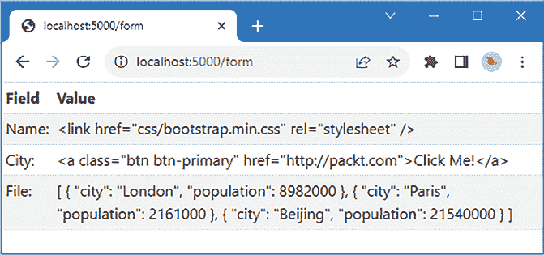

# 处理表单数据

在本章中，我演示了 Node.js 应用程序接收表单数据的方式，并解释了包括支持上传文件在内的差异。本章还解释了如何清理表单数据，以便它可以安全地包含在 HTML 文档中，以及在使用之前如何验证数据。*表 11.1*将本章置于上下文中。

表 11.1：将 HTML 表单置于上下文中

| 问题 | 答案 |
| --- | --- |
| 它们是什么？ | HTML 表单允许用户通过在表单字段中输入值来提供数据。 |
| 为什么它们有用？ | 表单是唯一一种可以以结构化方式从用户那里收集数据值的方式。 |
| 它们是如何使用的？ | HTML 文档包含一个`form`元素，该元素包含一个或多个允许输入数据的元素，例如`input`元素。 |
| 有没有陷阱或限制？ | 在将数据包含在 HTML 输出之前，必须对表单中输入的数据进行清理，并在应用程序使用之前进行验证。 |
| 有没有替代方案？ | 表单是高效地从用户那里收集数据的唯一方式。 |

*表 11.2* 总结了本章内容。

表 11.2：本章摘要

| 问题 | 解决方案 | 清单 |
| --- | --- | --- |
| 从用户那里接收数据。 | 使用配置为向服务器发送数据的 HTML 表单。 | *1-10* |
| 接收用于非幂等操作的数 据时。 | 配置表单使用 HTTP `POST`请求。 | *11, 12* |
| 接收复杂的数据，包括文件内容。 | 使用多部分表单编码。 | *13-16* |
| 防止用户数据被解释为 HTML 元素。 | 清理从用户接收到的数据。 | *17-21* |
| 确保应用程序接收到有用的数据。 | 验证从用户接收到的数据。 | *22-27, 30-32* |
| 向用户提供即时验证反馈。 | 在表单提交之前在浏览器中验证数据。 | *28-29* |

# 为本章做准备

本章使用了*第十章*中的`part2app`项目。在`part2app`文件夹中运行*清单 11.1*中显示的命令以删除不再需要的文件。

**提示**

您可以从[`github.com/PacktPublishing/Mastering-Node.js-Web-Development`](https://github.com/PacktPublishing/Mastering-Node.js-Web-Development)下载本章的示例项目——以及本书中所有其他章节的示例项目。有关运行示例时遇到问题的帮助，请参阅*第一章*。

清单 11.1：删除文件

```js
rm ./templates/**/*.handlebars
rm ./templates/**/*.custom
rm ./src/client/*_custom.js
rm ./src/server/*custom*.ts 
```

接下来，将`src/client`文件夹中`client.js`文件的内容替换为*清单 11.2*中显示的内容。

清单 11.2：`src/client`文件夹中`client.js`文件的内容

```js
document.addEventListener('DOMContentLoaded', () => {
    // do nothing
}); 
```

这只是一个占位符，直到本章的后面部分需要再次使用客户端代码时再替换。将`static`文件夹中`index.html`文件的 内容替换为*清单 11.3*中显示的元素。

清单 11.3：`static`文件夹中`index.html`文件的内容

```js
<!DOCTYPE html>
<html>
    <head>
        <script src="img/bundle.js"></script>
        <link href="css/bootstrap.min.css" rel="stylesheet" />
    </head>
    <body>
        <form>
            <div class="m-2">
                <label class="form-label">Name</label>
                <input name="name" class="form-control" />
            </div>
            <div class="m-2">
                <label class="form-label">City</label>
                <input name="city" class="form-control" />
            </div>
        </form>
    </body>
</html> 
```

HTML 文档包含一个简单的 HTML 表单，要求用户输入他们的姓名和城市。为了将处理表单的代码与应用程序的其他部分分开，请将一个名为 `forms.ts` 的文件添加到 `src/server` 文件夹中，其内容如 *列表 11.4* 所示。您不需要将表单代码分开；我这样做只是为了使示例更容易理解。

列表 11.4：src/server 文件夹中 forms.ts 文件的内容

```js
import { Express } from "express";
export const registerFormMiddleware = (app: Express) => {
    // no middleware yet
}
export const registerFormRoutes = (app: Express) => {
    // no routes yet
} 
```

*列表 11.5* 更新服务器以使用 *列表 11.4* 中定义的函数。

列表 11.5：在 src/server 文件夹中的 server.ts 文件中配置服务器

```js
import { createServer } from "http";
import express, {Express } from "express";
import { testHandler } from "./testHandler";
import httpProxy from "http-proxy";
import helmet from "helmet";
import { engine } from "express-handlebars";
import * as helpers from "./template_helpers";
**import { registerFormMiddleware, registerFormRoutes } from "./forms";**
const port = 5000;
const expressApp: Express = express();
const proxy = httpProxy.createProxyServer({
    target: "http://localhost:5100", ws: true
});
expressApp.set("views", "templates/server");
expressApp.engine("handlebars", engine());
expressApp.set("view engine", "handlebars");
expressApp.use(helmet());
expressApp.use(express.json());
**registerFormMiddleware(expressApp);**
**registerFormRoutes(expressApp);**
expressApp.get("/dynamic/:file", (req, resp) => {
    resp.render(`${req.params.file}.handlebars`,
        { message: "Hello template", req, helpers: { ...helpers } });
});
expressApp.post("/test", testHandler);
expressApp.use(express.static("static"));
expressApp.use(express.static("node_modules/bootstrap/dist"));
expressApp.use((req, resp) => proxy.web(req, resp));
const server = createServer(expressApp);
server.on('upgrade', (req, socket, head) => proxy.ws(req, socket, head));
server.listen(port,
    () => console.log(`HTTP Server listening on port ${port}`)); 
```

*列表 11.6* 从服务器端模板使用的布局中删除了一个辅助程序，并添加了一个由 webpack 创建的 JavaScript 包的 `script` 元素。本章的一些示例依赖于模板，删除辅助程序简化了模板渲染，而添加 `script` 元素将允许在从模板生成的内容中使用客户端代码。

列表 11.6：更改 templates/server/layouts 文件夹中的 main.handlebars 文件中的元素

```js
<!DOCTYPE html>
<html>
    <head>
        **<script src="img/strong>**/bundle.js"></script>** 
 **<link href="css/bootstrap.min.css" rel="stylesheet" />**
    </head>
    <body>
        {{{ body }}}
    </body>
</html>** 
```

**最后，在 `part2app` 文件夹中创建一个名为 `data.json` 的文件，其内容如 *列表 11.7* 所示。此文件将用于演示如何使用表单将文件发送到服务器**。

列表 11.7：part2app 文件夹中 data.json 文件的内容

```js
[
    { "city": "London", "population": 8982000 },
    { "city": "Paris", "population": 2161000 },
    { "city": "Beijing", "population": 21540000 }
] 
```

在 `part2app` 文件夹中运行 *列表 11.8* 中显示的命令以启动开发工具并开始监听 HTTP 请求。

列表 11.8：启动开发工具

```js
npm start 
```

打开一个网页浏览器并请求 `http://localhost:5000`。您将看到 *列表 11.3* 中定义的表单元素，其外观已使用 Bootstrap CSS 包进行样式化，如图 *图 11.1* 所示。


图 11.1：运行示例应用程序

# 接收表单数据

表单数据可以使用 HTTP `GET` 或 `POST` 请求发送，方法的选择决定了表单中包含的数据如何呈现。*列表 11.9* 完成表单以指定表单数据将发送到的 URL，并添加了使用不同 HTTP 方法提交表单数据的按钮。

列表 11.9：在静态文件夹中的 index.html 文件中完成表单

```js
<!DOCTYPE html>
<html>
    <head>
        <script src="img/bundle.js"></script>
        <link href="css/bootstrap.min.css" rel="stylesheet" />
    </head>
    <body>
       ** <form action="/form">**
            <div class="m-2">
                <label class="form-label">Name</label>
                <input name="name" class="form-control" />
            </div>
            <div class="m-2">
                <label class="form-label">City</label>
                <input name="city" class="form-control" />
            </div>                                    
            **<div class="m-2">**
 **<button class="****btn btn-primary" formmethod="get">**
 **Submit (GET)**
 **</button>**
 **<button class="btn btn-primary"** **formmethod="post">**
 **Submit (POST)**
 **</button>**
 **</div>**
        </form>
    </body>
</html> 
```

`form` 元素上的 `action` 属性元素告诉浏览器将表单数据发送到 `/form` URL。`button` 元素配置了 `formmethod` 属性，该属性指定浏览器应使用哪种 HTTP 方法。

**注意**

我正在使用应用于 `button` 元素的属性，以便以不同的方式处理相同表单数据。在后续的示例中，我采用了一种更传统的方法，并使用应用于 `form` 元素的属性。

## 从 GET 请求接收表单数据

`GET` 请求是接收表单数据的最简单方式，因为浏览器会将表单字段名称和值包含在 URL 查询字符串中。*列表 11.10* 定义了一个处理表单 `GET` 请求的处理程序。

清单 11.10：在 src/server 文件夹中的 forms.ts 文件中处理 `GET` 请求

```js
import { Express } from "express";
export const registerFormMiddleware = (app: Express) => {
    // no middleware yet
}
export const registerFormRoutes = (app: Express) => {
  **  app.get("****/form", (req, resp) => {**
 **for (const key in req.query) {**
 **resp.write(`${key}****: ${req.query[key]}\n`);** 
 **}**
 **resp.end();**
 **});**
} 
```

该路由使用 `get` 方法匹配发送到 `/form` URL 的 `GET` 请求。Express 解码 URL 查询字符串并通过 `Request.query` 属性呈现。在 *清单 11.10* 中，查询字符串参数和值用于生成响应。使用浏览器请求 `http://localhost:5000`，使用 `Alice Smith` 作为姓名和 `London` 作为城市填写表单，然后点击 **提交** (**GET**) 按钮。

浏览器将向 `/form` URL 发送 `GET` 请求，并包含在表单中输入的值，如下所示：

```js
http://localhost:5000/form?name=Alice+Smith&city=London 
```

数据将被服务器接收，查询字符串将被解析，表单数据将用于响应，如图 *图 11.2* 所示。


图 11.2：处理来自 `GET` 请求的表单数据

`GET` 请求的限制是它们必须是 *幂等的*，这意味着针对给定 URL 的每个请求都应该始终产生相同的效果，并始终返回相同的结果。换句话说，与 `GET` 请求一起发送的表单数据实际上是读取数据的请求，这些数据不期望随着每个请求而改变。

这很重要，因为 HTTP 缓存被允许存储 `GET` 请求的响应并使用它们来响应对同一 URL 的请求，这意味着某些请求可能不会被后端服务器接收。因此，大多数表单数据都是通过 `POST` 请求发送的，这些请求不会被缓存，但可能更复杂。

## 接收来自 POST 请求的表单数据

HTTP `POST` 请求在请求体中包含表单数据，在可以使用之前必须读取并解码。*清单 11.11* 添加了一个处理 `POST` 请求的路由，读取体并将其用作响应。

清单 11.11：在 src/server 文件夹中的 form.ts 文件中添加处理器

```js
import { Express } from "express";
export const registerFormMiddleware = (app: Express) => {
    // no middleware yet
}
export const registerFormRoutes = (app: Express) => {
    app.get("/form", (req, resp) => {
        for (const key in req.query) {
            resp.write(`${key}: ${req.query[key]}\n`);           
        }
        resp.end();
    });
   ** app.post("/form", (req, resp) => {**
 **resp.write****(`Content-Type: ${req.headers["content-type"]}\n`)**
 **req.pipe(resp);**
 **});**
} 
```

Node.js 和 Express 从 HTTP 请求中读取标头，并保留体以便它可以作为流读取。*清单 11.11* 中的新路由匹配发送到 `/form` 的 `POST` 请求，并创建包含请求的 `Content-Type` 标头和请求体的响应。

使用浏览器请求 `http://localhost:5000`，使用与上一节相同的详细信息填写表单，然后点击 **提交** (**POST**) 按钮。浏览器将发送一个包含请求体中表单数据的 `POST` 请求到服务器，生成如图 *图 11.3* 所示的响应。


图 11.3：处理来自 POST 请求的表单数据

浏览器已将 `Content-Type` 标头设置为 `application/x-www-form-urlencoded`，这表示表单数据值以与数据包含在查询字符串中相同的方式进行编码，使用 `=` 字符分隔名称-值对，并用 `&` 字符组合，如下所示：

```js
...
name=Alice+Smith&city=London
... 
```

您可以自己解码表单数据，但 Express 包含一个中间件，它可以检测 `Content-Type` 标头并将表单数据解码成一个键/值映射。*列表 11.12* 启用了中间件并使用它生成的数据在响应中。

列表 11.12：在 src/server 文件夹中的 forms.ts 文件中使用 Express 中间件

```js
import express, { Express } from "express";
export const registerFormMiddleware = (app: Express) => {
    **app.use(express.urlencoded({extended: true}))**
}
export const registerFormRoutes = (app: Express) => {
    app.get("/form", (req, resp) => {
        for (const key in req.query) {
            resp.write(`${key}: ${req.query[key]}\n`);           
        }
        resp.end();
    });
    app.post("/form", (req, resp) => {
        resp.write(`Content-Type: ${req.headers["content-type"]}\n`)
        **for (const key in req.body) {**
 **resp.write(`****${key}: ${req.body[key]}\n`);** 
 **}** 
 **resp.end();**
    });
} 
```

中间件组件是通过 `Express.urlencoded` 方法创建的，并使用所需的 `extended` 配置选项来指定是否使用与解析查询字符串相同的库来处理请求体，或者，如这里所示，使用一个更复杂的选项，允许处理更复杂的数据类型。

要查看解码后的数据，请请求 `http://localhost:5000`，填写表单，并点击 **提交**（**POST**）按钮。将显示单个表单元素名称和值，而不是 URL 编码的字符串，如下所示：

```js
...
Content-Type: application/x-www-form-urlencoded
**name: Alice Smith**
**city: London**
... 
```

### 接收多部分数据

`application/x-www-form-urlencoded` 格式是默认格式，适用于从用户那里收集基本数据值。对于用户提交文件的表单，使用 `multipart/form-data` 格式，这种格式更复杂，但允许在 HTTP 请求体中发送多种数据类型。*列表 11.13* 添加了一个 `input` 元素，允许用户选择文件，并在使用 `multipart/form-data` 格式提交数据的 HTML 表单中添加了一个按钮。

列表 11.13：在静态文件夹中的 index.html 文件中添加元素

```js
<!DOCTYPE html>
<html>
    <head>
        <script src="img/bundle.js"></script>
        <link href="css/bootstrap.min.css" rel="stylesheet" />
    </head>
    <body>
        <form action="/form">
            <div class="m-2">
                <label class="form-label">Name</label>
                <input name="name" class="form-control" />
            </div>
           ** <div class="m-2">**
 **<label class****="form-label">City</label>**
 **<input name="city" class="form-control" />**
**</div> **                 
            <div class="m-2">
                <label class="form-label">File</label>
                <input name="datafile" type="file" class="form-control" />
            </div>
            <div class="m-2">
                <button class="btn btn-primary" formmethod="get">
                    Submit (GET)
                </button>
                <button class="btn btn-primary" formmethod="post">
                    Submit (POST)
                </button>
                **<button class="btn btn-primary" formmethod="post"**
 **formenctype="multipart/form-data"****>**
 **Submit (POST/MIME)**
 **</button>**
            </div>
        </form>
    </body>
</html> 
```

新的 `input` 元素有一个设置为 `file` 的 `type` 属性，这告诉浏览器应该向用户展示一个选择文件的元素。

*列表 11.14* 更新了表单处理程序，以便 `application/x-www-form-urlencoded` 和 `multipart/form-data` 请求被不同地处理，这对于影响浏览器处理文件的方式非常重要。

列表 11.14：在 src/server 文件夹中的 forms.ts 文件中选择内容类型

```js
import express, { Express } from "express";
export const registerFormMiddleware = (app: Express) => {
    app.use(express.urlencoded({extended: true}))
}
export const registerFormRoutes = (app: Express) => {
    app.get("/form", (req, resp) => {
        for (const key in req.query) {
            resp.write(`${key}: ${req.query[key]}\n`);           
        }
        resp.end();
    });
    app.post("/form", (req, resp) => {
        resp.write(`Content-Type: ${req.headers["content-type"]}\n`)
        **if (req.headers["content-type"]?.startsWith("multipart/form-data"****)) {**
 **req.pipe(resp);**
 **} else {**
            for (const key in req.body) {
                resp.write(`${key}: ${req.body[key]}\n`);           
            }       
            resp.end();
        }
    });
} 
```

使用浏览器请求 `http://localhost:5000` 并填写表单，选择本章开头创建的 `data.json` 文件作为 `文件` 字段。表单编码决定了浏览器如何处理文件。点击 **提交**（**POST**）以使用 `application/x-www-form-urlencoded` 编码发送表单，点击 **提交（POST/MIME**）按钮以使用 `multipart/form-data` 编码发送表单。两种结果都显示在 *图 11.4* 中。


图 11.4：以不同编码发送表单数据

对于 `application/x-www-form-urlencoded` 编码，浏览器只包括文件名，如下所示：

```js
...
Content-Type: application/x-www-form-urlencoded
name: Alice
city: London
**datafile: data.json**
... 
```

`multipart/form-data` 编码确实包括文件内容，但为了这样做，请求体的结构变得更加复杂，如下所示：

```js
...
Content-Type: multipart/form-data; boundary=----WebKitFormBoundary41AOY4gvNpCTJzUy
------WebKitFormBoundary41AOY4gvNpCTJzUy
Content-Disposition: form-data; name="name"
Alice
------WebKitFormBoundary41AOY4gvNpCTJzUy
Content-Disposition: form-data; name="city"
London
------WebKitFormBoundary41AOY4gvNpCTJzUy
Content-Disposition: form-data; name="datafile"; filename="data.json"
Content-Type: application/json
[
    { "city": "London", "population": 8982000 },
    { "city": "Paris", "population": 2161000 },
    { "city": "Beijing", "population": 21540000 }
]
------WebKitFormBoundary41AOY4gvNpCTJzUy--
... 
```

请求体包含多个部分，每个部分都由一个边界字符串分隔，该字符串包含在 `Content-Type` 标头中：

```js
...
Content-Type: multipart/form-data; b**oundary=----WebKitFormBoundary41AOY4gvNpCTJzUy**
... 
```

每个正文部分可以包含不同类型的数据，并附带描述内容的头信息。在文件正文部分的情况下，头信息提供了表单字段赋予的名称、已选择的文件名称以及文件中的内容类型：

```js
...
Content-Disposition: form-data; name="datafile"; filename="data.json"
Content-Type: application/json
... 
```

`multipart/form-data` 编码可以手动解码，但这不是一个好主意，因为多年来已经出现了许多不符合规范的实现，这些实现需要特殊处理或解决方案。Express 不包括内置的 `multipart/form-data` 请求处理支持，但有几个 JavaScript 包可以做到这一点。一个选项是 Multer ([`github.com/expressjs/multer`](https://github.com/expressjs/multer)，它与 Express 工作得很好)。运行 *列表 11.15* 中显示的命令来安装 Multer 包以及描述它为 TypeScript 提供的 API 的类型定义。

列表 11.15：安装包

```js
npm install multer@1.4.5-lts.1
npm install --save-dev @types/multer@1.4.11 
```

*列表 11.16* 配置了 Multer 包并将其应用于表单处理器。

列表 11.16：在 src/server 文件夹中的 forms.ts 文件中处理多部分请求

```js
import express, { Express } from "express";
**import multer from "multer";**
**const fileMiddleware = multer({storage: multer.memoryStorage()});**
export const registerFormMiddleware = (app: Express) => {
    app.use(express.urlencoded({extended: true}))
}
export const registerFormRoutes = (app: Express) => {
    app.get("/form", (req, resp) => {
        for (const key in req.query) {
            resp.write(`${key}: ${req.query[key]}\n`);
        }
        resp.end();
    });
 **   app.post("/form", fileMiddleware.single("datafile"), (req, resp) => {**
        resp.write(`Content-Type: ${req.headers["content-type"]}\n`)
        for (const key in req.body) {
            resp.write(`${key}: ${req.body[key]}\n`);
        }
       ** if (req.file) {**
 **resp.write(`---\nFile: ${req.file.originalname}\n`);**
 **resp.write(req.file.****buffer.toString());** 
 **}**

        resp.end();
    });
} 
```

在可以使用 Multer 之前，必须告诉它可以存储它接收到的文件的位置。该包提供了两种存储选项，即将文件写入磁盘文件夹或将文件数据存储在内存中。如 *第一部分* 中所述，写入文件系统时必须小心，应尽可能避免。如果您确实需要存储用户数据，那么我的建议是使用数据库，如 *第十二章* 中所述。

*列表 11.16* 使用基于内存的存储选项创建一个中间件组件，该组件将处理 `multipart/form-data` 请求。与大多数其他中间件不同，Multer 包应用于特定的路由，以防止恶意用户在预期之外的路由上上传文件：

```js
...
app.post("/form", **fileMiddleware.single("datafile")**, (req, resp) => {
... 
```

此语句将 Multer 中间件应用于仅一个路由，并查找名为 `datafile` 的字段中的文件，该字段与 HTML 表单中 `input` 元素的名称属性匹配。

中间件读取请求正文，并通过 `file` 属性创建一个可以读取上传文件详细信息的接口，其中最有用的属性在 *表 11.3* 中描述。非文件正文部分将通过 `body` 属性呈现。

表 11.3：有用的文件描述属性

| 名称 | 描述 |
| --- | --- |

|

```js
`originalname` 
```

| 此属性返回用户系统上文件的名称。 |
| --- |

|

```js
`size` 
```

| 此属性返回文件的字节数。 |
| --- |

|

```js
`mimetype` 
```

| 此属性返回文件的 MIME 类型。 |
| --- |

|

```js
`buffer` 
```

| 此属性返回包含整个文件的 Buffer。 |
| --- |

要查看中间件的效果，请请求 `http://localhost:5000`，填写 `name` 和 `city` 表单字段，选择 `data.json` 文件，然后点击 **提交**（**POST/MIME**）按钮。响应包括正文和文件属性的值，如 *图 11.5* 所示。


图 11.5：上传文件

# 清理表单数据

不仅应该对用户发送的文件保持警惕：任何数据都有可能引起问题。最常见的问题是跨站脚本攻击（**XSS**），其中数据值被精心制作，以便浏览器将其解释为 HTML 元素或 JavaScript 代码。在 *第七章* 中，我演示了如何使用内容安全策略（CSP）来帮助防止 XSS，通过告诉浏览器应用程序预期如何行为。但另一个很好的措施是对从用户那里接收到的数据进行清理，以确保它不包含浏览器在显示给其他用户时意外解释的字符。为了准备，*清单 11.17* 更改了表单处理程序，使其返回 HTML 响应。

清单 11.17：在 src/server 文件夹中的 forms.ts 文件中返回 HTML 响应

```js
import express, { Express } from "express";
import multer from "multer";
const fileMiddleware = multer({storage: multer.memoryStorage()});
export const registerFormMiddleware = (app: Express) => {
    app.use(express.urlencoded({extended: true}))
}
export const registerFormRoutes = (app: Express) => {
    app.get("/form", (req, resp) => {
        for (const key in req.query) {
            resp.write(`${key}: ${req.query[key]}\n`);           
        }
        resp.end();
    });
    app.post("/form", fileMiddleware.single("datafile"), (req, resp) => {
    **    resp.setHeader("Content-Type", "text/html");**
**for (const key in req.body) {**
 **resp.write(`<div>${key}: ${req.body[key]}</div>`);** 
 **}** 
 **if (req.file) {**
 **resp.****write(`<div>File: ${req.file.originalname}</div>`);**
 **resp.write(`<div>${req.file.buffer.toString()}</div>`);** 
 **}**

 **resp.end();**
    });
} 
```

通过请求 `http://localhost:5000`，使用与之前示例相同的详细信息填写表单，并点击 **提交（POST/MIME）** 按钮，你可以看到 HTML 输出的简单和未加样式，如图 *图 11.6* 所示。


图 11.6：生成 HTML 响应

要查看不安全内容的效果，请回到 `http://localhost:5000` 并使用 *表 11.4* 中的值填写表单。

表 11.4：不安全的内容值

| 字段 | 描述 |
| --- | --- |
| `名称` |

```js
`<link href="css/bootstrap.min.css" rel="stylesheet" />` 
```

|

| `城市` |
| --- |

```js
`<a class="btn btn-primary" href="http://packt.com">Click Me!</a>` 
```

|

点击 **提交（POST/MIME）**，表单中输入的值将被包含在响应中，浏览器将其解释为 Bootstrap CSS 样式表的 `link` 元素和一个样式化为按钮的锚点元素，它将请求不属于应用程序的 URL，如图 *图 11.7* 所示。


图 11.7：显示不安全内容的效果

清理过程涉及将表示 HTML 内容的字符替换为显示相同字符的转义序列。*表 11.5* 列出了通常需要清理的字符及其替换的转义序列。

表 11.5：不安全字符和转义序列

| 不安全字符 | 转义序列 |
| --- | --- |

|

```js
`&` 
```

|

```js
`&amp;` 
```

|

|

```js
`<` 
```

|

```js
`&lt;` 
```

|

|

```js
`>` 
```

|

```js
`&gt;` 
```

|

|

```js
`=` 
```

|

```js
`&#x3D;` 
```

|

|

```js
`" (double quotes)` 
```

|

```js
`&quot;` 
```

|

|

```js
`' (single quote)` 
```

|

```js
`&#x27;` 
```

|

|

```js
`` ` (back tick) `` 
```

|

```js
`&#x60;` 
```

|

将名为 `sanitize.ts` 的文件添加到 `src/server` 文件夹中，其内容如 *清单 11.18* 所示。

清单 11.18：src/server 文件夹中 sanitize.ts 文件的内容

```js
const matchPattern = /[&<>="'`]/g;
const characterMappings: Record<string, string> = {
    "&": "&amp;",
    "<": "&lt;",
    ">": "&gt;",
    "\"": "&quot;",
    "=": "&#x3D;",   
    "'": "&#x27;",
    "`": "&#x60;"
};
export const santizeValue = (value: string) =>
    value?.replace(matchPattern, match => characterMappings[match]); 
```

`sanitizeValue` 函数将一个模式应用于字符串以查找危险字符，并将它们替换为安全的转义序列。数据值在包含在 HTML 响应中时会被清理。这通常作为模板过程的一部分完成——我将很快演示——但 *清单 11.19* 将 `sanitizeValue` 函数应用于 HTML 响应中包含的值。

清单 11.19：在 src/server 文件夹中的 forms.ts 文件中清理输出值

```js
import express, { Express } from "express";
import multer from "multer";
**import { santizeValue } from "./sanitize";**
const fileMiddleware = multer({storage: multer.memoryStorage()});
export const registerFormMiddleware = (app: Express) => {
    app.use(express.urlencoded({extended: true}))
}
export const registerFormRoutes = (app: Express) => {
    app.get("/form", (req, resp) => {
        for (const key in req.query) {
           ** resp.write(`${key}: ${req.query[key]}\n`); **          
        }
        resp.end();
    });
    app.post("/form", fileMiddleware.single("datafile"), (req, resp) => {
        resp.setHeader("Content-Type", "text/html");
        for (const key in req.body) {
            **resp.write****(`<div>${key}: ${ santizeValue( req.body[key])}</div>`);**
        }       
        if (req.file) {
            resp.write(`<div>File: ${req.file.originalname}</div>`);
            **resp.write****(`<div>${santizeValue(req.file.buffer.toString())}</div>`);**
        }

        resp.end();
    });
} 
```

使用浏览器请求 `http://localhost:5000`，填写 *表 11.5* 中的详细信息，并点击 **提交（POST/MIME）** 按钮。从用户接收到的值在包含在 HTML 响应中时会被清理，以便浏览器可以显示字符串而不将其解释为有效元素，如 *图 11.8* 所示。


图 11.8：清理数据值

**反复清理数据**

您必须确保数据被清理，但您应该只清理一次。如果数据被反复清理，那么 `&` 字符将被反复转义。如果您从一个不安全的字符串开始，例如：

```js
`<link href="css/bootstrap.min.css" rel="stylesheet" />` 
```

并对其进行清理，结果将如下所示：

```js
`&lt;link href&#x3D;&quot;css/bootstrap.min.css&quot; rel&#x3D;&quot;stylesheet&quot; /&gt;` 
```

危险字符已被转义，但浏览器将解释转义序列，使得字符串看起来像原始字符串，但不会将其解释为 HTML 元素。如果再次清理字符串，已经是转义序列一部分的 `&` 字符将被替换为 `&amp;`，产生以下结果：

```js
`&amp;lt;link href&amp;#x3D;&amp;quot;css/bootstrap.min.css&amp;quot; rel&amp;#x3D;&amp;quot;stylesheet&amp;quot; /&amp;gt;` 
```

浏览器无法正确解释转义序列，并将显示一个混乱的字符串。

大多数模板包在渲染模板时都会自动清理数据值，这包括在 *第十章* 中添加到项目中的 Handlebars 包。将一个名为 `formData.handlebars` 的文件添加到 `templates/server` 文件夹中，其内容如 *列表 11.20* 所示。

列表 11.20：`templates/server` 文件夹中 `formData.handlebars` 文件的内容

```js
<table class="table table-sm table-striped">
    <thead>
        <tr><th>Field</th><th>Value</th></tr>
    </thead>
    <tbody>
        <tr><td>Name:</td><td>{{ name }} </td></tr>
        <tr><td>City:</td><td>{{ city }} </td></tr>
        <tr><td>File:</td><td>{{ fileData }} </td></tr>
    </tbody>
</table> 
```

Handlebars 自动在 `{{` 和 `}}` 表达式中清理数据值，使其在 HTML 响应中包含时更安全。*列表 11.21* 更新了表单请求处理程序以使用新的模板。

列表 11.21：在 `server/src` 文件夹中的 `forms.ts` 文件中使用模板

```js
import express, { Express } from "express";
import multer from "multer";
import { santizeValue } from "./sanitize";
const fileMiddleware = multer({storage: multer.memoryStorage()});
export const registerFormMiddleware = (app: Express) => {
    app.use(express.urlencoded({extended: true}))
}
export const registerFormRoutes = (app: Express) => {
    app.get("/form", (req, resp) => {
        for (const key in req.query) {
            resp.write(`${key}: ${req.query[key]}\n`);           
        }
        resp.end();
    });
    app.post("/form", fileMiddleware.single("datafile"), (req, resp) => {
        **resp.render****("formData", {**
 **...req.body, file: req.file,**
 **fileData: req.file?.buffer.toString()**
 **});**
    });
} 
```

传递给模板的上下文对象包含来自 `body` 和 `file` 对象的属性以及一个 `fileData` 属性，它提供了对文件数据的直接访问，因为 Handlebars 不会在模板中评估代码片段。请求 `http://localhost:5000`，使用 *表 11.21* 中的详细信息填写表单，并点击 **提交（POST/MIME）** 按钮，您将看到模板包含安全值，如 *图 11.9* 所示。

**提示**

Handlebars 将始终在 `{{ }}` 表达式中清理数据值。如果您想在不进行清理的情况下包含数据，请使用 `{{{` 和 `}}}` 字符序列，如 *第十章* 中所示。



图 11.9：使用模板清理数据值

**注意**

当与内容安全策略结合使用时，在 HTML 模板中清洗数据是针对 XSS 攻击的良好基本防御措施。但这并不全面，潜在问题可能仍然存在，例如在将用户数据值插入由浏览器执行的 JavaScript 代码中。避免此类问题的良好清单可以在 [`cheatsheetseries.owasp.org/cheatsheets/Cross_Site_Scripting_Prevention_Cheat_Sheet.html`](https://cheatsheetseries.owasp.org/cheatsheets/Cross_Site_Scripting_Prevention_Cheat_Sheet.html) 找到。

# 验证表单数据

清洗数据可以帮助防止恶意值显示给用户，但这并不意味着你接收到的数据将是有用的。用户可能会在表单中输入几乎所有内容，有时是因为真正的错误，但大多数情况下是因为表单是用户与其目标之间的一个不受欢迎的障碍，无论这个目标是什么。

结果是，从表单接收到的数据必须进行 *验证*，这是一个确保数据可以被应用程序使用并告知用户何时接收到无效数据的过程。使用模板进行表单验证最为简单，因为它使得在出现问题时向用户提供反馈变得容易。为了准备验证，将一个名为 `age.handlebars` 的文件添加到 `templates/server` 文件夹中，其内容如 *列表 11.22* 所示。

列表 11.22：在 templates/server 文件夹中的 age.handlebars 文件的内容

```js
<div class="m-2">
    {{#if nextage }}
        <h4>Hello {{name}}. You will be {{nextage}} next year.</h4>
    {{/if }}
</div>
<div>
    <form action="/form" method="post">
        <div class="m-2">
            <label class="form-label">Name</label>
            <input name="name" class="form-control" value="{{name}}"/>
        </div>
        <div class="m-2">
            <label class="form-label">Current Age</label>
            <input name="age" class="form-control" value="{{age}}" />
        </div>                  
        <div class="m-2">
            <button class="btn btn-primary">Submit</button>                               
        </div>
    </form>
</div> 
```

此模板包含一个询问用户姓名和年龄的表单，以便服务器可以计算他们明年的年龄。这是一个极其简单的应用程序，但它包含了足够的功能，需要验证。*列表 11.23* 更新了 `/form` URL 的路由，以使用新的模板。

列表 11.23：在 src/server 文件夹中的 forms.ts 文件中更新路由

```js
import express, { Express } from "express";
**// import multer from "multer";**
**// import { santizeValue } from "./sanitize";**
**//const fileMiddleware = multer({storage: multer.memoryStorage()});**
export const registerFormMiddleware = (app: Express) => {
    app.use(express.urlencoded({extended: true}))
}
export const registerFormRoutes = (app: Express) => {
 **app.get("/form", (req, resp) => {**
 **resp.render("age");**
 **});**
 **app.post("****/form", (req, resp) => {**
 **resp.render("age", {**
 **...req.body,**
 **nextage: Number.parseInt(req.body.****age) + 1**
 **});**
 **});**
} 
```

`get` 路由不带有上下文数据渲染年龄模板。`post` 路由使用表单数据渲染模板，这些数据包含在请求体中，并有一个 `nextage` 属性，该属性通过将表单接收到的 `age` 值解析为 `Number` 并加一来创建。使用浏览器请求 `http://localhost:5000/form`，在表单中输入姓名和年龄，然后点击 **提交** 按钮。如果你重复此过程但提供一个非数字年龄，应用程序将无法解析表单数据，并且不会产生结果。这两种结果都在 *图 11.10* 中展示。


图 11.10：使用表单数据生成结果的程序

应用程序对其接收到的数据有期望，验证是确保这些期望得到满足的过程。

**注意**

验证是让用户填写表单的一种方式，但你应该花点时间考虑表单是否真的应该存在。如果你想提高用户对应用程序的满意度，那么请保持表单简单明了，只请求完成任务所需的最基本信息。对于复杂数据值（如信用卡号码或日期）的格式，要灵活，并尽可能使验证错误信息清晰易懂。

## 创建自定义验证器

验证需要一套可以应用于接收到的表单数据的测试集。将一个名为 `validation.ts` 的文件添加到 `src/server` 文件夹中，其内容如 *清单 11.24* 所示。

清单 11.24：src/server 文件夹中 validation.ts 文件的内容

```js
import { NextFunction, Request, Response } from "express";
type ValidatedRequest = Request & {
    validation: {
        results:  { [key: string]: {
            [key: string]: boolean, valid: boolean
        } },
        valid: boolean
    }
}
export const validate = (propName: string) => {
    const tests: Record<string, (val: string) => boolean> = {};
    const handler = (req: Request, resp: Response, next: NextFunction ) => {
        // TODO - perform validation checks
        next();
    }
    handler.required = () => {
        tests.required = (val: string) => val?.trim().length > 0;
        return handler;
    };
    handler.minLength = (min: number) => {
        tests.minLength = (val:string) => val?.trim().length >= min;
        return handler;
    };
    handler.isInteger = () => {
        tests.isInteger = (val: string) => /^[0-9]+$/.test(val);
        return handler;
    }
    return handler;
}
export const getValidationResults = (req: Request) => {
    return (req as ValidatedRequest).validation || { valid : true }
} 
```

实现验证系统有许多方法，但 *清单 11.24* 中采用的方法是遵循本书此部分使用的其他包引入的模式，并创建一个向 `Request` 对象添加属性的 Express 中间件。代码尚未完成，因为它不应用验证检查。但它确实允许定义验证要求，这是一个好起点，因为执行验证所需的代码可能很复杂。

初始代码定义了三个验证规则：`required`、`minLength` 和 `isInteger`。真正的验证包，如我在本章后面介绍的那个，有几十种不同的规则，但三个就足以演示表单数据验证的工作原理。`required` 规则确保用户已提供值，`minLength` 规则强制最小字符数，而 `isInteger` 规则确保值是整数。

起始点是给 TypeScript 描述将要添加到 `Request` 对象的属性，这是验证结果将如何呈现给请求处理器函数的方式：

```js
...
type ValidatedRequest = Request & {
    validation: {
        results:  { [key: string]: {
            [key: string]: boolean, valid: boolean
        } },
        valid: boolean
    }
}
... 
```

`ValidatedRequest` 类型具有由 `Request` 定义的 所有功能，以及一个名为 `validation` 的属性，该属性返回一个包含 `results` 和 `valid` 属性的对象。`valid` 属性返回一个 `boolean` 值，给出表单数据验证结果的整体指示。`results` 属性提供了关于已验证的表单数据字段的详细信息。目标是生成一个看起来像这样的对象：

```js
...
{
  results: {
    name: { valid: false, required: true, minLength: false },
    age: { valid: true, isNumber: true }
  },
  valid: false
}
... 
```

此对象表示对 `name` 和 `age` 属性进行的验证检查。总体而言，表单数据无效，通过检查细节，你可以看到这是由于 `name` 属性未能通过验证检查，具体是因为名称值未通过 `minLength` 规则。

`validate` 函数返回一个 Express 中间件函数，该函数也有方法，允许通过链式组合属性验证规则来定义验证。`getValidationResults` 读取请求中添加的 `validation` 属性，使得在请求处理器中访问验证数据变得容易。

## 应用验证规则

创建一个既有方法又有函数的函数利用了 JavaScript 的灵活性，因此可以通过调用 `validate` 方法来选择表单字段，然后可以在结果上调用方法来指定验证规则。这不是必需的，但它确实允许简洁地表达验证要求，如图 *列表 11.25* 所示。

列表 11.25：在 `src/server` 文件夹中的 `forms.ts` 文件中定义验证规则

```js
import express, { Express } from "express";
**import { getValidationResults, validate } from "****./validation";**
export const registerFormMiddleware = (app: Express) => {
    app.use(express.urlencoded({extended: true}))
}
export const registerFormRoutes = (app: Express) => {
    app.get("/form", (req, resp) => {
       **resp.render("age", {** **helpers: { pass }});**
    });
    app.post("/form",
           ** validate("name").required().minLength(5),**
 **validate("age").****isInteger(),**
        (req, resp) => {
            **const validation = getValidationResults(req);**
 **const context = { ...req.body, validation,**
 **helpers: { pass }**
 **};**
 **if (validation.****valid) {**
 **context.nextage = Number.parseInt(req.body.age) + 1;**
 **}**
 **resp.render("age", context);** 
        });
}
**const** **pass = (valid: any, propname: string, test: string ) => {**
 **let propResult = valid?.results?.[propname];**
 **return `display:${!propResult || propResult[test] ? "none" : "block" }`;**
} 
```

调用规则方法的结果是定义它的处理函数，这意味着可以通过链式调用方法来选择多个规则。*列表 11.25* 将 `required` 和 `minLength` 规则应用到 `name` 字段，将 `isInteger` 规则应用到 `age` 字段。

在处理函数内部调用 `getValidationResults` 函数以获取验证结果，这些结果用于更改用于渲染视图的上下文对象，以便仅在收到用户的有效数据时才执行（简单的）计算。

验证结果包含在模板上下文对象中，这允许模板助手检查结果并控制验证错误元素的可见性。显示错误给用户的元素将始终存在于模板中，*列表 11.25* 定义了一个名为 `pass` 的模板助手，它将被用来控制可见性。

*列表 11.26* 更新了模板以包含错误消息元素。

列表 11.26：在模板文件夹中的 `age.handlebars` 文件中添加验证消息

```js
<div class="m-2">
   ** {{#if validation.valid }}**
        <h4>Hello {{name}}. You will be {{nextage}} next year.</h4>
    {{/if }}
</div>
<div>
   ** <form id="age_form" action="/form" method="post">**
        <div class="m-2">
            <label class="form-label">Name</label>
            <input name="name" class="form-control" value="{{name}}"/>
            **<div class="****text-danger" id="err_name_required"**
 **style="{{ pass validation 'name' 'required' }}">**
 **Please enter your name**
 **</div>**
 **<div class="****text-danger" id="err_name_minLength"**
 **style="{{ pass validation 'name' 'minLength' }}">**
 **Enter at least 5 characters**
 **</div>**
        </div>
        <div class="m-2">
            <label class="form-label">Current Age</label>
            <input name="age" class="form-control" value="{{age}}" />
            **<div class****="text-danger" id="err_age_isInteger"**
 **style="{{ pass validation 'age' 'isInteger' }}">**
 **Please enter your age in whole years**
 **</div>**
        </div>
        <div class="m-2">
            <button class="btn btn-primary">Submit</button>
        </div>
    </form>
</div> 
```

新增功能确保只有在表单数据有效时才显示结果，并在有问题时显示验证错误。在模板中包含错误元素将有助于客户端验证，这在本章后面的部分将演示。

## 验证数据

最后一步是通过将测试应用到值上来完成自定义验证器，如图 *列表 11.27* 所示。

列表 11.27：在 `src/server` 文件夹中的 `validation.ts` 文件中完成验证器

```js
...
export const validate = (propName: string) => {
    const tests: Record<string, (val: string) => boolean> = {};
    const handler = (req: Request, resp: Response, next: NextFunction ) => {
        **const vreq = req as ValidatedRequest;**
 **if (!vreq.validation) {**
 **vreq.validation = { results: {}, valid: true };**
 **}**
 **vreq.****validation.results[propName] = { valid: true };**
 **Object.keys(tests).forEach(k => {**
 **let valid = vreq.validation****.results[propName][k]**
 **= testsk;**
 **if (!valid) {**
 **vreq.validation.results[propName].valid = false;**
 **vreq.validation.valid = false****;**
 **}**
 **});**
        next();
    }
    handler.required = () => {
        tests.required = (val: string) => val?.trim().length > 0;
        return handler;
    };
... 
```

我将这一步留到后面，以便使验证系统的其他部分更容易理解。每次调用验证规则方法，例如 `required`，都会向名为 `tests` 的常量所分配的对象中添加一个新属性。为了执行验证，枚举 `tests` 属性，执行每个测试，并使用结果来构建验证结果。如果任何验证测试失败，则整体验证结果和当前字段值的验证结果都将设置为 `false`。

使用浏览器请求 `http://localhost:5000` 并点击 `提交` 按钮，无需在表单字段中输入值。验证将失败，并将显示错误消息给用户，如图 *图 11.11* 所示。


图 11.11：显示验证错误

对于每个失败的验证规则，都会显示一条错误消息，并且后端服务器只有在验证成功后才会生成正常响应。

# 执行客户端验证

客户端验证在表单提交之前检查表单值，这可以为用户提供即时反馈。除了服务器端验证外，客户端验证也被使用，因为用户可能会禁用客户端 JavaScript 代码或手动提交表单数据。

**理解内置的 HTML 客户端验证功能**

HTML 支持在输入元素上使用验证属性，以及一个允许接收验证事件的 JavaScript API，这两者都在 [`developer.mozilla.org/en-US/docs/Learn/Forms/Form_validation`](https://developer.mozilla.org/en-US/docs/Learn/Forms/Form_validation) 中进行了描述。这些功能可能很有用，但它们并不总是得到一致的实施，并且仅提供基本的验证检查。创建一个更全面的验证系统只需要做一点额外的工作，这就是为什么它们在本章中没有使用。

客户端开发的关键是一致性。这可以通过使用相同的包进行客户端和服务器端验证来实现，这是我在下一节中采取的方法。否则，重要的是要确保字段以相同的方式进行验证并产生相同的错误消息。将名为 `client_validation.js` 的文件添加到 `src/client` 文件夹中，其中包含 *列表 11.28* 中显示的代码。

列表 11.28：src/client 文件夹中 client_validation.js 文件的内容

```js
export const validate = (propName, formdata) => {
    const val = formdata.get(propName);
    const results = { };

    const validationChain = {
        get propertyName() { return propName},
        get results () { return results }
    };
    validationChain.required = () => {
        results.required = val?.trim().length > 0;
        return validationChain;
    }
    validationChain.minLength = (min) => {
        results.minLength = val?.trim().length >= min;
        return validationChain;
    };
    validationChain.isInteger = () => {
        results.isInteger = /^[0-9]+$/.test(val);
        return validationChain;
    }
    return validationChain;
} 
```

这段 JavaScript 代码遵循与 *列表 11.24* 中用于设置验证测试链的 TypeScript 代码相似的格式，尽管没有集成到 Express 中。*列表 11.29* 更新了客户端代码以验证表单数据。

列表 11.29：src/client 文件夹中 client.js 文件中的验证表单数据

```js
import { validate } from "./client_validation";
document.addEventListener('DOMContentLoaded', () => {
    document.getElementById("age_form").onsubmit = (ev => {
        const data = new FormData(ev.target);
        const nameValid = validate("name", data)
            .required()
            .minLength(5);
        const ageValid = validate("age", data)
            .isInteger();
        const allValid = [nameValid, ageValid].flatMap(v_result =>
            Object.entries(v_result.results).map(([test, valid]) => {
                const e = document.getElementById(
                        `err_${v_result.propertyName}_${test}`);
                e.classList.add("bg-dark-subtle");
                e.style.display = valid ? "none" : "block";                      
                return valid
            })).every(v => v === true);
        if (!allValid) {
            ev.preventDefault();
        }
    });
}); 
```

此代码在 HTML 文档中定位表单元素，并为 `submit` 事件注册一个处理程序，该事件在用户点击 **提交** 按钮时触发。浏览器使用 `FormData` API 获取表单中的数据，这些数据使用 *列表 11.28* 中定义的验证函数进行测试。验证结果用于更改模板中错误消息元素的可见性。如果有任何验证错误，则在提交事件上调用 `preventDefault` 方法，这告诉浏览器不要将数据发送到服务器。*列表 11.29* 保留了表达验证要求的相同风格，这导致处理结果、查找对应于每个已执行测试的元素以及设置元素可见性的代码变得密集。

在此示例中，当客户端 JavaScript 代码处理错误消息元素时，会将它们添加到 Bootstrap CSS 类中，只是为了强调错误是由客户端而不是服务器显示的。

使用浏览器请求 `http://localhost:5000/form` 并点击 **提交** 按钮，不填写表单。错误消息元素将被显示，但带有实心背景色，表明它们是由客户端代码显示的，如 *图 11.12* 所示。


图 11.12：使用客户端验证

# 使用验证包进行验证

在演示了服务器端和客户端表单验证的工作原理后，现在是时候用经过充分测试和全面的验证库提供的验证替换自定义检查了。

就像 JavaScript 功能的大部分领域一样，有许多库可供选择，而我为这一章选择的 `validator.js` 库简单有效，既可以用于客户端验证，也可以用于服务器端验证。在 `part2app` 文件夹中运行 *列表 11.30* 中显示的命令来安装包。

列表 11.30：安装验证包

```js
npm install validator@13.11.0
npm install --save-dev @types/validator@13.11.5 
```

*列表 11.31* 更新了客户端验证代码，以使用 `validator.js` 包提供的测试。

列表 11.31：在 src/client 文件夹中的 client_validation.js 文件中使用验证包

```js
**import validator from "validator";**
export const validate = (propName, formdata) => {
    const val = formdata.get(propName);
    const results = { };

    const validationChain = {
        get propertyName() { return propName},
        get results () { return results }
    };
    validationChain.required = () => {
        **results.required = !validator.isEmpty(val, { ignore_whitespace: true});**
        return validationChain;
    }
    validationChain.minLength = (min) => {
        **results.minLength = validator.isLength(val, { min});**
        return validationChain;
    };
    validationChain.isInteger = () => {
        **results.isInteger = validator.isInt(val);**
 return validationChain;
    }
    return validationChain;
} 
```

`validator.js` 包提供的完整测试集可以在 [`github.com/validatorjs/validator.js`](https://github.com/validatorjs/validator.js) 找到，而 *列表 11.31* 使用了这些测试中的三个来替换自定义逻辑，其余代码保持不变。

可以将相同的更改应用到服务器上，如 *列表 11.32* 所示，以确保一致的验证。

列表 11.32：在 src/server 文件夹中的 validation.ts 文件中使用验证包

```js
import { NextFunction, Request, Response } from "express";
**import validator from "validator";**
type ValidatedRequest = Request & {
    validation: {
        results:  { [key: string]: {
            [key: string]: boolean, valid: boolean
        } },
        valid: boolean
    }
}
export const validate = (propName: string) => {
    const tests: Record<string, (val: string) => boolean> = {};
    const handler = (req: Request, resp: Response, next: NextFunction ) => {
        const vreq = req as ValidatedRequest;
        if (!vreq.validation) {
            vreq.validation = { results: {}, valid: true };
        }
        vreq.validation.results[propName] = { valid: true };
        Object.keys(tests).forEach(k => {
            let valid = vreq.validation.results[propName][k]
                = testsk;
            if (!valid) {
                vreq.validation.results[propName].valid = false;
                vreq.validation.valid = false;
            }
        });
        next();
    }
    handler.required = () => {
        **tests.required = (val: string) =>**
 **!validator.****isEmpty(val, { ignore_whitespace: true});**
        return handler;
    };
    handler.minLength = (min: number) => {
        **tests.minLength = (val:string) => validator.****isLength(val, { min});**
        return handler;
    };
    handler.isInteger = () => {
       ** tests.isInteger = (val: string) => validator.isInt(val);**
        return handler;
    }
    return handler;
}
export const getValidationResults = (req: Request) => {
    return (req as ValidatedRequest).validation || { valid : true }
} 
```

请求 `http://localhost:5000/form` 并提交表单，您将看到 *图 11.13* 中显示的验证消息。在浏览器中禁用 JavaScript 并重复此过程，您将看到相同的验证消息，但这次是由服务器显示的，也如 *图 11.13* 所示。

**提示**

对于 Google Chrome，您可以通过选择菜单中的三个垂直点旁的 **运行命令** 并在文本框中输入 `java` 来在 *F12* 开发者窗口中禁用 JavaScript。浏览器将显示 **禁用 JavaScript** 或 **启用 JavaScript** 命令。


图 11.13：使用验证包

验证对用户显示的方式没有变化，但使用验证包增加了验证将准确执行的信心，并提供了访问更广泛的验证测试的范围。

# 摘要

在本章中，我描述了应用程序可以接收表单数据、使其安全处理以及检查其是否是应用程序所需数据的不同方式：

+   可以使用 `GET` 和 `POST` 请求发送表单数据，这会影响数据的编码方式。

+   在使用 `GET` 请求发送数据时需要谨慎，因为结果可能会被缓存。

+   对于通过`POST`请求发送的表单，有多种编码方式可用，包括一种允许发送文件数据的编码。

+   在将表单数据包含在 HTML 输出中或用于任何可能将值评估为可信内容的操作之前，应对其进行清理。

+   在使用之前，表单数据应该进行验证，以确保用户发送的值可以被应用程序安全地使用。

+   验证可以由服务器或客户端完成。客户端验证不能替代服务器端验证。

在下一章中，我将解释如何在 Node.js 应用程序中使用数据库，以及如何将数据包含在发送给客户端的 HTML 内容中。
