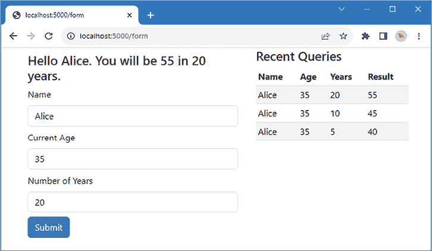
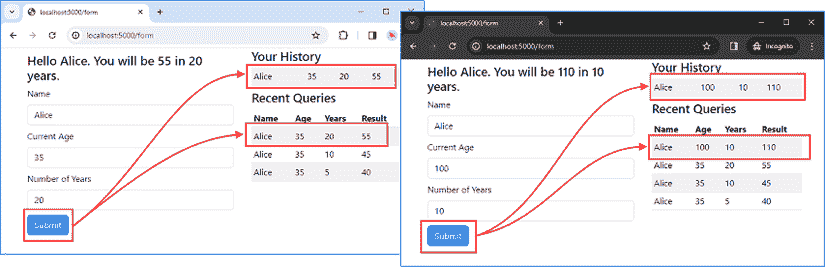
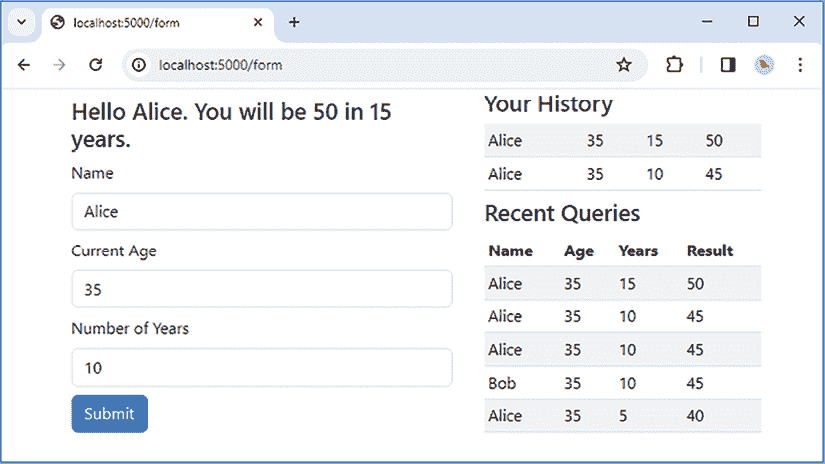

# 13

# 使用会话

在本章中，我解释了 Node.js 应用程序如何关联 HTTP 请求以创建*会话*，这允许一个请求的结果影响后续请求的结果。*表 13.1*将本章置于上下文中。

表 13.1：将会话置于上下文中

| 问题 | 答案 |
| --- | --- |
| 它们是什么？ | 会话关联用户发出的请求，允许请求相互关联。 |
| 为什么它们有用？ | 会话允许使用无状态的 HTTP 请求实现有状态的应用程序功能。 |
| 如何使用它们？ | Cookie 用于传输少量数据或与服务器存储的数据关联的会话 ID，该 ID 标识相关请求。 |
| 有没有陷阱或限制？ | 浏览器有时以不利于管理会话的方式使用 Cookie，但只要小心，会话的陷阱很少。 |
| 有没有替代方案？ | 基于 Cookie 的会话是关联 HTTP 请求的唯一可靠方式，但并非所有应用程序都需要请求关联。 |

*表 13.2* 总结了本章内容。

表 13.2：章节摘要

| 问题 | 解决方案 | 列表 |
| --- | --- | --- |
| 关联相关的 HTTP 请求 | 设置和读取 Cookie | *2-5, 8-10* |
| 防止存储在 Cookie 中的数据被更改 | 签名并验证 Cookie | *6, 7* |
| 存储大量数据 | 使用会话，其中数据由应用程序存储，并通过存储在 Cookie 中的键访问 | *11-15, 19-21* |
| 持久存储会话数据 | 使用数据库 | *16-18* |

# 准备本章内容

本章使用的是*第十二章*中的`part2app`项目。本章不需要进行任何更改。在`part2app`文件夹中运行*清单 13.1*中显示的命令以启动开发工具。

列表 13.1：启动开发工具

```js
npm start 
```

使用浏览器请求`http://localhost:5000`，填写表格，并点击*图 13.1*中显示的**提交**按钮。

**提示**

您可以从[`github.com/PacktPublishing/Mastering-Node.js-Web-Development`](https://github.com/PacktPublishing/Mastering-Node.js-Web-Development)下载本章的示例项目——以及本书中所有其他章节的示例项目。有关运行示例时遇到问题的帮助，请参阅*第一章*。



图 13.1：运行示例应用程序

# 关联无状态的 HTTP 请求

HTTP 请求是无状态的，这意味着每个请求都是自包含的，并且不包含任何将其与任何其他请求关联的信息，即使是由同一浏览器发出的。您可以通过打开两个浏览器窗口并使用相同名称但不同年龄和年数填写表格来模拟具有相同名称的两个用户，从而看到这造成的问题。

服务器必须处理的信息仅限于表单中的数据，它无法确定这些是来自不同用户的请求，因此用户看到彼此的数据，以及具有相同名称的用户创建的任何其他数据，如 *图 13.2* 所示。


图 13.2：无状态请求的影响

大多数应用程序都是**有状态的**，这意味着服务器必须能够**关联**请求，以便应用程序可以在未来的响应中反映过去的行为。在示例中，这将允许应用程序仅显示一个用户的请求，而不仅仅是所有同名用户的请求。

## 使用 cookie 关联请求

关联请求最常见的方式是使用**cookie**。cookie 是服务器在 HTTP 响应头中包含的文本片段。浏览器将在后续请求中包含这些 cookie，这意味着如果服务器使用唯一的 ID 创建 cookie，则这些请求可以被识别为相关的。（还有其他关联请求的方法，例如在 URL 中包含唯一的 ID，但 cookie 是最稳健和可靠的方法。）

Cookie 可以像任何响应头一样设置。将名为 `cookies.ts` 的文件添加到 `src/server` 文件夹中，内容如 *列表 13.2* 所示。

列表 13.2：src/server 文件夹中 cookies.ts 文件的内容

```js
import { ServerResponse } from "http";
const setheaderName = "Set-Cookie";
export const setCookie = (resp: ServerResponse, name: string, 
        val: string) => {
    let cookieVal: any[] = [`${name}=${val}; Max-Age=300; SameSite=Strict }`];   
    if (resp.hasHeader(setheaderName)) {
        cookieVal.push(resp.getHeader(setheaderName));
    }
    resp.setHeader("Set-Cookie", cookieVal);   
}
export const setJsonCookie = (resp: ServerResponse, name: string,
        val: any) => {
    setCookie(resp, name, JSON.stringify(val));
} 
```

使用 `Set-Cookie` 头部将 cookie 发送到浏览器，该头部的值是一个 cookie 名称、一个值以及一个或多个属性，告诉浏览器如何管理 cookie。一个响应可以通过包含多个 `Set-Cookie` 头部来设置多个 cookie。因此，*列表 13.2* 中的代码检查是否存在现有的 `Set-Cookie` 头部，并将其值添加到传递给 `setHeader` 方法的值数组中。当响应被写入时，Node.js 将为数组中的每个元素添加一个 `Set-Cookie` 头部。

**用户注意事项**

在世界的一些地区，例如欧盟的**通用数据保护条例**（**GDPR**）中，需要用户同意才能使用 cookie。我不是律师，也没有资格提供法律建议，但您应该确保您理解您的应用程序用户所在的每个地区的法律，并确保您遵守这些规则。

*列表 13.2* 中 `setCookie` 函数生成的头部将看起来像这样：

```js
...
Set-Cookie: user=Alice; Max-Age=300; SameSite=Strict
... 
```

cookie 名称是 `user`，其值是 `Alice`，cookie 已配置了 `Max-Age` 和 `SameSite` 属性，这些属性告诉浏览器 cookie 的有效期限以及何时发送 cookie。cookie 属性在 *表 13.3* 中描述。

表 13.3：Cookie 属性

| 名称 | 描述 |
| --- | --- |

|

```js
`Domain=value` 
```

| 此属性指定 cookie 的域名，如本表之后所述。 |
| --- |

|

```js
`Expires=date` 
```

| 此属性指定 cookie 到期的时间和日期。数据格式在[`developer.mozilla.org/en-US/docs/Web/HTTP/Headers/Date`](https://developer.mozilla.org/en-US/docs/Web/HTTP/Headers/Date)中描述。对于大多数项目，`Max-Age`属性更容易使用。 |
| --- |

|

```js
`HttpOnly` 
```

| 此属性告诉浏览器防止 JavaScript 代码读取 cookie。对于具有客户端 JavaScript 代码的 Web 应用程序，很少设置此属性。 |
| --- |

|

```js
`Max-Age=second` 
```

| 此属性指定 cookie 到期前的秒数。此属性优先于`Expires`。 |
| --- |

|

```js
`Path=path` 
```

| 此属性指定浏览器包含 cookie 必须包含在 URL 中的路径。 |
| --- |

|

```js
`SameSite=policy` 
```

| 此属性告诉浏览器是否应将 cookie 包含在后续描述的跨站请求中。策略选项为`Strict`、`Lax`和`None`。 |
| --- |

|

```js
`Secure` 
```

| 当此选项设置时，浏览器将仅在 HTTPS 请求中包含 cookie，而不是普通 HTTP 请求。 |
| --- |

两个 cookie 属性需要额外解释。`Domain`属性用于扩大浏览器将包含 cookie 的请求范围。例如，如果请求发送到[`users.acme.com`](https://users.acme.com)，返回的任何 cookie 都不会包含在发送到[`products.acme.com`](https://products.acme.com)的请求中，这可能会成为某些项目的问题。这可以通过设置`Domain`属性为`acme.com`并告诉浏览器更广泛地包含 cookie 来解决。

`SameSite`属性用于控制 cookie 是否包含在来自创建 cookie 的网站外部的请求中，称为*第一方*或同一站点的*上下文*。`SameSite`属性的选项有：`Strict`，表示只有来自创建 cookie 的同一网站的请求才会包含 cookie，`Lax`，告诉浏览器在跟随链接时包含 cookie，但不包括跨站请求，如电子邮件，以及`None`，表示 cookie 始终包含。

假设用户之前访问了[`www.acme.com`](https://www.acme.com)并接收了一个 cookie，之后用户导航到`www.example.com`。`www.example.com`的响应包含一个返回到`www.acme.com`的链接。如果 cookie 是以`Strict`选项创建的，浏览器不会在请求中发送 cookie，但如果是`Lax`选项，则会被包含。`None`选项也会导致浏览器包含 cookie，并允许它在框架内或为图像的请求中包含。

回顾*列表 13.2*中创建的 cookie，可以看到已使用`Max-Age`属性为 cookie 设置 300 秒（5 分钟）的生命周期，并且`SameSite`策略设置为`Strict`，这意味着 cookie 不会包含在来自 cookie 域外部的请求中：

```js
...
Set-Cookie: user=Alice; **Max-Age=300; SameSite=Strict**
... 
```

`setJsonCookie` 函数生成具有相同配置的 cookie，但接受在用作 cookie 值之前序列化为 JSON 格式的任意对象。

**避免没有 expires 和 Max-Age 属性的 cookie**

没有设置 `Expires` 或 `Max-Age` 属性创建的 cookie 是一个 *会话 cookie*，这是一个令人困惑的术语，因为这种类型的 cookie 并不特别适用于创建用户会话，我将在本章后面演示这个过程。名称“会话 cookie”意味着 cookie 仅在浏览会话期间有效，这意味着当用户关闭浏览器窗口时，它们会被无效化，例如。

自从创建这种类型的 cookie 以来，浏览器已经发生了变化，应该避免使用会话 cookie，因为让浏览器决定何时使 cookie 无效可能会产生意外的结果，并且 cookie 可以有很长且不可预测的生命周期，尤其是在浏览器允许用户在关闭后很久重新打开浏览器标签的情况下。cookie 应始终使用 `Expires` 或 `Max-Age` 属性赋予一个固定的生命周期。

### 接收 cookie

浏览器使用 `Cookie` 头部包含 cookie，该头部包含一个或多个由分号（`;` 字符）分隔的 `name=value` 对。与 `Set-Cookie` 头部一起使用的属性不包括在内，因此头部看起来像这样：

```js
...
Cookie: user=Alice; otherCookie=othervalue
... 
```

*列表 13.3* 定义了一个解析头部并提取单个 cookie 的函数。还有一个解析 JSON cookie 值的方法。

列表 13.3：在 src/server 文件夹中的 cookies.ts 文件中解析 cookie

```js
**import { IncomingMessage, ServerResponse } from "http";**
const setheaderName = "Set-Cookie";
export const setCookie = (resp: ServerResponse, name: string, 
        val: string) => {
    let cookieVal: any[] = [`${name}=${val}; Max-Age=300; SameSite=Strict }`];   
    if (resp.hasHeader(setheaderName)) {
        cookieVal.push(resp.getHeader(setheaderName));
    }
    resp.setHeader("Set-Cookie", cookieVal);   
}
export const setJsonCookie = (resp: ServerResponse, name: string,
        val: any) => {
    setCookie(resp, name, JSON.stringify(val));
}
**export const getCookie = (req: IncomingMessage,**
 **key: string): string | undefined** **=> {**
 **let result: string | undefined = undefined;**
 **req.headersDistinct["cookie"]?.forEach(header => {**
 **header.split****(";").forEach(cookie => {**
 **const { name, val }**
 **= /^(?<name>.*)=(?<val>.*)$/.exec(cookie)?.groups as any;**
 **if (name.****trim() === key) {**
 **result = val;**
 **}**
 **})**
 **});**
 **return result;**
**}**
**export const getJsonCookie = (req: IncomingMessage, key: string) : any => {**
 **const cookie = getCookie****(req, key);**
 **return cookie ? JSON.parse(cookie) : undefined;**
**}** 
```

`getCookie` 函数使用 JavaScript 字符串处理和正则表达式功能来拆分 cookie 字符串并获取名称和值以定位特定的 cookie。这不是一个高效的方法，因为每次请求 cookie 时都会处理 cookie 头部，但它确实展示了如何处理头部，并且将在本章后面进行改进。

### 设置和读取 cookie

*列表 13.4* 更新了处理 `/form` 请求的代码，以设置一个跟踪用户请求的 cookie。每次接收到新的请求时，cookie 的内容都会更新，并且从每个请求中读取 cookie 的值并将其添加到传递给用于生成响应的模板的上下文数据中。

列表 13.4：在 src/server 文件夹中的 forms.ts 文件中使用 cookie

```js
import express, { Express } from "express";
import repository  from "./data";
**import { getJsonCookie, setJsonCookie } from "./cookies";**
const rowLimit = 10;
export const registerFormMiddleware = (app: Express) => {
    app.use(express.urlencoded({extended: true}))
}
export const registerFormRoutes = (app: Express) => {
    app.get("/form", async (req, resp) => {
        resp.render("age", {
            history: await repository.getAllResults(rowLimit),
           ** personalHistory: getJsonCookie(req, "personalHistory")**
        });
    });
    app.post("/form", async (req, resp) => {
        const nextage = Number.parseInt(req.body.age)
            + Number.parseInt(req.body.years);
        await repository.saveResult({...req.body, nextage });
        **let pHistory = [{**
 **name: req.body.name, age: req.body.age,**
 **years: req.body.****years, nextage},**
 **...(getJsonCookie(req, "personalHistory") || [])].splice(0, 5);**

 **setJsonCookie(resp, "personalHistory", pHistory);**

 **const context = {**
 **...req.body, nextage,**
**history: await repository.getAllResults(rowLimit),**
 **personalHistory: pHistory**
        };
        resp.render("age", context);  
    });
} 
```

cookie 用于存储为用户创建的最后五个结果。每个新的 `POST` 请求都会在响应中创建一个新的 `Set-Cookie` 头部，具有新的五分钟过期时间。如果用户继续提交请求，将创建新的 cookie，从而有效地延长用户的会话。如果在 cookie 过期之前没有提交请求，则浏览器将丢弃该 cookie，并且不会将其包含在未来的请求中。

*列表 13.5* 更新了显示最近查询的部分视图，以便在可用时显示个人历史记录。

列表 13.5：在 templates/serve/partials 文件夹中的 history.handlebars 文件中显示数据

```js
**{{#if personalHistory }}**
 **<h4>Your History</h4>**
 **<table class="table table-sm table-striped my-2">**
 **{{#each personalHistory }}**
 **<tr>**
 **<td>{{ this.name }} </td>**
 **<td>{{ this.age }} </td>**
 **<td****>{{ this.years }} </td>**
 **<td>{{ this.nextage }} </td>**
 **</tr>**
 **{{/each }}**
 **</table>**
**{{/if }}**
<h4>Recent Queries</h4>
<table class="table table-sm table-striped my-2">
    <thead>
        <tr>
            <th>Name</th><th>Age</th><th>Years</th><th>Result</th>
        </tr>
    </thead>
    <tbody>
        {{#unless history }}
            <tr><td colspan="4">No data available</td></tr>
        {{/unless }}
        {{#each history }}
            <tr>
                <td>{{ this.name }} </td>
                <td>{{ this.age }} </td>
                <td>{{ this.years }} </td>
                <td>{{ this.nextage }} </td>
            </tr>
        {{/each }}
    </tbody>
</table> 
```

浏览器在标签页之间共享 cookie，因此测试示例更改的最可靠方法是打开一个常规浏览器标签页和一个私密或隐身浏览标签页。使用两个标签页导航到`http://localhost:5000`，并使用相同的名称但不同的年龄和年份填写表单。提交表单后，您将看到每个浏览器标签页都有自己的历史记录，如图*13.3*所示。



图 13.3：使用 cookie 关联请求

## 签名 cookie

用户可以更改 cookie 的内容，浏览器使得添加、删除和修改 cookie 变得容易。例如，Chrome 的 F12 开发者工具允许在**应用/cookie**面板中编辑 cookie。

这意味着除非可以验证其内容以确保它们没有被篡改，否则不能信任 cookie。将名为`cookies_signed.ts`的文件添加到`src/server`文件夹中，内容如*列表 13.6*所示。

列表 13.6：src/server 文件夹中 cookies_signed.ts 文件的内容

```js
import { createHmac, timingSafeEqual } from "crypto";
export const signCookie = (value: string, secret: string) => {
    return value + "." + createHmac("sha512", secret)
        .update(value).digest("base64url");
}
export const validateCookie = (value: string, secret: string) => {
    const cookieValue = value.split(".")[0];
    const compareBuf = Buffer.from(signCookie(cookieValue, secret));
    const candidateBuf = Buffer.from(value);
    if (compareBuf.length == candidateBuf.length &&
        timingSafeEqual(compareBuf, candidateBuf)) {
            return cookieValue;
    }
    return undefined;
} 
```

Node.js 在`crypto`模块中提供了一个全面的加密 API，其中包括对基于哈希的消息认证码（**HMAC**）的支持，这些哈希码是使用密钥创建的，可以用来验证数据。*列表 13.6*中的`signCookie`函数使用 Node.js API 创建一个可以用于 cookie 值的哈希码。

使用**SHA-512**算法和密钥创建哈希码生成器，`createHmac`函数如下：

```js
...
**createHmac("****sha512", secret)**.update(value).digest("base64url");
... 
```

`update` 方法用于将哈希算法应用于 cookie 值，而`digest`方法返回的哈希码以`Base64` URL 编码形式呈现，这使得哈希码可以安全地包含在 cookie 中。结果是数据值，后面跟着一个点，然后是哈希码，其形式如下：

```js
...
myCookieData.hn5jneGWS_oBL7ww5IHZm9KuzfUwWnnDz01vhNc5xNMwb-kQnxb357Tp
... 
```

实际的哈希码更长，但重要的是 cookie 值没有被加密，用户仍然可以看到它。用户仍然可以编辑 cookie，但哈希码允许检测这些更改。

当 cookie 提交时，`validateCookie`方法为 cookie 值生成一个新的哈希码，并将其与 cookie 中接收到的哈希码进行比较。哈希码是单向的，这意味着通过为包含在 HTTP 请求中的 cookie 值生成新的哈希码并与之前的哈希码进行比较来验证。

Node.js 的`crypto`模块提供了`timingSafeEqual`函数，该函数执行两个由两个哈希码创建的`Buffer`对象之间的字节对字节比较。

用户可能能够修改 cookie 的值，但没有生成修改值的有效哈希码所需的密钥。如果从请求中接收到的哈希码不匹配，cookie 数据将被丢弃。*列表 13.7* 更新了 `setCookie` 和 `getCookie` 函数，以便应用程序创建的所有 cookie 都被签名。

**注意**

请注意不要将密钥提交到公共源代码仓库，如 GitHub。一种方法是在 `.env` 文件中定义敏感数据，这些文件可以从代码提交中排除。参见本书的 *第三部分* 以了解使用此类配置文件的示例。

列表 13.7：在 src/server 文件夹中的 cookies.ts 文件中签名 cookie

```js
import { IncomingMessage, ServerResponse } from "http";
**import { signCookie, validateCookie } from "./cookies_signed";**
const setheaderName = "Set-Cookie";
**const cookieSecret = "mysecret";**
export const setCookie = (resp: ServerResponse, name: string, 
        val: string) => {
    **const signedCookieVal = signCookie(val, cookieSecret);**
 **let** **cookieVal: any[] =**
 **[`${name}=${signedCookieVal}; Max-Age=300; SameSite=Strict`];**         
    if (resp.hasHeader(setheaderName)) {
        cookieVal.push(resp.getHeader(setheaderName));
    }
    resp.setHeader("Set-Cookie", cookieVal);   
}
export const setJsonCookie = (resp: ServerResponse, name: string,
        val: any) => {
    setCookie(resp, name, JSON.stringify(val));
}
export const getCookie = (req: IncomingMessage,
        key: string): string | undefined => {
    let result: string | undefined = undefined;
    req.headersDistinct["cookie"]?.forEach(header => {
        header.split(";").forEach(cookie => {
            const { name, val }
                = /^(?<name>.*)=(?<val>.*)$/.exec(cookie)?.groups as any;
            if (name.trim() === key) {
                **result = validateCookie(val, cookieSecret);**
            }
        })
    });
    return result;
}
export const getJsonCookie = (req: IncomingMessage, key: string) : any => {
    const cookie = getCookie(req, key);
    return cookie ? JSON.parse(cookie) : undefined;
} 
```

应用程序的行为没有变化，但如果你使用浏览器的开发者工具修改一个 cookie，你会发现当浏览器发送请求时，它会被忽略。

## 使用包来管理 cookie

之前的示例不仅演示了如何使用 `Set-Cookie` 和 `Cookie` 头部，还显示了直接与 cookie 一起工作可能会很尴尬。Express 包括解析 cookie、生成 JSON 和签名 cookie 的支持，无需手动格式化或解析头部。

使用中间件组件解析 `cookies.cpp`，该组件不包括在主要的 Express 包中。在 `part2app` 文件夹中运行 *列表 13.8* 中显示的命令以安装解析包及其 TypeScript API 描述。

列表 13.8：安装 cookie 中间件包

```js
npm install cookie-parser@1.4.6
npm install --save-dev @types/cookie-parser@1.4.6 
```

*列表 13.9* 启用了 cookie 解析中间件并指定了将用于签名 cookie 的密钥。

列表 13.9：在 src/server 文件夹中的 forms.ts 文件中应用中间件

```js
import express, { Express } from "express";
import repository  from "./data";
import { getJsonCookie, setJsonCookie } from "./cookies";
**import cookieMiddleware from "cookie-parser"****;**
const rowLimit = 10;
export const registerFormMiddleware = (app: Express) => {
    app.use(express.urlencoded({extended: true}));
    **app.use(cookieMiddleware("mysecret"));**
}
export const registerFormRoutes = (app: Express) => {
    // ...statements omitted for brevity...
} 
```

中间件为常规 cookie 填充 `Request` 对象的 `cookies` 属性，为签名 cookie 填充 `signedCookies` 属性。cookie 是通过 `Response` 对象定义的 `cookie` 属性设置的。*列表 13.10* 使用这些功能生成应用程序所需的 cookie，并给 `setCookie` 方法添加了一个参数，以允许覆盖默认的 cookie 选项。

列表 13.10：在 src/server 文件夹中的 cookies.ts 文件中使用 Express cookie 功能

```js
**//import { IncomingMessage, ServerResponse } from "http";**
**//import { signCookie, validateCookie } from "./cookies_signed";**
**import { CookieOptions****, Request, Response } from "express";**
**// const setheaderName = "Set-Cookie";**
**// const cookieSecret = "mysecret";**
**export const setCookie = (resp: Response, name: string,  val: string,**
 **opts?: CookieOptions) => {**
 **resp.****cookie(name, val, {**
 **maxAge: 300 * 1000,**
 **sameSite: "strict",**
 **signed: true,**
 **...opts**
 **});**
**}**
export const setJsonCookie = (resp: Response, name: string, val: any) => {;
    **setCookie(resp, name, JSON.stringify(val));**
}
export const getCookie = (req: Request, key: string): string | undefined => {
    **return req.signedCookies[key];**
}
export const getJsonCookie = (req: Request, key: string) : any => {
    **const cookie = getCookie(req, key);**
 **return cookie ? JSON.parse(cookie) : undefined;**
} 
```

Express 和 cookie 中间件负责在响应中创建 `Set-Cookie` 头部以及在请求中解析 `Cookie` 头部。`Response.cookie` 方法用于创建 cookie，它接受一个名称、一个值和一个配置对象。配置对象具有与 *表 13.3* 中描述的 cookie 属性相对应的属性，尽管有一些奇怪之处。例如，`maxAge` 配置是以毫秒为单位指定的，而不是 `Max-Age` 属性所使用的秒（这就是为什么 *列表 13.10* 中的值乘以 1,000 的原因）。

`cookie`方法接受的配置对象支持一个`signed`属性，该属性启用 cookie 签名。密钥是从设置 cookie 中间件时使用的配置中获得的，这又是一个奇怪之处，但仍然有效。与自定义代码类似，使用 HMAC 对 cookie 进行签名。

请求中接收到的 cookie 通过`Request.cookies`和`Request.signedCookies`属性可用，这些属性返回的对象的属性对应于请求中 cookie 的名称。签名 cookie 很容易检测，因为`Response.cookie`方法使用前缀`s.`创建签名 cookie 值，并且使用与中间件配置的密钥自动验证这些值。

*清单 13.10*中的更改不会改变应用程序的行为，但 cookie 的格式不同，使用自定义代码创建的 cookie 无法通过验证。

# 使用会话

Cookies 适合存储少量数据，但每次请求都必须将数据发送到应用程序，并且对数据的任何更改都必须签名并发送在响应中。

一种替代方案是让应用程序存储数据，并在 cookie 中仅包含对该数据的引用。这样可以在不将数据包含在每个请求和响应中的情况下存储更多数据。

会话数据可以存储为键/值对集合，这使得使用 JavaScript 对象表示数据变得容易。我将首先创建一个基于内存的会话系统，然后介绍使用数据库的持久化存储，通过仓库层使转换更容易。创建`src/server/sessions`文件夹，并向其中添加一个名为`repository.ts`的文件，其内容如*清单 13.11*所示。

清单 13.11：src/server/sessions 文件夹中 repository.ts 文件的内容

```js
export type Session = {
    id: string,
    data: { [key: string]: any }
}
export interface SessionRepository {
    createSession() : Promise<Session>;
    getSession(id: string): Promise<Session | undefined>;
    saveSession(session: Session, expires: Date): Promise<void>;
    touchSession(session: Session, expires: Date) : Promise<void>
} 
```

`SessionRepository`接口定义了创建会话、检索先前存储的会话以及保存或更新会话的方法。`Session`类型定义了`Session`的最小要求，包括一个 ID 和一个可以分配任意数据（通过字符串值索引）的`data`属性。

要创建基于内存的接口实现，请将一个名为`memory_repository.ts`的文件添加到`src/server/sessions`文件夹中，其内容如*清单 13.12*所示。

清单 13.12：src/server/sessions 文件夹中 memory_repository.ts 文件的内容

```js
import { Session, SessionRepository } from "./repository";
import { randomUUID } from "crypto";
type SessionWrapper = {
    session: Session,
    expires: Date
}
export class MemoryRepository implements SessionRepository {
    store = new Map<string, SessionWrapper>();

    async createSession(): Promise<Session> {
        return { id: randomUUID(), data: {} };
    }
    async getSession(id: string): Promise<Session | undefined> {
        const wrapper = this.store.get(id);
        if (wrapper && wrapper.expires > new Date(Date.now())) {
            return structuredClone(wrapper.session)
        }
    }
    async saveSession(session: Session, expires: Date): Promise<void> {
        this.store.set(session.id, { session, expires });
    }
    async touchSession(session: Session, expires: Date): Promise<void> {
        const wrapper = this.store.get(session.id);
        if (wrapper) {
            wrapper.expires = expires;
        }
    }
} 
```

Node.js 的`crypto`包定义了`randomUUID`函数，该函数生成适合用作会话 ID 的唯一 ID。其余的实现使用`Map`来存储`Session`对象，当读取时检查它们的过期情况。

值得注意的是，`getSession`方法不返回存储中的`Session`，而是创建一个新的对象，如下所示：

```js
...
if (wrapper && wrapper.expires > new Date(Date.now())) {
    return **structuredClone**(wrapper.session)
}
... 
```

`structuredClone` 函数是标准 JavaScript API 的一部分，它创建一个对象的深拷贝。会话数据仅应在 `POST` 请求中修改，因为其他 HTTP 方法是幂等的，创建新对象使得丢弃因意外为其他 HTTP 方法所做的更改变得容易，这将在下一节中看到。这仅在将状态作为 JavaScript 对象存储时是一个问题，其中与请求关联的 `Session` 对象与存储中的对象相同。当会话数据存储在数据库中时不会出现这个问题。

## 创建会话中间件

在生成响应后需要存储会话，以便不会丢失对会话数据的任何更改，这可以通过创建一个 Express 中间件组件最简单地完成。将名为 `middleware.ts` 的文件添加到 `src/server/sessions` 文件夹中，内容如 *列表 13.13* 所示。

列表 13.13：src/server/sessions 文件夹中 middleware.ts 文件的内容

```js
import { Request, Response, NextFunction } from "express";
import { SessionRepository, Session } from "./repository";
import { MemoryRepository } from "./memory_repository";
import { setCookie, getCookie } from "../cookies";
const session_cookie_name = "custom_session";
const expiry_seconds = 300;
const getExpiryDate = () => new Date(Date.now() + (expiry_seconds * 1_000));
export const customSessionMiddleware = () => {
    const repo: SessionRepository = new MemoryRepository();
    return async (req: Request, resp: Response, next: NextFunction) => {

        const id = getCookie(req, session_cookie_name);

        const session = (id ? await repo.getSession(id) : undefined)
                            ?? await repo.createSession();

        (req as any).session = session;
        setCookie(resp, session_cookie_name, session.id, {
            maxAge: expiry_seconds * 1000
        })
        resp.once("finish", async () => {
            if ( Object.keys(session.data).length > 0) {
                if (req.method == "POST") {
                    await repo.saveSession(session, getExpiryDate());
                } else {
                    await repo.touchSession(session, getExpiryDate());
                }
            }
        })

        next();
    }
} 
```

此中间件组件读取包含会话 ID 的 cookie，并使用它从存储库中获取会话，并通过添加名为 `session` 的属性将其与 `Request` 对象关联。如果没有 cookie，或者无法找到具有该 ID 的会话，则启动一个新的会话。

只有在响应生成并且确定不会进行进一步更改后，会话才能安全地存储。一旦响应完成，就会触发 `finish` 事件，并使用 `once` 方法来处理事件并存储会话。

会话仅存储在 HTTP `POST` 请求中，并且当属性已被分配给 `data` 对象时。对于其他 HTTP 方法，使用 `touchSession` 方法来延长会话过期时间，但会话数据不会存储。

在每次请求后更新会话过期时间会创建一个 *滑动过期*，这意味着会话可以无限期地保持有效。这是最常见的方法，因为它意味着会话在用户活跃期间有效，并在一段时间的不活跃后超时。

## 使用会话功能

中间件组件向请求添加 `session` 属性，但这不是标准 Express `Request` 类型的一部分，并且 TypeScript 编译器也不知道。有两种很好的方法可以解决这个问题：一个读取 `session` 属性的辅助函数或一个扩展 Express 提供的类型的新类型。将名为 `session_helpers.ts` 的文件添加到 `src/server/sessions` 文件夹中，内容如 *列表 13.14* 所示。

列表 13.14：src/server/sessions 文件夹中 session_helpers.ts 文件的内容

```js
import { Request } from "express";
import { Session } from "./repository";
export const getSession = (req: Request): Session => (req as any).session;
declare global {
    module Express {
        interface Request {
            session: Session
        }
    }
} 
```

`getSession` 函数接收一个 `Request` 对象，并通过使用 `as any` 来绕过 TypeScript 类型检查，返回 `session` 属性。使用 `declare` 关键字告诉 TypeScript，`Request` 接口有一个额外的属性。

在这两种方法中，我更倾向于辅助函数，它可能没有那么优雅，但更容易理解，并且清楚地说明了如何获取`Session`对象。*列表 13.15*展示了如何将存储在 cookie 中的会话数据切换到使用会话仓库。

列表 13.15：`src/server`文件夹中`forms.ts`文件中使用会话仓库的内容

```js
import express, { Express } from "express";
import repository  from "./data";
import { getJsonCookie, setJsonCookie } from "./cookies";
import cookieMiddleware from "cookie-parser";
**import { customSessionMiddleware } from "./sessions/middleware";**
**import { getSession } from "./sessions/session_helpers";**
const rowLimit = 10;
export const registerFormMiddleware = (app: Express) => {
    app.use(express.urlencoded({extended: true}))
    app.use(cookieMiddleware("mysecret"));
    **app.use(customSessionMiddleware());**
}
export const registerFormRoutes = (app: Express) => {
    app.get("/form", async (req, resp) => {
        resp.render("age", {
            history: await repository.getAllResults(rowLimit),
            **personalHistory: getSession(req).data.****personalHistory**
        });
    });
    app.post("/form", async (req, resp) => {
        const nextage = Number.parseInt(req.body.age)
            + Number.parseInt(req.body.years);
        await repository.saveResult({...req.body, nextage });
        **req.session.data.personalHistory = [{**
 **name: req.****body.name, age: req.body.age,**
 **years: req.body.years, nextage},**
 **...(req.session.data.****personalHistory || [])].splice(0, 5);**

        const context = {
            ...req.body, nextage,
            history: await repository.getAllResults(rowLimit),
           ** personalHistory: req.****session.data.personalHistory**
        };
        resp.render("age", context);  
    });
} 
```

这些更改使得会话中间件能够存储用户的历史记录，并使用新的会话功能。再次强调，应用程序的行为没有变化，因为用户看不到这些更改。当表单提交时，浏览器发送的 cookie 用于从仓库加载会话数据，这些数据用于响应，如*图 13.4*所示。



图 13.4：使用会话数据

## 在数据库中存储会话数据

在内存中存储会话数据是理解各个部分如何组合的好方法，但并不适合需要更多持久存储的真实项目。传统方法是将会话数据存储在数据库中，这确保了会话的持久性，并且允许存储大量会话而不会耗尽系统内存。

在`src/server/sessions`文件夹中添加一个名为`orm_models.ts`的文件，内容如*列表 13.16*所示。

列表 13.16：`src/server/sessions`文件夹中`orm_models.ts`文件的内容

```js
import { DataTypes, InferAttributes, InferCreationAttributes, Model,
    Sequelize } from "sequelize";
export class SessionModel extends Model<InferAttributes<SessionModel>,
        InferCreationAttributes<SessionModel>> {
    declare id: string
    declare data: any;
    declare expires: Date
}
export const initializeModel = (sequelize: Sequelize) => {
    SessionModel.init({
        id: { type: DataTypes.STRING, primaryKey: true },
        data: { type: DataTypes.JSON },
        expires: { type: DataTypes.DATE }
    }, { sequelize });
} 
```

单个模型类可以表示一个会话，由`crypto.randomUUID`函数生成的 ID 可以用作主键。Sequelize 对处理 JavaScript 日期有很好的支持，并且当列的类型为`DataTypes.JSON`时，会自动序列化和反序列化对象。要创建会话仓库，在`src/server/sessions`文件夹中添加一个名为`orm_repository.ts`的文件，内容如*列表 13.17*所示。

**注意**

*列表 13.17*中的`initModelAndDatabase`方法调用`drop`方法，每次应用程序启动或重启时都会重置数据库。在实际项目中不应这样做，但对于示例来说很有帮助，并确保代码文件中的任何更改都会反映在数据库中。

列表 13.17：`src/server/sessions`文件夹中`orm_repository.ts`文件的内容

```js
import { Op, Sequelize } from "sequelize";
import { Session, SessionRepository } from "./repository";
import { SessionModel, initializeModel } from "./orm_models";
import { randomUUID } from "crypto";
export class OrmRepository implements SessionRepository {
    sequelize: Sequelize;
    constructor() {
        this.sequelize = new Sequelize({
            dialect: "sqlite",
            storage: "orm_sessions.db",
            logging: console.log,
            logQueryParameters: true
        });
        this.initModelAndDatabase();
    }

    async initModelAndDatabase() : Promise<void> {
        initializeModel(this.sequelize);
        await this.sequelize.drop();       
        await this.sequelize.sync();
    }
    async createSession(): Promise<Session> {
        return { id: randomUUID(), data: {} };
    }
    async getSession(id: string): Promise<Session | undefined> {
        const dbsession = await SessionModel.findOne({
            where: { id, expires: { [Op.gt] : new Date(Date.now()) }}
        });
        if (dbsession) {
            return { id, data: dbsession.data };
        }
    }
    async saveSession(session: Session, expires: Date): Promise<void> {
        await SessionModel.upsert({
            id: session.id,
            data: session.data,
            expires
        });
    }
    async touchSession(session: Session, expires: Date): Promise<void> {
        await SessionModel.update({ expires }, { where: { id: session.id } });
    }
} 
```

仓库与为应用程序数据创建的仓库类似，但有几个要点展示了像 Sequelize 这样的 ORM（对象关系映射）如何简化数据库操作，尽管 JavaScript 代码可能有些笨拙。`getSession`方法通过`findOne`方法和`where`表达式查询数据库，以找到具有给定主键和未来到期日期的行，如下所示：

```js
...
const dbsession = await SessionModel.findOne({
    **where: { id, expires: { [Op.gt] : new** **Date(Date.now()) }}**
});
... 
```

`Op.gt`值表示大于的比较，允许搜索匹配`expires`列中存储的日期大于当前日期的行。这不是表达查询最自然的方式，但它有效，并且允许在不编写 SQL 的情况下表达查询。

Sequelize 的`upsert`方法用于在存在时更新数据行，不存在时插入一行，这使得实现`saveSession`方法变得容易。`touchSession`方法通过`update`方法实现，允许更新特定的列。

**注意**

我在本章中没有添加删除过期会话的支持。一般来说，我避免自动删除任何数据，因为出错的可能性很大。存储空间相对便宜，但如果需要积极管理会话数据库的大小，那么在手动清理之前进行备份是一个更安全的选项。

最后一步是将会话中间件更新为使用新的存储库，如*清单 13.18*所示。

列表 13.18：在 src/server/sessions 文件夹中的 middleware.ts 文件中更改存储库

```js
import { Request, Response, NextFunction } from "express";
import { SessionRepository, Session } from "./repository";
**//import { MemoryRepository } from "./memory_repository";**
import { setCookie, getCookie } from "../cookies";
i**mport { OrmRepository } from "****./orm_repository";**
const session_cookie_name = "custom_session";
const expiry_seconds = 300;
const getExpiryDate = () => new Date(Date.now() + (expiry_seconds * 1_000));
export const customSessionMiddleware = () => {
    **//const repo: SessionRepository = new MemoryRepository();**
 **const repo: SessionRepository =** **new OrmRepository();**
    return async (req: Request, resp: Response, next: NextFunction) => {

        // ...statements omitted for brevity...
    }
} 
```

使用数据库不需要进行其他更改，因为新存储库实现了与旧存储库相同的接口。

关键区别在于，你将看到在应用程序运行时，Node.js 控制台会记录数据库查询，从创建数据库表的语句开始：

```js
...
Executing (default): CREATE TABLE IF NOT EXISTS `SessionModels` (`id` VARCHAR(255)
    PRIMARY KEY, `data` JSON, `expires` DATETIME, `createdAt` DATETIME NOT NULL,
    `updatedAt` DATETIME NOT NULL);
... 
```

准备或查询数据库不需要 SQL，创建和解析 JSON 的过程由系统自动处理。

# 使用会话包

现在你已经了解了会话的工作原理，是时候用现成的会话包替换自定义代码了，例如 Express 提供的包。在`part2app`文件夹中运行*清单 13.19*中显示的命令来安装会话包、其 API 的类型描述包以及使用 Sequelize 存储会话的包。（express-sessions 包有广泛的数据库选项，描述在[`github.com/expressjs/session`](https://github.com/expressjs/session)）。

列表 13.19：安装包

```js
npm install express-session@1.17.3
npm install connect-session-sequelize@7.1.7
npm install --save-dev @types/express-session@1.17.10 
```

*清单 13.20*为应用程序使用会话包和存储包做准备。

列表 13.20：在 src/server/sessions 文件夹中的 session_helpers.ts 文件中使用会话包

```js
import { Request } from "express";
**//import { Session } from "./repository";**
**import session, { SessionData } from "express-session";**
**import sessionStore from "****connect-session-sequelize";**
**import { Sequelize } from "sequelize";**
**import { Result } from "../data/repository";**
**export** **const getSession = (req: Request): SessionData => (req as any).session;**
**// declare global {**
**//     module Express {**
**//         interface Request {**
**//             session: Session**
**//         }**
**//     }**
**// }**
**declare module "express-session" {**
 **interface** **SessionData {**
 **personalHistory: Result[];**
 **}**
**}**
**export const sessionMiddleware = () => {**
 **const sequelize = new Sequelize({**
 **dialect: "****sqlite",**
 **storage: "pkg_sessions.db"**
 **});**
 **const store = new (sessionStore(session.Store))({**
 **db: sequelize**
 **});**
 **store.sync();**
 **return** **session({**
 **secret: "mysecret",**
 **store: store,**
 **cookie: { maxAge: 300 * 1000, sameSite: "strict" },**
**resave: false, saveUninitialized: false**
 **})**
**}** 
```

使用该包需要调整，包括注释掉添加`Request.session`属性的`declare`语句，因为`express-session`包中已定义了类似的语句。

需要一个新的`declare`语句来向`SessionData`对象添加自定义属性，这是该包用来表示会话数据的类型。存在一个`Session`类型，但它与自定义代码使用的包装类型具有类似的作用。在这种情况下，已添加了一个`personHistory`属性，以最小化使用该包所需进行的更改。

`sessionMiddleware`函数创建一个使用 SQLite 的`Sequelize`对象，并使用它通过`connect-session-sequelize`包创建会话数据的存储。调用`sync`方法来初始化数据库，并使用`express-session`包的默认导出创建一个中间件组件。会话存储的配置选项在[`github.com/expressjs/session`](https://github.com/expressjs/session)中描述，但*列表 13.20*中的配置指定了签名 Cookies 的密钥、Sequelize 存储和 cookie 设置，以便该包的行为与自定义代码相同。要使用会话包，需要进行一些小的更改，如*列表 13.21*所示。

**注意**

可以在同一个应用程序中使用`cookie-parser`包和`express-session`包，但必须确保两者都配置了相同的密钥。

列表 13.21：在 src/server 文件夹中的 forms.ts 文件中使用 session 包

```js
import express, { Express } from "express";
import repository  from "./data";
import { getJsonCookie, setJsonCookie } from "./cookies";
import cookieMiddleware from "cookie-parser";
import { customSessionMiddleware } from "./sessions/middleware";
**import { getSession, sessionMiddleware } from "./sessions/session_helpers";**
const rowLimit = 10;
export const registerFormMiddleware = (app: Express) => {
    app.use(express.urlencoded({extended: true}))
    app.use(cookieMiddleware("mysecret"));
    **//app.use(customSessionMiddleware());**
 **app.use(sessionMiddleware());**
}
export const registerFormRoutes = (app: Express) => {
    app.get("/form", async (req, resp) => {
        resp.render("age", {
            history: await repository.getAllResults(rowLimit),
            **personalHistory: getSession(req).personalHistory**
        });
    });
    app.post("/form", async (req, resp) => {
        const nextage = Number.parseInt(req.body.age)
            + Number.parseInt(req.body.years);
        await repository.saveResult({...req.body, nextage });
        **req.session.personalHistory = [{**
            id: 0, name: req.body.name, age: req.body.age,
            years: req.body.years, nextage},
            ..**.(req.session.personalHistory || [])].splice(0, 5);**

        const context = {
            ...req.body, nextage,
            history: await repository.getAllResults(rowLimit),
            **personalHistory: req.session.personalHistory**
        };
        resp.render("age", context);  
    });
} 
```

这些更改替换了自定义中间件，并直接在由`session`属性返回的对象上读取`personalHistory`属性。用于存储会话的数据库模式不同，您可以在 Node.js 控制台输出的 SQL 语句中看到这一点，但除此之外，应用程序的行为保持不变。

# 摘要

在本章中，我解释了应用程序如何使用 Cookies 将 HTTP 请求关联起来，在无状态的协议上创建有状态的用户体验：

+   通过在响应中添加`Set-Cookie`头创建 Cookies。

+   浏览器在请求中包含 Cookies，使用`Cookie`头。

+   使用 cookie 属性配置 Cookies，包括设置一个过期时间，在此之后，浏览器将不再在请求中包含该 cookie。

+   Cookies 可以被签名，这揭示了它们何时被更改。

+   Cookies 可以用来存储少量数据，但随后必须反复在浏览器和服务器之间传输这些数据。

+   Cookies 也可以用来存储会话 ID，这些 ID 用于加载服务器存储的数据。这使得服务器更加复杂，但意味着只有 ID 在浏览器和服务器之间传输。

在下一章中，我将描述如何使用 RESTful Web 服务提供数据给客户端，而不包括 HTML。
