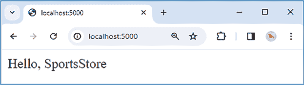
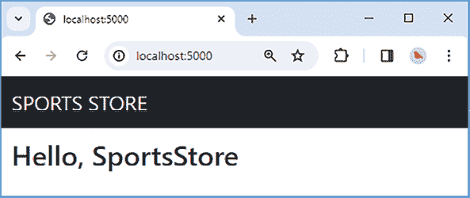
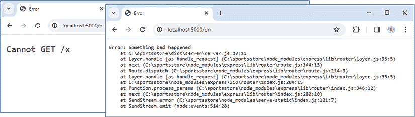
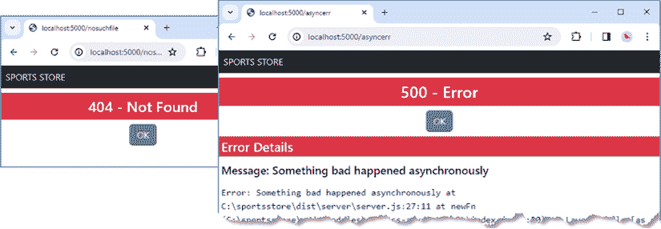
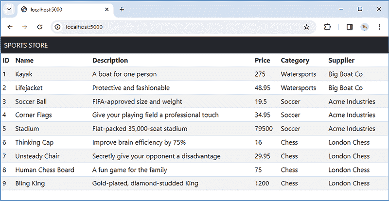

# 16

# SportsStore：一个真实的应用程序

在前面的每一章中，我专注于网络应用程序所需的一个特定功能，这使我能够深入了解细节。在这本书的这一部分，我展示了前面章节中描述的功能是如何组合起来构建一个简单但真实的电子商务应用的。

我的应用程序，名为 SportsStore，将遵循全球在线商店采用的经典方法。我将创建一个在线产品目录，客户可以浏览或搜索，一个购物车，用户可以添加和删除产品，以及一个结账页面，客户可以输入他们的送货详情。我还会创建一个管理区域，提供管理目录的设施，并且我会保护它，以确保只有授权用户才能进行更改。

在本书的这一部分，我的目标是通过对尽可能真实的示例进行创建，让你对真正的网络应用开发有一个感性的认识。当然，我想要专注于 Node.js，因此我简化了与外部系统的集成，例如数据库，并完全省略了其他一些系统，例如支付处理。

# 理解项目结构

SportsStore 应用程序跨越六个章节，包含许多文件，其中一些文件具有相同的名称，这可能是 TypeScript/JavaScript 的要求，也可能是我的开发风格所致。例如，会有多个`index.ts`文件，因为这是 JavaScript 在从模块导入时使用的文件名。也会有多个文件名称包含术语*helper*，因为这是我编写支持应用程序其他部分的代码的方式。为了快速参考，*表 16.1*提供了完成后的 SportsStore 项目的结构的高级概述，这将为你阅读章节和跟随示例提供上下文。

表 16.1：项目布局和关键文件

| 文件夹 | 描述 |
| --- | --- |

|

```js
`dist` 
```

| 此文件夹将包含由 TypeScript 编译器创建的 JavaScript 文件，这些文件将由 Node.js 执行。 |
| --- |

|

```js
`src` 
```

| 此文件夹将包含 SportsStore 应用程序的所有源代码，并将编译到`dist`文件夹中。 |
| --- |

|

```js
`src/admin` 
```

| 此文件夹支持在第二十章中创建的管理功能。 |
| --- |

|

```js
`src/config` 
```

| 此文件夹包含为应用程序其余部分提供配置设置的代码，这些设置是从配置文件和环境设置中读取的。 |
| --- |

|

```js
`src/data` 
```

| 此文件夹包含所有与处理数据相关的功能。 |
| --- |

|

```js
`src/data/orm` 
```

| 此文件夹包含数据模型的`Sequelize`实现。 |
| --- |

|

```js
`src/data/validation` 
```

| 此文件夹包含验证用户输入的代码。 |
| --- |

|

```js
`src/helpers` 
```

| 此文件夹包含无逻辑模板包的辅助工具。 |
| --- |

|

```js
`src/routes` 
```

| 此文件夹包含匹配和处理请求的 HTTP 路由。 |
| --- |

|

```js
`src/authentication.ts` 
```

| 此文件中的代码配置用户身份验证。 |
| --- |

|

```js
`src/errors.ts` 
```

| 此文件中的代码创建 HTTP 错误响应。 |
| --- |

|

```js
`src/server.ts` 
```

| 当 SportsStore 应用程序启动时，此文件中的代码被执行，负责设置应用程序功能和创建 HTTP 服务器。 |
| --- |

|

```js
`src/sessions.ts` 
```

| 此文件中的代码设置基于 cookie 的 HTTP 会话。 |
| --- |

|

```js
`templates` 
```

| 此文件夹包含服务器将用于为 HTML 客户端渲染内容的模板。 |
| --- |

|

```js
`products.json` 
```

| 此文件包含用于填充目录的产品数据。 |
| --- |

|

```js
`server.config.json` 
```

| 这是应用程序的主要配置文件。 |
| --- |

|

```js
`development.env` 
```

| 此文件用于在开发期间将秘密作为环境变量存储。 |
| --- |

*SportsStore*项目的结构至少部分反映了我喜欢编写软件的方式。你不必在你的项目中遵循这种模式，我鼓励你找到组织功能的方法，使它们与你思考需要解决的问题的方式相对应。

# 创建项目

打开一个新的命令提示符，导航到一个方便的位置，并创建一个名为`sportsstore`的文件夹。导航到`sportsstore`文件夹，运行*清单 16.1*中显示的命令以初始化项目，并创建`package.json`文件。

**提示**

您可以从[`github.com/PacktPublishing/Mastering-Node.js-Web-Development`](https://github.com/PacktPublishing/Mastering-Node.js-Web-Development)下载本章的示例项目——以及本书中所有其他章节的示例项目。有关运行示例时遇到问题的帮助，请参阅*第一章*。

清单 16.1：初始化项目

```js
npm init -y 
```

## 设置开发工具

我将首先设置一个工具链，该工具链将监视项目中的 TypeScript 文件，并在有更改时编译和执行它们。在`sportsstore`文件夹中运行*清单 16.2*中显示的命令以安装开发工具包。

清单 16.2：安装开发工具包

```js
npm install --save-dev typescript@5.2.2
npm install --save-dev tsc-watch@6.0.4
npm install --save-dev nodemon@3.0.3
npm install --save-dev @tsconfig/node20
npm install --save-dev @types/node@20.6.1 
```

这些包在*表 16.2*中有描述，供快速参考。

表 16.2：开发包

| 名称 | 描述 |
| --- | --- |
| `typescript` | 此包包含 TypeScript 编译器。 |
| `tsc-watch` | 此包监视项目中的 TypeScript 文件，并在有更改时编译它们。 |
| `nodemon` | 此包监视更广泛的文件类型，并在检测到更改时执行命令。 |
| `@tsconfig/node20` | 此包包含适用于 Node.js 项目的 TypeScript 编译器配置文件。 |
| `@types/node` | 此包包含 Node.js API 的类型描述。 |

创建`src`文件夹，并向其中添加一个名为`server.ts`的文件，其内容如*清单 16.3*所示，该文件将在设置开发工具时充当占位符。

清单 16.3：src 文件夹中 server.ts 文件的内容

```js
console.log("Hello, SportsStore"); 
```

要配置 TypeScript 编译器，请将一个名为`tsconfig.json`的文件添加到`sportsstore`文件夹中，其内容如*清单 16.4*所示。

清单 16.4：sportsstore 文件夹中 tsconfig.json 文件的内容

```js
{
    "extends": "@tsconfig/node20/tsconfig.json",
     "compilerOptions": {                      
         "rootDir": "src/",  
         "outDir": "dist/"       
     },
     "include": ["src/**/*"]
} 
```

此配置基于`@tsconfig/node20`包提供的基本设置，指定源文件位于`src`文件夹中，编译后的 JavaScript 文件应写入`src`文件夹。

要设置文件监视器，替换`package.json`文件的`scripts`部分并添加`nodemonConfig`部分，如*清单 16.5*所示。

清单 16.5：设置 sportsstore 文件夹中 package.json 文件的 scripts 部分

```js
{
  "name": "sportsstore",
  "version": "1.0.0",
  "description": "",
  "main": "index.js",
 **"scripts": {**
 **"watch": "tsc-watch --noClear --onsuccess \"node dist/server.js\"",**
 **"start": "nodemon --exec npm run watch"**
 **},**
 **"****nodemonConfig": {**
 **"ext": "js,handlebars,json",**
 **"ignore": ["dist/**", "node_modules/**"]**
 **},**
  "keywords": [],
  "author": "",
  "license": "ISC",
  "devDependencies": {
    "@tsconfig/node20": "²⁰.1.2",
    "@types/node": "²⁰.6.1",
    "nodemon": "³.0.3",
    "tsc-watch": "⁶.0.4",
    "typescript": "⁵.2.2"
  }
} 
```

早期章节仅使用`tsc-watch`包来监视和构建 TypeScript 文件，并在有更改时重新启动应用程序。当与其他文件类型（如模板）一起工作时，这种做法可能会令人沮丧，因为更改不会触发重启。Bundler 包，如 webpack（在第七章中使用），可以用于创建复杂的构建管道，但我的偏好是将`tsc-watch`与`nodemon`包结合使用，当文件更改时，它会重新启动进程。`start`脚本使用`nodemon`运行`tsc-watch`，然后`tsc-watch`以监视模式启动 TypeScript 编译器。如果 TypeScript 文件发生更改，则 TypeScript 编译器将 TypeScript 文件编译成 JavaScript，然后由`tsc-watch`包执行。如果非 TypeScript 文件发生更改，则`nodemon`包重新启动`tsc-watch`，确保应用程序重新启动。`nodemonConfig`部分指定`nodemon`响应的文件扩展名和一组要忽略的目录。这不是一个完美的工具配置，但它可靠且响应迅速，我使用这些包时遇到的问题比尝试配置 webpack 要少，因为 webpack 在处理 TypeScript 文件时有一些限制。

打开一个新的命令提示符，导航到`sportsstore`文件夹，并运行*清单 16.6*中显示的命令以启动构建过程。

```js
Listing 16.6: Starting the build process 
```

```js
npm start 
```

构建工具将生成纯 JavaScript 文件，这些文件将由 Node.js 执行，产生以下输出：

```js
...
Hello, SportsStore
... 
```

文件更改将被自动检测，触发新的构建然后执行输出。

## 处理 HTTP 请求

下一步是添加处理 HTTP 请求的支持，这是 SportsStore 应用程序及其所有功能的基础。在`sportsstore`文件夹中运行*清单 16.7*中显示的命令以添加 HTTP 包。

清单 16.7：安装基本应用程序包

```js
npm install express@4.18.2
npm install helmet@7.1.0
npm install --save-dev @types/express@4.17.20 
```

这些包在*表 16.3*中描述，以便快速参考，但它们提供了对基本 Node.js HTTP 功能的增强，并设置了一个合理的内联安全策略。

表 16.3：HTTP 处理包

| 名称 | 描述 |
| --- | --- |
| `express` | 此包包含 Express HTTP 框架，该框架在第五章中介绍。 |
| `helmet` | 此包用于设置 HTTP 内容安全策略，如*第七章*所述。 |
| `@types/express` | 此包包含 Express API 的类型描述。 |

将 `server.ts` 文件的内容替换为 *列表 16.8* 中所示的代码，以创建一个基本的 HTTP 服务器。（开发时将使用纯 HTTP，当应用程序准备部署时，将在 *第二十一章* 中介绍 HTTPS。）

列表 16.8：在 src 文件夹中的 server.ts 文件中创建基本的 HTTP 服务器

```js
import { createServer } from "http";
import express, { Express } from "express";
import helmet from "helmet";
const port = 5000;
const expressApp: Express = express();
expressApp.use(helmet());
expressApp.use(express.json());
expressApp.use(express.urlencoded({extended: true}))
expressApp.get("/", (req, resp) => {
    resp.send("Hello, SportsStore");
})
const server = createServer(expressApp);
server.listen(port,
    () => console.log(`HTTP Server listening on port ${port}`)); 
```

新代码使用 Express 并启用了解码 JSON 和表单编码内容的支持，使用 `json` 和 `urlencoded` 方法。有一个单独的路由处理 `GET` 请求并返回一个字符串。打开网页浏览器，请求 `http://localhost:5500`，你应该会看到 *图 16.1* 中所示的响应。



图 16.1：应用程序的响应

## 创建配置系统

服务器监听 HTTP 请求的端口硬编码在 `server.ts` 文件中，这意味着更改端口将需要构建和部署应用程序的新版本。一种更灵活的方法是在配置文件中定义设置，该文件在应用程序启动时读取，并且可以修改而无需更改代码。

创建 `src/config` 文件夹，并向其中添加一个名为 `environment.ts` 的文件，其内容如 *列表 16.9* 所示。

列表 16.9：src/config 文件夹中 environment.ts 文件的内容

```js
export enum Env {
    Development = "development", Production = "production"
}
export const getEnvironment = () : Env => {
    const env = process.env.NODE_ENV;
    return  env === undefined || env === Env.Development
        ? Env.Development : Env.Production;
} 
```

大多数应用程序需要针对不同环境的不同配置，例如开发和生产。Node.js 的约定是使用名为 `NODE_ENV` 的环境变量来指定环境。应用程序可以支持所需的环境数量，但最小的方法是支持开发和生产环境。如果 `NODE_ENV` 变量未设置或已设置为 `development`，则应用程序处于开发环境。*列表 16.9* 中的代码允许一致地读取环境，而无需应用程序的不同部分检查和解释环境变量。

对于配置系统来说，环境非常重要，因为它允许基本配置文件通过针对每个环境的特定设置进行补充。定义配置设置的最简单方法是使用 JSON 格式，该格式可以在运行时解析为 JavaScript 对象。可以从多个配置文件中读取对象，以创建整体配置。JavaScript 没有集成合并对象的支持，因此向 `src/config` 文件夹中添加一个名为 `merge.ts` 的文件，其内容如 *列表 16.10* 所示。

列表 16.10：src/config 文件夹中 merge.ts 文件的内容

```js
export const merge = (target: any, source: any) : any => {
    Object.keys(source).forEach(key => {
        if (typeof source[key] === "object"
                && !Array.isArray(source[key])) {
            if (Object.hasOwn(target, key)) {
                merge(target[key], source[key]);
            } else {
                Object.assign(target, source[key])
            }
        } else {
            target[key] = source[key];
        }
    });
} 
```

`merge` 函数接受 `source` 和 `target` 对象，并将 `source` 对象中定义的属性复制到 `target` 中，覆盖现有值。接下来，将一个名为 `index.ts` 的文件添加到 `src/config` 文件夹中，其内容如 *列表 16.11* 所示。

列表 16.11：src/config 文件夹中 index.ts 文件的内容

```js
import { readFileSync } from "fs";
import { getEnvironment, Env } from "./environment";
import { merge } from "./merge";
const file = process.env.SERVER_CONFIG ?? "server.config.json"
const data = JSON.parse(readFileSync(file).toString());
try {
    const envFile = getEnvironment().toString() + "." + file;
    const envData = JSON.parse(readFileSync(envFile).toString());
    merge(data, envData);
} catch {
    // do nothing - file doesn't exist or isn't readable
}
export const getConfig = (path: string, defaultVal: any = undefined) : any => {
    const paths = path.split(":");
    let val = data;
    paths.forEach(p => val = val[p]);
    return val ?? defaultVal;
}
export { getEnvironment, Env }; 
```

*清单 16.11* 中的代码使用一个名为 `SERVER_CONFIG` 的环境变量来获取配置文件名称，如果变量未定义，则回退到 `server.config.json`。文件内容被读取并与特定环境的相关文件合并，该文件名称通过附加当前环境名称确定，例如 `production.server.config.json`。`getConfig` 函数接受形式为 `http:port` 的字符串，其中键由冒号（`:` 字符）分隔。键用于在配置数据中导航以找到值。可以提供一个默认值，如果配置文件中没有加载值，则返回该默认值。

**注意**

大多数平台上都可以设置环境变量，但 Node.js 还支持 `.env` 文件，可以用来设置值，并且可以通过 Node 的 `--env-file` 参数加载。在 *第二十一章* 中，我将设置环境变量作为准备应用程序部署的容器化过程的一部分。

要开始配置，请将一个名为 `server.config.json` 的文件添加到 `sportsstore` 文件夹中，其内容如 *清单 16.12* 所示。

*清单 16.12*：`SportsStore` 文件夹中 `server.config.json` 文件的内容

```js
{
    "http": {
        "port": 5000
    }
} 
```

配置文件定义了一个名为 `http` 的部分，其中包含 `port` 设置。*清单 16.13* 更新了 `server.ts` 文件以使用此配置设置来监听 HTTP 请求，如果未定义配置设置，则使用回退值。

*清单 16.13*：在 `src` 文件夹中的 `server.ts` 文件中使用配置数据

```js
import { createServer } from "http";
import express, { Express } from "express";
import helmet from "helmet";
**import { getConfig } from "./config";**
**const port = getConfig("http:port", 5000);**
const expressApp: Express = express();
expressApp.use(helmet());
expressApp.use(express.json());
expressApp.use(express.urlencoded({extended: true}))
expressApp.get("/", (req, resp) => {
    resp.send("Hello, SportsStore");
})
const server = createServer(expressApp);
server.listen(port,
    () => console.log(`HTTP Server listening on port ${port}`)); 
```

随着新功能的添加，配置文件将被填充，但总体效果是允许应用程序使用的设置更改而不修改代码文件。

## 添加应用程序路由

随着应用程序的增长，将会有大量 HTTP 路由需要定义和管理，因此引入一种允许相关路由分组并易于定位的结构将非常有用。创建 `src/routes` 文件夹，并向其中添加一个名为 `catalog.ts` 的文件，其内容如 *清单 16.14* 所示。

*清单 16.14*：`src/routes` 文件夹中 `catalog.ts` 文件的内容

```js
import { Express } from "express";
export const createCatalogRoutes = (app: Express) => {
    app.get("/", (req, resp) => {
        resp.send("Hello, SportsStore Route");
    })
} 
```

此文件将包含向用户展示产品目录的路由，但目前包含一个占位符。为了将单个路由模块合并以便在单个步骤中应用，请将一个名为 `index.ts` 的文件添加到 `src/routes` 文件夹中，其内容如 *清单 16.15* 所示。

*清单 16.15*：`src/routes` 文件夹中 `index.ts` 文件的内容

```js
import { Express } from "express";
import { createCatalogRoutes } from "./catalog";
export const createRoutes = (app: Express) => {
    createCatalogRoutes(app);
} 
```

*清单 16.16* 使用新模块来启用其定义的路由。

*清单 16.16*：将路由应用到 `src` 文件夹中的 `server.ts` 文件

```js
import { createServer } from "http";
import express, { Express } from "express";
import helmet from "helmet";
import { getConfig } from "./config";
**import { createRoutes } from "./routes";**
const port = getConfig("http:port", 5000);
const expressApp: Express = express();
expressApp.use(helmet());
expressApp.use(express.json());
expressApp.use(express.urlencoded({extended: true}))
**// expressApp.get("/", (req, resp) => {**
**//     resp.send("Hello, SportsStore");**
**// })**
**createRoutes(expressApp);**
const server = createServer(expressApp);
server.listen(port,
    () => console.log(`HTTP Server listening on port ${port}`)); 
```

使用网络浏览器请求 `http://localhost:5000`，你将看到 *图 16.2* 中所示的响应，该响应显示请求处理程序已由 *清单 16.14* 中定义。

![图片 B21959_16_02.png]

*图 16.2*：单独模块对路由的影响

## 添加对 HTML 模板的支持

将使用 HTML 模板来渲染呈现给用户的内容。在 `sportsstore` 文件夹中运行 *列表 16.17* 中显示的命令来安装支持模板所需的包。

列表 16.17：安装模板包

```js
npm install bootstrap@5.3.2
npm install handlebars@4.7.8
npm install express-handlebars@7.1.2 
```

这些包在 *表 16.4* 中描述，以便快速参考。

表 16.4：模板包

| 名称 | 描述 |
| --- | --- |
| `bootstrap` | 此包包含用于样式化应用程序生成的 HTML 内容的 CSS 样式表。 |
| `handlebars` | 此包包含 Handlebars 模板引擎，该引擎在第十章中介绍。 |
| `express-handlebars` | 此包将 Handlebars 模板引擎与 Express 包集成。 |

如第十章所述，Handlebars 包渲染的模板依赖于辅助函数而不是包含代码表达式。创建 `src/helpers` 文件夹，并向其中添加一个名为 `env.ts` 的文件，其内容如 *列表 16.18* 所示。

列表 16.18：src/helpers 文件夹中 env.ts 文件的内容

```js
import { Env, getEnvironment } from "../config";
export const isDevelopment = (value: any) => {
    return getEnvironment() === Env.Development
} 
```

`isDevelopment` 辅助函数可用于确定应用程序是否已配置为开发或生产模式。为了设置模板系统，将一个名为 `index.ts` 的文件添加到 `src/helpers` 文件夹中，其内容如 *列表 16.19* 所示。

列表 16.19\. src/helpers 文件夹中 index.ts 文件的内容

```js
import { Express } from "express";
import { getConfig } from "../config";
import { engine } from "express-handlebars";
import * as env_helpers from "./env";
const location = getConfig("templates:location");
const config = getConfig("templates:config");
export const createTemplates = (app: Express) => {
    app.set("views", location);
    app.engine("handlebars", engine({
        ...config, helpers: {...env_helpers }
    }));
    app.set("view engine", "handlebars");
} 
```

`createTemplates` 函数配置模板引擎并将其注册到 Express 中。将设置添加到配置文件中，如 *列表 16.20* 所示。

列表 16.20：向 SportsStore 文件夹中的 server.config.json 文件添加设置

```js
{
    "http": {
        "port": 5000
    },
    **"templates": {**
 **"location": "templates",**
 **"config": {**
 **"layoutsDir": "templates",**
 **"defaultLayout":** **"main_layout.handlebars",**
 **"partialsDir": "templates"**
 **}**
 **}**
} 
```

在 *列表 16.11* 中定义的 `getConfig` 函数可用于获取整个配置部分以及单个值，并且可以使用这些部分直接配置包。此语句用于获取配置部分：

```js
...
const **config** = getConfig("templates:config");
... 
```

结果是一个对象，其属性对应于配置文件的 `templates:config` 部分，该部分已从 JSON 解析为 JavaScript 对象并用于配置模板引擎：

```js
...
app.engine("handlebars", engine({
    ...**config**, helpers: {...env_helpers }
}));
... 
```

从配置文件中读取的属性与从 `helpers` 模块导入的辅助函数相结合。

**注意**

*列表 16.20* 配置了模板引擎，使得模板、部分和布局都在同一个文件夹中。这并非强制要求，但我更喜欢将文件放在一起，并使用文件名来指示模板渲染的内容。

### 创建布局和模板

创建 `sportsstore/templates` 文件夹，并向其中添加一个名为 `index.handlebars` 的文件，其占位符内容如 *列表 16.21* 所示。

列表 16.21：模板文件夹中 index.handlebars 文件的内容

```js
<div class="h4 m-2">Hello, SportsStore</div> 
```

将一个名为 `main_layout.handlebars` 的文件添加到模板文件夹中，其内容如 *列表 16.22* 所示。

列表 16.22：模板文件夹中 main_layout.handlebars 文件的内容

```js
<!DOCTYPE html>
<html>
    <head>
        <link href="/css/bootstrap.min.css" rel="stylesheet" />
    </head>
    <body>
        <div class="bg-dark text-white p-2">
            <span class="navbar-brand ml-2">SPORTS STORE</span>
        </div>
        {{{ body }}}
    </body>
</html> 
```

布局包含一个包含来自 `Bootstrap` 包的 CSS 样式表 `link` 元素和 *SportsStore* 标头的 HTML 文档。*清单 16.23* 完成了模板的设置。

列表 16.23：在 src 文件夹中的 server.ts 文件中完成模板设置

```js
import { createServer } from "http";
import express, { Express } from "express";
import helmet from "helmet";
import { getConfig } from "./config";
import { createRoutes } from "./routes";
i**mport { createTemplates } from "./helpers";**
const port = getConfig("http:port", 5000);
const expressApp: Express = express();
expressApp.use(helmet());
expressApp.use(express.json());
expressApp.use(express.urlencoded({extended: true}))
**expressApp.use(express.static("node_modules/bootstrap/dist"));**
**createTemplates(expressApp);**
createRoutes(expressApp);
const server = createServer(expressApp);
server.listen(port,
    () => console.log(`HTTP Server listening on port ${port}`)); 
```

除了调用 `createTemplates` 函数外，*清单 16.23* 还使用 Express 的 `static` 中间件来服务 Bootstrap 包的内容。*清单 16.24* 使用模板来渲染响应，而不是返回一个纯字符串。

列表 16.24：在 src/routes 文件夹中的 catalog.ts 文件中使用模板

```js
import { Express } from "express";
export const createCatalogRoutes = (app: Express) => {
    app.get("/", (req, resp) => {
        **//resp.send("Hello, SportsStore Route");**
 **resp.render("index");**
    })
} 
```

使用浏览器请求 `http://localhost:5000`，您将看到 *图 16.3* 中显示的响应，该响应使用模板和布局生成。



图 16.3：向应用程序添加布局

## 创建错误处理器

当请求一个没有处理器的 URL 或处理器抛出错误时，Express 包括生成响应的支持。为了演示默认错误处理器并准备自定义替换，*清单 16.25* 定义了总是创建错误的路由。

列表 16.25：在 src/routes 文件夹中的 catalog.ts 文件中创建错误

```js
import { Express } from "express";
export const createCatalogRoutes = (app: Express) => {
    app.get("/", (req, resp) => {
        resp.render("index");
    })
    **app.get("/err", (req, resp) => {**
 **throw new Error ("Something bad happened");**
 **});**

 **app.get("/asyncerr"****, async (req, resp) => {**
 **throw new Error ("Something bad happened asynchronously");**
 **});**
} 
```

使用浏览器请求 `http://localhost:5000/nosuchfile`，您将看到 Express 创建的默认响应，如 *图 16.3* 左侧所示。当没有处理器生成响应时，将显示此错误。使用浏览器请求 `http://localhost:5000/err`，您将看到 *图 16.4* 中显示的其他错误消息。



图 16.4：默认 Express 错误消息

错误处理器不处理由异步处理器抛出的错误。您可以通过请求 `http://localhost:5000/asyncerr` 来查看问题。堆栈跟踪将被写入 Node.js 控制台，但不会向浏览器发送任何响应，浏览器最终会假设应用程序已拒绝接受 HTTP 请求。

有一个优秀的包增加了对异步处理器中错误的支持。在 `sportsstore` 文件夹中运行 *清单 16.26* 中显示的命令，将名为 `express-async-errors` 的包添加到项目中。

列表 16.26：添加异步错误包

```js
npm install express-async-errors@3.1.1 
```

为了快速参考，此包在 *表 16.5* 中进行了描述。

表 16.5：错误包

| 名称 | 描述 |
| --- | --- |
| `express-async-errors` | 此包增加了对异步请求处理器产生的错误的支持。 |

自定义错误处理器将使用模板来显示格式化的响应。将一个名为 `not_found.handlebars` 的文件添加到 `templates` 文件夹中，其内容如 *清单 16.27* 所示。

列表 16.27：`templates` 文件夹中 not_found.handlebars 文件的内容

```js
<div class="h2 bg-danger text-white text-center p-2 my-2">
    404 - Not Found
</div>
<div class="text-center">
    <a class="btn btn-secondary" href="/">OK</a>
</div> 
```

当请求不匹配路由时，将渲染此模板。它不包含任何动态内容，但将在默认布局中显示。接下来，将名为 `error.handlebars` 的文件添加到 `templates` 文件夹中，其内容如 *清单 16.28* 所示。

清单 16.28：模板文件夹中 error.handlebars 文件的内容

```js
<div class="h2 bg-danger text-white text-center p-2 my-2">
    500 - Error
</div>
<div class="text-center">
    <a class="btn btn-secondary" href="/">OK</a>
</div>
{{#if (isDevelopment) }}
    <div class="h4 bg-danger text-white p-1 mt-2">Error Details</div>
    <div class="h5 p-1">Message: {{ error.message }}</div>
    <div class="font-monospace p-1">{{error.stack}}</div>
 {{/if }} 
```

此模板使用 `isDevelopment` 辅助器在开发环境中配置应用程序时包含错误的详细信息。*清单 16.29* 添加了一个新的配置部分，指定错误模板文件。

清单 16.29：在 SportsStore 文件夹中的 server.config.json 文件中添加配置部分

```js
{
    "http": {
        "port": 5000
    },
    "templates": {
        "location": "templates",
        "config": {
            "layoutsDir": "templates",
            "defaultLayout": "main_layout.handlebars",
            "partialsDir": "templates"
        }
    },
   ** "errors": {**
 **"400": "not_found",**
 **"500": "error"**
 **}** 
} 
```

将名为 `errors.ts` 的文件添加到 `src` 文件夹中，其内容如 *清单 16.30* 所示。此文件导入 `express-async-errors` 模块，这是使用此包所需的所有内容，并定义了使用模板生成响应的错误处理器。

清单 16.30：src 文件夹中 errors.ts 文件的内容

```js
import { Express, ErrorRequestHandler } from "express";
import { getConfig } from "./config";
import "express-async-errors";
const template400 = getConfig("errors:400");
const template500 = getConfig("errors:500");
export const createErrorHandlers = (app: Express) => {
    app.use((req, resp) => {
        resp.statusCode = 404;
        resp.render(template400);
    });
    const handler: ErrorRequestHandler = (error, req, resp, next) => {
        console.log(error);
        if (resp.headersSent) {
            return next(error);
        }
        try {
            resp.statusCode = 500;
            resp.render(template500, { error} );
        } catch (newErr) {
            next(error);
        }
    }
    app.use(handler);
} 
```

`createErrorHandlers` 函数设置了一个请求处理器，该处理器将生成 404 响应，并且当收到请求时将是最后一个运行的处理器。还有一个错误处理器，它类似于中间件组件，但有一个额外的 `error` 参数。在渲染错误响应时可能会出错，在这种情况下将使用默认的错误处理器。为了防止新的错误被显示给用户，使用了 try/catch 块，并且 `catch` 子句使用原始错误调用 `next` 方法，这告诉 Express 需要处理哪个错误。

为了完成设置，*清单 16.31* 在应用程序启动时调用 `createErrorHandlers` 函数。

清单 16.31：在 src 文件夹中的 server.ts 文件中设置错误处理器

```js
import { createServer } from "http";
import express, { Express } from "express";
import helmet from "helmet";
import { getConfig } from "./config";
import { createRoutes } from "./routes";
import { createTemplates } from "./helpers";
**import { createErrorHandlers } from "./errors";**
const port = getConfig("http:port", 5000);
const expressApp: Express = express();
expressApp.use(helmet());
expressApp.use(express.json());
expressApp.use(express.urlencoded({extended: true}))
expressApp.use(express.static("node_modules/bootstrap/dist"));
createTemplates(expressApp);
createRoutes(expressApp);
**createErrorHandlers****(expressApp);**
const server = createServer(expressApp);
server.listen(port,
    () => console.log(`HTTP Server listening on port ${port}`)); 
```

保存更改，并使用浏览器请求 `http://localhost:5000/nosuchfile`、`http://localhost:5000/err` 和 `http://localhost:5000/asyncerr`。现在异步错误被正确处理，用户将看到自定义的错误响应，如 *图 16.5* 所示。



图 16.5：自定义错误响应

# 开始数据模型

一旦基本构建块就位，就到了开始工作于数据模型的时候了。对于 SportsStore 应用程序，关键数据是从中客户将进行选择的商品目录。在 `sportsstore` 文件夹中运行 *清单 16.32* 中显示的命令以安装数据存储包。

清单 16.32：添加数据存储包

```js
npm install sqlite3@5.1.6
npm install sequelize@6.35.1 
```

为了快速参考，这些包在 *表 16.6* 中进行了描述。我将在开发期间使用 SQLite，因为它易于设置，然后在 *第二十一章* 中将其更改为 PostgreSQL，这是一个更传统的数据库服务器，以准备部署。

表 16.6：数据包

| 名称 | 描述 |
| --- | --- |
| `sqlite3` | 此包包含 SQLite 数据库管理器，其数据存储在文件中，并在*第十二章*中首次使用。 |
| `sequelize` | 此包包含 `Sequelize` ORM 框架，它将关系数据映射到 JavaScript 对象，并在*第十二章*中介绍。 |

创建网络应用的数据模型有多种方式。正如我在*第十二章*中解释的，我喜欢使用一个仓库，它允许隐藏数据存储的细节，不让应用的其他部分知道。创建 `src/data` 文件夹，并向其中添加一个名为 `catalog_models.ts` 的文件，其内容如*列表 16.33*所示。

列表 16.33：src/data 文件夹中 catalog_models.ts 文件的内容

```js
export interface  Product {
    id?: number;
    name: string;
    description: string;
    price: number;

    category?: Category;
    supplier?: Supplier;
}
export interface Category {
    id?: number;
    name: string;
    products?: Product[];
}
export interface Supplier {
    id?: number;
    name: string;

    products?: Product[];
} 
```

此文件定义了三个模型接口，为基本产品目录提供了构建块。一个真正的在线商店会有更复杂的数据模型，但其中许多额外的复杂性都与外部流程相关，例如采购、配送、客户服务等，这些都不会是 *SportsStore* 应用程序的一部分。*列表 16.33*中的这三个接口足以开始。要描述一个仓库，请向 `src/data` 文件夹中添加一个名为 `catalog_repository.ts` 的文件，其内容如*列表 16.34*所示。

列表 16.34：src/data 文件夹中 catalog_repository.ts 文件的内容

```js
import { Category, Product, Supplier } from "./catalog_models";
export interface CatalogRepository {
    getProducts(): Promise<Product[]>;
    storeProduct(p: Product): Promise<Product>;
    getCategories() : Promise<Category[]>;
    storeCategory(c: Category): Promise<Category>;
    getSuppliers(): Promise<Supplier[]>;
    storeSupplier(s: Supplier): Promise<Supplier>;
} 
```

`CatalogRepository` 接口定义了查询和存储实现 `Product`、`Category` 和 `Supplier` 接口的对象的方法。

## 实现仓库

使用仓库意味着数据存储的细节不必与应用其他部分使用数据的方式相匹配。例如，在*第十二章*中，我使用了一组转换函数将数据库读取的数据转换为应用其他部分期望的格式。这很好，因为它意味着应用以自然的方式获取数据，而仓库则获取易于存储和查询的数据。缺点是数据必须在仓库和应用其他部分之间传递时进行转换。

另一种方法是实现仓库以不进行转换的方式存储数据，确保查询数据库的结果，例如，是符合应用其他部分期望的对象类型。这种方法不需要转换函数，但可能需要一些努力来覆盖 ORM 包的默认行为。这就是我打算为 SportsStore 应用程序采取的方法。

**注意**

如果你使用的是对象数据库，如 MongoDB，或者如果你在不需要 ORM 包的情况下编写原生 SQL 查询，这并不是问题。然而，正如*第十二章*中提到的，关系数据库被大多数项目使用，ORM 包允许开发者执行复杂的查询，而无需深入了解 SQL。

要开始，创建 `src/data/orm/models` 文件夹，并向其中添加一个名为 `catalog_models.ts` 的文件，其内容如 *列表 16.35* 所示。

列表 16.35：src/data/orm/models 文件夹中 catalog_models.ts 文件的内容

```js
import { Model, CreationOptional, ForeignKey, InferAttributes,
    InferCreationAttributes  } from "sequelize";
export class ProductModel extends Model<InferAttributes<ProductModel>,
        InferCreationAttributes<ProductModel>> {
    declare id?: CreationOptional<number>;
    declare name: string;
    declare description: string;
    declare price: number;
    declare categoryId: ForeignKey<CategoryModel["id"]>;
    declare supplierId: ForeignKey<SupplierModel["id"]>;
    declare category?: InferAttributes<CategoryModel>
    declare supplier?: InferAttributes<SupplierModel>
}
export class CategoryModel extends Model<InferAttributes<CategoryModel>,
        InferCreationAttributes<CategoryModel>>   {
    declare id?: CreationOptional<number>;
    declare name: string;

    declare products?:  InferAttributes<ProductModel>[];
}
export class SupplierModel extends Model<InferAttributes<SupplierModel>,
        InferCreationAttributes<SupplierModel>>  {
    declare id?: CreationOptional<number>;  
    declare name: string;
    declare products?:  InferAttributes<ProductModel>[];
} 
```

`ProductModel`、`CategoryModel` 和 `SupplierModel` 类符合 *列表 16.33* 中定义的接口，需要添加一些用于关系数据库存储的额外功能，这意味着 ORM 包创建的对象将具有应用程序其他部分期望的属性的超集——特别是 `ProductModel` 类定义的 `categoryId` 和 `supplierId` 属性，这些属性代表了数据库表中之间的关系。

要描述模型类之间的格式和关系，请将一个名为 `catalog_helpers.ts` 的文件添加到 `src/data/orm/models` 文件夹中，其内容如 *列表 16.36* 所示。

**定义数据模型的迭代过程**

确定此示例的 `Sequelize` 配置花费了几个小时的时间进行试错，这在书籍示例的线性进展中不容易传达。我在实现存储库的初始实现的同时编写了 *列表 16.35* 中的代码。这确保了数据存储和查询按预期工作，并且每次我进行更改时都会重置数据库。

在此过程中有两个挑战：确保数据库模式合理，并且结果符合模型接口。

为了检查模式，我使用了出色的 DB Browser for SQLite ([`sqlitebrowser.org`](https://sqlitebrowser.org)) 包，它允许打开和检查 SQLite 数据库。这使我能够检查是否已正确配置 `Sequelize` 来创建表之间的关系，并且它还允许我检查数据是否按预期写入。

为了检查数据对象是否正确创建，我查询数据库并将结果作为 JSON 数据写入。这揭示了 `Sequelize` 创建的对象的结构，并让我看到数据库中的列是如何表示为 JavaScript 对象属性的。

一旦你确认 `Sequelize` 正确创建了数据对象，最后一步就是确保你已经使用 `declare` 关键字准确描述了这些对象。请注意，应用于模型类的 TypeScript 注释不会被 `Sequelize` 使用，它们只存在是为了让 TypeScript 编译器检查数据的使用方式。类型注解在运行时没有效果，因为 `Sequelize` 会动态创建对象，所以重要的是确认数据是以你期望的方式存储和检索的，并且类型注解正确地描述了这些过程。

这可能是一个耗时的过程——对于一些人来说，这是支持对象数据库的一个论点——但有条不紊地工作并在每次更改后检查结果将帮助你保持正确的方向。

*Listing 16.36*：`src/data/orm/models` 文件夹中 catalog_helpers.ts 文件的内容

```js
import { DataTypes, Sequelize } from "sequelize";
import { CategoryModel, ProductModel, SupplierModel } from "./catalog_models";
const primaryKey = {
    id: { type: DataTypes.INTEGER, autoIncrement: true, primaryKey: true }
};
export const initializeCatalogModels = (sequelize: Sequelize) => {
    ProductModel.init({
        ...primaryKey,
        name: { type: DataTypes.STRING},       
        description: { type: DataTypes.STRING},
        price: { type: DataTypes.DECIMAL(10, 2) }
    }, { sequelize })
    CategoryModel.init({
        ...primaryKey,
        name: { type: DataTypes.STRING}
    }, { sequelize });
    SupplierModel.init({
        ...primaryKey,
        name: { type: DataTypes.STRING}
    }, { sequelize})
    ProductModel.belongsTo(CategoryModel,
        { foreignKey: "categoryId", as: "category"});   
    ProductModel.belongsTo(SupplierModel,
        { foreignKey: "supplierId", as: "supplier"});
    CategoryModel.hasMany(ProductModel,
        { foreignKey: "categoryId", as: "products"});
    SupplierModel.hasMany(ProductModel,
        { foreignKey: "supplierId", as: "products"});
} 
```

`initializeCatalogModels` 函数接受一个 `Sequelize` 对象，用于初始化模型类并创建它们之间的关系。用于创建模型之间关系的 `belongsTo` 和 `hasMany` 方法接受一个配置对象，用于覆盖用于外键和关联属性的默认名称。

要完成初始 ORM 模型，请将一个名为 `index.ts` 的文件添加到 `src/data/orm/models` 文件夹中，其内容如 *Listing 16.37* 所示。

*Listing 16.37*：`src/data/orm/models` 文件夹中 index.ts 文件的内容

```js
import { Sequelize } from "sequelize";
import { initializeCatalogModels } from "./catalog_helpers";
export { ProductModel, CategoryModel, SupplierModel } from "./catalog_models";
export const initializeModels = (sequelize: Sequelize) => {
    initializeCatalogModels(sequelize);
} 
```

此文件将在创建新的模型类时更新，并有助于组织应用程序不同部分所需的功能。

### 创建存储库类

我对存储库的偏好是将代码拆分成更小的部分，这样更容易维护。这纯粹是个人风格的问题，但我不喜欢大型的代码文件，如果我可以将像存储库这样的东西拆分成更易于管理的部分，我愿意接受一定程度的复杂性。

JavaScript 支持这种开发方式的方式被称为 *混入*，其中类被定义为函数的结果，这允许逐步构建复杂的功能。要开始实现存储库，请将一个名为 `core.ts` 的文件添加到 `src/data/orm` 文件夹中，其内容如 *Listing 16.38* 所示。

*Listing 16.38*：`src/data/orm` 文件夹中 core.ts 文件的内容

```js
import { Sequelize } from "sequelize";
import { getConfig } from "../../config";
import { initializeModels, CategoryModel, ProductModel, SupplierModel }
    from "./models";
import { readFileSync } from "fs";
const config = getConfig("catalog:orm_repo");
const logging = config.logging
        ? { logging: console.log, logQueryParameters: true}
        : { logging: false };
export class BaseRepo {
    sequelize: Sequelize;

    constructor() {
        this.sequelize = new Sequelize({ ...config.settings, ...logging })
        this.initModelsAndDatabase();
    }
    async initModelsAndDatabase() : Promise<void> {
        initializeModels(this.sequelize);
        if (config.reset_db) {
            await this.sequelize.drop();
            await this.sequelize.sync();
            await this.addSeedData();
        } else {
            await this.sequelize.sync();           
        }
    }   
    async addSeedData() {
        const data = JSON.parse(readFileSync(config.seed_file).toString());
        await this.sequelize.transaction(async (transaction) => {
            await SupplierModel.bulkCreate(data.suppliers, { transaction });
            await CategoryModel.bulkCreate(data.categories, { transaction });
            await ProductModel.bulkCreate(data.products, { transaction });
        });
    }   
}
export type Constructor<T = {}> = new (...args: any[]) => T; 
```

`BaseRepo` 类负责配置 `Sequelize`，这是通过读取配置部分，附加日志设置并调用构造函数来完成的。有一个名为 `initModelsAndDatabase` 的模型，它调用 `initializeModels` 函数，如果配置了，则重置数据库并调用 `addSeedData` 方法用种子数据填充数据库。`addSeedData` 方法读取一个 JSON 数据文件，并使用 `Sequelize` 的 `bulkCreate` 方法在单个操作中存储多个对象，这是一种填充数据库的好方法。*Listing 16.38* 中的最后一条语句定义了一个类型，它将被用于创建 `mixin`，并代表一个可以用 `new` 关键字实例化的类型。

下一步是定义查询功能。将一个名为 `queries.ts` 的文件添加到 `src/data/orm` 文件夹中，其内容如 *Listing 16.39* 所示。

*Listing 16.39*：`src/data/orm` 文件夹中 queries.ts 文件的内容

```js
import { CategoryModel, ProductModel, SupplierModel } from "./models";
import { BaseRepo, Constructor } from "./core"
export function AddQueries<TBase extends Constructor<BaseRepo>>(Base: TBase) {
    return class extends Base {
        getProducts() {
            return ProductModel.findAll({
                include: [
                    {model: SupplierModel, as: "supplier" },
                    {model: CategoryModel, as: "category"}],
                raw: true, nest: true
            });
        }

        getCategories() {
            return CategoryModel.findAll({
                raw: true, nest: true
            })
        }

        getSuppliers() {
            return SupplierModel.findAll({
                raw: true, nest:true
            });
        }       
    }
} 
```

`AddQueries` 函数接受一个基类并返回一个新的类，该类添加了 `getProducts`、`getCategories` 和 `getSuppliers` 方法。`getProducts` 方法在其查询中包含关联数据，并且需要 `model` 和 `as` 属性与 *Listing 16.36* 中的配置匹配，在那里 `Sequelize` 使用的默认属性名称被覆盖，以便查询结果符合数据模型接口。

所有查询方法都配置了`raw`和`nest`选项设置为`true`。由`Sequelize`创建的对象不能直接与 Handlebars 模板引擎一起使用，这限制了属性的定义方式。`Sequelize`对象看起来像一个普通的 JavaScript 对象，但值以允许跟踪更改的方式呈现，以便数据库可以更新，这与 Handlebars 对处理的数据的期望相反。`raw`选项告诉`Sequelize`不要处理它接收到的数据，这意味着创建了简单的数据对象。`nest`选项确保嵌套值，如为关联数据生成的值，以嵌套数据对象的形式呈现。

这些配置设置在本书的*第二部分*中不是必需的，因为使用了转换函数，这意味着由`Sequelize`创建的对象不是模板引擎所消费的对象。使用`raw`设置在从数据库读取的数据结构自然匹配应用程序所需的数据结构时有效，这取决于正在执行的查询。对于具有复杂数据关联的查询——其中一些示例将在后续章节中给出——`raw`关键字将产生无法直接使用的结果，在这些情况下，最佳方法是允许`Sequelize`处理结果，然后使用所有`Sequelize`模型对象继承的`toJSON`方法创建可以用于模板的简单对象。

用于描述`AddQueries`函数的泛型类型参数允许 TypeScript 理解结果结合了基类定义的功能以及新方法。如前所述，这种方式不是必需的，但它确实允许以易于维护的方式定义少量相关功能，并将它们组合以生成更复杂的组件。

要实现存储库存储方法，将名为`storage.ts`的文件添加到`src/data/orm`文件夹中，其内容如*列表 16.40*所示。

列表 16.40：src/data/orm 文件夹中 storage.ts 文件的内容

```js
import { Transaction } from "sequelize";
import { Category, Product, Supplier } from "../catalog_models";
import { CategoryModel, ProductModel, SupplierModel } from "./models";
import { BaseRepo, Constructor } from "./core"
export function AddStorage<TBase extends Constructor<BaseRepo>>(Base: TBase)  {
    return class extends Base {
        storeProduct(p: Product) {
            return  this.sequelize.transaction(async (transaction) => {

                if (p.category) {
                    p.category = await this.storeCategory(p.category)
                }
                if (p.supplier) {
                    p.supplier = await this.storeSupplier(p.supplier);
                }

                const [stored] = await ProductModel.upsert({
                    id: p.id, name: p.name, description: p.description,
                    price: p.price, categoryId: p.category?.id,
                    supplierId: p.supplier?.id
                }, { transaction });
                return stored;
            });
        }

        async storeCategory(c: Category, transaction?: Transaction) {
            const [stored] = await CategoryModel.upsert({
                id: c.id, name: c.name
            }, { transaction});
            return stored;
        }

        async storeSupplier(s: Supplier, transaction?: Transaction) {
            const [stored] = await SupplierModel.upsert({
                id: s.id, name: s.name
            }, {transaction});
            return stored;
        }      
    }
} 
```

`storeCategory`和`storeSupplier`方法定义了可选参数，允许操作包含在事务中。因为这些参数是可选的，所以这些方法是存储库接口定义的有效实现。`storeProduct`方法使用事务参数确保数据以原子方式写入，而使用混合函数意味着在*列表 16.38*中定义的`sequelize`属性在*列表 16.40*中是可访问的。所有三个方法都使用`upsert`方法创建或更新数据（如果它已存在），这意味着它们可以用于存储和更新数据。

要将混合函数的三个部分组合成一个类，将名为`index.ts`的文件添加到`src/data/orm`文件夹中，其内容如*列表 16.41*所示。

列表 16.41：src/data/orm 文件夹中 index.ts 文件的内容

```js
import { CatalogRepository } from "../catalog_repository";
import { BaseRepo } from "./core";
import { AddQueries } from "./queries";
import { AddStorage } from "./storage";
const RepoWithQueries = AddQueries(BaseRepo);
const CompleteRepo = AddStorage(RepoWithQueries);
export const CatalogRepoImpl = CompleteRepo; 
```

创建 mixin 的过程首先是通过调用向 `BaseRepo` 类添加查询方法的函数开始的，如下所示：

```js
...
const RepoWithQueries = **AddQueries**(BaseRepo);
... 
```

结果是一个结合了基功能和查询方法的类，并将其传递给添加存储方法的函数：

```js
...
const CompleteRepo = **AddStorage**(RepoWithQueries);
... 
```

结果是一个定义了所有方法的类，可以使用新关键字实例化。组合后的类可以实例化并用作 `CategoryRepository` 接口的实现：

```js
...
export const **CatalogRepoImpl** = CompleteRepo;
... 
```

我喜欢以这种方式组合功能，我发现能够将存储方法与查询方法分开很有用，例如，但我欣赏不是每个人都像我一样不喜欢长代码文件。然而，即使你不想在你的项目中采用这种技术，它也证明了 JavaScript 提供的将功能与类表达式组合的灵活性。

**注意**

我使用一个仓库来处理 *SportsStore* 应用程序的主要部分。然而，为了展示替代方案，*第二十章* 中的管理功能是通过在 HTTP 请求处理器中直接与 `Sequelize` 交互来实现的。

为了实例化仓库实现，以便整个应用程序可以使用该实例，请将一个名为 `index.ts` 的文件添加到 `src/data` 文件夹中，其内容如 *列表 16.42* 所示。

列表 16.42：src/data 文件夹中 index.ts 文件的内容

```js
import { CatalogRepository } from "./catalog_repository";
import { CatalogRepoImpl} from "./orm";
export const catalog_repository: CatalogRepository = new CatalogRepoImpl(); 
```

此文件将成为在后续章节中创建和添加仓库接口实现的地方，因为随着不同类型的数据被添加到应用程序中。但到目前为止，该文件导出一个名为 `catalog_repository` 的对象，该对象实现了 `CatalogRepository` 接口。请注意，TypeScript 编译器可以确定方法的组合符合 `CatalogRepository` 接口。

## 定义配置设置

仓库是通过配置设置设置的，这些设置在 *列表 16.43* 中定义。

列表 16.43：向 SportsStore 文件夹中的 server.config.json 文件添加设置

```js
{
    "http": {
        "port": 5000
    },
    "templates": {
        "location": "templates",
        "config": {
            "layoutsDir": "templates",
            "defaultLayout": "main_layout.handlebars",
            "partialsDir": "templates"
        }
    },
    "errors": {
        "400": "not_found",
        "500": "error"
    },
   ** "catalog": {**
 **"orm_repo": {**
 **"settings": {**
 **"dialect": "sqlite",**
 **"storage": "****catalog.db"**
 **},**
 **"logging": true,**
 **"reset_db": true,**
 **"seed_file": "products.json"**
 **}**
 **}**
} 
```

`catalog:orm_repo` 部分由 *列表 16.38* 中定义的基类读取。`settings` 部分传递给 `Sequelize` 构造函数，并指定数据应存储在名为 `catalog.db` 的 SQLite 数据库文件中。`logging` 设置确定仓库是否配置 `Sequelize` 记录消息，而 `rest_db` 设置确定每次创建仓库时数据库是否重置并初始化，这在开发期间可能很有用，但在 *第二十一章* 中准备应用程序部署时将被禁用。

## 定义种子数据

*列表 16.43* 中添加的 `seed_file` 设置指定了用于用产品数据填充目录数据库的文件名。要定义数据，请将名为 `products.json` 的文件添加到 `sportsstore` 文件夹中，其内容如 *列表 16.44* 所示。

列表 16.44：SportsStore 文件夹中 products.json 文件的内容

```js
{
    "suppliers": [
        { "id": 1, "name": "Acme Industries"},
        { "id": 2, "name": "Big Boat Co"},
        { "id": 3, "name": "London Chess"}
    ],
    "categories": [
        { "id": 1, "name": "Watersports"},
        { "id": 2, "name": "Soccer"},
        { "id": 3, "name": "Chess"}
    ],
    "products": [
        {"id": 1, "name": "Kayak", "description": "A boat for one person",
         "price": 275.00, "categoryId": 1, "supplierId": 2 },
        {"id": 2, "name": "Lifejacket",
            "description": "Protective and fashionable",
            "price": 48.95, "categoryId": 1, "supplierId": 2 },
        { "id": 3, "name": "Soccer Ball",
            "description": "FIFA-approved size and weight",
            "price": 19.50, "categoryId": 2, "supplierId": 1 },
        { "id": 4, "name": "Corner Flags",
            "description": "Give your playing field a professional touch",
            "price": 34.95, "categoryId": 2, "supplierId": 1 },
        { "id": 5, "name": "Stadium",
            "description": "Flat-packed 35,000-seat stadium",
            "price": 79500, "categoryId": 2, "supplierId": 1 },
        { "id": 6, "name": "Thinking Cap",
            "description": "Improve brain efficiency by 75%", "price": 16,
            "categoryId": 3, "supplierId": 3 },           
        { "id": 7, "name": "Unsteady Chair",
            "description": "Secretly give your opponent a disadvantage",
            "price": 29.95, "categoryId": 3, "supplierId": 3 },
        { "id": 8, "name": "Human Chess Board",
            "description": "A fun game for the family", "price": 75,
            "categoryId": 3, "supplierId": 3 },
        { "id": 9, "name": "Bling King",
            "description": "Gold-plated, diamond-studded King",
            "price": 1200, "categoryId": 3, "supplierId": 3 }           
    ]
} 
```

这些数据定义了三个供应商、三个类别和九个产品。当然，真正的在线商店拥有更大的目录，但这些数据足以继续构建应用程序。

## 使用目录数据

下一步是确认存储库按预期工作，通过向用户展示产品列表来验证。*列表 16.45* 使用存储库从数据库中读取产品数据。

列表 16.45：在 src/routes 文件夹中的 catalog.ts 文件中查询数据

```js
import { Express } from "express";
**import { catalog_repository } from "../data";**
export const createCatalogRoutes = (app: Express) => {
   ** app.get("/"****, async (req, resp) => {**
 **const products = await catalog_repository.getProducts();**
 **resp.render("index", { products });**
 **})**
 **// app.get("/err", (req, resp) => {**
 **//     throw new Error ("Something bad happened");**
 **// });**

 **// app.get("/asyncerr", async (req, resp) => {**
 **//     throw new Error ("Something bad happened asynchronously");**
 **// });**
} 
```

将 `templates` 文件夹中 `index.handlebars` 文件的内容替换为 *列表 16.46* 中显示的内容。

列表 16.46：在模板文件夹中 index.handlebars 文件的内容

```js
<table class="table table-sm table-striped">
    <thead>
        <tr>
            <th>ID</th><th>Name</th><th>Description</th>
            <th>Price</th><th>Category</th><th>Supplier</th>
        </tr>
    </thead>
    <tbody>
        {{#each products }}
            <tr>
                <td>{{id}}</td><td>{{name}}</td>
                <td>{{description}}</td><td>{{price}}</td>
                <td>{{category.name}}</td><td>{{supplier.name}}</td>
            </tr>
        {{/each}}
    </tbody>
</table> 
```

这不是数据的最终展示，但将产品数据放入表格是一个很好的方法，以确保所有字段都是可访问的，并且可以从数据库中读取，然后再确定详细的格式。使用浏览器请求 `http://localhost:5000`，你将看到 *图 16.6* 中显示的数据。



图 16.6：显示数据

# 摘要

在本章中，我们开始着手 *SportsStore* 项目，并展示了如何将前面章节中描述的关键特性结合起来，创建一个更真实的 Web 应用程序：

+   开发工具监控 TypeScript 文件和其他项目资源，以便在检测到更改时构建和执行代码。

+   配置系统定位并合并 JSON 文件，以提供可以由应用程序的其他部分一致读取并可以由特定环境值覆盖的汇总设置。

+   使用 Express 包定义的路由处理 HTTP 请求并生成响应，使用 Handlebars 模板引擎渲染的模板。

+   自定义错误处理器生成与应用程序其他部分一致的响应，并处理异步请求处理器中的错误。

+   `Sequelize` 包创建一个数据库，该数据库将产品数据存储在 SQLite 数据库中，在部署前将被 PostgreSQL 替换。

+   每次应用程序启动时，数据库都会重置并重新填充数据。

在下一章中，我们将继续构建 SportsStore 应用程序，通过完成产品目录并引入购物车来继续。
