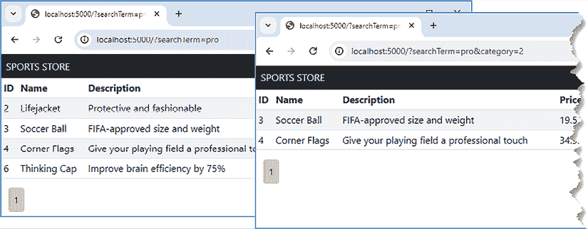

# SportsStore：导航和购物车

在本章中，我们将继续构建 SportsStore 应用程序，通过完成目录并添加一个购物车来实现，用户可以通过购物车进行产品选择。

# 准备本章内容

本章使用在*第十六章*中创建的 `sportsstore` 项目。本章不需要进行任何更改。打开一个新的命令提示符，导航到 `sportsstore` 文件夹，并运行*列表 17.1*中显示的命令以启动开发工具。

**提示**

您可以从[`github.com/PacktPublishing/Mastering-Node.js-Web-Development`](https://github.com/PacktPublishing/Mastering-Node.js-Web-Development)下载本章的示例项目——以及本书所有其他章节的示例项目。如果您在运行示例时遇到问题，请参阅*第一章*以获取帮助。

列表 17.1：启动开发工具

```js
npm start 
```

打开一个新的浏览器窗口，导航到 `http://localhost:5000`，您将看到以简单表格格式从数据库中读取的数据，如图*图 17.1*所示。


图 17.1：运行应用程序

# 导航目录

真正的在线商店有太多的产品，无法同时合理地展示给用户，通常提供工具来帮助用户找到并选择他们想要的产品。在接下来的部分中，我将向 SportsStore 添加功能，使用户能够通过选择显示的数据在目录中进行导航。

## 分页目录数据

分页向用户展示可管理的数据块，并提供控制按钮以从一页跳转到下一页。分页控件给用户一种数据量多少的感觉，并且每个页面需要服务器在每次响应中发送更少的数据，这可以减少用户等待数据显示的时间。分页的缺点是它需要服务器在用户导航数据时处理大量的 HTTP 请求和执行大量的数据库查询。

在处理数据页面的请求时，服务器需要知道每页显示多少项，以及用户想要获取哪一页的数据。为了生成分页控件，服务器还需要知道总共有多少项。*列表 17.2* 定义了描述查询细节和响应的新类型。

列表 17.2：在 src/data 文件夹中的 catalog_models.ts 文件中添加分页类型

```js
export interface  Product {
    id?: number;
    name: string;
    description: string;
    price: number;

    category?: Category;
    supplier?: Supplier;
}
export interface Category {
    id?: number;
    name: string;
    products?: Product[];
}
export interface Supplier {
    id?: number;
    name: string;

    products?: Product[];
}
**export interface ProductQueryParameters {**
 **pageSize?: number;**
 **page?: number;**
**}**
**export interface ProductQueryResult {**
 **products: Product[];**
 **totalCount: number;**
**}** 
```

`ProductQueryParameters` 接口允许将查询相关的分页要求提供给存储库。`ProductQueryResult` 接口描述了存储库将生成的响应，其中包含数据页和存储项的总数。这些类型将在添加其他数据导航功能时进行扩展。*列表 17.3* 修改了存储库接口中的产品查询方法以支持新类型。

列表 17.3：在 src/data 文件夹中的 catalog_repository.ts 文件中更改方法

```js
**import** **{ Category, Product, Supplier, ProductQueryParameters,**
 **ProductQueryResult } from "./catalog_models";**
export interface CatalogRepository {
    **getProducts(params?: ProductQueryParameters): Promise<ProductQueryResult>;**
    storeProduct(p: Product): Promise<Product>;
    getCategories() : Promise<Category[]>;
    storeCategory(c: Category): Promise<Category>;
    getSuppliers(): Promise<Supplier[]>;
    storeSupplier(s: Supplier): Promise<Supplier>;
} 
```

`getProducts` 方法现在接受一个可选的 `ProductQueryParameters` 参数，并返回一个 `ProductQueryResult` 结果。*列表 17.4* 更新了存储库的实现，以反映接口的变化。

列表 17.4：在 src/data/orm 文件夹中的 queries.ts 文件中使用新类型

```js
import { CategoryModel, ProductModel, SupplierModel } from "./models";
import { BaseRepo, Constructor } from "./core"
**import { ProductQueryParameters } from "../catalog_models";**
export function AddQueries<TBase extends Constructor<BaseRepo>>(Base: TBase) {
    return class extends Base {

       ** async** **getProducts(params?: ProductQueryParameters) {**
 **const opts: any = {};**
 **if (params?.page && params.pageSize) {**
 **opts.limit = params?.pageSize,**
 **opts.offset** **= (params.page -1) * params.pageSize** 
 **}**
 **const result = await ProductModel.findAndCountAll({** 
                include: [
                    {model: SupplierModel, as: "supplier" },
                    {model: CategoryModel, as: "category"}],
                raw: true, nest: true,
                ..**.opts**
 **});** 
 **return { products: result.rows, totalCount: result.count };**
        }
        getCategories() {
            return CategoryModel.findAll({raw: true, nest: true})
        }

        getSuppliers() {
            return SupplierModel.findAll({raw: true, nest: true});
        }       
    }
} 
```

如果 `getProducts` 方法接收到 `ProductQueryParameters` 参数，那么 Sequelize 查询将配置 `limit` 和 `offset` 属性，这些属性指定了应从数据库中读取的最大结果数量，以及开始读取结果之前应跳过的结果数量。这种属性组合将读取指定页面的数据。

查询是通过 `findAndCountAll` 方法执行的，该方法查找数据并包括数据库中与查询匹配的总项目数，无论这些项目中有多少包含在结果中。查询返回的数据和匹配项的总数组合用于创建 `ProductQueryParameters` 结果。*列表 17.5* 更新了 HTTP 处理程序，以便从查询字符串中读取分页详细信息并将其包含在调用存储库中。如果查询字符串不包含分页信息，则使用默认值选择每页四项的第 1 页。

列表 17.5：在 src/routes 文件夹中的 catalog.ts 文件中使用页面数据

```js
import { Express } from "express";
import { catalog_repository } from "../data";
export const createCatalogRoutes = (app: Express) => {
    app.get("/", async (req, resp) => {
        const page = Number.parseInt(req.query.page?.toString() ?? "1");
       ** const pageSize =Number.parseInt(req.query.pageSize?.toString() ?? "3");**
 **const res = await catalog_repository.****getProducts({ page, pageSize});**
 **resp.render("index", { ...res, page, pageSize,**
 **pageCount: Math.ceil(res.totalCount / (pageSize ?? 1))});**
    });
} 
```

您可以使用浏览器请求 `http://localhost:5000/?pageSize=3&page=2` 来检查数据是否已分页。URL 指定了每页三个项目的大小，并请求第 2 页，生成如 *图 17.2* 所示的结果。


图 17.2：显示数据页面

### 添加分页控件

现在数据可以分页后，下一步是为用户提供选择他们想要页面的能力。将一个名为 `page_controls.handlebars` 的文件添加到 `templates` 文件夹中，其内容如 *列表 17.6* 所示。

列表 17.6：在 templates 文件夹中的 page_controls.handlebars 文件的内容

```js
<div class="col">
    {{#pageButtons }}
        {{#if selected}}
            <button class="btn btn-sm btn-light active mr-1 p-2">
                {{index}}
            </button>
        {{else}}
        <a class="btn btn-sm btn-light mr-1 p-2"
            href="{{navigationUrl page=index }}">{{index}}</a>
        {{/if}}
    {{/pageButtons}}
</div> 
```

此模板依赖于两个辅助器，将在稍后定义。`pageButtons` 辅助器将重复生成每个页面内容的一个内容部分，使用模板提供的分页数据：

```js
...
{{#pageButtons }}
   // ...template content omitted for brevity...
{{/pageButtons}}
... 
```

在助手标签之间包含的内容将为每个可用的数据页面重复。每个内容块都提供了一个 `index` 值，该值指示正在生成控件的页面，以及一个 `selected` 值，该值指示当前页面是否是用户正在查看的页面。当 `selected` 值为 `true` 时，将显示一个不执行任何操作的按钮，格式化为活动状态以指示当前页面。对于其他页面，将显示一个锚点元素（带有 `a` 标签），格式化为非活动按钮。锚点元素的 `href` 属性使用名为 `navigationUrl` 的助手定义，该助手生成一个将导航到所选页面的 URL。要为目录定义模板助手，请将名为 `catalog_helpers.ts` 的文件添加到 `src/helpers` 文件夹中，其内容如 *列表 17.7* 所示。

列表 17.7：`src/helpers` 文件夹中 catalog_helpers.ts 文件的内容

```js
import { HelperOptions }  from "handlebars";
import { stringify } from "querystring";
import { escape } from "querystring";
const getData = (options:HelperOptions) => {
     return {...options.data.root, ...options.hash}
};
export const navigationUrl = (options: HelperOptions) => {
    const { page, pageSize } = getData(options);
    return "/?" + stringify({ page, pageSize });
}
export const escapeUrl = (url: string) => escape(url);
export const pageButtons = (options: HelperOptions) => {
    const { page, pageCount } = getData(options);
    let output = "";
    for (let i = 1; i <= pageCount; i++) {
        output += options.fn({
            page, pageCount, index: i, selected: i === page
        });
    }
    return output;
} 
```

助手函数接收一个 `HelperOptions` 参数，该参数提供了有用的上下文功能。`HelperOptions.hash` 属性用于以名称/值对的形式接收数据，并且是向助手提供结构化数据的有用方式，如下所示：

```js
...
href="{{navigationUrl page=index }}">{{index}}</a>
... 
```

`HelperOptions.data` 属性提供对上下文数据的访问，其 `root` 属性包含调用助手的模板中的数据。`getData` 方法将哈希数据中的值与根数据合并。

**注意**

Handlebars 包非常出色，但 `HelperOptions` 接口提供的并非所有功能都有文档说明，包括对 `data.root` 属性的使用。该包的将来版本可能会更改此属性的定义方式，因此您必须注意使用 *第十六章* 中指定的版本，或者检查文档和源代码以查看有哪些更改。

`navigationUrl` 助手函数接受一个 `HelperOptions` 参数，并使用它来生成一个相对 URL 路径，该路径将选择特定的页面，这是通过使用 Node.js 提供的 `querystring` 模块中的 `stringify` 函数来完成的，该函数用于创建和解析查询字符串：

```js
...
return "/?" + **stringify**({ page, pageSize });
... 
```

`pageButtons` 函数更为复杂，因为它需要生成内容块，这通过分配给 `HelperOptions.fn` 属性的函数来完成，该函数使用助手标签之间的元素生成内容。`escapeUrl` 助手对值进行编码，以便它可以包含在查询字符串中。

`pageButtons` 助手使用 `for` 循环和 `fn` 函数为每个数据页面创建内容，通过 `index` 和 `selected` 值补充共享的分页数据，这些值对每个页面是特定的。*列表 17.8* 将新的助手添加到模板引擎配置中。

列表 17.8：将助手添加到 `src/helpers` 文件夹中的 index.ts 文件

```js
import { Express } from "express";
import { getConfig } from "../config";
import { engine } from "express-handlebars";
import * as env_helpers from "./env";
**import** *** as catalog_helpers from "./catalog_helpers";**
const location = getConfig("templates:location");
const config = getConfig("templates:config");
export const createTemplates = (app: Express) => {
    app.set("views", location);
    app.engine("handlebars", engine({
        ...**config, helpers****: {...env_helpers, ...catalog_helpers}**
    }));
    app.set("view engine", "handlebars");
} 
```

最后一步是将 *列表 17.7* 中定义的局部模板包含到应用程序生成的内容中，如 *列表 17.9* 所示。

列表 17.9：在 templates 文件夹中的 index.handlebars 文件中使用分页部分视图

```js
<table class="table table-sm table-striped">
    <thead>
        <tr>
            <th>ID</th><th>Name</th><th>Description</th>
            <th>Price</th><th>Category</th><th>Supplier</th>
        </tr>
    </thead>
    <tbody>
        {{#each products }}
            <tr>
                <td>{{id}}</td><td>{{name}}</td>
                <td>{{description}}</td><td>{{price}}</td>
                <td>{{category.name}}</td><td>{{supplier.name}}</td>
            </tr>
        {{/each}}
    </tbody>
</table>
**{{> page_controls }}** 
```

使用浏览器请求 `http://localhost:5000/?pageSize=3`。`pageSize` 值指定每页三个数据项，并且从查询字符串中省略 `page` 值将默认为数据的第一页，如图 *图 17.3* 所示。将为每个可用的页面显示一个按钮，点击非活动按钮将选择不同的页面。


图 17.3：通过数据分页

### 改变页面大小

为了允许用户更改每页的项目数量，*列表 17.10* 创建了一个包含现有页面按钮以及一个填充了不同页面大小的**选择**按钮的网格。

列表 17.10：在 templates 文件夹中的 page_controls.handlebars 文件中添加一个选择按钮

```js
**<div** **class="container-fluid">**
 **<div class="row">**
        <div class="col">
            {{#pageButtons }}
                {{#if selected}}
                    <button class="btn btn-sm btn-light active mr-1 p-2">
                        {{index}}
                    </button>
                {{else}}
                <a class="btn btn-sm btn-light mr-1 p-2"
                    href="{{navigationUrl page=index }}">{{index}}</a>
                {{/if}}
            {{/pageButtons}}
        </div>
        <div class="col-auto text-end">        
        **    <form id="pageSizeForm" method="get">**
 **<select class="form-select"** **name="pageSize">**
 **{{#pageSizeOptions }}**
 **<option value="{{size}}" {{selected}}>**
 **{{size}} per page**
 **</option>**
 **{{/pageSizeOptions }}**
**</select>**
 **</form>** 
 **</div>**
 **<div class="col-auto">**
**<button class="btn btn-light mr-2" type="submit"**
 **form="pageSizeForm">Go</button>**
**</div>**
 **</div>**
**</div>** 
```

表单通过一个配置了 `form` 属性的 `button` 元素提交，这允许它位于网格中，而无需成为 `form` 元素的子元素。选项元素由一个名为 `pageSizeOptions` 的模板辅助工具创建，该工具在 *列表 17.11* 中定义。

列表 17.11：在 src/helpers 文件夹中的 catalog_helpers.ts 文件中定义一个辅助工具

```js
import { HelperOptions }  from "handlebars";
import { stringify } from "querystring";
import { escape } from "querystring";
// ...other helpers omitted for brevity...
**export const pageSizeOptions = (options: HelperOptions) => {**
 **const { pageSize } = getData(options);**
 **let output = ""****;**
 **[3, 6, 9].forEach(size => {**
 **output += options.fn({ size,**
 **selected: pageSize === size ? "selected": ""})**
 **})**
**return output;**
**}** 
```

辅助工具生成选项，允许用户选择每页**3**、**6**或**9**个项目，并将 `selected` 属性应用于匹配当前页面大小的 `option` 元素。使用浏览器请求 `http://localhost:5000`，从选择选项中选择**每页 6 项**，然后点击**前往**按钮。表单将提交一个指定新页面大小的 GET 请求，如图 *图 17.4* 所示。


图 17.4：改变页面大小

## 过滤目录数据

下一个导航特性将允许用户通过选择一个类别或提供搜索词来过滤目录。*列表 17.12* 向 `ProductQueryParameters` 接口添加了新的属性以支持过滤，并向 `ProductQueryResult` 接口添加了一个 `categories` 属性，以便用户可以看到一个类别列表。

列表 17.12：在 src/data 文件夹中的 catalog_models.ts 文件中添加对过滤的支持

```js
...
export interface ProductQueryParameters {
    pageSize?: number;
    page?: number;
  **  category?: number;**
 **searchTerm?: string;**
}
export interface ProductQueryResult {
    products: Product[];
    totalCount: number;
  **  categories: Category[];**
}
... 
```

*列表 17.13* 使用新属性查询数据库，根据搜索词和选定的类别过滤数据。

列表 17.13：在 src/data/orm 文件夹中的 queries.ts 文件中过滤数据

```js
import { CategoryModel, ProductModel, SupplierModel } from "./models";
import { BaseRepo, Constructor } from "./core"
import { ProductQueryParameters } from "../catalog_models";
**import { Op } from "sequelize";**
export function AddQueries<TBase extends Constructor<BaseRepo>>(Base: TBase) {
    return class extends Base {

        async getProducts(params?: ProductQueryParameters) {
            const opts: any = {};
            if (params?.page && params.pageSize) {
                opts.limit = params?.pageSize,
                opts.offset = (params.page -1) * params.pageSize               
            }
            **if(params?.searchTerm) {**
 **const** **searchOp = { [Op.like]: "%" + params.searchTerm + "%"};**
 **opts.where = {**
 **[Op.or]: { name: searchOp, description****: searchOp }**
 **}**
 **}**
 **if (params?.category) {**
 **opts.where = {**
 **...opts.where,  categoryId: params.category**
 **}**
 **}**
            const result = await ProductModel.findAndCountAll({               
                include: [
                    {model: SupplierModel, as: "supplier" },
                    {model: CategoryModel, as: "category"}],
                raw: true, nest: true,
                ...opts
            });              
          **  const categories = await this.getCategories();**
 **return { products: result.rows****, totalCount: result.count, categories };**
        }
        getCategories() {
            return CategoryModel.findAll({raw: true, nest: true})
        }

        getSuppliers() {
            return SupplierModel.findAll({raw: true, nest: true});
        }       
    }
} 
```

*列表 17.13*中的更改检查`ProductQueryParameters`对象，并引入一个`where`子句来限制数据库查询。通过要求特定的`categoryId`值来进行类别过滤。搜索更为复杂。一些数据库服务器支持在数据上执行全文搜索，但 Sequelize 不支持这一点，这就是为什么使用`like`操作的原因。当用户提供搜索词时，`where`子句用于匹配使用名称或描述值的数据。像大多数 ORM 一样，Sequelize 专注于广泛且一致支持的功能，这意味着并非数据库服务器的每个功能都可用。尽管如此，你可以执行原始 SQL 查询来访问任何功能，如*第十二章*中所示。

*列表 17.14* 更新了 HTTP 请求处理器，以便从传递给存储库的查询字符串中读取类别和搜索词，并将它们包含在传递给模板引擎的数据中。

列表 17.14：在`src/routes`文件夹中的`catalog.ts`文件中支持过滤

```js
import { Express } from "express";
import { catalog_repository } from "../data";
export const createCatalogRoutes = (app: Express) => {
    app.get("/", async (req, resp) => {
        const page = Number.parseInt(req.query.page?.toString() ?? "1");
        const pageSize =Number.parseInt(req.query.pageSize?.toString() ?? "3")
       ** const searchTerm = req.query.searchTerm?.toString();**
**const category = Number.parseInt(req.query.category?.toString() ?? "")**
 **const res = await catalog_repository.getProducts({ page, pageSize,**
 **searchTerm, category});**
 **resp.****render("index", { ...res, page, pageSize,**
 **pageCount: Math.ceil(res.totalCount / (pageSize ?? 1)),**
 **searchTerm, category**
 **});**
    });
} 
```

要确认过滤功能是否正常工作，请使用浏览器请求`http://localhost:5000/?searchTerm=pro`，这将过滤包含术语`pro`的产品名称或描述的数据。要包含类别过滤器，请请求`http://localhost:5000/?searchTerm=pro&category=2`，这将进一步限制数据到`Soccer`类别中的产品。这两组结果都显示在*图 17.5*中。



图 17.5：使用查询字符串参数过滤数据

### 添加过滤控件

提供用户过滤控件意味着展示一个类别按钮列表和一个用于输入搜索词的输入元素。将一个名为`category_controls.handlebars`的文件添加到`templates`文件夹中，其内容如*列表 17.15*所示。

列表 17.15：`templates`文件夹中`category_controls.handlebars`文件的内容

```js
<div class="d-grid gap-2 py-2">
    <a class="btn btn-outline-secondary"
        href="{{navigationUrl category="" page=1 searchTerm="" }}">
            Home
    </a>
    {{#categoryButtons  }}
        {{#if selected }}
            <a class="btn btn-secondary">{{ name }}</a>
        {{else }}
            <a class="btn btn-outline-secondary"
                href="{{navigationUrl category=id page=1}}">
                {{ name }}
            </a>
        {{/if }}
    {{/categoryButtons }}
</div> 
```

此模板依赖于一个名为`categoryButtons`的辅助器来生成用于类别导航的按钮。辅助器将提供一个`selected`值，该值用于决定是否生成一个不活动的占位符（用于所选类别）或一个使用`navigationUrl`创建的`href`属性来选择类别的锚元素。还有一个始终存在的`Home`按钮，它选择所有类别。

在生成`href`属性的 URL 时，此模板将除`category`之外的其他导航值设置为默认值，以确保用户看到有用的内容。对于`Home`按钮，这意味着清除`searchTerm`值并选择内容的第一页：

```js
...
<a class="btn btn-outline-secondary"
    href="{{navigationUrl category="" page=1 searchTerm="" }}">
... 
```

设置这些值给用户一个重置选项，只保留`pageSize`选项不变。对于选择类别的按钮，`page`值将被重置：

```js
...
<a class="btn btn-outline-secondary"
    href="{{navigationUrl category=id page=1}}">
... 
```

这确保了当用户从一个产品众多的类别移动到一个产品较少的类别时，始终会看到产品，并防止显示空页面。*列表 17.16* 定义了 `categoryButtons` 辅助函数并更新了 `navigationUrl` 辅助函数，以便它在其创建的 URL 中包含类别和搜索词选择。

列表 17.16：在 src/helpers 文件夹中的 catalog_helpers.ts 文件中支持过滤

```js
import { HelperOptions }  from "handlebars";
import { stringify } from "querystring";
import { escape } from "querystring";
const getData = (options:HelperOptions) => {
     return {...options.data.root, ...options.hash}
};
export const navigationUrl = (options: HelperOptions) => {
    **const { page, pageSize, category, searchTerm } = getData(options);**
 **return "/?" + stringify({ page, pageSize, category, searchTerm  });**
}
export const escapeUrl = (url: string) => escape(url);
export const pageButtons = (options: HelperOptions) => {
    const { page, pageCount } = getData(options);
    let output = "";
    for (let i = 1; i <= pageCount; i++) {
        output += options.fn({
            page, pageCount, index: i, selected: i === page
        });
    }
    return output;
}
export const pageSizeOptions = (options: HelperOptions) => {
    const { pageSize } = getData(options);
    let output = "";
    [3, 6, 9].forEach(size => {
        output += options.fn({ size,
            selected: pageSize === size ? "selected": ""})
    })
    return output;
}
**export const categoryButtons = (options: HelperOptions) => {**
 **const { category, categories } = getData****(options);**
 **let output = "";**
 **for (let i = 0; i < categories.length; i++) {**
 **output += options.fn({**
 **id: categories[i].id****,**
 **name: categories[i].name,**
 **selected: category === categories[i].id**
 **})**
 **}**
 **return output;**
} 
```

要添加输入搜索词的支持，请将一个名为 `search_controls.handlebars` 的文件添加到 `templates` 文件夹中，其内容如 *列表 17.17* 所示。

列表 17.17：模板文件夹中的 search_controls.handlebars 文件的内容

```js
<form class="row row-cols my-2" method="get">
    <div class="col">
        <input type="hidden" name="pageSize" value="{{pageSize}}">
        <input type="hidden" name="category" value="{{category}}">
        <input class="form-control" name="searchTerm"
            placeholder="Product Search" value="{{searchTerm}}">
    </div>
    <div class="col-auto">
        <button class="btn btn-small btn-secondary" type="submit">
            Search
        </button>
    </div>
</form> 
```

此模板包含一个表单，其中包含一个 `input` 元素，用于输入搜索词，以及一个提交表单的按钮。表单通过 `GET` 请求提交，并且有隐藏的 `input` 元素以确保 `pageSize` 和 `category` 值与搜索词一起包含在发送到服务器的查询字符串中。*列表 17.18* 将新模板集成到用户看到的内容中。

列表 17.18：在模板文件夹中的 index.handlebars 文件中集成过滤

```js
**<div** **class="container-fluid">**
 **<div class="row">**
 **<div class="col-2"****>**
 **{{> category_controls }}**
 **</div>**
 **<div class="col">**
 **{{> search_controls }}**
            <table class="table table-sm table-striped">
                <thead>
                    <tr>
                        <th>ID</th><th>Name</th><th>Description</th>
                        <th>Price</th><th>Category</th><th>Supplier</th>
                    </tr>
                </thead>
                <tbody>
                    {{#each products }}
                        <tr>
                            <td>{{id}}</td><td>{{name}}</td>
                            <td>{{description}}</td><td>{{price}}</td>
                            <td>{{category.name}}</td>
                            <td>{{supplier.name}}</td>
                        </tr>
                    {{/each}}
                </tbody>
            </table>
            {{> page_controls }}
        </div>
    </div>
</div> 
```

使用浏览器请求 `http://localhost:5000`，在搜索字段中输入 `pro` 并点击 **搜索** 按钮以过滤匹配项。点击 **足球** 按钮进一步过滤到一个类别。两个结果都显示在 *图 17.6* 中。


图 17.6：使用数据过滤控件

## 更新产品显示

完成目录的最后一步是改进产品显示方式，为后续功能奠定基础。在 `templates` 文件夹中创建一个名为 `product.handlebars` 的文件，其内容如 *列表 17.19* 所示。

列表 17.19：模板文件夹中的 product.handlebars 文件的内容

```js
<div class="card card-outline-primary m-1 p-1">
    <div class="bg-faded p-1">
        <h4>
            {{ highlight name }}
            <span class="badge rounded-pill bg-primary text-white"
                   style="float:right">
                <small>{{ currency price }}</small>
            </span>
        </h4>
    </div>
    <div class="card-text p-1">{{ highlight description }}</div>
</div> 
```

此模板显示单个产品的卡片，使用 Bootstrap CSS 包中的样式进行布局。模板依赖于两个辅助函数：`highlight` 辅助函数将强调搜索词，而 `currency` 辅助函数将格式化价格，如 *列表 17.20* 所示。

列表 17.20：在 src/helpers 文件夹中的 catalog_helpers.ts 文件中添加辅助函数

```js
**import Handlebars, { HelperOptions }  from "handlebars";**
import { stringify } from "querystring";
import { escape } from "querystring";
// ...other helpers omitted for brevity...
**export const highlight = (value: string, options: HelperOptions****) => {**
 **const { searchTerm } = getData(options);**
 **if (searchTerm && searchTerm !== "") {**
 **const regexp = new RegExp(searchTerm, "ig");**
 **const mod = value.replaceAll****(regexp, "<strong>$&</strong>");**
 **return new Handlebars.SafeString(mod);** 
 **}**
 **return value;**
**}**
**const formatter = new Intl.****NumberFormat("en-us", {**
 **style: "currency", currency: "USD"**
**})**
**export const currency = (value: number****) => {**
 **return formatter.format(value);**
**}** 
```

`highlight` 辅助函数使用 JavaScript 正则表达式将搜索词用 `strong` 元素包裹，这告诉浏览器使用粗体字体。模板引擎会自动清理辅助函数的结果，因此必须使用 `HandleBars.SafeString` 函数，以确保辅助函数生成的 HTML 元素保持不变。`currency` 辅助函数将数值格式化为美元金额，使用内置的国际化 API。

**理解延迟本地化的影响**

本地化一个产品需要时间、精力和资源，并且需要由了解目标国家或地区语言、文化和货币惯例的人来完成。如果你没有正确本地化，那么结果可能比没有本地化还要糟糕。

正是因为这个原因，我在这本书中（或我的任何一本书中）没有详细描述本地化功能，以及为什么 SportsStore 应用程序中的货币值被硬编码为 `USD`。至少，如果一个产品没有本地化，用户就知道自己的位置，不必试图弄清楚你是否只是忘记更改货币代码，或者这些价格是否真的是美元。 (这是我在居住在英国时经常看到的问题。)

你应该本地化你的产品。你的用户应该能够以对他们有意义的方式进行业务或其他操作。但是，你必须认真对待，并分配完成它所需的时间和精力。如果你无法投入资源，那么最好的选择就是什么都不做。

*列表 17.21* 用新的模板替换了我们本章开始时使用的占位符表。

列表 17.21：在模板文件夹中的 index.handlebars 文件中使用产品模板

```js
<div class="container-fluid">
    <div class="row">
        <div class="col-2">
            {{> category_controls }}
        </div>
        <div class="col">
            {{> search_controls }}   
            **{{#unless products}}<h4>****No products</h4>{{/unless}}**
 **{{#each products }}**
 **{{> product this }}**
 **{{/each}}**
            {{> page_controls }}
        </div>
    </div>
</div> 
```

使用浏览器请求 `http://localhost:5000`，你将看到新的产品布局。执行搜索后，你将在产品列表中看到高亮显示的匹配项，如图 *图 17.7* 所示。


图 17.7：更新产品显示

# 创建购物车

现在用户可以看到并导航销售的产品，下一步是添加一个购物车，允许他们在结账前进行选择。对于 SportsStore 应用程序，购物车数据将使用会话处理，这样当会话过期时，产品选择就会被丢弃。

## 添加秘密的配置支持

`SportsStore` 应用程序将使用 cookies 将请求与一个会话关联起来，并且这些 cookies 将被签名以防止它们被篡改。签名和验证过程需要一个只有应用程序知道的秘密密钥。

秘密密钥以及更广泛地说，任何秘密信息，可能难以管理。基本规则是，秘密不应该被硬编码到应用程序中，因为这会使它们在没有发布新版本到生产中时无法更改。

但是，除了不硬编码之外，如何管理秘密的细节取决于应用程序、开发组织和生产平台。例如，大多数云托管平台都提供用于存储秘密的保险库。

保险库中填充了秘密，当需要时应用程序会请求这些秘密，这意味着开发人员、测试人员和运维人员可以在不需要访问秘密的情况下完成他们的工作。

在大型组织中，当密钥由开发组织外的安全人员管理时，保险库工作得很好，但它们可能难以使用，并且必须在开发环境中复制。

密钥可以存储在配置文件中，与应用程序的其余设置一起。这样做是可行的，但这也意味着密钥将对开发者可见，并且需要小心处理，以免在将配置文件提交到公开可访问的源代码仓库或将私有仓库存储在组织外部可以访问的云存储上时泄露密钥。

密钥通常使用环境变量定义。想法是环境变量不是持久的，因此不可能意外地包含在源代码提交中。现实是设置环境变量可能很麻烦，尤其是处理长序列的随机字符的密钥时，因此它们通常使用脚本文件定义，这会带来与常规配置文件相同的问题。

每种方法都有其缺点，没有一种单一的最好解决方案。我首选的方法是通过扩展配置系统来将密钥的提供与其他应用程序部分隔离开来。这使得更改存储密钥的方式变得容易，这可能会随着项目的演变而发生变化。幕后，我将使用环境变量来存储密钥，但这对应用程序的其他部分来说并不明显。定义环境变量的最简单和最一致的方式是使用一个 *env 文件*，它是一个包含键/值对的简单文本文件。为了添加对读取 env 文件的支持，请在 `sportsstore` 文件夹中运行 *列表 17.22* 中显示的命令来安装一个新的包。

**提示**

Node.js 确实内置了对读取 env 文件的支持（使用 `--env-file` 参数，但该包提供了更多控制文件何时读取以及如何处理内容的方式）。

列表 17.22：安装包

```js
npm install dotenv@16.4.4 
```

*表 17.1* 描述了此包以供快速参考。

表 17.1：env 文件包

| 名称 | 描述 |
| --- | --- |

|

```js
`dotenv` 
```

| 此包读取 `.env` 文件，并将它们的内 容作为环境变量呈现。 |
| --- |

在 `sportstore` 文件夹中添加一个名为 `development.env`（点后跟 `env`）的文件，其内容如 *列表 17.23* 所示。

列表 17.23：sportsstore 文件夹中 development.env 文件的内容

```js
# secret used to sign session cookies
COOKIE_SECRET="sportsstoresecret" 
```

env 文件包含一个条目，名为 `COOKIE_SECRET`。*列表 17.24* 使用 `dotenv` 包读取 env 文件并添加了一个获取密钥的函数。

列表 17.24：在 src/config 文件夹中的 index.ts 文件中支持密钥

```js
import { readFileSync } from "fs";
import { getEnvironment, Env } from "./environment";
import { merge } from "./merge";
import { config as dotenvconfig } from "dotenv";
const file = process.env.SERVER_CONFIG ?? "server.config.json"
const data = JSON.parse(readFileSync(file).toString());
**dotenvconfig({**
 **path: getEnvironment().toString() + ".env"**
**})**
try {
    const envFile = getEnvironment().toString() + "." + file;
    const envData = JSON.parse(readFileSync(envFile).toString());
    merge(data, envData);
} catch {
    // do nothing - file doesn't exist or isn't readable
}
export const getConfig = (path: string, defaultVal: any = undefined) => {
    const paths = path.split(":");
    let val = data;
    paths.forEach(p => val = val[p]);
    return val ?? defaultVal;
}
**export const getSecret = (name: string) => {**
 **const secret = process.env[name];**
 **if (secret === undefined) {**
**throw new Error(`Undefined secret: ${name}`);**
 **}**
 **return secret;**
**}**
export { getEnvironment, Env }; 
```

使用 `dotenv` 模块定义的 `config` 函数通过名称 `dotenvconfig` 导入，并用于加载环境文件。为了支持不同部分的过程环境文件，使用 `getEnvironment` 方法来制定将要读取的文件名，因此在开发期间读取 `development.env` 文件，当应用程序部署时读取 `production.env` 文件。这意味着使用“真实”的环境变量来决定加载包含额外环境变量的文件。这可能会有些令人困惑，但在实践中效果很好。

`getSecret` 函数被导出以供应用程序的其他部分使用，允许请求密钥而无需知道它们是如何配置的。对于未定义的密钥没有合理的回退值可以使用，因此如果 `getSecret` 函数无法提供值，它会抛出一个错误。

## 创建会话中间件

下一步是启用会话，这将允许在 HTTP 请求之间持久化产品选择。在 `sportsstore` 文件夹中运行 *列表 17.25* 中显示的命令以安装支持会话的包。

列表 17.25：安装会话包

```js
npm install express-session@1.17.3
npm install connect-session-sequelize@7.1.7
npm install --save-dev @types/cookie-parser@1.4.6
npm install --save-dev @types/express-session@1.17.10 
```

这些包通过 Sequelize ORM 包支持处理 cookie、管理会话以及在 SQL 数据库中存储会话数据。*表 17.2* 描述了这些包以供快速参考。

表 17.2：cookie 和会话包

| 名称 | 描述 |
| --- | --- |

|

```js
`express-session` 
```

| 此包为 Express 添加基于 cookie 的会话。 |
| --- |

|

```js
`connect-session-sequelize` 
```

| 此包使用 `Sequelize` 存储会话数据。 |
| --- |

|

```js
`@types/cookie-parser` 
```

| 此包包含类型描述。 |
| --- |

|

```js
`@types/express-session` 
```

| 此包包含类型描述。 |
| --- |

要启用会话，请将名为 `sessions.ts` 的文件添加到 `src` 文件夹中，其内容如 *列表 17.26* 所示。

列表 17.26：src 文件夹中 sessions.ts 文件的内容

```js
import { Express } from "express";
import { Sequelize } from "sequelize";
import { getConfig, getSecret } from "./config";
import session from "express-session";
import sessionStore from "connect-session-sequelize";
const config = getConfig("sessions");
const secret = getSecret("COOKIE_SECRET");
const logging = config.orm.logging
        ? { logging: console.log, logQueryParameters: true}
        : { logging: false };
export const createSessions = (app: Express) => {
    const sequelize = new Sequelize({
        ...config.orm.settings, ...logging
    });
    const store = new (sessionStore(session.Store))({
        db: sequelize
    });
    if (config.reset_db === true) {
        sequelize.drop().then(() => store.sync());
    } else {
        store.sync();
    }
    app.use(session({
        secret, store,
        resave: true, saveUninitialized: false,
        cookie: { maxAge: config.maxAgeHrs * 60 * 60 * 1000,
            sameSite: "strict" }
    }));
} 
```

`createSessions` 函数读取配置数据，并使用它来配置 `Sequelize` 并通过签名 cookie 设置会话中间件。将 *列表 17.27* 中显示的配置设置添加到定义数据库和会话年龄的值。

**注意**

每次应用程序启动时都会重置会话数据库。当检测到文件更改时，开发工具会重新启动应用程序，这意味着任何代码或配置更改都会删除所有存储的会话。

列表 17.27：在 sportsstore 文件夹中的 server.config.json 文件中添加设置

```js
{
    "http": {
        "port": 5000
    },
    "templates": {
        // ...settings omitted for brevity...
    },
    "errors": {
        "400": "not_found",
        "500": "error"
    },
    "catalog": {
        // ...settings omitted for brevity...
    },
   ** "sessions": {**
 **"****maxAgeHrs": 2,**
 **"reset_db": true,**
 **"orm": {**
 **"settings": {**
 **"dialect": "sqlite",**
 **"storage": "sessions.db"**
 **},**
 **"logging":** **true**
 **}**
 **}**
} 
```

*列表 17.28* 在应用程序启动时启用会话中间件。

列表 17.28：在 sportsstore 文件夹中的 server.ts 文件中启用中间件

```js
import { createServer } from "http";
import express, { Express } from "express";
import helmet from "helmet";
import { getConfig } from "./config";
import { createRoutes } from "./routes";
import { createTemplates } from "./helpers";
import { createErrorHandlers } from "./errors";
**import { createSessions } from "./sessions";**
const port = getConfig("http:port", 5000);
const expressApp: Express = express();
expressApp.use(helmet());
expressApp.use(express.json());
expressApp.use(express.urlencoded({extended: true}))
expressApp.use(express.static("node_modules/bootstrap/dist"));
createTemplates(expressApp);
**createSessions(expressApp);**
createRoutes(expressApp);
createErrorHandlers(expressApp);
const server = createServer(expressApp);
server.listen(port,
    () => console.log(`HTTP Server listening on port ${port}`)); 
```

启用会话不会改变应用程序的行为方式，但为下一节中定义的购物车奠定了基础。

## 定义购物车数据模型

要描述购物车，请将名为 `cart_models.ts` 的文件添加到 `src/data` 文件夹中，其内容如 *列表 17.29* 所示。

列表 17.29：src/data 文件夹中 cart_models.ts 文件的内容

```js
export interface CartLine {
    productId: number;
    quantity: number;
}
export interface Cart {
    lines: CartLine[];
}
export const createCart = () : Cart => ({ lines: [] });
export const addLine = (cart: Cart, productId: number, quantity: number) => {
    const line = cart.lines.find(l => l.productId == productId);
    if (line !== undefined) {
        line.quantity += quantity;
    } else {
        cart.lines.push({ productId, quantity })
    }
}
export const removeLine = (cart: Cart, productId: number) => {
    cart.lines = cart.lines.filter(l => l.productId !== productId);
} 
```

`Cart`接口表示一个购物车，每个产品选择由一个`CartLine`对象表示，标识选定的产品和客户所需的数量。购物车数据将作为 JSON 数据存储在会话数据库中，这就是为什么`createCart`、`addLine`和`removeLine`函数没有在类中定义，因为 JSON 数据被反序列化为一个普通的 JavaScript 对象。

## 扩展目录仓库

需要一个新的查询来显示用户购物车的摘要，如*列表 17.30*所示。

列表 17.30：在 src/data 文件夹中的 catalog_repository.ts 文件中添加一个方法

```js
import { Category, Product, Supplier, ProductQueryParameters,
    ProductQueryResult } from "./catalog_models";
export interface CatalogRepository {
    getProducts(params?: ProductQueryParameters): Promise<ProductQueryResult>;
  **  getProductDetails(ids: number[]): Promise<Product[]>;**
    storeProduct(p: Product): Promise<Product>;
    getCategories() : Promise<Category[]>;
    storeCategory(c: Category): Promise<Category>;
    getSuppliers(): Promise<Supplier[]>;
    storeSupplier(s: Supplier): Promise<Supplier>;
} 
```

代表选择的`CartLine`对象仅包含产品 ID 和数量。`getProductDetails`方法接受一个 ID 数组，并从目录中返回相应的`Product`对象。*列表 17.31*实现了使用 Sequelize 的新仓库方法。

列表 17.31：在 src/data/orm 文件夹中的 queries.ts 文件中实现一个方法

```js
import { CategoryModel, ProductModel, SupplierModel } from "./models";
import { BaseRepo, Constructor } from "./core"
import { ProductQueryParameters } from "../catalog_models";
import { Op } from "sequelize";
export function AddQueries<TBase extends Constructor<BaseRepo>>(Base: TBase) {
    return class extends Base {

        // ...methods omitted for brevity...

        getSuppliers() {
            return SupplierModel.findAll({raw: true, nest: true});
        }       
       ** getProductDetails(ids: number[]) {**
 **return ProductModel.findAll****({**
 **where: { id: { [Op.in]: ids }}, raw: true, nest: true,**
 **});**
 **}**
    }
} 
```

`getProductDetails`方法的实现使用 Sequelize 的`in`操作来选择其`id`属性包含在方法参数接收到的数组中的产品。结果是解析为产生`ProductModel`对象数组的`Promise`。

我保持了`Cart`类型简单，因为这将是在会话中存储的数据，因为大多数从用户接收到的请求都将读取这些数据（因为响应将包含购物车的摘要，该摘要在*创建购物车摘要*部分中创建）。要完全填充购物车以包含产品详情，这些详情将用于向用户显示购物车，请将一个名为`cart_helpers.ts`的文件添加到`src/data`文件夹中，其内容如*列表 17.32*所示。

列表 17.32：src/data 文件夹中 cart_helpers.ts 文件的内容

```js
import { catalog_repository } from ".";
import { Cart } from "./cart_models";
import { Product } from "./catalog_models"
export interface CartDetail {
    lines: {
        product: Product,
        quantity: number,
        subtotal: number
    }[],
    total: number;
}
export const getCartDetail = async (cart: Cart) : Promise<CartDetail> => {
    const ids = cart.lines.map(l => l.productId);
    const db_data = await catalog_repository.getProductDetails(ids);
    const products = Object.fromEntries(db_data.map(p => [p.id, p]));
    const lines = cart.lines.map(line => ({
        product: products[line.productId],
        quantity: line.quantity,
        subtotal: products[line.productId].price * line.quantity
    }));
    const total = lines.reduce((total, line) => total + line.subtotal, 0);
    return { lines, total }
} 
```

`getCartDetail`函数接受一个`Cart`对象，并返回一个`CartDetail`，其中包含提供购物车详细视图所需的所有附加信息，包括每个产品选择的子总金额，以及总金额。

**注意**

一些收集详细数据所需的操作是异步的，这意味着它们不能由模板助手执行，因为模板助手必须是同步的。

## 创建 HTTP 路由和中间件

下一步是定义 HTTP 请求的路由和处理程序，以便可以将产品添加到购物车中，并从购物车中删除产品，以及显示购物车的内容。将一个名为`cart.ts`的文件添加到`src/routes`文件夹中，其内容如*列表 17.33*所示。

列表 17.33：src/routes 文件夹中 cart.ts 文件的内容

```js
import { Express } from "express";
import { escape, unescape } from "querystring";
import { Cart, addLine, createCart, removeLine } from "../data/cart_models";
import * as cart_helpers from "../data/cart_helpers";
declare module "express-session" {
    interface SessionData {
       cart?: Cart;
    }
}
export const createCartMiddleware = (app: Express) => {
    app.use((req, resp, next) => {
        resp.locals.cart = req.session.cart = req.session.cart ?? createCart()
        next();
    })
}
export const createCartRoutes = (app: Express) => {

    app.post("/cart", (req, resp) => {
        const productId = Number.parseInt(req.body.productId);
        if (isNaN(productId)) {
            throw new Error("ID  must be an integer");
        }
        addLine(req.session.cart as Cart, productId, 1);
        resp.redirect(`/cart?returnUrl=${escape(req.body.returnUrl ?? "/")}`);
    });
    app.get("/cart", async (req, resp) => {
        const cart = req.session.cart as Cart;
        resp.render("cart", {
            cart: await cart_helpers.getCartDetail(cart),
            returnUrl: unescape(req.query.returnUrl?.toString() ?? "/")
        });
    });
    app.post("/cart/remove", (req, resp) => {
        const id = Number.parseInt(req.body.id);
        if (!isNaN(id)) {
            removeLine(req.session.cart as Cart, id);
        }
        resp.redirect(`/cart?returnUrl=${escape(req.body.returnUrl ?? "/")}`);
    });
} 
```

使用`declare`语句在`SessionData`接口上定义一个`cart`属性，以便 TypeScript 编译器理解购物车是会话数据的一部分。

`createCartMiddleware` 函数创建一个中间件组件，从会话中获取购物车，如果没有购物车则创建一个，并将购物车设置为模板引擎使用的本地数据。`createCartRoutes` 函数定义了三个路由。发送到 `/cart` URL 的 `HTTP` `POST` 请求将向用户的购物车添加一个产品，而发送到 `/cart/remove` URL 的 `POST` 请求将移除一个产品。

（大多数浏览器允许 HTML 表单只发送 `GET` 和 `POST` 请求，这就是为什么添加和移除产品都使用 `POST` 请求）。对这些处理程序发出的请求可以包括一个 `returnUrl` 值，在修改购物车后，浏览器将重定向到该值。该值使用 Node.js 在 `querystring` 模块中提供的 `encode` 和 `decode` 函数进行处理，这使得该值可以在需要执行重定向之前安全地传递。 

第三条路由处理发送到 `/cart` URL 的 `GET` 请求，并显示购物车的商品内容。`Cart` 对象中包含的数据必须通过使用 `getProductDetails` 存储库方法获得的数据进行补充。*列表 17.34* 启用了新的中间件和路由。

列表 17.34：在 src/routes 文件夹中的 index.ts 文件中启用路由

```js
import { Express } from "express";
import { createCatalogRoutes } from "./catalog";
import { createCartMiddleware, createCartRoutes } from "./cart";
export const createRoutes = (app: Express) => {
 **createCartMiddleware(app);**
    createCatalogRoutes(app);
   ** createCartRoutes(app);**
} 
```

这些路由是在处理目录请求的路由之后启用的，中间件配置是在所有路由之前完成的。

## 创建模板

购物车显示将是一个表格，显示所选产品以及允许从购物车中移除项目的按钮。要定义表格行的模板，请将名为 `cart_line.handlebars` 的文件添加到 `templates` 文件夹中，其内容如 *列表 17.35* 所示。

列表 17.35：模板文件夹中 cart_line.handlebars 文件的内容

```js
<tr>
    <td class="text-end">{{ quantity }} </td>   
    <td class="text-left">{{ product.name }}</td>
    <td class="text-end">{{ currency product.price }}</td>
    <td class="text-end">{{ currency subtotal }}</td>
    <td class="text-center">
        <form method="post" action="/cart/remove">
            <input type="hidden" name="id" value="{{ product.id }}">
            <input type="hidden" name="returnUrl" value="{{ returnUrl }}">
            <button type="submit" class="btn btn-sm btn-danger">
                Remove
            </button>
        </form>
    </td>
</tr> 
```

此模板定义了包含单个产品详细信息的表格单元格：所选数量、产品名称、单价和总计。价格和总计使用 `currency` 辅助函数进行格式化。最后的表格单元格包含一个 HTML 表单，该表单呈现一个**移除**按钮，该按钮发送一个 HTTP POST 请求到 `/cart/remove` URL，这将从购物车中移除一个产品。要定义整个表格的模板，请将名为 `cart.handlebars` 的文件添加到 `templates` 文件夹中，其内容如 *列表 17.36* 所示。

列表 17.36：模板文件夹中 cart.handlebars 文件的内容

```js
<h2>Your cart</h2>
<table class="table table-bordered table-striped">
    <thead>
        <tr>
            <th class="text-end">Quantity</th><th>Item</th>
            <th class="text-end">Price</th><th class="text-end">Subtotal</th>
            <th></th>
        </tr>
    </thead>
    <tbody>
        {{#unless cart.lines}}
            <tr><td colspan="5" class="text-center">Cart is empty</td></tr>
        {{/unless}}
        {{#each cart.lines}}
            {{> cart_line returnUrl=../returnUrl }}       
        {{/each }}
    </tbody>
    <tfoot>
        <tr>
            <td colspan="3" class="text-end">Total:</td>
            <td class="text-end">{{ currency cart.total }}</td>
        </tr>
    </tfoot>
</table>
<div class="text-center">
    <a class="btn btn-primary" href="{{ returnUrl }}">Continue Shopping</a>
    {{#if cart.lines}}
        <a class="btn btn-primary" href="/checkout">Checkout</a>
    {{else}}
        <button class="btn btn-primary" disabled>Checkout</button>
    {{/if}}
</div> 
```

Handlebars 模板引擎提供的一个有用功能是提供带有参数的局部模板。在这种情况下，`cart_line` 局部模板提供了一个 `returnUrl` 参数：

```js
...
{{#each cart.lines}}
    {{> cart_line **returnUrl**=../returnUrl }}       
{{/each }}    
... 
```

此参数可以通过名称引用，并与通常可用于部分的数据结合。`each` 助手更改用于解析模板表达式的上下文，这使得为序列中的每个项目生成内容变得容易，并且在 `each` 块内，表达式是对当前项目进行评估的。`../` 前缀允许模板表达式访问 `each` 助手获取其值的原始上下文，并用于向部分模板提供 `returnUrl` 参数的值。

最后一步是在产品模板中添加一个按钮，以便用户可以选择产品，如 *清单 17.37* 所示。

清单 17.37：在模板文件夹中的 product.handlebars 文件中添加产品选择

```js
<div class="card card-outline-primary m-1 p-1">
    <div class="bg-faded p-1">
        <h4>
            {{ highlight name }}
            <span class="badge rounded-pill bg-primary text-white"
                   style="float:right">
                <small>{{ currency price }}</small>
            </span>
        </h4>
    </div>
    <div class="card-text p-1">
        **<span class="float-start">{{ highlight description }}</span>**
 **<****form method="post" action="/cart">**
 **<input type="hidden" name="****returnUrl" value="{{navigationUrl}}">**
 **<input type="hidden" name="productId" value="****{{id}}">**
 **<button type="submit" class="btn btn-sm btn-success float-end">**
 **Add To Cart**
 **</button>**
 **</****form>**
    </div>
</div> 
```

使用浏览器请求 `http://localhost:5000` 并点击其中一个产品的 **添加到购物车** 按钮。该产品将被添加到购物车中，并显示购物车详情，如图 *图 17.8* 所示。点击 **移除** 按钮将从购物车中移除产品，点击 **继续购物** 按钮将返回目录。 （在实现结账过程之前，点击 **结账** 按钮将产生错误。）


图 17.8：使用购物车

# 创建购物车摘要

为了完成本章内容，我将在目录页面上添加购物车摘要，以便用户可以看到他们选择了多少产品，并轻松地导航到购物车详情。在 `sportsstore` 文件夹中运行 *清单 17.38* 中显示的命令，以向项目中添加用于购物车摘要的包。

清单 17.38：添加包

```js
npm install bootstrap-icons@1.11.3 
```

Bootstrap Icons 包是一组可以轻松用于 HTML 内容的图标。*表 17.3* 描述了此包，以便快速参考。

表 17.3：Bootstrap Icons 包

| 名称 | 描述 |
| --- | --- |

|

```js
`bootstrap-icons` 
```

| 此包包含一个可以应用于 HTML 内容的图标库。 |
| --- |

购物车摘要将显示购物车中的产品总数，这需要模板助手。将名为 `cart_helpers.ts` 的文件添加到 `src/helpers` 文件夹中，其内容如 *清单 17.39* 所示。

清单 17.39：src/helpers 文件夹中 cart_helpers.ts 文件的内容

```js
import { Cart } from "../data/cart_models";
export const countCartItems = (cart: Cart) : number =>
    cart.lines.reduce((total, line) => total + line.quantity, 0); 
```

*清单 17.40* 将新助手添加到模板引擎配置中。

清单 17.40：在 src/helpers 文件夹中的 index.ts 文件中添加助手

```js
import { Express } from "express";
import { getConfig } from "../config";
import { engine } from "express-handlebars";
import * as env_helpers from "./env";
import * as catalog_helpers from "./catalog_helpers";
**import** *** as cart_helpers from "./cart_helpers";**
const location = getConfig("templates:location");
const config = getConfig("templates:config");
export const createTemplates = (app: Express) => {
    app.set("views", location);
    app.engine("handlebars", engine({
        ...config,
        **helpers****: {...env_helpers, ...catalog_helpers, ...cart_helpers}**
    }));
    app.set("view engine", "handlebars");
} 
```

在 `templates` 文件夹中添加一个名为 `cart_summary.handlebars` 的文件，其内容如 *清单 17.41* 所示。

清单 17.41：src/templates 文件夹中 cart_summary.handlebars 文件的内容

```js
{{#if cart.lines}}
    <small class="navbar-text">{{ countCartItems cart }} item(s)</small>
{{else}}
    <small class="navbar-text">(Empty)</small>
{{/if}}
<a class="btn btn-sm btn-secondary navbar-btn" 
    href="/cart?returnUrl={{ escapeUrl ( navigationUrl ) }}">
    <i class="bi-cart"></i>
</a> 
```

新模板显示一条小消息，指示购物车的内容，以及一个允许导航查看购物车内容的按钮。该按钮是一个锚元素，其内容是一个 `i` 元素，这是显示 Bootstrap Icons 包中图标的方式：

```js
...
<a class="btn btn-sm btn-secondary navbar-btn"  href="/cart{{returnUrl}}">
   ** <i class="bi-cart"></i>**
</a>
... 
```

此元素显示购物车图标，您可以在[`icons.getbootstrap.com`](https://icons.getbootstrap.com)查找每个图标所需的类。*列表 17.42*将新的部分模板集成到主布局中。

列表 17.42：在`templates`文件夹中的`main_layout.handlebars`文件中添加摘要

```js
<!DOCTYPE html>
<html>
    <head>
        <link href="/css/bootstrap.min.css" rel="stylesheet" />
        **<link href="/font/bootstrap-icons.min.css" rel="stylesheet">**
    </head>
    <body>
        **<div class="bg-dark text-white py-2 px-1">**
 **<div class="container-fluid"****>**
 **<div class="row">**
 **<div class="col align-baseline pt-1">SPORTS STORE</div****>**
 **<div class="col-auto text-end">**
 **{{#if show_cart}}**
 **{{> cart_summary }}**
 **{{/if}}**
 **</div>**
 **</div>**
 **</div****>**
 **</div>**
        {{{ body }}}
    </body>
</html> 
```

只有当存在`show_cart`值时，才会显示购物车摘要，这将允许路由处理程序选择在标题中显示购物车摘要，例如在*列表 17.43*中。

列表 17.43：在`src/routes`文件夹中的`catalog.ts`文件中启用购物车摘要

```js
import { Express } from "express";
import { catalog_repository } from "../data";
export const createCatalogRoutes = (app: Express) => {
    app.get("/", async (req, resp) => {
        const page = Number.parseInt(req.query.page?.toString() ?? "1");
        const pageSize =Number.parseInt(req.query.pageSize?.toString() ?? "3")
        const searchTerm = req.query.searchTerm?.toString();
        const category = Number.parseInt(req.query.category?.toString() ?? "")
        const res = await catalog_repository.getProducts({ page, pageSize,
            searchTerm, category});
        resp.render("index", { ...res, page, pageSize,
            pageCount: Math.ceil(res.totalCount / (pageSize ?? 1)),
            searchTerm, category, show_cart: true
        });
    });
} 
```

*列表 17.42*中的更改包括一个指向包含图标的 CSS 样式的`link`元素。*列表 17.44*使用 Express 的`static`中间件提供对包内容的访问。

列表 17.44：在`src`文件夹中的`server.ts`文件中添加静态内容

```js
import { createServer } from "http";
import express, { Express } from "express";
import helmet from "helmet";
import { getConfig } from "./config";
import { createRoutes } from "./routes";
import { createTemplates } from "./helpers";
import { createErrorHandlers } from "./errors";
import { createSessions } from "./sessions";
const port = getConfig("http:port", 5000);
const expressApp: Express = express();
expressApp.use(helmet());
expressApp.use(express.json());
expressApp.use(express.urlencoded({extended: true}))
expressApp.use(express.static("node_modules/bootstrap/dist"));
**expressApp.use(express.static("node_modules/bootstrap-icons"));**
createTemplates(expressApp);
createSessions(expressApp);
createRoutes(expressApp);
createErrorHandlers(expressApp);
const server = createServer(expressApp);
server.listen(port,
    () => console.log(`HTTP Server listening on port ${port}`)); 
```

使用浏览器请求`http://localhost:5000`，您将看到购物车摘要，它将反映任何之前的产品选择。随着购物车内容的改变，摘要将更新以显示已选择的产品数量，如图*17.9*所示。


图 17.9：显示购物车摘要

# 摘要

在本章中，我继续在`SportsStore`项目中工作，以完成产品目录并添加购物车功能：

+   产品请求可以包括查询字符串参数，用于分页数据、指定页面大小以及过滤产品数据。

+   查询字符串值被保留在 HTML 响应中包含的 URL 中，以便用户获得一致的使用体验。

+   购物车使用会话来存储产品选择。会话数据存储在数据库中，会话使用 HTTP cookie 进行标识。

+   会话 cookie 被签名以防止篡改，签名密钥存储在 env 文件中，该文件由配置系统读取。

+   购物车摘要作为目录的一部分显示，使用图标包进行样式设计。

我将在下一章继续工作在`SportsStore`中，添加接受和验证订单的支持。
