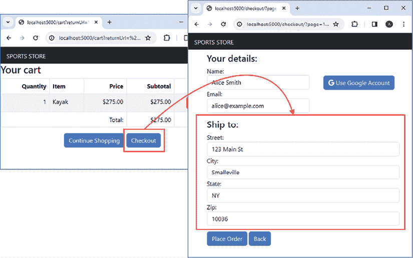

# 第十九章：SportsStore：身份验证

在本章中，我将使用 OAuth 协议允许用户使用他们的 Google 账户来识别他们自己到*SportsStore*应用程序，而不是手动输入他们的联系信息。

# 准备本章内容

本章使用*第十八章*中的`sportsstore`项目。本章不需要进行任何更改。打开一个新的命令提示符，导航到`sportsstore`文件夹，并运行*列表 19.1*中显示的命令以启动开发工具。

**提示**

你可以从[`github.com/PacktPublishing/Mastering-Node.js-Web-Development`](https://github.com/PacktPublishing/Mastering-Node.js-Web-Development)下载本章的示例项目——以及本书中所有其他章节的示例项目。如果你在运行示例时遇到问题，请参阅*第一章*了解如何获取帮助。

列表 19.1：启动开发工具

```js
npm start 
```

打开一个新的浏览器窗口，导航到`http://localhost:5000`，你将看到产品目录，如图 19.1 所示。


图 19.1：运行应用程序

# 理解 OAuth 身份验证过程

OAuth 允许用户在不向该应用程序提供凭证的情况下授予应用程序访问他们数据的权限。在开发过程中，开发者将他们的应用程序注册到 OAuth 身份验证服务中，并接收一个用于识别应用程序给服务的 ID，以及一个用于在应用程序和服务之间签名和验证消息的秘密。

注册过程建立了应用程序和身份验证服务之间的关系。注册是一次性完成的，并在应用程序部署之前执行。可能需要进行一定程度的审查。SportsStore 应用程序使用 Google OAuth 服务，这使得其基本功能（如本章中使用的功能）立即可用，但在访问更敏感数据之前会审查应用程序，这可能需要几天或几周的时间才能完成。

一旦应用程序部署完成，用户将看到一个按钮，该按钮提供他们使用身份验证提供者登录应用程序或授予应用程序访问提供者存储的数据的选项。*图 19.2*展示了本章后面添加到 SportsStore 应用程序中的简单示例按钮，该按钮授予应用程序访问用户的基本信息，例如他们的姓名和电子邮件地址。


图 19.2：将被添加到 SportsStore 应用程序中的 OAuth 按钮

当用户点击按钮时，浏览器将重定向到一个以开始身份验证过程的 URL。用户将被提示输入他们的凭据，这些凭据不会显示给应用程序。身份验证过程将向用户显示他们正在登录的应用程序以及应用程序请求的数据。*图 19.3* 展示了在本书本章后面配置 OAuth 后，将向 *SportsStore* 的用户显示的身份验证提示。


图 19.3：使用 OAuth 服务进行身份验证

一旦用户完成身份验证，他们的浏览器将使用包含访问代码的 URL 重定向回应用程序。应用程序将直接向 Google 发送 HTTP 请求，并交换访问代码以获取所需的数据。

## 理解 OAuth 的优势

从用户的角度来看，OAuth 允许他们使用应用程序和服务，而无需在每个应用程序上创建账户或重复输入相同的详细信息。从开发者的角度来看，OAuth 允许在不实现和管理密码恢复、双因素认证等工作流程的情况下进行身份验证。

这些优势适用于使用大型科技和社交媒体公司提供的 OAuth 服务。还有一些 OAuth 服务，您可以用来仅管理您应用程序的用户账户，在这种情况下，用户仍然需要创建账户，但身份验证过程和工作流程由 OAuth 提供商实现。最受欢迎的服务是 [`auth0.com`](https://auth0.com)，但还有其他选择，大多数提供免费和付费的服务级别。

## 理解 OAuth 的限制

用户并不总是愿意将他们的账户数据与一个应用程序关联。这可能是因为他们不相信该应用程序，或者他们不希望他们的账户与某些类型的内容关联。例如，如果您提供任何形式的成人内容，您可能会发现用户不愿意使用 OAuth。

从开发者的角度来看，OAuth 的主要限制是初始设置的复杂性。即使有良好的身份验证包，如本章中使用的，OAuth 也很少不需要调整就能工作，找出身份验证为何不工作可能是一个缓慢且令人困惑的任务。

# 创建 Google OAuth 凭据

有许多 OAuth 提供商，但最广泛使用的是由主要科技公司提供的，包括 Google 和 Facebook，因为这些是大多数用户已经拥有的账户。对于 *SportsStore* 应用程序，我将使用 Google OAuth 服务，但其他提供商的过程类似。

**获取外部身份验证的帮助**

我在本章中描述的设置过程在写作时是正确的，但在你阅读本章时可能会发生变化。谷歌定期修订其开发者门户，你可能会发现功能有不同的名称或以不同的方式排列。变化可能很小，但每个身份验证服务都提供了开发者文档，这些文档应该能为你指明正确的方向。

请不要通过电子邮件向我寻求帮助设置外部身份验证。我尽量帮助读者解决大多数问题，但解决外部身份验证问题需要登录读者的谷歌账户，而这是我不会做的，即使是专门为*SportsStore*应用程序创建的账户。

要开始，请导航到 [`console.developers.google.com`](https://console.developers.google.com)，使用谷歌账户登录，并执行以下步骤：

1.  点击**OAuth 同意屏幕**，然后点击**创建项目**。

1.  在项目名称字段中输入`SportsStore`，然后点击**创建**按钮。

1.  对于**用户类型**选择**外部**，然后点击**创建**按钮。

1.  在**应用名称**字段中输入`SportsStore`，在电子邮件字段中输入你的谷歌账户电子邮件地址，然后点击**保存并继续**按钮。其他字段可以留空。

1.  点击**添加或删除作用域**，然后检查以下选项（以及其他选项）：

    +   **.../auth/userinfo.email**

    +   **.../auth/userinfo.profile**

    +   **Openid**

1.  点击**更新**按钮，然后点击**保存并继续**按钮以进入**测试用户**部分。

1.  在**测试用户**部分不做任何更改的情况下，点击**保存并继续**按钮。

1.  点击**返回仪表板**以返回到**OAuth 同意屏幕**页面。

该部分流程的基本流程如图 19.4 所示。


图 19.4：创建和配置应用程序

### 发布应用

点击**发布应用**按钮，你将收到一个提示，要求你确认推送到生产环境，如图 19.5 所示。如果你已经按照上一节所述配置了应用程序，则提示应告知你应用程序不需要提交进行验证。点击**确认**按钮以发布应用程序。


图 19.5：推送至生产环境的提示

### 创建客户端 ID 和客户端密钥

最后一步是创建用于配置**OAuth**的两个值：**客户端 ID**，这是*SportsStore*应用程序将用于向谷歌标识自己的，以及**客户端密钥**，它将用于签名和验证谷歌生成的数据。执行以下步骤：

1.  在谷歌开发者仪表板中点击**凭证**。

1.  点击**创建凭证**，然后从弹出菜单中选择**OAuth 客户端 ID**。

1.  从**应用程序类型**菜单中选择**Web 应用程序**，并在**名称**字段中输入`SportsStore`。

1.  在**授权 JavaScript 来源**部分不需要进行任何更改。

1.  在**授权重定向 URI**部分点击**添加 URI**按钮，并添加`http://localhost:5000/signin-google`和`https://localhost/signin-google`。

1.  点击**创建**按钮。

1.  从弹出摘要中复制**客户端** **ID** 和 **客户端密钥**值，并安全地存储它们。每个值旁边都有一个复制按钮，确保所有字符都被正确复制。

1.  点击**确定**按钮关闭摘要弹出窗口。

在过程结束时，你将有两个值需要添加到`sportsstore`文件夹中的`development.env`文件中，如*清单 19.2*所示。（此清单显示占位符值。你必须用从 Google 门户获取的值替换这些值，以便示例能够工作。）

**使用本地重定向 URL**

步骤 5 中使用的授权重定向 URL 使用`localhost`作为主机名，这意味着一旦完成身份验证，客户端将被告知重定向到本地机器。这对于 SportsStore 应用程序很有用，其中浏览器和服务器在相同的机器上运行。对于真实项目，你必须使用指向你的项目的公共 URL，这可以通过用户的浏览器解析。这需要域名注册，这就是为什么 SportsStore 使用 localhost 的原因。

列表 19.2：在 sportsstore 文件夹中的 development.env 文件中存储密钥

```js
# secret used to sign session cookies
COOKIE_SECRET="sportsstoresecret"
# Google OAuth Credentials
GOOGLE_CLIENT_ID=enter client ID here
GOOGLE_CLIENT_SECRET=enter client secret here 
```

# 使用 OAuth 获取配置文件详细信息

起始点是扩展数据模型，使其能够将数据库中的客户与他们的 Google 账户关联起来。当 OAuth 服务向 SportsStore 应用程序提供用户数据时，会包含一个唯一 ID，该 ID 将与客户的姓名和电子邮件一起存储在数据库中，并在 SportsStore 数据库中可用时用于查询客户的地址。*清单 19.3*向`Customer`接口添加了一个新属性。

列表 19.3：在 src/data 文件夹中的 customer_models.ts 文件中添加属性

```js
export interface Customer {
    id?: number;
    name: string;
    email: string;
  **  federatedId?: string;**
} 
```

新属性需要一个验证规则，如*清单 19.4*所示。

列表 19.4：在 src/data/validation 文件夹中的 order_rules.ts 文件中添加新属性

```js
import { Validator } from "./validator";
import { required, minLength, email, no_op } from "./basic_rules";
import { Address } from "../order_models";
import { Customer } from "../customer_models";
export const CustomerValidator = new Validator<Customer>({
    name: [required, minLength(6)],
    email: email,
   ** federatedId: no_op**
});
export const AddressValidator = new Validator<Address>({
    street: required,
    city: required,
    state: required,
    zip: no_op
}); 
```

使用`no_op`规则，因为 OAuth 过程提供的数据不需要验证。

需要一组新的存储库方法来存储新数据并将其用作查询的基础。将名为`customer_repository.ts`的文件添加到`src/data`文件夹中，内容如*清单 19.5*所示。

列表 19.5：src/data 文件夹中 customer_repository.ts 文件的内容

```js
import { Customer } from "./customer_models";
import { Address } from "./order_models";
export interface CustomerRepository {
    getCustomer(id: number) : Promise<Customer | null>;
    getCustomerByFederatedId(id: string): Promise<Customer | null>;
    getCustomerAddress(id: number): Promise<Address | null>;
    storeCustomer(customer: Customer): Promise<Customer>;
} 
```

`getCustomer` 方法使用数据库服务器创建的唯一 ID 搜索数据库。`getCustomerByFederatedId` 方法执行相同操作，但使用 Google 在 OAuth 配置文件中提供的唯一 ID。`getCustomerAddress` 方法将返回与用户关联的最新地址。在放置订单之前不会有地址，但存储的数据将可用于客户创建的第二个和后续订单。最后一个方法，名为 `storeCustomer`，将用户存储在数据库中。

## 实现新的存储库功能

下一步是更新存储库的 Sequelize 实现。*列表 19.6* 向 ORM 模型类添加了一个属性。

列表 19.6：在 src/data/orm/models 文件夹中的 customer_models.ts 文件中添加属性

```js
import { Model, CreationOptional, InferAttributes, InferCreationAttributes }
    from "sequelize";
import { Customer } from "../../customer_models";
export class CustomerModel extends Model<InferAttributes<CustomerModel>,
        InferCreationAttributes<CustomerModel>> implements Customer {
    declare id?: CreationOptional<number>;
    declare name: string;
    declare email: string;
 **   declare federatedId?: string;**
} 
```

*列表 19.7* 描述了新属性如何在数据库中存储。

列表 19.7：在 src/data/orm/models 文件夹中的 customer_helpers.ts 文件中描述属性

```js
import { DataTypes, Sequelize } from "sequelize";
import { CustomerModel } from "./customer_models";
export const initializeCustomerModels = (sequelize: Sequelize) => {
    CustomerModel.init({
        id: { type: DataTypes.INTEGER, autoIncrement: true, primaryKey: true},
        name: { type: DataTypes.STRING},       
        email: { type: DataTypes.STRING },
      **  federatedId: { type: DataTypes.STRING }**
    }, { sequelize})
} 
```

需要模型类之间建立新的关系来支持新存储库方法将要执行的查询，如 *列表 19.8* 所示。

列表 19.8：在 src/data/orm/models 文件夹中的 order_helpers.ts 文件中添加一个新的关系

```js
import { DataTypes, Sequelize } from "sequelize";
import { OrderModel, ProductSelectionModel, AddressModel }
    from "./order_models";
import { CustomerModel } from "./customer_models";
import { ProductModel } from ".";
const primaryKey = {
    id: { type: DataTypes.INTEGER, autoIncrement: true, primaryKey: true }
};

export const initializeOrderModels = (sequelize: Sequelize) => {

    // ...statements omitted for brevity...
    ProductSelectionModel.belongsTo(ProductModel, { as: "product"});
    **AddressModel****.hasMany(OrderModel, { foreignKey: "addressId"});**
} 
```

为了实现 `CustomerRepository` 接口所需的方法，将一个名为 `customers.ts` 的文件添加到 `src/data/orm` 文件夹中，其内容如 *列表 19.9* 所示。

列表 19.9：src/data/orm 文件夹中的 customers.ts 文件的内容

```js
import { Customer } from "../customer_models";
import { CustomerRepository } from "../customer_repository";
import { Address } from "../order_models";
import { BaseRepo, Constructor } from "./core"
import { CustomerModel } from "./models/customer_models";
import { AddressModel, OrderModel } from "./models/order_models";
export function AddCustomers<TBase extends
        Constructor<BaseRepo>>(Base: TBase)  {
    return class extends Base implements CustomerRepository {
        getCustomer(id: number): Promise<Customer | null> {
            return CustomerModel.findByPk(id, {
                raw: true
            });
        }
        getCustomerByFederatedId(id: string): Promise<Customer | null> {
            return CustomerModel.findOne({
                where: { federatedId: id },
                raw: true
            })
        }
        getCustomerAddress(id: number): Promise<Address | null> {
            return AddressModel.findOne({
                include: [{
                    model: OrderModel,
                    where: { customerId: id },
                    attributes: []
                }],
                order: [["updatedAt", "DESC"]]
            });
        }
        async storeCustomer(customer: Customer): Promise<Customer> {
            const [data, created] = await CustomerModel.findOrCreate({
                where: { email: customer.email },
                defaults: customer,
            });
            if (!created) {
                data.name = customer.name;
                data.email = customer.email;
                data.federatedId = customer.federatedId;
                await data.save();
            }
            return data;
        }
    }
} 
```

`getCustomer` 和 `getCustomerByFederatedId` 方法执行常规查询，但 `getCustomerAddress` 方法必须通过另一个模型类进行查询，以便通过找到客户的早期订单来获取客户的最新地址，然后获取与它们关联的地址数据。`attributes` 属性在 `include` 表达式中使用，以从响应中排除订单数据。`storeCustomer` 方法使用 `findOrCreate` 方法通过电子邮件地址查找客户（如果存在）；否则，它将创建一个新的客户记录。*列表 19.10* 将新方法包含在存储库混合中。

列表 19.10：在 src/data/orm 文件夹中的 index.ts 文件中扩展混合

```js
import { BaseRepo } from "./core";
import { AddQueries } from "./queries";
import { AddStorage } from "./storage";
import { AddOrderQueries } from "./order_queries";
import { AddOrderStorage } from "./order_storage";
**import { AddCustomers } from "./customers";**
const CatalogRepo = AddStorage(AddQueries(BaseRepo));
const RepoWithOrders = AddOrderStorage(AddOrderQueries(CatalogRepo));
**const RepoWithCustomers = AddCustomers(RepoWithOrders);**
**export** **const CatalogRepoImpl = RepoWithCustomers;** 
```

为了完成存储库升级，列表 19.11 添加了一个新属性，该属性将新接口暴露给应用程序的其他部分。

列表 19.11：在 src/data 文件夹中的 index.ts 文件中添加一个常量

```js
import { CatalogRepository } from "./catalog_repository";
import { CatalogRepoImpl} from "./orm";
import { OrderRepository } from "./order_repository";
**import { CustomerRepository } from "./customer_repository"****;**
const repo = new CatalogRepoImpl();
export const catalog_repository: CatalogRepository = repo;
export const order_repository: OrderRepository = repo;
**export const customer_repository: CustomerRepository = repo;** 
```

## 设置 OAuth 认证

为了处理 OAuth 请求和响应的细节，我将使用在第 *第十八章* 中介绍的 Passport 认证包，它为主要的认证服务提供了认证策略，包括 Google。在 `sportsstore` 文件夹中运行 *列表 19.12* 中显示的命令，以将 Passport 包、策略包和类型描述添加到项目中。

列表 19.12：安装认证包

```js
npm install passport@0.7.0
npm install passport-google-oauth20@2.0.0
npm install --save-dev @types/passport@1.0.16
npm install --save-dev @types/passport-google-oauth20@2.0.14 
```

为了快速参考，这些包在*表 19.1*中有描述。

表 19.1：认证包

| 名称 | 描述 |
| --- | --- |

|

```js
`passport` 
```

| 此包包含 Passport 的核心功能。 |
| --- |

|

```js
`passport-google-oauth20` 
```

| 此包包含与 Google OAuth 服务进行认证的 Passport 策略。 |
| --- |

|

```js
`@types/passport` 
```

| 此包包含类型信息。 |
| --- |

|

```js
`@types/passport-google-oauth20` 
```

| 此包包含类型信息。 |
| --- |

在`src`文件夹中添加一个名为`authentication.ts`的文件，其内容如*列表 19.13*所示。

列表 19.13：src 文件夹中 authentication.ts 文件的内容

```js
import { Express } from "express";
import { getConfig, getSecret } from "./config";
import passport from "passport";
import { Strategy as GoogleStrategy, Profile, VerifyCallback }
    from "passport-google-oauth20";
import { customer_repository } from "./data";
import { Customer } from "./data/customer_models";
const callbackURL: string = getConfig("auth:openauth:redirectionUrl");
const clientID = getSecret("GOOGLE_CLIENT_ID");
const clientSecret = getSecret("GOOGLE_CLIENT_SECRET");
declare global {
    namespace Express {
        interface User extends Customer {  }
    }
}
export const createAuthentication = (app:Express) => {
    passport.use(new GoogleStrategy({
        clientID, clientSecret, callbackURL,
        scope: ["email", "profile"],
        state: true
    } , async (accessToken: string, refreshToken: string,
            profile: Profile, callback: VerifyCallback) => {
        const emailAddr = profile.emails?.[0].value ?? "";           
        const customer = await customer_repository.storeCustomer({
            name: profile.displayName, email: emailAddr,
            federatedId: profile.id
        });
        const { id, name, email } = customer;
        return callback(null, { id, name, email });
    }));
    passport.serializeUser((user, callback) => {
        callback(null, user.id);
    });
    passport.deserializeUser((id: number, callbackFunc) => {
        customer_repository.getCustomer(id).then(user =>
            callbackFunc(null, user));
    });
    app.use(passport.session());
} 
```

`declare`关键字用于告诉 TypeScript 编译器，通过`Passport`包添加到已认证请求中的`User`对象将扩展`Customer`类型。`createAuthentiction`函数设置 Passport 包使用 Google OAuth 服务进行认证。

配置模块用于获取重定向 URL，该 URL 将被包含在发送给 Google 的认证请求中，并在认证完成后，浏览器将被重定向到该 URL。URL 必须与设置 OAuth 凭据时使用的 URL 匹配，对于真实项目，应该是一个面向公众的 URL。

客户端 ID 和客户端密钥被读取并用于配置 Google 认证策略，以及 URL：

```js
...
passport.use(new GoogleStrategy({
    clientID, clientSecret, callbackURL,
    scope: ["email", "profile"]
... 
```

`作用域`设置指定了将请求哪些 OAuth 作用域，而`电子邮件`和`配置文件`值对应于设置 OAuth 服务时使用的那些作用域。这两个作用域提供了用户电子邮件地址和它们的显示名称的详细信息，这对于*SportsStore*应用程序来说就足够了。

可用的作用域还有很多，但通常需要应用程序通过审核流程后才能获得访问权限，而电子邮件和配置文件作用域则可以被任何已注册的应用程序使用。

策略构造函数的最后一个参数是一个回调函数，当 Google 验证了用户并执行了重定向时会被调用：

```js
...
} , async (accessToken: string, refreshToken: string,
        profile: Profile, callback: VerifyCallback) => {
... 
```

回调函数接收一个访问令牌，可以用来进行 API 查询，以及一个刷新令牌，可以用来获取新的访问令牌。这两个令牌在 OAuth 文档中有描述（见[`www.oauth.com/oauth2-servers/access-tokens`](https://www.oauth.com/oauth2-servers/access-tokens)），但在这个例子中不是必需的。相反，此示例依赖于第三个参数提供的数据，即用户的配置文件。配置文件在不同提供者之间可能不同，但 Passport 会像这样标准化 Google OAuth 服务返回的数据（已将真实数据值替换为`X`字符）：

```js
{
  id: '101XXXXXXXXXXXXXXXXXX',
  displayName: Alice Smith',
  name: { familyName: 'Smith', givenName: 'Alice' },
  emails: [ { value: alice@example.com', verified: true } ],
  photos: [{value: 'https://lh3.googleusercontent.com/a/XXXX'}],
  provider: 'google',
  _raw: '{\n' +
    '  "sub": "101XXXXXXXXXXXXXXXXXX",\n' +
    '  "name": "Alice Smith",\n' +
    '  "given_name": "Adam",\n' +
    '  "family_name": "Smith",\n' +
    '  "picture": "https://lh3.googleusercontent.com/a/XXXX",\n' +
    '  "email": "alice@example.com",\n' +
    '  "email_verified": true,\n' +
    '  "locale": "en"\n' +
    '}',
  _json: {
    sub: '101XXXXXXXXXXXXXXXXXX',
    name: Alice Smith',
    given_name: 'Alice',
    family_name: 'Smith',
    picture: 'https://lh3.googleusercontent.com/a/XXXX',
    email: 'alice@example.com',
    email_verified: true,
    locale: 'en'
  }
} 
```

在[`www.passportjs.org/reference/normalized-profile`](https://www.passportjs.org/reference/normalized-profile)可以找到对标准化配置文件的详细解释，但*SportsStore*应用程序只需要`id`值，这是唯一标识用户的值，`given_name`值，以及`emails`值，从中可以获取用户的电子邮件地址。

最后一个参数是一个回调，当用户数据准备就绪时被调用。*列表 19.13* 中的代码使用配置文件中的 profile 数据来存储客户的详细信息，并调用回调以向 Passport 提供用户对象。如果存在，存储库的 `storeCustomer` 方法的实现将与 `federatedId` 值匹配，这意味着配置文件中的 profile 数据将用于更新之前订单中为同一用户创建的任何现有数据。

调用 `passport.serializeUser` 和 `passport.deserializeUser` 是必需的，以便 Passport 将用户数据序列化到会话中。在这种情况下，数据库分配的唯一 ID 用于表示序列化的用户，该用户通过查询数据库进行反序列化。这是 *列表 19.13* 中的最终语句：

```js
...
app.use(passport.session());
... 
```

`passport.session` 函数返回一个中间件函数，该函数将使用存储在会话中的其他认证机制的数据来验证请求，并且当使用 Google OAuth 服务进行认证后，它会对请求进行反序列化以使用户数据可用。

*列表 19.14* 调用 `createAuthentication` 函数以在服务器启动时启用认证。

列表 19.14：在 src 文件夹中的 server.ts 文件中启用认证

```js
import { createServer } from "http";
import express, { Express } from "express";
import helmet from "helmet";
import { getConfig } from "./config";
import { createRoutes } from "./routes";
import { createTemplates } from "./helpers";
import { createErrorHandlers } from "./errors";
import { createSessions } from "./sessions";
**import { createAuthentication } from "./authentication";**
const port = getConfig("http:port", 5000);
const expressApp: Express = express();
expressApp.use(helmet());
expressApp.use(express.json());
expressApp.use(express.urlencoded({extended: true}))
expressApp.use(express.static("node_modules/bootstrap/dist"));
expressApp.use(express.static("node_modules/bootstrap-icons"));
createTemplates(expressApp);
createSessions(expressApp);
**createAuthentication(expressApp);**
createRoutes(expressApp);
createErrorHandlers(expressApp);
const server = createServer(expressApp);
server.listen(port,
    () => console.log(`HTTP Server listening on port ${port}`)); 
```

为了完成认证设置，*列表 19.15* 在配置文件中添加了一个新的部分，该部分指定了用于 OAuth 请求的回调。

列表 19.15：在 SportsStore 文件夹中的 server.config.json 文件中添加设置

```js
{
    "http": {
        "port": 5000
    },
    // ...configuration sections omitted for brevity...
    "sessions": {
        "maxAgeHrs": 2,
        "reset_db": true,
        "orm": {
            "settings": {
                "dialect": "sqlite",
                "storage": "sessions.db"
            },
            "logging": true
        }
    },
   ** "auth": {**
 **"openauth": {**
 **"redirectionUrl": "http://localhost:5000/signin-google"**
 **}**
 **}**
} 
```

如前所述，`localhost` URL 依赖于浏览器和服务器在同一台机器上。对于真实项目，应使用真实域名，尽管在开发期间 `localhost` 可能很有用。

## 修改 cookie 配置

OAuth 是一个出色的认证系统，但它可能很挑剔，通常需要付出努力才能使一切正常工作。问题的一个常见原因是会话 cookie 的配置，它必须设置以匹配 OAuth 策略的期望，其要求可能与其他应用程序不同。

在为 SportsStore 设置 OAuth 时，我发现我必须进行两个更改才能正确启用认证，如 *列表 19.16* 所示。

列表 19.16：在 src 文件夹中的 sessions.ts 文件中更改 cookie 配置

```js
...
app.use(session({
    secret, store,
  **  resave: false, saveUninitialized: true,**
    cookie: {
        maxAge: config.maxAgeHrs * 60 * 60 * 1000,
        **sameSite: false, httpOnly: false, secure****: false }**
}));
... 
```

对于其他策略或认证提供者，您可能需要不同的配置设置，并且通常需要进行一些实验，因为会话设置通常没有指定。

## 应用认证

下一步是向用户展示一个按钮，允许他们使用 Google 登录，如 *列表 19.17* 所示。

列表 19.17：在 templates 文件夹中的 order_details.handlebars 文件中添加 Google 按钮

```js
<form method="post" action="/checkout">
    **<div class="container">**
 **<div class="row flex-row align-items-center">**
 **<div** **class="col-7">{{> order_details_customer }}</div>**
 **<div class="col">**
 **<div** **class="d-flex justify-content-center">**
 **<a class="btn btn-primary" href="/checkout/google">**
 **<i** **class="bi bi-google"></i>**
 **Use Google Account**
 **</a>**
 **</div>**
 **</div>**
**</div>**
 **<div class="row">**
 **{{> order_details_address }}**
 **</div>**
 **<div class****="row">**
 **<div class="m-2">**
 **<button type="submit" class****="btn btn-primary">**
 **Place Order**
 **</button>**
 **<a href="/cart?returnUrl={{ escapeUrl (navigationUrl )}}"**
 **class="btn btn-primary">Back****</a>**
 **</div>**
 **</div>**
 **</div>**
</form> 
```

新的元素结构配置了 Bootstrap CSS 类以创建一个网格，其中姓名和电子邮件地址的元素与一个包含 Bootstrap Icons 包中的 Google 图标的新按钮共享一行，该按钮提示用户使用他们的 Google 账户。*清单 19.18*定义了支持 OAuth 并使用客户 Google 详情的路由。

清单 19.18：在 src/routes 文件夹中的 orders.ts 文件中支持 OAuth

```js
import { Express } from "express";
import { Address } from "../data/order_models";
import { AddressValidator, CustomerValidator, ValidationResults, getData, isValid }
    from "../data/validation";
import { Customer } from "../data/customer_models";
import { createAndStoreOrder } from "./order_helpers";
**import { customer_repository } from "../data";**
**import passport from "passport";**
declare module "express-session" {
    interface SessionData {
       orderData?: {
            customer?: ValidationResults<Customer>,
            address?: ValidationResults<Address>
       },
       pageSize?: string;
    }
}
export const createOrderRoutes = (app: Express) => {
    **app.****get("/checkout/google", passport.authenticate("google"));**
 **app.get("/signin-google", passport.authenticate("google",**
 **{ successRedirect: "****/checkout", keepSessionInfo: true }));**
    app.get("/checkout", async (req, resp) => {
       ** if (!req.session.orderData && req.****user) {**
 **req.session.orderData = {**
 **customer: await CustomerValidator.validate(req.user),**
 **address: await** **AddressValidator.validate(**
 **await customer_repository.getCustomerAddress(**
 **req.user?.id ?? 0) ?? {})** 
 **}**
 }
        req.session.pageSize =
            req.session.pageSize ?? req.query.pageSize?.toString() ?? "3";
        resp.render("order_details", {
            order: req.session.orderData,
            page: 1,
            pageSize: req.session.pageSize
        });
    });
    // ...other routes omitted for brevity...
} 
```

`/checkout/google`路由被*清单 19.17*中创建的按钮所针对，其任务是要求使用`google`策略进行认证以启动 OAuth 过程：

```js
...
app.get("/checkout/google", **passport.authenticate("google")**);
... 
```

每个 Passport 策略模块都有一个默认名称，`google`是*清单 19.13*中添加到项目的策略名称。此路由的效果是将用户的浏览器重定向到 Google OAuth 服务。

`/signin-google`路由处理认证过程完成后从 Google 返回的重定向，并且还需要使用`google`策略进行认证：

```js
...
app.get("/signin-google", **passport.authenticate("google",**
 **{ successRedirect: "/checkout", keepSessionInfo: true })**);
... 
```

这次，认证策略将处理 Google 发送的数据以认证用户，如果认证成功，则将用户重定向到`/checkout` URL。如果认证失败，则使用自定义错误处理器显示错误消息。`keepSessionInfo`设置确保一旦用户认证成功，现有的会话数据就会被保留。

对`/checkout` URL 处理器的更改填充了认证请求的订单数据。添加到`Request`对象中的用户数据用于客户的姓名和电子邮件地址，并执行与用户关联的最新地址的查询。第一次用户创建订单时不会有地址，因为这不是个人资料数据的一部分，但后续订单将可用地址。

# 使用 OAuth 个人资料数据

在您的浏览器中打开一个新的访客标签或私密标签。浏览器为这些功能使用不同的名称，但目标是在不受浏览器可能存储的任何 cookie 干扰的情况下检查认证过程，包括来自 Google 的 cookie。

导航到`http://localhost:5000`，将产品添加到购物车，并点击**结账**按钮。点击如图*图 19.6*所示的**使用 Google 账户**按钮。


图 19.6：启动 OAuth 过程

您的浏览器将被重定向到 Google，您将需要认证并登录到*SportsStore*，如图*图 19.7*所示。


图 19.7：使用 Google 进行认证

认证过程可能根据 Google 账户设置的不同而有所不同。*图 19.5*中显示的账户配置为需要使用智能手机进行额外确认，这只是 Google 支持的一种确认认证的方法。

一旦谷歌验证了账户，浏览器将重定向回*SportsStore*应用程序，并且账户配置文件数据将被用来填充结账表单中的姓名和电子邮件地址字段。完成表单并下订单，如图*19.8*所示。

**解决常见问题原因**

如果您没有得到预期的结果，有一些常见问题需要检查。首先，请确保您已经将**客户端 ID**和**客户端密钥**设置得与谷歌开发者控制台上显示的完全一致。如果这些设置不正确，那么谷歌可能不允许用户进行身份验证，或者应用程序将无法验证谷歌在重定向中提供的数据。有一个选项可以下载包含这两个值的 JSON 文档，这是一种确保您拥有正确数据的实用方法。

第二，确保在应用程序和谷歌开发者控制台中配置了相同的重定向 URL。如果这些设置不正确，那么谷歌不会将浏览器重定向到正确的位置。

第三，检查会话 cookie 设置。如果使用谷歌进行身份验证工作正常，但配置文件数据没有被用来填充表单，那么可能的原因是每次身份验证序列中的请求都会创建新的会话，或者验证谷歌发送的数据所需的状态数据没有被存储。

最后，在身份验证过程中注意 Node.js 控制台。如果应用程序配置为重置数据库，应用程序的重启将删除会话数据库并阻止身份验证完成。*SportsStore*项目的开发工具被设置为在检测到任何文件更改时重启应用程序，这可能会被您的开发机器上运行的不同进程触发。（例如，我使用一个每小时创建我的代码文件夹快照的应用程序，这会导致重启。）如果您怀疑这种情况，那么请将`server.config.json`文件中的两个`reset_db`设置更改为 false，这样重启就不会删除数据库的内容。


图 19.8：放置初始订单

## 放置第二个订单

创建订单时存储的地址数据将在同一用户下次创建订单时可用。请求`http://localhost:5000`并再次进行结账流程。当您点击**使用谷歌账户**按钮时，整个表单应该被填充，如图*19.9*所示。



图 19.9：使用先前订单的地址数据

通常您不需要再次登录谷歌账户，因为谷歌会存储一个身份验证 cookie。浏览器仍然会被重定向到谷歌 OAuth 服务，但用户看不到这个请求或随后的重定向回*SportsStore*。

# 摘要

在本章中，我为用户添加了使用他们的谷歌账户来识别自己的*SportsStore*应用程序的支持：

+   OAuth 协议允许用户在不向应用程序提供凭证的情况下进行身份验证。

+   大多数主要平台都提供 OAuth 服务，包括 Google，在应用程序可以发送 OAuth 请求之前，需要先完成注册流程。

+   OAuth 服务提供的数据存在差异，但这些差异通过`Passport`认证包进行了标准化。

+   一旦用户将他们的 Google 凭证与*SportsStore*订单关联，他们在未来结账时地址将自动加载。

在下一章中，我将添加管理工具来管理*SportsStore*产品目录并更改订单的发货状态。
