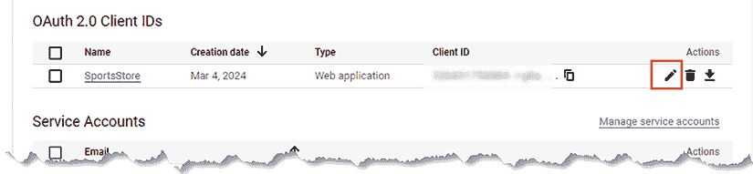

# 20

# SportsStore：管理

在本章中，我将创建 *SportsStore* 管理功能，这将允许授权用户编辑产品目录并更改客户订单的配送状态。

# 为本章做准备

本章使用 *第十九章* 中的 `sportsstore` 项目。打开一个新的命令提示符，导航到 `sportsstore` 文件夹，并运行 *列表 20.1* 中显示的命令以启动开发工具。

**提示**

你可以从 [`github.com/PacktPublishing/Mastering-Node.js-Web-Development`](https://github.com/PacktPublishing/Mastering-Node.js-Web-Development) 下载本章的示例项目——以及本书中所有其他章节的示例项目。有关运行示例时遇到问题的帮助，请参阅 *第一章*。

列表 20.1：启动开发工具

```js
npm start 
```

打开一个新的浏览器窗口，导航到 `http://localhost:5000`，你将看到产品目录，如图 *图 20.1* 所示。


图 20.1：运行应用程序

# 理解 HTML RESTful Web 服务

在 *第十四章* 中创建的 Web 服务遵循最常见的方法，即返回客户端可以处理并展示给用户的 JSON 数据。这是最灵活的方法，因为它不限制数据的使用方式，允许创建使用数据的客户端，这些数据的使用方式是 Web 服务的开发者没有预想的，并且不需要他们的参与。

对于许多项目，Web 服务的开发者也负责客户端，这导致了一个奇怪的情况，即所有由往返客户端开发的州管理功能都被重新创建，使用 Angular 或 React 等框架创建一个更响应式的功能集。

在这种情况下，一个替代方案是创建一个返回 HTML 内容片段而不是 JSON 的 Web 服务，并创建一个客户端，该客户端通过向 Web 服务发送 HTTP 请求来响应用户交互，显示获得的结果。Web 服务仍然依赖于 HTTP 方法来识别将要执行的操作类型，以及 URL 路径来识别受影响的资源，但结果是预先格式化的内容，可以展示给用户，这是使用与为传统 HTML 应用程序创建的相同模板、会话和数据功能产生的。

这并不适合每个项目，尤其是当你需要向第三方提供应用程序数据访问时，但如果你发现自己正在使用 React 或 Angular 等框架来重复服务器上已经创建的功能，那么这可以是一个避免使用大型客户端框架复杂性的好方法。

# 为客户端开发做准备

我将要使用的用于发送 HTTP 请求和处理 HTML 响应的包名为 `htmx` ([`htmx.org`](https://htmx.org))，当服务器可以提供创建客户端所需的所有语句管理和内容生成时，这是一个不错的选择，例如 SportsStore 应用程序。要在 `sportsstore` 文件夹中安装 `HTMX` 包，请运行 *清单 20.2* 中显示的命令。

**提示**

另一个值得考虑的好包是 Alpine ([`alpinejs.dev`](https://alpinejs.dev))，它更为复杂，但使得在浏览器中管理状态数据变得更加容易，并且可以更方便地与返回 JSON 数据的 Web 服务一起使用。

列表 20.2：安装 htmx 包

```js
npm install htmx.org@1.9.10 
```

*表 20.1* 描述了用于快速参考的包。

表 20.1：客户端包

| 名称 | 描述 |
| --- | --- |

|

```js
[htmx.org](http://htmx.org) 
```

| `HTMX` 包扫描 HTML 元素以查找配置异步 HTTP 请求的特殊属性，这些请求将被发送到返回 HTML 片段的 Web 服务。 |
| --- |

`HTMX` 包通过将属性应用于 HTML 元素，并使用 `script` 元素加载的 JavaScript 代码来处理这些属性来实现其功能。这种方法意味着不需要客户端开发工具链，开发者只需简单地重新加载浏览器即可在开发过程中看到更改的效果。我发现这种开发方式令人沮丧，因为我经常忘记重新加载浏览器，这导致当浏览器显示的内容与我在代码编辑器中刚刚保存的标记不一致时，我会暂时感到困惑。为此，我将设置 **webpack** 打包器，以便我可以利用开发服务器的 `reload` 功能。

一些包仅处理浏览器重新加载，但使用 webpack 是一种保险措施，因为它创建的包意味着我可以轻松地向客户端添加 JavaScript 代码，而无需修改项目工具。在 `HTMX` 项目中不需要使用 webpack 打包器，但我认为这是一个值得考虑的逃生口，它让我能够解决那些否则难以处理的问题。

在 `sportsstore` 文件夹中运行 *清单 20.3* 中显示的命令，以安装创建客户端包所需的包。

列表 20.3：安装打包器所需的包

```js
npm install --save-dev webpack@5.89.0
npm install --save-dev webpack-cli@5.1.4
npm install --save-dev webpack-dev-server@4.15.1
npm install --save-dev npm-run-all@4.1.5
npm install http-proxy@1.18.1 
```

*表 20.2* 描述了这些包，以便快速参考。

表 20.2：客户端开发工具包

| 名称 | 描述 |
| --- | --- |

|

```js
`webpack` 
```

| 此包包含 webpack 打包器。 |
| --- |

|

```js
`webpack-cli` 
```

| 此包包含 webpack 的命令行。 |
| --- |

|

```js
`webpack-dev-server` 
```

| 此包包含 webpack 开发 HTTP 服务器。 |
| --- |

|

```js
`npm-run-all` 
```

| 此包允许您使用 `npm` 启动多个命令。 |
| --- |

|

```js
`http-proxy` 
```

| 此包包含一个 HTTP 代理，在开发期间将请求转发到 webpack 服务器。 |
| --- |

在`sportsstore`文件夹中添加一个名为`webpack.config.mjs`的文件，其内容如*清单 20.4*所示，该文件配置 webpack 并设置其开发服务器。

*清单 20.4*：sportsstore 文件夹中 webpack.config.mjs 文件的内容

```js
import path from "path";
import { fileURLToPath } from "url";
const __dirname = path.dirname(fileURLToPath(import.meta.url));
export default  {
    mode: "development",
    entry:   "./src/admin/client.js",
    devtool: "source-map",   
    output: {
        path: path.resolve(__dirname, "dist/admin"),
        filename: "bundle.js"
    },
    devServer: {
        watchFiles: ["templates/admin"],
        port: 5100,	
        client: { webSocketURL: "http://localhost:5000/ws" }
    }
}; 
```

配置告诉 webpack 使用`src/admin`文件夹中的名为`client.js`的文件创建捆绑包，并在捆绑包更改或`templates/admin`文件夹中的文件更改时触发浏览器更新。捆绑包将创建在名为`bundle.js`的文件中，并将写入`dist/admin`文件夹。创建`src/admin`文件夹，并向其中添加一个名为`client.js`的文件，其内容如*清单 20.5*所示。

*清单 20.5*：src/admin 文件夹中 client.js 文件的内容

```js
document.addEventListener('DOMContentLoaded', () => {
    // do nothing
}); 
```

此文件中的代码不起作用，因为捆绑只是使用 webpack 开发 HTTP 服务器的一种手段。捆绑将被省略在应用程序的生产构建中。

## 创建路由和模板

下一步是配置将作为管理功能入口点的路由，并定义用于生成响应的模板。创建`src/routes/admin`文件夹，并向其中添加一个名为`index.ts`的文件，其内容如*清单 20.6*所示。

*清单 20.6*：src/routes/admin 文件夹中 index.ts 文件的内容

```js
import { Express } from "express";
export const createAdminRoutes = (app: Express) => {
    app.use((req, resp, next) => {
        resp.locals.layout = false;
        next();
    })
    app.get("/admin", (req, resp) => resp.render("admin/admin_layout"));
} 
```

`createAdminRoutes`函数设置管理路由。要开始，有一个中间件组件禁用了模板引擎的默认布局，还有一个处理`/admin` URL 的`GET`请求的路由，通过渲染一个名为`admin/admin_layout`的模板。模板的名称包含`admin`文件夹，这样我可以将管理模板与应用程序的其他内容分开。这种方法的缺点是必须在所有调用`render`方法的调用中包含文件夹名称。

*清单 20.7*将`createAdminRoutes`添加到设置应用程序路由的函数集合中。

*清单 20.7*：向 src/routes 文件夹中的 index.ts 文件添加路由

```js
import { Express } from "express";
import { createCatalogRoutes } from "./catalog";
import { createCartMiddleware, createCartRoutes } from "./cart";
import { createOrderRoutes } from "./orders";
import { createAdminRoutes } from "./admin";
export const createRoutes = (app: Express) => {
    createCartMiddleware(app);
    createCatalogRoutes(app);
    createCartRoutes(app);
    createOrderRoutes(app);
    createAdminRoutes(app);
} 
```

创建初始模板时，请创建`sportsstore/templates/admin`文件夹，并向其中添加一个名为`admin_layout.handlebars`的文件，其内容如*清单 20.8*所示。

*清单 20.8*：templates/admin 文件夹中 admin_layout.handlebars 文件的内容

```js
<!DOCTYPE html>
<html>
    <head>
        <link href="/css/bootstrap.min.css" rel="stylesheet" />
        <link href="/font/bootstrap-icons.min.css" rel="stylesheet">
        {{#if (isDevelopment) }}
            <script src="img/bundle.js"></script>
        {{/if }}
        <script src="img/htmx.min.js"></script>
    </head>
    <body>
        <div class="container-fluid">
            <div class="row bg-info text-white py-2 px-1">
                <div class="col align-baseline pt-1">SPORTS STORE ADMIN</div>
                <div class="col-auto text-end"></div>
            </div>
            <div class="row p-2">
                <div class="col-2" id="area_buttons"></div>
                <div class="col" id="content">
                    Content Goes Here...
                </div>
            </div>
        </div>
    </body>
</html> 
```

此模板渲染一个 HTML 文档，包含 Bootstrap CSS 和图标文件的`link`元素，以及 webpack 捆绑包和`HTMX`JavaScript 文件的`script`元素。

## 配置应用程序

为了完成准备工作，*清单 20.9*设置请求转发到 webpack 开发服务器，并将`HTMX`包文件夹添加到静态文件位置集合中。

*清单 20.9*：在 src 文件夹中的 server.ts 文件中配置应用程序

```js
import { createServer } from "http";
import express, { Express } from "express";
import helmet from "helmet";
import { getConfig, getEnvironment, Env } from "./config";
import { createRoutes } from "./routes";
import { createTemplates } from "./helpers";
import { createErrorHandlers } from "./errors";
import { createSessions } from "./sessions";
import { createAuthentication } from "./authentication";
**import httpProxy from "http-proxy";**
const port = getConfig("http:port", 5000);
const expressApp: Express = express();
expressApp.use(helmet());
expressApp.use(express.json());
expressApp.use(express.urlencoded({extended: true}))
expressApp.use(express.static("node_modules/bootstrap/dist"));
expressApp.use(express.static("node_modules/bootstrap-icons"));
expressApp.use(express.static("node_modules/htmx.org/dist"));
createTemplates(expressApp);
createSessions(expressApp);
createAuthentication(expressApp);
createRoutes(expressApp);
**//createErrorHandlers(expressApp);**
const server = createServer(expressApp);
**if (getEnvironment****() === Env.Development) {**
 **const proxy = httpProxy.createProxyServer({**
 **target: "http://localhost:5100", ws: true**
 **});** 
 **expressApp.use("/admin"****, (req, resp) => proxy.web(req, resp));** 
 **server.on('upgrade', (req, socket, head) => proxy.ws(req, socket, head));**
**}**
**createErrorHandlers(expressApp);**
server.listen(port,
    () => console.log(`HTTP Server listening on port ${port}`)); 
```

如果应用程序配置为开发环境，则使用 `http-proxy` 包将请求转发到 webpack 开发 HTTP 服务器，这将启用自动浏览器重新加载。

错误处理器必须移动，以便在 webpack 开发服务器处理器的机会匹配请求之后才生成 `404` `-` `Not` `Found` 响应。

最后的准备步骤是配置 `npm` 命令以启动服务器和 webpack，并防止在 `admin` 文件夹中的模板更改时服务器被重新启动，如 *清单 20.10* 所示。

清单 20.10：在 sportsstore 文件夹中的 package.json 文件中配置应用程序

```js
{
  "name": "sportsstore",
  "version": "1.0.0",
  "description": "",
  "main": "index.js",
  "scripts": {
    "watch": "tsc-watch --noClear --onsuccess \"node dist/server.js\"",
    **"server": "nodemon --exec npm run watch",**
 **"client": "webpack serve",**
 **"start": "npm-run-all --parallel server client"**
  },
  "nodemonConfig": {
    "ext": "js,handlebars,json",
    "ignore": [
      "dist/**",
      "node_modules/**",
     **"templates/admin/**"** 
    ]
  },
  "keywords": [],
  "author": "",
  "license": "ISC",
  "devDependencies": {
    // ...packages omitted for brevity...
  },
  "dependencies": {
    // ...packages omitted for brevity...
  }
} 
```

如果服务器正在运行，请停止服务器，然后在 `sportsstore` 文件夹中运行 *清单 20.11* 中显示的命令以启动客户端构建工具和服务器。

清单 20.11：启动客户端构建工具和服务器

```js
npm start 
```

打开浏览器并导航到 `http://localhost:5000/admin`。浏览器将显示管理布局，其中包含一些占位文本，如 *图 20.2* 所示。


图 20.2：准备管理功能

# 管理产品目录

现在基本结构已经就绪，是时候开始添加功能了。在 `templates/admin` 文件夹中创建一个名为 `area_buttons.handlebars` 的文件，其内容如 *清单 20.12* 所示。

清单 20.12：在 templates/admin 文件夹中的 area_buttons.handlebars 文件内容

```js
<swap_wrapper hx-swap-oob="innerHTML:#area_buttons">
    <div class="d-grid gap-2" >
        <button id="products_btn" class="btn **{{ buttonClass "products" mode }}**"
            hx-get="/api/products/table" hx-target="#content">
            Products
        </button>
        <button id="orders_btn" class="btn {{ buttonClass "orders" mode }}"
            hx-get="/api/orders/table" hx-target="#content">
            Orders
        </button>
    </div>
</swap_wrapper> 
```

此模板包含允许用户选择功能区域的按钮：管理目录或处理订单。该文件由 Handlebars 模板引擎处理，该引擎评估 `{{` 和 `}}` 部分以生成包含在客户端响应中的 HTML 内容。此文件中有两个模板表达式，它们更改应用于 `button` 元素的类属性值：

```js
...
<swap_wrapper **hx-swap-oob="innerHTML:#area_buttons"**>
    <div class="d-grid gap-2" >
        <button id="products_btn" class="btn {{ buttonClass "products" mode }}"
           ** hx-get="****/api/products/table" hx-target="#content">**
            Products
        </button>
        <button id="orders_btn" class="btn {{ buttonClass "orders" mode }}"
           ** hx-get="/api/orders/table" hx-target="#content">**
            Orders
        </button>
    </div>
</swap_wrapper>
... 
```

应用到元素上的类将显示用户应用程序的哪个部分是活动的，并依赖于一个名为 `buttonClass` 的模板辅助器，我将很快创建它。

一旦浏览器接收到 HTML 内容，它将被 `HTMX` 包第二次处理，该包寻找以 `hx` 开头的属性名：

```js
...
<swap_wrapper hx-swap-oob="innerHTML:#area_buttons">
    <div class="d-grid gap-2" >
        <button id="products_btn" class="btn {{ buttonClass "products" mode }}"
            hx-get="/api/products/table" hx-target="#content">
            Products
        </button>
        <button id="orders_btn" class="btn {{ buttonClass "orders" mode }}"
            hx-get="/api/orders/table" hx-target="#content">
            Orders
        </button>
    </div>
</swap_wrapper>
... 
```

`hx-get` 属性告诉 `HTMX` 向特定 URL 发送 `GET` 请求。默认情况下，`HTMX` 使用响应中的 HTML 来替换触发请求的元素，但可以通过 `hx-target` 属性来更改，这意味着 `button` 元素将请求 `/api/products/table` 或 `/api/orders/table`，响应将使用 ID 为 `content` 的元素显示。（`hx-target` 属性的值是一个 CSS 选择器，`#` 前缀表示元素的 ID。）

`hx-swap-oob` 属性允许内容片段指定其显示的位置。应用于 `swap_wrapper` 元素的属性告诉 `HTMX`，它包含的内容应用于替换名为 `area_buttons` 的元素的内容。（`swap_wrapper` 元素名称完全是虚构的，并且被选择是为了不会与实际应用程序的 HTML 内容混淆。你可以在你的项目中使用任何元素名称。）

要定义在 *Listing 20.12* 中使用的 `buttonClass` 辅助函数，请将一个名为 `admin_helpers.ts` 的文件添加到 `src/helpers` 文件夹中，其内容如 *Listing 20.13* 所示。

*Listing 20.13*：src/helpers 文件夹中 admin_helpers.ts 文件的内容

```js
export const buttonClass = (btn: string, mode: string) =>
    btn == mode ? "btn-secondary" : "btn-outline-secondary"; 
```

*Listing 20.14* 在应用程序启动时将新辅助函数包含在模板引擎配置中。

*Listing 20.14*：将辅助函数添加到 src/helpers 文件夹中的 index.ts 文件

```js
import { Express } from "express";
import { getConfig } from "../config";
import { engine } from "express-handlebars";
import * as env_helpers from "./env";
import * as catalog_helpers from "./catalog_helpers";
import * as cart_helpers from "./cart_helpers";
import * as order_helpers from "./order_helpers";
**import * as admin_helpers from "./admin_helpers";**
const location = getConfig("templates:location");
const config = getConfig("templates:config");
export const createTemplates = (app: Express) => {
    app.set("views", location);
    app.engine("handlebars", engine({
        ...config,
       ** helpers: {...env_helpers, ...catalog_helpers, ...cart_helpers,**
 **...order_helpers, ...admin_helpers}**
    }));
    app.set("view engine", "handlebars");
} 
```

*Listing 20.12* 中的内容是一个部分模板，它将与其他内容结合以生成 HTML 响应，使用模板引擎提供的功能，并且模板还允许定义和管理小文件。将一个名为 `product_table.handlebars` 的文件添加到 `templates/admin` 文件夹中，其内容如 *Listing 20.15* 所示。

*Listing 20.15*：templates/admin 文件夹中 product_table.handlebars 文件的内容

```js
{{> admin/area_buttons mode="products"}}
<table class="table table-sm">
    <thead>
        <tr>
            <th>ID</th><th>Name</th>
            <th>Category</th><th>Supplier</th>
            <th class="text-end">Price</th>
            <th></th>
        </tr>
    </thead>
    <tbody>
        {{#each products }}   
            <tr><td colspan="6">{{name}}</td></tr>
        {{/each }}
    </tbody>
</table> 
```

此模板向用户展示目录中的产品表，并包含了 `area_buttons` 部分模板。模板接收一个 `product` 数据属性，该属性用于使用 `each` 辅助函数填充表格的内容。

## 启动网络服务路由

我喜欢在工作的过程中将基本模板功能设置到位，并在路由和数据管理之间切换。当功能逐渐完善时，我会回到模板中细化数据展示。为了定义将提供目录初始视图的路由，请将一个名为 `admin_catalog_routes.ts` 的文件添加到 `src/routes/admin` 文件夹中，其内容如 *Listing 20.16* 所示。

*Listing 20.16*：src/routes/admin 文件夹中 admin_catalog_routes.ts 文件的内容

```js
import { Router } from "express";
import { CategoryModel, ProductModel, SupplierModel }
    from "../../data/orm/models";

export const createAdminCatalogRoutes = (router: Router) => {
    router.get("/table", async (req, resp) => {
        const products = await ProductModel.findAll({
                include: [
                    {model: SupplierModel, as: "supplier" },
                    {model: CategoryModel, as: "category" }],
                raw: true, nest: true
        });
        resp.render("admin/product_table", { products });
    });
} 
```

`createAdminCatalogRoutes` 函数接收一个 `Router` 对象，它允许请求相对于在应用程序其他地方定义的基本 URL 进行处理。有一个处理 `/table` URL 的路由，并通过渲染由数据库读取的数据提供的 `admin/product_table` 模板进行响应。

在前面的章节中，我通过仓库访问数据库，这是我隔离数据访问细节的首选方式。并不是每个人都喜欢使用仓库及其引入的额外复杂性，因此对于管理功能，我将直接通过 Sequelize 模型类访问数据库，以展示这两种技术，表明它们可以在同一个项目中共存。为了获取模板的数据，请求处理程序查询所有 `ProductModel` 对象，并包括相关的 `SupplierModel` 和 `CategoryModel` 对象。使用 `raw` 属性来防止 Sequelize 转换响应，这在从数据库读取的数据可以未经修改使用时是一个有用的选项。

**注意**

我仍然建议使用仓库，因为这样做可以确保数据访问的一致性，并且更容易替换数据访问包。如果你选择直接在你的项目中与数据访问包一起工作，请记住你将不得不通过初始化过程。对于 *SportsStore* 应用程序，这是在 `src/data/orm` 文件夹中的 `core.ts` 文件中完成的。

*列表 20.17* 在应用程序启动时调用 `createAdminCatalogRoutes` 函数。

列表 20.17：向 src/routes/admin 文件夹中的 index.ts 文件添加路由

```js
**import { Express, Router } from "express"****;**
**import { createAdminCatalogRoutes } from "./admin_catalog_routes";**
export const createAdminRoutes = (app: Express) => {
    app.use((req, resp, next) => {
        resp.locals.layout = false;
        next();
    })
   ** const cat_router = Router();**
 **createAdminCatalogRoutes(cat_router);**
 **app.use("/api/products"****, cat_router);**
    app.get("/admin", (req, resp) => resp.render("admin/admin_layout"));
} 
```

创建一个新的 `Router` 对象并将其传递给 `createAdminCatalogRoutes` 函数，以便可以定义相对路由，然后使用 `use` 方法将其添加到请求管道。`Router` 是一个中间件组件，它试图将请求与它的路由相匹配；否则，它将传递请求。在这种情况下，传递给 `createAdminCatalogRoutes` 函数的 `Router` 对象被配置为尝试使用 *列表 20.16* 中定义的路由与 `/api/products` 路径相匹配，这意味着 `/api/products/table` URL 将由 *列表 20.16* 中定义的处理程序接收，并返回从 `admin/product_table` 模板渲染的输出。

*列表 20.18* 更新了顶层模板，以便 `HTMX` 会发送一个请求，该请求将由 *列表 20.16* 中定义的处理程序处理。

列表 20.18：将数据加载到 templates/admin 文件夹中的 admin_layout.handlebars 文件

```js
<!DOCTYPE html>
<html>
    <head>
        <link href="/css/bootstrap.min.css" rel="stylesheet" />
        <link href="/font/bootstrap-icons.min.css" rel="stylesheet">
        {{#if (isDevelopment) }}
            <script src="img/bundle.js"></script>
        {{/if }}
        <script src="img/htmx.min.js"></script>
    </head>
    <body>
        <div class="container-fluid">
            <div class="row bg-info text-white py-2 px-1">
                <div class="col align-baseline pt-1">SPORTS STORE ADMIN</div>
                <div class="col-auto text-end"></div>
            </div>
            <div class="row p-2">
                <div class="col-2" id="area_buttons"></div>
               ** <div class="col" id="****content" hx-get="/api/products/table"**
 **hx-trigger="load"></div>**
            </div>
        </div>
    </body>
</html> 
```

`hx-get` 属性告诉 `HTMX` 请求 `/api/product/table` URL。默认情况下，当用户与元素交互时发送请求，但 `hx-trigger` 属性会覆盖此行为，并告诉 `HTMX` 在元素加载时发送 HTTP 请求。使用浏览器请求 `http://localhost:5000/admin`，你将看到 *图 20.3* 中显示的内容。


图 20.3：开始开发管理功能

在继续之前，回顾一下产生图中所示内容的流程是值得的：

1.  用户请求 `http://localhost:5000/admin`。

1.  请求通过渲染 `admin_layout` 模板来处理，该模板包含一个元素，其属性告诉 `HTMX` 在 HTML 内容加载后发送一个 HTTP 请求到 `http://localhost:5000/api/products/table`。

1.  第二个请求通过渲染 `product_table` 模板来处理，生成的内容用作触发 HTTP 请求的元素的内容，除了 `area_buttons` 部分模板中的内容，该内容用于替换具有相同名称的元素的内容。

这种内容初始展示可能看起来像是现有的往返功能，但关键区别在于，部分内容是通过网络服务获得的，随着功能的增加，其重要性将变得更加明显。

## 显示产品数据和删除产品

现在基本结构已经就绪，我将加快速度，构建产品管理功能的其余部分，并定期检查一切是否按预期工作。为了正确显示产品详情，将一个名为 `product_row.handlebars` 的文件添加到 `templates/admin` 文件夹中，其内容如 *列表 20.19* 所示。

列表 20.19：`templates/admin` 文件夹中 `product_row.handlebars` 文件的内容

```js
<tr id="row{{ id }}">
    <td>{{ id }}</td>
    <td>{{ name }}</td>
    <td>{{ category.name }}</td>
    <td>{{ supplier.name }}</td>
    <td class="text-end">{{ currency price}}</td>
    <td class="ps-3">       
        <button class="btn btn-sm btn-warning"
            hx-get="/api/products/edit/{{id}}" hx-target="#content">
                Edit
            </button>
        <button class="btn btn-sm btn-danger"
            hx-delete="/api/products/{{id}}" hx-target="#row{{id}}"
                    hx-swap="delete">
                Delete
        </button>           
    </td>
</tr> 
```

**按钮** 元素将允许用户编辑或删除产品。**编辑** 按钮元素具有 `hx-get` 属性，当点击按钮时会发送请求，包括请求 URL 中的 `id` 值，因此点击具有 `ID` 2 的产品的 **编辑** 按钮将发送一个 HTTP 请求到 `/api/products/edit/2`。

**删除** 按钮元素具有 `hx-delete` 属性，它告诉 `HTMX` 在点击按钮时发送一个 HTTP `DELETE` 请求。`hx-swap` 属性设置为 `delete`，这告诉 `HTMX` 移除由 `hx-target` 属性指定的元素。结果是，当点击 **删除** 按钮时，产品所在的表格行将被移除，并且服务器确认产品已从数据库中删除。

*列表 20.20* 将新模板应用于格式化产品数据。

列表 20.20：将模板应用于 `templates/admin` 文件夹中的 `product_table.handlebars` 文件

```js
{{> admin/area_buttons mode="products"}}
<table class="table table-sm">
    <thead>
        <tr>
            <th>ID</th><th>Name</th>
            <th>Category</th><th>Supplier</th>
            <th class="text-end">Price</th>
            <th></th>
        </tr>
    </thead>
    <tbody>
        {{#each products }}   
           ** {{> admin/product_row }}**
        {{/each }}
    </tbody>
</table> 
```

*列表 20.21* 添加了一条处理 `DELETE` 请求的路由，该路由接收一个 URL 参数来指定要删除的产品 ID。

列表 20.21：向 `src/routes/admin` 文件夹中的 `admin_catalog_routes.ts` 文件添加路由

```js
import { Router } from "express";
import { CategoryModel, ProductModel, SupplierModel }
    from "../../data/orm/models";
export const createAdminCatalogRoutes = (router: Router) => {
    router.get("/table", async (req, resp) => {
        const products = await ProductModel.findAll({
                include: [
                    {model: SupplierModel, as: "supplier" },
                    {model: CategoryModel, as: "category" }],
                raw: true, nest: true
        });
        resp.render("admin/product_table", { products });
    });
   ** router.delete("/:id", async (req, resp) => {**
 **const** **id = req.params.id;**
 **const count = await ProductModel.destroy({ where: { id }});**
 **if (count == 1) {**
 **resp.end****();**
 **} else {**
 **throw Error(`Unexpected deletion count result: ${count}`)**
 **}**
 **});**
} 
```

请求 `http://localhost:5000/admin`，你将看到产品数据的更详细展示。点击 **删除** 按钮将从数据库中删除一个产品，如图 *图 20.4* 所示。（应用程序被配置为重置数据库，这意味着删除的产品将在你更改项目文件中的任何一个文件时被恢复。）


图 20.4：产品详情和删除产品

## 编辑产品

**编辑**功能将向用户展示一个填充了产品详细信息的 HTML 表单，当表单提交包含异常值时，会显示验证信息。我打算通过一系列更小、更易于管理的模板来构建这个表单，这些模板将被组合起来生成 HTML 响应，并确保每个数据属性都得到一致的处理。首先，创建一个用于显示验证信息的模板，将名为`validation_messages.handlebars`的文件添加到`templates/admin`文件夹中，其内容如*清单 20.22*所示。

清单 20.22：`templates/admin`文件夹中`validation_messages.handlebars`文件的内容

```js
{{#if invalid }}
    {{#each messages }}
        <div class="text-danger">{{ this }}</div>
    {{/each }}
{{/if }} 
```

我将使用现有的验证功能，这意味着当存在验证问题时，`invalid`属性将为`true`，而`messages`属性将包含要显示给用户的文本内容。

部分产品详情将通过`input`元素显示，允许用户自由输入值。为了创建`input`元素的模板，将名为`product_input.handlebars`的文件添加到`templates/admin`文件夹中，其内容如*清单 20.23*所示。

清单 20.23：`templates/admin`文件夹中`product_input.handlebars`文件的内容

```js
<div class="mb-2">
    <label>{{label}}</label>
    <input {{ disabled label }} name="{{ name }}" class="form-control"
        value="{{ data.value }}" />
    {{> admin/validation_messages data }}
</div> 
```

模板创建`label`和`input`元素，使用 Bootstrap CSS 样式进行格式化，并包含`validation messages`模板。为了简化数据管理，用户将不允许更改产品的`ID`属性，因此使用`disabled`助手在用于`ID`属性的元素上添加`disabled`属性，如*清单 20.24*所示。

清单 20.24：在`src/helpers`文件夹中的`admin_helpers.ts`文件中添加一个助手

```js
export const buttonClass = (btn: string, mode: string) =>
    btn == mode ? "btn-secondary" : "btn-outline-secondary";
**export const disabled = (val: any) => val == "ID"** **? "disabled" : "";** 
```

一些产品属性将通过从值列表中选择来编辑。为了创建一个将生成`select`元素的模板，将名为`product_select.handlebars`的文件添加到`templates/admin`文件夹中，其内容如*清单 20.25*所示。

清单 20.25：`templates/admin`文件夹中`product_select.handlebars`文件的内容

```js
<div class="mb-2">
    <label>{{ label }}</label>
    <select name="{{name}}" class="form-select " >
        <option value="" disabled selected>Choose Category</option>
        {{#each list }}
            <option {{ selected id ../data.value }}
                value="{{id}}">{{ name }}
            </option>
        {{/each}}
    </select>
    {{> admin/validation_messages data }}
</div> 
```

`select`元素填充了一组`option`元素，用户可以从中选择，以及一个后续添加新产品支持时将很有用的回退元素。需要一个助手来确定`option`元素是否带有`selected`属性，如*清单 20.26*所示。

清单 20.26：在`src/helpers`文件夹中的`admin_helpers.ts`文件中添加一个助手

```js
export const buttonClass = (btn: string, mode: string) =>
    btn == mode ? "btn-secondary" : "btn-outline-secondary";
export const disabled = (val: any) => val == "ID" ? "disabled" : "";
**export const selected = (val1: any, val2: any) =>**
 **val1 == val2 ? "selected" : "";** 
```

为了创建将`input`和`select`元素组合起来向用户提供完整 HTML 表单的模板，将名为`product_editor.handlebars`的文件添加到`templates/admin`文件夹中，其内容如*清单 20.27*所示。

清单 20.27：`templates/admin`文件夹中`product_editor.handlebars`文件的内容

```js
{{> admin/area_buttons mode="products"}}
<form hx-put="/api/products/{{product.id.value}}">
    {{> admin/product_input label="ID" name="id" data=product.id }}
    {{> admin/product_input label="Name" name="name" data=product.name }}
    <div class="mb-2">
        <label>Description</label>
        <textarea name="description"
            class="form-control">{{ product.description.value }}</textarea>
        {{> admin/validation_messages product.description }}           
    </div>
    {{> admin/product_select label="Category" name="categoryId"
            data=product.categoryId list=categories}}
    {{> admin/product_select label="Supplier" name="supplierId"
            data=product.supplierId list=suppliers}}
    {{> admin/product_input label="Price" name="price" data=product.price }}
    <div>
        <button type="submit" class="btn btn-secondary text-white">Save</button>
        <button class="btn btn-outline-secondary"
            hx-get="/api/products/table" hx-target="#content">Cancel</button>
    </div>
</form> 
```

此模板包含一个带有 `hx-put` 属性的 `form` 元素，该属性告诉 `HTMX` 使用 HTTP `PUT` 请求将表单提交到结合 `/api/products` 和产品 `ID` 的 URL（例如，对于 `ID` 值为 `1` 的产品，URL 为 `/api/products/1`）。

表单内容是通过 `input` 和 `select` 元素的模板以及允许用户输入多行文本的 `textarea` 元素创建的。还有一个按钮将触发 `PUT` 请求，以及一个 `取消` 按钮指示 `HTMX` 向 `/api/products/table` 发送 `get` 请求并在 `content` 元素中显示结果。

### 添加产品数据验证

在将产品编辑表单接收到的数据存储在数据库之前，必须对其进行验证。将名为 `product_dto_rules.ts` 的文件添加到 `src/data/validation` 文件夹中，其内容如 *列表 20.28* 所示。

列表 20.28：src/data/validation 文件夹中 product_dto_rules.ts 文件的内容

```js
import { Validator } from "./validator";
import { required, minLength } from "./basic_rules";
import { ValidationStatus } from ".";
import { CategoryModel, SupplierModel } from "../orm/models";
type ProductDTO = {
    name: string, description: string, categoryId: number,
    supplierId: number, price: number
}
const supplierExists = async (status: ValidationStatus) => {
    const count = await SupplierModel.count({ where: { id: status.value } });
    if (count !== 1) {
        status.setInvalid(true);
        status.messages.push("A valid supplier is required");       
    }
}
const categoryExists = async (status: ValidationStatus) => {
    const count = await CategoryModel.count({ where: { id: status.value } });
    if (count !== 1) {
        status.setInvalid(true);
        status.messages.push("A valid category is required");       
    }
}
export const ProductDTOValidator = new Validator<ProductDTO>({   
    name: [required, minLength(3)],
    description: required,
    categoryId : categoryExists,
    supplierId: supplierExists,
    price: required,
}); 
```

`ProductDTO` 类型表示用户编辑产品并提交表单时将接收到的数据（术语 **DTO** 代表 **数据传输对象**，用于描述在数据传输时表示数据的类型）。`ProductDTO` 类型的验证规则作为常量导出，命名为 `ProductDTOValidator`。需要两个自定义规则来确保值对应于数据库中现有的供应商或类别。*列表 20.29* 集成了新的验证器。

列表 20.29：在 src/data/validation 文件夹中的 index.ts 文件中添加验证器

```js
export * from "./validation_types";
export * from "./validator";
export * from "./basic_rules";
export * from "./order_rules";
**export * from "./product_dto_rules";** 
```

### 添加编辑路由

需要两个新的路由来支持编辑：第一个路由接收 HTTP `GET` 请求并返回一个填充的 HTML 表单。第二个路由接收 HTTP `PUT` 请求，负责验证数据并将其存储。这两个路由都在 *列表 20.30* 中定义。

列表 20.30：在 src/routes/admin 文件夹中的 admin_catalog_routes.ts 文件中添加编辑路由

```js
import { Router } from "express";
import { CategoryModel, ProductModel, SupplierModel }
    from "../../data/orm/models";
**import { ProductDTOValidator, getData, isValid } from "../../data/validation";**
export const createAdminCatalogRoutes = (router: Router) => {
    // ...existing routes omitted for brevity...
    **router.get("/edit/:id", async (req, resp) => {**
 **const id = req.****params.id;**
 **const data = {**
 **product: { id: { value: id },**
 **...await ProductDTOValidator.validate(**
 **await** **ProductModel.findByPk(id, { raw: true}))},**
 **suppliers: await SupplierModel.findAll({raw: true}),**
**categories: await CategoryModel.findAll({raw: true})**
 **};**
 **resp.render("admin/product_editor", data);**
 **});**
 **router.put("/:id",** **async (req, resp) => {**
 **const validation = await ProductDTOValidator.validate(req.body);**
 **if (isValid(validation)) {**
 **await ProductModel.****update(**
 **getData(validation), { where: { id: req.params.id}}**
 **);**
 **resp.redirect(303, "/api/products/table");**
 **} else {**
 **resp.****render("admin/product_editor", {**
 **product: { id: { value: req.params.id} , ...validation },**
 **suppliers: await SupplierModel.****findAll({raw: true}),**
 **categories: await CategoryModel.findAll({raw: true})**
 **})**
 **}**
 **});** 
} 
```

`GET` 路由通过 URL 接收用户想要编辑的产品 `ID`，并查询数据库以获取数据，这些数据通过验证器传递，以便在开始编辑和接收到无效数据时可以使用相同的模板。

`PUT` 路由接收用户想要存储的数据，其中包含从 URL 接收的 `ID`。数据被验证，如果无效，则渲染 `admin/product_editor` 模板，该模板将向用户显示验证消息。

如果数据有效，则更新数据库并将浏览器重定向，如下所示：

```js
...
resp.redirect(303, "/api/products/table");
... 
```

`303` 状态码会导致浏览器使用 HTTP `GET` 请求请求指定的 URL，并通过显示产品数据（包括编辑后的数据）来有效地结束编辑会话。

`303` 重定向的一个问题是，在开发过程中可能会失败，因为 Helmet 包应用的默认安全配置告诉浏览器升级不安全请求。这意味着 `303` 重定向告诉浏览器请求 `http://localhost:5000/api/products/table`；然而，由于安全策略，浏览器将发出 HTTPS 请求。*列表 20.31* 在配置文件中添加了一个新部分，该部分将用于配置 Helmet 包。

列表 20.31：在 sportsstore 文件夹中的 server.config.json 文件中添加部分

```js
{
    "http": {
        "port": 5000,
        **"content_security": {**
 **"****contentSecurityPolicy": {**
 **"directives": {**
 **"upgradeInsecureRequests": null**
 **}**
 **}**
 **}**
    },
    // ...other configuration sections omitted for brevity...
} 
```

*列表 20.32* 更新应用程序配置，以在应用程序处于开发环境时禁用不安全的升级。

列表 20.32：在 src 文件夹中的 server.ts 文件中禁用不安全的升级

```js
import { createServer } from "http";
import express, { Express } from "express";
import helmet from "helmet";
import { getConfig, getEnvironment, Env } from "./config";
import { createRoutes } from "./routes";
import { createTemplates } from "./helpers";
import { createErrorHandlers } from "./errors";
import { createSessions } from "./sessions";
import { createAuthentication } from "./authentication";
import httpProxy from "http-proxy";
const port = getConfig("http:port", 5000);
const expressApp: Express = express();
**expressApp.use(helmet(****getConfig("http:content_security", {})));**
expressApp.use(express.json());
expressApp.use(express.urlencoded({extended: true}))
expressApp.use(express.static("node_modules/bootstrap/dist"));
expressApp.use(express.static("node_modules/bootstrap-icons"));
expressApp.use(express.static("node_modules/htmx.org/dist"));
createTemplates(expressApp);
createSessions(expressApp);
createAuthentication(expressApp);
createRoutes(expressApp);
const server = createServer(expressApp);
if (getEnvironment() === Env.Development) {
    const proxy = httpProxy.createProxyServer({
        target: "http://localhost:5100", ws: true
    });   
    expressApp.use("/admin", (req, resp) => proxy.web(req, resp));
    server.on('upgrade', (req, socket, head) => proxy.ws(req, socket, head));
}
createErrorHandlers(expressApp);
server.listen(port,
    () => console.log(`HTTP Server listening on port ${port}`)); 
```

让浏览器自动重新加载或导航到 `http://localhost:5000/admin`，然后点击其中一个产品的 **编辑** 按钮。清除 **名称** 字段并点击 **保存** 按钮以查看验证错误。输入新名称并再次点击 **保存** 按钮，你将看到修改后的数据在概览表中显示，如图 *图 20.5* 所示。

你可能需要清除浏览器缓存以使安全策略的更改生效。一些浏览器，包括 Chrome，将尝试升级到 HTTPS 连接，直到清除缓存。


图 20.5：验证和编辑数据

请记住，应用程序配置为每次有更改时重置数据库，这意味着你做的更改将在检测到文件更改后立即丢失。

### 创建新产品

最后一个功能是创建新产品。*列表 20.33* 添加了一个新的 `button` 元素，该元素将发送一个 `HTTP` `GET` 请求以启动编辑过程。

列表 20.33：在 templates/admin 文件夹中的 product_table.handlebars 文件中添加元素

```js
{{> admin/area_buttons mode="products"}}
<table class="table table-sm">
    <thead>
        <tr>
            <th>ID</th><th>Name</th>
            <th>Category</th><th>Supplier</th>
            <th class="text-end">Price</th>
            <th></th>
        </tr>
    </thead>
    <tbody>
        {{#each products }}   
            {{> admin/product_row }}
        {{/each }}
    </tbody>
</table>
**<button class="btn btn-secondary" hx-get="/api/products/create"**
 **hx-target="#content">**
 **Create**
**</button>** 
```

*列表 20.34* 更新编辑模板，以便根据名为 `create` 的属性值在 HTML 输出中包含不同的 `form` 元素，因此创建新产品时使用 `POST` 请求，而修改现有数据时使用 `PUT` 请求。

列表 20.34：在 templates/admin 文件夹中的 product_editor.handlebars 文件中更改表单

```js
{{> admin/area_buttons mode="products"}}
**{{#if create}}**
**<form hx-post="/api/products/create">**
**{{else}}**
**<form hx-put="/api/products/{{product.id.value}}">**
**{{/if}}**
    {{> admin/product_input label="ID" name="id" data=product.id }}
    {{> admin/product_input label="Name" name="name" data=product.name }}
    <div class="mb-2">
        <label>Description</label>
        <textarea name="description"
            class="form-control">{{ product.description.value }}</textarea>
        {{> admin/validation_messages product.description }}           
    </div>
    {{> admin/product_select label="Category" name="categoryId"
            data=product.categoryId list=categories}}
    {{> admin/product_select label="Supplier" name="supplierId"
            data=product.supplierId list=suppliers}}
    {{> admin/product_input label="Price" name="price" data=product.price }}
    <div>
        <button type="submit" class="btn btn-secondary text-white">Save</button>
        <button class="btn btn-outline-secondary"
            hx-get="/api/products/table" hx-target="#content">Cancel</button>
    </div>
</form> 
```

*列表 20.35* 添加了两个新的路由，它们处理启动创建过程的 `GET` 请求和用户提交表单时发送的 `POST` 请求。

列表 20.35：在 src/routes 文件夹中的 admin_catalog_routes.ts 文件中添加路由

```js
import { Router } from "express";
import { CategoryModel, ProductModel, SupplierModel }
    from "../../data/orm/models";
import { ProductDTOValidator, getData, isValid } from "../../data/validation";
export const createAdminCatalogRoutes = (router: Router) => {
    // ...other routes omitted for brevity...
    **router.get("/create", async (req, resp) => {**
 **const data = {**
 **product: {},**
 **suppliers: await** **SupplierModel.findAll({raw: true}),**
 **categories: await CategoryModel.findAll({raw: true}),**
**create: true**
 **};**
 **resp.render("admin/product_editor", data);**
 **});**
 **router.post("/create", async (req, resp) => {**
 **const validation = await** **ProductDTOValidator.validate(req.body);**
 **if (isValid(validation)) {**
 **await ProductModel.create(getData(validation));**
 **resp.redirect(****303, "/api/products/table");**
 **} else {**
 **resp.render("admin/product_editor", {**
 **product: validation,**
 **suppliers: await SupplierModel.findAll({****raw: true}),**
 **categories: await CategoryModel.findAll({raw: true}),**
 **create: true**
 **})**
 **}**
 **});** 
} 
```

让浏览器重新加载或请求 `http://localhost:5000/admin`，然后点击 **创建** 按钮。填写表单并点击 **保存** 按钮以创建新产品，如图 *图 20.6* 所示。


图 20.6：创建新产品

# 管理订单

现在产品特性已经就绪，是时候转向订单数据了。将一个名为 `admin_order_routes.ts` 的文件添加到 `src/routes/admin` 文件夹中，内容如 *列表 20.36* 所示。

列表 20.36：`src/routes/admin` 文件夹中 admin_order_routes.ts 文件的内容

```js
import { Router } from "express";
import { AddressModel, OrderModel, ProductSelectionModel }
    from "../../data/orm/models/order_models";
import { CustomerModel } from "../../data/orm/models/customer_models";
import { ProductModel } from "../../data/orm/models";
export const createAdminOrderRoutes = (router: Router) => {
    router.get("/table", async (req, resp) => {
        const orders = (await OrderModel.findAll({
            include: [
                { model: CustomerModel, as: "customer"},
                { model: AddressModel, as: "address"},
                { model: ProductSelectionModel, as: "selections",
                    include: [{ model: ProductModel, as: "product"}]
                }
            ],
            order: ["shipped", "id"]
        })).map(o => o.toJSON())
        resp.render("admin/order_table", { orders });
    });
    router.post("/ship", async (req, resp) => {
        const { id, shipped } = req.body;
        const [rows] = await  OrderModel.update({ shipped },{ where: { id }});
        if (rows === 1) {
            resp.redirect(303, "/api/orders/table");
        } else {
            throw new Error(`Expected 1 row updated, but got ${rows}`);
        }
    });
} 
```

处理 `GET` 请求的路由渲染一个名为 `admin/order_table` 的模板，该模板提供了数据库中的订单。早期的查询使用了 `raw` 设置，这告诉 Sequelize 将从数据库读取的数据原样传递，当数据自然地适合消耗它的模板时，这是一个很好的技术。在这种情况下，嵌套的 `include` 属性导致查询在没有额外处理的情况下不易使用。而不是使用 `raw` 设置，`Sequelize` 处理数据，然后使用 `toJSON` 方法将其转换为简单的对象格式：

```js
...
const orders = (await OrderModel.findAll({
    include: [{ model: CustomerModel, as: "customer"},
              { model: AddressModel, as: "address"},
              { model: ProductSelectionModel, as: "selections",
                    include: [{ model: ProductModel, as: "product"}]
               }],
            order: ["shipped", "id"]
        })).map(o => o.**toJSON**())
... 
```

需要 `toJSON` 方法，因为 Sequelize 通常创建跟踪更改的对象，以便它们可以写入数据库，但这会混淆模板引擎。`toJSON` 方法创建没有跟踪功能且适合模板使用的对象。

`POST` 请求的处理程序用于更改订单的运输状态。如果收到与数据库中订单相对应的请求，则更新数据库并使用 `HTTP 303` 状态码执行重定向。

*列表 20.37* 启用了订单路由，以便通过 `/api/orders` 前缀访问。

列表 20.37：`src/routes/admin` 文件夹中 index.ts 文件中配置路由

```js
import { Express, Router } from "express";
import { createAdminCatalogRoutes } from "./admin_catalog_routes";
**import** **{ createAdminOrderRoutes } from "./admin_order_routes";**
export const createAdminRoutes = (app: Express) => {
    app.use((req, resp, next) => {
        resp.locals.layout = false;
        next();
    })
    const cat_router = Router();
    createAdminCatalogRoutes(cat_router);
    app.use("/api/products", cat_router);
    **const** **order_router = Router();**
 **createAdminOrderRoutes(order_router);**
 **app.use("/api/orders", order_router);**
    app.get("/admin", (req, resp) => resp.render("admin/admin_layout"));
} 
```

要创建将展示订单数据的模板，将一个名为 `order_table.handlebars` 的文件添加到 `templates/admin` 文件夹中，内容如 *列表 20.38* 所示。

列表 20.38：`templates/admin` 文件夹中 order_table.handlebars 文件的内容

```js
{{> admin/area_buttons mode="orders"}}
<table class="table table-sm table-bordered">
    <thead><tr><th colspan="7" class="text-center">Orders</th></tr></thead>
    <tbody>
        {{#unless orders}}
          <tr><td colspan="7" class="text-center">No Orders</td></tr>
        {{/unless}}
        {{#each orders}}
            <tr class="table-active">
                <th>#</th><th>Customer</th><th>ZIP</th>
                <th>Product</th><th>Quantity</th><th>Price</th><th></th>
            </tr>
            {{#each selections}}
            <tr>
                {{#if (first @index)}}
                    <td>{{ ../id }}</td>
                    <td>{{ ../customer.name }}</td>
                    <td>{{ ../address.zip }}</td>
                {{else }}
                    <th colspan="3"></th>
                {{/if}}
                <td>{{product.name}}</td>
                <td>{{ quantity }}</td>
                <td>{{currency product.price}}</td>
                {{#if (first @index)}}
                    {{> admin/order_button id=../id shipped=../shipped}}
                {{else}}
                    <td></td>
                {{/if}}
                </tr>
            {{/each }}
            <tr>
                <th colspan="5" class="text-end">Total:</th>
                <td>{{currency (total selections)}}</td>
                <td></td>
            </tr>
        {{/each}}
    </tbody>
</table> 
```

该模板的复杂性在于表格的结构，其中订单详情使用摘要和详细行展示。要创建一个将向用户展示更改运输状态按钮的模板，在 `templates/admin` 文件夹中创建一个名为 `order_button.handlebars` 的文件，内容如 *列表 20.39* 所示。

列表 20.39：`templates/admin` 文件夹中 order_button.handlebars 文件的内容

```js
<td>
    <form hx-post="/api/orders/ship" hx-target="#content">
        <input type="hidden" name="id" value="{{id}}">
        {{#if shipped }}
            <input type="hidden" name="shipped" value="false">
            <button class="btn btn-sm btn-warning">Mark Unshipped</button>
        {{else }}
            <input type="hidden" name="shipped" value="true">
            <button class="btn btn-sm btn-danger">Ship Order</button>
        {{/if}}
    </form>
</td> 
```

`hx-post` 属性指示 `HTMX` 在用户点击按钮时发送一个 `POST` 请求。*列表 20.40* 定义了用于订单模板所需的辅助器。

列表 20.40：向 `src/helpers` 文件夹中的 admin_helpers.ts 文件添加辅助器

```js
export const buttonClass = (btn: string, mode: string) =>
    btn == mode ? "btn-secondary" : "btn-outline-secondary";
export const disabled = (val: any) => val == "ID" ? "disabled" : "";
export const selected = (val1: any, val2: any) =>
    val1 == val2 ? "selected" : "";
**export const first = (index: number) => index == 0;**
**export const total = (sels: any[]) =>**
 **sels.reduce((total, s) => total += (s.quantity * s.product.price), 0);** 
```

`first` 辅助器用于确定一个值是否是数组中的第一个元素，并确定插入客户详情和状态更改按钮的位置。这依赖于 Handlebars 的 `each` 辅助器，它提供了一个 `@index` 值，报告正在处理的元素的索引：

```js
...
{{#if (first **@index**)}}
... 
```

`total` 辅助函数计算订单中产品选择的总额，并与现有的 `currency` 辅助函数结合，为订单创建格式化的总价格：

```js
...
<td>{{currency (**total** selections)}}</td>
... 
```

种子数据中没有订单，因此检查管理功能的第一个步骤是创建一些订单。导航到 `http://localhost:5000`，将产品添加到购物车，并结账以创建订单。导航到 `http://localhost:5000/admin`，点击**订单**按钮，并使用按钮切换订单的运输状态，如图*20.7*所示。


图 20.7：更改订单的运输状态

# 修复 URL

`HTMX` 包对网络服务进行异步 HTTP 请求并显示结果，这是创建响应式应用程序的有效方法，但结果的行为不正确。要看到问题，请导航到 `http://localhost:5000/admin`，点击**订单**按钮，然后点击浏览器的刷新按钮。而不是重新加载**订单**表，显示的是产品，如图*20.8*所示。


图 20.8：重新加载浏览器

浏览器没有意识到用户交互的影响，重新加载实际上重置了客户端，显示了产品表。要解决这个问题，意味着定义一组允许直接导航到特定应用程序功能的路由，以及配置 `HTMX` 以添加在用户交互后针对这些路由的 URL。*列表 20.41* 定义了直接导航到产品表、订单表和特定产品编辑器的所需路由。

列表 20.41：向 `src/routes/admin` 文件夹中的 `index.ts` 文件添加直接路由

```js
import { Express, Router } from "express";
import { createAdminCatalogRoutes } from "./admin_catalog_routes";
import { createAdminOrderRoutes } from "./admin_order_routes";
export const createAdminRoutes = (app: Express) => {
    app.use((req, resp, next) => {
        resp.locals.layout = false;
        next();
    })
    const cat_router = Router();
    createAdminCatalogRoutes(cat_router);
    app.use("/api/products", cat_router);
    const order_router = Router();
    createAdminOrderRoutes(order_router);
    app.use("/api/orders", order_router);
    app.get("/admin", (req, resp) => resp.redirect("/admin/products"));
 **app.get("/admin/products", (req, resp) => {**
 **resp.locals.content = "/api/products/table";**
 **resp.render("admin/admin_layout"****);**
 **});**
 **app.get("/admin/products/edit/:id", (req, resp) => {**
 **resp.locals.content = `/api/products/edit/${req.params.id}`;**
 **resp.render("admin/admin_layout"****);**
 **});**
 **app.get("/admin/orders", (req, resp) => {**
 **resp.locals.content = "/api/orders/table";**
 **resp.render("admin/admin_layout");**
 **});**
} 
```

新的路由渲染 `admin_layout` 模板，其中 `content` 值指定 `HTMX` 应该用于请求内容的 URL。为了保持一致性，`/admin` 路由将重定向到 `/admin/products` URL。*列表 20.42* 更新了模板以使用新路由提供的 `content` 值。

列表 20.42：将 URL 加载到模板文件夹中的 `admin` 文件夹下的 `admin_layout.handlebars` 文件

```js
<!DOCTYPE html>
<html>
    <head>
        <link href="/css/bootstrap.min.css" rel="stylesheet" />
        <link href="/font/bootstrap-icons.min.css" rel="stylesheet">
        <script src="img/bundle.js" defer></script>
        <script src="img/htmx.min.js"></script>
    </head>
    <body>
        <div class="container-fluid">
            <div class="row bg-info text-white py-2 px-1">
                <div class="col align-baseline pt-1">SPORTS STORE ADMIN</div>
                <div class="col-auto text-end"></div>
            </div>
            <div class="row p-2">
                <div class="col-2" id="area_buttons"></div>
                **<div class="col" id="content" hx-get="{{content}}"**
 **hx-trigger****="load"></div>**
            </div>
        </div>
    </body>
</html> 
```

提供 HTML 内容片段的 Web 服务 URL 对直接导航没有用，因为它们不提供完整的 HTML 文档。幸运的是，`HTMX` 支持添加到浏览器历史记录的 `hx-push-url` 属性，如*列表 20.43* 所示。

列表 20.43：将 URL 推送到模板文件夹中的 `admin` 文件夹下的 `area_buttons.handlebars` 文件

```js
<swap_wrapper hx-swap-oob="innerHTML:#area_buttons">
    <div class="d-grid gap-2" >
        **<button** **id="products_btn" class="btn {{ buttonClass "products" mode }}"**
 **hx-get="/api/products/table" hx-target="#content"**
**hx-push-url="/admin/products">**
            Products
        </button>
        **<button id="orders_btn" class="btn {{ buttonClass "orders"** **mode }}"**
 **hx-get="/api/orders/table" hx-target="#content"**
 **hx-push-url="/admin/orders">**
            Orders
        </button>
    </div>
</swap_wrapper> 
```

当用户点击其中一个按钮时，`HTMX` 包会从网络服务请求一个 HTML 片段，但会将一个直接导航的 URL 添加到浏览器的历史记录中。*列表 20.44* 将相同的属性应用于启动产品编辑过程的按钮。

列表 20.44：将 URL 推送到模板文件夹中的 `admin` 文件夹下的 `product_row.handlebars` 文件

```js
<tr id="row{{ id }}">
    <td>{{ id }}</td>
    <td>{{ name }}</td>
    <td>{{ category.name  }}</td>
    <td>{{ supplier.name  }}</td>
    <td class="text-end">{{ currency price}}</td>
    <td class="ps-3">       
       ** <button class="btn btn-sm btn-warning"**
**hx-get="****/api/products/edit/{{id}}" hx-target="#content"**
 **hx-push-url="/admin/products/edit/{{id}}">**
                Edit
            </button>
        <button class="btn btn-sm btn-danger"
            hx-delete="/api/products/{{id}}" hx-target="#row{{id}}"
                    hx-swap="delete">
                Delete
        </button>           
    </td>
</tr> 
```

导航到 `http://localhost:5000/admin`，你的浏览器将被重定向到 `http://localhost:5000/admin/products`。点击 **订单** 按钮，URL 栏将显示 `http://localhost:5000/admin/orders`，即使 `HTMX` 向 `/api/orders/table` URL 发送了 HTTP 请求。

点击刷新按钮，浏览器将显示 **订单** 列表。（当文件更改时，数据库将被重置，且不会包含任何订单。）请求 `http://localhost:5000/admin/products/edit/2`，你将看到 `Lifejacket` 产品的编辑器，如 *图 20.9* 所示。


图 20.9：直接导航到应用程序功能

# 限制对管理功能的访问

应限制对管理功能的访问权限仅限于批准的用户，这意味着需要实现身份验证和授权。应用程序已经支持使用 Google 账户识别用户，并且限制访问的最快方法是配置应用程序以限制对预定义账户列表的访问。

**注意**

使用 OAuth 进行管理员身份验证是识别用户的有用方式，但在实际项目中应小心处理，以确保在 OAuth 服务不可用的情况下仍能以某种形式访问管理权限。

首先，导航到 [`console.developers.google.com`](https://console.developers.google.com)，点击 **凭证**，然后选择 **编辑 OAuth 客户端** 操作，该操作由铅笔图标表示，如 *图 20.10* 所示。



图 20.10：编辑 OAuth 客户端

将以下网址添加到 **授权重定向 URI** 部分：

+   `http://localhost:5000/auth-signin-google`

+   `https://localhost/auth-signin-google`

现在这个部分应有四个 URI，如 *图 20.11* 所示。点击 **保存** 以更新 OAuth 配置。


图 20.11：授权的重定向 URL

返回代码编辑器，添加一个新的 `configuration` 部分，为应用程序提供 OAuth 重定向和批准的管理用户列表，如 *列表 20.45* 所示。（你必须输入一个 Google 账户的电子邮件地址，并且你有该账户的凭证才能进行身份验证。）

列表 20.45：向 sportsstore 文件夹中的 server.config.json 文件添加配置部分

```js
{
    "http": {
        "port": 5000,
        "content_security": {
            "contentSecurityPolicy": {
                "directives": {
                    "upgradeInsecureRequests": null
                }
            }           
        }       
    },

    // ...configuration settings omitted for brevity...
    "auth": {
        "openauth": {
            "redirectionUrl": "http://localhost:5000/signin-google"
        }
    },
    **"admin": {**
 **"openauth": {**
 **"redirectionUrl": "http://localhost:5000/auth-signin-google"**
 **},**
 **"users": ["alice@example.com", "your_account@google.com"]**
 **}**
} 
```

*列表 20.46* 创建了一个新的身份验证策略，并将一个新的属性添加到 `User` 接口中，以区分管理身份验证和下单身份验证。

列表 20.46：在 src 文件夹中的 authentication.ts 文件中创建策略

```js
import { Express } from "express";
import { getConfig, getSecret } from "./config";
import passport from "passport";
import { Strategy as GoogleStrategy, Profile, VerifyCallback }
    from "passport-google-oauth20";
import { customer_repository } from "./data";
import { Customer } from "./data/customer_models";
const callbackURL: string = getConfig("auth:openauth:redirectionUrl");
const clientID = getSecret("GOOGLE_CLIENT_ID");
const clientSecret = getSecret("GOOGLE_CLIENT_SECRET");
**const authCallbackURL: string = getConfig("****admin:openauth:redirectionUrl")**
declare global {
    namespace Express {
        interface User extends Customer {
           ** adminUser?: boolean;**
        }
    }
}
export const createAuthentication = (app:Express) => {
    **passport.use("admin-auth", new GoogleStrategy({**
 **clientID, clientSecret, callbackURL: authCallbackURL,**
 **scope: ["email", "****profile"],**
 **state: true** 
 **}, (accessToken: string, refreshToken: string,**
 **profile: Profile, callback: VerifyCallback) => {**
 **return callback(null, {**
 **name: profile.displayName,**
**email: profile.emails?.[0].value ?? "",**
 **federatedId: profile.id,**
 **adminUser: true**
 **})** 
 **}));**
    passport.use(new GoogleStrategy({
        clientID, clientSecret, callbackURL,
        scope: ["email", "profile"],
        state: true
    } , async (accessToken: string, refreshToken: string,
            profile: Profile, callback: VerifyCallback) => {
        const emailAddr = profile.emails?.[0].value ?? "";           
        const customer = await customer_repository.storeCustomer({
            name: profile.displayName, email: emailAddr,
            federatedId: profile.id
        });
        const { id, name, email } = customer;
        return callback(null, { id, name, email });
    }));
    passport.serializeUser((user, callback) => {
        **callback(null, user.adminUser ? JSON.stringify(user) : user.id);**
    });
    **passport.****deserializeUser((id: number | string , callbackFunc) => {**
 **if (typeof id == "string") {**
 **callbackFunc(null, JSON.parse(id));**
 **}** **else {**
            customer_repository.getCustomer(id).then(user =>
                callbackFunc(null, user));
        }
    });
    app.use(passport.session());
} 
```

新策略以 `admin-auth` 命名创建，以区分现有的 OAuth 策略。新的回调 URL 从配置文件中读取，并用于创建策略，回调函数创建一个具有 `adminUser` 属性设置为 `true` 的用户。

管理用户详情没有持久化数据存储，因此`serializeUser`和`deserializeUser`函数已被修改，以便在`adminUser`属性为`true`时将整个`User`对象序列化到会话中。

需要一组新的路由来处理管理身份验证，以及中间件组件来授权请求，如图*列表 20.47*所示。

列表 20.47：向 src/routes/admin 文件夹中的 index.ts 文件添加路由和中间件

```js
import { Express, NextFunction, Request, Response, Router } from "express";
import { createAdminCatalogRoutes } from "./admin_catalog_routes";
import { createAdminOrderRoutes } from "./admin_order_routes";
**import passport from "passport";**
**import { getConfig} from "../../config";**
**const users: string[] = getConfig("admin:users", []);**
export const createAdminRoutes = (app: Express) => {
    app.use((req, resp, next) => {
        resp.locals.layout = false;
        **resp.locals.user = req.user;**
        next();
    });
    **app.get("****/admin/signin", (req, resp) => resp.render("admin/signin"));**
 **app.post("/admin/signout", (req, resp) =>**
 **req.logOut(****() => { resp.redirect("/admin/signin") }));**
 **app.get("/admin/google", passport.authenticate("admin-auth"));**
 **app.get("/auth-signin-google", passport.authenticate("****admin-auth", {**
 **successRedirect: "/admin/products", keepSessionInfo: true**
 **}));** 
 **const authCheck = (r: Request) => users.find(u =>** **r.user?.email === u);**
 **const apiAuth = (req: Request, resp: Response, next: NextFunction) => {**
 **if (!authCheck(req)) {**
 **return resp.sendStatus(401****)**
 **}**
 **next();**
 **};**
    const cat_router = Router();
    createAdminCatalogRoutes(cat_router);
  **  app.use("/api/products", apiAuth, cat_router);**
    const order_router = Router();
    createAdminOrderRoutes(order_router);
    **app.use****("/api/orders", apiAuth, order_router);**
    c**onst userAuth = (req: Request, resp: Response, next: NextFunction) => {**
 **if (!authCheck(req)) {**
 **return resp.redirect("/admin/signin");**
 **}**
 **next****();**
 **};**
 **app.get("/admin", userAuth, (req, resp) =>**
        resp.redirect("/admin/products"));
    **app.get("/admin/products", userAuth, (req, resp) =>** **{**
        resp.locals.content = "/api/products/table";
        resp.render("admin/admin_layout");
    })
   ** app.get("/admin/products/edit/:id", userAuth, (req, resp) => {**
        resp.locals.content = `/api/products/edit/${req.params.id}`;
        resp.render("admin/admin_layout");
    })
   ** app.get("/admin/orders", userAuth, (req, resp) => {**
        resp.locals.content = "/api/orders/table";
        resp.render("admin/admin_layout");
    })
} 
```

新的路由用于提示用户登录，允许用户再次注销，并处理谷歌 OAuth 重定向。中间件组件检查已登录用户是否来自配置文件中批准的用户列表，对于直接导航路由提供重定向响应，对于网络服务路由提供`401`响应。

要定义当用户需要登录时将渲染的模板，请将名为`signin.handlebars`的文件添加到`templates/admin`文件夹中，其内容如*列表 20.48*所示。

列表 20.48：在 templates/admin 文件夹中的 signin.handlebars 文件的内容

```js
<!DOCTYPE html>
<html>
    <head>
        <link href="/css/bootstrap.min.css" rel="stylesheet" />
        <link href="/font/bootstrap-icons.min.css" rel="stylesheet">
        {{#if (isDevelopment) }}
            <script src="img/bundle.js"></script>
        {{/if }}
    </head>
    <body>
        <div class="container-fluid">
            <div class="row bg-info text-white py-2 px-1">
                <div class="col align-baseline pt-1">SPORTS STORE ADMIN</div>
                <div class="col-auto text-end"></div>
            </div>
            <div class="row p-2">
                <div class="col"></div>
                <div class="col-auto">
                    <a class="btn btn-primary" href="/admin/google">
                        <i class="bi bi-google"></i>
                        Sign in with Google Account
                    </a>                 
                </div> 
                <div class="col"></div>
            </div>
        </div>
    </body>
</html> 
```

最后一步是显示已登录用户的名字并提供一个**注销**按钮，如图*列表 20.49*所示。

列表 20.49：向 templates/admin 文件夹中的 admin_layout.handlebars 文件添加用户详情

```js
<!DOCTYPE html>
<html>
    <head>
        <link href="/css/bootstrap.min.css" rel="stylesheet" />
        <link href="/font/bootstrap-icons.min.css" rel="stylesheet">
        {{#if (isDevelopment) }}
            <script src="img/bundle.js"></script>
        {{/if }}
        <script src="img/htmx.min.js"></script>
    </head>
    <body>
        <div class="container-fluid">
            <div class="row bg-info text-white py-2 px-1">
                <div class="col align-baseline pt-1">SPORTS STORE ADMIN</div>
                <div class="col-auto text-end">
                    **{{#if user }}**
 **({{user.name}})**
 **<button class****="btn btn-secondary"**
 **hx-post="/admin/signout" hx-target="body"**
 **hx-push-url="/admin/signin">**
 **<i class****="bi bi-box-arrow-right"></i>** 
 **</button>**
 **{{/if}}**
                </div>
            </div>
            <div class="row p-2">
                <div class="col-2" id="area_buttons"></div>
                <div class="col" id="content" hx-get="{{content}}"
                    hx-trigger="load"></div>
            </div>
        </div>
    </body>
</html> 
```

导航到`http://localhost:5000/admin`，系统会提示您**使用谷歌账户登录**，如图*图 20.12*所示。如果账户在批准列表中，则在身份验证过程完成后，您将被重定向到管理功能。点击窗口顶部的按钮将使用户从应用程序中注销。


图 20.12：登录管理功能

# 摘要

在本章中，我创建了管理工具来管理目录并设置订单发货状态：

+   管理功能使用返回 HTML 片段的 RESTful 网络服务，这些片段使用`HTMX`包显示。

+   状态由服务器管理，服务器渲染模板以生成由网络服务返回的 HTML 片段。

+   将 URL 添加到浏览器的历史记录中，以便重新加载和后退按钮按预期工作。

+   管理功能的访问权限仅限于使用其谷歌账户进行身份验证的授权用户。

在下一章中，我将为*SportsStore*应用程序准备部署。
