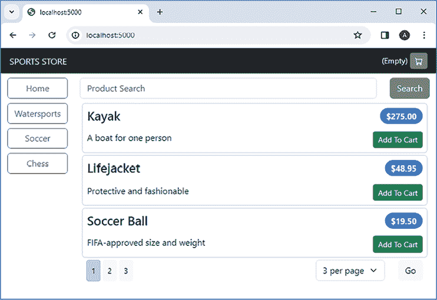
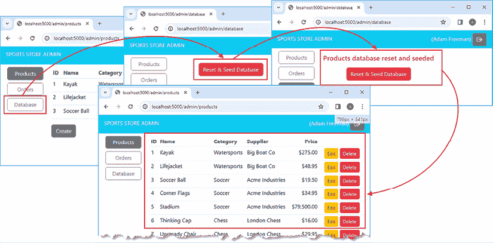
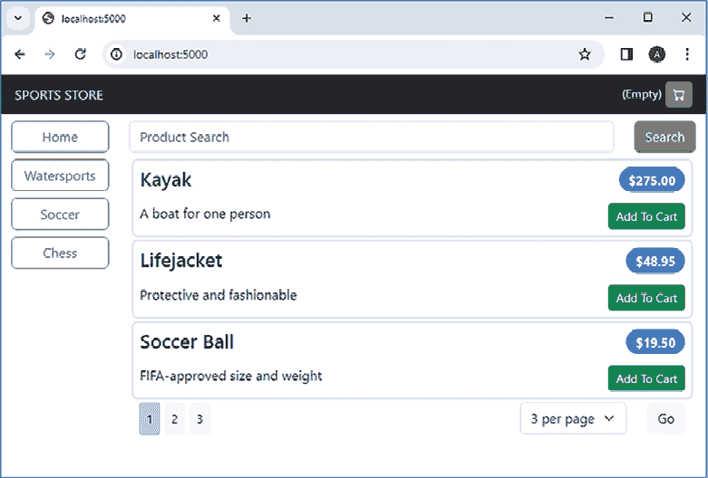
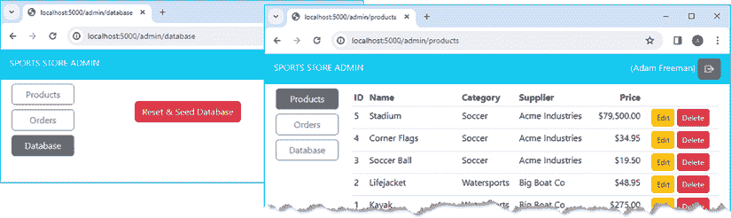
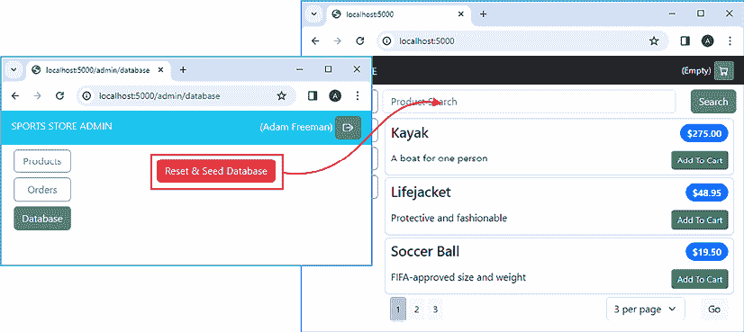
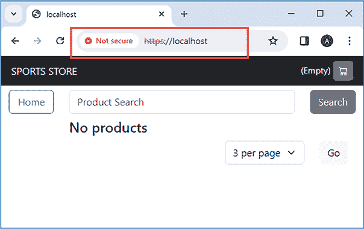

# SportsStore：部署

在本章中，我完成了 SportsStore 应用程序，并为其部署到容器平台做准备。作为准备的一部分，我将从基于文件的 SQLite 数据库迁移到传统的数据库服务器，并引入 HTTPS 代理，这将允许多个 SportsStore 应用程序实例接收请求并分担负载。

# 准备本章

本章使用的是来自*第二十章*的 `sportsstore` 项目。打开一个新的命令提示符，导航到 `sportsstore` 文件夹，并运行*列表 21.1*中显示的命令以启动开发工具。

**提示**

您可以从[`github.com/PacktPublishing/Mastering-Node.js-Web-Development`](https://github.com/PacktPublishing/Mastering-Node.js-Web-Development)下载本章的示例项目——以及本书中所有其他章节的示例项目。有关运行示例时遇到问题的帮助，请参阅*第一章*。

列表 21.1：启动开发工具

```js
npm start 
```

打开一个新的浏览器窗口，导航到 `http://localhost:5000`，您将看到产品目录，如图*图 21.1*所示。



图 21.1：运行应用程序

# 安装 Docker Desktop

部署应用程序有许多方法，我无法一一描述。相反，我选择了提供最大灵活性的方法，即使用*容器*。容器是轻量级的虚拟机，运行自包含的*镜像*，并使用标准工具构建和部署。容器是可移植的，可以部署到私有和云基础设施，这使得它们成为大多数应用程序的好选择。

创建和管理容器最流行的工具是 Docker。访问 `docker.com`，下载并安装 Docker Desktop 软件包。遵循安装过程，重新启动您的计算机，并运行*列表 21.2*中显示的命令以检查 Docker 是否已安装并位于您的路径中。（Docker 的安装过程似乎经常变化，这就是为什么我没有更具体地说明过程。）

您需要在 `docker.com` 上创建一个账户；Docker 的免费版本包含了本章所需的所有功能，而付费服务不是必需的。

列表 21.2：检查 Docker Desktop 安装

```js
docker --version 
```

如果 Docker 已安装并正在运行，您将看到类似以下响应：

```js
Docker version 25.0.3, build 4debf41 
```

您可能看到不同的版本号，但这没关系，因为重点是确保 Docker Desktop 正在运行。

# 管理数据库

在本书的这一部分，SportsStore 应用程序已被配置为每次服务器启动时自动重新创建和初始化数据库。我通常喜欢在自己的项目中采用这种方法，但对于本书的示例来说，它特别有用，因为它确保读者始终在干净的数据上工作，并消除了一个潜在的问题，即代码更改与数据库模式不同步。

在生产环境中，每次服务器启动时不应重置数据库，但在初始部署期间确保数据库被创建和播种仍然很重要。为了扩展管理工具，以便可以重置和重新播种数据库，请将名为 `database_routes.ts` 的文件添加到 `src/routes/admin` 文件夹中，内容如 *列表 21.3* 所示。

列表 21.3：src/routes/admin 文件夹中 database_routes.ts 文件的内容

```js
import { Router } from "express";
import { CategoryModel, ProductModel, SupplierModel }
    from "../../data/orm/models";
import { readFileSync } from "fs";
import { getConfig } from "../../config";
export const createDbManagementRoutes = (router: Router) => {
    router.get("", (req, resp) => {
        resp.render("admin/db_mgt");
    });
    router.post("/reset", async (req, resp) => {
        await ProductModel.sequelize?.drop();
        await ProductModel.sequelize?.sync();
        const data = JSON.parse(readFileSync(getConfig("catalog:orm_repo")
            .seed_file).toString());
        await ProductModel.sequelize?.transaction(async (transaction) => {
            await SupplierModel.bulkCreate(data.suppliers, { transaction });
            await CategoryModel.bulkCreate(data.categories, { transaction });
            await ProductModel.bulkCreate(data.products, { transaction });
        });
        resp.render("admin/db_mgt", {
            admin_msg: "Products database reset and seeded"
        });
    });
} 
```

`GET` 请求的处理程序渲染一个名为 `admin/db_mgt` 的模板，该模板将使用户能够重置数据库。`POST` 请求的处理程序通过添加到模型类的 `sequelize` 属性访问由存储库创建的 `Sequelize` 对象，调用 `drop` 和 `sync` 方法来重置数据库，然后使用种子数据填充数据库。*列表 21.4* 启用新路由并定义了一个直接导航 URL。

列表 21.4：在 src/routes/admin 文件夹中的 index.ts 文件中启用路由

```js
import { Express, NextFunction, Request, Response, Router } from "express";
import { createAdminCatalogRoutes } from "./admin_catalog_routes";
import { createAdminOrderRoutes } from "./admin_order_routes";
import passport from "passport";
import { getConfig} from "../../config";
**import** **{ createDbManagementRoutes } from "./database_routes";**
const users: string[] = getConfig("admin:users", []);
export const createAdminRoutes = (app: Express) => {
    // ... routes omitted for brevity...
    const authCheck = (r: Request) => users.find(u => r.user?.email === u);
    const apiAuth = (req: Request, resp: Response, next: NextFunction) => {
        if (!authCheck(req)) {
            return resp.sendStatus(401)
        }
        next();
    };
    const cat_router = Router();
    createAdminCatalogRoutes(cat_router);
    app.use("/api/products", apiAuth, cat_router);
    const order_router = Router();
    createAdminOrderRoutes(order_router);
    app.use("/api/orders", apiAuth, order_router);
    **const db_router =** **Router();**
 **createDbManagementRoutes(db_router);**
 **app.use("/api/database", apiAuth, db_router);**
    const userAuth = (req: Request, resp: Response, next: NextFunction) => {
        if (!authCheck(req)) {
            return resp.redirect("/admin/signin");
        }
        next();
    };
    // ...other routes omitted for brevity...
    app.get("/admin/orders", userAuth, (req, resp) => {
        resp.locals.content = "/api/orders/table";
        resp.render("admin/admin_layout");
    })
   ** app.get("/admin/database", userAuth, (req, resp) => {**
 **resp.locals.content = "****/api/database";**
 **resp.render("admin/admin_layout");**
 **})** 
} 
```

将名为 `db_mgt.handlebars` 的文件添加到 `templates/admin` 文件夹中，内容如 *列表 21.5* 所示。

列表 21.5：templates/admin 文件夹中 db_mgt.handlebars 文件的内容

```js
{{> admin/area_buttons mode="database"}}
<div class="m-2">
    <h5 class="text-danger text-center">{{admin_msg}}</h5>
</div>
<div class="m-2 text-center">
    <button class="btn btn-danger m-2"
        hx-post="/api/database/reset"
        hx-target="#content">Reset & Seed Database</button>
</div> 
```

模板包含一个发送到在 *列表 21.4* 中定义的处理器的 `POST` 请求的 `button` 元素，以及一个显示处理器提供的消息的 `h5` 元素。*列表 21.6* 在 `area_buttons` 模板中添加了一个按钮，以便将数据库功能包含在向用户展示的内容中。

列表 21.6：在 templates/admin 文件夹中的 area_buttons.handlebars 文件中添加按钮

```js
<swap_wrapper hx-swap-oob="innerHTML:#area_buttons">
    <div class="d-grid gap-2" >
        <button id="products_btn" class="btn {{ buttonClass "products" mode }}"
            hx-get="/api/products/table" hx-target="#content"
            hx-push-url="/admin/products">
            Products
        </button>
        <button id="orders_btn" class="btn {{ buttonClass "orders" mode }}"
            hx-get="/api/orders/table" hx-target="#content"
            hx-push-url="/admin/orders">
            Orders
        </button>
      **  <button id****="db_btn" class="btn {{ buttonClass "database" mode }}"**
 **hx-get="/api/database" hx-target="#content"**
 **hx-push-url="****/admin/database">**
 **Database**
 **</button>**
    </div>
</swap_wrapper> 
```

使用浏览器请求 `http://localhost:5000/admin`，使用 OAuth 进行身份验证，然后点击几个产品的 **删除** 按钮。你移除多少或哪些产品都无关紧要，因为目的是确保数据库被重置并重新播种。点击 **数据库** 按钮，然后点击 **重置并播种数据库**。一旦数据库被重置，点击 **产品** 按钮，你将看到如图 21.2 所示的原始数据。



图 21.2：重置数据库

# 切换应用程序环境

SportsStore 应用程序将在 Docker 容器中部署，该容器被配置为将应用程序环境设置为 `production`。能够在容器外部切换到生产环境以便为部署准备应用程序是有帮助的。一种方法是通过启动 Node.js 所使用的命令提示符设置名为 `NODE_ENV` 的环境变量，但这在有多位开发者，每位开发者都有自己的命令提示符或 shell 偏好，并且他们以自己的方式处理环境变量时可能难以做到一致。一种更可靠的方法是依赖于 `dotenv` 包，该包从文件中读取环境变量。

在`sportsstore`文件夹中添加一个名为`overrides.env`的文件，内容如*列表 21.7*所示。这是一个临时文件，只是为了确认在准备部署之前应用程序的行为是否符合预期。

列表 21.7：sportsstore 文件夹中`overrides.env`文件的内容

```js
NODE_ENV=production 
```

*列表 21.8*使用`dotenv`包读取`.env`文件，这是在应用程序启动时完成的。

列表 21.8：在 src/config 文件夹中的 index.ts 文件中读取.env 文件

```js
import { readFileSync } from "fs";
import { getEnvironment, Env } from "./environment";
import { merge } from "./merge";
import { config as dotenvconfig } from "dotenv";
**dotenvconfig({ path: "overrides.env", override: false});**
const file = process.env.SERVER_CONFIG ?? "server.config.json"
const data = JSON.parse(readFileSync(file).toString());
dotenvconfig({
    path: getEnvironment().toString() + ".env"
})
try {
    const envFile = getEnvironment().toString() + "." + file;
    const envData = JSON.parse(readFileSync(envFile).toString());
    merge(data, envData);
} catch {
    // do nothing - file doesn't exist or isn't readable
}
export const getConfig = (path: string, defaultVal: any = undefined) => {
    const paths = path.split(":");
    let val = data;
    paths.forEach(p => val = val[p]);
    return val ?? defaultVal;
}
export const getSecret = (name: string) => {
    const secret = process.env[name];
    if (secret === undefined) {
        throw new Error(`Undefined secret: ${name}`);
    }
    return secret;
}
export { getEnvironment, Env }; 
```

您可能会想覆盖在*第十六章*中创建的`config`模块中`getEnvironment`返回的值。这将影响所有为使用`config`模块而编写的自定义*SportsStore*代码，但它不会改变*SportsStore*所依赖的第三方包的行为。`NODE_ENV`环境变量是一个广泛使用的约定，许多包根据其值改变其行为。例如，将 Handlebars 模板集成到 Express 框架中的`express-handlebars`包，当`NODE_ENV`设置为生产时，会自动编译和缓存模板文件。

应用程序无法在生产模式下运行，因为没有为用于签名会话 cookie 或执行 OAuth 请求的秘密设置。*列表 21.9*向`overrides`文件中添加了设置，以便应用程序可以准备部署。

列表 21.9：在 sportsstore 文件夹中的 overrides.env 文件中添加设置

```js
NODE_ENV=production
**COOKIE_SECRET="sportsstoresecret"**
**GOOGLE_CLIENT_ID=<enter your client ID>**
**GOOGLE_CLIENT_SECRET=<enter your secret>** 
```

您必须将*列表 21.9*中的占位符文本替换为在*第十九章*配置 OAuth 时 Google 提供的客户端 ID 和秘密。没有这些设置，应用程序将启动，但您将无法使用管理工具进行身份验证并填充数据库。

停止应用程序，并在`sportsstore`文件夹中运行*列表 21.10*中显示的命令以仅启动 Node.js 服务器。在开发期间确保客户端更新的**webpack**打包器现在不再需要。

列表 21.10：启动 Node.js 服务器

```js
npm run server 
```

当有更改时，服务器仍将构建和重启，但 webpack 开发服务器不会启动，`overrides.env`文件中配置的`production`环境意味着 Node.js 服务器将处理所有 HTTP 请求，而不会尝试转发它们。在继续之前，请通过浏览器请求`http://localhost:5000`来检查应用程序是否运行正确，它应该显示*图 21.3*中的目录显示。



图 21.3：在生产模式下运行应用程序

# 使用数据库服务器

到现在为止，应该很清楚我是一个 SQLite 数据库的超级粉丝，它包含了许多功能，并且被每个主要包和框架支持。SQLite 的主要限制是它不能在多个 Node.js 服务器之间轻松共享，因此是时候迁移到一个可以通过网络查询的传统数据库服务器了。在本章中，我将使用 PostgreSQL，通常简称为 Postgres。正如我在*第二部分*中提到的，所有主流数据库都很好，但我选择 Postgres 是因为它是最受欢迎的开源数据库，并且它得到了`Sequelize` ORM 包的良好支持。

使用 Postgres 最简单的方法是在容器中运行数据库服务器。

打开一个新的命令提示符，并运行*列表 21.11*中显示的命令以下载 Postgres 的镜像，并使用它创建一个新的容器。由于第一次使用时需要下载镜像，因此命令可能需要一些时间来完成，但后续操作将使用缓存。

列表 21.11：创建容器

```js
docker run -e POSTGRES_PASSWORD=MySecret$ -p 5432:5432 postgres:16.2 
```

`docker run`命令创建一个新的容器。`-e`参数设置容器的环境变量，在这种情况下，用于设置访问数据库服务器的密码。`-p`参数配置网络端口，用于公开端口`5432`，以便可以从主机操作系统访问，允许从容器外部使用数据库服务器。保持命令提示符打开。容器将一直运行，直到使用*Ctrl + C*终止`docker run`命令。

在`sportsstore`文件夹中运行*列表 21.12*中显示的命令，安装允许 Sequelize 与 Postgres 一起工作的包。

列表 21.12：添加数据库包

```js
npm install pg@8.11.3
npm install pg-hstore@2.3.4 
```

*表 21.1*描述了这些包以供快速参考。

表 21.1：CookieOptions 包

| 名称 | 描述 |
| --- | --- |
| `pg` | 此包包含与 Postgres 服务器通信的支持。 |
| `pg-hstore` | 此包包含在 Postgres 数据库中存储 JSON 数据的功能。 |

在`sportsstore`文件夹中添加一个名为`production.server.config.json`的文件，其内容如*列表 21.13*所示。

列表 21.13：sportsstore 文件夹中 production.server.config.json 的内容

```js
{
    "catalog": {
        "orm_repo": {
            "reset_db": false,
            "settings": {
                "dialect": "postgres",
                "host": "localhost",
                "port": "5432",
                "username": "postgres",
                "password": "MySecret$"
            }
        }
    },
    "sessions": {
        "reset_db": false,
        "orm": {
            "settings": {
                "dialect": "postgres",
                "host": "localhost",
                "port": "5432",
                "username": "postgres",
                "password": "MySecret$"
            }
        }       
    }
} 
```

*列表 21.13*中的设置会覆盖`server.config.json`文件中定义的设置，并且仅在应用程序处于`production`环境时应用。这两个配置部分都禁用了每次重置数据库，并提供了连接到容器中数据库的配置设置。

停止 Node.js 应用程序，并在`sportstore`文件夹中运行*列表 21.14*中显示的命令，以使用新的配置文件重新启动它。

列表 21.14：启动应用程序

```js
npm run server 
```

应用程序应连接到 Postgres 数据库服务器。使用浏览器请求 `http://localhost:5000/admin`，使用 Google 账户进行身份验证，并通过点击 **数据库** 部分的 **重置 & 种子** **数据库** 按钮来填充数据库。点击 **产品** 选择以确认数据库已被填充，如图 *图 21.4* 所示。



图 21.4：填充数据库

确认 *SportsStore* 与 Postgres 一起工作后，使用 *Ctrl + C* 停止应用程序和数据库。

# 创建 SportsStore Docker 镜像

下一步是准备一个包含 Node.js、*SportsStore* 应用程序、它所依赖的所有包、模板和配置文件的镜像。第一步是创建一个文件，告诉 Docker 忽略 `node_modules` 文件夹，因为所有文件夹都会被扫描，这会导致镜像创建速度变慢。在 `sportsstore` 文件夹中创建一个名为 `.dockerignore` 的文件，其内容如 *列表 21.15* 所示。

列表 21.15：sportsstore 文件夹中 .dockerignore 文件的内容

```js
node_modules 
```

下一步是创建一个文件，告诉 Docker 如何创建镜像。将一个名为 `Dockerfile`（不带文件扩展名）的文件添加到 `sportsstore` 文件夹中，其内容如 *列表 21.16* 所示。

列表 21.16：sportsstore 文件夹中 Dockerfile 文件的内容

```js
FROM node:20.10.0
RUN mkdir -p /usr/src/sportsstore
COPY dist /usr/src/sportsstore/dist
COPY templates /usr/src/sportsstore/templates
COPY products.json /usr/src/sportsstore/
COPY server.config.json /usr/src/sportsstore/
COPY production.server.config.json /usr/src/sportsstore/
COPY package.json /usr/src/sportsstore/
WORKDIR /usr/src/sportsstore
RUN npm install --omit=dev
RUN npm install wait-for-it.sh@1.0.0
ENV NODE_ENV=production
ENV COOKIE_SECRET="sportsstoresecret"
ENV GOOGLE_CLIENT_ID=<enter your ID>
ENV GOOGLE_CLIENT_SECRET=<enter your secret>
EXPOSE 5000
ENTRYPOINT npx wait-for-it postgres:5432 && node dist/server.js 
```

`Dockerfile` 包含一系列用于构建镜像的指令。`FROM` 命令告诉 Docker 使用本书中使用的 Node.js 版本的镜像作为基础，这简化了设置过程。

`COPY` 命令告诉 Docker 从项目复制文件到容器中。`WORKDIR` 命令更改后续命令的工作目录。此命令安装运行应用程序所需的包：

```js
...
RUN npm install --omit=dev
... 
```

`--omit` 参数用于排除使用 `npm install --save-dev` 命令添加的包，这意味着像 TypeScript 编译器这样的包将不会包含在镜像中。

下一个命令安装一个仅在应用程序部署时才需要的包：

```js
...
RUN npm install wait-for-it.sh@1.0.0
... 
```

在容器之间进行协调可能很困难，并且确保 SportsStore 应用程序在数据库服务器准备好接收请求之前不启动是很重要的。`wait-for-it` 包等待一个 TCP 端口被打开，这是一种简单且可靠的方法，确保在一个容器启动之前另一个容器中的应用程序已经准备好。

`ENV` 命令设置环境变量，并用于设置 `production` 模式和定义用于签名 cookie 和执行 Google OAuth 请求的秘密。

`EXPOSE`命令告诉 Docker 公开端口`5000`，这将允许 SportsStore 应用程序接收 HTTP 请求。`ENTRYPOINT`命令在容器启动时执行，并分为两部分。第一部分使用`wait-for-it`包阻塞，直到名为`postgres`的服务器上的端口`5432`打开。这是在*组合应用程序和数据库服务器*部分中将为数据库赋予的名称。第二部分在`dist`文件夹中运行`server.js`文件，这将启动*SportsStore*应用程序。

## 准备应用程序

镜像是应用程序及其相关文件的快照。在创建镜像之前，进行任何最终的配置更改并构建代码非常重要，以确保镜像中包含的 JavaScript 反映了最终的 TypeScript 代码。

*列表 21.17*将 Postgres 服务器的名称从`localhost`更改为`postgres`，这是在部署时将赋予数据库服务器的名称。

**注意**

在实际项目中，你还会更改 OAuth 重定向 URL，以便它们包含用户连接到服务的公共域名。*SportsStore*应用程序将仅在开发机器上使用，因此包含`localhost`的重定向 URL 将继续工作，但对于实际项目来说情况并非如此。

列表 21.17：在 sportsstore 文件夹中的 production.server.config.json 文件中更改服务器名称

```js
{
    "catalog": {
        "orm_repo": {
            "reset_db": false,
            "settings": {
                "dialect": "postgres",
               ** "host": "postgres",**
                "port": "5432",
                "username": "postgres",
                "password": "MySecret$"
            }
        }
    },
    "sessions": {
        "reset_db": false,
        "orm": {
            "settings": {
                "dialect": "postgres",
 **"host": "postgres",**
                "port": "5432",
                "username": "postgres",
                "password": "MySecret$"
            }
        }       
    }
} 
```

在`sportsstore`文件夹中运行*列表 21.18*中显示的命令，以运行 TypeScript 编译器来创建代码的最终构建版本。

列表 21.18：编译 TypeScript 代码

```js
npx tsc 
```

## 创建 SportsStore 镜像

在`sportsstore`文件夹中运行*列表 21.19*中显示的命令，以创建包含 SportsStore 应用程序的镜像。

列表 21.19：创建 sportsstore 镜像

```js
docker build . -t sportsstore -f Dockerfile 
```

当图像创建时，你将看到类似以下输出的内容：

```js
[+] Building 25.6s (17/17) FINISHED    docker:default
 => [internal] load build definition from Dockerfile
=> => transferring dockerfile: 785B
=> [internal] load metadata for docker.io/library/node:20.10.0
=> [auth] library/node:pull token for registry-1.docker.io
=> [internal] load .dockerignore
=> => transferring context: 52B
=> [internal] load build context 
=> => transferring context: 60.69kB
=> [ 1/11] FROM docker.io/library/node:20.10.0@sha256:8d0f16fe841577f9317ab49011c6d819e1fa81f8d
=> CACHED [ 2/11] RUN mkdir -p /usr/src/sportsstore
=> CACHED [ 3/11] COPY dist /usr/src/sportsstore/dist
=> CACHED [ 4/11] COPY templates /usr/src/sportsstore/templates
=> CACHED [ 5/11] COPY products.json /usr/src/sportsstore/
=> CACHED [ 6/11] COPY server.config.json /usr/src/sportsstore/
=> CACHED [ 7/11] COPY production.server.config.json /usr/src/sportsstore/
=> CACHED [ 8/11] COPY package.json /usr/src/sportsstore/
=> CACHED [ 9/11] WORKDIR /usr/src/sportsstore
=> [10/11] RUN npm install --omit=dev
=> [11/11] RUN npm install wait-for-it.sh@1.0.0  
=> exporting to image
=> => exporting layers
=> => writing image sha256:4b2f72d561dfbe21695573d7f448bc6ada3a9c4802bc5a70b8af1676e82c1fcd 
=> => naming to docker.io/library/sportsstore 
```

此命令可能需要一段时间才能运行，因为必须下载 Node.js 镜像，并且 SportsStore 应用程序所需的包必须安装。

# 组合应用程序和数据库服务器

下一步是创建配置文件，该文件指定如何使用 SportsStore 和 Postgres 镜像来创建容器。这一步骤取决于容器将如何部署，有多个选项。所有主要的云平台都提供使用容器的支持，并且配置必须根据目标平台的需求和功能进行调整。

对于本章，我将使用 Docker Compose，这是 Docker Desktop 内置的工具。你可能不会在你的项目中使用 Docker Compose，但它具有你将遇到的相同核心功能，无论你如何部署，它都使得组合和测试容器以创建完整的应用程序变得容易。将一个名为 `docker-compose.yml` 的文件添加到 `sportsstore` 文件夹中，其内容如 *列表 21.20* 所示。

列表 21.20：`sportsstore` 文件夹中 docker-compose.yml 文件的内容

```js
version: "3"
volumes:
  databases:
services:
  postgres:
    image: "postgres:16.2"
    volumes:
      - databases:/var/lib/postgresql/data
    environment:
      - POSTGRES_PASSWORD=MySecret$

  sportsstore:
    image: "sportsstore"
    depends_on:
      - postgres
    ports:
      - 5000:5000 
```

文件的格式是 YAML，它对缩进很敏感，内容必须与显示的完全一致。大多数代码编辑器，包括 Visual Studio Code，都包含 YAML 语法高亮，这有助于识别内容或格式错误。

*列表 21.20* 中的配置告诉 Docker Compose 创建两个容器。第一个，将被命名为 `postgres`，包含数据库服务器。此服务配置了一个卷，这是 Docker 用于持久化数据的特性，没有它，数据库的内容将会丢失。

第二个，命名为 `sportsstore`，包含应用程序。`sportsstore` 容器被配置为将端口 `5000` 导出至主机操作系统，以便它可以接收 HTTP 请求。容器之间的通信使用服务名称作为主机名，这就是为什么 *列表 21.17* 将数据库服务器的名称更改为 `postgres`。

在 `sportsstore` 文件夹中运行 *列表 21.21* 中显示的命令以准备容器。

列表 21.21：准备容器

```js
docker-compose build 
```

在 `sportsstore` 文件夹中运行 *列表 21.22* 中显示的命令以启动容器。

列表 21.22：启动容器

```js
docker-compose up 
```

Docker 将创建并启动数据库服务器和应用程序的容器，并显示它们生成的控制台消息。等待片刻，以便容器启动，然后使用浏览器请求 `http://localhost:5000`。数据库将是空的，但可以使用管理工具填充，如图 21.5 所示。



图 21.5：使用 Docker Compose

应用程序和数据库服务器各自运行在一个容器中，并且可以相互通信。容器之间用于通信的网络是由 Docker 创建和管理的。

# 设置 HTTPS 反向代理

下一步是引入 HTTPS 的支持，这将由一个名为 **HAProxy** 的代理软件包处理（[`www.haproxy.org`](https://www.haproxy.org)）。有许多代理软件可用，但这是我多年来一直在使用且始终认为可靠的软件之一。

为了准备代理，将你的证书和密钥文件以 `cert.pem` 和 `key.pem` 的名称复制到 `sportsstore` 文件夹中。*第五章* 包含创建免费自签名证书的说明，或者你可以从本章的 GitHub 项目中复制文件，该项目包含我创建的自签名证书。

您可以使用真实的证书，但必须确保与证书关联的域名解析到您运行容器的机器上，这可能很难安排。

要创建代理配置文件，请将名为 `haproxy.cfg` 的文件添加到 `sportsstore` 文件夹中，其内容如 *列表 21.23* 所示。

列表 21.23：sportsstore 文件夹中 haproxy.cfg 文件的内容

```js
defaults
    mode http
    timeout connect 5000
    timeout client  50000
    timeout server  50000
resolvers dockerdns
    nameserver dns1 127.0.0.11:53
frontend localnodes
    bind *:80
    bind *:443 ssl crt /usr/local/etc/haproxy/cert.pem
    http-request redirect scheme https unless { ssl_fc }
    default_backend app
backend app
    balance roundrobin
    server-template sportsstore- 5 sportsstore:5000 check resolvers dockerdns 
```

此配置设置代理以监听端口 `80` 和端口 `443`。HTTP 请求将被重定向以使用 HTTPS。HTTPS 请求将被转发到 SportsStore，SportsStore 通过查询 Docker 提供给容器的 DNS 来定位。DNS 的使用允许多个 `sportsstore` 容器运行，并且代理可以在它们之间分配请求。

在 `sportsstore` 文件夹中添加一个名为 `Dockerfile.proxy` 的文件，其内容如 *列表 21.24* 所示。

列表 21.24：sportsstore 文件夹中 Dockerfile.proxy 文件的内容

```js
FROM haproxy:2.9.6
COPY haproxy.cfg /usr/local/etc/haproxy
COPY cert.pem /usr/local/etc/haproxy
COPY key.pem /usr/local/etc/haproxy/cert.pem.key 
```

`FROM` 命令使用 `haproxy` 镜像创建新的容器，`COPY` 命令将配置和证书文件包含在镜像中。运行 *列表 21.25* 中显示的命令来创建代理的镜像。

列表 21.25：创建代理镜像

```js
docker build . -t ss-proxy -f Dockerfile.proxy 
```

## 更新 OAuth URL

端口更改和强制使用 HTTPS 需要更改 SportsStore 配置以反映 OAuth 重定向 URL，如 *列表 21.26* 所示。

列表 21.26：更新 sportsstore 文件夹中的 production.server.config.json 文件中的 URL

```js
{
    "catalog": {
        "orm_repo": {
            "reset_db": false,           
            "settings": {
                "dialect": "postgres",
                "host": "postgres",
                "port": "5432",
                "username": "postgres",
                "password": "MySecret$"
            }
        }
    },
    "sessions": {
        "reset_db": false,
        "orm": {
            "settings": {
                "dialect": "postgres",
                "host": "postgres",
                "port": "5432",
                "username": "postgres",
                "password": "MySecret$"
            }
        }       
    },
   ** "auth": {**
 **"openauth": {**
 **"redirectionUrl": "https://localhost/signin-google"**
 **}**
 **},**
 **"****admin": {**
 **"openauth": {**
 **"redirectionUrl": "https://localhost/auth-signin-google"**
 **}**
 **}**
} 
```

没有这些更改，OAuth 重定向不会被应用程序接收。在 `sportsstore` 文件夹中运行 *列表 21.27* 中显示的命令来更新 SportsStore 镜像以反映配置更改。

列表 21.27：更新 SportsStore 镜像

```js
docker build . -t sportsstore -f Dockerfile 
```

## 完成配置

最后一步是更新 Docker Compose 文件以添加代理并创建多个 *SportsStore* 容器，如 *列表 21.28* 所示。

**注意**

此配置打开了一些操作系统上受限制的端口，这意味着可能需要超级用户或管理员访问权限。

列表 21.28：在 sportsstore 文件夹中的 docker-compose.yml 文件中完成配置

```js
version: "3"
volumes:
  databases:
services:
  postgres:
    image: "postgres:16.2"
    volumes:
      - databases:/var/lib/postgresql/data
    environment:
      - POSTGRES_PASSWORD=MySecret$

  sportsstore:
    image: "sportsstore"
    depends_on:
      - postgres
 **   # ports:**
 **#   - 5000:5000**
 **deploy:**
 **replicas: 5**
 **proxy:**
 **image: "****ss-proxy"**
 **ports:**
 **- 80:80**
 **- 443:443** 
```

通过在 `sportsstore` 文件夹中运行 *列表 21.29* 中显示的命令来停止所有现有容器。

列表 21.29：停止容器

```js
docker-compose down 
```

等待容器停止，然后在 `sportsstore` 文件夹中运行 *列表 21.30* 中显示的命令来启动数据库、多个 *SportsStore* 应用程序实例和代理。

列表 21.30：启动容器

```js
docker-compose up 
```

Docker 将启动总共五个*SportsStore*容器，所有这些容器都将共享对相同的会话和目录数据的访问。打开浏览器并请求`http://localhost`，您将被重定向到使用 HTTPS，如图*图 21.6*所示。如*第五章*中所述，您可能需要绕过安全警告，因为代理使用的证书是自签名的。



图 21.6：重定向不安全连接

您可以使用管理工具填充数据库。代理配置为依次将请求转发到每个*SportsStore*容器，您可以在控制台消息中看到这一过程，其中包含每个消息来源的容器名称：

```js
...
**sportsstore-1**  | Executing (default): SELECT "sid", "expires", "data", "createdAt", "updatedAt" FROM "Sessions" AS "Session" WHERE "Session"."sid" = 'eGtcJR_TJhkO3N0gCzXiqsdJWV4exbmU';
**sportsstore-1**  | Executing (default): UPDATE "Sessions" SET "expires"=$1,"updatedAt"=$2 WHERE "sid" = $3; "2024-03-21 23:56:43.319 +00:00", "2024-03-21 21:56:43.319 +00:00", "eGtcJR_TJhkO3N0gCzXiqsdJWV4exbmU"
**sportsstore-5**  | Executing (default): SELECT "sid", "expires", "data", "createdAt", "updatedAt" FROM "Sessions" AS "Session" WHERE "Session"."sid" = 'eGtcJR_TJhkO3N0gCzXiqsdJWV4exbmU';
**sportsstore-5**  | Executing (default): UPDATE "Sessions" SET "expires"=$1,"updatedAt"=$2 WHERE "sid" = $3; "2024-03-21 23:56:43.389 +00:00", "2024-03-21 21:56:43.389 +00:00", "eGtcJR_TJhkO3N0gCzXiqsdJWV4exbmU"
**sportsstore-2**  | Executing (default): SELECT "sid", "expires", "data", "createdAt", "updatedAt" FROM "Sessions" AS "Session" WHERE "Session"."sid" = 'eGtcJR_TJhkO3N0gCzXiqsdJWV4exbmU';
**sportsstore-2**  | Executing (default): UPDATE "Sessions" SET "expires"=$1,"updatedAt"=$2 WHERE "sid" = $3; "2024-03-21 23:56:43.436 +00:00", "2024-03-21 21:56:43.437 +00:00", "eGtcJR_TJhkO3N0gCzXiqsdJWV4exbmU"
... 
```

代理的配置可以自动检测多达五个 SportsStore 容器的实例，并在容器不可用时停止将请求转发到容器。打开一个新的命令提示符并运行`sportsstore`文件夹中*列表 21.31*中显示的命令来禁用一个 SportsStore 容器。

列表 21.31：更改 sportsstore 容器的数量

```js
docker-compose scale sportsstore=4 
```

命令显示正在运行的容器并停止其中一个，如下所示：

```js
...
Running 6/6
Container sportsstore-postgres-1     Running
Container sportsstore-sportsstore-4  Running
Container sportsstore-sportsstore-3  Running
Container sportsstore-sportsstore-1  Running
Container sportsstore-sportsstore-2  Running
Container sportsstore-sportsstore-5  Removed
... 
```

代理检测到变化并确定其中一个容器不再可用，产生如下信息：

```js
...
proxy-1        | [WARNING]  (8) : Server app/sportsstore-3 is going DOWN for maintenance (No IP for server ). 4 active and 0 backup servers left. 0 sessions active, 0 requeued, 0 remaining in queue.
... 
```

容器使用的名称并不总是与 Docker DNS 服务使用的名称相匹配，这就是为什么已停止的容器被命名为`sportsstore-sportsstore-5`，但代理报告称`app/sportsstore-3`已停止。

一旦您确认应用程序运行正确，请在`sportsstore`文件夹中运行*列表 21.32*中显示的命令来停止所有容器。

列表 21.32：停止应用程序容器

```js
docker-compose down 
```

Docker 将停止所有容器，更新状态显示，直到所有容器都显示为已移除：

```js
...
[+] Running 7/7
    Container sportsstore-sportsstore-2  Removed                                                                          
  Container sportsstore-proxy-1        Removed                                                                           
   Container sportsstore-sportsstore-3  Removed                                                                          
    Container sportsstore-sportsstore-1  Removed                                                                          
  Container sportsstore-sportsstore-4  Removed                                                                          
    Container sportsstore-postgres-1     Removed                                                                           
    Network sportsstore_default          Removed                                                                           
... 
```

应用程序已容器化，镜像已准备好部署到生产平台。

# 摘要

在本章中，我完成了 SportsStore 应用程序并为其部署到容器平台做好了准备。

+   SportsStore 镜像包含 Node.js、代码和资源，以及运行应用程序所需的所有 JavaScript 包。

+   容器平台提供了网络功能，允许容器进行通信，以便 SportsStore 应用程序可以使用分配给 Postgres 容器的名称向数据库服务器发送请求。

+   容器平台可以管理容器的实例数量，这使得 SportsStore 应用程序可以扩展以处理更多的请求。

+   HTTPS 请求由代理接收，代理使用容器平台提供的 DNS 服务定位 SportsStore 容器。当容器出现故障时，代理会检测到并停止将该容器的请求转发。

+   代理将 HTTP 请求重定向到 HTTPS。SportsStore 容器仅接收 HTTP 请求。

+   容器可以被部署到广泛的平台，包括所有的大型云服务提供商，例如 AWS 和 Azure。

关于使用 Node.js 创建 Web 应用程序的所有内容，我就教到这里。我只希望您阅读这本书的乐趣能和我写作时的乐趣一样，并且祝愿您在 Node.js 项目中取得每一步的成功。
