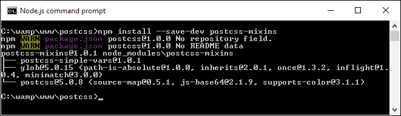

# 第二章：创建变量和混入

一个问题：你有多少次在代码中创建了像按钮这样的组件，使用了多次非常相似的颜色？手动修改真的很痛苦。使用预处理程序如 SASS 或 Less 可以使它更容易，但需要承担完整库的开销。

我们能换一种方法吗？绝对可以；在接下来的几章中，我们将探索 PostCSS 的不同元素，然后在本书的后面部分将它们全部整合，以创建一个预处理程序应用。我们的旅程将从查看使用变量和混入开始；我们首先将探讨创建它们的基础知识，然后再过渡到支持使用 PostCSS。在本章中，我们将涵盖以下主题：

+   使用现有预处理程序创建变量和混入的概述

+   转向使用 PostCSS 等效物

+   将混入支持添加到 PostCSS

+   检查标准预处理程序和 PostCSS 之间的差异

让我们开始吧！

# 介绍变量和混入

到目前为止，我们已经涵盖了安装和配置 PostCSS 的基础知识——尽管涉及几个步骤，但使用处理器开始的过程很容易。然而，要真正了解它，没有比在实际中使用它更好的替代品了；只需一点小心和计划，你就可以自动化很多事情！

让我们通过使用变量、函数和混入来创建几个简单的示例来测试它。我们将从使用 SASS 创建原始版本开始，然后再将其转换为使用 PostCSS 插件。这些演示假设您对使用 SASS 有一定的了解，如果您完全不熟悉，那么您可能想参考我的书籍《SASS Essentials》，由 Packt Publishing 出版。

### 注意

有一点需要注意：我们将充分利用我们在第一章中创建的项目文件夹，*介绍 PostCSS*，其中`src`将是我们的工作台，而`dest`将包含编译后的代码。确保你在桌面上某个窗口中打开了它！

好吧，这个过程的第一步是安装 SASS，所以现在让我们来看看。

## 设置 SASS

使用 Gulp 设置 SASS 非常简单；我们可以使用与其他插件相同的命令格式来安装它。该插件的源代码可在[`github.com/dlmanning/gulp-sass`](https://github.com/dlmanning/gulp-sass)找到；它是一个轻量级的`node-sass`前端，而`node-sass`是一个 C+库的 Node 绑定，即`libsass`。

让我们深入探讨并查看如何安装它：

1.  我们像往常一样从 Node 开始。启动一个 Node.js 命令提示符会话，然后切换到工作目录。

1.  在命令提示符中，输入以下内容，然后按*Enter*：

    ```js
    npm install --save-dev gulp-sass

    ```

1.  如果一切顺利，我们应该会看到类似于以下截图的内容：

在我们继续之前，我建议在每个练习之后，将`dest`文件夹的内容清理或保存到其他地方以备安全起见：

1.  接下来，在 Sublime Text 中打开`gulpfile.js`的副本；我们需要进行一些更改，首先是添加对`gulp-sass`插件的引用（如高亮所示）：

    ```js
    var reporter = require('postcss-reporter');
    var sass = require('gulp-sass');
    ```

    SASS 默认会以未压缩的格式生成代码；在任务中添加`{outputStyle: 'compressed'}`会将输出代码自动压缩。这使得这一行变得多余，所以请继续并移除它：

    ```js
    var cssnano = require('cssnano');
    ```

1.  我们还需要在约 19 行处移除对`cssnano`的引用，所以请移除这一行：

    ```js
    .pipe(postcss([ cssnano ]))
    ```

1.  大约在 10 行左右，将样式任务的名称更改为`autoprefixer`，将依赖项名称更改为`lint-styles`：

    ```js
    gulp.task('autoprefixer', ['lint-styles'], function() {
    return gulp.src('src/*.css')
    ```

    然后移除这两行：

    ```js
    .pipe(sourcemaps.init())
    .pipe(sourcemaps.write('maps/'))
    ```

1.  在重命名任务中，修改`rename`任务以匹配以下内容：

    ```js
    gulp.task('rename', ['lint-styles'], function () {
      return gulp.src('dest/*.css')
        .pipe(rename('style.min.css'))
        .pipe(sourcemaps.init())
        .pipe(sourcemaps.write('maps/'))
        .pipe(gulp.dest("dest/"));
    });
    ```

1.  大约在 25 行左右，我们需要添加`lint-styles`任务——请添加以下代码块，这将检查我们的样式是否一致：

    ```js
    gulp.task("lint-styles", ['sass'], function() {
      return gulp.src("src/*.css")
        .pipe(postcss([ stylelint({
          "rules": {
            "color-no-invalid-hex": 2,
            "declaration-colon-space-before": [2, "never"],
            "indentation": [2, 2],
            "number-leading-zero": [2, "always"]
          }
        }),
        reporter({
          clearMessages: true,
        })
      ]))
    });
    ```

1.  我们几乎完成了。添加下一个任务；这告诉 Gulp 如何编译任务运行器提供的任何 SASS 文件：

    ```js
    gulp.task('sass', function () {
      gulp.src('src/*.scss')
        .pipe(sass({outputStyle: 'compressed'}).on('error', sass.logError))
        .pipe(gulp.dest('src/'));
    });
    ```

1.  我们还需要进行一些其他更改。触发对每个子任务调用关键任务需要更新，以反映我们对任务的更改：

    ```js
    gulp.task('default', ['sass', 'lint-styles', 'autoprefixer', 'rename']);
    ```

1.  我们最后的更改是修改监视功能以检查 SASS 文件，而不是纯 CSS；请按照所示更改配置对象：

    ```js
    var watcher = gulp.watch('src/*.scss', ['default']);
    ```

到目前为止，我们已经设置了处理器以将 SASS 文件编译成有效的 CSS。我们可以通过编译任何 SASS 文件来证明这一点。如果一切顺利，我们的处理器将自动生成有效的样式表和相应的源映射文件。让我们在下一个练习中将其付诸实践，我们将为图像创建一个有趣的悬停效果。

# 创建悬停效果示例

如果你看过我之前的一些书籍，那么你会看到我对花朵有特别的喜好，特别是兰花；事实上，我第一本书的封面就是飞燕草，或者说是蝴蝶兰！我们将使用几幅兰花图片作为我们下一个演示的基础，如页面上的截图所示，它显示了顶部图像的动态悬停效果。

### 小贴士

如果你更喜欢使用 Less，那么请跳到这个演示的末尾，看看使用 Less CSS 的示例。

对于这个演示，我们需要从本书附带的代码下载中获取`tutorial1A`文件夹的副本；确保在继续之前找到它：

1.  打开`src`文件夹中`tutorial1A`的`style.scss`副本；让我们看看它的内容。

1.  在文件顶部，我们有一些变量。这些定义了代码中使用的某些颜色，并将`$fullsize`变量设置为 100%：

    眼尖的读者会发现并非所有颜色都给出了值；这个原因将在本章后面的部分变得清晰。

1.  接下来是一个简单 mixin 的示例，它将像素值转换为它们的 rem 单位等效值，以`16px`作为`1rem`单位的基准等效值：

1.  为了完成练习，我们需要下载一个字体。演示使用了可在[`www.fontsquirrel.com/fonts/source-sans-pro`](http://www.fontsquirrel.com/fonts/source-sans-pro)找到的 Source Sans Pro 字体。请继续下载它；您将需要使用黑色菜单中可用的**生成器**选项来生成一个可以在线使用的版本（它创建了我们在演示中使用的 CSS）。 

1.  在这一点上，请将`tutorial1A`文件夹中的`style.scss`文件复制到我们项目区域的`src`文件夹中。

1.  我们还需要`img`文件夹和`index.html`文件——请将它们都复制到我们项目区域的根目录。

1.  启动一个 Node.js 命令提示符窗口，然后在提示符中输入以下内容并按*Enter*：

    ```js
    gulp

    ```

1.  如果一切顺利，我们应该在我们的项目区域的`dest`文件夹中看到压缩的 CSS 文件和源映射出现——将`maps`文件夹和`style.min.css`复制到`tutorial1A`的`css`文件夹中。

1.  在浏览器中预览结果。如果一切顺利，我们应该在屏幕上看到两个兰花图像；如果您悬停在任何一个上，您将看到它飞向左或右，以显示有关兰花的信息框：

有趣的效果，对吧？这是一个简单的动画，使用`scale()`将图像缩小到其大小的`0.5`（或 50%），然后向右滑动，在它后面的`infobox`立即滑动进入。将鼠标移出图像，就会发生相反的情况——这是第二张图像的示例原理——但方向相反；代码设置了一个`ltr`和`rtl`类来决定图像在演示中应该向哪个方向移动。

## 使用 Less CSS 作为替代方案

包含来自 Less CSS 预处理器等效代码的此演示副本可在本书附带的代码下载中找到。如果您更喜欢使用 Less CSS 预处理器，它位于`Tutorial1B`文件夹中；您需要从[`github.com/plus3network/gulp-less`](https://github.com/plus3network/gulp-less)安装`gulp-less`插件，使用 NodeJS（与其他我们已安装的插件相同的方式）。此文件夹还包括更新后的 Gulp 任务文件以及 CSS 代码的完成版本。

# 转向使用 PostCSS

到目前为止，我们一直使用 SASS 来构建我们的演示；当然，它并不特别复杂，但正如我经常说的，我们必须从某个地方开始！

我们的演示是一个完美的例子，展示了我们如何引入 PostCSS 来提供替换我们使用的 SASS 变量和混入的方法——为此，我们将使用三个插件，即`postcss-variables`、`postcss-mixins`和`postcss-calc`。前两个应该很容易理解；第三个是我们代码中使用的替换字体混入所必需的。

好了，闲话不多说，让我们开始修改代码；我们将从添加变量支持开始。

# 为 PostCSS 添加变量支持

PostCSS 插件的优点是大多数（如果不是所有）都可以使用与 PostCSS 本身相同的方法安装，我们可以使用 Node.js 的包管理器来处理这个过程。

我们将从`postcss-css-variables`开始，我们将使用它来处理变量支持；此插件的源代码可以从[`github.com/MadLittleMods/postcss-css-variables`](https://github.com/MadLittleMods/postcss-css-variables)获取。让我们来安装它：

1.  启动一个 NodeJS 命令提示符，然后更改工作目录到我们的项目区域。

1.  在命令提示符中，输入以下命令，然后按*Enter*：

    ```js
    npm install --save-dev postcss-css-variables

    ```

1.  如果一切顺利，我们应该看到安装的结果，如图所示：

到目前为止，Node 已经将新插件添加到了`package.json`文件中。太好了——我们现在可以好好利用它，并切换到使用插件而不是使用 SASS。让我们看看如何实现这一点，作为即将到来的练习的一部分。

# 更新我们的悬停效果演示

如果我们正在修改代码以首次使用 PostCSS，那么从简单的事情开始自然是有意义的；将变量和混入纳入我们的代码是开始的好地方。

在接下来的练习中，我们将创建一些变量来存储一些值，然后添加一个混入来处理演示中使用的字体样式。让我们开始：

1.  我们将首先打开项目区域根目录下的`gulpfile.js`副本——我们首先需要做一些更改以适应使用新插件。

1.  在`gulpfile.js`中，在第一个`var`语句块下方立即添加此行——这应该在约第 9 行左右：

    ```js
    var cssvariables = require('postcss-css-variables');
    ```

1.  现在，我们需要修改我们的 gulp 任务文件——我们将从最简单的开始，即移除对 SASS 的`var`引用，因为我们不再需要它：

    ```js
    var sass = require('gulp-sass');
    ```

    现在我们已经有了对`postcss-css-variables`插件的引用，我们需要在我们的任务中使用它。按照指示，继续修改`autoprefixer`任务中高亮显示的代码行；这也消除了对`lint-styles`任务的依赖，因为现在不再需要它：

    ```js
    gulp.task('autoprefixer', function() {
      return gulp.src('src/*.css')
      .pipe(postcss([ autoprefixer, cssnano, cssvariables(/* options */) ]))
      .pipe(gulp.dest('dest/'));

    ```

1.  注意，我们还重新启用了`cssnano`命令——你还需要按照指示添加这一行作为变量声明：

    ```js
    var rename = require('gulp-rename');
    var cssnano = require('cssnano');

    ```

1.  在下面一点，大约在第 25 行左右，按照高亮显示的代码进行修改，因为我们将不再使用 SASS 来编译我们的代码；我们可以调整每个任务运行的顺序：

    ```js
    gulp.task("lint-styles", ['autoprefixer'], function() {
    ```

1.  接下来，我们可以完全删除 SASS 任务：

    ```js
    gulp.task('sass', function () {
      gulp.src('src/*.scss')
      .pipe(sass({outputStyle: 'compressed'})
        .on('error', sass.logError))
        .pipe(gulp.dest('src/'));
    });
    ```

1.  在文件末尾，按照指示更改默认任务——由于 SASS 任务已被移除，我们不需要调用 SASS 任务：

    ```js
    gulp.task('default', ['lint-styles', 'autoprefixer', 'rename']);
    ```

1.  修改`gulp.watch`命令以在`src`文件夹中查找纯 CSS 文件——我们不再使用 SASS，因此对`scss`格式文件的引用现在无效，需要更改：

    ```js
    var watcher = gulp.watch('src/*.css', ['default']);
    watcher.on('change', function(event) {
    ```

    到目前为止，如果一切顺利，我们应该有一个可以现在使用的正在工作的 gulp 任务文件。让我们继续将我们的 orchid 演示中的代码转换为使用 PostCSS：

1.  我们将首先将本书附带的代码下载中的`Tutorial2`文件夹的副本保存在我们之前在`c:\wamp\www`下创建的项目区域中，回到第一章，*介绍 PostCSS*。

1.  打开`Tutorial2`文件夹中的`src`文件夹内的`style.css`副本。在文件顶部，删除第 1 到 14 行（变量和 mixin 代码），使文件从`font-face`声明开始。

1.  在其位置，添加以下行——这些是替换变量赋值：

    ```js
    :root {
      --dark-grayish-green: #868a7b;
      --very-dark-gray: #333333;
      --white: #fff;

      --fullsize: 100%;
    }
    ```

1.  在下面，寻找`html`，`body {`声明，并按照指示进行更改——注意`var`语句使用的语法；这不同于标准的 SASS。我们将其更改为`postcss-css-variables`插件支持的格式：

    ```js
    html, body {
      width: var(--fullsize);
      padding: 0;
      margin: 0;
      height: var(--fullsize);
      min-width: var(--fullsize);
      max-width: var(--fullsize);
      overflow: hidden;
      background: var(--dark-grayish-green);
    }
    ```

1.  我们在样式表的顶部添加了`--fullsize`变量——现在让我们利用它并相应地更新`img`规则：

    ```js
    img {
      width: var(--fullsize);
      height: var(--fullsize);
    }
    ```

1.  我们将进行的最后一个更改是对`.info`类的更改——按照指示更改背景属性：

    ```js
    /* ------ Hover Effect Styles ------ */
    .info {
      background: var(--very-dark-gray);
    }
    ```

    我们的所有代码更改都已完成，所以请保存文件——完成后，启动 NodeJS 命令提示符，并切换到项目工作区。

1.  将文件保存为`styles.css`到我们的项目区域的`src`文件夹中。

1.  切换到 NodeJS 命令提示符，然后在提示符中输入通常的命令，并按*Enter*：

    ```js
    gulp

    ```

1.  将编译后的代码复制回`Tutorial2`文件夹内的`css`文件夹。如果一切顺利，当我们在浏览器中预览结果时，我们应该看到我们的演示继续按照本练习第一部分开始时所示的方式工作。

呼吸一下，这里有很多步骤！本书附带的代码下载中提供了完成后的样式表副本，包括编译前和编译后，它们可以在`css` | `completed`文件夹中找到。您需要将两个样式表文件重命名为`style.css`才能正确工作。

如果你想在不提交代码更改的情况下查看编译变量的效果，那么请查看此插件提供的游乐场，在[`madlittlemods.github.io/postcss-css-variables/playground/`](https://madlittlemods.github.io/postcss-css-variables/playground/)。这是在深入编辑生产代码之前熟悉使用`postcss-css-variables`插件的好方法。

好吧，让我们改变一下方向；在我们的演示中，我们已经覆盖了许多关键概念，所以让我们花点时间让事情尘埃落定，并探索通过演示学到的内容。

## 进一步来说

在过去的几页中，我们创建了一个简单的演示，展示了几个兰花图像的动画信息框。我们做的事情既不夸张也不复杂，但无论如何，它有助于说明使用此插件以及 PostCSS 的一些关键点：

+   尽管我们在转换之前使用 SASS 预编译了我们的 CSS 代码，但我们同样可以轻松地使用其他预处理器，如 Less CSS 或 Stylus。关键是要尽可能在任务运行器（如 Gulp）的范围内工作，这样我们就不需要将另一种技术引入其中。

+   重要的是要注意，尽管将代码转换看起来很简单，但插件并不是像 SASS 这样的预处理器那样编译。对于比简单代码更复杂的情况，它直接从 SASS 转换到 Less CSS 变得困难。

+   在这个例子中，理解其工作原理的关键是遵循 W3C 的 CSS 自定义属性模块 1 级文档，该文档可在[`drafts.csswg.org/css-variables/`](https://drafts.csswg.org/css-variables/)找到。这里的技巧是要意识到 CSS 的特定性，或者哪个元素比其他元素有优先权；在这方面，PostCSS 不仅仅是用值替换变量，而是根据计算 CSS 特定性来编译代码。当使用 PostCSS 时，你可能会经常看到`:root`伪元素被使用——了解它是如何工作的很有价值！

    ### 注意

    关于 CSS 特定性如何工作的解释，请参阅[`vanseodesign.com/css/css-specificity-inheritance-cascade/`](http://vanseodesign.com/css/css-specificity-inheritance-cascade/)。如果需要，我们可以考虑使用插件来提高特定性——查看`postcss-increase-specificity`插件[`github.com/MadLittleMods/postcss-increase-specificity`](https://github.com/MadLittleMods/postcss-increase-specificity)。

+   PostCSS 的模块化特性意味着我们可以有选择性地使用插件——在这个例子中，我们使用了`postcss-css-variables`插件，它比其他如`postcss-custom-properties`等插件提供了更多的灵活性。作为替代方案，我们可能会考虑将变量分离到单独的文档中，并使用`postcss-constants`插件（可在[`github.com/macropodhq/postcss-constants`](https://github.com/macropodhq/postcss-constants)找到）导入它们。

+   如果我们使用`postcss-css-variables`插件，我们可以将值存储在代码本身中，或者将其分离到 gulp 任务文件中；后者的一个例子如下：

    ```js
    var postcss = require('postcss');
    var cssvariables = require('postcss-css-variables');

    postcss([
      cssvariables({
        variables: {
          '—foo-var': { '100px', isImportant: true },
          '--other-var': { value: '#00CC00' },
          '--important-var': { value: '#ffCC00' }
        }
      })
    ])
    .process(css, opts);
    ```

简而言之，我们在`cssvariables`配置对象中为每个变量创建一个引用，作为`postcss-css-variables`插件的别名。

使用这种方法创建对象映射可以带来混合的好处。对于一些人来说，它减少了关于**关注点分离**的问题，我们可以将更多的 PostCSS 代码保留在任务文件中，而将更少的代码放在我们的样式表中。这可能会使任务文件更难阅读；如果你有很多变量需要定义，这不是一个好的选择。在这种情况下，我们最好将它们导出到导入文件中，并在编译时引用它们。

如果此时有一个重要的信息，那就是灵活性——PostCSS 的模块化特性意味着我们可以自由选择如何进行；这真的是权衡使用插件利弊，并决定这是否最适合我们的需求，或者我们需要寻找替代解决方案的情况。

# 设置插件的顺序

在这一点上，我们需要介绍 PostCSS 的一个关键部分：在我们任务运行器文件中调用插件时使用的顺序。这可能会显得有些奇怪，但在使用 PostCSS 进行开发时考虑这一点有两个很好的理由：

+   第一个原因是简单的——它关乎确保我们在编译时保持任务完成的逻辑顺序。

+   第二个原因稍微有些晦涩，并且需要经验——一些插件需要按照特定的顺序在任务文件中定义，才能正确工作。

让我们来看看这意味着什么：

如果我们看一下我们逐渐构建的 gulp 任务文件，你将注意到第 13 行和第 19 行之间存在一个关键的区别；而且，在你问之前，这不是任务名称！区别在于 `['lint-styles']` 约束——这迫使 Gulp 在其前一个任务完成之前不运行此任务：


我知道这听起来可能像常识，而且我只是在宣扬你可能已经知道的事情，但获取 PostCSS 中插件调用的顺序对于成功编译你的文件至关重要。

例如，在撰写这本书的过程中，我经常发现我的源映射只针对样式表的未压缩版本生成，或者压缩后的样式表没有在正确的点创建。这些问题很简单，但调整顺序可能会对发生的事情和发生的时间产生重大影响！

继续讨论顺序的主题，你可能会在浏览 PostCSS 插件的源站点时看到类似这样的注释：


这强调了插件顺序对于有效结果的重要性：不仅任务将按正确顺序完成并产生预期的结果，而且某些插件甚至可能无法工作。这并不一定意味着是错误；会有一个合理的理由说明插件 *X* 必须在插件 *Y* 之前。关键是要考虑任何约束条件。值得检查，因为其他人可能会添加补丁支持以消除约束，或者通过分叉他们自己的插件版本来修复它。

好的，现在是时候改变焦点，看看一些不同的功能：混入。对于初学者来说，这是预处理程序（如 SASS）中常用的一个关键功能，我们可以 *混入*（是的，有双关意味！）代码块。

这里的想法是我们可以创建任何东西，从简单的几行代码到复杂的、动态的代码片段，PostCSS 会将其编译到我们的代码中并用于生成有效的 CSS。让我们深入了解一下。

# 使用 PostCSS 创建混入

到目前为止，我们的兰花演示使用了多个变量来定义代码中的值。虽然这效果不错，但有些限制；毕竟，创建大量变量来处理不同的值是一种资源浪费的做法！

使用混入是一种更智能的方法；当我们能够将几个语句组合成一个单独的定义，然后将其复制到多个规则集中时，这种方法效果很好。当然，使用预处理器的人会认识到这种功能；PostCSS 团队创建了一个插件，在 PostCSS 中提供类似的功能。

插件源代码可在 [`github.com/postcss/postcss-mixins`](https://github.com/postcss/postcss-mixins) 获取，并且可以通过 Node 使用本章中介绍的方法进行安装。我们还将使用 `postcss-calc` 插件（来自 [`github.com/postcss/postcss-calc`](https://github.com/postcss/postcss-calc)）来创建一个简单的混入，用于处理代码中 rem 值的像素回退。让我们深入了解一下它是如何工作的：

1.  我们将像往常一样开始安装 `postcss-mixins` 插件；为此，启动 NodeJS 命令提示符，然后更改工作文件夹到我们的项目区域。

1.  在提示符下，逐个输入每个命令，每个命令后按 *Enter* 键：

    ```js
    npm install --save-dev postcss-mixins
    npm install --save-dev postcss-calc
    ```

1.  如果一切顺利，我们应该在屏幕上看到输出结果，如图所示：

## 更新我们的悬停效果演示

到这一点，我们将安装 PostCSS 中的混入支持。让我们通过更新我们的 gulp 任务文件和样式表来利用它们。我们首先从 gulp 任务文件开始：

1.  让我们先打开项目区域中的 `gulpfile.js` 的副本，然后在 `var` 声明块（大约在第 10 行）下方立即添加以下行：

    ```js
    var cssmixins = require('postcss-mixins');
    var calc = require('postcss-calc');
    ```

1.  接下来，请从 `autoprefixer` 任务中修改这一行：

    ```js
    .pipe(postcss([ autoprefixer, cssvariables(/* options */), cssmixins(/* options */), calc(/*options*/) ]))
    ```

1.  保存文件。我们现在需要从本书附带的代码下载中获取演示文件的副本——请将 `Tutorial3` 的副本保存到我们的项目区域中。

1.  在 `src` 文件夹内打开 `style.css` 的副本，然后在 `--root` 规则中声明的变量声明之后立即添加此代码块：

    ```js
    @define-mixin fontstyle $size, $color {
      font-size: $(size)px;
      font-size: calc($size/16)rem;
      color: $color;
    }
    ```

1.  在混合设置好之后，我们现在需要调整我们的代码以使用混合；这需要一些更改。第一个更改是在 `h3` 规则声明中：

    ```js
    h3 {
      @mixin fontstyle 32, #fff;
      text-transform: uppercase;
    ```

1.  在下面一点，按照指示更改 `.info h3` 规则的前两行：

    ```js
    .info h3 {
      @mixin fontstyle 20, #fff;

    ```

1.  第三和最后的更改是在 `.info p` 规则中。按照以下方式更改它：

    ```js
    .info p {
      @mixin fontstyle 12, #bbb;
      padding: 50px 5px;
    ```

1.  保存文件，然后将其复制到项目区域的 `src` 文件夹中。

1.  打开 NodeJS 命令提示符，然后切换到项目区域，在提示符中输入常规命令，并按 *Enter* 键：

    ```js
    gulp

    ```

    ### 注意

    你可能会看到一些来自 stylelint 的选项消息：现在可以安全地忽略这些消息，但我们在本书的后面部分将探讨如何优化这些。

1.  将编译后的代码复制回 `Tutorial3` 中的 `src` 文件夹。如果一切顺利，当我们在浏览器中预览结果时，我们应该看到我们的演示继续按照本练习第一部分开始时所示的方式工作。

虽然我们的演示看起来不会有任何不同，但代码中会有一个明显的差异——使用 DOM 检查器（如 Firebug）快速查看会显示使用了 `rem` 值：


使用混合确实会引发一些重要问题。确实，有人可能会认为它们只是简单地复制 SASS 的功能。我们使用的插件格式并不相同，即使原则相同；让我们暂停一下，看看这些是如何与标准处理器相比的。

## 比较 PostCSS 与标准处理器

使用混合（mixins）是一种将预定义的代码块（无论是静态的还是动态的）自动插入到我们的样式表中的好方法，在编译阶段进行。

需要注意的关键点是，尽管最终结果可能相似，但这种相似性仅仅是名称上的；我们使用的混合插件并非旨在复制 SASS 中可用的现有功能。相反，此插件在 PostCSS 中暴露了 JavaScript 的力量，应将其用作定义函数混合（function mixins），以替代 PostCSS 中不可用的 if 或 while 语句。

这尤其适用于我们需要在混合中更改任何属性名称的情况；一个例子是引用多个图像，每个图像都需要应用类似样式类：

```js
require('postcss-mixins')({
  mixins: {
    icons: function (mixin, dir) {
      fs.readdirSync('/images/' + dir).forEach(function (file) {
        var icon = file.replace(/\.svg$/, '');
        var rule = postcss.rule('.icon.icon-' + icon);
        rule.append({
          prop:  'background',
          value: 'url(' + dir + '/' + file + ')'
        });
        mixin.replaceWith(rule);
      });
    }
  }
});
```

如果我们从代码中调用此混合 `@mixin icons signin;`，我们会看到以下结果：

```js
.icon.icon-back { background: url(signin/back.svg) }
.icon.icon-secret { background: url(signin/secret.svg) }
```

这确实提出了一个有趣的问题：与 CSS 相比，在任务文件中使用 JavaScript 的截止点在哪里？采取这种方法意味着我们可以使用标准的 JavaScript，但这是以牺牲简单性为代价的！

这是你作为开发者需要做出的一个决定。PostCSS 的灵活性意味着我们不仅需要选择正确的插件，而且它们被调用的顺序也可能影响我们代码的结果。在这个例子中，一个替代插件——`postcss-simple-vars`——与 `postcss-mixins` 具有相同的语法，但不支持属性名的更改。

### 注意

如果我们的 mixin 存储在嵌套语句中，我们还可以考虑使用 `postcss-nested` 插件；我们将在下一章中介绍这一点。

但是，让我们回到我们的例子：我们使用了经典的 mixin 来在旧版本的 IE 中提供像素回退。

我们在这里可以使用一个替代插件，形式为 `postcss-simple-mixins`（可在 [`www.npmjs.com/package/postcss-simple-mixin`](https://www.npmjs.com/package/postcss-simple-mixin) 获取）。这个插件旨在为 mixin 提供简单的支持，并且没有与 `postcss-mixins` 相关的负担。

### 注意

然而，有一个需要注意的点：`postcss-simple-mixins` 插件已被弃用，尽管它仍然可用于使用。它不支持嵌套或参数的使用。

然而，关键考虑因素将取决于你计划在代码中实现什么；选择正确的插件将减少冗余功能的包含，并帮助将我们的自定义处理器保持尽可能精简。

选择插件还有一个关键原因：我们不仅可以使用 mixin 来支持旧版本的 IE，还可以使用 `postcss-pxtorem` 插件在编译期间生成 `rem` 值。毕竟，尽管大多数浏览器已经支持 `rem` 单位一段时间了，但总有一两个是后来者：


截图来自 CanIUse 网站，[`www.caniuse.com`](http://www.caniuse.com)

转而使用此插件的好处是简化了我们的代码，因为服务器可以处理将像素值替换为等效的 `rem` 单位的繁琐工作。这些繁琐的工作可以转移到中央位置，这样任何使用它的人都会得到一致的结果。

### 注意

还需要注意的是，在 PostCSS 中，mixins 和函数之间的交叉也存在。当我们学习如何使用 PostCSS 在处理颜色或媒体时使我们的生活更轻松时，我们将在第五章 管理颜色、图像和字体中更多地探讨使用函数。

好的，我们继续前进。现在是时候完全转换话题，看看 PostCSS 的另一个关键部分：创建循环。任何熟悉 SASS 或 Less 的人都会知道，当将非常相似的风格应用到相同对象上时，这可能会变得多么单调；一个完美的例子是经常出现在页面上的经典社交媒体图标。PostCSS 有一个插件允许我们模拟这种功能，所以让我们看看如何在实际操作中使用它。

# 使用 PostCSS 循环内容

一个问题：你有多少次遇到过这样的情况，即你有一系列非常相似且共享样式的图像，但同时又需要应用个别样式？听起来熟悉吗？

我当然是在谈论诸如列表项、网格布局以及我们在互联网上随处可见的典型社交媒体图标等实例。我们当然可以简单地编写规则来覆盖每个图像，但正如你肯定会的，这并不是最明智的方法！相反，我们可以利用`@each`语句的强大功能，遍历每个项目并使用字符串插值应用每个样式。

由 Alexander Madyankin 编写的`@each`插件是两种实现遍历内容功能的方法之一；此插件的源代码可以从[`github.com/outpunk/postcss-each`](https://github.com/outpunk/postcss-each)获取。另一个插件 postcss-for（可从[`github.com/antyakushev/postcss-for`](https://github.com/antyakushev/postcss-for)获取），采用不同的方法——两者的区别在于前者作用于对象，而后者必须使用一系列数字来应用样式。

如果我们暂时考虑第二个插件，我们必须遍历一系列连续的数字才能生成我们的结果。所以，类似于以下内容：

```js
@for $x from 1 to 3 {
  .grid-$x { width: $(x)px; }
}
```

…在编译时会产生以下结果：

```js
.grid-1 {
  width: 1px
}
.grid-2 {
  width: 2px
}
.grid-3 {
  width: 3px
}
```

看起来很简单，对吧？但是，这里有一个问题：与 SASS 不同，我们默认不能使用变量来定义这个范围；此插件必须在`postcss-nested`和`postcss-simple-vars`插件的任何实例之前定义。在 PostCSS 中，我们遍历**所有**的值（即，在我们的例子中是一到三），这与 SASS 不同。

在这种情况下，我们必须决定是单独使用此插件，还是与`postcss-custom-properties`和`postcss-for-variables`一起使用。这就是为什么完全理解你需要实现什么，以及可用的插件功能至关重要，这样我们才能选择最适合我们需求的最高效组合。PostCSS 的伟大之处在于其灵活性、速度和模块化设计；这种模块化和灵活性也可以被视为其阿喀琉斯之踵，因为调整插件的选择和顺序可能会对我们的代码产生实际影响！

### 注意

当然，我们可以完全改变，并使用来自[`github.com/xori/postcss-for`](https://github.com/xori/postcss-for)的 postcss-for 插件的独立分支。这适用于美元变量。

让我们将其付诸实践。在我们进入下一章使用 PostCSS 进行嵌套之前，我们将通过一个简单的示例来结束这一章，该示例使用一组社交媒体图标和 PostCSS 来自动设置样式。

## 遍历@each 语句

在循环主题的基础上，但采取不同的方法，我们可以在不使用`for`语句的情况下，通过`@each`实现类似的效果，但前提是目标是页面上的一个元素。

我当然是在谈论按钮或菜单项等元素；这些元素将共享相同的样式，但需要唯一的 ID 以便我们与之交互。不言而喻，我们可以简单地创建一个共享的基类并为每个元素添加多个类…

但我们可以做得更好：大多数预处理器都有内置功能，允许我们遍历元素并对每个元素应用 CSS 样式。幸运的是，PostCSS 也不例外；我们可以使用从[`github.com/outpunk/postcss-each`](https://github.com/outpunk/postcss-each)提供的 postcss-each 插件，达到相同的效果。安装非常简单，我们可以用它来添加社交媒体图标等元素到页面的底部，并对它们进行样式化。我感觉一个演示即将到来，让我们深入看看：

1.  我们将从安装插件开始，所以请启动一个 NodeJS 命令提示符，并将工作目录更改为我们的项目区域。

1.  在提示符下，输入以下命令来安装`postcss-each`插件，然后按*Enter*：

    ```js
    npm install --save-dev postcss-each

    ```

1.  如果一切顺利，我们应该看到插件已安装的常规确认：

现在插件已经安装好了，让我们继续并更新我们的 gulp 文件：

1.  我们需要对 gulp 文件进行三项更改，所以请打开项目区域中的一个副本，使用你常用的文本编辑器。

1.  首先，先删除第 9 到 11 行；它们包含了`postcss-css-variables`和`postcss-mixins`插件的变量声明。

1.  在现在第 8 行或附近，我们应该看到`postcss-calc`的变量声明。紧接着，添加以下行：

    ```js
    var eachloop = require('postcss-each');
    ```

1.  在主要的`autoprefixer`任务中，我们需要修改`postcss`调用；从第 13 行删除以下内容：

    ```js
    cssvariables(/* options */), cssmixins(/* options */), calc(/*options*/),
    ```

    我们应该剩下这个（更改已被突出显示）：

    ```js
    .pipe(postcss([ autoprefixer, cssnano(), foreach(/*options*/) ]))
    ```

到目前为止，我们可以保存文件。现在它已经准备好供我们处理下一个演示所需的 CSS 了。对于这个下一个练习，我们需要一些合适的社交媒体图标。我使用了 Nathan Brown 的作品，可在[`wegraphics.net/downloads/free-stained-and-faded-social-media-icons/`](http://wegraphics.net/downloads/free-stained-and-faded-social-media-icons/)找到。我们将使用 Twitter、LinkedIn 和 YouTube 的图片。

让我们开始吧：

1.  我们将首先查看这个演示的 SASS 版本。这是一个简单的例子，但完美地说明了我们如何使用`@each`函数遍历每个图像并应用适当的样式：

    ```js
    $social: twitter, linkedin, youtube;

    .social-icon {
      // shared information here
      background: 50% no-repeat;
      background-size: 100%;
      float: left;
      height: 50px;
      width: 50px;

      // unique information loops here
      @each $network in $social {
        &.#{$network} {
          background-image: url("../img/#{$network}.png");
        }
      }
    }
    ```

1.  要编译代码，请将`Tutorial4`文件夹复制到我们的项目区域。

1.  用`Tutorial1A`文件夹中的现有`gulpfile.js`替换——这包含编译代码所需的适当命令——我们需要使用原始版本来编译 SASS 代码，而不是 PostCSS，因此进行了更改。

1.  从`Tutorial4`文件夹的`src`文件夹中复制`style.scss`，然后将其放入我们项目区域的`src`文件夹中。

1.  接下来，打开一个 NodeJS 命令提示符窗口，然后将工作文件夹更改为我们的项目区域。

1.  在提示符中，输入此命令，然后按*Enter*键：

    ```js
    gulp

    ```

    目前请保持命令提示符窗口打开，我们很快还会用到它。

1.  一旦代码编译完成，将`dest`文件夹的内容复制回`Tutorial4`文件夹中的`css`文件夹。

如果一切顺利，预览浏览器中的结果时应该显示三个图标。这里没有什么过分的：我们有一个适用于所有图标的基规则，后面跟着处理每个图标本身所需的个别类：

```js
.social-icon {
  background: 50% no-repeat;
  background-size: 100%;
  float: left;
  height: 50px;
  width: 50px;
}

.social-icon.twitter {
  background-image: url("../img/twitter.png");
}

.social-icon.linkedin {
  background-image: url("../img/linkedin.png");
}

.social-icon.youtube {
  background-image: url("../img/youtube.png");
}
```

那么，在 PostCSS 中这会是什么样子呢？令人惊讶的是，实际上需要的改变并不多。

## 切换到使用 PostCSS

我们只需要在我们的 CSS 文件中的两个地方进行更改。我还将嵌套代码分开，以便更容易查看：

```js
.social-icon {
  // shared information here
  background: 50% no-repeat;
  background-size: 100%;
  float: left;
  height: 50px;
  width: 50px;
}
```

我们需要做的更改在这个代码块中突出显示：

```js
@each $media in twitter, linkedin, youtube {
  . $(img) {
    background: url('../img/$(media).png');
  }
}
```

我们的 gulp 文件也需要更改。让我们一步步完成切换到 PostCSS 的步骤：

1.  我们首先需要替换 gulp 文件——请删除项目区域根目录下的副本，然后用代码下载中的`Tutorial4`文件夹中的副本替换它。

1.  从本书附带的代码下载中提取`style`——`pre compile.css`的副本，并将其重命名为`style.css`。将其放入项目区域`src`文件夹中。

1.  回到命令提示符，然后输入`gulp`并按*Enter*键。

1.  如果一切顺利，我们应该能在`dest`文件夹中看到编译后的样式表，以及源映射。

1.  将项目区域中`dest`文件夹的内容复制到`Tutorial4`文件夹本地副本的`css`文件夹中。

1.  尝试在浏览器中预览结果；如果一切按预期工作，我们应该看到这些图标出现：

承认，这是一个简单的练习，但我一直喜欢保持事情简单！任何人都可以编写 CSS 样式，但对我来说，“提升”在于知道数量并不总是胜过质量，而且遵循*KISS*原则（保持简单...）确实有话可说！是的，你明白了！

但是，为了展示这个插件有多灵活，试着做这个练习：

+   浏览到[`dataurl.net/`](http://dataurl.net/)，然后依次上传每个图标，并使用该网站为每个图像生成 data-URI 等效代码。

+   在 CSS 中，删除现有的背景图像链接，并用`dataurl.net`网站上的代码替换它们。

+   按照本章中使用的相同原则继续编译代码。看起来一模一样，不是吗？我们不再需要拉取单独的资源，因为我们使用的是纯 CSS 解决方案...

但是，有一个需要注意的地方：当文件被编译后，检查文件大小。它应该告诉你，它比不包含 data-URI 等效代码的文件大得多。这是可以预料的：这是大小与我们所调用的资源数量之间的权衡。这仅仅显示了我们的 PostCSS 插件顺序是多么关键，以获得期望的结果！

# 摘要

任何花时间使用 SASS 等预处理器的人无疑都会熟悉变量和 mixins；这些是使用 PostCSS 的一个基本组成部分。我们在本章中介绍了大量与它们使用相关的材料，所以让我们休息一下，回顾一下我们已经学到的内容。

我们从对 SASS 中的变量和 mixins 的简要介绍开始，然后在 SASS（和 Less CSS）中设置了一个示例演示作为转换为 PostCSS 的基础。

接下来是开始过渡到 PostCSS 的过程。我们首先研究了添加变量支持，然后更新了我们的悬停演示以使用新插件并移除对使用 SASS 的依赖。然后，我们介绍了使用 PostCSS 的一些好处和考虑因素，最后发现简单地调整插件顺序可以对最终结果产生重大影响。

我们迅速地继续前进，开始研究 mixins。在用它来更新我们的演示之前，我们首先介绍了 postcss-mixins 插件的安装。在这个时候，我们暂停了一下，考虑了一些标准处理器和 PostCSS 之间的差异，并介绍了要记住的一个关键点是 PostCSS 的灵活性和强大功能。

然后，我们通过查看循环内容来结束这一章。我们首先探讨了 for 语句的使用，然后继续并查看我们如何使用`@each`函数轻松地样式化内容。然后，我们通过一个简单的演示来介绍其用于样式化社交媒体图标的使用。这始于 SASS，但最终使用 PostCSS 转换的结果完成。

呼吸一下，让我们继续前进！在这个快速掌握 PostCSS 的旅程中，我们的下一个停靠点是查看嵌套，而且，不是针对我们的羽毛朋友，而是如何（戏剧性地）减少我们编写的内容，或者至少让它更容易阅读！
