# 第三章。嵌套规则

如果你花过时间使用预处理程序进行开发，那么你可能会遇到嵌套属性——我们不需要写多个带有对相同元素重复引用的样式规则，我们可以使用嵌套来创建简洁的样式规则，这些规则编译成有效的 CSS。

在本章中，我们将深入探讨使用嵌套的强大功能，向您展示如何从使用预处理程序（如 SASS 或 Less）过渡，并探索一些我们可以在没有预处理程序（如 SASS）的情况下使用的技巧：

+   探索使用 BEM（块、元素、修饰符）或标准嵌套

+   使用现有预处理程序创建嵌套规则和 BEM 等效规则

+   转向使用 PostCSS 插件

+   理解嵌套的陷阱以及我们如何改进代码

让我们开始吧…！

# 介绍嵌套

当使用 Less CSS 或 SASS 等处理器时，嵌套的概念并不新鲜；这是一种有用的技术，可以帮助我们减少需要编写的代码量，并以更易于人类阅读的格式组织代码。

另一方面，它经常被滥用——当第一次使用处理器时，许多开发者会陷入认为所有内容都应该嵌套的陷阱。如果代码非常简单，可能还能侥幸过关；更有可能的结果是产生脆弱的代码，难以阅读，并且简单更改代码中的一个或多个样式就容易被破坏。

如果嵌套做得正确，那么它可以非常有效；它有助于避免重复父选择器的需要，并允许我们将应用于相同选择器的规则组合在一起。为了了解这意味着什么，请看这个简单的 SASS 示例：

```js
#main p {
  color: #00ff00;
  width: 97%;

  .redbox {
    background-color: #ff0000;
    color: #000000;
  }
}
```

如果使用 GUI 应用程序或通过命令行编译，它会产生以下样式：

```js
#main p { 
  color: #00ff00; 
  width: 97%;
}

#main p .redbox { 
  background-color: #ff0000; 
  color: #000000; 
}
```

这段代码的伟大之处在于，我们没有试图将适用于相同父选择器或后代的所有规则都塞进来；这是我们在处理嵌套时应该考虑的事情。

### 注意

注意，在我们的 SASS 示例中，嵌套是在代码的末尾？将嵌套语句放在末尾，在闭合括号之前，被认为是良好的实践。

一些开发者建议不要使用嵌套，因为它会给在特定上下文中样式化的元素带来真正的问题；如果我们需要更改样式，代码就变得更难更改。我们将在本章后面进一步探讨嵌套充满风险的原因。

暂时抛开嵌套的风险，我们可以在使用 PostCSS 时使用相同的基本嵌套原则——为此，我们需要使用 Jonathan Neal 的`postcss-nesting`插件，该插件可在[`github.com/jonathantneal/postcss-nesting`](https://github.com/jonathantneal/postcss-nesting)获取。为了给您一个 PostCSS 中嵌套外观的印象，请看这张截图——这是作者提供的在线游乐场，用于试验嵌套语句，我们可以在右侧自动看到结果：

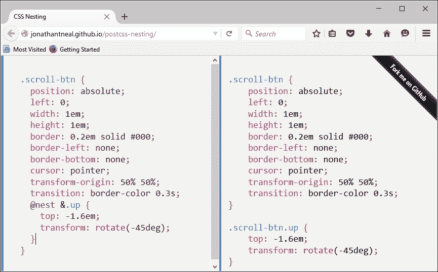

关键行在左侧，从下往上数第五行：`postcss-nesting`插件使用`@nest &`作为嵌套代码的占位符。

为了帮助说明`postcss-nesting`插件的工作原理，我们将使用它创建一个相对独特的导航系统。我们的导航将结合使用 jQuery 和 CSS 来样式化和翻转一些演示页面，动画效果由 CSS3 样式提供。感兴趣吗？让我们深入探讨并看看。

# 在页面间导航

我一直渴望做一些与众不同的事情；和别人做同样的事情变得如此过时！本着这个想法，在为这本书进行研究时，我遇到了 Nikolay Talanov 的一个有趣的演示，其中页面从一个翻到下一个，如果支持，则使用 CSS3 动画，否则回退到标准的 jQuery。

### 注意

您可以在[`codepen.io/suez/pen/LCHlA`](http://codepen.io/suez/pen/LCHlA)看到原始的 pen 演示。

这为本章提供了一个完美的基础。为了演示的目的，我移除了供应商前缀（因为这些将由`Autoprefixer`处理），调整了第一页的设计，并切换到整个使用嵌套。jQuery 回退代码也已移除，因为大多数现代浏览器都能轻松支持这些动画。

## 准备我们的演示

对于我们的演示，我们将有四个页面——导航将在每个页面之间翻转，使用标准的 CSS3 动画：

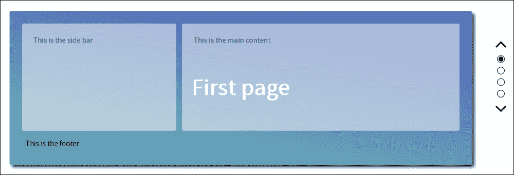

设计可能有点独特，但为了帮助说明其可能的用途，我在首页添加了一个简单的线框草图，这个草图可以轻松扩展到剩余的页面，并发展成为更实质性的内容。

要看到它的实际效果，请从本书附带的代码下载中提取`Tutorial5`文件夹的副本，然后在浏览器中运行`index.html`，点击右侧的圆点或箭头图标——您将看到它向上或向下翻转，具体取决于您点击的方向。

## 从现有处理器转换

目前，我们的演示正在使用纯 CSS，这并没有什么问题，但我怀疑你们中的一些人可能会使用现有的处理器，比如 SASS 或 less CSS。使用 PostCSS 的真正好处是它能够模仿现有工具，而不需要依赖。

在这个前提下，代码下载中提供了使用 Less CSS 和 SASS 的演示副本。如果您更喜欢使用 SASS，请从代码下载文件夹中提取 `Tutorial6A`；对于 Less，请使用 `Tutorial6B`。代码可以很容易地使用来自 第二章 的 `Tutorial1A` 中的 `gulpfile.js` 文件编译（对于 SASS），或 `Tutorial 1B`（对于 Less CSS，在同一章文件夹中）。

### 注意

您需要安装列出的插件——其中大部分已经在前面的演示中存在，但 `gulp-sass` 和 `gulp-less` 需要使用 NPM 安装，方式相同。

两者在编译后都会产生与纯 CSS 版本相同的结果，并且将 `dest` 文件夹的内容复制到教程文件夹中的 `css` 子文件夹中。在基础演示设置完成后，我们现在可以开始转换了——让我们从安装 `postcss-nesting` 插件开始。

# 过渡到使用 PostCSS 插件

我们已经看到，将代码调整为使用嵌套是一个简单的原则，但真正的艺术在于找到平衡，许多开发者在使用该技术第一次时，会陷入将代码中所有内容都嵌套的陷阱。

在这个前提下，让我们探讨如何将我们的代码转换为使用 PostCSS。我们将从安装 `postcss-nesting` 插件开始，这将为我们完成大部分工作：

1.  启动 Node.js 命令提示符，然后更改工作目录到我们的项目区域。

1.  在命令提示符中，输入以下命令，然后按 *Enter*：

    ```js
    npm install --save-dev postcss-nesting

    ```

1.  Node.js 将会移除并安装插件——当我们看到类似以下截图时，它就准备好使用了：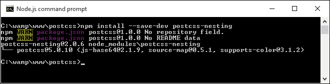

1.  插件安装后，我们需要配置 PostCSS 以使用它——打开项目区域中的一个 `gulpfile.js` 复制，准备编辑。

1.  我们需要做一些修改——首先是分配一个引用插件的变量。在最后一个变量语句下方立即添加高亮显示的行：

    ```js
    var cssnano = require('cssnano');
    var nesting = require('postcss-nesting');
    ```

1.  需要修改 `autoprefixer` 任务——这次，我们将从编译嵌套代码并添加适当的供应商前缀开始。按照指示修改此任务的第 1 行：

    ```js
    gulp.task('autoprefixer', function() {
            return gulp.src('src/*.css')
    ```

1.  接下来，添加嵌套配置调用：

    ```js
         .pipe(postcss([ autoprefixer, nesting({ /* options */ }) ]))
    ```

1.  SASS 默认情况下在编译时会压缩任何代码——由于我们不再使用它，我们需要提供一个替代方案。为此，我们将重用来自 第二章 的 `cssnano` 插件，*创建变量和混入*。请继续在 20 行处添加以下内容：

    ```js
    .pipe(postcss([ cssnano() ]))
    ```

1.  添加供应商前缀后，lint-styles 任务应该会运行；为了实现这一点，添加如下约束：

    ```js
    gulp.task("lint-styles", ['autoprefixer'], function() {
    ```

1.  我们不再需要 `sass` 任务，所以请将其完全删除，并且从默认任务条目中，我们应该剩下以下内容：

    ```js
    gulp.task('default', ['lint-styles', 'autoprefixer', 'rename']);
    ```

1.  最后，但同样重要的是，现在就切换重命名任务的顺序。而不是在 `autoprefixer` 任务之后立即运行它，我们将在 `lint-styles` 任务完成后运行它：

    ```js
    gulp.task('rename', ['lint-styles'], function () {
    ```

到目前为止，我们的 gulp 任务文件现在已准备好使用。我们可以开始将我们的样式表转换为使用 PostCSS 嵌套，作为 SASS 的替代品。让我们在下一个练习中开始转换它。

### 注意

如果您遇到困难，本书附带的代码下载中有一个完成的 `gulpfile.js` 版本——只需提取副本并将其放置到我们的项目区域的根目录下即可使用。

## 将我们的演示转换为 PostCSS

将我们的代码更改为使用 PostCSS 非常简单。即使它需要一些更改，与 SASS 等处理器相比，格式并没有发生显著变化；让我们看看涉及的内容：

1.  我们将首先打开本书附带的代码下载中 `Tutorial6A` 文件夹中的 `style.scss` 的副本——将其保存到我们的项目区域的 `src` 文件夹中。将其重命名为 `style.css`。

1.  在第 19 行，在 `&:` 前面立即添加 `@nest`——这是允许 `postcss-nesting` 插件正确编译每个嵌套语句所必需的：

    ```js
    @nest &:before, &:after {
    ```

1.  在第 53 行，在 `h2` 前面立即添加 `@nest &`，如下所示：

    ```js
    @nest & h2 {
    ```

1.  在第 61 行，在 `&.` 前面立即添加 `@nest`，如下所示：

    ```js
    @nest &.page1 {
    ```

    对第 65、69 和 73 行重复步骤 4。

1.  在第 119 行，在 `&.` 前面立即添加 `@nest`，如下所示：

    ```js
    @nest &.invisible {
    ```

1.  在第 123 行，在 `ul` 前面立即添加 `@nest`，如下所示：

    ```js
    @nest & ul {
    ```

1.  在第 125 行，在 `& li` 前面立即添加 `@nest`，如下所示：

    ```js
    @nest & li {
    ```

1.  在第 136 行，在 `&.` 前面立即添加 `@nest`，如下所示：

    ```js
    @nest &:after {
    ```

    对第 150 行和 155 行重复相同的步骤。

1.  在第 179 行，在 `&.` 前面立即添加 `@nest`，如下所示：

    ```js
    @nest &.up {
    ```

    对第 183 行和 187 行重复相同的步骤，然后保存文件。

我们的风格表现在已转换为；为了证明它有效，我们需要通过 PostCSS 运行它，所以现在让我们作为下一个练习的一部分来做这件事。

## 编译我们的代码

在我们对代码所做的更改之后，我们需要对其进行编译——让我们现在就使用我们在 第二章 中看到的相同过程，*创建变量和混入* 来进行编译：

1.  启动一个 Node.js 命令提示符会话，或者如果您仍然打开着，就使用之前的那个，并将工作文件夹更改为项目区域。

1.  在提示符下，输入此命令，然后按 *Enter*：

    ```js
    gulp

    ```

1.  如果一切顺利，我们应该看到类似于以下截图的内容：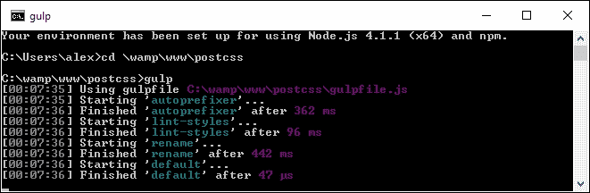

1.  快速查看我们项目区域的 `dest` 文件夹应该会显示由 PostCSS 生成的相关编译后的 CSS 和源映射文件。

1.  在这一点上，我们需要从本书附带的代码下载中提取 `Tutorial7` 文件夹的副本——将其保存到我们的项目区域。

1.  将我们项目区域的 `dest` 文件夹的内容复制到 `Tutorial7` 下的 `css` 文件夹中——如果一切顺利，我们的演示应该继续工作，但不再依赖于 SASS。

    ### 注意

    注意，确保将演示扩展到屏幕的全宽以正确查看！

尝试在浏览器中预览结果——如果一切顺利，我们应该看到与之前相同的结果，但这次使用 PostCSS，并且不再依赖于 SASS。我们现在可以将相同的技巧应用到任何项目中，放心地知道使用 postcss-nesting 插件将允许我们编译为有效的 CSS 代码——或者不是吗？

# 探索嵌套的陷阱

不得不说，尽管嵌套是一种易于理解的简单技术，但它可能很难做到正确，正如我们在演示的 SASS 版本中所示：

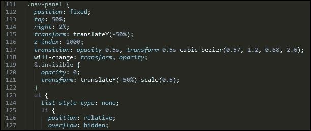

我们这里的问题有两个——多层嵌套导致代码的特定性很高；如果我们想更改 `.nav-panel ul li`（第 **125** 行的编译版本）的样式，它很可能会破坏我们前端代码的外观。为了说明我的意思，让我们拿一个任何开发者都可能创建的示例 HTML 页面：

```js
<body>
  <div class="container">
    <div class="content">
      <div class="articles">
        <div class="post">
          <div class="title">
            <h1><a href="#">Hello World</a>
          </div>
          <div class="content">
            <p></p>
            <ul>
              <li>...</li>
            </ul>
          </div>
          <div class="author">
            <a href="#" class="display"></a>
            <h4><a href="#">...</a></h4>
            <p>
              <a href="#">...</a>
              <ul>
                <li>...</li>
              </ul>
            </p>
          </div>
        </div>
      </div>
    </div>
  </div>
</body>
```

现在，在你们所有人对我大喊“呃，我绝不会那么做！”并声称（完全正确）我们应该使用语义元素，如 `<header>`、`<section>`、`<article>` 和 / 或 `<footer>` 来提供上下文和意义，而不是所有这些 `<div>` 声明之前，请停止！产生那种丑陋的代码混合是有原因的。让我来解释：

我们刚才看到的示例 HTML 很可能导致以下嵌套 CSS：

```js
body {
  div.container {
    div.content {
      div.articles {
        & > div.post {
          div.title {
            h1 {
              a {
              }
            }
          }
          div.content {
            p { ... }
            ul {
              li { ... }
            }
          }
          div.author {
            a.display {
              img { ... }
            }
            h4 {
              a { ... }
            }
            p {
              a { ... }
            }
            ul {
              li { ... }
            }
          }
        }
      }
    }
  }
}
```

一些开发者可能会认为这是完全可以接受的——毕竟，他们不知道有其他选择，那么为什么这会成为问题，对吧？错误——虽然这段代码在技术上可能符合我们的 HTML 文档中的样式，但它有几个问题：

+   **阅读起来**至多有些尴尬，而且当试图解析它时，足以让人头疼。

+   尝试编译它；它将导致大量的**重复父选择器**，代码扩展到大约 20 行。

+   **渲染性能**可能很差——例如，如果安装了像 Google 的 Page Speed 这样的工具，那么它很可能会触发**优先显示可见内容**规则，这需要额外的往返才能在屏幕上渲染折叠以上的内容。

+   **大小**可能是一个问题——尽管我们生活在一个宽带连接的时代，但对内容采取轻率的态度是不礼貌的，而且不尽可能创建体积小的内容。

+   **可维护性**将变成一个问题——我们的示例代码将样式绑定得太紧，这违背了层叠样式表的目的，我们应该能够在父选择器中放置常见的样式，并允许这些样式向下级联，或者根据需要覆盖。

我们如何解决这个问题？最简单的答案是，在嵌套代码时，要合理地考虑我们使用的层数——一些开发者认为不超过四层；根据我的经验，我认为两层应该足够（在这种情况下，将是 `body div.content`，如果我们编译了我们的巨型 CSS 样式表）。

如果我们绝对没有其他方法来实现我们想要的结果，我们不妨使用四层；如果我们经常这样做，那么显然我们需要重新审视我们的代码！

## 采用更好的方法

如果在编写代码时，我们被迫经常使用两层以上（超过两层）嵌套样式，那么我们可以使用一些技巧来减少 CSS 特定性，并减少超过两层嵌套样式的需求。让我们看看几个例子：

+   你能给自己提供所需的类吗？如果我们在覆盖现有的选择器，特定性可能会渗透进来：

    ```js
    .section-header {
      /* normal styles */
    }

    body.about-page .section-header {
      /* override with higher specificity */
    }
    ```

    为了避免特定性，能否通过使用服务器端代码或函数来发出一个类，我们可以用它来样式化元素？

    ```js
    <header class="<%= header_class %>">
    ```

    这可能输出一个类，或者根据需要输出两个类：

    ```js
    </header>
    .section-header {
      /* normal styles */
    }

    .about-section-header {
      /* override with same specificity */
      /* possibly extend the standard class */
    }
    ```

+   你的样式表的顺序在这里可以发挥重要作用，即使你可能使用单个类来覆盖样式：

    ```js
    <header class="section-header section-header-about">
    ...
    </header>
    ```

    你现有的类可能覆盖了你的覆盖；这两个选择器具有相同的特定性，所以最后应用的规定将具有优先权。解决这个问题只是简单地重新排列你的样式规则应用的顺序，以便覆盖类可以稍后应用。

+   考虑降低你试图样式的元素的特定性；这个元素可以被替换，或者完全移除吗？然而，如果它被用于 JavaScript（或 jQuery）代码中，那么最好是保持原样，并添加第二个类（或者如果存在，使用已应用的现有类）。

+   在可能的情况下，尽量使用尽可能扁平的结构来编写你的代码；样式化这样一个元素太容易了：

    ```js
    .module > h2 {

    }
    ```

    在这个例子中，我们正在为父类`.module`的直接子元素的所有`h2`元素应用样式。然而，这将在我们需要为`h2`元素分配不同样式时停止工作。如果标记看起来类似于这个例子：

    ```js
    <div class="module">
      <h2 class="unique">
        Special Header
      </h2>
    </div>
    ```

    由于 CSS 特定性（specificity）的渗透，将难以轻松应用样式：

    ```js
    .module > h2 {
      /* normal styles */
    }
    .unique {
      /* I'm going to lose this specificity battle */
    }
    .module .unique {
      /* I'll work, but specificity creep! */
    }
    ```

+   为了避免这种情况，建议尽可能使用扁平的结构——这将值得额外设置所需的努力：

    ```js
    <div class="module">
      <h2 class="module-header">
      </h2>
      <div class="module-content">
      </div>
    </div>
    ```

+   考虑使用一个已建立的样式库，或者原子设计（例如[`patternlab.io/`](http://patternlab.io/)上的），以帮助指导你如何构建网站——它们很可能是使用最小 CSS 特定性构建的，并且可能几乎不需要覆盖现有代码。

+   当应用 CSS 样式时，如果你决定使用级联（cascading），要小心——如果我们对一个被多次重用的元素（或类）应用基本样式，这将会引起问题。为了避免这种情况，尽量在不必要的情况下避免使用级联；考虑将其限制在 2-3 级，以减少出现奇怪或意外样式的风险。

+   有时候代码超出了你的控制——在类似这样的情况下，我们必须与之合作；我们可以尝试在可能的情况下使用低特定性选择器，或者使用`!important`关键字来覆盖代码。目前，我们可能需要在代码中留下注释来解释为什么选择器被设置为这样的；在一个理想的世界里，我们会尝试联系作者，看看他们是否可以更新或修改代码以消除这些问题。

+   作为最后的手段，如果你必须进入 CSS 特定性的领域，那么尽量只采取轻柔的处理方式，而不是采取使用选择器 ID 或`!important`这样的锤子方法。

    我们可以尝试将一个类应用到现有的标签上，但这可能对某些人来说感觉不太对；一个替代方案是使用两个类：

    ```js
    .nav .override {
    }
    .override .override {
    }
    .nav {
    }
    ```

    然而，关键是要避免使用超过一个额外的类！

+   嵌套样式可能导致我们在代码中编写过于特定的选择器——一些开发者因为这一点而劝阻其使用，尽管嵌套可以帮助使我们的代码在视觉上更容易阅读和理解。而不是使用复合选择器，我们可以通过使用&符号来模拟一种命名空间的形式：

    ```js
    .somestyle {
        color: darkred;
       &-so {
          color: blue;
          &-ever {
            color: green;
          }
       }
    }
    ```

    …这将编译成以下内容：

    ```js
    .somestyle { color: darkred; }
    . somestyle-so { color: blue; }
    .somestyle-so-ever { color: green; }
    ```

+   如果你的样式正在覆盖已经覆盖的样式——停止：你为什么要这样做？覆盖类或选择器元素可能是高效样式的途径，但应用第二个覆盖只会造成混淆。

我们已经看到了许多避免或减少嵌套中固有的 CSS 特定性问题的方式；然而，关键信息是，我们并非被迫必须嵌套我们的代码，而且，用前端架构师罗伊·托梅伊的话来说——嵌套的代码并不会产生糟糕的代码；糟糕的程序员才会产生糟糕的代码！

### 小贴士

你可以在罗伊·托梅伊的原始文章中看到更多内容：[`www.thesassway.com/editorial/sass-doesnt-create-bad-code-bad-coders-do`](http://www.thesassway.com/editorial/sass-doesnt-create-bad-code-bad-coders-do)

尽管有很好的理由，但我们还没有触及一种方法：这是许多刚开始使用处理器的开发者可能会第一次尝试的路线。好奇吗？这与使用转换工具有关，更具体地说，是我们如何使用它们将纯 CSS 转换为适合使用 PostCSS 编译的代码。

## 重新考虑我们的代码

假设这个场景，如果你愿意的话：

你接管了一个网站，并热衷于使用 PostCSS 来帮助维护你的代码。代码使用纯 CSS，所以作为转换的一步，你碰巧知道一些网站可以将纯 CSS 转换为 SASS。毕竟，PostCSS 和 SASS 代码之间有一些相似之处，所以为什么不呢？

你将结果提取到一个文本文件中，保存它，然后通过 SASS 编译过程。结果会生成一些新编译的 CSS，你将其放入服务器上的相关位置，然后 voilà！你现在有一个使用 SASS 的运行网站。一个运行网站，以及转换为 PostCSS 的完美基础……或者不是吗？

简短的回答应该是没有，但更长的回答是，这取决于你的代码。让我解释一下原因：

简单地将代码通过转换过程是不够的——当然，它将给你一段能工作的代码，但除非它非常简单，否则它很可能**不会生成简洁高效的代码**。为了理解我的意思，请仔细查看`Tutorial5`中的 CSS 样式表——特别是从第 132 行开始的`.nav-panel`的样式规则。

### 小贴士

由于空间原因，样式表太长，无法全部打印出来——我建议你用文本编辑器查看代码下载中的文件！

转换过程将没有问题处理它以生成有效的 SASS，但它看起来不会很美观——作为一个例子，试着将第 114 行到第 197 行的代码复制到[`css2sass.herokuapp.com/`](http://css2sass.herokuapp.com/)提供的转换器中。看起来不错，不是吗？肯定有改进的空间——我已经对代码做了一些修改，但我们还可以做得更多；让我们看看我们可以做些什么来改进代码。

## 更新我们的代码

当使用 CSS 到 SASS 转换器时，我们心中始终要牢记的一个关键点是，转换后的代码**不应**被视为最终文章。

不论你的代码多么简单或复杂——它应该是我们转换过程的第一步。这只是一个问题，即一旦代码通过转换器，我们有多少工作要做！作为一个例子，看看这段代码：

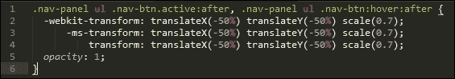

这是 Nikolay 编译版本的第 234 行到第 239 行的直接复制，我们将其作为我们早期演示的基础。现在快速看一下我从原始版本中调整并用于我版本中的等效代码：

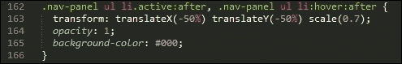

注意到任何差异了吗？`transform`属性的供应商前缀版本已经被移除——大多数现代浏览器（当然是在过去一年到十八个月之内），应该能够处理这段代码而不需要供应商前缀。原始版本也遭受了高度 CSS 特定性的困扰——如果代码嵌套，这一点将变得更加明显！

为了改进它，我已将`.nav-panel ul li`作为`.nav-panel ul .nav-btn`的直接替代——代码相对简单，因为它不需要第二个类来识别元素进行样式化。下一步合乎逻辑的步骤是将源文件中的大嵌套块拆分；包含一个单独的大块很有吸引力，但这将牺牲可读性、维护性和性能。

我们甚至可以更进一步，考虑移除前缀`.nav-panel`；这不仅会使代码无限期地易于阅读，还会减少 CSS 特定性问题。当然，这种改变将取决于你的代码；这里的要点是彻底检查你的代码，并尽可能减少任何 CSS 特定性，以便你的嵌套看起来不那么糟糕！

我们还有一种替代方法可以使用，它可以消除 CSS 特定性问题——使用**块元素修饰符**标记（或简称**BEM**）。这是一种系统地使用 CSS 对元素进行样式的绝佳方法，值得花时间熟悉其工作方式。让我们深入探讨并查看一下。 

# 转向 BEM

那么，什么是 BEM，它为什么能帮助减少或消除 CSS 特定性问题？

**BEM**，即**块元素修饰符**，帮助我们通过一种系统化的命名约定来对元素进行样式化，其结构如下：

+   `.block`：包含我们要更改的元素的顶层容器

+   `.block__modifier`：当元素的状态发生变化时分配的样式

+   `.block__element`：顶层容器内的元素

+   `.block__element__modifier`：当元素的状态发生变化时的元素的不同表示

这种编码风格背后的理念是使其易于移植和更容易维护。其基础在于，虽然标准、非 BEM CSS 更简洁，但更难推断出每条规则的作用。我们经常需要给一个元素分配多个类，这引入了 CSS 特定性的程度，并降低了 CSS 规则的可重用性。使用 BEM 允许我们将构成名称组合成一个样式类名，并消除任何关于 CSS 特定性的担忧。

如果我们使用这个概念，我们可以用它来编写如下样式规则：

```js
.block {
  &__element {
  }
  &__modifier {
  }
}
```

这将编译成以下内容：

```js
.block {}
.block__element {}
.block__modifier {}
```

上述代码使用的是纯 BEM 格式，但如果我们从 SASS 等处理器环境中构建 PostCSS 中的 BEM 规则，我们可以使用`postcss-bem`插件（可在[`github.com/ileri/postcss-bem`](https://github.com/ileri/postcss-bem)获取）来使用`@-rules`生成我们的 BEM CSS。例如：

```js
@component ComponentName {
  color: cyan;

  @modifier modifierName {
    color: purple;
  }

  @descendent descendentName {
    color: darkred;
  }

  @when stateName {
    color: yellow;
  }
}
```

在这种情况下，`@component`表示我们的块，`@descendant`表示我们的元素，而`@modifier`是我们的修饰符。编译后，我们的 CSS 将如下所示：

```js
.ComponentName {
  color: cyan;
}

.ComponentName--modifierName {
  color: purple;
}

.ComponentName-descendentName {
  color: darkred;
}

.ComponentName.is-stateName {
  color: yellow;
}
```

使用 BEM 的好处在于，它有助于减少或甚至避免 CSS 特定性问题——尽管名称更长，但我们可以将元素和修饰符名称组合成一个类，而不是必须应用三个或更多单独的类。当然，可能会有一些情况我们需要应用第二个类，但通过仔细规划，我们应该能够将其减少到最小。

对了，我们继续前进：让我们开始编码！在接下来的几页中，我们将查看如何在简单示例中实现 BEM 样式，并看看我们如何使用 PostCSS 来编译我们的代码。

## 创建简单的消息框

对于我们的 BEM 演示，我们将通过 CSS 规则来展示一些简单的消息框，例如用于显示任务已完成或当某事不正确时的警告。

### 提示

这个演示的原版是由 Rene Spronk 制作的，可以从[`www.cssportal.com/blog/css-notification-boxes/`](http://www.cssportal.com/blog/css-notification-boxes/)获取。

这是一个简单的演示，但它完美地展示了 BEM CSS 背后的原理——继续提取`Tutorial8`文件夹的副本，然后运行`index.html`来感受我们将要制作的内容。这个版本使用标准 CSS；我们将以此为基础将其转换为使用 BEM。

让我们开始：

1.  我们将首先从本书附带的代码下载中提取`Tutorial9`文件夹的副本——将其放入我们的项目区域。

1.  接下来，在一个新文件中，从第 1 行开始添加以下 CSS 语句，并在每个语句之间留一个空行——它们应该是相当自解释的，但我们将依次通过每个块。

1.  我们从每个对话框的核心样式开始——这是每个对话框的基础样式：

    ```js
    .dlgBox {
      border-radius: 0.625rem;
      padding: 0.625rem 0.625rem 0.625rem 2.375rem;
      margin: 0.625rem;
      width: 14.5rem
    }
    ```

1.  接下来是每个`<span>`元素的简单样式——这会将每个对话框的引导标题转换为大写并设置为粗体文本：

    ```js
    span { font-weight: bold;text-transform: uppercase; }
    ```

1.  我们现在需要添加我们的块元素——这是构成我们样式的起始行：

    ```js
    @component content {
    ```

1.  接下来是样式规则中的 Element 部分。这些规则需要作为嵌套（即缩进）规则立即添加到下面——使用 PostCSS 插件，我们将它添加为`@component`的`@descendent`：

    ```js
       @descendent alert {
         font-family: Tahoma, Geneva, Arial, sans-serif;
         font-size: 0.6875rem;
         color: #555;
         border-radius: 0.625rem; 
       }
    ```

1.  接下来是我们的第一个状态消息——我们首先开始为错误消息添加样式；主要规则添加了一个错误图标并设置了边框样式。`:hover`伪元素在鼠标悬停在框上时减少不透明度：

    ```js
       @modifier error {
         background: #ffecec url("../img/error.png") no-repeat 0.625rem 50%;
         border: 0.0625rem solid #f5aca6; 
       }

          @modifier error:hover { opacity: 0.8; }
    ```

1.  这迅速被成功消息的样式所跟随：

    ```js
       @modifier success {
         background: #e9ffd9 url("../img/success.png") no-repeat 0.625rem 50%;
         border: 0.0625rem solid #a6ca8a; 
       }

       @modifier success:hover { opacity: 0.8; }
    ```

1.  我们不能忘记必选的警告消息，所以这里是该状态样式的规则：

    ```js
       @modifier warning {
         background: #fff8c4 url("../img/warning.png") no-repeat 0.625rem 50%;
         border: 0.0625rem solid #f2c779; 
          }

          @modifier warning:hover { opacity: 0.8; }
    ```

1.  最后但同样重要的是，这是最后一个，即通知；它包含了 BEM 嵌套的闭合括号：

    ```js
          @modifier notice {
            background: #e3f7fc url("../img/info.png") no-repeat 0.625rem 50%;
            border: 0.0625rem solid #8ed9f6; 
          }

       @modifier notice:hover { opacity: 0.8; }
    }
    ```

1.  将文件保存为`style.scss`到我们顶级项目区域的`src`文件夹中（而不是`Tutorial8`文件夹中！）。

我们这个简单的演示在样式方面不会让世界变得光明；如果我们现在预览它，结果当然不会很好看；让我们通过在 PostCSS 中设置编译和 linting 任务来修复它。

### 注意

如果你使用 SASS，那么你可以在 GitHub 上看到适合该处理器的代码版本——代码可在：[`gist.github.com/alibby251/45eab822a6a619467279`](https://gist.github.com/alibby251/45eab822a6a619467279)找到。注意当你比较编译版本和我们在下一个练习中将得到的版本时，结果是多么相似！

## 编译和 linting 我们的代码

我们的代码已经就位，但盒子看起来并不特别吸引人——大多数样式仍然使用 PostCSS `@-rules`编写。我们可以通过编译代码来修复这个问题，所以让我们深入了解一下如何安装 BEM 支持。

## 安装 BEM 支持

在 PostCSS 中设置 BEM 支持非常简单——我们可以使用两个插件来编译和检查我们的代码。我们需要为此任务的两个插件是`postcss-bem`（可在[`github.com/ileri/postcss-bem`](https://github.com/ileri/postcss-bem)获取），以及`postcss-bem-linter`（可在[`github.com/postcss/postcss-bem-linter`](https://github.com/postcss/postcss-bem-linter)获取）。这两个插件都可以通过 Node.js 使用相同的过程安装。

希望到现在为止，这个过程已经变得熟悉了，所以我们不再拖延，现在就开始吧：

1.  我们将首先启动一个 Node.js 命令提示符，并导航到我们的工作文件夹。

1.  在命令提示符下，输入以下命令然后按*Enter*：

    ```js
    npm install --save-dev postcss-bem

    ```

1.  Node.js 将安装所需的每个元素；如果一切顺利，我们应该看到这个结果，以表明安装成功：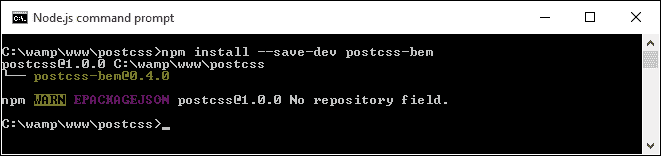

1.  对于`postcss-bem-linter`重复相同的步骤，使用以下命令：

    ```js
    npm install --save-dev postcss-bem-linter

    ```

    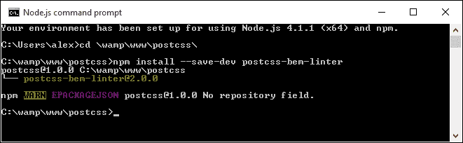

1.  保持命令提示符会话开启，但最小化。我们很快就会再次使用它！

现在插件已经安装好了，我们可以继续添加对 gulp 任务文件的支持，并开始解析我们的代码：

1.  首先，请先删除我们项目区域根目录下的现有`gulpfile.js`文件。

1.  在一个新文件中，添加以下行并将其保存为`gulpfile.js`，位于我们项目区域的根目录。我们首先设置一些变量，这些变量调用每个插件：

    ```js
    var gulp = require('gulp');
    var postcss = require('gulp-postcss');
    var bem = require('postcss-bem');
    var bemLinter = require('postcss-bem-linter');
    var reporter = require('postcss-reporter');
    ```

1.  文件中的第一个任务检查代码与 BEM 标准的兼容性，并在屏幕上显示任何错误：

    ```js
    gulp.task('lint', function() {
      return gulp.src('dest/*.css')
        .pipe(postcss([
          bemLinter({ preset: 'bem' }),
          reporter({ clearMessages: true })
        ]))
        .pipe(gulp.dest('dest/'));
    });
    ```

1.  文件中的第二个任务将 BEM 代码编译为有效的 CSS：

    ```js
    gulp.task('bem', function() {
      return gulp.src("src/*.css")
        .pipe(postcss([bem({
          style: 'bem',
          separators: { descendent: '__' }
        })]))
        .pipe(gulp.dest('dest/'));
    });
    ```

1.  这个任务是在我们从命令行运行 gulp 时默认调用的任务；它依次调用每个任务：

    ```js
    gulp.task('default', ['bem', 'lint']);
    ```

1.  我们在`gulpfile.js`中添加一个监视功能，以便在代码有任何更改时启动并编译我们的代码：

    ```js
    var watcher = gulp.watch('src/*.css', ['default']);
    watcher.on('change', function(event) {
      console.log('File ' + event.path + ' was ' + event.type + ', running tasks...');
    });
    ```

1.  我们还将替换`package.json`文件——将这些行添加到新文件中，并将其保存到项目区域的根目录。这些行简单地告诉 gulp 在编译代码时使用我们插件的哪个版本：

    ```js
    {
      "name": "postcss",
      "version": "1.0.0",
      "description": "Configuration file for PostCSS",
      "main": "index.js",
      "scripts": {
        "test": "echo \"Error: no test specified\" && exit 1"
      },
      "author": "Alex Libby",
      "license": "ISC",
      "devDependencies": {
        "gulp": "³.9.0",
        "gulp-postcss": "⁶.0.0",
        "postcss-bem-linter": "².0.0",
        "postcss-reporter": "¹.3.0"
      }
    }
    ```

1.  从本书附带的代码下载中，请从`Tutorial9`下的`css – completed version`文件夹中提取`style.css`的副本——将其保存到我们项目区域的`src`文件夹下。

1.  回到我们之前的 Node.js 命令提示符会话，然后在提示符下，输入以下命令并按*Enter*：

    ```js
    gulp

    ```

1.  如果一切顺利，代码将被检查，结果将在屏幕上显示。你可能会看到错误出现，例如这个屏幕截图所示。如果出现，现在可以忽略它们（我们将在稍后更详细地探讨这个问题）：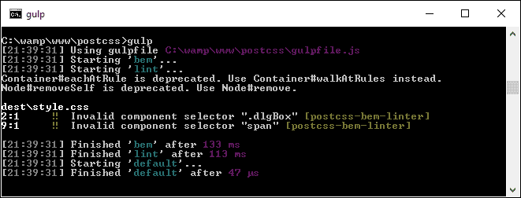

1.  好吧，把`dest`文件夹的内容复制到`Tutorial9`下的`css`文件夹里——如果一切顺利，我们在浏览器中预览结果时应该能看到类似这样的截图：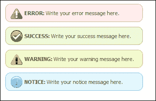

我们简单的演示展示了我们可以用作更复杂基础的一些有用的消息框；它完美地说明了我们如何使用 BEM 来样式化我们的代码，同时避免 CSS 特定性问题。我们在整个练习中介绍了一些有用的技术，所以让我们花点时间更详细地探索它们。

# 更详细地探索我们的更改

花时间真正熟悉 BEM 样式原则是值得的。这是那些不花时间可能会轻易让你放弃使用这种技术的领域之一；原则容易理解，但实施起来可能需要时间！让我们更详细地看看我们的代码。

在使用 PostCSS 插件时，BEM 的关键原则是嵌套——在这个例子中，我们创建核心组件内容，这导致我们的样式表顶部出现一个空的样式规则。缩进到下一级的是我们的`@descendant`——这表示我们的消息框被样式化为警告。然后我们使用多个`@modifiers`来样式化每种类型的警告，如成功、警告、错误或通知（即信息）。这包括一个单独的样式规则来覆盖我们代码中使用的每个 hover 伪元素的实例。

这对我们意味着什么？这意味着我们不仅要将每个元素（例如，消息框）视为一个单一实体，并简单地应用很多类；相反，我们应该考虑每个元素的组成部分，并为每个部分应用一个单独的类。等等，这不意味着我们仍然在使用三个类（就像我们在这里可能做的那样）吗？

### 小贴士

要了解更多关于 BEM 命名约定的信息，请查看在[`en.bem.info/tools/bem/bem-naming/`](https://en.bem.info/tools/bem/bem-naming/)发布的有用文章。

嗯，答案是是，也不是：这里的技巧是 PostCSS 会将每个嵌套样式组合成有效的 CSS；例如，这个提取（改编自我们的演示）：

```js
@component content {
  @descendent alert {
    font-family: Tahoma, Geneva, Arial, sans-serif;
    font-size: 0.6875rem;
    color: #555;
    border-radius: 0.625rem; 

    @modifier error {
      background: #ffecec url("../img/error.png") no-repeat 0.625rem 50%;
      border: 0.0625rem solid #f5aca6; 
    }
  }
}
```

编译后，这将显示为以下 CSS：

```js
.content {}
.content__alert {
    font-family: Tahoma, Geneva, Arial, sans-serif;
    font-size: 0.6875rem;
    color: #555;
    border-radius: 0.625rem;
}
.content__alert_error {
    background: #ffecec url("../img/error.png") no-repeat 0.625rem 50%;
    border: 0.0625rem solid #f5aca6;
}
```

眼尖的你们中的一些人可能已经注意到，当我们的代码编译时仍然会生成错误：

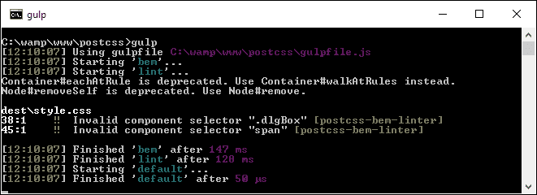

看到错误总是让人不安，但它们有合理的理由。我们可以安全地忽略两个弃用警告（这些应该在未来的版本中修复），但这两个错误更令人关注。

## 修复我们的错误

这两个错误是由`postcss-bem-linter`引起的，它没有将这两种样式识别为有效的 BEM 符号。这引发了一个问题：我们能否修改我们的代码来消除这些问题？

为了回答这个问题，我们需要权衡受影响的代码量与修改它所需的时间和精力。在我们的演示中，受影响的代码非常少；要解决这个问题，我们需要修改`.dlgBox`和`span`样式为等效的 BEM 命名。

这值得付出努力吗？在我们的这个小演示中，答案很可能是“不”，对于更大的演示，我们可能会考虑改变这两种样式。相反，我们可以在第 48 行添加一个简单的指令，如下所示：

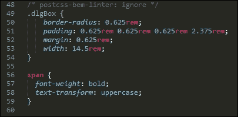

当代码重新编译时，错误会被移除：

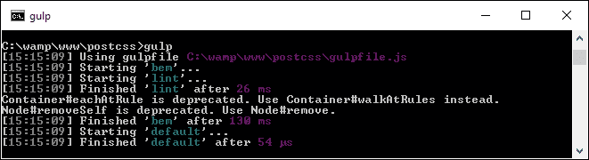

纯粹主义者可能会说这是作弊。确实，我们的代码在技术上仍然不是全部的 BEM。然而，尽管如此，决定权在每位开发者手中；可能有一些元素必须保持为标准 CSS，我们无法转换。在这种情况下，使用 PostCSS 导入插件导入这些样式可能是明智的——我们将在第十章“构建自定义处理器”中进一步探讨使用这种方法，第十章。

值得注意的是，`postcss-bem-linter 插件`本身不会显示任何错误的结果——为了做到这一点，我们需要使用像`postcss-reporter`（可在[`github.com/postcss/postcss-reporter`](https://github.com/postcss/postcss-reporter)找到，适用于命令行）或`postcss-browser-reporter`（来自[`github.com/postcss/postcss-browser-reporter`](https://github.com/postcss/postcss-browser-reporter)）这样的插件，后者在浏览器窗口中显示内容）。两者都有许多值得调查的选项，可以帮助我们微调通过 PostCSS 处理代码时显示的内容。

# 摘要

几年来，开发者不得不经常编写重复选择器全部或部分代码的代码——一个完美的例子是样式化列表或导航项。编写这么多额外代码真的很痛苦；相反，我们可以使用嵌套原则来帮助移除一些这些代码。我们在本章中已经介绍了 PostCSS 中关于嵌套的多种技术，所以让我们花点时间回顾一下我们学到了什么。

我们从嵌套的介绍开始，帮助我们跟上进度，然后转向使用`postcss-nesting`插件在 PostCSS 中创建嵌套样式。然后我们继续创建我们的嵌套演示。我们开始准备一个纯 CSS 版本，然后查看将其转换为现有的处理器，如 SASS。

接下来，我们使用`postcss-nesting`插件转换我们的代码，然后探讨了与嵌套相关的一些陷阱，以及我们可以使用的技巧和窍门来减少 CSS 特定性，这是与嵌套相关的一个关键问题。

我们在章节的最后部分探讨了 BEM（块、元素、修饰符）及其在 PostCSS 中的应用。我们介绍了这一方法的基本原则，并在一个简单示例中应用了它们。我们还了解到，这种方法并不总是适用于所有情况；对于适用的情况，我们简要地探讨了如何设置 PostCSS 来自动检查我们的 BEM 代码。

呼，这真是一场真正的快速浏览！不过，请系好你的帽子，因为旅程不会就此结束：在下一章中，我们将探讨编写媒体查询的方法，以及 PostCSS 如何帮助将这些查询编译成有效的 CSS。
