# 第四章：构建媒体查询

单一设备浏览在线网站的日子已经一去不复返了：响应式网站将在各种设备上运行，从智能手机到数字电视和笔记本电脑。使网站响应式的一个关键要素是使用媒体查询。在本章中，我们将探讨如何使用 PostCSS 创建它们，看看它们与 Less 和 SASS 等工具相比如何，以及 PostCSS 的使用如何使方法比标准预处理器更加灵活。本章将涵盖以下技术主题：

+   重新审视媒体查询

+   使用 PostCSS 掌握媒体查询的基础

+   添加响应式支持

+   优化媒体查询

+   为旧浏览器添加支持

+   进一步探索——在 CSS4 媒体查询中探索悬停功能

让我们开始吧…！

# 重新审视媒体查询

如果你花时间在不同的设备上查看网站，那么在样式表中看到媒体查询几乎不会令人惊讶——它们是响应式设计的基础，并且声明允许我们根据可用的屏幕宽度控制屏幕上显示的内容。

媒体查询背后的原理很简单。简而言之，我们必须定义设备或媒体，以及规则（或断点）开始应用或停止应用的分辨率（或宽度）。以下是一个简单的例子：

```js
@media only screen and (max-width: 768px) {
  /* CSS Styles */
  ...
}
```

在文档中使用的任何样式都仅在屏幕上查看时应用，并且我们的可用屏幕空间为`768px`或更小。这是一个简单的例子，它们可以像所需的那样简单或复杂；这取决于我们作为开发者来确定我们的内容在哪里断裂，并构建一个合适的断点来管理变化。

### 注意

为了感受一些最近可能的媒体查询，请查看 Chris Coyier 的这篇帖子，他提供了针对笔记本电脑、PC 甚至可穿戴设备的查询！列表可在[`css-tricks.com/snippets/css/media-queries-for-standard-devices/`](https://css-tricks.com/snippets/css/media-queries-for-standard-devices/)找到。

好的，让我们开始吧：PostCSS 使得管理文本和图像的查询变得简单；我们将从查看如何处理图像开始我们的旅程。

# 探索 PostCSS 中的自定义媒体查询

转向使用 PostCSS 非常简单，我们可以使用`postcss-custom-media`插件来完成此目的，可在[`github.com/postcss/postcss-custom-media`](https://github.com/postcss/postcss-custom-media)找到。

插件易于安装，它遵循我们之前介绍的所有其他插件的原则，所以无需多言，我们现在就把它解决掉：

1.  启动 Node.js 命令提示符，然后导航到工作目录。

1.  在提示符中输入以下命令，然后按*Enter*键：

    ```js
    npm install --save-dev postcss-custom-media

    ```

1.  目前请保持命令提示符打开，我们将在接下来的几个步骤中使用它。

    安装插件后，我们现在可以使用它了，在我们开始转换之前的演示之前，让我们通过一个简单的例子来操作，这样你就可以看到它的实际效果：

1.  在一个新文件中，添加以下代码，将其保存为项目区域根目录下的`src`文件夹中的`style.css`：

    ```js
    @custom-media --apple-watch (max-device-width: 42mm) and (min-device-width: 38mm);

    @media (--apple-watch) {
      h2 {
        font-size: 0.8rem;
      }
    }
    ```

1.  从项目区域的根目录中删除现有的`gulpfile.js`文件。

1.  在一个新文件中，添加以下代码，这将形成一个新的`gulpfile.js`文件；将其保存到项目区域的根目录：

    ```js
    var gulp = require('gulp');
    var postcss = require('gulp-postcss');
    var customMedia = require('postcss-custom-media');

    gulp.task('default', function() {
        return gulp.src('src/*.css')
        .pipe(postcss([ customMedia() ]))
        .pipe(gulp.dest('dest/'));
    });

    var watcher = gulp.watch('src/*.css', ['default']);
    watcher.on('change', function(event) {
      console.log('File ' + event.path + ' was ' + event.type + ', running tasks...');
    });
    ```

1.  返回我们之前打开的命令提示符会话，然后在命令提示符中输入`gulp`，然后按*Enter*键。

1.  如果一切顺利，我们应该在项目区域的`dest`文件夹中打开编译后的`style.css`时看到此代码：

    ```js
    @media (max-device-width: 42mm) and (min-device-width: 38mm) {
      h2 {
        font-size: 0.8rem;
      }
    }
    ```

信不信由你，这就是使用插件所需的所有内容；让我们花点时间考虑一下通过这个演示我们涵盖了什么。

初看之下，你可能认为这个插件实际上并没有做什么来帮助我们——这是一个合理的观点，但使用这个插件有一个关键的好处。我们可以将媒体断点分离成单独的变量声明，并将这些存储在样式表的顶部。这意味着如果我们需要更新特定的断点，我们只需要做一次。然后在编译阶段，我们的代码会自动更新。

考虑到这一点，让我们开始一个演示；我们将处理之前平铺滚动的 CSS 版本，并将其转换为使用 PostCSS。

## 从纯 CSS 开始

在接下来的几页中，我们将使用一种相对较新的技术作为我们演示的基础——平铺滚动。以防你躲在岩洞里，平铺滚动是一个单页应用程序，它允许我们在滚动内容的同时显示一系列固定在内容后面的图像：


我们将使用由 Nick Salloum 创建的演示，该演示可在[`callmenick.com/_development/simple-parallax-effect/`](http://callmenick.com/_development/simple-parallax-effect/)找到（我已经简化了一些 CSS 样式，移除了供应商前缀，并减少了示例中调用的单独文件的数量）。我们将从演示的纯 CSS 版本开始——请将`Tutorial11`的副本提取到我们的项目区域。尝试运行`index.html`；如果一切顺利，我们应该看到类似于本节开头截图的内容。

当使用得当的时候，这是一个很棒的效果，我们的兴趣在于 CSS 文件的最后部分，大约在第 133 行；这一部分包含我们将要在下一个演示中转换的媒体查询。

## 将我们的演示修改为使用 PostCSS

如果正确使用媒体查询，这可以打开一个充满可能性的世界；我们可以调整我们的样式表以适应从 iPhone 到打印机等各种设备。在我们的演示中，我们使用了一些来调整在显示宽度大于 `600px` 或 `960px` 的网站上内容的显示方式；将这些调整到在 PostCSS 中工作非常简单。

### 注意

CSS3 媒体查询网站列出了大量不同类型的查询；如果您在目标 PC 或设备上查看该网站，它将显示该查询是否在该设备上受支持。完整列表可在[`www.cssmediaqueries.com`](http://www.cssmediaqueries.com)找到。

我们只需要在样式表中做一些更改即可切换到使用 PostCSS，让我们开始：

让我们开始进行更改：

1.  我们将首先将 `Tutorial11` 文件夹中的 `style.css` 文件复制到我们的项目区域的 `src` 文件夹中。

1.  我们需要编辑文件，以将我们的媒体查询转换为使用 PostCSS 插件——请在这些行的 4 和 5 行处添加以下两行：

    ```js
    @custom-media --small-viewport all and (min-width: 600px);
    @custom-media --medium-viewport all and (min-width: 960px);
    ```

1.  在下面，将第 161 行和第 182 行替换为以下代码：

    ```js
    @media (--small-viewport) {
    ```

1.  在第 200 行，将此行替换为以下代码：

    ```js
    @media (--medium-viewport) {
    ```

1.  保存文件——接下来，请将当前的 `gulpfile.js` 文件替换为 `Tutorial12` 文件夹根目录中的版本。它具有相同的初始 PostCSS 任务，但已被重命名并扩展了我们在前面的章节中已经使用过的附加任务。

1.  接下来，请将同一位置的 `package.json` 文件副本保存到我们的项目区域的根目录——它包含此演示中使用的插件的更新链接。

    启动 Node.js 命令提示符窗口，然后更改工作目录到我们的项目区域。在提示符下，输入 `gulp` 然后按 *Enter*。

1.  如果一切顺利，我们应该在 `dest` 文件夹中看到一个编译后的 CSS 文件——请将其复制到 `Tutorial12` 文件夹的 `css` 文件夹中。

1.  在我们的项目区域中运行 `index.html` 以预览结果——如果一切顺利，我们不应该看到任何不同，但在源代码中快速检查应该显示我们正在使用代码的压缩版本：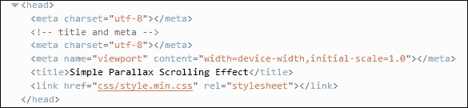

值得注意的是，在我们的演示中，我们使用了媒体查询的典型格式：例如，我们可以扩展或修改样式表以在 Galaxy 平板等手持设备上工作；同样的原则适用，但显然需要使用不同的宽度值！有关使用值的详细信息，请查看[`cssmediaqueries.com`](http://cssmediaqueries.com)，它列出了用于最新设备的查询列表。

如果我们想要拓展可能的边界，我们可以考虑几个选项：

+   `postcss-media-variables`：此插件（可在[`github.com/WolfgangKluge/postcss-media-variables`](https://github.com/WolfgangKluge/postcss-media-variables)找到）以相同的方式工作，但它允许我们在媒体查询中使用变量。使用此插件的好处是我们可以将宽度值分离到一个中央的`:root`规则中；我们可以使用一个固定的值，但基于此值计算出其他值：

    ```js
    /* input */
    :root {
        --min-width: 1000px;
        --smallscreen: 480px;
    }
    @media (min-width: var(--min-width)) {}
    @media (max-width: calc(var(--min-width) - 1px)) {}

    @custom-media --small-device (max-width: var(--smallscreen));
    @media (--small-device) {}
    /* output */
    @media (min-width: 1000px) {}
    @media (max-width: 999px) {}
    @media (max-width: 480px) {}
    ```

    缺点是，这被认为是非标准的，插件必须调用两次，并且如果使用其他插件，必须按照一定的顺序调用——这意味着它可能只适合特定的情况！

+   `postcss-quantity-queries`：此插件（可在[`github.com/pascalduez/postcss-quantity-queries`](https://github.com/pascalduez/postcss-quantity-queries)找到）基于 Daniel Guillan 的 SASS 数量查询混入。这使我们能够使用如下规则：

    ```js
    ul > li:at-least(4) { color: rebeccapurple; }
    ```

    这将编译成如下：

    ```js
    ul > li:nth-last-child(n+4),
    ul > li:nth-last-child(n+4) ~ li {
      color: rebeccapurple;
    }
    ```

这是我们可以与该插件一起使用的四个伪选择器扩展之一，这是为导航条目等元素进行样式化的完美方式，或者如果我们想要一个带有不同样式的偶数和奇数项的编号列表。

### 注意

对于一篇关于在 CSS 中使用数量查询的有用参考文章，请访问 Heydon Pickering 在[`alistapart.com/article/quantity-queries-for-css`](http://alistapart.com/article/quantity-queries-for-css)上的帖子。

现在让我们改变方向，专注于我们的内容。到目前为止，我们一直专注于页面布局，但我们可以通过使图片真正响应式来更进一步；让我们深入探讨并看看。

# 制作响应式图片

使任何网站响应式的一个关键要素当然是图片——毕竟，我们总是可以构建一个没有图片的网站，但这样真的有效吗？

当然，人们总是可以使用数据**统一资源标识符**（**URI**）将图片转换为 CSS 等效物，但这会使我们的样式表急剧膨胀，以至于变得难以管理。现实是，我们必须以某种形式拥有图片——如果我们想让它们表现良好，我们显然需要确保它们根据可用的屏幕空间扩展或收缩大小。

适应响应式布局的最简单方法是为图片设置`max-width`值为`100%`，同时设置`height: auto`和`display: block`，并移除任何定义该图片元素固定高度或宽度的属性。我们可以手动进行更改，但这很耗时；相反，让我们看看一个 PostCSS 插件，它允许我们在编译时通过为每个图片添加一行代码来设置这三个值。

## 使用 PostCSS 制作响应式图片

使用 PostCSS 为网站添加响应式功能很简单；我们将主要根据您的需求来决定如何使图片响应式，但有两个关键插件需要关注：`postcss-responsive-images`（可在 [`github.com/azat-io/postcss-responsive-images`](https://github.com/azat-io/postcss-responsive-images) 获取），以及 `postcss-at2x`（可在 [`github.com/simonsmith/postcss-at2x`](https://github.com/simonsmith/postcss-at2x) 获取)。

我们将在稍后介绍 `postcss-at2x` 插件的使用，但现在，让我们看看如何使用 `postcss-re` `sponsive-images` 插件。

## 实现图片的响应式功能

使我们的图片响应式只需要在基于图片的规则中添加一行代码；让我们深入探讨，并将此功能添加到本书附带的代码下载中的 `Tutorial13` 文件夹的副本中：

1.  我们将像往常一样，首先安装插件——为此，打开 Node.js 命令提示符，然后运行此截图所示的命令：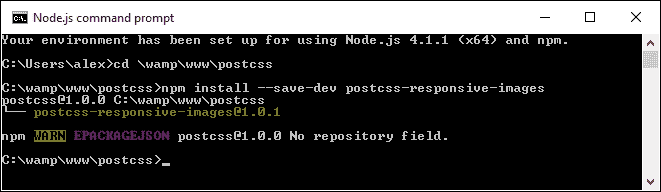

1.  我们将首先从本书附带的代码下载中提取 `Tutorial13` 文件夹的副本，然后将其保存到我们的项目区域。

1.  打开 `Tutorial13` 文件夹中 `css` 文件夹内的 `style.css`，然后删除此规则：

    ```js
    img { 
      width: 584px; 
      height: 389px;
    }
    ```

1.  在其位置，添加以下行：

    ```js
    #retina img { image-size: responsive; }
    ```

1.  保存文件，然后将其复制到项目区域下方的 `src` 文件夹中（不在 `Tutorial` 文件夹内！）。

1.  对于这个练习，我们将替换 Gulp 任务文件——请将此代码添加到新文件中，并将其保存为 `gulpfile.js`，位于我们的项目区域根目录下：

    ```js
    var gulp = require('gulp');
    var postcss = require('gulp-postcss');
    var responsiveimages = require('postcss-responsive-images');

    gulp.task('default', function() {
        return gulp.src('src/*.css')
        .pipe(postcss([ responsiveimages ]))
        .pipe(gulp.dest('dest/'));
    });

    var watcher = gulp.watch('src/*.css', ['default']);
    watcher.on('change', function(event) {
      console.log('File ' + event.path + ' was ' + event.type + ', running tasks...');
    });
    ```

    注意，我们在这个 `gulp` 文件中只专注于使我们的图片响应式，这就是为什么它比我们迄今为止使用的先前版本要短得多。

1.  打开 Node.js 命令提示符，然后更改工作目录到我们的项目区域——在提示符中，输入 `gulp` 然后按 *Enter*。

1.  Node 将编译我们的代码——如果一切顺利，`#retina img` 的编译代码将看起来像这样：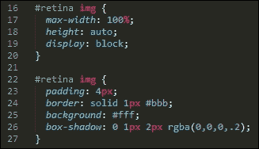

1.  将 `dest` 文件夹中的编译 CSS 文件复制到 `Tutorial13` 文件夹的 `css` 文件夹中。

1.  好吧，预览一下结果——尝试调整浏览器大小；如果一切顺利，图片将自动为我们调整大小。

虽然安装和使用此插件很容易，但它最好是在我们的 HTML 代码中直接引用图片，而不是通过在 CSS 中使用 `background:` 或 `content: url(…)` 属性。

这对我们意味着什么？它有点限制性，因为在我们中间的纯粹主义者可能更喜欢将资产属性分离到 CSS 样式表中，就像开源软件那样，尽管这是一个注定会在未来得到解决的限制！

留意观察的你们中的一些人会发现图像呈现显然需要进一步的工作——例如，当窗口大小调整时，回形针没有重新定位，我们需要设置一个最小宽度，以便在调整大小时图像周围有一些空白空间：

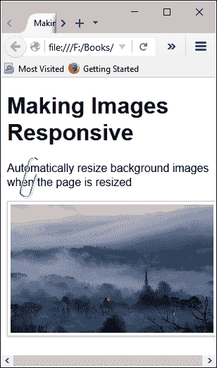

不论是哪种呈现方式，关键原则保持不变，移除固定图像大小，并用`max-width`为`100%`替换，是使图像响应式的好步骤。

然而，要获得真正的响应式图像，我们理想情况下会使用新的 HTML5 `<picture>` 标签——问题是，PostCSS 还没有插件来实现这些标签！

### 注意

如果你感兴趣于一些更通用的图像响应式制作技术（并且超出 PostCSS 的世界），那么请查看[`jakearchibald.com/2015/anatomy-of-responsive-images/`](https://jakearchibald.com/2015/anatomy-of-responsive-images/)。

在 PostCSS 中处理`<picture>`标签的任何可用功能缺失的情况下，我们可以采取更传统的路线，并使用媒体查询来帮助在不同图像之间切换，这取决于可用的屏幕空间。

我们可以更进一步，如果设备支持的话，甚至可以切换到更高分辨率的图像——我当然是在想苹果的 iPad 或 iPhone，它们支持视网膜图像。我们可以轻松地在使用 PostCSS 时使用这种格式；为此，我们需要使用 Simon Smith 的`postcss-at2x`插件，该插件可在[`github.com/simonsmith/postcss-at2x`](https://github.com/simonsmith/postcss-at2x)找到。我感觉有几个演示即将到来，所以不再多言，让我们去探索使用这个插件吧。

## 添加对视网膜图像的支持

视网膜图像，这个术语是由苹果市场营销团队提出的，它们在同一空间内包含的像素数量是标准图像的两倍。这使得我们能够自动切换到更高品质（或分辨率）的图像，前提是我们使用的设备支持它们的用途。

这可能只是一个 iPhone，或者更实质性的 iPad——苹果的市场影响力意味着它们可能是人们拥有的最受欢迎的便携式设备中的两个！但我在这里跑题了…

在技术层面上，我们有两条路线可以用来添加视网膜图像，在我们更详细地探讨这些之前，让我们先回顾一下基础知识：

```js
@media (-webkit-min-device-pixel-ratio: 2), (min-resolution: 192dpi) { 
  #retina img {
    content: url("../img/mothorchid@2x.png");
  } 
}
```

这段代码是从`Tutorial15`文件夹中的 CSS 样式表中提取的，该文件夹包含在这本书的代码下载中；尝试在浏览器中预览`index.html`。

### 小贴士

为了获得最佳效果，强烈建议您使用 Google Chrome——这是一个模拟低分辨率和高分辨率图像切换效果的优秀浏览器。

显示的图像显示的是文本*8 位版本*——要切换，请尝试这样做：

1.  按*Shift* + *Ctrl* + *I*显示开发者工具栏。

1.  点击手机图标以启用响应式设计模式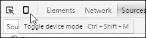

然后，我们可以通过下拉菜单在不同设备之间切换——尝试切换到**苹果 iPad**；你可能需要按*F5*键刷新显示。如果一切顺利，它将在 8 位和 24 位版本的兰花图像之间切换。

## 进行下一步

这一切都很正常，但我们显然没有在这里使用 PostCSS——我们的选项是什么？嗯，我们有两种可以使用：`customMedia()`或`postcss-at2x`插件。我们已经在*探索 PostCSS 中的自定义媒体查询*部分介绍了使用`customMedia`的基本知识；对于这个，我们会使用一个变量，例如这个：

```js
/* media query for hi-resolution image support */
@custom-media --hi-resolution screen and (-webkit-min-device-pixel-ratio: 2), (min-resolution: 192dpi);
```

这将与如下查询相结合：

```js
@media (--hi-resolution) { 
  #retina img {
    content: url("../img/mothorchid@2x.png");
  } 
}
```

当编译并在 Google Chrome 中运行（以利用其响应式设计工具）时，我们可以看到图像从 8 位：

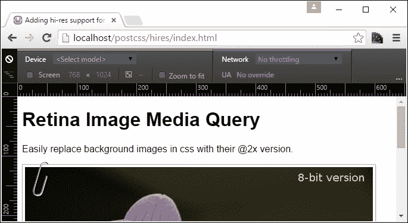

…到一个 24 位的图像版本：

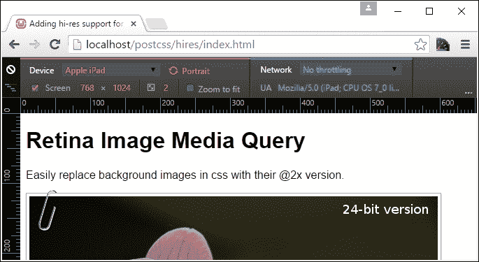

查看活动样式规则视图，会自动显示媒体查询更新：

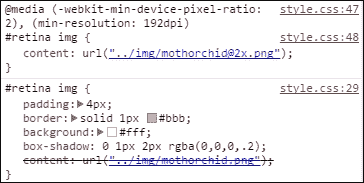

这很好，但仍然是一种耗时的人工方法——相反，我们可以使用更快捷的途径来达到类似的效果。使用`postcss-at2x`的替代途径是一个更简单的选项——我们不需要确定使用什么分辨率比率，我们只需在我们的样式规则中添加`at-2x`这个术语：

```js
#retina img { background: url("../img/mothorchid.png") at-2x; }
```

这会自动编译，为我们生成样式表中的相对分辨率语句。当与 iPad 和其他支持高分辨率图像的设备一起工作时，这是一个有用的技巧。

### 提示

在开始此演示之前，确保项目区域的根目录下的`src`和`dest`文件夹中没有文件，否则你可能会在编译过程中发现它们有一些不期望的效果！

让我们深入探讨并更详细地查看这一点。

1.  我们像往常一样开始安装插件——打开 Node.js 命令提示符，然后更改工作目录到我们的项目区域。

1.  在提示符中，输入此截图所示的命令，在每个命令后按*Enter*键：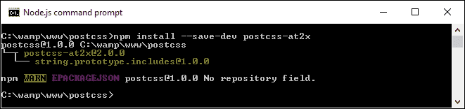

    保持窗口在手边，我们将在接下来的几个步骤中需要它！

1.  现在，让我们设置我们的标记，从本书附带的代码下载中提取`Tutorial17`文件夹的副本，并将其保存到我们的项目区域。

1.  从这个文件夹中提取`gulp`文件的副本，并使用它替换项目区域根目录下现有的文件。

1.  从`Tutorial17`文件夹中提取`style – pre-compile.css`的副本，然后将其复制到项目区域的根目录下的`src`文件夹中。将其重命名为`style.css`。

1.  切换回我们之前打开的 Node.js 命令提示符窗口——在提示符中输入`gulp`然后按*Enter*键。

1.  PostCSS 将编译我们的代码——如果一切顺利，我们应该在`dest`文件夹内的编译文件中看到类似以下内容的提取：

    ```js
    #retina img {
      padding: 4px;
      border: solid 1px #bbb;
      background: #fff;
      box-shadow: 0 1px 2px rgba(0,0,0,.2);
      content: url("../img/mothorchid.png"); 
    }
    …
    @media screen and (-webkit-min-device-pixel-ratio: 2), (-webkit-min-device-pixel-ratio: 2), (min-resolution: 192dpi) { 
      #retina img {
        content: url("../img/mothorchid@2x.png");
      } 
    }
    ```

1.  将 `dest` 文件夹的内容复制到 `Tutorial17` 文件夹内的 `css` 文件夹中。

1.  尝试预览演示——如果一切顺利，我们应该看到之前的花朵，并强制 Chrome 显示高分辨率版本，就像我们在之前的演示中所做的那样。

这个插件的好处是它为我们处理创建媒体查询；我们只需要将 `at2x` 标签添加到任何我们希望在浏览器中显示高分辨率版本的图像上。我们总是存在这样的风险，即我们可能会产生不是 100%优化的查询（例如，将相同的断点组合到一个块中等等）；我们将在本章末尾探索一些选项，以帮助我们的查询高效地工作。

作为旁白，一个经常被遗忘的、处理高分辨率图像的更简洁选项是使用 `image-set()`；它以类似的方式执行，为支持高分辨率图像的设备提供不同版本。PostCSS 提供了一个回退选项，形式为 `postcss-image-set`（可在 [`github.com/alex499/postcss-image-set`](https://github.com/alex499/postcss-image-set) 获取），它设置了一个基本图像，该图像将在不支持在样式表中使用 `image-` `set()` 的浏览器中工作。

## 探索其他媒体可能性

因此，我们已经使用媒体查询覆盖了使内容响应式的一些关键主题；当使用 PostCSS 时这意味着什么？简单的答案是它打开了一个可能性的世界——如果你的网站需要使用媒体查询，那么我们很可能可以使用 PostCSS 将我们的查询编译成有效的 CSS 规则。为了激发你的兴趣，这里有一些可以考虑的选项：

+   使用来自 [`www.bxslider.com`](http://www.bxslider.com) 的 `bxSlider` 插件创建一个响应式滑块。诚然，它使用 jQuery 在每个幻灯片之间移动，但谁能说最终不能将其转换为全 CSS 选项？

+   使用响应式图像精灵怎么样？这个的经典用途是在电子商务购物车上的信用卡符号，如果我们稍加注意，甚至可以使图像适应显示高分辨率版本，如果使用的设备支持的话。如果你想尝试一下，可以查看来自 [`github.com/2createStudio/postcss-sprites`](https://github.com/2createStudio/postcss-sprites) 的 postcss-sprites 插件。

好的，我们已经介绍了使用 PostCSS 使图像响应式的方法，但关于文本呢？如果内容调整大小时文本不能正确流动，页面看起来就不会很好。幸运的是，我们可以使用 Sean King 的 `postcss-responsive-type` 插件将类似的原则应用于文本，让我们看看它的实际应用。

# 添加响应式文本支持

在 PostCSS 中使文本具有响应性的过程与我们已经使用的 `postcss-responsive-images` 插件有相似之处，在这两种情况下，我们只需要添加一个简单的属性来使我们的内容具有响应性。

对于文本处理，我们需要使用的插件是 Sean King 开发的 `PostCSS-responsive-type` 插件（可在[`github.com/seaneking/postcss-responsive-type`](https://github.com/seaneking/postcss-responsive-type)找到）；添加字体大小，使样式表中的规则具有响应性，就足以开始使用了。当然，我们几乎肯定想要指定自己的规则；例如，我们可以使用如下代码：

```js
html {
  font-size: responsive 12px 21px; /* min-size, max-size */
  font-range: 420px 1280px; /* range of viewport widths */
}
```

这将编译成两个媒体查询——一个在 `480px`，另一个在 `1280px`；前者设置文本大小为 `12px`，后者设置字体大小为 `21px`。无需多言，让我们开始使用这个插件吧：

1.  启动 Node.js 命令行并更改工作目录到项目区域。

1.  输入此截图所示的命令，然后按 *Enter*：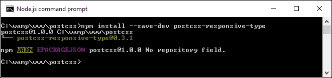

到目前为止，插件已安装——我们可以开始使用它了：

1.  首先，从本书附带的代码下载中提取 `Tutorial18` 文件夹的副本；将其保存到我们项目文件夹的根目录。

1.  在一个新文件中，添加以下代码——这包含了一些简单的字体样式用于我们的演示；将其保存为 `style.css` 并放置在我们项目区域的 `src` 文件夹中：

    ```js
    @font-face {
      font-family: 'robotoregular';
      src: url('Roboto-Regular-webfont.eot');
      src: url('Roboto-Regular-webfont.eot?#iefix') format('embedded-opentype'),
           url('Roboto-Regular-webfont.woff') format('woff'),
           url('Roboto-Regular-webfont.ttf') format('truetype'),
           url('Roboto-Regular-webfont.svg#robotoregular') format('svg');
      font-weight: normal;
      font-style: normal;
    }

    body {
      font-family: "robotoregular", sans-serif;
      font-size: responsive 12px 21px; 
      font-range: 420px 1280px; 
    }
    ```

1.  接下来，打开我们项目区域根目录下的 `gulpfile.js` 文件。

1.  注意如何添加对 `postcss-responsive-type` 插件的引用，如下所示：

    ```js
    var at2x = require('postcss-at2x');
    var responsivetype = require('postcss-responsive-type');
    ```

1.  `autoprefixer` 任务也已更新——它引用了 `postcss-responsive-type` 插件，使用文件顶部声明的变量：

    ```js
    gulp.task('autoprefixer', function() {
      return gulp.src('src/*.css')
      .pipe(postcss([at2x(), responsivetype(), autoprefixer]))
      .pipe(gulp.dest('dest/'));
    });
    ```

1.  现在，我们可以从 Node.js 命令提示符编译代码，更改工作目录到项目区域，并运行以下命令：

    ```js
    gulp

    ```

1.  一旦代码编译完成，将 `dest` 文件夹的内容复制到 `Tutorial18` 文件夹的 `css` 文件夹中；如果一切顺利，我们在浏览器中预览结果时应看到如下内容：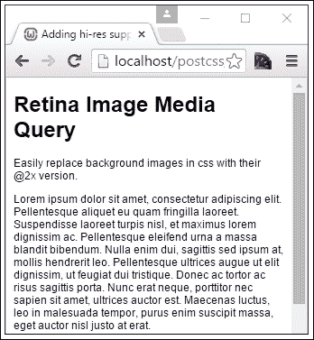

尝试调整窗口大小，使其变大或变小——你应该会注意到文本大小会根据可用屏幕空间的大小而增加或减少。然后我们可以以此为基础添加图片；如果我们应用了 `postcss-responsive-images` 和 `postcss-responsive-type` 插件，我们可以将其作为为我们的网站添加响应式功能的基础。

虽然我们一直在代码中使用像素值。历史惯例推荐使用`em`（或者更好的`rem`）值，因为这些值比标准像素值缩放得更好。然而，一些开发者现在认为这种惯例不再有效；在某些情况下，应该使用像素`em`或`rem`值。决定使用哪个单位值以及何时使用它取决于我们！

### 注意

关于使用像素值与 rem 值优点的良好讨论，请参阅 Gion Kunz 在[`mindtheshift.wordpress.com/2015/04/02/r-i-p-rem-viva-css-reference-pixel/`](https://mindtheshift.wordpress.com/2015/04/02/r-i-p-rem-viva-css-reference-pixel/)上的这篇文章。

在讨论使用媒体查询时，我们可以忽略一些可能的情况，但有两个关键主题我们应该探讨——优化媒体查询以及我们如何为旧浏览器提供某种形式的支持。我们将从优化查询开始——PostCSS 提供了一些有用的插件来帮助我们维护代码。

# 优化媒体查询

在本章中，我们探讨了使用 PostCSS 来编译我们的媒体查询；虽然我们在创建内容方面有很多选择，但我们应该注意我们创建的内容，以确保我们不会创建一个减慢网站速度的怪物！

PostCSS 提供了一些插件来帮助我们。它们是：

+   `postcss-mq-keyframes`：可在[`github.com/TCotton/postcss-mq-keyframes`](https://github.com/TCotton/postcss-mq-keyframes)找到），这是一个简单的插件，它将所有关键帧从现有查询中移出，放到样式表的底部。这允许我们合理化关键帧规则——如果我们有多个媒体查询，我们可以将这些规则应用到每个媒体查询上。

    例如，下面高亮的代码将会从查询中移出，成为一个独立的规则：

    ```js
    @media only screen and (min-width: 415px) {
      .pace {
        animation: pace-anim 5s;
      }

     @keyframes pace-anim {
     100% {
     opacity

    ```

+   `css-mqpacker`：可在[`github.com/hail2u/node-css-mqpacker`](https://github.com/hail2u/node-css-mqpacker)找到），这个插件解析我们的代码并将任何相同的规则合并为一个媒体查询规则。我们可能从这个插件中获得多少好处是有争议的；我们可能只有在较大的、更复杂的网站上使用它时才会看到任何显著的益处！

这两个插件都可以使用与我们迄今为止使用的所有插件相同的安装过程来安装；值得注意的是，我们不应该过度使用查询。而不是为特定的平台设计，尝试为内容明显断裂且无法使用的情况设计。查询越少，管理代码就越容易；简洁对于成功网站至关重要。

从更广泛的角度来看，在优化我们的代码时，有一个领域我们不应该忘记——我们应该支持哪些浏览器？我完全支持尽可能推动传统浏览器的发展，使用现代浏览器。然而，有些人可能仍然需要支持旧浏览器（请不要告诉我这包括 IE6！）。让我们探索 PostCSS 中可用的一个选项，以帮助那些仍然需要支持那些实际上应该被淘汰的应用程序的用户。

# 支持旧浏览器的更新

对于那些仍然需要支持旧浏览器，例如 IE6-8 的用户，PostCSS 可以提供帮助——我们可以使用`postcss-mqwidth-to-class`插件来生成基于我们指定的媒体查询的硬编码类规则，例如这个例子：

```js
@media (min-width: 1024px) and (max-width: 1298px) {
  .bar { float: left; }
}
```

如果我们使用这个插件进行编译，它将产生这个结果：

```js
.min-width-1024px.max-width-1298px .bar { float: left; }
```

任何人注意到这里的危险了吗？代码在技术上可能是正确的，但它存在一些局限性，使其不那么吸引人：CSS 特定性级别高，忽略了媒体类型（如屏幕或打印）；如果向`<body>`或`<html>`标签添加类，可能需要 JavaScript。

最终决定我们使用什么取决于我们自己，但我们应该始终注意，如果我们必须支持旧浏览器，我们的代码不会引入新的问题！在这个例子中，一个更好的选择是考虑使用`postcss-unmq`插件（源代码可在[`github.com/jonathantneal/postcss-unmq`](https://github.com/jonathantneal/postcss-unmq)找到）；这个插件通过允许我们创建遵循特定屏幕尺寸的规则来移除媒体查询。

现在，虽然像 IE8 这样的浏览器确实应该（强制性地）从活跃服务中退役，但考虑如果我们能更进一步，开始远离使用响应式设计技术，这也是有话可说的。

例如，传统智慧认为使用 rem 值比使用像素更好。现在有一种新的转变表明，广泛使用 rem 单位（许多开发者可能已经这样做）可能不是最佳选择，我们可能需要考虑不同单位的混合，以确保内容正确缩放并保持足够的清晰度。这是我们 PostCSS 开发工作中需要考虑的一个重要概念，所以让我们花点时间考虑这可能会对我们意味着什么。

# 转向非响应式设计

*"远离响应式设计？？你真的失去理智了吗……？？"*

对于许多人可能认为的一个完全合理的问题，答案是“不”——或者正如*波洛纽斯*在*哈姆雷特*中可能说的那样，“*尽管有疯狂，但其中也有方法*”。

简而言之，考虑这个话题有很好的理由，因为使用 PostCSS 创建断点非常容易，但确定它们应该是什么是代码成功的关键。许多开发者已经在网上博客中讨论了不同类型的媒体查询——例如平板电脑、桌面和笔记本电脑的示例广泛可用，并且经常更新或替换，如果硬件发生变化。

自从 Ethan Marcotte 在 2010 年普及“响应式网页设计”这个术语以来，许多人已经接受响应式设计作为为多个设备或平台创建内容的公认标准。然而，作为一个概念，它开始失去开发者的青睐；一个固有的弱点是需要下载多个资产，即使只有选择性的版本可能被使用（例如图像的大或小版本）。这当然增加了带宽使用，并最终使网站导航速度变慢。

那么，我们是否应该完全不使用响应式设计呢？嗯，不完全是这样，这取决于你的情况。不要盲目地添加会增加复杂性的媒体查询，花点时间考虑你是否真的需要那个媒体查询。

作为一种替代方案，考虑使用内容特定的断点，而不是媒体等效断点；而不是将我们的设计绑定到特定设备上，我们可以找出内容无法正确消费的地方，并在此基础上构建我们的断点，而不是一个可能改变的已知设备宽度。

图片，或者更具体地说，高分辨率版本，已经不再是问题；在不再使用每个图片的低分辨率和高分辨率版本的情况下，考虑切换到 SVG 格式。这种格式可以很好地缩放（不受设备影响），并且一举解决了设备上可伸缩性的任何问题。当然，对于 IE 的兼容性存在一些已知问题，但大多数其他浏览器应该能够处理 SVG 而不会引起太多问题！

字体是另一个我们可以开始减少使用媒体查询的领域——在这里，我们需要考虑使用`vw`、`vh`、`vmin`或`vmax`单位；文本将在浏览器视口大小调整时自动缩放。适应我们的代码将需要一些手动更改；我们可以使用`postcss-vmin`插件为旧版本的 Internet Explorer 提供一些回退。

希望这能给你一些思考——这里的关键信息是，虽然媒体查询的 PostCSS 插件使得实现变得非常容易，但我们不应该盲目地实施大量的媒体查询，而不考虑是否有其他方法可以达到相同的结果。

好的，让我们继续前进：现在是时候把事情做得更彻底一些；让我们看看如何进一步利用 CSS4（正如其广为人知的那样）。我们将通过一个示例来模拟 CSS 第 4 级媒体查询中可以使用的新的大于或小于运算符。

# 进一步探讨 CSS4

在使用媒体查询时，有一个小的不满是查询本身并不真正具有语义性；大多数查询将显示类似`max-width: 1024px`的内容，而我们的真正意图是*…小于…*或*…大于…*。

幸运的是，随着 CSS 即将到来的变化，大多数人称之为 CSS4，我们将能够使用`>`, `<`, 或`=`符号来表达我们代码中的真正意图。PostCSS 的美丽之处在于，我们现在可以使用`postcss-media-minmax`插件（可在[`github.com/postcss/postcss-media-minmax`](https://github.com/postcss/postcss-media-minmax)找到）来模拟这种功能；该插件将这些转换为更熟悉的 min-或 max-语句，这是我们已知的。

这是一个非常容易使用的插件——我们在这里将打破常规，使用 CodePen 来演示插件的实际应用。CodePen 将支持有限数量的插件，其中之一就是它——这是一个观察查询实际效果的完美机会。对于我们的演示，我们将使用 Font Awesome 库来创建一些社交媒体图标——我们的演示是基于 Amey Raut 的一个版本：

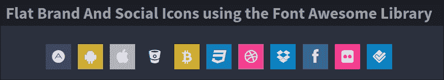

您可以在[`codepen.io/alibby251/pen/wKNMGL`](http://codepen.io/alibby251/pen/wKNMGL)查看演示——对我们有意义的代码是从第 70 行到第 79 行——注意第 71 行中`<=`和`>=`的使用：

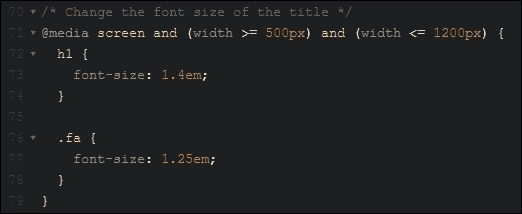

编译后，它显示以下有效的 CSS：

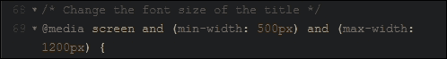

在媒体查询中使用操作符如`<`或`>`只是 CSS4 中即将到来的一部分；更多详情，请查看 W3C 编辑草案[`dev.w3.org/csswg/`](http://dev.w3.org/csswg/)——注意，它可能是一段枯燥的阅读材料！

# 摘要

对于任何创建响应式网站的人来说，媒体查询是这个过程中的核心部分——PostCSS 可以轻松帮助我们创建项目所需的适当媒体查询。在过去的几页中，我们已经覆盖了许多关键主题，所以让我们花点时间考虑一下本章我们涵盖了哪些内容。

对于任何创建响应式网站的人来说，媒体查询是这个过程中的核心部分——PostCSS 可以轻松帮助我们创建项目所需的适当媒体查询。在过去的几页中，我们已经覆盖了许多关键主题，所以让我们花点时间考虑一下本章我们涵盖了哪些内容。

我们首先快速回顾了 CSS 中的标准媒体查询，然后修改了我们的代码，使用 PostCSS 作为查询的基础。然后我们将其用于使图像响应式，首先查看 PostCSS 中可用的选项，然后通过一个 PostCSS 的示例来操作。然后我们转向媒体查询在图像中的常见用途，查看为支持其使用的设备切换到高分辨率版本。

我们随后转向制作响应式文本，并发现这是一个类似的过程，尽管使用了不同的插件。然后我们转向使用 PostCSS 优化查询，在快速回顾了为旧浏览器添加支持时可用的一些选项之后。接着，我们完成了这一章节，探讨了如何使用替代技术使我们的网站响应式，而无需使用媒体查询，最后以发现 CSS4 中的一部分内容以及如何使用 PostCSS 使这些技术今天可用作为结束。

呼，我们确实覆盖了很多内容：但这还没有结束！我们旅程的下一站承诺将同样有趣；每个网站或在线应用都会以某种形式在整个网站上使用不同的字体、图像或颜色。我们将探讨如何使用 PostCSS 使我们的生活变得稍微轻松一些……。
