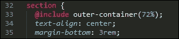

# 第六章。创建网格

在创建基本网站布局时，有几种不同的路径可以选择，在许多情况下，开发者可能会决定使用 CSS 网格。

对于使用 CSS 预处理器的人来说，一个经典的例子当然是 SASS 网格系统，**Bourbon Neat**——一个很棒的包，但需要安装 Ruby 才能使用。我们可以在 PostCSS 中轻松解决这个问题，通过使用几个可用的插件之一，无需额外的依赖。在本章中，我们将探讨可用的选项，并通过一些示例来演示如何使用 PostCSS 内置的插件创建网格。

在本章中，我们将涵盖多个主题，包括：

+   介绍使用 CSS 网格的基本原则

+   探索 PostCSS 中可用的网格插件

+   使用 Bourbon Neat 通过一些简单的示例进行操作

+   使用 PostCSS 插件 PostCSS-Neat 复制纯 SCSS 示例

+   使用 PostCSS-media-minmax 插件添加响应式功能

让我们开始吧…！

# 介绍网格设计

在设计中使用网格的原则并不新颖，它们可以追溯到第二次世界大战，当时许多平面设计师对传统页面布局的设计提出了质疑，转而设计一个既灵活又连贯的布局系统。

这些原则已经转移到网络上，从最初的纯 HTML 和基于 CSS 的设计开始，然后是更新的框架接管并帮助简化构建过程。

无论设计如何构建，我们当然可以使用 HTML 和 CSS，或者我们可能更喜欢图像模板方法（使用如 `PhotoShop` 的包），尤其是如果前端设计的责任落在不同的团队上。

这些方法是完全可以接受的，但需要大量的手动工作——在这个网页设计时代，时间至关重要；我们可以利用更新的框架（如 SASS、Bourbon Neat 或 Bootstrap）来创建我们的网格，如本例所示（使用纯 SASS）：


如果我们从这个书的代码下载中提取 `Tutorial28` 文件夹，然后使用浏览器查看它，我们就可以看到这种布局的实际效果。这个演示使用的 `style.css` 文件是在线 SASS 游乐场 Sassmeister 上创建的，网址为：[`www.sassmeister.com`](http://www.sassmeister.com)。

在这个演示中使用的代码大部分都与每个列宽和整体 .wrapper 容器有关；如果你查看代码，你会注意到列宽没有静态值。有几个静态值，但它们的大小对整体效果并不关键。

我们演示的关键在于这个 CSS 样式块：


在这里，我们使用 SASS 的插值功能首先构建我们的媒体查询（使其响应），然后是形成网格的一系列列的样式。编译后，它创建了一系列应用于我们网格各个部分的样式：


这只是一个将样式与网格上显示的数字匹配的问题。如果我们想更改宽度，我们只需增加列数，我们的`for`语句将在下一次编译时自动计算出一组新值。

好了，闲话少说：我认为现在是时候进行演示了！在本章中，我们将从使用 SASS 的一些基本示例开始，通过使用 Bourbon Neat，最后转换为使用 PostCSS 插件。我们总是要从某个地方开始，所以让我们从使用 SASS 自动化编译过程开始。

## 自动化编译过程

“安装 SASS？”我听到你问为什么，当这本书是关于 PostCSS 的时候？

我听到了，这是一个好问题：虽然这看起来有些疯狂，但其中确实有逻辑——让我来解释一下：

当我们在安装 SASS 时，我们不会使用标准的安装路径；相反，我们将使用`gulp-sass`插件。这允许我们开始使用`gulp`文件；这使我们更接近将我们的流程转换为使用 PostCSS。使用`gulp`文件提供了一个方便的框架，我们可以在此过渡到使用 PostCSS 时切换组件。

### 注意

在第十二章中，我们将看到 *混合预处理器* 如何与 PostCSS 很好地协同工作，作为采用一致方法编译代码的基础。

所以，无需多言，让我们开始安装`gulp-sass`插件，然后再投入使用：

1.  我们首先启动一个 Node.js 命令提示符会话，然后更改工作文件夹到我们的项目区域。

1.  在提示符下，请输入以下命令，然后按 *Enter* 键：

    ```js
    npm install gulp-sass --save-dev

    ```

    不要关闭窗口，我们很快就会用到它！

1.  Node 将退出并安装`gulp-sass`；安装完成后，它将返回到提示符。

1.  插件安装完成后，我们现在需要编译我们的代码——请将`Tutorial29`文件夹的副本提取到我们的项目区域。

1.  将`sass – pre-compile`文件夹的内容复制到我们的项目区域根目录下的`src`文件夹。

1.  我们还需要将`Tutorial29`文件夹中的`gulpfile.js`和`package.json`文件添加到我们的项目区域的根目录。

1.  回到我们之前打开的 Node.js 窗口，然后在提示符下输入`gulp`并按 *Enter* 键。

1.  文件现在将进行编译——一旦完成，请将它们复制到`Tutorial29`文件夹内的`css`文件夹中。

1.  尝试在浏览器中预览我们工作的结果；如果一切顺利，我们应该看到类似于这个截图的内容：

好的，我们现在有了自动编译的支持；“接下来是什么？”我听到你问。我们又近了一步，因为我们的代码现在可以自动编译了：


然而，仍然需要手动努力来构建我们的网格！让我们现在开始改变这一点，有几个框架可供我们使用，但在我看来，最干净的是 SASS 的 Bourbon Neat。我们将以此为基础进行接下来的几个练习，然后再迁移到使用该框架的 PostCSS 版本。

## 添加 Bourbon Neat 支持

对于初学者来说，SASS 的网格功能由 Bourbon Neat 插件提供（可在[`neat.bourbon.io/`](http://neat.bourbon.io/)找到）。为了我们练习的目的，我们将使用框架的 Node 版本——这需要完成两个安装，所以现在我们就来做吧：

1.  如果它仍然打开，请从上一个演示中的 Node.js 命令提示符会话中恢复；否则，打开一个新的会话并将工作文件夹更改为我们的项目区域。

1.  在提示符下，依次输入这两个命令，每次输入后按*Enter*键：

    ```js
    npm install node-bourbon --save-dev
    npm install node-neat --save-dev

    ```

1.  当我们看到类似于以下截图的结果时，这两个插件都将正确安装：

1.  现在插件已经安装，我们需要修改我们的`gulp`文件——请将以下内容添加到第 5 行：

    ```js
    var neat = require('node-neat').includePaths;
    ```

1.  接下来，留一行空白，然后在第 7 行添加如下所示的代码：

    ```js
    var paths = {
      scss: 'src/*.scss'
    };
    ```

1.  可以用这个新任务替换原始的 SASS 任务：

    ```js
    gulp.task('styles', function () {
      return gulp.src(paths.scss)
      .pipe(sass({
        includePaths: require('node-neat').includePaths
      }))
      .pipe(gulp.dest('dest/'));
    });
    ```

1.  默认任务中对 SASS 的引用现在是不正确的——请将其更改为：`gulp.task('default', ['styles']);`

1.  最后，按照指示更改此行：

    ```js
    var watcher = gulp.watch('src/*.scss', ['styles']);
    ```

1.  我们现在可以测试我们的编译过程了——请从代码下载中提取`style – pre-compile.scss`的内容的副本，并将其保存到`src`文件夹中。

1.  到目前为止，我们可以从 Node.js 命令提示符中运行`gulp`。如果一切顺利，我们应该在`dest`文件夹中看到一个`style.css`文件出现。如果我们打开它，我们应该看到一些编译后的样式，如下所示，这证明了 Neat 已安装并正在工作：

    ```js
    @media only screen and (min-width: 30rem) {
      .wrapper {
        width: 95%;
        max-width: 72rem; }
      .col-1 {
        width: 8.33333%; }
    ```

到目前为止，我们现在有一个工作的编译过程，我们可以开始构建一个工作的网站了！现在，不要过于担心编译后的`test.css`文件中的单个样式，我们将在接下来的几页中更详细地介绍这一点。让我们将我们的新编译过程付诸实践，并组装一个工作示例，以便我们可以看到网格功能在实际中的应用。

# 使用 Bourbon Neat 创建示例

使用 Bourbon Neat 构建网站是一个简单的过程，它不需要在我们的网页上添加任何特殊的标记；所有的努力都在编译后的样式表中。

为了证明这一点，我们将构建一个简单的网页，它很容易成为任何网站的一部分——我已经使用日本主题作为我页面的基础，但我们将使用的原则可以适用于任何网站。你会看到（除了标准 SASS 代码风格外），我们只使用了三个 Bourbon Neat 特定的代码实例。

让我们开始吧：

1.  从本书附带的代码下载中，请提取`Tutorial30`的副本，并将其保存到我们的项目区域的根目录下。

1.  将`Tutorial30`文件夹内的`sample site – pre-compile`的内容复制到我们的项目区域内的`src`文件夹中。然后将其重命名为`sample.scss`。

1.  接下来，启动一个 Node.js 命令提示符，然后更改工作文件夹到我们的项目区域。

1.  在提示符下，输入`gulp`，然后按*Enter*——Node.js 将编译代码；如果一切顺利，我们应该在`dest`文件夹中看到两个编译后的样式表和一个源映射。

1.  请将`dest`文件夹的内容复制到`Tutorial30`文件夹根目录下的`css`文件夹中。

如果我们尝试预览我们的工作结果，我们应该看到一个时尚的页面出现，带有我们的日本主题：


这个演示涵盖了几个关键点和有用的技巧，所以让我们深入探讨它们。

## 更详细地探索我们的演示

到目前为止，你可能惊讶地发现，我们的第一个技巧与 SASS 或甚至 Bourbon Neat 没有直接关系，而是与配色方案有关！

“为什么”，我听到你问，“我们首先讨论的是配色方案？” 这有一个很好的原因：我们使用了变量来引用我们的颜色，但同样可以使用 SASS 函数来创建这些值。我们已经在第五章中讨论过这一点，即*管理颜色、图像和字体*，其中我们介绍了使用`postcss-color-function`插件来构建这些值；我们将在本章后面再次使用它。

然而，真正的技巧是使用 Lokesh Dhakar 的一个巧妙的小程序，名为**Color Thief**（托管在[`lokeshdhakar.com/projects/color-thief/`](http://lokeshdhakar.com/projects/color-thief/))。我们可以简单地拖放我们的标题图像进去，并得到一整套合适的颜色：


唯一的缺点是它不提供颜色值；我们可以从页面的源代码中获取这些值。

### 注意

如果你更喜欢使用 RGB(A)颜色，那么像**Color Hexa**([`colorhexa.com`](http://colorhexa.com))这样的网站将非常有帮助。

我们演示的关键在于第 33 行、第 63 行和第 69 行——这些是控制外部容器格式的 Bourbon Neat 混入（第 33 行）：



它们还控制着内部两个内容区域（第 63 行和第 69 行）的格式：


编译时，`outer-container` 混合器会给 `.wrapper` 类添加一个 72% 的 `max-width`，而 `span-columns()` 混合器会给每个元素添加 `float`、`display`、`width` 和 `margin-right` 属性，如下所示：


除了 `outer-container()` 和 `span-columns()` 混合器之外，演示尽可能多地使用了百分比值，当指定了 `rem` 或 `pixel` 值时，然后在调整这些元素的大小时保持一致的设计就不那么关键了。

然而，我们将在本章的后面部分进行一些改进，当我们提高演示的响应能力时。现在，让我们继续我们的转换，并介绍将 PostCSS 插件的使用引入我们的流程中。

# 探索 PostCSS 的网格插件

在本章中，我们使用 SASS 和 Bourbon Neat 来生成我们的网格。这是一个完全有效的选择，但并非唯一的选择。我们可能更喜欢使用像 Bootstrap 或语义网格系统这样的东西；最终，选择使用哪个网格系统取决于我们的个人选择，基于我们的偏好和需求。

到目前为止，我们一直专注于使用 Neat。这主要是因为熟悉和易用。然而，将来的某个时刻，我们需要转向使用 PostCSS——美的是，有一个专门的插件可以在 PostCSS 中使用 Neat，在 [`github.com/jo-asakura/postcss-neat`](https://github.com/jo-asakura/postcss-neat)。这不是 PostCSS 可用的唯一网格系统插件，所以让我们花点时间来介绍其他可以使用的插件：

+   `Grid`: 可从 https://github.com/andyjansson/postcss-grid 下载，这个插件将一些配置在 PostCSS 和样式表中之间分割，这有助于简化格式化每个列所需的计算。

+   `Lost`: 可从 [`github.com/corysimmons/lost`](https://github.com/corysimmons/lost) 获取，它将自己描述为网格系统的 Autoprefixer；它为大多数预处理器提供支持，例如 Less、SASS 或 Stylus。

+   `Simple-grid`: 从 [`github.com/admdh/postcss-simple-grid`](https://github.com/admdh/postcss-simple-grid) 获取，这个插件采取了不同的路线：所有的配置都是在 CSS 中完成的，而不是在任务配置中。

不再拖延，是我们进行转换的时候了——让我们从安装和配置插件开始使用。

# 转向使用 PostCSS-Neat

转向使用 PostCSS 相对直接。我们当然需要更新我们的编译过程，以移除对 SASS 的链接，并引入我们的 PostCSS 插件。

### 小贴士

转换过程将在本节和接下来的两节中完成。

在更改 CSS 方面，稍微复杂一些，因为我们必须确定每个网格块所需的列数。幸运的是，我们的例子相对简单，因为我们已经用适当的列数对原始块进行了编号，因此我们可以将其作为更改 CSS 的基础。

让我们从更新我们的编译过程开始：

1.  我们将首先从本书附带的代码下载中提取 `Tutorial31` 文件夹的副本。将其保存到我们的项目区域根目录。

1.  从 `Tutorial31` 文件夹中，提取 `package.json` 和 `gulpfile.js` 文件的副本。将这些文件保存在我们的项目区域根目录下。

1.  接下来，我们需要安装 `postcss-neat` 插件。为此，打开 Node.js 命令提示符，然后更改工作文件夹到我们的项目区域。

1.  在提示符下，请输入以下命令，然后按 *Enter* 键：

    ```js
    npm install postcss-neat --save-dev

    ```

1.  Node 将安装我们的插件——当我们看到这个确认信息时，插件已安装：

现在我们已经安装并配置了一个插件供使用。在我们创建测试以确认它正常工作之前，让我们快速查看我们的 gulp 文件，位于我们的项目区域根目录。

如果你期待一个复杂的配置，那么很抱歉让你失望——它甚至比在他们的网站上使用常规方法安装 Bourbon 和 Neat 更简单！我们的 gulp 文件在文件开始处包含了每个插件所需的变量调用，在文件末尾有一个监视功能。对我们来说，感兴趣的这部分是：

```js
gulp.task('neat', function () {
  var processors = [
    require('autoprefixer-core')({ browsers: ['last 1 version'] }),
    require('postcss-neat')(/* { options } */)
  ];
  return gulp.src('src/*.css')
    .pipe(require('gulp-postcss')(processors))
    .pipe(gulp.dest('dest/'));
});
```

这种设置应该能满足大多数场景，默认为 12 列；如果需要覆盖它，我们可以在配置对象中指定适当的选项：

```js
postcss([
  ...
  require('postcss-neat')({
    neatMaxWidth: '128em'
  })
  ...
])
```

我们将在本章的 *测试我们的配置部分* 中使用此选项，当我们构建测试示例时。

### 注意

要查看可以修改的完整属性列表，请访问 [`github.com/jo-asakura/postcss-neat#custom-settings`](https://github.com/jo-asakura/postcss-neat#custom-settings)。

我们现在已经建立了一个基本的配置，但等等……它看起来有点短！那些有敏锐眼光的人应该会注意到，我们在之前的练习中的 `gulp` 文件中包含了额外的选项，例如创建源映射或压缩我们的 CSS 文件。现在让我们修正我们的 gulp 文件，包括这些缺失的选项。然后，一切都将准备就绪，以便我们创建示例网站。

## 精炼我们的任务列表

我们当前的 `gulp` 文件已经可以使用了，但它并不像它本可以做到的那样有用——我们在之前的练习中构建了一些任务，但这里缺少了哪些。

一个完美的例子是添加源映射，但我们也想对代码进行压缩？让我们花点时间来精炼我们的任务列表，并添加缺失的任务：

1.  第一个任务是添加一些变量，它们将作为我们将要使用的各种插件的参考——这些变量直接放在`gulp`文件顶部的最后一个`var`语句之后：

    ```js
    var cssnano = require('cssnano');
    var sourcemaps = require('gulp-sourcemaps');
    var rename = require('gulp-rename');
    var stylelint = require('stylelint');
    var reporter = require('postcss-reporter');
    ```

1.  首先要添加的任务是添加一个用于检查我们样式的工具：

    ```js
    gulp.task("lint-styles", ['neat'], function() {
      return gulp.src("dest/css/*.css")
        .pipe(postcss([ stylelint({
          "rules": {
            "color-no-invalid-hex": 2,
            "declaration-colon-space-before": [2, "never"],
            "indentation": [2, 2],
            "number-leading-zero": [2, "always"]
          }
        }),
        reporter({
          clearMessages: true,
        })
      ]))
    });
    ```

1.  在检查了样式的准确性和一致性之后，我们现在可以压缩我们的代码。添加以下代码块：

    ```js
    gulp.task('rename', ['lint-styles'], function () {
      return gulp.src('dest/css/*.css')
        .pipe(postcss([ cssnano() ]))
        .pipe(rename('style.css'))
        .pipe(gulp.dest("dest/css"));
    });
    ```

1.  下一步是添加一个源映射选项：

    ```js
    gulp.task('sourcemap', ['rename'], function () {
      return gulp.src('dest/css/*.css')
        .pipe(sourcemaps.init())
        .pipe(sourcemaps.write('maps/'))
        .pipe(gulp.dest("dest/css"));
    });
    ```

1.  在我们的`gulp`文件中添加了这些功能后，我们需要调整主要默认任务以调用这些附加任务：

    ```js
    gulp.task('default', ['neat', 'lint-styles', 'rename', 'sourcemap']);
    ```

1.  我们已经设置了一个监视功能，但它对这些额外任务一无所知；现在让我们添加它们：

    ```js
    var watcher = gulp.watch('src/*.css', ['default',  'lint-styles', 'rename', 'sourcemap']);
    ```

现在我们有一个工作的`gulp`文件，它包括了我们的练习所需的全部配置任务——让我们通过编译一些示例代码来测试它，以确认它按预期工作。

## 测试我们的配置

我们流程的关键部分是测试我们的`gulp`文件以确保它正常工作；它不仅应该运行所有必需的任务，而且应该按照正确的顺序运行，并产生预期的结果。尽管我们已经在`gulp`文件中重用了现有代码，但我们已经对`gulp`文件进行了重大修改——让我们花点时间测试它是否正常工作，使用我们之前的演示中的代码。

为了让我们的演示在 PostCSS 下工作，我们需要对我们的代码做一些修改：

1.  我们首先将`style.scss`文件（位于`Tutorial31`文件夹中的`css`文件夹内）重新保存为纯 CSS 文件，而不是 SASS 样式表，我们在之前的演示中已经移除了 SASS 的使用，使得`.scss`扩展名变得冗余。

1.  在之前的演示中，我们使用了`.wrapper`类。这需要按照指示进行修改：

    ```js
    .wrapper {
      @neat-outer-container;
      margin: 0 auto;
    }
    ```

1.  我们的`col-*`类规则也需要更改。我们将用以下内容替换旧演示中的静态百分比：

    ```js
    .col-1 { @neat-span-columns 1; }
    .col-2 { @neat-span-columns 2; }
    .col-3 { @neat-span-columns 3; }
    .col-4 { @neat-span-columns 4; }
    .col-5 { @neat-span-columns 5; }
    .col-6 { @neat-span-columns 6; }
    .col-7 { @neat-span-columns 7; }
    .col-8 { @neat-span-columns 8; }
    .col-9 { @neat-span-columns 9; }
    .col-10 { @neat-span-columns 10;}
    .col-11 { @neat-span-columns 11; }
    .col-12 { @neat-span-columns 12; }
    ```

1.  我们的代码现在准备好了，所以请将`style.css`文件复制到项目区域的根目录下的`src`文件夹中。

1.  接下来，启动 Node.js 命令提示符，然后更改工作文件夹到我们的项目区域。

1.  在命令提示符中，输入`gulp`然后按*Enter*。

1.  如果一切顺利，我们应该在`dest`文件夹中看到一个编译好的`style.css`文件。如果我们打开它，我们应该看到一系列与每个列相关的样式显示，就像这个截图所示：

1.  如果我们尝试在浏览器中预览演示，我们应该看到类似于这个截图的内容。注意它与我们用 SASS 构建的原始版本多么相似：

我们构建的演示几乎与原始版本相同。这证明了我们具备工作能力，我们可以用它来构建我们的网站。我们对代码所做的更改非常简单，我们添加了一个`@neat-outer-container`来定义我们的网站应该有多宽，然后是多个`@neat-span-columns`实例，来定义每个元素应该跨越多少列。

让我们把一些新的知识应用到构建一个更有用的东西上，以一个包含内容的示例网站的形式。我们将重用本章中早期创建的示例网站页面，并完成将其转换为使用 PostCSS 插件的转换。

# 使用 Neat 和 PostCSS 创建一个网站

记得我们之前在*使用 Bourbon Neat 创建示例*中提到的具有日本主题的演示。这是一个简单的演示，使用 Bourbon Neat 帮助我们创建网格。然而，缺点当然是依赖于 SASS！

好吧，我们可以解决这个问题：PostCSS 有一个插件可以模拟 Bourbon Neat，但它完全是用 JavaScript 编写的，因此没有对 SASS 的依赖。它易于安装和使用，在接下来的几页中，我们将讨论切换到这个插件所需的更改。

首先，让我们设置一下：

1.  我们首先从本书附带的代码下载中提取`Tutorial32`文件夹的副本。将其保存到我们项目区域的根目录。

1.  将`sample pre-compile.css`文件复制到我们项目区域根目录下的`src`文件夹。

1.  将`gulpfile.js`、`samplesite.html`和`package.json`文件复制到我们项目区域的根目录。这些文件应该替换掉任何现有的版本。

1.  接下来，我们需要安装两个插件，尽管我们在本书的早期部分已经介绍了如何使用`postcss-css-variables`，但安装它们将确保正确地将引用添加到`package.json`文件中。请启动 Node.js 命令提示符，然后更改工作文件夹到我们的项目区域。

1.  在命令提示符中，依次输入这两个语句，每输入一个后按*Enter*键：

    ```js
    npm install postcss-css-variables --save-dev
    npm install postcss-nested

    ```

1.  当两个插件都安装好后，输入`gulp`，然后按*Enter*键启动样式表的编译。

1.  如果一切顺利，我们应该在`dest`文件夹中看到两个样式表和一个源`map`文件夹。将这些文件复制到我们项目区域根目录下的`css`文件夹。

1.  如果我们启动`samplesite.html`的副本，我们应该看到我们的演示与之前一样出现，但这次没有对 SASS 的依赖：

你是否注意到与之前这个演示的 SASS-only 版本有什么不同？希望没有；虽然它可能不会与原始版本像素完全一致，但它离得很近！然而，它确实表明，只要有一点独创性，就可以实现向使用 PostCSS 的过渡，同时仍然保持相同的结果。这将对你的代码和流程进行一些修改，所以让我们更详细地看看这些修改，从样式表开始。

## 将更改应用到 PostCSS

切换到 PostCSS 需要在`gulp`任务文件和样式表中做出一些更改。这些更改不是为了改变页面的外观，而是为了保持原始演示中的相同主题。对样式表所做的关键更改包括：

+   我们导入的 `_reset.scss` 部分样式表将不再工作，因为我们正在移除对 SASS 的依赖。为了保持其使用，我们使用 Sassmeister 在线沙盒（[`www.sassmeister.com`](http://www.sassmeister.com)）创建了一个编译版本；然后我们可以从我们的标记页面链接到它。

+   如果你查看 `sample.css` 的源版本，你会在文件顶部看到一个 `:root` 块；这取代了我们使用的 `import` 语句。这个块可以用来存储任何使用的变量，我们将在探索对 `gulp` 任务文件所做的更改时详细介绍这一点。

+   我们不再需要以下三个语句；它们用于调试 Bourbon Neat 的 SASS 版本，然后被移除：

    ```js
    $visual-grid: true;
    $visual-grid-color: #E6F6FF;
    $visual-grid-opacity: 0.4;
    ```

+   我们使用 PostCSS 的等效语句来处理所有的变量声明。SASS 版本通过搜索和替换从 `$...` 到 `var(--….)` 进行了修改，其中 ... 代表变量名。

+   我们原始代码中有许多对 `Bourbon` 混合的引用需要更新。我们使用了相同的搜索和替换原则，这次将 `@include outer…` 改为 `@neat-outer…` 整个代码中。

+   为了保持简单，我们手动计算了任何 `$body-line-height` 的引用实例，并用计算结果替换了计算。我们本可以继续使用计算，但这将需要使用另一个插件，这对于我们代码中有限的用途来说将是过度杀鸡用牛刀。

+   我们还调整了页面中主要区域的宽度；这是一个小问题，但确保我们有两个区域并排而不是一个在上一个在下是必要的！

除了更改样式表，我们还必须对 `gulp` 任务文件进行一些更改。它们主要集中在替换主要编译任务，并添加额外的任务来管理源文件的生产和压缩：

+   我们添加了在早期演示中覆盖的 rename、lint-styles 和 sourcemap 任务。这些任务已经工作得很好，并且不需要修改。

+   我们移除了原始的样式任务，并用这个替换了它：

    这次，我们称它们为 `nested()`、`cssvariables()` 和 Neat 插件。这些是引用的变量，并且在我们的 `gulp` 文件顶部添加。

+   我们最后的更改是在 `gulp` 文件的末尾，在那里我们必须调整默认和监视任务以包括我们添加到 `gulp` 文件中的额外任务。

在这个阶段，我们是否有一个可以使用的演示工作版本？好吧，还不完全，但让我们尝试调整我们的演示大小：


嗯，我们的内容怎么了？看起来并不好，不是吗？不过我们可以轻松地修复它；这只需要添加一些媒体查询来重新组织内容在屏幕上的显示方式。让我们深入了解一下，看看需要什么来让我们的演示在更小的尺寸下看起来更好。

# 添加响应式功能

虽然 Bourbon 确实为我们的代码添加了一定程度的响应性，但这还不足以满足我们的需求。如果我们尝试调整我们的演示，很快就会很明显，元素并没有达到我们想要的位置，至少可以说是不够理想！

要快速查看设计在调整以适应较小设备时的外观，可以使用 Google Chrome。按 *Shift* `+` *Ctrl* `+` *I* 启用 Chrome 的开发者工具：


当在 1280px x 1024px 的分辨率下查看时，设计效果良好，但如果我们将可用的查看区域更改为适合苹果 iPhone 6 的 375px x 627px，情况很快就会改变：


你明白我的意思吗？这看起来就是不对劲，不是吗？幸运的是，使用 PostCSS 很容易修复，所以让我们深入了解一下需要做什么才能让我们的设计恢复正常工作。

## 修正设计

当使用 PostCSS 时，让我们的设计在较小的设备（如 iPhone）上正常工作很容易：我们可以使用从 [`github.com/postcss/postcss-media-minmax`](https://github.com/postcss/postcss-media-minmax) 可用的 `postcss-media-minmax` 插件。

“PostCSS 如何帮助我们呢？”你可能会问。很简单，当使用媒体查询时，大多数人会在这里犯错，即在设置断点或确定我们的设计在特定尺寸下会断裂的地方。`postcss-media-minmax` 插件有助于使文本更符合人类习惯；毕竟，如果一个设计在尺寸大于或等于某个值时工作，为什么不在我们的代码中这样表达呢？

为了说明我的意思，让我们着手修复我们的代码。为了简单起见，我们将完全专注于调整 iPhone 6 的内容大小，使用 375px x 627px 作为我们的断点（如使用 Google Chrome 的响应式设计视图所确定）。我们将继续从上一个演示结束的地方开始：

1.  我们首先需要安装 `postcss-media-minmax` 插件——为此，启动 Node.js 命令提示符会话，然后在提示符中添加此命令并按 *Enter*：

    ```js
    npm install postcss-media-minmax --save-dev

    ```

1.  接下来，打开项目区域 `src` 文件夹中的 `sample.css` 文件副本。我们首先添加媒体查询，并调整以确保我们捕捉到正确的断点：

    ```js
    /* media queries */
    @media screen and (width >= 370px) and (width <= 630px) {

    }
    ```

1.  在查询立即内部，添加这条规则。我们不想将其调整到低于 `375px` 的最小值：

    ```js
      body {
        min-width: 375px;
      }
    ```

1.  标题图像文本需要调整到更小的空间，我们还可以将其缩小并稍微向左移动：

    ```js
      header {
        width: 50%;
        font-size: 2rem;
        margin-left: 45%;
      }
    ```

1.  `#alpha` 内容区域（或菜单）已经自动调整大小，但主要内容区域（`#beta`）太宽了；让我们将其调整到适合的大小。我们的区域无法容纳所有文本，因此我们将添加一个溢出属性，并将其设置为隐藏可视区域外的文本：

    ```js
      #beta {
        margin-right: 2.35765160%;
        width: 55.1748%;
        overflow: auto;
      }
    ```

1.  在这一点上，我们需要安装 `postcss-media-minmax` 插件，所以打开 Node.js 命令提示符，并将工作文件夹更改为我们的项目区域。

1.  在提示符中，输入以下命令，然后按 *Enter*：

    ```js
    npm install postcss-media-minmax --save-dev

    ```

1.  当插件安装完成后，在命令提示符中输入`gulp`，然后按*Enter*键。

1.  现在，PostCSS 将编译代码，如果一切顺利，我们应该在`dest`文件夹中看到更新的样式表和源`map`文件。

1.  将这些内容复制到`Tutorial32`文件夹中的`css`文件夹，然后在浏览器中预览结果。

如果一切顺利，当启用 Chrome 的响应式设计视图，并将设备设置切换到 Apple iPhone 6 时，我们应该看到以下类似截图：


我们对代码所做的更改很简单，仅限于支持 iPhone。但这只是冰山一角：我们还能做更多的事情！

例如，我们不必指定确切的宽度值作为我们的`min-width`属性（或者对于#beta 的宽度来说也是如此），我们可以考虑使用`@neat-span-columns`来为我们提供这个值。当然，我们不能只限制自己使用一个媒体查询，我们需要确保我们有足够的媒体查询来满足我们需要支持的设备。

这并不意味着我们需要在查询和设备之间建立 1:1 的关系。只要我们精心设计我们的查询，我们就可以将现有的查询设置为覆盖多个设备。然而，最终的原则仍然是相同的，但在使用 PostCSS 处理查询时，我们不需要使用标准的冒号表示法，而是可以使用更易读的`>=`或`<=`符号来定义断点范围。

# 摘要

对于许多开发人员或设计师来说，使用基于网格的开发构成了他们工作流程的关键部分。许多人熟悉 Bootstrap 或 Bourbon Neat；我们可以在 PostCSS 中轻松复制相同的功能。让我们花点时间回顾一下本章中我们所学到的内容。

我们首先简要介绍了基于网格的开发方法，然后迅速过渡到开始使用 PostCSS 的过程。我们的第一个目标是查看自动化编译过程，以便我们可以切换到使用 Gulp。

接下来，我们探讨了从使用纯 SASS 切换到使用基于 SASS 的网格系统 Bourbon Neat 的过程；我们介绍了 Bourbon 如何以最小的努力构建我们的网格系统结构。

然后，我们转向探索 PostCSS 内部可用的插件选项，在过渡到使用`postcss-neat`插件之前。我们接着探讨了如何通过添加书中早期介绍的任务来简化我们的 Gulp 任务流程，以构建一个更接近现实世界开发的流程。为了确认流程有效，我们使用 Bourbon Neat 原始演示的改编版本进行了测试，然后继续将我们的日式演示转换为使用 PostCSS 等价插件。最后，我们简要地审视了设计中的响应能力优化，以确保它在较小的设备上表现更好。

哎呀，可能看起来并不多，但我们在过去的几页中确实覆盖了大量的内容！但是，就像往常一样，我们继续稳步前进：在下一章中，我们将真正地变得生动起来（抱歉，这里用了双关语！），我们将探讨 PostCSS 如何帮助实现内容的动画效果。
