# 第七章：动画元素

一个问题：如果你有三个网站的选择：一个静态网站，一个动画做得不好的网站，以及一个通过微妙地使用动画增强的网站，你会选择哪一个？嗯，我的希望是那个问题的答案应该是第三个：如果做得好，动画真的可以使网站脱颖而出，如果做得不好，则可能彻底失败！

到目前为止，我们的内容相对静态，除了使用媒体查询。然而，现在是时候看看 PostCSS 如何帮助使动画内容变得更容易一些了。我们将在快速回顾动画的基本知识之后，探索从纯动画转向 SASS，最终转向 PostCSS 的路径。在本章中，我们将涵盖多个主题，包括：

使用 jQuery 动画内容的回顾：

+   切换到基于 CSS 的动画

+   探索使用预构建库（如`Animate.css`）的应用

+   探索在切换到使用 PostCSS 时的可用选项

+   使用 PostCSS 创建基于动画的演示

+   学习如何使用 PostCSS 优化动画

让我们开始吧…！

# 回顾基本动画

动画正迅速成为 Web 开发的王者，越来越多的网站正在使用动画来帮助使内容生动并保持新鲜。如果做得正确，它们将为最终用户添加一个额外的体验层次；如果做得不好，网站很快就会失去比筛子更多的客户！

在本章的整个过程中，我们将探讨从编写标准动画到使用处理器（如 SASS），最后切换到使用 PostCSS 的转变。我不能保证我们会创建像*Caaaat*动画（[`roxik.com/cat/`](http://roxik.com/cat/)—尝试调整窗口大小！）这样的复杂基于 JavaScript 的演示，但我们将看到，在为浏览器创建动画时使用 PostCSS 实际上是非常容易的。

为了开始我们的旅程，我们将快速回顾传统的动画——这些年来你有多少次不得不在 jQuery 中使用`.animate()`？幸运的是，我们有 CSS3 的力量来帮助我们处理简单的动画，但曾经有一段时间，我们必须使用 jQuery 来动画化内容。

作为快速提醒，尝试从`T34 – 使用 jQuery animate()的基本动画`文件夹中运行`animate.html`。它可能不会让世界着火，但它是一个美好的提醒，让我们想起那些我们不知道更好的时光：

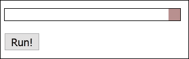

如果我们从浏览器（如 Firefox）的 DOM 检查器中查看这个动画的轮廓，它看起来可能就像这个截图：

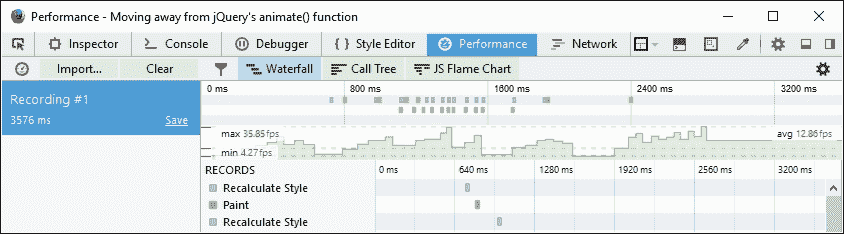

虽然数字并不关键，但关键点在于两条绿色的虚线，以及结果显示出高度的不一致活动。这是一个很好的指标，表明活动是断断续续的，帧数低，导致动画跳跃且不够 100% 平滑。

然而，好消息是，有一些选项可以帮助提供更平滑的动画；在转向使用 PostCSS 之前，我们将简要地查看一些可用的选项。现在，让我们迈出第一步，开始减少对 `.animate()` 或 jQuery 的依赖，从查看减少对 `.animate()` 或 jQuery 的使用选项开始。

# 离开 jQuery

动画内容可能是一个有争议的话题，尤其是如果使用了 jQuery 或 JavaScript——如果我们对 100 个人进行一次简单的民意调查，询问他们使用的是哪种技术，我们可能会得到各种各样的答案！一个关键的回答是“视情况而定”，这很可能会出现在答案列表的前列；许多人会争论说，内容动画应该使用 CSS 来完成，而其他人则会肯定基于 JavaScript 的解决方案仍然有价值。

把那场……我们可以说……热烈的辩论放在一边，如果我们想要摆脱使用 jQuery，特别是 `.animate()`，那么我们有一些选项可供选择：

+   升级您的 jQuery 版本！是的——这听起来可能与我们本章的主题相矛盾，但 jQuery 的最新版本引入了 `requestAnimationFrame` 的使用，这提高了性能，尤其是在移动设备上。

+   一种快速且简单的方法是使用 jQuery Animate Enhanced 插件，可在 [`playground.benbarnett.net/jquery-animate-enhanced/`](http://playground.benbarnett.net/jquery-animate-enhanced/) 获取；虽然有点过时，但它仍然发挥着有用的作用。它会在可能的情况下将 `.animate()` 调用转换为 CSS3 等效，但无法转换所有调用，因此未转换的调用将保持为 `.animate()` 调用。

+   使用相同的原理，我们甚至可以利用 JavaScript 动画库 GSAP——Greensock 团队提供了一个插件（来自 [`greensock.com/jquery-gsap-plugin`](https://greensock.com/jquery-gsap-plugin)），该插件用他们自己的 GSAP 库替换了 `jQuery.animate()`。据说后者比标准的 jQuery 快 20 倍！只要稍加努力，我们就可以重新编写现有的代码——在用 `.animate()` 代替的情况下，我们可以将等效的 CSS3 样式添加到我们的样式表中，并将现有的 `.animate()` 调用替换为 `.removeClass()` 或 `.addClass()`，视情况而定。

+   我们可以切换到使用库，如 Transit ([`ricostacruz.com/jquery.transit/`](http://ricostacruz.com/jquery.transit/))，它仍然需要使用 jQuery，但比使用标准的 `.animate()` 命令性能更好。

+   另一个替代方案是 Jonathan Shapiro 的 Velocity JS，可在 [`julian.com/research/velocity/`](http://julian.com/research/velocity/) 获取；这个方案的好处是不依赖于 jQuery。甚至有传言说将库的全部或部分集成到 jQuery 中，作为 `.animate()` 的替代——更多详情，请查看问题日志 [`github.com/jquery/jquery/issues/2053`](https://github.com/jquery/jquery/issues/2053)。

许多人自动认为 CSS 动画比 JavaScript（甚至 jQuery）更快。毕竟，我们不需要调用外部库（jQuery）；我们可以使用浏览器中已经内置的样式，对吧？但事实并非如此简单——简而言之，正确使用任何一种方法都将取决于你的需求和每种方法的限制。例如，CSS 动画非常适合简单的状态变化，但如果需要排序，那么你可能不得不求助于使用 JavaScript 路径。

然而，关键不在于使用的方法，而在于屏幕上每秒显示的帧数。大多数人无法区分 60FPS 以上的画面——这会产生非常平滑的体验。任何低于大约 25FPS 的画面都会产生模糊，偶尔还会出现卡顿——这取决于我们选择最佳方法，以产生最有效的解决方案。

### 小贴士

要查看帧率的差异，请查看 [`frames-per-second.appspot.com/`](https://frames-per-second.appspot.com/)——这个页面上的动画可以控制；很容易看出为什么 60FPS 会产生更优越的体验！

那么，我们应该选择哪条路径呢？好吧，在接下来的几页中，我们将简要地查看这些选项中的每一个。在这个时候，你可能正在想，“这与 PostCSS 有什么关系呢，毕竟这是本书的主题？”

简而言之，它们都是改进动画运行方式或允许我们移除对 `.animate()` 依赖的方法，我们知道这并不高效！诚然，一些这些替代方案仍然使用 jQuery，但关键在于你的现有代码可以使用这些方法中的任何一种或它们的组合。在本章的后面部分，我们将探讨如何开始移除 jQuery，并更多地关注使用 PostCSS 插件系统来使用 CSS3 动画。

### 注意

值得注意的是，接下来的几页中的所有演示都是在运行 YouTube 视频的同时进行的；这是为了帮助模拟一点负载，以获得更真实的比较。在负载下运行动画意味着可用的图形处理能力更少，这会导致帧率计数降低。

让我们从查看我们的第一个选项，`Transit.js` 库开始。

## 使用 Transit.js 动画内容

在一个理想的世界里，我们构建的任何项目都将尽可能少地依赖外部库；这同样适用于基于 JavaScript 或 jQuery 的内容，也适用于 CSS 样式。

为了帮助减少依赖，我们可以使用像 TransitJS 或 Velocity 这样的库来构建我们的动画。关键在于利用这些库创建的动画，作为应用样式的基础，然后我们可以使用`.addClass()`或`.removeClass()`来操作这些样式。为了说明这一点，让我们通过一个简单的演示来探索这个概念：

1.  我们首先打开`animate.html`的副本——为了简化，我们需要将`square-small`的引用从类更改为选择器：

    ```js
    <div id="square-small"></div>
    ```

1.  接下来，在`</head>`标签之前立即添加对 Transit 库的引用：

    ```js
    <script src="img/jquery.transit.min.js"></script>
    ```

1.  Transit 库使用稍微不同的语法，所以请按照指示更新对`.animate()`的调用：

    ```js
    smallsquare.transition({x: 280}, 'slow');
    ```

保存文件，然后在浏览器中预览结果——如果一切顺利，我们应该在演示中看到没有实质性的变化：

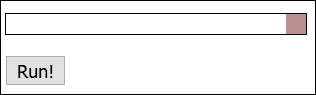

然而，动画将更加平滑——帧数更高，达到 44.28FPS，下降的次数更少：

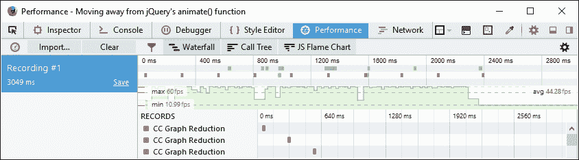

让我们比较一下本章前面*重新审视基本动画*部分所取的相同配置文件截图——您注意到什么了吗？

分析浏览器活动可能很复杂，但我们只需要关注两件事：FPS 值和绿色线的状态。FPS 值，即每秒帧数，是原来的三倍多，而且大部分时间绿色线更加一致，下降的次数更少，持续时间更短。

这意味着我们有一个更平滑、更一致的性能；大约 44FPS 的平均帧率比使用标准的 jQuery 要好得多——但我们仍然在使用 jQuery！

然而，有一个区别——像 Transit 或 Velocity 这样的库会将动画尽可能转换为 CSS3 等价物——如果我们查看底层，我们可以看到这一点：

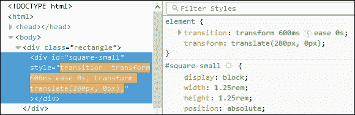

我们可以利用这一点，通过移除使用`.animate()`的需求，直接使用`.addClass()`或`.removeClass()`——我们将在本章后面的*使用 jQuery 切换类*部分看到这一点。

### 小贴士

如果您想比较使用 Transit 或 Velocity 时我们的简单动画，代码下载中提供了示例，分别是演示`T35A`和`T35B`。

为了更进一步，我们可以使用 Velocity 库创建一个使用纯 JavaScript 的版本——我们将在下一个演示中看到如何实现。但请注意——这并不是继续使用 JavaScript 的借口；正如我们将看到的，帧数之间的差异很小！

## 使用纯 JavaScript 进行动画

许多开发者习惯于使用 jQuery——毕竟，它使得引用页面上的任何元素都变得非常简单！然而，有时在原生 JavaScript 中工作可能更可取；这可能是为了速度。如果我们只需要支持较新的浏览器（如 IE11 或 Edge，以及 Chrome 或 Firefox 的最新版本），那么添加 jQuery 作为依赖项并不总是必要的。

Transit（或 Velocity）等库的优点在于，我们不必总是使用 jQuery 就能达到相同的效果；正如我们很快将看到的，移除 jQuery 可以帮助改善情况！让我们来测试一下，并将之前的示例修改为不使用 jQuery：

1.  我们首先从本书附带的代码下载中提取`T35B`文件夹的副本。将其保存到我们的项目区域根目录下。

1.  接下来，我们需要编辑此文件夹内`animate.html`的副本——请移除 jQuery 的链接，然后移除`velocity.ui.min.js`的链接；我们应该在文件的`<head>`中留下以下内容：

    ```js
      <link rel="stylesheet" type="text/css" href="css/style.css">
      <script src="img/velocity.min.js"></script>
    </head>
    ```

1.  在下面一点，按照所示修改`<script>`块：

    ```js
      <script>
        var smallsquare = document.getElementById('square-small');
        var animbutton = document.getElementById('animation-button'); 
        animbutton.addEventListener("click", function() {
          Velocity(document.getElementById('square-small'), {left: 280}, {duration: 'slow'});
        });
    </script>
    ```

1.  保存文件后，在浏览器中预览结果——如果我们使用 DOM 检查器监控我们示例的性能，我们可以在我们的示例中看到类似的帧率：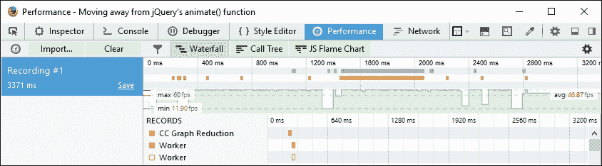

由于 jQuery 作为依赖项不再存在，我们可以清楚地看到帧率有所提高；然而，缺点是，对某些浏览器（如 IE8 或 9）的支持减少了。这可能不会成为你网站的问题——微软和 jQuery 核心团队都已宣布将停止支持`IE8` - `10`和`IE8`，这将有助于鼓励用户升级到较新的浏览器。

虽然说，出于速度和尽可能保持页面轻量化的考虑，使用 CSS3 是首选，但使用 Velocity 确实提供了一系列额外的机会，这些机会可能对你的项目有所帮助。不过，关键在于仔细考虑你是否真的需要它们，或者 CSS3 是否足够，并允许你使用 PostCSS。

## 使用 jQuery 切换类

到目前为止，有一个问题浮现在脑海中：关于基于类的动画怎么办？我的意思是，放弃对外部动画库的任何依赖，并切换到使用纯 jQuery 的`.addClass()`或`.removeClass()`方法。

从理论上讲，这听起来是个不错的想法——我们可以消除使用`.animate()`的需求，只需根据需要切换类即可，对吧？嗯，这是一个改进，但它仍然低于使用纯 JavaScript 和切换类的方法。这归结为使用 jQuery 的便捷性来引用元素与纯 JavaScript 的速度之间的权衡：

1.  我们将首先打开之前练习中的`animate.html`副本——首先，请在我们文档的`<head>`中用以下行替换对 Velocity.JS 的调用：

    ```js
    <script src="img/jquery.min.js"></script>
    ```

1.  接下来，请移除`<script>`标签之间的代码，并用以下内容替换：

    ```js
    var smallsquare = $('.rectangle').find('.square-small');
    $('#animation-button').on("click", function() {
          smallsquare.addClass("move");

          smallsquare.one('transitionend', function(e) {
            $('.rectangle').find('.square-small')
            .removeClass("move");
          });
        });
    ```

1.  保存文件——如果我们在一个浏览器中预览结果，我们应该看到演示看起来没有明显的变化，但过渡比使用 jQuery 和 Transit 的组合性能更好：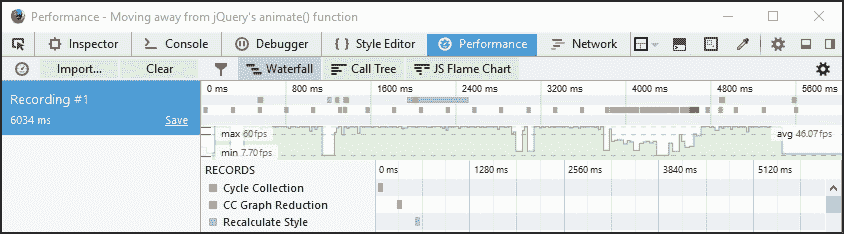

尽管如此，如果我们使用 DOM 检查器查看底层代码，真正的代码变化将变得明显：

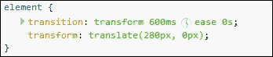

我们不是使用`.animate()`，而是使用 CSS3 动画样式来移动我们的`square-small <div>`。大多数浏览器都会接受使用过渡和变换，但值得通过像 Autocomplete 这样的过程运行我们的代码，以确保我们为代码应用正确的供应商前缀。

在这里使用 CSS3 的优点是，虽然它可能不适合大型、复杂的动画，但我们至少可以开始使用外部样式表，如`Animate.css`，或者甚至使用预处理器如 SASS 来创建我们的样式。

这是一个很容易做出的改变，所以无需多言，作为我们使用 PostCSS 旅程的下一步，让我们更详细地看看这一点。

### 小贴士

如果你想要创建基于关键帧的自定义动画，那么请查看[`cssanimate.com/`](http://cssanimate.com/)，它提供了一个基于 GUI 的界面来设计它们，并在请求时输出适当的代码。

# 利用预构建库

到目前为止，我们所有的动画都有一个共同点——它们是单独创建的，并且存储在每个项目相同样式的同一样式表中。

这将完美工作，但我们能做得更好——毕竟，我们可能会创建出其他人已经构建的动画！随着时间的推移，我们也可能积累一系列动画，这些动画可以成为库的基础，该库可以用于未来的项目。

已经有许多开发者这样做。一个值得注意的例子是由 Dan Eden 创建的`Animate.css`库。了解这个库是值得的，因为我们在本书中稍后将使用它作为 PostCSS 的 postcss-animation 插件。在此期间，让我们快速演示它是如何工作的，作为在 PostCSS 中使用它的先导。

### 注意

在这个演示中使用的图像直接引用自 LoremPixem 网站，作为占位符图像。

让我们开始：

1.  我们将首先从本书附带的代码下载中提取`T37`文件夹的副本——将文件夹保存到我们的项目区域。

1.  接下来，打开一个新文件并添加以下代码：

    ```js
    body { background: #eee; }

    #gallery {
      width: 745px;
      height: 500px;
      margin-left: auto;
      margin-right: auto;
    }

    #gallery img {
      border: 0.25rem solid #fff;
      margin: 20px;
      box-shadow: 0.25rem 0.25rem 0.3125rem #999;
      float: left;
    }

    .animated {
      animation-duration: 1s;
      animation-fill-mode: both;
    }

    .animated:hover {
      animation-duration: 1s;
      animation-fill-mode: both;
    }
    ```

1.  将其保存为`style.css`，在`T37`文件夹内的`css`子文件夹中。

1.  在浏览器中预览结果——如果一切顺利，我们应该看到类似于以下截图的内容：

如果我们运行演示，应该会看到图像通过不同类型的动画运行——这里没有什么特别或复杂的地方；然而，问题是，这一切是如何与 PostCSS 结合起来的？

嗯，这有一个很好的原因——有些开发者以前使用过`Animate.css`，并且熟悉它是如何工作的；我们稍后也会在*更新代码以使用 PostCSS*中使用`postcss-animation`插件，它基于`Animate.css`样式表库。对于那些不熟悉样式表库的你们，让我们快速了解一下它的工作原理，在演示的上下文中。

## 分析我们的演示代码

我们演示中使用的效果非常引人注目——确实，有人可能会认为它们需要大量的复杂 JavaScript！

然而，这与事实相去甚远——`Animate.css`文件包含了许多基于`@keyframe`的动画，类似于这个：

```js
@keyframes bounce {
  0%, 20%, 50%, 80%, 100% {transform: translateY(0);}
  40% {transform: translateY(-1.875rem);}
  60% {transform: translateY(-0.9375rem);}
}
```

我们使用常规的库调用方法，在代码的`<head>`部分引入动画。然后我们可以在代码中通过名称调用任何动画：

```js
  <div id="gallery">
    <a href="#"></a>
...
  </div>
  </body>
```

你会注意到我们在代码中添加了`.animated`类——这控制了动画的持续时间和时机，并按照添加到代码中的动画名称来设置。

不使用 JavaScript（或 jQuery）的缺点是，当演示加载时动画只会运行一次；我们可以通过给被动画化的元素添加`.infinite`类来让它连续运行（这是 Animate 库的一部分）。我们可以在 CSS 中模拟点击选项，但这是一种实验性的技巧，并不支持所有浏览器——要实现任何形式的控制，我们实际上需要使用 JavaScript（甚至 jQuery）！

### 注意

如果你对这个技巧的细节感兴趣，那么请查看 Stack Overflow 上的这个回答，[`stackoverflow.com/questions/13630229/can-i-have-an-onclick-effect-in-css/32721572#32721572`](http://stackoverflow.com/questions/13630229/can-i-have-an-onclick-effect-in-css/32721572#32721572)。

好的，继续前进：我们已经介绍了预构建库的基本用法，例如 Animate。现在是时候提升一个档位，过渡到 PostCSS。作为开始，我们将使用 Gulp 作为我们的任务运行器，配合 SASS。后者是一个完美的选择，因为它与我们在本章后面将要使用的插件相匹配。让我们看看为我们的 PostCSS 转换打下基础需要哪些内容。

# 转向使用 SASS

作为开发者或设计师，如果我们的开发工作流程包括使用 SASS，那么使用这样的混入函数来构建我们的样式的诱惑是存在的：

```js
@mixin transition ($value...) {
  @if length($value) >= 1 { // If we set value
    @include prefixer($property: transition, $value: $value);
  } @else { // If value is not set, return default value
    @include prefixer($property: transition, $value: all 0.15s ease-in 0.05s);
  }
}
```

这并没有什么问题，但如果我们需要使用不仅仅是少量的话，管理我们的混入函数将需要付出努力！更简单的选择是探索使用预构建的动画库，作为减少我们开发工作量的方式。

有许多开发者创建了用于处理动画的 mixin 库；一个完美的例子是 Geoff Graham 的 Animate 的 SASS 版本，可在[`github.com/geoffgraham/animate.scss`](https://github.com/geoffgraham/animate.scss)下载。

然而，当我们与 mixin 一起工作时，我们必须注意一些事情——使用它们来管理供应商前缀真是太容易了，比如这样：

```js
@mixin prefixer($property, $value) {
  -webkit-#{$property}: $value; // Attach webkit prefix (Chrome, Safary, Some Android native browsers)
  -moz-#{$property}: $value; // Attach moz prefix (FireFox)
  -o-#{$property}: $value; // Attach o prefix (Opera)
  #{$property}: $value; // no prefix (modern browsers and latest IE versions)
}
```

虽然在代码编译时会添加相关的供应商前缀，但这**并不**被认为是最佳实践。

我们的责任是确保每个动画都包含所有相关的供应商前缀——即使我们用心良苦，这也是一个挑战！还有添加不会产生任何效果规则的问题——例如，添加`–o`作为过渡的前缀是没有意义的；这个前缀不再需要。

幸运的是，有一种更好的方法来处理前缀——我们可以使用 Autoprefixer（来自[`twitter.com/autoprefixer`](https://twitter.com/autoprefixer)）来自动为我们处理供应商前缀。Autoprefixer 的伟大之处在于它使用 Can I Use ([`www.caniuse.com`](http://www.caniuse.com))数据库来保持信息的更新。

有各种插件可供使用，允许我们使用任务运行器，如 Grunt 或 Gulp。当然，我们可以使用独立的基于 GUI 的编译器来完成这个目的，但为什么要在可以使用任务运行器提供更多功能的时候运行这样的东西呢？我们甚至可以使用几个插件中的任何一个来在运行新的编译之前移除供应商前缀——这将确保移除任何冗余的前缀。

考虑到这一点，让我们来实际操作一下。在接下来的演示中，我们将构建一个简单的画廊效果，展示我们之前看到的相同动画，但这次使用`Animate.css`的 SASS 版本。我们将使用 Gulp 作为我们的任务运行器来编译 SASS 代码，然后添加源映射，检查代码的一致性，添加供应商前缀等等。你明白我的意思！

话不多说，我们可以使用任务运行器做很多事情，所以让我们开始构建我们的画廊吧。

## 创建一个动画画廊

动画内容可能是一把双刃剑。如果使用得当，它真的可以将网站提升到下一个层次。如果做得不好，那么网站的访问量可能会急剧下降！

在我们上一个演示中，我们构建了一个简单的画廊效果——这更多的是为了展示我们可以添加的不同类型的动画效果，而不是制作出能获奖的东西。在接下来的几页中，我们将继续我们的演示，但这次将重新配置它以使用`Animate.css`的 SASS 版本。我们还将介绍使用任务运行器来编译我们的代码——因为这是使用 PostCSS 的要求，这似乎是一个开始使用它的完美时机，作为我们过渡到使用动画和 PostCSS 的最后一部分。

### 注意

本教程的文件位于附带的代码下载中的 `T38` 文件夹中。

不再拖延，让我们将更改添加到我们之前的演示中：

1.  我们需要下载 Animate 的 SASS 版本——它可以从 [`github.com/geoffgraham/animate.scss/archive/master.zip`](https://github.com/geoffgraham/animate.scss/archive/master.zip) 获取。请继续操作，将 `Animate.scss-master` 文件的内容提取到我们项目区域的根目录下的 `src` 文件夹中。

1.  在 `src` 文件夹中，将 `Animate.scss` 文件重命名为 `_animate.scss`——这是为了表明它是一个 **部分**，这防止了 SASS 编译器将其编译为单独的文件。

1.  在 `src` 文件夹中，请将其重命名为 `style.scss`——这将其更改为一个 SASS 文件，这在练习的后续编译中是必需的。我们的 `src` 文件夹中应该有类似以下截图的内容：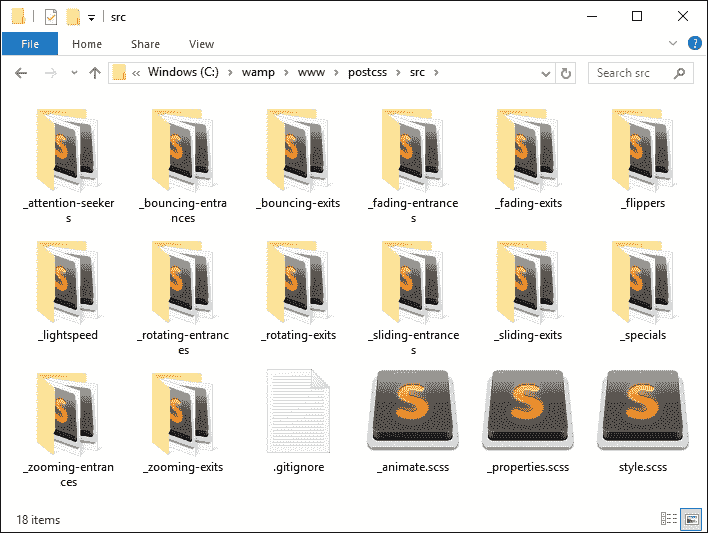

1.  请继续打开 `style.scss` 文件。在底部，将此行添加到样式表的顶部：

    ```js
    @import "_animate.scss";
    ```

1.  接下来，在样式表的末尾添加以下附加行——这些行从 `Animate.css` 的 SASS 版本中引入动画；时间也被延长到五秒，因为原始示例太快了：

    ```js
    .bounce { @include bounce(); }
    .flip { @include flip(); }
    .hinge { @include hinge(); }
    .flash { @include flash(); }
    .shake { @include shake(); }
    .swing { @include swing(); }

    .animated:hover {
      animation-duration: 5s;
      animation-fill-mode: both;
    }

    ```

1.  保存文件，然后将 `T38` 文件夹下 `src` 文件夹的内容复制到我们项目区域的根目录下的 `src` 文件夹中——我们很快将编译此文件。

1.  在一个新文件中，请继续添加以下代码，然后将其保存为 `gulpfile.js` 到我们项目区域的根目录——这将形成我们的 gulp 文件，我们将使用它来编译我们的代码：

    ```js
    'use strict';

    var gulp = require('gulp');
    var postcss = require('gulp-postcss');
    var sass = require('gulp-sass');

    gulp.task('sass', function () {
      return gulp.src('src/*.scss')
        .pipe(sass().on('error', sass.logError))
        .pipe(gulp.dest('dest/'));
    });

    gulp.task('default', ['sass']);

    var watcher = gulp.watch('src/*.scss', ['sass']);
    watcher.on('change', function(event) {
      console.log('File ' + event.path + ' was ' + event.type + ', running tasks...');
    });
    ```

1.  我们还需要一个 `package.json` 文件——这个文件将存储我们将要使用的插件详情。目前，我们将限制自己使用 `gulp-sass`，但很快就会改变！请继续操作，将以下行添加到一个新文件中，并将其保存为 `package.json`，位于我们项目区域的根目录：

    ```js
    {
      "name": "postcss",
      "version": "1.0.0",
      "description": "Configuration file for PostCSS",
      "main": "index.js",
      "scripts": {
        "test": "echo \"Error: no test specified\" && exit 1"
      },
      "author": "Alex Libby",
      "license": "ISC",
      "dependencies": {
        "postcss": "⁵.0.8"
      },
      "devDependencies": {
        "gulp": "³.9.0",
        "gulp-postcss": "⁶.0.0",
        "gulp-sass": "².1.1"
      }
    }
    ```

1.  眼尖的你们应该注意到我们没有安装 gulp-sass 插件。现在让我们通过启动一个 Node.js 命令提示符，然后更改工作目录到项目区域来解决这个问题。请从提示符中运行以下命令：

    ```js
    npm install gulp-sass --save-dev

    ```

1.  在提示符中，输入 `gulp` 然后按 Enter 键——Gulp 将现在消失并编译我们的文件；如果一切顺利，我们应该在我们的项目区域的 `dest` 文件夹中看到一个编译后的样式表。

1.  到目前为止，尝试在浏览器中运行 `animate.html`——如果一切顺利，我们应该看到我们的画廊效果没有变化，但可以放心，我们现在正在使用 `Animate.css` 的 SASS 版本。

我们的演示已经转换为使用`Animate.scss`——我们本可以选择使用任何一种编译器（例如 Koala—[`www.koala-app.com`](http://www.koala-app.com)），但选择使用 Gulp。它作为过渡到使用 PostCSS 的完美途径——正如我们在早期的演示中所见，我们已经使用 Gulp 作为任务运行器来完成这个目的。这允许我们逐步过渡——当所有的 SASS 元素都转换为后，我们只需从 gulp 文件中删除任务即可完成过渡。

## 添加完成 touches

那么，接下来是什么？我们已经创建了一个基本的 gulp 任务文件，我们用它来编译我们的 SASS 代码到有效的样式。

但这只是故事的一小部分；我们需要添加更多内容，使我们的编译过程变得有用，并准备好转换为使用 PostCSS。

让我们开始吧：

1.  我们需要做的第一个更改是在`package.json`文件中——请立即添加突出显示的行：

    ```js
        "cssnano": "³.2.0",
        "gulp": "³.9.0",
        "gulp-postcss": "⁶.0.0",
        "gulp-rename": "¹.2.2",
        "gulp-sass": "².1.1",
        "gulp-sourcemaps": "¹.5.2",
        "postcss-reporter": "¹.3.0",
        "stylelint": "².3.7"
      }
    }
    ```

1.  接下来，我们需要配置我们的 gulp 文件以添加一些额外的任务——第一个任务是添加对一些我们在本书早期已经使用过的额外插件的引用。请立即添加以下突出显示的行：

    ```js
    var sass = require('gulp-sass');
    var autoprefixer = require('autoprefixer');
    var cssnano = require('cssnano');
    var sourcemaps = require('gulp-sourcemaps');
    var rename = require('gulp-rename');
    var stylelint = require('stylelint');
    var reporter = require('postcss-reporter');
    ```

1.  在添加了额外的插件引用后，我们现在需要添加额外的任务——在 SASS 任务下方立即添加此任务；这管理着我们的代码的 linting，以确保一致性：

    ```js
    gulp.task("lint-styles", ['sass'], function() {
      return gulp.src("dest/*.css")
        .pipe(postcss([ stylelint({
          "rules": {
            "color-no-invalid-hex": 2,
            "declaration-colon-space-before": [2, "never"],
            "indentation": [2, 2], 
            "number-leading-zero": [2, "always"]
          }
        }),
        reporter({
          clearMessages: true,
        })
      ]))
    });
    ```

1.  立即将此任务添加到上一个步骤下方——这将在压缩过程中重命名文件：

    ```js
    gulp.task('rename', ['lint-styles'], function () {
      return gulp.src('dest/*.css')
        .pipe(postcss([ cssnano() ]))
        .pipe(rename('style.min.css'))
        .pipe(gulp.dest("dest/"));
    });
    ```

1.  我们接下来的 gulp 任务负责生成源映射——这可以在 SASS 中自动完成，但使用单独的插件可以在编译过程中提供灵活性。请立即将此任务添加到上一个任务下方：

    ```js
    gulp.task('sourcemap', ['rename'], function () {
      return gulp.src('dest/*.css')
        .pipe(sourcemaps.init())
        .pipe(sourcemaps.write('maps/'))
        .pipe(gulp.dest("dest/"));
    });
    ```

1.  我们几乎完成了——请按照指示更改这些行：

    ```js
    gulp.task('default', ['sass', 'lint-styles', 'rename', 'sourcemap']);

    var watcher = gulp.watch('src/*.scss', ['sass', 'lint-styles', 'rename', 'sourcemap']);
    watcher.on('change', function(event) {
      console.log('File ' + event.path + ' was ' + event.type + ', running tasks...');
    });
    ```

1.  保存文件。请启动 Node.js 命令提示符，然后更改工作文件夹到我们的项目区域。

1.  在提示符下，键入`gulp`然后按*Enter*——Gulp 将退出并编译我们的文件。

1.  如果我们查看`dest`文件夹，应该会看到相同的编译后的`style.css`文件，但这次还有源映射和样式表的压缩版本：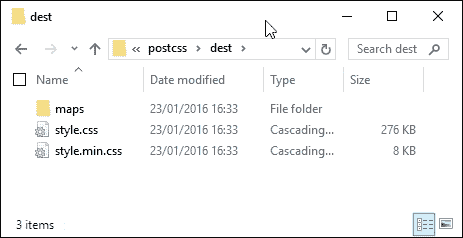

如果我们预览我们的工作结果，我们应该看到在演示中没有功能上的变化，但可以放心，我们现在有可用的文件压缩版本——毕竟，在生产环境中始终使用压缩文件更好！

我们现在已经为我们的 PostCSS 转换奠定了基础——那些细心的读者应该已经注意到，PostCSS 的插件引用已经添加到我们的 gulp 文件中，为转换过程的下一阶段做好了准备。现在，我们的 gulp 文件中一切就绪，除了 SASS 任务——在适当的时候，我们将移除 SASS 任务，并用 PostCSS 的等效任务替换它；这将在我们的下一个练习中进行。在我们这样做之前，花点时间探索 PostCSS 生态系统内可用的功能是值得的——尽管提供的选项不多，我们仍然可以在 PostCSS 中生成可用的编译代码。

# 转向使用 PostCSS

好吧……是时候做出改变，转向 PostCSS 了！

在我们开始探索可用的功能之前，有一个关键问题我确信你们会问——既然这本书明显是关于 PostCSS 的，我们为什么还在探索使用 JavaScript 进行动画？

对于这个问题有一个非常好的答案——我们不仅正在探索可能采取的不同路线以过渡到 PostCSS，而且在更基本层面上，我们是否能够进行这种改变。这听起来可能有些矛盾，让我来解释一下：

动画的一个关键限制是 FPS 计数，即每秒帧数——jQuery 的标准`.animate()`方法臭名昭著地慢，并且没有针对速度进行优化。本章开头我们的动画的 FPS 计数显著低于 Velocity。同样适用于我们在本章早些时候也介绍过的替代 Transit 库。

转向使用 CSS 将提高帧率，但基于 CSS 的动画还不足以处理复杂的动画。这意味着作为开发者，我们必须评估项目的任何需求，权衡基于 CSS 的动画是否可行，或者我们是否需要回退到使用基于 JavaScript 的库。

这同样适用于使用 PostCSS——对于项目来说，使用基于 CSS 的动画可能很有吸引力，但这只会在我们的动画需求不会导致过于复杂、难以管理的解决方案时才有效。

# 探索 PostCSS 中的插件选项

假设 CSS3 动画适合我们的项目，那么我们现在可以开始过渡到使用 PostCSS。

如果你们期待看到一系列插件，那么很抱歉让你们失望——目前，只有四个插件可用于动画：

+   **动画**：可在[`github.com/zhouwenbin/postcss-animation`](https://github.com/zhouwenbin/postcss-animation)找到，这个插件添加了来自`Animate.css`的`@keyframes`。此插件使用[`github.com/zhouwenbin/postcss-animation-data`](https://github.com/zhouwenbin/postcss-animation-data)，它托管了转换后的动画。

+   **PostCSS Easings**：可以从[`github.com/postcss/postcss-easings`](https://github.com/postcss/postcss-easings)下载，这个插件将[`www.easings.net`](http://www.easings.net)上的缓动名称转换为`cubic-bezier()`等效值。

+   **PostCSS Transform Shortcuts**：此插件允许我们在创建转换语句时指定单个值——此插件的源代码可以从[`github.com/jonathantneal/postcss-transform-shortcut`](https://github.com/jonathantneal/postcss-transform-shortcut)获取。

+   **PostCSS MQ Keyframes**：此插件将任何在媒体查询内部的 keyframes 移动到我们的 CSS 文件底部。

对于如此有限的插件范围，人们可能会想知道它能做什么！不过，我们稍后会继续添加到列表中。在章节的末尾，我们将创建一个`postcss-animation-data`插件的版本，允许我们使用来自[`www.minimamente.com/example/magic_animations/`](http://www.minimamente.com/example/magic_animations/)的 Magic 动画。

好的，让我们开始使用一些这些工具：现在是时候进行演示了！

# 更新代码以使用 PostCSS

虽然 PostCSS 生态系统目前还没有大量基于动画的插件，但这不应该阻止我们使用它来编译我们的动画样式。为了证明这一点，我们将修改之前演示的 jQuery 和.add/remove 类版本——我们将使用 PostCSS 从 Dan Eden 创建的`Animate.css`库中添加动画缓动。

我们需要的插件是`postcss-animation`插件，它可以从[`github.com/zhouwenbin/postcss-animation`](https://github.com/zhouwenbin/postcss-animation)获取，并使用来自[`github.com/zhouwenbin/postcss-animation-data`](https://github.com/zhouwenbin/postcss-animation-data)的`postcss-animation-data`插件。安装这个插件非常简单，它使用的方法与我们迄今为止安装的所有其他插件相同。

让我们开始演示：

1.  我们将首先安装`postcss-animation`插件——为此，请打开一个 Node.js 会话，然后更改工作目录到我们的项目区域。

1.  在提示符中输入以下命令并按 Enter 键：

    ```js
    npm install postcss-animation --save-dev

    ```

    如果一切顺利，我们应该会看到插件安装成功：

    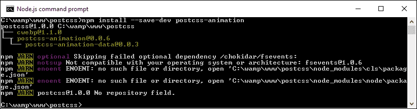

1.  从本书附带的代码下载中，提取并保存`T39`文件夹的内容到我们的项目区域——我们将以此为基础转换为 PostCSS。

1.  从教程文件夹的`css`子文件夹中打开`style.css`文件，然后在底部，按照指示修改`.move`规则：

    ```js
    .move {
      animation-name: bounce;
      transform: translate(17.5rem, 0rem);
      transition-duration: 3.5s;
    }
    ```

1.  将此文件保存到`src`文件夹中，然后启动 Node.js 命令提示符，并将工作文件夹更改为我们的项目区域。

1.  在提示符中输入`gulp`然后按 Enter 键——如果一切顺利，我们应该会在`dest`文件夹中看到这些文件：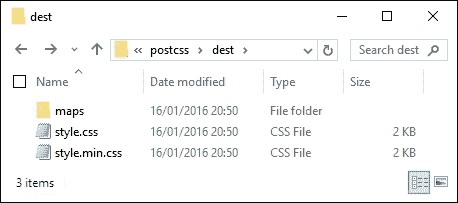

1.  最后一步是将此文件夹的内容复制到`T39`文件夹中的`css`文件夹内。

到目前为止，我们已经准备好测试我们的演示——如果我们尝试预览我们工作的结果，我们应该看到我们的演示外观没有变化，但可以放心，我们现在正在使用 PostCSS 编译我们的代码。

## 测试我们的修改后的代码

虽然我们可能看不到我们的演示外观有任何变化，但它的行为肯定会有所不同。为了查看这一点，我们需要查看我们的演示背后的代码。

对于这个演示，我们添加了一个动画名称属性，并将其命名为`bounce`；当编译时，PostCSS 会在代码中添加适当的`@keyframes`规则：

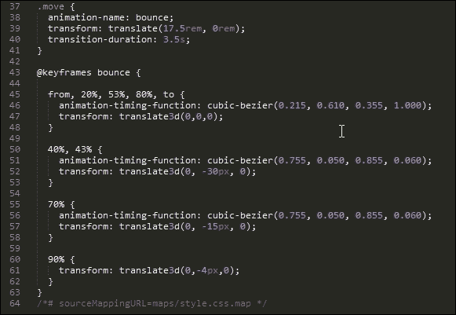

那么，如果我们看看性能，它如何比较？即使分配了额外的动画属性，与使用标准的`.animate()`相比，它仍然能拉出一个令人尊重的帧率 48.29FPS：

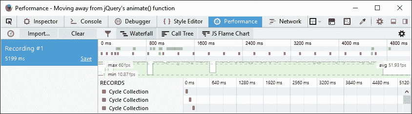

这有助于加强这样一个观点：在可能的情况下，我们可以通过移除代码中对`.animate()`的任何依赖来提高性能。使用 CSS 样式来动画化内容还远未准备好取代 JavaScript，但它正在慢慢接近！

好的，我们继续前进：我们简要地探讨了各种动画内容的方法；现在是时候过渡到使用 PostCSS 了。你见过多少次表单显示每个字段的标签位于上方或左侧的情况？当然，看久了会感到无聊，看到同样的老设计！这很容易改变，所以没有不这么做的理由。为了证明这一点，我们将使用 PostCSS 在字段获得焦点时将每个标签向上滑动。是的，你没听错…*向上滑动*。让我们看看我们如何为任何网站提供对这个备受推崇的功能的新视角。

# 在 PostCSS 中创建一个演示

作为之前练习的后续思考，我提出了问题：“你见过多少次表单显示标签位于字段上方或右侧的情况？”如果我为每个答案收集一角硬币，我怀疑我可能会在一个异国岛屿上，富有，而且无忧无虑——我已经数不清见过这种表单的次数，更不用说其他使用互联网的人了！

没有任何理由让表单平淡无奇。为了证明这一点，我们将创建一个简单的演示，使用由 Jonathan Neal 提供的`postcss-transform-shortcut`插件，可在[`github.com/jonathantneal/postcss-transform-shortcut`](https://github.com/jonathantneal/postcss-transform-shortcut)获取。这是一个简单的插件，允许我们指定单个属性，该插件将它们组合成我们样式表中的一行代码。让我们快速安装它：

1.  首先，启动一个 Node.js 命令提示符会话，然后更改工作文件夹到我们的项目区域。

1.  在提示符中，输入此命令，然后按 Enter 键：

    ```js
    npm install postcss-transform-shortcut --save-dev

    ```

1.  Node 现在将安装插件——当完成时，它将返回到一个闪烁的提示。

没有必要进行配置，尽管在我们可以使用它之前，我们必须完成一个小任务。

## 更新插件

在为本书进行研究时，我发现当前版本（1.0.0）中存在一个问题，即如果样式表中有多个规则，则无法正确编译；有时插件可能或可能不会在您的环境中工作，这就是其中之一！

幸运的是，这是一个简单的修复——如果我们查看项目区域`node_modules`文件夹中的`postcss-transform-shortcut`文件夹，我们应该能看到这个：

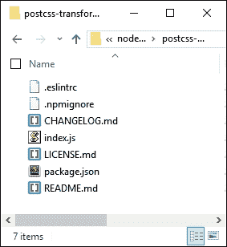

简单地复制[`raw.githubusercontent.com/pc035860/postcss-transform-shortcut/07af8a78d1fb5e7fdeebc8c7f56c0c9ecdd83efb/index.js`](https://raw.githubusercontent.com/pc035860/postcss-transform-shortcut/07af8a78d1fb5e7fdeebc8c7f56c0c9ecdd83efb/index.js)文件的内容，并将其直接粘贴到`index.js`的顶部；这应该可以解决该问题。

### 注意

这已经在开发者的 GitHub 网站上记录为一个问题，在[`github.com/jonathantneal/postcss-transform-shortcut/issues/4`](https://github.com/jonathantneal/postcss-transform-shortcut/issues/4)，如果您想了解更多关于这个问题的细节。

## 构建我们的演示

现在我们已经安装了更新的插件，我们可以继续构建我们的演示！下一个练习将是一个简单的信用卡表单——*我不建议*您在生产环境中使用它，因为这个表单纯粹是为了展示动画效果，并且没有与表单相关的任何安全措施！

除了这些，以下是使用 PostCSS 将要生成的截图：

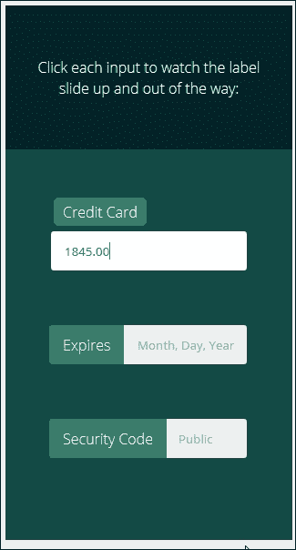

这是一个简单的演示，基于 Michael Arestad 创建的 codepen，您可以在[`codepen.io/MichaelArestad/pen/ohLIa`](http://codepen.io/MichaelArestad/pen/ohLIa)查看——我已经简化并重新制作了这个演示，以展示我们如何使用 PostCSS 将代码编译成有效的 CSS 样式。

好的，让我们开始设置我们的演示：

1.  我们将首先从本书附带的代码下载中提取`T40 – Creating a demo in PostCSS`文件夹的副本；将其保存到我们的项目区域。

1.  在文件夹内部，将`package.json`和`gulpfile.js`文件移动到项目区域的根目录。

1.  在`css – completed versions`文件夹中，将`style – pre-compile version.css`复制到`src`文件夹，并重命名为`style.css`。

1.  接下来，启动一个 Node.js 命令提示符会话，然后更改工作文件夹到我们的项目区域。

1.  在提示符下，输入 gulp，然后按 Enter 键——PostCSS 将消失并编译我们的代码；如果一切顺利，我们应该在`dest`文件夹中看到编译后的样式表文件和`source maps`。

1.  将`dest`文件夹的内容复制到原始`T40 – Creating a demo in PostCSS`文件夹中的`css`文件夹。

1.  好吧，先预览一下结果——如果一切顺利，我们应该能看到我们在练习开始时展示的截图类似的内容。

这是一个简单的演示，但它展示了我们如何完美地使用动画——它为标签添加了微妙的视觉效果，并没有破坏我们表单的整体使用。使用该插件确实提出了几个有用的观点，所以让我们花点时间更详细地探索我们刚刚创建的内容。

## 更详细地剖析我们的演示

PostCSS 中成功插件的关键是遵循*1:1*原则——一个插件对应一个任务。`postcss-transform-shortcut`插件也不例外：它将构成过渡规则的各个元素按照正确的顺序组合在一起。为了理解我们的意思，请查看在编译之前的样式表中的这些行：

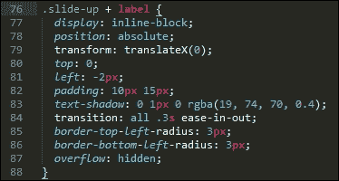

我们的`transform:`语句在哪里？嗯，当使用这个插件时，它是不需要的——相反，我们只需指定各种属性，如下所示：

```js
.transform {
  transform: skewX(25deg);
  rotate: 180deg;
  scale: 2 2;
  translate: 10px 10px;
}
```

插件被设置为识别这四个属性并将它们编译成一条单独的规则，如下面的代码摘录所示：

```js
.transform {
  transform: skewX(25deg) rotate3d(180deg,0,1) scale3d(2,2,1) translate3d(10px,10px,0px);
}
```

属性中的任何间隙都将自动用插件内的默认值填充。我们甚至可以使用这个插件作为创建等价过渡的基础——我们将在下一章的末尾这样做。

# 优化我们的动画

当处理动画时，可能会有需要使用自定义效果的情况；实现这一目标的一种方法是通过使用`@keyframes`。问题是，一些浏览器不支持在媒体查询中使用它们（是的，我在看你们，`IE10`和`IE11`！）。

你可能会问这会影响到我们什么？嗯，如果你正在构建任何响应式网站，那么这绝对是我们需要牢记的事情；媒体查询构成了任何响应式功能的基本结构。

尽管这是一个简单的修复，但开发者 Andy Walpole 创建了一个简单的 PostCSS 插件，名为`mq-keyframes`，可在[`github.com/TCotton/postcss-mq-keyframes`](https://github.com/TCotton/postcss-mq-keyframes)找到。

想象一下，在我们的样式表中我们有这样的代码：

```js
@media only screen and (min-width: 375px) {
  .custom-bounce {
    animation: side-bounce 5s;
  }

  @keyframes side-bounce {
    100% {
      opacity: 0;
    }
  }
}
```

插件所做的只是将代码移动到我们的样式表底部，这使得阅读更加容易，并允许 IE 继续正确工作：

```js
@media only screen and (min-width: 375px) {
  .pace {
    animation: pace-anim 5s;
  }
}

@keyframes pace-anim {
  100% {
    opacity: 0;
  }
}
```

这可能是 PostCSS 中最简单易用的插件之一，尤其是在处理动画内容时；如果你需要支持这些版本的 Internet Explorer，那么使用它是有价值的！该插件可以像安装大多数其他 PostCSS 插件一样安装，并且不需要在配置过程中添加任何额外的属性。

### 注意

作为一项挑战，不妨尝试一下在[`urbaninfluence.com/2015/05/make-a-background-image-slider-with-css-keyframes/`](http://urbaninfluence.com/2015/05/make-a-background-image-slider-with-css-keyframes/)可用的演示。

# 使用我们自己的动画插件

在本章的整个过程中，我们使用了 PostCSS 可用的少量基于动画的插件，并演示了一些可能的效果。这些都很好，但人们不禁会感到这有点限制——我们能做些什么来改变这种情况吗？

当然，PostCSS 的美妙之处在于，如果需要插件，我们就可以创建一些东西来填补这个空白。一个很好的例子是缺乏基于 CSS 的动画插件；目前，我们只有 `postcss-animations`，它从 Dan Eden 创建的 `Animate.css` 样式表中插入动画。我已经用它作为新插件的基础——我们将使用相同的框架，但将其转换为使用来自 [`www.minimamente.com/example/magic_animations/`](http://www.minimamente.com/example/magic_animations/) 的 Magic 动画集。

我们将在第八章创建 PostCSS 插件中更详细地介绍插件的构建，*创建 PostCSS 插件*。让我们开始吧：

1.  从本书附带的代码下载中，请提取 `T41` 文件夹的副本，并将其内容保存到我们项目区域的根目录中。

1.  将 `postcss-animation` 和 `postcss-animation-data` 文件夹复制到我们项目区域的 `node_modules` 文件夹中。

1.  将 `gulpfile.js` 和 `package.json` 文件复制到我们项目区域的根目录中——如果已经存在，则替换它们（或者保留副本以备安全起见）。

1.  打开你的文本编辑器，并添加以下代码，将其保存为 `style.css`，位于我们项目区域的 `src` 文件夹中：

    ```js
    .foo {
      animation-name: openDownLeft;
    }
    ```

1.  启动一个 Node.js 文件夹，然后更改工作文件夹到我们的项目区域。

1.  在提示符下，输入 `gulp`，然后按 Enter 键——PostCSS 将会退出并编译代码；如果一切顺利，我们应该能看到 `@keyframes` 代码被添加到我们的编译样式表中（在 `dest` 文件夹中），如图所示：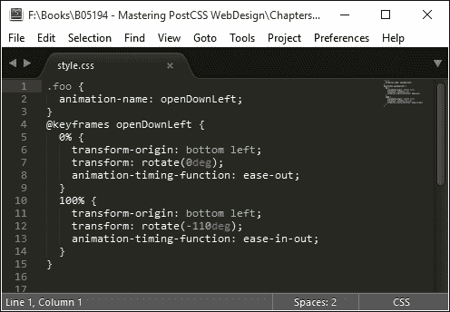

虽然我们的示例只展示了单个样式，但这并不重要——任何使用 animation-name 的样式表都可以使用，只要使用的 animation-name 值与 `postcss-animation-data` 插件中的某个值匹配。不过，还有一些关键点我们需要讨论，让我们花点时间更详细地探讨这些点。

## 更详细地探索插件

我们的新插件是我们可以如何适应现有框架以使用不同值的完美例子——在使用此插件时，我们应该注意以下几点：

+   在构建任何插件时需要考虑的一个关键点：不要担心添加供应商前缀。这些前缀应该在插件在项目中使用时作为编译阶段的一部分添加；这将处理所需的任何供应商前缀。

+   目前，该插件仅列出了来自 Magic Animations 库的两种动画类型作为示例——原始动画的完整列表可在 Magic Animations GitHub 仓库中找到，网址为[`github.com/miniMAC/magic/blob/master/magic.css`](https://github.com/miniMAC/magic/blob/master/magic.css)。我们可以轻松地添加我们需要的任何动画，使用格式`"<动画名称>" : "<要使用的关键帧>"`，如本截图所示：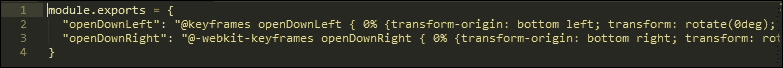

    作为实验，我们不妨尝试将来自 Motion UI 库的动画从[`zurb.com/playground/motion-ui`](http://zurb.com/playground/motion-ui)转换过来，例如？或者我们可以尝试 AngularJS 的动画，网址为[`www.justinaguilar.com/animations/#`](http://www.justinaguilar.com/animations/#)——这完全取决于你！

+   或者，将相同的原理应用于从[`github.com/postcss/postcss-easings`](https://github.com/postcss/postcss-easings)提供的`postcss-easings`插件也是值得的；它内置了一些知名的缓动效果，但它们可以很容易地被替换。这个目的的一个很好的工具是[`www.cubic-bezier.com`](http://www.cubic-bezier.com)网站。例如，如果我们取`easeInExpo`缓动效果，我们创建一个看起来像这样的贝塞尔曲线：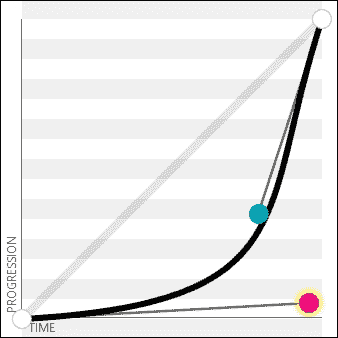

### 注意

这对应于`cubic-bezier(.95,.05,.79,.35)`的值，我们可以在我们的代码中使用它。值得注意的是，一些网站会显示这个缓动效果为`(0.05, 0.795, 0.035)`——[`cubic-bezier.com/`](http://cubic-bezier.com/)只显示到小数点后两位的值。

我们有很多方法可以扩展、修改或创建新的插件——任何插件的关键都应该是它们保持简单，仅限于一个任务，并且尽可能使用 PostCSS 插件模板作为创建插件的基础。在这个练习中我们使用的插件是手动创建的——如果你是为自己的需求创建它，并且不打算发布插件，这并不是一个问题。在下一章中，我们将探讨使用模板代码创建东西有多容易——它避免了将来很多问题！

# 摘要

动画内容几乎是构建现代网站的一个事实上的部分——这可以是从表单标签上提供微妙的视觉效果，到提供复杂的背景滑块。我们在本章中介绍了很多有用的技巧和窍门，所以让我们花点时间回顾一下我们学到了什么。

本章的主题是关于从使用纯 CSS 或 SASS 过渡到 PostCSS；我们首先快速回顾了可用的动画类型。

这迅速被查看一些可用于开始过渡到标准 CSS 的方法所跟随，例如使用预构建的动画库，或使用 CSS3 过渡。然后，我们转向介绍在 SASS 中类似动画的样式，这样我们就可以比较使用 `Animate.css` 等库的方法，然后再开始转向使用 PostCSS。

我们通过探索可用的各种插件开始了这段旅程，然后转换我们的代码以使用 PostCSS 相当的样式。接着，我们通过创建一个简单的 PostCSS 示例来进一步推进，最后在本章的结尾，我们查看了一个为 PostCSS 创建的简单动画插件，该插件基于 Magic Animation 动画集。

哇，我们确实已经覆盖了很多内容！但我们的旅程还没有结束。在下一章中，我们将探讨一些我们可以用来在 PostCSS 中创建插件的技巧和窍门。我们不再局限于他人提供的内容；现在我们可以开始创建我们自己的插件了...
