# 第八章。创建 PostCSS 插件

插件，插件……我们无法避开它们；到目前为止，你已经看到它们是 PostCSS 开发中不可或缺的一部分。它的模块化特性完全围绕插件构建，这就是我们如何通过选择性地使用这些插件来简化我们的处理过程。

在本章中，我们将介绍 PostCSS 插件的解剖结构，并查看一些预构建的示例，然后着手构建一个简单的插件，然后对其进行测试并提交以包含在 PostCSS 系统中。

在本章中，我们将涵盖多个主题，包括以下内容：

+   发现如何使用插件扩展 PostCSS

+   检查标准插件的架构

+   使用插件模板创建 PostCSS 插件

+   构建一些示例插件

+   测试并将你的插件提交到 PostCSS 插件库

+   探索一些现有的 PostCSS 插件示例

让我们开始吧…！

# 使用插件扩展 PostCSS

一个问题，你有多少次与那些实际上并没有真正实现任何功能的插件一起工作过？

我敢打赌答案不会是一个很高的数字——不，我并没有包括那些声称执行操作但实际上似乎因为某些原因不起作用的插件！PostCSS 的力量不在于核心系统，而在于我们用来操作 CSS 样式表的插件。

在撰写本文时，PostCSS 中有超过 200 个可用的插件——这些插件的范围从扩展 PostCSS（如`postcss-nested`或`postcss-mixins`），到操作颜色（如`postcss-color-hcl`或`postcss-rgba-hex`），到为未来 CSS 语法提供支持的插件（如添加`@extend`支持）。

### 注意

完整列表可在[`github.com/postcss/postcss/blob/master/docs/plugins.md`](https://github.com/postcss/postcss/blob/master/docs/plugins.md)或通过托管在[`www.postcss.parts`](http://www.postcss.parts)的可搜索目录中找到。

到目前为止，我们在示例中使用了相当多的插件——我们已为它们配置了使用，但它们仍然带有一定的*黑盒*特性，我们并不总是了解内部是如何工作的。是时候改变这一点了。作为第一步，让我们简要地认识一下帮助插件成为可能的工具集，即 PostCSS API。

为 PostCSS 创建的任何插件都将使用 API 构建。这个 API 的关键将是`Node`和`Container`方法，这些方法可以在插件中初始化`postcss`对象后用来操作内容。我们将在本章中更详细地探讨这些内容，但在这样做之前，先探索一下 PostCSS 插件的架构是有意义的，让我们来看看是什么让它运转起来。

# 分析标准插件的架构

创建一个 PostCSS 插件是一个简单的过程——PostCSS 的美妙之处在于，作为开发者，我们可以自由地设计和构建我们想要的任何插件；这也意味着并非每个插件的质量都与其他插件相同！

除了这些，构建任何 PostCSS 插件的推荐方式是使用模板代码，这些模板代码可以从 [`github.com/postcss/postcss-plugin-boilerplate`](https://github.com/postcss/postcss-plugin-boilerplate) 获取；我们可以在下面的截图中看到一个例子：

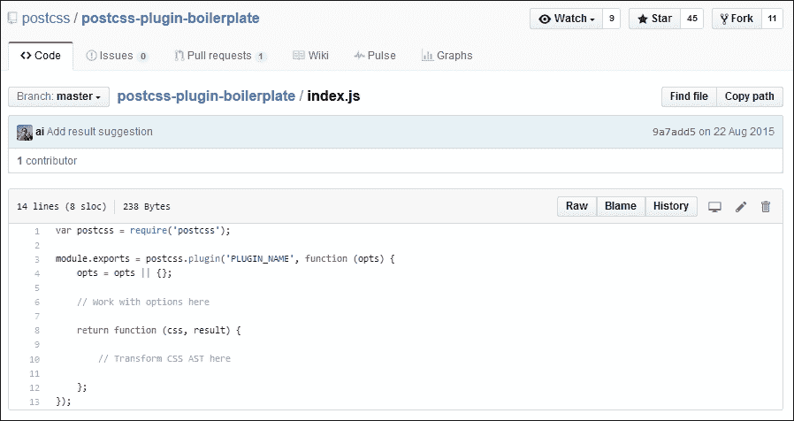

如果我们探索托管在 GitHub 上的任何 PostCSS 插件源代码，将存在许多不同的文件；并不是每个插件都会完全相同！

然而，如果我们进一步深入，我们会期望看到一些文件作为任何插件架构的一部分；它们如下所示：

+   `index.js`: 这个文件包含了每个插件的主要功能

+   `package.json`: 这个文件用于配置和管理本地安装的 NPM 包

+   `test.js`: 这包含了确保插件按预期工作所需的测试

让我们更详细地探讨这些内容，从 `index.js` 开始。

## 探索 index.js

任何插件的精髓都集中在 `index.js` 上——我们从一个对 PostCSS（作为我们插件的依赖项）的引用开始；接着是导出函数，它向使用插件的任何人公开功能：

```js
var postcss = require('postcss');

module.exports = postcss.plugin('myplugin', function(options) {

  return function (css) {
    options = options || {};

    // Processing code will be added here
  }
});
```

## 发现 package.json

接下来，我们有 `package.json`——这个文件用于配置和管理本地安装的 Node 包；鉴于 PostCSS 基于 Node.js，我们将在任何作为 PostCSS 生态系统一部分安装的插件中看到类似的内容：

```js
{
  "name": "PLUGIN_NAME",
  "version": "0.0.0",
  "description": "PostCSS plugin PLUGIN_DESC",
  "keywords": [
    "postcss",
    "css",
    "postcss-plugin"KEYWORDS
  ],
```

第一部分包含有关插件名称、描述和版本的一些基本细节。如果我们查看 `package.json` 文件，会发现一些大写关键词——乍一看，可能会误以为它们是无效的 JSON。

这是有原因的——使用这个模板插件的一个步骤是运行一个脚本，该脚本将替换这些关键字以提供信息；脚本将将其转换为有效的 JSON。我们将在后面的 *创建过渡插件* 部分更详细地介绍这一点。现在，假设这个文件将在构建过程中转换为有效的 JSON。

然后，我们存储作者的名称、插件的许可证以及我们可以获取源代码或报告与插件相关的错误的地方：

```js
  "author": "AUTHOR_NAME <AUTHOR_EMAIL>",
  "license": "MIT",
  "repository": "GITHUB_NAME/PLUGIN_NAME",
  "bugs": {
    "url": "https://github.com/GITHUB_NAME/PLUGIN_NAME/issues"
},
"homepage": "https://github.com/GITHUB_NAME/PLUGIN_NAME",
```

这一节是最关键的——依赖关系部分存储了在生产环境中使用的任何依赖项的详细信息；`devDependencies` 部分负责开发环境中的依赖项：

```js
  "dependencies": {
    "postcss": "⁵.0.10"
  },
  "devDependencies": {
    "ava": "⁰.7.0",
    "eslint": "¹.10.2"
  },
  "scripts": {
    "test": "ava && eslint *.js"
  }
}
```

PostCSS 团队给出的一个关键指南是每个插件都应该经过测试——这应该是一个理所当然的要求，以确保我们创建的东西是稳固的，不太可能给用户带来问题。样板代码的一部分包含了一个适合此目的的测试脚本，所以现在让我们快速看一下。

## 探索 test.js

任何插件的关键第三个元素是测试——这应该存储在 `test.js` 中，看起来类似于以下内容：

```js
import postcss from 'postcss';
import test from 'ava';

import plugin from './';

function run(t, input, output, opts = { }) {
  return postcss([ plugin(opts) ]).process(input)
    .then( result => {
      t.same(result.css, output);
      t.same(result.warnings().length, 0);
    });
}

/* Write tests here
test('does something', t => {
  return run(t, 'a{ }', 'a{ }', { });
});
*/
```

我们将在本章的“测试和提交插件”部分更详细地介绍这部分内容——现在，让我们专注于创建一个基于 PostCSS 的插件。我们将首先快速查看 API，然后深入创建一个基于所选字体的特定字体堆栈的插件，并在需要将其中一个字体导入我们的网站时添加更新声明。

在框架就绪后，我们可以使用 PostCSS API 来构建我们的插件；它包含了许多类、模块和方法，我们可以使用。API 中的关键函数当然是 `postcss`——这是 PostCSS 的主要入口点，对于所有插件都是必需的：

```js
var postcss = require('postcss');
```

让我们快速浏览一下 API 中还提供了哪些其他功能，从供应商模块开始。

## 供应商模块

此模块包含用于处理供应商前缀的辅助工具——我们可以使用此对象来启动它：

```js
var vendor = postcss.vendor;
```

该模块包含两个方法，如表所示：

| 模块 | 格式 | 返回的值 |
| --- | --- | --- |

| `vendor.prefix` | 字符串 | 从输入字符串中提取的供应商前缀：

```js
// prefix extracted = '-webkit-'
var vp = postcss.vendor;
vp.prefix('-webkit-clip-path')
```

|

| `vendor.unprefixed` | 字符串 | 去除了供应商前缀的输入字符串：

```js
// value extracted = 'tab-size'
var vp = postcss.vendor;
vp.unprefixed('-moz-tab-size')
```

|

## 列表模块

此模块包含用于安全分割 CSS 值列表的辅助工具，同时保留括号和引号。我们可以使用此对象来启动它：

```js
var list = postcss.list;
```

该模块包含两个方法，如表所示：

| 模块 | 格式 | 设计用于分割 |
| --- | --- | --- |

| `list.space` | 字符串 | 以空格分隔的值（例如背景、border-radius 和其他缩写属性）：

```js
// expected result:
// ['1px', 'calc(10% + 1px)']
var ls = postcss.list;
ls.space('1px calc(10% + 1px)')
```

|

| `list.comma` | 字符串 | 以逗号分隔的值（例如 transition-* 和背景属性）：

```js
// Expected result:
// ['black', 'linear-gradient(white, black)']
var ls = postcss.list;
ls.comma('black, linear-gradient(white, black)')
```

|

## API 中可用的类

一旦在插件中将 PostCSS 对象定义为依赖项，我们就可以开始操作其内容——为此，有多个类可用以协助，如表所示：

| 类名 | 插件中的角色 |
| --- | --- |
| `Processor` | 创建一个处理器实例，初始化任何插件，然后使用此实例处理配置中指定的 CSS 文件。 |
| `LazyResult` | 作为 PostCSS 转换结果的承诺代理。承诺是使用 Node.js 时的一个关键部分——如果你不熟悉这个概念，请查看 [`www.promisejs.org/`](https://www.promisejs.org/) 以获取详细解释。 |
| `Result` | 提供任何 PostCSS 转换的结果。 |
| `Warning` | 允许用户在插件中管理警告。 |
| `CssSyntaxError` | 允许用户检索由 CSS 解析器生成的任何 CSS 错误： |
| `Input` | 表示 PostCSS 插件正在操作的源 CSS： |

## API 中可用的节点

当然，如果没有访问每个 CSS 节点的内容，我们无法在 PostCSS 插件中操作内容——API 包含一组有用的节点，有助于解析和操作内容：

| 节点 | 表示： |
| --- | --- |

| `Root` | 一个 CSS 文件及其解析后的节点：

```js
var root = postcss.parse('a{color: darkred}');
root.type         //=> 'root'
root.nodes.length //=> 1
```

|

| `AtRule` | CSS 中的基于`@`的规则，例如`@media print {…}` |
| --- | --- |

| `Rule` | 一个 CSS 规则，包含选择器和声明块：

```js
var root = postcss.parse('h1{}');
var rule = root.first;
rule.type       //=> 'rule'
rule.toString() //=> 'h1{}'
```

|

| `Declaration` | 一个 CSS 声明：

```js
var root = postcss.parse('a{color: darkred}');
var decl = root.first.first;
decl.type       //=> 'decl'
decl.toString() //=> 'color: darkred'
```

|

| `Comment` | 在声明或语句之间（在规则和`@`规则中）的注释：

```js
var root = postcss.parse('a { color: /* inner */ darkred; /* outer */ }');
var decl    = root.first.first;
var comment = root.first.last;

comment.type //=> 'comment'
decl.between //=> ': /* inner */'
```

|

## API 中可用的方法

插件的一个关键作用是遍历每个节点以帮助确定是否应该执行某些操作；API 包含一些方法来协助解析节点：

| 方法组 | 目的 |
| --- | --- |

| 节点 | 这些方法用于处理每个 CSS 节点——这包括以下方法：

+   `node.type`: 返回表示节点类型的字符串

+   `node.parent`: 返回作为字符串的父节点

+   `node.next()`或`node.prev()`: 返回节点父的下一个或前一个子节点。

更多详细信息请参阅：[`github.com/postcss/postcss/blob/master/docs/api.md#nodes-common-methods`](https://github.com/postcss/postcss/blob/master/docs/api.md#nodes-common-methods) |

| 容器 | 这些方法包含用于在容器节点中处理子节点的方法——这包括以下方法：

+   `container.nodes`: 返回包含容器子节点的数组。

+   `container.first`: 返回容器的第一个子节点。

+   `container.last`: 返回容器的最后一个子节点。

更多详细信息请参阅：[`github.com/postcss/postcss/blob/master/docs/api.md#containers-common-methods`](https://github.com/postcss/postcss/blob/master/docs/api.md#containers-common-methods) |

主站点包含 API 中所有方法和类的详细信息及示例——花时间熟悉这些选项是值得的。

### 小贴士

每个方法或类的详细信息可在 PostCSS API 页面找到：[`github.com/postcss/postcss/blob/master/docs/api.md`](https://github.com/postcss/postcss/blob/master/docs/api.md)

好了，理论就到这里：让我们开始吧！让我们改变方向，将我们刚刚学到的一些知识应用到构建几个 PostCSS 插件中；这些插件将使用我们在本章前面简要查看过的 API 命令的真实混合；我们的第一个演示围绕一个简写插件，用于在样式表中的 CSS 规则内创建过渡语句，所以让我们开始看看它是如何工作的。

# 创建一个过渡插件

这个插件的创意并不新颖；它松散地基于 Jonathan Neal 的 `postcss-transform-shortcut` 插件，可在 [`github.com/jonathantneal/postcss-transform-shortcut`](https://github.com/jonathantneal/postcss-transform-shortcut) 获取。这个概念并不一定是一个创建过渡语句的更短方法，但它通过允许作者独立指定值来简化了过程。然后这些值会自动插入到过渡声明中的正确顺序。

### 注意

这个插件的源代码也托管在 GitHub 上，网址为 [`github.com/alexlibby/postcss-transition-shortcut`](https://github.com/alexlibby/postcss-transition-shortcut)；NPM 包也可在 [`www.npmjs.com/package/postcss-transition-shortcut`](https://www.npmjs.com/package/postcss-transition-shortcut) 获取。

让我们深入了解一下它是如何组合在一起的，更详细地看看：

1.  我们首先安装 Git——这是安装插件模板所必需的。为此，浏览到 [`git-scm.com/book/en/v2/Getting-Started-Installing-Git`](https://git-scm.com/book/en/v2/Getting-Started-Installing-Git)，并遵循您平台上的说明。

1.  打开 Node.js 命令提示符，然后更改工作目录到我们的项目目录。

1.  在提示符中输入以下命令然后按 *Enter*：

    ```js
    git clone https://github.com/postcss/postcss-plugin-boilerplate.git

    ```

1.  Git 将 `postcss-plugin-boilerplate` 仓库克隆到我们的项目区域，如图所示：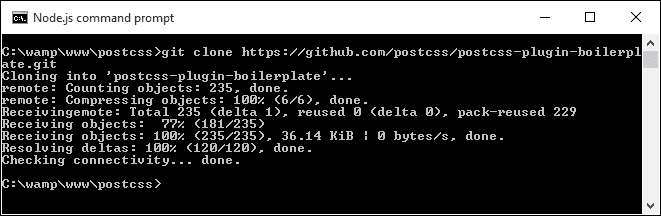

1.  插件模板包括一个脚本来自动生成我们插件的基本框架——请在提示符中运行此命令：

    ```js
    node ./postcss-plugin-boilerplate/start

    ```

1.  它将显示一系列用于各种信息的提示。请填写适当的响应，类似于这个截图所示。请注意，拥有 GitHub 账户不是强制性的，因为信息只是添加到 `package.json` 文件中；如果您未来花时间开发插件，那么建议您创建一个：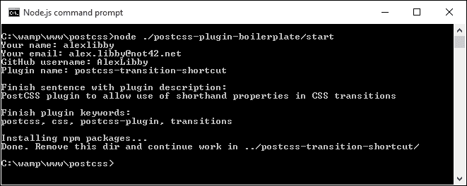

1.  一旦创建了插件文件夹，我们可以从项目根目录中删除 `postcss-plugin-boilerplate` 文件夹，因为不再需要它了。

1.  如果一切顺利，我们在浏览插件文件夹内容时应该能看到类似这样的截图：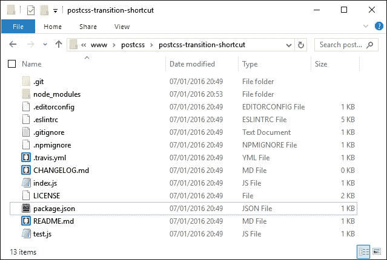

1.  到这一步，我们现在可以将我们的插件代码添加到 `index.js` 中——为此，打开项目区域内的 `postcss-transition-shortcut` 插件的一个文件副本，并按照所示修改代码：

    ```js
    var postcss = require('postcss');

    module.exports = postcss.plugin('postcss-transition-shortcut', function (opts) {
      opts = opts || {};

      var defaults = {
        property: 'all',
        duration: '1s',
        timing: 'ease-in-out',
        delay: '1s'
      };

      return function (css, result) {
        css.walkRules(function (rule) {
          var transitionRule;
          var transitionValues = [];
          var index = -1, node;
          var attributes = /^ (property|duration|timing|delay)$/;

          while (node = rule.nodes[++index]) {
             if (attributes.test(node.prop)) {
              transitionRule = transitionRule || node.cloneBefore({ prop: 'transition' });
              var transValues = postcss.list.space(node.value);
              transitionValues.push(transValues.join(','));
              node.remove();
              --index;
            }
          }
          transitionRule.value =
            transitionValues.join(' '); 
          });
      };
    });
    ```

在这个阶段，我们将拥有一个可以工作的插件——虽然（引用一句古老的英语谚语），证明是甜点：插件是否按预期工作？好吧，没有比尝试它更好的方法来找出答案了，所以让我们快速设置一个演示来确认它按预期工作。不过，在我们这样做之前，有一个重要的问题需要说明，那就是关于 PostCSS 插件生成的问题。

## 为我们的插件创建测试

眼尖的您会注意到，如果我们没有为我们的过渡插件指定四个值之一，那么当前的代码将不会使用默认值；希望未来的插件版本中会有更新。

除了这个之外，测试我们的插件的过程使用的是来自 [`github.com/sindresorhus/ava`](https://github.com/sindresorhus/ava) 的 AVA 测试运行器。测试框架已经在插件模板中创建好了，我们只需要将测试代码添加到 `test.js` 文件中。让我们看看需要什么：

1.  我们将开始安装 AVA 测试运行器——为此，打开 Node.js 命令提示符，并将工作文件夹更改为插件文件夹的根目录。

1.  在提示符中，输入以下命令，每输入一个命令后按 *Enter* 键——第一个安装 AVA，第二个将其添加到我们的 `package.json` 文件：

    ```js
    npm install --global ava
    ava --init

    ```

1.  在您选择的文本编辑器中打开一个新文件——请将以下高亮行添加到之前练习中创建的插件文件夹中的 `test.js` 文件：

    ```js
          t.same(result.warnings().length, 0);
        }); 
    } 

    test('transitionShtct', t => { 
     return run( t, 'div { property: all; duration: 1s; timing: ease-in-out; delay: 1s; }', 'div { transition: all 1s ease-in-out 1s; }', { }); 
    });

    ```

1.  接下来，打开 Node.js 命令提示符，然后更改工作目录到我们的插件项目文件夹。

1.  在提示符中，输入 `npm test` 并按 *Enter* 键。

1.  AVA 将执行测试，然后使用 ESLint 进行代码检查。如果一切顺利，我们应该会看到这个截图中的结果——假设测试没有出现任何问题：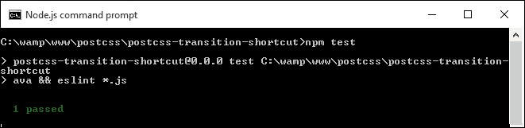

到目前为止一切顺利，对吧——在这个阶段，我们可以创建一个简单的演示来证明插件可以工作……或者不是吗？好吧，测试结果显示通过，所以代码应该是没有问题的。但是往下看，会显示一大堆错误，类似于这个截图——这是怎么回事？

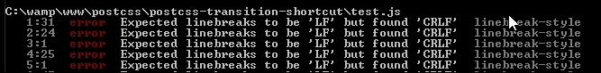

测试已经通过，但测试结果似乎表明相反；进一步查看会发现更多的错误：

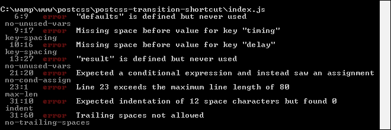

这提出了关于测试的一些重要观点，所以在继续我们的演示之前，让我们先来谈谈这些。

## 修正错误

主要错误，或 `Exported linebreaks to be 'LF'…`，是一个简单的错误，很容易修复——这是由于 Sublime Text 被设置为使用 Windows 作为默认的行结束符设置引起的。假设我们使用的是 Sublime Text，让我们来处理这个错误：

1.  打开 Sublime Text，然后打开插件文件夹中的 `index.js` 文件。

1.  点击视图 | 行结束符。

1.  将选定的选项更改为 **Unix**，并保存文件。

1.  对 `test.js` 重复步骤 1 到 3——完成后，关闭这两个文件。

如果我们重新运行测试，我们应该会看到列出的错误数量显著减少——在`index.js`和`test.js`中，我们还会剩下一些需要修复的错误，类似于下面的截图：

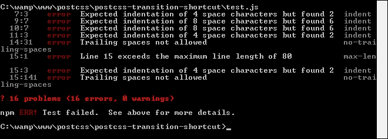

大多数错误都是显而易见的——两个不太明显的是`Expected indentation of X spaces…`和`Line X exceeds the maximum line length…`。我们可以通过将所有制表符替换为每个制表符四个空格来修复第一个错误。第二个错误很容易修复——只需将代码行拆分为两行即可。

我们需要尽可能解决所有剩余的错误——这些错误不会完全相同于你的插件版本，但其中一些将是相似的。

### 小贴士

如果你遇到任何你想了解错误原因的错误，请查看[`jslinterrors.com/`](https://jslinterrors.com/)——这是一个定义错误含义的好资源！

假设我们已经清除了大多数错误，我们应该只剩下最后一个：

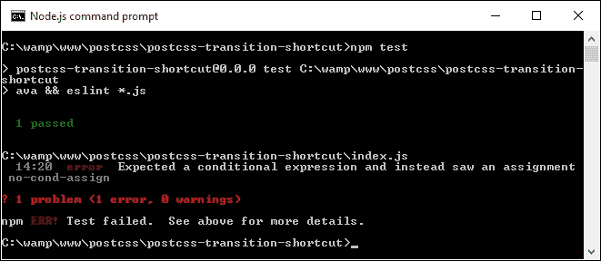

这是一个我们应该修复的错误，因此可以从报告中清除吗？简单的回答是这取决于——它强调了使用代码检查的一个重要观点，所以让我们花点时间更详细地讨论这一点。

## 清除最后一个错误

报告中显示的最后一个错误带来了一些挑战——代码是有效的，但 ESLint 标记了错误。原因是它在一个 while 语句初始化器中找到了一个赋值表达式；这被视为代码中的一个可能的错误，并且*可能*会对代码产生意外的影响。

在某些方面，它可以被视为警告，而不是错误。在 2013 年 7 月之前，我们可以配置测试来忽略它，但自那时起对 ESLint 所做的更改意味着这个错误不能不重新编写代码就清除。

### 注意

如果你想了解更多关于这个错误原因的信息，请参阅[`jslinterrors.com/unexpected-assignment-expression/`](http://jslinterrors.com/unexpected-assignment-expression/)。

在我们的例子中，代码是有效的，不会引起任何错误——这让我们在接下来的操作中有了几个选择：

+   我们可以简单地忽略这个错误并继续——测试失败并不好，但在这个情况下，它不会对我们的代码造成任何伤害。

+   我们可以关闭对这个测试的检查，这样即使这个条件没有被测试，测试至少会显示 100%通过。

+   我们可以尝试修改代码来设计出错误/警告——这是理想的解决方案，但根据我们需要做出的更改的性质，这可能是一个长期的道路。

目前，我们将关闭这个错误的测试——我们可以在插件内部编辑`.eslintrc`文件，并将方括号中的值设置为`0`：

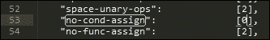

这在短期内是可行的，但考虑到将来某个时候重新审视代码以消除歧义。

## 使用插件进行测试

在我们的插件就位后，让我们测试它——为此，我们需要从本书附带的代码下载中获取几个文件；这些文件位于 `T43 – building a transition shortcut plugin` 文件夹中：

1.  前往并提取 `gulpfile.js` 和 `package.json` 的副本，然后将它们保存到我们项目区域的根目录。

1.  在一个新文件中，添加以下 CSS 样式，并将其保存为 `style.css`，位于我们项目区域的 `src` 文件夹中：

    ```js
    div {
      property: all;
      duration: 1s;
      timing: ease-in-out;
      delay: 1s;
    }
    ```

1.  启动 Node.js 命令提示符，然后更改工作目录到我们的项目区域。

1.  在提示符中，输入 `gulp` 然后按 *Enter* 键——PostCSS 将消失并编译源样式表。如果一切顺利，我们应该在我们的项目区域的 `dest` 文件夹中看到样式表的编译结果：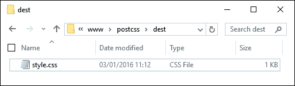

在这个阶段，我们已经为我们的插件运行了测试——我们再进一步，将我们的插件添加到测试运行器服务，如 Travis CI（在 [`travis-ci.org`](https://travis-ci.org)）。尽管这是创建任何 PostCSS 插件过程中的一个强制性部分，但学习曲线相当陡峭，任何在 Windows 上工作的人可能会遇到困难！如果你是 Windows 用户，你将不得不通过命令行使 `test.js` 可执行——这需要先了解 Git 的使用，而这超出了本书的范围。

现在，我们将跳过 Travis CI 的过程——插件足够简单，使用 `test.js` 进行本地测试就足够了。让我们改变方向——我们的插件包含了一些 PostCSS 中的有用概念，因此让我们更详细地探索它是如何组合在一起的。

## 详细剖析我们的插件

这个插件的灵感有两个方面——在撰写本文时，PostCSS 没有太多基于动画的插件，并且它借鉴了 `postcss-transform-shortcut` 插件中使用的相同概念。

我们从初始化 PostCSS 作为我们插件的依赖项的通用调用开始：

```js
var postcss = require('postcss');
```

接下来，我们初始化 `postcss.plugin`，以便在我们的插件中公开功能给生态系统：

```js
module.exports = postcss.plugin('postcss-transition-shortcut', function (options) {
```

目前，我们的插件不包含任何选项，因此它将被设置为空白；如果我们已经设置了一些选项，那么这些选项将存储在选项数组中：

```js
options = options || {};
```

我们插件的关键部分是设置一些默认选项——如果我们没有指定一个或多个值，我们需要设置一些默认值：

```js
var defaults = {
  property: 'all',
  duration: '1s',
  timing: 'ease-in-out',
  delay: '1s'
};
```

接下来是插件的核心——它返回此函数的结果：

```js
  return function (css) {
     css.walkRules(function (rule) {
       var transitionRule;
       var transitionValues = [];
       var index = -1, node;
       var attributes = /^(property|duration|timing|delay)$/;
```

我们使用 `css.walkRules` 遍历每个规则——它设置了一些变量和一个数组；我们还设置了一个搜索字符串，用于查找任何我们的过渡属性实例。

如果我们找到一个合适的属性实例，我们就克隆它，在其前面添加属性名 `transition`。然后我们逐个处理可能设置的最多四个属性，将它们组合成最终的过渡声明：

```js
       while (node = rule.nodes[++index]) {
        if (attributes.test(node.prop)) {
          transitionRule = transitionRule || node.cloneBefore({ prop: 'transition' });
           var transValues = postcss.list.space(node.value);
           transitionValues.push(transValues.join(','));
           node.remove();
           --index;
         }
       }
       transitionRule.value = transitionValues.join(' ');
    });
  };
});
```

让我们继续前进。我们的第一个示例是一个简单的插件；尽管它还需要进一步开发（如 *测试我们的插件* 所示），但它仍然有其用途。在我们的下一个示例中，我们将采取不同的方法：我们将使用现有插件作为我们新版本的基础。这个插件与第一个不同，它不会在 GitHub 上亮相——我们将探索这个原因，以及更多内容，作为我们下一个练习的一部分。

# 构建自定义字体插件

对于我们的下一个演示，我们不会构建原创内容，而是从已经可用于 PostCSS 的现有插件开始。我们将使用的插件是 Seane King 的 `postcss-fontpath`（可在 [`github.com/seaneking/postcss-fontpath`](https://github.com/seaneking/postcss-fontpath) 获取）；我们将集成一个自动完成功能，根据提供的名称自动添加相关的字体堆栈，并使用在 [`www.cssfontstack.com/`](http://www.cssfontstack.com/) 可用的列表。

“为什么这样做？”你可能会问？为了证明一个观点——并不是总是需要重新发明轮子；有时简单地适应现有的东西，虽然它并不完全符合我们的需求，可能更可取。在这个例子中，我们添加的代码将使其更有用；它还需要进一步开发以允许错误检查，但无论如何仍然有其用途。

### 注意

一个需要注意的点——推荐的做法是使用我们在上一节中提到的插件模板。对于接下来的练习，我们将手动构建它——这是为了展示这个过程的一部分，尽管它不是我们会发布到野外的版本。

好的，先不提这个，让我们开始着手开发我们的插件：

1.  我们将首先在项目区域的根目录下创建一个文件夹——请将这个文件夹命名为 `postcss-custom-fonts`。

1.  接下来，我们需要将文件夹设置为一个 Node 模块，因此请启动 Node.js 命令提示符并将工作文件夹更改为我们的插件文件夹。

    在命令提示符中输入 `npm init` 以开始创建 `package.json` 文件的过程——使用此截图显示的详细信息，在适当的提示下：

    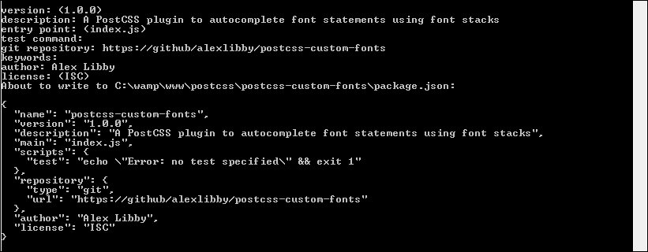

1.  在命令提示符仍然打开的情况下，输入以下命令，然后按 *Enter* 键——第一个命令是安装 PostCSS 作为我们插件的依赖项，第二个命令安装 `underscore.js` 作为第二个依赖项（它用于扩展方法）：

    ```js
    npm install postcss --save
    npm install underscore --save

    ```

    保持会话打开——我们将在练习的末尾需要它。

1.  从本书附带的代码下载中，我们需要提取 `index.js` 的副本——将其复制到插件文件夹中。

1.  如果一切顺利，当浏览我们插件文件夹的内容时，我们应该看到类似于以下截图的内容：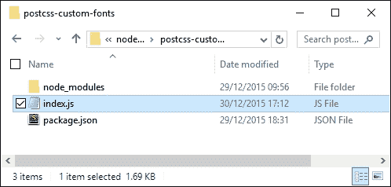

1.  在我们的插件就位后，让我们测试一下。为此，我们需要从本书附带的代码下载中获取几个文件。请从 `T42 – 构建自定义字体` 插件文件夹（而不是插件文件夹！）中提取 `gulpfile.js` 和 `package.json` 的副本，然后将它们保存到我们项目区域的根目录。

1.  在一个新文件中，添加以下 CSS 样式，将其保存为 `src` 文件夹中我们项目区域的 `style.css`：

    ```js
    @font-face {
      font-family: 'robotoregular';
      font-path: '/fonts/Roboto-Regular-webfont';
      font-weight: normal;
      font-style: normal;
    }

    h1 { font-family: robotoregular,  fontstack("Extra Stack"); }
    ```

1.  回到我们在本练习开始时打开的 Node.js 命令提示符会话。在继续之前，请确保工作文件夹设置为我们的项目区域。

1.  在提示符下，输入 `gulp` 然后按 *Enter* 键——PostCSS 将消失并编译源样式表。如果一切顺利，我们应该在我们的项目区域的 `dest` 文件夹中看到样式表的编译结果：

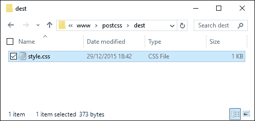

在这个阶段，我们现在有一个可工作的插件——即使这不是一个原创作品，但它仍然突出了围绕 PostCSS 插件构建的许多关键概念。让我们花点时间更详细地探索一下我们插件的功能。

## 分析我们插件的功能

初看起来，我们插件的代码可能看起来很复杂，但实际上它相对容易理解——让我们分部分来看，从定义 `postcss` 对象和我们将要在插件中使用的 `fontstacks_config` 对象的实例开始：

```js
var postcss = require('postcss');
var _ = require('underscore');

// Font stacks from http://www.cssfontstack.com/
var fontstacks_config = {
  'Arial': 'Arial, "Helvetica Neue", Helvetica, sans-serif',
  'Times New Roman': 'TimesNewRoman, "Times New Roman", Times,
  Baskerville, Georgia, serif'
}
```

接下来，我们添加一个简单的辅助函数——这个函数用于将字体名称转换为标题格式；`fontstacks_config` 中列出的名称是区分大小写的，如果不匹配将失败：

```js
// Credit for this function: http://stackoverflow.com/a/196991
function toTitleCase(str) {
  return str.replace(/\w\S*/g, function(txt){
    return txt.charAt(0).toUpperCase() + txt.substr(1).toLowerCase();
  });
}
```

这是插件的开头——前两行是必须的初始化，以便插件可供使用，然后定义一个选项对象。然后我们使用 `_.extend` 将我们选择的字体堆栈中的预定义值与在运行插件时添加到配置对象的值扩展：

```js
module.exports = postcss.plugin('customfonts', function (options) {
  return function (css) {

    options = options || {};
    fontstacks_config = _.extend(fontstacks_config, options.fontstacks);
```

然后，我们遍历每个规则和节点，确定它们是否首先包含字体声明，然后确定它们是否包含与预定义字体堆栈中匹配的字体名称。如果匹配，则将字体名称转换为适当的字体堆栈，并插入任何指定的附加字体，但这些字体不匹配我们的字体堆栈：

```js
    css.walkRules(function (rule) {
      rule.walkDecls(function (decl, i) {
        var value = decl.value;
        if (value.indexOf( 'fontstack(' ) !== -1) {
          var fontstack_requested = value.match(/\(([^)]+)\)/)[1].replace(/["']/g, "");
          fontstack_requested = toTitleCase(fontstack_requested);

          var fontstack = fontstacks_config[fontstack_requested];
          var first_font =  value.substr(0, value.indexOf('fontstack('));

          var new_value = first_font + fontstack;
          decl.value = first_font + fontstack;
        }
      });
    });
```

在插件的下半部分，我们执行一个更简单的任务——我们逐个处理每个规则和声明，寻找代码中任何 `@font-face` 的实例。然后我们定义一个 `fontpath` 变量，它从提供的值中删除任何引号，并定义一个 `format` 数组来管理可用的不同字体格式：

```js
    css.walkAtRules('font-face', function(rule) {
      rule.walkDecls('font-path', function(decl) {
        var fontPath = decl.value.replace(/'/g, ''),
        src = '',
        formats = [
          { type: 'woff', ext: '.woff' },
          { type: 'truetype', ext: '.ttf' },
          { type: 'svg', ext: '.svg' }
        ];
```

然后，我们为每种字体类型构建相关的语句，然后将自定义字体声明组装起来，并重新插入到样式表中的适当位置：

```js
        formats.forEach(function(format, index, array) {
          if (index === array.length - 1){
            src += 'url("' + fontPath + format.ext + '")
        format(\'' + format.type + '\')';
          } else {
            src += 'url("' + fontPath + format.ext + '")
        format(\'' + format.type + '\'),\n ';
          }
        });

        decl.cloneBefore({ prop: 'src', value: src });
        decl.remove();
      });
    });
  }
});
```

我们插件暴露了 PostCSS 插件设计中的某些关键概念——主要的是使用 `.WalkDecls` 和 `.WalkRules`（或 `.WalkAtRules`）。我强烈建议您熟悉 API 文档，网址为 [`github.com/postcss/postcss/blob/master/docs/api.md`](https://github.com/postcss/postcss/blob/master/docs/api.md)，其中概述了 API 中所有可用的命令，并简要说明了它们的目的。

尽管创建了一个本应很有用的插件，但我不会推荐将其发布到公共领域。在这个时候，你可能认为我已经完全迷失了方向，但正如我经常说的，“疯狂之中有方法”——不发布这个插件有很好的理由，让我们花点时间来探讨为什么以当前格式发布这个插件可能不是一个明智的决定。

## 探讨发布此插件的风险

在过去的几页中，我们创建了一个本应很有用的插件来操作自定义字体——它根据预定义的设置自动构建正确的字体堆栈，并将为我们填写适当的 `@font-face` 代码。到这一点，我们应该有一个可以发布到公共领域的插件，任何人都可以使用……难道不是吗？

好吧，是的，也不是——尽管这个插件有其用途，但我不会推荐将其公开……至少现在还不行！有几个原因，这也有助于说明使用本章前面提到的样板代码的好处：

+   该插件没有 `test.js` 文件或与之相关的配置——发布插件的一个要求是每个插件都必须经过测试，使用 `test.js` 文件。理想情况下，我们可能会使用像 Travis CI 这样的服务来帮助完成这项工作，但这仅在您使用基于 Unix 的开发环境时才有效。

+   该插件本身执行两个不同的角色，这并不推荐——PostCSS 插件的最佳实践是尽可能将角色限制为一个任务。当使用任务运行器时，我们可以选择使用哪些插件，而不会引入太多额外的、不希望的功能。

+   我们代码的架构并不理想——这主要是由于使用了 `css.WalkRules`（第 16 行）和 `css.WalkAtRules`（第 28 行）。这两个命令解析容器内的每个节点，并为每个规则节点和规则节点调用回调函数。这里的区别在于 `css.WalkRules` 在每个规则上工作；`css.WalkAtRules` 只会在 `@-` 规则（如 `@font-face`）上工作。它们不可互换，这使得在编译时非常低效。

+   如果我们不使用插件模板，那么发布代码所需的大多数文件将不会存在——这些文件要么需要手动创建，要么在提交到 GitHub 时创建。如果我们使用模板，那么这将会自动完成，包括为我们配置 `package.json` 文件——我们只需要添加一个合适的任务运行器，如 Gulp 或 Grunt。

人们可能会问，为什么我们甚至会考虑这条路线，如果它在开发过程中可能会出现问题的简单答案是，它帮助我们了解插件应该如何构建。如果我们只为个人使用构建插件，那么就没有必要使用我们在发布通用插件时必须使用的某些文件或流程。

# 简化开发过程

在不考虑插件目标受众的情况下，我们开发过程中使用了不同的技术组合，但有一个共同点——我们的插件依赖项非常少！这并非微不足道，因为显然任何变化的依赖项都可能对我们的插件产生连锁反应。

除了这一点，有时缺乏任何依赖项可能需要比合理的（或实际的）更多的开发努力——这时我们可能需要考虑使用额外的插件来处理一些处理工作。一个完美的例子是解析字体：语句，以便我们可以处理其组成部分；还有一些其他值得注意的例子： 

| 解析器或助手类型 | 插件源代码 URL | 插件用途 |
| --- | --- | --- |
| 选择器 | [`github.com/postcss/postcss-selector-parser`](https://github.com/postcss/postcss-selector-parser) | 管理选择器字符串。 |
| 值 | [`github.com/TrySound/postcss-value-parser`](https://github.com/TrySound/postcss-value-parser) | 将 CSS 值和 `@-` 规则参数转换为节点树，以便于遍历。 |
| 属性 | [`github.com/jedmao/postcss-resolve-prop`](https://github.com/jedmao/postcss-resolve-prop) | 解析规则属性值——如果为同一属性指定了多个值，这特别有用。 |
| 字体 | [`github.com/jedmao/parse-css-font`](https://github.com/jedmao/parse-css-font) | 解析 `font` 属性，并为每个元素返回值，例如 `font-size`、`family`、`style` 或 `lineHeight`。 |
| 尺寸 | [`github.com/jedmao/parse-css-dimension`](https://github.com/jedmao/parse-css-dimension) | 解析 CSS 尺寸，如 `number`、`length` 或 `percentage`，并返回一个 JavaScript 对象。 |
| 边界 | [`github.com/jedmao/parse-css-sides`](https://github.com/jedmao/parse-css-sides) | 解析元素的边界属性（如 `margin`、`padding` 或 `border` 属性），并返回所有四边的字符串值。 |
| 字体辅助工具 | [`github.com/jedmao/postcss-font-helpers`](https://github.com/jedmao/postcss-font-helpers) | 用于操作 CSS 中的字体声明——它根据需要返回单个元素或组合的字体对象。 |
| 边距辅助工具 | [`github.com/jedmao/postcss-margin-helpers`](https://github.com/jedmao/postcss-margin-helpers) | 用于操作任何指定元素的边距值。 |

那么，我们应该使用它们吗？这并不是强制性的，但它们可能有助于减少创建我们插件所需的工作。如果使用了任何指南，那么密切关注对插件所做的任何更改是值得的，这样我们就可以及时纠正任何出现的问题；毕竟，没有人喜欢开发者没有妥善维护的插件！

让我们继续前进，插件构建的一个关键部分是一致性；PostCSS 的力量允许创建任何插件，因此保持一致性至关重要。为了帮助实现这一点，PostCSS 的开发者发布了一套指南：让我们深入探讨并更详细地查看这些指南。

# 插件构建指南

PostCSS 生态系统的一个关键优势是其灵活性——它允许任何开发者创建任何插件，或者修改现有的插件，只要许可证允许进一步开发！

为了保持一致性，开发者发布了一系列强制性的指南，应在实际情况下遵循：

+   您插件的名称应清楚地表明该插件的目的——例如，如果您构建了一个用于模拟 CSS4 `:hover`伪类的插件，那么`postcss-hover`就是一个很好的例子。

+   创建一个只做一件事且做得好的插件比尝试同时执行多个任务要好。

+   创建插件时始终使用`postcss.plugin`方法——这样您就连接到了一个通用的插件 API。

+   在可能的情况下，尝试使用异步方法——您还应该为每个节点设置`node.source`，以便 PostCSS 可以生成准确的源映射。

+   不要在显示错误时使用控制台——一些 PostCSS 运行器不允许控制台输出。请使用`result.warn`来管理错误。

+   任何创建并发布的插件都必须经过测试，并提供英文文档化的示例（如果可能）以及变更日志。

+   如果您正在为 Node 编写插件，那么`postcss-plugin`关键字必须在`package.json`文件中体现——这用于对 PostCSS 生态系统提供反馈。

    ### 小贴士

    更多关于这些指南的详细信息可在[`github.com/postcss/postcss/blob/master/docs/guidelines/plugin.md`](https://github.com/postcss/postcss/blob/master/docs/guidelines/plugin.md)找到。

此外，我们可能会使用某种任务运行器，例如 Broccoli、Grunt 或 Brunch，或者在我们的情况下，Gulp。为了帮助保持一致性，开发者发布了一系列应在适当情况下遵循的指南：

+   如果你的插件使用 `config` 文件，那么它必须始终用 JavaScript 编写，并设置为支持参数中的函数。

+   在使用运行者时，始终设置到和从选项，即使你的运行者不处理写入磁盘——这是为了确保 PostCSS 生成准确的源映射并显示更好的语法错误。

+   PostCSS 运行者必须仅使用公开可用的异步 API——运行者不应依赖于可能在未来版本中删除的未记录的方法或属性。

+   在处理 `CssSyntaxError` 消息时，不要简单地显示完整的 JavaScript 栈——并不是每个开发者都熟悉 JavaScript！相反，确保任何错误都能得到优雅的处理。

+   从 `result.warnings()` 出现的任何警告都应由 PostCSS 运行者显示；如果需要，可以使用 `postcss-logs-warnings` 或 `postcss-messages` 插件来简化这个过程。

+   如果你的插件使用了源映射选项，那么默认情况下，这将由 PostCSS 生成一个内联映射。如果需要，运行者必须提供一个选项来将映射保存到单独的文件中。

    ### 小贴士

    更多关于这些指南的详细信息可在[`github.com/postcss/postcss/blob/master/docs/guidelines/runner.md`](https://github.com/postcss/postcss/blob/master/docs/guidelines/runner.md)找到。

提供给插件的指南是强制性的，但在某些情况下，它们可以被视为一个起点——例如，变更日志应该始终维护，但具体是 `HISTORY.md`、`CHANGELOG.md` 还是 GitHub 发布文档取决于开发者。这里的技巧是仔细规划，并保持简单——首先关注基础，然后再转向更复杂的项目。这样我们就可以习惯于每个插件必须提供的最低要求，然后再扩展以涵盖任务运行器的使用。

好的，让我们在这里改变方向：我们之前提到的指南之一指出，每个插件都应该作为常规实践的一部分进行测试；现在是一个深入了解这究竟意味着什么的完美机会。

# 使插件可用

创建任何插件的关键部分是测试——一旦测试通过，我们就可以决定是否将其发布到 GitHub 和 Node 的包管理器目录以供通用使用。这不是强制性的，但如果我们创建了一些可能对他人有用的东西，那么使其可用是公平的！

这个过程涉及几个步骤——它们可以分为三个组：测试插件、添加最终细节（在 GitHub 上），以及提交到 PostCSS 插件目录。我们将使用我们刚刚创建的 `postcss-transition-shortcut` 插件作为发布供通用使用的基准。

我们已经介绍了测试插件的要求，现在让我们探讨使我们的插件可供开发者普遍使用的剩余步骤。第一步是将我们的插件发布到 GitHub 的一个合适的仓库。这个过程超出了本书的范围，但简而言之，使插件可用的过程如下：

+   在`README.md`文件中添加代码示例——这应该展示源文件的示例，以及当该文件被处理后我们期望看到的内容。

+   在`CHANGELOG.md`文件中，添加插件的初始版本号。

+   所有更改都需要提交到 GitHub——我首选的选择是 GitHub Desktop，可在 Windows 或 Mac 上从[`desktop.github.com/`](https://desktop.github.com/)获取。对于 Linux 用户，[`git-scm.com/download/gui/linux`](https://git-scm.com/download/gui/linux)提供了几个选项。

+   到目前为止，我们现在需要将我们的插件发布到 Node 的包目录 NPM 中。这个过程包括向 NPM 添加新用户，然后将所有文件发布到 NPM；详细内容可以在[`docs.npmjs.com/getting-started/publishing-npm-packages`](https://docs.npmjs.com/getting-started/publishing-npm-packages)中找到。

一旦插件准备就绪、测试并通过发布，剩下的就是将 PostCSS 进行分支，将你的插件添加到`README.md`中的`Plugins`部分，并发送一个`pull`请求。然后我们可以监控网站的 Twitter 动态，以获取关于我们插件更新的信息。

### 小贴士

如果你对这个话题感兴趣，你可能想参考*Achilleas Pipinellis*的《GitHub Essentials》，可在[`www.packtpub.com/`](https://www.packtpub.com/)找到。

# 摘要

与其他处理器不同，插件在 PostCSS 中扮演着核心角色——我们可以挑选和选择我们想要使用的功能；如果不存在，那么我们可以自由地创建自己的版本。在本章的整个过程中，我们已经介绍了一些关于插件使用的关键概念，现在让我们花点时间回顾一下我们已经学到的内容。

我们首先快速介绍了插件的使用方法，紧接着就探讨了标准插件的架构，包括查看构成标准插件的一些关键文件。然后，我们转向查看作为 API 一部分可用的类、模块和方法。

接下来，我们开始构建一个示例插件，然后构建一个合适的测试过程，并纠正测试中从代码检查中产生的错误。然后我们更详细地审视我们的插件，以了解其工作背后的关键概念。

接下来，我们介绍了构建第二个插件的过程，但这次我们探索了手动过程，并分析了为什么这不是一个推荐的做法。我们查看了一些可能由此产生的問題，以及为什么使用插件模板可以使开发更容易。

我们通过探索一些可以帮助简化开发的辅助插件，以及推荐的开发指南，以及使插件可供其他开发者在未来使用的流程，来完善这一章。

好的，我们继续前进：到目前为止，我们在整本书中使用了各种插件。有三个特定的插件组特别有用——它们是用于后备支持、实现创建 CSS 的快捷方式以及插件包。我们将在下一章中介绍这三个（以及更多）插件。
