# 第十二章。混合预处理器

在整本书中，我们探讨了使用 PostCSS，并看到了我们如何构建一个更高效的满足我们需求的预处理器，而不需要标准预处理器带来的额外负担。但是等等——构建处理器不是需要时间吗？我们如何管理过渡？

没问题，进入 Pleeease 库！在本章中，我们将利用 Pleeease 的力量将预处理器和后处理器结合成一个过程，混合现有的系统如 SASS、Less 和 Stylus。在接下来的几页中，我们将查看一些示例，并展示如何轻松地利用 Pleeease 的力量。

本章将涵盖以下技术主题：

+   检查使用 Pleeease 库的好处

+   安装和配置库

+   探索 Pleeease 的一些功能

+   使用 Node 或命令行编译代码

+   设置配置文件

+   转换 WordPress 安装并测试结果

让我们开始吧！

# 开始第一步

在开发网站时，开发者几乎总是有机会从头开始设计和构建它；我们可以做出有关要使用的配色方案、网站结构和外观的一般外观的决定。

有时候，尽管如此，我们可能会想要使用新技术，但不得不使用现有的网站。处于这种位置的大多数人的心中可能会提出一个问题：从哪里开始？当然，这将取决于许多因素，其中之一可能是网站上是否正在使用现有的处理器，如 SASS 或 Less。

PostCSS 的灵活性和强大功能使我们能够轻松地从 Less 或 SASS 等过渡到使用 PostCSS——在本章中，我们将继续探索我们可以用来开始这个转换过程的技巧。我们将探索一些可用的插件选项，然后结束于将 CMS 系统如 WordPress 转换为使用 PostCSS 的转换过程。

### 注意

有什么原因选择 WordPress 吗？它是用 SASS 编译的，但也使用 PostCSS 来处理供应商前缀，我们将在本章后面通过额外的插件在此基础上进行构建。

让我们开始这段旅程，我们的第一步是探索一些可以帮助我们从使用 SASS 过渡到 PostCSS 的插件。

# 探索转换过程

暂时回顾一下第十章，*构建自定义处理器*。

那一章的关键主题是将我们在前几章中介绍的一些插件整合在一起，以创建我们将会使用的处理器。到目前为止，我们使用的所有插件都是基于纯 PostCSS 的，因此它们无法编译原始的 SASS 代码。

我们简要地看了看 CSStyle 库，作为绕过这个问题的可能方法——这是一个使用 BEM 原则生成干净代码的出色库，但它要求代码使用特定的格式。通常，这根本没有任何问题——每个开发者的乌托邦应该是生成干净、高效的代码，对吧？

然而，这里有一个小问题，现实！在没有进行大量工作的前提下，重写一个大型、复杂的电子商务网站以使用 CSStyle 是不切实际的；这将需要一个漫长的过渡期来实现这样的变化。虽然不是不可能，但如果你网站上有多个样式表在使用，使用 BEM 风格的注释最好是从头开始，或者至少在定义的块中进行。

所以，如果我们使用 CSStyle 对我们的需求来说不是一个实际的解决方案，我们如何实现这个变化？有一个更实际的解决方案可供我们选择——这可能需要更长的时间，但破坏应该会减少，并允许我们在更可管理的过渡过程中对代码进行更小的更改：

+   我们首先引入一个任务运行器来编译现有的处理器代码——存在插件可以在 Gulp 或 Broccoli 等运行器中使用库，如 SASS 或 Less，以允许我们编译代码。

+   一旦我们过渡到使用任务运行器，我们就可以引入插件来处理核心过程，例如管理供应商前缀、创建源映射以及压缩我们的样式表。

+   然后，我们可以将现有的样式表分解成更小的块，并在编译期间将每个块导入到主文件中。每个块都可以转换为使用 PostCSS 插件来复制现有处理器功能——例如，我们可能会使用 `postcss-simple-vars` 来创建新的变量来替换现有的基于 SASS 的示例。

在这个过程的最后一步应该是迭代的，至少直到所有内容都已被转换，并且允许我们消除对现有处理器的任何依赖。到目前为止，我们已经使用了相当数量的 Gulp 任务文件，因此我们应该已经对其中一个的基本使用相当熟悉了——如果我们使用 SASS 和 Gulp，一个任务文件可能看起来是这样的：

```js
var gulp = require('gulp');
var postcss = require('gulp-postcss');
var sass = require('gulp-sass');

var autoprefixer = require('autoprefixer');
var cssnano = require('cssnano');

gulp.task('css', function () {
  var processors = [ autoprefixer, cssnano ];
  return gulp.src('./src/*.scss')
    .pipe(sass().on('error', sass.logError))
    .pipe(postcss(processors))
    .pipe(gulp.dest('./dest'));
});
```

在这个例子中，我们使用的是 Gulp 插件用于 SASS 和 PostCSS——SASS 代码首先被编译，然后由 PostCSS 添加供应商前缀，代码被压缩成最终的文档。

这个过程的优点意味着我们可以控制转换的速度——我们不必一次性转换所有内容，并且可以在过程的每个点上选择性地转换内容。仍然会对外部库有依赖，但这是临时的；当所有内容都转换为使用 PostCSS 时，我们可以消除这个依赖。

## 选择我们的插件

假设我们已经过渡到使用任务运行器，那么接下来我们该做什么呢？

好吧，是时候选择我们需要的插件了，基于我们网站提供的功能。以下是一些有用的插件，可以帮助你开始：

| 插件 | 插件用途 |
| --- | --- |
| postcss-mixins | 如果您的代码包含 SASS 混入（mixins），那么这将变得至关重要——格式非常相似，因此您可以使用编辑器中的搜索和替换来做出更改。该插件可在[`github.com/postcss/postcss-mixins`](https://github.com/postcss/postcss-mixins)获取。 |
| postcss-nested | 在 SASS 中嵌套代码是一个关键概念——来自[`github.com/postcss/postcss-nested`](https://github.com/postcss/postcss-nested)的`postcss-nested`插件是复制这一功能在 SASS 中的好选择。与此相结合，`postcss-nested-props`和`postcss-nested-vars`插件可以用来展开嵌套代码中的任何属性或变量。 |
| postcss-sassy-mixins | 有时候我们可能会有一些可重用的代码块；我们可以使用混入（mixins）来帮助减少样式表中编写的代码量。这是从 SASS 借用的一个关键概念，这个插件复制了相同的功能，并允许我们轻松地将使用 SASS 转换为 PostCSS。插件源代码可在[`github.com/andyjansson/postcss-sassy-mixins`](https://github.com/andyjansson/postcss-sassy-mixins)获取。 |
| postcss-simple-extend | 如果我们有共享公共元素的风格，那么我们可以通过扩展现有风格来减少一些这种重复。这是使用 SASS 时的常见做法；来自[`github.com/davidtheclark/postcss-simple-extend`](https://github.com/davidtheclark/postcss-simple-extend)的 postcss-simple-extend 插件非常适合在 PostCSS 中复制这一功能。 |

其他插件可供选择，具体取决于您的需求。大多数可用的插件都是针对 SASS 的，但这仅仅是因为它的成熟度；随着时间的推移，其他针对 Less 或 Stylus 等处理器的插件无疑也会变得可用。

### 小贴士

查看来自[`postcss.parts`](http://postcss.parts)的 PostCSS 插件目录以获取更多详细信息。

添加单个插件是一个完全可接受的选择，但如果我们添加的不仅仅是几个插件来模拟 SASS 代码呢？这里有两个有用的选项，而且我们还没有在我们的列表中涵盖——使用 PreCSS 或 Pleeease 库。

Pleeease 库被设计用来处理在编译我们的代码时一些必要的繁琐任务。尽管并非所有支持的任务都适用，但至少会有三个任务适用——代码压缩、添加供应商前缀和生成源映射。

与之形成鲜明对比的是，PreCSS 库可能更有用，因为它是一组模拟 SASS 功能的插件。然而，美中不足的是，我们只需要安装一个插件来处理更改；PreCSS 通过单个接口将 PostCSS 风格的手动转换抽象为有效的 CSS。我们将在本章稍后更详细地探讨它的使用，但现在，让我们将注意力转向测试 Pleeease 库。

# 介绍 Pleeease 库

可从 [`pleeease.io/`](http://pleeease.io/) 获取的 Pleeease 库旨在简化预处理器使用，并结合使用多个工具的优点在一个库中。这意味着我们可以将其配置为三个处理器之一，如 SASS、Less 或 Stylus，以及 PostCSS，在编译我们的代码时。编译还可以包括我们可能必须执行的典型任务，例如生成源映射、添加供应商前缀和最小化结果。

图书馆安装简单——在其最简单的格式中，我们可以使用配置文件在命令行中进行编译。或者，我们可以使用几个插件中的任何一个来连接到任务运行器，例如 Gulp 或 Grunt。让我们花点时间更详细地探讨这个问题，从安装和配置插件以供使用开始。

## 安装和配置 Pleeease 库

Pleeease 库基于 Node.js；它易于安装，无论是手动在命令行使用，还是通过 Gulp 这样的任务运行器。让我们开始设置一切以供使用：

1.  我们将开始安装 Pleeease 库——为此，请启动一个 Node.js 命令提示符会话，然后更改工作文件夹到我们的项目区域。

1.  在提示符下，输入 `npm install -g pleeease-cli`，然后按 *Enter* 键——等待 Node 完成安装。

到目前为止，Pleeease 库已经安装并配置好，可以从命令行使用。如果 Node 抱怨需要更新的元素，那么可能需要运行 `npm update –g n` 来更新你的版本。如果你是 Windows 用户，那么有一个方便的 PowerShell 脚本可以在 [`github.com/felixrieseberg/npm-windows-upgrade`](https://github.com/felixrieseberg/npm-windows-upgrade) 上找到，以帮助完成这个过程。

### 注意

你可能会收到关于 `graceful-fs` 和 `lodash` 弃用模块的几个警告：对于演示目的，可以忽略这些警告。

假设我们在安装 Pleeease（除了已经提到的某些弃用警告之外）时没有遇到任何问题，那么我们现在就可以开始使用 Pleeease 了。在接下来的几页中，我们将查看手动编译以及使用 Gulp 作为我们首选的任务运行器。让我们首先探索如何使用 `.pleeeaserc` 文件在命令行上轻松执行基本编译。

### 注意

在本章中，我们将专注于使用 SASS；如果你更喜欢使用 Less，可以使用 `gulp-less` 插件作为替代。同样，如果你希望使用 Stylus，那么 `gulp-stylus` 插件也可以与 Pleeease 一样很好地工作。

## 手动编译代码

使用 Pleeease 库编译代码的最简单方法是使用 `.pleeeaserc` 配置文件。

这类似于一个（简化的）JSON 文件，看起来可能像这样：

```js
{
  "in": ["foo.css", "bar.css"],
  "out": "baz.css",
  "browsers": ["last 3 versions", "Android 2.3"]
}
```

看起来很简单，不是吗？我们只需要指定我们的源文件（`in`），以及我们应该得到什么（`out`）。在这个例子中，我们更进一步，指定所需的浏览器支持级别——这主要是为了确保已经应用了正确的供应商前缀。

此设置使用与 Autoprefixer 相同的配置：我们可以同样传递来自 Browserslist 查询列表的有效查询，该列表可在 [`github.com/ai/browserslist#queries`](https://github.com/ai/browserslist#queries) 找到。

如果我们的需求不需要使用任务运行器，或者我们希望保持我们的流程简单，这是一个有用的编译方法。唯一的缺点是我们不能将任何其他可以自动化的任务绑定进来，例如使用 `.min.css` 扩展名重命名编译后的样式表——为此，我们需要使用像 Gulp 这样的任务运行器。

如果我们使用任务运行器，这会打开各种可能性，例如自动化调整图像大小、重命名编译后的样式表以及检查代码的一致性。在我们这样做之前，让我们先介绍一个有用的技巧——Pleeease 网站包含一个在线沙盒（可在 [`pleeease.io/play/`](http://pleeease.io/play/) 找到）。我们可以使用这个沙盒来熟悉使用该库，在为我们生产网站编译代码之前：

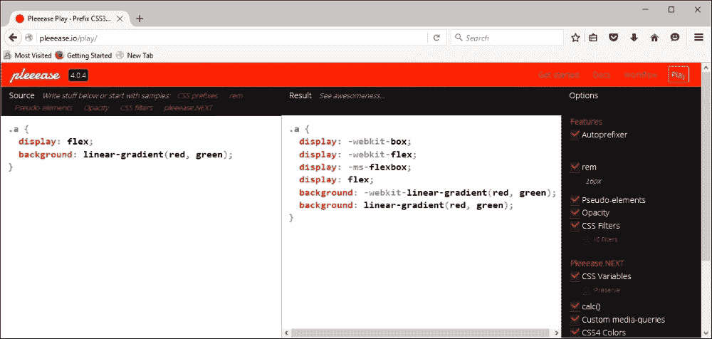

好了，闲话不多说：现在是时候实际操作了！对于一些人来说，在命令行中编译可能就足够了，但在这个自动化时代，为什么要把时间花在执行可以轻松自动化的手动流程上？

## 使用任务运行器编译

如果到现在你还没有猜到，我是一个 Node.js 的忠实粉丝——我选择的任务运行器是 Gulp。以前是 Grunt，但我发现 Gulp 的使用起来更容易——我不确定为什么！无论如何，两者都可以与 Pleeease 一起使用，所以如果你的首选不是 Gulp，那么请随意相应地修改代码。

让我们一步步完成使用 Gulp 运行编译过程的步骤：

1.  启动一个 Node.js 命令提示符会话，然后更改工作文件夹到我们的项目区域。

1.  在提示符下，输入以下命令，每输入一个命令后按 *Enter*：

    ```js
    npm install gulp-pleeease

    ```

    保持 Node.js 命令提示符会话开启——我们很快就会需要它。

1.  从本书附带的代码下载中提取 `T65 – using gulp-pleeease` 文件夹的副本到我们的项目区域根目录。

1.  将 `package.json` 和 `gulpfile.js` 文件复制到我们的项目区域根目录，然后将 `src` 文件夹下的 `example.css` 复制到项目区域根目录的 `src` 文件夹。

1.  返回 Node.js 命令提示符会话，然后在提示符下输入 `gulp` 并按 *Enter*：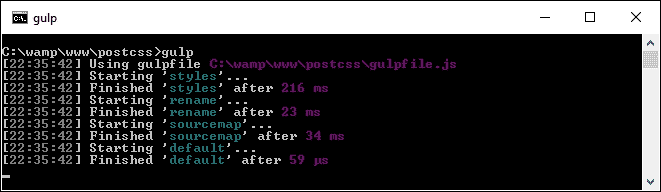

假设编译成功，Gulp 将在我们项目区域根目录下的`dest`文件夹中生成现在熟悉的文件。如果我们查看结果，我们应该看到它已经压缩了文件，添加了供应商前缀，并将`blue`和`red`颜色属性转换为它们的等效十六进制值。

让我们好好利用这项技术，创建一个简单的网页，作为我们如何使用 Pleeease 的示例。当我们检查 Gulp 文件时，我们会看到我们不需要使用之前练习中一半的插件，因为 Pleeease 在其插件内部添加了这些支持。

## 使用 Pleeease 构建示例

在本书的许多演示中，我们不得不导入一系列插件来管理不同的任务，例如压缩代码或检查其一致性。

这种方法在技术上没有错误，但效率不高——毕竟，为什么需要六种工具，而一种工具就足够了，对吧？我们试图在整个书中保持一个插件对应一个任务的规则，那么为什么我们要打破这个惯例呢？

使用 Pleeease 的好处是它已经包含了对一些任务的内置支持，否则这些任务可能需要单独的插件；这意味着我们可以从 Gulp 任务文件中删除一些插件。Pleeease 只是一个通过一个通用接口抽象支持六个其他插件的层。

让我们将其用于编译简单网页的样式：

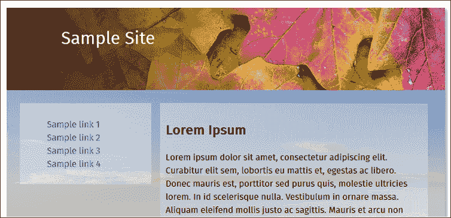

让我们开始吧：

1.  我们将像往常一样，从本书附带的代码下载中提取`TXX – creating a page using pleeease`文件夹的副本；将其保存到我们项目区域的根目录。

1.  从`css – completed version`文件夹中，将`styles – pre compile.css`文件复制到我们项目区域根目录下的`src`文件夹；将其重命名为`styles.css`。

1.  将`gulpfile.js`和`package.json`文件从`tutorial`文件夹的根目录复制到项目区域的根目录——这些文件应该替换掉我们项目区域根目录下已有的文件。

1.  启动一个 Node.js 命令提示符会话，然后更改工作文件夹到项目区域。

1.  在提示符下，输入`gulp`然后按*Enter*——Pleeease 现在将编译我们的代码，并在我们项目区域根目录下的`dest`文件夹中输出有效的样式表文件。

1.  完成后，将`dest`文件夹的内容复制到`tutorial`文件夹内的`css`文件夹。

如果我们尝试通过双击`webpage.html`来预览我们工作的结果，我们应该看到一个网页出现，类似于这个演示开始时的截图。然而，真正的证明是在 Gulp 任务文件中——与我们在早期演示中创建的其他示例相比，我们已经完全删除了一个任务，并且将引用的插件数量减少了超过一半！

# 使用其他预处理器编译

然而，有一个问题——到目前为止，我们使用 Pleeease 所做的所有工作都是基于 PostCSS 的；如果我们使用 SASS 作为生成代码的基础呢？

不幸的是，这正是 Pleeease 的不足之处——尽管它包括对 SASS、Stylus 和 Less 的支持，但它仍然非常实验性。一个导致问题的例子是在嵌套方面；当配置为使用 SASS 时，Pleeease 尚未支持嵌套。这降低了使用 Pleeease 的吸引力——毕竟，使用 PostCSS 的一个关键原因就是消除对 SASS 等库的任何依赖！

要解决这个问题，意味着使用`gulp-sass`插件。这是一个`libsass`库的包装器。为了实现这一点，我们会在我们的 Gulp 任务文件中添加一个这样的任务：

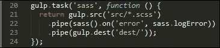

当使用这种方法时，我们可以在使用 PostCSS 插件转换之前，预先编译我们的 SASS 代码为有效的 CSS。问题是，这似乎是一种编译代码的低效方式——有一个更好的替代方案，那就是 PreCSS 库。

# 使用 PreCSS 库

*好的……那么为什么它更好，你可能会问？*

简单的回答是，我们可以直接编译类似 SASS 的代码，而不需要使用像 libsass 这样的外部库。然而，这里的区别在于它适用于类似 SASS 的代码，而不是直接的 SASS。

虽然这并不是一个问题——我们可以轻松地使用文本编辑器进行搜索和替换，以进行必要的格式更改，使其与 PreCSS 兼容。库源代码可在[`github.com/jonathantneal/precss`](https://github.com/jonathantneal/precss)找到；开发者甚至为我们提供了一个在线沙盒[`jonathantneal.github.io/precss/`](https://jonathantneal.github.io/precss/)，以便我们在提交代码前尝试更改。

到这一点，我们将打破常规——而不是制作一个简单的网页，让我们大胆一些，使用像 WordPress 这样的内容管理系统。为什么？好吧，有两个原因：WordPress 已经使用了 PostCSS 和 SASS——继续使用相同的工具是完美的！基于这一点，让我们深入探讨并更详细地查看如何使用这两个工具。

# 转换 WordPress 安装

我们迄今为止的所有示例都基于单页；许多开发者可能会使用像 WordPress 这样的内容管理系统。

幸运的是，我们可以将迄今为止使用的许多相同原则应用于 WordPress 的样式——事实上，有一些插件我们可以使用，它们模仿 SASS，这是用于创建作为每个 WordPress 下载部分的核心样式表的 SASS。我们将使用的主题是 Twenty Sixteen，自 2015 年 12 月以来的 WordPress 当前版本都包含这个主题；它也可以从[`wordpress.org/themes/twentysixteen/`](https://wordpress.org/themes/twentysixteen/)下载。

在本章剩余部分，我们将探讨一些我们可以使用的技巧和窍门，以将 PostCSS 集成到 WordPress 主题中。这里的一个关键点是，我们已经介绍了一些可以使用的任务——通过谨慎规划和设计，一些可以很容易地重用于为 CMS 应用程序创建样式表。我们将探讨一些我们可以使用的技巧和窍门——尽管这些将针对 Twenty Sixteen 主题，但它们同样可以用于为 WordPress 开发的其它主题。

### 注意

下一个示例假设您对 WordPress 有一定的了解，以及使用 SASS 或 Less 的一些基础知识——如果您是这两个应用程序的新手，我建议您阅读相关主题。

让我们开始吧。我们的第一个任务是设置我们的环境，以便使用。不过，在我们设置环境之前，我强烈建议您手头备有本章代码的副本——将要讨论的许多内容都将参考代码！

# 设置我们的环境

为了充分利用本章内容，我们需要设置一个 WordPress 的安装环境——对于初学者来说，有两种实现方式：

+   我们可以使用 Web 服务器（如 WAMPSever [`www.wampserver.com/en`](http://www.wampserver.com/en)）或 Apache ([`www.apachefriends.org`](http://www.apachefriends.org)——如果您是 Linux 或 Mac 用户)将 WordPress 作为本地托管应用程序安装

+   我们可以使用安装在个人在线空间上的 WordPress 版本

为了本书的目的，我们将使用前者——要获取 WordPress，请访问[`www.wordpress.org`](http://www.wordpress.org)，然后在屏幕右侧（靠近顶部）点击蓝色的**下载 WordPress**按钮。

我将假设我们的 WordPress 版本已经在本地的`C:\wamp\www\wordpress`下安装，使用您选择的本地 Web 服务器，按照[`codex.wordpress.org/Installing_WordPress`](https://codex.wordpress.org/Installing_WordPress)中提供的说明进行操作。我的首选是使用 WAMPServer（可在[`www.wampserver.com/en`](http://www.wampserver.com/en)获取），但如果您想使用不同的 Web 服务器或文件夹，请相应调整步骤。

好的，WordPress 安装、配置并准备就绪后，让我们继续前进。下一步是查看我们开始转换过程可用的选项。

### 注意

本章剩余部分给出的步骤将针对 Windows 平台，因为这是作者通常使用的平台；如果您使用 Linux 或 Mac 设备，请相应调整。

# 考虑转换过程

当您处理一个普通的 WordPress 样式表时，您可能会问从哪里开始？

好吧，我们首先不应该做的事情就是被其大小所吓倒。是的，我知道这听起来可能有些疯狂（毕竟，Twenty Sixteen 主题有 3920 行！），但只要有些规划，我们就可以轻松地将它分解成更易于管理的部分。

如果我们只通过 PostCSS 完成一个任务，那么这个任务必须是利用`postcss-import`插件来帮助我们将代码分解成更易于管理的原则。如果你恰好使用过 SASS 或 Less 这样的处理器，那么原理是相同的——在我们的主`style.css`文件中，我们可以创建一系列导入语句，并将每个块分离到单独的文件中。

一旦我们将样式表分解成更易于管理的块，我们可以在代码中实现相当多的事情；我们应该始终将其视为一个迭代过程，直到我们用尽所有可能的替代方案，网站不再需要，或者我们迁移到不同的解决方案。在接下来的几页中，我们将介绍一些可能出现的想法和考虑因素——这应该有助于你开始对你的主题进行更改。所以，无需多言，我们从哪里开始呢？

好吧，显而易见的一个选择是使用 Autoprefixer；WordPress 很好地利用了 CSS3 样式，其中相当一部分仍然需要供应商前缀。不过，这里有一个考虑因素，那就是我们将从原始样式表反向工作，我们需要移除现有的供应商前缀，并将任务运行器设置为自动添加这些前缀。这是在 WordPress 中处理现有样式表的一个必要之恶，但至少我们只需要做一次！可能会有创建一个 mixin 来管理供应商前缀的诱惑，但这并不是最佳实践——Autoprefixer 会在每次编译时更新样式。

我们已经熟悉了从之前的例子中使用 Autoprefixer——同样，我们还可以考虑压缩我们的代码，这有助于减少带宽使用。添加这样的功能应该轻而易举——我们可以使用之前演示中的相同任务，只要我们设置正确的任务顺序。我们需要将其更改为直接编译`style.css`（这是 WordPress 样式表的主要文件），但由于我们的处理器将针对 WordPress 使用，这不会成为问题。

另一个我们可以关注的领域是 rem 单位支持，带有像素回退。许多开发者对使用 rem 作为度量单位有自己的看法；有些人说像素值效果一样好，但它的适用性将取决于应用的位置。抛开这一点，Gulp 有一个合适的插件可以帮助我们提供这项功能，如果我们需要的话。

真正对我们代码产生影响的一种方式是使用嵌套——这是 SASS 等预处理器中的一种常见技术，涉及以嵌套格式编写代码。关键好处是移除重复的代码——可以将其视为一种简写（从某种意义上说），它将在编译时转换为有效的 CSS。

另一个值得一看的技术是变量的使用；它们的工作方式与脚本或编程语言非常相似。现在在你跑向山丘之前，别担心：它们很容易使用。我们需要提供一个占位符名称列表，以及它们代表的值；然后我们可以在代码中对每个值进行搜索和替换，并用适当的变量替换它。你可能会问为什么这样做？嗯，很简单：如果你将来更改颜色，你只需要在一个地方更改它；PostCSS 将在编译阶段自动为你更改所有其他实例。

如果你真的想深入 WordPress 的核心代码，那么探索[`core.trac.wordpress.org/browser/trunk/`](https://core.trac.wordpress.org/browser/trunk/)的代码仓库总是值得的。如果你仔细观察，甚至可以看到 PostCSS 的使用情况！

好了，别再闲聊了：让我们开始写代码吧！我们将在下一个演示中进行的修改只是我们如何将 PostCSS 插件（或者 Gulp）的使用纳入我们流程的一些方法之一。我们将首先探索我们需要进行的修改，然后提供一些使用 PostCSS 的尝试想法。

# 对我们的代码进行修改

虽然我们只介绍了一些想法，但仍然有许多步骤需要完成；这个问题的关键（以及保持你的理智！）是分块完成每个步骤，而不是一次性完成所有。

我们的大部分更改将使用我们在早期演示中创建的现有任务；我们将添加 PreCSS 库（来自[`github.com/jonathantneal/precss`](https://github.com/jonathantneal/precss)），以及 postcss-import 和 gulp-pixrem 插件。考虑到这一点，我们将开始——我们的第一个任务是分割代码成更易于管理的样式表。

## 分割我们的样式表

这个过程的关键部分是将我们的样式表分割开——为此，我们将使用来自[`github.com/postcss/postcss-import`](https://github.com/postcss/postcss-import)的`postcss-import`插件：

1.  我们将像往常一样，启动一个 Node.js 命令提示符，然后更改工作文件夹到项目区域的根目录。

1.  在提示符下，输入以下命令，然后按*Enter*：

    ```js
    npm install postcss-import --save-dev

    ```

1.  等待 Gulp 完成安装过程。

接下来，我们需要将样式表分割成单独的块；最方便的方法是按照`style.css`顶部的列表将其分割成部分：

1.  在项目区域的根目录下的`src`文件夹中，创建一个名为`css`的新文件夹。

1.  打开位于`C:\wamp\www\wordpress\wp-content\themes\twentysixteen\`的 Twenty Sixteen 文件夹中的`style.css`副本。

1.  将此保存到项目区域的根目录下的`src`文件夹中。

1.  在第 53 行或附近，添加以下行：`@import "css/variables.css";`。现在不用担心它将用于什么——这将在本章的后面变得清楚。

1.  找到第 54 至 252 行，然后将它们复制到一个新文件中——将其保存为`normalize.css`，位于根`src`文件夹内的`css`文件夹中。

1.  在`src`文件夹内的`style.css`文件中，添加这些导入语句，如指示：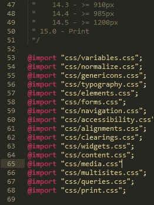

1.  重复此过程，直到您已将所有部分提取到各自的文件中（1 至 15）。使用与每个主要部分相同的名称保存它们。

    ### 注意

    注意，在保存文件时，您*不需要*将第 11 至 15 节分割成子部分——保持这些部分在其各自的文件中。

1.  我们还需要执行最后一步：我们需要我们的 Gulp 任务文件！从伴随本书的代码下载中，请从`T68 - converting a WordPress theme`文件夹中提取`gulpfile.js`和`package.json`的副本，然后将它们都保存到项目区域的根目录下。

1.  快速查看`gulpfile.js`文件，特别是第 31 至 35 行：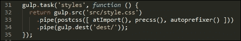

注意我们是如何直接编译到`style.css`的，这与之前的练习不同？这并不理想，但鉴于 WordPress 主题默认使用`style.css`，这是我们可以在编译过程中容忍的部分。

## 添加供应商前缀支持

我们接下来的任务是安装添加供应商前缀的支持——从某种意义上说，我们已经在之前的示例中介绍了如何实现这一点。我们之前的多数，如果不是所有，演示已经包括了对供应商前缀的支持，使用了 Autoprefixer 插件。

作为提醒，Autoprefixer 可以从[`github.com/postcss/autoprefixer`](https://github.com/postcss/autoprefixer)获取；我们有一个在线版本可以用来测试更改，在[`autoprefixer.github.io/`](https://autoprefixer.github.io/)。

如果我们查看之前示例中下载的 Gulp 任务文件，我们可以看到 Autoprefixer 插件已经被作为触发 PostCSS 的一部分调用：


然而，在这个阶段，我们应该注意几个关键点。

当使用 Autoprefixer 插件时，它会使用来自 Can I Use 网站([`www.caniuse.com`](http://www.caniuse.com))的数据来更新它找到的任何过时的供应商前缀。花时间检查您的样式表以确保它尚未包含供应商前缀是很值得的——如果包含，这些前缀需要被删除。

我们可以手动删除它们，或者更有效的方法是使用来自[`github.com/johnotander/postcss-remove-prefixes`](https://github.com/johnotander/postcss-remove-prefixes)的`postcss-remove-prefixes`插件。我们可以将其添加到我们的 Gulp 任务文件中，或者直接从命令行运行它。这里的关键是首先完成删除，这样 Autoprefixer 就可以用来管理供应商前缀。

WordPress 已经使用 Autoprefixer 来管理供应商前缀——你可以在[`core.trac.wordpress.org/browser/trunk/Gruntfile.js`](https://core.trac.wordpress.org/browser/trunk/Gruntfile.js)的`Grunt`文件中看到它的证据。当然，它使用的是 Grunt，但对于使用 Gulp 或其他与 PostCSS 兼容的任务运行器的人来说，这个过程非常相似：

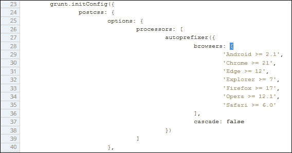

虽然在我们的 Gulp 任务文件中设置 Autoprefixer 非常简单——至少是基础设置——但它只有在花费时间移除任何可以自动在编译时添加的供应商前缀的情况下才会成功。`postcss-remove-prefixes`插件将移除如下简单示例，这样我们就可以留下不带前缀的版本，Autoprefixer 可以在编译时更新它们：

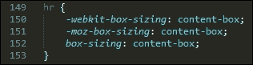

我们应该执行的最后一个核心任务是检查代码的一致性——到目前为止，这应该是一个非常熟悉的任务，因为我们已经从早期的演示中设置了一个合适的任务，可以很容易地用于编译 WordPress 主题。现在是时候重新审视这个任务了。为了确保它能够正确工作，我们需要稍微修改一下设置，现在就让我们来谈谈这一点。

## 检查代码一致性

如果我们查看这些更改开始时保存的 Gulp 任务文件，我们应该看到这个配置对象：

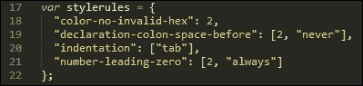

有一点更往下是任务，这里有两个更改：我们硬编码了`destination`文件，并调整了顺序，以便允许`pxrem`任务的存在。配置对象中的缩进设置也发生了变化——当编译时，样式表使用制表符进行缩进。

这将引发大量警告，我们可以手动更改 3000 多个条目，或者更改检查缩进的方式。希望这很容易就能明白我们更愿意做哪一种，至少在短期内是这样！

除了这两个更改之外，linting 任务的其余部分没有变化：

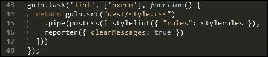

好吧，让我们换个方向：还有一个核心任务我们应该运行，那就是压缩我们的代码。我们已经在多个演示中使用了它，但现在让我们花点时间在编译 WordPress 主题的上下文中重新审视它。

## 压缩我们的代码

如果我们必须对使用 PostCSS 可以执行的前四项关键任务进行排名，那么接下来的这个任务肯定应该排在最前面。压缩我们的代码对于节省带宽使用至关重要——WordPress 主题可不是轻量级的！

我们的 Gulp 文件已经内置了这个：`package.json`文件将设置适当的引用。如果我们更详细地查看任务文件，我们应该看到类似以下的内容：

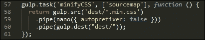

看起来熟悉吗？应该是的——它几乎是我们之前演示中使用的现有任务的直接复制。我们已经关闭了`autoprefixer`，因为我们在 Gulp 文件的其他地方使用了它。

让我们继续前进。WordPress 使用 SASS 作为其主要预处理器；我们可以使用 Pleeease 库来编译 SASS 和 PostCSS 代码，但一个更干净的选择是使用 PreCSS 库。这个库抽象了对许多模拟 SASS 代码的插件的支持（但可以说没有 SASS 的负担）。让我们深入探讨并更详细地看看这一点。

## 创建变量

SASS（以及其他处理器）的一个关键特性是能够使用变量作为值的占位符——这些在编译时被转换为有效的 CSS 样式。

你可能会问，为什么使用它们？简单来说，如果你决定更改字体家族或颜色，你希望翻遍数千行代码来更新所有使用过的地方吗？我希望答案是“不”——这是完全正确的：我们还有更重要的事情要做！其中之一就是安装那个将添加变量支持的插件，形式为 PreCSS。

我们已经从之前的演示中安装了 PreCSS，所以剩下的只是确保将其添加到我们的 Gulp 任务文件中相应的地方（它已经在我们的文件中，并且在附带的`package.json`文件中）：

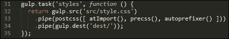

真正的工作在于更改我们的样式表——让我们看看需要做什么：

1.  首先，我们需要创建一个文件来存储我们的变量——请在项目区域的根目录下的`src`文件夹中的`css`子文件夹中创建一个空白文件，并将其命名为`variables.css`。

1.  打开`variables.css`文件。继续添加这些值：

    ```js
    /**
     * 0 - Variables
     */

     /**
     * 0.1 - Colors
     */
    $lightgray: #d1d1d1;
    $almostblack: #1a1a1a;
    $verydarkgray: #686868;
    $white: #ffffff;
    $verylightgray: #f7f7f7;
    $strongblue: #007acc;

    /**
     * 0.2 - Fonts
     */
    $Monserrat: Montserrat, "Helvetica Neue", sans-serif;
    $OpenSans: "Open Sans", sans-serif;
    $Merriweather: Merriweather, Georgia, serif;
    $Inconsolata: Inconsolata, monospace;

    /**
     * 0.3 - Font Sizes
     */
    $baseSize: 16px;
    ```

1.  保存文件，如果我们回顾一下*拆分我们的样式表*，你会注意到我们已经从我们的主样式表中包含了对其的链接：

1.  来自此文件的值将替换我们代码中的占位符，以生成有效的 CSS。

1.  下一个任务是必要的恶行，我们必须逐个处理要导入的每个样式表，并将现有值替换为变量等效值。这个截图显示了部分示例——在这里，`font-family`值已经更新，但`border`值尚未更改：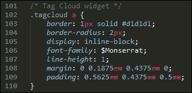

1.  一旦每个文件都进行了更改，然后保存每个文件，为下一个练习做好准备。

没有简单的方法可以绕过这个问题，但修改 WordPress 主题样式表可能需要大量的耐心！最好的办法是使用你编辑器的搜索和替换功能——例如 Sublime Text 3（作者的偏好编辑器）有一个非常有用的功能，可以在多个文件中替换文本；利用这个功能将有助于减少手动更新每个文件所需的工作量。

## 添加对 rem 单位的支持

下一个任务可能会引起争议——将我们的代码更改为使用 rem 单位，并自动添加像素回退。

一些开发者声称像素值效果一样好；其他人说，这完全取决于你需要在哪里指定值，以及使用哪种度量单位。无论如何，我们可以使用 PostCSS 自动添加像素回退支持。此插件的源代码可在`https://github.com/gummesson/gulp-pixrem`找到。让我们探索添加对 rem 单位支持所需的内容：

1.  打开一个 Node.js 命令提示符会话，或者如果上一个会话的命令提示符仍然可用，则切换到它。

1.  确保工作文件夹设置为我们的项目文件夹的根目录，然后在提示符中输入此命令并按*Enter*：

    ```js
    npm install gulp-pixrem --save-dev

    ```

1.  Gulp 将移除并安装插件——等待它完成后再继续。

1.  我们已经有了我们的 Gulp 任务文件——如果我们仔细查看，我们可以看到它在第 39 行被调用：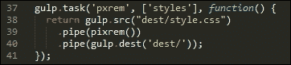

到目前为止，我们已经准备好了所有东西——下一个任务是逐一处理我们创建的各种样式表，并将任何像素值替换为 rem 等效值。

这是一项不受欢迎但必要的任务——插件通过在我们的代码中找到的任何 rem 单位的实例添加像素回退值来工作。至于改变值，我们想改变多少就改变多少——确保代码可以编译是值得做一些改变的，但剩余的改变可以逐步进行。

在编译代码时，我们最终会得到类似这个示例的代码——这个摘录来自小部件部分（第十部分）：

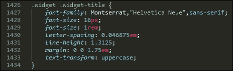

将我们的样式表简单地转换为使用像素回退支持很容易——关键是我们需要决定在哪里想要使用 rem 单位支持，以及在哪里使用像素或 em 单位等现有值会更合适。

接下来，我们可以在编译过程中设置两个更多任务——模仿 SASS 嵌套样式的功能，或者创建迷你循环来自动生成某些样式怎么样？如果你不熟悉这些，不要担心——让我们深入看看这些在实际操作中的意义。

## 我们样式表中的嵌套规则

使用处理器如 SASS 时，样式的嵌套是一个常见功能——如果我们有一堆具有非常相似选择器的样式，那么它就会产生一定程度的无用的重复。

我们可以继续这种重复，但更合理的选项是取选择器的核心部分，然后在那个块内嵌套后代——这个例子是从`typography.css`文件中取的：

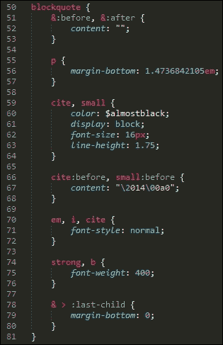

想法是避免不得不写相同的重复父级样式——我们可以专注于子级！虽然代码看起来更长，但确实更容易阅读；我们可以将具有共同父级的样式组合在一起。

这个技术很容易掌握，但可能具有欺骗性的难以正确应用；如果你不熟悉它，那么我建议你看看我的两本关于 SASS 的书《SASS Essentials》和《SASS CSS How-to》，可在 [`www.packtpub.com/`](https://www.packtpub.com/) 购买。

编译完成后，代码将显示为正常的 CSS。但有一点需要注意：抵制嵌套一切的诱惑；嵌套最好保留在你能看到代码使用量真正有差异的地方！

## 循环样式

我们还可以对我们的代码进行一项更改——看看我们在本章早期创建的 `media.css` 文件，特别是从第 158 行到末尾：

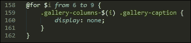

我已经能听到接下来可能的问题了，这是什么意思，为什么我们在代码中使用看起来像编程循环的东西？在这个例子中，我们借鉴了 SASS 的一个原则，即创建循环；结合字符串插值，这使我们能够自动创建规则。

### 小贴士

字符串插值是在我们的代码中创建一个占位符，该占位符将在编译时用值替换。

当代码编译时，代码将呈现如下：

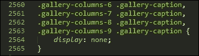

这是一个更高级的概念，但确实值得花时间去掌握——如果应用得当，它可以在创建样式时节省大量时间！

让我们改变一下方向——我们已经介绍了一些帮助你入门的概念；还有一些想法我们可以在基础知识建立后，稍后再跟进。让我们花点时间更详细地考虑这些。

## 考虑未来的可能想法

在过去的几页中，我们介绍了一些可以使用 PostCSS 来帮助更好地管理我们的 WordPress 样式表的领域。重要的是要记住，并没有一成不变的规则来决定应该使用什么，但每个样式表都会有它自己的需求。

我们所讨论的选项只是触及了可能性的表面——对于那些熟悉 SASS 的你，你可能想知道为什么我们没有使用 SASS 混合，例如。简单的原因是，没有任何阻止我们这样做：一切都是关于提供在转换阶段快速且容易获胜的选项。

让我们暂停一下，考虑一些其他可以帮助我们开始更新样式表的思路：

+   **添加混合**：这是一个显而易见的选择，但需要规划；这将涉及到创建可以在我们代码中随意重用的代码块。

+   **颜色回退**：尽管这并不是我们迄今为止使用的 PreCSS 包的一部分，但颜色回退是另一个可以考虑的选项。核心 WordPress 主题使用标准的 HEX 表示法；我们可以将其更新为使用 RGB 等效值，并使用 PostCSS 插件添加 HEX 值。如果我们愿意，甚至可以使用如 postcss-rgba-hex 之类的插件将 RGBA 颜色转换为纯 HEX——你可能更喜欢使用前者，或者有需要使用该格式的流程。

+   **字体支持**：我们是否可以整合 PostCSS 的字体魔法师插件？如果我们查看之前创建的`variables`文件，它将包含一些非标准字体（至少对 Windows 来说是这样）；这意味着我们的 WordPress 主题看起来可能有点单调，至少可以说！幸运的是，我们可以使用字体魔法师插件为非标准字体提供 font-face 支持；大多数，如 Inconsolata、Open Sans 和 Merriweather，都可以在 Font Squirrel 网站上找到，网址为[`www.fontsquirrel.com`](http://www.fontsquirrel.com)。

我们只挑选了三种方法来帮助扩展你的主题——使用像 Gulp 这样的任务运行器，我们实际上只受 Gulp 插件可用性的限制。我们不必仅限于 PostCSS 插件；这将限制我们能做什么，意味着我们错过了有用的功能。这里的关键是考虑你想要做出哪些更改，并计划如何以及何时进行这些更改——这个过程应该是迭代的，这将有助于管理这些更改！

# 编译和测试更改

在过去的几页中，我们介绍了一些非常适合编译 WordPress 主题的关键任务。

在一个理想的世界里，我们会尽可能地自动化，或者至少是那些有意义的任务——例如，移除手动执行时价值不大的任务。然而，关键是要充分考虑这些任务应该按照什么顺序执行；正确的顺序可能是得到一个有效样式表文件用于使用，和得到……好吧，只能称之为垃圾！是的，这听起来可能有些极端，但如果任务顺序不正确，那么你可能会得到破坏你主题的编译文件。

把这个放在一边，让我们来看看如何编译我们的代码——为了这个练习，我们将使用这本书附带的代码下载中可用的预编辑文件副本。

### 注意

在继续之前，你可能想保存你创建在项目区域根目录下的`src`文件夹中的源文件副本，以备安全之需。

为了让大家对我们将要讨论的内容有一个感性的认识，这是 Twenty Sixteen 主题实际应用的截图摘录：

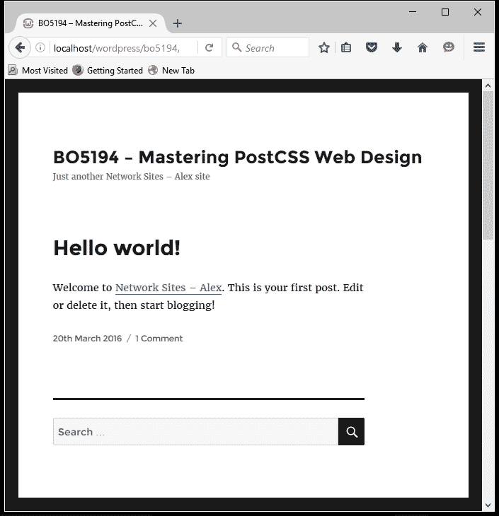

让我们开始吧：

1.  我们将首先下载并解压`src`文件夹的副本，该文件夹位于代码下载中的`T68 - 转换 WordPress 主题`下；将其保存到我们的项目区域根目录。首先确保这个文件夹中没有任何其他文件！

1.  接下来，请确保我们之前下载的`gulpfile.js`和`package.json`文件仍然存在——在编译过程中我们需要这两个文件。

1.  请继续启动一个 Node.js 命令提示符会话，然后将工作文件夹更改为我们的项目区域根目录。

1.  在提示符下，输入`gulp`然后按*Enter*键；Gulp 将运行每个任务，并在我们的项目区域根目录的`dest`文件夹中输出一个编译后的主题文件。

1.  将此复制到`Twenty Sixteen`文件夹的根目录，该文件夹位于`C:\wamp\www\wordpress\wp-content\themes\twentysixteen`——如果你使用 Linux 或 OSX，请相应地更改路径。

现在我们已经完全编译了样式表！但也有一些需要注意的点——例如，我们在这部分前面提到的任务顺序与`gulpfile.js`文件中显示的顺序不匹配。现在让我们来讨论这些点：

+   你可以包含的任务可以分为两组——我将其描述为核心任务，例如压缩文件或提供源映射；这些任务可以对任何网站执行。第二组是自定义任务——这些任务将针对每个网站特定，可能包括编译变量或嵌套代码的请求。如何规划这些任务的创建取决于你，这样你就可以在未来的项目中重复使用它们。

+   关于一个 Gulp 任务文件应该包含什么，没有正确或错误答案；你想要包含的任务以及它们的调用顺序最终将由你的需求决定。在我们的例子中，我们使用了以下顺序，从上到下：

    | 任务名称 | 目的 |
    | --- | --- |
    | `styles` | 这个任务编译了原始代码——将规则合并到一个文件中，通过 PreCSS 处理代码，并在需要的地方更新供应商前缀。 |
    | `pxrem` | 在设置好基本代码后，我们现在可以运行它，并为 rem 单位添加适当的像素回退。 |
    | `lint` | 在这个任务中，我们正在检查编译后的代码的一致性。 |
    | `rename` | 然后，我们将我们的基本编译文件重命名为具有`.min.css`扩展名；这是为了准备压缩我们的代码。 |
    | `sourcemap` | 在这个阶段，我们想要生成一个源映射，因此这个任务会启动以为我们创建一个合适的映射文件。 |
    | `minifyCSS` | 最后的任务是压缩 CSS 样式表文件——它已经具有正确的扩展名。 |

我们已经完成了艰苦的工作——现在是时候看到我们劳动成果的实际效果了。样式表现在位于我们 WordPress 安装的`theme`文件夹中——剩下的只是测试它！我们可以使用自动化测试工具，如 Quixote（可在[`www.quixote-css.com/`](http://www.quixote-css.com/)找到），但这将超出本书的范围。相反，我们可以简单地启动我们的本地 WordPress 安装，查看它看起来如何——这是一种有用的方法来评估我们的主题是否有任何问题。

为了我们的演示，我们使用了 Twenty Sixteen 主题。这个主题默认情况下非常简洁。虽然这看起来可能不多，但我们已经完成了在 WordPress 中实现 PostCSS 工作流程所需的大部分艰苦工作。成功的关键衡量标准是基础主题应该与 WordPress 附带的原版完全相同。如果是这样，那么这意味着我们现在可以集中精力在一段时间内操纵我们的样式表，以进一步开发这个（或任何其他）主题中的样式。

# 摘要

使用 PostCSS 的成功将部分取决于你的代码从现有的处理器（如 SASS）转换得有多好——这需要规划和采用迭代的方法来转换代码。我们已经介绍了很多技巧和想法来帮助这个过程，所以让我们花点时间回顾一下我们已经学到的内容。

我们从探讨转换过程开始，并介绍了一些可能用到的插件来帮助这个过程。然后我们转向介绍 Pleeease 库，在快速演示中使用它之前，我们查看如何安装和配置它。

接下来，我们简要讨论了为什么 Pleeease 可能不像我们最初认为的那么有用；然后我们介绍了使用 PreCSS 库作为过渡到 PostCSS 的更好替代方案。

然后，我们深入探讨了使用 PreCSS，通过为 WordPress 的标准主题进行修改来工作——我们发现了我们可以在初始更改时使用的一些技巧和窍门来快速取得成效。然后，我们通过查看编译我们的代码，并在标准 WordPress 安装中检查它以确保它仍然按预期工作来结束这一章。

呼吸，我们已经覆盖了很多内容！通过仔细规划和采用迭代的方法，我们可以从使用处理器如 SASS 过渡到使用 PostCSS。然而，有时我们的代码可能不会按预期工作——我们的代码可能在几个地方出现问题，所以我们将在下一章中介绍它们。
