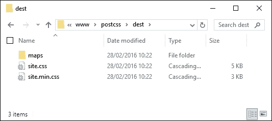

# 第十三章. 解决 PostCSS 问题

对于许多读者来说，PostCSS 可能会有些令人困惑——毕竟，它仍然是一个相对较新的库，与其他处理器不同！在整个书中，我们一直在进行探索之旅——我们将以查看一些最佳实践的技巧和窍门以及一些故障排除的提示结束，以防我们发现自己陷入了困境。

在本章的整个过程中，我们将查看一些在创建 PostCSS 处理器时可能会遇到的一些常见问题。我们将看到解决它们是多么容易，并发现如果问题不像我们预期的那样容易解决，我们接下来应该做什么… 

在本章中，我们将涵盖多个主题，包括以下内容：

+   解决一些常见问题

+   详细探索一些常见问题

+   寻求他人的帮助

让我们开始吧！

# 解决一些常见问题

在一个理想的世界里，我们构建的任何处理器都将完美无瑕地工作，无论我们使用哪种任务运行器或方法来处理每个 PostCSS 任务。我们的目标是最终得到一个或多个成功编译的文件，如下例所示：



但正如我们所知，并非所有事情都能 100%顺利；如果真的如此，我们可能要么非常幸运，要么事情开始变得平凡无奇！

作为实用主义者，我怀疑大多数人都会在掌握 PostCSS 的过程中遇到某种形式的问题；在本章的整个过程中，我们将探讨一些更常见的问题，如何解决它们，以及汇总一些我们可以使用的技巧和窍门，以帮助我们在使用 PostCSS 时生活更加轻松。让我们先详细看看我们可能会遇到的一些更常见的问题。

# 探索一些常见问题

PostCSS 作为一个处理系统，设置和使用都很简单，但在开发过程中偶尔我们可能会遇到一些问题。当然，这些问题会有所不同，但为了帮助您，我们可以探讨一些我们在开发过程中可能会遇到的一些更常见的问题。

为了本章的目的，我们将假设已经使用了 Gulp 任务运行器——你可能会在其他任务运行器（如 Grunt 或 Broccoli）上看到类似的问题。是时候更详细地探索这些问题了。

## 不兼容您的操作系统…

PostCSS 的美丽之处在于我们可以安装成百上千个插件之一——如果我们使用 Gulp 这样的任务运行器，那么我们可以轻松地将其扩展到大量可用的插件。

在大多数情况下，插件将无故障安装；你可能会偶尔看到这个出现：


对我们来说最重要的警告信息不是`ENOENT`消息，而是这个：

```js
notsup: Not compatible with your operating system or architecture: fsevents@1.0.6

```

应该注意的是，这只是一个警告，而不是错误（在这种情况下）——这是由于使用了 `fsevents`，它仅适用于 MacOSX，在 Windows 或 Linux 环境中无法工作。在大多数情况下，这可以忽略，尽管明智的做法是测试您的处理器，以确保它没有对您的代码产生任何不利影响。

### 注意

这个错误不仅限于 `fsevents`——它可以应用于任何不支持的环境中的包。

## 任务 '<name of task>' 不在您的 gulpfile 中

我们创建了一个包含多个任务的 Gulp 任务文件，并运行它来编译我们的样式表。结果，我们没有得到处理后的文件，而是得到了这条消息：


这是由 Gulp 任务在 gulp 文件中不存在引起的——在这个声明示例中，我们正在调用 `rename` 任务：


但查看 gulp 文件后，我们发现其中没有 `rename` 任务：


这是一个简单的修复方法——只需重命名任务，使名称匹配，然后重试编译。注意，尽管如此——如果多个任务名称错误，则过程将失败，但只会显示第一个出错的任务名称。确保在文件中正确输入每个任务名称，以确保成功编译。

## 找不到模块 '<name of plugin>'

如果任何错误可能会让我们措手不及，那么就是这一个——让我来解释：

当你开始掌握安装 PostCSS 插件时，你会看到许多使用命名约定 `postcss-<name of plugin>` 的插件。这似乎是一个合理的建议，但请注意——并非每个 PostCSS 插件都使用这种命名约定！

一个很好的例子是 Rucksack ——人们会预期使用 `postcss-rucksack`（是的，包括我！），但如果我们这样做，我们会得到这个错误：


结果表明，Rucksack 是那些不使用许多人预期使用命名约定的例子之一。相反，它使用 `rucksack-css`，因为我们预期使用的名称已经被占用。

这就是那些值得阅读文档的实例之一，即使只是为了避免以后造成很多尴尬：


清楚地说明了在安装插件时应该使用什么名称！是的，这种情况可能发生在我们所有人身上……

## ReferenceError: '<name of task>' 未定义

假设我们在 gulp 文件中有一系列任务，但出于某种未知原因，我们在编译代码时遇到了这个错误：


什么可能导致这种情况？嗯，至少有两个可能的原因：

+   我们在任务本身中包含了插件，但忘记在文件顶部的声明中包含对其的引用

+   我们确实在任务中包含了插件及其相关的声明，但不知何故没有使用相同的声明名称

修复方法是确保在 Gulp 任务文件顶部包含声明时，在文件稍后调用任务时使用相同的名称。

## 请提供 postcss 处理器数组！

下一个错误可能会让任何人感到困惑，但修复起来很容易——随着时间的推移，你将开发出自己的处理器；你可能会达到一个点，开始将一些 PostCSS 处理器任务从主 PostCSS 调用中移出，放入它们自己的任务中。

想象一下，你有一个类似于以下的 PostCSS 任务：


有一种自然的倾向将这个任务拆分成单独的任务；毕竟，我赞扬了保持任务名称（即样式）与其在任务中所做事情之间 1:1 关系的优点！然而，如果你走得太远，认为不需要在任务中包含 PostCSS 处理器，那么你可能会遇到类似以下截图的错误：


在你的 Gulp 任务文件中快速检查可能会显示类似以下内容：


我们有一个 `postcss` 任务，但没有包含任何处理器！虽然重新工作处理器以确保我们保持 1:1 关系很有吸引力，但我们必须始终在 `postcss()` 任务中留下一个处理器，以确保其正确运行。

### 注意

你会听到关于术语处理器以几种不同的方式被提及——它们可以同样适用于我们 Gulp 任务文件的通用术语。它也可以适用于应该添加到任何 `postcss()` 任务中的处理器任务。

## package.json 文件中未出现的条目

下一个错误稍微有点难以捕捉，但修复起来很容易——随着时间的推移，你可能会修改你的 Gulp 任务文件；这当然意味着需要从另一个 `package.json` 文件（如果已经安装）中添加新插件，或者如果尚未安装，则重新添加。

由于 Gulp 任务文件只是一个纯文本文件，我们可以在任何文本编辑器中编辑它——我个人的最爱是 Sublime Text 3 ([`www.sublimetext.com/3`](http://www.sublimetext.com/3))，但任何编辑器都足够用。记事本不是一个好选择，因为它无法正确处理行结束符！

除了这个之外，如果我们编辑 `package.json` 文件以删除一个条目，然后添加一个新的条目，我们可能会遇到以下警告：


这个小问题的原因真的很令人烦恼——真令人惊讶，一个单独的字符竟然能引起所有这些警告！罪魁祸首是行尾多余的逗号，在该行后面没有立即列出另一个插件，如截图中的第 27 行所示：


如果我们去掉逗号并重新尝试安装，我们很快就会看到错误已经消失了。

## 编译结果的输出不符合预期

这个最后的错误可能会让人误解——严格来说，甚至都不是一个错误！想象一下，我们使用 Node 和 Gulp 创建了一个杀手级处理器应用程序；它包含了一些与我们之前创建的类似的任务，并且自那以后一直在本书中使用。

我们输入相关命令并按*Enter*。PostCSS 开始编译：到目前为止一切顺利。查看`dest`文件夹，你会发现这个——我们的压缩文件和源映射在哪里？


但等等——错误在哪里？检查编译过程的输出显示没有错误，那么问题出在哪里呢？


这个小异常是由于错误地计算了任务应该运行的顺序造成的——尽管截图清楚地显示了一个错误，但这并不是真正的错误。让我来解释一下。

成功编译过程（以及默认情况下，一个正常工作的处理器）的关键在于确保我们运行的每个任务都是按照正确的顺序触发的。为了生成这个错误，我在`T45 – 转换为使用 Rucksack`演示中的 Gulp 文件中移除了对重命名任务的约束，因此：

```js
gulp.task('rename', function () {
  return gulp.src('dest/*.css')
    .pipe(postcss([ cssnano() ]))
    .pipe(rename('style.min.css'))
    .pipe(gulp.dest("dest/"));
});
```

任务看起来完全没问题，但引入了一个问题——现在我们有两个起始任务了！

这种情况的结果是，样式任务首先运行（因为它在默认任务中首先被调用，从第 36 行开始）。很快，重命名任务（没有约束）接着运行，然后是`sourcemap`和`lint-styles`（遵循对每个任务设置的约束）。

我们最终在`dest`文件夹中只得到一个编译后的文件——重命名和样式任务同时运行；由于后者没有完成，前者无法产生任何内容！

让我们继续。如果所有其他方法都失败了，你发现了一些无法修复的问题，那么是时候寻求帮助了……这里为你作为一个 PostCSS 初学者提供的可用选项快速概述。

# 向他人寻求帮助

在这个阶段，你已经尝试修复了一个问题，但失败了——你并不确定下一步该怎么做…

别担心，有很多经历过这种情况并需要帮助的人！一个好的开始是查看主要文档，它可在[`github.com/postcss/postcss/tree/master/docs`](https://github.com/postcss/postcss/tree/master/docs)找到。如果这没有解决问题，那么谷歌是一个不错的选择；此外，还有一些其他可能有助于解决问题的选项。

## 在 Stack Overflow 记录问题

如果你花费时间在谷歌上搜索，但没有找到之前遇到过这个问题的人，那么你可以在 Stack Overflow 上记录一个问题：


网址是 [`stackoverflow.com/questions/tagged/postcss`](http://stackoverflow.com/questions/tagged/postcss)—这列出了所有带有名称 `postcss` 标签的问题，任何人都可以提出行动方案或希望有帮助的技巧，让你重新开始工作。如果你确实遇到了问题，请尽可能提供你使用的系统详情（Windows、Mac 或 Linux），任何截图或错误详情，以及你采取的导致错误的步骤。

## 使用 PostCSS 查找错误

进一步来说，你也可以记录一个开发请求，或者需要更改代码的问题——为此，请浏览到 GitHub 网站上的问题日志，在 [`github.com/postcss/postcss/issues`](https://github.com/postcss/postcss/issues)：


有几点需要注意：

+   如果你被建议在插件的网站上而不是在 PostCSS 的 GitHub 上记录问题，请不要感到惊讶——许多问题并不是由于 PostCSS 的问题，而是由于插件本身的问题。

+   展示你的任务运行器的任务文件和 `package.json` 的副本可能会有所帮助——一些人们遇到的问题是由于（已知或未知）插件之间的兼容性问题，或者必须遵循特定顺序以确保插件可以使用。

+   PostCSS 插件开发者通常在 Apple Mac 或 Linux 平台上进行开发——这意味着你可能看到的某些错误是由于使用不支持插件中一个或多个命令的平台造成的。

+   如果你使用一个或多个插件时遇到问题，尝试将处理器任务简化到包含引起问题的插件的那些。即使这不能消除问题，它也会帮助缩小原因，并在故障排除过程中避免其他人进行不必要的检查。

+   PostCSS 使用的许可证是 MIT 许可证——这意味着只要版权声明与库一起保留，你可以随意使用该软件。

+   值得注意的是，CodePen 支持使用 PostCSS——你可能发现尝试在线代码（并自动编译）很有用，而不是手动运行处理器。CodePen 只支持有限范围的插件，所以它并不适用于所有场合——但希望对某些场合有用！

    ### 小贴士

    更多详情，请查看 CodePen 网站上的这篇博客文章：[`blog.codepen.io/2015/07/14/postcss-now-supported-on-codepen/`](https://blog.codepen.io/2015/07/14/postcss-now-supported-on-codepen/)。

+   开源软件（以及为 PostCSS 创建的插件）的缺点是插件开发者提供的支持水平参差不齐——虽然对核心系统的支持非常好，但你可能会发现对个别插件的支持并不那么活跃！如果你遇到一个关键问题，不要指望插件开发者能迅速响应——请在 Stack Overflow 上先记录下来，然后再在插件网站上提出。如果问题被确认为需要进一步开发，后者应该被使用。

考虑到这些，祝你好运！PostCSS 正在迅速获得认可——一些知名公司正在使用它，例如 WordPress 和 Google，它肯定将成为非常流行的工具。如果你在使用插件时遇到问题，放弃它将是一件遗憾的事情！

记住，如果一个插件不起作用，那么四处看看——可能还有其他插件可以替代。这是一个“适者生存”的世界，那些不受支持的插件很可能会被淘汰，留下那些支持活跃、问题得到高效和及时解决的地方。

# 摘要

在学习新主题时，我们很可能会有疑问——在本章的整个过程中，我们查看了一些你可能遇到的常见错误，并列出了解决方案以帮助你重新回到正轨。然后我们探讨了如果你遇到无法轻易通过其他开发者的帮助解决的问题会发生什么。

好的，让我们继续前进：在这本书中，我们已经覆盖了很多内容，现在是时候展望未来，看看 CSS 可能会带来什么。PostCSS 的伟大之处在于，已经存在一些插件，允许我们今天使用明天的功能——我们将在下一章中介绍这一点以及更多内容。
