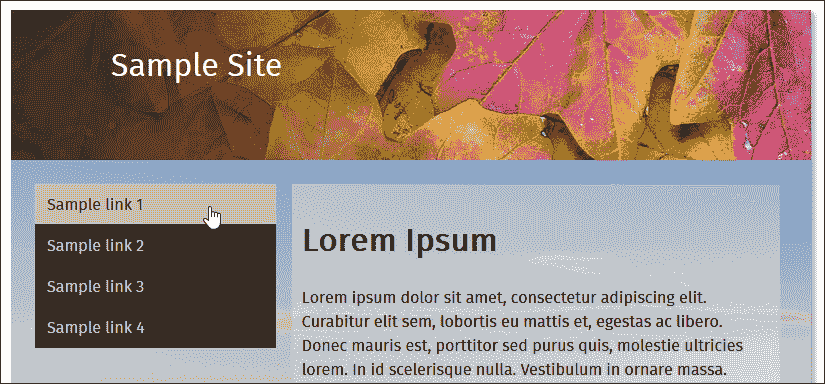

# 第十四章. 为未来做准备

精通 CSS 是一项基本技能——这项技术不断在发展，因此为了成功，我们必须跟上变化的步伐。PostCSS 是一款强大的工具，它不仅允许我们使用今天的 CSS 规则，还可以处理未来的规则。在本章中，我们将探讨一些构成通常所说的 CSS4 的 CSS 语法，以及我们如何可以使用当前的 CSS3 类提供等效支持。

在本章中，我们将涵盖多个主题，包括以下内容：

+   了解支持当前未来 CSS 标准的一些风险

+   探索使用 `cssnext` 来提供对未来 CSS 语法的支持

+   与一些现有的插件合作，将 CSS4 标准转换为当前的 CSS3 代码

+   检查我们如何可以修改现有的插件以增加对新 CSS4 选择器的支持

让我们开始吧！

# 支持当前的 CSS4 样式

样式表已经存在了超过 35 年，我们今天所知道的 CSS 的原始版本可以追溯到 20 世纪 80 年代的 SGML 时代。

自从 1996 年最初 CSS 标准发布以来，我们已经走了很长的路——在过去的几年里，CSS4 的标准得到了发展，新增了诸如 `:not` 或 `:matches` 伪类等新特性，以更好地定位元素，自定义属性（或变量），以及基于位置的链接，如 `local-link`。在接下来的几页中，我们将探讨这些 CSS4 特性，并看看我们如何可以使用当前的 CSS3 相当代码来引入对这些特性的支持。

首先，我们需要澄清一个小问题——CSS4…并不存在。什么？你可能会说。当然，它必须存在，我在网上看到过很多关于它的信息！是的，这是真的：CSS4 作为一项标准确实存在，但它并不是一个单一的独立实体。让我来解释。

之前的 CSS 版本都是围绕创建一个单一的全局标准来进行的，无论浏览器制造商如何决定支持构成标准的元素。这就是为什么我们不得不在多年里严重依赖供应商前缀，我们仍然在这样做，但大多数供应商已经从许多更常见的属性中移除了前缀，例如 `border-radius` 或 `box-shadow`。

然而，这里的关键区别在于，我们决定将 CSS4 作为一系列模块来交付——CSS 作为一项标准已经变得非常庞大，导致开发所需的时间增加变得不可持续。这就是为什么我们会听到有关 CSS 模块（如自定义属性或选择器）的讨论——这些可以作为独立的标准发展，到一定程度，我们可能不再将 CSS 称为版本 X，而只是 CSS。

### 注意

本章中提到的任何关于 CSS4 的内容纯粹是为了识别我们可以使用 PostCSS 插件和 CSS3 当前标准实现的下一代样式。

好的，抛开这一点，现在是时候深入研究了：PostCSS 对我们共同称之为 CSS4 的某些更常见元素提供了良好的支持。让我们来看看有哪些可用。

# 转换 CSS4 样式以使用

将 CSS4 基于一系列模块的想法是为了使其更容易（并且最终更快）更新每个标准；这确实意味着模块将处于不断变化的状态，至少在目前是这样！

话虽如此，我们可以使用当前的 CSS3 样式重新创建一些明确的样式——CSS4 选择器就是一个例子。尽管在撰写本文时它仍在草案阶段，但有一个名为 `postcss-selector-not` 的 PostCSS 插件可用（来自 [`github.com/postcss/postcss-selector-not`](https://github.com/postcss/postcss-selector-not)）。另一个也作为 PostCSS 插件提供的类似样式是 `postcss-selector-matches`（可在 [`github.com/postcss/postcss-selector-matches`](https://github.com/postcss/postcss-selector-matches) 获取）——这两个插件旨在复制作为新 CSS4 标准一部分的 `:not` 否定和 `:matches` 伪选择器。

### 注意

要了解更多关于个别 CSS4 选择器的信息，请查看在 [`css4-selectors.com/selectors/`](http://css4-selectors.com/selectors/) 提供的完整列表。这也会给你一个关于可用浏览器支持的指示——随着选择器的批准使用，此列表将随着变化而更新。

从更远的角度来看，有一些插件提供了对即将到来的 CSS4 标准的支持——除了 `:matches` 和 `:not` 插件之外，我们还可以使用以下任何一种：

| 插件名称 | 插件用途 |
| --- | --- |
| `mq4-hover-shim` | 目前处于测试版，此插件为 Media Queries Level 4 hover 媒体功能提供有限支持——可在 [`github.com/twbs/mq4-hover-shim`](https://github.com/twbs/mq4-hover-shim) 获取。 |
| `host` | 如果你在使用 Shadow DOM，并且需要让 `:host` 选择器与伪类正常工作，那么这个插件就是为你准备的——源代码可在 [`github.com/vitkarpov/postcss-host`](https://github.com/vitkarpov/postcss-host) 获取。 |
| `pseudo-class-any-link` | 你有多少次需要在代码中添加伪选择器，如 `:link` 或 `:visited`？这个 PostCSS 插件解决了这个问题——我们现在可以在 CSS 中使用提议的 `:any-link` 伪类。详情请访问 [`github.com/jonathantneal/postcss-pseudo-class-any-link`](https://github.com/jonathantneal/postcss-pseudo-class-any-link)。 |
| `postcss-initial` | PostCSS Initial 插件将指定属性的值重置为其在代码中最初设置的值（而不是浏览器设置的）。更多详情请访问 [`github.com/maximkoretskiy/postcss-initial`](https://github.com/maximkoretskiy/postcss-initial)。 |
| `font-variant` | 此插件将 `font-variant` 设置转换为等效的 `font-feature-settings` 值——它用于特殊案例，当无法使用常规方式复制时，例如，用斜杠区分 0 和 O——前者等同于零。此插件的源代码可在 [`github.com/postcss/postcss-font-variant`](https://github.com/postcss/postcss-font-variant) 获取。 |
| `postcss-input-range` | 此插件允许我们样式化输入范围元素。我们需要提供无前缀的 CSS 样式，该插件将自动处理所有必要的各种前缀，以允许在不同浏览器中对该元素进行样式化。此插件的源代码可以从 [`github.com/jonathantneal/postcss-input-range`](https://github.com/jonathantneal/postcss-input-range) 下载。 |

好的，让我们继续：我感觉要来一个演示了！让我们看看如何使用 `postcss-selector-matches` 属性，看看我们如何在实际操作中使用它。

## 验证电子邮件地址

你有多少次遇到过来自你网站的电子邮件提交，你并不完全确定你的访客是否留下了一个有效的电子邮件地址？

如果我们不考虑确切数字，那么不言而喻，任何来自任何网站的请求都必须有一个有效的电子邮件地址；现在可用的顶级域名如此之多，它们的有效性就更加重要了！

为了帮助做到这一点，我们可以使用 `:invalid` 和 `:valid` 属性来样式化 `<input>` 字段——虽然它们可能无法判断 `.design` 是否是一个有效的顶级域名（是的，它是），但它们至少可以处理确保你有一个顶级域名、一个 `@` 符号和一个收件人名称的基本要求。

### 小贴士

你可以在浏览器中执行测试，以评估对这些和其他 CSS4 选择器的支持——查看 CSS4 选择器网站，在 [`css4-selectors.com/`](http://css4-selectors.com/)。

让我们用一个简单的例子来演示如何使用 PostCSS 的 `postcss-selectors-matches` 插件，看看我们如何对这些字段进行样式化：

1.  我们将像往常一样启动一个 Node.js 命令提示符会话，然后更改工作目录到我们的项目区域。

1.  在提示符中，输入以下命令，然后按 *Enter* 键：

    ```js
    npm install postcss-selector-matches --save-dev

    ```

    保持窗口打开，我们很快就会用到它。如果一切顺利，我们应该会看到以下内容出现：

    

1.  接下来，从本书附带的代码下载中提取 `T69 - matches 伪选择器` 文件夹的副本，并将其保存到项目区域的根目录。

1.  从 `T69 - matches 伪选择器` 文件夹中的 `css`—completed 版本文件夹复制 `matches – pre-compile.css`，并将其保存到项目区域的根目录下的 `src` 文件夹中。

1.  将 `T69 - matches 伪选择器` 文件夹中的 `gulpfile.js` 和 `package.json` 文件复制到项目区域的根目录，并将其重命名为 `matches.css`

1.  返回到之前使用的 Node.js 命令提示符会话，然后在提示符中输入 `gulp` 并按 *Enter* 键。

1.  如果一切顺利，PostCSS 将消失并编译我们的代码为有效的 CSS——我们应该在 `dest` 文件夹中看到现在熟悉的文件。

1.  将此 `dest` 文件夹的内容复制到 `T69 - matches 伪选择器` 下面的 `css` 文件夹中，然后在浏览器中尝试预览 `matches.html` 文件。如果一切顺利，我们应该看到类似这样的内容：

这是一个简单的演示，是的，有些人为设计。在这个层面上，使用 `:matches` 并不是必要的，因为它最终生成的代码比必要的还要多！但它确实展示了应用这项技术是多么容易，并且能够提供有效的 CSS，就像我们例子中的那样：


好的，让我们改变一下方向：在下一个演示中，我们将继续使用范围主题，但这次我们将看看一个更时尚的例子，我们可以真正地大显身手，改变我们选择元素的外观。

范围输入元素是传统上难以样式的元素，很多时候，我们可能不得不求助于 jQuery UI 来改变其外观！但在 CSS4 中不是这样——我们可以使用一系列新的 CSS 属性来应用样式，而不需要使用任何额外的库。让我们更详细地看看这一点。

## 支持新的范围输入

一个快速的问题，你有多少次需要创建一个网站，其中需要选择一个值，比如说从 1 到 100？或者选择特定颜色的不透明度，从几乎透明到完全不透明？

好的，也许这些问题问得有些奇怪，但细心的读者应该能注意到我当然是在指使用滑块，我们可以调整它们来选择特定的值。有几种方法可以将这些添加到页面中，但主要还是需要一些帮助来设置样式，最容易被识别的工具可能是 jQuery UI！

如果我们需要在页面中使用 jQuery UI 来提供其他功能，这当然是可以的，但如果我们只需要它来使用滑块呢？这有点大材小用——幸运的是，我们可以通过使用 `postcss-input-range` 插件来解决这个问题，该插件可以从 [`github.com/jonathantneal/postcss-input-range`](https://github.com/jonathantneal/postcss-input-range) 获取。现在是时候进行演示了，让我们快速举一个例子，看看如何将一个滑块样式化以表示进度条：

1.  我们将首先安装 `postcss-input-range` 插件，为此，请启动 Node.js 命令提示符，然后更改工作文件夹到我们的项目区域。

1.  在提示符下，输入以下命令，然后按 *Enter*：

    ```js
    npm install postcss-input-range --save-dev

    ```

    如果一切顺利，我们应该看到类似这样的截图：

    

1.  接下来，从本书附带的代码下载中提取 `T70 - 使用范围输入` 文件夹的副本。然后将其保存到我们的项目区域中。

1.  在 `T70 - 使用范围输入` 的 `css` 文件夹中，将 `range – pre-compile.css` 文件复制到我们的项目区域的 `src` 文件夹中，并将其重命名为 `range.css`。

1.  将 `T70 - 使用范围输入` 文件夹中的 `gulpfile.js` 和 `package.json` 文件复制到我们项目区域的根目录。

1.  返回 Node.js 命令提示符窗口，然后在提示符下输入 `gulp` 并按 *Enter* 键。

1.  如果一切顺利，Gulp 将运行我们的编译过程，现在熟悉的样式表文件应该会出现在 `dest` 文件夹中，同时 maps 子文件夹中也会有一个映射文件。将这些文件复制到 `T70 - 使用范围输入` 下的 `css` 文件夹中。

1.  如果一切顺利，我们在浏览器中预览结果时应看到类似下面的截图：

尽管我们只是触及了为范围元素添加样式的可能性的表面，但这个演示并没有什么复杂的地方——例如，我们可以添加 datalists 来定义可以滚动浏览的特定值，比如一天中的特定时间。

浏览器支持仍然有限，但为了了解可能实现的功能，请查看 [`demo.agektmr.com/datalist/`](http://demo.agektmr.com/datalist/)；CSS 大师 Chris Coyier 在他的网站上也有几篇关于范围输入使用的文章，网址为 [`www.css-tricks.com`](http://www.css-tricks.com)。

我们演示中的真正魔法出现在我们查看编译后的代码时——为范围输入元素添加样式的关键元素之一是 `range-thumb` 属性，这是我们用来在滑块上选择值的旋钮。以下是我们的代码现在看起来像样的两个示例，增加了对 Firefox 的支持：


这支持了 Internet Explorer（已被 Edge 取代）：


当使用此插件时，我们不必担心添加供应商前缀——我们的原始代码只包含未加前缀的版本；相关的供应商前缀将在编译时添加，直到它们不再需要用于样式化我们的输入元素。

### 小贴士

如果你需要帮助为新范围输入元素添加样式，请查看 [`danielstern.ca/range.css/`](http://danielstern.ca/range.css/)——这是一个有用的工具！

在过去的两个演示过程中，我们简要地触及了使用 PostCSS 时可能实现的功能——我们使用了相同的 Gulp 任务文件格式来集成每个插件的支持，运行后为每个演示生成了必要的 CSS 样式表。这里并没有什么过分的，对吧？毕竟，它遵循了我们之前提到的相同原则，比如一个插件对应一个任务……或者我们能做得更好吗？

是的，到现在你应该知道，如果可能的话，我总是喜欢做得更好。记得我曾经说过，创建任务时最好是一对一的吗？我们（Gulp）文件中的每个任务是否都与特定的插件相关？嗯，正如有人曾经说过，规则是为了被打破的——是时候扔掉规则手册，考虑一种不同的方法了，至少对于未来的语法来说是这样……

# 使用 cssnext 支持未来语法

支持 CSS4 的一个关键部分是我们必须处理的不断变化的状态，直到模块被标准化。如果我们保持当前的方法，它将涉及不断更新我们决定使用的任何与 CSS4 属性相关的插件——这显然是不可持续的！

相反，我们可以使用单个插件包，在这种情况下是`cssnext`，来管理对一系列新特性的支持。然而，美中不足的是，所有特性默认都是启用的，并且只有在代码需要时才会激活。当然，将来会有新特性被原生支持的时候，到那时，我们只需简单地丢弃编译过程，而不会影响最终结果。

花时间了解`cssnext`是值得的——让我们深入探讨并更详细地查看。

## 使用 cssnext 创建一个站点模板

`cssnext`插件是我们指南中每个任务一个插件的例外之一；我们通过插件名称调用它，但实际上，它将同时执行多个转换。

该插件可在[`cssnext.io/`](http://cssnext.io/)获取。值得注意的是，存在一个较旧的版本；我们在本演示中使用的是较新版本。`cssnext`插件最初是一个完整的系统，在 PostCSS 变得像现在这样流行之前。 

该插件包含了一些实际上并不属于专注于 CSS 未来的插件的选项，因此开发者重新编写了它，使`cssnext`更简单。同时，它被设计成可以集成到 PostCSS 中，在那里我们可以在处理器中的其他插件的同时使用它。

### 注意

该插件甚至有自己的游乐场，我们可以用它来测试更改是否会产生预期的效果——在[`cssnext.io/playground/`](http://cssnext.io/playground/)查看。

让我们更详细地探索这个插件——我们将从安装它开始，然后再为我们的下一个演示设置代码。

## 设置我们的演示

在接下来的演示中，我们将设置一个基本的模板，它可以用于网站——它不会在风格上赢得任何奖项，但这里的目的是探索进行更改有多容易，而不是在下一个颁奖典礼上成为焦点！让我们深入探讨我们需要做什么：

1.  我们将首先启动一个 Node.js 命令提示符会话，然后更改工作文件夹到我们项目区域的根目录。

1.  在提示符下，输入以下命令，然后按*Enter*键：

    ```js
    npm install postcss-cssnext --save-dev

    ```

    如果一切顺利，我们应该会看到类似下面的截图：

    

1.  接下来，请从本书附带的代码下载中提取`T71 - working with cssnext`文件夹的副本——将其保存到我们项目区域的根目录。

1.  从`T71 - working with cssnext`文件夹中，将`styles.css`文件的副本保存到我们项目区域根目录下的`src`文件夹，然后将`package.json`和`gulpfile.js`保存到我们项目区域的根目录。

1.  返回我们打开的提示符，然后输入`gulp`并按`Enter`键。

1.  当 Gulp 完成编译后，我们将看到现在熟悉的文件出现在我们项目区域根目录下的`dest`文件夹中。

1.  将我们项目区域根目录下`dest`文件夹的内容复制到`T71 - working with cssnext`文件夹根目录下的`css`文件夹中。

1.  在浏览器中预览`T71 - working with cssnext`文件夹内的`sitepage.html`——如果一切顺利，我们应该看到类似于这个截图的内容：

我们现在看到了我们网站的模板——有几个地方我们进行了修改，以利用`cssnext`的强大功能。为此，请打开我们保存到项目区域的`T71 - working with cssnext`文件夹中的`css`文件夹内的`stylescss`文件的副本——让我们看看都做了哪些修改：

+   **Autoprefixer**：该插件涵盖了为任何未来样式提供供应商前缀的支持；在基础文件中的任何前缀都已移除，将在编译期间添加。

+   **媒体查询范围/自定义查询**：我们不再使用现有的格式，该格式并不总是清晰，我们可以开始使用`>=`或`<=`来更好地表达我们查询中应用的范围。同时，我们可以使用自定义查询在文件顶部定义预设范围，这些范围可以在整个样式表中使用。

+   **嵌套**：熟悉现有预处理器（如 SASS 或 Less）的粉丝会对嵌套原则很熟悉；简单来说，这允许我们将样式嵌套在彼此内部。然后我们可以调整这些规则所使用的选择器，以便在编译时，每个规则都转换为有效的 CSS。

+   **自定义选择器**：继续讨论预处理器主题，我们可以在代码顶部创建自定义值，并适当地应用它们。

+   **#rrggbbaa 颜色**：传统上，十六进制颜色以三位或六位数字值表示；使用`cssnext`，我们可以将它们扩展到四位或八位数字值。`cssnext`插件将它们转换为标准的 RGBA 值，并提供等效的 HEX 值作为后备机制。

+   **rem 单位**：传统上，开发者使用像素值来应用元素或字体的大小。像素值不尊重浏览器中的用户设置，因此可能不会按预期缩放。为了解决这个问题，引入了`em`单位；随着`rem`单位的引入，计算`em`值的数学变得简单。今天，一些开发者认为像素值应该占主导地位；`cssnext`插件提供了像素和 rem 单位，可以在浏览器支持的地方使用。

初步思考，你可能认为需要包含多个插件或详细的配置对象；并非如此！相反，我们只需要在我们的 Gulp 任务文件中包含这个：


我一直热衷于保持事情简单——`cssnext` 插件就是完美的例子！虽然我们可能需要定期更新插件以跟上变化，但我们不需要更改我们的 Gulp 文件。

插件将简单地转换它找到的受插件支持的样式，并保留任何未受插件覆盖的样式。这种美在于我们可以让它按原样运行，或者如果我们想禁用不再需要的功能，我们只需在配置对象中禁用它：

```js
cssnext(input, { 
  features: { customProperties: false }
})
```

为了证明我们做出的更改是有效的，我们将我们的（非响应式）模板从这样：


…到这个视图，我们的内容显然更适合较小的屏幕：


尽管这只是所做的更改的一小部分，但它直接负责使我们的模板响应式，这也表明将 `cssnext` 纳入我们的流程比我们想象的要容易得多！

好吧，让我们继续：我们将探讨几个额外的插件，但会有一些变化。我们首先将查看使用一个插件来支持 CSS4 中引入的新颜色，然后再用它作为修复一个本应很久以前就应解决的问题的基础！

# 创建插件以提供额外的 CSS4 支持

在本章的整个过程中，我们介绍了许多处理即将推出的 CSS4 标准支持的插件，并探讨了如何使用 `cssnext` 插件包来管理过渡到使用这些新样式。

我们可以做更多的事情——PostCSS 的好处在于我们可以绝对编写自己的插件来帮助增强对 CSS4 属性的支持。为了证明这一点，在接下来的几页中，我们将解决一些 CSS 中的问题，并修改现有的 CSS4 颜色插件以添加对另一种颜色的支持；如果允许我打趣一下，我们将从给下一个演示添加一点颜色开始！

## 向 CSS 添加未来颜色支持

> “她活到了六岁。在将近十二个小时里，她六岁了……” 

下一个演示有一个相当感人的转折——这个 `rebeccapurple` 颜色，是下一个练习的基础，它是为了纪念埃里克·迈耶的女儿丽贝卡，她在 2014 年 6 月六岁生日那天因癌症去世。

任何花时间开发 CSS 样式的人都知道，埃里克一直是网络标准的坚定倡导者，特别是 CSS——经常有人说，在他们的开发过程中，很难找到一本不是埃里克写的关于 CSS 的书！社区提议添加 `rebeccapurple` 作为一种颜色以纪念丽贝卡（这是她最喜欢的颜色），并为了表彰埃里克的贡献。CSS 工作组宣布这一变更已被批准，并将作为即将推出的 CSS4 标准的一部分添加。

为了帮助支持尚未跟上变化的浏览器，开发者 Maxime Thirouin 创建了一个 PostCSS 插件，将 `rebeccapurple` 颜色转换为更兼容的格式 `rgb(102, 51, 153)`——该插件的源代码可在 [`github.com/postcss/postcss-color-rebeccapurple`](https://github.com/postcss/postcss-color-rebeccapurple) 获取。

让我们更详细地看看这个插件：

1.  我们将首先安装 `postcss-color-rebeccapurple` 插件，所以请打开 Node.js 命令提示符，并将工作文件夹更改为我们的项目根目录。

1.  在提示符中，输入以下命令：

    ```js
    npm install postcss-color-rebeccapurple –save-dev 

    ```

    然后按 *Enter* 键——如果一切顺利，我们应该能看到类似下面的截图：

    

    保持窗口打开——我们很快就会用到它。

1.  接下来，从本书附带的代码下载中提取 `T72 - adding rebeccapurple color` 文件夹的副本，并将其保存到我们项目区域的根目录。

1.  将 `T72 - adding rebeccapurple color` 文件夹中的 `styles – pre-compile.css` 复制到我们项目区域的根 `src` 文件夹中，并将其重命名为 `styles.css`

1.  将 `T72 - adding rebeccapurple color` 文件夹中的 `gulpfile.js` 和 `package.json` 文件复制到我们项目区域的根目录。

1.  返回 Node.js 命令提示符会话，然后在提示符中输入 `gulp` 并按 *Enter* 键。

1.  编译完成后，将项目区域根目录下的 `dest` 文件夹的内容复制到 `T72 - adding rebeccapurple color` 下的 `css` 文件夹。

1.  尝试预览结果——如果一切顺利，我们应该能看到这个简单的盒子，它已经被填充了颜色 `rebeccapurple`：

为了证明它的工作，查看 `T72 - adding rebeccapurple color` 下的 `css` 文件夹中的 `.css` 文件——我们应该能看到其中的编译 RGB 值。


我们也可以通过使用像 *ColorHexa.com* 这样的网站进行快速检查来验证这一点——查看 [`www.colorhexa.com/663399`](http://www.colorhexa.com/663399)；搜索 `rebecca purple` 将显示相同的页面。

这里有一个完美的机会——我相信，从悲剧中总会产生一些好的东西。抛开这个插件的 *raison d'être*，我们可以将其作为添加 CSS4 颜色模块标准中其他颜色支持的基础。

我们需要做出的更改相对简单，可以轻松地成为新插件的基础。让我们看看涉及的内容；对于这个演示，我们将使用 `burlywood`，这是一种浅棕色：

1.  我们将首先编辑我们的 CSS 文件——打开项目区域根目录下的 `src` 文件夹中的 `styles.css`，并按指示更改高亮行：

    ```js
          #box {
            background-color: burlywood;
            height: 10rem;
    ```

1.  接下来，我们需要更新`rebeccapurple`插件文件，将现有的颜色引用更改为使用新颜色——我们将从初始声明开始：

    ```js
          var postcss = require("postcss")
          var color = require("color")("burlywood").rgbString()
    ```

    ### 注意

    `index.js`插件文件可以在`node_modules\postcss-color-rebeccapurple\`文件夹中找到。

1.  我们接下来需要更改代码中更改颜色实例的检查：

    ```js
          if (value && value.indexOf("burlywood") !== -1) {
            decl.value = value.replace(/(burlywood)\b/gi, color)
          }
        })
    ```

1.  目前，请继续保存文件——是的，插件名称并不代表颜色，但这只是一个测试，所以这不会有什么影响。

1.  启动 Node.js 命令提示符，然后更改工作文件夹到我们的项目区域。在提示符中输入`gulp`然后按*Enter*。

1.  将根目录`dest`文件夹的内容复制到“T73 - 添加对新颜色支持”文件夹中的`css`文件夹。

1.  运行`testpage.html`——如果一切顺利，我们可以在其中看到之前编译的 RGB 值：

1.  尝试从“T73 - 添加对新颜色支持”文件夹中重新运行`testpage.html`文件；我们应该看到颜色的变化（而且，它绝对不是紫色！）

我们可以使用与之前相同的原则来验证显示的颜色确实是`burleywood`。这次查看[`www.colorhexa.com/deb887`](http://www.colorhexa.com/deb887)，它清楚地显示了 HEX 和 RGB 值：


现在剩下要做的就是将其转换为插件。这应该很容易做到：尝试复制现有的`rebeccapurple`插件，然后使用您选择的颜色进行搜索和替换。它并不完美，但会给你一个良好的开端——下一部分将是使用我们在第八章中学到的知识，将其转变为一个可在 NPM 存储库中使用的完整插件。

### 小贴士

要获取 CSS4 模块颜色的列表，请在 Google 上查看——有很多链接；从这里开始尝试：[`github.com/segundofdez/css4-colors/blob/master/less/colors.less`](https://github.com/segundofdez/css4-colors/blob/master/less/colors.less)。

好吧，是时候改变焦点了：尽管本章旨在展望未来，但我们将改变方向，暂时回顾一下。

原因是什么？CSS 设计中的许多错误已被 CSS 工作组认可。乔纳森·尼尔（Jonathan Neal）的一个 PostCSS 插件为这些问题的短期修复提供了解决方案——其中一些问题可能在 CSS 的将来版本中得到正确修复！

## 回顾过去

在开发代码时，我非常喜欢只针对现代浏览器进行开发，作为一条规则——理想情况下是*n-1*，即当前版本加上上一个版本。在主要方面，这对 Firefox 或 Chrome 来说不是问题，但对于 IE 来说则不同。在可能的情况下，旧版本的 IE 可能会被遗弃……但这又是另一个故事了！

我们可以做出的一个例外不是关于浏览器支持，而是尝试纠正一些属性命名的问题。CSS 工作组已经承认，在发布时一些属性名称定义不正确——您可以在[`wiki.csswg.org/ideas/mistakes`](https://wiki.csswg.org/ideas/mistakes)上看到完整的列表，该列表会定期更新。

为了帮助解决这个问题，并且作为本节第二个演示的先导，我们将安装 PostCSS 的 Time Machine 插件（因此本节的标题是“Time Machine！”）。这为 CSS 中的一些错误提供了一种短期解决方案。然后我们将以此为契机，设计一个快速且实用的插件来修复 CSSWG 网站上列出的另一个错误，但这个错误并没有被 Time Machine 插件修复。

### 注意

此插件的源代码可在[`github.com/jonathantneal/postcss-time-machine`](https://github.com/jonathantneal/postcss-time-machine)获取。

对于这个演示，我们将重用为显示`rebeccapurple`颜色而创建的简单演示。该演示的编译结果使用 RGBA 函数——CSSWG 已经声明 RGBA 不应该存在，而 alpha 通道应该作为`RGB()`函数的第四通道添加。我们将作为演示的一部分修复这个问题——插件将允许我们编写预期的代码，同时将其编译成任何浏览器都能理解的代码。

让我们开始安装用于演示的插件：

1.  我们将首先安装插件，所以请启动一个 Node.js 命令提示符会话，然后更改工作文件夹到我们的项目区域。

1.  在提示符下输入以下命令并按*Enter*键：

    ```js
    npm install postcss-time-machine --save-dev

    ```

    如果一切顺利，我们应该看到类似于这个截图的内容——保持会话开启，因为我们很快就会需要它：

    

1.  接下来，从本书附带的代码下载中提取`T74 - going back in time`文件夹的副本——将文件夹保存到我们项目区域的根目录。

1.  将`T74 - going back in time`文件夹内的`styles – pre-compile.css`复制到我们项目区域的根`src`文件夹，并将其重命名为`styles.css`。

1.  将`gulpfile.js`和`package.json`文件从同一`T74 - going back in time`文件夹复制到我们项目区域的根文件夹。

1.  返回 Node.js 命令提示符，然后在提示符下输入`gulp`并按*Enter*键。

1.  如果一切顺利，我们应该在`dest`文件夹中看到我们通常的编译文件——将这些文件复制到`T74 - going back in time`下的`css`文件夹。

到目前为止，尝试预览我们演示的结果，如果一切顺利，我们应该看到之前相同的盒子，但这次颜色稍微浅一点的`rebecca purple`：

如果我们查看 CSS 样式，细心的读者可能会注意到——为什么我们使用 `194` 作为我们的 alpha 值，而代码中显示的是 `0.8`？答案是简单的：这个插件被设计为使用 `0` 到 `255` 的每个值，包括 alpha 通道。只需将 `194` 除以 `255`：


答案是 `0.8`。好吧，你实际上会得到类似 `0.76078` 的东西，但如果我们四舍五入到一位小数，这将变成 `0.8`：


现在，在我们继续之前，我们应该考虑一些事情：这个插件的实际应用。这并不是要浇灭一个美好的想法，但采用可能需要一点时间——团队中的开发者已经习惯了编写包含 `rgba()`、`background-blend-mode` 或 `hsla()` 等函数的样式，因此改变思维模式可能需要一些时间！

话虽如此，如果我们想遵守预期的标准，并且能够管理改变思维模式，不输入我们可能已经做了很长时间的函数名，这是一个有用的修复。我们甚至可以更进一步，创建我们自己的插件——时间机器并没有为所有属性提供修复，所以让我们看看如何创建一个来管理围绕 CSS 中 `background-blend-mode` 属性的 bug。

## 创建我们自己的插件

时间机器插件没有固定的一个属性是 `background-blend-mode` 函数——这个函数通常用于计算当图层重叠时最终的像素颜色。

引入的 bug 与名称有关——**CSS 工作组**（**CSSWG**）已经承认所有混合模式变体应该在不包含 -mode 的名称中书写，因此在我们的情况下，`background-blend-mode` 应该写成 `background-blend`。

这是一个简单的修复，这是一个完美的机会让你尝试创建你自己的插件！现在我们将采取不同的路线——是时候一些观众参与，换句话说！

为了帮助你，值得再次查看第八章，*创建 PostCSS 插件*；在创建插件时，我们可以使用以下代码：

```js
var postcss = require('postcss');

module.exports = postcss.plugin('backgroundblend', function backgroundblend(options) {
  return function (css) {
    options = options || {};

    // Processing code will be added here
    css.eachDecl('background-blend', function (decl) {
      if (decl.prop.indexOf('background-blend') !== -1) {
        decl.prop  = 'background-blend-mode';
      }
    });
  };
});
```

这段代码的大部分是样板代码，但使它工作关键的是以下摘录：

```js
    css.eachDecl('background-blend', function (decl) {
      if (decl.prop.indexOf('background-blend') !== -1) {
        decl.prop = 'background-blend-mode';
      }
    });
```

简而言之，我们依次解析每个 CSS 规则——如果其中包含 `background-blend`，我们就简单地将其每个实例替换为 `background-blend-mode`。

为了证明它的工作，我们可以使用以下代码来测试我们的插件是否工作：

```js
<!DOCType html>
<head>
  <meta charset="utf-8">
  <title>Demo: Creating new plugin to change blend-mode</title>
  <link rel="stylesheet" type="text/css" href="css/styles.css">
</head>
<body>
  <div id="div"></div>
</body>
</html>
```

如果一切顺利，我们应该得到类似以下截图的结果：


如果你遇到了困难，那么这本书附带的代码下载中有一个完整的版本；快速查看 `T75 - back in time change` 文件夹中的 `styles – pre-compile.css` 文件将显示这一点：


当编译时，我们可以清楚地看到它显示了我们将习惯看到的版本：


这是一个快速且简单的插件，在投入生产使用之前可能需要更多的开发——例如，它仅针对 background-blend-mode，而我们应该支持任何名称中包含 blend-mode 的属性！

# 摘要

创建 CSS 样式打开了一个充满可能性的世界：我们受限于我们必须支持的内容！在本章的整个过程中，我们探索了一些在使用较新的 CSS4 样式时我们可以使用的可能选项——让我们花点时间回顾一下我们已经学到的内容。

我们从对 CSS4 的快速介绍开始——然后转向探索一些插件，这些插件通过提供更兼容的 CSS 等效代码来支持更新的样式。

接下来是一个简单的演示，探索了一些新的 CSS4 伪类，以及我们如何在（理论上的）环境中使用它们。然后我们转向更实际的内容，仅使用 CSS 来样式化新的范围输入。

快速前进，我们接下来查看 cssnext 插件包，它为支持 CSS4 提供了一个抽象层；我们看到了实现它是多么容易，并且我们可以轻松地关闭在项目中不再需要的功能。

我们接下来的演示是关于处理颜色——我们使用了 `rebeccapurple` 插件，首先展示了在 CSS4 中添加对新颜色支持是多么容易，然后修改它以提供在我们项目中需要支持的其他颜色的支持。然后我们通过回顾 CSS 发布时的一些错误来结束本章，以及（通过一点想象力），我们可能提供临时的解决方案，直到这些错误在未来版本的 CSS 中得到修复。

我们现在已经到达了本书的结尾——我希望你喜欢我们穿越 PostCSS 世界的旅程，并且希望这本书能帮助你作为一个未来的开发者或 PostCSS 的用户提高技能。
