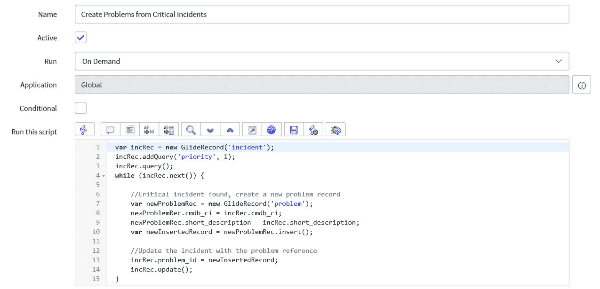
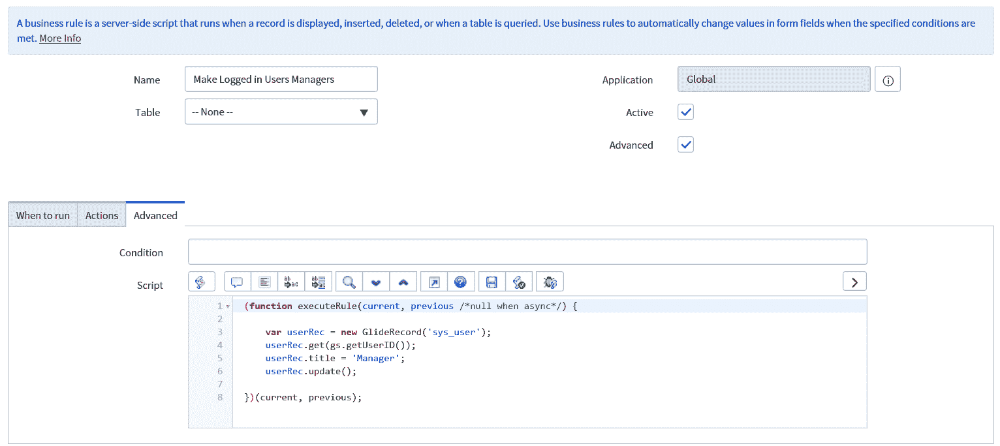
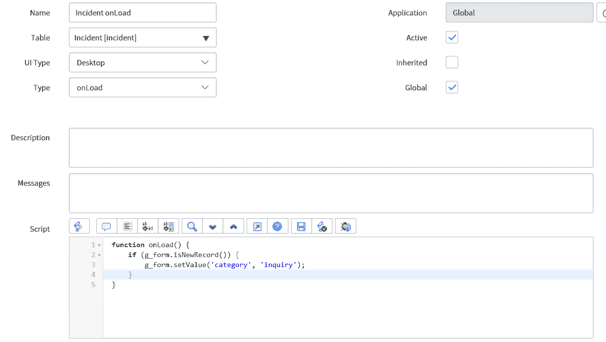

# 第二章：探索 ServiceNow Glide 类

在本章中，我们将探索 ServiceNow Glide 类。我们将查看允许开发者方便且快速编写 ServiceNow 脚本的公开 JavaScript API。然后，我们将查看服务器和客户端上的不同类，最后查看一些常用类的示例。

本章将涵盖以下主题：

+   如何使用 ServiceNow 公开的 JavaScript API，包括 GlideRecord

+   客户端 Glide 类

+   服务器端 Glide 类

+   涵盖一些常用 Glide 类的示例

# 使用 ServiceNow 公开的 JavaScript API

ServiceNow 为开发者提供了一些公开的 JavaScript API，以帮助他们编写脚本。这大大节省了在 ServiceNow 脚本中访问记录和字段的时间。开发者可以使用许多不同的类和对象，其中一些非常有用，而另一些则很少使用。

# GlideRecord

最常见的 JavaScript API 之一是 `GlideRecord` 类，它非常实用，很快将成为大多数脚本的必备工具。`GlideRecord` 是在 ServiceNow 中根据许多不同的查询查找和计数记录的一种方式。如果你熟悉 SQL 语句，它相当类似。

让我们看看如何使用 `GlideRecord`。

我们将看看如何查询特定表中的所有记录。此 `GlideRecord` 脚本的格式如下所示，其中 `table_name` 是唯一的参数。这需要是表名而不是表标签：

```js
new GlideRecord('<table_name>');
```

我们将设置一个变量来保存 `GlideRecord` 对象，并定义将用于查询的表。在这个例子中，我们将使用事件表：

```js
var glideRecord = new GlideRecord('incident');
```

`glideRecord` 变量现在保存了事件表的 `GlideRecord` 对象。然后我们查询表并添加任何过滤。在这种情况下，我们将添加没有过滤，仅返回事件表的所有记录，因此显示完整的脚本：

```js
var glideRecord = new GlideRecord('incident');
glideRecord.query();
while (glideRecord.next()) {
    //Code in this loop will be run against all incident records
}
```

这是 ServiceNow 脚本中的一个非常重要的部分，因为这是编码者通过遍历它们并应用一些代码到每个相关记录的方式来访问 ServiceNow 中的记录的方式。

现在我们已经看到了如何设置 `GlideRecord` 查询，让我们看看可以为我们过滤 `GlideRecord` 的脚本行：

```js
variable.addQuery('<field_name>', '<operator>', '<value_to_compare_against_field>')
```

在这里，我们根据字段名称进行过滤，并使用运算符将那个字段中的值与我们定义的值进行比较。默认的 `operator` 是值等于字段中的值，所以如果这是我们需要的运算符，我们就可以省略它。

让我们看看另一个例子。这次，我们将使用过滤行查询所有具有关键优先级的问题记录：

```js
var glideRecord = new GlideRecord('problem');
glideRecord.addQuery('priority', 1);
glideRecord.query();
while (glideRecord.next()) {
    //Code in this loop will be run against all problem records with a priority of critical.
}
```

如前述代码所示，我们省略了运算符，因为我们想要具有优先级等于 `1` 的问题记录，因此我们不需要包含它。

在之前的示例中，我们已经遍历了所有记录，但我们可以通过将 `while` 改为 `if` 来修改循环，以便只返回一个存在的记录。这在检查父记录的所有任务是否完成时非常有帮助。让我们看看它将如何改变我们上一个示例中的脚本：

```js
var glideRecord = new GlideRecord('problem');
glideRecord.addQuery('priority', 1);
glideRecord.query();
if (glideRecord.next()) {
    //Code in this loop will be run against one problem record with a priority of 1 if one exists.
}
```

这段代码可以用来检查是否存在任何优先级关键的问题，如果存在，将会对它运行一些代码。

你可以添加多个查询，并且每个返回的记录都需要满足定义的每个过滤器。在这方面，它很像寻找房子。你可以只搜索所有的房子，但你更有可能想要建立一系列过滤器来找到你确切想要的东西——价格范围、卧室数量、位置等等。

由于所有这些过滤器累加起来，本质上创建了一系列逻辑 `AND` 语句，我们还需要一种创建逻辑 `OR` 语句的方法。同样地，你可以在查询行中添加，也可以添加一个脚本中的 `OR` 条件行。让我们看看它是如何工作的：

```js
var glideRecord = new GlideRecord('change_request');
var orQuery = glideRecord.addQuery('risk', 1);
orQuery.addOrCondition('risk', 2); 
glideRecord.query();
while (glideRecord.next()) {
    //Code in this loop will be run against all change request records that are a very high or high risk.
}
```

如您所见，原始条件存储在一个变量中，`orQuery`，然后在查询之前将 `OR` 条件添加到这个变量中。如果你想在记录处于某些状态时执行某些代码，这种查询类型非常方便。

在 ServiceNow 中实现相同目标的方法有很多，为了展示这一点，我们可以使用不同的运算符在更改记录上设置相同的过滤器。这是基于 ServiceNow 中选择列表的许多值都是数字的事实，因此我们可以搜索所有风险大于或等于 `2` 的更改请求：

```js
var glideRecord = new GlideRecord('change_request');
glideRecord.addQuery('risk', '>=', 2); 
glideRecord.query();
while (glideRecord.next()) {
    //Code in this loop will be run against all change request records that are a very high or high risk.
}
```

第二个示例通常被认为比第一个更好，因为它使用了更少的代码行。

现在我们已经了解了如何获取我们想要的记录，我们将探讨如何修改我们找到的记录。首先，我们将查看对记录的简单更新。在这个例子中，我们将更新所有紧急程度高的突发事件记录，将其降低到中等：

```js
var glideRecord = new GlideRecord('incident');
glideRecord.addQuery('urgency', 1); 
glideRecord.query();
while (glideRecord.next()) {
    //Change all high urgency incidents to medium urgency
    glideRecord.urgency = 2;
    glideRecord.update();
}
```

当更新一条记录时，你可以修改许多字段，然后使用 `update` 来保存更改。这是一个非常重要的方法，并且相对简单易用。

我们将要查看的最后一个示例是关于如何删除记录。显然，在删除记录时要非常小心，并且在执行之前确保你编写的查询是正确的。

删除记录有两种主要方法：要么通过循环逐个删除，要么一次性全部删除。让我们先看看如何逐个删除记录。在这个例子中，我们将删除所有 `network` 类别的突发事件：

```js
var glideRecord = new GlideRecord('incident');
glideRecord.addQuery('category', 'network'); 
glideRecord.query();
while (glideRecord.next()) {    
    glideRecord.deleteRecord();
}
```

接下来，我们将探讨如何一次性删除所有查询到的记录：

```js
var glideRecord = new GlideRecord('incident');
glideRecord.addQuery('category', 'network'); 
glideRecord.deleteMultiple();
```

如您所见，这两个 `delete` 方法的脚本相当不同，但最终结果相同。`deleteMultiple` 方法是一种更快、更有效的方法；然而，它将一次性删除所有内容。如果需要删除大量数据，这可能会导致资源长时间占用。在处理大量数据的情况下，我使用了 `deleteRecord` 方法来分批删除记录。

当创建 `delete` 脚本时，尝试先注释掉 `delete` 方法并添加一些日志来显示你已删除的内容。如果日志返回了你想要的记录，那么就可以继续删除。这有助于确保不会删除错误的记录。

至此，`GlideRecord` 的介绍就到这里，但它在整本书中还会出现，进一步证明它的重要性。

# 服务器端 Glide 类

现在我们将探讨一些我们可以用于脚本的服务器端类。请记住，这些方法在客户端不起作用，所以请确保你清楚你正在编写的脚本是在服务器端。

# GlideSystem

`GlideSystem` 可能是使用最广泛的服务器端类。让我们看看我们如何利用这个类来帮助我们进行脚本编写。

在脚本中，ServiceNow 将 `GlideSystem` 缩写为 `gs`，因此 `GlideSystem` 的方法将以 `gs` 为前缀。

让我们先看看如何使用 `GlideSystem` 获取用户的 `sys_id`：

```js
var userID = gs.getUserID();
```

这将登录用户的 `sys_id` 存储在 `userID` 变量中。这很有用，因为你可以将其用于脚本中，根据用户的属性执行不同的脚本行。现在我们有了用户的 `sys_id`，我们可以使用 `GlideRecord` 查询来返回我们想要的字段。ServiceNow 允许我们以更简单的方式获取一些信息。

我们可以获取 `user` 对象，然后使用一些有用的函数来获取有关用户的更多信息。要获取 `user` 对象，我们只需编写以下代码：

```js
var userObject = gs.getUser();
```

接下来，让我们看看一些最有用的函数：

```js
gs.getUser().getFullName();
gs.getUser().getEmail();
gs.getUser().getLocation();
gs.getUser().getManagerID();
gs.getUser().getCompanyID();
```

上述代码的大部分内容相当直观，但 ID 函数将以与用户 `sys_id` 相同的方式返回记录的 `sys_id`。

用户的详细信息对于发送通知和根据位置或公司设置批准和条件脚本非常有用。

当我们谈论用户数据时，了解用户拥有哪些角色通常很重要，以便决定他们应该有权访问什么。`GlideSystem` 允许我们在脚本中查看用户是否拥有特定的角色，如下面的示例所示：

```js
if (gs.hasRole('admin')) {
    //Run code for administrators only
}
```

`hasRole` 方法在用脚本允许或限制用户访问数据时特别有用。它还可以用于隐藏或显示需要更高权限才能使用的 UI 操作。需要注意的是，`hasRole` 方法对于管理员总是返回 `true`。

`GlideSystem`也适用于通过用户的输出消息让用户知道脚本中发生了什么。这是通过使用`Info`或`Error`消息来完成的。`Info`消息以漂亮的蓝色框显示，而`Error`消息，不出所料，在处理完成后和下一个屏幕加载后，在表单的顶部以红色显示。

让我们看看如何编写这些脚本：

```js
gs.addInfoMessage('Record saved successfully.');
gs.addErrorMessage('Error in script.');
```

这些线条相当简单，但在保持用户了解脚本在处理过程中的表现以及是否存在任何问题时非常实用。我倾向于使用信息消息来告知用户操作已成功完成，尤其是在他们返回的屏幕上并不立即明显的情况下。当脚本中出现问题的时候，错误消息是很好的。记住，这条消息将会显示给各种用户，所以最好不要在消息中过于技术化。

`GlideSystem`还允许我们执行日志记录，以便我们可以调试我们的服务器端脚本。由于服务器端脚本在幕后运行，我们需要一种方法来记录脚本中发生的事情，这样我们就可以稍后查看它，并在必要时进行审查和调试。

对于这种情况，最常见的脚本片段是`log`。简单来说，这只是一个要发送到日志中的文本字符串：

```js
gs.log('Logging Message');
```

这条消息现在将在应用程序导航器中的脚本日志语句模块中可见。如果您正在查看 ServiceNow 实例中的旧脚本，您通常会找到这些日志消息。有时它们被注释掉，以防将来需要用于调试，有时它们应该被注释掉，但开发者忘记了。

如果正在创建许多日志，给您的日志一个独特的来源可能会有所帮助，这样您就可以更容易地搜索来自您特定来源的日志。让我们看看这看起来是什么样子：

```js
gs.log('Logging Message', 'My Script Log');
```

这条消息将随后出现在系统日志中，来源为`My Script Log`。需要注意的是，由于您已将来源更改为自定义来源，它将不再出现在脚本日志语句模块中。

`GlideSystem`可能是最有用的服务器端 Glide 类，并且还有更多我们讨论过的方法。

# GlideDateTime

`GlideDateTime`显然是关于日期和时间的脚本，具体来说是`GlideDateTime`对象。`GlideDateTime`对象主要用于填充日期/时间字段及其周围的日期和时间方法，以向字段添加或减去时间。

首先，让我们看看如何定义一个新的`GlideDateTime`：

```js
var glideDT = new GlideDateTime();
```

这将把当前的日期和时间以 GMT 格式放入`glideDT`字段，作为`GlideDateTime`对象的一部分。如果您想比较字段中的日期与当前日期和时间，这可能很有帮助。

现在，在处理任何日期和时间脚本时，时区总是一个问题。解决这个问题的最好方法之一是使用显示值，确保日期和时间以正确的格式显示给查看它的用户。让我们看看如何通过记录显示值来完成这项工作：

```js
var glideDT = new GlideDateTime();
gs.log(glideDT.getDisplayValue());
```

这在脚本中非常有用，可以确保所有用户都能看到正确的时间。

有时也可能需要使用脚本从日期/时间字段中添加或删除时间。有一些方法可以将各种时间量添加到或从日期/时间字段中。我们将查看其中之一；其他的工作方式非常相似：

```js
var glideDT = new GlideDateTime();
glideDT.addDaysLocalTime(1);
```

在这个例子中，我们将向当前日期和时间添加 1 天，即 24 小时。

```js
var glideDT = new GlideDateTime();
glideDT.addDaysLocalTime(-1);
```

通过使用负数，我们实际上从对象中减去时间，所以前面的例子实际上会给你昨天这个时间的日期和时间。

`GlideDateTime` 在处理日期和时间时非常有用，这在编码中经常会导致头疼。记住，当在 `addtime` 方法中使用负数时，这会减少时间而不是增加它。

# GlideElement

`GlideElement` 为处理 `GlideRecord` 对象中的字段提供了方法。这个类是 ServiceNow 中较小的一个。

在这个类中有一组非常方便的方法，用于检测字段的更改。这在关闭记录时非常有用。有时我们可能希望在记录关闭时运行一些脚本，但不是每次记录更新时都运行。这就是 `changesTo` 方法可以发挥作用的时候。我们将假设我们正在使用一个事件，在这种情况下，关闭状态是 `7`：

```js
if  (current.state.changesTo('7')) {
    //Run some closure script
}
```

前面的例子将允许在记录关闭时运行一些脚本，但只有在它变为关闭状态时才会运行。如果关闭的记录随后被更新，那么这个脚本将不会再次运行。这就是为什么这个方法如此有用的原因。你还可以使用 `changes` 和 `changesFrom` 方法作为这个集合的一部分。

你可能或可能不知道此时 `current` 指的是什么，但当我们查看第五章“服务器端脚本简介”中的业务规则时，我们会更详细地探讨这一点。

在 `GlideElement` 中还有一组很有用的方法，用于检查用户是否有能力创建、读取或写入记录。我们可以使用这个方法来查看用户是否应该能够执行这些操作，这在 UI 动作条件中非常有帮助。

让我们看看它是如何工作的：

```js
if (current.canCreate()) {
    //Run some creation script for the current record type
}
```

这将检查登录用户是否有能力创建当前类型的记录（事件、变更请求等），如果是的话，那么就在 `if` 语句内部运行脚本。我们也可以以类似的方式使用 `canRead` 和 `canWrite` 方法。

由于 `GlideElement` 是一个较小的类，它不像其他一些服务器端类那样被广泛使用，但其中一些方法非常有帮助，尤其是在 UI 动作中。

# GlideAggregate

`GlideAggregate` 类是 `GlideRecord` 的扩展，工作方式类似。区别在于 `GlideRecord` 通常会给你数据库对象，而 `GlideAggregate` 处理的是计数和数字。

我们快速了解一下 `GlideAggregate` 的工作原理：

```js
var counter = new GlideAggregate('incident');
counter.addAggregate('COUNT');
counter.query();
if (counter.next()) {
    var noOfIncidents = counter.getAggregate('COUNT');
}
```

这个第一个例子将给出数据库中事件的数量，并将其放置在 `noOfIncidents` 字段中。如果我们想减少返回的事件记录数，我们可以像对 `GlideRecord` 一样添加 `addQuery` 行。

除了 `COUNT`，我们还可以使用 `SUM`、`MAX`、`MIN` 和 `AVG` 来获取总和、最大值、最小值和平均值。

我发现 `GlideAggregate` 并不经常使用，但它是一种高效的计数记录的方法。

# 客户端 Glide 类

客户端 Glide 类用于在用户面前直接运行的脚本中。这包括操作和与表单字段及用户数据交互，以及能够调用服务器端脚本以返回数据库中的值。

# GlideForm

我会说是 GlideForm 或 `g_form` 是最常用的客户端类。它主要用于从表单的字段中获取数据，并将值设置到这些字段中。我们还可以使用 `g_form` 改变这些字段的元素。

我们首先来看看如何从字段中获取和设置值：

```js
var stateValue = g_form.getValue('state');
```

引号内的字符串值是该字段的数据库名称。确保在用 `g_form` 获取值时使用名称而不是标签。`getValue` 方法本质上是将字段的值放入变量中供你使用。然后你可以使用这个变量来检查其他数据或将其作为参数传递给函数：

```js
g_form.setValue('state', '6');
```

`setValue` 方法会立即将屏幕上字段的值设置为脚本指定的值。在这个例子中，假设我们处于事件表中，状态字段将变为已解决。记住，在这里，我们使用数字 `6`，因为在 ServiceNow 中，这是已解决状态的选择值。

值得注意的是，此时值只会在用户面前的屏幕上发生变化。数据库中的字段只有在记录本身更新后才会更新。

使用 `g_form`，我们还可以改变字段本身的元素，而不仅仅是它持有的值。让我们看看如何使字段成为必填项、显示或隐藏字段，以及使字段为只读。这些操作的最佳实践是使用 UI 策略；然而，UI 策略中的条件有限，所以有时我们需要使用脚本执行这些操作。

我们首先将字段设置为 `mandatory`：

```js
g_form.setMandatory('short_description', true);
```

此示例将短描述字段设置为 `mandatory`。如果我们想撤销此操作，只需在行中将 `true` 更改为 `false`。这在使用 UI 动作在记录的状态之间移动以及确保在进入下一阶段之前某些字段已填写时可能很有帮助。此更改到字段的强制状态只是临时的；如果表单重新加载，则字段将回到其原始的强制或非强制状态。

要更改字段的可见性，我们可以使用以下代码：

```js
g_form.setDisplay('assigned_to', false);
```

此示例将隐藏分配到的字段，但我们可以通过在脚本行中将 `false` 更改为 `true` 来再次显示它。这个方法并不常用，因为这个动作通常可以通过 UI 策略来完成。此方法将允许其他字段回收该字段留下的空间。`setVisible` 方法与 `setDisplay` 方法非常相似，除了在字段曾经存在的地方留下一个空白空间，这往往使 `setDisplay` 成为更好的美学选择。

将字段设置为只读的方法如下：

```js
g_form.setReadOnly('description', true);
```

上述示例将描述字段设置为只读，这意味着字段不能被编辑。这将在当前表单加载期间发生，并在表单重新加载时恢复到其原始的只读或非只读状态。

`g_form` 也可以为你提供一些有用的信息。首先，让我们看看如何使用 `g_form` 获取记录的唯一值或 `sys_id`：

```js
var sysID = g_form.getUniqueValue();
```

此示例将记录的 `sys_id` 放入 `sysID` 变量中。如果你想在记录保存之前就获取 `sys_id` 值，这可能会很有用。

我们还可以使用代码来检查记录是否已保存：

```js
if (g_form.isNewRecord()) {
    //Run script only for new records
}
```

`isNewRecord` 方法允许我们只为新记录或已保存的记录编写脚本。这可以帮助你决定在脚本末尾是插入还是更新记录。

# GlideUser

`GlideUser` 或 `g_user` 是一个关于用户属性的类。它不是最大的类，但其中一些属性和方法可以相当频繁地使用。

其中最有帮助的是能够通过属性获取用户 ID，即用户的 `sys_id`。这可以非常有帮助，可以发送到另一个脚本，以便脚本知道当前登录的是哪个用户，或者用于获取用户记录。

让我们看看如何获取这个 ID：

```js
var userSys_ID = g_user.userID;
```

在示例中，`userSys_ID` 变量将是登录用户的 `sys_id`。

在获取用户记录时，最佳实践是使用 `sys_id` 而不是名称来获取记录。这是因为数据库中的用户可能有相同的名称，而用户的 `sys_id` 将始终是唯一的。

我们也可以使用 `g_user` 来获取已登录用户的完整姓名。如果我们想在显示给用户的消息或字段中显示用户姓名，这可能会很有帮助。

我们可以通过以下示例获取用户的完整姓名：

```js
var name = g_user.getFullName();
alert('The logged in user is ' + name);
```

在前面的示例中，我们将名称变量设置为用户的完整姓名。让我们假设我是这里的登录用户。`alert`方法向用户显示一个弹出消息，所以在这种情况下，它会说“登录用户是 Andrew Kindred”。

有时在编写脚本时，我们想知道用户是否具有特定的角色，以便我们可以决定是否为该用户运行代码。要在客户端执行此操作，我们可以使用`hasRole`方法。它的工作方式与服务器端的`GlideSystem`方法非常相似。

让我们看看`hasRole`方法的示例：

```js
if (g_user.hasRole('itil') {
    //Run code for user with the itil role only
}
```

如您所见，此代码与服务器端代码非常相似。我们可以使用`if`语句来确保只为具有特定角色的用户运行某些代码。

与基本用户数据和角色相关的一些其他方法，但我们在这里已经涵盖了最有用的方法。

# 额外的客户端 Glide 类

我们到目前为止看到的两个类是最有用且最容易开始的。然而，还有一些其他有用的客户端 Glide 类。我们将在本书的后面部分查看这些其他 Glide 类，因为它们与客户端脚本的一些类型和您可能希望用代码实现的具体操作很好地结合在一起。

# 脚本示例

现在我们已经了解了服务器端和客户端的 Glide 类，我们可以看看如何在一些稍微复杂一点的代码块中使用这些方法和属性来实现 ServiceNow 中的目标。

让我们先看看一些`GlideRecord`的示例。

这次，我们将多次使用`GlideRecord`，一个在另一个内部。随着您在脚本编写中不断进步，您无疑会经常使用这种技术。它确实在我多年的工作中发挥了很好的作用。

在这个示例中，我们将查看为每个关键优先级事件创建问题记录：

```js
var incRec = new GlideRecord('incident');
incRec.addQuery('priority', 1);
incRec.query();
while (incRec.next()) {

    //Critical incident found, create a new problem record
    var newProblemRec = new GlideRecord('problem');
    newProblemRec.cmdb_ci = incRec.cmdb_ci;
    newProblemRec.short_description = incRec.short_description;
    var newInsertedRecord = newProblemRec.insert();

    //Update the incident with the problem reference
    incRec.problem_id = newInsertedRecord;
    incRec.update();
} 
```

在前面的示例中，我们使用`GlideRecord`查询找到了所有关键事件。一旦我们找到一个匹配的事件记录，我们就使用`insert`创建一个新的问题记录，并将配置项和简短描述字段从事件复制到问题记录中。一旦问题记录被插入，我们就将其唯一值存储在`newInsertedRecord`变量中，以便我们可以将该值添加到事件记录相关的问题字段中。这确保了两个记录之间的链接，并且事件将出现在问题记录的相关列表中。

在以下屏幕截图中，我们可以看到这个脚本在计划任务中的样子：



图 2.1：从关键事件创建问题的计划任务

我们将在第六章“高级服务器端脚本”中深入探讨计划任务。此图为您提供了在 ServiceNow 脚本字段中查看 Glide 类布局的思路。

在 `GlideRecord` 内部使用 `GlideRecord` 非常有用，因为我们可以在 `while` 循环中创建、更新或搜索 `GlideRecord` 查询。

如果我们知道记录的 `sys_id`，可以使用一个名为 `get` 的快捷方式直接获取记录。我们可以使用基于用户的方法来展示获取用户记录的快速方式。

以下脚本使用此 `get` 方法快速访问所需的用户记录：

```js
var userRec = new GlideRecord('sys_user');
userRec.get(gs.getUserID());
userRec.title = 'Manager';
userRec.update();
```

使用 `get` 方法，我们快速检索了当前登录用户的用户记录，同时使用我们的 `GlideSystem` 方法获取用户 ID。我们也可以在这里为 `get` 方法参数放置一个包含引号的 `sys_id`。然后示例将用户的标题设置为经理并保存记录。运行此代码将使任何登录用户都将经理作为他们的标题。

这种技术使我们不必使用完整的 `GlideRecord` 查询来获取所需的用户记录。这意味着不必搜索用户表，这节省了资源，也减少了额外的代码行。

我们可以在 ServiceNow 的业务规则中看到此示例代码的样子：



图 2.2：使登录用户成为经理的业务规则

我们将在第五章 “服务器端脚本简介” 中深入探讨业务规则。它们通常用于服务器端脚本。我们还需要向表字段添加一个值，以便我们的业务规则知道针对哪个表运行此脚本。

我们还可以使用本章中学到的一些技术向用户发送特定的消息。假设我们想要根据用户拥有的角色向用户提供不同的消息：

```js
if (gs.hasRole('admin')) {
    gs.addErrorMessage('Error with solaris server');
} else if (gs.hasRole('itil')) {
    gs.addErrorMessage('Server error');
} else {
    gs.addErrorMessage('An error has occurred, please contact your administrator');
}
```

此服务器端示例将根据用户拥有的角色向用户显示错误消息。这可以用于向理解它的用户显示附加信息，同时为技术知识较少的用户保持细节简单。

此代码在表单加载到屏幕顶部时向用户显示错误消息。通过使用 `if` 语句，我们只会向用户显示一条消息，在我们的示例中，这是最适合该用户角色的消息。

我们还可以根据表单是否为新表单来设置一些值。也许我们想要使所有新的事件表单都具有询问/帮助类别，但不要更改已存在的任何事件。

我们可以如下看到实现此目的所需的脚本：

```js
if (g_form.isNewRecord()) {
    g_form.setValue('category', 'inquiry');
} 
```

使用此客户端脚本示例，如果这是一个新记录，我们只会将类别字段设置为 `inquiry`/`help`。请记住，这只会设置客户端屏幕上的字段，而不会将字段保存为该值，直到记录被保存。

这种类型的代码在创建记录时以特定方式设置记录非常有用。有时可能是在创建新记录时字段不会显示，只有在记录创建后才会查看。

我们可以在以下屏幕截图中的客户端脚本中看到此代码：



图 2.3：设置事件类别的客户端脚本

我们将在下一章进一步探讨客户端脚本，它们通常是实例中客户端脚本的主要来源。

如果我们只想在记录不是新记录时运行脚本，我们可以在`if`条件前放置一个感叹号来否定表达式，并给我们添加更新现有记录代码的选项。

`if`语句将看起来像这样：

```js
if (!g_form.isNewRecord()) {
}
```

如您所见，我们可以将本章中看到的一些方法结合起来，以实现我们寻找的脚本目标。

# 摘要

在本章中，我们探讨了使用公开的 JavaScript API 和常用的`GlideRecord`类。我们还探讨了服务器端和客户端的 Glide 类以及它们各自的属性和方法，这些属性和方法可以用来增强你的脚本。最后，我们查看了一些更复杂的脚本示例，结合这些属性和方法来展示可以实现什么，以及如何一起使用这些属性和方法。

在下一章中，我们将探讨客户端脚本的基础知识。我们将探讨客户端脚本、UI 策略、何时使用这些脚本以及如何测试它们。此外，我们还将添加一些有用的示例，展示如何充分利用客户端脚本。
