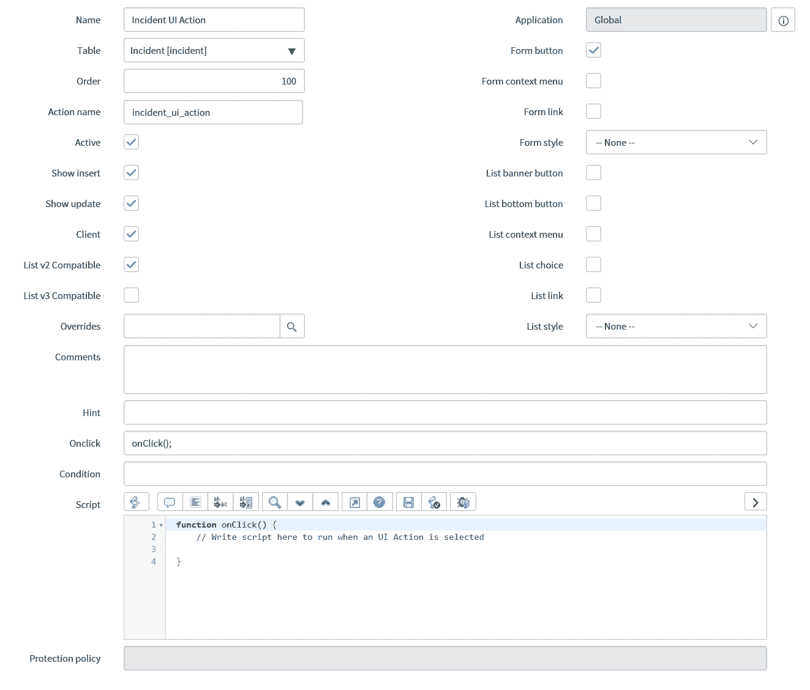
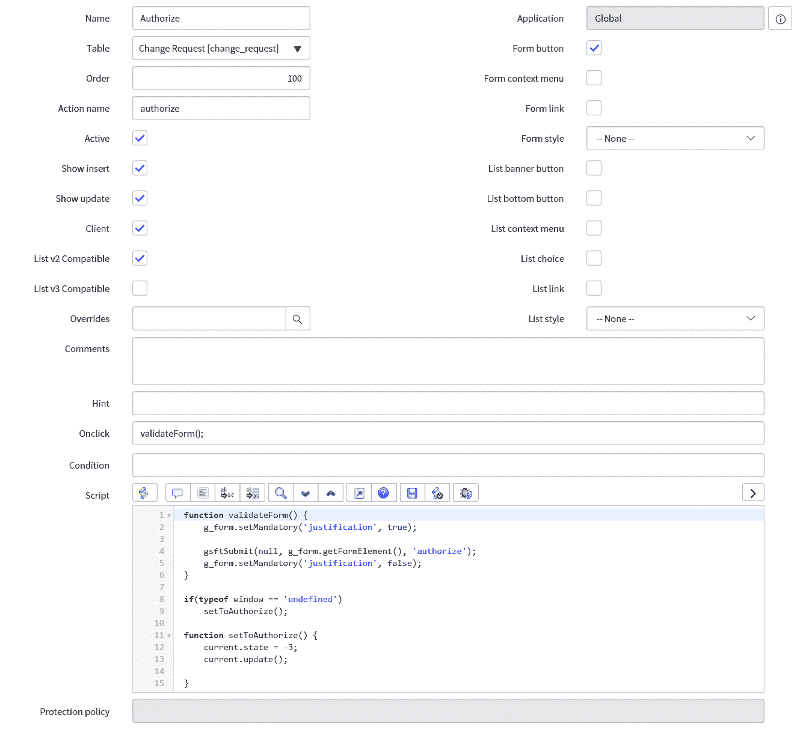

# 高级客户端脚本编程

在本章中，我们将探索客户端脚本的高级方面。在这里，我们将更深入地研究客户端脚本以及使用一些更高级的技术。

本章我们将涵盖的主题包括：

+   UI 动作

+   AJAX 调用

+   高级客户端脚本示例

# UI 动作

UI 动作通常被认为是服务器端脚本，但它们也可以作为客户端脚本运行。我们将在下一章中介绍 UI 动作及其在服务器端基础中的基本用法。然而，在这里，我们将探讨在客户端运行 UI 动作的更高级技术。

# 客户端 UI 动作

要将 UI 动作更改为运行客户端脚本，我们首先需要检查客户端字段复选框。这将带来一些额外的字段，包括选择 UI 动作将与之兼容的列表版本的复选框，但我们最感兴趣的新的主要字段被称为 `onClick`。

当选择 UI 动作时，`onClick` 字段会运行其中包含的客户端代码。从视觉上看，这只是一个很小的字段，并不适合代码，因此大多数开发者会在该字段中调用一个函数，并在主脚本字段中定义该函数。

让我们看看这个用法的例子。对于 `onClick` 字段中的代码，我们只需要调用以下函数：

```js
onClick();
```

然后，在脚本字段中，我们可以定义函数并包含我们想要在其中运行的代码：

```js
function onClick() {
// Write script here to run when an UI Action is selected

}
```

这种调用位于脚本字段中的函数的方法被 ServiceNow UI 动作使用，这些动作是随平台提供的。

我们可以在 *图 4.1* 中看到这些 UI 动作的外观：



图 4.1：包含客户端脚本的示例 UI 动作

在我们的示例 *图 4.1* 中，我们可以看到 UI 动作作为一个表单按钮，因为那是被选中的复选框。在 `Onclick` 字段中对 `onClick` 函数的调用使我们能够在 `onClick` 函数内部的脚本字段中编写我们需要的任何代码。

# 调用服务器端脚本

现在我们已经看到了如何在 UI 动作中使用客户端脚本，我们可以进一步探讨在同一个 UI 动作中使用客户端和服务器端脚本。

这可以通过首先在 UI 动作中调用客户端脚本，然后该脚本在代码中调用 UI 动作，从而运行服务器端脚本来实现。一开始想象这个概念可能有点奇怪，所以让我们看看它是如何工作的。

首先，我们需要查看从客户端代码调用 UI 动作的代码行：

```js
gsftSubmit(null, g_form.getFormElement(), '<ui_action_name>');
```

上一行代码调用 UI 动作，但这次它将在服务器端运行。当使用这种技术时，你必须确保 UI 动作的“动作名称”字段与脚本中引用的名称相同。`gsftSubmit` 的第一个参数用于控制，但由于我们不希望使用它，所以我们只传递 null。第二个参数是为了获取表单；在我们的情况下，我们只想获取当前的 HTML 表单。第三个参数是动作名称，因此这需要是我们的 UI 动作动作名称。

接下来，让我们看看脚本的服务器端：

```js
if(typeof window == 'undefined')
serverSideCode();

function serverSideCode() {
//Run the server side UI Action code

}
```

代码的第一部分是一个 `if` 语句，用于检查我们是否不再在服务器端运行而是在客户端运行。这段小代码还确保我们不会收到浏览器错误。如果 `if` 语句评估为真，那么我们就调用一个函数来运行我们的服务器端代码。

我们可以使用前面的示例并在我们的脚本字段中调用 `onClick` 函数：

```js
function onClick() {
// Write script here to run when an UI Action is selected
gsftSubmit(null, g_form.getFormElement(), 'incident_ui_action');

}

if(typeof window == 'undefined')
serverSideCode();

function serverSideCode() {
//Run the server side code

}
```

这现在给我们一个同时运行客户端和服务器端代码的 UI 动作。我们将在本章后面进一步探讨一些示例。

这种类型的脚本非常有用，通常在提交之前确保某些字段已填写或满足条件，并在运行服务器端代码之前在客户端使用。

# AJAX 调用

AJAX 调用是一种从客户端以高效方式调用服务器端脚本的方法。虽然可以在客户端简单地使用 `GlideRecord`，但这并不被视为最佳实践。值得记住的是，每次我们从客户端调用服务器时，我们都需要从客户端到服务器再返回客户端的往返，这需要时间，并在用户面前表现为延迟。因此，我们希望减少我们进行的服务器调用数量，并确保任何进行的调用都尽可能高效。

AJAX 调用可以在服务器上执行多个 `GlideRecord` 查询，这节省了我们多次调用服务器的需要。为了使 AJAX 调用工作，我们需要一些客户端脚本和一些服务器端脚本。这通常是一个客户端脚本和一个脚本包含；我们将在后面的章节中进一步探讨脚本包含。

# 客户端 AJAX

AJAX 调用的客户端需要设置 AJAX 调用并向服务器端传递相关参数。一旦从服务器收到响应，我们可以使用返回的值或值来决定要做出哪些更改。让我们看看 AJAX 调用的客户端是如何工作的：

```js
var ajaxCall = new GlideAjax('serverAjax');
ajaxCall.addParam('sysparm_name','getUserLocation');
ajaxCall.addParam('sysparm_user_id', g_form.getValue('caller_id'));
ajaxCall.getXML(ajaxResponse);

function ajaxResponse(response) {
   var answer = response.responseXML.documentElement.getAttribute("answer");
   alert(answer);
}
```

上一示例涵盖了基于返回结果的 AJAX 调用和返回函数的调用。在第一行，我们创建一个新的 AJAX 调用并给它我们脚本的包含名称。在此基础上，我们可以添加要发送到服务器的参数。第一个我们需要每次都包含，因为 `sysparm_name` 参数是我们想在服务器端调用的函数的名称。

之后，我们可以向服务器端发送我们喜欢的任何参数，以便在服务器端脚本中使用。在示例中，我们通过 `sysparm_user_id` 参数发送当前调用者。

最后，我们使用一个 `callback` 函数，该函数使用 `getXML` 函数返回结果。这允许 AJAX 调用异步工作，客户端代码可以继续运行。您也可以使用 `getXMLWait` 作为同步调用，但这将停止客户端运行代码，直到服务器端代码完成，因此这不是最佳实践。

在 `callback` 函数中，我们将答案变量设置为服务器端代码的返回值。在这个例子中，我们只是向用户显示我们的服务器端脚本的执行结果。

# 服务器端 AJAX

现在我们已经看到了 AJAX 调用的客户端方面，让我们看看实现这一功能所需的服务器端代码。

如前所述，我们需要调用与我们的 AJAX 调用具有相同名称的脚本，并确保它包含一个具有 `sysparm_name` 参数中名称的函数。我们还需要确保脚本包含客户端可调用的，以便 AJAX 调用可以工作，我们可以通过在脚本包含上检查客户端可调用复选框来完成此操作：

```js
var serverAjax = Class.create();
serverAjax.prototype = Object.extendsObject(AbstractAjaxProcessor, {

  getUserLocation: function getUserLocation() {
    var userRecord = new GlideRecord('sys_user');
    userRecord.get(this.getParameter('sysparm_user_id')); 
    return userRecord.location.getDisplayValue();

  } 

});
```

在这里，我们使用 `getUserLocation` 函数将调用者的位置返回给客户端。通过使用 `GlideRecord` 和 `get` 方法获取用户记录，然后我们可以从该用户记录返回位置给客户端。我们使用显示值在客户端向用户显示；否则，我们简单地显示位置记录 `sys_id`，这对于最终用户来说意义不大。

通过使用 AJAX 调用，我们可以传递回单个值，如我们的示例所示，或者如果需要，可以传递多个值。数组是传递多个值的好方法，但您也可以使用其他方法，因为响应是一个 XML 文档。

# 脚本示例

现在我们已经看到了一些更高级的客户端脚本使用方法，让我们看看如何使用这些新学的技术的一些示例。

首先，让我们看看 UI 操作。我们可能想使用 UI 操作来推进变更记录的状态，但我们希望在推进到其他状态之前确保某些字段已填写。我们可以使用客户端和服务器端代码来实现这一点。首先，我们使用客户端代码来验证表单，然后使用服务器端代码对记录进行更改。

我们可以看看这是如何工作的：

```js
function validateForm() {
  g_form.setMandatory('justification', true);

  //Call the UI Action to run the server side script
  gsftSubmit(null, g_form.getFormElement(), 'authorize');
  g_form.setMandatory('justification', false);
}

if(typeof window == 'undefined')
  setToAuthorize();

function setToAuthorize() {
  current.state = -3;  //Authorize state
  current.update();

}
```

在示例中，在客户端脚本中，我们正在将我们想要填充的字段在脚本中设置为`Mandatory`，以确保在表单提交之前填充。这是一种很好的通知用户填写额外字段的方法，因为它使用了 ServiceNow 的`Mandatory`功能，而不是向用户弹出窗口。你将注意到在提交之后，我们停止字段为`Mandatory`。这样做是为了如果用户只想简单地保存表单或更改不同的字段值，他们不会被`justification`字段仍然为`Mandatory`所阻止。

对于提交表单，我们使用`gsftSubmit`和我们的 UI 操作的动作名称，在这个例子中是`authorize`。这允许服务器端脚本运行我们的服务器函数`setToAuthorize`。由于`state`字段使用数字作为其值，我们将字段设置为`-3`，并且，正如示例中所示，添加注释以让其他开发者知道该值代表什么是一种良好的实践；这也可以作为你自己的良好提醒。

我们可以看看这个 UI 操作在*图 4.2*中会是什么样子：



图 4.2：使用客户端和服务器端脚本授权 UI 操作

使用客户端脚本进行验证和服务器脚本执行操作的方法非常有用，并且对于 UI 操作来说效果非常好。

现在让我们看看一个 AJAX 调用的示例。在这个例子中，我们将查看一个依赖于目录项中变量的目录项。有时用户可能需要撤销某些访问权限，例如当他们离开公司时。当我们选择用户时，我们想确保他们有一些形式的访问权限；否则，在剩余字段中他们将没有选择，这会导致用户体验不佳。

让我们看看我们将放入目录客户端脚本中的客户端脚本：

```js
function onChange(control, oldValue, newValue, isLoading) {
  if (isLoading) {
    return;
  }

  //Clear the Access field when the user changes to ensure a valid selection is made.
  g_form.setValue('variables.access', ''); 

  if (newValue == '') {
    return;
  }

  //Ensure a selected user has some active access else clear field
  var ga = new GlideAjax('accessCheck');
  ga.addParam('sysparm_name','userHasAccess');
  ga.addParam('sysparm_user', newValue);
  ga.getXML(AJAXParse);

}

function AJAXParse(response) {
  var answer = response.responseXML.documentElement.getAttribute("answer"); 
  if (answer == 'false') {
    g_form.addErrorMessage('User has no access to remove.');
    g_form.setValue('variables.user', ''); 
  }
} 
```

这将被放入一个目录客户端脚本中作为一个`onChange`脚本，因此决定了我们的函数名称。当我们使用目录项和变量时，我们必须在变量名称前加上`variables`，然后使用`g_form`方法来使用变量名称。在示例中，我们使用了一个`user`和`access`变量，并且正如你所看到的，当用户更改时我们清除`access`变量，这样我们就不会在屏幕上出现数据不匹配的情况，其中用户选择了一些访问权限然后又回填用户。

在我们发起 AJAX 调用之前，我们检查用户字段的新值不是空的。如果是空的，就没有必要往返服务器，所以我们使用`return`，实际上退出脚本。如果值不为空，那么我们使用 AJAX 调用，调用我们的脚本包含并发送一个包含用户字段中新值的用户参数。

当从服务器返回响应时，如果结果是用户没有访问权限，那么我们可以假设用户将无法选择和删除访问权限。因此，在访问变量中不会有任何选择。与其让用户没有任何选择，我们可以清除用户字段，并让用户知道他们所选的用户没有访问权限来删除。

现在我们已经查看了这个例子的客户端部分，让我们看看服务器端代码。记住，脚本包含名称和函数需要与发起 AJAX 调用的客户端代码相匹配：

```js
var accessCheck = Class.create();
accessCheck.prototype = Object.extendsObject(global.AbstractAjaxProcessor, {

  /**
  * Ajax Call - Returns whether a user has an active access record 
  */ 
  userHasAccess: function userHasAccess() {

    var uAccess = new GlideRecord('u_access');
    uAccess.addQuery('u_user', this.getParameter('sysparm_user'));    
    uAccess.query(); 
    if (uAccess.next()) {
      return true;
    } 
    return false;
  }

});
```

在服务器脚本中，我们使用 `GlideRecord` 来检查一个自定义访问表，因此使用 `sysparm_user` 参数，通过过滤结果仅包含该用户的记录。如果我们找到一个访问记录，我们将向客户端返回 `true`，如果没有找到记录，则返回 `false`。

通过向客户端脚本返回 `false`，我们清除表单上的用户变量并显示错误消息，以便登录用户知道他们所选的用户没有访问权限。如果我们假设已经设置了合适的引用限定符，这将阻止登录用户在选择用户后找不到记录时选择访问变量。

由于 AJAX 调用被广泛使用，让我们看看另一个例子。在这个例子中，我们将通知事件表单上的用户，他们所选的更改是否与仍有打开任务的事件相关。

这次，我们将使用客户端脚本发起 AJAX 调用。我们需要它在事件表单上的更改请求字段更改时运行，因此我们将使用 `onChange` 脚本。让我们看看这个客户端脚本代码将如何看起来：

```js
function onChange(control, oldValue, newValue, isLoading, isTemplate) {
  if (newValue === '') {
    return;
  }

  //Check whether change request has open tasks
  var ga = new GlideAjax('changeScripts');
  ga.addParam('sysparm_name','changeHasOpenTasks');
  ga.addParam('sysparm_change', newValue);
  ga.getXML(AJAXCall); 

}

function AJAXCall(response) {
  var answer = response.responseXML.documentElement.getAttribute("answer");

  if (answer == 'true') {
    g_form.showFieldMsg('rfc', 'Change has open tasks', 'error');
  } else {
    g_form.showFieldMsg('rfc', 'Change has no open tasks', 'info');
  }
}
```

在这个例子中，我们再次看到了 AJAX 调用，这次是将所选更改请求作为参数发送。当 `change` 字段值或 `newValue` 为空时，我们不需要运行 AJAX 调用，但这次我们确实希望我们的脚本在加载时运行，因此我们从脚本开头移除了 `isLoading` 检查。

当我们从 AJAX 调用返回时，我们使用 `g_form` 来显示一个字段消息，该消息出现在字段下方，以显示所选更改请求是否有打开的任务。

现在，我们将查看使这个 AJAX 调用工作的服务器端脚本。将使用脚本包含来保存代码：

```js
var changeScripts = Class.create();
changeScripts.prototype = Object.extendsObject(AbstractAjaxProcessor, {

  /**
  * Ajax Call - Returns whether a change has open tasks 
  */ 
  changeHasOpenTasks: function changeHasOpenTasks() {

    var cTask = new GlideRecord('change_task');
    cTask.addQuery('change_request', this.getParameter('sysparm_change')); 
    cTask.addQuery('state', 'NOT IN', '3,4'); //Closed and Cancelled
    cTask.query(); 
    if (cTask.next()) {
      return true;
    } 
    return false;
  }
});
```

在这个例子的服务器端脚本中，我们使用 `GlideRecord` 来查找所有仍为传递的更改请求打开的更改任务。在前面的脚本中，我们使用 `addQuery` 行为 `GlideRecord` 添加查询，其中状态不是 `3` 或 `4`，这相当于关闭和取消。这允许我们将任何其他状态视为打开，即使从开箱即用的设置中添加了更多的活动状态。

这意味着如果找到任何记录，我们可以立即返回 `true`，因为我们只需要知道至少有一个任务仍然是开放的。如果我们找到一个仍然开放的记录，就没有必要运行其他更改任务，这可以降低处理时间并提高代码效率。

一旦返回值被发送回，相应的字段消息将通过客户端代码显示给用户。这种类型的 AJAX 调用对于向用户提供他们输入数据的额外详细信息非常有用。

AJAX 调用被广泛使用，我肯定会建议尽早熟悉它，以便在 ServiceNow 中进行脚本编写，因为许多需求将需要一个 AJAX 调用来满足。

# 摘要

在本章中，我们探讨了客户端脚本的进阶方面。我们看到了如何使用 UI 动作来运行客户端代码，并运行客户端和服务器端代码。我们还研究了至关重要的 AJAX 调用，这是一种从客户端高效调用服务器端代码的方法。最后，我们查看了一些如何使用这些高级客户端技术的示例。

在下一章中，我们将转向服务器端，并了解如何开始编写服务器端脚本。这包括业务规则、UI 动作和访问控制。我们还将探讨这些脚本应该在何时编写，如何测试它们，以及一些实用示例来帮助您入门。
