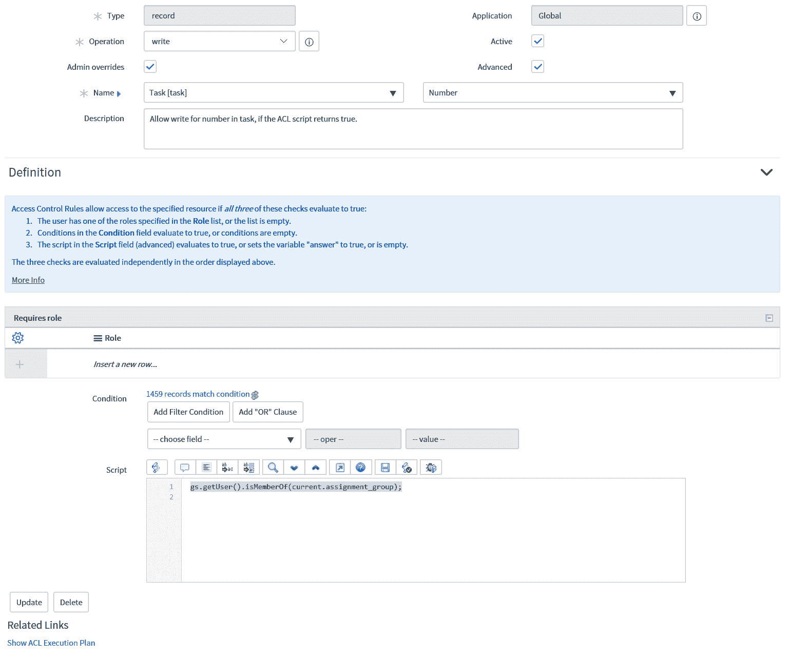

# 服务器端脚本简介

在本章中，我们现在将探讨脚本的服务器端。在这里，我们通过介绍生成服务器端代码的基本知识来开始编写服务器端脚本。我们还将了解如何测试这些脚本，并查看一些示例。

在本章中，我们将探讨以下主题：

+   商业规则

+   UI 动作

+   访问控制

+   如何以及何时编写服务器端脚本

+   测试服务器端脚本

+   服务器端脚本示例

# 商业规则

商业规则通常是使用最广泛的服务器端脚本方法。可以使用商业规则进行基本的配置，而不是定制。我可以说，对于大多数需要商业规则的需求，你通常需要添加一些形式的定制，即脚本。

商业规则的一个特别有用的方面是它们可以以不同的方式被触发。这允许我们根据对记录发生的操作，在服务器端脚本的不同时间运行。

当首次查看商业规则表单时，有两个选项来决定何时运行商业规则。这些是在记录的插入或更新时。在这个基本上是基本视图的商业规则中，我们可以配置商业规则在筛选条件或角色的所有者以及更改字段值时运行。如果我们想做的更多，这通常是情况，我们需要在表单上勾选高级复选框。

一旦勾选了高级复选框，我们就有四个选项来决定商业规则应该运行的动作。让我们看看这些选项是什么，以及它们确切运行的时间：

+   插入：在插入新记录时运行

+   更新：在记录更新时运行

+   删除：在记录被删除时运行

+   查询：当搜索此类记录时运行

商业规则运行的时间也取决于“何时”字段的值。在这里，我们也有四个选项可供选择：

+   在保存记录之前：在记录保存之前运行

+   之后：在记录保存后立即运行

+   异步：在调度器运行一个在记录保存后发送到计划作业队列的计划作业时运行

+   显示：在从数据库获取数据后加载表单之前运行

当你正在更新记录本身时，最好使用“之前”商业规则；这样，更改是在插入或更新之前进行的，因此记录只更新一次。应该使用“之后”商业规则，当脚本不影响当前记录时，这样脚本就可以在保存后运行。

异步将在未来的某个时刻运行，所以只有当脚本中的操作不需要立即看到时，我才会使用它。这可以是排队事件以发送通知或从 ServiceNow 发送作业。显示业务规则最好用于在草稿板上保存数据，以便客户端脚本可以利用它。这很有帮助，因为它阻止客户端脚本需要往返服务器，因为显示业务规则已经收集了所需的数据。

结合这些复选框和“当”字段，我们可以为运行我们的服务器端脚本提供良好的触发器选择。最常见的是勾选“插入”和“更新”复选框的“之前”或“之后”的“当”字段值。

当勾选了高级复选框后，我们还可以看到高级表单部分。这为我们提供了运行脚本的条件和用于放入我们的服务器端代码的脚本字段。

现在我们已经了解了业务规则的格式，接下来让我们看看如何添加脚本。我们只需要设置脚本运行时的表单，如果需要的话添加一个条件，然后在脚本字段中添加我们的代码。

作为例子，我们将创建网络类别事件时将其影响设置为高。为此，我们需要在条件字段中添加一个条件：

```js
current.category == 'network'
```

这个条件字段有助于在不必要时停止运行脚本。在先前的代码中，我们只有在类别是`network`时才会运行我们的脚本。

现在我们来看看我们将运行的脚本：

```js
(function executeRule(current, previous /*null when async*/) {

  current.impact = '1'; //High Impact

})(current, previous);
```

首先，让我们看看 ServiceNow 为我们提供的业务规则代码。我们提供的`executeRule`函数有两个参数：`current`和`previous`。`current`是当业务规则被触发时包含记录所有当前值的对象。`previous`是包含任何更新之前记录值的对象，本质上持有前一个值。Previous 只能与`update`和`delete`操作一起使用。

我们的示例将网络类别事件的影响设置为高。对于我们的示例，我们将“当”字段设置为“之前”，这意味着我们不需要添加任何脚本来更新记录，因为我们是在记录被保存之前更改当前记录。我们还需要在我们的业务规则中勾选“插入”复选框。我们可以在*图 5.1*中看到业务规则本身：


图 5.1：为网络类别事件设置高影响力的业务规则

这为我们概述了业务规则的工作方式，并且在 ServiceNow 平台上被广泛使用。

# UI 操作

UI 操作是你可以在 ServiceNow 中找到的按钮、上下文菜单选择、链接和列表选择。因为你可以让 UI 操作出现在平台的不同区域，所以它们可以非常方便地添加你的脚本。

我倾向于发现表单按钮在 UI 动作中最常被使用。这些可以作为有用的附加按钮添加功能或以不同状态移动记录的方法。

UI 动作通常在服务器端运行；然而，我们也可以在客户端运行它们，正如我们在客户端章节中探讨的那样。通过使用复选框，我们可以在创建记录时插入 UI 动作，或者在记录已存在时更新。

首先，让我们看看您可以将 UI 动作显示给用户的不同方式。通过勾选相关的复选框，您创建的 UI 动作可以以一种或多种方式显示。让我们看看这些选项：

+   **表单按钮**：这将在表单上以按钮的形式显示 UI 动作，类似于更新按钮

+   **表单上下文菜单**：在上下文菜单中显示 UI 动作，该菜单在您右键单击表单标题栏时出现

+   **表单链接**：在相关链接部分以链接的形式显示 UI 动作，该部分出现在表单部分和关联列表之间

+   **列表横幅按钮**：在列表视图的顶部以按钮的形式显示 UI 动作，位于表标签旁边

+   **列表底部按钮**：在列表底部以按钮的形式显示 UI 动作

+   **列表上下文菜单**：在记录列表中通过右键单击显示 UI 动作

+   **列表选择**：UI 动作出现在列表底部选定行的操作选择中

+   **列表链接**：在列表底部相关链接部分显示 UI 动作

与业务规则类似，我们同样为 UI 动作获取一个条件和脚本字段。然而，脚本字段在 UI 动作上开始时是空的，因此开发者必须提供所有代码。

我们将查看如何编写一个基本的 UI 动作脚本。以我们的示例为例，我们将构建一个表单按钮来将事件状态更改为“进行中”。让我们看看我们需要编写的代码：

```js
//Moves the incident state to In progress
current.state = 2; //In progress
current.update();

action.setRedirectURL(current);
```

在前面的代码中，我们将状态设置为 `2` 的值，这对应于事件的状态“进行中”。一旦设置了此值，我们只需要使用 `current.update` 更新记录。

`action.setRedirectURL` 这一行在 UI 动作中用于在服务器端脚本运行后重定向到当前记录。如果在表单上按下 UI 动作而没有使用重定向代码，它将返回到上一个屏幕，通常是选择记录的列表视图。

在我们的脚本中，这条重定向行表示代码运行后，将页面重定向到不同的位置；在我们的示例中，我们使用 `current` 作为当前记录。然后它将重定向回我们所在的记录。如果我们想保持用户在同一个记录上并显示我们的 UI 动作所做的更改，这很有用。在这种情况下，用户应该能够看到状态变化。

我们可以在*图 5.2*中看到 UI 动作：


图 5.2：将状态字段移动到进行中的 UI 操作

在这里，我们只使用我们的 UI 操作作为表单按钮，但我们可以通过使用右侧的复选框以其他方式显示它。此 UI 操作将在带有“显示插入”和“显示更新”复选框勾选的新和现有事件表单上出现。

# 访问控制

访问控制是 ServiceNow 的安全方面，访问是否授予主要受配置的角色控制。然而，如果需要更复杂的计算来确定用户是否允许访问，我们需要使用脚本来处理这一点。

通常，访问控制无需脚本即可定义，但仍有许多场景需要使用代码。这些通常是在需要用户信息超出其角色范围时；例如，他们的组成员或公司。

要修改访问控制，您需要拥有 security_admin 角色，并确保在尝试修改之前提升权限并使用它。要访问访问控制的脚本方面，您需要勾选高级复选框。一旦完成，脚本字段将出现在表单底部。

对于每个访问控制，只有当用户匹配访问控制的三个方面：角色、条件和脚本时，才会授予用户访问权限。在编写您的访问脚本时，这值得记住，因为可能是角色或条件阻止了访问，而不是您编写的代码。

现在让我们看看一些访问控制代码。在这里，我们将允许如果用户是当前分配组的成员，则对任务编号字段进行写访问：

```js
gs.getUser().isMemberOf(current.assignment_group);
```

此示例将允许用户访问，如果他们是当前分配组的成员。访问控制中的脚本需要将答案变量设置为 true 或 false，或者简单地评估为 true 或 false。在示例中，我们只是使用评估方法。

在*图 5.3*中，我们可以看到整个访问控制，允许对任务编号字段进行写访问。这适用于任务表；例如，事件、变更和问题：



图 5.3：任务表上数字字段的访问控制

访问控制脚本可以相当简短，并且您通常不会在这里遇到复杂的代码，但得到正确的代码非常重要，因为访问控制可以成为 ServiceNow 的一个非常复杂的领域，有许多规则适用于或不适用于授予或拒绝用户访问。

# 如何以及何时编写服务器端脚本

服务器端脚本通常比客户端脚本更受欢迎，因此应在可能的情况下使用。由于服务器端脚本通常在用户前端之外运行，因此它不太可能影响用户会看到的不良用户体验的加载时间。

虽然如此，仍然建议在自定义之前进行配置，并在可能的情况下避免脚本化。这是因为脚本更难维护，并且更有可能在 ServiceNow 的版本之间引起问题。

让我们探讨一些服务器端脚本的一些常见用途以及如何最佳完成这些任务。

# 更改表单值

通过业务规则或 UI 操作来更改表单值通常是最佳选择。如果你想在使用者点击时更改值，那么 UI 操作是最好的；然而，如果你只想在满足某些条件时始终更改值，那么业务规则会更好。最好使用前置业务规则，这样表单就只会更新一次。

# 限制表单和字段的访问

在限制表单和字段的访问时，最好使用访问控制。访问控制将限制无论以何种方式访问表单的访问，因此它是一个强大的工具。如果你只需要使用角色或条件来控制表单和字段的访问，那么这是首选方法，因为这被视为配置，并且更容易维护。

如果你的访问要求比这更复杂或更复杂，那么你需要向访问控制中添加脚本。最常见的原因是用户需要成为某些组的成员，或者用户在表单的字段中被引用。

# 将值传递到客户端

有时候，你可能需要将值传递到客户端，因为它们在加载的表单中不可见，而这些值可能对运行客户端脚本很有用。在这种情况下，你将想要使用显示业务规则。这允许在显示业务规则中设置临时值，然后可以在表单的客户端脚本中使用这些值。

如果你考虑在`onLoad`客户端脚本中调用服务器，那么通常更好的做法是使用显示业务规则，因为这样可以消除对服务器额外调用的需求。

我们可以在*图 5.4*中看到显示业务规则的外观：


图 5.4：显示业务规则示例

值得注意的是，一旦我们选择了“何时运行”字段作为显示，我们就不再有插入、更新、删除或查询复选框可供选择。这是因为显示业务规则总是在表单加载之前以相同的时间运行。

# 复习

我们已经查看了一些在服务器上脚本化以及在不同场景下如何最佳实现这些任务的例子。服务器端脚本通常比客户端脚本更常见，并且占大多数 ServiceNow 实例代码的大部分。

因此，我们实际上刚刚开始探讨服务器端脚本的可能性。代码中存在巨大的潜力，我们将在下一章中探讨一些更高级的方法。

# 测试服务器端脚本

与客户端脚本一样，测试服务器端脚本有几种方法。这些方法通常不如客户端调试技术那么直接，但在修复代码时是必不可少的。

# gs.log

我们将要查看的第一种日志技术是`gs.log`。这是一种非常流行的技术，并且仍然被开发者广泛使用。正如我们在第二章*探索 ServiceNow Glide 类*中看到的，`gs.log`让我们能够将日志发送到系统日志，带有脚本源，这样我们可以在代码执行时发送消息。

我们可以从任何服务器端脚本中创建`gs.log`，这使得它非常有用；然而，我们无法在范围应用程序中使用它。我们将在稍后查看范围应用程序的日志记录。只要你在全局范围内，你就可以使用`gs.log`并向系统日志发送消息。

让我们回顾一下使用`gs.log`的简单代码片段：

```js
gs.log('Server Side Log Message');
```

当脚本运行时，此日志将出现在应用程序导航器中的脚本日志语句模块中。我们还可以使用此方法在脚本中的某个阶段显示变量的值。我们可以使用此方法来显示事件记录上的调用者：

```js
var user = current.caller_id;
gs.log('The current caller is ' + user);
```

如果在业务规则中使用，这将显示日志中的当前事件调用者。我们可以使用加号符号向我们的日志添加字符串和变量。

此方法允许我们在脚本中添加尽可能多的日志，以检查方法是否在代码的某些点上被调用或变量的值。

记得在将代码上线之前删除所有的`gs.log`语句或将其注释掉。代码中留下太多的日志行会使系统日志难以调试。

# 范围应用程序的日志记录

正如我们在查看`gs.log`时发现的，它不在范围应用程序中工作。在范围应用程序中进行日志记录时，我们需要使用不同的方法。实际上，有四种方法可以使用。

范围应用程序中的四个日志级别是：

+   `错误`

+   `警告`

+   `信息`

+   `调试`

这种类型的日志记录与`gs.log`非常相似，但用不同的日志级别替换了`gs`之后的单词`log`。

让我们看看如何为每个编写一个基本的脚本：

```js
gs.error('Error log');
gs.warn('Warn log');
gs.info('Info log');
gs.debug('Debug log');
```

这些日志可以在应用程序日志表中查看，可以通过访问系统日志 | 系统日志 | 应用程序日志来实现。

默认情况下，当你创建一个新的应用程序范围时，只有错误、警告和 info 消息会被显示，这是由与范围相关的系统属性设置的。这个属性将被命名为`<scope name>.logging.verbosity`，可以在四个级别中的任何一个设置。对于每个设置的级别，它将显示该级别和任何更高级别的消息类型。由于属性的默认值是 info，我们将看到所有消息，除了 debug。

通常，许多开发者会简单地使用信息消息作为在服务器端调试脚本的通用方式。然而，如果你正在将调试功能集成到创建的范围内应用程序中，最好使用所有级别类型以获得更完整的解决方案。

# 会话调试

ServiceNow 还提供了一些服务器端调试辅助功能，形式为会话调试。这些主要列在系统诊断应用程序中的模块中，但在系统安全应用程序中也有安全调试可用。

通过点击这些模块，你可以激活特定区域的调试；例如，业务规则。这会持续到会话结束，或者你通过使用禁用所有模块来关闭调试。

我发现这些模块很有用，主要是用于安全规则调试，但开发者通常并不全面地使用它们。

# 脚本调试器

脚本调试器是在伊斯坦布尔版本中引入的，用于服务器端脚本。这允许开发者设置任何服务器端脚本的断点，然后在调试器中逐步执行。

要使用调试器，你必须首先在脚本中点击左侧边缘以创建断点。然后，要加载脚本调试器，导航到系统诊断 | 脚本调试器。脚本调试器在一个新窗口中显示，你可以看到在脚本中创建的断点，如图 *5.5* 所示：


图 5.5：脚本调试器逐步执行事件业务规则

一旦打开调试器，触发脚本，你将获得启动调试的选项，这将允许你逐步执行脚本。

如果你需要找出脚本中的问题所在，但不确定问题出在脚本中的哪个位置，这是一个有用的工具。这也是一个很好的工具，用于处理通常包含在脚本包含中的较长的脚本。

# 脚本示例

现在我们已经了解了服务器端脚本的基本工作原理，我们可以看看一些脚本示例，以进一步了解如何使用这些入门级服务器端技术。

我们将从一个更进一步的业务规则示例开始。

这次，我们将创建一个删除前业务规则，以确保董事不会被删除。我们需要将业务规则设置为高级；选择删除复选框并在当字段中选择“之前”。让我们看看代码：

```js
(function executeRule(current, previous /*null when async*/) {

  if (current.title == 'Director') {
    gs.addErrorMessage('Cannot delete Director');
    current.setAbortAction(true);
    action.setRedirectURL(current);
  }

})(current, previous);
```

在这里，我们正在使用标题字段检查用户是否是董事，如果是，则使用 `setAbortAction` 来阻止 `delete` 操作进行。为了确保用户得到通知，我们还使用 `addErrorMessage` 向用户显示消息，并使用 `action.setRedirectURL` 保持用户在当前记录上，这样他们就可以看到 `delete` 没有进行。

该规则可以在 *图 5.6* 中看到：


图 5.6：停止删除董事的业务规则

接下来，我们将查看一个 UI 操作示例。对于这个 UI 操作，我们将创建一个按钮，将事件分配给自己。首先，我们将添加一个条件，只有当它是分配组的当前成员时，按钮才会在表单上显示：

```js
­gs.getUser().­isMemberOf(current.assignment_group)
```

这行代码确保登录用户是分配组的成员，以便可以将事件分配给他们。将事件分配给用户的代码如下所示：

```js
//Assign to the current logged in user
current.assigned_to = gs.getUserID();
current.update();
```

这两行将事件的分配给值设置为当前登录用户，然后更新记录以保存更改。这是一个相当简单的 UI 操作，但非常有帮助。

在这里，在*图 5.7*中，我们看到我们创建的 UI 操作：


图 5.7：将事件分配给登录用户的 UI 操作

通常，与 UI 操作相关的脚本可能不需要很长就能成为有效的解决方案并为用户提供价值。

最后，我们将查看一个访问控制脚本示例。有时可能有必要限制对单个组的访问，甚至排除系统管理员查看记录。

我们将使用变更请求表来演示此示例，但显然，存在其他需要停用的读取访问控制，以便我们的新访问控制能够工作。我们只允许`eCAB Approval`组访问`软件`类别的变更。

让我们看看代码：

```js
answer = false;
 if (current.category == 'Software') {
  if (gs.getUser().isMemberOf('eCAB Approval')) {
    answer = 'true';
  }
} else {
  answer = 'true';
}
```

在这里，如果类别不是`软件`，我们允许访问；或者，如果它是`软件`，用户必须是`eCAB Approval`组的成员。我们将清除管理员覆盖复选框，因此即使是管理员也需要遵守规则才能获得访问权限。我们还向规则添加了`itil`角色，以确保此角色对于授予访问权限是必需的。

我们可以在*图 5.8*中看到我们创建的规则：


图 5.8：将访问限制为 eCAB Approval 组成员的软件类别访问控制

这种类型的访问控制对于敏感信息可能很有用，也许甚至系统管理员也无法查看。

# 摘要

在本章中，我们通过业务规则、UI 操作和访问控制来查看服务器端脚本的基础。我们看到了业务规则的多种不同运行时以及 UI 操作显示给用户的多种方式。我们探讨了何时适合编写服务器端脚本，以及一些常见用途的示例，以及如何测试服务器端脚本。我们还查看了一些使用所学技术的服务器端脚本的实际示例。

在下一章中，我们将探讨服务器端脚本的进阶方面，包括脚本包含、计划任务和后台脚本。我们还将查看如何在工作流中编写脚本以及脚本操作，以及如何设置事件。我们将介绍这些服务器端高级主题，并展示一些实际示例。
