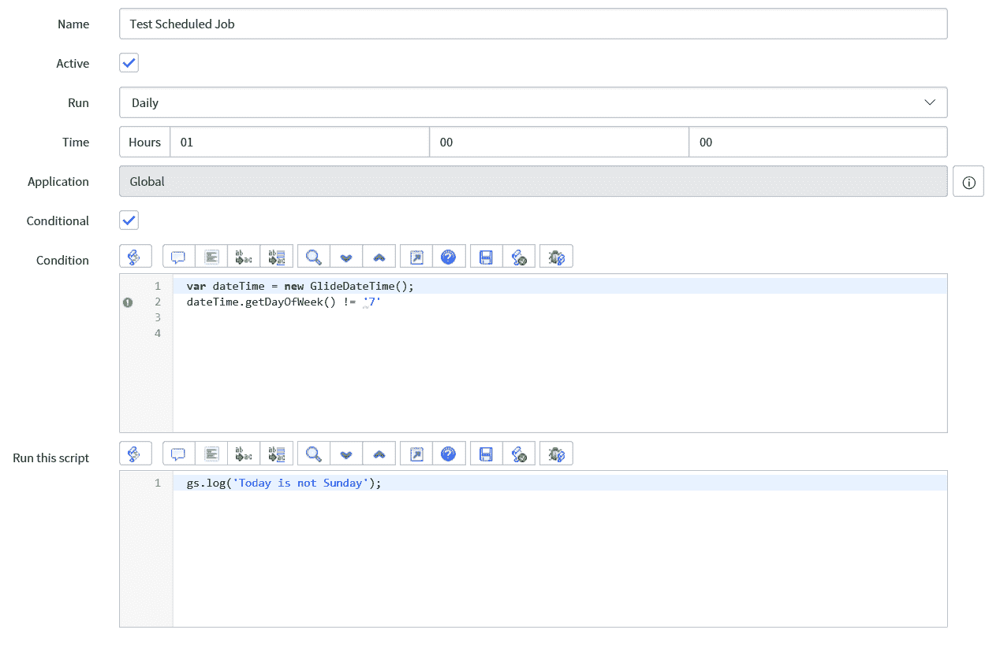
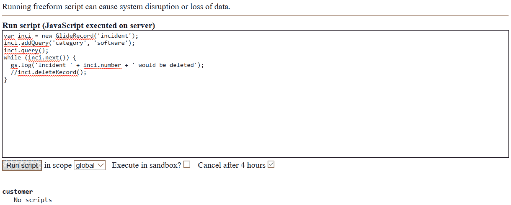
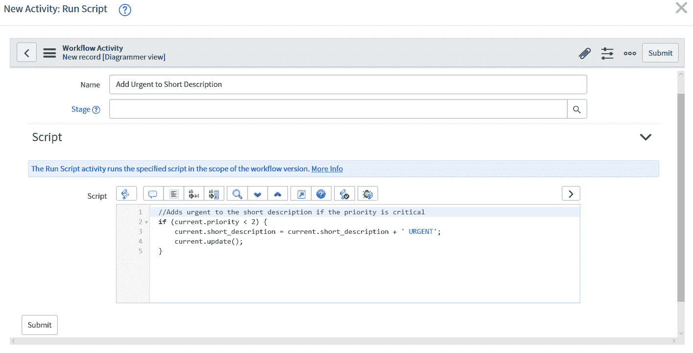
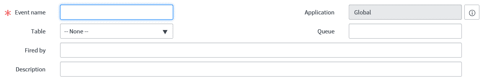
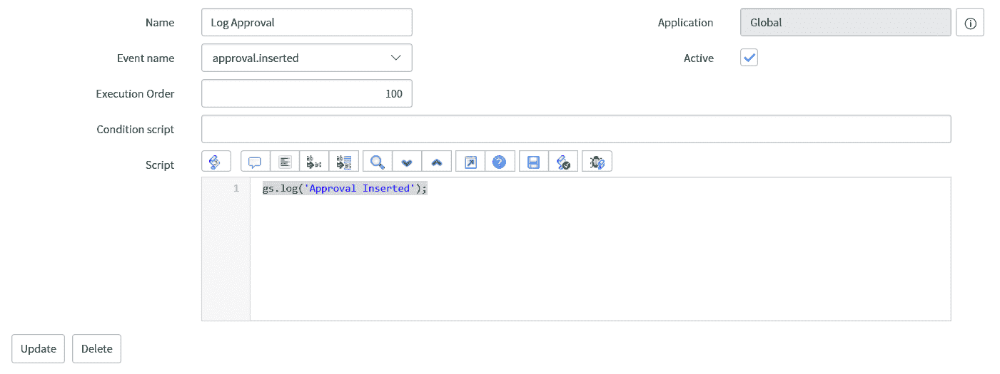
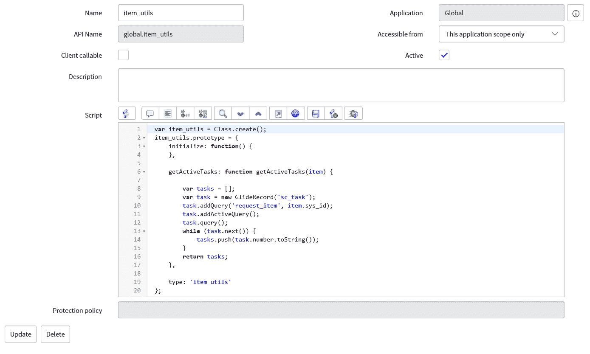
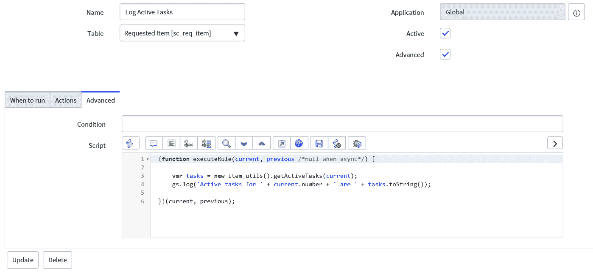
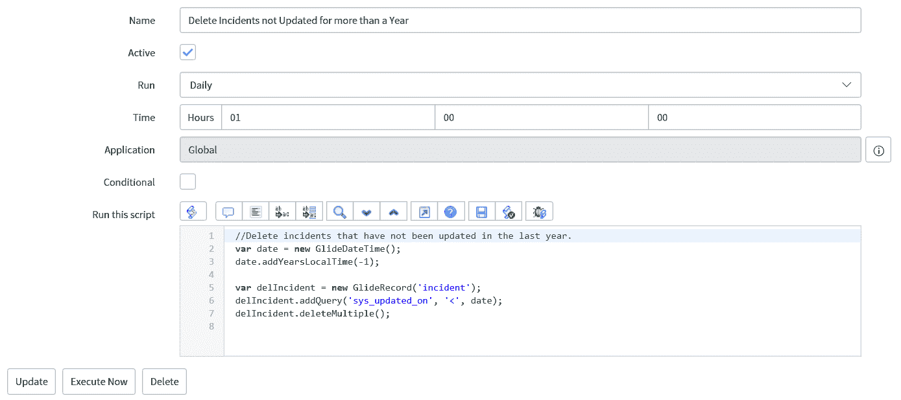
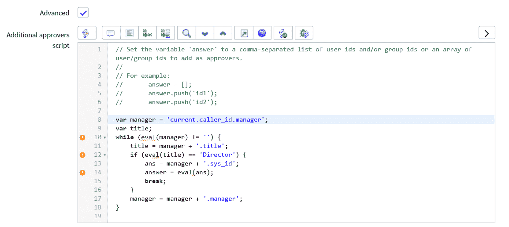
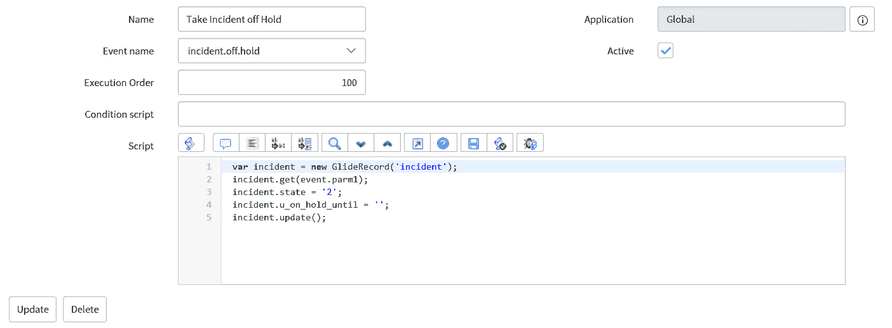

# 第六章：高级服务器端脚本编程

在本章中，我们将探讨服务器端脚本的高级方面。我们将探讨一些更高级的方法和技术，这些方法和技术可以在服务器端使用，建立在上一章所学内容的基础上。

在本章中，我们将探讨以下主题：

+   脚本包含

+   定时任务

+   背景脚本

+   工作流程脚本

+   事件管理

+   脚本操作

+   高级服务器脚本示例

# 脚本包含

脚本包含是 ServiceNow 脚本的核心，并且在编写代码时可以说是最常用的。脚本包含用于存放代码类，以及 ServiceNow 平台使用的许多后端脚本。

在创建您的脚本包含时，您首先需要给它一个名称。这个名称将非常重要，因为它将在其他代码中用于调用脚本包含中的方法。

确保您为脚本包含选择的名称中不包含空格。最好使用下划线在名称中分隔单词。

一旦为您的脚本包含输入一个名称，您会注意到 API 名称和脚本字段已被填充。API 名称是只读的，根据创建此脚本包含的应用程序的名称以及脚本包含本身的名称给出。

脚本字段填充了一些用于创建此脚本包含类的简介脚本，考虑到脚本包含的名称。例如，如果我们命名我们的脚本包含为`script_utils`，我们会得到以下脚本：

```js
var script_utils = Class.create();
script_utils.prototype = {
    initialize: function() {
    },

    type: 'script_utils'
};
```

这为我们提供了创建一个可以从服务器端调用的脚本包含类的基代码。在创建脚本包含时，首先要问的问题之一是脚本是否仅从服务器端调用，还是从客户端调用。这是因为如果我们打算从客户端调用脚本包含（例如，用于 AJAX 调用），我们需要勾选客户端可调用复选框，并且在这个过程中，你也会注意到代码也发生了变化。

对于我们的示例，这将更改代码如下：

```js
var script_utils = Class.create();
script_utils.prototype = Object.extendsObject(AbstractAjaxProcessor, {

    type: 'script_utils'
});
```

这个更改后的脚本允许脚本包含继承`AbstractAjaxProcessor`。如果没有这个，AJAX 调用将不会工作，所以如果脚本包含将在客户端调用，这一点非常重要。

虽然这是 ServiceNow 为您提供的入门代码，但并不需要在脚本包含中创建一个类。您也可以简单地创建一个在调用服务器端脚本时在脚本包含中调用的函数。

让我们看看一个简短的例子，看看它是如何做到这一点的：

```js
function script_include_test() {
  return 'Test Complete';
}
```

这是一个简单的函数，它只会返回文本字符串，但可以简单地作为一个独立的函数调用，而不是创建整个类。

现在我们来看如何创建一个包含类和方法的脚本包含。我们可以向我们的脚本包含中添加任意多的方法：

```js
var script_utils = Class.create();
script_utils.prototype = {
  initialize: function() {
  },

  testMethod: function testMethod() {
    return 'Method completed successfully';
  },

  type: 'script_utils'
};
```

当在服务器端调用我们的`testMethod`方法时，它将返回一个字符串。要调用它，我们使用以下代码行：

```js
new script_utils().testMethod();
```

我们还可以将此代码行分配给变量，或者如果方法返回真或假，则用于条件检查。

脚本包含也可以相互调用，以及它们包含的方法。在构建服务器端脚本的批量处理时，通常最好考虑脚本包含的作业。查看 ServiceNow 平台附带现有的脚本包含是提高编写脚本包含知识的好方法。

# 计划中的作业

计划中的作业是一种生成报告或记录并自动运行脚本的方式。创建报告或记录是一种配置，不需要脚本编写。对于我们来说，计划中的作业最感兴趣的是能够自动运行脚本的能力。

计划中的作业是一种在您选择的时间运行脚本的有用方式。这可以是一夜之间的作业，也可以是每小时运行一次的脚本。根据我的经验，在非工作时间运行脚本是计划中的作业的主要好处和用途之一。常见的用途包括在早上最早为用户准备数据，或者删除旧数据。

当创建计划中的作业时，我们通过使用运行字段来设置计划中的作业的频率。该字段中的不同时间选项为开发者提供了不同的字段来填写，以便适当地安排脚本执行。如果选择按需选项，则只有在按下立即执行按钮时脚本才会运行。

除了日程安排，我们还可以为计划中的作业添加一个条件，这样它只有在条件评估为真时才会运行。如果你勾选了条件复选框，则会显示一个额外的条件字段。对于这个条件字段中的脚本，代码的最终表达式需要评估为真或假。

让我们看看一个计划中的作业的条件脚本的示例：

```js
var dateTime = new GlideDateTime();
dateTime.getDayOfWeek() != '7'
```

在示例中，我们正在检查当前日期是否为星期日，如果是，则不会运行计划中的作业脚本。`getDayOfWeek`方法给我们提供了星期几，其中一代表星期一，七代表星期日。

上面的脚本第二行可能会出现语法错误，表示缺少分号，并且在函数调用或赋值时看到了表达式。通常这将是有效的，但在计划中的作业的条件字段中，我们期望一个表达式，在这里添加分号会导致脚本中断。

现在，让我们看看“运行此脚本”字段。这是我们将希望在定义的计划时间运行的代码放入的字段。

例如，让我们记录我们的代码已经运行，并且它不是星期日：

```js
gs.log('Today is not Sunday');
```

我们可以在该字段中编写任何我们喜欢的服务器端脚本，以在指定的时间运行。我们将在本章后面更详细地查看一个更高级的示例。

如果我们将计划中的作业设置为每天凌晨 1:00 运行，我们可以看到它在*图 6.1*中的样子：



图 6.1：检查是否为周日的计划任务

计划任务是一种在非工作时间运行脚本执行服务器端任务的好方法。

# 背景脚本

背景脚本是在 ServiceNow 平台上管理员可以立即运行的服务器端脚本。背景脚本无法保存，也不以记录的形式存在。然而，它们对于尝试脚本和修复实例的单一问题非常有用。

要开始创建背景脚本，你只需在系统定义应用程序中选择“脚本 - 背景模块”。这会弹出一个大框供开发者编写代码。如果你有管理员权限但看不到该模块，可以设置一个系统属性，这意味着需要提升权限才能访问背景脚本。如果情况如此，这通常意味着你需要安全管理员角色才能访问背景脚本。

因为背景脚本赋予了在平台上运行任何 JavaScript 的能力，所以出于安全目的，这个模块通常会被更安全地锁定。

在大脚本框下方有几个选项和按钮出现，用于背景脚本。这些是：

+   运行脚本（按钮）：在服务器端运行当前在运行脚本框中的脚本

+   范围内（下拉菜单）：如果需要，允许在全局之外的不同范围内运行背景脚本

+   在沙盒中执行？（复选框）：以沙盒限制执行脚本；例如，无法插入、更新或删除数据

+   4 小时后取消（复选框）：如果脚本在四小时后仍在运行，则取消脚本

让我们看看一个背景脚本的例子：

```js
var inci = new GlideRecord('incident');
inci.addQuery('category', 'software');
inci.query();

while (inci.next()) {
  gs.log('Incident ' + inci.number + ' would be deleted');
  //inci.deleteRecord();
}
```

在这个例子中，我们正在检查所有具有软件类别的所有事件。在背景脚本中，我们正在记录我们找到的每个事件，以便在执行删除之前审查列表。一旦我们对将要删除的列表感到满意，我们将在日志中看到可以删除日志和删除注释行，从而允许删除操作进行。

这种类型的例子在执行大量记录删除操作时非常有用，可以在执行脚本之前评估影响。

让我们看看背景脚本的样子：



图 6.2：用于记录删除记录的背景脚本

背景脚本对于在执行操作前运行脚本以检查结果以及测试长时间过程中涉及的脚本部分非常有帮助，这样就不需要每次都遍历整个过程来测试代码。

# 工作流脚本

工作流使用多个活动在 ServiceNow 中构建流程。这些活动通常可以在基本级别上使用，无需脚本。然而，为了构建更高级的工作流，我们可以使用代码来增强我们构建的工作流。

脚本可以出现在许多工作流程活动中，包括审批和任务创建。对于审批，可以使用脚本将用户和组添加到审批活动中。在任务创建中，我们可以在任务创建之前使用脚本设置任务上的值。

然而，在工作流程中脚本的主要编写区域是在运行脚本工作流程活动中。这个活动允许开发者在工作流程中的某个点上运行他们喜欢的任何服务器端脚本。这可以用来操作记录、启动集成或使用脚本执行其他结果。

在工作流程中，你经常遇到脚本使用的另一个领域是设置审批。一个简单的审批工作流程活动将简单地选择一个用户或组进行审批，或者可能是某个特定字段的值。然而，如果你需要选择相关的审批比这更复杂，那么你可能需要使用一些代码。

使用脚本，你可以添加额外的元素来决定谁将被选中进行审批，例如，通过检查审批用户的属性或被审批的记录。可能的情况是，如果一个记录有特定的类别，它将被发送到特定的审批组，或者记录的审批者必须具有特定的角色。这种功能可以通过脚本实现，并且可以适应许多其他场景。

构建复杂审批系统的潜力是巨大的，但请务必确保你创建的内容具有价值并且可以维护。

让我们看看一个运行脚本工作流程活动中的工作流程脚本示例：

```js
//Adds urgent to the short description if the priority is critical
if (current.priority < 2) {
  current.short_description = current.short_description + ' URGENT';
  current.update();
}
```

在示例中，如果优先级是关键，我们将`URGENT`添加到记录的简短描述中。我们还可以在流程脚本中访问当前记录，当前记录是工作流程启动的那个记录。

让我们看看这个活动在*图 6.3*中会是什么样子：



图 6.3：基于优先级更新简短描述的工作流程活动

工作流程脚本可以特别方便地为你的工作流程添加额外的功能层。有时，当你查看可用的活动时，你可能找不到一个能满足你要求的活动，在这种情况下，脚本可以是解决方案。

# 事件管理

在 ServiceNow 中，实例运行中触发不同结果的事件。事件可以从服务器上的任何脚本中调用。事件被触发的主要结果要么是通知，要么是脚本操作。通知通常是电子邮件，我们将在本章后面讨论脚本操作。

首先，要触发一个事件，需要定义该事件。要定义一个事件，我们可以导航到系统策略 | 事件 | 注册表，然后点击新建按钮。执行此操作后，我们将看到*图 6.4*中所示的形式：



图 6.4：新事件表单

在表单中，我们需要为事件提供一个名称。事件名称通常是点号和下划线分隔的单词，如果您查看事件列表，您将看到用于事件的通用格式。填写表格字段作为参考也是良好的实践。触发者和描述字段是简单的文本字段，但填写这些字段以详细说明事件应该在何时触发以及如何触发事件是个好主意。然后，其他人可以使用事件，或者另一个管理员可以轻松地找到其触发点。

一旦我们定义了一个事件，我们就需要能够调用该事件以将其添加到事件队列。我们可以使用`GlideSystem`方法`eventQueue`，如下面的代码所示：

```js
gs.eventQueue("custom.event", current, gs.getUserID(), gs.getUserName());
```

在前面的代码中，我们将调用事件`custom.event`，这需要替换为您创建的事件的名称。第二个、第三个和第四个参数分别是一个对象和两个字符串。第二个参数几乎总是当前记录，这样一旦事件处理完毕，就可以使用当前记录的数据。第三个和第四个参数更常见地被称为 Parm1 和 Parm2。这些可以在脚本或通知中使用；例如，您可以将电子邮件发送到 Parm1 中持有的值。

在这个示例中，我们正在发送当前登录用户的 ID 和名称。这些参数中发送的信息通常会变化，并且通常与当前用户或事件处理完毕后有用的值有关。

我们还可以使用`GlideSystem`方法`eventQueueScheduled`，它与前面提到的非常相似，只是第五个参数是事件应该运行的时间。这可以设置为`glide_date_time`类型的字段值。

我们可以在以下代码中看到这个示例，使用之前提到的相同事件：

```js
gs.eventQueueScheduled("custom.event", current, gs.getUserID(), gs.getUserName(), current.dateTimeField);
```

一旦事件被触发，它将很快被处理，除非它被安排在特定的时间，并且已经处理的事件可以在事件日志中看到。要查看事件日志，请导航到系统日志 | 事件。从这里我们可以看到处理的事件、处理时间和尚未处理的事件。

事件提供了一种处理多个脚本或基于单个事件发送通知的绝佳方式，并且由于事件可以在任何服务器端脚本中触发，因此触发事件的方式几乎是无限的。

# 脚本操作

脚本操作通常是服务器端脚本中较少使用的方法之一。它们在系统调度器中某个事件运行之后执行。这可以作为在未来的某个设定点运行脚本的一种有用方式。

在 ServiceNow 中已经存在一些系统事件，您可以使用这些事件来运行脚本操作，或者您可以创建自己的事件，并从任何服务器端脚本中执行它们。

当创建脚本操作时，你需要选择运行脚本操作的触发事件。这是从列表中选择的，所以在创建脚本操作之前，请确保事件存在。还有一个选项可以添加条件脚本，其编写风格与业务规则相同。你也可以在主脚本中执行条件检查，但如果可以使用条件脚本，则被认为是更好的选择。

让我们看看一个正在使用的脚本操作。主脚本字段可以运行任何服务器端脚本。在这里，我们将添加一个简单的日志：

```js
gs.log('Approval Inserted');
```

这个例子将向系统日志发送一个日志，表示已经插入了一个审批。这对于示例或调试来说是可行的，但不建议作为生产实例的脚本，因为会创建许多审批，这会导致日志被此消息淹没。

让我们看看脚本操作本身，如*图 6.5*所示：



图 6.5：审批-日志脚本操作

脚本操作也可以用来设置将来要执行的操作；例如，将记录保留到未来的某个时间。

# 脚本示例

我们看到的高级服务器端技术可以用多种方式使用，你会在 ServiceNow 平台上发现高级服务器端脚本是最常见的。

现在我们已经看到了编写高级服务器端代码的位置，我们可以看看一些进一步的例子来巩固我们的理解。

让我们先看看一个脚本包含的例子。我们将编写一个脚本以返回请求项的活动任务。这可以帮助用户知道哪些任务需要完成才能使项得到满足。

首先，我们将查看脚本包含的代码：

```js
var item_utils = Class.create();
item_utils.prototype = {
    initialize: function() {
    },

  getActiveTasks: function getActiveTasks(item) {

    var tasks = [];
    var task = new GlideRecord('sc_task');
    task.addQuery('request_item', item.sys_id);
    task.addActiveQuery();
    task.query();
    while (task.next()) { 
      tasks.push(task.number.toString());
    }
    return tasks;
  },

    type: 'item_utils'
};
```

我们使用`getActiveTasks`方法获取所有返回给我们的活动任务，通过传递项目参数作为请求项记录来获取任务。使用`gliderecord`查询，我们可以找到所有任务，并将它们作为数组返回。

在这个例子中，我们已经开始了项目工具脚本包含的创建。你通常会发现在其他开发者开发的 ServiceNow 实例中存在这些脚本。在这里，我们创建了第一个方法，但通常你会在这个类中为请求项构建更多方法，以保持代码的整洁。

我们可以在*图 6.6*中看到脚本包含的内容将是什么样子：



图 6.6：项目工具脚本包含

现在我们有了脚本包含，我们需要从另一个位置调用它。在这里，我们将从业务规则中这样做，并简单地记录结果。你也可以使用这种类型的脚本包含来帮助决定是否关闭请求项。

下面是调用脚本包含的业务规则的代码：

```js
(function executeRule(current, previous /*null when async*/) {

  var tasks = new item_utils().getActiveTasks(current);
  gs.log('Active tasks for ' + current.number + ' are ' + tasks.toString());

})(current, previous);
```

我们将在请求项表中运行这个业务规则。在代码块中，我们将脚本包含的值放入任务变量中。我们还使用`current`传递当前请求项记录。我们只是在记录输出，但这些数据可以用于其他用途。

让我们再看看业务规则的样子，如图 6.7 所示：



图 6.7：记录活动请求项任务的业务规则

现在，让我们看看另一个计划任务的例子。

在这个例子中，我们将查看删除所有超过一年的事件。这种例子展示了我们如何在不同表中一夜之间删除旧记录。

让我们看看代码会是什么样子：

```js
//Delete incidents that have not been updated in the last year.
var date = new GlideDateTime();
date.addYearsLocalTime(-1);

var delIncident = new GlideRecord('incident');
delIncident.addQuery('sys_updated_on', '<', date);
delIncident.deleteMultiple();
```

在此代码中，我们通过初始化一个新的`GlideDateTime`类来获取当前日期和时间，然后从该时间中减去一年。通过使用负数，在这个例子中是`-1`，我们从当前日期和时间中减去一年。使用`GlideRecord`查询，我们正在查找所有一年前更新的事件，并使用`deleteMultiple`删除它们。这删除了所有记录，无需查询`Gliderecord`。

这种类型的夜间工作对于清除旧记录或执行更新，为第二天做准备是非常好的。

*图 6.8*显示了计划任务本身的样子：



图 6.8：删除旧事件的计划任务

如前图所示，这个计划任务将在凌晨 1 点运行并删除夜间的事件。这是常见的做法，以便在工作日不使用系统资源。

最好的做法是在夜间运行长时间运行的脚本，这样它们就不会在业务时间影响实例资源。在全新的实例中还包括 ServiceNow 编写的夜间运行的任务；例如，`import set deleter`，它在七天之后清理导入集。

运行夜间脚本是一种使用计划任务的绝佳方式。这可以用于清理旧数据或设置报告，以便用户在早上第一时间可以使用。

现在，让我们看看一个工作流脚本示例。

在这里，我们将使用一个审批活动来添加一个由当前调用者负责的主任的审批。这涉及到遍历数据库中用户的主任，直到找到一个主任。

让我们看看代码：

```js
var manager = 'current.caller_id.manager';
var title;
while (eval(manager) != '') {
  title = manager + '.title';
  if (eval(title) == 'Director') {
    ans = manager + '.sys_id';
    answer = eval(ans);
    break;
  } 
  manager = manager + '.manager';
}
```

在这个例子中，我们使用`manager`字符串不断添加`.manager`直到找到一个主任用户。这意味着说主任的主任，以此类推，直到找到主任。我们可以通过使用`eval`在循环中执行此操作以节省时间和资源。

`eval`评估括号内的内容，而不是将其视为其当前类型：在这种情况下，一个字符串。这允许我们通过点遍历找到用户的标题并获取如果找到负责人则的`sys_id`。这也是我们如何在每次循环运行时将`.manager`添加到字符串中的方法。`eval`在用脚本查找所需的字段并在找到后对其进行评估时非常有用。

如果找不到任何负责人，则在工作流程的这个阶段将不会添加任何批准，因为当我们到达组织树的顶端时，我们会遇到一个没有经理的用户并退出循环。

我们可以从工作流程中看到审批活动，如图 6.9 所示：



图 6.9：查找并添加用户的负责人作为审批人的审批活动

在我们的最终示例中，我们将查看一个脚本操作。

有时候我们想要挂起一个事件，但事件可能会被挂起很长时间。在这个例子中，我们将创建一个新的字段来保存事件保持挂起状态的日期和时间。一旦达到日期和时间，就会触发一个事件，该事件将运行我们的脚本操作，将事件从挂起状态移除，并将状态移动到进行中。

为了实现这个目标，我们还需要将事件设置为未来安排。在这里，我们将使用业务规则来完成这个操作。我们需要使用的代码如下：

```js
(function executeRule(current, previous /*null when async*/) {

  gs.eventQueueScheduled("incident.off.hold", current, current.sys_id, gs.getUserName(), current.u_on_hold_until);

})(current, previous);
```

在业务规则中，我们使用`GlideSystem`方法的`eventQueueScheduled`将事件放入系统调度器。我们在后续脚本中将第三个参数，或可以称为`event.parm1`，设置为当前事件的`sys_id`。您还会注意到最后一个第五个参数是我们自定义字段中保存我们希望事件保持挂起状态直到的日期和时间的值。

此方法将事件设置到系统调度器中，该事件将在我们在自定义挂起直到字段中设置的指定时间运行。我们正在触发的事件（`incident.off.hold`）是我们为特定功能创建的自定义事件。

一旦事件被触发，我们需要将事件从挂起状态移动到进行中状态。为此，我们将使用我们的脚本操作。

我们脚本操作中的代码如下：

```js
var incident = new GlideRecord('incident');
incident.get(event.parm1);
incident.state = '2';
incident.u_on_hold_until = '';
incident.update();
```

我们使用在业务规则中设置的`event`参数，通过`gliderecord`获取我们想要更新的事件记录。一旦我们有了记录，我们可以将状态更改为进行中，值为二，并在更新事件记录之前重置挂起直到字段。

我们还可以在图 6.10 中看到完整的脚本操作：



图 6.10：移除事件挂起状态的脚本操作

这种业务规则和脚本操作的组合是了解在未来的指定时间运行脚本的能力的一个非常有用的技术。

这些实用的示例对于加强对这些更高级服务器端脚本技术的理解非常有帮助。

# 摘要

本章的主题是高级服务器端脚本。我们探讨了广泛使用的脚本包含以及使用计划任务、事件和脚本动作来安排脚本。我们还展示了如何将脚本作为 ServiceNow 工作流的一部分来编写，以及如何使用后台脚本来测试代码的各个方面。最后，我们提供了一些如何使用这些高级服务器端技术的优秀示例。

在下一章中，我们将探讨如何通过利用 UI 页面来构建自己的自定义页面。我们介绍了 Jelly 脚本以及它在 ServiceNow 中的应用，并展示了创建简单自定义页面的示例。
