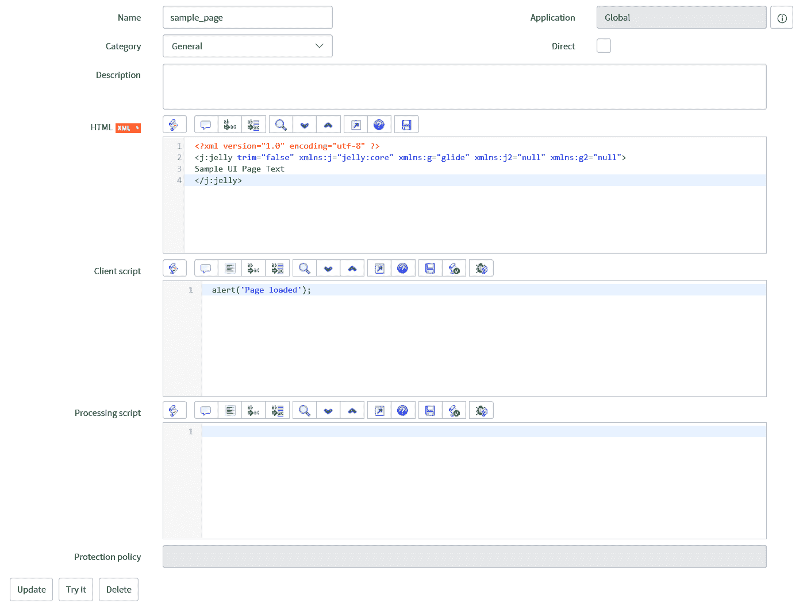
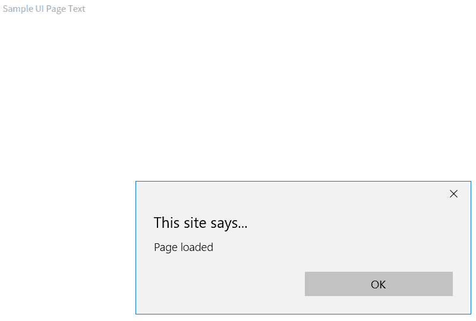
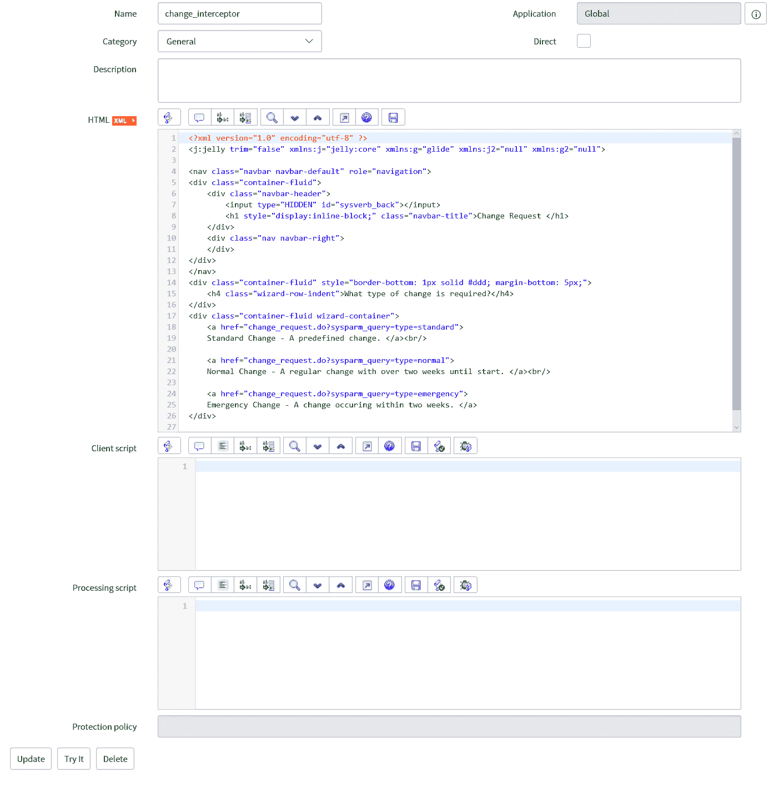
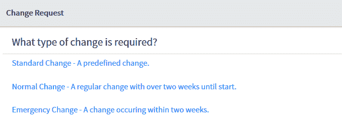

# 自定义页面简介

对于本章，我们将探讨如何构建自定义页面。这也会介绍 Jelly 代码的编写，以及何时何地使用它。我们还将看看如何构建一个自定义 UI 页面。

在介绍自定义页面时，我们将探讨以下主题：

+   Jelly 简介

+   UI 页面

+   自定义页面示例

# Jelly 简介

Jelly 确实是一种不太为人所知的脚本语言。它并未出现在 ServiceNow 的主要部分，而是在平台的边缘。然而，如果你想在 ServiceNow 中创建自定义页面，学习 Jelly 是必须的。

很遗憾，Jelly 是一种不太为人所知的语言，因此关于如何使用它的文档也相对匮乏。由于开发者空间中普遍缺乏此类信息，使用已经创建好的 Jelly 页面或 ServiceNow 社区中的页面在入门时可以非常有用。

你会发现 Jelly 脚本的主要应用领域之一是 UI 页面，我们将在本章稍后探讨。Jelly 代码位于 XML 字段类型中，因为它是一个 Java 和 XML 脚本引擎，允许 XML 转换为可执行代码。

当查看 Jelly 脚本时，你会发现它几乎总是以相同的标签开始和结束。让我们看看这段代码：

```js
<?xml version="1.0" encoding="utf-8" ?>
<j:jelly trim="false"    >

</j:jelly>
```

这段代码设置了 XML 版本和编码，然后编写了 Jelly 标签。`Trim` 设置了是否应该修剪此标签内的空白字符，我们将它设置为 `false`。其他四个属性设置了 Jelly 脚本的标签和阶段。

Jelly 被分为两个处理阶段。第一阶段标签是 `j` 和 `g`，第二阶段是 `j2` 和 `g2`。在第一阶段，`j` 和 `g` 标签被解析，结果被缓存，然后是第二阶段的 `j2` 和 `g2` 标签。当脚本随后再次运行时，只有第二阶段会被重新解析，使用第一阶段缓存的资料。

这意味着将不太可能改变的数据在第一阶段设置，而将不断变化的数据在第二阶段设置是一个好习惯。`j` 标签是 Jelly 的原生标签，而 `g` 标签是为 ServiceNow 特别创建的。

Jelly 是创建 UI 页面所需掌握的一项技能，我们将在下一章进一步探讨如何在 Jelly 中编写脚本。

# UI 页面

UI 页面是存在于 ServiceNow 平台各处的脚本和 XML 页面。当你浏览 ServiceNow 时，你会看到许多 UI 页面，包括服务目录和知识的首页。UI 页面也是一种创建自定义页面的方式，你可以定义页面上显示的所有内容。

让我们看看如何创建一个新的 UI 页面。我们首先给我们的 UI 页面起一个名字；确保你记下这个名字，因为稍后你需要引用这个页面。分类字段主要用于参考，并不提供任何额外的功能。它可以帮助你组织你的 UI 页面。

UI 页面中可以包含代码的三个字段是：

+   HTML

+   客户端脚本

+   处理脚本

HTML 字段是 Jelly 脚本所在的地方，ServiceNow 为您提供了开始 Jelly 编码的标签：

```js
<?xml version="1.0" encoding="utf-8" ?>
<j:jelly trim="false"    >

</j:jelly>
```

这些是我们介绍 Jelly 脚本时看到的标准标签，因此我们可以在 Jelly 标签内开始添加我们的 Jelly 脚本。

客户端脚本字段是一个脚本字段，可以在其中编写客户端代码。当 UI 页面加载时运行此客户端代码。此脚本可以放入 HTML 字段中，但如果将其分离到两个字段中，则更容易阅读。

处理脚本字段也是一个脚本字段，但这个字段运行服务器端脚本。脚本在页面提交时运行，因此在创建自定义页面上的表单时非常有用。

在 ServiceNow 中，您可以通过在实例 URL 的末尾添加 UI 页面的名称和`.do`来从任何地方访问 UI 页面。这意味着您可以非常容易地导航到您创建的 UI 页面。

让我们看看一个简单的 UI 页面，以展示如何将编写的代码显示在 UI 页面中。以下是 HTML 字段中的代码：

```js
<?xml version="1.0" encoding="utf-8" ?>
<j:jelly trim="false"    >
Sample UI Page Text
</j:jelly>
```

使用此代码，我们将在 UI 页面的屏幕上简单地看到“Sample UI Page Text”文本。我们还可以在客户端脚本字段中添加一些代码，以查看代码运行时的情况：

```js
alert('Page loaded');
```

我们在这里将只使用`alert`，因为我们是在客户端脚本中编写脚本以显示代码运行时的情况。

我们整个 UI 页面定义可以在*图 7.1*中看到：



图 7.1：Sample UI 页面定义

我们也可以通过导航到`sample_page.do`来查看此页面的外观，如图*图 7.2*所示：



图 7.2：Sample UI 页面示例

UI 页面是创建自定义页面并从平台上的标准 ServiceNow 表单和列表布局中脱离出来的绝佳方式。它们还为您提供了从头开始创建页面的机会，包含您喜欢的任何信息和数据。

# 脚本示例

现在我们已经看到了如何创建自定义页面，让我们看看如何制作一个工作 UI 页面的示例。

对于我们的示例，我们将创建我们自己的更改拦截器。这通常在创建新更改时看到，但在这个示例中，我们将创建一个 UI 页面作为要导航到的页面。

这是我们在 HTML 字段中将要使用的代码：

```js
<?xml version="1.0" encoding="utf-8" ?>
<j:jelly trim="false"    >

<nav class="navbar navbar-default" role="navigation">
<div class="container-fluid">
  <div class="navbar-header">
    <input type="HIDDEN" id="sysverb_back"></input>
    <h1 style="display:inline-block;" class="navbar-title">Change Request </h1>
  </div>
  <div class="nav navbar-right">
  </div>
</div>
</nav>
<div class="container-fluid" style="border-bottom: 1px solid #ddd; margin-bottom: 5px;">
  <h4 class="wizard-row-indent">What type of change is required?</h4>
</div>
<div class="container-fluid wizard-container">
  <a href="change_request.do?sysparm_query=type=standard">
  Standard Change - A predefined change. </a><br/>

  <a href="change_request.do?sysparm_query=type=normal">
  Normal Change - A regular change with over two weeks until start. </a><br/>

  <a href="change_request.do?sysparm_query=type=emergency">
  Emergency Change - A change occuring within two weeks. </a>
</div> 

</j:jelly>
```

在这里，我们使用了 HTML 标签来创建我们自己的类似于更改拦截器的拦截器。这使得我们可以以任何我们想要的方式轻松地更改页面的各个方面，而无需使用 ServiceNow 拦截器模块。

通过查看更改拦截器的源代码，这里我们使用了实际拦截器中的代码，以保持页面的外观与 ServiceNow 保持一致。使您的自定义页面看起来像它们适合 ServiceNow 平台，通常会给用户带来良好的体验。

在我们的示例中，我们允许用户从三种变更选择中挑选一个，然后将他们重定向到该类型的新变更页面。在创建链接的标签中，我们可以看到每个选择的 URL 是如何变化的。我们使用`sysparm_query`在 URL 中设置新表单的值。在我们的示例中，我们使用它来设置变更类型。

让我们看看*图 7.3*中的 UI 页面本身：



图 7.3：拦截器 UI 页面定义

如果我们想在创建变更时使用此页面，我们可以在变更应用程序的“创建新”模块中修改，通过使模块导航到 URL `change_interceptor.do` 来导航到 UI 页面。

让我们看看*图 7.4*中的 UI 页面将是什么样子：



图 7.4：拦截器 UI 页面示例

我们可以看到页面上使用 ServiceNow 风格导航标题定义的三个选项。

# 摘要

在本章中，我们探讨了开始构建自定义页面。我们介绍了 Jelly 脚本、UI 页面以及 Jelly 在 UI 页面定义中的使用位置。我们还查看了一个 UI 页面示例，以了解其编写方式和完成后的用户界面。

在下一章中，我们将更深入地探索 Jelly 脚本，而不仅仅是基础内容。我们还介绍了 UI 宏，这是一种向 UI 页面和其他 ServiceNow 区域添加可重用组件和脚本的方法。我们还将通过一个实际示例查看如何将 UI 页面和 UI 宏结合起来使用。
