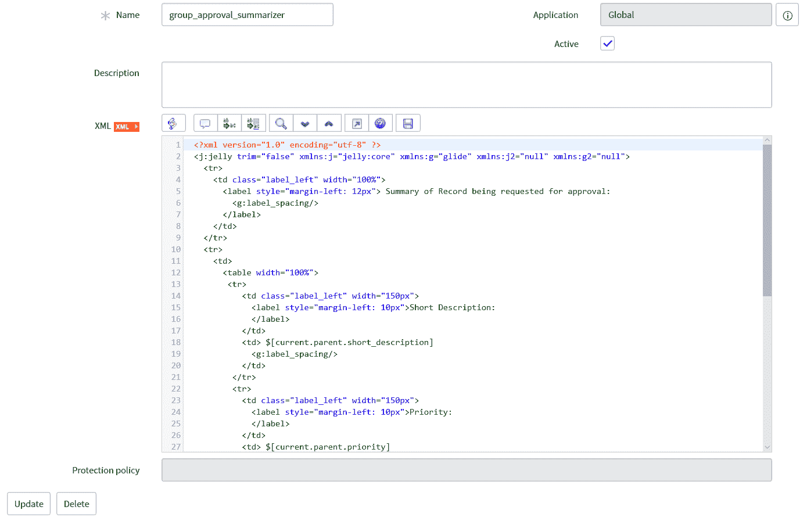
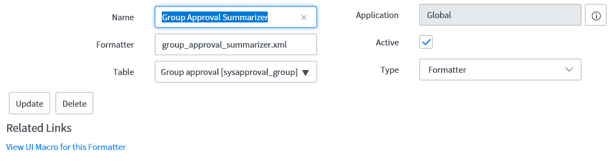
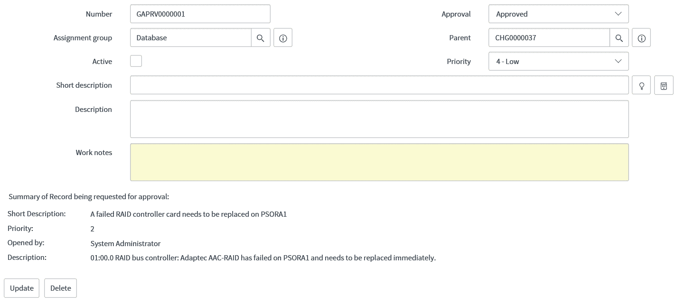

# 第八章：使用 Jelly 脚本进行脚本编写

在本章中，我们将探讨使用 Jelly 进行脚本编写。我们将探讨如何编写 Jelly 代码来创建满足您需求的自定义页面和脚本。我们还将探讨 UI 宏以及如何在 ServiceNow 中创建它们，以及通过一个示例来进一步加深我们对这个领域的了解。

本章将涵盖以下主题：

+   Jelly 脚本

+   UI 宏

+   Jelly 脚本示例

# Jelly 脚本

Jelly 脚本知识对于构建自定义页面和脚本非常重要，并且还可以修改 ServiceNow 中的 Jelly 代码，使其以不同的方式满足您的需求。我们在上一章介绍了 Jelly 脚本及其在 UI 页面中的应用。让我们回顾一下 ServiceNow 提供的 Jelly 标签的外观：

```js
<?xml version="1.0" encoding="utf-8" ?>
<j:jelly trim="false"    >

</j:jelly>
```

一旦这些标签就位，我们就可以开始在我们的 Jelly 代码中包含它们。这可以添加到 UI 页面或 UI 宏中。我们将在本章后面讨论 UI 宏。

# 评估

首先，让我们看看 `<g:evaluate>` 标签。这个标签允许我们在标签内编写 JavaScript，并在需要时设置变量值。

`<g:evaluate>` 标签可以说是 Jelly 中使用最频繁的标签之一，也是我们需要掌握的标签之一。记住，我们可以根据希望脚本在哪个阶段运行来使用 `g` 或 `g2`。

让我们看看 `<g:evaluate>` 标签的实际应用示例：

```js
<g2:evaluate var="jvar_variable">
     var setVariable = 'Set variable to string';
     setVariable;
</g2:evaluate>
```

在前面的例子中，我们将运行第二阶段的代码，因此我们在定义的标签中使用 `g2`。在标签定义中，我们还在定义一个变量名，用于与 `var="jvar_variable"` 一起使用。我们可以给变量取不同的名字，但我们必须始终在变量前加上 `jvar` 前缀，以便它能够正常工作。

在这里，我们将 `jvar_variable` 设置为脚本中的字符串值。在 `evaluate` 标签中，我们只需将表达式的最后一行设置为我们要设置的评估变量的值。在我们的例子中，我们使用了 `setVariable`，因此 `jvar_variable` 变成了 `setVariable` 的值，即我们的字符串。

在 `<g:evaluate>` 标签中，我们可以使用一些参数；让我们看看这些参数在另一个例子中的使用情况：

```js
<g2:evaluate var="jvar_onHoldIncidents" object="true" jelly="true">
    var holdIncident = new GlideRecord('incident');
    holdIncident.addQuery('state', jelly.jvar_onHoldState);
    holdIncident.query();
    holdIncident;
</g2:evaluate>
```

在这个例子中，我们可以看到为 `<g:evaluate>` 标签新增的两个参数：`object` 和 `jelly`。`object` 标签决定了 `jvar` 变量是否应该被当作一个 `object` 处理。在我们的例子中，它将是 `GlideRecord` 查询，因此我们希望将其作为一个对象保留以供后续脚本使用。

另一个新增的参数是 `jelly`。如果将此参数设置为 `true`，则允许我们在脚本中使用 `jelly` 变量。在我们的例子中，我们使用的是 `jvar_onHoldState` 变量，我们假设它已经在之前的 `<g:evaluate>` 标签中设置为 `3`。我们需要将 `jelly` 参数设置为 `true`，以便我们能在示例脚本中使用这个变量。

# 如果

Jelly 脚本中的 `if` 标签与 JavaScript 中的 `if` 语句的工作方式类似。它用于在满足一组条件时运行代码。由于我们可以在 JavaScript 中设置 `if` 语句，因此您是否想使用 Jelly `if` 而不是 JavaScript `if` 取决于您自己。

我们可以使用 `if` 标签检查 `GlideRecord` 对象内部是否有任何记录。让我们看看如何使用我们的 `evaluate` 标签示例来完成这项工作：

```js
<g2:evaluate var="jvar_onHoldIncidents" object="true" jelly="true">
    var holdIncident = new GlideRecord('incident');
    holdIncident.addQuery('state', jelly.jvar_onHoldState);
    holdIncident.query();
    holdIncident;
</g2:evaluate>

<j:if test="${!jvar_onHoldIncidents.hasNext()}">
   No on hold incidents.
</j:if>
<j:if test="${jvar_onHoldIncidents.next()}">
   There are ${jvar_onHoldIncidents.getRowCount()} incidents on hold currently.
</j:if>
```

在我们的示例中，我们根据实例中当前是否有挂起的工单来显示消息。`if` 语句有一个参数，即 `test`，这是我们需要评估为 `true` 的表达式，以便在标签中的脚本内运行代码。

这种类型的 `if` 语句有助于对 `GlideRecord` 对象运行条件。

# UI 宏

UI 宏是可以在 UI 页面和其他 ServiceNow 平台上的其他区域中包含的脚本。通过将它们从单个 UI 页面中分离出来，这使得它们在整个平台上也易于重用。

UI 宏在 ServiceNow 平台上的各个地方都可以看到，运行服务目录购物车和审批摘要器。让我们看看它们是如何创建的。

UI 宏是一种相当简单的形式，只有几个字段。首先，我们需要给我们的 UI 宏起一个名字。之后，我们可以添加一个描述，然后完成 XML 字段。XML 字段是一个 XML 类型字段，其工作方式与 UI 页面上的 HTML 字段非常相似。我们用想要在运行此 UI 宏时运行的 Jelly 脚本填写 XML 字段。

我们还得到了在 XML 字段中创建新 UI 页面时给出的相同的 Jelly 代码：

```js
<?xml version="1.0" encoding="utf-8" ?>
<j:jelly trim="false"    >

</j:jelly>
```

总结一下，这些标签引入了 Jelly 脚本，我们可以在 Jelly 标签内开始编写我们的 Jelly 脚本。

我们也可以通过使用 `macro_invoke` 标签从 UI 页面调用宏。让我们看看它是如何工作的：

```js
<g:macro_invoke macro="kb_article_footer" />
```

我们使用 `macro_invoke` 标签和宏参数来调用我们的 UI 宏。我们只需要在宏参数中给出 UI 宏的名称，就像前面的例子一样。此示例将调用 `kb_article_footer` UI 宏。

同样，我们也可以在 UI 宏内部调用 UI 宏。为此，我们在标签内使用一个名为宏的 `g` 标签。我们可以在脚本中看到它是如何工作的：

```js
<g:ui_button />
```

这将在 UI 宏内部调用 `ui_button`。

UI 宏是编写可以轻松在整个 ServiceNow 平台上重用的 Jelly 代码块的好方法。它们特别适用于添加到您的 UI 页面中。

# 脚本示例

在本章中，我们看到了如何在 Jelly 中编写脚本以及如何自己创建 UI 页面。让我们将这两种能力结合起来，制作一个可工作的 UI 宏。

这是我之前被要求的一个请求示例——在分组审批记录上的审批摘要。在这里，我们需要创建一个 UI 宏和一个格式化器，并将其添加到分组审批表单中。

让我们从我们的小组审批总结器代码开始，创建一个简短的摘要，我们将用它来批准我们的小组审批的任务记录：

```js
<?xml version="1.0" encoding="utf-8" ?>
<j:jelly trim="false"    >
  <tr>
    <td class="label_left" width="100%">
      <label style="margin-left: 12px"> Summary of Record being requested for approval:
        <g:label_spacing/> 
      </label>
    </td>
  </tr>
  <tr>
    <td>
      <table width="100%">
       <tr>
          <td class="label_left" width="150px">
            <label style="margin-left: 10px">Short Description: 
            </label>
          </td>
          <td> $[current.parent.short_description]
            <g:label_spacing/> 
          </td>
        </tr>
        <tr>
          <td class="label_left" width="150px">
            <label style="margin-left: 10px">Priority: 
            </label>
          </td>
          <td> $[current.parent.priority]
            <g:label_spacing/> 
          </td>
        </tr>
        <tr>
          <td class="label_left" width="150px">
            <label style="margin-left: 10px">Opened by: 
            </label>
          </td>
          <td> $[current.parent.opened_by.getDisplayValue()]
            <g:label_spacing/> 
          </td>
        </tr> 
        <tr>
          <td class="label_left" width="150px">
            <label style="margin-left: 10px">Description: 
            </label>
          </td>
          <td> $[current.parent.description]
            <g:label_spacing/> 
          </td>
        </tr> 
      </table> 
    </td>
  </tr>
</j:jelly>
```

如您所见，在这个例子中，代码量相当多，但其中很多是 HTML 标签，所以实际内容并不多。在这个例子中，我们创建了一个表格，其中包含了一些待批准记录的详细信息，以便当前的小组审批者可以看到他们正在批准的内容。

标签和间距是 HTML，您可以在 ServiceNow 为您提供的 UI 宏服务中找到这种脚本。代码的有趣之处在于设置任务值。我们使用美元符号来声明变量的开始，然后分别使用花括号或方括号来表示第一阶段或第二阶段变量。在这里，我们使用方括号来使用第二阶段，因为我们的数据将会变化，我们不希望它被缓存。

我们将这个 UI 宏命名为`group_approval_summarizer`；让我们看看它在*图 8.1*中的样子：



图 8.1：显示待批准记录摘要的 UI 宏

现在我们有了 UI 宏，我们需要构建一个格式化器来链接到 UI 宏，我们可以将其放置在小组审批表单上。格式化器需要一个名称，一个指向 UI 宏的链接，并且要在小组审批表中。我们可以在*图 8.2*中看到一个格式化器的例子：



图 8.2：用于显示 UI 宏的格式化器

现在我们有了格式化器，我们可以将其添加到小组审批表单布局中，以查看我们的 UI 宏。我们的小组审批表单上的 UI 宏结果可以在*图 8.3*中看到：




在前面的图中，我们可以看到我们的 UI 宏的输出。这个例子展示了您如何使 UI 宏在 ServiceNow 中增加表单的价值，添加您无法通过表单布局或设计师添加的额外数据。

# 摘要

在本章中，我们探讨了 Jelly 中的脚本。我们探讨了 Jelly 的各种标签以及如何将它们结合起来创建 Jelly 脚本。使用这些 Jelly 技术，我们探讨了如何创建包含 Jelly 脚本的 UI 宏，并看到了一个在 ServiceNow 平台上创建 UI 宏的实际例子。

在下一章中，我们将探讨 ServiceNow 中的调试。我们将查看 ServiceNow 提供的用于调试脚本、字段和您可访问的日志的调试工具，以帮助修复错误。
