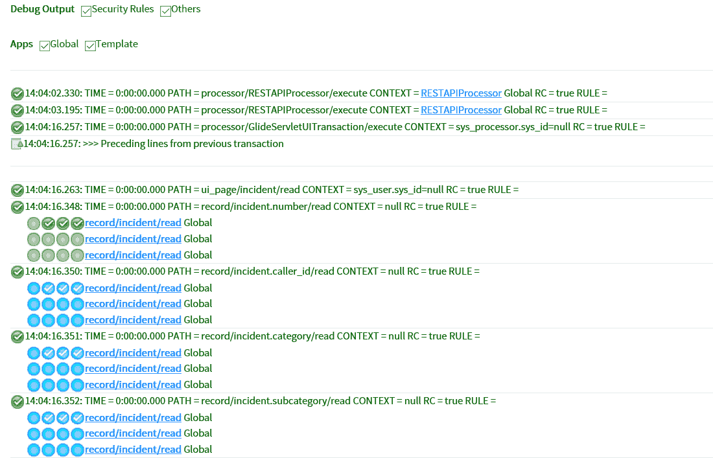
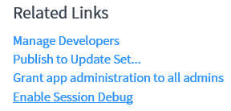

# 第九章：脚本调试

在本章中，我们将探讨调试。调试是创建有效的 ServiceNow 脚本的重要方面。我们将探讨脚本和会话调试器，以及它们是如何被使用的。然后，我们将探讨字段监视器、调试应用程序、JavaScript 日志和调试窗口。最后，我们将了解如何在 ServiceNow 实例中调试 REST 和 SOAP 消息。

在本章中，我们将探讨以下主题：

+   脚本调试器

+   会话调试器

+   字段监视器

+   调试应用程序

+   JavaScript 日志和调试窗口

+   调试 REST

+   SOAP 调试

# 脚本调试器

脚本调试器允许开发者调试服务器端脚本以发现代码中的错误或问题。我们在第五章，“服务器端脚本简介”中简要介绍了脚本调试器。

为了回顾，我们可以在我们编写的服务器端脚本中设置断点，以使用脚本调试器在脚本运行时进行调试。这是我们在 ServiceNow 中使用断点的唯一方法。

要使用脚本调试器，我们首先需要在我们的服务器端脚本中设置一个断点。这可以是任何您想要逐步执行的脚本，无论是系统脚本还是您自己构建的脚本。一个很好的例子是`incident_events`业务规则，因为我们还可以看到如何从事件表单触发不同的事件。

首先，我们在`incident_events`业务规则中添加一个断点，如图*图 9.1*所示：


图 9.1：添加了断点的业务规则事件

要设置此断点，我们只需在代码的边缘点击，使断点出现，如图中箭头所示。要删除它，我们只需点击蓝色箭头，断点就会被移除。一旦设置了断点，我们就可以打开脚本调试器。

要打开脚本调试器，我们可以导航到系统诊断|脚本调试器。这将在一个单独的窗口中打开脚本调试器。我们还可以从任何脚本类型字段打开脚本调试器。我们需要点击一个看起来像带有滚动条的小昆虫的脚本调试器图标，从这种类型的字段打开脚本调试器。

我们可以在*图 9.2*中看到这个图标被突出显示：


图 9.2：显示脚本调试器的脚本类型字段

现在我们可以通过更新任何现有事件来运行`incident_events`脚本，当我们看到*图 9.3*所示的窗口时，我们点击“开始调试”来查看在断点处停止的脚本：


图 9.3：脚本调试器弹出窗口

现在我们已经进入了调试过程，我们可以切换到调试窗口。从这里，我们可以看到屏幕右上角的一些相当标准的调试选项。

我们可以在*图 9.4*中看到这些：


图 9.4：脚本调试选项

我们用于调试的选项，从左到右排列：

+   **暂停调试**：暂停调试器会关闭调试器。这会将图标更改为电源图标，但通过点击这个更改后的图标，我们可以再次打开调试器。

+   **恢复脚本执行**：这将从当前断点之后恢复脚本，直到下一个断点，或者直到脚本完成。

+   **跳过下一个函数调用**：此按钮允许你遍历代码并跳过任何函数调用，这意味着跳过它们。

+   **进入下一个函数调用**：点击此图标将遍历脚本并进入代码中调用的任何函数。

+   **退出当前函数**：这将遍历当前脚本，但会退出代码当前所在的任何函数。

这些按钮允许你从断点的起点开始遍历你编写的代码，找到可能存在的问题。

这种调试方式在许多软件调试中很典型，提供了暂停、恢复和进入、退出、跳过函数的选项。然而，如果你对此不熟悉，花些时间熟悉这些按钮是有益的，因为它们可以在调试较长的脚本时节省你的时间。

让我们看看*图 9.5*中完整窗口的样子：


图 9.5：脚本调试窗口

这种调试方法非常有帮助，并且是 ServiceNow 早期版本中缺失的功能。有了脚本调试器，我们有了更全面的调试体验。

在脚本中添加断点并能够遍历它们，为调试增加了额外的层次，而不仅仅是记录输出。

# 会话调试器

会话调试器允许你在 ServiceNow 会话期间调试 ServiceNow 平台的一些方面。你还可以打开或关闭所有会话调试。会话调试会提供大量信息，但有时可能会信息过载，因此选择你想要特别调试的个别方面可能是有价值的。我经常发现安全调试是最有用的。

会话调试位于系统诊断中，包含多个模块。你可以通过点击你想要开启会话调试的模块来启用任何会话调试区域。你也可以通过选择“启用所有”来打开所有调试。不过，除了 UI 策略外，你不能关闭单个调试区域，调试是通过点击“禁用所有”或会话结束时禁用的。

我们可以在*图 9.6*中看到会话调试模块：


图 9.6：会话调试模块

当请求调试信息时，会话调试信息会出现在你加载的每一页上，通常在加载页面的底部。

值得注意的是，您可能需要向下滚动很多才能看到提供的信息，尤其是在较大的表单或列表中。

可以显示大量信息，这使得这种调试方法略显通用，并且不如更有针对性的调试方法强大。然而，这种调试方法可以提供在其他平台其他地方难以找到的信息。

让我们看一下一些示例会话调试输出。

首先，我们将查看安全。如果以登录用户身份登录时没有出现相关访问权限，ServiceNow 中的安全可能是一个棘手的问题。

由于 ServiceNow 中每种访问类型都可能存在多个访问控制，因此找到导致问题的确切规则可能很困难。

使用会话调试，我们可以看到哪些访问控制允许访问，哪些访问控制拒绝访问。这可以帮助我们确定我们正在查看的访问控制是否不正确并需要修改，或者是否存在我们未意识到的访问控制，这导致我们遇到访问问题。

在 *图 9.7* 中，我们可以看到事件表单上的会话调试输出：



图 9.7：安全会话调试输出

在这里，我们可以看到在加载事件表单时检查了事件表单的安全规则。如您所见，提供了大量信息，而这个示例只是加载事件表单提供的会话调试信息的一个小部分。

绿色勾选表示对安全规则的检查成功。在示例的底部，有一些较大的检查块，这些检查与特定的安全检查相关。我们可以看到在 PATH = 后的检查是正在进行的，因此，对于底部的检查，我们正在查看 record/incident.subcategory/read，这意味着我们正在查看登录用户是否可以读取事件记录上的子类别字段。在这种情况下，它是成功的，因此该字段显示给用户。

现在，让我们看看一些业务规则会话调试。

在 *图 9.8* 中，我们可以看到一个业务规则在事件表单上的调试示例：


图 9.8：业务规则会话调试

在这个业务规则会话调试脚本示例部分中，我们可以看到业务规则执行的日期和时间戳，以及业务规则开始和结束的位置。时间戳精确到千分之一秒，以便更容易确定执行顺序。

在您看到 ==>, 表示业务规则执行开始，而 <== 则表示业务规则完成。我们还可以看到，在这个例子中，由于业务规则条件不匹配而跳过的业务规则，这可能很有帮助。

再次强调，前面的只是一个示例，展示了在开启业务规则会话调试时加载事件表单期间提供的信息，因此有大量数据需要搜索以找到你可能正在寻找的内容。

最后，我们将查看一个日志会话调试。

我们可以在*图 9.9*中看到一个日志会话调试的例子：


图 9.9：日志会话调试示例

日志将提供与记录打开相关的日志；在我们的例子中，打开事件表单。我通常不像其他人那样使用这个会话调试，但它可以帮助跟踪在记录打开时是否发生任何可能导致潜在问题信息的日志。

# 字段观察者

字段观察者调试功能允许你监视一个单独的字段，并监控该字段发生的任何更改。你一次只能使用字段观察者监视一个字段。如果你看到一个特定的字段正在更改，但不确定是什么修改了该值，这可以是一个有用的工具。

要监视一个字段，在表单视图中右键单击该字段，然后在上下文菜单的底部，你应该看到一个监视字段的选项。一旦选择，就会显示一个小虫图标，表示该字段正在被监视，并且从框架底部出现字段观察者窗口。

字段观察者框架显示字段的任何更改，并且使用字段观察者窗口中的复选框，你可以切换字段观察者将检查哪种类型的更改，例如，业务规则、客户端脚本等。

展示字段观察者实际操作的良例是观察一个事件上的优先级字段。如果你随后在表单上更改影响或紧急程度，你将看到字段观察者捕捉到优先级字段值的更改。我们可以在*图 9.10*中看到这一点：


图 9.10：字段观察者显示对优先级字段的更改

在前面的图中，我们可以看到，由于影响字段被更改为 1 - 高，优先级从 5 - 规划变为 3 - 中等。这一点在字段观察者和由此字段更改而运行的客户端脚本中被捕获。

如果你确切知道你感兴趣的哪个字段，并且想知道为什么值在变化，字段观察者可以是一个有用的工具。

# 调试应用程序

当调试应用程序时，我们通常对代码运行时特定时间点的范围感兴趣。一些用于调试应用程序的工具实际上是会话调试模块。我们在会话调试部分看到了这些模块，ServiceNow 类作为应用程序调试，以及其他一些模块。这些是：

+   调试业务规则

+   调试业务规则（详情）

+   调试安全

+   调试范围

业务规则和安全性无论我们是否在应用程序中都很有用，但对于应用程序编码来说，范围非常重要。为了展示范围调试的工作方式，我们可以在应用程序范围内创建一个测试应用程序及其业务规则。

一旦创建了应用程序和业务规则，我们需要在会话调试中点击调试范围和调试业务规则模块。例如，我们可以在会话调试日志中更新事件时看到这一点。

我们可以在*图 9.11*中看到这一点：


图 9.11：会话调试范围和业务规则

我们可以在日志中看到，当我们从测试应用程序进入业务规则时，我们也进入了测试应用程序的范围。一旦业务规则执行完成，我们就回到全局范围。

如我们在第五章“服务器端脚本简介”中看到的，当我们使用 GlideSystem 在应用程序中调试时，我们需要记住`gs.log`将不起作用。在应用程序中调试时，我们需要使用四个范围应用程序日志级别。

总结一下，这些范围应用程序日志级别是：

+   Error

+   Warn

+   Info

+   Debug

这些日志级别及其详细程度有助于在检查脚本中的值时将日志消息记录到系统日志中。

我们还可以为特定应用程序启用会话调试。这可以通过相关链接的应用程序页面来启用。如果应用程序脚本使用 GlideSystem 日志方法，它们将生成系统日志。

我们可以在*图 9.12*中看到这一点：



图 9.12：与应用程序相关的链接

要启用会话调试，需要点击相关链接。当调试活动正在进行时，相关链接将改变并显示为禁用会话调试。它可以再次被选中以禁用会话调试。

# JavaScript 日志和调试窗口

JavaScript 日志窗口是查看 ServiceNow 平台中日志的另一种方式。与使用 GlideSystem 日志方法不同，这种方法允许你定义一种不同类型的日志发送到屏幕底部的窗口。

要查看 JavaScript 日志窗口，您可以访问您正在工作的实例的系统设置。一旦显示，选择开发者选项。从这里，将 JavaScript 日志和字段监视器属性设置为显示 JavaScript 日志窗口。

我们可以在*图 9.13*中看到设置的属性：


图 9.13：开发者系统设置显示 JavaScript 日志和字段监视器选项

一旦设置了 JavaScript 日志和字段监视器属性，你将在屏幕底部看到一个窗口出现。这个窗口与显示监视字段的窗口相同，但这次，设置的标签将是 JavaScript 日志。

我们可以在 *图 9.14* 中看到出现的窗口：


图 9.14：JavaScript 日志窗口

这个 JavaScript 窗口的示例没有显示日志，可以通过点击标题栏右侧的带有斜线的圆形按钮清除窗口中的所有日志。

我们还可以通过点击标题栏中的小、中、大按钮来更改窗口的大小。最右侧的向下箭头按钮可以关闭窗口。

在 JavaScript 日志窗口打开时，日志被添加到当前日志列表的底部。日志带有时间戳，这样您就可以看到日志的添加顺序。当在平台上打开表单时，查看客户端脚本运行的顺序时，这特别有帮助。

要将日志记录到 JavaScript 日志窗口，我们使用 `jslog()`，这是一个全局函数。这与 `gs.log` 的工作方式非常相似。我们可以在以下代码中看到如何使用 `jslog` 的示例：

```js
jslog('Testing writing to the JavaScript log');
```

如果我们将前面的代码添加到 `onLoad` 客户端脚本中，我们可以在 JavaScript 日志窗口中看到日志。

我们可以在 *图 9.15* 中看到这一点：


图 9.15：带有示例日志的 JavaScript 日志

这种调试方法可以作为使用 GlideSystem 日志的替代方案。一些成熟的实例有时每秒会有很多系统日志，这可能会使调试变得困难，因此在这种情况下，JavaScript 日志窗口可能会有所帮助。

# 调试 REST

REST 消息对于在 ServiceNow 实例之间以及与第三方软件集成非常有帮助。在调试 ServiceNow 实例时，您可能还需要查看 REST 消息的日志。

为了调试 REST 消息，我们需要将系统属性 `glide.rest.debug` 设置为 `true`，该属性位于系统属性表（sys_properties）中。这个属性可能需要创建，因为它不包括在基线系统中。

让我们看看这个系统属性的示例：


图 9.16：系统属性 glide.rest.debug

在这个示例中，我们可以看到我们创建的系统属性。名称需要是 `glide.rest.debug`，值设置为 `true`。对于创建的任何系统属性编写良好的描述也是一个好习惯，以帮助其他管理员。

一旦这个属性设置为 `true`，当激活本章前面提到的会话调试日志时，REST 消息日志也将被添加到输出的日志中。一旦完成这种类型的调试，应该将此属性设置为 `false` 以避免耗尽系统资源。

# SOAP 调试

与 REST 消息类似，SOAP 消息在与其他系统集成时非常重要。可能需要找出消息何时被接收以及确切的消息是什么。

为了调试 SOAP 消息，我们需要添加一个系统属性，如果之前已经添加过，则需要修改它。需要添加的系统属性是 `glide.processor.debug.SOAPProcessor`，其值需要设置为 `true`。

让我们看看这个系统属性的完成示例：


图 9.17：系统属性 glide.processor.debug.SOAPProcessor

示例显示了为调试 SOAP 封装需要创建的系统属性。名称必须准确无误，值设置为 `true`。一个良好的描述也将有助于其他人查看系统属性时解释其功能。

一旦设置了这个属性，我们将在系统日志中开始看到传入的 SOAP 封装 XML。这在查看实例在接收到消息时接收到了什么内容时非常有帮助。

调试完成后，应将此系统属性设置为 `false` 以停止实例中的过度记录。这也停止了在不再被监控时使用资源来提供这些日志。

# 摘要

本章的重点是调试。我们探讨了 ServiceNow 提供的各种调试代码的工具以及我们可以用来充分利用它们的技巧。我们探讨了脚本调试器和设置断点，会话调试模块和调试应用程序。我们还查看了一下 JavaScript 日志和字段观察窗口，以及这些如何帮助我们进行调试。

在下一章中，我们将探讨 ServiceNow 的最佳实践。这包括在客户端和服务器端编写和调试脚本时的最佳实践。我们还将研究这如何影响系统性能以及我们如何可以优化代码以最佳利用实例资源。
