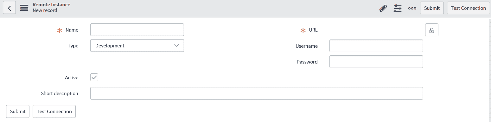
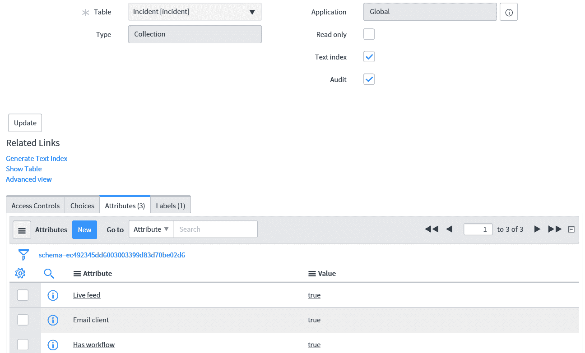
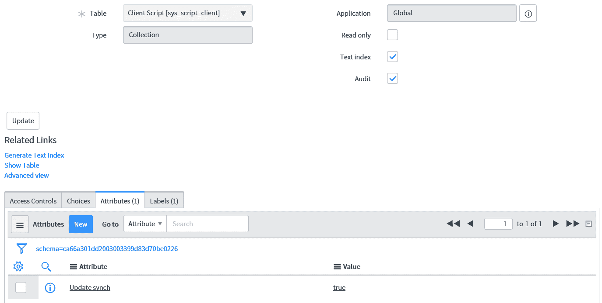
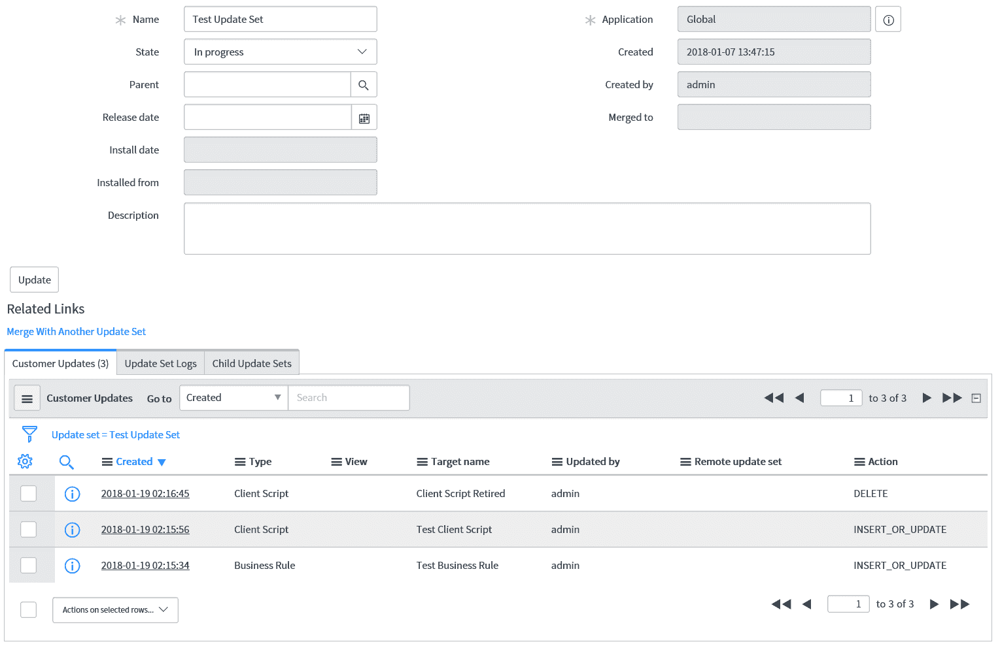

# 使用更新集的部署

在本章中，我们将探讨如何使用更新集。更新集是 ServiceNow 的一个重要部分，以最小的风险将新功能从非生产实例移动到生产实例。我们将探讨何时以及如何使用更新集，以及如何使用它们将功能从一个实例转移到另一个实例。之后，我们将探讨要避免的陷阱和更新集的最佳实践。

在本章中，我们将探讨以下主题：

+   何时使用更新集

+   如何使用范围与更新集一起使用

+   在实例之间传输更新集

+   更新集陷阱

+   更新集最佳实践

# 何时使用更新集

更新集在 ServiceNow 中用于将功能从一个实例移动到另一个实例。如果你在开发实例中进行了某些更改，你希望稍后将其移动到生产实例，那么建议使用更新集。

更新集捕捉你在实例内所做的更改，在它们被创建的同时。一旦你想要捕捉的所有更改都完成，更新集就完成了，并准备好移动到另一个实例。当移动到另一个实例时，可以预览更新集以检查更改是否与实例兼容，并提交以应用更改。

在对任何打算移动到另一个实例的更改进行更改之前，你的第一个任务应该是创建一个新的更新集来包含这些更改。在你开始进行更改之前，确保你正在更新集内工作。一旦更新完成，完成准备移动到另一个实例的更新集。

# 如何使用范围与更新集一起使用

当使用更新集时，我们需要记住我们当前正在哪个范围内工作。在我们在一个实例中使用任何类型的范围之前，我们处于全局范围，在我们在一个实例中创建任何更新集之前，我们处于默认更新集。

如果我们不在创建的更新集中，那么我们也将处于默认更新集中。然而，ServiceNow 实例中的每个范围都有一个不同的默认更新集。了解这一点很重要，这样如果确实切换了范围，那么你的更新集也会自动更改。

如果我们在实例中更改我们正在工作的范围，我们可以在更新集选择器中看到这种变化。在*图 11.1*中，我们可以看到一个全局范围内的实例：

图 11.1：全局范围内的应用程序和更新集选择器

因为我们处于全局范围，所以为我们选择的默认更新集是全局范围的默认更新集。我们可以通过服务现在实例在更新集选择器中显示的方括号内的文本看到这一点。

如果我们只更改应用程序，因此范围，我们也可以在更新选择器中看到变化。让我们以将应用程序更改为引导设置为例，以查看变化。

我们可以在*图 11.2*中看到这些更改：

图 11.2：在引导设置范围内应用和更新集选择器

如您所见，更新集会自动为我们更改。这意味着一个实例中可能有多个不同的默认更新集，并且每个应用程序都将有自己的更新集。

这个例子很好地引出了关于在不同范围内使用更新集的另一个观点。每个更新集只能存在于一个范围内。在创建更新集之前，请确保您当前处于正确的范围内，以便您所做的更改可以添加到更新集中。一旦创建，ServiceNow 安全性将阻止任何人向更新集的应用程序字段写入。这是由安全规则设置的，不应修改。

# 在实例之间传输更新集

一旦更新集完成，它就准备好转移到另一个实例。在实例之间传输更新集需要几个步骤，一旦最初设置好，它就可以是一个快速的过程。

要开始在不同实例之间移动更新集的过程，我们首先需要登录到我们想要移动更新集到的实例，即目标实例。然后我们导航到系统更新集 | 更新源并点击新建。

我们可以在*图 11.3*中看到新的更新源屏幕：

图 11.3：新的更新源表单

在此表单中，有一些关键字段需要填写。让我们先从必填字段开始：名称和 URL。名称字段正是如此——为我们的更新源提供一个名称，以便系统管理员可以轻松识别此更新源。这通常是我们要从其中获取更新集的实例名称或源实例。URL 字段需要是源实例的 URL，格式为 `<instance_name>.service-now.com`。

此表单上的其他重要字段是用户名和密码字段。这些需要是源实例的用户名和密码，并且该账户必须是该实例的管理员账户。

类型字段和简短描述字段也可以填写以添加额外的标签来帮助识别更新源。一旦表单填写完成，点击测试连接以确保可以访问源实例。如果连接失败，您可能需要检查您提供的信息并确保源实例可以访问且没有可能导致失败的任何 IP 访问控制。

如果连接成功，则可以保存表单。一旦保存了更新源，我们就可以开始从源实例引入更新集。现在有一个相关的链接“检索完成更新集”可供点击。一旦选择，所有完成的更新集将被转移到目标实例。

请记住完成您想要移动到另一个实例的所有更新集，因为不完整的更新集将不会移动。

要查看已移动到目标实例的更新集，我们可以导航到系统更新集 | 获取的更新集。现在更新集已存在于目标实例中，我们还需要将自定义更改应用到目标实例。

获取的更新集应该已经被自动预览；然而，在较旧的实例中，这可能不是情况，可能需要手动完成。有时预览可能会引发一些警告或错误，在提交更新集之前需要审查。这可能意味着缺少表或目标实例上存在特定自定义的新更新。大多数时候，这些错误和警告最终都会导致远程更新被接受和提交，但请审查每一个以确保您应该提交所有更新。

预览过程完成后，您可以提交您的更新集。这将把源实例中的所有自定义更改添加到目标实例中，排除在预览过程中标记为跳过的任何更改。

提交完成后，您已成功将更新集从一个实例转移到另一个实例。

# 更新集陷阱

更新集是移动实例之间配置的绝佳方式。然而，在使用更新集时，有一些陷阱很容易陷入。

大多数开发者面临的主要问题是更新集中将添加哪些自定义更改。并非所有对表的更改都会添加到更新集中。一个表中的更改是否添加到更新集中取决于表中的记录是否被视为数据。被视为数据的表不会被添加到更新集中；否则，更新集将充满不必要的记录。

例如，如果事件表包含在更新集中，那么在开发实例中修改或创建的事件将被移动到生产实例中，这并不是一个好主意。大多数表如预期的那样包含或排除在更新集中，但有些可能并不总是明显，因此值得检查。

为了避免在我们的更新集中遗漏更新或包含我们不想要的更新，我们可以检查我们正在处理的表，并将更新发送到更新集。为此，我们可以查看我们正在处理的表的字典条目。

在一个表的字典条目列表中，我们关注的是类型为集合的记录。这给出了表的定义，并持有表的属性，这是我们需要的。向表中添加更新到更新集的属性称为更新同步，它需要设置为真。通常，如果已添加此属性，它将被设置为真，如果省略则将为假。

让我们看看*图 11.4*中所示的事件表的字典条目：

图 11.4：事件表的字典条目

由于事件表包含事件数据，我们不希望我们的更新集中有事件记录。正如我们所见，更新同步属性在这里没有出现，因此我们创建或修改的任何事件都不会出现在更新集中。

现在让我们看看客户端脚本的字典条目。我们可以在*图 11.5*中看到这一点：

图 11.5：客户端脚本表的字典条目

在客户端脚本字典条目的属性中，我们可以看到更新同步属性，并且它被设置为 true。这意味着客户端脚本记录将被添加到更新集中。

一个通常被认为包含在更新集中但实际不包括的表是计划任务表。由于大多数包含脚本的记录都被添加到更新集中，这往往会让开发者感到意外。可以通过将其导出为 XML 并将其导入另一个实例来移动计划任务。

相比之下，许多开发者没有意识到将被添加到更新集中的表是`系统属性`表。有时开发者实例的设置，如设置为停止发送通知的通知，可能会意外地转移到生产实例。这是我多年来看到的一些陷阱。

# 更新集最佳实践

当使用更新集时，有一些最佳实践我们可以遵循，以确保我们不会向我们的生产实例添加不良的自定义设置，并充分利用更新集。

首先，在完成更新集之前检查其中包含的更新总是一个好主意。有时开发者可能会无意中向他们的更新集添加他们本不想添加的更新。因此，检查更新集中包含的每个单独的更新总是一个好主意。特别是，要特别注意任何操作为`DELETE`的更新，因为这可能更难撤销。

我们可以在*图 11.6*中的更新集中看到一些示例更新：

图 11.6：包含示例更新的更新集

我们可以在相关列表的客户更新选项卡中看到这个更新集中的更新。在更新集示例中，我们可以看到三个更新，包括两个客户端脚本和一个业务规则。我们需要确保我们看到的每个客户更新都是我们想要包含在这个更新集中的更改，并且没有意外包含额外的更新。

在操作列中，显示在提交此更新集时将执行的操作。在三个更新中，我们特别关注具有 DELETE 操作的更新，以确保确实需要执行此操作。一旦记录被删除，撤销操作可能更困难。插入或更新是一个更容易更改或回滚到早期版本的更新。

为你的更新集制定一个命名约定也是一个好主意。起初，当更新集数量较少时，这似乎是不必要的；但随着实例的成熟和更新集数量的增加，这可以非常有帮助。命名约定不需要复杂，只需保持一致即可。常见的命名约定可以是发布、冲刺，或者是故事或缺陷的记录编号。

命名约定的几个例子包括：

+   Description - Release - Date

+   Story/Defect: Developer

+   Sprint/Month

在决定命名约定时，要确定与你的流程和实例相关的细节，并确保遵守这一约定。

如本章前面所述，在设置更新源时，我们需要为从该实例获取更新集的实例提供一个管理员账户的用户名和密码。确保用于更新源的账户细节不会频繁更改是一个好的做法，因为这将阻止更新源从该实例拉取更新集。

使用更新集时，确保在生产实例中提交的更新集是在适当的时间进行的，这是一个好的做法。与对生产系统的任何更改一样，都存在一定程度的风险。这意味着如果可能的话，应该在业务时间之外提交更新集，或者至少在安静的时间段，以防出现任何问题。

# Summary

本章我们探讨了更新集。我们看到了如何使用更新集以及它们如何与不同的应用程序范围一起使用。在本章中，我们还探讨了在实例之间转移更新集、避免更新集的陷阱以及使用更新集的最佳实践，尤其是在检查每个更新集更新时。

在最后一章中，我们将利用所学知识在 ServiceNow 中构建一个自定义应用程序。我们将探讨如何创建自定义应用程序，特别是如何在自定义应用程序中使用脚本。我们将发现自定义应用程序的端到端开发，以及如何测试和部署我们所制作的自定义应用程序。
