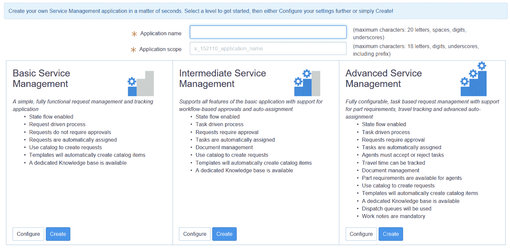

# 使用 ServiceNow 脚本构建自定义应用程序

在最后一章中，我们将探讨使用 ServiceNow 脚本构建自定义应用程序。自定义应用程序是创建 ServiceNow 产品中未包含的功能的绝佳方式。我们将探讨创建自定义应用程序，并将脚本作为应用程序的一部分使用。在探索如何测试和部署我们的新自定义应用程序之前，我们还将学习自定义应用程序的端到端创建。

在本章中，我们将探讨以下主题：

+   使用 ServiceNow 脚本创建自定义应用程序

+   端到端开发

+   测试

+   部署

# 使用 ServiceNow 脚本创建自定义应用程序

在 ServiceNow 中构建自定义应用程序的能力使 ServiceNow 成为一个如此通用的产品。由于 ServiceNow 最初作为服务台解决方案推向市场，开发者们探索了该平台的可能性，从那时起，它已被用于商业的各个领域。

然而，仍有许多使用 ServiceNow 的方法不包括在基线系统中，为此，我们可以创建一个自定义应用程序。

在创建自定义应用程序之前，值得考虑的是否自定义应用程序将提供最佳解决方案。有时，我们可以使用现有的 ServiceNow 应用程序来执行我们想要实现的功能，直接使用它或对其进行轻微修改以满足我们的需求。如果是这种情况，那么考虑不创建自定义应用程序并使用该平台可能是有价值的。

如果您需要的功能需要对现有应用程序进行大量修改，或者在那个阶段根本不存在，那么创建一个自定义应用程序是明智的选择。

# 创建应用程序

一旦我们创建了一个新的应用程序，我们就可以开始向该应用程序添加应用程序文件。我们创建的应用程序文件成为应用程序的一部分。

要创建一个新应用程序，我们可以导航到系统应用程序 | 应用程序，我们将看到在此实例上创建的当前应用程序。然后我们需要点击如图*12.1*所示的右侧的“新建”按钮：


图 12.1：实例应用程序页面

一旦选择了“新建”按钮，您将获得一系列关于创建应用程序时希望从哪里开始的选择。

我们可以在*图 12.2*中看到提供的选项：


图 12.2：应用程序创建选项

从这一系列选择中，我们可以决定从哪个起点创建我们的应用程序。前两个选择通常是最常用的。从头开始正是如此，只创建应用程序和新的应用程序范围。不会为您创建任何表格、模块或访问控制。

创建自定义应用程序将引导你创建表格、模块和访问控制。之后，与从头开始创建大致相同。

根据我的经验，第三个选项，即从服务开始，很少被使用，但允许开发者增强由服务创建器创建的服务，并在完成后可能覆盖它。

此处的最后一个选项不是作为基线系统的一部分提供的，但在服务管理激活时可以使用。此选项同样使用得不多，尽管它允许从现有流程创建。

当选择从模板开始时，我们会看到一个额外的页面，我们可以在*图 12.3*中看到：



图 12.3：应用程序创建模板选项选择

从这里，我们既可以创建一个预定义的模板，也可以进一步配置设置以创建应用程序。

现在自定义应用程序已经创建，我们可以开始添加应用程序文件并构建应用程序。

# 构建应用程序

一旦应用程序创建完成，我们就可以开始使用应用程序文件构建应用程序。这些文件组合在一起构成了应用程序。当应用程序创建时，也会为应用程序创建一个应用作用域。在创建应用程序时，你也会被置于新的应用作用域中，因此了解这一点很重要。

当你创建一个新的更新集到一个新的默认更新集，以适应你现在所在的应用作用域时，你也会看到你的更新集已经改变。由于你现在处于新应用程序的应用作用域中，任何所做的自定义都将添加到你的新应用程序中。

为了跟踪当前的作用域和更新集，在开发时显示应用程序和更新集选择器可能很有用。这两个选项可以在系统设置的“开发者”标签中设置，如下图所示：


图 12.4：开发者系统设置显示应用程序和更新集选择器

通过在*图 12.4*中设置这两个选择器选项，我们随后在屏幕顶部的标题栏中看到了当前的应用作用域和更新集。这些显示在一个下拉字段中，因此如果需要，两者都可以轻松更改。

我们可以看到在标题栏中显示的两个选择器下拉字段：


图 12.5：应用程序和更新集选择器

这些选择器字段在你需要在更新集之间工作或在你当前开发中的多个作用域工作时特别有用。

当在多个标签页中工作时，刷新浏览器页面可能是一个明智的想法，以确保你正在工作的标签页上的选择器是最新的。

现在我们已经创建并开始构建我们的应用程序，我们可以继续进行应用程序的开发。

# 示例应用程序

在本章中，我们还将构建一个示例自定义应用程序，以巩固我们学到的理论。对于我们的示例，我们将构建一个用于存储用户访问数据的程序。

首先，我们需要创建应用程序。从我们在*图 12.2*中看到的选项中，我们将选择创建自定义应用程序。一旦我们选择了这个选项，我们就得到了*图 12.6*中显示的表单：


图 12.6：创建自定义应用程序表单

在此表单中，我们需要为我们的应用程序提供一个名称，然后其余字段将被填写。我们可以更改字段中的值，但在范围字段中，前缀必须是您公司或开发者实例的前缀。

对于我们的示例，我们还想创建一个表，因此我们还需要检查创建表选项。这为我们提供了一些额外的表字段需要填写。这些字段将为您自动填充，但您可以根据需要更改它们。

在这里，我们可以看到我们用户访问应用程序的填写好的表单。自定义应用程序前缀以`x_`开头，后跟您或您公司的特定前缀。此范围是必填的，且仅针对您。*图 12.7*中的空白处是显示此前缀的位置：


图 12.7：完成的自定义应用程序表单

现在我们已经完成了表单，我们点击表单底部的创建按钮。

在创建应用程序和新表之前，我们被提供了一个确认弹出窗口，如下所示：


图 12.8：自定义应用程序创建确认弹出窗口

对于我们的示例，我们将点击确定并创建应用程序。一旦应用程序创建完成，我们将得到一个按钮来编辑应用程序，该按钮将打开开发工作室，我们将在下一节中对其进行更多探索。

我们已经成功创建了我们的应用程序，将在下一节中继续介绍用户访问应用程序的示例。

# 端到端开发

一旦在实例上创建了一个应用程序，我们就可以继续开发应用程序。当我们处于应用程序的作用域时，所有自定义设置都将添加到应用程序中。我们可以像通常在应用程序外进行开发一样更改实例，例如创建和修改脚本，或者我们可以使用 ServiceNow 为我们提供的工作室。

# 工作室

工作室是由 ServiceNow 创建的，用于创建自定义应用程序时使用。一些开发者更喜欢工作室，因为它在一个地方显示了应用程序，而其他人则更喜欢像在全局范围内一样进行开发。

要访问工作室，请导航到系统应用程序 | 工作室。这将打开浏览器中的一个新标签页，并给我们机会加载当前实例上创建的一个应用程序。

我们可以在*图 12.9*中看到加载应用程序表单：


图 12.9：工作室加载应用表单

在列表中，您将看到您正在工作的实例上可加载的应用。一旦我们在工作室中加载了想要工作的应用，我们就可以在左侧看到当前的应用文件。我们可以看到*图 12.10*中显示的屏幕：


图 12.10：测试应用的示例工作室

例如，为这个测试应用创建了一个业务规则和客户端脚本。

当我们有一个新应用时，我们需要创建一个新的应用文件来开始。要创建一个新的应用文件，我们可以点击前图中可以看到的创建应用文件按钮。

我们随后会看到创建应用文件屏幕，如图*图 12.11*所示，在这里我们可以选择在应用中创建哪种类型的应用文件：


图 12.11：应用文件创建屏幕

有许多应用文件类型可供选择，其中一些更常见的是客户端脚本、业务规则、访问控制和表。一旦选择了应用文件，点击创建即可开始编辑应用文件。一旦应用文件完成并保存，它将出现在工作室左侧的窗格中。

使用工作室的主要好处之一是您可以在左侧窗格中非常容易地跟踪所有应用文件，并通过点击它们来修改它们。另一个重大好处是能够使用标签快速在不同的应用文件之间切换。我们可以在*图 12.12*中看到这一点：


图 12.12：工作室标签页开发示例

如前图所示，我们可以为不同的应用文件打开多个标签页。这可以是新文件或现有文件，这无疑是我在使用工作室时喜欢的一个特性。

工作室非常适合将应用的所有方面汇总在一起，但是否使用它取决于开发者的个人喜好。一些开发者对其深信不疑，而另一些则根本不会使用它，还有一些开发者处于中间状态。

# 应用开发

无论是否使用工作室，一旦创建了一个应用，我们就需要进行开发并确保创建了我们应用所需的所有应用文件。每个应用都是不同的，在 ServiceNow 中创建独特应用的能力几乎是无限的。

在开发您的应用时，请记住本书早期章节中提到的技能和技术，以充分利用它们。

当创建一个新应用时，我建议首先考虑应用的数据表结构及其关联关系。一旦数据表结构就绪，其他应用文件将更容易规划并放置到应用中。

ServiceNow 还允许我们将被视为数据的记录添加到我们的自定义应用程序中。这使得我们可以将之前章节中发现的未设置为 true 的更新同步属性记录传递过来。为此，我们可以在列表视图的标题栏上右键单击，然后我们会得到创建应用程序文件的选择，如图 *图 12.13* 所示：


图 12.13：从列表视图创建应用程序文件

在 *图 12.13* 中，我们正在查看一个由于筛选而列表中只有一个记录的事件列表。在选择创建应用程序文件选项后，我们将得到一个弹出窗口来选择如何添加应用程序文件。此弹出窗口可以在 *图 12.14* 中看到：


图 12.14：创建应用程序文件弹出窗口

在 *图 12.14* 中的这个弹出窗口有一个“加载时”字段，这是此表单上最重要的字段。从这里，我们有以下三个选项可以选择：

+   新安装和升级

+   新安装

+   新安装带示例数据

前两个选项相当直接：数据要么仅在应用程序的新安装中加载，以后不再加载，要么在新安装和未来的应用程序升级中加载。第三个选项略有不同，但大多数系统管理员对示例数据的概念都很熟悉。使用此选项，记录将在应用程序部署时可用，尽管这不是强制性的。当我们在本章后面讨论部署时，包括示例数据的相关选项将变得清晰。

一旦选择了“加载时”字段，我们就可以点击“确定”，记录将被添加到我们的应用程序中。我们可以在 *图 12.15* 中看到我们的测试应用程序和之前的示例的这种样子：


图 12.15：显示在应用程序相关列表中的应用程序文件示例

在 *图 12.15* 中，我们可以看到之前在我们的列表视图中显示的事件记录已经被移动到我们的自定义应用程序的应用程序文件中。

在添加了您申请所需的所有申请文件之后，我们就可以开始测试应用程序了。

# 示例应用程序

现在我们已经了解了如何开发我们的应用程序，我们也可以开发我们的示例应用程序。我们的示例应用程序用户访问已经创建，我们可以按常规方式开发或使用工作室创建新的应用程序文件。

从简单地创建我们的应用程序开始，我们就会看到一些应用程序文件作为我们应用程序的一部分，这些文件将在工作室或应用程序定义中显示。

现在我们可以看到以下图中我们的应用程序在工作室中的样子：


图 12.16：用户访问应用程序的工作室

我们已经可以看到，通过创建我们的应用程序，我们已经有一个表、角色、一些访问控制、应用程序菜单和模块。所有这些都在我们的应用程序范围内创建。

现在，我们需要创建另一个表，以在用户和访问之间起到类似多对多关系表的作用。我们可以创建一个`m2m`表，但这次我们将创建一个普通表，因为我们不希望在表之间有编辑按钮的相关列表。我们可以通过导航到系统定义 | 表与列并按常规方式点击创建表来创建此表，并且它也将添加到应用程序中。

我们现在需要两个表，因此我们将向用户访问表添加一些参考字段，用于用户和访问。访问字段链接到我们的另一个新应用程序表。

我们现在可以看到表单的样子，其中包含一些示例数据，如下所示：


图 12.17：用户访问自定义表视图

我们还需要在我们的访问表中添加一个名称字段，以便我们可以识别每个访问项，并且我们将添加一个相关列表来查看具有该访问权限的所有用户。

我们现在可以看到这个表单的样子，再次使用一些示例数据，如下所示：


图 12.18：访问自定义表视图

我们用户访问应用程序的表结构现在已完成。现在应用程序中将使用三个表，分别是用户表、提供基线 ServiceNow 的用户表、访问表和用户访问表。

我们已经创建了一种跟踪 ServiceNow 中每个用户访问权限的方法。通常，首先进行自定义应用程序的表结构是一个好的做法，因为任何脚本或关系都更容易为应用程序规划。在应用程序中后期添加表可能会引起问题或导致某些应用程序的大量返工。

我们还想要确保一旦用户在我们的应用程序中获得了访问权限，我们就停止该用户被选中进行相同的访问，这意味着需要创建一个脚本化的高级参考限定符。

首先，我们将在高级参考限定符中添加一些脚本，以调用脚本包含。这个参考限定符将用于用户访问表上的用户字段：

```js
javascript:new userAccessRefQual().stopDuplicateUserAccess(current.access);

```

现在我们有了调用脚本包含的引用限定符，我们需要创建脚本包含和输入代码，以返回没有当前选中访问权限的用户。

我们脚本包含的代码将看起来像这样：

```js
var userAccessRefQual = Class.create();
userAccessRefQual.prototype = {
    initialize: function() {
    },

  /* Returns users that do not currently have this access
  variables:
  access - sys_id of the current access
  */
  stopDuplicateUserAccess: function(access) {

    var usersWithAccess = [];
    var accessRec = new GlideRecord('x_152110_uaccess_user_access');
    accessRec.addQuery('access', access);
    accessRec.query();
    while (accessRec.next()) { 
      usersWithAccess.push(accessRec.user.toString());
    }

    return 'sys_idNOT IN' + usersWithAccess.toString();

  },

    type: 'userAccessRefQual'
};
```

此代码将检查所有当前用户访问记录，确保返回给选定的用户是目前没有此访问权限的用户。

这通过返回字符串`sys_idNOT IN`和填充了当前对表上的当前访问有权限的所有用户的数组的全部内容来完成。这可能是一个非常有助于过滤掉我们不希望显示给用户的记录的技术。

我们可以在下面的图中看到创建的脚本包含：


图 12.19：提供高级引用限定符功能的脚本包含

现在我们已经完成了脚本并设置了表格，我们在开发方面很高兴完成我们的应用程序。当然，我们还可以添加更多功能来增强这个应用程序，比如添加额外的验证、脚本或字段到表格中，但我们将在这个例子中完成应用程序。

# 测试

任何自定义应用程序的一个重要部分是测试它以确保其正确运行。有错误或功能不佳的应用程序可能会迅速让客户对应用程序感到失望，并且通常应用程序将不再被使用。因此，在部署之前彻底测试任何应用程序至关重要。

在测试新的自定义应用程序时，测试应用程序本身以及围绕应用程序的部分同样重要。这意味着不要只是测试应用程序是否工作，还要测试任何与新的应用程序链接或相关的应用程序是否仍然以之前的方式工作。这在处理访问控制和安全问题时尤为重要，并且始终确保没有授予不应该有的访问权限，并且现有应用程序的用户不会失去他们之前可以访问的数据。

如果我们在进行测试时遇到问题，值得记住我们在第九章，“调试脚本”，中学到的调试应用程序的技术。我们可以使用会话调试工具，包括调试作用域，来解决我们遇到的问题。

也有以下作用域的应用程序日志级别选项来修复问题：

+   错误

+   警告

+   信息

+   调试

这些日志对于找出问题所在可能很重要，并且记住`gs.log`在自定义应用程序作用域中不会工作。

在测试自定义应用程序时检查系统日志是一个好习惯，以确保没有留下不应该有的日志消息。我们需要确保这些日志消息在没有必要的情况下不会被部署到生产实例中。

# 示例应用程序

现在开发已经完成，对于我们的示例应用程序，我们将查看如何对其进行测试。我们需要关注的应用程序的主要方面是我们创建的脚本。

然而，检查您应用程序的每个方面始终很重要，特别是要对照应用程序将面向的利益相关者的要求进行检查。

已经添加了一些虚拟数据，以便我们可以检查我们的脚本在用户访问和访问表中是否正确工作。用户表填充了 ServiceNow 基线系统中可用的用户，您可以在测试应用程序时使用这些用户。

我们可以在以下图中看到用户访问表中的条目：


图 12.20：用户访问自定义表列表视图

如*图 12.20*所示，有两个用户可以访问 Server A100。这意味着如果我们尝试在选择了 Server A100 时选择这些用户，我们不应该能够选择这些用户。

让我们检查这是否可行：


图 12.21：用户访问自定义表表单测试用户字段引用限定符

如前图所示，在搜索`Fred`后，我们没有看到`Fred Luddy`，这是一个好兆头，它告诉我们我们的脚本引用限定符正在正确工作。

作为测试的一部分，我们还将从`Fred Luddy`那里移除对 Server A100 的访问权限，并检查他在为 Service A100 创建用户访问记录时是否可供选择。使用我们创建的代码，这个测试也通过了，并符合要求。

您可以执行更多测试，开发者执行的测试级别通常取决于多个变量。这可以包括新应用程序对现有应用程序的影响，以及是否由单独的测试团队执行测试。我们将在我们的示例用户访问应用程序中完成测试。

在测试您的应用程序时，选择适合您需求的测试级别，并记住如果认为边缘情况可能会导致测试失败，请测试边缘情况。

# 部署

一旦完成所有测试，我们就可以将我们的自定义应用程序部署到其他实例。一旦完成以下三个主要方式之一，我们就可以部署我们的自定义应用程序：

+   将应用程序发布到更新集

+   发布到应用程序存储库

+   发布到 ServiceNow 商店

让我们看看如何使用每种方法进行部署。

# 发布到更新集

我们将要查看的第一种方法是如何将自定义应用程序发布到更新集。这是一个非常有用的方法，因为它允许将更新集作为检索到的更新集发送到其他实例，或者甚至在任何 ServiceNow 实例上导出和导入。这使得这种部署方法在某种程度上是最灵活的。

要将自定义应用程序发布到更新集，我们首先需要导航到应用程序记录。为此，我们可以导航到系统应用 | 应用程序，然后点击应用程序的名称。请确保不要点击编辑，因为这将打开工作室。

在相关链接菜单下，点击“发布到更新集...”选项，然后以下屏幕将显示：


在我们的示例中，我们看到的是测试应用程序名称，但您的自定义应用程序名称将在这里显示。输入版本号，并建议添加描述，这样用户就会知道应用程序的功能。我们在本章前面看到，我们可以如何将数据文件添加到我们的应用程序中作为演示数据。最后的复选框允许将演示数据包含在或排除在我们创建的更新集中。

一旦弹出表单完成，将出现一个进度条：


图 12.23：发布应用程序进度条

发布完成后，点击“完成”按钮，您将被重定向到已创建的更新集。更新集处于完整状态，因此可以立即从其他实例检索。请记住，也可以将更新集导出为 XML 格式。

现在，应用程序包含在一个完成的更新集中，它可以很容易地在实例之间移动。

# 发布到应用程序仓库

接下来，我们看看如何将我们的自定义应用程序发布到应用程序仓库。应用程序仓库是公司范围内的，它允许在同一公司的实例之间轻松移动新的自定义应用程序和升级。

首先，我们需要导航到应用程序记录。为此，我们可以导航到系统应用程序 | 应用程序，然后再次点击应用程序的名称。

在相关链接中，点击“发布到我的应用程序仓库”链接。按照与发布到更新集类似的方式完成流程，然后应用程序将可供与当前实例公司关联的其他所有实例使用。

我们可以通过导航到系统应用程序 | 应用程序并点击下载选项卡，在同一个公司的不同实例上安装应用程序。从这里，我们应该看到我们发送到仓库的应用程序，并显示安装选项。

一旦应用程序被安装，对创建应用程序的实例中应用程序所做的更新也将对其他实例中的特定公司可用，如果它们像应用程序一样被添加到仓库中。

# 发布到 ServiceNow 商店

我们将要探索的最终部署方法是发布一个应用程序到 ServiceNow 商店。ServiceNow 商店是开发者创建自定义应用程序的一种方式，这些应用程序随后通过 ServiceNow 商店出售给那些在其实例中寻找该功能的公司。应用程序可以一次性收费，按月订阅，或者通过与发展公司进行咨询来销售。

要将应用程序发布到 ServiceNow 商店，公司必须是 ServiceNow 的技术合作伙伴，因此此选项在所有实例中可能不可用。

要开始此过程，我们再次导航到“系统应用程序”|“应用程序”，然后点击应用程序的名称。一旦打开应用程序记录，我们点击相关链接“发布到 ServiceNow 商店”。这将把应用程序中的代码打包到一个可以编辑的预发布区域。

将应用程序发布到 ServiceNow 商店是一个相当复杂的过程，需要 ServiceNow 审查应用程序本身以及与该应用程序相关的文档。我们已经探讨了如何开始此过程，但一旦开始，ServiceNow 将指导您从开发人员到将应用程序带入 ServiceNow 商店的要求。

# 示例应用程序

我们的用户访问示例应用程序现在已完成开发并经过测试。我们现在需要将应用程序部署到其他 ServiceNow 实例。

对于我们的示例，我们将选择将应用程序发布到更新集的方法，以便我们可以将此应用程序带到任何 ServiceNow 实例。正如我们在本节中较早了解的那样，我们需要打开用户访问应用程序并点击相关链接“发布到更新集...”以开始。

在出现的窗口中，我们按照以下所示填写表格：


图 12.24：用户访问应用程序的发布到更新集弹出窗口

我们的用户访问应用程序没有演示数据，因此我们可以取消选中该框。同时，我们还添加了描述，以便安装应用程序的管理员了解该应用程序可以提供哪些功能。

点击发布按钮后，一旦过程完成，我们就可以看到新的更新集。当创建时，此更新集已设置为完成状态。

我们可以在此处看到为我们的应用程序创建的更新集：


图 12.25：已发布自定义应用程序用户访问的更新集

我们的应用程序更新集现在可以通过相关链接导出为 XML，这将允许将应用程序导入到任何其他 ServiceNow 实例。

要将更新集导入到另一个实例，系统管理员可以简单地通过右键单击列表视图的标题栏并选择“导入 XML”来导入 XML。然后，更新集将可供预览和提交。

还可以设置或使用现有的更新源，将此完成的更新集拉入另一个 ServiceNow 实例。

通过我们的用户访问应用程序示例，我们了解了自定义应用程序开发的各个阶段以及如何通过每个阶段。ServiceNow 是一个如此开放的平台，可以创建的自定义应用程序几乎无限。

# 摘要

在本章的最后一章，我们探讨了如何构建一个自定义应用程序。我们讨论了如何创建一个新的自定义应用程序以及可用的不同起点。我们深入研究了自定义应用程序的端到端开发，包括使用工作室。最后，我们探讨了在开发完成后如何测试和部署自定义应用程序。

通过本章，我们还看到了如何将一个示例用户访问应用程序带过创建自定义应用程序的所有阶段。从创建到开发，再到测试，我们最终创建了一个包含我们的应用程序的更新集，以便在其他 ServiceNow 实例上部署。

构建自定义应用程序是一个极好的学习经历，也是练习本书中涵盖的技术的一个绝佳方式。我希望你们能享受创造性和创建自己的一些自定义应用程序。
