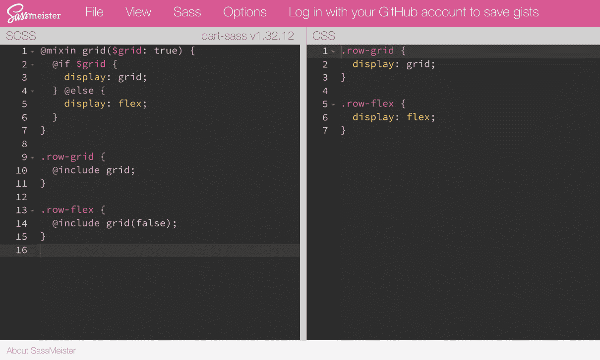
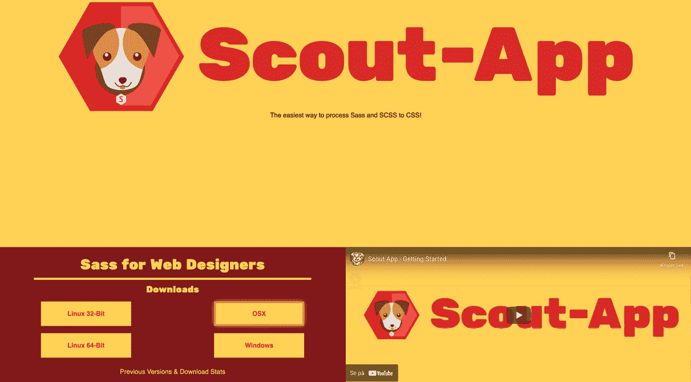
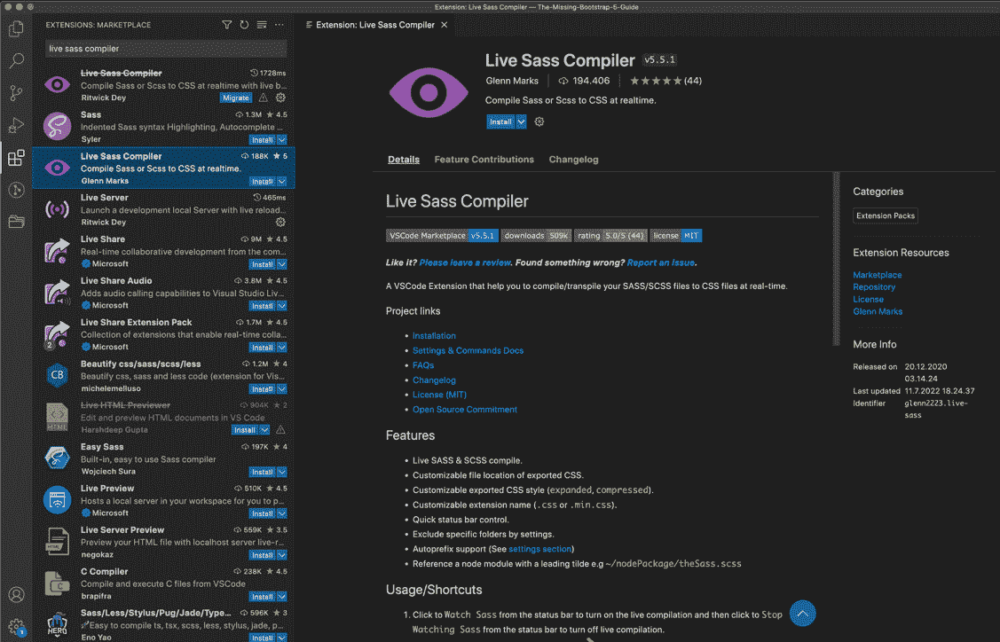

# *第二章*: 使用和编译 Sass

本章是 Sass 的介绍。如果你是 Sass 的初学者，你绝对应该阅读这一章来学习 Sass 的基础知识，Bootstrap 样式就是用 Sass 编写的。如果你已经熟悉 Sass，你可以跳过这一章，但我仍然建议你查看 *Bootstrap 使用的 Sass 功能* 和 *Bootstrap 开发者最重要的 Sass 功能* 部分。这将为你开始下一章关于自定义 Bootstrap 做好准备。

在本章中，我们将涵盖以下主要内容：

+   Sass 是什么？

+   Sass 语法

+   Sass 功能

+   Bootstrap 使用的 Sass 功能

+   Bootstrap 开发者最重要的 Sass 功能

+   编译 Sass

# 技术要求

+   要预览示例，你需要一个代码编辑器

+   要将 Sass 编译成 CSS，你需要以下任何一个：

    +   **Node.js**，如果你更喜欢使用终端（Mac）或命令提示符（Windows）的**命令行界面**（**CLI**）

    +   **Scout-App**，如果你更喜欢**图形用户界面**（**GUI**）

    +   **Visual Studio Code**，如果你更喜欢使用 Visual Studio Code 市场上的扩展

我将在本章中解释所有这些方法。

你可以在 GitHub 上找到本章的代码文件，链接为 [`github.com/PacktPublishing/The-Missing-Bootstrap-5-Guide`](https://github.com/PacktPublishing/The-Missing-Bootstrap-5-Guide)。

# Sass 是什么？

Sass 是 **Syntactically Awesome Style Sheets** 的缩写。它是一种特殊的样式表语言，称为预处理器脚本语言，它扩展了 CSS 的默认功能。这使得你可以在代码中使用类似 JavaScript 的逻辑和功能，例如 **变量**、**嵌套**、**混入**、**继承**、**部分**、**函数**、**数学运算**等。所有这些都有助于你通过自动化重复性任务、减少错误数量、创建可重用代码片段等方式编写更健壮、更易于维护的代码。Sass 的语法类似于 CSS，但 Sass 文件在浏览器中渲染之前需要编译成常规 CSS。这可以通过不同的工具完成，我们将在本章后面了解更多关于这些工具的信息。

Sass 首次发布于 2006 年，并且仍然由一个庞大的社区积极支持和开发。它是目前最受欢迎和使用的 CSS 预处理器，**Less** 和 **Stylus** 是市场上另外两个成熟的 CSS 预处理器。

在下一节中，我们将查看 Sass 语法。

# Sass 语法

Sass 支持两种不同的语法：原始缩进 Sass 语法和 **SCSS** 语法，它基本上是常规 **CSS** 的超集。SCSS 语法对于初学者来说是最简单的，最受欢迎的，也是 Bootstrap 样式所使用的。它也是我将在整本书中使用的语法。然而，这两种不同的语法都支持 Sass 的相同功能。

## 原始 Sass 语法与现代 Sass 语法的比较

原始语法使用`.sass`文件扩展名。它使用缩进来代替花括号来分隔代码块，使用*换行符*（每次按*Enter*键时）来分隔代码块内的规则。

缩进语法看起来是这样的：

```js
.link
```

```js
  background-color: #aaa
```

```js
  &:hover
```

```js
    text-decoration: underline
```

```js
  &__icon
```

```js
    color: #fff
```

现代语法使用`.scss`文件扩展名。**SCSS**是**Sassy CSS**的缩写。它使用花括号来分隔代码块，使用分号来分隔代码块内的规则。

SCSS 语法看起来是这样的：

```js
.link {
```

```js
  background-color: #aaa;
```

```js
  &:hover { text-decoration: underline;}
```

```js
  &__icon {
```

```js
    color: #fff;
```

```js
  }
```

```js
}
```

两种语法都会输出以下 CSS：

```js
.link {
```

```js
  background-color: #aaa;
```

```js
}
```

```js
.link:hover {
```

```js
  text-decoration: underline;
```

```js
}
```

```js
.link__icon {
```

```js
  color: #fff;
```

```js
}
```

如你所见，它们很相似。但 SCSS 允许你使用分号和花括号以与 CSS 相同的方式格式化代码，而原始 Sass 语法由于依赖于缩进和换行符，因此需要更严格的格式化。

## 父选择器

使用 Sass，你可以使用带有井号符号的父选择器，`&`。这个特殊选择器是由 Sass 发明的，用于嵌套选择器中引用父选择器。无论你嵌套了多少层（嵌套将在本节后面描述），井号都会被父选择器替换。你可以用不同的方式使用它，现在我们将通过一些示例来展示。

### 添加一个额外的类

如果你想要创建一个更具体的带有两个类的选择器，你可以像下面这样使用井号：

```js
.class-one {
```

```js
  &.class-two {
```

```js
    color: red;
```

```js
  }
```

```js
}
```

这将生成以下输出：

```js
.class-one.class-two {
```

```js
  color: red;
```

```js
}
```

### 添加伪类

要为某个选择器编写常见的伪类，你可以这样做：

```js
.link {
```

```js
  &:visited {}
```

```js
  &:hover {}
```

```js
  &:active {}
```

```js
}
```

这会编译成以下内容：

```js
.link:visited {}
```

```js
.link:hover {}
```

```js
.link:active {}
```

### 基于另一个选择器进行限定

你可以通过在另一个选择器后面使用井号来限定选择器。所以，例如，如果你想改变一个元素在另一个元素内部使用时的样式，你可以这样做：

```js
.heading {
```

```js
  .alert & {}
```

```js
}
```

这会编译成以下内容：

```js
.alert .heading {}
```

这条样式规则仅适用于`.heading`类，当它是`.alert`类的子类时。

### 修改井号

你可以通过在另一个选择器后面添加一个字符串来修改井号。以下是一个不同按钮样式的示例：

```js
.button {
```

```js
  &-small {}
```

```js
  &-medium {}
```

```js
  &-large {}
```

```js
}
```

这将编译成以下内容：

```js
.button-small {}
```

```js
.button-medium {}
```

```js
.button-large {}
```

这在采用命名方法时非常有用，该方法不是使用组合选择器，而是使用破折号和下划线来创建子选择器或修饰选择器。

现在我们已经了解了 Sass 的两种不同语法和特殊父选择器，我们可以继续学习 Sass 的不同特性。

# Sass 特性

在本节中，我们将探讨 Sass 的一些最常用特性。这只是一个简要的介绍，让你熟悉 Sass 代码，而不是一个详细的指南，因为我们不会在本书的整个过程中写很多 Sass 代码。

## 变量

Sass 变量可以用来存储任何你想要复用的 CSS 值。例如，当需要在一个组件中实现一致的配色方案，并且可能需要在后续过程中更改一个或多个颜色时，变量非常有用。这可以通过简单地更新变量的值来完成。要创建一个变量，你只需将一个值分配给以`$`符号开头的名称。以下是一个创建和使用变量的示例：

```js
$color-primary: blue;
```

```js
.button {
```

```js
  background-color: $color-primary;
```

```js
}
```

当 Sass 文件被处理时，它会取变量的值并将它们放在常规 CSS 中。生成的 CSS 将看起来像这样：

```js
.button {
```

```js
  background-color: blue;
```

```js
}
```

### 默认值

如果你给一个已经赋值的变量赋值，它将被覆盖。但也可以使用`!default`标志，仅在变量尚未定义或值为 null 时才给变量赋新值。这在创建 Sass 库（如 Bootstrap）时非常有用，你希望用户在生成 CSS 之前配置变量。如果用户没有配置任何变量，库设置的默认值将被使用。

以下是一个使用变量正常使用且将被覆盖的示例：

```js
$color-primary: blue;
```

```js
$color-primary: red;
```

```js
.button {
```

```js
  background-color: $color-primary;
```

```js
}
```

这将编译成以下内容：

```js
.button {
```

```js
  background-color: red;
```

```js
}
```

按钮的背景颜色变成了红色，因为`$color-primary`变量的值已被覆盖。

如果你使用`!default`标志，它将像这样工作：

```js
$color-primary: blue;
```

```js
$color-primary: red !default;
```

```js
.button {
```

```js
  background-color: $color-primary;
```

```js
}
```

这将编译成以下内容：

```js
.button {
```

```js
  background-color: blue;
```

```js
}
```

如我们所见，按钮的背景颜色现在将保持蓝色，因为`!default`标志不会改变`$color-primary`变量的值。

## 嵌套

使用 Sass，你可以嵌套你的 CSS 选择器，并实现与 HTML 相同的视觉层次结构。在嵌套 CSS 选择器时，有很多层级通常被认为是一种不好的做法；使用精心嵌套的 CSS 选择器是使你的代码更易读的好方法。

以例如这个使用无序列表链接创建的导航组件为例：

```js
<nav>
```

```js
  <ul>
```

```js
    <li>
```

```js
      <a>Menu item</a>
```

```js
    </li>
```

```js
    <li>
```

```js
      <a>Menu item</a>
```

```js
    </li>
```

```js
    <li>
```

```js
      <a>Menu item</a>
```

```js
    </li>
```

```js
</nav>
```

为了在我们的代码中获得更好的概览，我们可以以下面的方式嵌套 CSS 选择器，以反映我们的 HTML 结构：

```js
nav {
```

```js
  ul {
```

```js
    margin: 0;
```

```js
    padding: 0;
```

```js
    list-style: none;
```

```js
    li {
```

```js
      display: inline-block;
```

```js
      a {
```

```js
        text-decoration: none;
```

```js
      }
```

```js
    }
```

```js
  }
```

```js
}
```

这将编译成以下内容：

```js
nav ul {
```

```js
  margin: 0;
```

```js
  padding: 0;
```

```js
  list-style: none;
```

```js
}
```

```js
nav ul li {
```

```js
  display: inline-block;
```

```js
}
```

```js
nav ul li a {
```

```js
  text-decoration: none;
```

```js
}
```

## Partials 和导入

Partials 是包含 Sass 代码的小型文件，你可以将其导入到其他 Sass 文件中。这对于将代码组织成不同的部分和模块，以便更好地了解项目非常有用。Sass partial 文件以下划线字符（`_`）开头，这将防止它生成自己的 CSS 文件。要将 Sass partial 导入到另一个文件中，你应该使用`@import`规则。你不需要包含文件扩展名，并且可以省略开头的下划线字符。

由于 Sass 的`@import`规则在编译期间处理——与需要多个 HTTP 请求的常规 CSS `@import`规则不同——你可以访问 mixins、函数和变量。

在以下示例中，我们将有两个 Sass 部分，`_button.scss`和`_link.scss`，以及一个主文件`styles.scss`，它将导入它们：

第一个部分文件的名称：`_button.scss`

```js
$color-primary: red;
```

```js
.button {
```

```js
  background-color: $color-primary;
```

```js
}
```

第二个部分文件的名称：`_link.scss`

```js
$color-link: blue;
```

```js
.link {
```

```js
  color: $color-link;
```

```js
}
```

主文件：`styles.scss`

```js
@import 'button';
```

```js
@import 'link';
```

```js
// other SCSS code here
```

这将编译成以下内容：

```js
.button {
```

```js
  background-color: red;
```

```js
}
```

```js
.link {
```

```js
  color: blue;
```

```js
}
```

```js
// other CSS code here
```

`@import`正在被弃用

Sass 团队不鼓励使用`@import`规则。在未来几年内，它将被逐步淘汰，并最终完全移除。相反，应该使用`@use`规则。Bootstrap 在其 Sass 代码中使用`@import`规则，这就是为什么我在这里使用它而不是`@use`。

## Mixins

使用 mixin，你可以将你想要在整个项目中重复使用的 CSS 声明组合在一起。mixin 还可以接收参数，允许它们在每次使用时进行自定义。它们使用`@mixin`规则定义，并使用`@include`规则在代码中包含。mixin 将样式复制到它们被使用的地方。

### 简单 mixin

这里是一个没有参数的简单 mixin 示例。这是一个所谓的`clearfix` mixin，它直接来自 Bootstrap 5 Sass 代码，并且也用于其`clearfix`辅助工具：

```js
@mixin clearfix {
```

```js
  &::after {
```

```js
    display: block;
```

```js
    content: "";
```

```js
    clear: both;
```

```js
  }
```

```js
}
```

```js
.parent-with-floated-child-elements {
```

```js
  @include clearfix;
```

```js
}
```

这会编译成以下内容：

```js
.parent-with-floated-child-elements::after {
```

```js
  display: block;
```

```js
  content: "";
```

```js
  clear: both;
```

```js
}
```

### 带参数的 mixin

在这个示例中，我们看到一个简单的网格 mixin。它有一个默认值为`true`的`$grid`参数。在 mixin 的定义之后，我们将其包含在两个元素中。第一个将使用默认参数来获取`display`值（`grid`），而另一个将使用`false`作为参数来获取`display`值（`flex`）：

```js
@mixin grid($grid: true) {
```

```js
  @if $grid {
```

```js
    display: grid;
```

```js
  } @else {
```

```js
    display: flex;
```

```js
  }
```

```js
}
```

```js
.row-grid {
```

```js
  @include grid;
```

```js
}
```

```js
.row-flex {
```

```js
  @include grid(false);
```

```js
}
```

这将编译成以下内容：

```js
.row-grid {
```

```js
  display: grid;
```

```js
}
```

```js
.row-flex {
```

```js
  display: flex;
```

```js
}
```

## 扩展

**扩展**是 Sass 中重复使用 CSS 声明的另一种方法。使用这种方法，你可以在另一个选择器中共享一个选择器的样式。当你将一个类选择器扩展到另一个选择器时，结果是等于将那个类添加到 HTML 元素中。扩展选择器不会像 mixin 那样复制任何样式，而是更新扩展选择器的样式规则，使其也包含扩展选择器的样式。

这里是一个带有边框和内边的简单`.alert`类的示例。在这个示例内部嵌套了一个修改过的父选择器，它生成`.alert-success`类，这个类将扩展`.alert`类并添加背景颜色：

```js
.alert {
```

```js
  border: 1px solid black;
```

```js
  padding: 1rem;
```

```js
  &-success {
```

```js
    @extend .alert;
```

```js
    background-color: green;
```

```js
  }
```

```js
}
```

这会编译成以下内容：

```js
.alert, .alert-success {
```

```js
  border: 1px solid black;
```

```js
  padding: 1rem;
```

```js
}
```

```js
.alert-success {
```

```js
  background-color: green;
```

```js
}
```

如您所见，`.alert-success`类现在被添加到`.alert`类的样式声明中。因此，为了澄清，当一个类选择器扩展另一个选择器时，扩展选择器所属的样式现在也将对扩展选择器可用。

## 运算符

使用**运算符**，你可以在 CSS 中对不同值进行基本的数学计算。除了基本的数学计算，如加法、减法、乘法和除法之外，你还可以检查各种值之间的关系和相等性，还有更多。

下面是一些基本的数学计算示例，适用于数字和字符串：

```js
.addition {
```

```js
    margin: 10px + 5px;
```

```js
    content: "Hello " + "world!";
```

```js
}
```

```js
.subtraction {
```

```js
    margin: 25px - 10px;
```

```js
}
```

```js
.multiplication {
```

```js
    margin: 3 * 5px;
```

```js
}
```

```js
.division {
```

```js
    margin: (30 / 2) * 1px;
```

```js
}
```

这会编译成以下内容：

```js
.addition {
```

```js
  margin: 15px;
```

```js
  content: "Hello world!";
```

```js
}
```

```js
.subtraction {
```

```js
  margin: 15px;
```

```js
}
```

```js
.multiplication {
```

```js
  margin: 15px;
```

```js
}
```

```js
.division {
```

```js
  margin: 15px;
```

```js
}
```

使用`/`进行除法已被弃用

Sass 中的除法使用`/*`已被弃用，因为它在 CSS 中用作分隔符。相反，应该使用 Sass 内建的`math.div()`数学模块函数来进行除法，如下所示：`math.div(30, 2)`，结果为`15`。

## 函数

你可以创建自己的函数来执行特定的操作，这些操作需要在项目中重复使用。它们通过`@function`规则创建，并使用`@return`规则返回一个值。它们使用正常的 CSS 函数语法调用。就像混入一样，函数可以接收参数，允许每次调用时自定义行为。参数在函数内部作为变量可用。

这里有一个简单的函数，它将两个值相加并返回结果。这些值可以是数字或字符串，但在这个例子中，它们将是两个数字：

```js
@function add($a, $b) {
```

```js
    @return $a + $b;
```

```js
}
```

```js
.ordered-item {
```

```js
    order: add(1, 2);
```

```js
}
```

这会编译成以下内容：

```js
.ordered-item {
```

```js
  order: 3;
```

```js
}
```

调用函数时必须指定正确的参数数量，除非你通过为其中一个参数定义默认值来使其变为可选。

如此即可通过将其默认值设为`2`来使第二个参数变为可选：

```js
@function add($a, $b: 2) {
```

```js
    @return $a + $b;
```

```js
}
```

```js
.ordered-item {
```

```js
    order: add(1);
```

```js
}
```

这会编译成以下内容：

```js
.ordered-item {
```

```js
  order: 3;
```

```js
}
```

## 特殊值

Sass 支持许多种类的值。其中大部分来自 CSS，而一些则是 Sass 特有的。映射是 Sass 的特殊值之一，用于在列表中关联键和值。映射不是有效的 CSS 值，因此不能单独使用。然而，Sass 提供了各种函数来处理映射。

这里有一个简单的例子，首先定义了一个包含三个键值对的`$font-size`映射，然后通过使用`map-get()`函数，并传入映射名称和请求值的键作为参数来获取第三个键的值：

```js
$font-size: (
```

```js
    "small": 12,
```

```js
    "default": 16,
```

```js
    "large": 20
```

```js
);
```

```js
.lead-paragraph {
```

```js
    font-size: map-get($font-size, "large");
```

```js
}
```

这会编译成以下内容：

```js
.lead-paragraph {
```

```js
  font-size: 20;
```

```js
}
```

## 内建模块

Sass 提供了包含各种函数和混入的内建模块。这些函数最初是全局可用的，但现在应该通过`@use`规则（少数例外）来加载。其中一些更有用的函数是用于操作颜色值和与基于列表和映射的值一起工作的函数。

这里是如何使用内建颜色模块中的`color.scale()`函数流畅地缩放颜色属性的示例。在这个例子中，该函数用于将颜色的亮度增加 25%，你可以看到即使使用命名颜色作为参数，这也同样有效：

```js
@use "sass:color";
```

```js
$color-primary: blue;
```

```js
.button {
```

```js
  color: $color-primary;
```

```js
  background-color: color.scale($color-primary,
```

```js
                                $lightness: 25%);
```

```js
}
```

这会编译成以下内容：

```js
.button {
```

```js
  color: blue;
```

```js
  background-color: #4040ff;
```

```js
}
```

现在我们已经查看了一些 Sass 的特性，让我们看看 Bootstrap 使用了哪些特性。

# Bootstrap 使用的 Sass 特性

这只是对 Bootstrap 使用的 Sass 特性的快速概述。我们将在下一章深入探讨 Bootstrap 是如何构建的。

## 语法

如前所述，Bootstrap Sass 代码使用 SCSS 语法编写。它还使用`&`父选择器来处理伪类和状态，以及属性选择器。

## 部分文件

Bootstrap 5 的 Sass 代码分为 81 个部分和五个文件夹。这些部分随后通过其他部分或常规 SCSS 文件导入。这为 Bootstrap 的所有各个部分提供了一个良好的概览。

## 变量

变量在 Bootstrap 中被广泛使用。它们用于在组件之间保持视觉一致性，例如颜色、间距等，但它们也以这种方式使用，使得用户在生成 CSS 之前可以轻松地进行配置。

## 地图

地图在 Sass 库和设计系统中经常被使用。在 Bootstrap 中，它们主要用于配置工具所使用的值。

## 混合

混合在 Bootstrap Sass 代码中广泛使用。它们用于布局、组件、辅助工具、工具和其他视觉样式。

## 内置模块

Bootstrap 使用 Sass 的颜色和地图模块。它使用颜色模块中的函数（以及其他包含的颜色函数）来处理与颜色相关的视觉样式，并使用地图模块中的函数来处理用于生成工具的地图值。

现在我们已经了解了 Bootstrap 如何利用 Sass 的各种特性。但是，对于与 Bootstrap 定制化工作的开发者来说，哪些特性最为重要？现在让我们来看看。

# 对 Bootstrap 开发者来说最重要的 Sass 特性

在定制 Bootstrap 时，以下是一些你将最常使用的 Sass 特性的快速概述。

## 用于定制的变量

在定制 Bootstrap 时，理解使用 Sass 变量的能力是最重要的特性。你想要做的多数更改都需要你覆盖 Bootstrap 已经使用的变量。

## 工具 API 的地图

Sass 伴随的特殊地图值与工具 API 结合使用，以生成各种工具类。这可以用来修改或删除现有的工具，或者添加你自己的。我们将在下一章中学习如何使用工具 API。

工具 API

工具 API 是 Bootstrap 5 的内置工具，用于生成不同的工具类。Sass 地图用于为工具 API 提供设置和选项。

## 混合和扩展用于语义化代码

Bootstrap 有许多由不同 Bootstrap 元素使用的混合，但这些混合也可以在你的代码中使用。混合和 Sass 的扩展功能都可以用来编写更语义化的代码，我们将在*第八章*中更详细地探讨，*使用 Bootstrap 5 变量、工具 API 和 Sass 定制网站*。

我们刚刚看到了如何使用 Sass 的一些特性，现在我们将学习如何将 Sass 代码编译成常规 CSS。

# 编译 Sass

您有多种方式可以编译您的 Sass 代码。如果您是 Sass 的初学者并想尝试语法和功能，您可以使用 **Sassmeister** 并立即开始。如果您想将 Sass 编译集成到您的开发工作流程中，有几种方法可以实现。我将向您展示三种不同的方法。第一种方法需要您使用 **Node.js** 和终端或命令提示符，第二种方法使用一个名为 **Scout-App** 的免费应用程序，第三种方法使用 **Visual Studio Code** 代码编辑器的扩展。

## 使用 Sassmeister 进行 Sass 实验

Sassmeister，可在 [sassmeister.com](http://sassmeister.com) 访问，是一个在沙盒环境中实验 Sass 的免费工具。您可以使用 Sass 或 SCSS 语法，选择不同的 Sass 编译器，定义 CSS 输出，等等。本章中的所有示例都可以在 Sassmeister 中看到实际效果。



图 2.1 – Sassmeister Sass 沙盒环境在 sassmeister.com

## 将 Sass 编译集成到开发工作流程中

在接下来的三个小节中，我将描述将 Sass 编译集成到开发工作流程中的不同方法。对于所有这些方法，我们将使用相同的 HTML 文件和 SCSS 文件。您必须自己创建这些文件并将它们放置在项目文件夹中。

HTML 文件应包含以下代码：

index.xhtml

```js
<!DOCTYPE html>
```

```js
<html lang="en">
```

```js
  <head>
```

```js
    <meta charset="utf-8">
```

```js
    <meta name="viewport" content="width=device-width, 
```

```js
      initial-scale=1">
```

```js
    <link rel="stylesheet" href="style.css">
```

```js
    <title>Compiling Sass</title>
```

```js
  </head>
```

```js
  <body>
```

```js
    <h1>Hello world!</h1>
```

```js
  </body>
```

```js
</html>
```

这是 HTML 文件的基代码，包括一个指向尚未从源 Sass 代码编译的样式的 `<link>` 标签。如果您在编译之前在浏览器中打开此文件，它将简单地显示 `Hello world!`。

SCSS 文件应包含以下代码：

style.scss

```js
$color-primary: blue;
```

```js
h1 {
```

```js
  color: $color-primary;
```

```js
}
```

首先，我们在 `$color-primary` 变量中存储了 `blue` 颜色。然后，我们使用该变量设置 `h1` 元素的文本颜色。在编译我们的 Sass 后，我们得到一个包含以下代码的新 CSS 文件：

style.css

```js
h1 {
```

```js
  color: blue;
```

```js
}
```

在浏览器中重新加载 HTML 文件后，我们将看到标题的文本颜色现在是蓝色。这表明 Sass 编译按预期工作，并且现在已生成了引用的 CSS 文件。

继续阅读下一部分，了解将 Sass 编译集成到开发工作流程中的不同方法。

### 使用 Node.js

#### 第 1 步：下载并安装 Node.js

此方法需要您下载并安装 Node.js。为此，您只需访问官方网站 [nodejs.org](http://nodejs.org) 并从那里下载即可。`npm` 是与 Node.js 自动安装的默认包管理器。

#### 第 2 步：使用终端或命令提示符导航到您的项目文件夹

现在，打开终端（macOS）或命令提示符（Windows），并使用以下命令导航到您的项目文件夹：

```js
cd [project-folder-path]
```

方括号不应使用，例如，如下所示：

```js
cd projects/bootstrap/example
```

从 macOS 的 Finder 拖动你的文件夹

如果你使用 macOS，你可以简单地输入 `cd`（记得在最后加空格），然后从 Finder 拖动你的文件夹到终端。这将插入正确的文件夹路径。现在，你只需按 *Enter* 键。

在 Windows 的文件资源管理器中输入 cmd

如果你使用 Windows，你可以在 **文件资源管理器** 窗口的搜索栏中输入 `cmd` 快捷方式。按 *Enter* 键将打开命令提示符中的文件夹。

#### 第 3 步：初始化一个新的 npm 项目

然后，为了初始化一个新的 `npm` 项目，我们输入以下两个命令之一：

```js
npm init
npm init -y
```

如果你选择第一个选项（*不带* `-y` 标志），你将被要求输入项目信息。每个步骤都可以通过按 *Enter* 键跳过，之后也可以编辑所有内容。

如果你选择第二个选项（*带* `-y` 标志），它将自动回答这些问题。这也可以稍后编辑。

运行 `npm init` 命令后，将生成一个包含你的 `npm` 项目基本信息的 `package.json` 文件。它看起来可能像这样：

```js
{
```

```js
  "name": "[the name of your folder]",
```

```js
  "version": "1.0.0",
```

```js
  "description": "",
```

```js
  "main": "index.js",
```

```js
  "scripts": {
```

```js
    "test": "echo \"Error: no test specified\" && exit 1"
```

```js
  },
```

```js
  "keywords": [],
```

```js
  "author": "",
```

```js
  "license": "ISC"
```

```js
}
```

#### 第 4 步：全局安装 Sass

我们现在将在机器上全局安装 Sass `npm` 包，使其可用于此和其他未来的项目。此包用于将你的 Sass 代码编译为 CSS。输入以下命令：

```js
npm install sass -g
```

要检查你是否已成功安装 Sass，你可以输入以下命令：

```js
sass --version 
```

你将在你的终端中看到以下内容：

```js
1.43.4 compiled with dart2js 2.14.4
```

如果你使用 macOS 的终端，并且在尝试安装 Sass 时遇到有关文件权限的错误，你可以尝试添加 `sudo` 命令，这样完整的命令将是：

```js
sudo npm install sass -g
```

如果你在 Windows 上遇到类似的问题，可以尝试以管理员身份运行命令提示符。

#### 第 5 步：将 Sass 编译为 CSS

现在，是时候编译你的 Sass 代码了。为此，你使用 `sass` 命令，后跟输入文件路径（你的 Sass 源文件）和输出文件（你想要用于网站的 CSS 文件），以及任何可选设置：

```js
sass [input-path] [output-path]
```

或

```js
sass [input-path] [output-path] [settings]
```

请注意，在先前的命令中，不应使用方括号。

最有用的设置如下：

+   `--style=expanded` – 生成一个压缩和最小化的 CSS 文件。

+   `--no-source-map` – 阻止生成源映射文件。此文件将转换后的源映射到原始源，以便浏览器可以在调试器中显示原始内容。

+   `--watch` – 监视文件中的任何更改并自动重新编译。

如果你添加了多个设置，请记住在它们之间添加空格。

要编译起始模板中包含的 SCSS 文件，你将输入以下命令：

```js
sass style.scss style.css 
```

这将编译 `style.scss` 中找到的 Sass 代码到 CSS，并在同一文件夹中创建新的 `style.css` 文件以及 `style.css.map` 源映射文件。

现在，你可以在浏览器中查看编译后的 Bootstrap CSS 的起始模板。

### 使用 Scout-App

如果您在编译 Sass 时更喜欢使用 GUI，可以使用免费的**Scout-App**应用。您可以从[scout-app.io](http://scout-app.io)下载，并且有适用于 macOS、Windows 和 Linux 的版本。

在首页有一个非常棒的**入门**视频，我建议您观看以了解该应用的工作原理。您也可以通过以下链接直接在 YouTube 上观看视频：[`youtu.be/6zA78zMsH9w`](https://youtu.be/6zA78zMsH9w)。



图 2.2 – 官方 Scout-App 网站首页截图

### 使用 Visual Studio Code 的 Live Sass Compiler 扩展

如果您使用 Visual Studio Code 作为代码编辑器，可以通过 Glenn Marks 的`Live Sass Compiler`进行安装，然后点击**安装**：



图 2.3 – Visual Studio Code 扩展标签页中打开的 Live Sass Compiler 扩展截图

您也可以通过以下链接在 Visual Studio Marketplace 上找到此扩展：

[`marketplace.visualstudio.com/items?itemName=glenn2223.live-sass`](https://marketplace.visualstudio.com/items?itemName=glenn2223/live-sass)

在成功安装扩展后，当您打开 SCSS 或 SASS 文件时，需要点击状态栏中的**Watch Sass**来激活实时 Sass 编译器。完成工作后，只需再次点击相同的按钮即可将其停用。

# 摘要

本章是为没有先前经验的 Sass 初学者而写的介绍。我们学习了语法和一般特性，还了解了 Bootstrap 使用的特性以及对于 Bootstrap 开发者来说最重要的特性。最后，我们还学习了各种编译 Sass 的方法，无论是简单的实验还是将 Sass 编译集成到开发流程中。

在下一章中，我们将学习如何使用 Sass 自定义 Bootstrap 5。如果您已经阅读了本章，您现在已经为深入 Bootstrap 5 的 Sass 代码做好了充分的准备。
