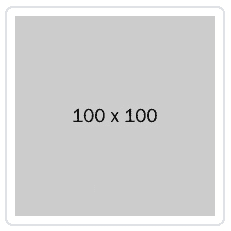
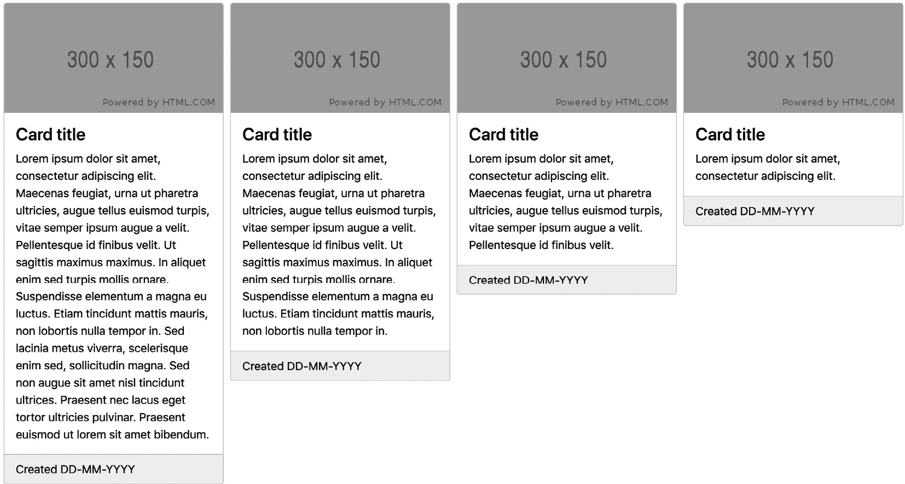

# *第五章*：自定义各种 Bootstrap 5 元素

在本章中，我们将学习如何自定义使用 Bootstrap 5 变量进行样式的所有 Bootstrap 元素的视觉样式。我们将了解影响您网站整体设计的布局和内容更改，以及影响特定元素且没有全局效果的更改。

当您想更改用户界面的细节时，了解如何更改网站的一般布局和内容以及如何自定义特定元素是有用的。

在本章中，我们将涵盖以下主题：

+   自定义布局

+   自定义内容

+   自定义表单

+   自定义组件

+   自定义辅助工具

+   自定义实用工具

# 技术要求

+   要预览示例，您需要一个代码编辑器和浏览器。

+   您需要一个 Sass 编译器来将 Sass 文件编译为 CSS。请参阅*第二章*，*使用和编译 Sass*，了解不同的实现方法。

您可以在 GitHub 上找到本章的代码文件，地址为 [`github.com/PacktPublishing/The-Missing-Bootstrap-5-Guide`](https://github.com/PacktPublishing/The-Missing-Bootstrap-5-Guide)

# 自定义布局

在这里，我们将学习如何自定义断点、容器和网格系统，以创建您所有内容所需的精确响应性和一般布局。

## 断点

断点定义了布局将更改并适应不同屏幕尺寸时的最小宽度。这些最小宽度用于媒体查询中。

断点、变量名和默认值的行号如下：

bootstrap/scss/_variables.scss

```js
431 $grid-breakpoints: (
```

```js
432   xs: 0,
```

```js
433   sm: 576px,
```

```js
434   md: 768px,
```

```js
435   lg: 992px,
```

```js
436   xl: 1200px,
```

```js
437   xxl: 1400px
```

```js
438 ) !default;
```

我们现在将使用以下 Sass 代码更改所有屏幕尺寸的最小宽度：

part-1/chapter-5/layout/breakpoints/scss/style.scss

```js
// Specify the breakpoint sizes
```

```js
$grid-breakpoints: (
```

```js
  xs: 0,
```

```js
  sm: 300px,
```

```js
  md: 600px,
```

```js
  lg: 900px,
```

```js
  xl: 1200px,
```

```js
  xxl: 1500px
```

```js
);
```

```js
@import "../../../../../bootstrap/scss/bootstrap.scss";
```

我们现在可以使用以下 HTML 创建一个简单的网格：

part-1/chapter-5/layout/breakpoints/index.xhtml

```js
<div class="row">
```

```js
  <div class="col-12 col-sm-10 col-md-8 col-lg-6 col-xl-4 
```

```js
    col-xxl-2">
```

```js
  <div class="bg-secondary text-white p-3">Column</div>
```

```js
  </div>
```

```js
</div>
```

要查看更改断点后的效果，您应该在浏览器中打开示例并调整窗口大小。

## 容器

可以像我们看到的断点大小一样，以相同的方式定义不同屏幕尺寸的容器（`.container`）的最大宽度。这些最大宽度也用于媒体查询中。

容器最大宽度的行号、变量名和默认值如下：

bootstrap/scss/_variables.scss

```js
450 $container-max-widths: (
```

```js
451   sm: 540px,
```

```js
452   md: 720px,
```

```js
453   lg: 960px,
```

```js
454   xl: 1140px,
```

```js
455   xxl: 1320px,
```

```js
456 ) !default;
```

注意，对于超小断点（`xs`），没有最大宽度。

我们现在将使用以下 Sass 代码更改所有屏幕尺寸的容器最大宽度：

part-1/chapter-5/layout/containers/scss/style.scss

```js
// Specify the container maximum widths
```

```js
$container-max-widths: (
```

```js
  sm: 300px,
```

```js
  md: 500px,
```

```js
  lg: 700px,
```

```js
  xl: 900px,
```

```js
  xxl: 1100px
```

```js
);
```

```js
@import "../../../../../bootstrap/scss/bootstrap.scss";
```

我们现在可以使用以下 HTML 创建一个简单的容器：

part-1/chapter-5/layout/containers/index.xhtml

```js
<div class="container">
```

```js
  <div class="bg-secondary text-white p-3">Content</div>
```

```js
</div>
```

要查看容器最大宽度更改的效果，您应该在浏览器中打开示例并调整窗口大小。

## 网格

网格的默认列数是 `12`，默认 gutters 宽度是 `1.5rem`。如果你想要网格中的不同列数或不同的 gutters 宽度，可以更改这些值。

容器最大宽度的行号、变量名称和默认值如下：

bootstrap/scss/_variables.scss

```js
466 $grid-columns: 12 !default;
```

```js
467 $grid-gutter-width: 1.5rem !default;
```

```js
468 $grid-row-columns: 6 !default;
```

我们现在将使用以下 Sass 代码更改网格中的列数和默认的 gutters 宽度：

part-1/chapter-5/layout/grids/scss/style.scss

```js
// Specify the number of grid columns and the gutter width
```

```js
$grid-columns: 16;
```

```js
$grid-gutter-width: 1rem;
```

```js
@import "../../../../../bootstrap/scss/bootstrap.scss";
```

我们现在可以使用以下 HTML 创建一个简单的网格系统：

index.xhtml

```js
<div class="row">
```

```js
  <div class="col-16 col-md-8 col-lg-4">
```

```js
    <div class="bg-secondary text-white p-3">Content</div>
```

```js
  </div>
```

```js
  <div class="col-16 col-md-8 col-lg-4">
```

```js
    <div class="bg-secondary text-white p-3">Content</div>
```

```js
  </div>
```

```js
  <div class="col-8 col-lg-4">
```

```js
    <div class="bg-secondary text-white p-3">Content</div>
```

```js
  </div>
```

```js
  <div class="col-8 col-lg-4">
```

```js
    <div class="bg-secondary text-white p-3">Content</div>
```

```js
  </div>
```

```js
</div>
```

要查看更改列数和 gutters 宽度对网格的影响，你应该在浏览器中打开示例。

现在我们将学习如何自定义我们网站的各种内容。

# 自定义内容

内容的样式（排版、图片、表格和图形）可以使用在 `_variables.scss` 文件中找到的变量进行自定义，这些变量位于行 `543`–`651` 和行 `1500`–`1513`。

现在我们将看到如何自定义不同类型的内容。

## 排版

Bootstrap 5 中用于定义整体排版的变量有很多。实际上，有超过 50 个不同的变量。在大多数情况下，变量名称是自解释的，所以让我们深入了解并查看完整的列表。以下为排版元素的行号、变量名称和默认值：

bootstrap/scss/_variables.scss

```js
543 $font-family-sans-serif: system-ui, -apple-system,
```

```js
    "Segoe UI", Roboto, "Helvetica Neue", Arial, 
```

```js
    "Noto Sans", "Liberation Sans", sans-serif, 
```

```js
    "Apple Color Emoji", "Segoe UI Emoji", 
```

```js
    "Segoe UI Symbol", "Noto Color Emoji" !default;
```

```js
544 $font-family-monospace: SFMono-Regular, Menlo, Monaco,
```

```js
    Consolas, "Liberation Mono", "Courier New", monospace
```

```js
    !default;
```

```js
545
```

```js
546 $font-family-base: var(--#{$variable-prefix}
```

```js
    font-sans-serif) !default;
```

```js
547 $font-family-code: var(--#{$variable-prefix}
```

```js
    font-monospace) !default;
```

```js
548
```

```js
549
```

```js
550
```

```js
551 $font-size-root: null !default;
```

```js
552 $font-size-base: 1rem !default;
```

```js
553 $font-size-sm: $font-size-base * .875 !default;
```

```js
554 $font-size-lg: $font-size-base * 1.25 !default;
```

```js
555
```

```js
556 $font-weight-lighter: lighter !default;
```

```js
557 $font-weight-light: 300 !default;
```

```js
558 $font-weight-normal: 400 !default;
```

```js
559 $font-weight-semibold: 600 !default;
```

```js
560 $font-weight-bold: 700 !default;
```

```js
561 $font-weight-bolder: bolder !default;
```

```js
562
```

```js
563 $font-weight-base: $font-weight-normal !default;
```

```js
564
```

```js
565 $line-height-base: 1.5 !default;
```

```js
566 $line-height-sm: 1.25 !default;
```

```js
567 $line-height-lg: 2 !default;
```

```js
568
```

```js
569 $h1-font-size: $font-size-base * 2.5 !default;
```

```js
570 $h2-font-size: $font-size-base * 2 !default;
```

```js
571 $h3-font-size: $font-size-base * 1.75 !default;
```

```js
572 $h4-font-size: $font-size-base * 1.5 !default;
```

```js
573 $h5-font-size: $font-size-base * 1.25 !default;
```

```js
574 $h6-font-size: $font-size-base !default;
```

```js
575
```

```js
576
```

```js
577
```

```js
578 $font-sizes: (
```

```js
579   1: $h1-font-size,
```

```js
580   2: $h2-font-size,
```

```js
581   3: $h3-font-size,
```

```js
582   4: $h4-font-size,
```

```js
583   5: $h5-font-size,
```

```js
584   6: $h6-font-size
```

```js
585 ) !default;
```

```js
586
```

```js
587
```

```js
588
```

```js
589 $headings-margin-bottom:      $spacer * .5 !default;
```

```js
590 $headings-font-family:        null !default;
```

```js
591 $headings-font-style:         null !default;
```

```js
592 $headings-font-weight:        500 !default;
```

```js
593 $headings-line-height:        1.2 !default;
```

```js
594 $headings-color:              null !default;
```

```js
595
```

```js
596
```

```js
597
```

```js
598 $display-font-sizes: (
```

```js
599   1: 5rem,
```

```js
600   2: 4.5rem,
```

```js
601   3: 4rem,
```

```js
602   4: 3.5rem,
```

```js
603   5: 3rem,
```

```js
604   6: 2.5rem
```

```js
605 ) !default;
```

```js
606
```

```js
607 $display-font-family: null !default;
```

```js
608 $display-font-style:  null !default;
```

```js
609 $display-font-weight: 300 !default;
```

```js
610 $display-line-height: $headings-line-height !default;
```

```js
611
```

```js
612
```

```js
613
```

```js
614 $lead-font-size: $font-size-base * 1.25 !default;
```

```js
615 $lead-font-weight: 300 !default;
```

```js
616
```

```js
617 $small-font-size: .875em !default;
```

```js
618
```

```js
619 $sub-sup-font-size: .75em !default;
```

```js
620
```

```js
621 $text-muted: $gray-600 !default;
```

```js
622
```

```js
623 $initialism-font-size: $small-font-size !default;
```

```js
624
```

```js
625 $blockquote-margin-y: $spacer !default;
```

```js
626 $blockquote-font-size: $font-size-base * 1.25 !default;
```

```js
627 $blockquote-footer-color: $gray-600 !default;
```

```js
628 $blockquote-footer-font-size: $small-font-size !default;
```

```js
629
```

```js
630 $hr-margin-y: $spacer !default;
```

```js
631 $hr-color: inherit !default;
```

```js
632
```

```js
633
```

```js
634 $hr-bg-color: null !default;
```

```js
635 $hr-height: $border-width !default;
```

```js
636
```

```js
637
```

```js
638 $hr-border-color: null !default;
```

```js
639 $hr-border-width: $border-width !default;
```

```js
640 $hr-opacity: .25 !default;
```

```js
641
```

```js
642 $legend-margin-bottom: .5rem !default;
```

```js
643 $legend-font-size: 1.5rem !default;
```

```js
644 $legend-font-weight: null !default;
```

```js
645
```

```js
646 $dt-font-weight: $font-weight-bold !default;
```

```js
647
```

```js
648 $list-inline-padding: .5rem !default;
```

```js
649
```

```js
650 $mark-padding: .2em !default;
```

```js
651 $mark-bg: $yellow-100 !default;
```

现在我们将看到一个示例，展示我们如何更改文本颜色、背景颜色、字体家族、字体大小、行高以及链接的全局样式，以及常规标题、显示标题和引导段落的更具体样式。

这里是包含这些排版元素的 HTML 代码：

part-1/chapter-5/content/typography/index.xhtml

```js
<h2 class="text-muted my-3">Headings</h2>
```

```js
<h1>&lt;h1&gt; heading</h1>
```

```js
<h2>&lt;h2&gt; heading</h2>
```

```js
<h3>&lt;h3&gt; heading</h3>
```

```js
<h4>&lt;h4&gt; heading</h4>
```

```js
<h5>&lt;h5&gt; heading</h5>
```

```js
<h6>&lt;h6&gt; heading</h6>
```

```js
<h2 class="text-muted my-3">Display headings</h2>
```

```js
<h1 class="display-1">Display heading 1</h1>
```

```js
<h1 class="display-2">Display heading 2</h1>
```

```js
<h1 class="display-3">Display heading 3</h1>
```

```js
<h1 class="display-4">Display heading 4</h1>
```

```js
<h1 class="display-5">Display heading 5</h1>
```

```js
<h1 class="display-6">Display heading 6</h1>
```

```js
<h2 class="text-muted my-3">Lead paragraph</h2>
```

```js
<p class="lead">Lorem ipsum dolor sit amet, 
```

```js
   consectetur adipiscing elit. In laoreet pellentesque 
```

```js
   lorem sed elementum. Suspendisse maximus convallis ex.
```

```js
   <a href="#">Etiam eleifend velit leo</a>.
```

```js
</p>
```

```js
<h2 class="text-muted my-3">Paragraph</h2>
```

```js
<p>Lorem ipsum dolor sit amet, consectetur adipiscing elit.
```

```js
   In laoreet pellentesque lorem sed elementum. Suspendisse
```

```js
   maximus convallis ex. <a href="#">Etiam eleifend velit 
```

```js
   leo</a>.
```

```js
</p>
```

使用默认的 Bootstrap 5 样式时，它看起来是这样的：


Figure 5.1 – Typographic elements with default Bootstrap 5 styles

要更改文本颜色和背景色的全局样式，我们将使用两个额外的变量。排版元素的行号、变量名称和默认值如下：

bootstrap/scss/_variables.scss

```js
401 $body-bg:                   $white !default;
```

```js
402 $body-color:                $gray-900 !default;
```

要将字体家族从系统字体更改为自定义字体，我们将使用 Google Fonts。我们将在 Bootstrap 5 CSS 文件的 `<link>` 标签之后使用 `<head>` 标签：

part-1/chapter-5/content/typography/index.xhtml

```js
<link rel="preconnect" href="https://fonts.gstatic.com">
```

```js
<link href="https://fonts.googleapis.com/css2?family=Roboto:wght@300;400;700&display=swap" rel="stylesheet">
```

更新我们的 HTML 文件后，我们现在需要使用以下 Sass 代码定义几个不同的排版变量：

part-1/chapter-5/content/typography/scss/style.scss

```js
// Required
```

```js
@import "../../../../../bootstrap/scss/functions";
```

```js
@import "../../../../../bootstrap/scss/variables";
```

```js
// Body styles
```

```js
$body-bg: $gray-100;
```

```js
$body-color: $gray-700;
```

```js
// Basic typography styles
```

```js
$font-family-base: 'Roboto', sans-serif;
```

```js
$font-size-base: 1.5rem;
```

```js
$line-height-base: 1.3;
```

```js
$line-height-sm: 1;
```

```js
// Link styles
```

```js
$link-color: $info;
```

```js
$link-decoration: none;
```

```js
$link-hover-color: shift-color($link-color, 
```

```js
                               $link-shade-percentage);
```

```js
$link-hover-decoration: underline;
```

```js
// Heading styles
```

```js
$h1-font-size: $font-size-base * 3.5;
```

```js
$h2-font-size: $font-size-base * 3;
```

```js
$h3-font-size: $font-size-base * 2.5;
```

```js
$h4-font-size: $font-size-base * 2;
```

```js
$h5-font-size: $font-size-base * 1.5;
```

```js
$h6-font-size: $font-size-base;
```

```js
$headings-font-weight: $font-weight-bold;
```

```js
$headings-line-height: $line-height-sm;
```

```js
$headings-margin-bottom: $spacer;
```

```js
// Display styles
```

```js
$display-font-sizes: (
```

```js
  1: $h1-font-size * 1.5,
```

```js
  2: $h2-font-size * 1.5,
```

```js
  3: $h3-font-size * 1.5,
```

```js
  4: $h4-font-size * 1.5,
```

```js
  5: $h5-font-size * 1.5,
```

```js
  6: $h6-font-size * 1.5
```

```js
);
```

```js
$display-font-weight: $font-weight-light;
```

```js
$display-line-height: $headings-line-height;
```

```js
// Lead styles
```

```js
$lead-font-size: $font-size-base * 1.25;
```

```js
$lead-font-weight: $font-weight-light;
```

```js
// Required
```

```js
@import "../../../../../bootstrap/scss/maps";
```

```js
@import "../../../../../bootstrap/scss/mixins";
```

```js
@import "../../../../../bootstrap/scss/root";
```

```js
// Optional Bootstrap CSS
```

```js
@import "../../../../../bootstrap/scss/reboot";
```

```js
@import "../../../../../bootstrap/scss/type";
```

```js
@import "../../../../../bootstrap/scss/images";
```

```js
// The long list of imports have been reduced here.
```

```js
// Helpers
```

```js
@import "../../../../../bootstrap/scss/helpers";
```

```js
// Utilities
```

```js
@import "../../../../../bootstrap/scss/utilities";
```

```js
// Utilities API
```

```js
@import "../../../../../bootstrap/scss/utilities/api";
```

编译 Sass 代码后，排版元素将看起来像这样：


Figure 5.2 – Typographic elements after applying the customizations

## 图片

您无法单独自定义图像的外观或行为。但您可以自定义图像缩略图的外观，这将在图像周围添加一些样式，但不会更改图像本身。默认图像缩略图的样子如下：



图 5.3 – 默认图像缩略图

我们现在将更改填充、背景颜色、边框颜色和边框半径。图像缩略图的这些属性的行号、变量名和默认值如下：

bootstrap/scss/_variables.scss

```js
1500: $thumbnail-padding: .25rem;
```

```js
1501: $thumbnail-bg: $body-bg;
```

```js
1503: $thumbnail-border-color: $gray-300;
```

```js
1504: $thumbnail-border-radius: $border-radius;
```

我们将使用以下 Sass 代码来更改这些变量：

part-1/chapter-5/content/images/scss/style.scss

```js
// Required
```

```js
@import "../../../../../bootstrap/scss/functions";
```

```js
@import "../../../../../bootstrap/scss/variables";
```

```js
// Specify variables
```

```js
$thumbnail-padding: .5rem;
```

```js
$thumbnail-bg: $gray-200;
```

```js
$thumbnail-border-color: $gray-500;
```

```js
$thumbnail-border-radius: 0;
```

```js
// Required
```

```js
@import "../../../../../bootstrap/scss/maps";
```

```js
@import "../../../../../bootstrap/scss/mixins";
```

```js
@import "../../../../../bootstrap/scss/root";
```

```js
// Optional Bootstrap CSS
```

```js
@import "../../../../../bootstrap/scss/reboot";
```

```js
@import "../../../../../bootstrap/scss/type";
```

```js
@import "../../../../../bootstrap/scss/images";
```

```js
// The long list of imports have been reduced here.
```

```js
// Helpers
```

```js
@import "../../../../../bootstrap/scss/helpers";
```

```js
// Utilities
```

```js
@import "../../../../../bootstrap/scss/utilities";
```

```js
// Utilities API
```

```js
@import "../../../../../bootstrap/scss/utilities/api";
```

我们现在可以使用以下 HTML 创建一个简单的图像缩略图：

part-1/chapter-5/content/images/index.xhtml

```js

```

编译 Sass 代码后，图像缩略图将看起来像这样：


图 5.4 – 填充、背景颜色、边框颜色和边框半径已更改的图像缩略图

## 图像

默认图像的样子如下：


图 5.5 – 默认图像

我们现在将更改图像标题的字体大小和颜色。图像的这些属性的行号、变量名和默认值如下：

bootstrap/scss/_variables.scss

```js
1512 $figure-caption-font-size: $small-font-size;
```

```js
1513 $figure-caption-color: $gray-600;
```

我们将使用以下 Sass 代码来更改这些变量：

part-1/chapter-5/content/figures/scss/style.scss

```js
// Required
```

```js
@import "../../../../../bootstrap/scss/functions";
```

```js
@import "../../../../../bootstrap/scss/variables";
```

```js
// Specify variables
```

```js
$figure-caption-font-size: $font-size-lg;
```

```js
$figure-caption-color: $body-color;
```

```js
// Required
```

```js
@import "../../../../../bootstrap/scss/maps";
```

```js
@import "../../../../../bootstrap/scss/mixins";
```

```js
@import "../../../../../bootstrap/scss/root";
```

```js
// Optional Bootstrap CSS
```

```js
@import "../../../../../bootstrap/scss/reboot";
```

```js
@import "../../../../../bootstrap/scss/type";
```

```js
@import "../../../../../bootstrap/scss/images";
```

```js
// The long list of imports have been reduced here.
```

```js
// Helpers
```

```js
@import "../../../../../bootstrap/scss/helpers";
```

```js
// Utilities
```

```js
@import "../../../../../bootstrap/scss/utilities";
```

```js
// Utilities API
```

```js
@import "../../../../../bootstrap/scss/utilities/api";
```

我们现在可以使用以下 HTML 创建一个简单的图像：

part-1/chapter-5/content/figures/index.xhtml

```js
<figure class="figure">
```

```js
  
```

```js
  <figcaption class="figure-caption">
```

```js
    Caption for the figure.</figcaption>
```

```js
</figure>
```

编译 Sass 代码后，图像将看起来像这样：


图 5.6 – 图像标题字体大小和颜色已更改的图像

现在我们已经学习了如何自定义各种内容，我们将继续学习如何自定义表单。

# 自定义表单

可以使用位于 `_variables.scss` 文件的第 796 行至 1034 行和第 1313 行至 1318 行的表单变量来自定义表单元素。使用这些变量，您可以更改表单文本、表单标签、常规输入、复选框和单选按钮、开关、输入组、选择元素、范围输入、文件输入、浮动标签以及表单验证。

例如，我们将自定义一个范围输入。

## 范围

首先，让我们看看默认范围输入的样子：


图 5.7 – 默认范围输入

我们现在将更改范围输入的轨道高度、滑块宽度以及滑块边框半径。范围输入的这三个属性的行号、变量名和默认值如下：

bootstrap/scss/_variables.scss

```js
972 $form-range-track-height: .5rem;
```

```js
978 $form-range-thumb-width: 1rem;
```

```js
982 $form-range-thumb-border-radius: 1rem;
```

我们将通过将这些值加倍使范围输入变为原来的两倍大。为此，请使用以下 Sass 代码：

part-1/chapter-5/forms/range/scss/style.scss

```js
// Specify variables
```

```js
$form-range-track-height: 1rem;
```

```js
$form-range-thumb-width: 2rem;
```

```js
$form-range-thumb-border-radius: 2rem;
```

```js
@import "bootstrap/scss/bootstrap";
```

我们现在可以使用以下 HTML 创建一个简单的范围输入：

part-1/chapter-5/forms/range/index.xhtml

```js
<input type="range" class="form-range">
```

编译 Sass 代码后，范围输入将呈现如下：


图 5.8 – 范围输入，已更改轨道高度、滑块宽度和滑块边框半径

现在我们已经看到了如何自定义表单元素的示例，我们将继续介绍如何自定义组件。

# 自定义组件

Bootstrap 5 的各种组件可以使用在 `_variables.scss` 文件中找到的变量进行自定义。每个组件的变量都分组在一起，但组不是按字母顺序排列的。我建议您直接搜索组件名称以找到相关变量的组，或参考以下列表：

+   折叠面板：第 1258-1288 行

+   警报：第 1439-1448 行

+   徽章：第 1379-1384 行

+   面包屑：第 1520-1530 行

+   按钮和按钮组：第 747-789 行

+   卡片：第 1236-1252 行

+   轮播图：第 1536-1566 行

+   关闭按钮：第 1588-1599 行

+   折叠：此组件没有变量或 CSS 代码，只有 JavaScript

+   下拉菜单：第 1132-1179 行

+   列表组：第 1470-1493 行

+   模态框：第 1391-1430 行

+   导航和标签页：第 1059-1078 行

+   导航栏：第 1085-1123 行

+   Offcanvas：第 1606-1618 行

+   分页：第 1186-1222 行

+   占位符：第 1229-1230 行

+   弹出框：第 1325-1351 行

+   进度条：第 1455-1463 行

+   Scrollspy：此组件没有变量或 CSS 代码，只有 JavaScript

+   滚动条：第 1573-1581 行

+   Toasts：第 1358-1372 行

+   工具提示：第 1294-1307 行

我们现在将看到如何自定义这些组件的一些。

## 面包屑

下面是一个默认面包屑组件的示例：


图 5.9 – 默认面包屑组件

此组件由 11 个不同的变量辅助构建。以下是这些变量的行号、变量名和默认值：

bootstrap/scss/_variables.scss

```js
1520 $breadcrumb-font-size: null !default;
```

```js
1521 $breadcrumb-padding-y: 0 !default;
```

```js
1522 $breadcrumb-padding-x: 0 !default;
```

```js
1523 $breadcrumb-item-padding-x: .5rem !default;
```

```js
1524 $breadcrumb-margin-bottom: 1rem !default;
```

```js
1525 $breadcrumb-bg: null !default;
```

```js
1526 $breadcrumb-divider-color: $gray-600 !default;
```

```js
1527 $breadcrumb-active-color: $gray-600 !default;
```

```js
1528 $breadcrumb-divider: quote("/") !default;
```

```js
1529 $breadcrumb-divider-flipped:
```

```js
         $breadcrumb-divider !default;
```

```js
1530 $breadcrumb-border-radius: null !default;
```

我们现在将更改面包屑分隔符号使用的符号从斜杠符号（`/`）更改为大于符号（`>`）。我们将使用以下 Sass 代码更改面包屑分隔符号：

part-1/chapter-5/components/breadcrumbs/scss/style.scss

```js
// Specify variables
```

```js
$breadcrumb-divider: quote(">");
```

```js
@import "../../../../../bootstrap/scss/bootstrap.scss";
```

我们现在可以使用以下 HTML 创建一个面包屑组件：

part-1/chapter-5/components/breadcrumbs/index.xhtml

```js
<nav aria-label="Breadcrumb">
```

```js
  <ol class="breadcrumb">
```

```js
    <li class="breadcrumb-item"><a href="#">Home</a></li>
```

```js
    <li class="breadcrumb-item"><a href="#">Sports</a></li>
```

```js
    <li class="breadcrumb-item"><a href="#">Ball games</a>
```

```js
    </li>
```

```js
    <li class="breadcrumb-item active" 
```

```js
      aria-current="page">Baseball</li>
```

```js
  </ol>
```

```js
</nav>
```

编译 Sass 代码后，面包屑组件将呈现如下：


图 5.10 – 已更改分隔符号的面包屑组件

## 卡片

下面是一个卡片组件网格的示例：



图 5.11 – 卡片组件的默认网格

卡片组件是通过 17 个不同的变量组合而成的。以下是一些变量的行号、变量名和默认值：

bootstrap/scss/_variables.scss

```js
1236 $card-spacer-y: $spacer !default;
```

```js
1237 $card-spacer-x: $spacer !default;
```

```js
1238 $card-title-spacer-y: $spacer * .5 !default;
```

```js
1239 $card-border-width: $border-width !default;
```

```js
1240 $card-border-color: rgba($black, .125) !default;
```

```js
1241 $card-border-radius: $border-radius !default;
```

```js
1242 $card-box-shadow: null !default;
```

```js
1243 $card-inner-border-radius: subtract(
```

```js
         $card-border-radius, $card-border-width) !default;
```

```js
1244 $card-cap-padding-y: $card-spacer-y * .5 !default;
```

```js
1245 $card-cap-padding-x: $card-spacer-x !default;
```

```js
1246 $card-cap-bg: rgba($black, .03) !default;
```

```js
1247 $card-cap-color: null !default;
```

```js
1248 $card-height: null !default;
```

```js
1249 $card-color: null !default;
```

```js
1250 $card-bg: $white !default;
```

```js
1251 $card-img-overlay-padding: $spacer !default;
```

```js
1252 $card-group-margin: $grid-gutter-width * .5 !default;
```

默认情况下，卡片的高度将基于其内部的内容。我们可以通过以下 Sass 代码更改卡片高度，使网格中的卡片默认具有相同的高度：

part-1/chapter-5/components/cards/scss/style.scss

```js
$card-height: 100%;
```

```js
@import "../../../../../bootstrap/scss/bootstrap.scss";
```

现在，我们可以使用以下 HTML 创建一个卡片组件的网格：

part-1/chapter-5/components/cards/index.xhtml

```js
<div class="row row-cols-1 row-cols-md-2 row-cols-xl-3
```

```js
  row-cols-xxl-4 g-4 mb-4">
```

```js
  <div class="col">
```

```js
    <div class="card">
```

```js
      
```

```js
      <div class="card-body">
```

```js
        <h4 class="card-title">Card title</h4>
```

```js
        <p class="card-text">Lorem ipsum dolor sit amet,
```

```js
          consectetur adipiscing elit. Maecenas feugiat, 
```

```js
          urna ut pharetra ultricies, augue tellus euismod 
```

```js
          turpis, vitae semper ipsum augue a velit.
```

```js
          Pellentesque id finibus velit. Ut sagittis 
```

```js
          maximus maximus. In aliquet enim sed turpis
```

```js
          mollis ornare. Suspendisse elementum a magna eu
```

```js
          luctus. Etiam tincidunt mattis mauris, non 
```

```js
          lobortis nulla tempor in. Sed lacinia metus 
```

```js
          viverra, scelerisque enim sed, sollicitudin 
```

```js
          magna. Sed non augue sit amet nisl tincidunt
```

```js
          ultrices. Praesent nec lacus eget tortor 
```

```js
          ultricies pulvinar. Praesent euismod ut lorem sit
```

```js
          amet bibendum.</p>
```

```js
      </div>
```

```js
      <div class="card-footer">Created DD-MM-YYYY</div>
```

```js
    </div>
```

```js
  </div>
```

```js
  <!-- Three more card components with different text
```

```js
    content placed here -->
```

```js
</div>
```

编译 Sass 代码后，卡片组件的网格现在将看起来像这样：


图 5.12 – 卡片高度更改后的卡片组件网格

我们现在已经看到了如何自定义组件，接下来是关于如何自定义辅助工具的部分。

# 自定义辅助工具

唯一可以通过 `_variables.scss` 文件中找到的变量来自定义的辅助工具是比率辅助工具。它有一个默认值的 Sass 映射，可以根据你的喜好进行修改。其他一些辅助工具使用主题颜色、其他元素的变量，或者只有非视觉方面可以自定义。这就是为什么我们在这里专注于比率辅助工具。

在这个例子中，我们将向之前提到的映射中添加更多的宽高比，然后这些宽高比将作为额外的辅助类可用。以下是一些宽高比映射的行号、变量名和默认值：

bootstrap/scss/_variables.scss

```js
528 $aspect-ratios: (
```

```js
529  "1x1": 100%,
```

```js
530  "4x3": calc(3 / 4 * 100%),
```

```js
531  "16x9": calc(9 / 16 * 100%),
```

```js
532  "21x9": calc(9 / 21 * 100%)
```

```js
533 ) !default;
```

我们现在将首先创建自己的 Sass 比率映射，并使用这些新值将其与现有的 `$aspect-ratios` 映射合并。你将在下一章学习更多关于 Sass 映射的工作方式。

要进行这些更改，我们需要编写以下 Sass 代码：

part-1/chapter-5/helpers/ratio/scss/style.scss

```js
// Required
```

```js
@import "../../../../../bootstrap/scss/functions";
```

```js
@import "../../../../../bootstrap/scss/variables";
```

```js
// Create your own ratio map
```

```js
$custom-ratios: (
```

```js
  "1x2": calc(1 / 2 * 100%),  
```

```js
  "2x3": calc(2 / 3 * 100%),
```

```js
  "3x4": calc(3 / 4 * 100%),
```

```js
  "4x5": calc(4 / 5 * 100%)
```

```js
);
```

```js
// Merge with "$aspect-ratios" map
```

```js
$aspect-ratios: map-merge($aspect-ratios, $custom-ratios);
```

```js
// Required
```

```js
@import "../../../../../bootstrap/scss/maps";
```

```js
@import "../../../../../bootstrap/scss/mixins";
```

```js
@import "../../../../../bootstrap/scss/root";
```

```js
// Optional Bootstrap CSS
```

```js
@import "../../../../../bootstrap/scss/reboot";
```

```js
@import "../../../../../bootstrap/scss/type";
```

```js
@import "../../../../../bootstrap/scss/images";
```

```js
// The long list of imports have been reduced here.
```

```js
// Helpers
```

```js
@import "../../../../../bootstrap/scss/helpers";
```

```js
// Utilities
```

```js
@import "../../../../../bootstrap/scss/utilities";
```

```js
// Utilities API
```

```js
@import "../../../../../bootstrap/scss/utilities/api";
```

现在，我们可以使用以下 HTML 创建一个简单的示例，其中包含四个具有这些新不同宽高比的 `<div>` 元素：

part-1/chapter-5/helpers/ratio/index.xhtml

```js
<div class="d-flex align-items-start">
```

```js
  <div class="ratio ratio-1x1">
```

```js
    <p class="d-flex justify-content-center 
```

```js
      align-items-center border">1x1</p>
```

```js
  </div>
```

```js
  <div class="ratio ratio-4x3">
```

```js
    <p class="d-flex justify-content-center 
```

```js
      align-items-center border">4x3</p>
```

```js
  </div>
```

```js
  <div class="ratio ratio-16x9">
```

```js
    <p class="d-flex justify-content-center 
```

```js
      align-items-center border">16x9</p>
```

```js
  </div>
```

```js
  <div class="ratio ratio-21x9">
```

```js
    <p class="d-flex justify-content-center 
```

```js
      align-items-center border">21x9</p>
```

```js
  </div>
```

```js
</div>
```

编译 Sass 代码后，我们现在有 `1x2`、`2x3`、`3x4` 和 `4x5` 的宽高比可用，可以作为特定的辅助类使用。这些新的宽高比看起来像这样：


图 5.13 – 比率辅助类的新的宽高比值

我们现在已经看到了如何自定义比率辅助工具，在本章的最后部分，我们将看到如何自定义实用工具。

# 自定义实用工具

所有实用工具都是使用实用工具 API 生成的，其中大多数都在 `_utilities.scss` 文件中声明，除了背景、边框、颜色、位置、阴影和间距实用工具，这些实用工具在 `_variables.scss` 文件中有变量和映射定义。我们在上一章已经学习了如何自定义文本颜色和背景颜色，你可以在下一章了解实用工具 API。

现在，我们将查看一些使用 `_variables.scss` 文件中的值生成的工具。

## 边框

边框工具是从 `_variables.scss` 文件中找到的变量生成的，行号 `480`–`500`。我们将看到如何更改用于生成边框宽度工具的值。

边框宽度的值存储在一个 Sass 映射中，行号、变量名和默认值如下：

bootstrap/scss/_variables.scss

```js
481 $border-widths: (
```

```js
482   1: 1px,
```

```js
483   2: 2px,
```

```js
484   3: 3px,
```

```js
485   4: 4px,
```

```js
486   5: 5px
```

```js
487 ) !default;
```

默认的边框宽度工具看起来是这样的：


图 5.14 – 边框宽度工具的默认尺寸

现在，我们将将五个边框宽度工具的大小加倍。要更改边框宽度工具的值，我们将自己指定 `$border-widths` Sass 映射，从而覆盖默认的 `$border-widths` Sass 映射及其值。为此，我们需要编写以下 Sass 代码：

part-1/chapter-5/utilities/borders/scss/style.scss

```js
// Required
```

```js
@import "../../../../../bootstrap/scss/functions";
```

```js
@import "../../../../../bootstrap/scss/variables";
```

```js
// Specify widths for border utility
```

```js
$border-widths: (
```

```js
  1: 2px,
```

```js
  2: 4px,
```

```js
  3: 6px,
```

```js
  4: 8px,
```

```js
  5: 10px
```

```js
);
```

```js
// Required
```

```js
@import "../../../../../bootstrap/scss/maps";
```

```js
@import "../../../../../bootstrap/scss/mixins";
```

```js
@import "../../../../../bootstrap/scss/root";
```

```js
// Optional Bootstrap CSS
```

```js
@import "../../../../../bootstrap/scss/reboot";
```

```js
@import "../../../../../bootstrap/scss/type";
```

```js
@import "../../../../../bootstrap/scss/images";
```

```js
// The long list of imports have been reduced here.
```

```js
// Helpers
```

```js
@import "../../../../../bootstrap/scss/helpers";
```

```js
// Utilities
```

```js
@import "../../../../../bootstrap/scss/utilities";
```

```js
// Utilities API
```

```js
@import "../../../../../bootstrap/scss/utilities/api";
```

我们现在可以用以下 HTML 创建一个简单的示例，包含五个 `<div>` 元素，这些元素使用这些新的更宽的边框宽度：

part-1/chapter-5/utilities/borders/index.xhtml

```js
<div class="border border-1 mb-2">.border-1</div>
```

```js
<div class="border border-2 mb-2">.border-2</div>
```

```js
<div class="border border-3 mb-2">.border-3</div>
```

```js
<div class="border border-4 mb-2">.border-4</div>
```

```js
<div class="border border-5">.border-5</div>
```

编译 Sass 代码后，我们现在有了新的边框宽度，可以作为特定的边框宽度工具类使用。新的边框宽度工具看起来是这样的：


图 5.15 – 边框宽度工具的新尺寸

## 间距

间距工具是从 `_variables.scss` 文件中的一个单变量生成的。该变量存储一个 Sass 映射，该映射的值基于全局 `$spacer` 变量。我们将看到如何更改该 Sass 映射中的值，同时仍然使用 `$spacer` 变量。

行号、变量名和默认值如下：

bootstrap/scss/_variables.scss

```js
375 $spacers: (
```

```js
376   0: 0,
```

```js
377   1: $spacer * .25,
```

```js
378   2: $spacer * .5,
```

```js
379   3: $spacer,
```

```js
380   4: $spacer * 1.5,
```

```js
381   5: $spacer * 3,
```

```js
382 ) !default;
```

默认的填充间距工具看起来是这样的：


图 5.16 – 默认的填充间距工具

现在，我们将更改默认的间距值并添加两个新值。新的将获得一个字母作为其类名后缀，而不是数字：`q` 代表 `$spacer` 值的四分之一，`h` 代表 `$spacer` 值的一半。为此，我们将自己指定 `$spacers` Sass 映射，从而覆盖默认的 `$spacers` Sass 映射及其值。我们需要编写以下 Sass 代码：

part-1/chapter-5/utilities/spacing/scss/style.scss

```js
// Required
```

```js
@import "../../../../../bootstrap/scss/functions";
```

```js
@import "../../../../../bootstrap/scss/variables";
```

```js
// Specify spacer sizes
```

```js
$spacers: (
```

```js
  0: 0,
```

```js
  q: $spacer / 4,
```

```js
  h: $spacer / 2,
```

```js
  1: $spacer,
```

```js
  2: $spacer * 2,
```

```js
  3: $spacer * 3,
```

```js
  4: $spacer * 4,
```

```js
  5: $spacer * 5
```

```js
);
```

```js
// Required
```

```js
@import "../../../../../bootstrap/scss/maps";
```

```js
@import "../../../../../bootstrap/scss/mixins";
```

```js
@import "../../../../../bootstrap/scss/root";
```

```js
// Optional Bootstrap CSS
```

```js
@import "../../../../../bootstrap/scss/reboot";
```

```js
@import "../../../../../bootstrap/scss/type";
```

```js
@import "../../../../../bootstrap/scss/images";
```

```js
// The long list of imports have been reduced here.
```

```js
// Helpers
```

```js
@import "../../../../../bootstrap/scss/helpers";
```

```js
// Utilities
```

```js
@import "../../../../../bootstrap/scss/utilities";
```

```js
// Utilities API
```

```js
@import "../../../../../bootstrap/scss/utilities/api";
```

编译 Sass 后，我们现在有了新的间距工具，可以作为特定的间距工具类使用。然后我们可以创建一个简单的示例，包含八个 `<div>` 元素，这些元素使用以下 HTML 表示这些更新的间距值：

part-1/chapter-5/utilities/spacing/index.xhtml

```js
<div class="bg-secondary text-white p-0">p-0</div>
```

```js
<div class="bg-secondary text-white p-q">p-q - "quarter"
```

```js
  (1/4) of p-1</div>
```

```js
<div class="bg-secondary text-white p-h">p-h - "half" (1/2)
```

```js
  of p-1</div>
```

```js
<div class="bg-secondary text-white p-1">p-1</div>
```

```js
<div class="bg-secondary text-white p-2">p-2</div>
```

```js
<div class="bg-secondary text-white p-3">p-3</div>
```

```js
<div class="bg-secondary text-white p-4">p-4</div>
```

```js
<div class="bg-secondary text-white p-5">p-5</div>
```

新的填充间距工具看起来是这样的：


图 5.17 – 用于填充的间距工具的变化

# 摘要

在本章中，我们学习了如何自定义 Bootstrap 5 的各个元素，包括布局、内容、表单、组件、辅助工具和实用工具。在下一章中，我们将学习有关实用 API 的所有内容。
