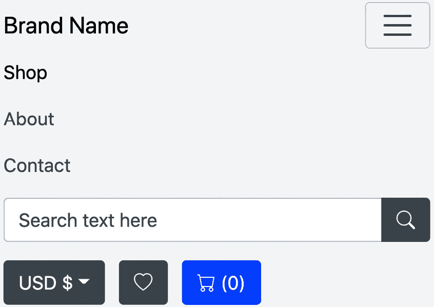
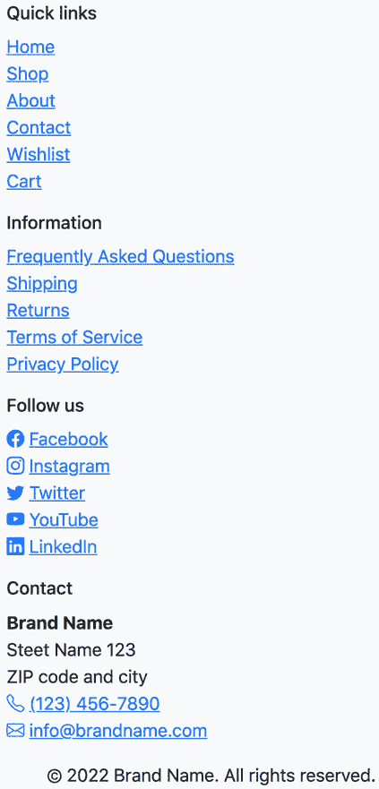
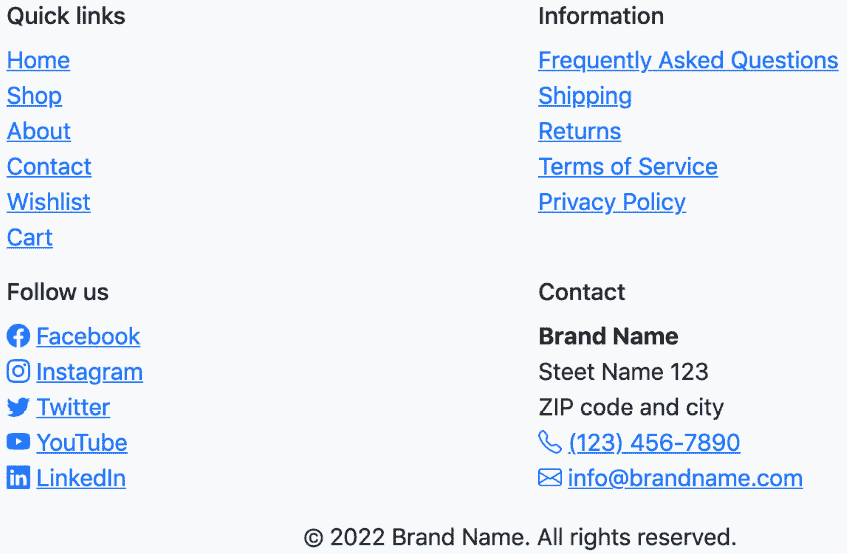
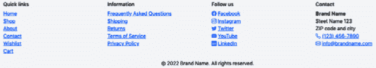
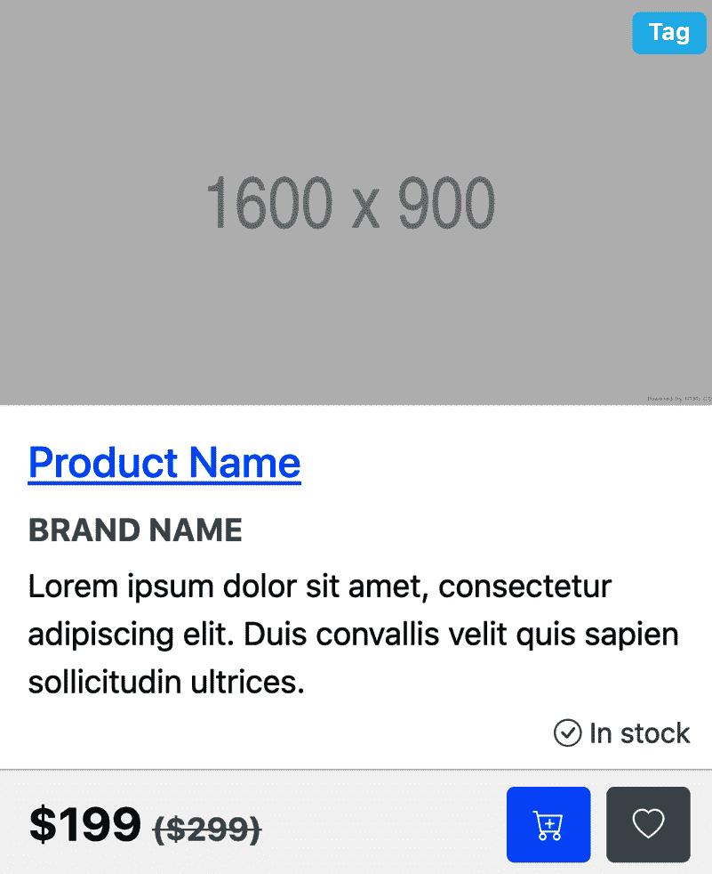
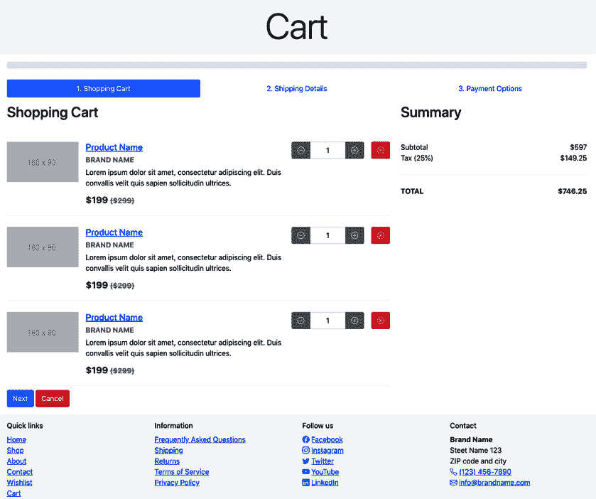
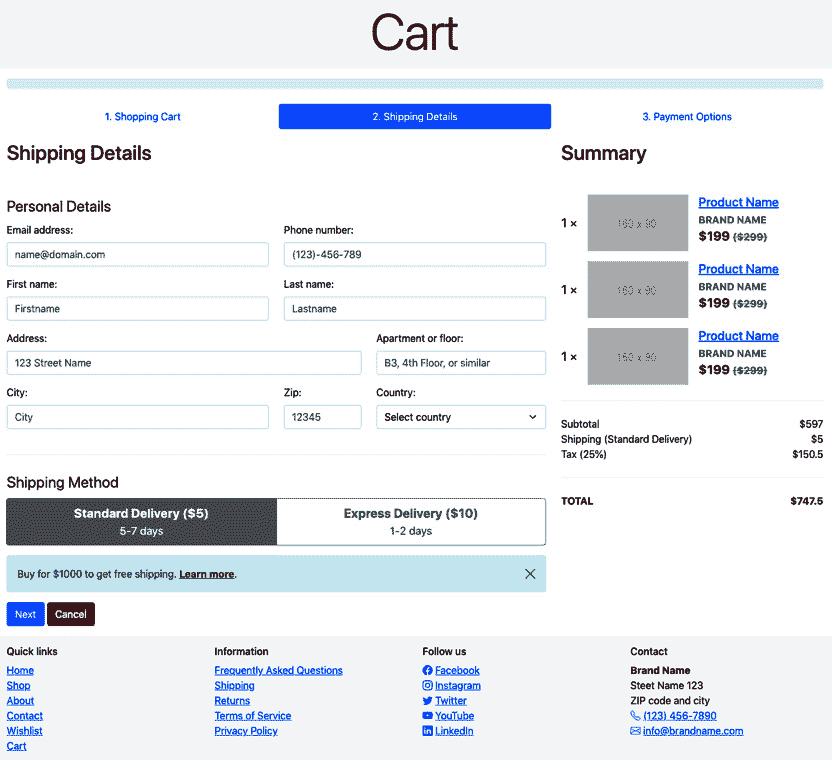
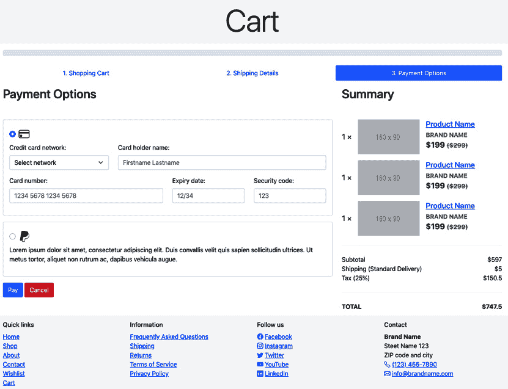
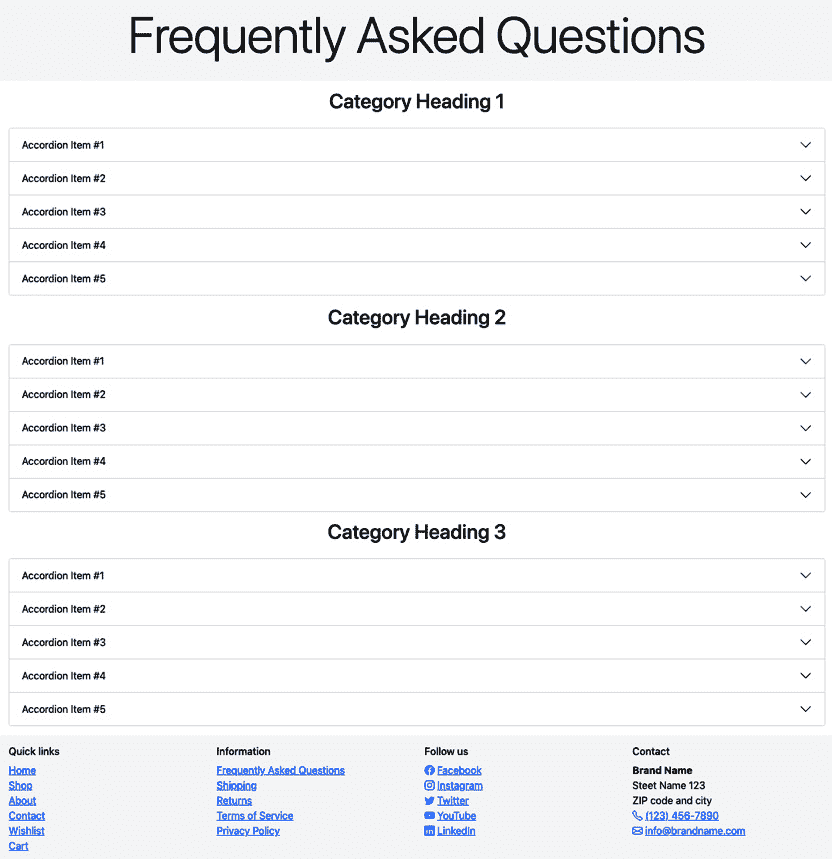

# 第七章：*第七章*: 使用默认 Bootstrap 5 元素创建网站

在本章中，我们将首先仔细看看我们将要创建的网站类型。然后，简要介绍 Bootstrap Icons，它在整个网站中被大量使用，以使其更加用户友好和视觉吸引人。之后，将描述页面设置，然后是几个在网站中使用的全局模块的截图描述，最后是每个页面类型的截图描述。

在本章中，我们将涵盖以下主要主题：

+   关于网站

+   Bootstrap Icons

+   页面设置

+   网站的全球模块

+   网站的页面类型

# 技术要求

要预览示例，你需要一个代码编辑器和浏览器。由于整个网站都是使用默认 Bootstrap 5 元素创建的，所以本章中代码示例不会很多。然而，完整网站的源代码可以在以下位置找到：

[`github.com/PacktPublishing/The-Missing-Bootstrap-5-Guide`](https://github.com/PacktPublishing/The-Missing-Bootstrap-5-Guide).

# 关于网站

该网站是一个在线商店，包含产品概述、产品详情、想要清单、购物车和结账流程等与购物相关的页面，以及更多与信息相关的内容页面。它总共有 12 个页面，其中 8 个在结构和布局上独特，剩下的 4 个使用相同的结构和布局。

该网站仅使用默认 Bootstrap 5 元素进行设计和开发，内容包含占位文本和图片。因此，网站呈现出类似线框图的外观。然而，如果你替换所有文本和图片，网站将看起来更加真实。

您可能知道，Bootstrap 5 只包含网站前端的代码。因此，所有需要与后端通信的网站高级功能都没有实现。这包括搜索功能、筛选、排序、表单提交等。在*第九章*《使用 JavaScript 提高网站交互功能》中，我们将使用一些自定义 JavaScript 扩展基本功能，使网站更加交互和用户友好。

## 网站地图

下面是构成网站及其相互关系的页面概述。所有页面的描述将在本章后面进行：

+   首页

+   商店 => 产品

+   关于

+   联系方式

+   想要清单

+   购物车

+   常见问题解答

+   配送

+   退货

+   服务条款

+   隐私政策

如您所见，只有商店和产品页面具有父子关系。所有其他页面都位于顶级。

# Bootstrap Icons

Bootstrap Icons 是由 Bootstrap 团队创建的免费、高质量的开源库。它可以与或没有 Bootstrap 一起使用，并且可以作为 SVG、SVG 精灵或网络字体使用。这个库的第一个 alpha 版本于 2019 年 11 月 26 日发布。最新版本，v1.8.3，于 2022 年 5 月 25 日发布，现在包含超过 1600 个图标可供选择。

Bootstrap Icons 可以在以下 URL 访问：[`icons.getbootstrap.com/`](https://icons.getbootstrap.com/)。

从那里，你可以以不同的方式下载和安装它。我选择使用网络字体实现，这使得直接将图标添加到 HTML 代码中变得非常快速。要添加一个图标，你只需使用以下代码：

```js
<i class="bi-[Icon name]"></i>
```

这里，`[图标名称]`指的是一个图标的名称，例如`alarm`，因此它变成了以下形式：

```js
<i class="bi-alarm"></i>
```

这将在页面上显示以下图标：


图 7.1 – 警报图标

当使用图标作为网络字体时，颜色和大小可以像文本一样设置，例如，使用 Bootstrap 5 实用类。

在下一节中，你可以看到 Bootstrap Icons CSS 文件是如何在每页的`<head>`标签中链接的。

# 页面设置

大多数页面的基本设置如下所示：

```js
<!DOCTYPE html>
```

```js
<html>
```

```js
  <head>
```

```js
    <meta charset="utf-8">
```

```js
    <meta name="viewport" content="width=device-width, 
```

```js
      initial-scale=1">
```

```js
    <title>[Page title]</title>
```

```js
    <link rel="stylesheet" href="../../../
```

```js
      bootstrap/dist/css/bootstrap.min.css">
```

```js
    <link rel="stylesheet" href="../../../
```

```js
      bootstrap-icons/font/bootstrap-icons.css">
```

```js
  </head>
```

```js
  <body>
```

```js
    <header>[Header]</header>
```

```js
    <div>[Page title]</div>
```

```js
    <div class="container">
```

```js
      <!-- Various sections -->
```

```js
      <section></section>
```

```js
      <section></section>
```

```js
      <section></section>
```

```js
    </div>
```

```js
    <footer>[Footer]</footer>
```

```js
    <script src="../../../bootstrap/dist/js/
```

```js
      bootstrap.bundle.min.js"></script>
```

```js
  </body>
```

```js
</html>
```

这是一个非常基础的 Bootstrap 5 实现。在`<head>`标签内，我们首先看到定义字符集的`<meta>`标签，然后是响应式元标签：

```js
<meta name="viewport" content="width=device-width, initial-scale=1">
```

然后是`<title>`标签中的页面标题，以及指向压缩后的 Bootstrap 5 CSS 文件和 Bootstrap Icons CSS 文件的链接。

在`<body>`标签内，我们可以看到大多数页面的基本页面结构，首先是头部模块，然后是页面标题模块，`.container`内的各种部分，接着是页脚模块。最后，在关闭`</body>`标签之前，我们看到一个`<script>`标签，其中`src`指向的是捆绑和压缩后的 Bootstrap 5 JavaScript 文件。

# 全局模块

在我们浏览所有不同页面类型之前，我们将看到哪些全局模块被用于多个页面类型。

在接下来的描述中，任何正在使用的 Bootstrap 5 组件都会像这样突出显示：**组件名称**。术语*模块*指的是页面的一部分，与 Bootstrap 5 无关。

## 标题

这个全局模块用于所有页面类型。它位于每个页面的顶部，用于主要导航。它使用`lg`创建。

这里有三张模块的截图，分别显示在手机、平板和桌面设备上：


图 7.2 – 移动设备上的关闭菜单的头部模块



图 7.3 – 移动设备上的关闭菜单的头部模块


图 7.4 – 平板设备上的头部模块


图 7.5 – 桌面设备上的头部模块

模块的左侧包含两个元素。首先，品牌名称，然后是主菜单，包含链接到最重要的页面。活动页面将在菜单中突出显示。

模块的右侧包含三个元素。首先，一个创建为简单表单的搜索字段，使用 **输入组** 组件。它旨在用于网站所有内容和产品的全局搜索。然后，一个货币选择器来更改商店使用的货币。它使用 **下拉** 组件创建。最后，一个行动号召部分，包含两个分别用于心愿单和购物车的按钮样式链接。

## 页脚

此全局模块用于所有页面类型。它位于每个页面的底部，主要用于次要导航。它包含来自标题模块的所有链接，在 `sm` 断点下，以及 `lg` 断点下的四列网格。

在下面的图中，您将看到模块在移动、平板和桌面设备上的三个截图：



图 7.6 – 移动设备上的页脚模块



图 7.7 – 平板设备上的页脚模块



图 7.8 – 桌面设备上的页脚模块

前三个列包含一个标题，后面跟着一个未加样式的无序列表链接，在第三列，链接文本前面有一个图标。最后一列包含一个 `<address>` 元素内的基本联系信息。在这个模块的底部中央是一个居中的版权声明。

## 页面标题

此全局模块用于所有页面类型，除了主页和产品页。它位于标题模块之后，简单地显示在浅灰色背景上的居中标题。

该模块唯一的响应式行为是响应式字体大小，这是 Bootstrap 5 的默认功能。

这里是模块在移动、平板和桌面设备上的三个截图：


图 7.9 – 移动设备上的页面标题模块


图 7.10 – 平板设备上的页面标题模块


图 7.11 – 桌面设备上的页面标题模块

我们现在已经看到了页面标题全局模块的外观，接下来，我们将查看产品卡片全局模块。

## 产品卡片

此全局模块在主页、商店页面、产品页面和愿望单页面上的响应式网格系统中使用。它是一个**卡片**组件，包含产品图片、**徽章**组件用于标签、产品名称、品牌名称、描述、库存状态、定价信息和行动号召按钮。

此模块的唯一响应式行为是响应式字体大小，这是 Bootstrap 5 的默认功能。

这里是移动设备上看到的模块截图：



图 7.12 – 移动设备上的产品卡片模块

在愿望单页面，**添加到愿望单**按钮被**从愿望单移除**按钮所替代。

# 页面类型

这里是所有不同页面类型的描述。共有九种不同的页面类型用于创建 12 个不同的页面。其中八个只使用了一次，最后一个，文章页面，使用了四次。

## 主页（index.xhtml）

这是在线商店的主页。在此页面上，用户可以看到英雄部分、了解优点、探索集合、查看热门产品和注册新闻通讯。

这里是桌面设备上看到的完整页面的截图：

.jpg)

.png)

图 7.13 – 桌面设备上的主页

此页面的`<body>`标签中的整体代码结构如下。不同的模块已被替换为[模块名称]并在之后进一步描述（除了之前章节中已描述的页眉和页脚）：

part-2/chapter-7/website/index.xhtml

```js
<body>
```

```js
  [Header]
```

```js
  [Hero]
```

```js
  <div class="container">
```

```js
    [Benefits]
```

```js
    [Collections]
```

```js
    [Popular products]
```

```js
  </div>
```

```js
  [Newsletter]
```

```js
  [Footer]
```

```js
  [Modal]
```

```js
  <script src="../../../bootstrap/dist/js/
```

```js
    bootstrap.bundle.min.js"></script>
```

```js
</body>
```

### 英雄

此模块是对在线商店的简要介绍，它由一个图片、一个显示标题、一个引言段落和两个行动号召按钮组成。此布局中的元素最初是堆叠的，然后对于`lg`断点及以上变为两列网格。

### 优点

此模块由一个图片、一个标题和一个段落组成。布局是通过使用响应式嵌套网格创建的，其中所有内容最初都是堆叠的。在`sm`断点处，内部网格变为两列，而在`lg`断点处，外部网格变为两列。

### 集合

此模块使用**轮播**组件显示不同的集合，每个幻灯片都有一个链接、图片和标题。

### 热门产品

此模块以响应式三列网格显示三个产品。每个产品都是使用之前章节中描述的产品卡片模块创建的。

### 新闻通讯

此模块由标题、三列网格布局中的表单以及触发模态的复选框标签中的链接组成。

### 模态

此模块由一个**模态**组件组成，该组件可以从之前描述的新闻模块中的链接触发。模态的内容是关于新闻通讯的信息。

## 商店 (shop.xhtml)

这是网上商店的商店页面。在此页面上，用户可以看到带有筛选器和产品列表的侧边栏，这些产品以响应式网格布局列出。在此之上，我们有一个面包屑、一个用于更改排序的控制按钮，以及用于在网格布局和列表布局之间切换产品布局的按钮。然而，对于此网站，只创建了商店页面的网格布局。在产品概述下方，我们有分页以在包含产品的各个页面之间导航。

在小于 `lg` 的断点处，筛选器包含在一个由面包屑上方的按钮触发的 Offcanvas 模块中。

下面是桌面设备上看到的完整页面的截图：

.jpg).jpg)

图 7.14 – 桌面设备上的商店页面

此页面的 `<body>` 标签中的整体代码结构如下。不同的模块已被替换为 `[模块名称]`，它们将在之后进一步描述（除了标题和页脚，它们在前一节中已描述）：

part-2/chapter-7/website/shop.xhtml

```js
<body>
```

```js
  [Header]
```

```js
  [Page title]
```

```js
  <div class="container">
```

```js
    [Offcanvas]
```

```js
    [Sorting and layout]
```

```js
    [Breadcrumb and search result]
```

```js
    <div class="row">
```

```js
      <div class="col-lg-4 col-xxl-3 d-none d-lg-block">
```

```js
        <aside class="sticky-top pt-lg-3 pb-lg-5">
```

```js
          [Filters]
```

```js
        </aside>
```

```js
      </div>
```

```js
      <div class="col-lg-8 col-xxl-9 pt-lg-3 mb-5">
```

```js
        [Products overview]
```

```js
        [Pagination]
```

```js
      </div>
```

```js
    </div>
```

```js
  </div>
```

```js
  [Footer]
```

```js
  <script src="../../../bootstrap/dist/js/
```

```js
    bootstrap.bundle.min.js"></script>
```

```js
</body>
```

### Offcanvas

此模块是使用 `lg` 断点及以上创建的。

### 排序和布局

此模块用于对产品概述进行排序和更改布局。它使用 `<select>` 元素来更改排序和 `lg`。

### 面包屑和搜索结果

此模块具有左侧的面包屑导航和右侧的搜索结果。面包屑导航是使用 **面包屑** 组件创建的。

### 筛选器

此模块包含产品概述的各种筛选选项。所有筛选器都包含在 **卡片** 组件中，而单个筛选器是使用各种表单元素创建的，例如 **开关**、复选框和 **输入组**。

### 产品概述

此模块使用产品购物车模块显示产品的响应式网格。最初，所有列都是堆叠的，然后在 `md` 断点时变为两列网格，在 `xxl` 断点时变为三列网格。

### 分页

此模块使用 **分页** 组件让用户在多个搜索结果页面之间导航。

## 产品 (product.xhtml)

此页面显示了商店导航的面包屑、产品画廊、产品详情和描述，以及相关产品和评论。此页面未使用 Bootstrap 5 组件，除了 **面包屑** 组件和 **徽章** 组件。相反，使用了大量的实用类，以及各种排版、表单元素、图像缩略图和引用块。

下面是桌面设备上看到的完整页面的截图：

.jpg).jpg)

图 7.15 – 桌面设备上的产品页面

下一个可以看到此页面的`<body>`标签中的整体代码结构。不同的模块已被替换为[模块名称]并在之后进一步描述（除了在上一节中已描述的页眉和页脚）：

part-2/chapter-7/website/product.xhtml

```js
<body>
```

```js
  [Header]
```

```js
  <div class="container mt-3 mb-5">
```

```js
    <section class="border-bottom border-2 border-light 
```

```js
      mb-4 pb-4">
```

```js
      [Breadcrumb]
```

```js
      <div class="row">
```

```js
        <div class="col-lg-6">
```

```js
          [Gallery]
```

```js
        </div>
```

```js
        <div class="col-lg-6">
```

```js
          [Details and description]
```

```js
        </div>
```

```js
      </div>
```

```js
    </section>
```

```js
    [Related products]
```

```js
    [Review]
```

```js
  </div>
```

```js
  [Footer]
```

```js
  <script src="../../../bootstrap/dist/js/
```

```js
    bootstrap.bundle.min.js"></script>
```

```js
</body>
```

### 面包屑

此模块包含一个用于导航商店的面包屑导航。它使用**面包屑**组件创建。

### 画廊

此模块包含一个使用`<figure>`元素结构化的带图注的大产品图像。下面是一个包含六个图像缩略图的三个列网格。

### 详细信息和描述

此模块包含有关产品的各种细节。它具有与产品卡片模块相同的内容，用于选择颜色和大小的不同类型的表单控件、长描述和两个行动号召按钮。

### 相关产品

此模块显示相关产品。它包含一个标题，后面跟着一个包含产品卡片模块的三列响应式网格。

### 评论

此模块显示了带有图像、姓名、日期、评分和评论本身的三个评论块。Bootstrap 5 的默认**引用块**元素通过在左上角添加 Bootstrap 图标引用图标并使用 11 个实用类（文本、浮动、间距和边框实用类）进行了增强。

## 关于（about.xhtml）

此页面展示了有关在线商店的各种信息，包括文本和图像。

这里是桌面设备上看到的完整页面的截图：

.jpg).jpg)

图 7.16 – 桌面设备上的关于页面

下一个可以看到此页面的`<body>`标签中的整体代码结构。不同的模块已被替换为[模块名称]并在之后进一步描述（除了在上一节中已描述的页眉和页脚）：

part-2/chapter-7/website/about.xhtml

```js
<body>
```

```js
  [Header]
```

```js
  [Page title]
```

```js
  <div class="container">
```

```js
    [Story]
```

```js
    [Office]
```

```js
    [Brands]
```

```js
  </div>
```

```js
  [Footer]
```

```js
  <script src="../../../bootstrap/dist/js/
```

```js
    bootstrap.bundle.min.js"></script>
```

```js
</body>
```

### 故事

此模块包含一个标题和关于在线商店故事的三个段落。

### 办公室

此模块包含一个两列响应式网格，用于显示办公室的图像。每个列都包含一个用`<figure>`包裹的图像和图注。

### 品牌

此模块显示一个响应式网格，其中包含在线商店中产品的品牌标志。初始布局是两列网格，在`sm`断点时变为三列网格，在`lg`断点时变为六列网格。

## 联系（contact.xhtml）

此页面展示了团队概述、地图上的位置和联系表单。

这里是桌面设备上看到的完整页面的截图：

.jpg).jpg)

图 7.17 – 桌面设备上的联系页面

下一个将展示此页面 `<body>` 标签中的整体代码结构。不同的模块已被替换为 `[模块名称]`，之后将对其进行进一步描述（除了在上一节中已描述的 Header 和 Footer）：

part-2/chapter-7/website/contact.xhtml

```js
<body>
```

```js
  [Header]
```

```js
  [Page title]
```

```js
  <div class="container">
```

```js
    [Team]
```

```js
    [Location]
```

```js
    [Contact form]
```

```js
  </div>
```

```js
  [Footer]
```

```js
  <script src="../../../bootstrap/dist/js/
```

```js
    bootstrap.bundle.min.js"></script>
```

```js
</body>
```

### 团队

此模块包含一个标题、一个段落和一个响应式网格，展示团队成员的图片、社交媒体网络的链接、姓名和职位。最初，布局是一个两列网格，在 `md` 断点时变为三列网格，在 `xl` 断点时变为六列网格。

### 位置

此模块包含一个嵌入的 Google Maps 地图，位于 `<iframe>` 元素中。使用比例辅助工具来保持地图的宽高比为 `21` 比 `9`。

### 联系表单

此模块包含一个标题和联系表单。联系表单的布局是通过使用响应式嵌套网格创建的，其中一切最初都是堆叠的。在 `md` 断点时，内部网格变为两列，在 `xl` 断点时，外部网格变为两列。

## 愿望单（wishlist.xhtml）

此页面显示了用户添加到愿望单中的产品。在左侧的侧边栏中，用户可以更改愿望单、创建新愿望单或一次性将所有产品添加到购物车。在主要区域中，有一个响应式网格系统，其中包含产品卡片，展示了当前愿望单上的所有产品。

下面是桌面设备上看到的完整页面的截图：

.jpg).jpg)

图 7.18 – 桌面设备上的愿望单页面

下一个将展示此页面 `<body>` 标签中的整体代码结构。不同的模块已被替换为 `[模块名称]`，之后将对其进行进一步描述（除了在上一节中已描述的 Header 和 Footer）：

part-2/chapter-7/website/wishlist.xhtml

```js
<body>
```

```js
  [Header]
```

```js
  [Page title]
```

```js
  <div class="container">
```

```js
    <div class="row">
```

```js
      <div class="col-lg-4 col-xxl-3 mb-3 mb-lg-0">
```

```js
        [Sidebar]
```

```js
      </div>
```

```js
      <div class="col-lg-8 col-xxl-9 pt-lg-3 mb-5">
```

```js
        [Products overview]
```

```js
      </div>
```

```js
    </div>
```

```js
  </div>
```

```js
  [Footer]
```

```js
  [Modal]
```

```js
  <script src="../../../bootstrap/dist/js/
```

```js
    bootstrap.bundle.min.js"></script>
```

```js
</body>
```

### 侧边栏

侧边栏模块使用 **Card** 组件包裹 **List group** 组件，显示用户的愿望单和一个创建新愿望单的按钮。当点击该按钮时，一个即将描述的模态模块（modal module）将变得可见。在卡片下方，有一个主要按钮，可以一次性将所有产品添加到购物车。

### 产品概述

这是一个使用产品卡片模块创建的响应式网格系统，用于显示当前愿望单上的产品。用户可以将产品添加到购物车，但“添加到愿望单”操作已被“从愿望单中移除”按钮所取代。

### 模态

当用户在侧边栏中点击创建新愿望单的按钮时，会触发一个 **Modal** 组件。此模态包含一个模态标题、一个关闭按钮、一个段落和一个简单的表单，带有输入组。

## 购物车（cart.xhtml）

此页面最初显示购物车，并将结账流程隐藏在标签页后面。在导航标签上方，还有一个进度条来显示结账流程的当前进度。

第一个标签页显示购物车，左侧是一个产品列表，右侧是一个总结，显示总金额。

第二个面板显示运输详情，包括个人详情表单、选择运输方式的按钮和一个信息警报。在右侧，有一个扩展的总结，包括产品列表和总金额。

第三个面板显示支付选项，左侧有一个信用卡详情表单和一个 PayPal 选项，右侧有一个扩展的总结，包括产品列表和总金额。

这里是桌面设备上整个页面的三个截图，每次显示一个标签页：



图 7.19 – 桌面设备上的购物车页面（标签 1 可见）



图 7.20 – 桌面设备上的购物车页面（标签 2 可见）



图 7.21 – 桌面设备上的购物车页面（标签 3 可见）

下一个可以看到此页面 `<body>` 标签中的整体代码结构。不同的模块已被替换为 `[模块名称]`，之后将对其进行进一步描述（除了在上一节中已描述的标题和页脚）：

part-2/chapter-7/website/cart.xhtml

```js
<body>
```

```js
  [Header]
```

```js
  [Page title]
```

```js
  <div class="container">
```

```js
    [Progress bar]
```

```js
    [Tab navigation]
```

```js
    <div class="tab-content">
```

```js
      <div id="cartTabs-pane-1" class="tab-pane fade show 
```

```js
        active" role="tabpanel" aria-labelledby=
```

```js
        "cartTabs-1">
```

```js
        <div class="row mb-5">
```

```js
          <div class="col-xl-8 mb-5 mb-xl-0">
```

```js
            [Shopping cart]
```

```js
          </div>
```

```js
          <div class="col-xl-4">
```

```js
            [Summary]
```

```js
          </div>
```

```js
        </div>
```

```js
      </div>
```

```js
      <div id="cartTabs-pane-2" class="tab-pane fade" 
```

```js
        role="tabpanel" aria-labelledby="cartTabs-2">
```

```js
        <div class="row mb-5">
```

```js
          <div class="col-xl-8 mb-5 mb-xl-0">
```

```js
            [Shipping details]
```

```js
          </div>
```

```js
          <div class="col-xl-4">
```

```js
            [Summary]
```

```js
          </div>
```

```js
        </div>
```

```js
      </div>
```

```js
      <div id="cartTabs-pane-3" class="tab-pane fade" 
```

```js
        role="tabpanel" aria-labelledby="cartTabs-3">
```

```js
        <div class="row mb-5">
```

```js
          <div class="col-xl-8 mb-5 mb-xl-0">
```

```js
            [Payment options]
```

```js
          </div>
```

```js
          <div class="col-xl-4">
```

```js
            [Summary]
```

```js
          </div>
```

```js
        </div>
```

```js
      </div>
```

```js
    </div>
```

```js
  </div>
```

```js
  [Footer]
```

```js
  <script src="../../../bootstrap/dist/js/
```

```js
    bootstrap.bundle.min.js"></script>
```

```js
</body>
```

### 进度条

此模块显示结账流程的当前进度。它使用 `0` 创建。当它从 `1`-`100` 的正数改变时，进度条将以主要颜色显示，并带有条纹和动画效果。

### 标签导航

此模块显示结账流程的三个步骤，每个标签页都有一个数字和标题。可以使用标签来更改可见的面板。该模块使用 `.nav-pills` 变体创建，将导航标签从标签更改为药丸形状。

### 购物车

此模块放置在第一个标签页的左侧，并显示购物车和产品列表。可以使用**输入组**组件更改每个产品的数量，也可以从购物车中删除产品。在最底部，用户可以进入下一个标签页或取消。

### 运输详情

此模块放置在第二个面板的左侧，并显示运输详情。首先，有一个使用响应式网格系统排列的个人详情表单，然后是一个**按钮组**组件，带有单选按钮，用于在两种不同的运输方式之间切换。下面有一个使用**Alert**组件创建的关于免费运输的信息警报。在最底部，用户可以进入下一个标签页或取消。

### 支付选项

此模块放置在第三个面板的左侧，显示支付选项。用户可以使用两个单选按钮在两种支付选项之间进行选择。首先，有一个信用卡详情表单，采用响应式网格系统布局，下面是 PayPal 选项。在最底部，用户可以选择支付或取消。

### 摘要

此模块在三个面板中都被使用。在第一个面板中，它只包含关于总金额的信息，而在第二个和第三个面板中，它还包含购物车中的产品列表。

## 常见问题（faq.xhtml）

本页面展示了三个部分，每个部分都有一个标题，后面跟着一个包含常见问题和答案的折叠面板。

下面是桌面设备上完整页面的截图：



图 7.22 – 桌面设备上的常见问题页面

下一个将展示此页面 `<body>` 标签中的整体代码结构。不同的模块已被替换为 `[模块名称]`，之后将对其进行进一步描述（除了在上一节中已描述的页眉和页脚）：

part-2/chapter-7/website/faq.xhtml

```js
<body>
```

```js
  [Header]
```

```js
  [Page title]
```

```js
  <div class="container">
```

```js
    [Accordion]
```

```js
    [Accordion]
```

```js
    [Accordion]
```

```js
  </div>
```

```js
  [Footer]
```

```js
  <script src="../../../bootstrap/dist/js/
```

```js
    bootstrap.bundle.min.js"></script>
```

```js
</body>
```

### 折叠面板

此模块由一个标题和一个**折叠面板**组件组成。每个折叠面板项包含折叠面板标题中的常见问题及其在折叠面板主体中的相应答案。一次只能展开一个折叠面板项。

## 文章页面（shipping.xhtml、returns.xhtml、terms-of-service.xhtml 和 privacy-policy.xhtml）

本页面展示了以文章形式呈现的通用信息。它有一个固定在左侧的侧边栏，包含页面导航，以及包含各种排版元素、图片和表格的主区域。

下面是桌面设备上完整页面的截图：

.jpg).jpg)

图 7.23 – 桌面设备上的文章页面

下一个将展示此页面 `<body>` 标签中的整体代码结构。不同的模块已被替换为 `[模块名称]`，之后将对其进行进一步描述（除了在上一节中已描述的页眉和页脚）：

part-2/chapter-7/website/shipping.xhtml

part-2/chapter-7/website/returns.xhtml

part-2/chapter-7/website/terms-of-service.xhtml

part-2/chapter-7/website/privacy-policy.xhtml

```js
<body>
```

```js
  [Header]
```

```js
  [Page title]
```

```js
  <div class="container">
```

```js
    <div class="row">
```

```js
      <div class="col-lg-3 mb-3 mb-lg-0">
```

```js
        [Page navigation]
```

```js
      </div>
```

```js
      <div class="col-lg-9 pt-lg-3">
```

```js
        [Article]
```

```js
      </div>
```

```js
    </div>
```

```js
  </div>
```

```js
  [Footer]
```

```js
  <script src="../../../bootstrap/dist/js/
```

```js
    bootstrap.bundle.min.js"></script>
```

```js
</body>
```

### 页面导航

页面导航是通过一个**卡片**组件和一个内部的**列表组**组件创建的。它使用位置辅助工具使其固定。它还使用**滚动侦听器**组件来突出显示当前正在滚动的部分。

### 文章

文章包含各种排版元素：引言段落、不同的标题、常规段落、链接、无序列表、有序列表、图片和表格。

# 摘要

在本章中，我们首先简要介绍了为本书创建的网站项目，包括对网站地图的概述。然后，我们学习了如何使用 Bootstrap 图标使网站更具用户友好性和视觉吸引力。

本章的其余部分致力于概述正在使用的不同全局模块和页面类型，包括描述每个页面所使用的所有不同模块以及它们是如何仅使用默认的 Bootstrap 5 组件创建的。这还补充了在桌面设备上看到的所有页面的截图。

在下一章中，我们将使用 Sass 自定义我们网站的视觉风格。
