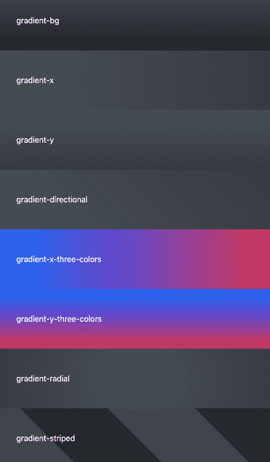
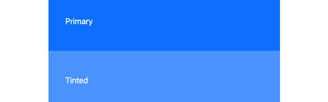
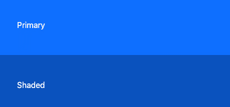
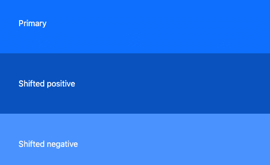
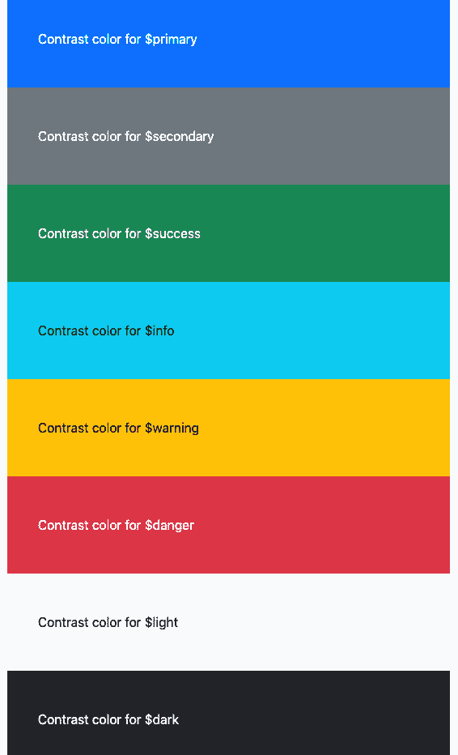
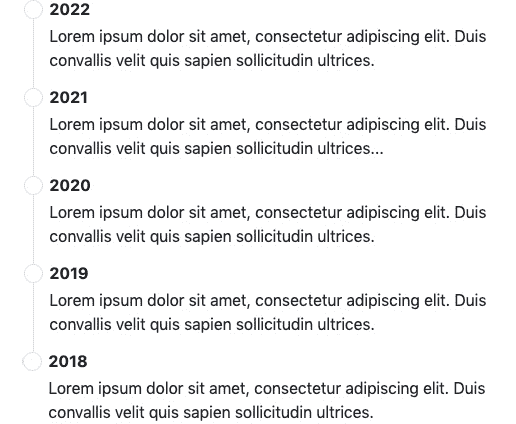
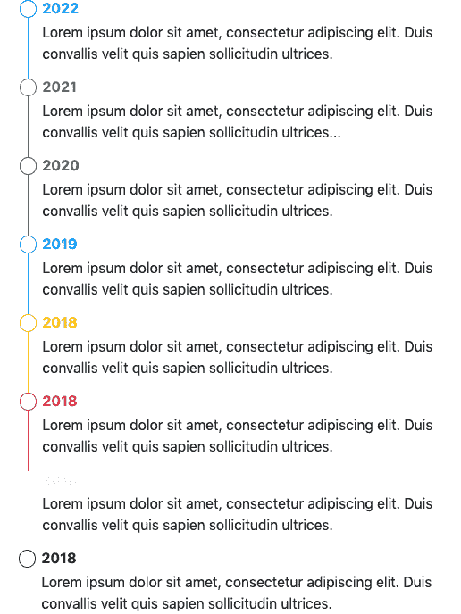
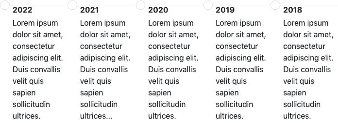
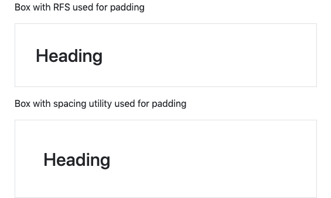
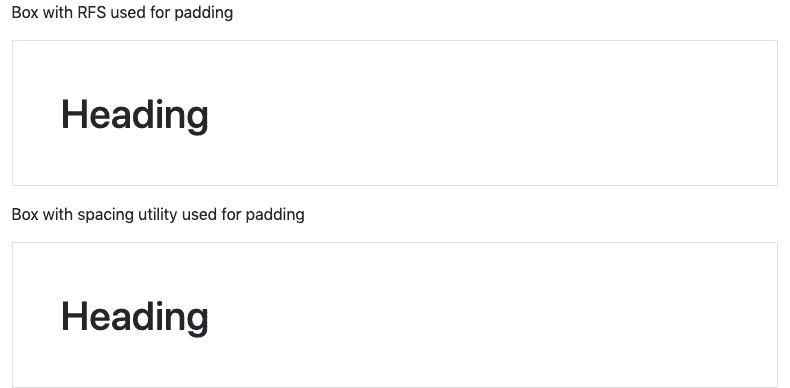

# 第十章：*第十章*：使用 Bootstrap 5 和高级 Sass 及 CSS 功能

在本章中，我们将探讨与 Bootstrap 5 相关的高级 Sass 和 CSS 功能。在前几章中，我们定制了网站的外观和感觉，但这次我们将主要改变编写代码的方式，而不会影响外观和感觉。此外，我们还将通过一些独立的示例来查看各种其他功能。

我们首先将了解如何使用各种 Bootstrap 5 Sass 混合以不同的方式编写代码，之后，我们将看到一些 Bootstrap 5 Sass 函数的示例。

然后，我们将看到如何利用 Sass 的扩展功能来处理语义化 HTML 并创建自定义组件。

之后，我们将了解创建自定义组件的最佳和推荐方法，使用 Bootstrap 5 变量、混合和函数。

在本章的末尾，我们将看到如何利用 Bootstrap 5 带来的 CSS 自定义属性来创建深色主题，并定制组件和辅助工具。

最后，我们将探讨 Bootstrap 的侧项目 RFS，并学习如何使用它来计算自动响应式 CSS 值。

在本章中，我们将涵盖以下主要主题：

+   使用 Bootstrap 5 Sass 混合

+   使用 Bootstrap 5 Sass 函数

+   扩展 Bootstrap 5 类以实现语义化 HTML

+   扩展 Bootstrap 5 类以创建自定义组件

+   使用 Bootstrap 5 变量、混合和函数创建自定义组件

+   使用 Bootstrap 5 CSS 自定义属性

+   使用 RFS Sass 插件

如前所述，对于这些主题中的某些，我们将更新网站的部分代码，而对于其他主题，我们只会看到与该主题相关的独立示例。

# 技术要求

+   为了预览这些示例，您需要一个代码编辑器和浏览器。所有代码示例的源代码都可以在这里找到：[`github.com/PacktPublishing/The-Missing-Bootstrap-5-Guide`](https://github.com/PacktPublishing/The-Missing-Bootstrap-5-Guide)

+   要将 Sass 编译为 CSS，您需要以下之一：

    +   **Node.js**，如果您更喜欢使用终端（Mac）或命令提示符（Windows）的**命令行界面**（**CLI**）

    +   **Scout-App**，如果您更喜欢**图形用户界面**（**GUI**）

    +   **Visual Studio Code**，如果您更喜欢使用 Visual Studio Code 市场上的扩展

所有这些方法都在*第二章**，使用和编译 Sass*中进行了解释。

# 使用 Bootstrap 5 Sass 混合

Bootstrap 5 包含许多 Sass 混合。其中一些被 Bootstrap 5 的其他部分使用，而少数则没有。所有这些都可以在您的 Sass 代码中使用。在本节中，我们将首先概述 Bootstrap 5 中包含的各种混合，它们的作用以及它们如何与其他 Bootstrap 5 代码相关。然后，我们将看到如何使用这些混合的一些不同示例。

## 混合概述

在`mixins`文件夹中，我们总共有 25 个文件，这些都是 Sass 部分。以下是这些文件的概述，包括关于 Bootstrap 5 中哪些元素（组件、助手或其他）使用了这些混入（如果有的话）的注释：

bootstrap/scss/mixins

```js
_alert.scss // Alerts
```

```js
_backdrop.scss // Modal, Offcanvas
```

```js
_border-radius.scss // Used by many
```

```js
_box-shadow.scss // Used by many
```

```js
_breakpoints.scss // Used by many
```

```js
_buttons.scss // Buttons
```

```js
_caret.scss // Dropdowns
```

```js
_clearfix.scss // Carousel, Clearfix
```

```js
_color-scheme.scss // Not used
```

```js
_container.scss // Container
```

```js
_deprecate.scss // Not used
```

```js
_forms.scss // Validation
```

```js
_gradients.scss // 1 used by many, 7 not being used
```

```js
_grid.scss // Grid
```

```js
_image.scss // Images
```

```js
_list-group.scss // List group
```

```js
_lists.scss // Typography, Pagination
```

```js
_pagination.scss // Pagination
```

```js
_reset-text.scss // Popovers, Tooltips
```

```js
_resize.scss // Not used
```

```js
_table-variants.scss // Tables
```

```js
_text-truncate.scss // Text truncation
```

```js
_transition.scss // Used by many
```

```js
_utilities.scss // Utility API
```

```js
_visually-hidden.scss // Visually hidden
```

现在，我们将看到如何根据它们的用法以三种不同的方式将这些混入分组。

## 依赖于全局选项的混入

一些混入（mixins）依赖于我们在*第四章*中学习到的全局选项，即 Bootstrap 5 全局选项和颜色。因此，只有当特定选项被启用时，这些混入才会返回代码：

```js
_border-radius.scss: @mixin border-radius
```

```js
_box-shadow.scss: @mixin box-shadow
```

```js
_caret.scss: @mixin caret
```

```js
_deprecate.scss: @mixin deprecate
```

```js
_forms.scss: @mixin form-validation-state
```

```js
_gradients.scss: @mixin gradient-bg
```

```js
_transition.scss: @mixin transition
```

## 未使用的混入

一些混入实际上没有被其他 Bootstrap 5 代码使用。我们将在本节稍后看到一些这些混入的用途：

```js
_color-scheme.scss: @mixin color-scheme
```

```js
_gradients.scss: @mixin gradient-x, @mixin gradient-y, @mixin gradient-directional, @mixin gradient-x-three-colors, @mixin gradient-y-three-colors, and @mixin gradient-radial
```

```js
_resize.scss: @mixin resizable
```

## 用于变体的混入

一些混入用于创建 Bootstrap 5 组件的不同变体。这可能是针对上下文颜色、大小和断点特定行为的变体：

```js
_alert.scss: @mixin alert-variant
```

```js
_buttons.scss: @mixin button-variant, @mixin button-outline-variant, and @mixin button-size
```

```js
_list-group.scss: @mixin list-group-item-variant
```

```js
_pagination.scss: @mixin pagination-size
```

```js
_table-variants.scss: @mixin table-variant
```

## 示例

我们现在将看到一些示例，展示我们如何在我们的代码中使用一些混入。我们不会使用这些混入更新我们的网站，而是查看一些独立的示例。

### 响应式网格系统

在本例中，我们将创建一个响应式网格系统，包括一个容器，使用各种混入。

对于此示例，我们使用了以下仅使用默认 HTML 元素且不包含类的语义 HTML：

part-3/chapter-10/examples/mixins/responsive-grid-system/index.xhtml

```js
<!DOCTYPE html>
```

```js
<html>
```

```js
  <head>
```

```js
    <meta charset="utf-8">
```

```js
    <meta name="viewport" content="width=device-width, 
```

```js
      initial-scale=1">
```

```js
    <title>Container and Grid Mixins</title>
```

```js
    <link rel="stylesheet" href="css/style.css">
```

```js
  </head>
```

```js
  <body>
```

```js
    <header>Header</header>
```

```js
    <main>
```

```js
      <nav>Nav</nav>
```

```js
      <article>Article</article>
```

```js
      <aside>Aside</aside>
```

```js
    </main>
```

```js
    <footer>Footer</footer>
```

```js
  </body>
```

```js
</html>
```

现在，我们首先将一个容器添加到`<body>`元素中。当使用混入时，它将创建一个流体容器，这就是我们在示例中将使用的。它需要一些额外的自定义代码来创建与默认`.container`类在不同断点上的不同`max-width`实例相同的行为。

在添加容器后，我们将使用`<main>`元素作为行和`<nav>`、`<article>`和`<aside>`元素作为列创建一个简单的响应式网格。我们不会向`<header>`和`<footer>`添加任何混入。

此示例所需的 Sass 代码如下：

part-3/chapter-10/examples/mixins/responsive-grid-system/scss/style.scss

```js
// Bootstrap 5
```

```js
@import "../../../../../../bootstrap/scss/bootstrap.scss";
```

```js
body {
```

```js
  @include make-container();
```

```js
}
```

```js
main {
```

```js
  @include make-row();
```

```js
}
```

```js
nav {
```

```js
  @include make-col-ready();
```

```js
  @include media-breakpoint-up(lg) {
```

```js
   @include make-col(3);
```

```js
  }
```

```js
}
```

```js
article {
```

```js
  @include make-col-ready();
```

```js
  @include media-breakpoint-up(lg) {
```

```js
    @include make-col(6);
```

```js
  }
```

```js
}
```

```js
aside {
```

```js
  @include make-col-ready();
```

```js
  @include media-breakpoint-up(lg) {
```

```js
    @include make-col(3);
```

```js
  }
```

```js
}
```

当这个示例在浏览器中查看时，我们将看到页面的布局现在正在使用一个容器和一个响应式网格系统。

### 断点媒体查询

在此示例中，我们将更详细地查看用于断点的媒体查询混入。在`_breakpoints.scss`文件中，我们将找到四个混入和四个函数，其中三个函数主要被这些混入使用，一个函数`breakpoint-infix()`被其他文件中的各种组件使用。现在，我们将专注于混入。

以下是各种断点媒体查询混入的概述，以及它们所做简短描述：

```js
media-breakpoint-up($name, $breakpoints: $grid-breakpoints)
```

+   对于具有最小断点宽度的视口大小

+   由`$name`参数指定的断点

+   传递给混入的内容块将被应用于指定的断点宽度及其更宽的范围

+   对于最小的断点没有媒体查询

```js
media-breakpoint-down($name, $breakpoints: $grid-breakpoints)
```

+   对于最大断点宽度的视口大小

+   由 `$name` 参数指定的断点

+   传递给混入函数的内容块将应用于指定的断点宽度和更窄的宽度

```js
media-breakpoint-between($lower, $upper, $breakpoints: $grid-breakpoints)
```

+   对于跨越多个断点宽度的视口大小

+   由 `$lower` 和 `$upper` 参数指定的断点

+   传递给混入函数的内容块将应用于指定的下限和上限断点宽度之间

```js
media-breakpoint-only($name, $breakpoints: $grid-breakpoints)
```

+   对于介于最小和最大断点宽度之间的视口大小

+   由 `$name` 参数指定的断点

+   传递给混入函数的内容块将仅在指定的断点最小和最大宽度之间应用

`$breakpoints` 参数是一个可选参数，默认值为 `$grid-breakpoints`。这意味着它将使用 `$grid-breakpoints` 映射中定义的断点宽度。

要查看这些混入函数的实际效果，这里有一个示例，它最初隐藏一些元素，然后使用不同的混入函数显示它们。首先，这是示例的 HTML 代码，我们使用了 `.up`、`.down`、`.between` 和 `.only` 类，这些类将作为我们的 Sass 中的选择器使用：

part-3/chapter-10/examples/mixins/media-queries-for-breakpoints/index.xhtml

```js
<!DOCTYPE html>
```

```js
<html>
```

```js
  <head>
```

```js
    <meta charset="utf-8">
```

```js
    <meta name="viewport" content="width=device-width, 
```

```js
      initial-scale=1">
```

```js
    <title>Media queries for breakpoints</title>
```

```js
    <link rel="stylesheet" href="css/style.css">
```

```js
  </head>
```

```js
  <body class="p-4">
```

```js
    <div class="up">@include media-breakpoint-up(lg): 
```

```js
      Visible on breakpoint sizes lg, xl and xxl</div>
```

```js
    <div class="down">@include media-breakpoint-down(md): 
```

```js
      Visible on breakpoint sizes xs and sm</div>
```

```js
    <div class="between">@include media-breakpoint-
```

```js
      between(md, xl): Visible on breakpoint size md and 
```

```js
      lg</div>
```

```js
    <div class="only">@include media-breakpoint-only(sm): 
```

```js
      Visible on breakpoint size sm</div>
```

```js
  </body>
```

```js
</html>
```

以下是 Sass 代码，其中我们最初隐藏所有元素，然后使用各种混入函数显示它们：

part-3/chapter-10/examples/mixins/media-queries-for-breakpoints/scss/style.scss

```js
// Bootstrap 5
```

```js
@import "../../../../../../bootstrap/scss/bootstrap.scss";
```

```js
.up {
```

```js
  display: none;
```

```js
  @include media-breakpoint-up(lg) {
```

```js
    display: block;
```

```js
  };
```

```js
}
```

```js
.down {
```

```js
  display: none;
```

```js
  @include media-breakpoint-down(md) {
```

```js
    display: block;
```

```js
  };
```

```js
}
```

```js
.between {
```

```js
  display: none;
```

```js
  @include media-breakpoint-between(md, xl) {
```

```js
    display: block;
```

```js
  };
```

```js
}
```

```js
.only {
```

```js
  display: none;
```

```js
  @include media-breakpoint-only(sm) {
```

```js
    display: block;
```

```js
  };
```

```js
}
```

如果你在一个浏览器中查看这个示例并调整窗口大小，你会看到 `<div>` 元素仅在特定的断点可见。

### 辅助函数

在此示例中，我们将使用两个辅助混入函数。我们将使用视觉隐藏混入函数用于标题元素，以及文本截断混入函数用于段落元素。此示例的 HTML 代码如下：

part-3/chapter-10/examples/mixins/helpers/index.xhtml

```js
<!DOCTYPE html>
```

```js
<html>
```

```js
  <head>
```

```js
    <meta charset="utf-8">
```

```js
    <meta name="viewport" content="width=device-width, 
```

```js
      initial-scale=1">
```

```js
    <title>Helper Mixins</title>
```

```js
    <link rel="stylesheet" href="css/style.css">
```

```js
  </head>
```

```js
  <body>
```

```js
    <h1>Title for screen readers</h1>
```

```js
    <p>Lorem ipsum dolor sit amet, consectetur adipiscing 
```

```js
       elit. Duis convallis velit quis sapien sollicitudin 
```

```js
       ultrices. Ut metus tortor, aliquet non rutrum ac, 
```

```js
       dapibus vehicula augue. Etiam congue erat sem, vitae 
```

```js
       gravida nunc pretium vitae. Fusce sed ex tellus. 
```

```js
       Quisque auctor viverra feugiat. Nulla urna odio, 
```

```js
       porta ut tristique ut, consequat non dolor. Etiam 
```

```js
       varius maximus dolor, at consectetur lectus. Mauris 
```

```js
       rutrum aliquet tellus, sed convallis diam.</p>
```

```js
  </body>
```

```js
</html>
```

用于此示例的 Sass 代码如下所示：

part-3/chapter-10/examples/mixins/helpers/scss/style.scss

```js
// Bootstrap 5
```

```js
@import "../../../../../../bootstrap/scss/bootstrap.scss";
```

```js
h1 {
```

```js
  @include visually-hidden();
```

```js
}
```

```js
p {
```

```js
  @include text-truncate();
```

```js
}
```

当这个示例在浏览器中查看时，标题元素现在将不会在屏幕上显示，但对屏幕阅读器可见，而段落将只有一行文本，文本在末尾被截断，后面跟着省略号。

### 深色主题

在此示例中，我们将看到如何使用颜色方案混入函数定义深色主题（也称为暗模式）。当用户在浏览器或操作系统中开启 *暗模式* 浏览时，混入函数是有效的。颜色方案混入函数目前在 Bootstrap 5 中尚未使用，但仍然提供给我们使用。在 Bootstrap 5 的下一个小版本 v5.3.0 中，Bootstrap 将支持 *暗模式*，届时混入函数可能会在 Sass 代码的各个元素中使用。在此之前，我们将为 *暗模式* 创建自己的深色主题。

混入函数的源代码如下所示：

bootstrap/scss/mixins/_color-scheme.scss

```js
@mixin color-scheme($name) {
```

```js
  @media (prefers-color-scheme: #{$name}) {
```

```js
    @content;
```

```js
  }
```

```js
}
```

如您所见，我们向混入传递了颜色主题的名称（在这种情况下是*dark*），然后是它内部的全部 CSS 规则。然后，这些规则被放置在一个媒体查询中，名称被用作媒体特性`prefers-color-scheme: #{$name}`的值。

现在，我们将使用混入为我们的网站创建一个深色主题。在混入内部，我们将添加各种 CSS 规则以针对我们想要颜色变化的元素。基本上，我们希望亮色变暗，暗色变亮。我们的代码如下所示：

part-3/chapter-10/website/scss/_custom-styles.scss 行 22-51

```js
// Dark color theme
```

```js
@include color-scheme(dark) {
```

```js
  // Body color
```

```js
  body {
```

```js
    background-color: $dark;
```

```js
    color: $light;
```

```js
  }
```

```js
  // Color utilities
```

```js
  .bg-light {
```

```js
    background-color: $dark !important;
```

```js
  }
```

```js
  .bg-dark {
```

```js
    background-color: $gray-700 !important;
```

```js
  }
```

```js
  // Components
```

```js
  .accordion-button,
```

```js
  .accordion-item,
```

```js
  .card,
```

```js
  .list-group-item {
```

```js
    background-color: $dark;
```

```js
  }
```

```js
  .accordion-button,
```

```js
  .breadcrumb-item.active,
```

```js
  .figure-caption,
```

```js
  .list-group-item,
```

```js
  .navbar-light .navbar-brand,
```

```js
  .navbar-light .navbar-nav .nav-link {
```

```js
    color: $light;
```

```js
  }
```

```js
}
```

如前述代码所示，我们首先为`<body>`元素定义了一些基础颜色。然后，我们使用`!important`规则覆盖了亮色和暗色的背景颜色工具，因为默认情况下工具类具有`!important`规则。最后，我们覆盖了具有亮色背景或暗色文字颜色的组件。

深色主题在浏览器中查看我们更新的网站（本章代码中的`website`文件夹）时可以清晰地看到所有细节，以下是主页的截图：

.jpg).jpg)

图 10.1 – 带有深色主题的网站主页

您可能想尝试其他亮色和暗色来为深色主题进行实验，但这是使用的方法。

### 渐变

在本例中，我们将看到如何使用各种渐变混入。根据具体的渐变混入，可以指定各种参数，包括颜色、程度、角度和停止点。在我们的例子中，我们将仅使用默认混入参数和一些颜色工具，以便更好地查看这些渐变。

在本例的 HTML 中，我们有一些添加了大小和颜色工具的`<div>`元素。请注意，我们已将背景颜色添加到第一个和最后一个示例中，因为那些渐变默认是白色的。我们还添加了混入的名称作为类和`<div>`元素的文本，这个类将在我们的 Sass 代码中使用。首先，这是 HTML 代码：

part-3/chapter-10/examples/mixins/gradients/index.xhtml

```js
<!DOCTYPE html>
```

```js
<html>
```

```js
  <head>
```

```js
    <meta charset="utf-8">
```

```js
    <meta name="viewport" content="width=device-width, 
```

```js
      initial-scale=1">
```

```js
    <title>Gradient Mixins</title>
```

```js
    <link rel="stylesheet" href="css/style.css">
```

```js
  </head>
```

```js
  <body>
```

```js
    <div class="p-5 text-light bg-dark gradient-
```

```js
      bg">gradient-bg</div>
```

```js
    <div class="p-5 text-light gradient-x">gradient-x</div>
```

```js
    <div class="p-5 text-light gradient-y">gradient-y</div>
```

```js
    <div class="p-5 text-light gradient-
```

```js
      directional">gradient-directional</div>
```

```js
    <div class="p-5 text-light gradient-x-three-
```

```js
      colors">gradient-x-three-colors</div>
```

```js
    <div class="p-5 text-light gradient-y-three-
```

```js
      colors">gradient-y-three-colors</div>
```

```js
    <div class="p-5 text-light gradient-radial">gradient-
```

```js
      radial</div>
```

```js
    <div class="p-5 text-light bg-dark gradient-
```

```js
      striped">gradient-striped</div>
```

```js
  </body>
```

```js
</html>
```

在我们的 Sass 代码中，我们首先将全局选项`$enable-gradients`设置为`true`，这是使用`gradient-bg`混入所必需的。另外，也可以在元素上使用`.bg-gradient`类而不需要启用渐变的全局选项。但鉴于本节是关于使用混入，我们将使用这个渐变的混入版本。

启用渐变的全局选项后，我们将在 Sass 代码中使用前面提到的类作为 CSS 选择器，并包含各种渐变混入：

part-3/chapter-10/examples/mixins/gradients/scss/style.scss

```js
// Bootstrap 5
```

```js
$enable-gradients: true;
```

```js
@import "../../../../../../bootstrap/scss/bootstrap.scss";
```

```js
.gradient-bg {
```

```js
  @include gradient-bg();
```

```js
}
```

```js
.gradient-x {
```

```js
  @include gradient-x();
```

```js
}
```

```js
.gradient-y {
```

```js
  @include gradient-y();
```

```js
}
```

```js
.gradient-directional {
```

```js
  @include gradient-directional();
```

```js
}
```

```js
.gradient-x-three-colors {
```

```js
  @include gradient-x-three-colors();
```

```js
}
```

```js
.gradient-y-three-colors {
```

```js
  @include gradient-y-three-colors();
```

```js
}
```

```js
.gradient-radial {
```

```js
  @include gradient-radial();
```

```js
}
```

```js
.gradient-striped {
```

```js
  @include gradient-striped();
```

```js
}
```

各种渐变看起来是这样的：



图 10.2 – 所有渐变混入示例

# 使用 Bootstrap 5 Sass 函数

Bootstrap 5 包含各种 Sass 函数，其中大多数都放在`_functions.scss`文件中。其中一些函数用于评估源代码或操作 Sass 映射，但在这个部分，我们将关注更有用的颜色函数。Bootstrap 5 中有多个不同的颜色函数，现在我们将看到如何在我们自己的 Sass 代码中使用其中的一些示例。我们不会在我们的网站上使用这些函数，而是查看一些独立的示例。

## 着色颜色

`tint-color()`函数通过使用 Sass 的颜色混合函数将颜色与白色混合来增加颜色的亮度。你指定`$color`以及你想要它变亮多少，定义为`$weight`。

函数的代码如下：

bootstrap/scss/_functions.scss 行 205-208

```js
@function tint-color($color, $weight) {
```

```js
  @return mix(white, $color, $weight);
```

```js
}
```

以下是如何将`$primary`颜色着色`25%`的示例：

part-3/chapter-10/examples/functions/scss/style.scss 行 4-6

```js
.bg-primary-tinted {
```

```js
  background-color: tint-color($primary, 25%);
```

```js
}
```

生成的 CSS 将如下所示：

part-3/chapter-10/examples/functions/css/style.css

```js
.bg-primary-tinted {
```

```js
  background-color: #4a92fe;
```

```js
}
```

在这里，你可以看到在浏览器中的效果，它与`$primary`颜色一起显示：



图 10.3 – 使用主颜色着色颜色函数的示例

## 阴影颜色

`shade-color()`函数通过使用 Sass 的颜色混合函数将颜色与黑色混合来增加颜色的暗度。你指定`$color`以及你想要它变暗多少，定义为`$weight`。

函数的代码如下：

bootstrap/scss/_functions.scss 行 210-213

```js
@function shade-color($color, $weight) {
```

```js
  @return mix(black, $color, $weight);
```

```js
}
```

以下是如何将`$primary`颜色阴影`25%`的示例：

part-3/chapter-10/examples/functions/scss/style.scss 行 7-9

```js
.bg-primary-shaded {
```

```js
  background-color: shade-color($primary, 25%);
```

```js
}
```

生成的 CSS 将如下所示：

part-3/chapter-10/examples/functions/css/style.css

```js
.bg-primary-shaded {
```

```js
  background-color: #0a53be;
```

```js
}
```

在这里，你可以看到在浏览器中的效果，它与`$primary`颜色一起显示：



图 10.4 – 使用主颜色阴影颜色函数的示例

## 调整颜色

`shift-color()`函数是着色和阴影颜色函数的组合。如果`$weight`为正，则`$color`将被阴影化，否则将被着色。

函数的代码如下：

bootstrap/scss/_functions.scss 行 215-218

```js
@function shift-color($color, $weight) {
```

```js
  @return if($weight > 0, shade-color($color, $weight), 
```

```js
    tint-color($color, -$weight));
```

```js
}
```

以下是如何将`$primary`颜色分别调整`25%`和`-25%`的示例：

part-3/chapter-10/examples/functions/scss/style.scss 行 10-15

```js
.bg-primary-shifted-positive {
```

```js
  background-color: shift-color($primary, 25%);
```

```js
}
```

```js
.bg-primary-shifted-negative {
```

```js
  background-color: shift-color($primary, -25%);
```

```js
}
```

生成的 CSS 将如下所示：

part-3/chapter-10/examples/functions/css/style.css

```js
.bg-primary-shifted-positive {
```

```js
  background-color: #0a53be;
```

```js
}
```

```js
.bg-primary-shifted-negative {
```

```js
  background-color: #4a92fe;
```

```js
}
```

在这里，你可以看到在浏览器中的效果，它与`$primary`颜色一起显示：



图 10.5 – 使用主色调的 shift-color 函数示例

## 颜色对比度

`color-contrast()` 函数根据指定的基本颜色（默认情况下为 `$black` 或 `$white` 颜色）返回一个对比色，考虑到可访问性标准。这在遍历颜色映射时很有用，其中你想要确保，例如，文本颜色与映射中指定的背景颜色具有正确的颜色对比度比率。我们现在想看看我们如何做到这一点：为 `$theme-colors` 映射中的每个颜色生成一个对比色。以下是我们将使用以生成类的 Sass 代码，使用映射中颜色的名称，并以前缀 `.contrast-color-` 开头：

part-3/chapter-10/examples/functions/scss/style.scss 行 17-21

```js
@each $color, $value in $theme-colors {
```

```js
  .contrast-color-#{$color} {
```

```js
    color: color-contrast($value);
```

```js
  }
```

```js
}
```

这将生成以下 CSS：

part-3/chapter-10/examples/functions/css/style.css

```js
.contrast-color-primary { color: #fff; }
```

```js
.contrast-color-secondary { color: #fff; }
```

```js
.contrast-color-success { color: #fff; }
```

```js
.contrast-color-info { color: #000; }
```

```js
.contrast-color-warning { color: #000; }
```

```js
.contrast-color-danger { color: #fff; }
```

```js
.contrast-color-light { color: #000; }
```

```js
.contrast-color-dark { color: #fff; }
```

在 CSS 中，我们可以看到当使用 `color-contrast()` 函数时，在 `$theme-colors` 映射中为每个颜色选择了对比色 `#fff`（白色）或 `#000`（黑色），以确保足够的颜色对比度比率。

在这里，你可以看到它在浏览器中的样子：



图 10.6 – 使用主题颜色的 color-contrast 函数示例

我们已经看到了如何使用一些 Bootstrap 5 的颜色函数与 Sass。接下来，我们将看看如何为语义 HTML 扩展 Bootstrap 5 类。

# 为语义 HTML 扩展 Bootstrap 5 类

当使用 Bootstrap 5 时，你可能会在你的标记中添加很多类，这会使你在将来想要替换 Bootstrap 5 样式时很难。相反，你可以选择只使用语义 HTML 元素，同时仍然使用 Bootstrap 5 样式。你的 HTML 可以没有任何类，或者只有你选择的类（以及这些类的命名）。因此，HTML 的结构和（可选）类可以是任何你想要的。

为了理解为什么这可能是有吸引力的，我们将考虑 Bootstrap 5 CSS 规则集为两件不同的事情：

+   一组样式规则（CSS 声明块）

+   这些样式规则的词汇（选择器）

我们希望获得样式规则的好处，但不想依赖于其词汇，即特定的 Bootstrap 5 类。我们可以通过在我们的页面上使用语义 HTML 并用 Sass 扩展 Bootstrap 5 类来代替直接在标记中使用它们来实现这一点。

将这种方法应用于我们网站上的所有 HTML 是一项艰巨的任务，所以我们只是简单地看看这个例子是如何工作的。

考虑这个使用 Bootstrap 5 类以常规方式创建的简单布局：

part-3/chapter-10/examples/semantic-extend/default/index.xhtml

```js
<!DOCTYPE html>
```

```js
<html>
```

```js
  <head>
```

```js
    <meta charset="utf-8">
```

```js
    <meta name="viewport" content="width=device-width, 
```

```js
      initial-scale=1">
```

```js
    <title>Semantic Extending</title>
```

```js
    <link rel="stylesheet" href="../../../../../
```

```js
      bootstrap/dist/css/bootstrap.min.css">
```

```js
  </head>
```

```js
  <body>
```

```js
    <div class="container">
```

```js
      <h1 class="display-1 text-center">Heading</h1>
```

```js
      <p class="lead">Lorem ipsum dolor sit amet, 
```

```js
        consectetur adipiscing elit. Duis convallis velit 
```

```js
        quis sapien sollicitudin ultrices.</p>
```

```js
      <div class="row">
```

```js
        <nav class="col-lg-3">
```

```js
          <div class="list-group">
```

```js
            <a href="#" class="list-group-item list-group-
```

```js
              item-action">List group item one</a>
```

```js
            <a href="#" class="list-group-item list-group-
```

```js
              item-action">List group item two</a>
```

```js
            <a href="#" class="list-group-item list-group-
```

```js
              item-action">List group item three</a>
```

```js
          </div>
```

```js
        </nav>
```

```js
        <article class="col-lg-6">
```

```js
          <h2 class="display-6">Article Heading</h2>
```

```js
          <p>Lorem ipsum dolor sit amet, consectetur 
```

```js
             adipiscing elit. Duis convallis velit quis 
```

```js
             sapien sollicitudin ultrices. Ut metus tortor, 
```

```js
             aliquet non rutrum ac, dapibus vehicula augue. 
```

```js
             Etiam congue erat sem, vitae gravida nunc 
```

```js
             pretium vitae. Fusce sed ex tellus. Quisque 
```

```js
             auctor viverra feugiat. Nulla urna odio,
```

```js
             porta ut tristique ut, consequat non dolor. 
```

```js
             Etiam varius maximus dolor, at consectetur 
```

```js
             lectus. Mauris rutrum aliquet tellus, sed 
```

```js
             convallis diam.</p>
```

```js
        </article>
```

```js
        <aside class="col-lg-3">
```

```js
          <div class="card">
```

```js
            <div class="card-body">
```

```js
              <a href="#" class="btn btn-primary">Contact 
```

```js
                support</a>
```

```js
            </div>
```

```js
          </div>
```

```js
        </aside>
```

```js
      </div>
```

```js
      <footer>
```

```js
        <ul class="list-inline text-center">
```

```js
          <li class="list-inline-item"><a href="#">Footer 
```

```js
            link one</a></li>
```

```js
          <li class="list-inline-item"><a href="#">Footer 
```

```js
            link two</a></li>
```

```js
          <li class="list-inline-item"><a href="#">Footer 
```

```js
            link three</a></li>
```

```js
        </ul>
```

```js
      </footer>
```

```js
    </div>
```

```js
  </body>
```

```js
</html>
```

现在，我们将移除所有 Bootstrap 5 类，并仅依赖于语义 HTML 元素：

part-3/chapter-10/examples/semantic-extend/extended-classes/index.xhtml

```js
<!DOCTYPE html>
```

```js
<html>
```

```js
  <head>
```

```js
    <meta charset="utf-8">
```

```js
    <meta name="viewport" content="width=device-width, 
```

```js
      initial-scale=1">
```

```js
    <title>Semantic Extending</title>
```

```js
    <link rel="stylesheet" href="css/style.css">
```

```js
  </head>
```

```js
  <body>
```

```js
    <header>
```

```js
      <h1>Heading</h1>
```

```js
      <p>Lorem ipsum dolor sit amet, consectetur adipiscing 
```

```js
         elit. Duis convallis velit quis sapien 
```

```js
         sollicitudin ultrices.</p>
```

```js
    </header>
```

```js
    <main>
```

```js
      <nav>
```

```js
        <div>
```

```js
          <a href="#">List group item one</a>
```

```js
          <a href="#">List group item two</a>
```

```js
          <a href="#">List group item three</a>
```

```js
        </div>
```

```js
      </nav>
```

```js
      <article>
```

```js
        <h2>Article Heading</h2>
```

```js
        <p>Lorem ipsum dolor sit amet, consectetur 
```

```js
           adipiscing elit. Duis convallis velit quis 
```

```js
           sapien sollicitudin ultrices. Ut metus tortor, 
```

```js
           aliquet non rutrum ac, dapibus vehicula augue. 
```

```js
           Etiam congue erat sem, vitae gravida nunc 
```

```js
           pretium vitae. Fusce sed ex tellus. Quisque 
```

```js
           auctor viverra feugiat. Nulla urna odio, porta 
```

```js
           ut tristique ut, consequat non dolor. Etiam 
```

```js
           varius maximus dolor, at consectetur lectus. 
```

```js
           Mauris rutrum aliquet tellus, sed convallis 
```

```js
           diam.</p>
```

```js
      </article>
```

```js
      <aside>
```

```js
        <div>
```

```js
          <div>
```

```js
            <a href="#">Contact support</a>
```

```js
          </div>
```

```js
        </div>
```

```js
      </aside>
```

```js
    </main>
```

```js
    <footer>
```

```js
      <ul>
```

```js
        <li><a href="#">Footer link one</a></li>
```

```js
        <li><a href="#">Footer link two</a></li>
```

```js
        <li><a href="#">Footer link three</a></li>
```

```js
      </ul>
```

```js
    </footer>
```

```js
  </body>
```

```js
</html>
```

现在我们的标记中没有 Bootstrap 5 的证据。为了仍然从 Bootstrap 5 的样式中获得好处，我们需要使用 Sass 的`@extend`规则扩展 Bootstrap 5 类，如下所示：

part-3/chapter-10/examples/semantic-extend/extended-classes/scss/style.scss

```js
// Bootstrap 5
```

```js
@import "../../../../../../bootstrap/scss/bootstrap.scss";
```

```js
body {
```

```js
  @extend .container;
```

```js
}
```

```js
header { 
```

```js
  h1 {
```

```js
    @extend .display-1, .text-center;
```

```js
  }
```

```js
  p {
```

```js
    @extend .lead;
```

```js
  }
```

```js
}
```

```js
main {
```

```js
  @extend .row;
```

```js
  > nav {
```

```js
   @extend .col-lg-3;
```

```js
   > div {
```

```js
     @extend .list-group;
```

```js
     a {
```

```js
       @extend .list-group-item, .list-group-item-action;
```

```js
     }
```

```js
   }
```

```js
  }
```

```js
  > article {
```

```js
    @extend .col-lg-6;
```

```js
    h2 {
```

```js
      @extend .display-6;
```

```js
    }
```

```js
  }
```

```js
  > aside {
```

```js
    @extend .col-lg-3;
```

```js
    > div {
```

```js
      @extend .card;
```

```js
      > div {
```

```js
        @extend .card-body;
```

```js
        > a {
```

```js
          @extend .btn, .btn-primary;
```

```js
        }
```

```js
      }
```

```js
    }
```

```js
  }
```

```js
}
```

```js
footer {
```

```js
  > ul {
```

```js
    @extend .list-inline, .text-center;
```

```js
    > li {
```

```js
      @extend .list-inline-item;
```

```js
    }
```

```js
  }
```

```js
}
```

现在，我们将在浏览器中看到相同的视觉结果。标记已经更改，但视觉风格保持不变。

带有 Bootstrap 5 的语义 HTML

应该注意的是，完全有可能将语义 HTML 元素与 Bootstrap 5 类一起使用，因为这些类可以用于任何你想要的 HTML 元素。本节中描述的方法旨在与没有类或仅使用我们想要的类（以及这些类的命名）的语义 HTML 一起使用。

# 扩展 Bootstrap 5 类以创建自定义组件

在本节中，我们将看到如何使用 Sass 的`@extend`规则扩展现有的 Bootstrap 5 类。使用这种方法，将有可能创建相同的 UI 元素，但 HTML 代码更少，这对可读性更好。

我们将在我们的网站中的三个 UI 元素上使用此方法：**页面**标题全局模块、**产品**页面中的**评论**部分的 blockquote，以及**购物车**页面**摘要**部分的底部边框。

## 页面标题全局模块

页面标题全局模块用于所有页面，除了**主页**和**产品**页面。此模块的视觉风格类似于在 Bootstrap 的早期版本中找到的 jumbotron 组件。现在，我们将扩展页面标题全局模块使用的 Bootstrap 5 类，以使标记更简单。我们将为此自定义组件使用名称*jumbotron*。

在我们新自定义组件的 HTML 中，我们必须保留一个父元素（`.jumbotron`），这样我们就可以给组件一个覆盖全宽的背景色，然后通过扩展`.container`类来限制实际内容在子元素（`.jumbotron-heading`）内：

part-3/chapter-10/website/shop.xhtml 行 67-69

```js
// Original code
```

```js
<div class="bg-light py-5 mb-5">
```

```js
  <div class="container">
```

```js
    <h1 class="display-1 text-center mb-0">Shop</h1>
```

```js
  </div>
```

```js
</div>
```

```js
// Updated code
```

```js
<div class="jumbotron">
```

```js
  <h1 class="jumbotron-heading">Shop</h1>
```

```js
</div>
```

在我们的样式表中，我们现在可以扩展所有类，如下所示：

part-3/chapter-10/website/scss/_custom-styles.scss 行 53-59

```js
// Create a custom jumbotron component that extends various 
```

```js
// Bootstrap 5 classes
```

```js
.jumbotron {
```

```js
  @extend .bg-light, .py-5, .mb-5;
```

```js
}
```

```js
.jumbotron-heading {
```

```js
  @extend .container, .display-1, .text-center, .mb-0;
```

```js
}
```

## 评论部分的 Blockquote

在此自定义组件的`quote`中。

在我们新自定义组件的 HTML 中，我们本可以仅扩展图标使用的类，并保留父`.blockquote`类。但我们要将其作为一个默认的 blockquote 元素的替代组件，这就是为什么我们还将扩展父`.blockquote`类，这样我们就可以给它一个新的名称：

part-3/chapter-10/website/product.xhtml 行 307-310

```js
// Original code
```

```js
<blockquote class="blockquote">
```

```js
  <div class="text-secondary float-start fs-1 lh-1 mt-1 
```

```js
    me-2 border-top border-start border-2 border-secondary 
```

```js
    p-1"><i class="bi-quote"></i></div>
```

```js
  <p>[Text]</p>
```

```js
</blockquote>
```

```js
// Updated code
```

```js
<blockquote class="quote">
```

```js
  <div class="quote-icon"><i class="bi-quote"></i></div>
```

```js
  <p>[Text]</p>
```

```js
</blockquote>
```

在我们的样式表中，我们现在可以扩展所有类，如下所示：

part-3/chapter-10/website/scss/_custom-styles.scss 行 61-67

```js
// Create a custom quote component that extends various Bootstrap 5 classes
```

```js
.quote {
```

```js
  @extend .blockquote;
```

```js
}
```

```js
.quote-icon {
```

```js
  @extend .text-secondary, .float-start, .fs-1, .lh-1,
```

```js
    .mt-1, .me-2, .border-top, .border-start, .border-2, 
```

```js
    .border-secondary, .p-1;
```

```js
}
```

## 摘要部分的边框

在这个自定义组件的 `summary-border` 中。

更新后的 HTML 代码如下所示：

part-3/chapter-10/website/cart.xhtml 行 271

```js
// Original code
```

```js
<div class="border-bottom border-2 border-light mb-4 pb-4 border-bottom-md-0 border-end-md border-md-2 pb-md-0 mb-md-0 border-bottom-xl border-end-xl-0 border-xl-2 pb-xl-4 mb-xl-4">
```

```js
</blockquote>
```

```js
// Updated code
```

```js
<div class="summary-border">[Summary section code]</div>
```

在我们的样式表中，我们现在可以像这样扩展所有类：

part-3/chapter-10/website/scss/_custom-styles.scss 行 69-72

```js
// Create a custom summary border component that extends border and spacing utilities
```

```js
.summary-border {
```

```js
  @extend .border-bottom, .border-2, .border-light, .mb-4, 
```

```js
    .pb-4, .border-bottom-md-0, .border-end-md, .border-md-
```

```js
    2, .pb-md-0, .mb-md-0, .border-bottom-xl, .border-end-
```

```js
    xl-0, .border-xl-2, .pb-xl-4, .mb-xl-4, .border-bottom,
```

```js
     .border-2, .border-light, .mb-4, .pb-4, .border-
```

```js
    bottom-md-0, .border-end-md, .border-md-2, .pb-md-0, 
```

```js
    .mb-md-0, .border-bottom-xl, .border-end-xl-0, .border-
```

```js
    xl-2, .pb-xl-4, .mb-xl-4;
```

```js
}
```

关于 @extend 规则的重要说明

Sass 的 @extend 规则越来越不受欢迎，许多人建议不要使用它。原因是它会改变源顺序并创建不想要的 CSS 组合。尽管它可能会减少 CSS 文件的大小，但它可能会对网络性能产生不利影响。这个讨论很快就会变得技术性和冗长，所以如果你想了解更多，我鼓励你谷歌搜索“Sass extend performance”或类似的内容。Sass 的 @placeholder 和 @mixin 规则可能更适合实现相同的功能，但当你不希望更改源代码（正如本书前面所解释的，在使用 Bootstrap 5 时我们不希望这样做）时，这里描述的方法是可行的。

我们现在已经学会了如何使用 Sass 的 @extend 规则扩展 Bootstrap 5 类来创建自定义组件。接下来，我们将看到如何使用 Bootstrap 5 变量、混合和函数以另一种方式创建自定义组件。

# 使用 Bootstrap 5 变量、混合和函数创建自定义组件

在上一节中，我们看到了如何使用 Sass 的 @extend 规则扩展现有的 Bootstrap 5 类来创建自定义组件。在本节中，我们将看到如何使用 Bootstrap 团队推荐的方法使用 Sass 创建自定义组件。这种方法首先涉及尽可能多地重用 Bootstrap 变量、混合和函数，以便自定义组件会受到全局选项和 Bootstrap 变量的任何自定义的影响。其次，组件将基于一个基类，该基类尽可能多地组合共享属性，然后是一系列修饰类，这些修饰类将单独的样式组合在一起。

我们将要创建的自定义组件是一个时序组件，它看起来像这样：



图 10.7 – 定制的时序组件

在屏幕截图中，我们看到正在使用基类，但我们还将创建用于上下文颜色变体和响应式水平变体的修饰类。对于时序组件，我们使用一个无序列表，其中包含多个列表项。我们使用类 `.timeline` 作为父元素，使用类 `.timeline-item` 作为内部的列表项。在每个列表项内部，我们有一个具有类 `.timeline-time` 的元素用于每个事件的时刻，以及一个具有类 `.timeline-text` 的段落用于每个事件的描述。

这个自定义组件的 HTML 代码如下所示：

part-3/chapter-10/examples/custom-component/index.xhtml

```js
<ul class="timeline">
```

```js
  <li class="timeline-item">
```

```js
    <div class="timeline-time">2022</div>
```

```js
    <p class="timeline-text">Lorem ipsum dolor sit amet, 
```

```js
      consectetur adipiscing elit. Duis convallis velit 
```

```js
      quis sapien sollicitudin ultrices.</p>
```

```js
  </li>
```

```js
  [More timeline items here]
```

```js
</ul>
```

在我们的 Sass 代码中，我们首先导入 Bootstrap 5 文件，然后尽可能多地使用 Bootstrap 5 变量和混入定义 CSS 规则，这样我们的组件就会受到我们在 Sass 代码中可能使用的任何自定义的影响。我们使用 Bootstrap 5 变量进行间距、边框、颜色和字体粗细，并使用混入创建无样式的列表，并在全局阴影选项 (`$enable-shadows`) 启用时添加阴影。

我们自定义组件的 Sass 代码如下：

part-3/chapter-10/examples/custom-component/scss/style.scss 行 1-40

```js
// Bootstrap 5
```

```js
@import "../../../../../bootstrap/scss/bootstrap.scss";
```

```js
.timeline {
```

```js
  @include list-unstyled;
```

```js
  margin: $spacer 0;
```

```js
}
```

```js
.timeline-item {
```

```js
  padding-bottom: $spacer;
```

```js
  border-left: $border-width solid $border-color;
```

```js
  position: relative;
```

```js
  padding-left: $spacer;
```

```js
  margin-left: .625rem;
```

```js
  &:last-child{
```

```js
    border: 0;
```

```js
    padding-bottom: 0;
```

```js
  }
```

```js
  &::before {
```

```js
    content: '';
```

```js
    width: 1.2rem;
```

```js
    height: 1.2rem;
```

```js
    background: $white;
```

```js
    border: $border-width solid $border-color;
```

```js
    @include box-shadow($box-shadow-inset);
```

```js
    border-radius: 50%;
```

```js
    position: absolute;
```

```js
    left: -.6rem;
```

```js
    top: 0;
```

```js
  }
```

```js
}
```

```js
.timeline-time {
```

```js
  font-weight: $font-weight-bold;
```

```js
  top: -0.1875rem;
```

```js
  position: relative;
```

```js
}
```

```js
.timeline-text {
```

```js
  margin-bottom: 0;
```

```js
}
```

## 创建上下文颜色变体

现在，我们将为我们的组件创建上下文颜色变体。我们希望组件能够有一系列修饰类，可以添加到单个时间轴项中，这样就会设置以下三个项目的颜色：

+   `.timeline-time` 元素的文本颜色

+   `.timeline-item` 元素的边框颜色

+   `.timeline-item` 元素的 `::before` 伪元素的边框颜色

为了生成上下文颜色变体的各种修饰类，我们将使用 Sass 循环遍历 `$theme-colors` 映射。在循环中，键被分配给 `$state` 变量，值被分配给 `$value` 变量。然后使用 `$state` 变量生成各种类，而 `$value` 变量用于将颜色添加到不同的元素中。

Sass 代码看起来是这样的：

part-3/chapter-10/examples/custom-component/scss/style.scss 行 42-54

```js
@each $state, $value in $theme-colors {
```

```js
  .timeline-item-#{$state} {
```

```js
    border-color: $value;
```

```js
    &::before {
```

```js
      border-color: $value;
```

```js
    }
```

```js
    .timeline-time {
```

```js
      color: $value;
```

```js
    }
```

```js
  }
```

```js
}
```

使用这种方法，我们将为每个主题颜色生成修饰类，例如，例如，为 `$primary` 颜色生成 `.timeline-item-primary` 修饰类。然后，这些修饰类将以以下方式添加到我们的 HTML 中：

part-3/chapter-10/examples/custom-component/index.xhtml

```js
<ul class="timeline">
```

```js
  <li class="timeline-item timeline-item-primary
```

```js
">
```

```js
    <div class="timeline-time">2022</div>
```

```js
    <p class="timeline-text">Lorem ipsum dolor sit amet, 
```

```js
      consectetur adipiscing elit. Duis convallis velit 
```

```js
      quis sapien sollicitudin ultrices.</p>
```

```js
  </li>
```

```js
  [More timeline items here]
```

```js
</ul>
```

下面是不同上下文颜色变体的截图：



图 10.8 – 带有上下文颜色变体的自定义时间轴组件

## 创建响应式水平变体

现在，我们将为我们的组件创建响应式水平变体。我们希望组件能够有一系列修饰类，可以添加到父元素中，这样就会定义在什么断点下组件将在水平版本中显示。

下面是水平版本的截图：



图 10.9 – 水平版本的自定义时间轴组件

为了生成响应式水平变体的各种修饰类，我们将使用 Sass 循环遍历 `$grid-breakpoints` 映射。在那个循环中，键被分配给 `$breakpoint` 变量，然后首先用作 `media-breakpoint-up()` 混合函数的参数。在媒体查询内部，`$breakpoint` 变量用作 `breakpoint-infix()` 函数的参数以生成 `$infix` 变量的值，然后使用该值生成具有正确断点后缀（`-sm`、`-md`、`-lg`、`-xl` 或 `-xxl`）的各种类名。

Sass 代码如下所示：

part-3/chapter-10/examples/custom-component/scss/style.scss 行 56-75

```js
@each $breakpoint in map-keys($grid-breakpoints) {
```

```js
  @include media-breakpoint-up($breakpoint) {
```

```js
    $infix: breakpoint-infix($breakpoint, $grid-
```

```js
      breakpoints);
```

```js
    .timeline-horizontal#{$infix} {
```

```js
      display: flex;
```

```js
      padding-top: 0.6rem;
```

```js
      overflow-y: scroll;
```

```js
      .timeline-item {
```

```js
        border-left: none;
```

```js
        border-top: $border-width solid $border-color;
```

```js
        &::before {
```

```js
          top: -0.6rem;
```

```js
        }
```

```js
      }
```

```js
    }
```

```js
  }
```

```js
}
```

使用此方法，我们将为每个断点生成修饰类，例如，例如，为 `sm` 断点生成 `.timeline-horizontal-sm` 修饰类。请注意，我们还将生成 `.timeline-horizontal` 修饰类，该类将在所有屏幕尺寸下显示组件的水平版本。

修饰类可以通过以下方式添加到我们的 HTML 中：

part-3/chapter-10/examples/custom-component/index.xhtml

```js
<ul class="timeline timeline-horizontal-sm">
```

```js
  <li class="timeline-item">
```

```js
    <div class="timeline-time">2022</div>
```

```js
    <p class="timeline-text">Lorem ipsum dolor sit amet, 
```

```js
      consectetur adipiscing elit. Duis convallis velit 
```

```js
      quis sapien sollicitudin ultrices.</p>
```

```js
  </li>
```

```js
  [More timeline items here]
```

```js
</ul>
```

在浏览器中查看此示例时，您可以看到不同的时间线组件如何在不同的断点处转换为水平版本。

在本节中，我们看到了如何使用 Bootstrap 背后团队推荐的方法创建自定义组件。我们创建了一个时间线组件，但此方法可以用于创建您想要的任何类型的自定义组件。

# 使用 Bootstrap 5 CSS 自定义属性

Bootstrap 5 在其编译后的 CSS 文件（`bootstrap/dist/css/bootstrap.css`）中包含了许多 CSS 自定义属性。这使我们能够全局访问颜色、排版和边框的值，以及当加载 Bootstrap 5 CSS 时，对大多数组件和一些工具的局部访问。使用这些 CSS 自定义属性，我们可以进行自定义，而无需使用 CSS 预处理器重新编译 Sass 代码。

CSS 自定义属性或 CSS 变量？

CSS 自定义属性也常被称为 CSS 变量。这也是 Bootstrap 团队在官方文档中称呼它们的方式，但在此章节中，我将称其为 CSS 自定义属性，以更好地区分它们与 Sass 变量。

## CSS 自定义属性组

在 Bootstrap 5 中，CSS 自定义属性分为三大组：

+   根 CSS 自定义属性

+   组件 CSS 自定义属性

+   工具 CSS 自定义属性

### 根 CSS 自定义属性

根 CSS 自定义属性添加到 `:root` 伪类，这相当于 HTML 文档中的 `<html>` 元素。这种放置方式使我们能够从页面上的所有其他 HTML 元素全局访问它们。它们位于编译后的 Bootstrap 5 CSS (`bootstrap/dist/css/bootstrap.css`) 中的所有其他代码之前。

根自定义属性是由 `_root.scss` 文件生成的。文件的前一部分通过使用 `$colors`、`$grays`、`$theme-colors` 和 `$theme-colors-rgb` 映射以及一些其他 CSS 自定义属性的 Sass 循环来生成各种颜色的 CSS 自定义属性。文件的下一部分生成各种排版样式的 CSS 自定义属性，例如字体堆栈和 `<body>` 元素的基本样式，以及默认 `$gradient` 的 CSS 自定义属性。文件的最后一部分生成边框和边框半径的 CSS 自定义属性。大多数排版 CSS 自定义属性由 `_reboot.scss` 文件用于样式化 `<body>` 元素，边框和边框半径的 CSS 自定义属性用于生成边框和边框半径工具以及一些组件中。最后，颜色的 CSS 自定义属性被简单地全局可用，以便用于自定义。

下面是一个如何通过覆盖以下 CSS 自定义属性来更改主要、次要和成功颜色的示例：

```js
:root {
```

```js
  --bs-primary: red;
```

```js
  --bs-secondary: green;
```

```js
  --bs-success: blue;
```

```js
  --bs-primary-rgb: #{to-rgb(red)};
```

```js
  --bs-secondary-rgb: #{to-rgb(green)};
```

```js
  --bs-success-rgb: #{to-rgb(blue)};
```

```js
}
```

这应该放在编译后的 Bootstrap 5 代码之后某处才能工作。示例尚未在我们的网站上实现，这里只是作为一个如何使用根 CSS 自定义属性的示例。

### 组件 CSS 自定义属性

Bootstrap 5 的组件 CSS 自定义属性是局部作用域的，仅限于单个组件。由于它们是局部的，因此只能通过定义它们的元素访问，而不是像根自定义属性那样全局访问。所有组件，除了滚动跟踪和关闭按钮组件，都有 CSS 自定义属性。

在组件的局部 `.scss` 文件中，使用 Sass 变量和 CSS 自定义属性的技巧如下：

+   CSS 自定义属性被添加到组件的父类（或主类）中

+   `_variables.scss` 中的 Sass 变量被分配为 CSS 自定义属性的值

+   CSS 自定义属性被用作常规 CSS 属性的值

下面是展示这个技巧的 `badge` 组件的源代码（注释已被移除）：

bootstrap/scss/_badge.scss

```js
.badge {
```

```js
  --#{$prefix}badge-padding-x: #{$badge-padding-x};
```

```js
  --#{$prefix}badge-padding-y: #{$badge-padding-y};
```

```js
  @include rfs($badge-font-size, --#{$prefix}badge-font-
```

```js
size);
```

```js
  --#{$prefix}badge-font-weight: #{$badge-font-weight};
```

```js
  --#{$prefix}badge-color: #{$badge-color};
```

```js
  --#{$prefix}badge-border-radius: #{$badge-border-radius};
```

```js
  display: inline-block;
```

```js
  padding: var(--#{$prefix}badge-padding-y) var(
```

```js
    --#{$prefix}badge-padding-x);
```

```js
  @include font-size(var(--#{$prefix}badge-font-size));
```

```js
  font-weight: var(--#{$prefix}badge-font-weight);
```

```js
  line-height: 1;
```

```js
  color: var(--#{$prefix}badge-color);
```

```js
  text-align: center;
```

```js
  white-space: nowrap;
```

```js
  vertical-align: baseline;
```

```js
  border-radius: var(--#{$prefix}badge-border-radius, 0); 
```

```js
  @include gradient-bg();
```

```js
  &:empty {
```

```js
    display: none;
```

```js
  }
```

```js
}
```

下面是这个组件的编译后的 CSS：

bootstrap/dist/css/bootstrap.css 行 4809-4829

```js
.badge {
```

```js
  --bs-badge-padding-x: 0.65em;
```

```js
  --bs-badge-padding-y: 0.35em;
```

```js
  --bs-badge-font-size: 0.75em;
```

```js
  --bs-badge-font-weight: 700;
```

```js
  --bs-badge-color: #fff;
```

```js
  --bs-badge-border-radius: 0.375rem;
```

```js
  display: inline-block;
```

```js
  padding: var(--bs-badge-padding-y) var(--bs-badge-
```

```js
    padding-x);
```

```js
  font-size: var(--bs-badge-font-size);
```

```js
  font-weight: var(--bs-badge-font-weight);
```

```js
  line-height: 1;
```

```js
  color: var(--bs-badge-color);
```

```js
  text-align: center;
```

```js
  white-space: nowrap;
```

```js
  vertical-align: baseline;
```

```js
  border-radius: var(--bs-badge-border-radius, 0);
```

```js
}
```

```js
.badge:empty {
```

```js
  display: none;
```

```js
}
```

我们可以看到该组件有六个不同的 CSS 自定义属性，它们不是默认使用的。相反，它们可供我们自定义此组件使用。我们将通过以下代码行增加水平和垂直填充来利用这一点：

part-3/chapter-10/website/scss/_custom-styles.scss 行 74-77

```js
.badge {
```

```js
  --bs-badge-padding-x: 1em;
```

```js
  --bs-badge-padding-y: 0.7em;
```

```js
}
```

当我们编译了 CSS 后，现在我们将看到这些 CSS 自定义属性覆盖生效，对徽章组件增加了填充。

### 工具 CSS 自定义属性

通用 CSS 自定义属性被定义为背景、颜色和边框工具，并且它们的作用域是局部的，就像组件 CSS 自定义属性一样。使用这些 CSS 自定义属性，例如，我们可以控制`rgba()`颜色的 alpha 透明度值。

以背景工具为例，`.bg-primary`工具具有以下 CSS 样式：

bootstrap/dist/css/bootstrap.css 行 8402-8405

```js
.bg-primary {
```

```js
  --bs-bg-opacity: 1;
```

```js
  background-color: rgba(var(--bs-primary-rgb), var(--bs-
```

```js
    bg-opacity)) !important;
```

```js
}
```

我们可以看到，工具具有`--bs-bg-opacity: 1` CSS 自定义属性，该属性被`background-color`属性用来指定`rgba()`颜色函数的`a`部分。现在，例如，我们可以添加`.bg-opacity-25`或`.bg-opacity-50`类到同一个元素上，以将不透明度从`1`改为`0.25`或`0.5`。如果我们想要不透明度在两者之间，我们可以覆盖 CSS 自定义属性，例如，如下所示：

HTML

```js
<div class="bg-primary" style="--bs-bg-opacity: 0.33">Primary background with an opacity of 0.33</div>
```

## CSS 自定义属性在定制化方面的局限性

你可以使用 CSS 自定义属性进行强大的定制化。然而，你并不能在所有情况下都替换 Sass 变量的使用。作为一个例子，让我们考虑全局边框半径的样式。这些最初在`_variables.scss`文件中定义为六个不同的 Sass 变量：

bootstrap/scss/_variables.scss 行 495-500

```js
$border-radius: .375rem !default;
```

```js
$border-radius-sm: .25rem !default;
```

```js
$border-radius-lg: .5rem !default;
```

```js
$border-radius-xl: 1rem !default;
```

```js
$border-radius-2xl: 2rem !default;
```

```js
$border-radius-pill: 50rem !default;
```

这些 Sass 变量随后被用于在`_root.scss`文件中生成边框半径的 CSS 自定义属性，如下所示：

bootstrap/scss/_root.scss

```js
--#{$prefix}border-radius: #{$border-radius};
```

```js
--#{$prefix}border-radius-sm: #{$border-radius-sm};
```

```js
--#{$prefix}border-radius-lg: #{$border-radius-lg};
```

```js
--#{$prefix}border-radius-xl: #{$border-radius-xl};
```

```js
--#{$prefix}border-radius-2xl: #{$border-radius-2xl};
```

```js
--#{$prefix}border-radius-pill: #{$border-radius-pill};
```

如果我们现在使用编译后的 Bootstrap 5 CSS，并且想要改变按钮的边框半径，我们可以在自己的 CSS 中针对`.btn`，并像这样覆盖边框半径的 CSS 自定义属性：

```js
.btn {
```

```js
  --bs-btn-border-radius: 0.75rem;
```

```js
}
```

这里的局限性在于我们无法使用 CSS 自定义属性定义跨多个组件使用的`$border-radius` Sass 变量。因此，在我们的例子中，按钮元素的边框半径会改变，但输入元素的边框半径不会改变，尽管在 Sass 代码中它们使用相同的边框半径值：

bootstrap/scss/_variables.scss 行 774 和 835

```js
$btn-border-radius: $border-radius !default;
```

```js
$input-border-radius: $border-radius !default;
```

如我们所见，这是一个局限性。因此，尽管使用 CSS 自定义属性进行定制化非常强大，我们不需要使用 CSS 预处理器，但我们不能像使用 Sass 那样进行相同的定制化。尽管如此，我们现在将看看一些更多关于如何使用 CSS 自定义属性进行定制的例子。

## 深色主题

我们之前看到了如何使用`color-scheme`混合和颜色变量创建深色主题的样式。同样，也可以使用媒体查询和 CSS 自定义属性来创建相同的深色主题样式。实现这一功能的必要 CSS 代码如下：

part-3/chapter-10/website/css/darkmode.css

```js
@media (prefers-color-scheme: dark) {
```

```js
  body {
```

```js
    background-color: var(--bs-dark);
```

```js
    color: var(--bs-light);
```

```js
  }
```

```js
  .bg-light, .jumbotron {
```

```js
    background-color: var(--bs-dark) !important;
```

```js
  }
```

```js
  .bg-dark {
```

```js
    background-color: var(--bs-gray-700) !important;
```

```js
  }
```

```js
  .accordion-button,
```

```js
  .accordion-item,
```

```js
  .card,
```

```js
  .list-group-item {
```

```js
    background-color: var(--bs-dark);
```

```js
  }
```

```js
  .accordion-button,
```

```js
  .breadcrumb-item.active,
```

```js
  .figure-caption,
```

```js
  .list-group-item,
```

```js
  .navbar-light .navbar-brand,
```

```js
  .navbar-light .navbar-nav .nav-link {
```

```js
    color: var(--bs-light);
```

```js
  }
```

```js
}
```

要使用它，你只需在`<head>`中包含`darkmode.css`文件，位置在编译后的 Bootstrap 5 CSS 文件之后某处；例如，如下所示：

```js
<link rel="stylesheet" href="css/style.css">
```

```js
<link rel="stylesheet" href="css/darkmode.css">
```

```js
<link rel="stylesheet" href="icons/bootstrap-icons.css">
```

由于我们已经在网站上使用 Sass 创建了深色主题，我们将保留它，而不会更新我们的代码以使用 `darkmode.css` 文件，但如果你需要使用，它已包含在 `css` 文件夹中。如果你选择使用它，请记住在 `_custom-styles.scss` 文件中移除深色主题的样式。

## 面包屑导航

我们之前通过在 `_default-variable-overrides.scss` 文件中覆盖 `$breadcrumb-divider` 变量来更改面包屑分隔符。我们可以使用 `--bs-breadcrumb-divider` CSS 自定义属性来代替，因为 Sass 变量实际上只是 CSS 自定义属性的回退。

为了将这个更新应用到我们的网站上，我们首先将移除我们对 `breadcrumb` 分隔符的 Sass 定制化：

part-3/chapter-10/website/scss/_default-variable-overrides.scss

```js
// Breadcrumb
```

```js
$breadcrumb-divider: quote("–");
```

相反，我们现在将通过在包含面包屑组件的 `<nav>` 元素上的行内样式中分配值来使用 CSS 自定义属性，这是唯一使用该组件的 **商店** 和 **产品** 页面：

part-3/chapter-10/website/shop.xhtml 行 216-222

```js
<nav aria-label="Breadcrumb navigation" style="--bs-breadcrumb-divider: '–';">
```

```js
  <ol class="breadcrumb mb-2 mb-lg-0">
```

```js
    <li class="breadcrumb-item"><a href="#">Shop</a></li>
```

```js
    <li class="breadcrumb-item"><a 
```

```js
      href="#">Category</a></li>
```

```js
    <li class="breadcrumb-item active" aria-
```

```js
      current="page">Subcategory</li>
```

```js
  </ol>
```

```js
</nav>
```

我们在浏览器中不会看到任何视觉变化，这意味着我们已经成功更新了我们的代码。

## 辅助工具

我们之前通过创建 `$custom-ratio` 映射并将其与默认的 `$aspect-ratios` 映射合并，添加了一个新的比例辅助类，其宽高比为 `5x3`。这需要在 `_variable-value-using-variable.scss` 文件末尾编写几行代码。我们可以使用 `--bs-aspect-ratio` CSS 自定义属性来代替，因为比例辅助工具的 Sass 代码已经使用 `$aspect-ratios` 映射中的值来设置该 CSS 自定义属性的值。

为了将这个更新应用到我们的网站上，我们首先将移除我们对比例辅助工具的 Sass 定制化：

part-3/chapter-10/website/scss/_variable-value-using-variable.scss

```js
// Ratio
```

```js
// Create custom ratio map
```

```js
$custom-ratio: (
```

```js
  "5x3": calc(3 / 5 * 100%)
```

```js
);
```

```js
// Merge "$aspect-ratios" and "$custom-ratio"
```

```js
$aspect-ratios: map-merge($aspect-ratios, $custom-ratio);
```

相反，我们现在将通过在包含 Google 地图 `<iframe>` 的 **联系** 页面上的比例辅助工具的行内样式中分配值来使用 CSS 自定义属性，这是唯一使用比例辅助工具的地方：

part-3/chapter-10/website/contact.xhtml 行 177-179

```js
<div class="ratio ratio-5x3" style="--bs-aspect-ratio: 60%;">
```

```js
  <iframe src="https://www.google.com/maps/
```

```js
    embed?pb=!1m18!1m12!1m3!1d3022.6175453420647!2d-
```

```js
    73.98784413479707!3d40.748440379327945!2m3!1f0!2f
```

```js
    0!3f0!3m2!1i1024!2i768!4f13.1!3m3!1m2!1s0x89c259a9aeb
```

```js
    1c6b5%3A0x35b1cfbc89a6097f!2sEmpire+State+Building
```

```js
    %2C+350+5th+Ave%2C+New+York%2C+NY+10118%2C+USA
```

```js
    !5e0!3m2!1sda!2sdk!4v1491841211721" 
```

```js
    allowfullscreen></iframe>
```

```js
</div>
```

为了保持简洁，我们使用 `60%` 的值，这仅仅是 `calc(3 / 5 * 100%)` 的结果。现在，当我们使用浏览器查看更新后的代码时，宽高比将保持不变。

## CSS 自定义属性的前缀

默认情况下，所有 Bootstrap 5 CSS 自定义属性都以前缀 `bs-` 开头（前缀 `bs-` 前的双短横线 `--` 是声明 CSS 自定义属性的方式，并且不能省略）。如果你想更改这个前缀，可以在 `_variables.scss` 文件中定义的 `$prefix` 变量上进行覆盖。这个变量的默认值是 `bs-`。

已废弃的 CSS 自定义属性前缀变量

用于指定 CSS 自定义属性前缀的变量曾经是 `$variable-prefix`，但从 Bootstrap 的 v5.2.0 版本开始，它将被弃用并替换为更短的 `$prefix`。因此，在当前版本 v5.2.0 中，这两个变量都存在于代码中。

# 使用 RFS Sass 插件

RFS 被官方描述为“单位缩放引擎”，它“自动化响应式缩放”。换句话说，RFS 是一组 Sass 混入和函数，用于根据视口宽度计算自动响应式 CSS 值。作为“响应式字体大小”的缩写，它最初是为了字体缩放而开发的，但现在它几乎可以缩放任何 CSS 属性的任何值。RFS 可以从其官方 GitHub 网站下载，网址为 [github.com/twbs/rfs/](http://github.com/twbs/rfs/)，或者通过 NPM 使用命令 `npm install rfs` 进行安装。正如您从 GitHub 网址中看到的，该存储库与 Bootstrap 并列存在，因为 RFS 是 Bootstrap 背后团队的一个侧项目。实际上，RFS 作为 Bootstrap 5 的 `_rfs.scss` 文件包含在 `vendor` 文件夹中，用于缩放字体大小。这在标题中最为明显。RFS 默认通过全局选项 `$enable-rfs` 启用，因此也可以通过将该变量设置为 `false` 来禁用，正如我们在 *第四章* 中看到的，*Bootstrap 5 全局选项和颜色*。

RFS 的语法如下：

```js
@include rfs([max-value], [property])
```

`[max-value]` 是您希望在大型屏幕上指定的 `[property]` 的值。RFS 将在视口宽度为 `1200px` 或更大时使用此值（因此从 `xl` 断点开始）。在此之下，该值将根据视口宽度动态缩放，直到达到基本值 `1.25rem`，之后将不再缩放。这两个选项可以使用 `$rfs-breakpoint` 和 `$rfs-base-value` 变量以及其他选项进行自定义。

我们还可以使用以下用于字体大小、填充和边距的缩写混入，因此我们不需要显式指定属性：

bootstrap/scss/vendor/_rfs.scss

```js
// Shorthand helper mixins
```

```js
@mixin font-size($value) {
```

```js
  @include rfs($value);
```

```js
}
```

```js
@mixin padding($value) {
```

```js
  @include rfs($value, padding);
```

```js
}
```

```js
@mixin padding-top($value) {
```

```js
  @include rfs($value, padding-top);
```

```js
}
```

```js
@mixin padding-right($value) {
```

```js
  @include rfs($value, padding-right);
```

```js
}
```

```js
@mixin padding-bottom($value) {
```

```js
  @include rfs($value, padding-bottom);
```

```js
}
```

```js
@mixin padding-left($value) {
```

```js
  @include rfs($value, padding-left);
```

```js
}
```

```js
@mixin margin($value) {
```

```js
  @include rfs($value, margin);
```

```js
}
```

```js
@mixin margin-top($value) {
```

```js
  @include rfs($value, margin-top);
```

```js
}
```

```js
@mixin margin-right($value) {
```

```js
  @include rfs($value, margin-right);
```

```js
}
```

```js
@mixin margin-bottom($value) {
```

```js
  @include rfs($value, margin-bottom);
```

```js
}
```

```js
@mixin margin-left($value) {
```

```js
  @include rfs($value, margin-left);
```

```js
}
```

现在，让我们看看一个使用 RFS 设置盒子填充的示例。在 HTML 中，我们首先有一个使用 RFS 进行填充的盒子，然后是另一个使用间距实用工具进行填充的盒子：

part-3/chapter-10/examples/rfs/index.xhtml

```js
<!DOCTYPE html>
```

```js
<html>
```

```js
  <head>
```

```js
    <meta charset="utf-8">
```

```js
    <meta name="viewport" content="width=device-width, 
```

```js
      initial-scale=1">
```

```js
    <title>RFS</title>
```

```js
    <link rel="stylesheet" href="css/style.css">
```

```js
  </head>
```

```js
  <body>
```

```js
    <div class="container mt-3">
```

```js
      <p>Box with RFS used for padding</p>
```

```js
      <div class="box border mb-3">
```

```js
        <h1 class="m-0">Heading</h1>
```

```js
      </div>
```

```js
      <p>Box with spacing utility used for padding</p>
```

```js
      <div class="p-5 border">
```

```js
        <h1 class="m-0">Heading</h1>
```

```js
      </div>
```

```js
    </div>
```

```js
  </body>
```

```js
</html>
```

然后，在我们的 Sass 中，我们首先导入 Bootstrap 5，然后像这样在我们的 `.box` 类上使用填充的缩写混入：

part-3/chapter-10/examples/rfs/scss/style.scss

```js
// Bootstrap 5
```

```js
@import "../../../../../bootstrap/scss/bootstrap.scss";
```

```js
.box {
```

```js
  @include padding(3rem);
```

```js
}
```

我们使用的是 `3rem` 的值，这与第一个盒子上的 `.p-5` 类使用的值相同。这样，很容易看出 RFS 做出的差异。以下是两个显示差异的屏幕截图，我还建议您在浏览器中查看示例，在那里您可以更好地看到 RFS 在调整浏览器宽度时进行的自动计算。



图 10.10 – 在小型设备（576px）上查看：正在使用计算值进行填充



图 10.11 – 在超大设备（1200px）上查看：正在使用最大值进行填充

# 摘要

在本章中，我们探讨了与 Bootstrap 5 相关的各种高级 Sass 和 CSS 功能。我们首先看到了如何使用各种 Bootstrap 5 混入（mixins）和函数，以及如何使用 extend 功能实现各种目的。然后，我们学习了使用 Bootstrap 5 变量、混入和函数创建自定义组件的推荐方法。之后，我们了解了如何使用 Bootstrap 5 的 CSS 自定义属性来创建深色主题，以及如何自定义组件和辅助工具。最后，我们学习了如何使用 Bootstrap 的侧项目 RFS 来计算自动响应式 CSS 值。

在下一章中，我们将更详细地探讨 Bootstrap 5 的 JavaScript 功能。
