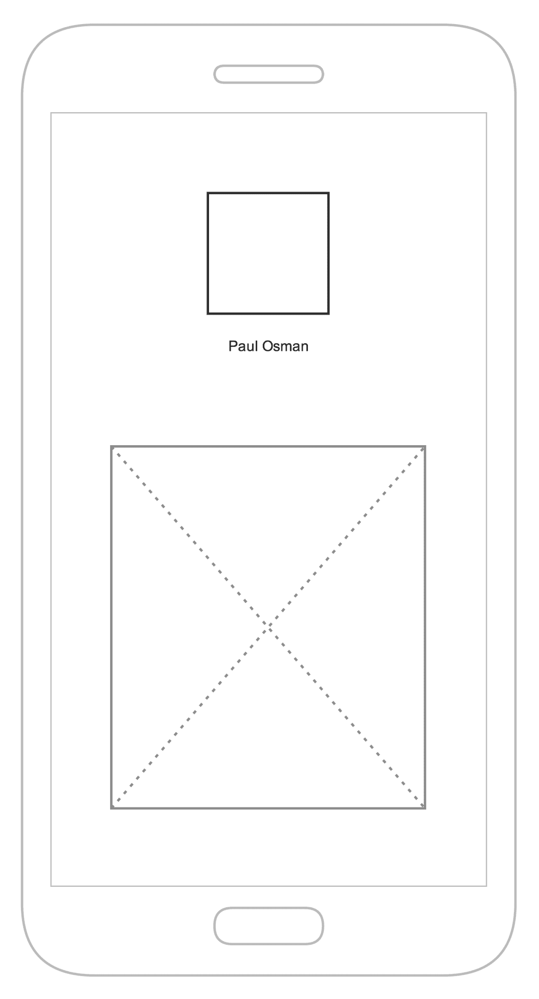
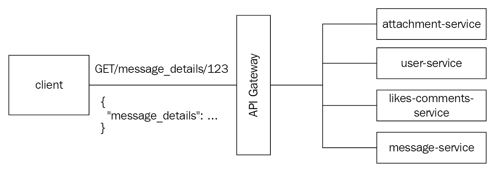

# 第二章：边缘服务

在本章中，我们将介绍以下食谱：

+   使用边缘代理服务器控制对您的服务的访问

+   使用边车扩展您的服务

+   使用 API 网关将请求路由到服务

+   使用边缘代理服务器进行速率限制

+   使用 Hystrix 停止级联故障

+   使用服务网格来提取共享关注点

# 简介

现在您已经有一些将单体分解为微服务的经验，您已经看到许多挑战存在于单体或服务代码库之外。将服务公开到互联网、控制路由和构建弹性都是可以通过通常称为**边缘服务**来解决的问题。这些服务存在于我们架构的边缘，通常处理来自公共互联网的请求。幸运的是，由于许多这些挑战非常普遍，因此存在开源项目来为我们处理其中大部分。在本章中，我们将使用大量的开源软件。

通过本章中的食谱，您将学习如何使用开源软件将您的服务公开到公共互联网，控制路由，扩展您服务的功能，并在部署和扩展微服务时处理许多常见挑战。您还将了解使客户端开发对服务更容易的技术以及如何标准化您微服务架构的监控和可观察性。

# 使用边缘代理服务器控制对您的服务的访问

在第一章《打破单体》中，我们修改了单体代码库以提供对微服务的简单路由。这种方法是可行的，并且需要很少的努力，使其成为一个理想的中间步骤。最终，您的单体将成为您架构开发和弹性的瓶颈。当您尝试扩展服务并构建更多微服务时，您的单体需要在您对服务进行 API 更改时每次都进行更新和部署。此外，您的单体还需要处理对服务的连接，并且可能没有很好地配置来处理边缘关注点，例如负载减轻或断路器。在第一章《打破单体》的“将请求路由到服务”食谱中，我们介绍了边缘代理的概念。使用边缘代理服务器将您的服务公开到公共互联网允许您提取出公开暴露的服务必须解决的许多共享关注点。如请求路由、负载减轻、背压和身份验证等需求都可以在一个单一的边缘代理层中处理，而不是由每个需要公开到互联网的服务重复处理。

边缘代理是一种位于您基础设施边缘的代理服务器，提供对内部服务的访问。您可以将边缘代理视为内部服务架构的“前门”——它允许互联网上的客户端向您部署的内部服务发出请求。有多个开源边缘代理具有强大的功能集和社区，因此我们不必编写和维护自己的边缘代理服务器。最受欢迎的开源边缘代理服务器之一是名为**Zuul**的，由 Netflix 构建。Zuul 是一个边缘服务，提供动态路由、监控、弹性、安全等功能。Zuul 被打包成一个 Java 库。使用 Java 框架 Spring Boot 编写的服务可以使用内嵌的 Zuul 服务来提供边缘代理功能。在本食谱中，我们将逐步构建一个小型 Zuul 边缘代理，并配置它将请求路由到我们的服务。

# 运营笔记

继续我们上一章的示例应用程序，想象一下我们的照片消息应用（从现在起我们将称之为`pichat`）最初是作为一个 Ruby on Rails 单体代码库实现的。当产品首次推出时，我们将应用程序部署到了位于单一**弹性负载均衡器**（**ELB**）后面的亚马逊网络服务。我们为单体创建了一个单一的**自动扩展组**（**ASG**），命名为`pichat-asg`。

我们 ASG 中的每个 EC2 实例都在运行 NGINX，它处理静态文件（图像、JavaScript、CSS）的请求，并将请求代理到同一主机上运行的、为我们 Rails 应用程序提供服务的独角兽。SSL 在 ELB 处终止，HTTP 请求被转发到 NGINX。ELB 通过**虚拟私有云**（**VPC**）内部的 DNS 名称`monolith.pichat-int.me`进行访问。

我们现在创建了一个单一的`attachment-service`，该服务处理通过平台发送的消息中附加的视频和图像。`attachment-service`是用 Java 编写的，使用 Spring Boot 平台，并部署在其自己的 ASG 中，命名为`attachment-service-asg`，该 ASG 有自己的 ELB。我们创建了一个私有 DNS 记录，命名为`attachment-service.pichat-int.me`，它指向这个 ELB。

在考虑了这种架构和拓扑之后，我们现在希望根据路径将来自公共互联网的请求路由到我们的 Rails 应用程序或我们新创建的附件服务。

# 如何做到这一点...

1.  为了展示如何使用 Zuul 将请求路由到服务，我们首先将创建一个基本的 Java 应用程序，该应用程序将作为我们的边缘代理服务。Spring Cloud Java 项目提供了一个内嵌的 Zuul 服务，这使得创建使用`zuul`库的服务变得非常简单。我们将首先创建一个基本的 Java 应用程序。创建`build.gradle`文件，内容如下：

```js
group 'com.packtpub.microservices'
version '1.0-SNAPSHOT'

buildscript {
    repositories {
        mavenCentral()
    }
    dependencies {
        classpath "org.springframework.boot:spring-boot-gradle-plugin:1.4.4.RELEASE"
        classpath "io.spring.gradle:dependency-management-plugin:0.5.6.RELEASE"
    }
}

apply plugin: 'java'
apply plugin: 'org.springframework.boot'
apply plugin: 'io.spring.dependency-management'

sourceCompatibility = 1.8

repositories {
    mavenCentral()
}

dependencyManagement {
    imports {
        mavenBom 'org.springframework.cloud:spring-cloud-netflix:1.4.4.RELEASE'
    }
}

dependencies {
    compile group: 'org.springframework.boot', name: 'spring-boot-starter-web', version: '1.4.4.RELEASE'
    compile group: 'org.springframework.cloud', name: 'spring-cloud-starter-zuul'
    testCompile group: 'junit', name: 'junit', version: '4.12'
}
```

1.  创建一个名为`EdgeProxyApplication`的单个类。这将是我们的应用程序的入口点：

```js
package com.packtpub.microservices.ch02.edgeproxy;

import org.springframework.boot.SpringApplication;
import org.springframework.boot.autoconfigure.SpringBootApplication;
import org.springframework.cloud.netflix.zuul.EnableZuulProxy;

@EnableZuulProxy
@SpringBootApplication
public class EdgeProxyApplication {
    public static void main(String[] args) {
        SpringApplication.run(EdgeProxyApplication.class, args);
    }
}
```

1.  在你的应用程序的`src/main/resources`目录中创建一个名为`application.yml`的文件。此文件将指定你的路由配置。在这个例子中，我们将假设我们的单体应用程序可以通过`monolith.pichat-int.me`内部主机访问，并且我们希望将`/signup`和`/auth/login`路径暴露给公共互联网：

```js
zuul:
 routes:
  signup:
   path: /signup
   url: http://monolith.pichat-int.me
  auth:
   path: /auth/login
   url: http://monolith.pichat-int.me
```

1.  使用`./gradlew bootRun`启动项目，你应该能够访问`/signup`和`/auth/login` URL，这些将通过代理转发到我们的单体应用程序。

1.  我们希望将`attachment-service` URL 暴露给互联网。附件服务公开以下端点：

```js
POST / # Creates an attachment
GET / # Fetch attachments, can filter by message_id
DELETE /:attachment_id # Deletes the specified attachment
GET /:id # Get the specific attachment
```

1.  我们需要决定我们想在公共 API 中使用哪些路径。修改`application.properties`以添加以下条目：

```js
zuul:
 routes:
  signup:
   path: /signup
   url: http://monolith.pichat-int.me
  auth:
   path: /auth/login
   url: http://monolith.pichat-int.me
  attachments:
   path: /attachments/**
   url: http://attachment-service.pichat-int.me
```

1.  现在，所有对`/attachments/*`的请求都将被转发到附件服务以及注册，而`auth/login`将继续由我们的单体应用程序提供服务。

1.  我们可以通过在本地运行我们的服务并向`localhost:8080/signup`、`localhost:8080/auth/login`和`localhost:8080/attachments/foo`发送请求来测试这一点。你应该能够看到请求被路由到相应的服务。当然，服务将返回错误，因为`attachment-service.pichat-int.me`无法解析，但这表明路由按预期工作：

```js
$ curl -D - http://localhost:8080/attachments/foo
HTTP/1.1 500
X-Application-Context: application
Content-Type: application/json;charset=UTF-8
Transfer-Encoding: chunked
Date: Tue, 27 Mar 2018 12:52:21 GMT
Connection: close

{"timestamp":1522155141889,"status":500,"error":"Internal Server Error","exception":"com.netflix.zuul.exception.ZuulException","message":"attachment-service.pichat-int.me"}%
```

# 通过旁路扩展你的服务

当你开始开发微服务时，通常会在每个服务中嵌入一定量的样板代码。日志记录、指标和配置等都是常见地从服务复制到服务的功能，导致大量样板代码和复制粘贴的代码。随着你的架构增长和服务的增加，这种设置变得越来越难以维护。通常的结果是，你最终会有一堆不同的日志记录、指标、服务发现等方法，这使得系统难以调试和维护。更改像指标命名空间或向服务发现客户端添加功能这样简单的事情可能需要多个团队和代码库的协调。更现实的是，你的微服务架构将继续在不一致的日志记录、指标和服务发现约定中增长，这使得开发者更难操作，从而增加了整体运营的痛苦。

旁路模式描述了一种模式，即通过在同一台机器上运行一个单独的进程或容器来扩展服务的功能。常见的功能，如指标、日志记录、服务发现、配置，甚至网络 RPC，都可以从你的应用程序中提取出来，并由与之并行的旁路服务处理。这种模式通过实现一个可以由所有服务使用的单独进程来标准化架构中的共享关注点，使其变得容易。

实现边车的一个常见方法是构建一个小的、独立的进程，通过常用的协议（如 HTTP）公开一些功能。例如，假设您希望所有服务都使用一个集中的服务发现服务，而不是依赖于在应用程序配置中设置 DNS 主机和端口。为了实现这一点，您需要确保您的服务发现服务在所有用您的服务和单体编写的语言中都有最新的客户端库。更好的方法是在每个运行服务发现客户端的服务旁边运行一个边车。然后，您的服务可以将请求代理到边车，并让它确定将它们发送到何处。作为额外的优势，您可以配置边车以发出关于服务之间网络 RPC 请求的一致度量。

这是一个如此常见的模式，以至于有多个开源解决方案可供选择。在本食谱中，我们将使用 `spring-cloud-netflix-sidecar` 项目，该项目包含一个简单的 HTTP API，允许非 JVM 应用程序使用 JVM 客户端库。Netflix 边车假定您正在使用 Eureka，这是一个旨在支持客户端服务发现需求的服务注册表。我们将在后面的章节中更详细地讨论服务发现。边车还假定您的非 JVM 应用程序正在提供健康检查端点，并将使用此端点向 Eureka 宣告其健康状态。我们的 Rails 应用程序公开了一个这样的端点，/health，当正常运行时，将返回一个包含键 status 和 `UP` 值的小 JSON 有效负载。

# 如何做到这一点...

1.  首先创建一个基本的 Spring Boot 服务。包括 Spring Boot Gradle 插件，并为 Spring Boot 和 Spring Cloud Netflix 边车项目添加依赖项：

```js
group 'com.packtpub.microservices'
version '1.0-SNAPSHOT'

buildscript {
    repositories {
        mavenCentral()
    }
    dependencies {
        classpath "org.springframework.boot:spring-boot-gradle-plugin:1.4.4.RELEASE"
        classpath "io.spring.gradle:dependency-management-plugin:0.5.6.RELEASE"
    }
}

apply plugin: 'java'
apply plugin: 'org.springframework.boot'
apply plugin: 'io.spring.dependency-management'

sourceCompatibility = 1.8

repositories {
    mavenCentral()
}

dependencyManagement {
    imports {
        mavenBom 'org.springframework.cloud:spring-cloud-netflix:1.4.4.RELEASE'
    }
}

dependencies {
    compile group: 'org.springframework.boot', name: 'spring-boot-starter-web', version: '1.4.4.RELEASE'
    compile group: 'org.springframework.cloud', name: 'spring-cloud-netflix-sidecar', version: '1.4.4.RELEASE'
    testCompile group: 'junit', name: 'junit', version: '4.12'
}
```

1.  我们准备创建一个简单的 Spring Boot 应用程序。我们将使用 `@EnableSidecar` 注解，它还包括 `@EnableZuulProxy`、`@EnableCircuitBreaker` 和 `@EnableDiscoveryClient` 注解：

```js
package com.packtpub.microservices;

import org.springframework.boot.SpringApplication;
import org.springframework.boot.autoconfigure.EnableAutoConfiguration;
import org.springframework.cloud.netflix.sidecar.EnableSidecar;
import org.springframework.stereotype.Controller;

@EnableSidecar
@Controller
@EnableAutoConfiguration
public class SidecarController {
    public static void main(String[] args) {
        SpringApplication.run(SidecarController.class, args);
    }
}
```

1.  Netflix 边车应用程序需要一些配置设置。创建一个名为 `application.yml` 的新文件，并包含以下内容：

```js
server:
 port: 5678

sidecar:
 port: 3000
 health-uri: http://localhost:3000/health
```

1.  边车现在将公开一个 API，允许非 JVM 应用程序定位已注册到 Eureka 的服务。如果我们的 `attachment-service` 已注册到 Eureka，边车将代理请求从 `http://localhost:5678/attachment/1234` 到 `http://attachment-service.pichat-int.me/1234`。

# 使用 API 网关路由请求到服务

正如我们在其他食谱中看到的，微服务应该提供特定的业务能力，并且应该围绕一个或多个领域概念进行设计，周围是边界上下文。这种设计服务边界的方法可以很好地引导您走向简单、独立可扩展的服务，这些服务可以由一个团队管理并部署，该团队专注于您的应用程序或业务的一个特定领域。

在设计用户界面时，客户端通常会从各种后端微服务中聚合相关但不同的实体。在我们的虚构消息应用中，例如，显示实际消息的屏幕可能包含来自消息服务、媒体服务、赞服务、评论服务等信息。所有这些信息可能很麻烦去收集，并可能导致大量往返后端请求。

例如，将 Web 应用程序从具有服务器端渲染 HTML 的单体应用迁移到单页 JavaScript 应用，很容易导致单个页面加载时产生数百个`XMLHttpRequests`：



为了减少往返后端服务的请求数量，考虑创建一个或多个 API 网关，提供满足客户端需求的 API。API 网关可用于以使 API 用户更容易使用的方式呈现后端实体。在前面的示例中，对单个消息端点的请求可以返回有关消息本身、消息中包含的媒体、赞和评论以及其他信息。

这些实体可以使用扇出请求模式从各种后端服务并发收集：



# 设计考虑因素

使用 API 网关提供对微服务的访问的好处之一是，您可以为一个特定的客户端创建一个单一、统一的 API。在大多数情况下，您可能希望为移动客户端创建一个特定的 API，甚至可能为 iOS 和 Android 分别创建一个 API。这种 API 网关的实现通常被称为**后端前端（BFF**），因为它为每个前端应用程序提供了一个单一的逻辑后端。Web 应用程序与移动设备的需求非常不同。

在我们的情况下，我们将专注于创建一个端点，该端点提供消息查看屏幕所需的所有数据。这包括消息本身以及附件（如果有）、发送者的用户详情以及任何额外的消息接收者。如果消息是公开的，它还可以有赞和评论，我们假设这些由一个独立的服务提供。我们的端点可能看起来像这样：

```js
GET /message_details/:message_id
```

该端点将返回类似于以下内容的响应：

```js
{
  "message_details": {
    "message": {
      "id": 1234,
      "body": "Hi There!",
      "from_user_id": "user:4321"
    },
    "attachments": [{
      "id": 4543,
      "media_type": 1,
      "url": "http://..."
    }],
    "from_user": {
      "username": "paulosman",
      "profile_pic": "http://...",
      "display_name": "Paul Osman"
    },
    "recipients": [
      ...
    ],
    "likes": 200,
    "comments": [{
      "id": 943,
      "body": "cool pic",
      "user": {
        "username": "somebody",
        "profile_pic": "http://..."
      }
    }]
  }
}
```

此响应应包含客户端显示我们的消息查看屏幕所需的所有内容。数据本身来自各种服务，但正如我们将看到的，我们的 API 网关完成了这些请求并汇总了响应。

# 如何操作...

API 网关负责公开 API，进行多次服务调用，聚合结果，并将它们返回给客户端。**Finagle Scala** 框架通过将服务调用表示为可以组合表示依赖关系的 futures 来使这变得自然。为了与其他本书中的示例保持一致，我们将使用 Spring Boot 框架在 Java 中构建一个小型的示例网关服务：

1.  创建项目骨架。创建一个新的 Java 项目，并在 Gradle 构建文件中添加以下依赖项和插件。在本菜谱中，我们将使用 Spring Boot 和 Hystrix：

```js
plugins {
    id 'org.springframework.boot' version '1.5.9.RELEASE'
}

group 'com.packtpub.microservices'
version '1.0-SNAPSHOT'

apply plugin: 'java'

sourceCompatibility = 1.8

repositories {
    mavenCentral()
}

dependencies {
    compile group: 'org.springframework.boot', name: 'spring-boot-starter-web', version: '1.5.9.RELEASE'
    compile group: 'com.netflix.hystrix', name: 'hystrix-core', version: '1.0.2'
    testCompile group: 'junit', name: 'junit', version: '4.12'
}
```

在上一节中的 JSON 示例中，我们可以清楚地看到我们正在收集和聚合一些独特的领域概念。为了本例的目的，我们将假设我们有一个消息服务，它可以检索有关消息的信息，包括点赞、评论和附件，以及一个用户服务。我们的网关服务将调用消息服务以检索消息本身，然后调用其他服务以获取相关数据，我们将这些数据在一个单独的响应中拼接起来。为了本菜谱的目的，假设消息服务运行在端口 `4567` 上，而用户服务运行在端口 `4568` 上。我们将创建一些存根服务来模拟这些假设的微服务的数据。

1.  创建一个模型来表示我们的 `Message` 数据：

```js
package com.packtpub.microservices.gateway.models;

import com.fasterxml.jackson.annotation.JsonIgnoreProperties;
import com.fasterxml.jackson.annotation.JsonProperty;

@JsonIgnoreProperties(ignoreUnknown = false)
public class Message {

    private String id;
    private String body;

    @JsonProperty("from_user_id")
    private String fromUserId;

    public String getId() {
        return id;
    }

    public void setId(String id) {
        this.id = id;
    }

    public String getBody() {
        return body;
    }

    public void setBody(String body) {
        this.body = body;
    }

    public String getFromUserId() {
        return fromUserId;
    }

    public void setFromUserId(String fromUserId) {
        this.fromUserId = fromUserId;
    }
}
```

重要的是，非依赖性服务调用应以非阻塞、异步的方式进行。幸运的是，Hystrix 有一个选项可以异步执行命令，返回 `Future<T>`。

1.  创建一个新的包，例如 `com.packtpub.microservices.gateway.commands`，并包含以下类：

+   创建名为 `AttachmentCommand` 的类，内容如下：

```js
package com.packtpub.microservices.gateway.commands;

import com.netflix.hystrix.HystrixCommand;
import com.netflix.hystrix.HystrixCommandGroupKey;
import org.springframework.http.ResponseEntity;
import org.springframework.web.client.RestTemplate;

public class AttachmentCommand extends HystrixCommand<String> {
    private String messageId;

    public AttachmentCommand(String messageId) {
        super(HystrixCommandGroupKey.Factory.asKey("AttachmentCommand"));
        this.messageId = messageId;
    }

    @Override
    public String run() {
        RestTemplate template = new RestTemplate();
        String attachmentsUrl = "http://localhost:4567/message/" + messageId + "/attachments";
        ResponseEntity<String> response = template.getForEntity(attachmentsUrl, String.class);
        return response.getBody();
    }
}
```

+   创建名为 `CommentCommand` 的类，内容如下：

```js
package com.packtpub.microservices.commands;

import com.netflix.hystrix.HystrixCommand;
import com.netflix.hystrix.HystrixCommandGroupKey;
import org.springframework.http.ResponseEntity;
import org.springframework.web.client.RestTemplate;

public class CommentCommand extends HystrixCommand<String> {

    private String messageId;

    public CommentCommand(String messageId) {
        super(HystrixCommandGroupKey.Factory.asKey("CommentGroup"));
        this.messageId = messageId;
    }

    @Override
    public String run() {
        RestTemplate template = new RestTemplate();
        String commentsUrl = "http://localhost:4567/message/" + messageId + "/comments";
        ResponseEntity<String> response = template.getForEntity(commentsUrl, String.class);
        return response.getBody();
    }
}
```

+   创建名为 `LikeCommand` 的类，内容如下：

```js
package com.packtpub.microservices.commands;

import com.netflix.hystrix.HystrixCommand;
import com.netflix.hystrix.HystrixCommandGroupKey;
import org.springframework.http.ResponseEntity;
import org.springframework.web.client.RestTemplate;

public class LikeCommand extends HystrixCommand<String> {

    private String messageId;

    public LikeCommand(String messageId) {
        super(HystrixCommandGroupKey.Factory.asKey("Likegroup"));
        this.messageId = messageId;
    }

    @Override
    public String run() {
        RestTemplate template = new RestTemplate();
        String likesUrl = "http://localhost:4567/message/" + messageId + "/likes";
        ResponseEntity<String> response = template.getForEntity(likesUrl, String.class);
        return response.getBody();
    }
}
```

+   我们的 `MessageClient` 类与之前的示例略有不同——它不会返回服务响应中的 JSON 字符串，而是会返回一个对象表示，在这种情况下，是我们的 `Message` 类的一个实例：

```js
package com.packtpub.microservices.commands;

import com.netflix.hystrix.HystrixCommand;
import com.netflix.hystrix.HystrixCommandGroupKey;
import com.packtpub.microservices.models.Message;
import org.springframework.web.client.RestTemplate;

public class MessageClient extends HystrixCommand<Message> {

    private final String id;

    public MessageClient(String id) {
        super(HystrixCommandGroupKey.Factory.asKey("MessageGroup"));
        this.id = id;
    }

    @Override
    public Message run() {
        RestTemplate template = new RestTemplate();
        String messageServiceUrl = "http://localhost:4567/message/" + id;
        Message message = template.getForObject(messageServiceUrl, Message.class);
        return message;
    }
}
```

+   创建名为 `UserCommand` 的类，内容如下：

```js
package com.packtpub.microservices.commands;

import com.netflix.hystrix.HystrixCommand;
import com.netflix.hystrix.HystrixCommandGroupKey;
import org.springframework.http.ResponseEntity;
import org.springframework.web.client.RestTemplate;

public class UserCommand extends HystrixCommand<String> {

    private String id;

    public UserCommand(String id) {
        super(HystrixCommandGroupKey.Factory.asKey("UserGroup"));
        this.id = id;
    }

    @Override
    public String run() {
        RestTemplate template = new RestTemplate();
        String userServiceUrl = "http://localhost:4568/user/" + id;
        ResponseEntity<String> response = template.getForEntity(userServiceUrl, String.class);
        return response.getBody();
    }
}
```

1.  在单个控制器中拼接这些 Hystrix 命令的执行，该控制器将我们的 API 作为 `/message_details/:message_id` 端点公开：

```js
package com.packtpub.microservices;

import com.fasterxml.jackson.databind.ObjectMapper;
import com.packtpub.microservices.commands.*;
import com.packtpub.microservices.models.Message;
import org.springframework.boot.SpringApplication;
import org.springframework.http.MediaType;
import org.springframework.boot.autoconfigure.SpringBootApplication;
import org.springframework.web.bind.annotation.PathVariable;
import org.springframework.web.bind.annotation.RequestMapping;
import org.springframework.web.bind.annotation.RestController;

import java.io.IOException;
import java.io.StringWriter;
import java.util.HashMap;
import java.util.Map;
import java.util.concurrent.ExecutionException;
import java.util.concurrent.Future;

@SpringBootApplication
@RestController
public class MainController {

    @RequestMapping(value = "/message_details/{id}", produces = MediaType.APPLICATION_JSON_UTF8_VALUE)
    public Map<String, HashMap<String, String>> messageDetails(@PathVariable String id)
            throws ExecutionException, InterruptedException, IOException {

        Map<String, HashMap<String, String>> result = new HashMap<>();
        HashMap<String, String> innerResult = new HashMap<>();

        Message message = new MessageClient(id).run();
        String messageId = message.getId();

        Future<String> user = new UserClient(message.getFromUserId()).queue();
        Future<String> attachments = new AttachmentClient(messageId).queue();
        Future<String> likes = new LikeClient(messageId).queue();
        Future<String> comments = new CommentClient(messageId).queue();

        ObjectMapper mapper = new ObjectMapper();
        StringWriter writer = new StringWriter();
        mapper.writeValue(writer, message);

        innerResult.put("message", writer.toString());
        innerResult.put("from_user", user.get());
        innerResult.put("attachments", attachments.get());
        innerResult.put("comments", comments.get());
        innerResult.put("likes", likes.get());

        result.put("message_details", innerResult);

        return result;
    }

    public static void main(String[] args) {
        SpringApplication.run(MainController.class, args);
    }
}
```

1.  这就是了。使用 `./gradlew bootRun` 运行服务，并通过以下请求进行测试：

```js
$ curl -H "Content-Type: application/json" http://localhost:8080/message_details/1234 
```

# 使用 Hystrix 阻止级联故障

在复杂系统中，故障诊断可能很困难。通常，症状可能出现在原因很远的地方。用户可能会因为一些管理个人资料图片或与用户资料间接相关的下游服务而导致登录时出现高于正常的错误率。一个服务的错误往往无谓地传播到用户请求，并负面影响用户体验和因此对您应用程序的信任。此外，一个失败的服务可能会产生级联效应，将小系统故障变成高严重性、影响客户的突发事件。在设计微服务时，考虑故障隔离并决定如何处理不同的故障场景是很重要的。

可以使用多种模式来提高分布式系统的弹性。断路器是常用的模式，用于从向暂时过载的服务发送请求中退避。断路器最初在 Michael Nygard 的书籍《Release It!》中描述。调用服务默认处于关闭状态，意味着请求被发送到下游服务。

如果调用服务在很短的时间内收到过多的失败，它可以将其断路器的状态更改为打开，并开始快速失败。而不是等待下游服务再次失败并增加失败服务的负载，它只是向上游服务发送错误，给过载的服务恢复的时间。经过一段时间后，断路器再次关闭，请求开始流向下游服务。

有许多可用的框架和库实现了断路器。一些框架，如 Twitter 的 Finagle，会自动将每个 RPC 调用包装在断路器中。在我们的例子中，我们将使用流行的 Netflix 库`hystrix`。Hystrix 是一个通用、容错库，它将隔离的代码结构化为命令。当执行命令时，它会检查断路器的状态以决定是否发出或短路请求。

# 如何实现...

Hystrix 作为一个 Java 库提供，我们将通过构建一个小型的 Java Spring Boot 应用程序来演示其使用：

1.  创建一个新的 Java 应用程序，并将依赖项添加到您的`build.gradle`文件中：

```js
plugins {
    id 'org.springframework.boot' version '1.5.9.RELEASE'
}

group 'com.packetpub.microservices'
version '1.0-SNAPSHOT'

apply plugin: 'java'

sourceCompatibility = 1.8

repositories {
    mavenCentral()
}

dependencies {
    compile group: 'org.springframework.boot', name: 'spring-boot-starter-web', version: '1.5.9.RELEASE'
    compile group: 'com.netflix.hystrix', name: 'hystrix-core', version: '1.0.2'
    testCompile group: 'junit', name: 'junit', version: '4.12'
}
```

1.  我们将创建一个简单的`MainController`，它返回一个简单的消息。这是一个虚构的例子，但它演示了上游服务对下游服务的调用。最初，我们的应用程序将只返回硬编码的`Hello, World!`消息。接下来，我们将字符串移动到 Hystrix 命令中。最后，我们将消息移动到由 Hystrix 命令包装的服务调用中：

```js
package com.packtpub.microservices;

import org.springframework.boot.SpringApplication;
import org.springframework.boot.autoconfigure.EnableAutoConfiguration;
import org.springframework.boot.autoconfigure.SpringBootApplication;
import org.springframework.web.bind.annotation.RequestMapping;
import org.springframework.web.bind.annotation.RestController;

@SpringBootApplication
@EnableAutoConfiguration
@RestController
public class MainController {
    @RequestMapping("/message")
    public String message() {
        return "Hello, World!";
    }

    public static void main(String[] args) {
        SpringApplication.run(MainController.class, args);
    }
}
```

1.  将消息移动到`HystrixCommand`：

```js
package com.packtpub.microservices;

import com.netflix.hystrix.HystrixCommand;
import com.netflix.hystrix.HystrixCommandGroupKey;

public class CommandHelloWorld extends HystrixCommand<String> {

    private String name;

    CommandHelloWorld(String name) {
        super(HystrixCommandGroupKey.Factory.asKey("ExampleGroup"));
        this.name = name;
    }

    @Override
    public String run() {
        return "Hello, " + name + "!";
    }
}
```

1.  将`MainController`中的方法替换为使用`HystrixCommand`：

```js
@RequestMapping("/message")
public String message() {
    return new CommandHelloWorld("Paul").execute();
}
```

1.  将消息生成移动到另一个服务。在这里，我们硬编码假设的消息服务 URL，这不是一个好的实践，但为了演示目的可以这样做：

```js
package com.packtpub.microservices;

import com.netflix.hystrix.HystrixCommand;
import com.netflix.hystrix.HystrixCommandGroupKey;
import org.springframework.http.ResponseEntity;
import org.springframework.web.client.RestTemplate;

public class CommandHelloWorld extends HystrixCommand<String> {

    CommandHelloWorld() {
        super(HystrixCommandGroupKey.Factory.asKey("ExampleGroup"));
    }

    @Override
    public String run() {
        RestTemplate restTemplate = new RestTemplate();
        String messageResourceUrl = "http://localhost:4567/";
        ResponseEntity<String> response = restTemplate.getForEntity(messageResourceUrl, String.class);
        return response.getBody();
    }

    @Override
    public String getFallback() {
        return "Hello, Fallback Message";
    }
}
```

1.  更新`MainController`类以包含以下内容：

```js
package com.packetpub.microservices;

import org.springframework.boot.SpringApplication;
import org.springframework.boot.autoconfigure.EnableAutoConfiguration;
import org.springframework.boot.autoconfigure.SpringBootApplication;
import org.springframework.web.bind.annotation.RequestMapping;
import org.springframework.web.bind.annotation.RestController;

@SpringBootApplication
@EnableAutoConfiguration
@RestController
public class MainController {

    @RequestMapping("/message")
    public String message() {
        return new CommandHelloWorld().execute();
    }

    public static void main(String[] args) {
        SpringApplication.run(MainController.class, args);
    }
}
```

1.  我们的 `MainController` 类现在通过一个 Hystrix 命令封装了对服务的调用，以生成要发送给客户端的消息。你可以通过创建一个非常简单的生成消息字符串的服务来测试这一点。`sinatra` 是一个简单易用的 Ruby 库，非常适合创建测试服务。创建一个名为 `message-service.rb` 的新文件：

```js
require 'sinatra'

get '/' do
  "Hello from Sinatra"
end
```

1.  通过运行 `ruby message-service.rb` 来启动服务，然后向你的 Hystrix 启用的服务发送几个示例请求。你可以通过修改服务以返回 `503` 来模拟失败，这表示它暂时过载：

```js
require 'sinatra'

get '/' do
  halt 503, 'Busy'
end
```

你的 Spring 服务现在应该尝试连接到服务，但在遇到 `503` 时使用回退值。此外，在尝试了多次之后，命令的断路器将被触发，服务将开始默认使用回退一段时间。

# 速率限制

除了断路器等技术之外，速率限制还可以是防止分布式系统级联故障的有效方法。速率限制可以有效地防止垃圾邮件，抵御 **拒绝服务** (**DoS**) 攻击，并保护系统的一部分不会因为过多的并发请求而过载。通常作为全局或按客户端限制实现，速率限制通常是代理或负载均衡器的一部分。在这个配方中，我们将使用 NGINX，这是一个流行的开源负载均衡器、Web 服务器和反向代理。

大多数速率限制实现都使用 *漏桶算法*——一个起源于计算机网络交换机和电信网络的算法。正如其名所示，漏桶算法基于一个隐喻，即桶中有一个小漏洞，它控制着一个恒定的速率。水以脉冲的形式倒入桶中，但漏洞保证了水在桶中以稳定、固定的速率存在。如果水的流入速度超过水从桶中流出，最终桶会溢出。在这种情况下，溢出代表被丢弃的请求。

当然可以实施自己的速率限制解决方案；甚至有一些算法的实现是开源的，可供使用。然而，使用像 NGINX 这样的产品来为你进行速率限制要容易得多。在这个配方中，我们将配置 NGINX 来代理对我们的微服务的请求。

# 如何做到这一点...

1.  通过运行以下命令来安装 NGINX：

```js
apt-get install nginx
```

1.  `nginx` 有一个 `config` 文件，`nginx.conf`。在基于 Ubuntu 的 Linux 系统上，这可能会在 `/etc/nginx/nginx.conf` 目录中。打开文件，查找 `http` 块并添加以下内容：

```js
limit_req_zone $binary_remote_addr zone=mylimit:10m rate=10r/s;
server {
    location /auth/signin {
        limit_req zone=mylimit;
        proxy_pass http://my_upstream;
    }
}
```

如前述代码所示，速率限制是通过两个配置指令实现的。`limit_req_zone`指令定义了速率限制的参数。在这个例子中，我们根据客户端的 IP 地址实现了每秒 10 个请求的速率限制。`limit_req`指令将我们的速率限制应用于特定的路径或位置。在这种情况下，我们将其应用于对`/auth/signin`的所有请求，可能是因为我们不希望机器人编写创建账户的脚本！

# 使用服务网格处理共享关注点

随着 Web 服务框架和标准的演变，样板代码或共享应用程序关注点的数量减少了。这是因为，集体地，我们确定了我们应用程序的哪些部分是通用的，因此不需要每个程序员或团队重新实现。当人们刚开始联网计算机时，编写网络感知应用程序的程序员必须担心许多现在由操作系统网络堆栈抽象出的底层细节。同样，所有微服务共享某些通用关注点。例如，Twitter 的 Finagle 框架将所有网络调用封装在断路器中，增加了容错性并隔离了系统中的故障。Finagle 和 Spring Boot，这是我们一直在使用的大多数这些食谱的 Java 框架，都支持暴露一个标准的指标端点，该端点标准化了为微服务收集的基本网络、JVM 和应用指标。

每个微服务都应该考虑一些共享的应用程序关注点。从可观察性的角度来看，服务应该努力输出一致的指标和结构化日志。为了提高我们系统的可靠性，服务应该将网络调用封装在断路器中，并实现一致的重试和退避逻辑。为了支持网络和服务拓扑的变化，服务应该考虑实现客户端负载均衡并使用集中式服务发现。

而不是在每个服务中实现所有这些功能，理想的做法是将它们抽象出来，使其位于我们的应用程序代码之外，这样就可以单独维护和操作。就像我们操作系统网络堆栈的功能一样，如果每个这些功能都是由我们的应用程序可以依赖的某个部分实现的，我们就无需担心它们是否可用。这就是服务网格背后的理念。

运行服务网格配置涉及在每个微服务后面运行一个网络代理。服务之间不是直接通信，而是通过各自的代理进行通信，这些代理作为边车安装。实际上，你的服务将与运行在本地主机的自己的代理进行通信。当网络请求通过服务代理发送时，代理可以控制要发出的指标和输出的日志消息。代理还可以直接与你的服务注册表集成，并在活动节点之间均匀分配请求，跟踪故障并在达到一定阈值时快速失败。以这种方式运行系统可以减轻系统的操作复杂性，同时提高架构的可靠性和可观察性。

与本章讨论的大多数食谱一样，运行服务网格有众多开源解决方案。我们将重点关注 **Linkerd**，这是一个由 buoyant 构建和维护的开源代理服务器。Linkerd 的原始作者在 Twitter 工作过，之后成立了 buoyant，因此 Linkerd 集成了 Twitter 团队学到的许多经验教训。它与 Finagle Scala 框架共享许多功能，但可以与任何语言编写的服务一起使用。在本食谱中，我们将介绍安装和配置 Linkerd，并讨论我们如何使用它来控制 Ruby on Rails 单体 API 和我们新开发的媒体服务之间的通信。

# 如何做到这一点...

为了演示在代理后面运行服务，我们将安装并运行一个 Linkerd 实例，并配置它来处理对你的服务发出的请求。Linkerd 网站上有关于在 Docker、Kubernetes 和其他选项中运行它的说明。为了简化，我们将专注于在本地运行 Linkerd 和我们的服务：

1.  在 [`github.com/linkerd/linkerd/releases`](https://github.com/linkerd/linkerd/releases) 下载最新的 Linkerd 版本。

1.  通过执行以下命令提取 tarball：

```js
$ tar xvfz linkerd-1.3.4.tgz
$ cd linkerd-1.3.4
```

1.  默认情况下，`linkerd` 随附一个使用基于文件的服务的发现配置。我们将在下一节讨论此方法的替代方案，但现在，创建一个名为 `disco/media-service` 的新文件，并包含以下内容：

```js
localhost 8080
```

1.  这将主机名和端口映射到名为 `media-service` 的服务。Linkerd 使用此文件通过名称查找服务，并确定主机名和端口的映射。

1.  按照以下方式运行 Linkerd：

```js
$ ./linkerd-1.3.4-exec config/linkerd.yaml
```

1.  在端口 `8080` 上启动服务。切换到 `media-service` 目录并运行服务：

```js
$ ./gradlew bootRun
```

1.  Linkerd 正在端口 `4140` 上运行。使用以下请求测试代理是否工作：

```js
$ curl -H "Host: attachment-service" http://localhost:4140/
```
