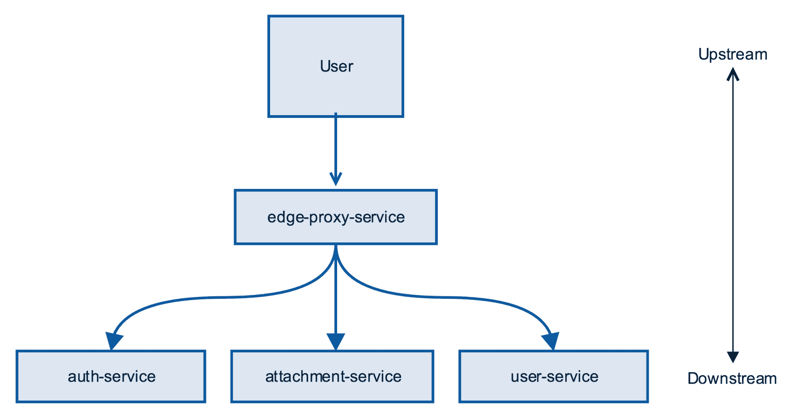
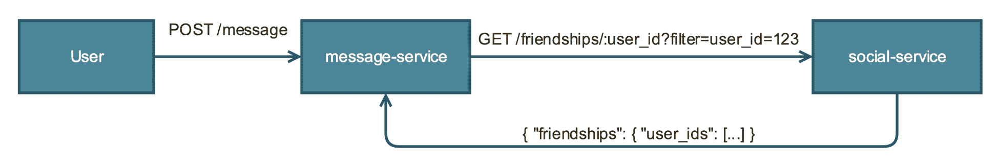
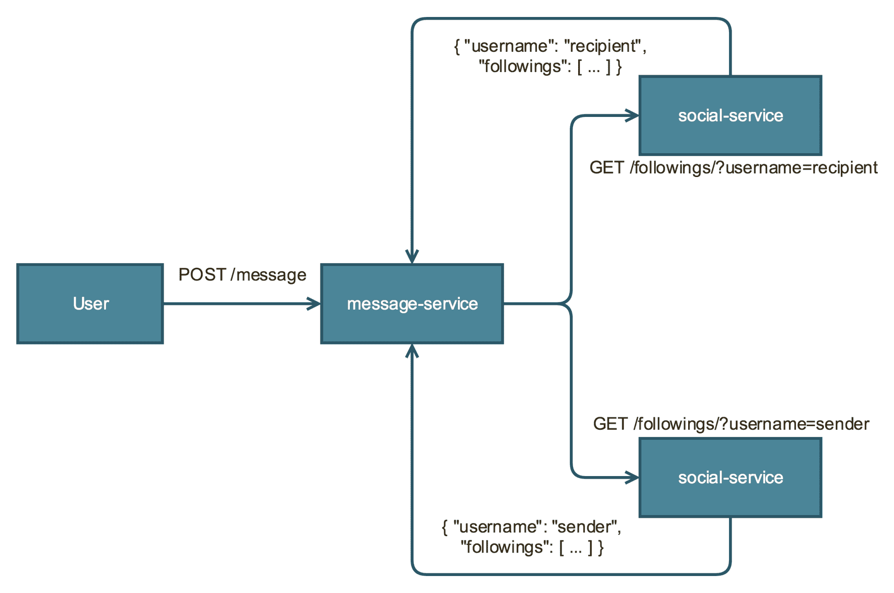

# 交互式服务通信

本章将涵盖以下食谱：

+   服务间通信

+   制作并发异步请求

+   使用服务发现查找服务

+   服务器端负载均衡

+   客户端负载均衡

+   构建事件驱动的微服务

+   API 演进

# 简介

在前面的章节中，我们已经介绍了如何开始将单体代码库拆分成微服务，以及将你的微服务公开到公共互联网的最佳实践。到目前为止，我们假设所有的微服务都是没有依赖的独立应用程序。这些简单的微服务接收请求，检索数据或写入数据库，并向客户端返回响应。这种线性工作流程在现实世界的系统中很少见。在现实世界的微服务架构中，服务将经常需要调用其他服务以满足用户请求。典型的用户请求通常会在你的系统中创建数十个对服务的请求。

管理服务间的通信带来了一系列挑战。在服务能够与其他服务通信之前，它需要通过某种服务发现机制来定位它。在生成对下游服务的请求时，我们还需要一种方法来在服务的各个实例之间分配流量，以最小化延迟并均匀分配负载，同时不损害数据完整性。我们需要考虑如何处理服务故障并防止它们在我们的系统中级联。

有时一个服务需要异步地与其他服务通信，在这些情况下，我们可以使用事件驱动的架构模式来创建反应式工作流程。将我们的系统拆分成多个服务也意味着不同的服务将独立地演进它们的 API，因此我们需要处理变化的方法，以确保不会破坏上游服务。

在本章中，我们将讨论旨在解决这些挑战的食谱。到本章结束时，你将能够自信地处理在微服务架构中我们必然会需要的各种交互。

# 服务间通信

在大规模系统中，问题很少出现在服务本身，而更多出现在服务之间的通信中。因此，我们需要仔细考虑服务之间通信的所有各种挑战。在讨论服务之间通信时，可视化我们系统中信息流是有用的。数据在两个方向上流动——从客户端（上游）到数据库或事件总线（下游），以请求的形式，并以响应的形式返回。当我们提到上游服务时，我们是在描述系统中信息流中更靠近用户的部分。当我们提到下游服务时，我们是在描述系统中离用户更远的部分——换句话说，用户发起一个请求，该请求被路由到服务，然后该服务向其他下游服务发送请求，如以下图所示：



在前面的图中，原始的 **User** 位于 **edge-proxy-service** 的上游，**edge-proxy-service** 位于 **auth-service**、**attachment-service** 和 **user-service** 的上游。

为了演示服务之间的通信，我们将创建一个简单的服务，该服务使用 Spring Boot Java 框架同步调用另一个服务。遵循我们虚构的消息应用示例，我们将创建一个负责发送消息的消息服务。消息服务必须调用社交图服务，以确定消息的发送者和接收者是否是朋友，然后才允许发送消息。以下简化图展示了服务之间的关系：



如您所见，用户从 **/message** 端点发送一个 **POST** 请求到 **message-service**。然后，**message-service** 服务使用 **/friendships/:id** 端点向 **social-service** 服务发送一个 HTTP **GET** 请求。**social-service** 服务返回一个表示用户友谊的 JSON。

# 如何实现...

1.  创建一个名为 `message-service` 的新 Java/Gradle 项目，并将以下内容添加到 `build.gradle` 文件中：

```js
group 'com.packtpub.microservices'
version '1.0-SNAPSHOT'

buildscript {
    repositories {
        mavenCentral()
    }
    dependencies {
        classpath group: 'org.springframework.boot', name: 'spring-boot-gradle-plugin', version: '1.5.9.RELEASE'
    }
}

apply plugin: 'java'
apply plugin: 'org.springframework.boot'

sourceCompatibility = 1.8

repositories {
    mavenCentral()
}

dependencies {
    compile group: 'org.springframework.boot', name: 'spring-boot-starter-web'
    testCompile group: 'junit', name: 'junit', version: '4.12'
}
```

1.  创建一个名为 `com.packtpub.microservices.ch03.message` 的新包和一个名为 `Application` 的新类。这将是我们的服务入口点：

```js
package com.packtpub.microservices.ch03.message;

import org.springframework.boot.SpringApplication;
import org.springframework.boot.autoconfigure.SpringBootApplication;

@SpringBootApplication
public class Application {
    public static void main(String[] args) {
        SpringApplication.run(Application.class, args);
    }
}
```

1.  创建模型。创建一个名为 `com.packtpub.microservices.ch03.message.models` 的包和一个名为 `Message` 的类。这是消息的内部表示。这里缺少很多内容。我们实际上没有在这个代码中持久化消息，因为最好保持这个示例简单：

```js
package com.packtpub.microservices.ch03.message.models;

public class Message {

    private String toUser;
    private String fromUser;
    private String body;

    public Message() {}

    public Message(String toUser, String fromUser, String body) {
        this.toUser = toUser;
        this.fromUser = fromUser;
        this.body = body;
    }

    public String getToUser() {
        return toUser;
    }

    public String getFromUser() {
        return fromUser;
    }

    public String getBody() {
        return body;
    }
}
```

1.  创建一个名为 `com.packtpub.microservices.ch03.message.controllers` 的新包和一个名为 `MessageController` 的新类。目前，我们的控制器除了接受请求、解析 JSON 并返回消息实例之外，没有做太多事情，正如您可以从以下代码中看到的那样：

```js
package com.packtpub.microservices.ch03.message.controllers;

import com.packtpub.microservices.models.Message;
import org.springframework.web.bind.annotation.*;

@RestController
public class MessageController {

    @RequestMapping(
            path="/messages",
            method=RequestMethod.POST,
            produces="application/json")
    public Message create(@RequestBody Message message) {
        return message;
    }
}
```

1.  通过运行它并尝试发送一个简单的请求来测试这个基本服务：

```js
$ ./gradlew bootRun
Starting a Gradle Daemon, 1 busy Daemon could not be reused, use --status for details

> Task :bootRun

 . ____ _ __ _ _
 /\\ / ___'_ __ _ _(_)_ __ __ _ \ \ \ \
( ( )\___ | '_ | '_| | '_ \/ _` | \ \ \ \
 \\/ ___)| |_)| | | | | || (_| | ) ) ) )
 ' |____| .__|_| |_|_| |_\__, | / / / /
 =========|_|==============|___/=/_/_/_/
 :: Spring Boot :: (v1.5.9.RELEASE)

...
```

查看以下命令行：

```js
$ curl -H "Content-Type: application/json" -X POST http://localhost:8080/messages -d'{"toUser": "reader", "fromUser": "paulosman", "body": "Hello, World"}'

{"toUser":"reader","fromUser":"paulosman","body":"Hello, World"}
```

现在我们有一个基本的服务正在运行，但它相当愚蠢，没有做太多。我们不会在本章中讨论持久性，但让我们通过检查社交服务来验证我们的两个用户之间是否有友谊，从而增加一些智能，在允许发送消息之前。为了我们的示例，假设我们有一个可以让我们通过请求检查用户之间关系的有效社交服务，如下所示：

```js
GET /friendships?username=paulosman&filter=reader

{
  "username": "paulosman",
  "friendships": [
    "reader"
  ]
}
```

1.  在我们能够消费此服务之前，让我们创建一个模型来存储其响应。在 `com.packtpub.microservices.ch03.message.models` 包中，创建一个名为 `UserFriendships` 的类：

```js
package com.packtpub.microservices.ch03.message.models;

import com.fasterxml.jackson.annotation.JsonIgnoreProperties;

import java.util.List;

@JsonIgnoreProperties(ignoreUnknown = true)
public class UserFriendships {
    private String username;
    private List<String> friendships;

    public UserFriendships() {}

    public String getUsername() {
        return username;
    }

    public void setUsername(String username) {
        this.username = username;
    }

    public List<String> getFriendships() {
        return friendships;
    }

    public void setFriendships(List<String> friendships) {
        this.friendships = friendships;
    }
}
```

1.  修改 `MessageController`，添加一个方法来获取一个用户的友谊列表，可选地按用户名过滤。请注意，在这个例子中，我们硬编码了 URL，这是一个坏习惯。我们将在下一个配方中讨论这个问题的替代方案。查看以下代码：

```js
private List<String> getFriendsForUser(String username, String filter) {
    String url = "http://localhost:4567/friendships?username=" + username + "&filter=" + filter;
    RestTemplate template = new RestTemplate();
```

```js
    UserFriendships friendships = template.getForObject(url, UserFriendships.class);
    return friendships.getFriendships();
}
```

1.  修改我们之前编写的 `create` 方法。如果用户是朋友，我们将继续并像以前一样返回消息；如果用户不是朋友，服务将响应 `403`，表示请求被禁止：

```js
@RequestMapping(
            path="/messages",
            method=RequestMethod.POST,
            produces="application/json")
    public ResponseEntity<Message> create(@RequestBody Message message) {
        List<String> friendships = getFriendsForUser(message.getFromUser(), message.getToUser());

        if (friendships.isEmpty())
            return ResponseEntity.status(HttpStatus.FORBIDDEN).build();

        URI location = ServletUriComponentsBuilder
                .fromCurrentRequest().path("/{id}")
                .buildAndExpand(message.getFromUser()).toUri();

        return ResponseEntity.created(location).build();
    }
```

# 异步请求

在上一个配方中，我们为每个请求从消息服务到社交服务进行单个服务调用。这有一个好处，就是实现起来非常简单，当使用单线程语言，如 Python、Ruby 或 JavaScript 时，这通常是唯一的选择。以这种方式同步执行网络调用在每次请求只进行一次时是可以接受的——因为无论如何你都无法在调用完成之前响应用户，所以调用阻塞线程并不重要。然而，当你进行多个请求时，阻塞网络调用将严重影响应用程序的性能和可伸缩性。我们需要的是一个简单的方法来利用 Java 的并发特性。

如果你正在使用 Scala 编写你的微服务，你可以利用 `Future` 类型，它用于表示异步计算。**Finagle** RPC 框架甚至将 futures 作为其建模依赖 RPC 的基本抽象之一。Java 也有 futures，Spring Boot 框架提供了一些有用的工具，使得包装网络调用变得简单，从而使它们异步，因此是非阻塞的。

在这个菜谱中，我们将重新配置我们在上一个菜谱中引入的消息服务。而不是检查消息的发送者和接收者是否是朋友，我们现在假设我们的应用程序使用非对称关注模型。为了一个用户向另一个用户发送消息，这两个用户必须相互关注。这要求消息服务向社交服务进行两次网络调用，检查发送者是否关注接收者，同时检查接收者是否关注发送者。以下简化图表示了服务之间的关系：



Spring Boot 有一些有用的工具，我们可以使用 Java 的`CompletableFuture`类型来使方法异步。我们将修改我们之前的消息服务，使其对搜索服务进行两次并发调用。

# 如何做到这一点...

1.  打开`MessageController`文件，插入以下内容：

```js
package com.packtpub.microservices.ch03.message.controllers;

import com.packtpub.microservices.models.Message;
import com.packtpub.microservices.models.UserFriendships;
import org.springframework.http.HttpStatus;
import org.springframework.http.ResponseEntity;
import org.springframework.web.bind.annotation.*;
import org.springframework.web.client.RestTemplate;
import org.springframework.web.servlet.support.ServletUriComponentsBuilder;

import java.net.URI;
import java.util.List;

@RestController
public class MessageController {

    @RequestMapping(
            path="/messages",
            method=RequestMethod.POST,
            produces="application/json")
    public ResponseEntity<Message> create(@RequestBody Message message) {
        List<String> friendships = getFriendsForUser(message.getFromUser(), message.getToUser());

        if (friendships.isEmpty())
            return ResponseEntity.status(HttpStatus.FORBIDDEN).build();

        URI location = ServletUriComponentsBuilder
                .fromCurrentRequest().path("/{id}")
                .buildAndExpand(message.getFromUser()).toUri();

        return ResponseEntity.created(location).build();
    }

    private List<String> getFriendsForUser(String username, String filter) {
        String url = "http://localhost:4567/friendships?username=" + username + "&filter=" + filter;
        RestTemplate template = new RestTemplate();
        UserFriendships friendships = template.getForObject(url, UserFriendships.class);
        return friendships.getFriendships();
    }
}
```

1.  将`getFriendsForUser`方法替换为一个新的方法，称为`isFollowing`。我们给这个新方法添加了`@Async`注解，这告诉 Spring Boot 这个方法将在不同的线程中运行：

```js
import org.springframework.scheduling.annotation.Async;
import java.util.concurrent.CompletableFuture;

...

@Async
public CompletableFuture<Boolean> isFollowing(String fromUser, String toUser) {

    String url = String.format(
      "http://localhost:4567/followings?user=%s&filter=%s",
      fromUser, toUser);

    RestTemplate template = new RestTemplate();
    UserFollowings followings = template.forObject(url, UserFollowings.class);

    return CompletableFuture.completedFuture(
        followings.getFollowings().isEmpty()
    );
}
```

1.  修改`create`方法以进行两个服务调用。我们需要等待这两个调用都完成后才能决定如何进行，但这两个服务调用将并发进行：

```js
@RequestMapping(
            path="/messages",
            method=RequestMethod.POST,
            produces="application/json")
    public ResponseEntity<Message> create(@RequestBody Message message) {

    CompletableFuture<Boolean> result1 = isFollowing(message.getFromUser(), message.getToUser());
    CompletableFuture<Boolean> result2 = isFollowing(message.getToUser(), message.getFromUser());

    CompletableFuture.allOf(result1, result2).join();

    // if both are not true, respond with a 403
    if (!(result1.get() && result2.get()))
        ResponseEntity.status(HttpStatus.FORBIDDEN).build();

    ... // proceed

}
```

1.  为了使`@Async`注解在单独的线程上调度方法，我们需要配置一个`Executor`。这在我们`Application`类中完成，如下所示：

```js
package com.packtpub.microservices;

import org.springframework.boot.SpringApplication;
import org.springframework.boot.autoconfigure.SpringBootApplication;
import org.springframework.context.annotation.Bean;
import org.springframework.scheduling.annotation.EnableAsync;
import org.springframework.scheduling.concurrent.ThreadPoolTaskExecutor;

import java.util.concurrent.Executor;

@SpringBootApplication
@EnableAsync
public class Application {

    public static void main(String[] args) {
        SpringApplication.run(Application.class, args).close();
    }

    @Bean
    public Executor asyncExecutor() {
        ThreadPoolTaskExecutor executor = new ThreadPoolTaskExecutor();
        executor.setCorePoolSize(2);
        executor.setMaxPoolSize(2);
        executor.setQueueCapacity(500);
        executor.setThreadNamePrefix("SocialServiceCall-");
        executor.initialize();
        return executor;
    }

}
```

我们的服务现在并发异步地调用社交服务，以确保消息的发送者和接收者相互关注。我们使用定义在我们应用程序配置部分中的`Executor`来自定义我们的`Async`调度器。我们已经配置了`ThreadPoolTaskExecutor`类，将线程数限制为`2`，队列大小为`500`。在配置`Executor`时需要考虑许多因素，例如预期服务接收的流量量和服务处理请求的平均时间。在这个例子中，我们将保持这些值不变。

# 服务发现

在服务能够相互调用之前，它们需要能够使用某种服务发现机制找到彼此。这意味着能够将服务名称转换为网络位置（IP 地址和端口）。传统的应用程序维护了要发送请求的服务网络位置，可能在一个配置文件中（或者更糟糕的是，硬编码在应用程序代码中）。这种方法假设网络位置相对静态，这在现代云原生应用程序中不会是情况。微服务架构的拓扑结构不断变化。节点通过自动扩展被添加和删除，我们必须假设某些节点可能会完全失败或通过具有不可接受的高延迟来处理请求。随着微服务架构的发展，你需要考虑一个功能更丰富的服务发现机制。

在选择服务发现机制时，用于支持你的服务注册表的数据存储极为重要。你需要一个经过良好测试、经验丰富的系统。Apache **ZooKeeper** 是一个开源的分层键值存储，通常用于分布式锁定、服务发现、维护配置信息和其他分布式协调任务。ZooKeeper 的发展部分受到 2006 年谷歌发表的一篇论文的启发，该论文描述了 **Chubby**，这是一个用于分布式锁存储的内部开发系统。在这个配方中，我们将使用 ZooKeeper 来构建服务发现机制。

Spring Cloud ZooKeeper 是一个项目，它为 Spring Boot 应用程序提供简单的 ZooKeeper 集成。

# 如何操作...

对于这个配方，有两个步骤集合，如下一节所示。

# 在服务注册表中注册

此配方需要一个正在运行的 ZooKeeper 集群。至少，你需要在你的开发机器上本地运行一个 ZooKeeper 节点。有关安装和运行 ZooKeeper 的说明，请访问优秀的 ZooKeeper 文档。查看以下步骤：

1.  在这个示例中，我们将创建一个服务来处理用户账户的创建和检索。创建一个名为 `users-service` 的新 Gradle Java 应用程序，并使用以下 `build.gradle` 文件：

```js
group 'com.packtpub.microservices'
version '1.0-SNAPSHOT'

buildscript {
    repositories {
        mavenCentral()
    }
    dependencies {
        classpath group: 'io.spring.gradle', name: 'dependency-management-plugin', version: '0.5.6.RELEASE'
        classpath group: 'org.springframework.boot', name: 'spring-boot-gradle-plugin', version: '1.5.9.RELEASE'
    }
}

apply plugin: 'java'
apply plugin: 'org.springframework.boot'
apply plugin: "io.spring.dependency-management"

sourceCompatibility = 1.8

dependencyManagement {
    imports {
        mavenBom 'org.springframework.cloud:spring-cloud-zookeeper-dependencies:1.1.1.RELEASE'
    }
}

repositories {
    mavenCentral()
}

dependencies {
    compile group: 'io.reactivex', name: 'rxjava', version: '1.1.5'
    compile group: 'org.springframework.boot', name: 'spring-boot-starter-web'
    compile group: 'org.springframework.cloud', name: 'spring-cloud-starter-zookeeper-discovery', version: '1.1.1.RELEASE'
    testCompile group: 'junit', name: 'junit', version: '4.12'
}
```

1.  由于我们已经将 `spring-boot-starter-zookeeper-discovery` 声明为依赖项，我们可以访问必要的注解来告诉我们的应用程序在启动时将自己注册到 ZooKeeper 服务注册表中。创建一个名为 `Application` 的新类，它将作为我们服务的入口点：

```js
package com.packtpub.microservices.ch03.servicediscovery;

import org.springframework.boot.SpringApplication;
import org.springframework.boot.autoconfigure.SpringBootApplication;
import org.springframework.cloud.client.discovery.EnableDiscoveryClient;

@EnableDiscoveryClient
@SpringBootApplication
public class Application {
    public static void main(String[] args) {
        SpringApplication.run(Application.class, args);
    }
}
```

1.  应用程序现在尝试连接到 ZooKeeper 节点，默认情况下在本地主机的 2181 端口上运行。这个默认设置适用于本地开发，但在生产环境中仍然需要更改。添加一个名为 `src/resources/application.yml` 的文件，并包含以下内容：

```js
spring:
  cloud:
    zookeeper:
      connect-string: localhost:2181
```

1.  要在服务注册表中给你的服务一个有意义的名称，修改 `application.yml` 文件并添加以下内容：

```js
spring:
  cloud:
    zookeeper:
      connect-string: localhost:2181
  application:
    name: users-service
```

# 查找服务

现在我们已经将服务注册到服务注册表中，我们将创建另一个服务来演示使用 Spring ZooKeeper `DiscoveryClient`查找该服务的运行实例：

1.  打开我们之前创建的消息服务客户端。将以下行添加到`build.gradle`文件中：

```js
group 'com.packtpub.microservices'
version '1.0-SNAPSHOT'

buildscript {
    repositories {
        mavenCentral()
    }
    dependencies {
        classpath group: 'io.spring.gradle', name: 'dependency-management-plugin', version: '0.5.6.RELEASE'
        classpath group: 'org.springframework.boot', name: 'spring-boot-gradle-plugin', version: '1.5.9.RELEASE'
    }
}

apply plugin: 'java'
apply plugin: 'org.springframework.boot'
apply plugin: 'io.spring.dependency-management'

sourceCompatibility = 1.8

dependencyManagement {
 imports {
 mavenBom 'org.springframework.cloud:spring-cloud-zookeeper-dependencies:1.1.1.RELEASE'
    }
}

repositories {
    mavenCentral()
}

dependencies {
 compile 'io.reactivex:rxjava:1.3.4'
 compile group: 'org.springframework.cloud', name: 'spring-cloud-starter-zookeeper-discovery', version: '1.1.1.RELEASE'
    compile group: 'org.springframework.cloud', name: 'spring-cloud-starter-feign', version: '1.2.5.RELEASE'
    compile group: 'org.springframework.kafka', name: 'spring-kafka', version: '2.1.1.RELEASE'    compile group: 'org.springframework.boot', name: 'spring-boot-starter-web'
    testCompile group: 'junit', name: 'junit', version: '4.12'
}
```

1.  我们正在使用由 Netflix 开发的 HTTP 客户端，称为**Feign**。Feign 允许你声明性地构建 HTTP 客户端，并默认支持服务发现。创建一个名为`UsersClient.java`的新文件，并包含以下内容：

```js
package com.packtpub.microservices.ch03.servicediscovery.clients;

import org.springframework.beans.factory.annotation.Autowired;
import org.springframework.cloud.client.discovery.EnableDiscoveryClient;
import org.springframework.cloud.netflix.feign.EnableFeignClients;
import org.springframework.cloud.netflix.feign.FeignClient;
import org.springframework.context.annotation.Configuration;
import org.springframework.web.bind.annotation.PathVariable;
import org.springframework.web.bind.annotation.RequestMapping;
import org.springframework.web.bind.annotation.RequestMethod;
import org.springframework.web.bind.annotation.ResponseBody;

import java.util.List;

@Configuration
@EnableFeignClients
@EnableDiscoveryClient
public class UsersClient {

    @Autowired
    private Client client;

    @FeignClient("users-service")
    interface Client {
        @RequestMapping(path = "/followings/{userId}", method = RequestMethod.GET)
        @ResponseBody
        List<String> getFollowings(@PathVariable("userId") String userId);
    }

    public List<String> getFollowings(String userId) {
        return client.getFollowings(userId);
    }
}
```

1.  打开`MessageController.java`文件，并将`UsersClient`的一个实例作为字段添加：

```js
package com.packtpub.microservices;
...
@RestController
public class MessagesController {
    ...
    @Autowired
    private UsersClient usersClient;
    ...
}
```

1.  在`isFollowing`方法中手动构建 URL 而不是，我们可以使用 Feign 客户端自动获取用户的友谊列表，如下所示：

```js
@Async
public CompletableFuture<Boolean> isFollowing(String fromUser, String toUser) {

    List<String> friends = usersClient.getFollowings(fromUser)
            .stream()
            .filter(toUser::equals)
            .collect(Collectors.toList());

    return CompletableFuture.completedFuture(friends.isEmpty());
}
```

由于我们使用服务注册表，我们不再需要担心那些持有可能更改的主机名值的笨拙配置。此外，我们现在可以开始决定我们想要如何将负载分配给服务的可用实例。

# 服务器端负载均衡

当考虑在运行应用程序实例的服务器集群中分配负载时，思考一下网络应用程序架构的简要（且不完整）历史很有趣。一些最早的 Web 应用程序是由 Apache 或类似 Web 服务器守护程序软件托管的静态 HTML 页面。逐渐地，应用程序变得更加动态，使用诸如通过 CGI 执行的服务器端脚本等技术。即使是动态应用程序，也仍然是托管并由 Web 服务器守护程序直接提供服务的文件。这种简单的架构长期有效。然而，随着应用程序接收到的流量增加，需要一种方法来在应用程序的相同无状态实例之间分配负载。

存在许多负载均衡技术，包括轮询 DNS 或 DNS 地理位置。对于微服务而言，最简单且最常见的形式的负载均衡是使用一个软件程序，该程序将请求转发到后端服务器集群中的一个。根据我们选择的负载均衡器的特定负载均衡算法，可以以多种不同的方式分配负载。简单的负载均衡算法包括轮询和随机选择。在现实世界的生产应用程序中，我们通常会选择一种负载均衡算法，该算法在选择将请求转发到集群中的节点时，会考虑报告的指标，例如负载或活动连接数。

有许多流行的开源应用程序可以有效地为微服务执行负载均衡。**HAProxy**是一个流行的开源负载均衡器，可以进行 TCP 和 HTTP 负载均衡。NGINX 是一个流行的开源 Web 服务器，可以有效地用作反向代理、应用程序服务器、负载均衡器，甚至是 HTTP 缓存。如今，更多的组织处于开发部署在云平台上的微服务的位置，例如亚马逊网络服务或谷歌云平台，它们各自都有服务器端负载均衡的解决方案。

AWS 提供了一个名为**弹性负载均衡**（**ELB**）的负载均衡解决方案。ELB 可以被配置为将流量转发到**自动扩展组**的成员。自动扩展组是一组被视为逻辑组的 EC2 实例。ELB 使用健康检查（TCP 或 HTTP），这有助于负载均衡器确定是否将流量转发到特定的 EC2 实例。

在这个菜谱中，我们将使用 AWS CLI 工具创建一个自动扩展组并将其附加到它。在这个菜谱中，我们不会涵盖配置管理或部署，所以想象一下，你有一个微服务在每个自动扩展组的 EC2 实例上运行。

# 如何操作...

1.  在这个菜谱中，我们将使用 AWS CLI，这是一个用 Python 编写的命令行实用程序，它使得与 AWS API 交互变得简单。我们假设你有一个 AWS 账户，并且已经安装并配置了 AWS CLI 应用程序。有关安装说明，请参阅 AWS 文档（[`docs.aws.amazon.com/cli/latest/index.html#`](https://docs.aws.amazon.com/cli/latest/index.html#)）。

1.  创建一个启动配置。启动配置是自动扩展组在创建新的 EC2 实例时使用的模板。它们包含我们创建新实例时想要使用的信息，例如实例类型和大小。给你的启动配置起一个独特的名字——在我们的例子中，我们将简单地称它为`users-service-launch-configuration`：

```js
$ aws create-launch-configuration --launch-configuration-name users-service-launch-configuration \
 --image-id ami-05355a6c --security-groups sg-8422d1eb \
 --instance-type m3.medium
```

1.  创建一个使用我们新启动配置的自动扩展组：

```js
$ aws create-auto-scaling-group --auto-scaling-group-name users-service-asg \
 --launch-configuration-name users-service-launch-configuration \
 --min-size 2 \
 --max-size 10
```

1.  按照以下步骤创建一个 ELB：

```js
$ aws create-load-balancer --load-balancer-name users-service-elb \
 --listeners "Protocol=HTTP,LoadBalancerPort=80,InstanceProtocol=HTTP,InstancePort=8080"
```

1.  通过运行以下命令行将 ASG 附加到我们的负载均衡器：

```js
$ aws autoscaling attach-load-balancers --auto-scaling-group-name users-service-asg --load-balancer-names users-service-elb
```

# 客户端负载均衡

服务器端负载均衡是一种经过验证和实战考验的将负载分配给应用程序的方法。然而，它也有一些缺点，例如，单个负载均衡器可以处理的传入连接数量有一个上限。这至少可以通过轮询 DNS 来解决，这将负载分配到多个负载均衡器，但这种配置可能会很快变得繁琐且成本高昂。负载均衡器应用程序也可能成为复杂微服务架构中的故障点。

服务器端负载均衡的一个越来越受欢迎的替代方案是客户端负载均衡。在这个约定中，客户端负责将请求均匀地分布到服务的运行实例。客户端可以跟踪节点的延迟和失败率，并选择减少经历高延迟或高失败率的节点的流量。这种负载均衡方法可以非常有效且简单，尤其是在大规模应用程序中。

Ribbon 是 Netflix 开发的一个开源库，它提供了许多功能，其中包括对客户端负载均衡的支持。在这个配方中，我们将修改我们的消息服务以使用 `ribbon` 进行客户端负载均衡。我们将不再将用户友情的请求发送到用户服务的单个实例，而是将负载分配给多个可用的实例。

# 如何做到这一点...

1.  打开 `message-service` 项目，并在 `build.gradle` 中添加以下行：

```js
...
dependencies {
  ...
  compile group: 'org.springframework.cloud', name: 'spring-cloud-starter-ribbon', version: '1.4.2.RELEASE'
}
...
```

1.  导航到 `src/main/resources/application.yml` 并为 `users-service` 添加以下配置：

```js
users-service:
  ribbon:
    eureka:
      enabled: false
    listOfServers: localhost:8090,localhost:9092,localhost:9999
    ServerListRefreshInterval: 15000
```

1.  创建一个名为 `UsersServiceConfiguration` 的新 Java 类。这个类将配置我们希望 `ribbon` 在决定如何分配负载时遵循的特定规则：

```js
package com.packtpub.microservices.ch03.clientsideloadbalancing;

import org.springframework.beans.factory.annotation.Autowired;
import org.springframework.context.annotation.Bean;

import com.netflix.client.config.IClientConfig;
import com.netflix.loadbalancer.IPing;
import com.netflix.loadbalancer.IRule;
import com.netflix.loadbalancer.PingUrl;
import com.netflix.loadbalancer.AvailabilityFilteringRule;

public class UsersServiceConfiguration {

  @Autowired
  IClientConfig ribbonClientConfig;

  @Bean
  public IPing ribbonPing(IClientConfig config) {
    return new PingUrl();
  }

  @Bean
  public IRule ribbonRule(IClientConfig config) {
    return new AvailabilityFilteringRule();
  }

}
```

1.  打开 `MessageController` 并在 `MessageController` 类中添加以下注释：

```js
@RibbonClient(name = "users-service", configuration = UsersServiceConfiguration.class)
@RestClient
public class MessageController {

}
```

1.  注释 `RestTemplate` 类以指示我们希望它使用 `ribbon` 负载均衡支持，并修改我们的 URL 以使用服务名称，而不是之前硬编码的主机名：

```js
@RibbonClient(name = "users-service", configuration = UsersServiceConfiguration.class)
@RestClient
public class MessageController {
    ...
    @LoadBalanced
    @Bean
    RestTemplate restTemplate(){
      return new RestTemplate();
    }
    ...

    @Async
    public CompletableFuture<Boolean> isFollowing(String fromUser, String toUser) {

        String url = String.format(
                "http://localhost:4567/followings?user=%s&filter=%s",
                fromUser, toUser);

        RestTemplate template = new RestTemplate();
        UserFriendships followings = template.getForObject(url, UserFriendships.class);

        return CompletableFuture.completedFuture(
                followings.getFriendships().isEmpty()
        );
    }
}
```

# 构建事件驱动微服务

到目前为止，我们所有的服务间通信配方都涉及一个服务直接调用一个或多个其他服务。当需要下游服务的响应来满足用户请求时，这是必要的。然而，这并不总是必需的。在您想对系统中的事件做出反应的情况下，例如，当您想发送电子邮件或通知，或者当您想更新分析存储时，使用事件驱动架构是更可取的。在这个设计中，一个服务向代理发送消息，另一个应用程序消费该消息并执行操作。这有利于解耦发布者和消费者（因此您的消息服务不必担心发送电子邮件通知等）并且也从用户请求的关键路径上移除了可能昂贵的操作。事件驱动架构还提供了一定程度的容错性，因为消费者可能会失败，并且可以重新播放消息以重试任何失败的操作。

**Apache Kafka** 是一个开源的流处理平台。在其核心，它是一个分布式事务日志架构的事件代理。Apache Kafka 的完整描述足以写成一整本书——为了一个很好的介绍，我强烈推荐阅读 LinkedIn 的博客文章，该文章介绍了 Kafka ([`engineering.linkedin.com/distributed-systems/log-what-every-software-engineer-should-know-about-real-time-datas-unifying`](https://engineering.linkedin.com/distributed-systems/log-what-every-software-engineer-should-know-about-real-time-datas-unifying)))。为了遵循这个菜谱，你需要知道的最少信息是 Kafka 是一个分布式事件存储，允许你向称为 **topics** 的类别发布消息。然后另一个进程可以从一个主题中消费消息并对它们做出反应。

回到我们虚构的消息应用程序，当用户向另一个用户发送消息时，我们希望能够以多种方式通知接收者。根据接收者的偏好，我们可能会发送电子邮件或推送通知，或者两者都发送。在这个菜谱中，我们将修改之前菜谱中的消息服务，将事件发布到名为 **messages** 的 Kafka 主题。然后我们将构建一个消费者应用程序，它监听消息主题中的事件，并可以通过发送接收者通知来做出反应。

# 如何做到这一点...

Spring for Apache Kafka (`spring-kafka`) 是一个项目，它使得将 Spring 应用程序与 Apache Kafka 集成变得容易。它为发送和接收消息提供了有用的抽象。

注意，要遵循这个菜谱中的步骤，你需要有一个 Kafka 和 ZooKeeper 的版本正在运行并且可访问。安装和配置这两件软件超出了这个菜谱的范围，所以请访问相应的项目网站，并遵循他们精心编写的入门指南。在这个菜谱中，我们假设你有一个 Kafka 在 `9092` 端口上运行的单个代理，以及一个在 `2181` 端口上运行的单个 ZooKeeper 实例。

# 消息生产者

1.  打开之前菜谱中的 `message-service` 项目。修改 `build.gradle` 文件并将 `spring-kafka` 项目添加到依赖列表中：

```js
dependencies {
    compile group: 'org.springframework.kafka', name: 'spring-kafka', version: '2.1.1.RELEASE'
    compile group: 'org.springframework.boot', name: 'spring-boot-starter-web'
    testCompile group: 'junit', name: 'junit', version: '4.12'
}
```

1.  `spring-kafka` 项目提供了一个向 Kafka 代理发送消息的模板。为了在我们的项目中使用这个模板，我们需要创建一个 `ProducerFactory` 接口并将其提供给模板的构造函数。

1.  打开 `Application.java` 文件并添加以下内容。请注意，我们在这里硬编码了 Kafka 代理的网络位置——在实际应用程序中，你至少应该将此值放置在某种配置中（最好是遵循 12 因素约定）：

```js
package com.packtpub.microservices.ch03.message;

import org.apache.kafka.clients.producer.ProducerConfig;
import org.apache.kafka.common.serialization.StringSerializer;
import org.springframework.boot.SpringApplication;
import org.springframework.boot.autoconfigure.SpringBootApplication;
import org.springframework.context.annotation.Bean;
import org.springframework.kafka.core.DefaultKafkaProducerFactory;
import org.springframework.kafka.core.KafkaTemplate;
import org.springframework.kafka.core.ProducerFactory;

import java.util.HashMap;
import java.util.Map;

@SpringBootApplication
@EnableAsync
public class Application {
    public static void main(String[] args) {
        SpringApplication.run(Application.class, args);
    }

    @Bean
    public Map<String, Object> producerConfigs() {
        Map<String, Object> props = new HashMap<>();
        props.put(ProducerConfig.BOOTSTRAP_SERVERS_CONFIG, "localhost:9092");
        props.put(ProducerConfig.KEY_SERIALIZER_CLASS_CONFIG, StringSerializer.class);
        props.put(ProducerConfig.VALUE_SERIALIZER_CLASS_CONFIG, StringSerializer.class);
        return props;
    }

    @Bean
    public ProducerFactory<Integer, String> producerFactory() {
        return new DefaultKafkaProducerFactory<>(producerConfigs());
    }

    @Bean
    public KafkaTemplate<Integer, String> kafkaTemplate() {
        return new KafkaTemplate<Integer, String>(producerFactory());
    }
}
```

1.  现在我们可以在我们的应用程序中使用 `KafkaTemplate`，将其添加到 `MessageController` 类中。同时，使用 Jackson 的 `ObjectMapper` 类将我们的 `Message` 实例转换为 JSON 字符串，然后将其发布到 Kafka 主题。打开 `MessageController` 类并添加以下字段：

```js
...
import org.springframework.kafka.core.KafkaTemplate;
import com.fasterxml.jackson.databind.ObjectMapper;
...

@RestController
public class MessageController {

    @Autowired
    private KafkaTemplate kafkaTemplate;

    @Autowired
    private ObjectMapper objectMapper;

    ...
}
```

1.  现在我们已经可以访问 Jackson 的`ObjectMapper`和`KafkaTemplate`类，创建一个用于发布事件的函数。在这个例子中，我们正在将输出打印到标准错误和标准输出。在实际应用程序中，您会配置一个记录器，例如 log4j，并使用适当的日志级别：

```js
@RestController
public class MessageController {

    ...

    private void publishMessageEvent(Message message) {
        try {
            String data = objectMapper.writeValueAsString(message);
            ListenableFuture<SendResult> result = kafkaTemplate.send("messages", data);
            result.addCallback(new ListenableFutureCallback<SendResult>() {
                @Override
                public void onFailure(Throwable ex) {
                    System.err.println("Failed to emit message event: " + ex.getMessage());
                }

                @Override
                public void onSuccess(SendResult result) {
                    System.out.println("Successfully published message event");
                }
            });
        } catch (JsonProcessingException e) {
            System.err.println("Error processing json: " + e.getMessage());
        }
    }
}
```

1.  在`create`方法中添加以下行，调用之前创建的`publishMessageEvent`方法：

```js
@RequestMapping(
            path="/messages",
            method=RequestMethod.POST,
            produces="application/json")
public ResponseEntity<Message> create(@RequestBody Message message) {

    ...

    publishMessageEvent(message);
    return ResponseEntity.created(location).build();
}
```

1.  要测试此示例，请使用`kafka-topics.sh` Kafka 实用工具（包含在 Kafka 二进制发行版中）创建一个消息主题，如下所示：

```js
bin/kafka-topics.sh --create \
 --zookeeper localhost:2181 \
 --replication-factor 1 --partitions 1 \
 --topic messages
```

# 消息消费者

现在我们正在发布消息发送事件，下一步是构建一个小的消费者应用程序，它可以对我们的系统中的这些事件做出反应。我们将在这个菜谱中讨论与 Kafka 相关的框架；实现电子邮件和推送通知功能留作读者的练习：

1.  创建一个名为`message-notifier`的新 Gradle Java 项目，并使用以下`build.gradle`文件：

```js
group 'com.packtpub.microservices'
version '1.0-SNAPSHOT'

buildscript {
    repositories {
        mavenCentral()
    }
    dependencies {
        classpath group: 'org.springframework.boot', name: 'spring-boot-gradle-plugin', version: '1.5.9.RELEASE'
    }
}

apply plugin: 'java'
apply plugin: 'org.springframework.boot'

sourceCompatibility = 1.8

repositories {
    mavenCentral()
}

dependencies {
    compile group: 'org.springframework.kafka', name: 'spring-kafka', version: '2.1.1.RELEASE'
    compile group: 'org.springframework.boot', name: 'spring-boot-starter'
    testCompile group: 'junit', name: 'junit', version: '4.12'
}
```

1.  创建一个名为`Application`的新 Java 类，包含 Spring Boot 应用程序样板代码：

```js
package com.packtpub.microservices.ch03.consumer;

import org.springframework.boot.SpringApplication;
import org.springframework.boot.autoconfigure.SpringBootApplication;

@SpringBootApplication
public class Application {
    public static void main(String[] args) {
        SpringApplication.run(Application.class, args);
    }
}
```

# API 的演变

API 是客户端和服务器之间的合同。API 的向后不兼容更改可能会对服务的客户端造成意外的错误。在微服务架构中，必须采取预防措施以确保服务 API 的更改不会无意中在整个系统中引起级联问题。

一种流行的方法是通过 URL 或通过请求头中的内容协商来对 API 进行版本控制。由于它们通常更容易处理，并且通常更容易缓存，因此 URL 前缀或查询字符串更常见——在这种情况下，API 端点要么带有版本字符串前缀（即`/v1/users`），要么通过查询字符串参数指定版本或日期（即`/v1/users?version=1.0`或`/v1/users?version=20180122`）。

使用边缘代理或服务网格配置，甚至可以在环境中运行多个版本的软件，并根据 URL 路由请求到服务的新或旧版本。这改变了服务的传统生命周期——您可以在不再接收任何流量时安全地退役一个版本。这在公共 API 的情况下非常有用，您对客户端几乎没有控制权。

微服务与公共 API 不同。在公共 API 中，客户端和服务器之间的合同通常更持久。在微服务架构中，更容易追踪使用您服务的客户端并说服他们升级他们的代码！尽管如此，有时 API 版本化是必要的。因为能够成功响应多个版本的 API 是一种维护负担，我们希望尽可能避免它。为此，有一些实践可以用来避免做出向后不兼容的更改。

# 如何操作...

1.  使用我们的示例应用程序`pichat`，让我们假设我们想要将消息体的名称从`body`更改为`message_text`。这会带来一个问题，因为我们的消息服务被设计为接受以下请求：

```js
GET /messages?user_id=123
GET /messages/123
POST /messages
DELETE /messages/123
```

1.  在`GET`请求的情况下，客户端会期望在响应中有一个名为`body`的字段所组成的 JSON 对象。在`POST`请求的情况下，客户端会将包含名为`body`的字段作为 JSON 对象发送负载。我们不能简单地移除`body`字段，因为这会破坏现有的客户端，因此需要修改 API 版本。相反，我们将在旧字段的基础上简单地添加新字段，如下所示：

```js
{
  "message": {
    "from_user": "sender",
    "to_user": "recipient",
    "body": "Hello, there",
    "message_text": "Hello, there"
  }
}
```

1.  现在，你可以逐步跟踪使用这些响应的客户端；一旦它们都升级了，你就可以安全地从 JSON 响应中移除已弃用的字段。
