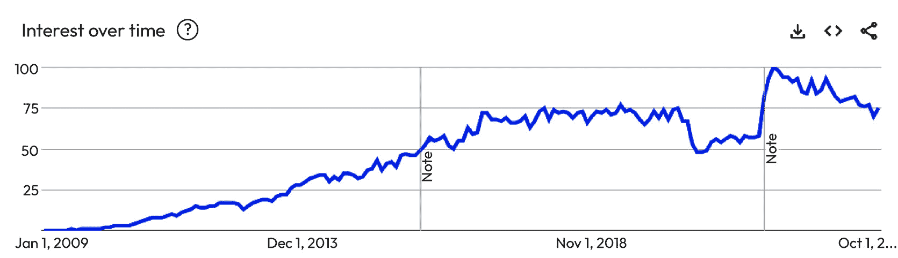
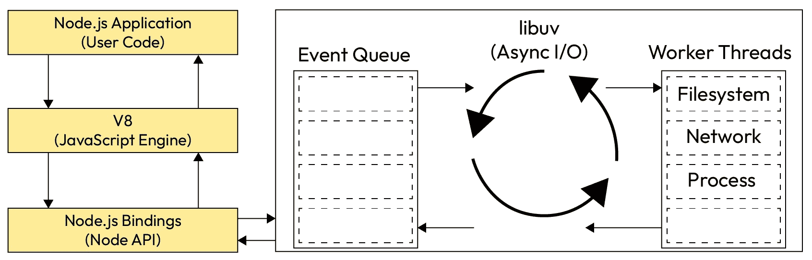
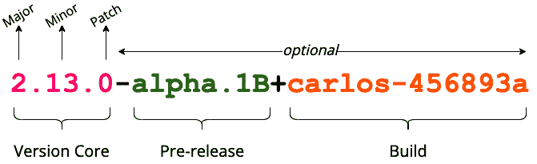
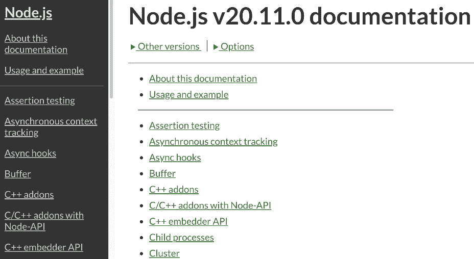
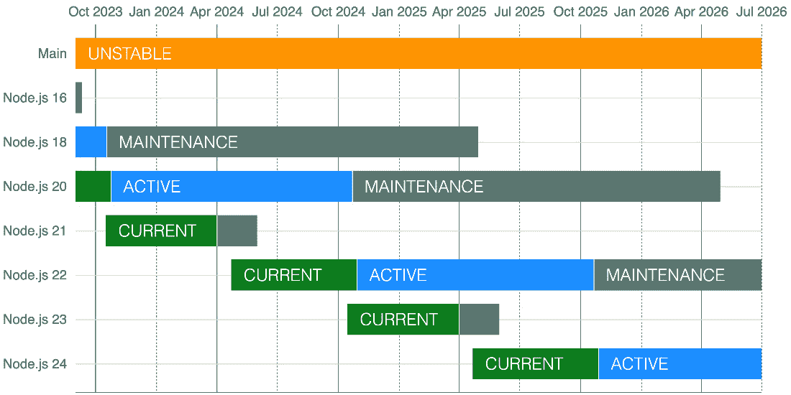

# 1

# Node.js 简介

欢迎来到本书的第一章！Node.js 是最相关的技术之一，它允许您在同一堆栈内构建任何类型的项目（Web、桌面、CLI 工具、微服务、物联网等）。围绕这个项目的社区非常强大且富有创新精神。

在本章中，我们将探讨 Node.js 的主要特性和它为何随着时间的推移而变得如此受欢迎。然后，我们将探讨 Node.js 的架构以及它是如何工作的。最后，我们将探讨我们可用的不同版本的 Node.js。

在本章中，我们将涵盖以下主要主题：

+   使 Node.js 如此特别并使其成为革命性技术的因素是什么

+   Node.js 的架构和它的工作原理

+   如何确定适合您项目的正确 Node.js 版本

这项知识将帮助您决定何时适合您的项目，并引导您了解复杂的生态系统。

# 技术要求

本章的代码文件可以在 [`github.com/PacktPublishing/NodeJS-for-Beginners`](https://github.com/PacktPublishing/NodeJS-for-Beginners) 找到。

# 为什么 Node.js 如此受欢迎？

Node.js 的官方定义非常简单，但它并没有解释为什么 Node.js 随着时间的推移变得如此受欢迎：

*“*Node.js® 是一个开源的、跨平台的 JavaScript 运行时环境。*”

在 *图 1.1* 中，我们可以看到 Node.js 的流行度是如何随着时间的推移而增加的，甚至至今仍在快速增长。

图 1.1 – 使用 Google Trends 生成的 Node.js 兴趣度

接下来，让我们探讨 Node.js 如此受欢迎的主要原因。

## 轻量级且快速

Node.js 是一个基于 V8 JavaScript 引擎的轻量级且快速的运行时环境，V8 引擎同样也是 Google Chrome 和 Microsoft Edge 等浏览器所使用的引擎。它基于单线程架构和事件驱动模型，这意味着它不需要为每个请求创建一个新的线程，就像其他流行的工具如 PHP 那样。这是一个巨大的优势，因为内存消耗非常低，性能非常高。

我们将在接下来的章节中详细探讨单线程架构。

## 跨平台和多用途

Node.js 是跨平台的，这意味着我们可以在现代市场上任何可用的操作系统和架构上运行它。

Node.js 不仅用于构建 Web 应用程序，还可以用于构建任何类型的应用程序，从简单的命令行工具到复杂的桌面应用程序，如 Slack 或 Visual Studio Code。

## 学习曲线平缓

Node.js 基于 JavaScript，这是世界上最流行的编程语言之一。这意味着数百万的开发者已经熟悉这门语言，他们可以轻松地开始使用 Node.js。

任何可以用 JavaScript 编写的应用程序最终都会用 JavaScript 编写。

– Jeff Atwood (Atwood’s Law)

此外，Node.js 的 **应用程序编程接口**（**API**）——Node.js 为我们提供的用于使用的各种方法、库和实用工具——非常简单且易于使用，因此学习曲线非常小。你不需要精通 Node.js API 就可以开始构建 Web 应用程序；你可以在构建应用程序的同时逐步学习。

学习 Node.js 的资源非常丰富，从官方文档到多种语言的在线课程和教程，面向不同的用户群体。

## 生态系统

Node.js 拥有一个庞大的生态系统，包括社区开发的包、JavaScript 库和资源，可用于构建任何类型的应用程序。npm 注册表中提供了超过两百五十万个包 ([`www.npmjs.com/`](https://www.npmjs.com/))，这是 Node.js 的官方包管理器。

此外，Node.js 获得了云服务提供商的大力支持，这意味着你可以轻松地将你的应用程序部署到云端，并根据需要扩展它。

大多数新兴技术都为 Node.js 提供了 **软件开发工具包**（**SDKs**），因此你可以轻松地将你的应用程序与它们集成。许多公司都在生产中使用 Node.js，因此你可以轻松找到支持和资源来解决你可能遇到的任何问题。

此外，许多流行的库都是同构的，这意味着它们可以在浏览器和服务器中使用，因此你可以重用你的代码并避免重复。

## 社区驱动

对我来说，Node.js 如此受欢迎的最重要原因是社区。Node.js 拥有一个庞大的开发者社区，他们不断为项目做出贡献。这意味着你可以轻松找到支持和资源来解决你可能遇到的任何问题，也可以包括新功能或解决特定的错误。

Node.js 基金会在 2019 年与 JS 基金会合并，成立了 OpenJS 基金会 [`openjsf.org/`](https://openjsf.org/)，这是目前管理 Node.js 项目以及其他 JavaScript 生态系统中的关键项目（如 Appium、jQuery、Electron、Express 和 webpack）的组织。

重要信息

你可以在 [`openjsf.org/about/governance/`](https://openjsf.org/about/governance/) 找到 OpenJS 基金会的治理模式，以及在 [`nodejs.org/en/about/governance`](https://nodejs.org/en/about/governance/) 找到 Node.js 项目的治理模式。

许多公司都是 OpenJS 基金会的成员，例如 Google、IBM、Microsoft、Netflix、Red Hat、GitHub 以及许多其他公司 ([`openjsf.org/about/members/`](https://openjsf.org/about/members/))。这些公司为保持项目活力提供了大量的支持和资源。

如你所见，许多因素都在帮助 Node.js 变得如此受欢迎，从经过验证的社区驱动模式到一个为 Node.js 带来许多能力的稳固生态系统。看起来 Node.js 在未来仍将保持流行！

在下一节中，我们将探讨底层架构是如何工作的。

# Node.js 的单线程架构

当 Node.js 在 2009 年推出时，它是 Web 开发世界的一次革命，因为 Node.js 的创造者 Ryan Dahl 当时决定采用一个非常不寻常的方法：单线程架构。

在他的 JSConf ([`www.youtube.com/watch?v=EeYvFl7li9E`](https://www.youtube.com/watch?v=EeYvFl7li9E)) 上的 Node.js 演讲中，Ryan Dahl 说他构建 Node.js 时想要实现两个关键目标：服务器端 JavaScript 和非阻塞 I/O。

## I/O 需要以不同的方式完成

在 Web 应用程序中，I/O 操作的一般方法是为每个请求创建一个新的线程。这是一个非常昂贵的操作，因为内存消耗很高，性能很低。

这种方法的理念是将系统资源分割并分配给每个线程。这是一个非常低效的方法，因为大多数时候，CPU 都是空闲的，只是在等待资源。

另一个问题是我们可使用的内存量有限，因为每个线程都需要有自己的内存空间。

总体来说，这个过程非常低效，而且不具有可扩展性。

## 非阻塞 I/O

在 Node.js 中，我们采用不同的方法。我们不会分割资源；我们保持一个单线程，并使用非阻塞 I/O 模型，这允许我们在等待时释放资源，因此我们可以继续处理请求。

为了实现这一点，Node.js 有两个关键依赖：libuv ([`libuv.org/`](https://libuv.org/)) 和 V8 ([`v8.dev/`](https://v8.dev/))。

图 1.2 – 展示用户代码、V8、Node API 和 libuv（事件队列和工作线程）之间关系的图

如您所见，这个架构有很多部分，一开始可能会有些令人不知所措。这个图并不是完整的画面，但它是一个理解本章中 Node.js 工作原理的好起点。从这个图中可以理解很多内容，所以让我们一步一步来。

### Node.js 应用程序

这是构建我们应用程序的代码。它将使用 JavaScript 编写，并可以使用 Node.js API 和第三方库。

### V8

这是 Node.js 中封装的引擎，它将执行我们的 JavaScript 代码。V8 是 Chrome 浏览器底层使用的相同引擎。

### Node.js 绑定

对于许多开发者来说，看到 Node.js 主要是用 C/C++编写的可能会感到惊讶，但这是 Node.js 如此快速的一个原因。Node.js 的绑定是当我们在底层使用 Node.js API 时将被执行的 C/C++代码。

### libuv

这是一个支持多平台的 C 库，它将处理 I/O 操作。它将使用线程池来执行阻塞操作，并在操作完成后通知 Node.js 绑定。我们将通过定义在特定异步操作完成后将执行的函数来编程 Node.js。例如，当我们尝试从文件中读取内容时，当内容可用时，我们将执行某些代码。libuv 处理这种协调的低级逻辑。

## 深入了解事件循环

事件循环是 Node.js 架构中最关键的部分。牢记这一点将有助于你理解 Node.js 的工作原理。

正如我们之前所看到的，新的 I/O 操作方法并非魔法，而是一种非常聪明的处理和抽象异步层的方式，这种异步层可以用 JavaScript 轻松处理。这引出了我们需要了解如何进行异步编程的需求。我们将在*第四章*中更详细地介绍这个主题，但就目前而言，我们需要理解事件循环是如何工作的。

深入理解事件循环的一个绝佳资源是 Philip Roberts 在 JSConf EU 2014 上的这次演讲：*究竟什么是事件循环？* ([`www.youtube.com/watch?v=8aGhZQkoFbQ`](https://www.youtube.com/watch?v=8aGhZQkoFbQ))。它还包括一个名为 Loupe ([`latentflip.com/loupe`](http://latentflip.com/loupe)) 的工具，你可以用它自己实验事件循环架构。

如你所见，Node.js 是结合了多种技术的产物。事件循环是一个相当高级的话题，你需要一些时间来消化和完全理解，但不用担心，即使你还没有完全清楚事件循环以及所有部件是如何协同工作的，你仍然可以开始使用 Node.js。你可以在书中的练习中更好地了解它。现在，让我们探索 Node.js 是如何组织版本的。

# Node.js 版本

Node.js 遵循**语义版本化**（**SemVer**）([`semver.org/`](https://semver.org/))，为了选择最适合项目的版本，理解这种版本化工作方式非常重要。

## 语义版本化（SemVer）

在考虑语义版本化时，有助于确定作为用户可以预期哪些变化，特别是它们是否可能造成中断。这种理解有助于我们的最终用户为潜在更新做好准备。

语义版本化是软件版本化中最受欢迎的方式之一。在下面的图中，我们可以区分构建发布版本所使用的元素。

图 1.3 – 语义版本号的组成部分（来源：Devopedia 2020，[`devopedia.org/images/article/279/2766.1593275997.svg`](https://devopedia.org/images/article/279/2766.1593275997.svg))

当发布新版本时，版本号将根据 SemVer 规则递增：

+   **主要**版本添加了不兼容的 API 更改

+   **次要**版本以向后兼容的方式添加功能

+   **修补**版本添加了向后兼容的错误修复

遵循这些规则，我们可以在任何项目中轻松升级 Node.js 版本，而不会在变更被列为次要或修补时破坏代码。

如果我们想升级到新主要版本，我们需要在升级前检查是否有任何需要解决的破坏性变更。在大多数情况下，破坏性变更与我们自己的代码无关，而是与我们在项目中使用的依赖项有关。

重要提示

**元数据**是可选的，它不用于定义软件版本，但提供额外信息。通常，我们将尽量避免使用带有元数据的版本，因为它们不是稳定版本，但它们可以用于测试目的。

## 发布详细信息

在我们继续到发布计划之前，了解我们如何检查任何发布的详细信息非常重要。如果我们计划升级到主要版本，这一点尤为重要，因为其中包含破坏性变更。

在这种情况下，我们将分析 Node.js 20.0.0 版本发布，这样我们就可以通过博客详情看到最新 LTS 版本的详细信息：[`nodejs.org/en/blog/release/v20.0.0/`](https://nodejs.org/en/blog/release/v20.0.0/)。

每个发布都有一个包含以下信息的结构化博客文章：

+   **摘要**：在这里，我们可以找到发布的一个简要描述。

+   **显著变更**：在这里，我们可以找到发布中的最重要的变更，包括示例以及新功能或弃用背后的许多上下文。我们还可以看到可能影响 Node.js API 的依赖项中的更多相关变更。

+   **Semver-(*) 提交**：在这里，我们可以找到与 SemVer 变更相关的提交（**Semver-Major 提交**、**Semver-Minor 提交**和**Semver-Patch 提交**）并直接使用*提交*引用访问代码变更。

信息

发布信息直接在变更日志中提供。变更日志版本包括对包含在发布中的所有提交和拉取请求的引用，因此当您需要从另一个 Node.js 版本迁移时，它是一个极好的信息来源。您可以在[`github.com/nodejs/node/blob/main/doc/changelogs/CHANGELOG_V20.md#2023-04-18-version-2000-current-rafaelgss`](https://github.com/nodejs/node/blob/main/doc/changelogs/CHANGELOG_V20.md#2023-04-18-version-2000-current-rafaelgss)找到变更日志版本。

探索发布中变更的最好方法之一是直接使用 Node.js 文档——例如，[`nodejs.org/dist/latest-v20.x/docs/api/`](https://nodejs.org/dist/latest-v20.x/docs/api/)。网站提供了导航不同版本的选择，这样我们可以更轻松地检查版本间的 API 变更。

图 1.4 – Node.js 官方文档截图

## 发布时间表

Node.js 项目有一个发布时间表，该时间表发布在官方网站上（[`nodejs.org/en/about/releases/`](https://nodejs.org/en/about/releases/)），并由 Node.js 发布工作组更新。

图 1.5 – 来自 Node.js 网站的官方发布时间表

在 Node.js 中，发布有三个不同的阶段：

+   **当前** 阶段是向项目中添加新功能（非主要变更）的阶段。这个阶段非常活跃，并不总是建议在生产环境中使用它，因为它不是一个稳定的版本。

+   **活跃长期支持**（**LTS**）阶段是版本稳定并由 LTS 团队更新的阶段。这个阶段仍然包括新功能、错误修复和更新。这个阶段是稳定的，因此建议在生产环境中使用它。

+   **维护** 阶段是版本不再接收任何新功能，只进行关键错误修复和安全更新的阶段。这个阶段适用于那些尚未能够升级到最新活跃 LTS 版本的项目。

重要提示

奇数发布行不会被提升为活跃 LTS，因此不建议用于生产环境。

截至目前，对于任何新的项目，我建议使用最新的 LTS 版本，即 20.11.0。这个版本将得到支持直到 2026 年 4 月，因此对于任何新的项目来说都是一个不错的选择。

对于任何正在使用 Node.js v18 的现有项目，建议开始迁移到 Node.js 20，因为 v18 正进入 *维护* 阶段。

重要提示

虽然发布新版本看起来像是一项简单的任务，但实际上并非如此。发布工作组已经定义了完整的流程，其中包括超过 20 个步骤。您可以在官方文档（[`github.com/nodejs/node/blob/main/doc/contributing/releases.md`](https://github.com/nodejs/node/blob/main/doc/contributing/releases.md)）或这次演讲中找到所有相关信息：丹妮尔·亚当斯在 NodeConf EU 2022 上的 *Node.js 发布的生命周期*（[`www.youtube.com/watch?v=OiSBodpU174`](https://www.youtube.com/watch?v=OiSBodpU174)）。

# 摘要

在本章中，我们探讨了是什么让 Node.js 如此特别，以及它与其他后端系统的不同之处。我们还介绍了 Node.js 的历史以及它是如何随着时间发展的。

此外，我们介绍了 Node.js 架构及其内部工作原理。我们学习了事件循环以及它是如何使 Node.js 高效地处理许多并发请求的。

在下一章中，我们将学习如何设置开发环境并开始使用 Node.js。

# 进一步阅读

+   Node.js 治理：[`nodejs.org/en/about/governance`](https://nodejs.org/en/about/governance)

+   OpenJS 基金会治理：[`openjsf.org/about/governance/`](https://openjsf.org/about/governance/)

+   *《Node.js 发布的生命与时代》，由 Danielle Adams 在 NodeConf EU 2022 上发表*：[`www.youtube.com/watch?v=OiSBodpU174`](https://www.youtube.com/watch?v=OiSBodpU174)

+   Node.js 依赖项：[`github.com/nodejs/node/blob/main/doc/contributing/maintaining/maintaining-dependencies.md`](https://github.com/nodejs/node/blob/main/doc/contributing/maintaining/maintaining-dependencies.md)

+   Node.js 事件循环架构：[`medium.com/preezma/node-js-event-loop-architecture-go-deeper-node-core-c96b4cec7aa4`](https://medium.com/preezma/node-js-event-loop-architecture-go-deeper-node-core-c96b4cec7aa4)

+   *《Node.js 自我引导》，2019 版本，作者 Joyee Cheung，Igalia*：[`www.youtube.com/watch?v=bwiLlcGvFEk`](https://www.youtube.com/watch?v=bwiLlcGvFEk)

+   *《Node.js 12：Node.js 的十年》，作者 Beth Griggs，IBM*：[`www.youtube.com/watch?v=HP4N0u_dEgI`](https://www.youtube.com/watch?v=HP4N0u_dEgI)

+   *《Node.js 2023 年回顾》文章*：[`blog.rafaelgss.dev/nodejs-2023-year-in-review`](https://blog.rafaelgss.dev/nodejs-2023-year-in-review)
