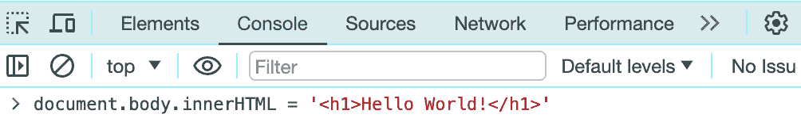
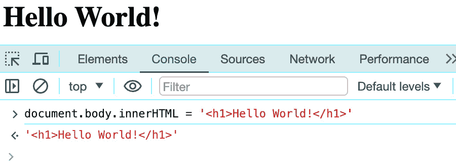
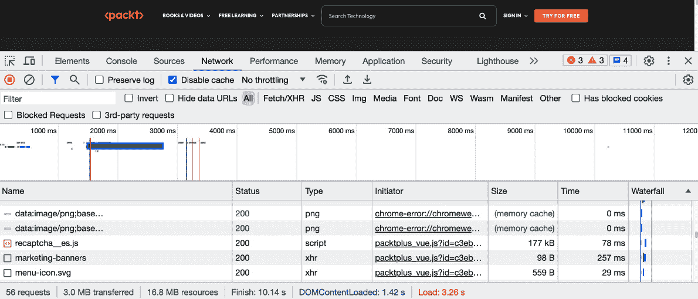

# 2

# 设置开发环境

要使用 Node.js，我们首先需要准备我们的开发环境。在本章中，我们将详细介绍如何安装 Node.js 并检查一切是否按预期工作，以便我们能够执行 JavaScript 和 Node.js。

Node.js 是一种非常简单且易于安装的软件，因此我们不会在这个主题上花费太多时间。然而，我们将介绍一些重要的细节，这些细节对于你能够在任何环境中使用 Node.js 至关重要。

总结一下，以下是本章我们将探讨的主要主题：

+   在任何环境中安装 Node.js

+   管理 Node.js 版本

+   使用 Chrome DevTools 和 Node.js REPL 与 JavaScript 和 Node.js 交互。

在本章中，你将学习如何在任何环境中正确设置 Node.js，例如 Windows、Linux 或 macOS。这些知识在你将项目部署到云端或特定设备时也同样适用。

此外，你还将学习如何使用浏览器内嵌的调试工具和 Node.js REPL 来调试任何问题。

最后，你将学习如何管理在同一台机器上运行的多个 Node.js 版本。当你需要在不同的 Node.js 版本之间迁移项目时，这项技能将非常有用。

# 技术要求

本章的代码文件可以在[`github.com/PacktPublishing/NodeJS-for-Beginners`](https://github.com/PacktPublishing/NodeJS-for-Beginners)找到。

查看本章在[`youtu.be/xElsOS9Pz4k`](https://youtu.be/xElsOS9Pz4k)上的代码执行视频。

# 在 macOS、Windows 和 Linux 上安装 Node.js

Node.js 可以通过三种不同的方式安装：

+   **从官方网站下载二进制文件**：这是初学者的推荐选项，因为这是安装 Node.js 最简单的方法。你只需从官方网站下载二进制文件并运行安装程序即可。

+   **使用包管理器**：这是在 Linux、FreeBSD、IBM i、Android 和类似环境中安装 Node.js 最常见的方式。你只需使用你的系统包管理器并从那里安装 Node.js 即可。

+   **从源码构建**：这是安装 Node.js 最先进的方法，它打开了众多自定义的大门，并且仅推荐给高级用户。你需要从官方仓库下载源代码并在你的机器上编译它。

重要提示

作为 Node.js 持续集成的一部分，Node.js 在许多不同的环境和架构中进行测试，这意味着 Node.js 随着时间的推移保持了稳定的跨平台支持。

在撰写本书时，最新的 Node.js 版本是 20.11.0，因此我们将使用这个版本作为参考。然而，你可以使用可用的最新 LTS 版本，因为所有版本的安装过程都是相同的。

接下来的部分将解释如何在各种操作系统上安装 Node.js，从 macOS 开始。

## macOS

在 macOS 上安装 Node.js 最简单的方法是从官方网站下载二进制文件。您只需访问 Node.js 下载页面[`nodejs.org/en/download/`](https://nodejs.org/en/download/)，下载 macOS 安装程序，并按照安装向导进行操作。

您也可以使用包管理器安装 Node.js，但这对初学者来说并不推荐。如果您想使用包管理器安装 Node.js，可以使用 Homebrew ([`brew.sh/`](https://brew.sh/)) 或 MacPorts ([`www.macports.org/`](https://www.macports.org/))。

要使用 Homebrew，打开您的终端并输入以下命令，该命令将为您管理安装过程：

```js
brew install node
```

要使用 MacPorts，打开终端并输入以下命令以启动安装过程：

```js
port install nodejs20
```

接下来，我们将看看如何在 Windows 上安装它。

## Windows

在 Windows 上安装 Node.js 最简单的方法是从官方网站下载二进制文件。

您只需访问 Node.js 下载页面[`nodejs.org/en/download/`](https://nodejs.org/en/download/)，下载 Windows 安装程序，并按照安装向导进行操作。

接下来，我们将看看如何在 Linux 上安装它。

## Linux

最好的方法是使用您的包管理器安装 Node.js，但您也可以使用 NodeSource 分发的二进制文件([`github.com/nodesource/distributions/blob/master/README.md`](https://github.com/nodesource/distributions/blob/master/README.md))。这将涵盖基于 Debian 和 Ubuntu 的发行版（deb）以及基于企业 Linux 的发行版（rpm）。

让我们以 Ubuntu 为例。

首先，使用`curl`从 NodeSource 下载设置脚本：

```js
curl -sL https: //deb .nodesource. com/setup_20\. x -o / tmp/ nodesource_setup. sh
```

然后，检查脚本的内容（可选）：

```js
cat /tmp/nodesource_setup.sh
```

最后，以`root`用户身份执行脚本并安装 Node.js：

```js
sudo bash /tmp/nodesource_setup.sh
sudo apt install nodejs
```

## 其他环境

Node.js 构建工作组提供了一个官方平台列表，其中包括所有受支持的平台和架构及其不同级别的支持。您可以在[`github.com/nodejs/node/blob/main/BUILDING.md#platform-list`](https://github.com/nodejs/node/blob/main/BUILDING.md#platform-list)找到它。

此外，Node.js 还有一个名为非官方构建项目的倡议，为其他平台和架构提供支持，包括`loong64`、`riscv64`、`linux-armv6l`、`linux-x86`、`linux-x64-glibc-217`和`linux-x64-musl`。更多信息请见[`github.com/nodejs/unofficial-builds`](https://github.com/nodejs/unofficial-builds)。

如果您对 Docker 有扎实的技能，您还可以使用 Node.js 提供的官方 Docker 镜像来避免在您的机器上安装 Node.js 二进制文件([`hub.docker.com/_/node`](https://hub.docker.com/_/node))。

## 验证安装

Node.js 与 npm 一起提供。我们现在将检查 Node.js 和 npm 是否正确安装。安装的版本可能因您安装的 Node.js 版本而异，但如果它没有抛出错误，则安装正确。

我们将使用终端来检查这两个（Node.js 和 npm）的安装是否正确完成。

要验证 Node.js 的安装，请打开你的终端并输入以下命令：

```js
node –v
```

预期的输出是已安装的 Node.js 版本：

```js
v20.11.0
```

要验证 npm 是否已安装，请输入以下命令：

```js
npm -v
```

预期的输出是已安装的 npm 版本：

```js
10.2.4
```

恭喜！你已经在你的机器上安装了 Node.js！在下一节中，我们将熟悉 Node.js 版本，以便我们更好地了解我们应该为我们的下一个项目使用哪个 Node.js 版本。

# 管理 Node.js 版本

Node.js 是一个快速发展的项目，因此每隔几个月就会发布新版本。为了管理机器上的 Node.js 版本，你需要使用 Node.js 版本管理器。

可用的 Node.js 版本管理器有很多，但最流行的是以下这些：

+   **Node 版本管理器**（**nvm**）: [`github.com/nvm-sh/nvm`](https://github.com/nvm-sh/nvm)

+   **n**：[`github.com/tj/n`](https://github.com/tj/n)

+   **Fast Node Manager**（**fnm**）: [`github.com/Schniz/fnm`](https://github.com/Schniz/fnm)

+   **Volta**: [`github.com/volta-cli/volta`](https://github.com/volta-cli/volta)

在这本书中，我们将使用 nvm 作为 Node.js 版本管理器，但你也可以使用你喜欢的任何其他版本管理器。

重要信息

在生产环境中，你应该使用可用的最新 LTS 版本，因为这个版本最稳定，并且支持时间更长。在大多数情况下，你不需要在生产机器上安装版本管理器，因为你将使用特定的版本。

既然我们已经熟悉了 Node.js 版本的组织方式，我们将需要一些工具来帮助我们处理同一环境中多个 Node.js 版本。我们将在下一节中介绍 nvm。

# 使用 nvm 管理 Node.js

nvm 是在机器上管理多个 Node.js 版本最流行且适合初学者的方式。

我使用 nvm 来管理我的 Node.js 版本，因为它是一个非常好的工具，但 nvm 的安装可能有些棘手，所以你需要仔细遵循安装说明。有关常见问题和解决方案的故障排除指南请参阅 [`github.com/nvm-sh/nvm#installing-and-updating`](https://github.com/nvm-sh/nvm#installing-and-updating)。

这是我在 macOS 上安装 nvm 的首选方式，因为它是最容易安装的方式：

```js
brew install nvm
```

对于 Linux 和 macOS，从官方仓库下载并执行安装脚本：

```js
curl -o- https: //raw. githubusercontent. com/ nvm- sh/ nvm/v0\. 39.3/install. sh | bash
```

nvm 在 Windows 上不工作，所以如果你使用 Windows，你需要使用另一个版本管理器或 **Windows Subsystem for Linux**（**WSL**）。

Windows 上 nvm 的替代方案如下：

+   nodist: [`github.com/nullivex/nodist`](https://github.com/nullivex/nodist)

+   nvm-windows: [`github.com/coreybutler/nvm-windows`](https://github.com/coreybutler/nvm-windows)

+   **Node 版本切换器**（**NVS**）: [`github.com/jasongin/nvs`](https://github.com/jasongin/nvs)

安装 nvm 后，您可以使用它来安装和管理 Node.js 版本。

## 安装和使用版本

为了使用特定的 Node.js 版本，您首先需要安装它：

```js
nvm install 20.11.0
```

然后，您可以使用它：

```js
nvm use 20.11.0
# Now using node v20.11.0 (npm v10.2.4)
```

您可以使用以下命令检查正在使用的 Node.js 版本：

```js
node -v
# v20.11.0
```

您还可以为您的机器设置默认的 Node.js 版本：

```js
nvm alias default 20.11.0
```

您可以使用 `ls` 命令列出已安装的 Node.js 版本：

```js
nvm ls
```

输出将是一个已安装的所有 Node.js 版本的列表。

您可以使用 `ls-remote` 命令列出可用的 Node.js 版本：

```js
nvm ls-remote
```

输出将是一个所有可用 Node.js 版本的长列表！

随着时间的推移，我们往往会累积多个 Node.js 版本，因此卸载不再使用的 Node.js 版本是一个良好的实践。

要卸载 Node.js 版本，您需要使用 `uninstall` 命令：

```js
nvm uninstall 20.11.0
```

## 使用 .nvmrc 文件

您还可以使用 `.nvmrc` 文件来指定项目中想要使用的 Node.js 版本。当您与其他开发者合作开发项目，并确保每个人都使用相同的 Node.js 版本时，这非常有用。

要使用 `.nvmrc` 文件，您需要在项目的根目录下创建一个名为 `.nvmrc` 的文件，并指定您想要使用的 Node.js 版本：

```js
20.11.0
```

然后，当您进入项目目录并运行以下命令时，nvm 可以使用 `.nvmrc` 文件中指定的 Node.js 版本：

```js
nvm use
# Now using node v20.11.0 (npm v10.2.4)
```

如果 `.nvmrc` 文件中指定的 Node.js 版本尚未安装，nvm 将抛出错误，并且不会更改正在使用的 Node.js 版本：

```js
Found '/<full path>/.nvmrc' with version <20.11.0>
N/A: version "20.11.0 -> N/A" is not yet installed.
You need to run "nvm install 20.11.0" to install it before using it.
```

如果您运行命令而文件未找到，nvm 将抛出错误：

```js
No .nvmrc file found
Please see `nvm --help` or https: //github. com/nvm- sh/ nvm#nvmrc for more information.
```

现在我们已经熟悉了 nvm 的使用方法，是时候开始在终端中使用 Node.js 了，因此在下节中，我们将探讨如何在交互式环境中使用 Node.js REPL。

## Node.js REPL

是的，Node.js 有一个 REPL，并且它在测试代码和尝试新事物时非常有用。

**REPL** 代表 **Read-Evaluate-Print Loop**，它是一个简单的交互式计算机编程环境，接受单个用户输入，执行它们，并将结果返回给用户。

要启动 Node.js REPL，您需要运行不带任何参数的 `node` 命令。输出将类似于以下内容：

```js
Welcome to Node.js v20.11.0.
Type ".help" for more information.
>
```

现在，您可以开始编写 JavaScript 代码，它将被立即执行：

```js
> console.log("The Node.js REPL is awesome!")
"The Node.js REPL is awesome!"
undefined
> 1 + 1
2
>
```

要退出 REPL，您可以使用 `.exit` 命令：

```js
> .exit
```

您还可以使用 `.help` 命令来获取所有可用命令的列表：

```js
> .help
.break    Sometimes you get stuck, this gets you out
.clear    Alias for .break
.editor   Enter editor mode
.exit     Exit the REPL
.help     Print this help message
.load     Load JS from a file into the REPL session
.save     Save all evaluated commands in this REPL session to a file
Press Ctrl+C to abort current expression, Ctrl+D to exit the REPL
```

如您所见，Node.js REPL 非常简单，但它在测试代码和尝试新事物时非常有用。您可以在官方文档中了解更多关于 Node.js REPL 的信息：[`nodejs.org/en/learn/command-line/how-to-use-the-nodejs-repl`](https://nodejs.org/en/learn/command-line/how-to-use-the-nodejs-repl)。

除了 Node.js REPL，我们还可以使用网络浏览器来调试和测试我们的 JavaScript 代码。在下一节中，我们将使用 Google Chrome 来演示这一点。

# 使用 Chrome DevTools 与 JavaScript 交互

Chrome 浏览器中包含了一组工具（[`developer.chrome.com/docs/devtools/overview/`](https://developer.chrome.com/docs/devtools/overview/)），定义如下：

“Chrome DevTools 是一套直接构建在 Google Chrome 浏览器中的 Web 开发者工具。DevTools 可以帮助你实时编辑页面并快速诊断问题，这最终有助于你更快地构建更好的网站。”

所有基于 Chrome 的浏览器都有 Chrome DevTools，因此你可以使用任何基于 Chromium 的浏览器，如 Google Chrome、Microsoft Edge、Brave 等。

Node.js 的 REPL 非常有用，但为了使用 Node.js 构建 Web 应用，我们可以使用 Chrome DevTools 进行调试。这种调试将仅限于客户端 JavaScript，因为 Node.js 代码不是在浏览器中直接执行的。

Chrome DevTools 是一个非常完整的工具，因此一开始可能会让人感到有些不知所措，但我们将专注于本书最重要的功能：**控制台**和**网络**面板。

## 控制台面板

控制台面板是与网站上的 JavaScript 交互的主要方式。控制台是交互式的，因此我们可以编写 JavaScript 代码，它将立即执行；我们还可以读取控制台输出。

以下视频提供了该工具的概述：[`www.youtube.com/watch?v=76U0gtuV9AY`](https://www.youtube.com/watch?v=76U0gtuV9AY)。

你可以在这里阅读官方文档：[`developer.chrome.com/docs/devtools/console/`](https://developer.chrome.com/docs/devtools/console/)。

## 网络面板

网络面板非常强大。它允许我们检查 HTTP 请求和响应，以便我们可以看到头部、主体、状态码等。当我们需要调试任何类型的 Web 应用时，这将非常有用。你可以在[`www.youtube.com/watch?v=e1gAyQuIFQo`](https://www.youtube.com/watch?v=e1gAyQuIFQo)找到一个很好的教程。

你可以在这里阅读官方文档：[`developer.chrome.com/docs/devtools/network/`](https://developer.chrome.com/docs/devtools/network/)。

## 使用 Chrome DevTools

在我们的案例中，我们将从一个空网站开始。我们将使用控制台面板来编写将改变页面的 JavaScript 代码，然后我们将检查 HTTP 请求。按照以下步骤操作：

1.  在你的浏览器中，前往`about:blank`；默认情况下，这将显示一个空白页面。

1.  通过右键单击页面并点击**检查**来打开 DevTools。

1.  前往`document.body.innerHTML = '<h1>Hello World!</h1>'`并按*Enter*。



图 2.1 – Web 浏览器截图

1.  现在，你应该能在页面上看到**Hello World!**文本。



图 2.2 – 包含 Hello World!文本的 Web 浏览器截图

1.  前往**网络**选项卡并导航到[`packt.com`](https://packt.com)。你应该会看到很多活动。



图 2.3 – 网络浏览器活动

这是一个简单的示例，让您熟悉 Chrome DevTools，但您可以用它做更多的事情。我建议您阅读官方文档以了解更多信息。

# 摘要

恭喜！您的环境已准备好开始使用 Node.js 开发新项目！

在本章中，我们探讨了在各个操作系统上安装 Node.js 的过程。Node.js 与 Windows、macOS 和 Linux 兼容，但我们还研究了其他操作系统的安装过程，包括非官方支持的系统。

此外，我们还深入探讨了使用 nvm 来管理多个 Node.js 版本的方法。nvm 允许您轻松地在不同的 Node.js 版本之间切换。这在处理需要特定 Node.js 版本的项目或测试不同版本之间的兼容性时尤其有用。

此外，本章还涵盖了 Node.js REPL 和 Chrome DevTools 的使用。Node.js REPL 是一个交互式外壳，允许开发者实验 JavaScript 代码，执行命令，并立即看到输出。它提供了一个方便的环境，可以快速测试代码和调试问题。Chrome DevTools 是一组内置在 Google Chrome 浏览器中的网络开发工具。它允许开发者检查和调试 JavaScript 代码，以及调试网络请求等。

在下一章中，我们将学习 JavaScript 的基础知识。您将使用 Chrome DevTools 和 Node.js REPL 来运行示例并进行实践。

# 进一步阅读

+   如何安装 Node.js: [`nodejs.org/en/learn/getting-started/how-to-install-nodejs`](https://nodejs.org/en/learn/getting-started/how-to-install-nodejs)

+   从源代码构建 Node.js: [`github.com/nodejs/node/blob/main/BUILDING.md`](https://github.com/nodejs/node/blob/main/BUILDING.md)

+   Node.js 非官方构建项目: [`github.com/nodejs/unofficial-builds`](https://github.com/nodejs/unofficial-builds)

+   Node.js 支持的官方平台列表: [`github.com/nodejs/node/blob/main/BUILDING.md#platform-list`](https://github.com/nodejs/node/blob/main/BUILDING.md#platform-list)

+   NodeSource 分发的 Node.js 二进制文件: [`github.com/nodesource/distributions/blob/master/README.md`](https://github.com/nodesource/distributions/blob/master/README.md)

+   官方 Node.js Docker 镜像: [`hub.docker.com/_/node`](https://hub.docker.com/_/node)

+   如何使用 Node.js REPL: [`nodejs.org/en/learn/command-line/how-to-use-the-nodejs-repl`](https://nodejs.org/en/learn/command-line/how-to-use-the-nodejs-repl)

+   Chrome DevTools – 控制台: [`developer.chrome.com/docs/devtools/console/`](https://developer.chrome.com/docs/devtools/console/)

+   Chrome DevTools – 网络: [`developer.chrome.com/docs/devtools/network/`](https://developer.chrome.com/docs/devtools/network/)
