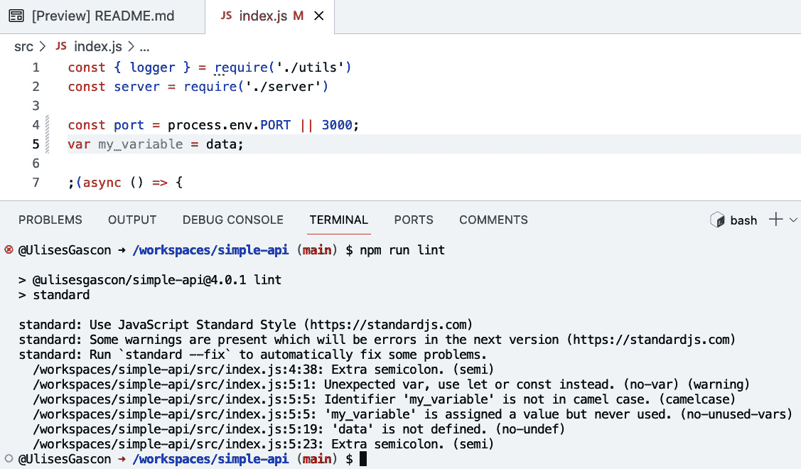

# 第三章：JavaScript 基础

在本章中，我们将回顾与本书相关的所有 JavaScript 方面。虽然这个主题本身可以是一本独立的书籍，但本章综合了最基本的部分（数组、对象、字符串和数据类型），以便对最复杂的部分进行更深入的分析，例如函数和闭包。

即使你已经熟悉 JavaScript，这一章也会帮助你刷新某些领域的知识。此外，你还将了解由最新规范引入的 JavaScript 的最新变化。

我们还将学习 JavaScript 如何成为在语言请求变更时做出决策的标准。

此外，我们还将回顾一些工具，这些工具将帮助我们通过使用代码风格检查器、调试工具和适当的代码文档来编写更好的 JavaScript。

总结一下，以下是本章我们将探讨的主要主题：

+   刷新或获取 JavaScript 知识，包括其许多特性

+   理解 JavaScript 版本和 TC39 委员会

+   熟悉 JavaScript 文档和代码风格检查

+   理解 JavaScript 中最常用的部分（注释、数据类型、运算符、条件语句、循环、函数、对象、数组等）

+   理解高级 JavaScript 概念，如闭包和原型

# 技术要求

本章的代码文件可以在[`github.com/PacktPublishing/NodeJS-for-Beginners`](https://github.com/PacktPublishing/NodeJS-for-Beginners)找到。

查看本章代码的实际操作视频，请访问[`youtu.be/BxM8XZzINmg`](https://youtu.be/BxM8XZzINmg)

# JavaScript 是一种强大的语言

JavaScript 是一种非常强大的语言。它被用于前端、后端、移动、桌面、物联网等领域。它非常灵活，而且很容易入门，但深入掌握它也非常困难。

Douglas Crockford 有一句非常著名的引言（[`www.crockford.com/javascript/javascript.html`](https://www.crockford.com/javascript/javascript.html)）说：

JavaScript 是世界上被误解最多的编程语言。

JavaScript 是一种多范式语言，这意味着你可以使用不同的编程风格，如面向对象编程、函数式编程或声明式编程。这非常有用，因为你可以使用最适合你需求的编程风格。但另一方面，对于初学者来说，这可能会非常令人困惑，而且并非所有编程风格都得到语言的同等支持。

JavaScript 是一种非常动态的语言，这意味着你可以在运行时更改语言的行为。多亏了 JavaScript，你可以学习复杂的概念，如闭包和原型，并使用它们来创建非常强大和复杂的应用程序。但你也可以使用它们来创建非常混乱且难以维护的应用程序。

在接下来的章节中，我们将学习如何使用 JavaScript 创建强大的应用程序，但我们也会学习如何以易于理解和维护的方式使用它。

重要提示

如果你并不熟悉所提到的任何一种范式，请不要担心。在这本书中，我们将逐步融入每种范式的元素，根据需要介绍它们。

在下一节中，我们将探讨 TC39 在 JavaScript 中的作用以及规范是如何工作的。

# 理解版本控制 – TC39

JavaScript 正在变得陈旧；它是由 Brendan Eich 在 1995 年于 Netscape Communications Corporation 创建的。最初它被称为 Mocha，但后来改名为 LiveScript，最终成为 JavaScript。

JavaScript 的第一个版本于 1996 年发布。它被称为**ECMAScript 1**（**ES1**），并于 1997 年由**欧洲计算机制造商协会**（**ECMA**）标准化。

## 理解版本控制 – ECMAScript

在过去的几年里，语言中添加了许多新特性，例如类、模块和箭头函数。这些新特性是通过一个名为 ECMAScript 提案的提交流程添加到语言中的，该流程由 TC39 直接管理（[`github.com/tc39/proposals`](https://github.com/tc39/proposals)），它指的是负责语言演变的 ECMA 委员会（[`tc39.es/process-document/`](https://tc39.es/process-document/)）。

从 1997 年到 2015 年，每隔几年语言就会增加新特性，但在 2015 年，TC39 决定每年发布一个新的语言版本，这意味着语言的演变速度比以往任何时候都要快。这也帮助我们更快地采用新特性，因为我们不需要等待很多年才能在生产环境中使用它们。

目前，语言的最新版本是 ECMA-262 2023（[`tc39.es/ecma262/`](https://tc39.es/ecma262/)），于 2023 年 6 月发布。

## 下一个版本的 JavaScript 将包括什么？

为了向语言添加新特性，TC39 委员会有一个分为几个阶段的过程。任何人都可以向 TC39 委员会提交提案，但这并不是一件容易的事情，因为提案在实施之前需要得到委员会的批准。

你可以在 TC39 的 GitHub 仓库中找到所有提案（[`github.com/tc39/proposals`](https://github.com/tc39/proposals)）。你可以参与讨论并融入社区。

## JavaScript 规范中不包括什么？

JavaScript 规范非常大，但它不包括许多在 JavaScript 应用程序中常用的 API，例如浏览器 API 和 Node.js API。

如果你正在浏览器中使用 JavaScript，你可以使用浏览器 API，例如**文档对象模型**（**DOM**）。如果你正在 Node.js 中使用 JavaScript，你可以使用 Node.js API，例如文件系统或 HTTP。

最后，JavaScript 只是一种编程语言。如果你习惯在浏览器中构建 JavaScript 应用程序，你可能熟悉许多不在 JavaScript 规范中包含且在 Node.js 中不可用的 API。例如，window 对象([`developer.mozilla.org/en-US/docs/Web/API/Window`](https://developer.mozilla.org/en-US/docs/Web/API/Window))在浏览器中可用，但在 Node.js 中不可用。

现在我们已经了解了规范的工作方式，是时候在下一节中探索 JavaScript 文档了。

# 探索 JavaScript 文档

虽然 ECMA-262 ([`262.ecma-international.org/14.0/`](https://262.ecma-international.org/14.0/)) 是一个很好的信息来源，但它对初学者来说并不友好。

最完整的信息来源是 MDN Web Docs ([`developer.mozilla.org/en-US/docs/Web/JavaScript`](https://developer.mozilla.org/en-US/docs/Web/JavaScript))，这是一个由社区驱动的文档。它非常全面，定期更新，甚至被翻译成其他语言。

如果你熟悉前端开发，你可能之前使用过 MDN Web Docs，因为它是浏览器 API（如 DOM [`developer.mozilla.org/en-US/docs/Web/API/Document_Object_Model/Introduction`](https://developer.mozilla.org/en-US/docs/Web/API/Document_Object_Model/Introduction) 和 Fetch API [`developer.mozilla.org/en-US/docs/Web/API/Fetch_API`](https://developer.mozilla.org/en-US/docs/Web/API/Fetch_API)）的主要信息来源。

如果你需要更简洁的文档，可以使用 W3Schools ([`www.w3schools.com/js/default.asp`](https://www.w3schools.com/js/default.asp))，它是初学者的绝佳信息来源，有很多示例。

最后，如果你在寻找某个问题的具体答案，可以使用 Stack Overflow ([`stackoverflow.com/questions/tagged/javascript`](https://stackoverflow.com/questions/tagged/javascript))，这是一个由社区驱动的问答网站。

在下一节中，我们将学习如何使用代码检查工具轻松地改进我们的 JavaScript 代码。

# 检查 JavaScript 代码

代码检查是运行一个程序的过程，该程序将分析你的代码以查找潜在的错误。在运行代码之前捕捉错误非常有用，这样你就可以在它们造成任何问题之前修复它们。

JavaScript 是一种非常灵活的语言，这意味着很容易犯错。随着你对它的熟悉程度增加，你犯的错误会越来越少，但始终有一个代码检查器来帮助你总是好的。

在下一章中，我们将使用 ESLint ([`eslint.org/`](https://eslint.org/)) 来检查我们的代码，但还有其他选项可用，例如 JSLint ([`www.jslint.com/`](https://www.jslint.com/)) 和 JSHint ([`jshint.com/`](https://jshint.com/))。

配置代码检查器不是一项简单的工作，但这是值得努力的。有许多规则可供选择，而且很难知道哪些规则应该使用。我强烈建议您使用标准规则 ([`standardjs.com/`](https://standardjs.com/))，这是最受欢迎的规则之一，被许多开源项目（包括 Node.js、Express 和 MongoDB）和公司所使用。您可以在 JavaScript Standard Style 页面上找到所有可用的规则 ([`standardjs.com/rules.html`](https://standardjs.com/rules.html))。

在 *图 3**.1 中，您可以了解标准是如何用于审查项目源代码的。它将推荐如何遵循配置的规则。



图 3.1 – GitHub Codespaces 的截图

在下一节中，我们将学习如何记录我们的代码，使其更容易维护。

# 注释 JavaScript 代码

您有多种方式在代码中包含注释：

```js
// Single line comment
/*
Multiline
comment
*/
```

如果您是 JavaScript 的初学者，我建议您使用大量的注释来帮助您理解代码中的内容。随着您经验的增加，您将需要更少的注释。注释还有助于其他开发者阅读和理解您的代码。

## 使用 JSDoc

如果您需要有关如何编写良好注释的指导，您可以使用 JSDoc ([`jsdoc.app/`](https://jsdoc.app/)) 语法。使用 JSDoc 的另一个额外好处是，您可以使用它来自动生成代码的文档。

这是一个相当流行的解决方案。例如，Lodash 就使用这种方法。使用以下链接查看 `_.chunk` 方法的文档：

+   JSDoc 实践：[`github.com/lodash/lodash/blob/4.17.15/lodash.js#L6818`](https://github.com/lodash/lodash/blob/4.17.15/lodash.js#L6818)

+   由 JSDoc 自动生成的文档：[`lodash.com/docs/4.17.15#chunk`](https://lodash.com/docs/4.17.15#chunk)

在下一节中，我们将学习如何使用 `console` 来加速我们的调试过程。

# 打印值和调试

`console` 对象是非标准的；它不是 JavaScript 语言的组成部分，但它由浏览器和 Node.js 提供。您可以使用它将消息打印到控制台，这对于调试目的以及本书的示例跟踪非常有用。通常，人们会使用它来打印变量的值。以下是一个例子：

```js
const name = "Ulises";
console.log(name); // Ulises
```

是的，您可以使用 `console.log` 同时打印多个值，这些值由逗号分隔，甚至可以包含额外的信息来解释您正在打印的内容。您不必担心变量的类型，就像在其他语言中一样；`console.log` 会为您处理。

在某些情况下，您可能需要帮助 `console.log` 打印变量的值；例如，如果您想打印一个对象，有时您会得到 `[object, object]` 或类似的输出消息。在这种情况下，您需要使用 `console.log(JSON.stringify(object))` 来将对象作为字符串打印：

```js
const data = {
  nestedData: {
    moreNestedData: {
      value: 1
    }
  }
};
console.log(data); // [object, object]
console.log(JSON.stringify(data)); // {"nestedData":{"moreNestedData":{"value":1}}}
```

随着时间的推移，JavaScript 引擎改进了 `console` 输出，因此这个简单的示例可能在您的浏览器中按预期打印；但某些复杂对象可能仍然需要转换为字符串，例如，来自长时间 HTTP 请求的响应。

重要提示

`console` 对象提供了许多方法来以不同格式打印信息，这将大大提高您的开发者体验。文档可在网络浏览器中查看（[`developer.mozilla.org/en-US/docs/Web/API/console`](https://developer.mozilla.org/en-US/docs/Web/API/console)）和 Node.js 中查看（[`nodejs.org/api/console.html`](https://nodejs.org/api/console.html)）。

在下一节中，我们将学习 JavaScript 如何使用常量和变量来存储我们在构建应用程序时所需的信息。

# 变量和常量

我们使用变量来存储值，使用常量来存储不会改变的值。在 JavaScript 中，我们可以使用 `let` 关键字来声明变量，使用 `const` 关键字来声明常量。在 ES6 之前，我们只能使用 `var` 关键字来声明变量，但现在不建议再使用它。

## 命名规范

在 JavaScript 中，使用 *camelCase* 命名变量和常量非常常见，但也支持其他规范，例如 *snake_case* 和 *PascalCase*。变量也可以以符号开头，但通常不推荐这样做。

在命名变量和常量时，我们需要考虑一些限制：

+   避免以符号开头，例如 `$resource`

+   不要以数字开头，例如 `1variable`

+   不要使用空格，例如 `const my variable = 1`

+   不要使用保留字，例如 `const const = "``constant"` 

## `let` 与 `const`

我们使用 `let` 来声明变量，使用 `const` 来声明常量。主要区别在于我们可以重新分配变量的值，但不能重新分配常量的值。以下是将值重新分配给变量的示例：

```js
let userName = "Joe Doe";
console.log(userName); // Joe Doe
userName = "Jane Doe";
console.log(userName); // Jane Doe
```

如我们所见，我们不能将值重新分配给常量：

```js
const userName = "Joe Doe";
console.log(userName); // Joe Doe
userName = "mary"; // TypeError: Assignment to constant variable.
```

重要的是要注意，如果常量的值是对象，我们可以更改其值，但不能将新值重新分配给常量：

```js
const user = {
  name: "Joe Doe"
}
console.log(user.name); // Joe Doe
user.name = "Jane Doe";
console.log(user.name); // Jane Doe
user = "Mr. Joe"; // TypeError: Assignment to constant variable.
```

在本章的后面部分，我们将更详细地探讨对象，并更深入地理解这些突变。

在 JavaScript 中，还有一个你需要了解的机制。提升（Hoisting）是 JavaScript 中的一个行为，在编译阶段，变量和函数声明会被移动到它们包含的作用域的顶部。这样做是为了优化代码，但可能会产生一些副作用。你可以在 [`www.freecodecamp.org/news/what-is-hoisting-in-javascript-3`](https://www.freecodecamp.org/news/what-is-hoisting-in-javascript-3) 找到一篇很好的指南。

既然我们已经清楚变量和常量的工作方式，现在是时候探索 JavaScript 中可用的不同数据类型了。

# 理解数据类型

在 JavaScript 中，有几个原始类型。我们可以将它们分为两组：ES6 之前（`undefined`、`object`、`boolean`、`number`、`string` 和 `function`）和 ES6 之后（`bigint` 和 `symbol`）。为了检查变量的类型，我们可以使用 `typeof` 操作符。

## undefined

并非所有语言都有 `undefined` 类型，但 JavaScript 有。它用于表示值的缺失。它也用作未初始化变量的默认值。

## object

`object` 类型用于表示数据集合。它是一个非常通用的类型，用于表示许多不同的事物，例如数组（列表）、对象（字典）、类实例和 `null`。

## boolean

`boolean` 类型用于表示逻辑值。它可以是 `true` 或 `false`。此类型也可以通过使用 `Boolean` 函数生成，因为 JavaScript 中的任何内容都可以转换为 `boolean` 值。

## number

`number` 类型用于表示数值。它可以是整数或浮点数。它也用于表示特殊的数值，如 `Infinity`、`-Infinity` 和 `NaN`（代表“非数字”）。

## string

`string` 类型用于表示字符序列。它可以通过使用单引号 (`'`), 双引号 (`"`), 或反引号（`` ` ``）显式创建，或者通过使用 `String` 函数或表达式隐式创建。

## function

`function` 类型用于表示函数。JavaScript 中的函数非常强大。我们将在本章中详细探讨它们。创建函数有两种方式，一种是使用 `function` 关键字，另一种是使用箭头函数语法。

## bigint

`bigint` 在 ES6 中引入，以便处理大数字。`number` 限制在 -(253 – 1) 和 253 – 1 之间

## symbol

`symbol` 类型用于表示唯一标识符。它是在 ES6 中引入的新类型；你不需要真正熟悉它就能跟随这本书的内容。

在下一节中，我们将深入探讨数字，包括 Math 内置库、常用的比较运算符以及转换数字和字符串的有用方法。

# 探索数字

JavaScript 对数学运算和日期的支持良好，但有时它可能比其他编程语言更复杂、更有限，因此许多开发者在应用程序需要高级数学时使用专门的库。例如，如果你需要处理向量、矩阵或复数，你应该使用 Math.js 这样的库 ([`mathjs.org/`](https://mathjs.org/))。

这里是浮点精度问题的典型示例：

```js
console.log(0.1 + 0.2); // 0.30000000000000004
console.log(0.1 + 0.2 === 0.3); // false
```

正如你所见，`0.1 + 0.2` 的结果是 `0.3`，而不是 `0.30000000000000004`。这是因为 JavaScript 使用 IEEE 754 标准 ([`en.wikipedia.org/wiki/IEEE_754`](https://en.wikipedia.org/wiki/IEEE_754)) 来表示数字，并且无法用二进制表示所有十进制数字。这是许多编程语言中常见的难题；这并不是 JavaScript 独有的问题。但你可以通过使用 `Number` 和 `toPrecision` 函数来解决这个问题，你将隐式地将数字转换为字符串，然后再将其转换回数字：

```js
let impreciseOperation = 0.1 + 0.2;
Number(impreciseOperation.toPrecision(1)) === 0.3; // true
```

正如你所见，有一些边缘情况不容易直观理解或解决。大多数时候，你不需要担心这个问题，但重要的是要知道这个问题存在，如果你在 JavaScript 中对数字不够熟悉，你可以使用库。

## 算术运算符

JavaScript 有预期的算术运算符，`+`、`-`、`*`、`/`、`%` 和 `**`，并且像任何现代语言一样使用括号来表示优先级。

## 赋值运算符

JavaScript 有预期的赋值运算符，`=`, `+=`, `-=`, `*=`, `/=`, `%=`, 和 `**=`，与其他语言类似。

此外，你可以使用 `++` 和 `--` 来增加和减少变量的值。这个运算符可以放在变量之前或之后，它将在操作之前或之后改变变量的值：

```js
let a = 5;
console.log(a++); // 5
console.log(a);   // 6
console.log(++a); // 7
console.log(a);   // 7
```

其他信息

JavaScript 还支持位运算，因此你可以处理一组 32 位（零和一），而不是十进制、十六进制或八进制数字。你可以在这里查看完整的文档：[`developer.mozilla.org/en-US/docs/Web/JavaScript/Guide/Expressions_and_operators#bitwise_operators`](https://developer.mozilla.org/en-US/docs/Web/JavaScript/Guide/Expressions_and_operators#bitwise_operators)。

## 有用的方法

有一些方法对于在日常工作中进行数学运算或转换至关重要：

+   `Number.prototype.toFixed()`: [`developer.mozilla.org/es/docs/Web/JavaScript/Reference/Global_Objects/Number/toFixed`](https://developer.mozilla.org/es/docs/Web/JavaScript/Reference/Global_Objects/Number/toFixed)

+   `Number.prototype.toPrecision()`: [`developer.mozilla.org/es/docs/Web/JavaScript/Reference/Global_Objects/Number/toPrecision`](https://developer.mozilla.org/es/docs/Web/JavaScript/Reference/Global_Objects/Number/toPrecision)

+   `Number.parseInt()`: [`developer.mozilla.org/es/docs/Web/JavaScript/Reference/Global_Objects/Number/parseInt`](https://developer.mozilla.org/es/docs/Web/JavaScript/Reference/Global_Objects/Number/parseInt)

+   `Number.parseFloat()`: [`developer.mozilla.org/es/docs/Web/JavaScript/Reference/Global_Objects/Number/parseFloat`](https://developer.mozilla.org/es/docs/Web/JavaScript/Reference/Global_Objects/Number/parseFloat)

## 数学对象

JavaScript 内置了一个 `Math` 对象，它提供了许多用于执行数学运算的有用方法。以下是一些例子，但完整的列表可以在 MDN 文档中找到 ([`developer.mozilla.org/en-US/docs/Web/JavaScript/Reference/Global_Objects/Math`](https://developer.mozilla.org/en-US/docs/Web/JavaScript/Reference/Global_Objects/Math))。

### 有用的方法

在日常工作中执行数学运算或转换的关键方法有：

+   `Math.random()`: 返回一个介于 0（包含）和 1（不包含）之间的伪随机浮点数 [`developer.mozilla.org/es/docs/Web/JavaScript/Reference/Global_Objects/Math/random`](https://developer.mozilla.org/es/docs/Web/JavaScript/Reference/Global_Objects/Math/random)

+   `Math.max()`: 返回传递给它的参数中的最大数值 [`developer.mozilla.org/es/docs/Web/JavaScript/Reference/Global_Objects/Math/max`](https://developer.mozilla.org/es/docs/Web/JavaScript/Reference/Global_Objects/Math/max)

+   `Math.min()`: 返回传递给它的参数中的最小数值 [`developer.mozilla.org/es/docs/Web/JavaScript/Reference/Global_Objects/Math/min`](https://developer.mozilla.org/es/docs/Web/JavaScript/Reference/Global_Objects/Math/min)

+   `Math.floor()`: 返回将一个数字向下舍入到最接近的整数的结果，该整数小于或等于给定数字 [`developer.mozilla.org/es/docs/Web/JavaScript/Reference/Global_Objects/Math/floor`](https://developer.mozilla.org/es/docs/Web/JavaScript/Reference/Global_Objects/Math/floor)

## 其他数字

在 JavaScript 中，有一些特殊值是数字，但它们不是实数。这些值是 `NaN` 和 `Infinity`。

### 不是一个数字 (NaN)

`NaN` 是一个特殊值，表示“不是一个数字”。它是无效或未定义的数学运算的结果，例如，0 除以 0，或者无穷大乘以 0。你可以使用 `isNaN()` 来检查一个值是否为 `NaN` ([`developer.mozilla.org/es/docs/Web/JavaScript/Reference/Global_Objects/isNaN`](https://developer.mozilla.org/es/docs/Web/JavaScript/Reference/Global_Objects/isNaN))。

### 无穷大

`Infinity`是一个表示无穷大的特殊值。它是数学运算超过可能的最大数字的结果。你可以使用`isFinite()`来检查一个值是否是有限的（[`developer.mozilla.org/es/docs/Web/JavaScript/Reference/Global_Objects/isFinite`](https://developer.mozilla.org/es/docs/Web/JavaScript/Reference/Global_Objects/isFinite)）。

在下一节中，我们将深入探讨日期。

# 探索日期对象

对于任何编程语言或系统来说，日期都是一个复杂的话题，因为你需要考虑许多因素，例如时区。如果你需要密集地处理日期，考虑使用像 Lunox（[`github.com/moment/luxon/`](https://github.com/moment/luxon/)）或 date-fns（[`date-fns.org/`](https://date-fns.org/)）这样的库。

对于更简单的场景，你可以使用内置的`Date`对象和 Intl API（[`developer.mozilla.org/en-US/docs/Web/JavaScript/Reference/Global_Objects/Intl`](https://developer.mozilla.org/en-US/docs/Web/JavaScript/Reference/Global_Objects/Intl)）来格式化日期。

该 API 提供了多种方式通过使用数字、字符串或多个参数来生成日期对象。此外，你还有 getter 和 setter 来读取和修改特定的部分，例如年份或毫秒数。你也可以执行比较或添加时间等操作。

多年来，在 JavaScript 中格式化日期的唯一方法就是使用`toLocaleString()`方法。这个方法仍然有效，但它有很多限制，特别是当你想要以人类可读的方式比较日期时（例如，*3 天前*或*2 周前*）。

在过去，我们需要使用外部库来实现这一点，但现在我们可以使用 Intl API（[`developer.mozilla.org/en-US/docs/Web/JavaScript/Reference/Global_Objects/Intl`](https://developer.mozilla.org/en-US/docs/Web/JavaScript/Reference/Global_Objects/Intl)）来格式化日期。

在下面的代码中，你可以看到如何生成、操作和格式化日期：

```js
const jsDateAnnouncement = new Date(818031600000);
const currentDate = new Date();
const diff = jsDateAnnouncement - currentDate;
const formatter = new Intl.RelativeTimeFormat('en', {
    numeric: 'auto'
});
const diffInDays = Math.round(diff / 86400000);
const diffInYears = Math.round(diffInDays / 365);
const diffInText = formatter.format(diffInDays, 'day');
console.log(`JavaScript was presented to the world ${formatter.format(diffInDays, 'day')}`);
// JavaScript was presented to the world 10,094 days ago
console.log(`JavaScript was presented to the world ${formatter.format(diffInYears, 'year')}`);
// JavaScript was presented to the world 28 years ago.
```

由于我写这段代码已经有一段时间了，所以结果可能会因机器而异。因此，请记住，你观察到的输出可能与我不同。

重要提示

TC39 正在很好地整合这个 API，它包括许多用于格式化日期、数字、货币等功能。我建议你关注该提案在 JavaScript 引擎中的进展和实现。

在下一节中，我们将通过使用 JavaScript 提供的几个工具来学习如何使用条件语句。

# 条件语句

在 JavaScript 中编写条件语句有许多方法，但最常见的是`if`、`switch`和三元运算符（`?:`）。

## 数学比较运算符

对于数学运算，我们有以下运算符：`>`, `<`, `>=`, 和 `<=`。它们用于比较两个值并返回一个布尔值。它们的使用方式与大多数现代编程语言相同。

## 等于运算符

相等运算符用于比较两个值并返回布尔值。有两种类型的相等运算符：严格（`===` 和 `!==`）和非严格（`==` 和 `!=`）。

严格相等运算符不能用于比较非原始类型（如 `object`、`array` 和 `function`）以及某些值（如 `NaN`），因为它总是会返回 `false`：

```js
console.log([1,2] === [1,2]) // false
console.log({ name: 'John' } === { name: 'John' }); // false
console.log(NaN === NaN); // false
```

不建议使用非严格相等运算符，因为它们可能会导致意外结果，因为这个运算符不会检查值的类型：

```js
console.log(1 == '1'); // true
console.log(1 != '1'); // false
```

## 逻辑运算符

您可以使用逻辑运算符组合多个条件。有三个逻辑运算符，`&&`、`||` 和 `!`，以及它们的某些变体，`&&=` 和 `||=`，这些变体用于减少某些操作的代码量。我们不会在这本书中涵盖所有这些内容。

您可以将运算符组合起来构建更复杂的验证：

```js
const num = 2
console.log((num == 2) && (3 >= 6)); // false
console.log((num > 3) || (17 <= 40)); // true
```

## NOT 运算符 (!)

NOT 运算符用于反转布尔值的值。如果值是假的，它将返回 `true`；如果值是真的，它将返回 `false`：

```js
console.log(!true); // false
console.log(!false); // true
```

这个例子并没有清楚地说明所有提供的选择，所以让我们尝试构建一个更冗长的结构，`Boolean(value) === false` 的类比。基本上，`!` 运算符将值转换为布尔值，然后与 `false` 值进行比较。

## JavaScript 中的相等性

由于 JavaScript 的特性，可以使用任何值作为条件。条件将被评估为布尔值，如果值是真值，条件将为 `true`。如果值是假值，条件将为 `false`。这可能会有些令人困惑，所以让我们来探索 `Boolean` 方法，以了解不同数据值是如何转换的：

```js
// The truthy values:
console.log("String:", Boolean("Ulises")  );
console.log("1235:", Boolean(1235));
console.log("-1235:", Boolean(-1235));
console.log("Object:", Boolean({text: "hi"}));
console.log("Array:", Boolean(["apple", -1, false]));
console.log("Function:", Boolean(function(){}));
console.log("Arrow function:", Boolean(() => {}));
// The falsy values:
console.log("Empty string:", Boolean("")  );
console.log("0:", Boolean(0));
console.log("-0:", Boolean(-0));
console.log("null:", Boolean(null));
console.log("undefined:", Boolean(undefined));
console.log("NaN:", Boolean(NaN));
```

我们可以很容易地得出结论，空值（如 `null`、`undefined`、空字符串或 `NaN`）和 `0` 是假值，而具有复杂数据类型（如对象和函数）或非空字符串和非零数字的值是真值。

当我们想要检查一个值是否为空时，这非常方便，如下面的例子所示：

```js
function checkValue (value) {
    if(!value) {
        throw new Error ("The value is invalid! Try again.")
    }
}
```

如果您想要比较不同数据类型和值，例如 `Boolean([]) === Boolean({})`，这种布尔转换和比较可能会变得非常复杂。您可以在 MDN 文档中详细了解这个主题（[`developer.mozilla.org/en-US/docs/Web/JavaScript/Equality_comparisons_and_sameness`](https://developer.mozilla.org/en-US/docs/Web/JavaScript/Equality_comparisons_and_sameness)）。但一般来说，您不需要在这个领域成为专家，就能跟随这本书的内容。

注意

您可以通过探索 Dorey 的 JavaScript 相等表来更好地理解这个主题（[`github.com/dorey/Javascript-Equality-Table/`](https://github.com/dorey/Javascript-Equality-Table/)）。

## 空值合并运算符 (??)

空值合并运算符是一个在 ES2020 中引入的新运算符。它用于检查一个值是否为 `null` 或 `undefined`；如果是，它将返回一个默认值：

```js
const name = null ?? "John Joe";
console.log(name); // John Joe
```

## `if` 语句

`if` 语句是编写条件语句最常见的方式。如果条件为真，它将执行块内的代码。`else` 语句允许我们在条件不满足时执行 `else` 语句中的代码。`else if` 语句是 `if` 语句的一种变体。如果条件为真，它将执行块内的代码。如果条件为假，它将执行 `else` 块内的代码。你可以根据需要添加任意多的 `else if` 语句：

```js
const condition = true
const condition2 = true
if(condition) {
    console.log("The condition is true")
} else if (condition2) {
    console.log("The condition2 is true")
} else {
    console.log("The condition and condition2 are false")
}
```

你可以更改 `condition` 和 `condition2` 中的值，以便更熟悉条件结构的操作。

### `return` 语句的使用

`return` 语句被广泛用于避免使用 `else` 语句，并允许编写更干净的代码。以下是一个示例：

```js
const condition = true;
if(condition) {
    return console.log("The condition is true");
}
console.log("The condition is false");
```

## `switch` 语句

当你想将一个变量与多个值进行比较时，`switch` 语句是一个不错的选择。当你想根据条件给变量赋值时，它也很好用。

`switch` 结构由 `switch` 关键字组成，后面是你想要比较的变量，然后是一系列 `case` 语句。每个 `case` 语句由 `case` 关键字组成，后面是你想要比较的值，然后是一个双冒号 `:`。在双冒号之后，你可以编写如果条件为真时你想要执行的代码。`default` 语句是可选的，如果没有任何 `case` 语句为真，它将被执行，就像使用 `if` 语句时的 `else` 一样。

`break` 语句用于停止 `switch` 语句的执行。如果你没有添加 `break` 语句，代码将继续执行下一个 `case` 语句。以下是一个组合示例：

```js
const extension = ".md";
switch (extension) {
  case ".doc":
    console.log("This extension .doc will be deprecated soon")
  case ".pdf":
  case ".md":
  case ".svg":
    console.log("Congratulations! You can open this file");
    break;
  default:
    console.log(`${extension} is not supported`);
}
```

## 三元运算符

三元运算符是 `if` 和 `else` 语句的简写。当你想根据条件给变量赋值时，它是一个不错的选择。

结构由条件组成，后面跟着一个问号 `?`，然后是如果条件为真时你想要分配的值，接着是一个双冒号 `:`, 然后是如果条件为假时你想要分配的值：`condition ? valueIfTrue : valueIfFalse`。

让我们通过 `if` 和 `else` 语句的示例来看一下：

```js
const isMember = true;
console.log(`The payment is ${isMember ? "20.00€" : "50.00€"}`);
// The payment is 20.00€
```

三元运算符可以嵌套多个三元运算符，但并不推荐，因为这可能会非常难以阅读。此外，可以使用三元运算符执行多个操作，但也不推荐，即使使用括号，它也可能非常难以阅读。

既然我们已经清楚 JavaScript 中条件结构的工作方式，现在是时候探索下一节中的循环了。

# 理解循环

在 JavaScript 中创建循环有许多方法，但最常见的是 `for` 和 `while` 语句以及针对数组和对象的特定变体。此外，JavaScript 中的函数也可以通过递归来创建循环。在本节中，我们将只查看 `for`、`while` 和 `do...while` 语句。

## while

`while` 语句创建一个循环，只要条件为真，就会执行代码块。条件在执行代码块之前被评估：

```js
let i = 1;
while (i <= 10) {
    console.log(i);
    i++;
};
```

## do...while

`do...while` 语句创建一个循环，即使条件不满足，也会至少执行一次代码块，然后只要条件为真，就重复循环。条件在执行代码块之后被评估：

```js
let i = 0;
do {
    console.log(`i value: ${i}`);
    i++;
} while (false);
// i value: 0
```

## for

`for` 语句创建一个循环，由三个可选表达式组成，这些表达式用括号括起来，并用分号分隔，然后是循环中执行的语句：

```js
for (let i = 0; i < 10; i++) {
    console.log(i);
}
```

第一个表达式在循环开始之前执行。通常，它用于初始化将作为计数器的变量。

第二个表达式是在执行代码块之前评估的条件。如果条件为真，则执行代码块。如果条件为假，则循环停止。

第三个表达式在代码块执行之后执行。通常，它用于增加或减少计数器变量。

这种结构相当灵活，一些开发者倾向于滥用它。让我们通过一个可读性差的例子来看看：

```js
for (let i = 0, x = 1, z = 2, limit = 10; i <= limit; x *= z, i++ ) {
    console.log(`i: ${i}. x: ${x}. z: ${z}`);
}
// i: 0\. x: 1\. z: 2
// ...
// i: 10\. x: 1024\. z: 2
```

可读性问题是由于在 `for` 循环中定义和更新的变量数量很多。重要的是要记住，我们编写的代码是其他程序员将来可以理解的。让我们看看以更可读的方式编写的相同代码：

```js
let x = 1;
const z = 2, limit = 10;
for (let i = 0; i <= limit; i++ ) {
    console.log(`i: ${i}. x: ${x}. z: ${z}`);
    x *= z
}
```

你已经可以注意到区别；理解它需要更少的时间和精力。在下一节中，我们将学习如何使用字符串。

# 在 JavaScript 中使用字符串

字符串是原始值。它们是一系列字符。在 JavaScript 中创建字符串有三种方法：使用单引号 `'`、双引号 `"` 或反引号 `` ` ``。

```js
console.log('Hello World');
console.log("Hello World");
console.log(`Hello World`);
```

字符串是不可变的，这意味着一旦它们被创建，就不能被修改，但你可以根据数据结构覆盖变量或引用。所以，你用来修改字符串的所有方法都将返回一个新的字符串（或数组）：

模板字符串允许你使用占位符 `${}` 在字符串中插入变量或表达式。还增加了对多行的支持：

```js
const name = "John";
console.log(`Hello ${name}!`) //Hello John!
```

## 重要方法

有许多方法可以执行字符串操作，但在这个部分，我们将只看到你在日常工作中最常用的最重要的方法：

+   `String.prototype.indexOf()`: 在字符串中查找指定子字符串首次出现的位置 [`developer.mozilla.org/es/docs/Web/JavaScript/Reference/Global_Objects/String/indexOf`](https://developer.mozilla.org/es/docs/Web/JavaScript/Reference/Global_Objects/String/indexOf)

+   `String.prototype.lastIndexOf()`: 在字符串中查找指定子字符串最后一次出现的位置 [`developer.mozilla.org/es/docs/Web/JavaScript/Reference/Global_Objects/String/lastIndexOf`](https://developer.mozilla.org/es/docs/Web/JavaScript/Reference/Global_Objects/String/lastIndexOf)

+   `String.prototype.search()`: 在字符串中搜索指定的子字符串 [`developer.mozilla.org/es/docs/Web/JavaScript/Reference/Global_Objects/String/search`](https://developer.mozilla.org/es/docs/Web/JavaScript/Reference/Global_Objects/String/search)

+   `String.prototype.includes()`: 判断一个字符串是否包含另一个字符串 [`developer.mozilla.org/es/docs/Web/JavaScript/Reference/Global_Objects/String/includes`](https://developer.mozilla.org/es/docs/Web/JavaScript/Reference/Global_Objects/String/includes)

+   `String.prototype.match()`: 从字符串中提取正则表达式模式的匹配项 [`developer.mozilla.org/es/docs/Web/JavaScript/Reference/Global_Objects/String/match`](https://developer.mozilla.org/es/docs/Web/JavaScript/Reference/Global_Objects/String/match)

+   `String.prototype.matchAll()`: 返回一个迭代器，该迭代器生成字符串中正则表达式的所有匹配项 [`developer.mozilla.org/es/docs/Web/JavaScript/Reference/Global_Objects/String/matchAll`](https://developer.mozilla.org/es/docs/Web/JavaScript/Reference/Global_Objects/String/matchAll)

+   `String.prototype.split()`: 根据指定的分隔符将字符串拆分为一个子字符串数组 [`developer.mozilla.org/es/docs/Web/JavaScript/Reference/Global_Objects/String/split`](https://developer.mozilla.org/es/docs/Web/JavaScript/Reference/Global_Objects/String/split)

+   `String.prototype.slice()`: 提取字符串的一部分并返回一个新的字符串 [`developer.mozilla.org/es/docs/Web/JavaScript/Reference/Global_Objects/String/slice`](https://developer.mozilla.org/es/docs/Web/JavaScript/Reference/Global_Objects/String/slice)

+   `String.prototype.trim()`: 从字符串的两端删除空白字符 [`developer.mozilla.org/es/docs/Web/JavaScript/Reference/Global_Objects/String/trim`](https://developer.mozilla.org/es/docs/Web/JavaScript/Reference/Global_Objects/String/trim)

+   `String.prototype.replace()`: 在字符串中查找并替换子字符串 [`developer.mozilla.org/es/docs/Web/JavaScript/Reference/Global_Objects/String/replace`](https://developer.mozilla.org/es/docs/Web/JavaScript/Reference/Global_Objects/String/replace)

在下一节中，我们将学习如何使用数组，这是 JavaScript 中最灵活的数据结构之一。

# 探索数组

数组是非原始值；它们是一组值的集合。值可以是任何类型的值，包括其他数组。数组是可变的，这意味着你可以修改它们，并且更改将在原始数组中反映出来。

数组是零索引的，这意味着第一个元素位于索引 0，第二个元素位于索引 1，依此类推。

`Array.isArray()` 方法确定传递的值是否为数组：

```js
const array = [1, 2, 3];
console.log(Array.isArray(array)); // true
const object = { name: "Ulises" };
console.log(Array.isArray(object)); // false
console.log(typeof array); // object
console.log(typeof object); // object
console.log("are object and array the same type?", typeof(array) === typeof(object)); // true
```

由于数组是对象，你需要小心，因为它们不能使用 `===` 或 `==` 操作符进行比较，因为这会比较引用，而不是值：

```js
const array1 = [1, 2, 3];
const array2 = [1, 2, 3];
console.log(array1 === array2); // false
```

数组有一个 `length` 属性，它返回数组中的元素数量，并提供了一种轻松遍历数组的方法。

## 基本操作

在本节中，我们将探讨你将使用数组的最常见的操作。

### 创建数组

在 JavaScript 中创建数组有多种方法。最常见的是使用数组字面量表示法 `[]`，但你也可以从其他数据类型创建数组，例如当你分割一个字符串时，或者使用 `string.prototype.split()` 方法。以下是一个使用数组字面量表示法创建数组的示例：

```js
const emptyArray = [];
const numbers = [1, 2, 3];
const strings = ["Hello", "World"];
const mixed = [1, "Hello", true];
```

`Array.of()` 方法可以从一个可变数量的参数创建一个新的数组实例，无论参数的数量或类型如何：

```js
const array = Array.of( 1, 2, 3 );
```

`Array.from()` 方法可以从一个类似数组的对象或可迭代对象创建一个新的数组实例：

```js
console.log(Array.from('packt'));   // ['p', 'a', 'c', 'k', 't']
```

扩展运算符 `...` 可以用来从一个现有的数组或字符串创建一个新的数组：

```js
console.log([...[1, 2, 3]]);    // [1, 2, 3]
console.log([...'packt']);      // ['p', 'a', 'c', 'k', 't']
```

此外，你还可以将映射函数作为第二个参数传递，以便在创建数组时执行转换：

```js
console.log(Array.from([1, 2, 3], x => x + x)); // [2, 4, 6]
```

### 访问项

你可以使用项的索引来访问数组中的项：

```js
const fruits = ['banana', 'apple', 'orange'];
console.log(fruits[0]); // banana
console.log(fruits[1]); // apple
console.log(fruits[2]); // orange
```

### 替换项

你可以使用项的索引来替换数组中的项：

```js
const fruits = ['banana', 'apple', 'orange'];
fruits[0] = 'pear';
console.log(fruits); // ['pear', 'apple', 'orange']
```

### 添加项

你可以使用两种主要方法向数组中添加项：

+   `Array.prototype.push()`: [`developer.mozilla.org/es/docs/Web/JavaScript/Reference/Global_Objects/Array/push`](https://developer.mozilla.org/es/docs/Web/JavaScript/Reference/Global_Objects/Array/push)

+   `Array.prototype.unshift()`: [`developer.mozilla.org/es/docs/Web/JavaScript/Reference/Global_Objects/Array/unshift`](https://developer.mozilla.org/es/docs/Web/JavaScript/Reference/Global_Objects/Array/unshift)

重要提示

总是最好将新项添加到数组的末尾，因为将项添加到数组的开头是一个昂贵的操作。这是因为它需要重新索引数组中的所有项。

### 删除项

有几种方法可以让你从数组中删除项：

+   `Array.prototype.pop()`: [`developer.mozilla.org/es/docs/Web/JavaScript/Reference/Global_Objects/Array/pop`](https://developer.mozilla.org/es/docs/Web/JavaScript/Reference/Global_Objects/Array/pop)

+   `Array.prototype.shift()`: [`developer.mozilla.org/es/docs/Web/JavaScript/Reference/Global_Objects/Array/shift`](https://developer.mozilla.org/es/docs/Web/JavaScript/Reference/Global_Objects/Array/shift)

+   `Array.prototype.splice()`: [`developer.mozilla.org/es/docs/Web/JavaScript/Reference/Global_Objects/Array/splice`](https://developer.mozilla.org/es/docs/Web/JavaScript/Reference/Global_Objects/Array/splice)

## 遍历数组

正如我们在本章开头所看到的，可以使用 `for` 循环遍历数组，但还有其他方法可以遍历数组。

JavaScript 为声明式编程提供了很好的支持，这在需要遍历数组时特别有用。因此，让我们总结一下遍历数组最常见的方法。

大多数这些方法接收一个函数作为参数，并且该函数会对数组中的每个项执行。根据使用的方法和函数返回的数据，将得到一个或另一个结果。

另一个需要记住的重要事情是，这些方法可以串联在一起，因此可以在一个方法之后使用另一个方法，从而组合更复杂的操作。

### 遍历

由于数组可以存储大量元素，熟悉数组提供的方法对于正确遍历它们非常重要。最常见的是 `Array.prototype.map()` 和 `Array.prototype.forEach()`。在两种情况下，我们都会遍历数组，但 `Array.prototype.map()` 会直接返回一个应用了转换的新数组。让我们通过一个比较这两种方法的例子来看一下：

```js
const numbers = [1, 2, 3, 4, 5]
const mapTransformation = numbers.map(el => el * 10)
const forEachTransformation = []
numbers.forEach(el => {
    forEachTransformation.push(el * 10)
})
console.log(mapTransformation) // 10,20,30,40,50
console.log(forEachTransformation) // 10,20,30,40,50
```

### 验证

由于数组可以包含任何类型的数据，通常需要验证数组是否包含特定项，或者数组中的所有项是否满足某个条件。有几种方法，但最常见的是以下几种：

+   `Array.prototype.every()`: [`developer.mozilla.org/es/docs/Web/JavaScript/Reference/Global_Objects/Array/every`](https://developer.mozilla.org/es/docs/Web/JavaScript/Reference/Global_Objects/Array/every)

+   `Array.prototype.some()`: [`developer.mozilla.org/es/docs/Web/JavaScript/Reference/Global_Objects/Array/some`](https://developer.mozilla.org/es/docs/Web/JavaScript/Reference/Global_Objects/Array/some)

+   `Array.prototype.includes()`: [`developer.mozilla.org/es/docs/Web/JavaScript/Reference/Global_Objects/Array/includes`](https://developer.mozilla.org/es/docs/Web/JavaScript/Reference/Global_Objects/Array/includes)

### 过滤

数组可以存储大量信息，存储嵌套结构，如大型对象，是很常见的。在 JavaScript 中，有许多进行过滤的方法。它们之间最重要的区别在于你期望的输出是什么，因为有时我们可能对包含过滤值的新的数组感兴趣，但其他时候我们可能想要数组中某些元素的（索引）位置。最常用的方法是 `Array.prototype.filter()`，它用于生成一个新数组，包含通过某些标准的元素。让我们看一个例子：

```js
const numbers = [1, 2, 3, 4, 5]
const filteredNums = numbers.filter(el => el <= 3)
console.log(filteredNums) // [1, 2, 3]
```

你会发现这个类别中有几个相关的方法：

+   `Array.prototype.slice()`: 返回数组一部分的副本 [`developer.mozilla.org/es/docs/Web/JavaScript/Reference/Global_Objects/Array/slice`](https://developer.mozilla.org/es/docs/Web/JavaScript/Reference/Global_Objects/Array/slice)

+   `Array.prototype.find()`: 返回满足提供条件的数组中第一个元素的值 [`developer.mozilla.org/es/docs/Web/JavaScript/Reference/Global_Objects/Array/find`](https://developer.mozilla.org/es/docs/Web/JavaScript/Reference/Global_Objects/Array/find)

+   `Array.prototype.findIndex()`: 返回满足条件的第一个元素的索引 [`developer.mozilla.org/es/docs/Web/JavaScript/Reference/Global_Objects/Array/findIndex`](https://developer.mozilla.org/es/docs/Web/JavaScript/Reference/Global_Objects/Array/findIndex)

### 工具

有时你需要将一个数组数组展平。你可以使用 `array.flat()` 方法来实现这一点：

```js
const data = [1, [2, 3], [4, 5]];
const flatData = data.flat();
console.log(flatData); // [1, 2, 3, 4, 5]
```

另一个常见的方法是 `array.join()` 方法，它用于将数组中的所有项连接成一个字符串：

```js
const people = ['Joe', 'Jane', 'John', 'Jack'];
console.log(people.join()); // Joe,Jane,John,Jack
console.log(people.join(' + ')); // Joe + Jane + John + Jack
```

这在需要创建一个包含项目列表的字符串时非常有用，例如，当需要创建 HTML、XML、Markdown 等项目列表时：

```js
const people = ['Joe', 'Jane', 'John', 'Jack'];
const structuredPeople = people.map(person => `<li>${person}</li>\n`);
console.log(`
    <ul>
        ${structuredPeople.join('')}
    </ul>
`)
// <ul>
//     <li>Joe</li>
//      ...
// </ul>
```

在处理数据时，我们经常需要根据数组中的项目进行排序。这可以通过 `array.sort()` 方法完成。通常，如果我们提供一个函数来指定如何正确排序项目，会更好，这样可以避免意外结果。让我们看一个例子：

```js
const numbers = [7, 1,10, 3,15,20]
console.log(numbers.sort())
// [1, 10, 15, 20, 3, 7]
console.log(numbers.sort((a, b) => a - b))
// [1, 3, 7, 10, 15, 20]
```

有几种方法非常有用，你可能会发现自己非常频繁地使用它们：

+   `Array.prototype.reverse()`: [`developer.mozilla.org/en-US/docs/Web/JavaScript/Reference/Global_Objects/Array/reverse`](https://developer.mozilla.org/en-US/docs/Web/JavaScript/Reference/Global_Objects/Array/reverse)

+   `Array.prototype.concat()`: [`developer.mozilla.org/en-US/docs/Web/JavaScript/Reference/Global_Objects/Array/concat`](https://developer.mozilla.org/en-US/docs/Web/JavaScript/Reference/Global_Objects/Array/concat)

+   `Array.prototype.fill()`: [`developer.mozilla.org/en-US/docs/Web/JavaScript/Reference/Global_Objects/Array/fill`](https://developer.mozilla.org/en-US/docs/Web/JavaScript/Reference/Global_Objects/Array/fill)

+   `Array.prototype.reduce()`：[`developer.mozilla.org/es/docs/Web/JavaScript/Reference/Global_Objects/Array/reduce`](https://developer.mozilla.org/es/docs/Web/JavaScript/Reference/Global_Objects/Array/reduce)

## 解构赋值

ES6 引入了解构数组和对象的新语法。赋值语句的左侧现在是一个用于从数组和对象中提取值的模式。此模式可用于变量声明、赋值、函数参数和函数返回值。此外，您还可以在数组中不存在值的情况下使用默认值（失败软）。

在以下代码示例中，我们可以看到经典的失败软处理方式：

```js
const list = [1, 2];
const a = list[0] || 0; // 1
const b = list[1] // 2
const c = list[2] || 4; // 4
```

以下代码片段包含相同的代码，但使用了 ECMAScript 6 的解构语法：

```js
const list = [1, 2];
const [ a = 0, b, c = 4 ] = list;
```

如您所见，这个版本更为紧凑。目前，这是在可能结合解构的情况下分配默认值时更受欢迎的方法。

## 集合

ES6 引入了一种名为`Set`的新数据结构。Set 是一个值的集合，其中每个值只能出现一次。它可以用来存储值的集合，但它不是一个数组，因为它没有索引。它通常用于从数组中移除重复值，如下面的代码所示：

```js
let arr = [1,2,2,3,1,4,5,4,5]
let set = new Set(arr)
let uniques = Array.from(set)
console.log(uniques) // [1,2,3,4,5]
```

您可以在[`developer.mozilla.org/en-US/docs/Web/JavaScript/Reference/Global_Objects/Set`](https://developer.mozilla.org/en-US/docs/Web/JavaScript/Reference/Global_Objects/Set)找到有关特定集合方法的更多信息。

在下一节中，我们将学习如何使用对象，这是 JavaScript 中最强大的数据结构之一。

# 在 JavaScript 中使用对象

对象是非原始值；它们是属性的集合。属性是一个键值对。键始终是字符串，而值可以是任何类型的值，包括其他对象。

## 基本操作

对象是 JavaScript 中最灵活的结构。在本节中，我们将学习如何创建对象，如何访问和修改它们的属性，以及如何遍历对象的属性。

### 创建对象

您可以使用对象字面量语法创建对象，即使用花括号：

```js
const person = {}
```

您也可以创建一个对象并直接添加属性：

```js
const person = {
    name: 'Jane',
}
```

您可以在对象中存储任何类型的值，包括其他对象或函数（方法）：

```js
const person = {
    name: 'Jane',
    id: 1,
    favoriteColors: ['blue', 'green'],
    address: {
        street: 'Main St',
        number: 1,
    },
    fullName: function() {
        return `${this.name} Doe`
    },
    sayHi: function() {
        console.log('Hello!')
    }
}
console.log(person.fullName()) // Jane Doe
person.sayHi() // Hello!
console.log(person.address.street) // Main St
console.log(person.id) // 1
console.log(person.favoriteColors[0]) // blue
```

### 创建和访问属性

您可以通过赋值来创建新属性或覆盖现有属性：

```js
const person = {
    id: 12
}
person.name = 'Jane'
console.log(person.name) // Jane
person.id = 1
console.log(person.id) // 1
```

您还可以使用方括号表示法访问对象的属性，这在使用程序化访问或使用特殊字符或空格的键时很有用：

```js
const person = {
    id: 12
}
console.log(person['id']) // 12
const specialKey = 'first name with spaces'
person[specialKey] = 'Jane'
console.log(person[specialKey]) // Jane
```

### 删除属性

您可以使用`delete`运算符从对象中删除属性，或者将其覆盖为`undefined`：

```js
const person = {
    id: 12,
    name: 'Jane'
}
delete person.id
person.name = undefined
console.log(person.id) // undefined
console.log(person.name) // undefined
```

## 遍历

让我们看看如何遍历对象的属性，以及如何获取包含对象键和值的数组。

这是我们的基础对象：

```js
const users = {
    admin: 'Jane',
    moderator: 'Joe',
    user: 'Billy',
}
```

您可以使用`for...in`循环遍历对象的属性：

```js
for (let role in users) {
    console.log(`${users[role]} is the ${role}`)}
// Jane is the admin
// Joe is the moderator
// Billy is the user
```

你也可以使用`Object.keys()`方法来获取一个包含对象键的数组，这样你就可以使用数组特定的方法来管理迭代，例如`array.prototype.forEach()`：

```js
const roles = Object.keys(users)
console.log(roles) // ['admin', 'moderator', 'user']
roles.forEach(role => {
    console.log(role) // admin
    console.log(users[role]) // Jane
})
```

你还可以使用语言中最近引入的额外方法：

+   `Object.values()`: [`developer.mozilla.org/en-US/docs/Web/JavaScript/Reference/Global_Objects/Object/values`](https://developer.mozilla.org/en-US/docs/Web/JavaScript/Reference/Global_Objects/Object/values)

+   `Object.entries()`: [`developer.mozilla.org/en-US/docs/Web/JavaScript/Reference/Global_Objects/Object/entries`](https://developer.mozilla.org/en-US/docs/Web/JavaScript/Reference/Global_Objects/Object/entries)

## 浅拷贝与深拷贝

JavaScript 的工作方式意味着有时我们得不到变量的预期副本。让我们看看一个简单的例子：

```js
const name = "Jane"
const number = 1
const array = [1, 2, 3]
const object = { id: 1, name: 'Jane' }
// Copy
let nameCopy = name
let numberCopy = number
const arrayCopy = array
const objectCopy = object
// Modify the copy
nameCopy = 'Joe'
numberCopy = 2
arrayCopy.push("additional item")
objectCopy.name = 'Joe'
// Check the original
console.log(name) // Jane
console.log(nameCopy) // Joe
console.log(number) // 1
console.log(numberCopy) // 2
console.log(array) // [1, 2, 3, "additional item"]
console.log(arrayCopy) // [1, 2, 3, "additional item"]
console.log(object) // { id: 1, name: 'Joe' }
console.log(objectCopy) // { id: 1, name: 'Joe' }
```

这是一种相当特定的 JavaScript 行为，让许多开发者感到沮丧。当我们修改副本时，原始变量是如何被修改的呢？答案是，在所有场景中，我们并没有复制变量（*深拷贝*），我们复制的是变量的引用（*浅拷贝*）。

只有原始类型（*字符串、数字、布尔值、null、undefined* 和 *符号*）是通过值进行复制的；其余的都是通过引用复制的，所以你实际上得到的是原始变量的引用，就像一个快捷方式。

这允许你做一些有趣的事情，例如为非常嵌套的对象创建快捷引用：

```js
const data = {item: {detail: { reference: {id: '123'} }}}
// make a shortcut reference
const ref = data.item.detail.reference
ref.name = 'Jane'
// check the original
console.log(data.item.detail.reference) // {id: '123', name: 'Jane'}
```

但是，正如你所看到的，这可能会导致原始对象的变化。如果我们不清楚原始结构是如何被复制的，这可能会是一个意外的行为。如果你使用嵌套结构，这可能会更难以检测。

如果你想要获取一个简单对象的深拷贝，你可以使用`Object.assign()`或扩展运算符`...`：

```js
const array = [1, 2, 3]
const object = { id: 1, name: 'Jane' }
// Copy
const arrayCopy = [...array]
const objectCopy = Object.assign({}, object)
// Modify the copy
arrayCopy.push("additional item")
objectCopy.name = 'Joe'
// Check the original
console.log(array) // [1, 2, 3]
console.log(arrayCopy) // [1, 2, 3, "additional item"]
console.log(object) // { id: 1, name: 'Jane' }
console.log(objectCopy) // { id: 1, name: 'Joe' }
```

但是嵌套对象将通过引用进行复制，所以你将得到与之前相同的行为：

```js
const data = [{ 'a': 1 }, { 'b': 2 }];
const shallowCopy = [...data];
shallowCopy[0].a = 3;
console.log(data[0].a); // 3
console.log(shallowCopy[0].a); // 3
```

另一个选择是使用专门的库，如 Lodash ([`lodash.com/docs/4.17.15#cloneDeep`](https://lodash.com/docs/4.17.15#cloneDeep))，或者将其转换为 JSON 并消化其结构，但这有一些限制，例如无法复制函数或未在 JSON 规范中定义的项目 ([`datatracker.ietf.org/doc/html/rfc7159`](https://datatracker.ietf.org/doc/html/rfc7159))。

## 对象合并

使用`Object.assign`合并两个对象是可以的，但你需要了解两件事：

+   顺序很重要，所以当它们有共同属性时，第一个项目将被下一个项目覆盖。

+   如果对象是复杂的数据结构，如嵌套对象或数组，则最终对象将复制引用（浅拷贝）

让我们看看一个例子：

```js
const dst  = { quux: 0 }
const src1 = { foo: 1, bar: 2 }
const src2 = { foo: 3, baz: 4 }
Object.assign(dst, src1, src2)
console.log(dst) // {quux: 0, foo: 3, bar: 2, baz: 4}
```

## 解构

自从 ES6 以来，JavaScript 为对象提供了解构赋值，这对于提取和包含对象中的值非常有用。让我们用一个简单的对象来举个例子：

```js
const name = "Jane";
const age = 25;
const data = { item: "Lorem Ipsum", status: "OK" };
```

如果我们没有使用解构赋值，我们就必须这样做：

```js
const user = {
  name: name,
  age: age,
  data: data,
};
const item = data.item;
const status = data.status;
```

但有了解构赋值，我们可以更简洁地做到这一点：

```js
const user = { name, age, data };
const { item, status } = data;
```

## 可选链（?.）

可选链操作符是 ES2020 中引入的新操作符。它允许您在不担心属性是否存在的情况下访问对象的深层嵌套属性。在可选链操作符之前，您在访问属性之前必须检查该属性是否存在。对于非常嵌套的结构来说，这相当繁琐。让我们看看一个实际例子：

```js
const user = {
  name: "John",
  address: {
    street: "Main Street",
  },
};
const otherUser = {
  name: "Jane",
};
console.log(user.address?.street); // Main Street
console.log(otherUser.address?.street); // undefined
// without optional chaining:
console.log(user.address.street); // Main Street
console.log(otherUser.address.street); // TypeError: Cannot read properties of undefined (reading 'street')
```

现在我们已经熟悉了大多数数据结构，是时候在下一节探索函数了。

# 探索函数

函数是 JavaScript 中更有意义的结构之一。它们有一些特性使它们与其他编程语言不同；例如，它们是一等公民，这意味着它们可以被分配给变量、作为另一个函数的参数传递，或从另一个函数返回。

## 基础知识

与函数相关的先进概念有很多，但在这个部分，我们将只关注 JavaScript 中函数的基础知识。我们将从使用 `function` 关键字的声明、执行和参数开始。然后，我们将重点介绍箭头函数和闭包。

### 声明

从本质上讲，函数是一段代码块，当它被调用时可以执行。在 JavaScript 中，我们可以使用 `function` 关键字声明一个函数。其语法如下：

```js
function myFunction() {
  console.log("This is a function body")
  // code to be executed
}
```

### 执行

函数在声明时不会执行；它在被调用时执行。要调用一个函数，我们只需写出函数名后跟括号。以下是一个例子：

```js
const myFunction = function() {
  console.log("This is a function body")
  // code to be executed
}
myFunction() // This is a function body
```

### 匿名函数

函数也可以声明为函数表达式。这被称为匿名函数。一个简单的例子是我们将函数作为参数传递给另一个函数，比如当我们使用定时器时——在这个例子中是 `setTimeout`：

```js
setTimeout(function() {
    console.log('1 second later')
}, 1000);
```

### 返回值

函数可以使用 `return` 关键字返回一个值。这个值可以被分配给一个变量或在另一个函数中使用。以下是一个例子：

```js
function isEven(number) {
  return number % 2 === 0
}
const result = isEven(2)
const otherResult = isEven(3)
console.log(result) // true
console.log(otherResult) // false
```

### 参数

函数可以接收参数；这些参数在函数被调用时传递给函数。以下是一个例子：

```js
function sayHi (name) {
  console.log(`Hi ${name}!`);
};
sayHi('John'); // Hi John!
```

您不需要指定参数；您可以使用剩余操作符 (`...`) 来访问参数。在这个例子中，我们将计算传递给函数的所有数字的总和：

```js
function sum (...numbers) {
  console.log("First Number:", numbers[0])
  console.log("Last Number:", numbers[numbers.length - 1])
  let total = 0
  for (let number of numbers) {
    total += number
  }
  console.log("Total (SUM):", total)
}
const result = sum(1, 2, 3, 4, 5)
// First Number: 1
// Last Number: 5
// Total (SUM): 15
```

## 箭头函数

ES6 中引入的最重要特性之一是箭头函数。它们是编写 JavaScript 函数的新语法，但它们也引入了一些重要的变化，需要注意：

+   箭头函数引入了编写函数的新语法

+   箭头函数总是匿名的

### 语法

从 JavaScript 的开始，我们就使用 `function` 关键字声明函数，如下例所示：

```js
const sampleFunction = function () { }
const sayHelloNow = function (name) {
  const now = new Date()
  console.log(`Hello ${name}, at ${now}!`)
}
```

编写箭头函数的新语法使用 `=>` 而不是 `function` 关键字。以下例子与上一个例子相同，但使用了新的语法：

```js
const sampleFunction = () => {}
const sayHelloNow = name => {
  const now = new Date()
  console.log(`Hello ${name}, at ${now}!`)
}
```

新的语法有隐式的返回，所以如果你想返回一个值，你可以不使用`return`关键字来完成：

```js
const alwaysTrue = () => true
const getData = (name, age) => ({ name: "John", age: 25 })
```

以下是将之前的例子翻译成之前语法的示例：

```js
const alwaysTrue = function () { return true }
const getData = function (name, age) {
  return { name: "John", age: 25 }
}
```

箭头函数可以接收参数，但如果你想要接收多个参数，你需要使用括号：

```js
const sum = function (a, b) { return a + b }
// Arrow function translation
const sum = (a, b) => a + b
```

### 行为变化

由于 JavaScript 与旧版本具有向后兼容性，箭头函数在函数的行为上引入了一些变化。其中最重要的与`this`关键字有关。

此外，箭头函数没有`prototype`属性，这意味着它们不能用作构造函数或方法处理器。

重要提示

JavaScript 中`this`的管理可能有点令人困惑，对于本书的目标来说相当高级。如果你想了解更多，可以阅读 MDN 文档：[`developer.mozilla.org/en-US/docs/Web/JavaScript/Reference/Operators/this`](https://developer.mozilla.org/en-US/docs/Web/JavaScript/Reference/Operators/this)。

## 闭包

这是 JavaScript 中最受欢迎和最重要的概念之一，但它有点高级，理解起来并不容易。

### 那么，什么是闭包？

基本上，闭包是由另一个函数返回的函数。这里有一个例子：

```js
const outerFunction = function () {
  console.log("This is the outer function")
  const innerFunction = function () {
    console.log("This is the inner function")
  }
  return innerFunction
}
```

在这个例子中，`outerFunction`返回`innerFunction`，因此我们可以在调用`outerFunction`之后调用`innerFunction`：

```js
const innerFunction = outerFunction() // This is the outer function
innerFunction() // This is the inner function
```

现在，让我们通过在同一语句中执行两个操作来用更少的代码实现相同的结果：

```js
// Execution in single line
outerFunction()()
```

### 但这有什么用？

闭包最重要的特点是它们可以访问甚至修改父函数的作用域（代码块和参数），即使父函数已经返回。让我们看看一个实际例子：

```js
const createCounter = (initialValue = 0) => {
  let counter = initialValue
  return (incrementalValue) => {
    counter += incrementalValue
    console.log(counter)
  }
}
```

在这个例子中，我们向函数添加了`initialValue`和`incrementalValue`参数，并且还定义了`counter`变量来存储计数器的当前值。在实践中，我们可以使用这个函数来创建一个从特定值开始的计数器，然后我们可以通过特定值来增加它。我们无法直接访问`counter`变量，因为它只存在于函数的作用域内，而不是外部，但我们可以使用闭包来访问它甚至操作它的值：

```js
const addToCounter = createCounter(10)
addToCounter(12) // 22
addToCounter(1)  // 23
```

在这个例子中，我们看到了闭包的基本用法，但它们可以用在很多其他事情上。最常见的一种用法是创建抽象来管理第三方服务，例如数据库和 API。

在接下来的章节中，当我们使用 MongoDB 和 Express 时，我们将使用这个结构。

在下一节中，我们将学习如何创建和管理类，以及 JavaScript 中的原型继承是如何工作的。

# 创建和管理类

类是在 ES6 中引入的。它们是原型继承的语法糖。从历史上看，JavaScript 没有像我们通常从典型的面向对象编程（OOP）语言中期望的那样有正式的类。

在本节中，我们将学习如何创建类以及如何使用 ES6 中的类。此外，我们还将探讨原型继承是如何成为维护向后兼容性和扩展 JavaScript 核心功能的关键特性。

## 创建类

要创建一个类，我们需要使用`class`关键字，然后我们可以使用`constructor`方法来定义类的默认属性：

```js
class Human{
  constructor(name, age) {
    this.name = name;
    this.age = age;
  }
}
const jane = new Human ("Jane", 30);
console.log(jane.name); // Jane
console.log(jane.age); // 30
```

在这个例子中，我们创建了一个名为`Human`的类，然后我们创建了名为`jane`的类的实例。我们可以使用点符号来访问类的属性。

## 类方法

要在类中定义一个方法，我们需要使用与在对象中定义方法相似的语法：

```js
class Human {
  constructor(name, age) {
    this.name = name;
    this.age = age;
  }
  sayHello() {
    console.log(`Hello, my name is ${this.name}!`);
  }
}
const jane = new Human ("Jane", 30);
jane.sayHello(); // Hello, my name is Jane!
```

在这个例子中，我们在`Human`类中定义了一个名为`sayHello`的方法，然后我们创建了类的实例，并调用了该方法。

## 扩展类

我们可以使用`extends`关键字来扩展类。这将允许我们继承父类的属性和方法：

```js
class Colleague extends Human {
  constructor(name, age, stack) {
    super(name, age);
    this.stack = stack;
    this.canCode = true;
  }
  code() {
    console.log(`I can code in ${this.stack}!`);
  }
}
const jane = new Colleague ("Jane", 30, ['JavaScript', 'React', 'MongoDB']);
console.log(jane.name); // Jane
console.log(jane.canCode); // true
jane.sayHello(); // Hello, my name is Jane!
jane.code(); // I can code in JavaScript, React and MongoDB!
```

在这个例子中，我们创建了一个名为`Colleague`的类，它扩展了`Human`类，然后我们创建了类的实例，并调用了从两个类继承的方法和属性。

## 静态方法

静态方法是可以在不实例化类的情况下调用的方法。它们使用`static`关键字定义：

```js
class Car {
  constructor(brand) {
    this.brand = brand;
  }
  move() {
    console.log(`The ${this.brand} is moving!`);
  }
  static speedLimits() {
    console.log("The speed limit is 120 km/h for new cars");
  }
}
```

现在，我们可以调用`speedLimits`方法而不需要实例化类：

```js
Car.speedLimits(); // The speed limit is 120 km/h for new cars
```

## 获取器和设置器

就像支持面向对象编程的其他语言一样，你可以使用`get`和`set`关键字分别定义获取器和设置器。这将允许你以更经典的方式访问和修改实例的属性：

```js
class Rectangle {
    constructor (width, height) {
        this._width  = width
        this._height = height
    }
    set width  (width)  { this._width = width               }
    get width  ()       { return this._width                }
    set height (height) { this._height = height             }
    get height ()       { return this._height               }
    get area   ()       { return this._width * this._height }
}
const shape = new Rectangle(5, 2)
console.log(shape.area) // 10
console.log(shape.height) // 2
console.log(shape.width) // 5
shape.height = 10
shape.width = 10
console.log(shape.area) // 100
console.log(shape.height) // 10
console.log(shape.width) // 10
```

# 概述

在本章中，我们探讨了 JavaScript 的历史和当前状态。我们学习了语言的不同版本以及语言是如何随着时间的推移而演变的。我们还学习了新特性是如何添加到语言中的。

此外，我们还学习了如何找到关于语言的最佳文档，以及如何使用它来更深入地了解语言。

此外，我们还详细探讨了如何使用数字、日期、条件语句、循环、字符串、数组、对象和函数等。

此外，我们还学习了类和基于原型的继承，以及它是维护向后兼容性和扩展 JavaScript 核心功能的关键特性。

在下一章中，我们将学习使用 JavaScript 进行异步编程。你将应用在本章中学到的所有知识，通过不同的方法来管理异步代码，例如回调、Promise 和 async/await。

# 进一步阅读

+   JavaScript 的奇怪历史：[`www.youtube.com/watch?v=Sh6lK57Cuk4`](https://www.youtube.com/watch?v=Sh6lK57Cuk4)

+   JavaScript 简史，由 JavaScript 的创造者布兰登·艾奇（Brendan Eich）演讲：[`www.youtube.com/watch?v=qKJP93dWn40`](https://www.youtube.com/watch?v=qKJP93dWn40)

+   TC39 解密，作者 Ujjwal Sharma: [`www.youtube.com/watch?v=YLHhRpaPly8`](https://www.youtube.com/watch?v=YLHhRpaPly8)

+   记录网络平台，作者 Florian Scholz: [`www.youtube.com/watch?v=f_M0vQcKiW4`](https://www.youtube.com/watch?v=f_M0vQcKiW4)

+   TC39：从提案到 ECMAScript，一步步，作者 Romulo Cintra: [`www.youtube.com/watch?v=h5pUuz2qqVQ`](https://www.youtube.com/watch?v=h5pUuz2qqVQ)
