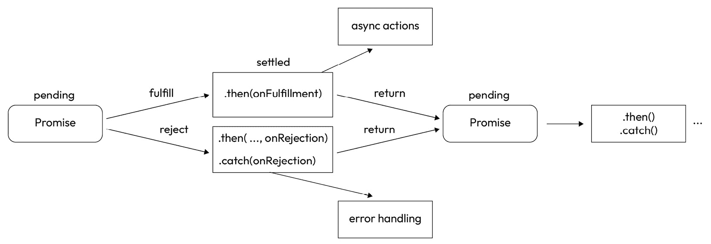

# 第四章：异步编程

本章将详细解释如何使用 JavaScript 今天提供的所有异步机制，包括如何将回调转换为 Promise 以及执行批量异步操作。

您将深入了解您可用于管理简单和复杂异步活动的所有工具。我们将从遵循 Node.js 核心约定的回调开始，然后过渡到有效地使用 Promise 和`async`/`await`处理异步操作。在章节的末尾，我们将使用**立即执行的函数表达式（IIFE）**模式来执行异步代码。此外，我们还将提供如何在不同处理程序之间转换异步操作的全面概述，包括回调和 Promise。

总结一下，以下是本章我们将探讨的主要主题：

+   JavaScript 中的异步编程

+   理解回调函数以及如何避免回调地狱

+   掌握 Promise

+   使用`async`和`await`处理异步代码

# 技术要求

该章节的代码文件可以在[`github.com/PacktPublishing/NodeJS-for-Beginners`](https://github.com/PacktPublishing/NodeJS-for-Beginners)找到。

查看本章的代码演示视频，链接为[`youtu.be/FHzqWr4dK7s`](https://youtu.be/FHzqWr4dK7s)

# JavaScript 中的异步编程

在 JavaScript 中，异步编程是语言的基本组成部分。它是允许我们在后台执行操作而不阻塞主线程执行的机制。这在浏览器中尤为重要，因为主线程负责更新用户界面和响应用户操作。

总体而言，异步编程是一个复杂的主题，需要大量的实践才能掌握，但在我看来，它需要改变你的思维方式。你需要开始思考如何将代码分解成可以在后台执行的小块，以及如何将它们组合起来以实现预期的结果。在用 JavaScript 编码时，你将经常遇到异步编程。大多数涉及与外部资源交互的操作，例如从服务器或数据库发送和接收数据以及从文件中读取内容，都需要使用它。

前置知识

在*第一章*中，我们介绍了事件循环的概念，这是允许 JavaScript 异步执行的一种机制。在本章中，我们将探讨如何利用这一机制来发挥我们的优势。

在*第三章*中，我们详细学习了 JavaScript 的使用；本章需要具备对函数和数组有扎实的了解。

让我们从探讨异步编程与常规编程的不同之处以及我们需要采取不同的思维方式开始。

本章使用同构 JavaScript 代码片段，因此代码可以在 Node.js 或浏览器中执行。

## 异步思维

掌握异步编程的第一步是改变你的思维方式。你需要开始以非线性方式思考你的代码；你将更多地考虑“接下来应该发生什么”，而不是“首先应该发生什么。”

当我们在*第三章*中学习函数时，我们看到了函数*仅仅*是一段可以在任何时间执行的代码。在本节中，我们将这段代码与之前的事件以及未来的事件联系起来。

在 JavaScript 中执行异步操作有许多方法。在本章中，我们将重点关注其中最常见的一些，如下所示：

+   **回调**：回调是一个作为另一个函数参数的函数，它在某个事件发生时执行。这是在 JavaScript 中执行异步操作最基本的方式，也是所有其他机制的基础。

+   **Promises**：ES6 引入了 promise 的概念，你可以用它以更高级的方式处理异步操作，因为它们使用具有多个状态（挂起、已解决和拒绝）的状态机来跟踪操作。与回调相比，promises 在可读性、可重用性和整体简单性方面具有许多优势。这是现代 JavaScript 中执行异步操作最常见的方式。有关更多详细信息，请参阅本章中的*掌握 promises*部分。

+   **Async/await**：Async/await 作为 promises 的包装器，使代码更易读（语法糖）。目前是处理异步操作最受欢迎的方式。

在下一节中，我们将探讨如何在我们的应用程序中有效地使用回调，错误优先模式，以及其他应遵循的良好实践。稍后，我们将探讨如何将回调包装在 promises 中。

# 理解回调

回调利用 JavaScript 传递函数的能力。这个技术有两个基本部分：

+   作为另一个函数参数传递的函数

+   当某个事件发生时，传递的函数将被执行

让我们创建一个基本示例来阐述这个概念。在下面的代码片段中，我们将展示回调是如何作为一个参数定义的，以及当执行发生时，一个函数是如何作为一个参数传递的：

1.  在这个例子中，我们将定义一个函数（`doSomething`），它期望一个函数作为参数：

    ```js
    const doSomething = (cb) => {
      console.log('Doing something...');
      cb();
    };
    ```

1.  到目前为止，我们有一个名为`doSomething`的函数，它接收一个函数作为参数，并在最后一步执行它，这说明了回调只是这样一个模式，我们期望下一个被执行的函数实际上是作为最终步骤调用的（完成后再调用我 - 回调）。让我们看看我们如何使用这个函数：

    ```js
    const nextStep = () => {
      console.log('Callback called');
    };
    doSomething(nextStep);
    ```

1.  函数执行后，预期的输出将是以下内容：

    ```js
    Doing something...
    Callback called
    ```

现在，我们有一个名为 `nextStep` 的函数，它作为参数传递给 `doSomething`。当 `doSomething` 执行时，它将打印 `Doing something...`，然后执行传递给它的函数，最后一步将打印 `Callback called`。

重要的是要注意，作为参数传递的函数不是立即执行的，因为我们只想在操作完成时执行它们。另一方面，立即执行将需要使用括号（`doSomething(nextStep())`）并会产生不同的结果和错误：

```js
doSomething(nextStep())
// Callback called
// Doing something...
// Error: cb is not a function
```

我们也可以传递一个匿名函数作为参数。这是使用回调函数最常见的方式，因为我们不需要事先定义函数。在大多数情况下，我们不会在之后重用该函数：

```js
doSomething(() => {
    console.log('Callback called');
});
```

也可以传递一个接收参数的函数：

```js
const calculateNameLength = (name, cb) => {
  const length = name.length;
  cb(length);
};
calculateNameLength('John', (length) => {
  console.log(`The name length is ${length}`); // The name length is 4
});
```

如您所见，回调技术非常简单，但我们还没有看到任何异步操作。最终，我们假设回调函数字面意思是“当你完成时叫我回来”的方法。现在，让我们看看如何使用定时器和间隔来管理异步操作。

## 定时器和间隔

有两个常用的函数用于延迟函数的执行，即 `setTimeout` 和 `setInterval`。这两个函数都接收一个回调函数作为参数，并在一定时间后执行它。现在，让我们通过示例定义和使用这些函数。

`setTimeout` 函数用于通过指定的时间延迟来推迟一个函数的执行。

让我们通过一个简单的例子看看 `setTimeout` 是如何工作的：

```js
console.log('Before setTimeout');
const secondInMilliseconds = 1000;
setTimeout(() => {
  console.log('A second has passed');
}, secondInMilliseconds);
console.log('after setTimeout');
```

如果我们执行此代码，我们将看到以下输出：

```js
Before setTimeout
after setTimeout
A second has passed
```

如您所见，回调函数是在其他代码执行完毕后执行的，即使它是在之前定义的。这是因为回调函数是异步执行的，这意味着它在后台执行，而其他代码则在主线程中执行。

`setTimeout` 函数接收两个参数。第一个参数是回调函数，第二个参数是回调函数应该延迟的时间量。时间量以毫秒为单位表示，因此在这种情况下，我们延迟回调函数的执行 1,000 毫秒，即 1 秒。

`setInterval` 函数用于在每次执行之间有固定时间延迟的情况下重复执行一个函数。

让我们通过一个简单的例子看看 `setInterval` 是如何工作的：

```js
const secondInMilliseconds = 1000;
let totalExecutions = 0
console.log('Before setInterval');
setInterval(() => {
    totalExecutions++;
    console.log(`A second has passed, this is the ${totalExecutions} execution`);
}, secondInMilliseconds);
console.log('After setInterval');
```

如果我们执行此代码，我们将看到以下输出：

```js
Before setInterval
After setInterval
A second has passed, this is the 1 execution
...
A second has passed, this is the 50 execution
```

如您所见，回调函数每秒执行一次，并且它在后台执行，因此其他代码在主线程中执行。

`setInterval` 函数接收两个参数。第一个参数是回调函数，第二个参数是回调函数应该延迟的时间量。时间量以毫秒为单位表示，因此在这种情况下，我们延迟回调函数的执行 1,000 毫秒，即 1 秒。

## 错误优先回调

在前面的章节中，我们看到了如何使用回调来管理异步操作，但没有看到如何处理错误。在本节中，我们将看到如何处理回调中的错误。

在回调中处理错误最常见的方式是使用错误优先模式。这个模式包括将错误作为回调的第一个参数传递，将结果作为第二个参数。让我们通过一个简单的例子看看它是如何工作的：

```js
const doSomething = (cb) => {
  const error = new Error('Something went wrong');
  cb(error, null);
};
doSomething((error, result) => {
  if (error) {
    console.log('There was an error');
    return;
  }
  console.log('Everything went well');
});
```

此代码的输出将如下所示：

```js
There was an error
```

在这个例子中，我们有一个名为 `doSomething` 的函数，它接收一个回调作为参数。这个回调接收两个参数。第一个是一个错误，第二个是结果。在这种情况下，我们将错误作为第一个参数传递，将 `null` 作为第二个参数，因为发生了错误。当回调执行时，我们检查第一个参数是否是错误，如果是，我们打印 `There was an error`。否则，我们打印 `Everything` `went well`。

让我们看看当一切顺利时它是如何工作的：

```js
const doSomething = (cb) => {
  const result = 'It worked!';
  cb(null, result);
};
doSomething((error, result) => {
  if (error) {
    console.log('There was an error');
    return;
  }
  console.log(result);
  console.log('Everything went well');
});
```

此代码的输出将如下所示：

```js
It worked!
Everything went well
```

在这种情况下，我们传递 `null` 作为第一个参数，因为没有错误，将结果作为第二个参数。当回调执行时，我们检查第一个参数是否是错误，如果是，我们打印 `There was an error`。否则，我们打印结果，并打印 `Everything` `went well`。

## 回调地狱

之前，我们看到了如何使用回调来管理异步操作，以及如何使用错误优先模式来处理错误。

回调的问题在于它们不是很容易阅读，当我们有很多嵌套的回调时，代码变得非常难以阅读。这被称为回调地狱，这是使用回调时一个非常常见的问题。

在下面的伪代码示例中，你可以看到函数是如何以倾斜的金字塔形式生成的，嵌套的回调使得代码难以跟踪。在下面的代码示例中，观察函数是如何以倾斜的金字塔形式结构化，嵌套的回调使得代码难以理解：

```js
readFile("docs.md", (err, mdContent) => {
    convertMarkdownToHTML(mdContent, (err, htmlContent) => {
        addCssStyles(htmlContent, (err, docs) => {
            saveFile(docs, "docs.html",(err, result) => {
                ftp.sync((err, result) => {
                    // ...
                })
            })
        })
    })
})
```

如你所见，代码非常难以阅读，并且很容易出错。这就是为什么我们需要一种更好的方式来管理异步操作。有一些方法可以防止回调地狱，例如使用命名函数而不是匿名函数，但避免回调地狱最常见的方法之一是使用承诺。

当你需要链式处理异步操作时，承诺是一个很好的解决方案，让我们在下一节中探讨它。

# 掌握承诺

承诺作为一个状态机工作，表示异步操作最终的成功或失败，以及其结果值。它可以处于以下三种状态之一：挂起、实现或拒绝。

当承诺被创建时，它处于挂起状态。当承诺被实现时，它处于实现状态。当承诺被拒绝时，它处于拒绝状态。

以下图表显示了承诺的各种状态及其之间的连接：



图 4.1 – 由 Mozilla 贡献者提供的归属和版权许可受 CC-BY-SA 2.5 许可。[`developer.mozilla.org/en-US/docs/MDN/Writing_guidelines/Attrib_copyright_license`](https://developer.mozilla.org/en-US/docs/MDN/Writing_guidelines/Attrib_copyright_license)

在承诺被解决或拒绝后，它变得不可更改。为了管理解决，我们使用 `then` 方法，而 `catch` 方法用于处理承诺的拒绝。

既然我们已经清楚承诺是什么以及状态是如何相关的，现在是时候观察它们在实际中的应用了。在下一节中，我们将探讨如何使用它们，并在 JavaScript 中轻松控制任何异步流程。

## 使用承诺

让我们通过一个简单的例子来看看使用 `fetch` 向外部 **应用程序编程接口**（**API**）发起请求是如何工作的。此示例将使用我的简单-api 项目 ([`github.com/UlisesGascon/simple-api`](https://github.com/UlisesGascon/simple-api))，该项目可在 [`api.demo.foo/__/docs/`](https://api.demo.foo/__/docs/) 找到，并且是一个用于测试和快速原型设计的假在线 **表示状态转移**（**REST**）API。

因此，在以下代码示例中，我们将执行网络请求，并通过互联网将数据带到我们的应用程序中，因为这个操作需要网络 I/O，它是异步的，所以我们需要使用承诺：

```js
fetch('https://api.demo.foo/v1/todo')
  .then(response => response.json())
  .then(json => console.log(json))
  .catch(error => console.log(error));
```

此代码的输出将如下所示：

```js
[{
  "id": "fc3f31b9-8d98-42e9-aab3-1586f2273c3a",
  "title": "We need to input the digital DNS capacitor!",
   "completed": true  }
...
]
```

在这个例子中，我们使用 `fetch` 函数向 API 发起请求。该函数产生一个承诺，允许我们使用 `then` 方法来管理成功的解决，并使用 `catch` 方法来处理潜在的拒绝。在这种情况下，我们使用了两次 `then` 方法：第一次是将响应解析为 JSON，第二次是将结果打印到控制台。我们还使用了 `catch` 方法将错误打印到控制台。

## 创建承诺

您可以使用 `Promise` 构造函数创建一个承诺，该构造函数接收一个回调作为参数。此回调接收两个参数，`resolve` 和 `reject`。`resolve` 函数用于解决承诺，而 `reject` 函数用于拒绝承诺。让我们通过一个简单的例子看看它是如何工作的：

```js
const setTimeoutPromise = (time) => {
  return new Promise((resolve, reject) => {
    setTimeout(() => {
      resolve();
    }, time);
  });
};
console.log('Before setTimeoutPromise');
setTimeoutPromise(1000).then(() => console.log('one second later'))
console.log('After setTimeoutPromise');
```

此代码的输出将如下所示：

```js
Before setTimeoutPromise
After setTimeoutPromise
one second later
```

在这个例子中，我们有一个名为 `setTimeoutPromise` 的函数，它接收一个 `time` 作为参数。此函数返回一个承诺，该承诺将在指定时间后解决。当承诺解决时，我们将 `one second later` 打印到控制台。

## 使用承诺的回调地狱

承诺是处理当需要执行多个应按顺序执行的异步操作时，回调引入的限制的绝佳方式。

承诺更容易处理错误，因此代码的可读性应该更清晰，长期维护也更简单。

在上一节中，我们看到了回调地狱在 JavaScript 中是一个非常真实的问题。到目前为止，您应该对倾斜的金字塔和嵌套回调更加熟悉。以下是我们在前一个部分中用来解释如何轻松实现回调地狱的代码片段：

```js
readFile("docs.md", (err, mdContent) => {
    convertMarkdownToHTML(mdContent, (err, htmlContent) => {
        addCssStyles(htmlContent, (err, docs) => {
            saveFile(docs, "docs.html",(err, result) => {
                ftp.sync((err, result) => {
                    // ...
                })
            })
        })
    })
})
```

现在我们来看看我们如何使用承诺解决这个问题：

```js
readFile("docs.md")
  .then(convertMarkdownToHTML)
// shortcut for .then(mdContent => convertMarkdownToHTML(mdContent))
  .then(addCssStyles)
  .then(docs => saveFile(docs, "docs.html"))
  .then(ftp.sync)
  .then(result => {
    // ... other things
  })
  .catch(error => console.log(error));
```

如您所见，代码更容易阅读，并且更容易进行修改。这是使用承诺的主要优势之一。现在错误处理在最后的`catch`方法中完成，因此我们不需要在每个`then`方法中处理错误，这使得代码更加简洁。

## 并行承诺

使用承诺的另一个优点是我们可以在并行中运行多个承诺。基本上，我们提供一个承诺数组，并选择一个策略来处理结果（`Promise.race()`或`Promise.all()`）。这是一个减少执行时间的好方法，因为我们正在使用 Node.js 异步管理 I/O 操作的能力。

在以下示例中，我们将使用此函数来生成一个随机超时承诺，作为异步操作的示例：

```js
const randomTimeOutPromise = () => {
  return new Promise((resolve, reject) => {
    const time = Math.floor(Math.random() * 100);
    setTimeout(() => {
      console.log(`Promise resolved after ${time}ms`);
      resolve(time);
    }, time);
  });
};
```

此函数将在 0 到 100 毫秒之间的随机时间后解决一个承诺。现在我们有一个异步函数，我们可以根据我们的具体需求采用各种策略来组合多个请求。在这个例子中，我们的目标是并行发起多个请求并等待它们的解决。

`Promise.all()`: `all`方法产生一个承诺，一旦所有承诺都解决或任何承诺被拒绝，它就会解决：

```js
Promise.all([
  randomTimeOutPromise(),
  randomTimeOutPromise(),
  randomTimeOutPromise(),
  randomTimeOutPromise(),
  randomTimeOutPromise(),
]).then((results) => {
  console.log("results:", results);
});
```

当所有承诺都成功解决时，这段代码的输出将类似于以下内容：

```js
Promise resolved after 0ms
Promise resolved after 26ms
Promise resolved after 31ms
Promise resolved after 37ms
Promise resolved after 62ms
results: [37, 31, 26, 62, 0]
```

如您所见，当所有承诺都解决时，将调用`then`方法，并且它将接收一个数组，其中包含每个承诺的结果，按照它们在承诺数组中添加的顺序，而不是按照它们解决的顺序。

在前面的例子中，所有承诺都成功解决，因为它们基于计时器操作。但当我们依赖于承诺来访问外部资源，如系统中的文件或从互联网获取数据时，我们需要考虑这些资源可能并不总是可用。例如，如果互联网断开，那么一个或多个承诺可能会失败，这将使我们的应用程序崩溃。显然，如果使用`catch`语句处理错误，可以避免这种情况，但即使在那种情况下，也非常重要记住，当我们使用这种并行方法时，我们需要考虑如果单个承诺生成错误，已解决的承诺将被忽略，就像我们使用单个承诺一样。

`Promise.all()`的另一种方法是聚合所有请求，但一旦第一个请求完成就解决承诺。这样，就无需等待所有请求的解决。

`Promise.race()`: `race`方法返回一个承诺，只要其中一个承诺解决或拒绝，它就会解决或拒绝。如果不小心管理，这可能会导致意外的结果，因为即使其中一个承诺已经解决或拒绝，承诺也不会停止运行：

```js
Promise.race([
  randomTimeOutPromise(),
  randomTimeOutPromise(),
  randomTimeOutPromise(),
  randomTimeOutPromise(),
  randomTimeOutPromise(),
]).then((result) => {
  console.log("result:", result);
});
```

此代码的输出将类似于以下内容：

```js
Promise resolved after 30ms
results: 30
Promise resolved after 33ms
Promise resolved after 60ms
Promise resolved after 79ms
Promise resolved after 83ms
```

如您所见，当第一个承诺解决时，将调用`then`方法，并且它将接收到已解决的第一个承诺的结果。其他承诺将继续运行，但`then`方法将不会再次被调用。

## 错误处理

在前面的例子中，我们看到了如何使用`catch`方法处理错误，但还有另一种处理错误的方法：使用`reject`函数。让我们看看这个例子是如何工作的：

```js
const generatePromise = shouldFail => {
  return new Promise((resolve, reject) => {
    if (shouldFail) {
      return reject(new Error("Rejected!"));
    }
    resolve("Success!");
  });
};
generatePromise(true).catch(error => console.log("Error message:", error));
// Error message: Error: Rejected!
// ...
```

重要的是要注意，`reject`函数不会停止代码的执行，因此我们需要在调用`reject`函数后`return`函数。

最后一种情况是我们需要在承诺解决后执行一个动作，无论它是成功还是拒绝。重要的是要记住，未处理的承诺拒绝可能导致运行时错误，这会使您的应用程序崩溃。我们将在*第十五章*中了解更多。

`Promise.finally()`: 有时候，我们不在乎承诺是解决还是拒绝；我们只想知道承诺何时解决或拒绝。在这种情况下，我们可以使用`finally`方法：

```js
generatePromise(true)
  .then(result => console.log("Result:", result))
  .catch(error => console.log("Error message:", error))
  .finally(() => console.log("Promise settled"));
```

## 承诺链式调用

我们还可以链式调用承诺；我们可以在`then`方法中返回一个承诺，这个承诺将在调用下一个`then`方法之前解决。如果链中的任何承诺被拒绝，将调用`catch`方法。让我们看一个例子：

```js
generatePromise()
  .then(generatePromise)
  .then(result => {
    return generatePromise(true);
  })
  .then(() => console.log("This will not be called"))
  .catch(error => console.log("Error message:", error));
```

当调用第三个`generatePromise`时，它将返回一个将被拒绝的承诺，因此将调用`catch`方法，然后最后一个`then`将不会执行。

我们已经使用承诺有一段时间了，其语法可能相当冗长，需要像 `then` 和 `catch` 这样的关键字。一种更高级且更美观的语法涉及使用 `async` 和 `await`。我们将在下一节深入探讨这种方法。

# 使用 `async` 和 `await` 处理异步代码

ES2017 引入了一种处理异步代码的新方法，即 `async` 和 `await` 关键字。这些关键字是承诺的语法糖；它们不是处理异步代码的新方法，但它们使代码更容易阅读和编写。

实际上，`async` 关键字用于定义一个异步函数，而 `await` 关键字用于在函数内部暂停并等待一个承诺的解决。即使你使用了 `async` 这个词，它也不会让你的代码变为异步，只有当你实际上在代码中使用了异步代码（一个承诺）时，才会发生这种情况。为了使其更简单，我们可以这样说，为了使用 `await`，我们需要使用 `async` 来定义代码块。让我们更详细地探讨一下我们如何使用 `async`。

## async

当一个函数使用 `async` 关键字定义时，它将始终返回一个承诺，可以像任何常规承诺一样处理。让我们看看一个例子：

```js
const asyncFun = async (generateError) => {
    if (generateError) {
        throw new Error("Error generated");
    }
    return 1;
};
asyncFun().then((result) => console.log(result));
asyncFun(true).catch((error) => console.log(error));
```

由于这是承诺的语法糖，我们可以使用承诺构建一个类似的功能：

```js
const asyncFun =  (generateError) => new Promise((resolve, reject) => {
    if (generateError) {
        reject(new Error("Error generated"));
    }
    resolve(1);
});
asyncFun().then((result) => console.log(result));
asyncFun(true).catch((error) => console.log(error));
```

现在，让我们熟悉一下 `await`；我们将能够无缝地结合这两个关键字，并消除使用 `then` 或 `catch` 的需要。

## await

让我们看看如何使用 `await` 关键字来等待承诺：

```js
// Promises
fetch(' https://api.demo.foo/v1/todo')
  .then(response => response.json())
  .then(json => console.log(json))
  .catch(error => console.log(error));
// Async/Await
const fetchData = async () => {
  try {
    const response = await fetch('https://api.demo.foo/v1/todo');
    const json = await response.json();
    console.log(json);
  } catch (error) {
      console.log(error);
  }
}
fetchData(); // [{userId: 1, id: 1, title: 'delectus aut autem',
completed: false}]
```

如你所见，使用 `async` 和 `await` 可以使代码更容易阅读和编写。`await` 关键字只能用在 `async` 函数内部。我们需要使用 `try`/`catch` 块来处理错误。

`try`/`catch` 是 JavaScript 提供的一种机制，允许我们将某些代码封装在 `try` 块中，并使用 `catch` 块处理任何可能出现的错误。所以，在上一个例子中，由于我们正在进行 HTTP 请求，我们依赖于外部因素，如互联网的连接性或外部服务器返回我们请求的信息的能力。在我们的特定情况下，我们“静默失败”这个错误，因为在 `catch` 块中我们只打印有关错误的信息，但在其他情况下，我们可能在 UI 中显示一个警告消息或触发重试策略来尝试再次执行此 HTTP 请求。重要的是要记住，如果我们没有正确处理错误，我们的应用程序可能会崩溃。我们将在 *第十五章* 中详细探讨这个主题。

现在，让我们探讨如何将 `async` 与此语法糖结合使用，即使在较旧的 Node.js 版本中。

## IIFEs

在某些情况下，我们希望在 `async` 函数外部使用 `await` 关键字，例如，当我们想在模块的最高级别使用 `await` 关键字时。在这种情况下，我们可以使用 IIFE 将 `await` 关键字包裹在 `async` 函数内。IIFE 是在创建后立即执行的函数。这是一种设计模式，用于避免将变量和函数污染全局作用域。在下面的示例中，我们可以观察到基本的语法：

```js
(function () {
  // ... some code here
})();
```

想法是创建一个匿名函数，并在创建后立即执行它。为了实现这一点，我们需要在函数之间添加括号，然后添加另一对括号来执行函数：`(...)()`。

我们可以在立即执行函数表达式（IIFE）中轻松使用 `async` 和 `await`：

```js
(async () => {
    const response = await fetch(' https://api.demo.foo/v1/todo ');
    const json = await response.json();
    console.log(json);
})()
```

这保证了代码将在创建后立即执行，我们可以在 IIFE 中使用 `await` 关键字。

# 摘要

在本章中，我们学习了 JavaScript 中的异步编程。我们探讨了异步 API，如 `setTimeout` 和 `fetch`，并学习了如何使用回调、promises 和 `async`/`await` 来处理异步代码。此外，我们还学习了错误优先回调约定以及如何使用命名函数和 promises 来避免回调地狱。最后，我们学习了如何管理 promises，如何使用 `Promise.all` 和 `Promise.race` 方法进行批量操作，以及如何使用 `async` 和 `await` 关键字以更干净的方式处理异步代码。

在下一章中，我们将学习 HTTP 以及现代网络如何使用 REST API 工作。

# 进一步阅读

JavaScript 中的异步编程是一个广泛的主题，需要相当多的时间来掌握和完全理解。以下链接将向您展示一些宝贵的资源，这些资源将帮助您深入了解本章涵盖的主题：

+   *JavaScript Promise 100 秒内理解*: [`www.youtube.com/watch?v=RvYYCGs45L4`](https://www.youtube.com/watch?v=RvYYCGs45L4)

+   *异步编程：内部机制 – Shelley Vohr – JSConf EU*: [`www.youtube.com/watch?v=SrNQS8J67zc`](https://www.youtube.com/watch?v=SrNQS8J67zc)

+   *JavaScript 中的 async/await – 什么是、为什么以及如何 – Fun Fun Function:* [`www.youtube.com/watch?v=568g8hxJJp4`](https://www.youtube.com/watch?v=568g8hxJJp4)

# 第二部分：Node.js 生态系统和架构

在 *第二部分* 中，您将学习如何通过使用庞大的 npm 生态系统来使用 Node.js 核心库和第三方库。您还将详细了解如何使用和实现事件驱动架构，并了解如何在项目中使用和实现单元测试。

本部分包括以下章节：

+   *第五章*, *Node.js 核心库*

+   *第六章*, *外部模块和 npm*

+   *第七章*, *事件驱动架构*

+   *第八章*, *Node.js 中的测试*
