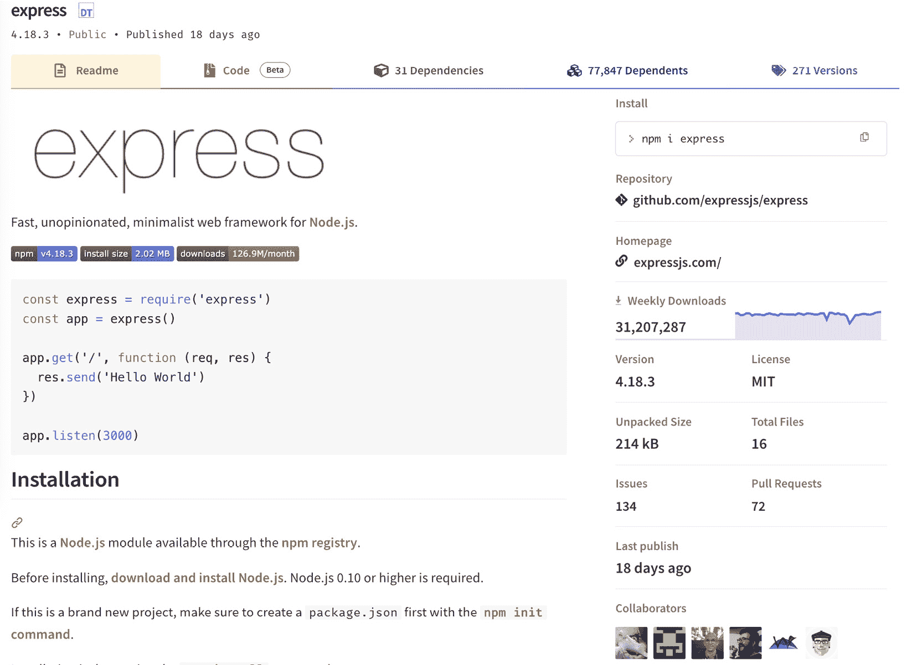
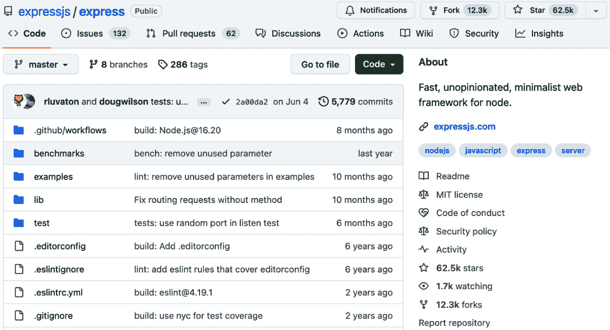
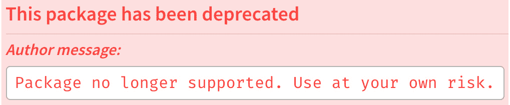
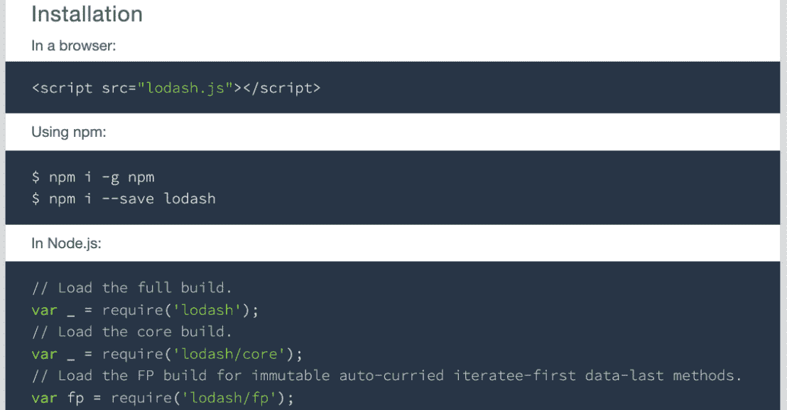
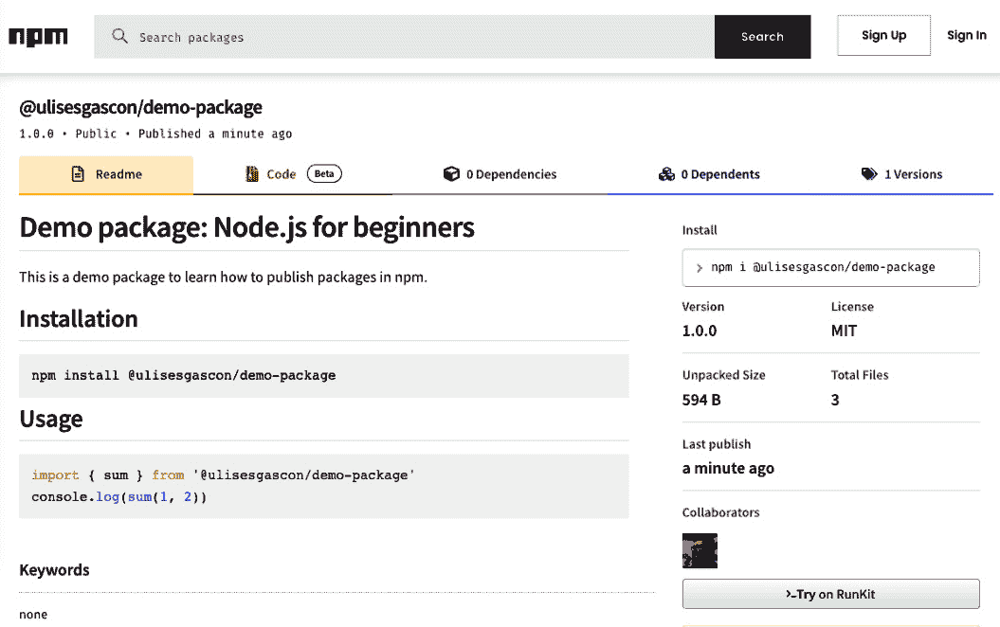
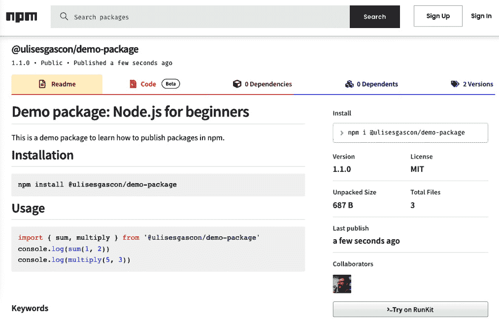

# 外部模块和 npm

**Node 包管理器** (**npm**) 是全球最受欢迎的软件注册库之一。有超过两百万个包可供我们使用。在本章中，我们将探讨如何使用 npm 命令和 NPX，以及同构库是什么以及如何为我们的项目选择正确的依赖项，以便我们能够最小化风险。作为最后的实践，您将发布一个包到 npm。

在本章中，我们将探讨如何在我们的项目中使用外部模块。这将使我们能够重用其他开发者的代码，节省时间和精力。我们将一起探索 Node.js 模块的庞大生态系统，并学习如何为我们的项目选择正确的模块。

总结一下，以下是本章我们将探讨的主要主题：

+   使用 `package.json` 管理应用

+   为您的项目选择正确的依赖项

+   安装依赖项

+   移除依赖项

+   理解 `package-lock.json`

+   管理依赖项版本

+   构建 Isomorphic JavaScript

+   使用 npm 脚本

+   使用 NPX 直接执行包

+   npm 替代方案

+   发布您的第一个包

# 技术要求

本章的代码文件可以在 [`github.com/PacktPublishing/NodeJS-for-Beginners`](https://github.com/PacktPublishing/NodeJS-for-Beginners) 找到

查看本章的代码执行视频，请访问 [`youtu.be/B-7vZyAfi2U`](https://youtu.be/B-7vZyAfi2U)

# 使用 package.json 管理应用

当您安装 Node.js 时，npm 也会一并安装。npm 是 Node.js 的包管理器。它用于从我们的项目中安装、更新和删除包。它还允许我们发布自己的包。

包是一个我们可以用于我们应用程序的 JavaScript 库，可以帮助我们加快开发自己项目的速度。有各种各样的包，从非常简单的，比如一个可以告诉我们一个数字是否为奇数的函数（[`www.npmjs.com/package/is-odd`](https://www.npmjs.com/package/is-odd)），到非常复杂的库，可以帮助我们使用 Firebase ([`firebase.google.com/?hl=es`](https://firebase.google.com/?hl=es)) 来存储用户的资料（[`www.npmjs.com/package/firebase`](https://www.npmjs.com/package/firebase)）。在单个项目中使用许多库是非常常见的，一些公司甚至创建自己的私有库来分发工具、配置以及更多内容到他们的众多代码库中。

`package.json` 文件是我们项目的清单文件。它包含我们项目的元数据，例如名称、版本、描述、作者和许可证。它还包含我们项目的依赖项，包括运行时依赖项和开发依赖项，以及我们可以使用 npm 运行的脚本。

为了创建一个 `package.json` 文件，我们可以运行以下命令：

```js
npm init
```

此命令会问我们几个问题，然后创建 `package.json` 文件。为了更快地创建，你可以使用 `npm init -y` 自动创建带有默认值的文件。

我们也可以手动创建 `package.json` 文件，但建议使用 `npm init` 命令。

`package.json` 文件可以非常简单，就像这样：

```js
{
  "name": "my-project",
  "version": "1.0.0",
  "description": "My project",
  "main": "index.js",
  "scripts": {
    "test": "echo \"Error: no test specified\" && exit 1"
  },
  "author": "John Doe",
  "license": "MIT"
}
```

但它也可以是一个大文件，包含一个或多个依赖项、脚本和额外的元数据。目前，`package.json` 文件还没有官方标准，但 OpenJS 基金会的标准工作组正在努力制定它（[`github.com/openjs-foundation/standards/issues/233`](https://github.com/openjs-foundation/standards/issues/233)）。

目前，我们可以使用 npm 文档来了解在 `package.json` 文件中可以使用哪些字段。文档可在 [`docs.npmjs.com/cli/v7/configuring-npm/package-json`](https://docs.npmjs.com/cli/v7/configuring-npm/package-json) 查找。

在接下来的章节中，我们将了解 `package.json` 文件中的一些最重要的字段，以及如何在我们的项目中使用它们。

# 为你的项目选择正确的依赖项

诚然，npm 生态系统非常稳固，并且每天都在增长。但同样真实的是，许多包已经不再维护，或者包含安全漏洞和性能问题。

社区对此有所了解，并且有很多关于这个话题的笑话和梗图。例如，以下这张图片：

])(img/B21678_06_01.jpg)

图 6.1 – MonkeyUser 的 npm 交付 – 一张经典的梗图，展示了我们倾向于在项目中包含多少依赖项（[`www.monkeyuser.com/2017/npm-delivery/`](https://www.monkeyuser.com/2017/npm-delivery/)）

虽然这是一个基于我们在平均项目中安装的大量依赖项和子依赖项的笑话，但事实是我们选择项目依赖项时需要谨慎。在本节中，我们将了解如何为我们的项目选择正确的依赖项。

注意

大多数模块都依赖于其他模块，而这些模块又依赖于其他模块，以此类推。这被称为**依赖树**。当我们安装一个模块时，我们实际上是在安装该模块的所有依赖项，以及所有依赖项的依赖项，等等。这就是为什么选择正确的依赖项对我们项目来说很重要。

在选择依赖项之前，我们需要问自己以下问题：

+   选择不良依赖项有哪些风险？

+   我应该使用哪些标准来选择一个依赖项？

让我们看看这些问题的答案！

## 风险

在我们现代世界中，我们已经习惯了使用依赖项。没有使用依赖项构建现代网络应用将非常困难，或者直接不可能。

当我们选择一个依赖项时，我们正在承担风险。让我们看看与选择不良依赖项相关的主要风险：

+   **安全漏洞**：一个依赖项可能存在安全漏洞，甚至可能是一段恶意代码。

+   **性能问题**：一个依赖项可能存在性能问题，并产生内存泄漏，这可能会影响我们应用程序的性能，甚至导致其崩溃。

+   **维护问题**：一个依赖项不再维护，并且可能在将来被弃用。这可能导致我们的应用程序在未来停止工作，或者阻止我们升级其他依赖项或 Node.js 本身。

在 2020 年，我发布了一篇名为 *什么是后门？* *让我们用 Node.js 构建一个* 的有争议的博客文章([`snyk.io/blog/what-is-a-backdoor/`](https://snyk.io/blog/what-is-a-backdoor/)). 在那篇博客文章中，我解释说后门是一段代码，它允许我们在不经过身份验证过程的情况下访问系统。我还解释了如何使用几行代码用 Node.js 构建后门，并展示了发布和分发恶意包是多么容易。

我知道安全问题是一个非常敏感的话题，尤其是如果你刚开始你的 Web 开发之旅。本书的*第十五章*专门讨论了安全问题，我们将在那里深入探讨安全问题。

为了最小化风险，我们需要为我们的项目选择正确的依赖项。让我们看看如何做到这一点。

## 良好的标准

我们可以使用许多标准来选择适合我们项目的正确依赖项。在本节中，我们将看到其中一些最重要的标准。

### 我们试图避免什么？

我们试图避免以下事项：

+   已不再维护的包

+   存在已知安全漏洞且未修补的包

+   依赖项众多或质量低下的包

+   不受欢迎或质量低下的包

+   存在许可问题或低质量的包

### 我们有什么证据？

在我们安装任何包之前，我们将做一些基本的 OSINT，并将详细检查两个数据源：npm 网站和 GitHub 或代码仓库。

OSINT 是通过收集和分析公开信息以回答特定情报问题而产生的情报。(Ritu Gill, [`www.sans.org/blog/what-is-open-source-intelligence/`](https://www.sans.org/blog/what-is-open-source-intelligence/).)

### 真实示例

在这本书中，我们将使用 Express 库。Express 是 Node.js 中一个非常流行的库，用于构建 Web 应用程序和 API。在这张图片中，我们可以详细看到 Express 库如何在 npm 网站上展示：



图 6.2 – npm 中的 Express 库包 (https://www.npmjs.com/package/express)

从 npm 网站上，我们可以看到以下信息：

+   有 31 个依赖项，其中大多数非常受欢迎，并且由相同的 Express 维护者精心维护

+   有+77k 个依赖项，这意味着许多其他包的作者正在他们的项目中使用 Express

+   已发布 271 个版本

+   每周有近 31M 次下载，这意味着 Express 是 Node.js 社区中非常受欢迎的包

+   一个 MIT 许可证，这是一个许可宽松的许可证，也是有效的开源许可证

+   清晰且坚实的文档

+   它最近几天才发布，这意味着该包得到了维护和定期更新

从 npm，我们可以访问该包的 GitHub 仓库。在下面的图片中，我们可以详细看到 Express 库在 GitHub 网站上的展示：



图 6.3 – Express 库在 GitHub 上的仓库（https://github.com/expressjs/express）

从 GitHub 网站，我们可以看到以下信息：

+   它有+10k 个分支，这意味着许多其他开发者正在为项目做出贡献

+   它有+60k 个星标，这意味着项目在社区中很受欢迎

+   它有+5k 次提交，这意味着该项目有着悠久的历史

+   它有+3k 个已关闭的问题，+120 个开放的问题，+1k 个已关闭的拉取请求，和+60 个开放的拉取请求，这意味着项目是活跃的

+   它有近 300 个贡献者，这意味着许多其他开发者正在为项目做出贡献并推动其发展

如我们所见，我们从 npm 网站和 GitHub 仓库中获得了大量信息，至少可以做出初步决定，尤其是如果我们想比较几个包。选择范围很广，有时很难选择正确的包。

### 规则的例外

我们需要对我们之前看到的规则相当灵活，因为很多时候我们可以找到规则的例外。

例如，johnny-five ([`www.npmjs.com/package/johnny-five`](https://www.npmjs.com/package/johnny-five)) 是在 Node.js 中与 Arduino 和 Raspberry Pi 一起工作时使用的优秀库。但每周的总下载量非常低。在这种情况下，我们需要考虑与使用 Express 的开发者相比，使用 Arduino 和 Raspberry Pi 的开发者要少得多。

另一个例子是 Lodash ([`www.npmjs.com/package/lodash`](https://www.npmjs.com/package/lodash))，这是一个非常受欢迎的库，并被许多其他包使用。但最后一个版本是在三年前发布的。在这种情况下，我们需要考虑项目基本上已经完成，并且它不再发展，只是在需要时发布新版本。

### 废弃通知

有时，我们可以找到一个已废弃的包。在这种情况下，我们应该避免使用它。我们可以在 npm 网站、GitHub 仓库或安装包时找到废弃通知。



图 6.4 – 来自 npm 文档的图片，展示了 npm 中如何显示弃用警告（https://docs.npmjs.com/packages-and-modules/updating-and-managing-your-published-packages/deprecate-package.png）

非常常见，在弃用通知中，我们可以找到一个建议使用另一个包的建议。在这种情况下，我们应该遵循建议。

### 工具

在之前的 OSINT 分析中，我们回答了大部分问题，但并没有回答有关已知漏洞的问题。这些天，我使用两个工具来检查已知漏洞：*Snyk* ([`snyk.io/`](https://snyk.io/)) 和 *socket.dev* ([`socket.dev/`](https://socket.dev/))。

在 *第十五章* 中，我们将详细了解它们的使用。为了正确使用这些工具，你需要了解依赖项树是如何工作的以及漏洞是如何分类的。否则，这些工具对于初学者来说可能会非常令人困惑。

我建议说“在下一节中，我们将学习如何在我们的项目中安装依赖项。

# 安装依赖项

现在我们知道了如何为我们的项目选择正确的依赖项，并且我们有了 `package.json` 文件，我们可以开始安装我们的依赖项。

## 本地或全局

我们可以通过两种方式安装依赖项：本地或全局：

+   我们项目的 `node_modules` 文件夹。例如，`express` 是我们应用程序的本地依赖项。

+   **全局**：这些是在我们系统的全局文件夹中安装的依赖项，因此它们可以在系统的任何地方使用，例如 Node.js 二进制文件，一旦我们打开终端，它就可用。

我们更愿意本地安装依赖项，因为这更容易管理我们项目的依赖项，并避免不同项目之间的冲突。只有在绝对必要时，我们才会全局安装依赖项。

我们将要安装的全局依赖项的一个例子是 `yeoman`，这是一个脚手架工具，我们将用它来生成一个新的项目。

## 依赖项或开发依赖项

我们可以通过两种方式安装本地依赖项：作为依赖项或作为开发依赖项：

+   `express` 是我们应用程序的依赖项。

+   `standard`，这是一个代码检查库，仅在开发代码时使用，而不是在运行时使用。

注意

安装依赖项还有另一种模式：**依赖项的依赖**。本书中我们将不涉及这种模式，但你可以在以下博客文章中找到更多信息和使用案例：[`nodejs.org/en/blog/npm/peer-dependencies`](https://nodejs.org/en/blog/npm/peer-dependencies)。

依赖项的分割非常重要，因为它允许我们在每个环境中只安装我们需要的依赖项，并减少我们应用程序和攻击面的尺寸。

## 添加新的依赖项

例如，如果我们想安装 `express` 包，我们可以使用以下命令：

```js
# npm install <package-name>
npm install express
```

我们可以将`standard`包作为开发依赖项安装。开发依赖项是我们实际编码项目时需要的依赖项，但在项目部署或作为库分发时并不使用。由于`standard`是一个代码检查工具，我们仅在添加或更改代码时使用它，而在应用程序运行时不会使用它。这种依赖项的分割有很多好处，因为我们的最终应用程序将更小（忽略开发依赖项），并且更安全，因为我们有更少的外部代码。我们可以使用`-D`或`--save-dev`参数来安装开发依赖项：

```js
# npm install --save-dev <package-name>
# npm install  -D <package-name>
npm install --save-dev standard
```

我们可以看到`package.json`文件已经更新，包含两个不同部分的新的依赖项：`dependencies`和`devDependencies`：

```js
{
  "dependencies": {
    "express": "⁴.18.3"
  },
  "devDependencies": {
    "standard": "¹⁷.1.0"
  }
}
```

还增加了一个新文件`package-lock.json`，并且已经创建了一个`node_modules`文件夹，其中依赖项以文件夹和文件的形式组织。

我们将在下一节中探讨`package-lock.json`文件是如何工作的。

注意

如果你使用 Git 或任何其他系统来分发你的源代码，`node_modules`不应该包含在项目源代码中。将`node_modules`文件夹包含在`.gitignore`文件中是一个好习惯，以避免将其包含在存储库中。如果你需要一个可靠的`.gitignore`文件用于 Node.js，你可以生成一个（[`www.toptal.com/developers/gitignore/api/node`](https://www.toptal.com/developers/gitignore/api/node)）。我们应该忽略`node_modules`，因为该文件夹可能非常大，包含许多文件和较重的权重，而且我们可以在任何时间安装依赖项，一旦我们保持`package.log`中的更改，我们就能安装正确的依赖项。

全局依赖项使用`-g`或`--global`参数安装：

```js
# npm install --global <package-name>
# npm install -g <package-name>
# Install yeoman globally
npm install --global yo
```

你可以使用`list`或`ls`命令查看全局依赖项列表：

```js
# npm list --global
# npm ls --global
npm list --global
```

此命令的输出将类似于以下内容：

```js
/Users/ulises/.nvm/versions/node/v20.11.0/lib
├── corepack@0.23.0
├── npm@10.2.4
└── yo@5.0.0
```

## 安装所有依赖项

如果我们想安装`package.json`文件中列出的所有依赖项，我们可以使用不带任何参数的`install`或`i`命令：

```js
npm install
```

我们也可以使用`--only`参数来仅安装依赖项或开发依赖项：

```js
# Prod Only
npm install --only=prod
npm install --only=production
# Dev Only
npm install --only=dev
npm install --only=development
```

在生产环境中，我们希望避免使用开发工具，因为尽管这会使我们的应用程序更小、更安全，但在我们的开发环境中，我们需要所有依赖项来正确地完成我们的工作。

在下一节中，我们将探讨如何正确地从我们的项目中删除依赖项。

# 删除依赖项

你可以使用`uninstall`命令来删除依赖项：

```js
# npm uninstall <package-name>
npm uninstall express
```

此命令将从`package.json`和`package-lock.json`文件以及`node_modules`文件夹中删除依赖项。

全局依赖项使用`-g`或`--global`参数删除：

```js
# npm uninstall --global <package-name>
# npm uninstall -g <package-name>
# Remove yeoman globally
npm uninstall --global yo
```

在下一节中，我们将探讨`package-lock.json`文件如何帮助我们管理我们的依赖项。

# 理解`package-lock.json`

从历史上看，`package.json`文件是我们管理项目依赖项所需唯一文件。但这个文件有一个问题：它不包含我们已安装在我们项目中的每个子依赖项的确切版本，并且安装依赖项的速度也相当慢。

如果没有每个子依赖项的确切版本，可能会出现问题，因为如果我们在不同环境中安装相同的依赖项，最终可能会得到不同版本的相同依赖项。我们依赖项的不变性可能导致意外的错误和难以调试的 bug。

此外，默认情况下，当我们安装依赖项时，记录在`package.json`中的版本包括一个连字符`^`符号，例如`"express"⁴.18.3"。这个符号意味着我们可以安装与记录在`package.json`中的版本兼容的任何版本的依赖项。

`package-lock.json`文件是一个在我们安装新依赖项时自动生成的文件，并且因为它包含每个依赖项的确切版本及其来源，所以它还可以加快依赖项的安装速度。

文件可能很大，但每个依赖项的结构相当简单：

```js
{
    "node_modules/express/node_modules/debug": {
        "version": "2.6.9",
        "resolved": "https://registry.npmjs.org/debug/-/debug-2.6.9.tgz",
        "integrity": "sha512-bC7ElrdJaJnPbAP+1EotYvqZsb3ecl5wi6Bfi6BJTUcNowp6cvspg0jXznRTKDjm/E7AdgFBVeAPVMNcKGsHMA==",
        "dependencies": {
            "ms": "2.0.0"
        }
    }
}
```

如您所见，确切`版本`被包含在内，以及用于验证依赖项来源和避免在传输过程中对数据进行操作的`resolved`和`integrity`字段，因为`integrity`提供了校验和。此外，还包括`dependencies`字段，以列出具有确切版本的子依赖项。

注意

`package-lock.json`应与项目的源代码一起分发，并应提交到仓库；基本上，它应该被视为分发中的`package.json`。

现在我们已经知道如何对项目中的依赖项进行分类和组织，是时候探索如何安装特定版本并注意过时的依赖项了。

# 管理依赖项版本

如果我们想要安装特定版本的软件包，可以使用@符号。你可以尽可能具体：

```js
# npm install <package-name>@<version>
npm install express@4
npm install express@4.17
npm install express@4.17.1
```

## 过时的依赖项

最终，我们项目中安装的依赖项将过时，我们需要更新它们。要检查我们是否有任何过时的依赖项，我们可以使用`outdated`命令：

```js
npm outdated
```

此命令将列出所有过时的依赖项，包括当前版本、所需版本和最新版本：

```js
Package  Current  Wanted  Latest  Location              Depended by
express   3.21.2  3.21.2  4.18.3  node_modules/express  my-project
```

现在我们已经清楚如何处理过时的依赖项，是时候在下一节中探索如何创建可以在所有环境中执行（浏览器和 Node.js）的同构 JavaScript 代码了。

# 构建 同构 JavaScript

同构 JavaScript 是一个用来描述可以在浏览器和 Node.js 中运行的 JavaScript 代码的术语。换句话说，它是一个可以在两种环境中使用的库。为了做到这一点，你将限制自己在两种环境中都有的功能。

例如，你无法在浏览器中使用 `fs` 模块，也无法在 Node.js 中使用 `window` 对象。

有时候，我们在项目中安装了设计用于在浏览器中使用的依赖项，我们试图在 Node.js 中使用它们，反之亦然。这是一个我们需要避免的常见错误。

大多数项目都会指定它们是为哪种环境设计的。以下是一个来自 Lodash 的例子 ([`lodash.com/`](https://lodash.com/)):



图 6.5 – 来自 Lodash 文档的图片，详细解释了如何在两种环境中安装库 ([`lodash.com/`](https://lodash.com/))

很明显，lodash 是设计用于在 Node.js 和浏览器中使用的，从图中你可以看到如何在每个环境中安装它。

在下一节中，我们将学习如何使用 npm 脚本来提高我们在构建 Node.js 项目时的开发者体验。

# 使用 npm 脚本

npm 脚本是我们可以定义在 `package.json` 文件中的命令。这些命令可以使用 `run` 命令来执行：

```js
# npm run <script-name>
npm run lint
```

这很棒，因为我们可以定义自己的命令，并可以使用它们来自动化任务。例如，我们可以定义一个命令来在我们的项目中运行代码检查器：

```js
{
    "scripts": {
        "lint": "standard",
        "lint:fix": "standard --fix"
    },
    "devDependencies": {
        "standard": "¹².0.1"
    }
}
```

然后，我们可以运行以下命令：

```js
npm run lint
npm run lint:fix
```

npm 脚本基本上是运行我们可以在终端中手动运行的命令的快捷方式。因此，你可以构建相当复杂的东西，比如启动/停止服务器、运行测试、准备基础设施以及部署你的应用程序。

这是一个非常强大的功能，我们可以用它来自动化项目中的任务，尤其是在我们作为一个团队工作时，我们想要确保每个人都在运行相同的命令或使用持续集成工具。

我们将在下一章中使用 npm 脚本来自动化项目中的任务。

# 直接使用 NPX 执行包

自从 5.2.0 版本以来，npm 附带了一个名为 `npx` 的新工具，它允许我们在不全局安装的情况下执行包。这对于一次性命令来说非常棒。

假设我们有一个具有过时依赖项的项目，我们想要更新它们：

```js
{
  "dependencies": {
    "express": "³.21.2",
    "lodash": "¹.3.1"
  },
  "devDependencies": {
    "standard": "¹⁷.1.0"
  }
}
```

正如我们在上一节中看到的，我们可以使用 `npm outdated` 命令来检查哪些依赖项已经过时，但升级过程要复杂一些，因为我们需要手动升级每个依赖项或直接修改 `package.json`。

幸运的是，有一个名为 npm-check-updates ([`www.npmjs.com/package/npm-check-updates`](https://www.npmjs.com/package/npm-check-updates)) 的包，它允许我们升级项目中所有的依赖项。让我们学习如何使用它：

```js
npx npm-check-updates
```

此命令将列出所有过时的依赖，并显示可用的最新版本：

```js
express  ³.21.2  →   ⁴.18.3
lodash    ¹.3.1  →  ⁴.17.21
```

然后，我们可以使用`-u`标志升级所有依赖：

```js
npx npm-check-updates –u
```

注意

`npm-check-updates` 包提供了许多选项来自定义升级过程，你可以查看[`www.npmjs.com/package/npm-check-updates`](https://www.npmjs.com/package/npm-check-updates)文档获取更多信息。

在`package.json`中升级了依赖，我们只需运行`npm install`即可使更改生效：

```js
{
  "dependencies": {
    "express": "⁴.18.3",
    "lodash": "⁴.17.21"
  },
  "devDependencies": {
    "standard": "¹⁷.1.0"
  }
}
```

现在，我们可以通过在`package.json`文件中添加以下脚本来自动化此过程，这样我们就可以在未来加快此过程，我们只需添加以下脚本即可：

```js
{
    "scripts": {
        "deps:check": "npx npm-check-updates",
        "deps:upgrade": "npx npm-check-updates -u && npm install"
    }
}
```

这是一个很好的例子，说明了如何结合 npm 脚本和 npx 来自动化项目中的任务，并提高其他贡献者的开发者体验，因为他们可以在需要时运行相同的命令来升级依赖。

此外，这种组合对于持续集成工具来说非常好，因为你可以在你自己的 CI 管道中运行相同的命令。

但最重要的是，你不需要安装任何全局或本地包，这样你可以将依赖保持在最低限度。

在下一节中，我们将了解关于 npm 当前替代方案的更多信息。

# npm 替代方案

多年来，npm 已经成为 JavaScript 的标准包管理器，但还有其他替代方案可以在你的项目中使用。

大多数替代方案都与 npm 注册表兼容，所以你可以使用与 npm 相同的包，并且可以在它们之间无缝切换。

每个替代方案都有其自身的优缺点，所以你需要评估哪个最适合你的项目。大多数情况下，npm 将是最佳选择，但了解还有其他专为解决特定场景设计的替代方案是很好的。

让我们介绍其中的一些：

## Yarn

**Yarn** ([`yarnpkg.com/`](https://yarnpkg.com/))是由 Facebook 创建并于 2016 年发布的包管理器。它是为了解决 npm 当时的一些特定问题而创建的，但多年来，npm 已经取得了很大的进步，并解决了 Yarn 最初解决的问题中的大部分。

## PNPM

`node_modules` 文件夹，它为项目中的所有依赖创建一个单独的文件夹。这种方法有一些优点，比如磁盘空间使用和网络使用。

## Verdaccio

**Verdaccio** ([`verdaccio.org/`](https://verdaccio.org/))是一个私有 npm 注册表，你可以用它来托管自己的包。如果你想要为你的公司拥有一个私有注册表，或者想要有一个 npm 注册表的镜像，这是一个很好的选择。

注意

如果你遇到连接问题或想在发布包之前尝试 npm 注册表，Verdaccio 是一个很好的工具。

在下一节中，我们将学习如何发布和分发我们自己的包，这样我们就可以在项目之间重用我们的代码。此外，其他开发者也可以使用我们构建的库。

# 发布您的第一个包

我们已经看到了如何从 npm 注册表中安装包，但我们也可以发布我们自己的包。如果我们想与其他开发者共享我们的代码或者想在其他项目中重用我们的代码，这会非常棒。

那么，让我们看看如何在我们第一次在 npm 注册表中发布我们的包。

## 注册表

在我们开始之前，我们需要了解 npm 注册表是如何工作的。npm 注册表是一个公共仓库，其中存储了所有包。这是 npm 默认使用的注册表，但您也可以使用其他注册表，例如 Verdaccio（[`verdaccio.org/`](https://verdaccio.org/)）或 GitHub Packages（[`github.com/features/packages`](https://github.com/features/packages)）。

我们将在本章中使用 npm 注册表，但过程与其他注册表非常相似。一些开发者会在多个注册表中发布他们的包，因此您可以选择您喜欢的。

注意

如果您想发布一个私有包，更常见的是使用私有注册表，如 Verdaccio 或 GitHub Packages，但如果您想发布一个公开包，npm 注册表是最佳选择。

## npm account

在我们能够发布我们的包之前，我们需要在 npm 注册表中创建一个账户。您可以通过在 npm 网站上遵循下一节中的步骤（[`docs.npmjs.com/creating-a-new-npm-user-account`](https://docs.npmjs.com/creating-a-new-npm-user-account)）来创建一个账户（[`www.npmjs.com/signup`](https://www.npmjs.com/signup)）。

## 准备包

因此，让我们首先为我们的包创建一个名为`my-first-package`的新文件夹。

我们将创建一个包含以下内容的`package.json`文件：

```js
{
  "name": "@USERNAME/demo-package",
  "version": "1.0.0",
  "description": "Sample package: Node.js for beginners",
  "main": "index.mjs",
  "scripts": {
    "test": "echo \"Error: no test specified\" && exit 1"
  },
  "author": "YOUR NAME",
  "license": "MIT"
}
```

您需要将`@USERNAME`替换为您自己的 npm 用户名，在我的情况下是`@ulisesgascon`，并且还需要将`author`字段更改为您的名字。

然后，我们将创建一个包含以下内容的`index.mjs`文件：

```js
function sum(a, b) {
  return a + b
}
export { sum }
```

最后一步是包含一个包含有关包信息的`README.md`文件：

```js
# Sample package: Node.js for beginners
This is a sample package to learn how to publish packages in npm.
## Installation
```bash

npm install @USERNAME/demo-package

```js
## Usage
```js

import { sum } from '@USERNAME/demo-package'

console.log(sum(1, 2))

```js
```

将`@USERNAME`替换为您之前在`package.json`中使用的 npm 用户名。

这是一个非常简单的包，但足以展示如何在 npm 注册表中发布一个包。

## 检查包

现在我们已经准备好了我们的包，我们可以在 npm 注册表中发布它。为此，我们需要在终端中运行以下命令：

```js
npm publish --dry-run
```

`--dry-run`标志是可选的，但第一次使用时使用它是个好主意，这样可以看到将要发生什么。此命令将显示将要发布的文件以及有关包的一些信息。

```js
npm notice
npm notice 📦  @ulisesgascon/demo-package@1.0.0
npm notice === Tarball Contents ===
npm notice 188B .vscode/settings.json
npm notice 267B README.md
npm notice 55B  index.mjs
npm notice 272B package.json
npm notice === Tarball Details ===
npm notice name:          @ulisesgascon/demo-package
npm notice version:       1.0.0
npm notice filename:      ulisesgascon-demo-package-1.0.0.tgz
npm notice package size:  617 B
npm notice unpacked size: 782 B
npm notice shasum:        cb55a05cdfb52f9dbd4b074d4940bfb5ad698d8f
npm notice integrity:     sha512-MDdDzLyysuWJS[...]H92x5C6Vvi0iA==
npm notice total files:   4
npm notice
npm notice Publishing to https: //registry. npmjs. org/ with tag latest and default access (dry-run)
+ @ulisesgascon/demo-package@1.0.0
```

如你所见，有一个不需要的文件，即`.vscode/settings.json`文件。这个文件由 Visual Studio Code 用于配置编辑器，但在包中并不需要。我们可以通过添加以下内容的`.npmignore`文件来删除它：

```js
.vscode
```

这个文件将告诉 npm 在发布包时忽略`.vscode`文件夹。如果你再次运行命令，你会看到这个文件没有被包含在包中：

```js
npm notice === Tarball Contents ===
npm notice 267B README.md
npm notice 55B  index.mjs
npm notice 272B package.json
npm notice === Tarball Details ===
```

## 发布包

现在我们已经准备好了我们的包，我们可以在 npm 注册表中发布它。要做到这一点，我们需要在终端中运行以下命令：

```js
npm publish --access public
```

`--access public`标志使这个包对全世界开放，因此任何有互联网访问的人都可以下载你的包。

你可以在输出中看到这个包已经发布在 npm 注册表中：

```js
npm notice
npm notice Publishing to https: //registry. npmjs. org/ with tag latest and public access
+ @ulisesgascon/demo-package@1.0.0
```

现在，如果你去 npm 网站([`www.npmjs.com/`](https://www.npmjs.com/))并搜索你的包，你将在搜索结果中看到它。你也可以直接使用以下 URL 访问包页面：`https://www.npmjs.com/package/@USERNAME/demo-package`（将`@USERNAME`替换为你的 npm 用户名，在我的情况下是`@ulisesgascon`）。



图 6.6 – npm 注册表中的已发布包

## 避免使用作用域包

在 npm 注册表中发布没有作用域的包是可能的，但找到一个未被占用的名字很难。因此，使用作用域包是一个好主意，比如在我们的例子中，使用`@ulisesgascon/demo-package`。

但没有任何阻止你发布一个没有作用域的包，比如`my-great-demo-package`，如果这个名字还没有被占用。但如果你这么做，你需要小心选择名字，因为一旦你发布了包，你就不能更改名字。所以，如果你想更改名字，你需要用新名字发布一个新的包，并废弃旧的包。

## 发布新版本

让我们做一些修改来改进我们的包。我们将在`index.mjs`文件中添加一个新的`multiply`函数：

```js
function sum(a, b) {
    return a + b
}
function multiply(a, b) {
    return a * b
}
export { sum, multiply }
```

我们也将它包含在`README.md`文件中：

```js
## Usage
```js

`import { sum, multiply } from '@ulisesgascon/demo-package'

`console.log(sum(1, 2))`

`console.log(multiply(5, 2))`

```js
```

现在，我们再次准备好使用`npm publish --access public`发布包，但出现了一个错误：

```js
npm notice Publishing to https: //registry. npmjs. org/
npm ERR! code E403
npm ERR! 403 403 Forbidden - PUT https: //registry .npmjs. org/@ulisesgascon %2fdemo-package - You cannot publish over the previously published versions: 1.0.0.
```

我们忘记在`package.json`文件中更改版本号，所以在再次发布包之前我们需要做这个更改。我们应该始终遵循语义版本控制([`semver.org/`](https://semver.org/))，所以在这种情况下，我们将版本号更改为`1.1.0`，因为它是一个小版本更改，我们可以使用`npm version minor`命令来执行这个更改，结果我们可以看到`package.json`已经按预期更新：

```js
{
  "version": "1.1.0",
}
```

现在，我们可以再次发布这个包，我们将在 npm 网站和终端中看到新版本：

```js
npm notice
npm notice Publishing to https: //registry. npmjs. org/
+ @ulisesgascon /demo-package @1.1.0
```

如果我们再次检查 npm URL，我们可以看到新的版本和我们所做的更改：



图 6.7 – 在 npm 中更新的已发布包

## 防止意外发布

虽然不太常见，但有可能意外发布一个包，所以如果你不打算发布包，通过在 `package.json` 文件中添加 `private` 标志来防止这种情况是个好主意：

```js
{
  "private": true
}
```

## 最佳实践

现在我们已经知道了如何创建和发布一个包，是时候讨论质量了。最好的包具有高级标准并遵循最佳实践。

一些最佳实践相当高级，所以我们不会在本书中涵盖它们，但这里有两大资源，可以了解更多关于它们的信息：

+   考虑到安全性创建现代 npm 包的最佳实践（[`snyk.io/blog/best-practices-create-modern-npm-package/`](https://snyk.io/blog/best-practices-create-modern-npm-package/））

+   10 个 npm 安全最佳实践 ([https://snyk.io/blog/ten-npm-security-best-practices/](https://snyk.io/blog/ten-npm-security-best-practices/））

# 摘要

在本章中，我们探讨了如何从头开始创建一个包，以及如何随着时间的推移安装和维护我们的依赖项。我们学习了如何使用 `package.json` 文件来管理我们的依赖项，以及如何使用 `package-lock.json` 文件来锁定依赖项版本。

此外，我们还学习了如何使用 npm 脚本来自动化任务，以及如何使用全局依赖和 `npx` 来运行命令而无需全局安装它们。

最后，我们学习了如何创建我们自己的包并在 npm 注册表中发布它们，以及如何随着时间的推移更新它们。

在下一章中，我们将学习如何利用 Node.js 中的事件驱动架构来创建我们自己的事件并监听它们，以及如何使用像 HTTP 这样的核心库通过事件来通知我们关于传入请求的更多信息。我们将使用 HTTP 库构建我们的第一个网络服务器。

# 进一步阅读

+   *快乐的开发者，健康的模块 - 我们可以一起做到这一点 - 迈克尔·道森，IBM* ([https://www.youtube.com/watch?v=e7tj_IbHEF4](https://www.youtube.com/watch?v=e7tj_IbHEF4））

+   *什么是 npm，为什么我们需要它？| 初学者教程* ([https://www.youtube.com/watch?v=P3aKRdUyr0s](https://www.youtube.com/watch?v=P3aKRdUyr0s））

+   *package.json 与 package-lock.json* ([https://www.atatus.com/blog/package-json-vs-package-lock-json/](https://www.atatus.com/blog/package-json-vs-package-lock-json/））

+   *考虑安全性的现代 npm 包创建最佳实践* ([https://snyk.io/blog/best-practices-create-modern-npm-package/](https://snyk.io/blog/best-practices-create-modern-npm-package/））

+   *后门是什么？让我们用* *Node.js* *来构建一个* ([https://snyk.io/blog/what-is-a-backdoor/](https://snyk.io/blog/what-is-a-backdoor/））

+   *Juan Picado @ NodeTLV 22 - 深入探讨轻量级 Node.js* *注册表* ([https://www.youtube.com/watch?v=qRMucS3i3kQ&](https://www.youtube.com/watch?v=qRMucS3i3kQ&））

+   *艾萨克·施卢特：如何使用 npm* *([https://www.youtube.com/watch?v=ShRDgdvlZQ8](https://www.youtube.com/watch?v=ShRDgdvlZQ8))*)

+   *使用 npm Workspaces 提升单仓库水平 - 瑞伊·阿德诺，DevOps.js 会议 2022* *([`www.youtube.com/watch?v=A-pWrajferM`](https://www.youtube.com/watch?v=A-pWrajferM))*))

+   *阿什利·威廉姆斯 | 你不知道* *npm* *([`www.youtube.com/watch?v=g3_e5Sp9vd4`](https://www.youtube.com/watch?v=g3_e5Sp9vd4))*)
