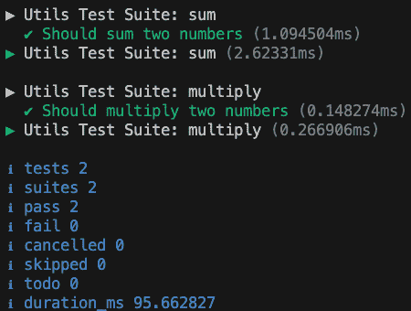
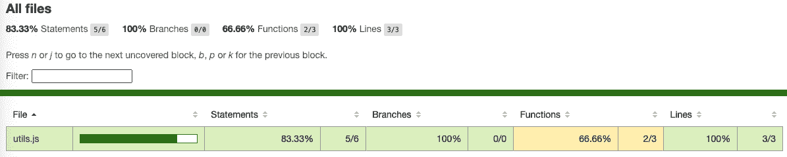

# 8

# Node.js 中的测试

测试是目前最相关的实践之一；在过去的几十年里，它比过去更受欢迎。今天，我们构建的软件复杂，有许多依赖关系和要求，这些依赖关系和要求会随着时间的推移而演变。我坚信，当您学习一门新语言或工具时，测试是关键，因为它将为您提供一张安全网，让您可以承担更多风险，更快地移动而不会破坏之前的代码。

在本章中，我们将深入研究测试的重要性以及如何为您的应用程序选择正确的测试类型。您将编写您的第一个测试，然后我们将学习通过分组相关测试来创建测试套件，展示 Node.js 核心测试和 Jest 库。

编写良好的测试并不容易，但到本章结束时，您将清楚地了解每次应遵循的原则，以及您如何可以使用测试覆盖率工具随着时间的推移扩展和重构您的测试。

最后，我们将通过解决一些边缘情况来介绍**测试驱动开发**（**TDD**）。

总结一下，以下是本章我们将探讨的主要主题：

+   为什么测试很重要？

+   测试方法和哲学

+   我应该如何测试我的代码？

+   编写我们的第一个测试套件

+   掌握代码覆盖率工具

+   TDD 实践

# 技术要求

本章的代码文件可以在[`github.com/PacktPublishing/NodeJS-for-Beginners`](https://github.com/PacktPublishing/NodeJS-for-Beginners)找到

查看本章的代码实践视频，请访问[`youtu.be/aK572sFboEM`](https://youtu.be/aK572sFboEM)

# 为什么测试很重要？

如前几章所述，现代应用程序复杂，有许多动态部分，并且会有依赖关系。

总体来说，我们可以这样说，测试之所以重要，是因为它帮助我们确保我们的代码按预期工作，并且在添加新功能或修复错误时不会引入错误。

## 测试是一种复杂的文化

测试不仅仅是编写一些代码来验证您的应用程序。它是一种包含许多想法、原则、实践和工具的文化...您听说过 TDD 吗？BDD？单元测试？集成测试？端到端测试？模拟？存根？间谍？有许多概念需要学习和理解，我们将在本章中探讨其中的一些。

## 测试必须是一种团队活动

测试将帮助您轻松地将新开发者引入您的团队。即使您对代码库不深入了解，您也可以加入其他团队帮助他们构建新功能或修复错误。

我喜欢将测试视为应用程序的文档，或者更好的是，作为对世界的一种协议，说明您的应用程序在特定场景下应该如何表现。

但测试是团队的努力。编写测试不仅仅是开发者的责任，就像编写安全代码不仅仅是开发者的责任一样。整个团队都应该参与这个过程，并且团队应该有一个测试文化，并随着时间的推移坚持这种文化。

自动化你的测试是至关重要的。没有自动化，我们就需要手动测试我们的应用程序。这意味着我们将执行许多容易出错的重复性任务，并且我们需要花费大量时间来确保我们的应用程序按预期工作。

通过测试，我们可以自动化这个过程，并确保我们的应用程序按预期工作。我们可以在本地机器上运行测试，或者在合并拉取请求之前或在部署软件之前在远程机器上运行测试。我们可以在不同的环境中运行测试，并且可以并行运行它们以加快过程。

## 现在就利用这个机会

我习惯于在日常工作中进行测试，并且可以说，它们是帮助我构建更好软件的伟大工具。但总的来说，它们帮助我学习新事物并提高我的技能。

当你必须使用一种新的语言或工具时，你可以使用测试来学习它是如何工作的，并探索其功能。你可以通过测试来学习这个新事物的工作原理，并在学习过程中进行自己的实验。

但如果你不习惯进行测试，同时学习 Node.js 和测试可能会有些困难。所以，我建议你首先学习 Node.js，然后再更深入地研究测试。

在下一章中，我们将构建一个 Web 应用程序，并使用测试来确保我们的应用程序按预期工作。

在采用测试文化的过程中，你将面临许多挑战。就像任何文化变革一样，开始进行测试并不容易。这是一个你需要克服的挑战，你需要投入时间去学习如何进行测试。但我想说，这是值得的。

如果你与团队一起工作，你需要说服你的团队开始进行测试，并在一段时间内巩固这种文化。这并不容易，但这是可能的。

你可以在自己的代码中开始进行测试，并向你的团队展示其带来的好处。你可以从一个宠物项目或一个概念验证测试开始，并说服整个团队。

注意，你需要投入时间去学习如何进行测试，即使你知道如何进行测试，你也需要投入时间去编写测试。与仅编写代码所需的时间相比，这部分时间总是更长。但当你需要修复错误或添加新功能，以及在防止错误发生时，你将节省更多的时间。

既然我们已经明确了采用测试的动机，那么在下一节中，我们将学习关于我们应用程序可用的不同测试类型，以及其他行业如何使用不同的测试框架构建稳固的产品。

# 测试方法和哲学

当我们刚开始学习测试时，我们没有意识到的是，存在许多不同类型的测试，每种测试都有其不同的目的。

## 测试在世界上被广泛使用

在现实世界中，测试被用于许多行业。例如，如果我们想测试工厂制造的汽车的质量，我们可以做以下事情：

+   在隔离状态下测试发动机

+   在一个受控的环境中测试汽车以确保其按预期工作

+   在真实环境中测试汽车以确保其按预期工作

+   测试汽车的各个组件以确保特定的质量标准

+   将汽车撞向墙壁或其他物体以确保其安全性

+   汽车行业在工程测试框架方面拥有世界上最有趣的框架之一。今天制造的大多数汽车，对于绝大多数最终用户来说，都经过了许多方式的测试，包括碰撞模拟来评估潜在的损害。在下面的图中，你可以看到这些测试之一


图 8.1 – 图片来自维基百科 [`en.wikipedia.org/wiki/Crash_test#/media/File:Honda_Fit-Impact_Still.jpg`](https://en.wikipedia.org/wiki/Crash_test#/media/File:Honda_Fit-Impact_Still.jpg)

软件产品也是如此。为了给你一个概念，我们可以单独测试网络应用程序组件，或者我们可以从最终用户的角度测试整个应用程序。还有选择只通过向应用程序发送大量不同结构化的请求来测试我们应用程序的性能，并检测任何瓶颈和低效之处。我们甚至可以通过进行渗透测试和尝试破解我们的应用程序来测试我们应用程序的安全性。

## 测试金字塔

因此，我们可以这样说，存在许多不同类型的测试，每种测试都有其不同的目的。让我们来看看测试金字塔：


图 8.2 – 图片来自马丁·福勒的《实用的测试金字塔》 [`martinfowler.com/articles/practical-test-pyramid.html`](https://martinfowler.com/articles/practical-test-pyramid.html)

如我们所见，金字塔的底部是单元测试，它们更加隔离且运行速度更快。在金字塔的顶部，我们有 UI 测试，它们更昂贵（因为它们需要更多的集成）且运行速度较慢。

以汽车为例，我们可以这样说，单元测试就像是在隔离状态下测试发动机，而 UI 测试则像是在真实环境中测试汽车。

我们可以很容易地理解，在隔离状态下测试发动机比在真实环境中测试汽车更快、更便宜，因为我们不需要构建整个汽车来测试发动机，也不需要准备文件，与保险公司协调，或者增加更多人员，如驾驶员和机械师。此外，在真实环境中测试汽车可能会导致外部因素（如天气、交通和道路状况）的影响。

与此相比，我们只需在工厂内使用工具和必要的人员，独立构建发动机并对其进行测试。我们可以更快、更便宜地完成这项工作，但这次测试将无法检测到我们在真实环境中测试汽车时可能遇到的一些问题。

因此，同样可以说，单元测试的运行速度和成本比 UI 测试低，但 UI 测试将能够检测到我们无法通过单元测试检测到的一些问题。

在本章中，我们将重点关注单元测试，但在接下来的章节中，当我们构建 Web 应用程序时，我们还将探讨其他类型的测试。

既然我们已经明确了不同类型的测试，那么现在是时候务实一些，探索如何在下一节中利用不同的库来构建我们的第一个测试用例。

# 我应该如何测试我的代码？

由于 JavaScript 的历史，大多数开发者在 JavaScript 仅限于浏览器并且几乎仅用于构建相对简单的脚本时，并没有测试代码的文化。

然而，随着语言和社区的演变，我们现在有很多工具和框架来帮助我们构建测试。

## 框架和库

当你对如何测试你的代码有一个清晰的想法时，你可以轻松地从一种工具迁移到另一种工具，直到找到最适合你需求的那一个。

在本章中，我们将探讨有前景的 Node.js 测试核心库以及最受欢迎的 Web 开发测试框架 Jest。

重要提示

我们正处于一个过渡时期，Node.js 核心库正在演变，以向开发者提供更好的体验。因此，在未来，它可能将成为默认的工具。但就目前而言，如果你是测试的新手，我建议你使用 Jest，因为有很多教程和博客文章，API 也更加稳定。

## 我们的第一测试

让我们看看一个简单的测试，然后我们将探索它的不同部分：

```js
import { describe, it } from 'node:test';
import assert from 'node:assert';
const sum = (a, b) => a + b;
describe('Utils Test Suite', () => {
  it('Should sum two numbers', () => {
    assert.strictEqual(sum(1, 2), 3);
  });
});
```

在这个例子中，我们正在测试求和函数。首先，我们从`node:test`模块中导入`describe`和`it`函数。然后，我们从`node:assert`模块中导入`assert`函数。

`describe`函数用于分组测试。在这种情况下，我们正在将所有与`utils`模块相关的测试分组在一起。

`it`函数用于定义一个测试。在这种情况下，我们定义了一个应该求和两个数字的测试。

最后，我们使用`assert`函数来检查`sum`函数的结果是否符合预期。

因此，我们可以这样说，一个测试由三个部分组成：

+   **安排**：定义我们运行测试所需的数据。

+   **行动**：运行我们想要测试的代码。

+   **断言**：检查代码的结果是否是预期的。

## 测试原则和目标

当我们构建测试时，我们应该遵循一些原则。对我来说，这些原则可以总结为三个目标，即快速、可信和可维护。

### 快速

测试应该运行和编写速度快。我们将多次运行这个测试，所以如果测试运行缓慢，我们将浪费大量时间等待它完成。但最糟糕的部分是，我们可能会倾向于减少测试的运行频率或编写更少的测试。

然后，测试将让你和你的团队感到沮丧。在小项目中，你可能只有几十个测试，但在大项目中，你可能会有成千上万的测试。

重要提示

如果你有一个平均运行时间为 1 秒的测试，每次运行测试你都会失去 1 秒。如果你有 1,000 个测试，你将失去 1,000 秒，这超过 16 分钟！在大多数情况下，你将有机会使用并发来并行运行测试，因此总时间将大大降低。但这需要额外的步骤来设置（[`nodejs.org/api/test.html#runoptions`](https://nodejs.org/api/test.html#runoptions)）。

在大项目中，你需要投入时间和资源来重构和改进你的测试，以保持它们的快速。

### 可信

测试应该是可信的。如果你有不可靠的测试（即随机失败的测试），你的团队将非常沮丧，并失去对测试的信心。

为了避免这种情况，我们应该遵循以下原则：

+   **隔离**：我们需要将测试与外部因素（如网络、文件系统、数据库和时间）隔离。

+   **可重复性和确定性**：我们需要能够多次运行测试并获得相同的结果。

+   **自包含和独立**：我们需要能够独立运行任何测试并获得相同的结果。

### 可维护性

测试也是代码，因此我们需要以与维护我们的生产代码相同的方式维护它们。我们应该遵循以下原则：

+   **可读性和明确性**：测试应该易于阅读和理解。它们必须具有灵活性，以便与我们要测试的代码一起进化。

+   **专注性**：单个测试应该测试单一事物。如果我们有一个测试在测试多个事物，我们将无法确切知道什么失败了。

+   **小而简单**：拥有许多小而简单的测试比拥有少数大而复杂的测试要好。

恭喜！你已经编写了第一个测试，现在应该对机制更清晰了。在下一节中，我们将学习如何构建一个完整的测试套件来覆盖多个案例，以及如何自动化一些步骤。

# 编写我们的第一个测试套件

在本节中，我们将构建我们的第一个测试套件。我们将为上一章中创建和发布的`utils`模块构建一个测试套件。

我们将使用 `node:test` 和 `node:assert` 模块来构建我们的测试套件，然后我们将使用 Jest 框架构建相同的测试，这样我们就可以比较两种方法并看到差异。

## 工具模块

让我们先创建一个新的文件夹，然后使用 `npm init` 初始化一个新的 Node.js 项目。然后我们将创建一个 `utils.js` 文件，其中包含以下代码：

```js
export const sum = (a, b) => a + b
export const multiply = (a, b) => a * b
```

代码非常简单。`sum` 函数会将两个数字相加，而 `multiply` 函数会将两个数字相乘。因此，测试也应该非常简单。

基本上，我们需要测试 `sum` 函数是否将两个数字相加，以及 `multiply` 函数是否将两个数字相乘。

## 测试核心库

最近，Node.js 引入了一个新的核心库来帮助我们构建测试。这个库叫做 `assert`，它是一个核心库，所以我们不需要安装它。我们只需导入并使用它即可。

### 添加 npm 脚本

让我们在 `package.json` 文件中添加以下 NPM 脚本，并添加 `type:"module"`：

```js
{
  "type": "module",
  "scripts": {
    "node-test": "node --test node_test/"
  }
}
```

在这种情况下，我们选择了 `type: "module"` 以默认启用 ESM 语法，这样我们就可以在文件中直接使用 import 关键字。你可以在 *第六章**.* 中找到有关如何导入模块的更多信息。

### 添加测试套件

让我们创建一个新的文件夹，`node_test`，并在其中包含一个名为 `utils.test.js` 的新文件，其中包含以下代码：

```js
import { describe, it } from "node:test";
import assert from "node:assert";
import { sum, multiply } from "../utils.js";
describe("Utils Test Suite: sum", () => {
  it("Should sum two numbers", () => {
    assert.strictEqual(sum(1, 2), 3);
  });
});
describe("Utils Test Suite: multiply", () => {
  it("Should multiply two numbers", () => {
    assert.strictEqual(multiply(5, 3), 15);
  });
});
```

重要的是要注意，我们正在使用 `../` 来从当前文件引用父目录。这样，我们可以从计算机上的任何位置导入文件。也可以使用到特定资源的绝对路径。你可以在 [`www.redhat.com/sysadmin/linux-path-absolute-relative`](https://www.redhat.com/sysadmin/linux-path-absolute-relative) 找到更多关于这些差异的详细信息。

### 运行测试

现在，我们可以使用以下命令来运行测试：

```js
npm run node-test
```

我们应该看到以下输出：



图 8.3 – 终端输出

注意，终端使用不同的颜色来显示测试结果。在这种情况下，我们有两个测试，并且两个都通过了。正如你所看到的，输出非常简单，并且使用了我们在 `describe` 和 `it` 函数中定义的文本。

## 使用 Jest 库

Jest 是一个在 JavaScript 社区中非常流行的 JavaScript 测试框架。它非常容易使用，并且拥有许多功能，可以帮助我们构建和维护测试套件，尤其是如果你正在使用现代框架作为库进行前端开发，例如 Angular、React 或 Vue。

### 安装 Jest

第一步是在我们的项目中将 `Jest` 安装为开发依赖。我们可以使用以下命令来完成：

```js
npm install --save-dev jest@29
```

### 配置 Jest

由于我们之前已经为 Node.js 核心库设置了测试，因此我们需要为 Jest 使用自定义配置。在实际项目中，我们将只使用一个测试框架，在这种情况下，我们可以使用 `npx jest@29 --init` 来配置 Jest。

`npx`命令将执行我们在项目中安装的`Jest`命令。`--init`标志将为我们创建一个配置文件。

我们将创建一个新文件，`jest.config.js`，内容如下：

```js
export default {
    modulePathIgnorePatterns: ['<rootDir>/node_test/' ]
}
```

`modulePathIgnorePatterns`将忽略`node_test`文件夹，因此我们可以忽略我们使用 Node.js 核心库创建的测试。`<rootDir>`是指`jest.confg.js`所在的文件夹，因此更容易引用其他资源。

由于 Jest 目前不支持 ESM 模块，我们将使用 Babel ([`babeljs.io/`](https://babeljs.io/))来转译代码。我们将创建一个新文件，`.babelrc`，内容如下：

```js
{
  "presets": ["@babel/preset-env"]
}
```

我们将安装以下依赖项：

```js
npm i -D @babel/preset-env@7
```

### 添加 npm 脚本

让我们在`package.json`文件中添加以下 npm 脚本：

```js
{
  "scripts": {
    "node-test": "node --test node_test/",
    "jest-test": "jest"
  }
}
```

### 添加测试套件

让我们创建一个新文件夹，`jest_test`，并在其中包含一个名为`utils.test.js`的新文件，内容如下：

```js
import { sum, multiply } from "../utils.js";
describe("Utils Test Suite: sum", () => {
  it("Should sum two numbers", () => {
    expect(sum(1, 2)).toBe(3);
  });
});
describe("Utils Test Suite: multiply", () => {
  it("Should multiply two numbers", () => {
    expect(multiply(5, 3)).toBe(15);
  });
});
```

如您所见，代码与我们为 Node.js 核心库创建的代码非常相似。唯一的区别在于我们如何管理断言。

重要提示

注意，我们也没有导入`describe`和`it`函数。这是因为 Jest 为我们提供了这些函数，我们不需要导入它们。

### 运行测试

现在，我们可以使用以下命令运行测试：`npm run jest-test`。

我们应该看到以下输出：


图 8.4 – 终端输出

如您所见，输出与我们在 Node.js 核心库中看到的输出非常相似。唯一的区别是输出使用了不同的颜色，文本略有不同。但最重要的是，我们得到了相同的信息。

现在，我们对我们的测试非常有信心，但随着源代码每天都在增长，你需要一个额外的工具来帮助你了解哪些代码已被测试覆盖或未被覆盖。因此，在下一节中，我们将详细学习如何使用测试覆盖率生成报告，这将帮助我们改进项目中的测试。

# 掌握代码覆盖率工具

当我们构建测试套件时，我们需要确保我们覆盖了所有对我们目的有意义的场景中的关键代码。这被称为**代码覆盖率**，它是衡量我们测试套件质量的一个重要指标。

有些人说我们需要达到 100%的代码覆盖率，但这并不总是真实或实用的。在我看来，代码覆盖率是一个帮助我们检测测试未覆盖的代码或过度测试的代码的指标。

总的来说，这是一个可以帮助我们浏览代码并检测需要添加或删除的潜在测试的指标。

## 配置

从历史上看，代码覆盖率是一个由第三方库（如 Istanbul [`istanbul.js.org/`](https://istanbul.js.org/)）提供的功能。但现在，Node.js 和 Jest 都自带了这个功能，所以我们不需要安装任何第三方库。

### Jest 库

让我们在 `package.json` 文件中添加以下 npm 脚本：

```js
{
  "scripts": {
    "node-test": "node --test node_test/",
    "jest-test": "jest",
    "jest-test:coverage": "jest --coverage"
  }
}
```

### Node.js

Node.js 有一个实验性功能，我们可以用它来生成代码覆盖率。我们需要使用 `--experimental-test-coverage` 标志来启用此功能：

```js
{
  "scripts": {
    "node-test": "node --test node_test/",
    "jest-test": "jest",
    "jest-test:coverage": "jest --coverage",
    "node-test:coverage": "node --test --experimental-test-coverage node_test/"
  }
}
```

## 运行测试

让我们在 `utils.js` 文件中添加一个新的函数，`substract`：

```js
export const sum = (a, b) => a + b
export const multiply = (a, b) => a * b
export const subtract  = (a, b) => a - b
```

现在，让我们运行 Node.js 和 Jest 的代码覆盖率以查看结果。

## Node.js 报告

默认情况下，Node.js 将生成一个包含结果的 `coverage` 文件夹。我们可以在浏览器中打开 `index.html` 文件来查看结果：

```js
npm run node-test:coverage
```

输出应类似于以下图示：


图 8.5 – 终端输出

如您所见，我们的函数代码覆盖率是 66.67%，因为我们没有对 `subtract` 函数进行任何覆盖率测试。

### Jest 报告

使用 Jest 运行代码覆盖率与运行测试非常相似：

```js
npm run jest-test:coverage
```

输出应类似于以下图示：


图 8.6 – 终端输出

如您所见，我们的代码覆盖率与 Node.js 相同。这是因为这两个工具以相同的方式用于计算代码覆盖率。

### 覆盖率 UI 报告

在这两种情况下，我们都生成了一个包含结果的 `coverage` 文件夹。我们可以在浏览器中打开位于 `coverage/lcov-report` 中的 `index.html` 文件来查看结果。



图 8.7 网络浏览器报告

我们可以详细探索 `utils.js` 中哪些被覆盖了，哪些没有被覆盖。


图 8.8 – 网络浏览器报告

如您所见，`subtract` 函数没有被我们的测试覆盖。因此，这里我们有改进测试的机会。

代码覆盖率报告是理解你的测试的一个很好的方式，尤其是当你与大型代码库一起工作时。所以我鼓励你尽可能多地使用它。

在下一节中，我们将改变方法。我们将学习在编写代码之前定义测试时我们获得的额外价值。虽然这可能听起来很复杂，但它将极大地帮助你明确你接下来需要构建什么以及如何以可以测试的方式进行构建。当你遵循这种方法时，你会对能节省多少时间感到惊讶。这被称为测试驱动开发。

# 测试驱动开发实践

在我们的 `utils` 模块中，有一些边缘情况我们没有涵盖。例如，如果我们向 `sum` 函数传递一个字符串会发生什么？

```js
import { sum } from "../utils.js";
const result = sum("1", 2); // 12
```

当我们使用 `sum` 函数时，这不是预期的行为，因此我们需要修复它。

让我们在 `jest-tests/utils.test.js` 文件中添加一些测试来覆盖这些边缘情况：

```js
describe("Utils Test Suite: sum", () => {
  it("Should sum two numbers", () => {
    expect(sum(1, 2)).toBe(3);
  });
  it("Should throw an error if we don't provide a valid number", () => {
    expect(() => sum("1", 2)).toThrow("Please provide a valid number");
  });
});
```

正如你所见，我们正在使用`toThrow`匹配器来测试函数是否抛出错误。现在，让我们使用`npm run jest-test`运行测试覆盖率。


图 8.9 – 终端输出

我们的新测试失败是因为我们的代码没有满足我们的要求，所以让我们在`utils.js`中做一些修改：

```js
export const sum = (a, b) => {
    if(typeof(a) !== 'number' || typeof(b) !== 'number') {
        throw new Error('Please provide a valid number')
    }
    return a + b
}
export const multiply = (a, b) => a * b
export const subtract  = (a, b) => a - b
```

现在，让我们再次运行测试。


图 8.10 – 终端输出

我们的测试再次通过，所以我们可以说我们的代码按预期工作。首先编写测试然后编写代码以使测试通过的这个交互式过程被称为测试驱动开发，或 TDD。

虽然 TDD 是一个很大的话题，但我们可以把这个简单的例子作为一个探索性介绍，来了解 TDD 的好处，而不必严格遵循它。例如，我们可以测试边缘情况，然后使用它们来改进我们的代码。

我个人认为 TDD 在 Node.js 中是一个很好的方法，因为它帮助我把复杂任务分解成具有自己明确定义和测试功能的小块。虽然这可能对更资深开发者来说很显然，但由于 JavaScript 的特性，很容易构建过度工程化的解决方案。测试在这方面会极大地帮助我们。

此外，当你独立工作时，测试可以是一个伟大的盟友，例如，当你需要为 Web 应用程序构建 HTTP API，但前端团队不计划在 API 准备好之前开始时。所以，测试是验证前端团队实现的一个很好的方式。此外，测试也是让新成员加入团队的一个很好的方式，因为他们可以通过运行和阅读测试来轻松地了解应用程序中预期会发生什么。

对于更复杂的情况，这也是调试应用程序和重现客户或团队成员报告的 bug 的一个很好的方式。总的来说，我认为投资回报率非常高，尤其是在像 JavaScript 这样的动态语言中。

# 摘要

在本章中，我们学习了测试原则以及我们如何结合不同类型的测试来构建一个健壮的测试套件。我们还探讨了测试金字塔如何帮助我们构建一个易于维护和理解的测试套件。

此外，我们讨论了单元测试和集成测试之间的区别，以及我们如何使用它们来测试我们的代码。我们还探讨了在团队中推广测试的策略。

之后，我们探讨了如何使用 Node.js 核心模块和 Jest 给我们的代码添加单元测试。

最后，我们学习了如何使用代码覆盖率作为一个交互式工具来帮助我们精炼我们的测试并保持我们的代码库健壮。然后，我们使用 TDD 进行了一些练习，以修复我们库中的一个 bug。

在下一章中，我们将详细探讨 HTTP 协议的工作原理以及我们如何使用 Node.js 构建 RESTful API。

# 进一步阅读

+   *马丁·福勒的《实用的测试金字塔》*: [`martinfowler.com/articles/practical-test-pyramid.html`](https://martinfowler.com/articles/practical-test-pyramid.html)

+   *测试驱动开发 // 使用 JavaScript 的有趣 TDD 介绍*: [`www.youtube.com/watch?v=Jv2uxzhPFl4`](https://www.youtube.com/watch?v=Jv2uxzhPFl4)

+   *使用 Jest 进行令人愉快的 JavaScript 测试*: [`www.youtube.com/watch?v=cAKYQpTC7MA`](https://www.youtube.com/watch?v=cAKYQpTC7MA)

+   *从 Jest 迁移到 Node.js 原生测试运行器（埃里克·温德尔）*: [`www.youtube.com/watch?v=2YfIB4gia60`](https://www.youtube.com/watch?v=2YfIB4gia60)

+   *TDD，哪里出了错（伊恩·库珀）*: [`www.youtube.com/watch?v=EZ05e7EMOLM`](https://www.youtube.com/watch?v=EZ05e7EMOLM)

+   *JavaScript 单元测试第一部分 - 为什么需要单元测试？*: [`www.youtube.com/watch?v=Eu35xM76kKY&list=PL0zVEGEvSaeF_zoW9o66wa_UCNE3a7BEr`](https://www.youtube.com/watch?v=Eu35xM76kKY&list=PL0zVEGEvSaeF_zoW9o66wa_UCNE3a7BEr)

# 第三部分：Web 应用程序基础

在*第三部分*中，你将学习如何通过使用大多数公司采用的现代模式和技巧来构建 Web 应用程序。你还将学习如何构建稳固的 RESTful API。

本部分包括以下章节：

+   *第九章*，处理 HTTP 和 REST API

+   *第十章*，使用 Express 构建 Web 应用程序
