# 处理 HTTP 和 REST API

在本章中，我们将从历史的角度和我们对互联网基础设施的实际理解来学习互联网。

我们将深入探讨那些使得创建网络项目成为可能的协议和架构，并会研究那些构成当前网络浏览体验基础的网络请求规范（RFCs）。

我们将掌握围绕 HTTP、URLs 和 REST API 的所有组件和理论概念。

总结一下，以下是本章我们将探讨的主要主题：

+   互联网的历史以及互联网基础设施是如何工作的

+   **请求评论（RFCs**）是什么以及如何使用它们

+   服务器和客户端之间的 HTTP 通信（**单页应用（SPA**）与服务器端渲染）

+   掌握 HTTP（头部、状态码、有效载荷、动词等）

+   使用工具调试 HTTP 请求

+   REST API 的结构

+   JSON 规范的工作原理

+   现代网络内部的工作原理

到本章结束时，你将对构成当前互联网的所有组成部分有一个清晰的认识，以及如何通过应用本章学到的知识来构建你的网络项目。

# 技术要求

本章的代码文件可以在[`github.com/PacktPublishing/NodeJS-for-Beginners`](https://github.com/PacktPublishing/NodeJS-for-Beginners)找到。

查看本章的代码演示视频，请访问[`youtu.be/GleRpaaR2PQ`](https://youtu.be/GleRpaaR2PQ)

# 互联网内部的工作原理

我们每天都在使用互联网，但我们真的知道它是如何工作的吗？维基百科将互联网定义为如下：

“互联网（或互联网）是由使用互联网协议套件（TCP/IP）进行网络和设备间通信的全球互联计算机网络组成。它是一个由私有、公共、学术、商业和政府网络组成的网络，这些网络覆盖了从本地到全球的范围，并通过广泛的电子、无线和光网络技术相互连接。互联网承载着广泛的信息资源和服务，如万维网（WWW）的相互链接的超文本文档和应用、电子邮件、电话和文件共享。”

基本上，互联网是一个全球系统，通过网络将计算机连接起来，并采用某些协议和技术以弹性的方式实现通信。互联网被各种实体和个人用于通过电子邮件、文件共享等工具共享信息资源和服务。

但说实话，这个定义只是触及了表面。要了解互联网是如何工作的，我们需要回顾过去，了解它是如何开始的。

## 互联网的历史

我们今天所知道的互联网不是由单一个人或特定群体创造的。互联网是许多人为创造不同技术和思想的工作成果，随着时间的推移，这些技术和思想逐渐形成了我们今天所知道的现代互联网。

当我们试图从工程角度理解互联网的工作原理时，有两个主要概念需要我们牢记。这些概念如下：

+   **信息访问**：当计算机世界还处于主机时代时，用户终端必须连接到主机。远程访问的想法开始兴起。随着时间的推移，人类发现如果我们把计算机连接起来，我们可以在它们之间共享信息和资源。基本上，我们可以分割和分配信息和计算机资源。我们可以比人类历史上任何时候都更快地与其他人建立联系并分享信息。

+   **弹性**：在 20 世纪 60 年代，美国政府担心可能发生核攻击，这可能会摧毁通信基础设施。这种担忧是分布式网络想法的种子，这个网络没有单一故障点，可以抵御核攻击，这也是为什么互联网经常被称为网络之网的原因。

自 20 世纪以来，为了使互联网成为现实，还需要发生许多更多的事情，但这两个概念在互联网的架构中仍然非常强大。

重要信息

有一个非常好的视频以非常简单的方式解释了互联网的历史。你可以在这里观看：[`www.youtube.com/watch?v=9hIQjrMHTv4`](https://www.youtube.com/watch?v=9hIQjrMHTv4)。

## 互联网基础设施

只为了给你一个我们所有人都对互联网的依赖性的概念，有数百条光纤电缆横跨海洋和海域，使互联网连接成为可能。以下是连接世界的海底电缆地图：

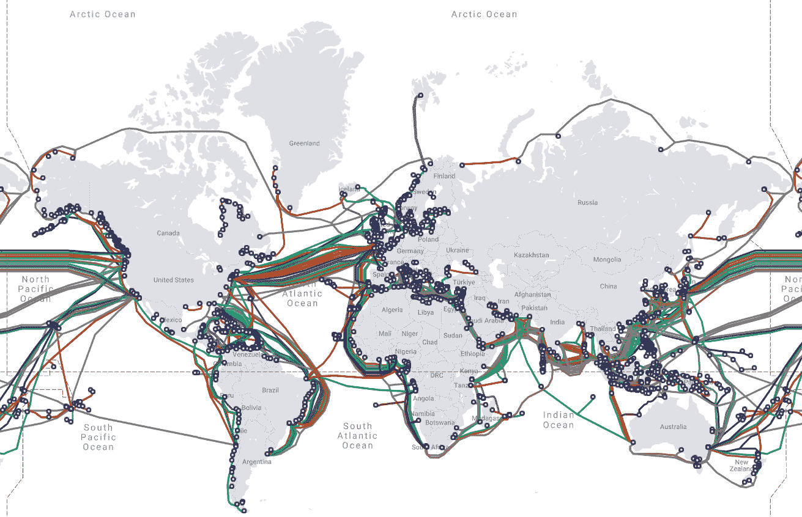

图 9.1 – 我们的世界通过横跨海洋的数十条光纤电缆连接在一起。截图来自([`www.submarinecablemap.com/`](https://www.submarinecablemap.com/)) CC BY-SA 4.0。

光纤电缆并不是连接互联网的唯一方式。其他方式包括卫星和无线电波。多年来，由于电信领域的无尽研究和创新，互联网的速度提高了，连接的成本降低了。

## 请求评论 (RFC)

在本章中，我们将重点介绍我们需要熟悉以使我们的应用程序正常工作的规范、协议和标准。

如果你第一次探索这样的异国话题，你可能会因为需要消化的信息量而感到不知所措。但别担心，我们将以非常简单和实用的方式探讨所有这些话题。

互联网工程任务组（IETF）将请求评论（RFC）定义为如下 ([`www.ietf.org/standards/rfcs/`](https://www.ietf.org/standards/rfcs/))：

“RFC 文档包含互联网的技术规范和组织注释。”

基本上，RFC 是一种描述将要作为互联网架构一部分设计的某种规范/协议/标准的文档。任何人都可以向 IETF 提交一个 RFC，如果该 RFC 被批准，它就变成了一个标准。虽然这听起来很简单，但这个过程可能需要很长时间，因为精炼和审查过程是详尽的。

这里是从 RFC 2616 ([`www.rfc-editor.org/rfc/rfc2616.txt`](https://www.rfc-editor.org/rfc/rfc2616.txt)) 中提取的一个简单示例，该文档在 175 页中描述了**超文本传输协议 – HTTP/1.1**：

```js
Network Working Group                       R. Fielding
Request for Comments: 2616
  UC Irvine
Obsoletes: 2068
  J. Gettys
Category: Standards Track                    Compaq/W3C                                                  J. Mogul
                                                 Compaq
                                             H. Frystyk
                                                W3C/MIT
                                            L. Masinter
                                                  Xerox
                                               P. Leach
                                              Microsoft
                                         T. Berners-Lee
                                                W3C/MIT
                                              June 1999
                Hypertext Transfer Protocol -- HTTP/1.1
Status of this Memo
   This document specifies an Internet standards track protocol for the
   Internet community, and requests discussion and suggestions for
   improvements.  Please refer to the current edition of the "Internet
   Official Protocol Standards" (STD 1) for the standardization state
   and status of this protocol.  Distribution of this memo is unlimited.
Copyright Notice
   Copyright (C) The Internet Society (1999).  All Rights Reserved.
Abstract
   The Hypertext Transfer Protocol (HTTP) is an application-level
   protocol for distributed, collaborative, hypermedia information
   systems. It is a generic, stateless, protocol which can be used for
   many tasks beyond its use for hypertext, such as name servers and
   distributed object management systems, through extension of its
   request methods, error codes and headers [47]. A feature of HTTP is
   the typing and negotiation of data representation, allowing systems
   to be built independently of the data being transferred.
   HTTP has been in use by the World-Wide Web global information
   initiative since 1990\. This specification defines the protocol
   referred to as "HTTP/1.1", and is an update to RFC 2068 [33].
```

是的，我知道……这不是一篇容易阅读的文章。我不期望你阅读整个 RFC，但我们将以实用的方式探讨其中的一些部分。

RFC 最好的方面是它们是免费的，你可以在线阅读。当你需要时，你可以找到大量有助于你理解互联网架构特定部分的高质量信息。

### **其他 RFC**

为了消除那种令人不知所措的感觉，我想与你分享一些更易于阅读的其他 RFC：

+   **RFC 2324** ([`tools.ietf.org/html/rfc2324`](https://tools.ietf.org/html/rfc2324))：超文本咖啡壶控制协议 (HTCPCP/1.0)

+   **RFC 1149** ([`tools.ietf.org/html/rfc1149`](https://tools.ietf.org/html/rfc1149))：在鸟类载体上传输 IP 数据包的标准

而我最喜欢的一个：

+   **RFC 2549** ([`datatracker.ietf.org/doc/html/rfc2549`](https://datatracker.ietf.org/doc/html/rfc2549))：带有服务质量（QoS）的 IP 通过鸟类载体；RFC 1149 的一个迭代版本

这些有趣的 RFC 可以让你熟悉 RFC 讨论格式的力量。基本上，如果你想创建一个新的协议，你可以向 IETF 提交一个 RFC，如果该 RFC 被批准，它就变成了一个标准。你可以在这里了解更多关于 RFC 流程的信息：[`www.rfc-editor.org/about/independent/`](https://www.rfc-editor.org/about/independent/)。

作为一名网络开发者，你需要了解的最重要协议之一是 HTTP。在下一节中，我们将详细探讨这个协议，并学习它涉及的不同的架构和组件，这些组件现在是互联网的骨干，正如我们所知。

# HTTP – 服务器和客户端关系

虽然网络开发可能是一个非常复杂的话题，但我们可以通过理解典型网络应用中服务器和客户端之间的关系来简化它。

我们有两个主要角色，服务器和客户端：

+   **服务器**：服务器是运行应用、处理数据库查询以及许多其他事务的计算机。这个服务器通常被称为后端。

+   **客户端**：在 Web 应用的情况下，客户端是最终用户在本地机器上执行的软件。用户使用网络浏览器来执行软件（HTML、CSS、JS 等）。客户端通常被称为前端。

服务器和客户端之间的通信是通过 HTTP 完成的。客户端向服务器发送请求，服务器回复响应。这是典型的请求/响应周期

## 请求和响应

请求和响应是 HTTP 的两个主要部分。请求由客户端发送到服务器，服务器返回响应。请求和响应由以下章节中将要探讨的不同部分组成。

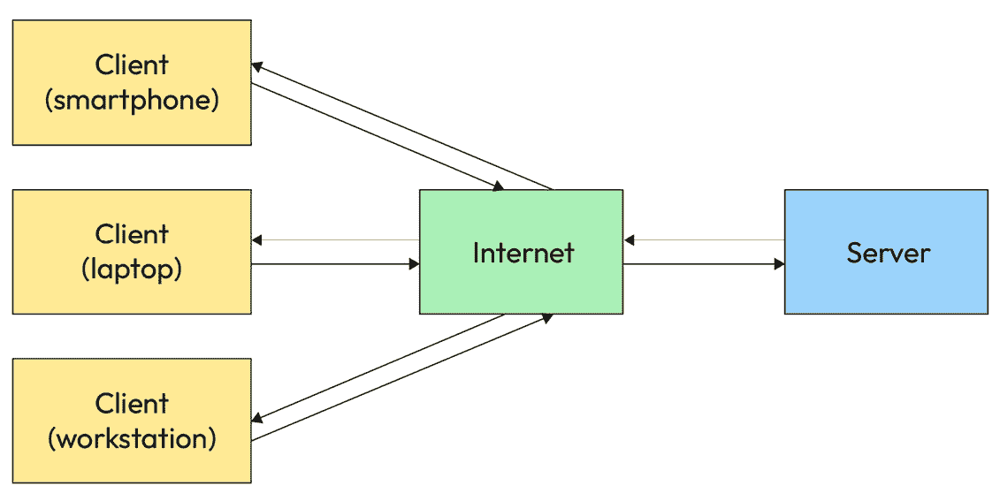

图 9.2 – 服务器、互联网和多个客户端之间的关系

如前图所示，一个服务器可以同时处理多个客户端。这是 Web 应用的典型架构。服务器处理来自客户端的请求，并返回相应的响应。

但非常常见的情况是，一个客户端会向单个服务器或多个服务器发送多个请求。让我们看看以下 HTML 片段：

```js
<head>
<link rel="stylesheet" type="text/css" href="https://server1.com/style.css">
</head>
<body>

<script type="text/javascript" src="img/script.js"></script>
</body>
```

如我们所见，客户端向三个不同的服务器（`server1.com`、`server2.com`和`server3.com`）发送三个请求，请求特定的资源。每个服务器最终都会响应并返回所需的资源。

作为简单的例子，让我们访问[`packtpub.com`](https://packtpub.com)并在我们的浏览器中打开开发者工具。在**网络**标签页中，我们可以看到浏览器向服务器发送的所有请求以及服务器的响应：

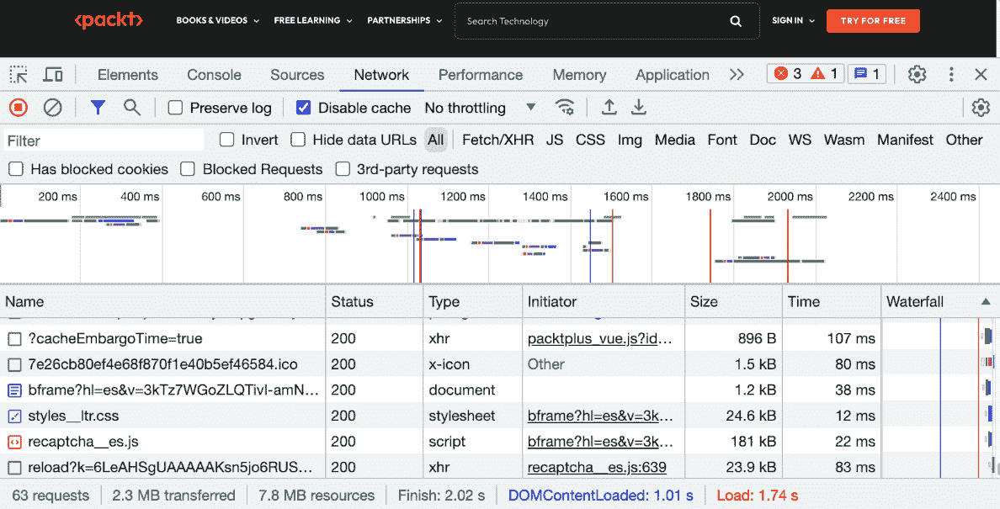

图 9.3 – 网络浏览器截图

如果你注意看*图 9**.3*的底部，你可以很容易地看到这个页面正在向不同的服务器发送超过 60 个请求以渲染页面。这在 Web 应用中是一个非常常见的场景：客户端向服务器发送多个请求以获取关键资源，包括 favicon、CSS 文件、JS 文件、图片、视频和原始数据。如果我们查看表格，我们可以看到加载的每个项目，并且可以调试和探索所发出的每个请求。这可能在开始时有些令人畏惧，但一旦你了解了过滤器的工作原理，并且花了一些时间与之工作，你会感到更加自在。

## 服务器端渲染

在最初，Web 应用非常简单，JavaScript 的使用非常有限。Web 应用在服务器上渲染，客户端只接收 HTML、CSS 和 JS 文件。这被称为服务器端渲染，并且在许多应用中仍然在使用。

虽然这个模型今天仍在使用，但它有一些明显的缺点。每次用户想要与应用程序交互时，服务器都需要重新渲染页面并发送给客户端。这产生了大量的流量，用户体验也不是最佳，因为在刷新之间，网站会出现空白的情况。

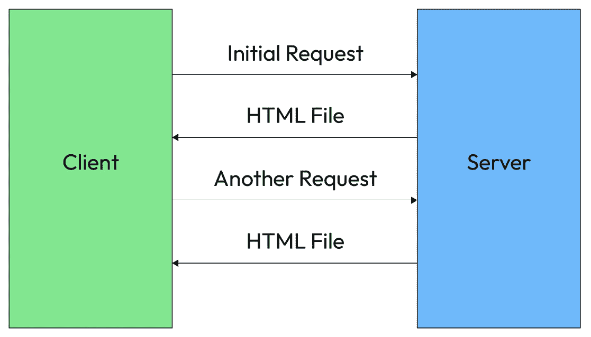

图 9.4 – 服务器端渲染方法中服务器和客户端之间的关系

这种模式在智能手机的早期阶段尤其糟糕，当时移动设备没有足够强大的功能来渲染页面，而且连接也不是很好。用户体验非常糟糕。解决方案是将渲染移动到客户端，这被称为客户端渲染。

## 单页应用程序（SPAs）

在客户端渲染中，服务器将初始的 HTML、CSS 和 JS 文件发送到客户端。然后，JavaScript 接管应用程序并将在客户端渲染视图。因此，服务器只向客户端发送数据，客户端渲染页面。这被称为**单页应用程序**（SPA），它是今天最常用的模式。

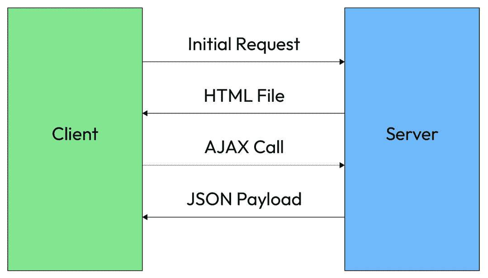

图 9.5 – AJAX 方法中服务器和客户端之间的关系

起初，这种模式实现起来非常复杂，但随着 JavaScript 框架的发展，这种模式变得非常流行。今天，我们有很多框架可以帮助我们轻松构建 SPA。其中一些最受欢迎的框架是 Angular、React 和 Vue.js。SPA 模式使用相同的 HTTP，但通过**异步 JavaScript 和 XML**（AJAX）请求以不同的方式使用。

这种新技术在构建后端应用程序的方式上引入了许多变化和创新。后端应用程序更像是一个**应用程序编程接口**（API），它向客户端响应数据，而不仅仅是典型的网络客户端，现在服务器也可以使用这个 API 相互交换信息。

现在我们已经对组件和可能的网络架构有了清晰的认识，是时候深入探讨 HTTP 了，这样我们就可以使用标准化的服务器和客户端之间的通信来构建稳固的项目。

# 掌握 HTTP

现在我们对 HTTP 概念有了更好的理解，让我们看看构建网络应用需要了解的 HTTP 的不同部分。

我们已经看到了请求和响应，但让我们更深入地看看构成请求和响应的不同部分（头信息、有效载荷、版本和方法）。

## HTTP 头信息

每个请求和响应都有一个头信息集合。这些是键值对，提供了关于请求或响应的额外信息。

虽然请求头和响应头看起来可能相似，但它们并不相同，尽管它们确实共享一些常见的键值对。

### 请求头

我们将首先在 *图 9.6* 中分析请求头信息包含的内容：

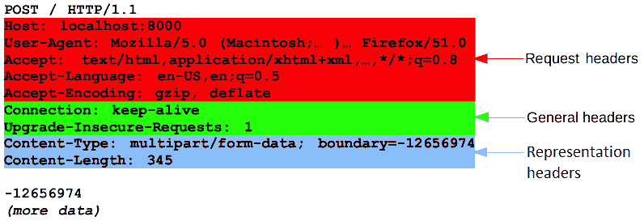

图 9.6 – 由 Mozilla 贡献者提供的归属和版权许可，根据 CC-BY-SA 2.5 许可

让我们将不同的头属性分组：

+   表示头信息：`content-type` 和 `content-length`

+   通用头信息：`keep-alive` 和 `upgrade-insecure-requests`

+   请求头：`accept`、`accept-encoding`、`accept-language`、`host` 和 `user-agent`

只需查看头信息，我们就可以了解许多关于请求的信息，例如客户端期望的内容类型、语言和使用的浏览器。服务器可以使用这些信息来向客户端提供更好的响应。

重要信息

这只是可能头信息列表中的一小部分。还有很多其他的头信息，我们可以使用它们来提供更多关于请求或响应的信息。我们甚至可以创建自己的键值对。您可以在以下链接找到 HTTP 头信息的列表：[`developer.mozilla.org/en-US/docs/Web/HTTP/Headers`](https://developer.mozilla.org/en-US/docs/Web/HTTP/Headers)。

### 响应头

我们将以分析 *图 9.7* 中响应头信息的内容作为结束。

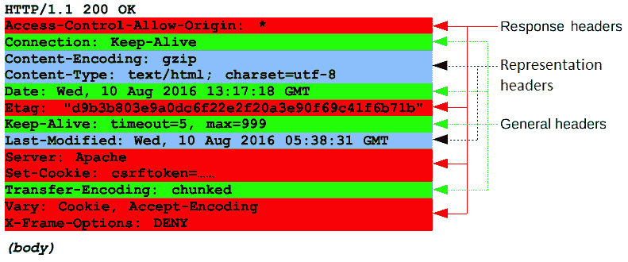

图 9.7 – 由 Mozilla 贡献者提供的归属和版权许可，根据 CC-BY-SA 2.5 许可

响应头与请求头非常相似，但它们并不相同。它们可以被如下分组：

+   表示头信息：`content-type`、`content-encoding` 和 `last-modified`

+   通用头信息：`connection`、`date`、`keep-alive` 和 `transfer-encoding`

+   响应头：`access-control-allow-origin`、`etag`、`server`、`set-cookie`、`vary` 和 `x-frame-options`

通过响应头，我们还可以提供有助于浏览器和 Web 应用程序正确处理和显示信息的额外信息。

响应头对于应用程序的安全性非常重要，因为有许多头信息可以在浏览器环境中防止某些攻击。例如，我们可以使用 `x-frame-options` 来防止应用程序在 `iframe` 中加载，或者使用 `feature-policy` 来防止应用程序使用摄像头或麦克风等特性。我们将在 *第十五章* 中探讨这一点。

## 状态码

总体而言，在响应中我们可以找到的最重要信息之一是状态码。

状态码使我们能够了解请求是否成功，甚至可以提供更细粒度的反馈。我们可以将状态码分为以下几组：

+   1xx: 信息性

+   2xx: 成功

+   3xx: 重定向

+   4xx: 客户端错误

+   5xx: 服务器错误

最常见的状态码是`200 OK`、`201 Created`、`301 Moved Permanently`、`400 Bad Request`、`401 Unauthorized`、`403 Forbidden`、`404 Not Found`、`429 Too Many Requests`、`500 Internal Server Error`和`503 Service Unavailable`。你可以在这里找到状态码的完整列表：[`developer.mozilla.org/en-US/docs/Web/HTTP/Status`](https://developer.mozilla.org/en-US/docs/Web/HTTP/Status)。

正如你所看到的，如果你知道给定的状态码，你就可以理解你的请求发生了什么。例如，当客户端在给定时间内发送了过多的请求时（“速率限制”），就会发生`429`错误代码，但如果你收到`401`，那么错误与你的身份验证有关。最后，如果在同一场景下你收到`403`，你已正确认证，但你没有足够的权限执行给定的操作，例如删除另一个用户账户。

我们都经历过`404`错误代码，当我们尝试访问不存在的资源时，这种情况非常常见。例如，如果我们尝试访问以下 URL，`https://www.google.com/invented-resource`，我们将收到`404`错误代码。

418 我是一把茶壶

互联网上有一个强大的文化，就是构建花哨的 404 页面。你可以在网上找到很多例子，但很少有人知道有一个特殊的错误代码`418`，RFC 2324 ([`tools.ietf.org/html/rfc2324`](https://tools.ietf.org/html/rfc2324))将其描述如下：

“任何试图用茶壶煮咖啡的行为都应该导致错误代码“418 我是一把茶壶”。结果实体体可能又短又结实。”

虽然这看起来可能只是一个玩笑，但实际上它得到了许多实体的支持，包括 Node ([`github.com/nodejs/node/issues/14644`](https://github.com/nodejs/node/issues/14644)) 和 Google。

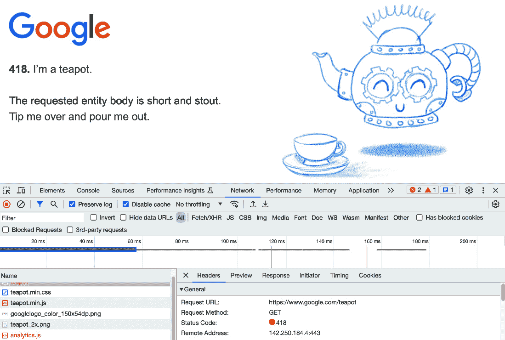

图 9.8 – google.com/teapot 的网页浏览器截图

正如 Shane Brunswick 在 Save 418 运动网站上所说（[`save418.com/`](https://save418.com/))：

“这是一个提醒，计算机的底层过程仍然是由人类制造的。看到 418 号状态码消失将是一件非常遗憾的事情。”

我确实同意他的观点：在这些复杂的系统背后有人类，我们不应该忘记这一点，就像我们不应该忘记互联网不可能没有开源运动和黑客文化而存在一样。

## 请求方法

正如状态码对于理解响应非常重要一样，请求方法对于理解请求也是必不可少的。

请求方法有很多，但最常见的是以下几种：`GET`、`POST`、`PUT`、`PATCH`和`DELETE`。您可以在以下位置找到请求方法的完整列表：[`developer.mozilla.org/en-US/docs/Web/HTTP/Methods`](https://developer.mozilla.org/en-US/docs/Web/HTTP/Methods)。

我们后端开发者使用它们的方式可能略有不同，但最常见的方式如下：

+   `GET`: 获取资源

+   `POST`: 创建资源

+   `PUT`: 更新资源

+   `PATCH`: 部分更新资源

+   `DELETE`: 删除资源

当我们创建一个包含所有端点的实际 REST API 时，我们将在*第十一章**中详细探讨它们。

在互联网的早期，我们使用表单将数据发送到服务器，并在表单中指定了给定方法。例如，看以下内容：

```js
<form action="/user" method="POST">
  <input type="text" name="username" />
  <input type="password" name="password" />
  <input type="submit" value="Submit" />
</form>
```

以下代码是向服务器发送数据以创建新用户的常见方式，但如今我们使用 JavaScript 将数据发送到服务器。例如，我们可以使用`fetch` API 将数据发送到服务器，如下所示：

```js
fetch('/user', {
  method: 'POST',
  headers: {
   'Content-Type': 'application/json'
  },
  body: JSON.stringify({
    username: 'john',
    password: '1234'
  })
})
```

然后我们将使用响应来通知用户请求是否成功。虽然使用 JavaScript 将数据发送到服务器更为复杂，但它为我们提供了更多的灵活性和对请求的控制。

重要提示

当你在浏览器中输入 URL 时，浏览器会向服务器发送一个`GET`请求。这是浏览器默认使用的方法。您已经长时间使用 HTTP 方法，却不知道这一点。

## HTTP 有效载荷

HTTP 消息可以携带有效载荷，这意味着我们可以向服务器发送数据，服务器同样也可以向其客户端发送数据。这通常是通过`POST`请求完成的。

有效载荷可以有多种格式，但最常见的是以下几种：

+   `application/json`: 在共享 JSON 数据时使用

+   `application/x-www-form-urlencoded`: 在发送 ASCII 简单文本时使用，将数据发送到 URL 中

+   `multipart/form-data`: 在发送二进制数据（如文件）或非 ASCII 文本时使用

+   `text/plain`: 在发送纯文本时使用，例如日志文件

+   您可以在以下位置找到内容类型的完整列表：[`developer.mozilla.org/en-US/docs/Web/HTTP/Basics_of_HTTP/MIME_types`](https://developer.mozilla.org/en-US/docs/Web/HTTP/Basics_of_HTTP/MIME_types)。

## HTTP 版本

随着时间的推移，HTTP 已经发展，我们有不同版本的协议：

| **版本** | **年份** | **状态** |
| --- | --- | --- |
| `HTTP/0.9` | 1991 | 已废弃 |
| `HTTP/1.0` | 1996 | 已废弃 |
| `HTTP/1.1` | 1997 | 标准 |
| `HTTP/2` | 2015 | 标准 |
| `HTTP/3` | 2022 | 标准 |

目前，最常用的协议版本是`HTTP/1.1`版本，但`HTTP/2`版本正在变得越来越受欢迎。`HTTP/3`版本相当新，尚未得到广泛支持。

现在，Node 支持`HTTP/1.1`和`HTTP/2`版本，但尚未支持`HTTP/3`版本。有一个正在进行中的战略计划来支持它：[`github.com/nodejs/node/issues/38478`](https://github.com/nodejs/node/issues/38478)。

在下一节中，我们将了解统一资源定位符（URL）的重要性以及我们如何使用它们来结构化我们网络应用程序中的资源访问。

# 在网络应用程序中使用 URL

让我们看一下 Node.js 制作的以下表格，它描述了 URL 的不同部分：

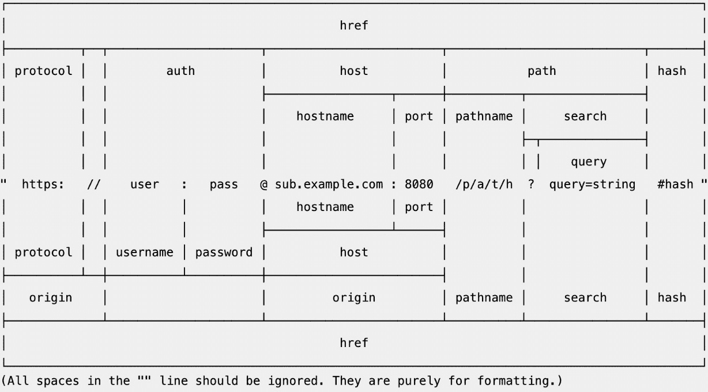

图 9.9 – 来自 Node.js 官方文档的 URL 结构。Node.js 贡献者的归属权和版权许可由 MIT 授权

在接下来的章节中，我们将大量使用 URL 部分，所以请保留这个表格。解析 URL 有许多方法，但最常见的方法是使用`URL`类：

```js
import { URL } from 'node:url';
const myUrl = new URL('https: //user:pass @sub.example. com:8080 /p/a/t/h?query=string#hash');
console.log(myUrl.hash); // #hash
console.log(myUrl.host); // sub.example.com:8080
console.log(myUrl.hostname); // sub.example.com
```

这个类在 Node.js 和浏览器中都是可用的。

重要信息

Node.js 20 引入了最有效的 URL 解析器之一，称为 Ada 2.0：[`www.yagiz.co/announcing-ada-url-parser-v2-0`](https://www.yagiz.co/announcing-ada-url-parser-v2-0)。

现在我们已经了解了 URL 的灵活性，接下来让我们在下一节中探讨如何在我们的网络服务之上构建一个标准层。这个层是许多在线服务和 SaaS 产品的基石。我们将学习创建网络应用程序接口（API）的基础知识。

# 概述 REST API

**REST**代表**表征状态转移**，是一种用于构建 API 的架构风格。它在 2000 年由 Roy Fielding 在他的博士论文中提出（[`www.ics.uci.edu/~fielding/pubs/dissertation/rest_arch_style.htm`](https://www.ics.uci.edu/~fielding/pubs/dissertation/rest_arch_style.htm)）。

实际上，这个想法是定义一组可以通过 HTTP 由客户端访问的资源，正如我们在上一节中探讨的那样。

每个资源都由一个唯一的 URL 标识，客户端可以使用 HTTP 方法对其执行操作。当需要时，服务器将返回一个状态码和一个有效载荷。

例如，假设我们有一个用于管理电影数据库的 REST API。我们可以定义以下资源：

+   `/movies`：这个资源代表电影集合

+   `/movies/:id`：这个资源代表一个单一的电影

重要提示

URL 中的`:id`部分是一个用于用户 ID 的占位符。这被称为 URL 参数，其形式为`/movies/1`或`/movies/12345`等。

客户端可以使用上述 HTTP 方法对这些资源执行以下操作：

+   `GET /movies:` 获取所有电影

+   `GET /movies/:id`：获取单个电影

+   `POST /movies`：创建一个新的电影

+   `PUT /movies/:id`：更新一个电影

+   `DELETE /movies/:id`：删除一个电影

大多数情况下，服务器将以 JSON 负载响应，但它也可以以其他格式响应，例如 XML 或 HTML。

让我们看看一个 REST API 的实际应用示例。我们将使用 simple-api ([`www.npmjs.com/package/@ulisesgascon/simple-api`](https://www.npmjs.com/package/@ulisesgascon/simple-api))，这是一个非常简单的 HTTP API，用于快速构建原型。此 API 包含 Swagger 文档，可用于探索 API。

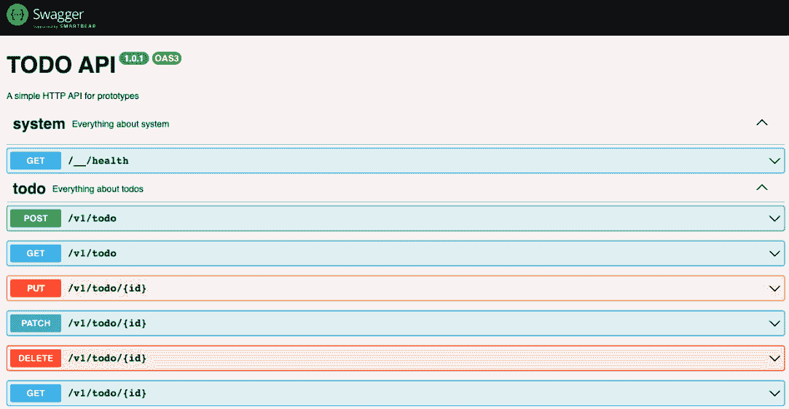

图 9.10 – 使用 Swagger 生成的 API 文档的 Web 浏览器截图

如您所见，API 非常直观且易于使用，因为它遵循 REST 原则。因此，您可以直观地了解如何使用它。当我们创建新的待办事项时，我们可以使用 Swagger 来探索 API 期望的负载的更多细节：

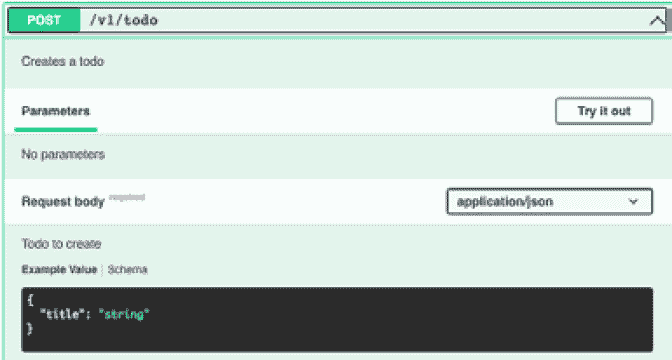

图 9.11 – 使用 Swagger 生成的 API 文档的 Web 浏览器截图

还可以探索 API 可以返回的潜在响应，对于任何可用的特定端点：

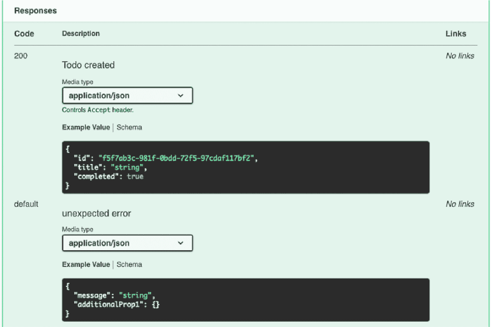

图 9.12 – 使用 Swagger 生成的 API 文档的 Web 浏览器截图

如果您理解 RESTful API 的工作原理，您将能够使用任何基于 HTTP 的 API。例如，GitHub API [`docs.github.com/en/rest`](https://docs.github.com/en/rest) 是一个使用 HTTP 公开其服务的 REST API。

有一个充满 API 的世界等待着您去使用，以构建令人惊叹的项目。这里有一份优秀的公共 API 列表：[`apilist.fun/`](https://apilist.fun/)

在前面的章节中，我们提到了 JSON，但还没有对其进行详细解释，因此在下节中我们将深入探讨它，因为它是现代 API 中最常见的交换数据格式。

# 探索 JSON 规范

**JSON**代表**JavaScript 对象表示法**，是一种轻量级的数据交换格式。它易于人类阅读和编写，也易于机器解析和生成。

我们可以使用`JSON.stringify()`方法轻松地将 JavaScript 对象转换为 JSON 字符串：

```js
const user = {
  name: 'John',
  age: 30
};
const json = JSON.stringify(user);
```

我们还可以使用`JSON.parse()`方法将 JSON 字符串转换为 JavaScript 对象：

```js
const json = '{"name":"John","age":30}';
const user = JSON.parse(json);
```

虽然 JSON 的名称中包含了 JavaScript，但它是一种与语言无关的数据格式。许多编程语言都有库来解析和生成 JSON。

JSON 是客户端和服务器之间交换数据最常用的格式，例如当我们使用或构建 REST API 时。

重要提示

JSON 规范相当简单，我强烈建议你阅读它。你可以在[`www.ecma-international.org/wp-content/uploads/ECMA-404_2nd_edition_december_2017.pdf`](https://www.ecma-international.org/wp-content/uploads/ECMA-404_2nd_edition_december_2017.pdf)找到它。

在下一节中，我们将探讨如何调试 HTTP 请求，这样我们就可以轻松构建复杂的项目。

# 调试 HTTP 请求

调试 HTTP 请求有许多方法。最常见的方法是使用开发者工具，因为这些工具在大多数网络浏览器中都很容易访问。当你开发网站时，保持这些工具开启并在标签之间导航以调试 UI 组件和网络请求也非常有帮助。

但也有其他你可以使用的工具，例如 Postman ([`www.postman.com/`](https://www.postman.com/)) 或 Insomnia ([`insomnia.rest/`](https://insomnia.rest/))，这些工具专门为此目的而设计，并提供了许多开箱即用的功能（集合、认证等）。如果你没有网站，只是直接测试 API 端点，这些工具是最佳选择。

在下一章中，我们将使用浏览器的开发者工具来调试我们的 HTTP 事务，并使用 Jest 来测试和调试我们的 HTTP 请求。

其他开发者使用更高级的工具，如 Charles ([`www.charlesproxy.com/`](https://www.charlesproxy.com/)) 或 Wireshark ([`www.wireshark.org/`](https://www.wireshark.org/))，但它们对于本书的范围来说并不是必需的。

如果你不太熟悉浏览器中的开发者工具，你可以在*第二章*中了解更多相关信息。

# 概述

在本章中，我们学习了我们将用于构建应用程序的技术，以及构成现代互联网基础的技术。

此外，我们还学习了如何使用 RFC 文档来定义互联网的标准，以及如何利用它们来了解更多关于我们使用的技术。

之后，我们学习了服务器-客户端架构的工作原理以及 HTTP 如何在客户端和服务器之间详细交换数据，包括 HTTP 方法和状态码。

最后，我们探讨了 URL 的组成部分，并学习了如何使用它们来构建 RESTful API。我们还更详细地了解了 JSON 规范以及如何调试 HTTP 请求。

在下一章中，我们将探讨如何使用数据库来存储数据以及如何与它们交互。这是我们开始构建最终网络应用之前需要解决的最后一部分难题。

# 进一步阅读

+   *维基百科* | *IP over Avian Carriers*: [`en.wikipedia.org/wiki/IP_over_Avian_Carriers`](https://en.wikipedia.org/wiki/IP_over_Avian_Carriers)

+   *维基百科* | *HTTP*: [`en.wikipedia.org/wiki/HTTP`](https://en.wikipedia.org/wiki/HTTP)

+   *互联网*的历史：[`www.youtube.com/watch?v=9hIQjrMHTv4`](https://www.youtube.com/watch?v=9hIQjrMHTv4)

+   *五分钟了解互联网是如何工作的*：[`www.youtube.com/watch?v=7_LPdttKXPc`](https://www.youtube.com/watch?v=7_LPdttKXPc)

+   HTTP 概述：[`developer.mozilla.org/en-US/docs/Web/HTTP/Overview`](https://developer.mozilla.org/en-US/docs/Web/HTTP/Overview)

+   *《项目代码狂潮 - Netscape / Mozilla 的起源》* *纪录片*：[`www.youtube.com/watch?v=4Q7FTjhvZ7Y`](https://www.youtube.com/watch?v=4Q7FTjhvZ7Y)

+   *互联网如何穿越* *海洋*：[`www.youtube.com/watch?v=yd1JhZzoS6A`](https://www.youtube.com/watch?v=yd1JhZzoS6A)

+   *海底电力电缆之所以如此* *昂贵* *的原因：[`www.youtube.com/watch?v=bkgvqC3M1Tw`](https://www.youtube.com/watch?v=bkgvqC3M1Tw)

+   *杰夫·吉尔林* | *测试互联网* *最古老的神话*：[`www.youtube.com/watch?v=4pz2kMxCu8I`](https://www.youtube.com/watch?v=4pz2kMxCu8I)
