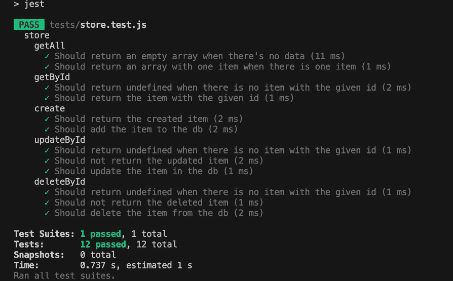
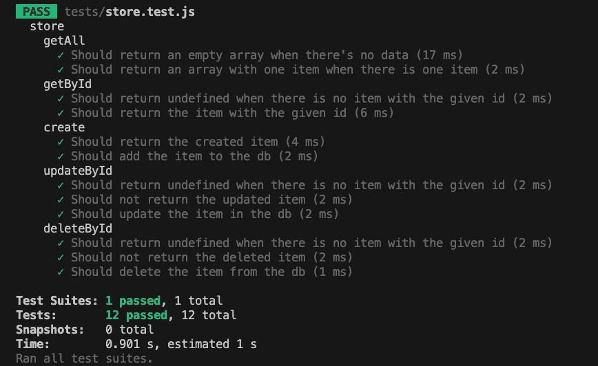
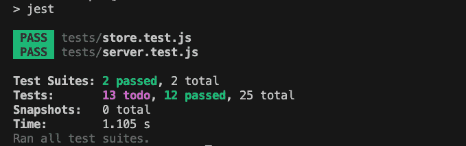
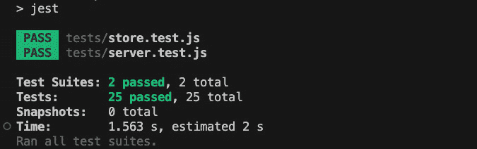
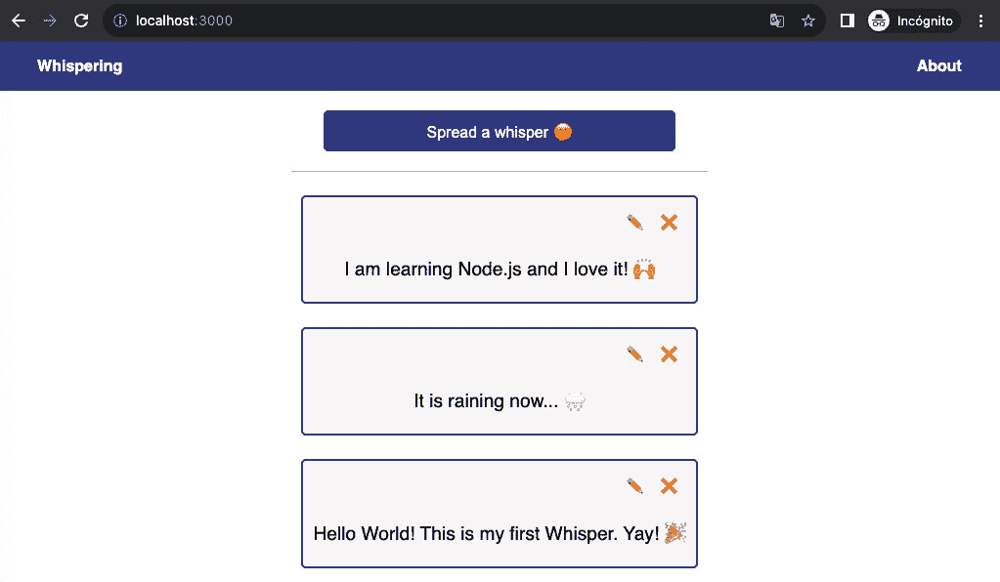
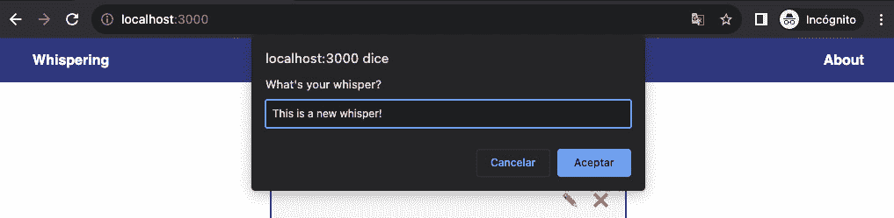
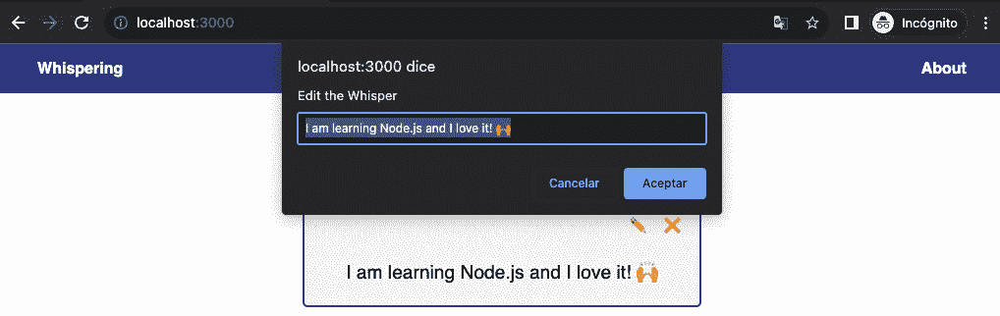
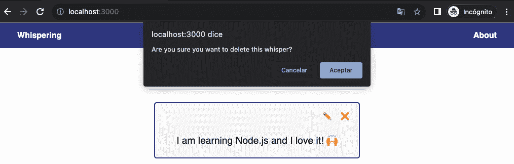

# 第十一章：从零开始构建 Web 应用程序项目

在本章中，我们将开始一个新的项目，这个项目将是下一章的基础。我们将应用前几章学到的所有课程，并将异步编程、Node.js 核心库、外部模块、测试以及我们关于 REST API 学到的所有概念付诸实践。

这个项目将会发展，因此我们将迭代项目，添加新功能和新的测试，这样你可以体验使用 Node.js 构建真实世界应用程序的完整开发周期。

在本章中，我们将使用文件系统库来存储我们在项目中产生的更改，同时管理我们从创建的 REST API 中进行的操作。在下一章中，我们将学习如何将 Web 应用程序连接到 MongoDB，但我们将使用本章构建的测试进行迁移。

在本书的结尾，我们将以几种方式部署这个项目，并将我们的应用程序暴露给互联网和真实用户。

总结一下，以下是本章我们将探讨的主要主题：

+   如何启动一个包含 UI 和 API REST 的 Express 应用程序

+   如何使用 Supertest 和 Jest 测试 Express 应用程序

+   如何在我们的项目中包含数据存储

# 技术要求

本章的代码文件可以在[`github.com/PacktPublishing/NodeJS-for-Beginners`](https://github.com/PacktPublishing/NodeJS-for-Beginners)找到

查看本章的代码演示视频，请访问[`youtu.be/JYWmvQrGu78`](https://youtu.be/JYWmvQrGu78)

# 项目启动

这真是太令人兴奋了！我们将把在前几章中学到的所有知识应用到构建一个使用 Express 的 CRUD REST API 上。我们将使用文件系统来存储数据，并且我们将使用最常用的 Express 中间件来构建一个健壮的 API。

## 项目目标

我们将构建一个名为“Whispering”的微型博客平台，用户可以创建、阅读、更新和删除短篇帖子。

### 预览

虽然我们将专注于后端，但我们将包含一个基本的客户端来测试 API。因此，我们将从一个简单的应用程序骨架开始工作，我们将在接下来的章节中逐步发展它。


图 11.1 – 在网页浏览器中预览项目主页

### 要求

需求将在下一章中演变，但到目前为止，我们将关注以下内容：

+   使用模板引擎添加欢迎页面

+   提供静态文件服务

+   使用 Express 添加 CRUD REST API

+   使用文件系统以 JSON 格式存储数据

+   添加测试以确保 API 按预期工作

## 从第一步开始

要开始工作，我们需要从 [`github.com/PacktPublishing/NodeJS-for-Beginners/archive/refs/heads/main.zip`](https://github.com/PacktPublishing/NodeJS-for-Beginners/archive/refs/heads/main.zip) 下载项目并访问 `step0` 文件夹。现在，进入文件夹，随意探索代码。你会发现我们有一个以下结构的基架：

```js
|____.babelrc
|____db.json
|____server.js
|____store.js
|____jest.config.js
|____tests
| |____server.test.js
| |____fixtures.js
| |____store.test.js
| |____utils.js
|____index.js
|____public
| |____index.html
| |____styles.css
| |____app.js
| |____people.jpg
|____package-lock.json
|____package.json
|____.nvmrc
|____views
| |____about.ejs
```

现在我们已经明确了项目目标，让我们开始构建应用程序。在下一节中，我们将通过添加依赖项、基本结构、存储和其他内容来构建一个坚固的 REST API，以便在下一章中使用。

# 构建 REST API

现在我们对 Express 有了一个基本的了解，让我们为微博平台构建一个 RESTful API。我们将从基本的 CRUD 操作开始，然后我们将添加更多功能。

在 *第九章* 中，我们学习了构建 RESTful API 的原则。我们现在将应用它们。由于平台被称为“whispering”，用户将能够创建、读取、更新和删除悄悄话，我们将有以下端点：

+   `GET /api/v1/whisper`：获取所有悄悄话

+   `GET /api/v1/whisper/:id`：通过 ID 获取一个悄悄话

+   `POST /api/v1/whisper`：创建一个新的悄悄话

+   `PUT /api/v1/whisper/:id`：通过 ID 更新一个悄悄话

+   `DELETE /api/v1/whisper/:id`：通过 ID 删除一个悄悄话

在这种情况下，我们使用了前缀 `/api/v1/`，因为我们正在构建 API 的第一个版本。在 URL 中对 API 进行版本控制是一个好的做法，因为将来你可能想要引入破坏性更改，如果你不版本控制 API，你的消费者将很难适应新的更改。

## 添加路由

作为第一步，让我们添加依赖项：

```js
npm install express@4 body-parser@1
```

首先，我们将向 `server.js` 文件中添加路由并配置 Express：

```js
import express from 'express'
import bodyParser from 'body-parser'
const app = express()
app.use(bodyParser.json())
app.get('/api/v1/whisper', (req, res) => {
    res.json([])
})
app.get('/api/v1/whisper/:id', (req, res) => {
    const id = parseInt(req.params.id)
    res.json({ id })
})
app.post('/api/v1/whisper', (req, res) => {
    res.status(201).json(req.body)
})
app.put('/api/v1/whisper/:id', (req, res) => {
  //const id = parseInt(req.params.id)
  res.sendStatus(200)
})
app.delete('/api/v1/whisper/:id', (req, res) => {
    res.sendStatus(200)
})
export { app }
```

我们为 CRUD 操作创建了基本的路由，并且我们正在返回一个包含我们接收到的请求数据的 JSON 响应。这次，我们做了一点小小的改变，我们将导出 app 对象，以便我们可以在测试中稍后使用它。现在，让我们在 `index.js` 文件中初始化服务器：

```js
import { app } from "./server.js";
const port = 3000
app.listen(port, () => {
    console.log(`Running in http://localhost:${port}`)
})
```

现在，让我们在 `package.json` 文件中添加 npm 脚本来运行应用程序：

```js
{
    "scripts": {
        "start": "node index.js"
    }
}
```

## 添加存储

由于这是一个简单的应用程序，我们将使用文件系统来存储数据。我们将创建一个 `store.js` 文件，并添加以下函数：

```js
import fs from 'node:fs/promises'
import path from 'node:path'
const filename = path.join(process.cwd(), 'db.json')
const saveChanges = data => fs.writeFile(filename, JSON.stringify(data))
const readData = async () => {
    const data = await fs.readFile(filename, 'utf-8')
    return JSON.parse(data)
}
const getAll = readData
const getById = async (id) => {
    const data = await readData()
    return data.find(item => item.id === id)
}
const create = async (message) => {
    const data = await readData()
    const newItem = { message, id: data.length +1}
    await saveChanges(data.concat([newItem]))
    return newItem
}
const updateById = async (id, message) => {
    const data = await readData()
    const newData = data.map(current => {
        if(current.id === id) {
            return { ...current, message }
        }
        return current
    })
    await saveChanges(newData)
}
const deleteById = async id => {
    const data = await readData()
    await saveChanges(data
.filter(current => current.id !== id)
    )
}
export { getAll, getById, create, updateById, deleteById }
```

基本上，我们正在使用文件系统将数据存储在一个 JSON 文件中。我们使用 `saveChanges` 来保存数据，使用 `readData` 来读取数据。

然后，我们在 `getAll`、`getById`、`create` 和 `updateById` 函数中定义了基本的 CRUD 操作。

现在，让我们为存储添加测试。作为第一步，让我们添加依赖项，`npm install -D jest@29 @babel/preset-env@7`，然后让我们将测试的骨架添加到 `tests/store.test.js` 文件中：

```js
import { getAll, getById, create, updateById, deleteById } from '../store.js'
import { writeFileSync } from 'node:fs'
import { join } from 'node:path'
const dbPath = join(process.cwd(), 'db.json')
const restoreDb = () => writeFileSync(dbPath, JSON.stringify([]))
const populateDb = (data) => writeFileSync(dbPath, JSON.stringify(data))
const fixtures = [{ id: 1, message: 'test' }, { id: 2, message: 'hello world' }]
const inventedId = 12345
const existingId = fixtures[0].id
describe('store', () => {
    beforeEach(() => populateDb(fixtures))
    afterAll(restoreDb)
    // Here we will be the tests
})
```

在*第八章*中，我们学习了测试的原则。其中一个原则是测试应该是独立的，这意味着测试不应该依赖于先前测试的状态，并且我们可以多次运行它们，结果不应该改变。

由于我们使用外部文件来存储数据，我们需要确保在每次测试之前数据处于初始状态。因此，我们使用`beforeEach`函数用固定值填充数据库，并使用`afterAll`函数将数据库恢复到初始状态。这样，我们可以确保测试始终从相同的状态开始。

此外，我们还添加了一些固定值和变量，当我们需要创建、更新或删除数据时，我们将在测试中使用它们。这将帮助我们避免硬编码值并使测试更易于阅读。

现在，让我们为`getAll`函数添加测试：

```js
describe('getAll', () => {
    it("Should return an empty array when there's no data", async () => {
        restoreDb()
        const data = await getAll()
        expect(data).toEqual([])
    })
    it('Should return an array with one item when there is one item', async () => {
        const data = await getAll()
        expect(data).toEqual(fixtures)
    })
})
```

我们只有两个测试用例——当数据库为空时和当数据库有数据时。在这两种情况下，我们都期望得到一个数组。

现在，让我们为`getById`函数添加测试：

```js
describe('getById', () => {
    it('Should return undefined when there is no item with the given id', async () => {
        const item = await getById(inventedId)
        expect(item).toBeUndefined()
    })
    it('Should return the item with the given id', async () => {
        const item = await getById(fixtures[0].id)
        expect(item).toEqual(fixtures[0])
    })
})
```

我们只有两个测试用例——当我们匹配一个项目时和当我们不匹配一个项目时。

现在，让我们为`create`函数添加测试：

```js
describe('create', () => {
    it('Should return the created item', async () => {
        const newItem = { id: fixtures.length + 1, message: 'test 3' }
        const item = await create(newItem.message)
        expect(item).toEqual(newItem)
    })
    it('Should add the item to the db', async () => {
        const newItem = { id: fixtures.length + 1, message: 'test 3' }
        const { id } = await create(newItem.message)
        const item = await getById(id)
        expect(item).toEqual(newItem)
    })
})
```

在这种情况下，我们期望当函数返回时，包括 ID 的项目被返回，并且我们期望项目被添加到数据库中。

让我们为`updateById`函数添加测试：

```js
describe('updateById', () => {
    it('Should return undefined when there is no item with the given id', async() => {
        const item = await updateById(inventedId)
        expect(item).toBeUndefined()
    })
    it('Should not return the updated item', async () => {
        const updatedItem = { id: existingId, message: 'updated' }
        const item = await updateById(updatedItem.id, updatedItem.message)
        expect(item).toBeUndefined()
    })
    it('Should update the item in the db', async () => {
        const updatedItem = { id: existingId, message: 'updated' }
        await updateById(updatedItem.id, updatedItem.message)
        const item = await getById(existingId)
        expect(item).toEqual(updatedItem)
    })
})
```

在这种情况下，我们期望只有当项目存在于数据库中时，项目才会在数据库中更新，但函数根本不会返回该项目。

让我们为`deleteById`函数添加最后的测试：

```js
describe('deleteById', () => {
    it('Should return undefined when there is no item with the given id', async () => {
        const item = await deleteById(inventedId)
        expect(item).toBeUndefined()
    })
    it('Should not return the deleted item', async () => {
        const item = await deleteById(existingId)
        expect(item).toBeUndefined()
    })
    it('Should delete the item from the db', async () => {
        await deleteById(existingId)
        const items = await getAll()
        expect(items).toEqual(fixtures.filter(item => item.id !== existingId))
    })
})
```

我们期望与`updateById`函数类似的行为。只有当项目存在于数据库中时，项目才应该从数据库中删除，并且项目不应该从函数中返回。现在，让我们将测试脚本包含到`package.json`文件中：

```js
{
    "scripts": {
        "start": "node index.js",
        "test": "jest",
        "test:coverage": "jest --coverage"
    }
}
```

使用`npm run test`运行测试。你的输出应该类似于以下内容：



图 11.2 – 终端截图

我们的第一种存储方式已经工作，并且经过了全面测试。现在，让我们通过添加代码检查器来结束。首先，使用`npm i -D standard@17`安装代码检查器，然后更新`package.json`中的脚本：

```js
{
    "scripts": {
        "start": "node index.js",
        "test": "jest",
        "test:coverage": "jest --coverage",
        "lint": "standard",
        "lint:fix": "standard --fix"
    }
}
```

现在，你可以使用`npm run lint`运行代码检查器并使用`npm run lint:fix`修复错误。有时你可能需要手动修复错误，但大多数情况下，代码检查器会为你修复它们。

## 添加静态文件

现在，让我们将静态文件添加到应用程序中。基本上，在`public`文件夹中，我们有几个想要提供给客户端的文件，例如`index.html`、`style.css`和`app.js`文件。因此，让我们将以下代码添加到`server.js`文件中：

```js
const app = express()
app.use(express.static('public'))
app.use(bodyParser.json())
```

现在，如果我们使用`npm run start`启动服务器，然后你访问`http://localhost:3000/styles.css`，你将看到`styles.css`文件的内容。

注意

在我们完成本章之前，URL `http://localhost:3000`可能无法按预期工作，因为后端尚未完成。

## 添加模板

在这个项目中，我们将使用服务器渲染方法来处理应用程序的某些部分。因此，我们将安装`ejs`模板引擎：

```js
npm i ejs@3
```

让我们在`server.js`文件中导入存储函数：

```js
import express from 'express'
import bodyParser from 'body-parser'
import { getAll, getById, create, updateById, deleteById } from './store.js'
const app = express()
```

然后，在`server.js`文件中注册模板引擎：

```js
app.use(bodyParser.json())
app.set('view engine', 'ejs')
app.get('/api/v1/whisper', async (req, res) => {
    const whispers = await getAll()
    res.json(whispers)
})
```

最后，我们将创建一个路由，`about`，它将渲染`views/about.ejs`模板，并将 whispers 提供给模板：

```js
app.set('view engine', 'ejs')
app.get('/about', async (req, res) => {
    const whispers = await getAll()
    res.render('about', { whispers })
})
app.get('/api/v1/whisper', async (req, res) => {/*...*/})
```

现在，让我们使用`npm run start`启动服务器，并访问`http://localhost:3000/about`，你将看到渲染的模板。

信息

如果你在按照本章步骤运行项目时遇到问题，或者你尝试了另一种方法，你可以使用本章开头下载的源代码中的`step1`文件夹来比较和更容易地修复可能的错误。

在下一节中，我们将通过添加测试来继续构建 REST API。向 REST API 添加测试非常重要，因为它将确保 API 按预期工作，并允许我们在下一章中更容易地迭代它。

# 使用 supertest 进行测试

现在是确保我们的 REST API 按预期工作的时候了。在本节中，我们将学习如何在使用 Express 时构建坚实的测试。

## 将存储添加到服务器

我们将重构每个路由以使用存储函数。让我们从`GET /api/v1/whisper`路由开始：

```js
app.get('/api/v1/whisper', async (req, res) => {
    const whispers = await getAll()
    res.json(whispers)
})
```

基本上，我们使用`getAll`函数获取所有 whispers，并在响应中返回它们。现在，让我们重构`GET /api/v1/whisper/:id`路由：

```js
app.get('/api/v1/whisper/:id', async (req, res) => {
    const id = parseInt(req.params.id)
    const whisper = await getById(id)
    if (!whisper) {
        res.sendStatus(404)
    } else {
        res.json(whisper)
    }
})
```

在这种情况下，如果 whisper 不存在，我们将返回 404 状态码，如果存在，我们将返回 whisper。现在，让我们重构`POST /api/v1/whisper`路由：

```js
app.post("/api/v1/whisper", async (req, res) => {
  const { message } = req.body;
  if (!message) {
    res.sendStatus(400);
  } else {
    const whisper = await create(message);
    res.status(201).json(whisper);
  }
});
```

在这种情况下，我们验证请求体中的消息不为空，在这些情况下返回 400 状态码。如果创建成功，我们返回 whisper 详细信息。现在，让我们重构`PUT /api/v1/whisper/:id`路由：

```js
app.put('/api/v1/whisper/:id', async (req, res) => {
    const { message } = req.body
    const id = parseInt(req.params.id)
    if(!message) {
        res.sendStatus(400)
    } else {
        const whisper = await getById(id);
        if (!whisper) {
            res.sendStatus(404);
        } else {
            await updateById(id, message);
            res.sendStatus(200);
        }
    }
POST /api/v1/whisper and we validate that the whisper exists before updating it. Now, let’s refactor the DELETE /api/v1/whisper/:id route:

```

app.delete('/api/v1/whisper/:id', async (req, res) => {

const id = parseInt(req.params.id)

const whisper = await getById(id)

if(!whisper) {

res.sendStatus(404)

return

}

await deleteById(id)

res.sendStatus(200)

})

```js

			In this case, we validate that the whisper exists before deleting it. Now, let’s add the tests for the routes.
			Creating test utils
			Before we start adding the tests, there is some code that we can reuse between the test files, such as the fixtures and the functions to populate and restore the database. So, let’s do a little refactoring first.
			As the first step, let’s create a file called `fixtures.js` in the `tests` folder, and let’s add the following content:

```

const whispers = [{ id: 1, message: 'test' }, { id: 2, message: 'hello world' }]

const inventedId = 12345

const existingId = whispers[0].id

导出 {

whispers,

inventedId,

existingId

}

```js

			Then, create a file called `utils.js` in the `tests` folder, and let’s add the following content:

```

从 'node:fs' 导入 { writeFileSync }

从 'node:path' 导入 { join }

const dbPath = join(process.cwd(), 'db.json')

const restoreDb = () => writeFileSync(dbPath, JSON.stringify([]))

const populateDb = (data) => writeFileSync(dbPath, JSON.stringify(data))

导出 { restoreDb, populateDb }

```js

			Now, let’s refactor the `store.test.js` file to use the new files:

```

从 '../store.js' 导入 { getAll, getById, create, updateById, deleteById }

从 './utils.js' 导入 { restoreDb, populateDb }

import { whispers, inventedId, existingId } from './fixtures.js'

describe('store', () => {

//...

})

```js

			Also, find and replace the `fixtures` variable with `whispers` in the tests.
			Now you can run the tests with `npm run test` and you will see that the tests are passing:
			

			Figure 11.3 – Terminal screenshot
			Adding server tests
			Now, let’s add the tests for the routes. In this case, we will use supertest ([`www.npmjs.com/package/supertest`](https://www.npmjs.com/package/supertest)) to test the routes. As the first step, let’s install the new dependency:

```

npm i -D supertest@6

```js

			Defining the tests
			You can use `it.todo` to mark the tests that you need to add. This way, you can focus on the description of the tests and not on the implementation details. So, let’s create the `tests/server.test.js` file with the following content:

```

import supertest from 'supertest'

import { app } from '../server'

import { restoreDb, populateDb } from './utils.js'

import { whispers, inventedId, existingId } from './fixtures.js'

import { getById } from '../store'

describe('Server', () => {

beforeEach(() => populateDb(whispers))

afterAll(restoreDb)

describe("GET /api/v1/whisper", () => {

it.todo("当没有数据时，应返回空数组")

it.todo("应返回所有 whisper")

})

describe("GET /api/v1/whisper/:id", () => {

it.todo("当 whisper 不存在时，应返回 404")

it.todo("应返回 whisper 详情")

})

describe("POST /api/v1/whisper", () => {

it.todo("当 body 为空时，应返回 400")

it.todo("当 body 无效时，应返回 400")

it.todo("当 whisper 被创建时，应返回 201")

})

describe("PUT /api/v1/whisper/:id", () => {

it.todo("当 body 为空时，应返回 400")

it.todo("当 body 无效时，应返回 400")

it.todo("当 whisper 不存在时，应返回 404")

it.todo("当 whisper 被更新时，应返回 200")

})

describe("DELETE /api/v1/whisper/:id", () => {

it.todo("当 whisper 不存在时，应返回 404")

it.todo("当 whisper 被删除时，应返回 200")

})

})

```js

			Run the tests with the `npm run` `test` command:
			

			Figure 11.4 – Terminal screenshot
			You will see that the previous tests pass, and the new tests are marked as *todo*. This is a good practice to keep track of the tests that you need to add, and it does not break the test suite.
			Adding the tests with supertest
			Basically, we will use supertest to make requests to the server and we will validate the response. Let’s start with the `GET /api/v1/whisper` route. Let’s replace the `it.todo` tests with the following code:

```

describe("GET /api/v1/whisper", () => {

it("当没有数据时，应返回空数组", async () => {

await restoreDb() // 清空数据库

const response = await supertest(app).get("/api/v1/whisper")

expect(response.status).toBe(200)

expect(response.body).toEqual([])

})

it("应返回所有 whisper", async () => {

const response = await supertest(app).get("/api/v1/whisper")

expect(response.status).toBe(200)

expect(response.body).toEqual(whispers)

})

})

```js

			In each request, we check that the status code and the response payload are correct. Now, let’s add the tests for the `GET /``api/v1/whisper/:id` route:

```

describe("GET /api/v1/whisper/:id", () => {

it("当 whisper 不存在时，应返回 404", async () => {

const response = await supertest(app).get(`/api/v1/whisper/${inventedId}`)

expect(response.status).toBe(404)

})

it("应返回 whisper 详情", async () => {

const response = await supertest(app).get(`/api/v1/whisper/${existingId}`)

expect(response.status).toBe(200)

expect(response.body).toEqual(whispers.find(w => w.id === existingId))

})

})

```js

			As you can see, the tests are very similar to the ones we did for `storage.test.js`. Now, let’s add the tests for the `POST /``api/v1/whisper` route.
			We will start by adding the parent description for the route:

```

describe("POST /api/v1/whisper", () => {

// it("....")

})

```js

			All the tests will be added inside the `describe` function. So, let’s define all the scenarios that we want to cover in the tests:
			We want to be sure that we return a 400 status code when the request does not include a body:

```

it("当 body 为空时，应返回 400",

async () => {

const response = await supertest(app)

.post("/api/v1/whisper")

.send({})

expect(response.status).toBe(400)

})

```js

			We want to be sure that we return a 400 status code when the request does not include a proper body, for example, when some required properties are missing:

```

it("当 body 无效时，应返回 400",

async () => {

const response = await supertest(app)

.post("/api/v1/whisper")

.send({invented: "This is a new whisper"})

expect(response.status).toBe(400)

})

```js

			We want to be sure that we return a 201 status and the details of the new whisper when the payload in the request is correct. Also, we want to check that the whisper was properly stored in the database:

```

it("当 whisper 被创建时，应返回 201",

async () => {

const newWhisper = {

id: whispers.length + 1,

message: "This is a new whisper"

}

const response = await supertest(app)

.post("/api/v1/whisper")

.send({message: newWhisper.message})

// HTTP 响应

expect(response.status).toBe(201)

expect(response.body).toEqual(newWhisper)

// 数据库变更

const storedWhisper = await getById(newWhisper.id)

expect(storedWhisper).toStrictEqual(newWhisper)

})

```js

			As you can see, when we created a new whisper we also validated that the whisper was added to the database. This is because these tests are integration tests and we want to make sure that the changes are recorded in the *database* as well.
			Now, let’s add the tests for the `PUT /api/v1/whisper/:id` route. We will start by adding the parent description for the route:

```

describe("PUT /api/v1/whisper/:id", () => {

// it("....")

})

```js

			All the tests will be added inside the `describe` function. So, let’s define all the scenarios that we want to cover in the tests:
			We want to be sure that we return a 400 status code when the request does not include a body:

```

it("当 body 为空时，应返回 400",

async () => {

const response = await supertest(app)

.put(`/api/v1/whisper/${existingId}`)

.send({})

expect(response.status).toBe(400)

})

```js

			We want to be sure that we return a 400 status code when the request does not include a proper body, for example, when some required properties are missing:

```

it("当 body 无效时，应返回 400",

async () => {

const response = await supertest(app)

.put(`/api/v1/whisper/${existingId}`)

.send({invented: "这是一个新字段"})

expect(response.status).toBe(400)

})

```js

			We want to be sure that we return a 404 status code when the request is targeting a non-existent whisper:

```

it("当 whisper 不存在时，应返回 404",

async () => {

const response = await supertest(app)

.put(`/api/v1/whisper/${inventedId}`)

.send({message: "Whisper updated"})

expect(response.status).toBe(404)

})

```js

			We want to be sure that we return a 200 status when the payload and the target are correct. Also, we want to check that the whisper was properly updated in the database:

```

it("当 whisper 更新时，应返回 200",

async () => {

const response = await supertest(app)

.put(`/api/v1/whisper/${existingId}`)

.send({message: "Whisper updated"})

expect(response.status).toBe(200)

// 数据库变更

const storedWhisper = await getById(existingId)

expect(storedWhisper).toStrictEqual({id: existingId, message: "Whisper updated"})

})

```js

			Finally, let’s add the tests for the `DELETE /api/v1/whisper/:id` route. We will start by adding the parent description for the route:

```

describe(" DELETE /api/v1/whisper/:id", () => {

// it("....")

})

```js

			All the tests will be added inside the `describe` function. So, let’s define all the scenarios that we want to cover in the tests:
			We want to be sure that we return a 404 status code when the request is targeting a non-existent whisper:

```

it("当 whisper 不存在时，应返回 404",

const response = await supertest(app)

.delete(`/api/v1/whisper/${inventedId}`)

expect(response.status).toBe(404)

})

```js

			We want to be sure that we return a 200 status code when the request is targeting a valid whisper. Also, we want to check that the whisper was properly removed from the database:

```

it("当 whisper 被删除时，应返回 200",

const response = await supertest(app)

.delete(`/api/v1/whisper/${existingId}`)

expect(response.status).toBe(200)

// 数据库变更

const storedWhisper = await getById(existingId)

expect(storedWhisper).toBeUndefined()

})

```js

			Now, you can run the tests with `npm run test` and you will see that the tests are passing:
			

			Figure 11.5 – Terminal screenshot
			Information
			If you are having issues running the project in this chapter while following the steps, or you tried an alternative approach, you can use the `step2` folder from the source code that you downloaded at the beginning of the chapter to compare and fix possible bugs more easily.
			In the next section, we will review the final result and we will see how to use the application and what we are planning to do in the next chapters.
			Reviewing the final result of the project
			At this point, you should have a fully functional REST API with Express and if your tests are passing, you can start using the application.
			The about page
			If you go to `http://localhost:3000/about`, you will see the about page:
			

			Figure 11.6 – Web browser screenshot
			This page was served using the server render approach, and we are using the EJS template engine to render the page. We are using the whispers data from the database to render the page. The text *Currently there are 3 whispers available* is dynamic text that will change depending on the number of whispers in the database.
			You can see the reference in the `views/about.ejs` file:

```

<p>当前有 <%= whispers.length %> 个 whispers 可用</p>

```js

			Web interface
			The web interface is a simple page where you can create, update, and delete whispers. You can access the web interface at `http://localhost:3000`. It will start with an empty list of whispers. In my case, I have three whispers in the database, so I will see the following page:
			

			Figure 11.7 – Web browser screenshot
			In order to make the frontend source code more readable, I used plain JavaScript to make the requests to the API and old browser APIs such as `prompts` and `confirms` to interact with the user. You can see the source code in the `public/app.js` file. For a production application, you should avoid these browser APIs as they are quite limited and implement a solution that works on all devices using UI elements that are properly integrated. Also, you will need to handle errors and loading states. For larger projects, it is quite common to use UI libraries such as tailwind ([`tailwindcss.com/`](https://tailwindcss.com/)) or frameworks such as Vue ([`vuejs.org/`](https://vuejs.org/)).
			Adding whispers
			It is possible to add whispers to the list. Just click on the **Spread a whisper** button and you will see a prompt asking for the message of the whisper:
			

			Figure 11.8 – Web browser screenshot
			Editing whispers
			It is possible to edit whispers. Just click on the pencil button and you will see a prompt asking for the new message of the whisper:
			

			Figure 11.9 – Web browser screenshot
			Deleting whispers
			It is possible to delete whispers. Just click on the trash button and you will see a confirm dialog asking for the confirmation:
			

			Figure 11.10 – Web browser screenshot
			Your challenge
			If you are familiar with frontend development, you can try to improve the web interface and make it more user-friendly or directly replace it with a modern frontend framework such as React, Vue, or Angular. If you are not familiar with front-end development, you can skip this challenge and continue with the next chapter.
			Let’s celebrate it!
			Feel free to explore the code and play with it, you can start the application with `npm run start` and you can go to `http://localhost:3000` and create a few whispers that you can later edit or remove from the web interface.
			Next steps
			Congratulations! You have created a solid REST API, but there are a lot of things that you can do to improve it. In the next chapter, we will see how to properly store the information in the database.
			In *Chapter 13*, we will see how to add authentication to the API, so only authenticated users can create, update, or delete whispers and multiple users will be able to use our application.
			Summary
			In this chapter, we learned how to use supertest to test our API in depth. We learned how to test the routes and how to test the stores. We created a solid API that we will evolve in the next chapters.
			In the next chapter, we will see how to properly store the information in the database, using MongoDB. We will take the opportunity to refactor our project and use a better software pattern to organize the code and a MongoDB database to store the data.

```
