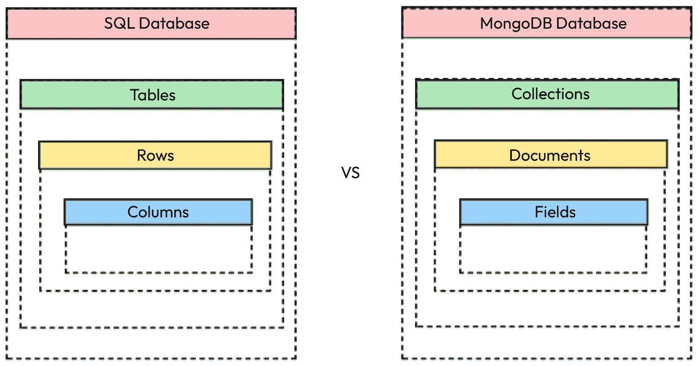

# 第十二章：使用 MongoDB 实现数据持久化

在本章中，我们将解释 MongoDB 的工作原理以及为什么它是 Web 应用程序的绝佳起点。我们将学习如何使用带有 Docker 和 Docker Compose 的容器在本地安装 MongoDB，以及如何使用外部 MongoDB 实例。

我们将探讨如何使用 Mongoose 与 MongoDB 交互，并将我们的应用程序迁移到使用 MongoDB 而不是 JSON 文件，我们将使用测试来确保迁移正确完成，并且没有引入任何回归。

总结来说，以下是本章我们将探讨的主要主题：

+   如何使用 Docker 和 Docker Compose 在本地设置 MongoDB

+   如何使用 **对象关系映射**（**ORM**）库如 Mongoose 与 MongoDB 交互

+   如何将我们的应用程序迁移到使用 MongoDB 而不是 JSON 文件

+   如何使用 MongoDB 测试任何应用程序

+   如何使用环境变量存储敏感信息以及如何在 Node.js 中加载它们

到本章结束时，你将能够舒适地在 Node.js 项目中使用 MongoDB，并且将了解如何使用测试来规划更复杂的功能，例如数据库迁移。

# 技术要求

本章的代码文件可以在 [`github.com/PacktPublishing/NodeJS-for-Beginners`](https://github.com/PacktPublishing/NodeJS-for-Beginners) 找到。

查看本章动作视频中的代码 [`youtu.be/0CHOQ35c-_Y`](https://youtu.be/0CHOQ35c-_Y)

要开始本章的工作，我们需要从 [`github.com/PacktPublishing/NodeJS-for-Beginners/archive/refs/heads/main.zip`](https://github.com/PacktPublishing/NodeJS-for-Beginners/archive/refs/heads/main.zip) 下载项目并访问 `step2` 文件夹。

# 什么是 MongoDB？

如果你熟悉关系型数据库，你会发现 MongoDB 非常不同。MongoDB 是一个面向文档的数据库，这意味着它以文档的形式存储数据而不是表格。文档是一组键值对，它是 MongoDB 中的基本数据单元。文档类似于 JSON 对象，并且存储在集合中。集合是一组具有相同结构的文档。在 MongoDB 中，文档以 **二进制 JSON**（**BSON**）的形式存储，这是 JSON 文档的二进制表示。



图 12.1 – 将 SQL 数据结构与 MongoDB 数据结构进行比较

在前面的图中，我们可以更清楚地看到关系型数据库和面向文档的数据库之间的区别。

## 版本

MongoDB 有几个版本，但最受欢迎的是 MongoDB 社区服务器。在我们的项目中，我们也将使用 MongoDB 社区服务器，这对我们来说没有额外的成本。

在 *第十六章* 中，当我们将应用程序部署到云端时，我们将探索更多 MongoDB 的版本。

如果您想了解更多关于 MongoDB 不同版本的信息，您可以查看以下链接：[`www.mongodb.com/try/download/community`](https://www.mongodb.com/try/download/community)。

在下一节中，我们将解释如何使用 Docker 和 Docker Compose 在容器中本地安装 MongoDB，以及如何使用外部 MongoDB 实例。

# 设置 MongoDB

安装 MongoDB 有几种方法，但我们将使用 Docker Compose 在本地安装它。Docker Compose 是一个用于定义和运行多容器 Docker 应用程序的工具。使用 Docker Compose，我们将能够在不同的容器中运行 MongoDB 和我们的 Web 应用程序。如果您不熟悉 Docker，MongoDB 提供了一个出色的指南 ([`www.mongodb.com/compatibility/docker`](https://www.mongodb.com/compatibility/docker))，可以帮助您更深入地了解。

## 安装 Docker

如果您尚未安装 Docker，您可以按照您操作系统的说明在以下链接中操作：[`docs.docker.com/get-docker/`](https://docs.docker.com/get-docker/)。

### 检查安装

让我们检查 Docker 是否已正确安装。打开终端并运行以下命令：

```js
docker --version
```

您应该看到已安装的版本 - 在我的情况下，是 24.0.2：

```js
Docker version 24.0.2, build cb74dfc
```

我们还可以检查 Docker Compose 是否已正确安装。打开终端并运行以下命令：

```js
docker-compose --version
```

您应该看到类似以下内容：

```js
Docker Compose version v2.19.1
```

## 使用容器运行 MongoDB

Docker 的美妙之处在于我们可以在容器中运行 MongoDB。容器是一个标准的软件单元，它将代码及其所有依赖项打包在一起。这样，我们就可以创建一个 MongoDB 容器，并在我们的本地机器上运行它，我们不需要在本地安装 MongoDB。当我们不再需要容器时，我们可以停止它并删除它。

在我们的情况下，我们将使用 Mongo 7.0.0，这是 MongoDB 的最新版本。我们将使用 MongoDB 的官方镜像，该镜像可在 Docker Hub 上找到。您可以在以下链接中找到有关此镜像的更多信息：[`hub.docker.com/_/mongo`](https://hub.docker.com/_/mongo)。

要在容器中运行 MongoDB，我们将使用以下命令：

```js
docker run --name whispering-database -p 27017:27017 -d mongo:7.0.0
```

此命令将创建一个名为 `whispering-database` 的容器，并将容器中的端口 `27017` 映射到主机机的端口 `27017`。`-d` 标志表示容器将在后台运行。

输出应该类似于以下内容：

```js
Unable to find image 'mongo:7.0.0' locally
7.0.0: Pulling from library/mongo
99de9192b4af: Pull complete
18b9e63943e7: Pull complete
ccf1fde52048: Pull complete
8317989437cb: Pull complete
1bde6bf8acc1: Pull complete
11fb005be9eb: Pull complete
81a254c162fc: Pull complete
2a574922bf90: Pull complete
22659e13b0a2: Pull complete
Digest: sha256:a89d79ddc5187f57b1270f87ec581b7cc6fd697efa12b8 f1af72f3c4888d72b5
Status: Downloaded newer image for mongo:7.0.0
27ead2313a72c0cb0d2d1bf18ef2a37062a63851ebc9355359dbc1a4741ac168
```

如输出所示，本地未找到镜像，因此它从 Docker Hub 下载。如果端口 2701 已被占用，您可能会遇到错误，因为容器无法接管。您可以通过以下步骤轻松检查：[`kb.vmware.com/s/article/1003971`](https://kb.vmware.com/s/article/1003971)。如果一切顺利，容器将在后台运行，因此我们可以使用以下命令检查它是否正在运行：

```js
docker ps
```

输出应该类似于以下内容：

```js
CONTAINER ID   IMAGE         COMMAND                  CREATED         STATUS         PORTS                      NAMES
7d28f8c555b9   mongo:7.0.0   "docker-entrypoint.s…"   7 seconds ago   Up 6 seconds   0.0.0.0:27017->27017/tcp   whispering-database
```

您可以使用以下命令停止容器：

```js
docker stop whispering-database
```

您可以使用以下命令删除容器：

```js
docker rm whispering-database
```

如果您删除了容器，您可以使用以下命令再次创建一个新的容器：

```js
docker run --name whispering-database -p 27017:27017 -d mongo:7.0.0
```

## 使用 Docker Compose 运行 MongoDB

使用容器运行 MongoDB 的另一种选择是使用 Docker Compose。Docker Compose 是一个工具，用于使用 YAML 文件定义和运行多容器 Docker 应用程序。使用 Docker Compose 的一个优点是，我们可以在 YAML 文件中定义容器的配置，这样我们就不必记住运行容器的命令。

让我们为我们的项目创建一个包含以下内容的 `docker-compose.yml` 文件：

```js
version: '3.8'
services:
  database:
    container_name: whispering-database
    image: mongo:7.0
    ports:
      - '27017:27017'
    volumes:
      - db-storage:/data/db
volumes:
  db-storage:
```

在此文件中，我们定义了一个名为 `database` 的服务，它使用 `mongo:7.0` 镜像。我们还映射了容器的端口 `27017` 到主机的端口 `27017`。最后，我们定义了一个名为 `db-storage` 的卷，它将用于存储数据库的数据，这样我们在停止容器时就不会丢失它。

为了在后台运行容器，我们必须运行以下命令：

```js
docker-compose up -d
```

输出应该类似于以下内容：

```js
[+] Running 1/1
✓ database Pulled                         1.8s
[+] Running 3/3
✓ Network app_default       Created     0.1s
✓ Volume "app_db-storage"   Created     0.0s
✓ Container app-database-1  Started     0.5s
```

您的容器现在已准备好使用，但您可以通过在相同文件夹中运行以下命令来停止它们：

```js
docker-compose down
```

在下一节中，我们将学习如何将 Docker 相关的命令作为 npm 脚本添加到 `package.json` 中。

## 将 Docker 命令添加到 package.json

有时，记住 docker compose 命令可能会有点困难，因此我们可以将它们添加到 `package.json` 文件中。添加以下脚本：

```js
"scripts": {
    "start": "node index.js",
    "test": "jest",
    "test:coverage": "jest --coverage",
    "lint": "standard",
    "lint:fix": "standard --fix",
    "infra:start": "docker-compose up -d --build",
    "infra:stop": "docker-compose down --remove-orphans"
}
```

然后，我们可以使用 `npm run infra:start` 和 `npm run infra:stop` 在本地机器上管理项目数据库。

## 连接到 MongoDB

连接到 MongoDB 有两种方式——使用 `mongo` shell 或端口 `27017`。在本节中，我们将解释如何使用这两种方式连接到 MongoDB。

我们可以使用以下命令通过 `mongo` shell 连接到 MongoDB，如果我们使用 Docker 的话：

```js
npm run infra:start
docker exec -it whispering-database /bin/bash
```

现在，您可以看到我们已经在容器内部，作为替代，您可以直接使用 docker compose 命令来访问容器 `docker-compose exec database /bin/bash`。现在，我们可以使用以下命令连接到 MongoDB：

```js
mongod
```

您应该看到类似以下的内容：

```js
root@7d515e1c8f85:/# mongod
{"t":{"$date":"2023-08-19T13:45:08.554+00:00"},"s":"I",  "c":"CONTROL",  "id":23285,   "ctx":"main","msg":"Automatically disabling TLS 1.0, to force-enable TLS 1.0 specify --sslDisabledProtocols 'none'"}
{"t":{"$date":"2023-08-19T13:45:08.556+00:00"},"s":"I",  "c":"NETWORK",  "id":4915701, "ctx":"main","msg":"Initialized wire specification","attr":{"spec":{"incomingExternalClient":{"minWire Version":0,"maxWireVersion":21},"incomingInternalClient":{"minWire Version":0,"maxWireVersion":21},"outgoing":{"minWireVersion":6,"maxWire Version":21},"isInternalClient":true}}}
```

这样，如果需要，我们可以直接访问 `mongo` shell。在接下来的章节中，我们将解释如何通过端口 `27017` 连接到 MongoDB。

## 安装 MongoDB 的其他方法

如果您不想使用 Docker Compose，您可以在本地安装 MongoDB。您可以在以下链接找到您操作系统的说明：[`docs.mongodb.com/manual/administration/install-community/`](https://docs.mongodb.com/manual/administration/install-community/)。

请记住，您还可以使用 MongoDB Atlas ([`www.mongodb.com/atlas`](https://www.mongodb.com/atlas)) 或任何提供 MongoDB 服务的其他云提供商。

现在我们已经启动了 MongoDB，我们可以开始使用它，但首先，我们需要了解如何在 Node.js 中使用秘密，以便我们可以以安全模式将连接字符串传递给应用程序。因此，在下一节中，我们将解释如何在 Node.js 中加载秘密。

# 如何在 Node.js 中加载秘密

我们的应用程序需要连接到 MongoDB，因此我们需要将连接字符串存储在安全的地方。你不应该在代码中存储秘密；一个非常常见的做法是将它们存储在环境变量中。在本节中，我们将解释如何在 Node.js 中从环境变量中加载秘密。

## 环境变量

环境变量是在进程运行的环境中设置的变量。它们通常在操作系统中设置，但我们也可以在终端中设置它们。我们可以在 Node.js 中使用`process.env`对象访问环境变量：

```js
console.log(process.env.MY_SECRET)
```

你可以使用以下命令在终端中设置环境变量：

```js
export MY_SECRET=secret
```

然后，你可以使用以下命令运行你的应用程序：

```js
node index.js
```

或者，你可以在同一命令中设置环境变量：

```js
MY_SECRET=secret node index.js
```

重要提示

如果你使用的是 Windows，你可能需要使用不同的方法在终端中处理环境变量。阅读([`www3.ntu.edu.sg/home/ehchua/programming/howto/Environment_Variables.html`](https://www3.ntu.edu.sg/home/ehchua/programming/howto/Environment_Variables.html))获取更多信息。

在下一节中，我们将学习如何使用`.env`文件以更便捷的方式管理秘密。

## `.env`文件

虽然在终端中直接使用环境变量是一个非常常见的做法，但它并不方便。我们可以使用一个名为`.env`的文件来存储我们的环境变量。我们可以创建一个包含以下内容的`.env`文件：

```js
MY_SECRET=secret
```

然后，我们可以使用`dotenv`包([`www.npmjs.com/package/dotenv`](https://www.npmjs.com/package/dotenv))从`.env`文件中加载环境变量，但值得一提的是，Node.js 20.6.0 版本引入了对从`.env`文件加载环境变量的支持，因此我们不再需要使用第三方包了([`github.com/nodejs/node/releases/tag/v20.6.0`](https://github.com/nodejs/node/releases/tag/v20.6.0))。

警告

我们永远不应该将`.env`文件提交到仓库，因为它包含秘密。你可以将`.env`文件添加到`.gitignore`文件中，以避免将.env 文件与项目源代码一起提交。

## dotenv

从`.env`文件加载环境变量的最常见方法是使用`dotenv`包([`www.npmjs.com/package/dotenv`](https://www.npmjs.com/package/dotenv))。我们可以使用以下命令安装它：

```js
npm install dotenv@16
```

然后，我们可以使用以下代码从`.env`文件中加载环境变量：

```js
import 'dotenv/config'
```

或者，我们可以直接使用`--require`标志来执行：

```js
node --require dotenv/config index.js
```

在下一节中，我们将解释如何使用 **对象关系映射**（**ORM**）与 MongoDB 交互，以及这如何使我们在第一次构建 Web 应用程序时生活更加轻松。

# 使用 ORM – Mongoose

我们可以直接使用 MongoDB，但这将需要更深入的理解和更多的代码来与数据库交互。由于本书的目的是学习 Node.js，我们将使用 ORM 来与 MongoDB 交互。ORM 是一个库，它允许我们使用对象而不是 SQL 查询来与数据库交互。在本节中，我们将使用 Mongoose ([`mongoosejs.com/`](https://mongoosejs.com/))。或者，您也可以使用 MongoDB Node.js 驱动程序，这是 Node.js 的官方 MongoDB 驱动程序 ([`docs.mongodb.com/drivers/node/`](https://docs.mongodb.com/drivers/node/))。官方文档可以在 [`mongoosejs.com/docs/guide.html`](https://mongoosejs.com/docs/guide.html) 找到。

Mongoose 提供了几个对 Web 应用程序来说非常方便的功能：

+   **模式验证**：我们可以定义文档的模式，Mongoose 会在将其保存到数据库之前验证数据

+   **模型**：我们可以为每个集合定义一个模型，并使用它来与数据库交互

+   **中间件**：我们可以定义在特定事件之前或之后执行的中介函数 – 例如，我们可以定义一个在将文档保存到数据库之前执行的中介函数

+   **插件**：我们可以使用插件来扩展 Mongoose 的功能

此外，如果你是 Node.js 或 MongoDB 的初学者，你会发现 Mongoose 比直接使用 MongoDB 更容易使用，而且有很多教程和资源可以帮助你快速熟悉它。

信息

Mongo 拥有一个庞大的生态系统，一开始可能会有些令人感到不知所措，但你可以在 [`github.com/ramnes/awesome-mongodb`](https://github.com/ramnes/awesome-mongodb) 找到精心挑选的 MongoDB 资源列表。

现在我们已经运行了 MongoDB 并熟悉了环境变量，我们可以在项目中开始使用 Mongoose。在下一节中，我们将解释如何从本地文件存储迁移到 MongoDB。

# 将 Web 应用程序迁移到 MongoDB

我们已经使用 Docker Compose 和 npm 命令将 MongoDB 添加到我们的项目中，但我们还没有开始使用它。在本节中，我们将迁移一个 Web 应用程序到 MongoDB。

## 安装依赖项

我们将安装以下依赖项：

```js
npm install mongoose@7.4 dotenv@16
```

## 管理秘密

我们将创建一个包含以下内容的 `.env` 文件：

```js
MONGODB_URI=mongodb://localhost:27017/whispering-database
PORT=3000
```

然后，我们将使用以下代码将环境变量从 `.env` 文件加载到 `index.js` 中：

```js
import { app } from './server.js'
import mongoose from 'mongoose'
const port = process.env.PORT
try {
  await mongoose.connect(process.env.MONGODB_URI);
  console.log('Connected to MongoDB')
  app.listen(port, () => {
    console.log(`Running in http://localhost:${port}`)
  })
} catch (error) {
  console.error(error)
}
```

我们已经包含了 `mongoose` 包，并使用 `MONGODB_URI` 环境变量连接到 MongoDB。我们还包含了 `PORT` 环境变量，以便在不同的端口上运行应用程序。

注意

如您所见，在打开 HTTP 服务器连接之前，数据库必须正在运行。这是因为我们需要连接到数据库以检索对 HTTP 请求的响应所需的信息。

现在，我们需要更新 npm 脚本来使用 `dotenv`：

```js
"scripts": {
    "start": "node --require dotenv/config index.js",
    "test": "jest --setupFiles dotenv/config",
    "test:coverage": "jest --coverage --setupFiles dotenv/config",
    "lint": "standard",
    "lint:fix": "standard --fix",
    "infra:start": "docker-compose up -d --build",
    "infra:stop": "docker-compose down"
}
```

现在，我们可以使用以下命令运行应用程序：

```js
npm run infra:start
npm run start
```

我们应该看到以下输出：

```js
Connected to MongoDB
Running in http://localhost:3000
```

如果数据库没有运行，我们将看到类似的错误：

```js
MongooseServerSelectionError: connect ECONNREFUSED ::1:27017, connect 
ECONNREFUSED 127.0.0.1:27017
    at _handleConnectionErrors (node_modules/mongoose/lib/connection.js:788:11)
    at NativeConnection.openUri (node_modules/mongoose/lib/connection.js:763:11)
    at async file:///index.js:7:4 {
  reason: TopologyDescription {
    type: 'Unknown',
    servers: Map(1) { 'localhost:27017' => [ServerDescription] },
    stale: false,
    compatible: true,
    heartbeatFrequencyMS: 10000,
    localThresholdMS: 15,
    setName: null,
    maxElectionId: null,
    maxSetVersion: null,
    commonWireVersion: 0,
    logicalSessionTimeoutMinutes: null
  },
  code: undefined
}
```

基本上，它告诉我们无法连接到数据库；您可以通过运行以下命令生成相同的错误：

```js
npm run infra:stop
npm run start
```

在下一节中，我们将开始对数据层进行迁移。

## 迁移数据层

我们希望重构 `store.js` 文件以使用 MongoDB 而不是 JSON 文件。为了保持简单，我们将把模式和模型添加到同一个文件中，但当我们介绍认证时，这可以稍后进行更改。

被认为是一种良好的实践，将数据库相关的代码封装在特定的文件中，其理念是提供一个接口，该接口可以在将来被代码的其他部分用来对数据层进行更改，而无需了解数据层在底层是如何实现的。这种抽象是一种非常流行的解决方案，如果你决定在未来迁移或结合其他存储系统，这将为你提供很多支持。因此，我们将创建一个名为 `database.js` 的新文件，并在接下来的段落中一起探讨其结构和每个语句所实现的内容。文件内容如下：

```js
import mongoose from 'mongoose'
mongoose.set('toJSON', {
  virtuals: true,
  transform: (doc, converted) => {
    delete converted._id
    delete converted.__v
  }
})
const whisperSchema = new mongoose.Schema({
  message: String
})
const Whisper = mongoose.model('Whisper', whisperSchema)
export {
  Whisper
}
```

**创建** **模式**

第一步是创建模式，这是我们要存储在数据库中的文档结构的定义。在我们的例子中，我们只有一个名为 `message` 的字段，它是一个字符串：

```js
const whisperSchema = new mongoose.Schema({
  message: String
})
```

**创建** **模型**

第二步是创建模型，这是一个我们用来与数据库交互的类。在我们的例子中，我们将使用 `Whisper` 模型与 `whispers` 集合交互：

```js
const Whisper = mongoose.model('Whisper', whisperSchema)
```

**转换器**

我们必须做的事情之一是从响应中删除 `_id` 和 `__v` 字段。我们可以通过使用 `toJSON` 方法全局更改此行为，这样我们就不必为每个方法都做这件事：

```js
mongoose.set('toJSON', {
  virtuals: true,
  transform: (doc, converted) => {
    delete converted._id;
    delete converted.__v;
  }
});
```

这意味着我们开始于以下数据结构：

```js
{
  "_id": "5dff03d3218b91425b9d6fab",
  "message": "I love MongoDB!",
  "__v": 0
}
```

然后，我们继续到以下数据结构：

```js
{
  "id": "5dff03d3218b91425b9d6fab",
  "message": "I love MongoDB!"
}
```

**重构方法**

在这次迁移中的关键是要保持相同的接口，这样我们就不必更改我们导出的函数的行为。我们将使用相同的数据 I/O，但我们将使用 Mongoose 与 MongoDB 进行交互：

```js
import {
  Whisper
} from './database.js'
const getAll = () => Whisper.find()
const getById = id => Whisper.findById({ _id: id })
const create = async (message) => {
  const whisper = new Whisper({ message })
  await whisper.save()
  return whisper
}
const updateById = async (id, message) => Whisper.findOneAndUpdate({ _id: id }, { message }, { new: false })
const deleteById = async (id) => Whisper.deleteOne({ _id: id })
export { getAll, getById, create, updateById, deleteById }
```

如您所见，我们在每个方法（`getAll`、`getById`、`create`、`updateById`、`deleteById`）中保持相同的输入和输出，所以我们不必更改我们导出的函数的行为。

这是我们在上一章中讨论的效果；我们可以更改方法的实现，但不必更改接口。这就是抽象的力量。

因此，即使您将来想更改数据库，您也不必更改方法的界面；您只需更改实现，代码仍然可以工作。这是因为业务逻辑没有与数据库接口耦合。

**删除旧的** **数据库文件**

现在，我们可以删除 `db.json` 文件，因为我们不再使用它了。

**改进** **路由**

在上一章中，我们使用了数值 ID，只是为了使代码更简单，所以现在我们需要更改路由以使用 MongoDB ID，它们是字母数字字符串。我们只需要从 `server.js` 文件中移除对 `parseInt` 的引用。更改是从 `parseInt(req.params.id)` 到 `req.params.id`。您甚至可以使用 *查找和替换* 来更改文件中所有对 `parseInt` 的引用。

**运行** **应用程序**

在这一点上，您只需运行以下命令来享受迁移：

```js
npm run infra:start
npm run start
```

如果您访问 `http://localhost:3000`，您将看到应用程序与 MongoDB 一起工作，而界面没有任何变化。

现在，我们确信应用程序按预期工作，但我们不应该忘记正确测试这些更改。因此，在下一节中，我们将重构测试以使用 MongoDB，并且一旦所有测试都通过（绿色），重构将完成，我们就可以进入下一章。

# 测试我们的 MongoDB 集成层

是的，我们已经完成了迁移，一切似乎都在正常运行，但我们需要确保测试按预期工作。目前，测试使用文件系统来存储数据，因此我们需要更改测试以使它们使用 MongoDB。

## 更新工具

我们将编辑 `test/utils.js` 文件，使用 MongoDB 而不是文件系统。由于我们现在使用 MongoDB，我们需要在数据库中加载 fixtures 以了解 ID。因此，现在 fixtures 将保持相同的结构，但它们将通过 `populateDb` 和新的 `getFixtures` 函数存储和收集在数据库中：

```js
import mongoose from 'mongoose'
import {
  Whisper
} from '../database.js'
const ensureDbConnection = async () => {
   try {
        if (mongoose.connection.readyState !== 1) {
            await mongoose.connect(process.env.MONGODB_URI);
        }
    } catch (error) {
        console.error('Error connecting to the database:', error);
        throw error; // Re-throw the error for handling at a higher level
    }
}
const closeDbConnection = async () => {
    if (mongoose.connection.readyState === 1) {
        await mongoose.disconnect()
    }
}
const restoreDb = () => Whisper.deleteMany({})
const populateDb = () => Whisper.insertMany([{ message: 'test' }, { message: 'hello world' }])
const getFixtures = async () => {
    const data = await Whisper.find()
    const whispers = JSON.parse(JSON.stringify(data))
    const inventedId = '64e0e5c75a4a3c715b7c1074'
    const existingId = data[0].id
    return { inventedId, existingId, whispers }
}
const normalize = (data) => JSON.parse(JSON.stringify(data))
export { restoreDb, populateDb, getFixtures, ensureDbConnection, normalize, closeDbConnection }
```

现在，我们可以删除 `test/fixtures.js` 文件，因为我们不再使用它了。

## 重构测试套件

所以到目前为止，我们的测试比实际需要的更多。我们可以删除特定于 stores 的测试，因为它们已经被集成测试覆盖，并且我们可以删除 `test/store.test.js` 文件。

作为迁移的一部分，我们需要在测试准备执行的方式上做一些更改。由于数据库是一个外部服务，在执行测试之前，我们需要控制某些方面。例如，在执行任何测试之前，我们需要一个有效的数据库连接，因为这可能是测试失败的原因，但它与我们正在测试的代码无关。此外，我们需要确保数据库中存储了特定的数据，这样我们的测试就可以独立多次执行，而不会因为我们在数据库中做出的更改而污染执行上下文。这可以通过在执行任何特定测试之前添加某些步骤来实现，例如使用`beforeAll`、`beforeEach`、`afterAll`和`afterEach`方法，这些方法是我们可用的 Jest 方法的一部分。现在，让我们更新测试以使用新函数。我们将更新`test/server.test.js`文件以使用新函数：

```js
import supertest from 'supertest'
import { app } from '../server'
import { getById } from '../store.js'
import { restoreDb, populateDb, getFixtures,
ensureDbConnection, normalize, closeDbConnection } from './utils.js'
let whispers
let inventedId
let existingId
describe('Server', () => {
  beforeAll(ensureDbConnection)
  beforeEach(async () => {
    await restoreDb()
    await populateDb(whispers)
    const fixtures = await getFixtures()
    whispers = fixtures.whispers
    inventedId = fixtures.inventedId
    existingId = fixtures.existingId
  })
  afterAll(closeDbConnection)
  //... unchanged tests
})
```

在下一节中，我们将完成测试套件案例的更新，因为 MongoDB 在测试上下文中查询数据时引入了一些差异，我们需要注意这些差异。

## 一些测试必须更改

为了保持简单，对于本书的范围，一些测试必须更改。所有使用 store 的测试都将按以下方式重构。

在创建或更新 whispers 时，我们将检查数据库以确认 whispers 是否正确存储。为了正确比较数据，我们将使用`normalize`函数。这样，我们就可以在不比较`_id`和`__v`字段的情况下，以规范化的方式比较数据，就像我们在发送 HTTP 响应时将数据转换为 JSON 时做的那样：

```js
it('Should return a 201 when the whisper is created', async () => {
    const newWhisper = { message: 'This is a new whisper' }
    const response = await supertest(app)
    .post('/api/v1/whisper')
    .send({ message: newWhisper.message })
    expect(response.status).toBe(201)
    expect(response.body.message).toEqual(newWhisper.message)
    // Database changes
    const storedWhisper = await getById(response.body.id)
    expect(normalize(storedWhisper).message).toStrictEqual(newWhisper.message)
})
it('Should return a 200 when the whisper is updated', async () => {
    const response = await supertest(app)
    .put(`/api/v1/whisper/${existingId}`)
    .send({ message: 'Whisper updated' })
    expect(response.status).toBe(200)
    // Database changes
    const storedWhisper = await getById(existingId)
    expect(normalize(storedWhisper)).toStrictEqual({ id: existingId, message: 'Whisper updated' })
})
```

当删除 whisper 时，我们需要检查 whisper 是否不再在数据库中。之前，我们检查数据库在未找到时返回`undefined`；使用 MongoDB，我们将得到`null`，因此我们需要按以下方式更改测试：

```js
it('Should return a 200 when the whisper is deleted', async () => {
    const response = await supertest(app).delete(`/api/v1/whisper/${existingId}`)
    expect(response.status).toBe(200)
    // Database changes
    const storedWhisper = await getById(existingId)
    expect(storedWhisper).toBe(null)
})
```

由于我们已经完成了测试的重构，现在是审查测试覆盖率的好时机。在本节中，我们将详细审查这一点。

## 检查覆盖率

现在，我们可以运行测试并检查覆盖率：

```js
npm run infra:start
npm run test:coverage
```

输出应该类似：

```js
--------------|---------|----------|---------|---------|-------------------
File          | % Stmts | % Branch | % Funcs | % Lines | Uncovered Line #s
--------------|---------|----------|---------|---------|-------------------
All files     |   97.43 |    85.71 |   94.44 |   97.18 |
app          |   96.66 |      100 |   91.66 |   96.42 |
  database.js |     100 |      100 |     100 |     100 |
  server.js   |   95.34 |      100 |   83.33 |   95.34 | 11-12
  store.js    |     100 |      100 |     100 |     100 |
app/tests    |     100 |       50 |     100 |     100 |
  utils.js    |     100 |       50 |     100 |     100 | 7-12
--------------|---------|----------|---------|---------|-------------------
Test Suites: 1 passed, 1 total
Tests:       13 passed, 13 total
Snapshots:   0 total
Time:        1.945 s, estimated 2 s
Ran all test suites.
```

基本上，我们的覆盖率与之前相同，但我们删除了一些测试，`store.js`文件覆盖率达到了 100%。

如我们所见，在`server.js`中有一行未被覆盖（*11–12*）。在前一章中，我们添加了一个新的路由来渲染`GET /about`中的模板，但我们忘记添加适当的测试。所以，让我们添加以下测试：

```js
describe('/about', () => {
    it('Should return a 200 with the total whispers in the platform', async () => {
        const response = await supertest(app).get('/about')
        expect(response.status).toBe(200)
        expect(response.text).toContain(`Currently there are ${whispers.length} whispers available`)
    })
})
```

如果你再次运行测试，你会看到这一行现在已被覆盖，覆盖率已增加到 100%。我们还可以通过从覆盖率报告中移除`tests`文件夹来提高评分，我们可以通过在`jest.config.js`文件中添加以下行来实现：

```js
export default {
  modulePathIgnorePatterns: ['<rootDir>/node_test/'],
  "coveragePathIgnorePatterns": [
    "<rootDir>/tests/"
  ]
}
```

在你的覆盖率报告中明确跟踪或不跟踪哪些文件非常重要；否则，代码覆盖率将只是一个指标，它不会引导你专注于最关键的应用程序部分。阅读关于 100%覆盖率目标相关挫折的文章相当普遍，但在大多数情况下，我们不需要追求这个大数字，我们应该清楚哪些代码部分不需要进行测试。

无论你是单独工作还是团队合作，精确的指标都会提高所有参与项目的开发者的体验。正如你所看到的，覆盖率现在是 100%，因为我们忽略了我们不打算测试的文件：

```js
PASS  tests/server.test.js
  Server
    GET /about
      ✓ Should return a 200 with the total whispers in the platform (61 ms)
    GET /api/v1/whisper
      ✓ Should return an empty array when there's no data (19 ms)
      ✓ Should return all the whispers (14 ms)
    GET /api/v1/whisper/:id
      ✓ Should return a 404 when the whisper doesn't exist (14 ms)
      ✓ Should return a whisper details (12 ms)
    POST /api/v1/whisper
      ✓ Should return a 400 when the body is empty (27 ms)
      ✓ Should return a 400 when the body is invalid (9 ms)
      ✓ Should return a 201 when the whisper is created (17 ms)
    PUT /api/v1/whisper/:id
      ✓ Should return a 400 when the body is empty (9 ms)
      ✓ Should return a 400 when the body is invalid (9 ms)
      ✓ Should return a 404 when the whisper doesn't exist (11 ms)
      ✓ Should return a 200 when the whisper is updated (18 ms)
    DELETE /api/v1/whisper/:id
      ✓ Should return a 404 when the whisper doesn't exist (10 ms)
      ✓ Should return a 200 when the whisper is deleted (13 ms)
-------------|---------|----------|---------|---------|-------------------
File         | % Stmts | % Branch | % Funcs | % Lines | Uncovered Line #s
-------------|---------|----------|---------|---------|-------------------
All files    |     100 |      100 |     100 |     100 |
database.js |     100 |      100 |     100 |     100 |
server.js   |     100 |      100 |     100 |     100 |
store.js    |     100 |      100 |     100 |     100 |
-------------|---------|----------|---------|---------|-------------------
Test Suites: 1 passed, 1 total
Tests:       14 passed, 14 total
Snapshots:   0 total
Time:        2.024 s, estimated 3 s
Ran all test suites.
```

信息

如果你在按照步骤运行本章的项目时遇到问题，或者你尝试了替代方法，你可以使用你在本章开头下载的源代码中的`step3`文件夹来比较和更容易地修复可能的错误。

现在，我们已经完成了迁移，是时候在下一节中进行回顾了。

# 摘要

在本章中，我们学习了 MongoDB 与其他数据库的不同之处。我们学习了如何使用容器、Docker 和 Docker Compose 在本地安装 MongoDB。

此外，我们还探讨了如何使用环境变量和`dotenv`包来管理我们应用程序中的敏感信息。我们还学习了如何使用 Mongoose 与 MongoDB 交互。

最后，我们将我们的应用程序迁移到使用 MongoDB 而不是 JSON 文件。这给了我们一个机会，正确地学习如何重构和重新组织我们之前的代码。这次迁移还使得维护和部署应用程序变得容易，因为数据作为外部源存储和查询。这将有助于我们在未来实现大量扩展，因为我们可以将多个后端副本连接到同一个数据库实例。我们还学习了如何使用 MongoDB 测试我们的应用程序，并使用这种测试方法确保迁移成功完成。

在下一章中，我们将向我们的应用程序引入身份验证和授权。我们将使用 JWT 进行用户身份验证，并使用中间件保护需要身份验证的路由。此外，我们将重构代码以使用数据库存储用户，并使用`bcrypt`库对密码进行散列。最后，多个用户将能够使用我们的应用程序，其中包括私密消息。

# 进一步阅读

+   Fireship | 100 秒内了解 MongoDB: [`www.youtube.com/watch?v=-bt_y4Loofg`](https://www.youtube.com/watch?v=-bt_y4Loofg)

+   Matteo Collina 的《我永远不会使用 ORM》: [`www.youtube.com/watch?v=qfRQ5zhYuJE`](https://www.youtube.com/watch?v=qfRQ5zhYuJE)

+   Eliot Horowitz 的 5 分钟 MongoDB 教程: [`www.youtube.com/watch?v=EE8ZTQxa0AM`](https://www.youtube.com/watch?v=EE8ZTQxa0AM)

+   10 分钟内解释 MongoDB | SQL vs NoSQL | 快速入门：[`www.youtube.com/watch?v=RGfFpQF0NpE`](https://www.youtube.com/watch?v=RGfFpQF0NpE)
