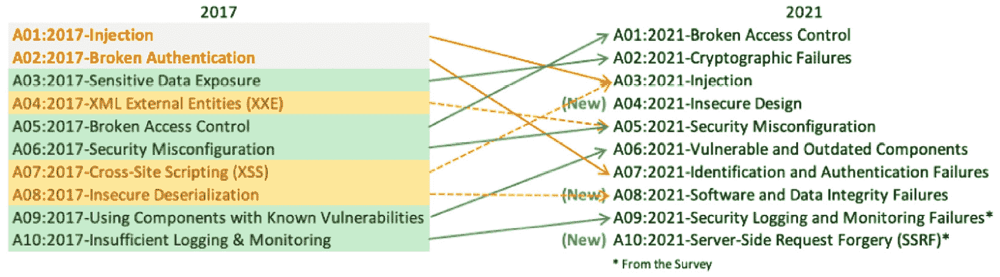
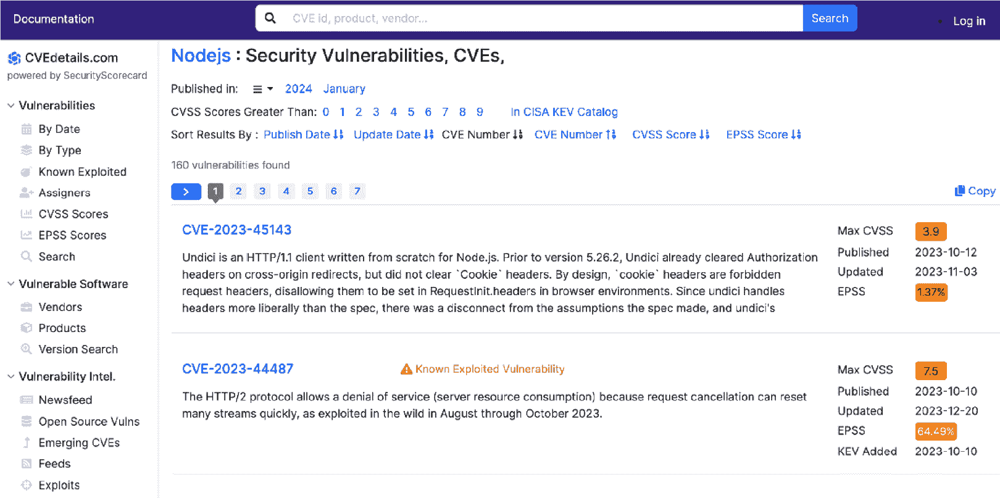
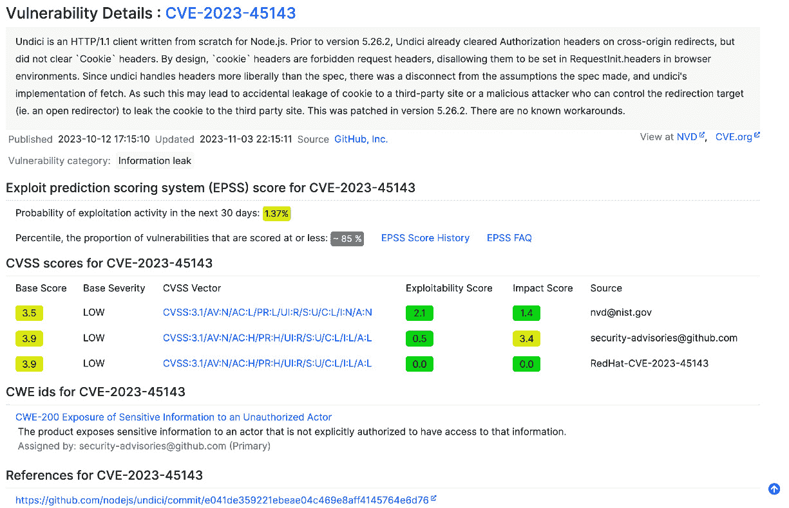
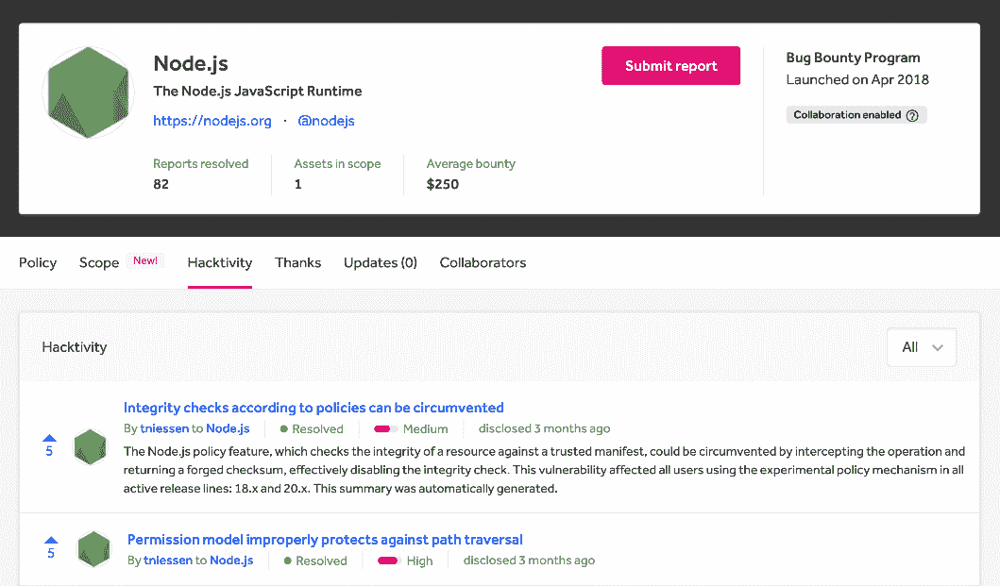

# 15

# 保护 Web 应用程序

在本章中，我们将探讨如何提高我们 Web 应用程序的安全性。我们将从讨论安全事件对业务的影响以及如何在日常工作中开始考虑安全开始。然后我们将探讨关键资源，如 OWASP Top 10、**常见弱点枚举**（**CWE**）和**常见漏洞和暴露**（**CVE**），以加深我们对现代 Web 应用程序安全性的理解。

然后，我们将探讨 Node.js 威胁模型和官方 Node.js 最佳实践，以提高我们应用程序的安全性。我们将应用这些知识来创建一个清单，我们可以使用它来提高现有应用程序的安全性。

最后，我们将探讨如何利用我们的安全知识成为道德黑客，以及如何在参与社区活动和漏洞赏金计划中提升技能。

总结来说，以下是本章我们将探讨的主要主题：

+   安全的重要性

+   从哪里开始考虑安全

+   提高我们应用程序的安全性

+   成为道德黑客

# 技术要求

本章的代码文件可以在[`github.com/PacktPublishing/NodeJS-for-Beginners`](https://github.com/PacktPublishing/NodeJS-for-Beginners)找到。

# 安全的重要性

从历史上看，开发者并没有将应用程序的安全性视为优先事项。主要原因在于，安全文化并没有在开发者的思维中占据主导地位，因为主要目标是尽快交付功能，而历史上我们构建的系统对业务来说并非至关重要，也没有像今天这样全天候暴露在互联网上。

“只有两种公司：那些已经被黑客攻击的公司，以及那些将要被攻击的公司。”

– 罗伯特·穆勒，FBI 局长，2012 年

现在，我们依赖于许多第三方库和服务，我们无法控制它们，也不知道它们是否安全。我们构建了非常复杂的系统，这些系统包含许多超出我们自身业务逻辑的层级，我们需要意识到我们承担的风险以及如何减轻这些风险。

最后，我们作为个人需要意识到风险，我们应用程序的安全性是我们的责任。很多时候，我们假设安全是别人的责任，但这并不正确。即使在拥有安全团队的组织中，开发者也是第一道防线，他们需要意识到风险以及如何减轻这些风险。

## 社会工程

我喜欢好莱坞黑客电影，这些电影使用超级复杂的工具来破解虚构的系统，但现实是，最常见的攻击向量是社会工程学。欺骗一个人比破解一个系统要容易，这就是为什么社会工程学是最常见的攻击向量。有许多技术（如钓鱼、编造理由、诱饵等），并且随着时间的推移，它们会变得更加复杂。所有这些类型的攻击都有心理操纵的共同点。这可能包括使用权威角色（例如攻击者假装是警察），或者攻击者使用稀缺策略（例如，在特别优惠中声称只有五个设备以超低价出售，这是一个骗局）。这只是两个例子，但还有更多策略利用了我们作为人类共有的弱点/欲望。

“社会工程学绕过了所有技术，包括防火墙。”

– 凯文·米特尼克

我们都收到过声称来自我们的银行或我们使用的服务的电子邮件，要求我们点击一个非常可疑的链接或下载一个文件。这些电子邮件中的大多数都是钓鱼攻击，你的电子邮件提供商会检测并将它们分类为垃圾邮件。作为技术人员，我们认为自己不会上当受骗，但现实是，有越来越多的复杂攻击针对开发者，而且很难检测。

让我向你介绍`lodash`包，但你打错了字，安装了`lodahs`包。

这种攻击可能进行的两种恶意活动是搜索你项目中的`.env`文件并将它们发送到攻击者的服务器，或者在您的应用程序中安装后门。还有许多其他活动。

我们过去见过这种攻击；例如，流行的`cross-env`包([`www.npmjs.com/package/cross-env`](https://www.npmjs.com/package/cross-env))，它用于以跨平台的方式设置环境变量，有一个恶意版本叫做`crossenv`([`snyk.io/advisor/npm-package/crossenv`](https://snyk.io/advisor/npm-package/crossenv))，其中包含恶意负载。

你可以在[`snyk.io/blog/typosquatting-attacks/`](https://snyk.io/blog/typosquatting-attacks/)找到关于这种攻击的更多详细信息。

信息

目前，npm 有政策禁止你发布与之前已发布的包具有相似名称的包，以防止这种攻击([`docs.npmjs.com/threats-and-mitigations#by-typosquatting--dependency-confusion`](https://docs.npmjs.com/threats-and-mitigations#by-typosquatting--dependency-confusion))。

## 供应链中的风险

多年来，我一直宣传供应链安全的重要性。有时很难理解风险，因为供应链对我们来说是不可见的，而且对我们代码的影响不如 SQL 注入或内存泄漏那样清晰。

在 2020 年，我撰写了一篇博客文章，讨论了如何使用 npm 上的恶意包在 Node.js 应用程序中构建后门（[`snyk.io/blog/what-is-a-backdoor/`](https://snyk.io/blog/what-is-a-backdoor/)）。后门是一段代码，将允许我们远程控制应用程序。基本上，我们有了对操作系统终端的远程访问权限，可以以运行应用程序的用户的权限执行任何我们想要的命令。

为了使其更真实，我创建了一个恶意的 Express 中间件，允许我们在操作系统终端中执行任何我们想要的命令。然后，我将这个包发布到 npm 上，使其对社区可用。这个包被命名为`browser-redirect`，预期行为是将任何未使用基于 Chromium 的浏览器的用户重定向到[`browsehappy.com/`](https://browsehappy.com/)。为此，你只需将这个包作为中间件在你的 Express 应用程序中使用。这个包执行了预期的行为，但在后台还做了更多恶意的事情，包括向 HTTP 响应中添加特定的头信息，这有助于使用 Shodan（[`www.shodan.io/`](https://www.shodan.io/)）等工具在互联网上找到受感染的服务器，并在满足某些条件时在操作系统终端中执行命令。这段代码不需要任何外部库来执行任何恶意活动，因此恶意负载在运行扫描工具时不易被识别。

信息

你可以在 Snyk 博客（[`snyk.io/blog/what-is-a-backdoor/`](https://snyk.io/blog/what-is-a-backdoor/)）中找到这篇博客文章，其中详细解释了代码执行、缓解策略等内容。

## 商业影响

任何安全事件都会对业务产生直接影响。我们可能会失去我们的声誉和客户的信任。此外，事件可能会直接影响到我们的客户；例如，如果我们遭受勒索软件攻击，我们无法向客户提供服务，或者更糟糕的是，如果我们丢失了客户的资料，这可能导致法律问题以及直接针对我们的客户的额外攻击。

数据泄露事件如此普遍，以至于我们在大众媒体上甚至都不太关注它们。然而，对用户的影响可能非常高。近年来，我们目睹了许多影响数百万用户的数据泄露事件，泄露了诸如密码、信用卡详情、支付日志、性取向、犯罪记录、地理位置记录等信息。你可以在[`www.upguard.com/blog/biggest-data-breaches`](https://www.upguard.com/blog/biggest-data-breaches)找到详细的排名。

在 2013 年，Troy Hunt ([`www.troyhunt.com/about/`](https://www.troyhunt.com/about/)) 创建了网站 [`haveibeenpwned.com/`](https://haveibeenpwned.com/)，您可以在该网站上检查您的电子邮件地址是否在数据泄露中被泄露。您还可以设置警报，以便在您的电子邮件地址出现在新的数据泄露中时收到通知。

既然我们已经看到了业务中安全的重要性，那么让我们看看在下一节中我们可以从哪里开始学习更多关于安全的知识。

# 从哪里开始学习安全

安全是一个广泛的话题，需要多本书来涵盖所有方面；即使如此，也需要更多的资源来保持其更新。在本节中，我们将探讨一些资源以开始学习，但范围限于 Node.js 生态系统和 Web 应用程序开发。

我们将学习关于 OWASP Top 10、CVE 和 CWE 的知识，这样我们就可以有一个清晰的指南，作为初学者在安全世界中导航。

## OWASP Top 10 概述

许多可能的攻击都可能影响我们的应用程序，我们无法涵盖所有这些攻击，因此任务变得繁重。为了优先考虑最常见的攻击，**开放网络应用安全项目**（**OWASP**）基金会创建了一个列表，列出了影响 Web 应用程序的 10 种最常见攻击，并且这个列表每隔几年就会更新。您可以在[`owasp.org/www-project-top-ten`](https://owasp.org/www-project-top-ten)找到这个列表。

让我们看看 2021 年 OWASP Top 10 的列表：

+   **A01:2021 破坏性访问控制**

+   **A02:2021 密码学失败**

+   **A03:2021 注入**

+   **A04:2021 不安全设计**

+   **A05:2021 安全配置错误**

+   **A06:2021 易受攻击和过时组件**

+   **A07:2021 身份验证和授权失败**

+   **A08:2021 软件和数据完整性失败**

+   **A09:2021 安全日志和监控失败**

+   **A10:2021 服务器端请求伪造（SSRF**）

我建议您仔细阅读 OWASP Top 10，并尝试找出攻击的共同点，这样您就可以理解攻击的根本原因，从而帮助您定义更好的策略来减轻它们。

例如，我们可以看到**A05 安全配置错误**和**A06 - 易受攻击和过时组件**与我们的依赖项的安装和配置方式以及如何保持它们更新有关。因此，我们可以开始思考如何改进我们的 CI/CD 管道以自动化依赖项的安装和更新，并且我们可以讨论我们是否需要更深入地了解我们所依赖的依赖项。在非常具体的情况下，这可能意味着我们有一个配置不当且过时的 NGINX（反向代理）实例，我们需要投入精力来改进配置并定期更新 NGINX 版本。

了解 OWASP Top 10 的另一个好方法是逐年比较该列表。例如，让我们比较 2017 年的 OWASP Top 10 和 2021 年的 OWASP Top 10：



图 15.1 – 比较 OWASP TOP 10 2017 与 2021 年（来源：OWASP）

如您所见，有一些新增、删除和合并，但总体上，列表与之前非常相似，只是顺序上有所变化。这使得在列表更新时，每隔几年刷新您的知识变得更加容易。

## CWE

Owasp Top 10 包括对 CWE 的引用，这是一个由社区开发的常见软件和硬件弱点列表。您可以在[`cwe.mitre.org/data/definitions/699.html`](https://cwe.mitre.org/data/definitions/699.html)找到这份列表。

CWE 是一个非常广泛的列表，涵盖了众多主题，因此阅读全部内容非常困难。然而，它是一个寻找特定主题更多信息的绝佳资源。例如，让我们看看**CWE-798：使用硬编码凭证**[`cwe.mitre.org/data/definitions/798.html`](https://cwe.mitre.org/data/definitions/798.html)，这将显示其描述、与其他 CWE 的关系、后果以及更多内容。

## CVE

CVE 是一份公开披露的网络安全漏洞列表。您可以在[`cve.mitre.org/`](https://cve.mitre.org/)找到这份列表。这份列表与 CWE 不同，因为它是一份特定软件产品中发现的安全漏洞列表，而不是可能弱点的列表。

简而言之，CWE 是一份可能弱点的列表，CVE 是一份在野外发现的安全漏洞列表。我们需要非常关注可能影响我们应用程序的 CVE，并尽快缓解它们。一种常见的策略是订阅我们应用程序中使用的依赖项的安全邮件列表，以便在发现新的 CVE 时得到通知，或者使用 Snyk（[`snyk.io/`](https://snyk.io/））等自动化工具，当我们的依赖项中发现新的 CVE 时，它会通知我们。

如果我们没有明确的缓解 CVE 的策略，我们很容易被每天发现的 CVE 数量所淹没，尤其是在 Node.js 生态系统中，我们的应用程序中通常有很多依赖项。

### Node.js 中的 CVE

如果我们访问[https://www.cvedetails.com/vulnerability-list/vendor_id-12113/Nodejs.html](https://www.cvedetails.com/vulnerability-list/vendor_id-12113/Nodejs.html)，我们可以看到多年来在 Node.js 中发现的所有 CVE 列表。



图 15.2 – CVE 列表

如您所见，我们将选择最新的一个（**CVE-2023-45143**），并将在[`www.cvedetails.com/cve/CVE-2023-45143/`](https://www.cvedetails.com/cve/CVE-2023-45143/)上对其进行详细探讨：



图 15.3 – CVE 详情

我们应该找到对漏洞的明确描述和发布日期的引用。这将帮助我们确定我们是否受到该漏洞的影响。此外，我们可以看到漏洞类别（在这种情况下，**信息泄露**）和未来 30 天内利用活动的可能性（在这种情况下，**1.37**%）。这将帮助我们优先考虑缓解漏洞，而整体评分将帮助我们确定漏洞的严重性。

考虑到这些因素，我们可以快速决定是否需要缓解。此外，我们可以找到一份参考文献列表，这将帮助我们更详细地了解漏洞，以及与漏洞相关的 CWEs。

如何缓解漏洞取决于我们。在某些情况下，我们只需更新依赖项以包含修复即可；在其他情况下，没有可用的修复，我们需要找到一种解决方案或删除依赖项。在其他情况下，我们可以简单地忽略漏洞，因为它与我们应用程序不相关，因为它没有影响。

作为建议，我建议您与更多同事一起进行分析，这样您就可以有不同的观点，并做出坚实的团队决策。

信息

Node.js 在控制 CVE 方面做得很好。您可以在 Node.js 博客中找到有关每个 CVE 的更多信息。例如，**CVE-2023-45143**在[`nodejs.org/en/blog/vulnerability/october-2023-security-releases`](https://nodejs.org/en/blog/vulnerability/october-2023-security-releases)中进行了描述。

如果您正在开发现代前端应用程序，您可能会使用几个库来构建应用程序。通常，这会成为 CVE 的一个大来源，因为我们有许多我们不控制的间接依赖。而且，升级依赖项并不容易，因为我们需要等待维护者更新它们，并且需要与其他依赖项兼容。因此，请仔细评估您在应用程序中使用的依赖项，并将它们分为运行应用程序的部分和仅作为构建过程的一部分。这将大大简化审查过程。

## Node.js 威胁模型

Node.js 有一个威胁模型，这是一个很好的资源，可以帮助理解 Node.js 如何评估社区报告的漏洞。您可以在[`github.com/nodejs/node/blob/main/SECURITY.md#the-nodejs-threat-model`](https://github.com/nodejs/node/blob/main/SECURITY.md#the-nodejs-threat-model)找到威胁模型，我们已在 Node.js 安全工作组([`github.com/nodejs/security-wg`](https://github.com/nodejs/security-wg))中进行了详细阐述。

我们可以从威胁模型中提取的一个明确想法是，Node.js 项目默认信任许多事物，例如我们在应用程序中使用的依赖项、我们自己的代码或我们运行应用程序的基础设施。这意味着我们必须知道在我们的应用程序中运行的是哪些代码（我们的或来自第三方的），并确保基础设施是安全的。

## Node.js 官方推荐

除了威胁模型之外，在 Node.js 安全工作组中，我们创建了一份参考文档，旨在扩展当前的威胁模型，并提供关于如何保护 Node.js 应用程序的详细指南。它包括我们推荐遵循的最佳实践列表，以提高您 Node.js 应用程序的安全性。我们以 CWE 列表作为起点，提供了详细的缓解策略和建议：

+   **HTTP 服务器拒绝服务（CWE-400）**

+   **DNS 重绑定（CWE-346）**

+   **HTTP 请求走私（CWE-444）**

+   **通过时间攻击泄露信息（CWE-208）**

+   **恶意第三方模块（CWE-1357）**

+   **内存访问违规（CWE-284）**

+   **猴子补丁（CWE-349）**

+   **原型污染攻击（CWE-1321）**

+   **不受控制的搜索路径元素（CWE-427）**

您可以在[`nodejs.org/en/guides/security/`](https://nodejs.org/en/guides/security/)找到该列表。

您还可以找到其他流行的社区构建资源，以更好地了解 Node.js 中的安全性：

+   Yoni Goldberg 的*Node.js 最佳实践*([`github.com/goldbergyoni/nodebestpractices`](https://github.com/goldbergyoni/nodebestpractices))

+   Liran Tal 的*Awesome Node.js Security 资源*([`github.com/lirantal/awesome-nodejs-security`](https://github.com/lirantal/awesome-nodejs-security))

现在我们对 Node.js 中的安全性有了更好的理解，让我们在下一节中更详细地看看如何提高我们 Web 应用程序的安全性。

# 提高我们应用程序的安全性

我们将在本节中探讨的工具和技术正在迅速发展，所以我建议您关注 Node.js 安全工作组([`github.com/nodejs/security-wg`](https://github.com/nodejs/security-wg))和社区，以了解最新的趋势。然而，这里有一个可靠的清单，您可以使用它来提高您应用程序的安全性：

+   在我们的项目中使用`bcrypt`库([`www.npmjs.com/package/bcrypt`](https://www.npmjs.com/package/bcrypt))来加密用户的密码：

    ```js
    userSchema.pre('save', async function (next) {
      const user = this
      if (user.isModified('password')) {
        const salt = await bcrypt.genSalt()
        user.password = await bcrypt.hash(
    user.password, salt
        )
      }
      next()
    })
    ```

+   使用`validator`([`www.npmjs.com/package/validator`](https://www.npmjs.com/package/validator))或`joi`([`www.npmjs.com/package/joi`](https://www.npmjs.com/package/joi))来验证数据。例如，您可以轻松验证电子邮件，如下所示：

    ```js
    import validator from 'validator';
    validator.isEmail('foo@bar.com'); //=> true
    validator.isEmail('<script>alert("XSS")</script>'); //=> false
    ```

+   使用 `helmet` ([`helmetjs.github.io/`](https://helmetjs.github.io/)) 来提高我们应用程序的安全性。您可以在 [`blog.ulisesgascon.com/how-to-use-helmet-in-express`](https://blog.ulisesgascon.com/how-to-use-helmet-in-express) 找到如何实现 `helmet` 的优秀指南。

+   使用 `pino` ([`getpino.io/`](https://getpino.io/)) 来安全地保存日志，我们可以使用这些信息来审计应用程序和来自第三方的滥用。您可以在官方文档中找到如何使用 Express 实现 `pino` 的优秀指南 ([`getpino.io/#/docs/web?id=pino-with-express`](https://getpino.io/#/docs/web?id=pino-with-express))。

+   **监控**：一旦应用程序部署并暴露在互联网上，我们需要了解其运行情况。监控应用程序将帮助我们检测停机时间、性能问题等。我们可以设置警报以实时了解是否存在问题。我们可以使用 New Relic ([`newrelic.com/`](https://newrelic.com/))、Datadog ([`www.datadoghq.com/`](https://www.datadoghq.com/)) 或 Sentry ([`sentry.io/welcome/`](https://sentry.io/welcome/))。您可以在官方文档中找到如何使用 Express 实现 Sentry 的优秀指南 ([`docs.sentry.io/platforms/node/guides/express/`](https://docs.sentry.io/platforms/node/guides/express/))。

+   **跟踪依赖项**：您需要了解您的依赖项并保持它们更新。您可以使用 Snyk ([`snyk.io/`](https://snyk.io/)) 或 Socket ([`socket.dev/`](https://socket.dev/)) 来监控依赖项，当发现新的 CVE 时会收到通知，甚至可以自动化依赖项的更新。

+   **备份和恢复**：您需要为您的关键信息进行备份，并在发生灾难时制定恢复计划。即使您没有遭受安全事件，您也可能遭受自然灾害，例如火灾或洪水，这些灾害可能发生在存储您信息的数据中心。如果您依赖于云服务提供商，您需要了解多区域复制的工作原理以及如何在灾难发生时恢复数据。

+   **减少攻击面**：有时，我们在业务逻辑的核心部分编写的代码比业务逻辑本身所需的要多。我们编写的每一行代码都是一个潜在的风险，因此我们可以通过在安全关键区域使用 API 来减少攻击面。例如，我们可以使用 Auth0 ([`auth0.com/`](https://auth0.com/)) 来处理我们的身份验证和授权，或者使用 Stripe ([`stripe.com/`](https://stripe.com/)) 来处理支付。这将减少我们需要编写和维护的代码量，并且敏感信息，如信用卡号码，将由该领域的专家第三方处理。当然，我们需要信任第三方并了解服务的成本。

+   **在您的服务中强制执行双因素认证（2FA）**：我们需要在我们的公司活动中使用的所有服务（Slack、GSuite 等）以及我们用于运行应用程序的基础设施（Github、AWS、Azure 等）中强制执行 2FA。这将降低社会工程攻击的风险。此外，如果我们能在自己的应用程序中实施 2FA 以减轻用户密码被盗的风险，那就更好了。

+   **审查秘密**：泄露秘密是我们可能犯的一个非常常见的错误。我们可以使用 GitGuardian（[`www.gitguardian.com/`](https://www.gitguardian.com/））等工具扫描我们的存储库，并在我们泄露秘密时通知我们。

+   **实施良好实践**：作为团队，我们可以遵循许多良好实践来提高我们应用程序的安全性。例如，使用控制版本，使用拉取请求来审查更改，使用 CI/CD 工具来自动化代码审查，等等。

+   **自动化**：一旦你设置了 CI/CD 工具，你可以自动化许多任务，甚至与基础设施相关的任务。例如，你可以使用 Terraform（[https://www.terraform.io/](https://www.terraform.io/））来自动化基础设施的创建，并减少人为错误。

+   **持续学习**：安全与其他技术话题并无不同；它发展非常快，我们需要持续学习。

+   **使用安全协议**：我们需要使用 HTTPS 等安全协议来保护客户端和服务器之间的通信。

## 将其付诸实践

现在我们有了清单并对 Node.js 中的安全有了更好的理解，我建议您回顾我们在前几章中构建的应用程序，并审查该应用程序以寻找可能的改进，使其更加安全。

这里有一些开始的想法：

+   审查依赖项并检查是否存在任何已知漏洞

+   使用代码风格检查器来强制执行代码风格

+   使用静态代码分析工具查找可能的错误，例如 SonarQube 或 CodeQL

+   添加关键库以提高安全性，例如`helmet`或`validator`

+   添加控制版本系统并使用 CI/CD 工具自动化代码审查，例如 Github Actions

+   添加一个控制版本系统以审查拉取请求中的更改

在下一节中，我们将探讨如何利用我们的安全知识成为道德黑客。

# 成为道德黑客

当我们想到黑客时，我们往往会想到试图窃取我们的数据或控制我们系统的网络犯罪分子。实际上，情况并非如此简单。让我们阅读来自论文《黑客思维：网络安全专家及其心理模型研究》中对黑客的定义（[https://papers.ssrn.com/sol3/papers.cfm?abstract_id=2326634](https://papers.ssrn.com/sol3/papers.cfm?abstract_id=2326634)）：

“无论一个人是哪种类型的黑客，识别系统弱点都需要逻辑推理和系统地思考可能采取的行动、替代方案和潜在结论的能力。这种推理和系统思维的组合意味着使用心智模型。黑客是一种需要非凡技术和推理能力的认知活动。”

因此，基本上，我们是在谈论一个具有高度技术技能的人，他们通过跳出思维定势来做事情。问题不在于活动本身，而在于活动的意图。

今天，我们将道德黑客定义为具有良好意图做事的人。例如，当您在自己的应用程序上进行渗透测试以寻找可能存在的漏洞时，您正在进行道德黑客活动。有时，您最终会发现您不拥有的其他应用程序/库/服务中的漏洞。在这些情况下，我们可能会面临两种不同的场景：进行**协调漏洞披露**（以前称为**负责任披露**）或尝试**漏洞赏金计划**。

## 协调漏洞披露（CVD）

当您发现第三方应用程序/库/服务中的漏洞时，您可以联系应用程序/库/服务的所有者，并解释漏洞以及如何缓解它。虽然这个过程看起来很简单，但并不总是容易。

首先，一个未知的漏洞可能会影响许多用户、公司和服务。因此，您需要非常小心地沟通漏洞以及向谁沟通。此外，这还需要一个验证过程，以确保漏洞是真实的，并且它不是一个误报。然后，预计在公开披露之前，将开发补丁并将其提供给受影响的服务。

为了使过程更容易，许多公司和开源项目都有一个安全策略，解释如何报告漏洞以及可以期待的过程。例如，您可以在[`nodejs.org/en/security/`](https://nodejs.org/en/security/)找到 Node.js 的安全策略：

“通常，您的报告将在 5 天内得到确认，您将在 10 天内收到对您的报告的更详细回应，表明处理您的提交的下一步行动。当我们的分级志愿者休假时，这些时间表可能会延长，尤其是在年底时。”

在对您的报告进行初步回复后，安全团队将努力让您了解修复和全面公告的进展情况，并可能要求提供有关报告问题的额外信息或指导。

其他公司，如谷歌，有一个专门的网站来报告其产品中的漏洞（[`www.google.com/about/appsecurity/`](https://www.google.com/about/appsecurity/))。

## 奖金计划

一些公司和开源项目有一个赏金计划，如果你能发现它们的应用程序/库/服务中的漏洞，将会得到奖励。实际上，这种情况与 CVD 非常相似，但在这个情况下，你有一套明确的参与和边界规则。

让我们看看 Node.js 赏金计划[`hackerone.com/nodejs`](https://hackerone.com/nodejs)，以更好地了解这个过程。我们还有一个 hacktivity 页面([`hackerone.com/nodejs/hacktivity`](https://hackerone.com/nodejs/hacktivity))，我们可以看到已经提交的报告和报告的状态，包括大量的详细信息，包括奖励。



图 15.4 – Node.js 赏金计划

如图中所示，有一个披露信息列表，在许多情况下，这些信息会导致安全补丁。您可以自由探索它们，看看每个案例中的沟通是如何进行的，以及流程是如何运作的。您可以从这些披露报告中学到很多东西。

## 获取技能

开发软件与破坏软件不同。你需要学习很多技能，也需要熟悉一些工具。一个关于你需要学习的技能的绝佳概述是[`roadmap.sh/`](https://roadmap.sh/)，其中有一个专门针对网络安全的部分([`roadmap.sh/cyber-security`](https://roadmap.sh/cyber-security))。

为了获得更多实践技能，您可以使用*Hack the Box*平台([`www.hackthebox.eu/`](https://www.hackthebox.eu/))，这将允许您在一个安全的环境中练习您的技能。*Hack the Box*中的挑战被社区中的许多黑客和安全专业人士用作学习工具，因此您可以在互联网上找到很多帮助您解决挑战的 write-ups。

# 摘要

在本章中，我们探讨了现代 Web 应用程序中安全性的重要性以及安全事件可能对业务产生的影响。然后，我们学习了如何通过使用 OWASP、CWE、CVE、Node.js 威胁模型和官方 Node.js 最佳实践来在日常工作中开始关注安全。

此外，我们还学习了如何通过使用简单的清单来提高我们应用程序的安全性，以及如何在我们的应用程序中应用它。

最后，我们学习了如何利用我们的安全知识成为一名道德黑客。

在下一章中，我们将学习如何以不同的方式将我们的应用程序部署到互联网和本地设备上。

# 进一步阅读

+   *CVE-2020-19909 是 CVEs 中所有错误的东西*：[`daniel.haxx.se/blog/2023/08/26/cve-2020-19909-is-everything-that-is-wrong-with-cves/`](https://daniel.haxx.se/blog/2023/08/26/cve-2020-19909-is-everything-that-is-wrong-with-cves/)

+   *审计软件包依赖以查找安全* *漏洞*: [`docs.npmjs.com/auditing-package-dependencies-for-security-vulnerabilities`](https://docs.npmjs.com/auditing-package-dependencies-for-security-vulnerabilities)

+   *OWASP NPM 安全* *最佳实践*: [`cheatsheetseries.owasp.org/cheatsheets/NPM_Security_Cheat_Sheet.html#npm-security-best-practices`](https://cheatsheetseries.owasp.org/cheatsheets/NPM_Security_Cheat_Sheet.html#npm-security-best-practices)

+   *DEFCON – 完整* *纪录片*: [`www.youtube.com/watch?v=3ctQOmjQyYg`](https://www.youtube.com/watch?v=3ctQOmjQyYg)

+   *开源安全状态* *2023*: [`snyk.io/reports/open-source-security/`](https://snyk.io/reports/open-source-security/)

+   *威胁和* *缓解措施*: [`docs.npmjs.com/threats-and-mitigations#by-typosquatting--dependency-confusion`](https://docs.npmjs.com/threats-and-mitigations#by-typosquatting--dependency-confusion)

# 第五部分：掌握 Node.js 部署和可移植性

在 *第五部分* 中，我们将把我们的应用程序部署到公共互联网。我们将学习如何根据我们的需求决定最佳方法，然后我们将使用 DigitalOcean 中的虚拟机来使用 PM2 部署应用程序，并且我们还将学习如何将我们的应用程序 docker 化以提高可移植性。

我们将使用 GitHub 来存储我们的应用程序代码，并且我们将学习如何为我们的项目创建持续部署管道。

我们旅程的最后一步将是使用 Cloudflare 来管理我们的域名和 SSL 证书，并且我们将探索十二要素应用原则。

本部分包含以下章节：

+   *第十六章*，*部署 Node.js 应用程序*

+   *第十七章*，*将 Node.js 应用程序 docker 化*
