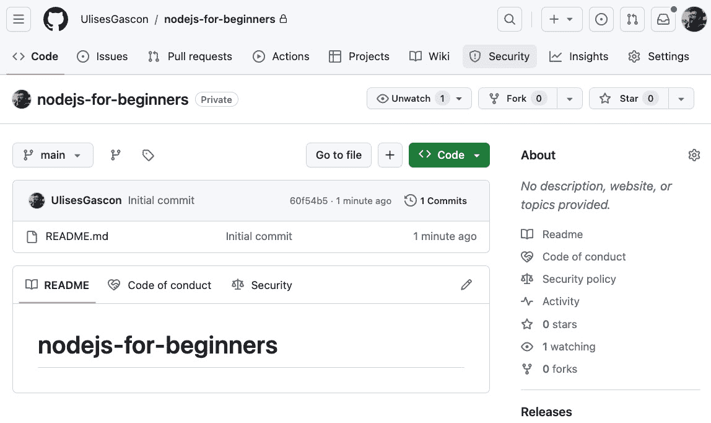
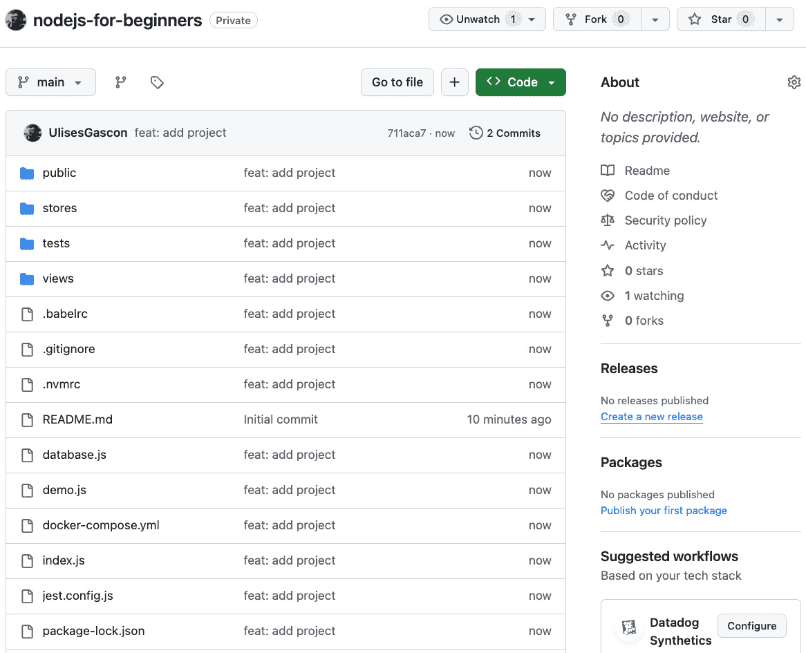
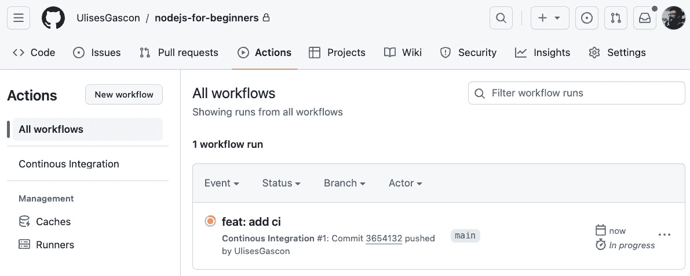
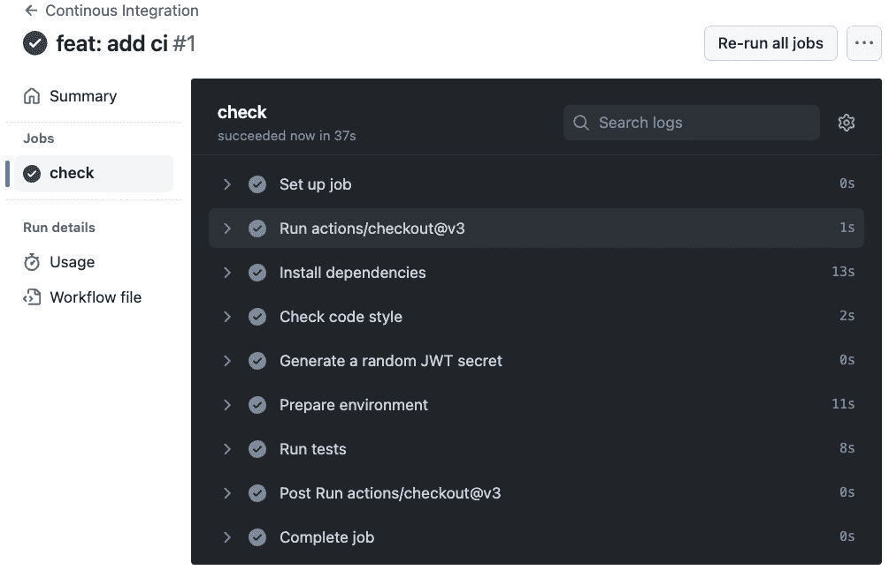
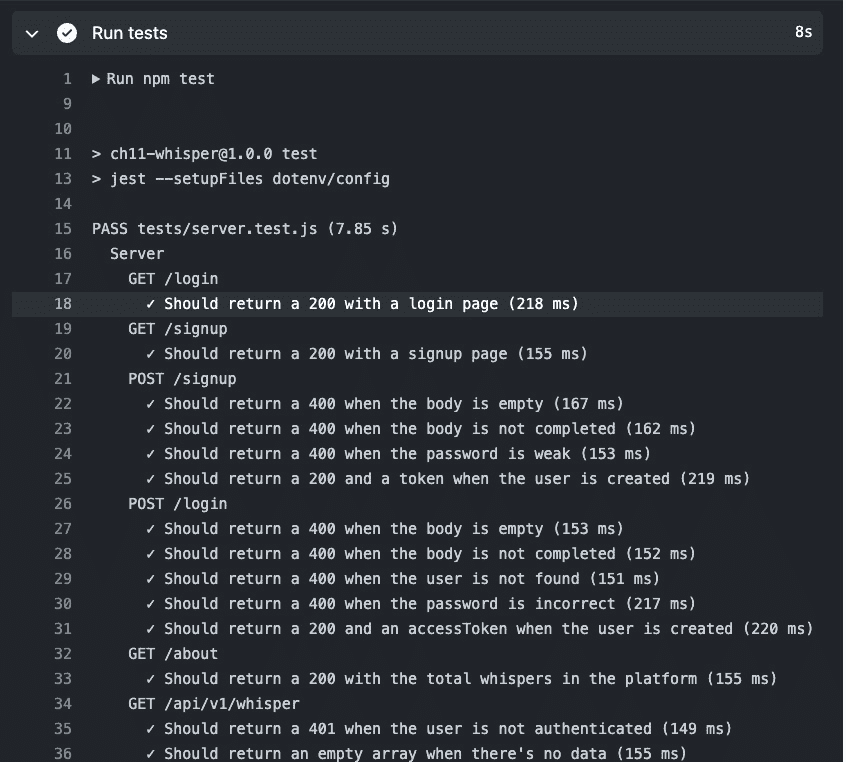
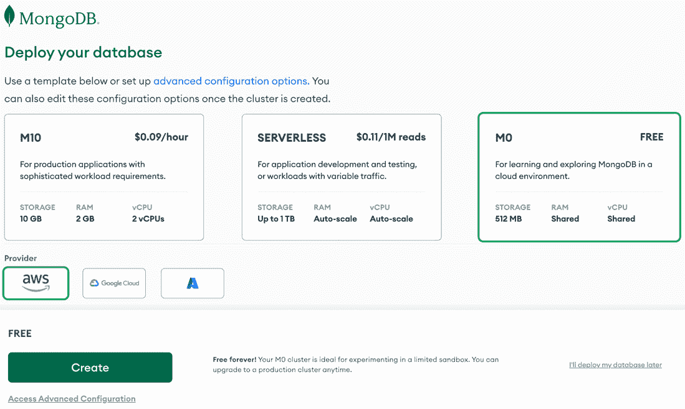
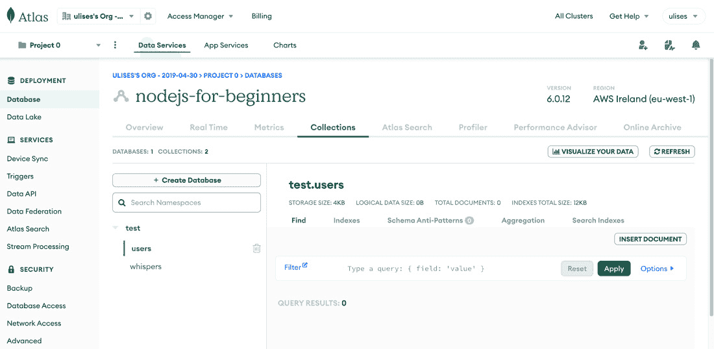
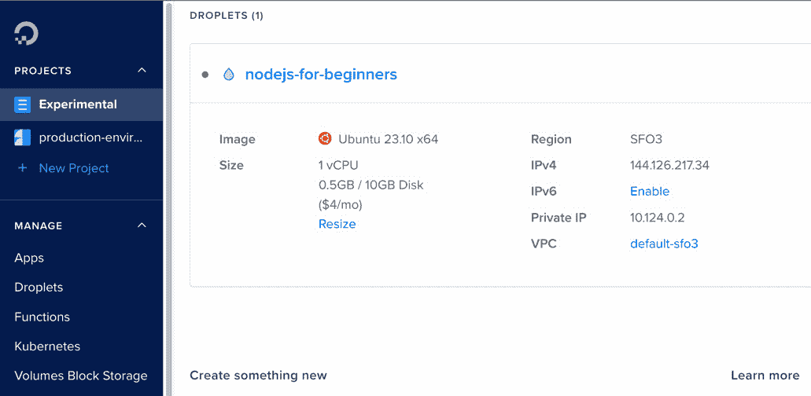
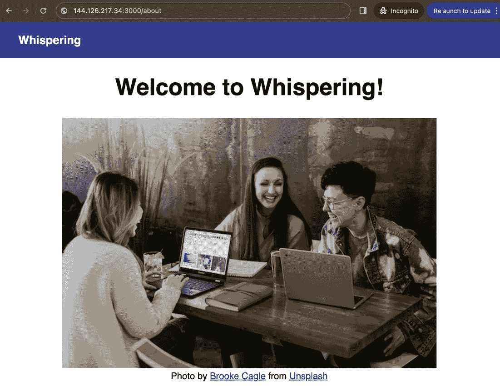

# 部署 Node.js 应用程序

在本章中，我们将学习如何将我们的应用程序部署到公共互联网。我们将了解明确定义需求的重要性以及如何选择最适合我们需求的解决方案。我们将把应用程序代码推送到 GitHub 仓库，以便使用 GitHub Actions 进行持续集成。

最后，我们将在 DigitalOcean 上部署应用程序，并使用 PM2 保持应用程序运行。我们将配置并使用 MongoDB Atlas 在云端托管数据库。

总结来说，以下是本章我们将探讨的主要主题：

+   如何定义需求以及如何选择最适合我们需求的最佳解决方案

+   如何将应用程序代码推送到 GitHub 仓库

+   如何使用 MongoDB Atlas 将数据库作为外部资源托管

+   如何使用 DigitalOcean Droplet 托管应用程序

+   如何使用 PM2 保持应用程序运行

# 技术需求

为了遵循本章中的示例，您需要创建以下提供商的账户：

+   DigitalOcean: [`www.digitalocean.com/`](https://www.digitalocean.com/)

+   MongoDB Atlas: [`www.mongodb.com/docs/atlas/tutorial/create-atlas-account/`](https://www.mongodb.com/docs/atlas/tutorial/create-atlas-account/)

+   GitHub: [`github.com/signup`](https://github.com/signup)

本章的代码文件可以在 [`github.com/PacktPublishing/NodeJS-for-Beginners`](https://github.com/PacktPublishing/NodeJS-for-Beginners) 找到。

查看本章的操作视频代码在 [`youtu.be/cWkqR2xJJ0k`](https://youtu.be/cWkqR2xJJ0k)

注意

我们将使用 DigitalOcean 来托管应用程序，但你也可以使用任何其他提供商，甚至是你自己的笔记本电脑（作为替代方案）。如果你没有 DigitalOcean 账户，你可以在这里创建一个：[`www.digitalocean.com/`](https://www.digitalocean.com/)。

# 定义需求

我们已经在计算机上使应用程序运行，但我们需要将其部署到公共互联网。因此，我们需要定义需求，以便选择最适合我们需求的最佳解决方案。

首先，我们需要考虑以下技术问题：

+   *目标环境是什么* (*裸机，虚拟机，容器，云解决方案...*)*？* 由于我们的应用程序使用 Node.js 和标准 NPM 库，我们可以轻松地在裸机或虚拟机上直接部署它。其他解决方案也是可能的，但需要在配置方面做一些工作。

+   *目标平台是什么* (*AWS, Azure, GCP, DigitalOcean, Heroku...*)*？* 在我们的案例中，我们预期不会有太多流量或用户。此外，我们不是在团队中工作，也没有任何具体要求，例如服务级别协议（SLA）。我们可以安全地选择使用最简单的提供商，该提供商在入职流程方面具有竞争力定价。在我们的案例中，我们将使用 DigitalOcean。

+   *目标操作系统是什么*（Linux, Windows, macOS...）*？* Node.js 能够在常见的和异构的操作系统上运行。我们的应用程序对操作系统没有特殊依赖，因此我们可以轻松选择 Linux，因为它是服务器上最受欢迎的操作系统，并且提供了最广泛的提供商服务。

+   *目标架构是什么*（x86, ARM...）*？* 在这种情况下，我们的应用程序是纯 JavaScript。Node.js 支持这两种架构（x86 和 ARM），因此我们可以轻松选择 x86，因为它是一种更常见的服务器架构，通常价格更低。

+   *目标 Node.js 版本是什么*（18, 20, 21...）*？* 我们对 Node.js 20.11.0 有明确的依赖，因为我们开发应用程序时使用了这个版本，但我们可以确信应用程序应该能在任何 Node.js 20 LTS 版本上运行。

+   *目标数据库是什么*（MongoDB, MySQL, PostgreSQL, Redis...）*？* 我们依赖于 MongoDB，因此我们需要将其作为我们基础设施决策的依赖项考虑。除此之外，没有更多外部依赖项或服务。管理数据库并不简单，因此在这种情况下，我们可以安全地选择任何托管服务。MongoDB 提供了 MongoDB Atlas ([`www.mongodb.com/atlas/database`](https://www.mongodb.com/atlas/database)) 作为他们在云中的 MongoDB 解决方案。此外，免费层应该能满足我们的需求。

因此，总结一下，我们将部署我们在前几章中构建的应用程序。我们将部署一个使用 Express 的 Node.js 应用程序。唯一的外部依赖项是 MongoDB。我们将使用具有 x86 架构的 Linux 机器和 Node.js 20.x 版本。此外，我们将使用 MongoDB Atlas 来托管数据库，这样我们就不必过多担心数据库的运营方面。

此外，我们还需要考虑以下与团队和项目相关的事项，特别是如果我们在一个专业环境中工作，如果我们计划长期部署应用程序，或者预期很快会进行扩展：

+   预算是多少？

+   我们预计会有多少次部署？

+   团队规模是多少？

+   团队的经验和知识是什么？

将 Node.js 应用程序部署到宠物项目与部署到拥有积极 **服务级别协议**（**SLAs**）和经验丰富的基础设施团队的大型公司并不相同。

在我们的情况下，我将假设这是您第一次部署 Node.js 应用程序。此外，我将假设有限的预算、经验和时间来维护基础设施，因此我们将尝试尽可能便宜的选择。当然，我们不会有太多的部署，也不会有太多的流量。因此，我们不需要担心可扩展性、性能或高可用性。

总体而言，我们有两个主要选项，我们将在本章和下一章中探讨：

+   在裸金属机器或虚拟机上部署应用程序

+   在云解决方案中部署应用程序

您可以在裸机机器上部署应用程序，这可以是一台旧笔记本电脑，一个**单板计算机**（**SBC**）如树莓派，或者您自己计算机上的虚拟机。在这种情况下，您可以选择是否启用对机器的远程访问。但无论如何，这是一个学习和测试应用程序的好方法。

另一个选项是面向公共互联网，并在云解决方案中部署应用程序。那里有许多提供大量产品服务的提供商。所以，为了保持简单，我将专注于单个计算资源提供商（DigitalOcean）和单个数据库提供商（MongoDB Atlas）。

在下一节中，我们将创建 GitHub 仓库，并将代码推送到仓库。

# 使用 GitHub 仓库

我们将使用 GitHub 来托管代码并部署应用程序。我们将使用 GitHub Actions 来运行测试并检查代码质量。然后我们将使用 GitHub 从仓库中拉取代码并部署应用程序。

## 创建 GitHub 仓库

您可以使用此指南创建一个新的仓库：[`docs.github.com/en/repositories/creating-and-managing-repositories/quickstart-for-repositories`](https://docs.github.com/en/repositories/creating-and-managing-repositories/quickstart-for-repositories)

在我的情况下，我创建了一个名为 `nodejs-for-beginners` 的仓库，如图表所示：



图 16.1– 创建的仓库的网页浏览器截图

现在我们已经准备好了仓库，是时候通过将我们的代码添加到其中来开始使用它了。

## 将代码推送到仓库

您需要从 [`github.com/PacktPublishing/NodeJS-for-Beginners/archive/refs/heads/main.zip`](https://github.com/PacktPublishing/NodeJS-for-Beginners/archive/refs/heads/main.zip) 下载项目，并访问 `step4` 文件夹，然后您需要将代码推送到仓库。您需要确保 `package.json` 文件位于仓库根目录中。

这里有两个指南可以帮助您将代码推送到仓库：

+   如何克隆仓库：[`docs.github.com/en/repositories/creating-and-managing-repositories/cloning-a-repository`](https://docs.github.com/en/repositories/creating-and-managing-repositories/cloning-a-repository)

+   如何推送代码：[`docs.github.com/en/get-started/using-git/pushing-commits-to-a-remote-repository`](https://docs.github.com/en/get-started/using-git/pushing-commits-to-a-remote-repository)

注意

为了简化流程，我们将只使用 `main` 分支。但在现实世界中，大多数团队使用多个分支来管理他们的代码，以便他们可以使用诸如拉取请求、代码审查等出色功能。这超出了本书的范围。

一旦完成这些，仓库应该看起来像这样：



图 16.2 – 添加了文件和文件夹的仓库的网页浏览器截图

注意

如果你在按照本章步骤运行项目时遇到问题，或者你尝试了另一种方法，你可以使用本章开头下载的源代码中的`step5`文件夹来比较和更容易地修复可能的错误。

在下一节中，我们将使用 GitHub Actions 实现持续集成。这是确保应用程序按预期工作的绝佳方式。

# 使用 GitHub Actions 进行持续集成

我们可以将持续集成理解为对代码进行自动检查的一种方式。这将帮助我们减少人为错误，并帮助我们使检查项目质量的过程自动化。

这是一个可选步骤，不是部署应用程序所必需的，但如果你想更好地了解专业开发环境，你可以跟随操作。

因此，第一步是定义我们期望的自动化内容，然后我们可以实施它。在我们的例子中，我们想要安装依赖项，运行 lint 工具，并运行测试。我们希望在每次将代码推送到仓库时都这样做。

为了实现这一点，我们将创建包含以下内容的`.github/workflows/ci.yml`文件：

```js
name: Continous Integration
on: [push]
jobs:
  check:
    runs-on: ubuntu-latest
    steps:
      - uses: actions/checkout@v3
      - name: Install dependencies
        run: npm install
      - name: Check code style
        run: npm run lint
      - name: Generate a random JWT secret
        id: generate-secret
        run: echo "::set-output name=JWT_SECRET::$(openssl rand -base64 30)"
        shell: bash
      - name: Prepare environment
        run: npm run infra:start
      - name: Run tests
        run: npm test
        env:
          MONGODB_URI: mongodb://localhost:27017/whispering-database
          PORT: 3000
          SALT_ROUNDS: 10
          JWT_SECRET: ${{ steps.generate-secret.outputs.JWT_SECRET }}
```

此 YAML 文件定义了一个名为**持续集成**的工作流，每次我们推送代码到仓库时都会触发。此工作流将在装有 Ubuntu 的虚拟机上运行，并执行以下步骤：

1.  检查仓库中的代码。

1.  通过运行`npm install`命令安装依赖项。

1.  通过运行`npm run lint`命令运行 lint 工具。

1.  生成一个随机的 JWT 密钥。我们生成一个 30 个字符的随机字符串，稍后将用作 JWT 密钥。

1.  通过运行`npm run infra:start`命令准备环境。

1.  使用`MONGODB_URI`、`PORT`、`SALT_ROUNDS`和`JWT_SECRET`环境变量运行测试，我们将使用上一步生成的 JWT 密钥。

一旦我们将代码推送到仓库，我们可以在**动作**选项卡中检查工作流的状态：



图 16.3 – 显示 GitHub 动作的网页浏览器截图

如果我们点击工作流，我们可以看到它的详细信息：



图 16.4 – 显示 GitHub Action 执行细节的网页浏览器截图

如我们所见，所有的检查都通过了，因此我们可以有信心应用程序按预期工作。

我们可以点击**运行测试**步骤来查看测试的详细信息：



图 16.5 – 展示测试执行步骤详细信息的网络浏览器截图

如您所见，测试正在通过，就像在我们的本地机器上一样。最终，持续集成机器只是一个将遵循我们定义的步骤的远程机器，在这方面它与我们的环境没有太大区别。

现在，我们已经设置了持续集成，我们可以在下一节中开始考虑使用 Atlas 准备 MongoDB 实例。

# 使用 MongoDB Atlas

我们将使用 MongoDB Atlas 托管数据库。我们将创建一个免费层集群，并使用连接字符串来连接到数据库。

这里有一些指南将帮助您：

+   如何创建免费层集群：[`docs.atlas.mongodb.com/tutorial/create-new-cluster/`](https://docs.atlas.mongodb.com/tutorial/create-new-cluster/)

+   如何连接到数据库：[`www.mongodb.com/docs/atlas/driver-connection/`](https://www.mongodb.com/docs/atlas/driver-connection/)

在我的情况下，我创建了一个名为`nodejs-for-beginners`的免费层集群，如以下屏幕截图所示：



图 16.6 – 展示集群创建详细信息的网络浏览器截图

在过程结束时，您将得到一个类似这样的连接字符串（但使用您自己的凭据）：

```js
mongodb+srv://<username>:<password>@<cluster-url>/test?retryWrites=true&w=majority
```

您可以使用该连接字符串从应用程序连接到数据库。您只需要在`.env`文件中将`MONGODB_URI`环境变量的值替换为新连接字符串。

重要的是要注意，用户名和密码需要进行 URI 编码，以便将特殊字符转换。这可以通过`encodeURIComponent`函数轻松完成（[`developer.mozilla.org/en-US/docs/Web/JavaScript/Reference/Global_Objects/encodeURIComponent`](https://developer.mozilla.org/en-US/docs/Web/JavaScript/Reference/Global_Objects/encodeURIComponent)）。以下是一个转换示例：

```js
encodeURIComponent('P@ssword') // P%40ssword
```

如果您在本地运行测试或运行应用程序，您将看到应用程序正在使用新的数据库，数据如预期地持久保存在云端。

在以下屏幕截图中，您可以看到数据库中的数据：



图 16.7 – 展示项目详细信息的网络浏览器截图

注意

一旦您准备好数据库，您可以将`.env`文件恢复到原始状态，以避免在未来的执行中将测试数据污染数据库。

现在，我们已经准备好了外部数据库，我们可以开始考虑部署应用程序。在下一节中，我们将使用 PM2 准备应用程序。

# 使用 PM2 部署 Node.js 应用程序

这是一个非常*激动人心*的时刻！我们即将将我们的应用程序发布到公共互联网上。在这种情况下，我们将使用 DigitalOcean Droplet 来托管应用程序。Droplet 是一个运行 Ubuntu 23.10 和 0.5 GB RAM 的虚拟机，将托管应用程序。我们将使用 PM2 来保持应用程序运行，并在它崩溃时重新启动它。

如果你不想使用 DigitalOcean，作为替代方案，你可以使用至少有 4 GB RAM 的旧电脑，安装 Ubuntu（或另一个 Linux 发行版），并启用 SSH 通信（目前不需要安装 Node.js 或部署网站）。旧笔记本电脑是一个很好的选择，甚至可以是 Raspberry PI（3、4 或 5）([`www.raspberrypi.com/`](https://www.raspberrypi.com/))，安装 Raspbian ([`www.raspberrypi.com/software/`](https://www.raspberrypi.com/software/))，这样也能完成任务。在这里，你可以找到两个教程，帮助你完成设置：

+   [`www.xda-developers.com/turn-old-laptop-into-home-server`](https://www.xda-developers.com/turn-old-laptop-into-home-server)/

+   [`www.youtube.com/watch?v=iSAF8D8rp0o`](https://www.youtube.com/watch?v=iSAF8D8rp0o)

如果设置正确完成，你可以跳过下一节，直接跳到 *准备机器* 部分。

## 创建 DigitalOcean Droplet

我们将使用 DigitalOcean 来托管应用程序。我们将使用最基本、最便宜的 Droplet，目前拥有 512 MB RAM 和 1 个虚拟 CPU。

注意

我们将使用 SSH 密钥来访问机器，所以如果你不知道如何操作，请遵循以下指南：

[`docs.digitalocean.com/products/droplets/how-to/add-ssh-keys/`](https://docs.digitalocean.com/products/droplets/how-to/add-ssh-keys/)

在我的情况下，我创建了一个名为 `nodejs-for-beginners` 的 Droplet，如下面的截图所示：



图 16.8 – 显示 Droplet 详细信息的网页浏览器截图

如你所见，Droplet 可在 IP 地址 `144.126.217.34` 上找到，我们将使用该 IP 地址通过 SSH 或 HTTP 访问机器，当应用程序运行时。

## 连接到机器

使用 SSH 访问机器有多种方法。最常见的是直接使用终端。但在这个案例中，我们将使用 VSCode 连接到机器。你可以按照[`code.visualstudio.com/docs/remote/ssh`](https://code.visualstudio.com/docs/remote/ssh)上的指南学习如何操作，因为它比直接从你的终端连接到机器更方便。

在这两种情况下，我们需要使用相同的凭据。用户名是 `root`，密码被替换为你添加到 Droplet 中的 SSH 密钥。

现在我们已经能够连接到机器，是时候开始设置环境了。

## 准备机器

一旦你连接到机器，你可以在终端中运行以下命令以创建工作目录并访问新创建的目录：

```js
mkdir nodejs-for-beginners
cd nodejs-for-beginners
```

然后，我们将使用 `nvm` 安装 Node.js 20.11.0：

```js
apt update
wget -qO- https: //raw.githubusercontent. com/creationix/nvm/ v0.39.3/install. sh | bash
source ~/.profile
nvm --version
nvm install 20.11.0
```

输出应该类似于以下内容：

```js
Downloading and installing node v20.11.0...
Downloading https: //nodejs. org/dist/ v20.11.0/n ode-v20.11.0-linux- x64.tar. xz...
################################################################################################## 100.0%
Computing checksum with sha256sum
Checksums matched!
Now using node v20.11.0 (npm v10.2.4)
Creating default alias: default -> 20.11.0 (-> v20.11.0)
```

下一步是在机器上全局安装 PM2：

```js
npm install pm2 -g
```

你可以使用以下方法检查 PM2 的版本：

```js
pm2 --version
```

输出应该类似于以下内容：

```js
[PM2] PM2 Successfully daemonized
5.2.2
```

现在，机器已经准备好与我们的代码一起工作。我们的下一步是将应用程序代码带到我们的机器上。

## 克隆仓库

如果你正在使用私有仓库，你需要将 SSH 密钥添加到机器上。你可以遵循[`docs.github.com/en/github/authenticating-to-github/connecting-to-github-with-ssh`](https://docs.github.com/en/github/authenticating-to-github/connecting-to-github-with-ssh)上的指南，但如果你将仓库设置为公开，则可以跳过此步骤。

然后我们将克隆仓库：

```js
git clone https: //github. com/YOUR- USER/ YOUR-REPO .git
```

我们可以通过检查 VSCode 中的目录或运行以下命令来检查代码是否存在于文件夹中：

```js
ls -la
```

此命令将列出当前目录中的所有文件（包括隐藏文件），并显示这些文件的详细信息。输出应该类似于以下内容：

```js
README.md     docker-compose.yml   node_modules        public      tests
coverage      index.js             package-lock.json   server.js   utils.js
database.js   jest.config.js       package.json        stores      views
```

我们可以确认代码已被下载，因此我们的下一步将是安装依赖项。

## 安装依赖项

在克隆仓库后，我们将安装依赖项：

```js
npm install
```

由于机器性能不是很好，这个过程可能需要一些时间，但应该会无错误地完成。如果你遇到错误或过程比预期长得多，你可以尝试增加 Droplet 的大小，但这会增加每小时的费用。

## 准备环境

我们将创建一个 `.env` 文件，就像我们在前面的章节中所做的那样，但我们将使用上一节中创建的 MongoDB Atlas 集群的连接字符串。

一旦准备就绪，应用程序就准备好运行了，但我们将使用 PM2 保持应用程序运行并在它崩溃时重新启动它。

## 使用 PM2 管理应用程序

我们决定使用 PM2 作为我们应用程序的进程管理器，因此你不会直接使用 `node` 命令（如 `node index.js`）启动应用程序。我们将让 PM2 处理应用程序的生命周期。

我们将使用 PM2 启动应用程序：

```js
pm2 start index.js
```

我们可以使用以下方法检查应用程序的状态：

```js
pm2 status
```

我们可以使用以下方法检查应用程序的日志：

```js
pm2 logs
```

我们可以使用以下方法停止应用程序：

```js
pm2 stop index.js
```

现在，我们可以再次使用 PM2 启动应用程序并检查应用程序是否可以通过互联网访问。

## 访问应用程序

现在，我们可以使用 Droplet 的 IP 地址访问应用程序。在我的情况下，IP 地址是 `144.126.217.34`，应用程序运行在端口 `3000` 上，因此我可以使用以下 URL 访问应用程序：`http://144.126.217.34:3000`。

注意

如果你使用的是不同的主机，例如你本地网络中的机器，这可能会不同，因为它将取决于你的本地网络配置和/或防火墙。但如果你的网络设置正确，那么你应该能够通过使用你本地网络中机器的 IP 地址来访问网站，例如，`192.168.1.44`。

我们可以看到应用程序按预期运行：



图 16.9 – 使用 Droplet IP 运行项目的网页浏览器截图

是的！应用程序按预期运行。我们将在下一章探索另一种运行我们应用程序的方法，但这次我们将使用 Docker。

# 摘要

在本章中，我们学习了如何将我们的应用程序部署到公共互联网。我们了解到明确定义需求以及如何为我们的需求选择最佳解决方案是多么重要。我们为本章中使用的提供商创建了账户，并将应用程序代码推送到 GitHub 仓库以实现适当的源代码控制。

最后，我们使用 MongoDB Atlas 作为外部资源托管数据库，并使用 DigitalOcean Droplet 托管应用程序。我们学习了如何使用 PM2 保持应用程序运行。

# 进一步阅读

+   如何在 Ubuntu 22.04 上为 Node.js 应用程序设置生产环境: [`www.digitalocean.com/community/tutorials/how-to-set-up-a-node-js-application-for-production-on-ubuntu-22-04`](https://www.digitalocean.com/community/tutorials/how-to-set-up-a-node-js-application-for-production-on-ubuntu-22-04)

+   Express 生产最佳实践: [`expressjs.com/en/advanced/best-practice-performance.html`](https://expressjs.com/en/advanced/best-practice-performance.html)
