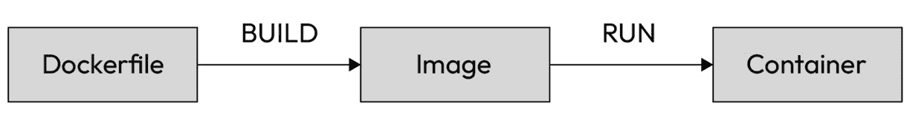
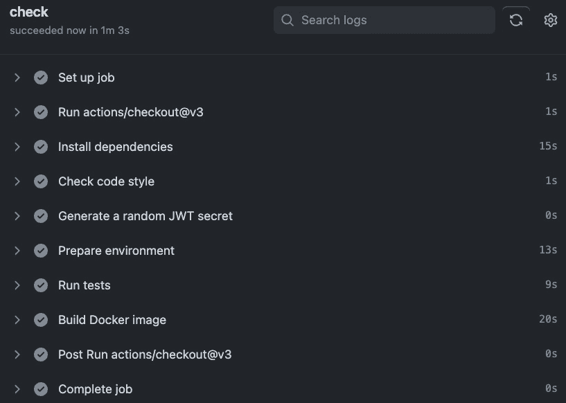
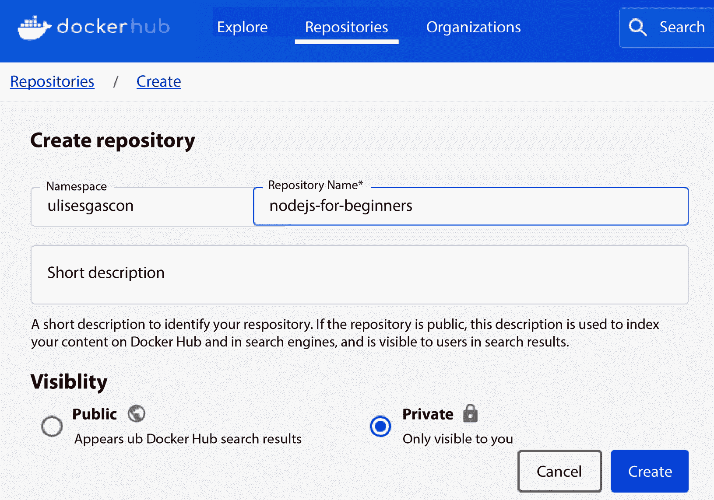
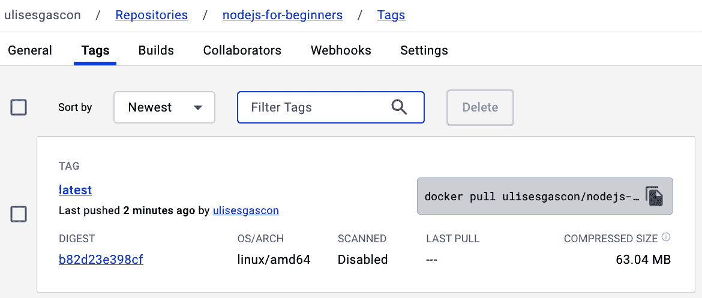
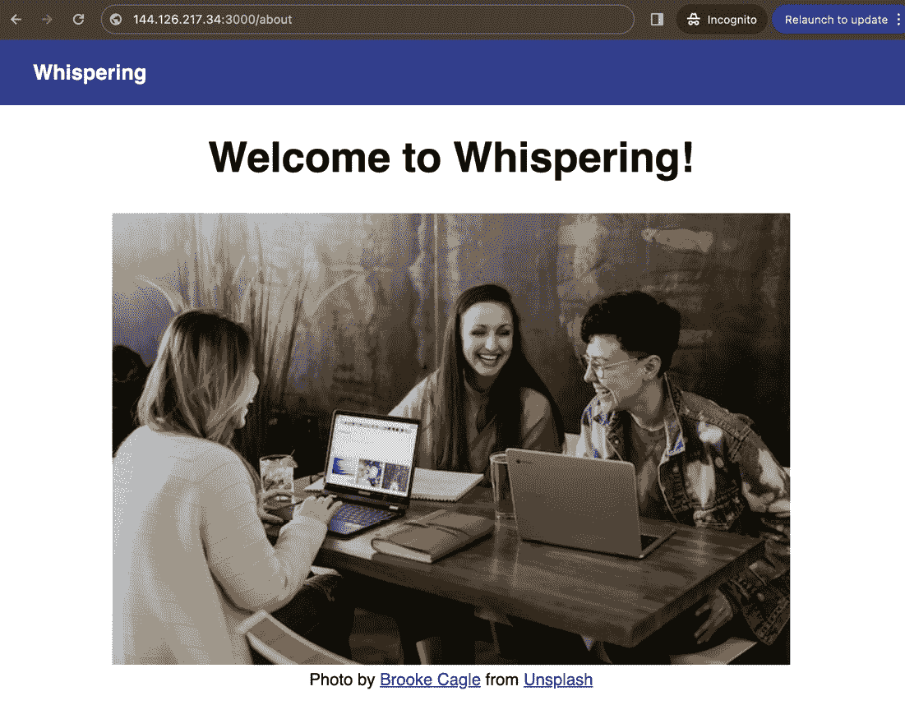
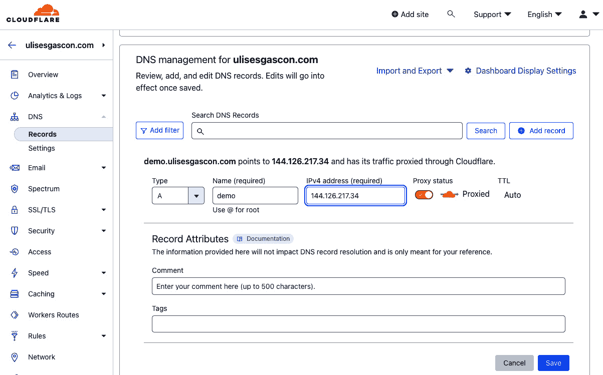

# 将 Node.js 应用 Docker 化

在本章中，我们将学习如何使用 Docker 将我们的应用部署到公共互联网。我们将探讨如何使用 GitHub Actions 确保我们的 Docker 镜像在**持续集成**（**CI**）管道中运行良好。

我们将学习如何将应用 Docker 化并将镜像发布到 Docker Hub，以实现更好的可移植性，这样我们就可以在不同的环境中下载我们的镜像。

最后，我们将讨论如何进行适当的域名设置，以及如何使用 Cloudflare 添加**安全套接字层**（**SSL**）证书到应用。我们还将探讨十二要素应用原则。

总结一下，以下是本章我们将探讨的主要主题：

+   如何使用 GitHub Actions 进行持续集成

+   如何使用 DigitalOcean Droplet 托管 Docker 应用

+   如何使用 Docker 构建应用并将镜像发布到 Docker Hub

+   如何使用 Cloudflare 进行适当的域名设置并添加 SSL 证书到应用

+   十二要素应用原则是什么，它们如何帮助您成长？

# 技术要求

要开始本章的工作，我们需要继续使用我们在上一章上传到 GitHub 的代码。如果您还没有完成上一章，您可以从[`github.com/PacktPublishing/NodeJS-for-Beginners/archive/refs/heads/main.zip`](https://github.com/PacktPublishing/NodeJS-for-Beginners/archive/refs/heads/main.zip)下载项目，并作为参考访问`step5`文件夹。

为了跟随本章中的示例，您需要在与以下提供者创建账户：

+   Docker Hub: [`hub.docker.com/signup`](https://hub.docker.com/signup)

+   Cloudflare: [`www.cloudflare.com/`](https://www.cloudflare.com/)（可选）

本章的代码文件可以在[`github.com/PacktPublishing/NodeJS-for-Beginners`](https://github.com/PacktPublishing/NodeJS-for-Beginners)找到。

查看本章动作视频中的代码[`youtu.be/VWBuF_Q3KPY`](https://youtu.be/VWBuF_Q3KPY)

# 使用 Docker 的容器和云原生解决方案

虽然使用虚拟机是一个不错的选择，但它并不是许多应用的最好选择。目前，容器是部署应用最流行的方式。容器轻量级、可移植且易于使用。在本节中，我们将学习如何使用 Docker 部署 Node.js 应用。

在前面的章节中，我们已经介绍了 Docker 的基础知识，并且一直在使用 Docker 和 Docker Compose 运行 MongoDB 数据库。我们现在需要学习如何为我们的应用创建 Docker 镜像以及如何部署它。

## Docker 生命周期

我们需要清楚地理解 Docker 的生命周期才能正确使用它。让我们从简要介绍开始。在下面的图中，我们可以看到 Docker 的生命周期：



图 17.1 – Docker 生命周期图

我们需要从一个`Dockerfile`开始，这是一个包含构建镜像指令的文件。然后，我们可以使用`docker build`命令来构建镜像。接下来，我们可以使用`docker run`命令来运行容器。

如果我们想与其他人共享镜像，我们可以使用`docker push`命令将镜像推送到一个注册表。然后，其他人可以使用`docker pull`命令从注册表中拉取镜像。这一步与`npm publish`非常相似，但不同的是，我们分享的是镜像而不是代码。

既然我们已经明白了理论，那么在下一节中，我们将把我们的应用程序 Docker 化。

## 将应用程序 Docker 化

在您的本地机器上，使用 Docker Desktop 1.18，您可以在项目根目录（`package.json`所在的位置）中运行`docker init`来创建一个`Dockerfile`（见[`docs.docker.com/engine/reference/commandline/init/`](https://docs.docker.com/engine/reference/commandline/init/)）。因此，我们可以通过交互式过程自动创建文件：

```js
Let's get started!
? What application platform does your project use? Node
? What version of Node do you want to use? 20.11.0
? Which package manager do you want to use? npm
? What command do you want to use to start the app? npm start
? What port does your server listen on? 3000
CREATED: .dockerignore
CREATED: Dockerfile
CREATED: compose.yaml
✔ Your Docker files are ready!
```

此工具将创建以下文件：`.dockerignore`、`dockerfile`和`compose.yaml`。我们将使用`dockerfile`来构建镜像，并使用`compose.yaml`来运行容器。

Dockerfile 将看起来像这样：

```js
# syntax=docker/dockerfile:1
ARG NODE_VERSION=20.11.0
FROM node:${NODE_VERSION}-alpine
ENV NODE_ENV production
WORKDIR /usr/src/app
RUN --mount=type=bind,source=package.json,target=package.json \
    --mount=type=bind,source=package-lock.json,target=package-lock.json \
    --mount=type=cache,target=/root/.npm \
    npm ci --omit=dev
USER node
COPY . .
EXPOSE 3000
CMD npm start
```

这是一个在 Docker 容器内设置 Node.js 环境的`Dockerfile`。它首先指定要使用的 Node.js 版本（`20.11.0`），并使用 Node.js 的 Alpine 版本以较小的体积。它将`NODE_ENV`环境变量设置为`production`。然后，它将容器内的工作目录设置为`/usr/src/app`。`RUN`命令将主机上的`package.json`和`package-lock.json`文件挂载到容器中，并为`npm`模块设置缓存。然后，它运行`npm ci --omit=dev`来仅安装`production`依赖项。出于安全原因，它将用户更改为`node`，将主机当前目录下的所有文件复制到容器当前目录，暴露端口`3000`以便应用程序可访问，并最终将启动应用程序的命令设置为`npm start`。

对于我们当前的应用程序，我们可以删除`compose.yaml`文件，因为我们不需要它。重要的是要检查`.dockerignore`文件的内容，因为它在执行 Dockerfile 中的`COPY . .`命令时排除了构建过程中的某些文件。

我们已经有了使用 Docker 管理我们应用程序所需的所有文件，因此在下一段中，我们将详细介绍这一点。

## 使用 Docker 管理应用程序

在上一章中，我们使用了 PM2 来管理应用程序。这次，我们将使用 Docker。我们可以使用以下命令来构建镜像：

```js
docker build -t nodejs-for-beginners .
```

然后，我们可以使用以下命令来运行容器，该命令将暴露端口`3000`并使用特定的环境变量：

```js
docker run \
-e MONGODB_URI='mongodb+srv://<username>:<password>@<cluster-url>/test?retryWrites=true&w=majority' \
-e PORT='3000' \
-e SALT_ROUNDS='10' \
-e JWT_SECRET='Tu1fo0mO0PcAvjq^q3wQ24BXNI8$9R' \
-p 3000:3000 \
nodejs-for-beginners
```

您需要将`mongodb+srv://<username>:<password>@<cluster-url>/test?retryWrites=true&w=majority`替换为您的 MongoDB Atlas 集群的连接字符串。

如果你打开浏览器并访问 [`localhost:3000`](http://localhost:3000)，你会看到应用程序按预期运行。

现在我们知道 Docker 化的应用程序运行良好，我们可以在 CI 中添加一个步骤来确保 Docker 镜像正确生成。

## 将 docker build 添加到 CI

我们可以将 `docker build` 步骤添加到 CI 流程中，以确保镜像正确构建。我们可以在 `.github/workflows/ci.yml` 中的 CI 流程中添加以下步骤：

```js
- name: Build Docker image
  run: docker build -t nodejs-for-beginners .
```

一旦提交这些更改，你可以在“构建 Docker 镜像”步骤中检查工作流程的状态：



图 17.2 – 检查工作流程状态

正如你在 *图 17.2* 中可以看到的，我们成功构建了 Docker 镜像。在下一节中，我们将学习如何使这个镜像公开。

## 推送镜像到 Docker Hub

你需要在 Docker Hub 中创建一个新的仓库：[`hub.docker.com/repositories/new`](https://hub.docker.com/repositories/new)。在我的情况下，我创建了一个名为 `nodejs-for-beginners` 的私有仓库，如图所示：



图 17.3 – 创建新的仓库

我建议你创建一个**公共**镜像，但如果你想要创建一个**私有**镜像，那么你将需要在目标机器（DigitalOcean Droplet 或其他替代方案）上使用 Docker CLI 登录 Docker Hub。

然后，从你的本地机器，你需要使用以下命令登录 Docker Hub：

```js
docker login
```

然后，你可以使用以下命令使用存储库的名称构建镜像：

```js
docker build -t YOUR-USER/YOUR-PROJECT:latest .
```

你需要将 `YOUR-USER/YOUR-PROJECT` 替换为你的用户和项目名称。在我的情况下，我使用了 `ulisesgascon/nodejs-for-beginners`。

此命令将打印大量日志，但最终，你不应该看到任何错误。

然后，你需要使用以下命令将镜像推送到 Docker Hub：

```js
docker push YOUR-USER/YOUR-PROJECT
```

输出应该是这样的，使用默认的 `latest` 标签：

```js
The push refers to repository [docker.io/ulisesgascon/nodejs-for-beginners]
204442a0fb02: Pushed
c797ca72cc32: Pushed
c2f374546252: Pushed
9841711cc266: Mounted from library/node
b748d0576055: Mounted from library/node
f866f7afbf16: Mounted from library/node
4693057ce236: Mounted from library/node
latest: digest: sha256:b82d23e398cf03165e89b8d1661125eda0f7b930e21 eef8c62281acd427e2d06 size: 1787
```

如果你访问 Docker Hub 仓库，你会看到镜像已经被推送，并准备好在其他机器上使用 `docker pull YOUR-USER/YOUR-PROJECT:latest` 命令。

正如你在以下图中可以看到的，镜像在 Docker Hub 仓库中可用：



图 17.4 – Docker Hub 仓库中的镜像

## 使用 GitHub Actions 发布镜像

作为将镜像推送到 Docker Hub 的另一种方式，我们可以直接使用 GitHub Actions 发布镜像。这是一个自动化流程的绝佳方式，避免了在本地机器上安装 Docker 的需要，并确保镜像正确构建。

我邀请你自己完成这本书的最后一个挑战。以下是一些提示来帮助你：

+   GitHub 发布 Docker 镜像的指南：[`docs.github.com/en/actions/guides/publishing-docker-images`](https://docs.github.com/en/actions/guides/publishing-docker-images)

+   来自 `simple-api` 项目的管道参考：[`github.com/UlisesGascon/simple-api/blob/main/.github/workflows/release.yml#L58`](https://github.com/UlisesGascon/simple-api/blob/main/.github/workflows/release.yml#L58)

在下一节中，我们将学习如何使用 Docker 在 DigitalOcean Droplet 中运行项目。

# 运行容器

在上一章中，我们使用了 PM2 来管理应用程序的生命周期。这次我们将有所不同：我们将直接使用 Docker。

我们的第一步将是使用 SSH 在目标机器上安装 Docker。遵循安装指南 ([`docs.docker.com/engine/install/ubuntu/`](https://docs.docker.com/engine/install/ubuntu/))，然后运行 `docker run hello-world`。该命令将正常运行而不会生成任何错误，这是一个简单的测试，以检查 Docker 引擎是否正确设置并运行。

请确保在我们进行下一步之前，您已经停止了 PM2 应用程序，因为只有一个服务可以控制端口 `3000`。然后，我们的最后一步将是运行容器，但这次我们不需要构建容器，因为我们直接从 Docker Hub 拉取镜像：

```js
docker run \
-e MONGODB_URI='mongodb+srv://<username>:<password>@<cluster-url>/test?retryWrites=true&w=majority' \
-e PORT='3000' \
-e SALT_ROUNDS='10' \
-e JWT_SECRET='Tu1fo0mO0PcAvjq^q3wQ24BXNI8$9R' \
-p 3000:3000 \
YOUR-USER/YOUR-PROJECT
```

您需要将 `mongodb+srv://<username>:<password>@<cluster-url>/test?retryWrites=true&w=majority` 替换为您的 MongoDB Atlas 集群的连接字符串，并将 `YOUR-USER/YOUR-PROJECT` 替换为您的用户和项目名称。在我的情况下，我使用了 `ulisesgascon/nodejs-for-beginners`。

我们可以使用与运行 PM2 时相同的 IP 地址和端口来查看应用程序按预期运行：



图 17.5 – 使用 Droplet 外部 IP 运行的应用程序

在下一节中，我们将学习如何使用 Cloudflare 来处理域名和证书，这样您的用户就不需要记住服务器的 IP 地址来访问它。如果您正在使用本地机器，那么您的设置将不同，因为您可能没有静态 IP 地址，所以我建议您遵循这个教程：[`www.youtube.com/watch?v=DCxt9SAnkyc`](https://www.youtube.com/watch?v=DCxt9SAnkyc)。这样，您的项目就可以通过 ngrok ([`ngrok.com/`](https://ngrok.com/)) 从互联网上访问。这将生成一个连接隧道到您的机器，并将您的服务暴露为 `https://xxxxsxx.ngrok.io`，无需担心网络设置。请注意，对互联网流量开放的自托管应用程序需要具备扎实的网络安全知识 ([`www.youtube.com/watch?v=URWlY3Qr9l8`](https://www.youtube.com/watch?v=URWlY3Qr9l8))，尤其是如果您计划长期使用这种方法。

注意

如果您在遵循本章步骤运行项目时遇到问题，或者您尝试了替代方法，您可以使用本章开头下载的源代码中的 `step6` 文件夹来比较和修复可能的错误。

在下一节中，我们将讨论如何进行适当的域名设置以及如何向应用程序添加 SSL 证书。

# 使用 Cloudflare

应用程序正在 DigitalOcean Droplet 中运行，但只能通过 IP 地址和端口号访问。因此，我们需要进行适当的域名设置并向应用程序添加 SSL 证书。获取域名会有相关的财务成本，根据域名注册商的不同，这个成本可能会有所不同，有些域名的价格可能比其他域名更高。SSL 与 **传输层安全性**（**TLS**）一起作为机制，我们可以将其添加到我们的 Web 项目中，这将允许客户端和服务器之间的加密。用简单的话说，这将是在使用 http://myproject.com 或 https://myproject.com 访问您的网站之间的区别。

许多浏览器今天都会阻止访问未使用 `https://` 的网站。我们可以使用 Cloudflare 来启用两者（`http` 和 `https`），并且对于基本功能是免费的，所以以下是需要遵循的步骤：

1.  在 Cloudflare 中添加一个新的域名：[`www.youtube.com/watch?v=7hY3gp_-9EU`](https://www.youtube.com/watch?v=7hY3gp_-9EU)。

1.  在 Cloudflare 中添加一个新的 DNS 记录：[`www.youtube.com/watch?v=PYSIt3fEEoI`](https://www.youtube.com/watch?v=PYSIt3fEEoI)。在我们的例子中，我们将添加一个 `A` 记录，包含域名或子域名以及 Droplet 的 IP 地址。

    您需要等待 DNS 传播；这可能需要一段时间。

1.  当 DNS 传播完成后，您可以使用域名访问应用程序。在我的情况下，我可以通过域名 `https://demo.ulisesgascon.com` 访问应用程序。在以下图中，您可以看到在 Cloudflare 中的域名设置：



图 17.6 – Cloudflare 中的域名设置

如果您不想在 URL 中指定端口号，您可以将应用程序运行在端口 `443`（`https` 的默认端口）或 `80`（`http` 的默认端口）上，而不是端口 `3000`。

现在我们已经完成了域名设置，我们可以考虑更高级的主题。在下一节中，我们将探讨十二要素应用原则。

# 高级内容 – 十二要素应用原则

继续学习的一个好方法是遵循十二要素应用原则。这是一个构建现代、可扩展、可维护和可移植应用程序的方法论，它由 12 个原则组成。以下是与定义一起的 12 个原则，摘自 [`12factor.net`](https://12factor.net)：

+   *代码库*：一个代码库在版本控制中跟踪，多次部署

+   *依赖项*：明确声明并隔离依赖项

+   *配置*：将配置存储在环境中

+   *后端服务*：将后端服务视为附加资源

+   *构建、发布、运行*：严格分离构建和运行阶段

+   *进程*：以一个或多个无状态进程执行应用

+   *端口绑定*：通过端口绑定导出服务

+   *并发性*：通过进程模型进行扩展

+   *可丢弃性*：通过快速启动和优雅关闭最大化鲁棒性

+   *开发/生产一致性*：尽可能使开发、预发布和生产保持相似

+   *日志*：将日志视为事件流

+   *管理进程*：以一次性进程运行管理/管理任务

我们在这本书中已经讨论了许多原则，例如配置管理，但还有一些我们尚未涉及。例如，我们没有设置预发布环境，也没有讨论管理进程。我们构建并部署了一个简单的应用，它不是为了供真实用户使用或处理真实流量而设计的，但如果你想要构建和部署实际项目，强烈建议遵循这些原则。

总体来说，这是一个继续学习和更深入理解主题的绝佳方式，同时还能提高我们在这本书中共同构建的应用。

在下一节中，我们将回顾清理本章中使用的资源的步骤，以防你不再需要它们。

# 清理

一旦我们完成应用，我们可以清理本章中使用的资源，因为我们近期内不再需要它们。大多数资源是免费的，但我强烈建议删除不再需要的资源，尤其是如果你为其中任何一项付费的话。

这些是可以删除的资源：

+   本章中创建的 DigitalOcean Droplet(s)

+   MongoDB Atlas 集群

+   Docker Hub 仓库

+   Cloudflare 域名

+   GitHub 仓库（尽管我建议你保留它，因为你可以将其用作未来的参考）

信息

你可以通过删除不再需要的 Docker 镜像或你在跟随本书时创建的`node_modules`文件夹，在本地环境中获得额外的硬盘空间。

这个清理过程是我们这次旅程的最后一个步骤。在你进入最后一节之前，我建议你整理你在这次旅程中记录的笔记，并妥善存储它们，以便将来可以访问。在下一节中，我们将总结本章内容。

# 摘要

在本章中，我们学习了如何使用 Docker 将我们的应用部署到公共互联网，以及如何使用 GitHub Actions 对我们的 Docker 镜像进行 CI。

我们学习了如何使用 Docker 构建应用，如何将镜像发布到 Docker Hub，并讨论了如何使用 Cloudflare 进行适当的域名设置以及如何将 SSL 证书添加到应用中。我们研究了十二要素应用原则，并回顾了清理本章中使用的资源的步骤。

恭喜你，你做到了！这是旅程的终点。我希望你喜欢这段经历，并且学到了很多。我希望你能继续学习和提升你的技能，并且继续用 Node.js 构建令人惊叹的应用程序。我很乐意听到你的声音，了解你对这本书的看法。你可以在 X/Twitter ([`twitter.com/kom_256`](https://twitter.com/kom_256)) 或 LinkedIn ([`www.linkedin.com/in/ulisesgascon/`](https://www.linkedin.com/in/ulisesgascon/))）上联系我。

# 进一步阅读

+   十二要素应用原则：[`12factor.net/`](https://12factor.net/)

+   那么 Cloudflare 是什么？：[`www.cloudflare.com/learning/what-is-cloudflare/`](https://www.cloudflare.com/learning/what-is-cloudflare/)

+   *19 世纪铁路战争能教给我们关于构建未来就绪的* *云*：[`cloud.google.com/blog/transform/what-19th-century-railroad-wars-can-teach-us-about-cloud-containers`](https://cloud.google.com/blog/transform/what-19th-century-railroad-wars-can-teach-us-about-cloud-containers)
