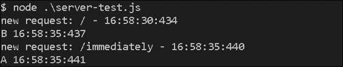

# 第一章. 常见编程范式

Node.js 是一种由 JavaScript 驱动的技术。这种语言已经发展了超过 15 年，最初用于 Netscape。多年来，他们发现了有趣和有用的设计模式，这些模式将有助于我们在本书中。所有这些知识现在都可供 Node.js 程序员使用。当然，由于我们在不同的环境中运行代码，所以存在一些差异，但我们仍然能够应用所有这些良好的实践、技术和范式。我总是说，为您的应用程序建立一个良好的基础是很重要的。无论您的应用程序有多大，它都应该依赖于灵活且经过良好测试的代码。本章包含经过验证的解决方案，保证您有一个良好的起点。了解设计模式并不一定使您成为更好的开发者，因为在某些情况下，严格应用原则可能不起作用。您实际上得到的是想法，这些想法将帮助您跳出思维定式。有时，编程就是管理复杂性。我们都会遇到问题，而编写良好应用程序的关键是找到最佳合适的解决方案。我们了解的范式越多，我们的工作就越容易，因为我们有现成的、可以应用的概念。这就是为什么本书从介绍最常见的编程范式开始。

# Node.js 基础知识

Node.js 是一种单线程技术。这意味着每个请求都只在一个线程中处理。在其他语言中，例如 Java，Web 服务器为每个请求实例化一个新的线程。然而，Node.js 旨在使用异步处理，有一种理论认为在单个线程中这样做可能会带来良好的性能。单线程应用程序的问题在于阻塞 I/O 操作；例如，当我们需要从硬盘读取文件以响应用户时。一旦新的请求到达我们的服务器，我们就打开文件并开始读取。问题发生在当另一个请求生成，而应用程序仍在处理第一个请求时。让我们通过以下示例来阐明这个问题：

```js
var http = require('http');
var getTime = function() {
  var d = new Date();
  return  d.getHours() + ':' + d.getMinutes() + ':' + 
      d.getSeconds() + ':' + d.getMilliseconds();
}
var respond = function(res, str) {
  res.writeHead(200, {'Content-Type': 'text/plain'});
  res.end(str + '\n');
  console.log(str + ' ' + getTime());
}
var handleRequest = function (req, res) {
  console.log('new request: ' + req.url + ' - ' + getTime());
  if(req.url == '/immediately') {
    respond(res, 'A');
  } else {
    var now = new Date().getTime();
    while(new Date().getTime() < now + 5000) {
      // synchronous reading of the file
    }
    respond(res, 'B');
  }
}
http.createServer(handleRequest).listen(9000, '127.0.0.1');
```

### 小贴士

**下载示例代码**

您可以从[`www.packtpub.com`](http://www.packtpub.com)的账户下载您购买的所有 Packt 书籍的示例代码文件。如果您在其他地方购买了这本书，您可以访问[`www.packtpub.com/support`](http://www.packtpub.com/support)并注册，以便将文件直接通过电子邮件发送给您。

我们在第一行初始化的`http`模块是运行 Web 服务器所需的。`getTime`函数返回当前时间作为字符串，`respond`函数向客户端的浏览器发送一个简单的文本，并报告收到的请求已被处理。最有趣的功能是`handleRequest`，它是我们逻辑的入口点。为了模拟读取大文件，我们将创建一个持续 5 秒的`while`循环。一旦我们运行服务器，我们就可以向`http://localhost:9000`发送 HTTP 请求。为了演示单线程行为，我们将同时发送两个请求。这些请求如下：

+   一个请求将被发送到`http://localhost:9000`，服务器将执行一个需要 5 秒的同步操作

+   另一个请求将被发送到`http://localhost:9000/immediately`，服务器应该立即响应

以下截图是服务器打印出的输出，在 ping 了两个 URL 之后：



如我们所见，第一个请求在`16:58:30:434`到达，其响应在`16:58:35:440`发送，即 5 秒后。然而，问题是第二个请求在第一个请求完成后被注册。这是因为属于 Node.js 的线程正忙于处理`while`循环。

当然，Node.js 有针对阻塞 I/O 操作的解决方案。它们被转换为接受回调的异步函数。一旦操作完成，Node.js 就会触发回调，通知任务已完成。这种方法的一个巨大好处是，在等待 I/O 结果的同时，服务器可以处理另一个请求。处理外部事件并将它们转换为回调调用的实体被称为`event`循环。`event`循环充当一个非常好的管理者，并将任务委托给各种工作者。它从不阻塞，只是等待事情发生；例如，文件成功写入的通知。

现在，我们不再同步读取文件，而是将我们的简短示例转换为使用异步代码。修改后的示例看起来如下代码：

```js
var handleRequest = function (req, res) {
  console.log('new request: ' + req.url + ' - ' + getTime());
  if(req.url == '/immediately') {
    respond(res, 'A');
  } else {
    setTimeout(function() {
      // reading the file
      respond(res, 'B');	
      }, 5000);	  	
    }
}
```

将`while`循环替换为`setTimeout`调用。这种更改的结果在服务器输出中非常明显，如下面的截图所示：


第一个请求仍然在 5 秒后收到响应。然而，第二个请求立即被处理。

# 在模块中组织你的代码逻辑

如果我们编写了大量的代码，迟早我们会开始意识到我们的逻辑应该被分割成不同的模块。在大多数语言中，这是通过类、包或其他语言特定的语法来实现的。然而，在 JavaScript 中，我们并没有原生的类。一切都是对象，在实践中，对象继承其他对象。在 JavaScript 中实现面向对象编程有几种方法。你可以使用原型继承、对象字面量或玩转函数调用。幸运的是，Node.js 有一个标准化的模块定义方式。这是通过实现 **CommonJS** 来实现的，这是一个指定 JavaScript 生态系统项目的项目。

所以，你有一些逻辑，并且你希望通过提供有用的 API 方法来封装它。如果你达到了那个时刻，你肯定是在正确的方向上。这真的很重要，也许它是当今编程中最具挑战性的方面之一。将我们的应用程序分割成不同的部分并将函数委托给它们的能力并不总是容易的任务。很多时候，这被低估了，但它却是良好架构的关键。如果一个模块包含大量的依赖项、操作不同的数据存储或具有多个职责，那么我们就是在做错事。这样的代码无法被测试，并且难以维护。即使我们注意到了这两件事，扩展代码并继续与之工作仍然很困难。这就是为什么为不同的功能定义不同的模块是很好的。在 Node.js 的上下文中，这是通过 `exports` 关键字来实现的，它是 `module.exports` 的引用。

## 构建汽车构造应用

让我们用一个简单的例子来阐明这个过程。假设我们正在构建一个构建汽车的应用程序。我们需要一个主模块（`car`）和几个其他模块，这些模块负责汽车的不同部分（`wheels`、`windows`、`doors` 等）。让我们从定义一个代表汽车轮子的模块开始，以下代码：

```js
// wheels.js
var typeOfTires;
exports.init = function(type) {
    typeOfTires = type;
}
exports.info = function() {
  console.log("The car uses " + typeOfTires + " tires.");
}
```

上述代码可能是 `wheels.js` 的内容。它包含两个方法。第一个方法 `init` 应该首先被调用，接受一个设置，即轮子轮胎的类型。第二个方法简单地输出一些信息。在我们的主文件 `car.js` 中，我们必须获取轮子的实例并使用提供的 API 方法。这可以按照以下方式完成：

```js
// cars.js
  var wheels = require("./wheels.js");
  wheels.init("winter");
  wheels.info();
```

当你使用 `node car.js` 运行应用时，你会得到以下输出：

```js
The car uses winter tires.
```

因此，你希望暴露给外部世界的所有内容都应该附加到 `export` 对象上。请注意，`typeOfTires` 是模块的局部变量。它仅在 `wheels.js` 中可用，而在 `car.js` 中不可用。将对象或函数直接应用于 `exports` 对象也是常见的做法，以下代码示例展示了这一点：

```js
// engine.js
var Class = function() {
    // ...
}
Class.prototype = {
  forward: function() {
    console.log("The car is moving forward.");
  },
  backward: function() {
    console.log("The car is moving backward.");	
  } 
}
module.exports = Class;
```

在 JavaScript 中，一切都是对象，并且这个对象有一个`prototype`属性。它就像一个存储可用变量和方法的地方。`prototype`属性在 JavaScript 的继承中得到了广泛的使用，因为它提供了一种传递逻辑的机制。

我们还将澄清`module.exports`和`exports`之间的区别。正如你所见，在`wheels.js`中，我们直接将两个函数`init`和`info`赋值给了`exports`全局对象。实际上，这个对象是`module.exports`的引用，并且任何附加到它的函数或变量都可以对外部世界可用。然而，如果我们直接将一个新的对象或函数赋值给`export`对象，我们不应该期望在文件导入后能够访问它。这应该使用`module.exports`来完成。以下代码将作为一个例子：

```js
// file.js
module.exports.a = 10;
exports.b = 20;

// app.js
var file = require('./file');
console.log(file.a, file.b);
```

假设`app.js`和`file.js`两个文件都在同一个目录下。如果我们运行`node app.js`，我们将得到`10 20`作为结果。然而，考虑如果我们把`file.js`的代码改为以下代码会发生什么：

```js
module.exports = { a: 10 };
exports.b = 20;
```

在这种情况下，我们会得到`10 undefined`作为结果。这是因为`module.exports`被分配了一个新的对象，而`exports`仍然指向旧的。

## 使用汽车的引擎

假设`engine.js`中的模块控制着汽车。它有使汽车前进和后退的方法。它有一点不同，因为逻辑是在一个单独的类中定义的，并且这个类直接作为`module.exports`的值传递。此外，因为我们正在导出一个函数，而不是一个对象，所以我们的实例应该使用`new`关键字来创建。我们将在以下代码中看到如何使用`new`关键字来使汽车引擎工作：

```js
var Engine = require("./engine.js");
var e = new Engine();
e.forward();
```

使用 JavaScript 函数作为构造函数和直接调用它们之间存在显著差异。当我们以构造函数的方式调用函数时，我们会得到一个具有自己原型的新的对象。如果我们遗漏了`new`关键字，最终得到的值就是函数调用的结果。

Node.js 缓存了`require`方法返回的模块。这样做是为了防止阻塞`event`循环并提高性能。这是一个同步操作，如果没有缓存，Node.js 将不得不重复做同样的工作。还应该知道，我们可以仅使用文件夹名称来调用该方法，但目录内应该有一个`package.json`或`index.js`文件。所有这些机制都在 Node.js 的官方文档[`nodejs.org/`](http://nodejs.org/)中得到了很好的描述。这里需要注意的是，环境鼓励模块化编程。我们需要的只是将原生实现集成到系统中，我们不需要使用提供模块化的第三方解决方案。

就像客户端代码一样，每个 Node.js 模块都可以被扩展。再次强调，由于我们正在用纯 JavaScript 编写代码，我们可以使用众所周知的继承方法。例如，看看以下代码：

```js
var Class = function() { }
Class.prototype = new require('./engine.js')();
Class.prototype.constructor = Class;
```

Node.js 甚至为此提供了一个辅助方法。假设我们想要扩展我们的`engine.js`类，并添加 API 方法来控制汽车向左和向右移动。我们可以用以下代码片段来实现：

```js
// control.js
var util = require("util");
var Engine = require("./engine.js");
var Class = function() { }
util.inherits(Class, Engine); 
Class.prototype.left = function() {
  console.log("The car is moving to left.");
};
Class.prototype.right = function() {
  console.log("The car is moving to right.");  
}
module.exports = Class;
```

第一行获取 Node.js 原生`utils`模块的引用。它包含许多有用的函数。第四行是魔法发生的地方。通过调用`inherits`方法，我们实际上为我们的`Class`对象设置了一个新的原型。请记住，每个新方法都应该使用已经应用的原型。这就是为什么`left`和`right`方法在继承之后定义。最后，我们的汽车将能够向四个方向移动，如下面的代码片段所示：

```js
var Control = require("./control.js");
var c = new Control();
c.forward();
c.right();
```

# 理解模块间通信

我们已经找到了如何将我们的代码逻辑放入模块中的方法。现在，我们需要知道如何使它们相互通信。人们经常将 Node.js 描述为一个事件驱动系统。它也被称作非阻塞的，因为我们之前在章节中看到，它可以在上一个请求完全完成之前接受新的请求。这非常高效且具有高度的可扩展性。事件非常强大，是通知其他模块正在发生什么的良好手段。它们带来了封装，这在模块化编程中非常重要。让我们给之前讨论的汽车示例添加一些事件。假设我们有空调，我们需要知道它何时启动。这种逻辑的实现包括两个部分。第一个是空调模块。它应该派发一个表示动作开始的事件。第二个部分是其他监听该事件的代码。我们将创建一个名为`air.js`的新文件，其中包含负责空调的逻辑，如下所示：

```js
// air.js
var util = require("util");
var EventEmitter = require('events').EventEmitter;
var Class = function() { }
util.inherits(Class, EventEmitter);
Class.prototype.start = function() {
  this.emit("started");
};
module.exports = Class;
```

我们的这个类扩展了名为`EventEmitter`的 Node.js 模块。它包含`emit`或`on`等方法，这些方法帮助我们建立基于事件的通信。定义了一个自定义方法：`start`。它简单地派发一个表示空调已开启的事件。以下代码展示了我们如何附加一个监听器：

```js
// car.js
var AirConditioning = require("./air.js");
var air = new AirConditioning();
air.on("started", function() {
  console.log("Air conditioning started");
});
air.start();
```

创建了一个 `AirConditioning` 类的新实例。我们附加了一个事件监听器并调用了 `start` 方法。处理程序被调用，并将消息打印到控制台。这个例子很简单，但展示了两个模块如何通信。这是一个非常强大的方法，因为它提供了封装。模块知道自己的职责，并且对系统其他部分的操作不感兴趣。它只是完成自己的工作并派发通知（事件）。例如，在前面的代码中，`AirConditioning` 类不知道我们在它启动时会输出一条消息。它只知道应该派发一个特定的事件。

非常常见的情况是在事件发射期间发送数据。这非常简单。我们只需在事件名称旁边传递另一个参数即可。以下是如何发送 `status` 属性的示例：

```js
Class.prototype.start = function() {
  this.emit("started", { status: "cold" });
};
```

附加到事件的对象包含有关空调模块的一些信息。相同的对象将在事件监听器中可用。以下代码展示了如何获取之前提到的 `status` 变量的值：

```js
air.on("started", function(data) {
  console.log("Status: " + data.status);
});
```

存在一个设计模式可以说明上述过程。它被称为 **观察者**。在该模式的上下文中，我们的空调模块被称为 **主题**，而汽车模块被称为观察者。主题向其观察者广播消息或事件，通知他们有变化发生。

如果我们需要移除一个监听器，Node.js 提供了一个名为 `removeListener` 的方法。我们甚至可以使用 `setMaxListeners` 允许特定数量的观察者。总的来说，事件是连接你的逻辑部分的最佳方式之一。主要好处是你可以隔离模块，但仍然与你的应用程序的其他部分保持高度通信。

# 异步编程

如我们之前所学的，在非阻塞环境中，例如 Node.js，大多数过程都是异步的。一个请求到达我们的代码，我们的服务器开始处理它，但与此同时继续接受新的请求。例如，以下是一个简单的文件读取操作：

```js
fs.readFile('page.html', function (err, content) {
  if (err) throw err;
  console.log(content);
});
```

`readFile` 方法接受两个参数。第一个参数是我们想要读取的文件的路径，第二个参数是在操作完成时将被调用的函数。即使读取失败，回调也会被触发。此外，由于所有操作都可以通过异步方式完成，我们可能会遇到一个非常长的回调链。这有一个术语，称为回调地狱。为了阐明这个问题，我们将扩展前面的示例并执行一些文件内容操作。在下面的代码中，我们嵌套了几个异步操作：

```js
fs.readFile('page.html', function (err, content) {
  if(err) throw err;
  getData(function(data) {
    applyDataToTheTemplate(content, data, function(resultedHTML) {
      renderPage(resultedHTML, function() {
        showPage(function() {
          // finally, we are done
        });
     });
  });
  });
});
```

如您所见，我们的代码看起来很糟糕。它难以阅读和跟踪。有十几种工具可以帮助我们避免这种情况。然而，我们可以自己解决这个问题。首先要做的是发现问题。如果我们有四个或五个以上的嵌套回调，那么我们绝对应该重构我们的代码。有一种非常简单的方法，通常很有帮助，可以使代码**扁平化**。前面的代码可以转换为一个更友好、更易读的格式。例如，请看以下代码：

```js
var onFileRead = function(content) {
  getData(function(data) {
    applyDataToTheTemplate(content, data, dataApplied);
  });
}
var dataApplied = function(resultedHTML) {
  renderPage(resultedHTML, function() {
    showPage(weAreDone);
  });
}
var weAreDone = function() {
  // finally, we are done
}
fs.readFile('page.html', function (err, content) {
  if (err) throw err;
    onFileRead(content);
});
```

大多数回调函数都是单独定义的。由于函数具有描述性的名称，因此可以清楚地了解正在发生的事情。然而，在更复杂的情况下，这种技术可能不起作用，因为你需要定义很多方法。如果是这样的话，那么将函数组合在外部模块中会更好。前面的例子可以转换为一个接受文件名和回调函数的模块。该模块如下所示：

```js
var renderTemplate = require("./renderTemplate.js");
renderTemplate('page.html', function() {
  // we are done
});
```

你仍然有一个回调，但它看起来像辅助方法被隐藏了，只有主要功能是可见的。

处理异步代码的另一种流行方法是 **promises** 模式。我们已经讨论了 JavaScript 中的事件，而 promises 与它们类似。我们仍然在等待某个事件发生并传递一个回调。我们可以说，promises 代表一个目前不可用但将来会可用的值。promises 的语法使异步代码看起来像是同步的。让我们看看一个例子，其中有一个简单的模块加载 Twitter 推文。例子如下：

```js
var TwitterFeed = require('TwitterFeed');
TwitterFeed.on('loaded', function(err, data) {
  if(err) {
      // ...
   } else {
      // ...
   }
});
TwitterFeed.getData();
```

我们为 `loaded` 事件附加了一个监听器，并调用了 `getData` 方法，该方法连接到 Twitter 并获取信息。以下代码是如果 `TwitterFeed` 类支持 promises 的相同示例：

```js
var TwitterFeed = require('TwitterFeed');
var promise = TwitterFeed.getData();
promise.then(function(data) {
  // ...
}, function(err) {
  // ...
});
```

`promise` 对象代表我们的数据。第一个函数，它被发送到 `then` 方法，当 `promise` 对象成功时被调用。请注意，回调是在调用 `getData` 方法之后注册的。这意味着我们不是严格绑定到获取数据的过程。我们不关心动作何时发生。我们只关心它何时完成以及它的结果是什么。我们可以从基于事件的实现中看到一些差异。如下所示：

+   有一个单独的函数用于错误处理。

+   `getData` 方法可以在调用 `then` 方法之前调用。然而，对于事件来说，这种情况是不可能的。我们需要在运行逻辑之前附加监听器。否则，如果我们的任务是同步的，事件可能会在我们附加监听器之前被分发。

+   **promise** 方法只能成功或失败一次，而一个特定的事件可能会被触发多次，并且其处理程序可以被多次调用。

当我们将承诺链在一起时，它们变得非常有用。为了阐明这一点，我们将使用相同的例子，并使用以下代码将推文保存到数据库中：

```js
var TwitterFeed = require('TwitterFeed');
var Database = require('Database');
var promise = TwitterFeed.getData();
promise.then(function(data) {
  var promise = Database.save(data);
  return promise;
}).then(function() {
  // the data is saved
  // into the database
}).catch(function(err) {
  // ...
});
```

因此，如果我们的成功回调返回一个新的承诺，我们可以再次使用 `then`。此外，我们还可以只设置一个错误处理器。如果某些承诺被拒绝，最后的 `catch` 方法会被触发。

每个承诺都有四种状态，我们应该在这里提及它们，因为这是一个广泛使用的术语。一个承诺可能处于以下任何一种状态：

+   **实现（Fulfilled）**：当与承诺相关的操作成功时，承诺处于实现状态

+   **拒绝（Rejected）**：当与承诺相关的操作失败时，承诺处于拒绝状态

+   **挂起（Pending）**：如果承诺尚未被实现或拒绝，它就处于挂起状态

+   **已解决（Settled）**：当承诺被实现或拒绝时，承诺处于已解决状态

JavaScript 的异步特性使得我们的编码变得非常有趣。然而，它有时也可能导致很多问题。以下是对讨论的思路的总结，以处理这些问题：

+   尽量使用更多函数而不是闭包

+   通过移除闭包并定义顶层函数来避免金字塔状代码

+   使用事件

+   使用承诺

# 探索中间件架构

Node.js 框架基于中间件架构。这是因为这种架构带来了模块化。添加或删除系统功能非常容易，而不会破坏应用程序，因为不同的模块之间不相互依赖。想象一下，我们有几个模块都存储在一个数组中，我们的应用程序逐个使用它们。我们正在控制整个过程，也就是说，只有当我们想要时，执行才会继续。这个概念在以下图中得到了演示：


**Connect** ([`github.com/senchalabs/connect`](https://github.com/senchalabs/connect)) 是最早实现这种模式的框架之一。在 Node.js 的上下文中，中间件是一个接受请求、响应和下一个回调函数的函数。前两个参数代表中间件的输入和输出。最后一个参数是一种将流程传递给列表中下一个中间件的方式。以下是一个简短的例子：

```js
var connect = require('connect'),
    http = require('http');

var app = connect()
  .use(function(req, res, next) {
    console.log("That's my first middleware");
    next();
  })
  .use(function(req, res, next) {
    console.log("That's my second middleware");
    next();
  })
  .use(function(req, res, next) {
    console.log("end");
    res.end("hello world");
  });

http.createServer(app).listen(3000);
```

```js
data property.
```

```js
.use(function(req, res, next) {
    req.data = { value: "middleware"};
    next();
})
.use(function(req, res, next) {
    console.log(req.data.value);
})
```

请求和响应对象在每一个函数中都是相同的。因此，中间件共享相同的范围。同时，它们是完全独立的。这种模式提供了一个非常灵活的开发环境。我们可以组合由不同开发者编写的执行不同任务的模块。

# 组合与继承

在上一节中，我们学习了如何创建模块，如何使它们相互通信，以及如何使用它们。让我们谈谈如何设计模块。构建一个优秀应用程序的方法有数十种。也有一些关于这个主题的杰出书籍，但我们将关注两种最常用的技术：组合和继承。理解这两者之间的区别非常重要。它们都有优点和缺点。在大多数情况下，它们的用法取决于当前项目。

上一节中的`car`类是组合的完美例子。`car`对象的功能是由其他小对象构建的。因此，主模块实际上是将任务委托给其他类。例如，汽车的车轮或空调是由外部定义的模块控制的：

```js
var wheels = require("./wheels.js")();
var control = require("./control.js")();
var airConditioning = require("./air.js")();
module.export = {
  run: function() {
    wheels.init();
    control.forward();
    airConditioning.start();
  }
}
```

对于外界来说，汽车只有一个方法：`run`。然而，实际上我们执行了三种不同的操作，它们定义在其他模块中。通常，组合比继承更受欢迎，因为在使用这种方法时，我们可以轻松地添加我们想要的任何数量的模块。而且，我们不仅可以包含模块，还可以包含其他组合。

另一方面是继承。以下代码是继承的典型示例：

```js
var util = require("util");
var EventEmitter = require('events').EventEmitter;
var Class = function() { }
util.inherits(Class, EventEmitter);
```

这段代码意味着我们的类需要是一个事件发射器，因此它简单地从另一个类继承该功能。当然，在这种情况下，我们仍然可以使用组合并创建`EventEmitter`类的实例，定义如`on`和`dispatch`等方法，并将实际工作委托出去。然而，在这种情况下使用继承会更好。

事实真相介于两者之间——组合和继承应该协同工作。它们确实是伟大的工具，但每个都有其合适的位置。这不仅仅是黑白分明，有时很难找到正确的方向。有三种方法可以向我们的对象添加行为。如下所示：

+   直接将功能写入对象

+   从已经具有所需行为的类继承功能

+   创建一个执行工作的对象本地实例

第二种与继承相关，最后一种实际上是组合。通过使用组合，我们添加了更多的抽象层，这本身并不是坏事，但它可能导致不必要的复杂性。

# 管理依赖

依赖管理是复杂软件中最大的问题之一。我们经常围绕第三方库或为其他项目编写的自定义模块构建我们的应用程序。我们这样做是因为我们不希望每次都重新发明轮子。

在本章的前几节中，我们使用了 `require` 全局函数。这就是 Node.js 将依赖项添加到当前模块的方式。一个 JavaScript 文件中编写的功能被包含在另一个文件中。好事是导入文件中的逻辑存在于自己的作用域中，并且只有公开导出的函数和变量对宿主可见。通过这种行为，我们能够将我们的逻辑模块分离成 Node.js 包。有一个工具可以控制这样的包。它被称为 **Node 包管理器** (**npm**)，它作为一个命令行工具提供。Node.js 的流行主要归功于其包管理器的存在。每个开发者都可以发布自己的包并与社区分享。良好的版本控制帮助我们绑定我们的应用程序到特定版本的依赖项，这意味着我们可以使用依赖于其他模块的模块。使这一切工作的主要规则是在我们的项目中添加一个 `package.json` 文件。我们将使用以下代码添加此文件：

```js
{
  "name": "my-awesome-module",
  "version": "0.1.10",
  "dependencies": {
    "optimist": "0.6.1",
    "colors": "0.6.2"
  }
}
```

文件内容应该是有效的 JSON 格式，并且至少包含 `name` 和 `version` 字段。`name` 属性应该是唯一的，并且不应该有其他具有相同名称的模块。`dependencies` 属性包含我们所依赖的所有模块和版本。对于同一个文件，我们可以添加很多其他属性。例如，关于作者的信息、包的描述、项目的许可证，甚至是关键词。一旦模块在注册表中注册，我们就可以将其用作依赖项。我们只需将其添加到我们的 `package.json` 文件中，然后运行 `npm install`，我们就能将其用作依赖项。由于 Node.js 采用了模块模式，我们不需要像依赖注入容器或服务定位器这样的工具。

让我们为之前章节中使用的汽车示例编写一个 `package.json` 文件，如下所示：

```js
{
  "name": "my-awesome-car",
  "version": "0.0.1",
  "dependencies": {
    "wheels": "2.0.1",
    "control": "0.1.2",
    "air": "0.2.4"
  }
}
```

# 摘要

在本章中，我们了解了 Node.js 中最常用的编程范式。我们学习了 Node.js 如何处理并行请求。我们了解了如何编写模块并使它们具有通信能力。我们看到了异步代码的问题及其最流行的解决方案。在本章的结尾，我们讨论了如何构建我们的应用程序。有了所有这些作为基础，我们可以开始思考更好的程序。编写软件并不是一件容易的任务，需要强大的知识和经验。经验通常是在多年的编码之后获得的；然而，知识是我们可以立即获得的东西。Node.js 是一种年轻的技术；尽管如此，我们能够应用来自客户端 JavaScript 以及其他语言的范式和概念。

在下一章中，我们将看到如何使用 Node.js 中最受欢迎的框架之一，即 Express.js，并构建一个简单的网站。
