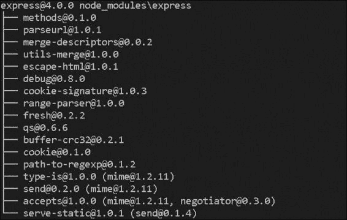
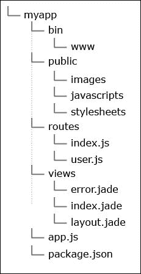

# 第二章. 使用 Node.js 和 Express 开发基本网站

在前一章中，我们学习了常见的编程范式以及它们如何应用于 Node.js。在这一章中，我们将继续介绍 **Express** 框架。它是可用的最受欢迎的框架之一，无疑是一个开创性的框架。Express 仍然被广泛使用，许多开发者将其作为起点。

# 熟悉 Express

Express ([`expressjs.com/`](http://expressjs.com/)) 是一个 Node.js 的网络应用程序框架。它建立在 Connect ([`www.senchalabs.org/connect/`](http://www.senchalabs.org/connect/)) 之上，这意味着它实现了中间件架构。在前一章中，当我们探索 Node.js 时，我们发现了这种设计决策的好处：框架充当插件系统。因此，我们可以说，由于其架构，Express 不仅适合简单应用，也适合复杂应用，因为我们可能只使用一些流行的中间件类型，或者添加很多功能，同时仍然保持应用程序模块化。

通常，大多数 Node.js 项目执行两个功能：运行一个监听特定端口的服务器，并处理传入的请求。Express 是这两个功能的包装器。以下是在服务器上运行的简单代码：

```js
var http = require('http');
http.createServer(function (req, res) {
  res.writeHead(200, {'Content-Type': 'text/plain'});
  res.end('Hello World\n');
}).listen(1337, '127.0.0.1');
console.log('Server running at http://127.0.0.1:1337/');
```

这是一个从 Node.js 官方文档中提取的示例。如图所示，我们使用原生模块 `http` 在端口 `1337` 上运行服务器。还有一个请求处理函数，它简单地将 `Hello world` 字符串发送到浏览器。现在，让我们使用以下代码实现相同的事情，但使用 Express 框架：

```js
var express = require('express');
var app = express();
app.get("/", function(req, res, next) {
  res.send("Hello world");
}).listen(1337);
console.log('Server running at http://127.0.0.1:1337/');
```

这基本上是同一件事。然而，我们不需要指定响应头或在字符串末尾添加新行，因为框架会为我们处理这些。此外，我们有一系列可用的中间件，这将帮助我们轻松处理请求。Express 就像是一个工具箱。我们有很多工具来做那些无聊的事情，让我们能够专注于应用程序的逻辑和内容。这正是 Express 的构建目的：通过提供现成的功能来为开发者节省时间。

# 安装 Express

安装 Express 有两种方法。我们将从简单的方法开始，然后继续到更高级的技术。简单的方法会生成一个模板，我们可以用它直接开始编写业务逻辑。在某些情况下，这可以为我们节省时间。从另一个角度来看，如果我们正在开发一个自定义应用程序，我们需要使用自定义设置。我们还可以使用高级技术获得的样板代码；然而，它可能不适合我们。

## 使用 package.json

Express 就像其他模块一样。它在包注册表中有自己的位置。如果我们想使用它，我们需要在`package.json`文件中添加这个框架。Node.js 生态系统建立在 Node 包管理器之上。它使用 JSON 文件来查找我们需要的内容，并将其安装到当前目录中。因此，我们的`package.json`文件的内容如下所示：

```js
{
  "name": "projectname",
  "description": "description",
  "version": "0.0.1",
  "dependencies": {
    "express": "3.x"
  }
}
```

这些是我们必须添加的必填字段。更准确地说，我们必须说必填字段是`name`和`version`。然而，总是给我们的模块添加描述是个好主意，尤其是如果我们想在注册表中发布我们的工作，那里的信息非常重要。否则，其他开发者将不知道我们的库在做什么。当然，还有许多其他字段，如贡献者、关键词或开发依赖项，但我们将坚持有限选项，以便我们可以专注于 Express。

一旦我们将`package.json`文件放置在项目的文件夹中，我们必须在控制台中调用`npm install`。这样做，包管理器将创建一个`node_modules`文件夹，并将 Express 及其依赖项存储在那里。命令执行结束后，我们将看到如下截图：



第一行显示了安装的版本，接下来的行实际上是 Express 所依赖的模块。现在，我们已经准备好使用 Express 了。如果我们输入`require('express')`，Node.js 将开始在本地`node_modules`目录中寻找这个库。由于我们没有使用绝对路径，这是正常的行为。如果我们没有运行`npm install`命令，我们将收到`Error: Cannot find module 'express'`的提示。

## 使用命令行工具

有一个名为`express-generator`的命令行工具。一旦我们运行`npm install -g express-generator`，我们就会安装并像在终端中的其他命令一样使用它。

如果你在一个项目中使用这个框架，你会注意到有些事情是重复的。我们甚至可以从一个应用程序复制粘贴到另一个应用程序，这是完全正常的。我们甚至可能最终拥有自己的样板代码，并且总是可以从那里开始。Express 的命令行版本做的是同样的事情。它接受少量参数，并根据这些参数创建一个用于的骨架。在某些情况下，这可能会非常方便，并且肯定会节省一些时间。让我们看看可用的参数：

+   `-h, --help`: 这表示输出使用信息。

+   `-V, --version`: 这将显示 Express 的版本。

+   `-e, --ejs`: 这个参数添加了 EJS 模板引擎支持。通常，我们需要一个库来处理我们的模板。编写纯 HTML 并不实用。默认引擎设置为 JADE。

+   `-H, --hogan`: 这个参数启用了 Hogan 模板引擎（另一个模板引擎）。

+   `-c, --css`：如果我们想使用 CSS 预处理器，这个选项允许我们使用 **LESS**（简称 **Leaner CSS**）或 Stylus。默认是纯 CSS。

+   `-f, --force`：这个选项强制 Express 在非空目录上运行。

让我们尝试使用 LESS 作为 CSS 预处理器来生成一个 Express 应用程序骨架。我们使用以下命令行：

```js
express --css less myapp
```

创建了一个新的 `myapp` 文件夹，其结构如图所示：



我们仍然需要安装依赖项，因此需要执行 `cd myapp && npm install`。现在我们将跳过对生成的目录的解释，并转到创建的 `app.js` 文件。它从初始化模块依赖项开始，如下所示：

```js
var express = require('express');
var path = require('path');
var favicon = require('static-favicon');
var logger = require('morgan');
var cookieParser = require('cookie-parser');
var bodyParser = require('body-parser');

var routes = require('./routes/index');
var users = require('./routes/users');

var app = express();
```

我们的框架是 `express`，而 `path` 是一个原生 Node.js 模块。中间件包括 `favicon`、`logger`、`cookieParser` 和 `bodyParser`。`routes` 和 `users` 是自定义模块，放置在项目的本地文件夹中。同样，在 **模型-视图-控制器** (**MVC**) 模式下，这些是应用程序的控制器。紧接着，创建了一个 `app` 变量；这代表了 Express 库。我们使用这个变量来配置我们的应用程序。脚本继续通过设置一些键值对。接下来的代码片段定义了视图的路径和默认模板引擎：

```js
app.set('views', path.join(__dirname, 'views'));
app.set('view engine', 'jade');
```

该框架使用 `set` 和 `get` 方法来定义内部属性。实际上，我们可以使用这些方法来定义我们自己的变量。如果值是布尔型，我们可以用 `enable` 和 `disable` 替换 `set` 和 `get`。例如，请看以下代码：

```js
app.set('color', 'red');
app.get('color'); // red
app.enable('isAvailable');
```

以下代码向框架中添加了中间件。我们可以如下看到代码：

```js
app.use(favicon());
app.use(logger('dev'));
app.use(bodyParser.json());
app.use(bodyParser.urlencoded());
app.use(cookieParser());
app.use(require('less-middleware')({ src: path.join(__dirname, 'public') }));
app.use(express.static(path.join(__dirname, 'public')));
```

第一个中间件充当我们应用程序的 favicon。第二个负责控制台输出。如果我们移除它，我们将无法获取服务器接收到的请求信息。以下是由 `logger` 产生的一个简单输出：

```js
GET / 200 554ms - 170b
GET /stylesheets/style.css 200 18ms - 110b
```

`json` 和 `urlencoded` 中间件与随请求发送的数据相关。我们需要它们，因为它们将信息转换为易于使用的格式。还有一个用于 cookie 的中间件。它填充请求对象，这样我们就可以稍后访问所需的数据。生成的应用程序使用 LESS 作为 CSS 预处理器，我们需要通过设置包含 `.less` 文件的目录来配置它。我们将在第十章，*编写灵活和模块化的 CSS* 中讨论 LESS，我们将详细说明这一点。最终，我们定义了我们的静态资源，这些资源应由服务器提供。这些只是一些简单的行，但我们已经配置了整个应用程序。我们可以移除或替换一些模块，而其他模块将继续工作。文件中的下一代码将两个定义的路由映射到两个不同的处理器，如下所示：

```js
app.use('/', routes);
app.use('/users', users);
```

如果用户尝试打开一个缺失的页面，Express 仍然会通过将其转发到错误处理器来处理请求，如下所示：

```js
app.use(function(req, res, next) {
    var err = new Error('Not Found');
    err.status = 404;
    next(err);
});
```

框架建议两种错误处理方式：一种用于开发环境，另一种用于生产服务器。区别在于第二种方式隐藏了错误的堆栈跟踪，这应该只对应用程序的开发者可见。正如我们可以在以下代码中看到的那样，我们正在检查`env`属性的值，并不同地处理错误：

```js
// development error handler
if (app.get('env') === 'development') {
    app.use(function(err, req, res, next) {
        res.status(err.status || 500);
        res.render('error', {
            message: err.message,
            error: err
        });
    });
}
// production error handler
app.use(function(err, req, res, next) {
    res.status(err.status || 500);
    res.render('error', {
        message: err.message,
        error: {}
    });
});
```

最后，`app.js`文件导出创建的 Express 实例，如下所示：

```js
module.exports = app;
```

要运行应用程序，我们需要执行`node ./bin/www`。代码需要`app.js`并启动服务器，默认情况下服务器监听端口`3000`。

```js
#!/usr/bin/env node
var debug = require('debug')('my-application');
var app = require('../app');

app.set('port', process.env.PORT || 3000);

var server = app.listen(app.get('port'), function() {
  debug('Express server listening on port ' + server.address().port);
});
```

`process.env`声明提供了对当前开发环境中定义的变量的访问。如果没有`PORT`设置，Express 将使用 3000 作为值。所需的`debug`模块使用类似的方法来确定是否需要向控制台显示消息。

# 管理路由

我们应用程序的输入是路由。用户访问我们的页面时会在特定的 URL，我们必须将这个 URL 映射到特定的逻辑。在 Express 的上下文中，这可以很容易地完成，如下所示：

```js
var controller = function(req, res, next) {
  res.send("response");
}
app.get('/example/url', controller);
```

我们甚至可以控制 HTTP 的方法，也就是说，我们能够捕获 POST、PUT 或 DELETE 请求。如果我们想保留地址路径但应用不同的逻辑，这非常有用。例如，请看以下代码：

```js
var getUsers = function(req, res, next) {
  // ...
}
var createUser = function(req, res, next) {
  // ...
}
app.get('/users', getUsers);
app.post('/users', createUser);
```

```js
app.all('/', serverHomePage);
```

Express 中的路由有一些有趣的特点。我们不仅可以传递一个处理器，还可以传递多个处理器。这意味着我们可以创建一个与一个 URL 对应的函数链。例如，如果我们需要知道用户是否已登录，有一个模块可以做到这一点。我们可以添加另一个方法来验证当前用户并将变量附加到请求对象上，如下所示：

```js
var isUserLogged = function(req, res, next) {
  req.userLogged = Validator.isCurrentUserLogged();
  next();
}
var getUser = function(req, res, next) {
  if(req.userLogged) {
    res.send("You are logged in. Hello!");
  } else {
    res.send("Please log in first.");
  }
}
app.get('/user', isUserLogged, getUser);
```

`Validator`类是一个检查当前用户会话的类。想法很简单：我们添加另一个处理器，它充当额外的中间件。在执行必要的操作后，我们调用`next`函数，它将流程传递给下一个处理器`getUser`。因为对于所有中间件，请求和响应对象都是相同的，所以我们有权访问`userLogged`变量。这正是 Express 真正灵活的原因。有很多很棒的功能可用，但它们是可选的。在本章的结尾，我们将创建一个简单的网站，实现相同的逻辑。

# 处理动态 URL 和 HTML 表单

Express 框架也支持动态 URL。假设我们为系统中的每个用户都有一个单独的页面。这些页面的地址如下所示：

```js
/user/45/profile
```

在这里，`45`是我们数据库中用户的唯一编号。当然，使用一个路由处理器来处理这种功能是正常的。我们真的不能为每个用户定义不同的函数。这个问题可以通过使用以下语法来解决：

```js
var getUser = function(req, res, next) {
  res.send("Show user with id = " + req.params.id);
}
app.get('/user/:id/profile', getUser);
```

路由实际上就像一个包含变量的正则表达式。稍后，这个变量可以在 `req.params` 对象中访问。我们可以有多个变量。以下是一个稍微复杂一点的例子：

```js
var getUser = function(req, res, next) {
  var userId = req.params.id;
  var actionToPerform = req.params.action;
  res.send("User (" + userId + "): " + actionToPerform)
}
app.get('/user/:id/profile/:action', getUser);
```

如果我们打开 `http://localhost:3000/user/451/profile/edit`，我们会看到 `User (451): edit` 作为响应。这就是我们如何得到一个看起来很好，SEO 友好的 URL 的方法。

当然，有时我们需要通过 GET 或 POST 参数传递数据。我们可能有一个像 `http://localhost:3000/user?action=edit` 这样的请求。为了轻松解析它，我们需要使用本地的 `url` 模块，它有几个辅助函数来解析 URL：

```js
var getUser = function(req, res, next) {
  var url = require('url');
  var url_parts = url.parse(req.url, true);
  var query = url_parts.query;
  res.send("User: " + query.action);
}
app.get('/user', getUser);
```

一旦模块解析了给定的 URL，我们的 GET 参数就存储在 `.query` 对象中。POST 变量略有不同。我们需要一个新的中间件来处理它。幸运的是，Express 提供了一个，如下所示：

```js
app.use(express.bodyParser());
var getUser = function(req, res, next) {
  res.send("User: " + req.body.action);
}
app.post('/user', getUser);
```

`express.bodyParser()` 中间件将 POST 数据填充到 `req.body` 对象中。当然，我们必须将 HTTP 方法从 `.get` 改为 `.post` 或 `.all`。

如果我们想在 Express 中读取 cookies，我们可以使用 `cookieParser` 中间件。与 body parser 类似，它也应该被安装并添加到 `package.json` 文件中。以下示例设置了中间件并演示了其用法：

```js
var cookieParser = require('cookie-parser');
app.use(cookieParser('optional secret string'));
app.get('/', function(req, res, next){
    var prop = req.cookies.propName
});
```

# 返回响应

我们的服务器接受请求，做一些处理，最后将响应发送到客户端的浏览器。这可以是 HTML、JSON、XML 或二进制数据等。众所周知，默认情况下，Express 中的每个中间件都接受两个对象，`request` 和 `response`。`response` 对象有我们可以用来向客户端发送答案的方法。每个响应都应该有一个适当的内容类型或长度。Express 通过提供设置 HTTP 头和向浏览器发送内容的功能来简化这个过程。在大多数情况下，我们将使用 `.send` 方法，如下所示：

```js
res.send("simple text");
```

当我们传递一个字符串时，框架将 `Content-Type` 头设置为 `text/html`。了解如果我们传递一个对象或数组，内容类型将是 `application/json` 是很有帮助的。如果我们开发 API，响应状态码可能对我们来说很重要。使用 Express，我们能够像以下代码片段那样设置它：

```js
res.send(404, 'Sorry, we cannot find that!');
```

甚至可以响应来自我们硬盘上的文件。如果我们不使用框架，我们需要读取文件，设置正确的 HTTP 头，并发送内容。然而，Express 提供了 `.sendfile` 方法，它将这些操作封装如下：

```js
res.sendfile(__dirname + "/images/photo.jpg");
```

再次强调，内容类型是自动设置的；这次它是基于文件扩展名来确定的。

当构建具有用户界面的网站或应用程序时，我们通常需要提供 HTML。当然，我们可以手动在 JavaScript 中编写它，但使用模板引擎是良好的实践。这意味着我们将所有内容保存在外部文件中，引擎从那里读取标记。它用一些数据填充它们，最后提供准备好显示的内容。在 Express 中，整个过程总结为一个方法，`.render`。然而，为了正常工作，我们必须指导框架使用哪个模板引擎。我们已经在本章的开始讨论了这一点。以下两行代码设置了我们的视图路径和模板引擎：

```js
app.set('views', path.join(__dirname, 'views'));
app.set('view engine', 'jade');
```

假设我们有一个以下模板（`/views/index.jade`）：

```js
h1= title
p Welcome to #{title}
```

Express 提供了一个提供模板的方法。它接受模板的路径、要应用的数据和一个回调。要渲染前面的模板，我们应该使用以下代码：

```js
res.render("index", {title: "Page title here"});
```

生成的 HTML 看起来如下：

```js
<h1>Page title here</h1><p>Welcome to Page title here</p>
```

如果我们传递一个第三个参数，`function`，我们将能够访问生成的 HTML。然而，它不会作为响应发送到浏览器。

# 示例-日志系统

我们已经看到了 Express 的主要功能。现在让我们构建一些真实的东西。接下来的几页展示了一个简单的网站，用户只有在登录后才能阅读。让我们开始并设置应用程序。我们将使用 Express 的命令行工具。它应该使用`npm install -g express-generator`来安装。我们为示例创建一个新的文件夹，通过终端导航到它，并执行`express --css less site`。将创建一个新的目录，`site`。如果我们去那里并运行`npm install`，Express 将下载所有必需的依赖项。正如我们之前看到的，默认情况下，我们有两条路由和两个控制器。为了简化示例，我们将只使用第一个：`app.use('/', routes)`。让我们将`views/index.jade`文件的内容更改为以下 HTML 代码：

```js
doctype html
html
  head
    title= title
    link(rel='stylesheet', href='/stylesheets/style.css')
  body
    h1= title
    hr
    p That's a simple application using Express.
```

现在，如果我们运行`node ./bin/www`并打开`http://127.0.0.1:3000`，我们将看到页面。Jade 使用缩进来解析我们的模板。因此，我们不应该混合制表符和空格。否则，我们会得到一个错误。

接下来，我们需要保护我们的内容。我们检查当前用户是否创建了一个会话；如果没有，则显示登录表单。这是创建新中间件的最佳时机。

要在 Express 中使用会话，安装一个额外的模块：`express-session`。我们需要打开我们的`package.json`文件并添加以下代码行：

```js
"express-session": "~1.0.0"
```

一旦我们这样做，快速运行`npm install`就会将模块带到我们的应用程序中。我们唯一要做的就是使用它。以下代码将进入`app.js`：

```js
var session = require('express-session');
app.use(session({ secret: 'app', cookie: { maxAge: 60000 }}));
var verifyUser = function(req, res, next) {
    if(req.session.loggedIn) {
        next(); 
    } else {
        res.send("show login form");
    }   
}
app.use('/', verifyUser, routes);
```

注意，我们更改了原始的 `app.use('/', routes)` 行。初始化并添加到 Express 的 `session` 中间件。在页面渲染之前调用 `verifyUser` 函数。它使用 `req.session` 对象，并检查是否定义了 `loggedIn` 变量，并且其值是否为 `true`。如果我们再次运行脚本，我们会看到对于每个请求都会显示“显示登录表单”文本。这是因为没有代码以我们想要的方式设置会话。我们需要一个表单，用户可以在其中输入他们的用户名和密码。我们将处理表单的结果，如果凭证正确，则将 `loggedIn` 变量设置为 `true`。让我们创建一个新的 `Jade` 模板，`/views/login.jade`：

```js
doctype html
html
  head
    title= title
    link(rel='stylesheet', href='/stylesheets/style.css')
  body
    h1= title
    hr
    form(method='post')
      label Username:
      br
      input(type='text', name='username')
      br
      label Password:
      br
      input(type='password', name='password')
      br
      input(type='submit')
```

而不是只发送带有 `res.send("show login form");` 的文本，我们应该渲染新的模板，如下所示：

```js
res.render("login", {title: "Please log in."});
```

我们选择 POST 作为表单的方法。因此，我们需要添加中间件，以便用用户的数据填充 `req.body` 对象，如下所示：

```js
app.use(bodyParser());
```

按如下方式处理提交的用户名和密码：

```js
var verifyUser = function(req, res, next) {
  if(req.session.loggedIn) {
    next();  
  } else {
    var username = "admin", password = "admin";
    if(req.body.username === username && 
    req.body.password === password) {
      req.session.loggedIn = true;
      res.redirect('/');
    } else {
      res.render("login", {title: "Please log in."});
    }
  }  
}
```

有效的凭证设置为 `admin/admin`。在实际应用中，我们可能需要访问数据库或从其他地方获取此信息。将用户名和密码放在代码中并不是一个好主意；然而，对于我们的这个小实验来说，这是可以的。之前的代码检查传递的数据是否与预定义的值匹配。如果一切正确，它将设置会话，之后用户将被转发到主页。

登录后，你应该能够注销。让我们在索引页面的内容之后添加一个链接（`views/index.jade`）：

```js
a(href='/logout') logout
```

当用户点击此链接时，他们将被转发到新页面。我们只需要为新的路由创建一个处理器，删除会话，并将他们转发到登录表单所在的索引页面。以下是我们注销处理器的样子：

```js
// in app.js
var logout = function(req, res, next) {
  req.session.loggedIn = false;
  res.redirect('/');
}
app.all('/logout', logout);
```

将 `loggedIn` 设置为 `false` 就足以使会话无效。重定向将用户发送到他们来自的相同内容页面。然而，这次内容被隐藏，登录表单弹出。

# 摘要

在本章中，我们学习了最广泛使用的 Node.js 框架之一，Express。我们讨论了其基础、如何设置它以及其主要特性。我们在上一章中提到的中间件架构是库的基础，并赋予我们编写复杂但同时又灵活的应用程序的能力。我们使用的示例很简单。我们需要一个有效的会话来提供页面访问。然而，它说明了 body parser 中间件的使用和注册新路由的过程。我们还更新了 `Jade` 模板，并在浏览器中看到了结果。

下一章将展示 Node.js 如何与 Google 为客户端 JavaScript 应用程序制作的流行框架 AngularJS 协作。
