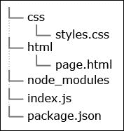
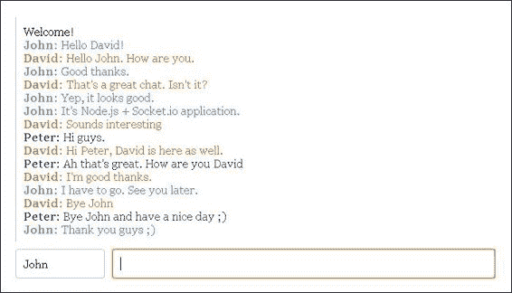

# 第四章：使用 Socket.IO 开发聊天功能

正如我们在上一章中学到的，Node.js 与前端框架如 AngularJS 协作得非常好。我们可以从浏览器传输数据到 Node.js，反之亦然，这真是太棒了。如果我们可以实时做到这一点，那就更好了。如今，实时通信几乎被集成到每个 Web 产品中。它为用户提供了良好的体验，并为应用的所有者带来了很多好处。通常，当我们谈论实时 Web 组件时，我们指的是**WebSockets**。WebSocket 是一种协议，允许我们在浏览器和服务器之间建立双向（双向）对话。这开辟了一个全新的世界，并赋予我们实施快速和健壮应用的能力。**Node.js**支持 WebSockets，我们将看到如何使用 WebSockets 构建实时聊天。该应用将使用 Socket.IO。这是一个建立在 WebSockets 之上的库，提供机制来覆盖如果它们不可用时的相同功能。我们将有一个输入字段，并且每个打开页面的用户都将能够向所有其他可用的用户发送消息。

在本章中，我们将学习如何设置 Socket.IO，以及如何在浏览器中使用它并启动一个 Node.js 服务器，使实时聊天成为可能。

# 探索 WebSockets 和 Socket.IO

假设我们想要构建一个聊天功能。我们首先应该做的是开发显示屏幕上消息的部分。在典型场景中，我们希望这些消息能够快速送达，也就是说，在发送后几乎立即送达。然而，如果我们不使用套接字从服务器接收数据，我们需要发起一个 HTTP 请求。此外，服务器应该保留信息，直到我们请求它这样做。想象一下，如果我们有 10 个用户，并且他们中的每一个都开始发送数据，会发生什么。

我们需要维护一个用户会话，以便识别用户的请求。如果我们使用套接字，这些问题很容易解决。一旦套接字打开，我们就有一个长连接通道，可以来回发送消息。这意味着你可以在不请求的情况下开始接收信息。这种架构类似于一个巨大的桥梁网络。桥梁始终开放，如果我们需要去某个地方，我们可以自由地去。网络中心有一个中心节点，将每一侧连接起来。在 Web 的背景下，中心节点是我们的服务器。每次我们需要接触到网络上的某些用户时，我们只需通过套接字发送一条消息。服务器接收它并将其转发给正确的人。这是实现实时通信最有效的方法之一。它节省了时间和资源。

就像大多数酷技术一样，我们不需要从头开始编写底层的东西，例如握手请求等。有两种类型的开发者：那些非常努力工作并将复杂事物抽象成更简单的 API 和工具的开发者，以及那些知道如何使用它们的人。第二组的开发者可以利用像 Socket.IO 这样的库。本章将广泛讨论 Socket.IO 模块。它作为 WebSocket 之上的抽象，并在很大程度上简化了过程。

在我们继续之前，**Socket.IO** 实际上不仅仅是 **WebSockets** 之上的一个层。在实践中，它做了更多的事情，如网站 [`socket.io/`](http://socket.io/) 上所述：

> *"Socket.IO 旨在使实时应用在每一个浏览器和移动设备上成为可能，模糊了不同传输机制之间的差异。它是无压力的实时 100% JavaScript。"*

我们通常会遇到一些常见的协议情况，例如心跳、超时和断开连接支持。所有这些事件都不是 WebSocket API 本地支持的。幸运的是，Socket.IO 正在这里解决这些问题。该库还消除了某些跨浏览器问题，并确保您的应用在所有地方都能工作。

# 理解基本应用结构

在上一章中，我们使用了 Express 和 Jade 来编写应用资产的交付（HTML、CSS 和 JavaScript）。在这里，我们将坚持使用纯 JavaScript 代码，并避免使用额外的依赖项。我们需要添加到我们的 `package.json` 文件中的唯一东西是 Socket.IO：

```js
{
  "name": "projectname",
  "description": "description",
  "version": "0.0.1",
  "dependencies": {
    "socket.io": "latest"
  }
}
```

在我们的项目文件夹中调用 `npm install` 之后，Socket.IO 被放置在一个新创建的 `node_modules` 目录中。让我们创建两个新的目录。以下截图显示了应用文件结构应该看起来像什么：



文件结构

应用将读取 `styles.css` 文件并将内容交付给浏览器。同样的事情也会发生在 `/html/page.html` 上，这是包含项目 HTML 标记的文件。Node.js 代码在 `/index.js`。

# 运行服务器

在我们开始使用 Socket.IO 之前，让我们首先编写一个简单的 Node.js 服务器代码，该代码响应聊天页面。我们可以看到以下服务器代码：

```js
var http = require('http'),
  fs = require('fs'),
  port = 3000,
  html = fs.readFileSync(__dirname + '/html/page.html', {encoding: 'utf8'}),
  css = fs.readFileSync(__dirname + '/css/styles.css', {encoding: 'utf8'});

var app = http.createServer(function (req, res) {
  if(req.url === '/styles.css') {
    res.writeHead(200, {'Content-Type': 'text/css'});
    res.end(css);
  } else {
    res.writeHead(200, {'Content-Type': 'text/html'});
    res.end(html);
  }
}).listen(port, '127.0.0.1');
```

之前的代码应该放在 `/index.js` 中。脚本从定义几个全局变量开始。`http` 模块用于创建服务器，而 `fs` 模块用于从磁盘读取 CSS 和 HTML 文件。`html` 和 `css` 变量包含将被发送到浏览器的实际代码。在我们的案例中，这些数据是静态的。这就是为什么我们只读取一次文件，即在脚本运行时。我们通过使用 `fs.readFileSync` 而不是 `fs.readFile` 来同步执行此操作。紧接着，我们的服务器被初始化并运行。`req.url` 变量包含当前请求的文件。根据其值，我们以适当的内容响应它。一旦服务器运行，HTML 和 CSS 代码保持不变。如果我们更改了内容，我们需要停止并重新启动脚本。这是因为我们在启动服务器之前读取了文件的内容。如果没有更改 `/css/styles.css` 或 `/html/page.html`，这可以被认为是一种良好的实践。在服务器的处理程序中插入 `fs.readFileSync` 操作会使我们的聊天稍微慢一些，因为我们将从磁盘读取数据，每次请求都会这样做。

# 添加 Socket.IO

实现聊天功能需要在两个地方编写代码：服务器端和客户端。我们将通过扩展之前的代码继续 Node.js 部分，如下所示：

```js
var io = require('socket.io').listen(app);
io.sockets.on('connection', function (socket) {
  socket.emit('welcome', { message: 'Welcome!' });
  socket.on('send', function (data) {
      io.sockets.emit('receive', data);
  });
});
```

`http.createServer` 方法返回一个新的网络服务器对象。我们必须将此对象传递给 Socket.IO。一旦一切准备就绪，我们就可以访问这个奇妙且简单的 API。我们可以监听传入的事件并向连接到服务器的用户发送消息。`io.sockets` 属性指向系统中创建的所有套接字，而作为 `connection` 处理程序参数传递的 `socket` 对象，仅代表一个单独的用户。

例如，在之前的代码中，我们正在监听 `connection` 事件，即新用户连接到服务器。当发生这种情况时，服务器向该用户发送一条个人消息，内容为 `欢迎！`

接下来可能发生的事情是我们从用户那里收到一种新的消息类型，我们的脚本应该将此信息分发到所有可用的套接字。这正是 `io.sockets.emit` 所做的。请记住，`emit` 方法可以接收我们自己的自定义事件名称和数据。并不需要严格遵循这里使用的格式。

# 编写聊天客户端

完成编写服务器端代码后，我们现在可以继续编写前端代码，即编写与聊天服务器通信所需的必要 HTML 和 JavaScript。

## 准备 HTML 标记

到目前为止的开发工作完成后，我们的聊天功能将如下截图所示：



我们有一个容器，用作接收消息的持有者。有两个输入框。第一个用于用户的名称，第二个接受我们必须发送的消息。每个用户都会为其文本应用一个随机颜色。没有按钮将数据发送到服务器；我们可以通过按 *Enter* 键来完成。让我们继续阅读保存在 `/html/page.html` 中的 HTML 标记，如下所示：

```js
<!doctype html>
<html>
    <head>
        <link rel="stylesheet" type="text/css" href="styles.css">
    </head>
    <body>
        <section>
          <div id="chat"></div>
          <input type="text" id="name" placeholder="your name" />
          <input type="text" id="input" disabled="disabled" />
        </section>
        <script src="img/socket.io.js"></script>
    <script>
      window.onload = function() {
        var Chat = (function() {
          // ...
        })();
      }
    </script>
    </body>
</html>
```

CSS 样式被添加到页面顶部和脚本底部。代表之前代码中提到的控制器的只有三个元素。逻辑的启动被放置在 `window.onload` 处理器中。我们这样做只是为了确保所有资源都已完全加载。请注意，将接受消息的输入字段默认是禁用的。一旦建立了套接字连接，我们将启用它。还有最后一件事需要明确——`/socket.io/socket.io.js` 文件所在的位置/来源。它不是从外部来源下载并保存在项目目录中；它是通过 Socket.IO 交付到该位置的。这也是在后台将 `web server` 对象传递给 Socket.IO 的原因之一。

## 编写聊天逻辑

HTML 标记本身是无用的。我们开发过程中的下一步将是编写与后端通信的 JavaScript 代码。我们需要捕获用户的输入并将其发送到服务器。屏幕上显示的消息将以不同的颜色呈现。我们将首先定义两个辅助方法，如下所示：

```js
var addEventListener = function(obj, evt, fnc) {
    if (obj.addEventListener) { // W3C model
        obj.addEventListener(evt, fnc, false);
        return true;
    } else if (obj.attachEvent) { // Microsoft model
        return obj.attachEvent('on' + evt, fnc);
    }
}
var getRandomColor = function() {
    var letters = '0123456789ABCDEF'.split('');
    var color = '#';
    for (var i = 0; i < 6; i++ ) {
        color += letters[Math.round(Math.random() * 15)];
    }
    return color;
}
```

第一个，`addEventListener` 函数，将为 `DOM` 元素添加事件监听器。为了让我们的聊天在 Internet Explorer 中工作，我们需要使用 `attachEvent` 而不是 `addEventListener`。第二个，`getRandomColor` 函数，每次都会提供不同的颜色。我们将使用这个来区分不同用户的消息。

我们客户端逻辑的起点是定义几个变量：

```js
var socket = io.connect('http://localhost:3000'),
  chat = document.querySelector("#chat"),
  input = document.querySelector("#input"),
  name = document.querySelector("#name"),
  color = getRandomColor();
```

我们将使用 `socket` 变量与服务器通信。接下来的三个变量是之前使用的 `DOM` 元素的快捷方式。建议创建这样的快捷方式，因为始终使用 `document.getElementById` 或 `document.querySelector` 引用元素可能会导致性能问题。

聊天做两件事：向 Node.js 部分发送消息并从那里接收消息。让我们将所有内容封装到两个简单的函数中，如下所示：

```js
var send = function(message) {
  var username = name.value === '' ? '' : '<strong>' + name.value + ': </strong>';
  socket.emit('send', { 
    message: '<span style="color:' + color + '">' + 
                   username + message + '</span>'
  });
}

var display = function(message) {
  chat.innerHTML = chat.innerHTML + message + '<br />';
  chat.scrollTop = chat.scrollHeight;
}
```

在这里，我们通过`socket.emit`方法发送消息，并将文本包裹在带颜色的`span`元素中。当然，如果用户在`name`输入字段中输入了某些内容，我们会使用该值并将其与其他数据一起发送。`display`函数相当简单。它只是更改`chat`元素的`innerHTML`属性。有趣的是第二行。如果我们稍微使用一下聊天功能，我们会注意到`div`会很快被填满，而我们实际上看到的是只有第一条消息。通过将`scrollTop`属性设置为`scrollHeight`，我们确保容器始终向下滚动。

我们小型应用程序的下一步是处理用户的输入。这可以通过以下代码完成：

```js
addEventListener(input, "keydown", function(e) {
  if(e.keyCode === 13) {
    send(input.value);
    input.value = "";
  }
});
```

目前对我们来说唯一有趣的是*Enter*键。它的键码是 13。如果按下该键，字段中的值就会被发送到服务器。我们正在清空输入字段，以便用户可以输入新的消息。

我们最后应该编写接收消息的代码：

```js
socket.on('welcome', function (data) {
  display(data.message);
  input.removeAttribute("disabled");
  input.focus();
}).on('receive', function(data) {
  display(data.message);
});
```

我们正在监听两种类型的事件。它们是`welcome`和`receive`。当连接建立时，会发送`welcome`事件。`receive`事件是一个传入事件，当一些用户发送消息（包括我们自己）时发生。我们可能会问为什么我们需要将我们的消息发送到服务器并在之后接收它。直接将文本放置在容器上不是更容易吗？这个问题的答案是，我们需要数据的一致性，也就是说，我们应该向所有用户提供完全相同的消息，并且顺序完全相同。这只能由应用程序中的一块保证，那就是服务器。

通过这个最后的代码片段，我们已经完成了聊天功能的构建。在本章的最后部分，我们将改进用户间通信。

# 实现用户间通信

我们的聊天现在可以正常工作，但如果我们可以向特定用户发送消息那就更好了。这样的功能需要在前后端都进行更改。让我们首先更改 Node.js 脚本。

## 修改服务器端代码

到目前为止，我们的系统中的用户都是匿名的。我们只是将接收到的消息传递给所有可用的套接字。然而，要实现用户间对话，我们需要为每个用户设置唯一的 ID。同时，我们必须保留所有创建的套接字的引用，以便我们可以向它们发送消息。这可以通过以下方式完成：

```js
var crypto = require('crypto');
var users = [];
```

我们可以利用 Node.js 中默认可用的`crypto`模块生成随机唯一的 ID，如下所示：

```js
var id = crypto.randomBytes(20).toString('hex');
```

我们还应该通知聊天中的人关于可用用户的信息。否则，他们无法选择合适的用户进行聊天。通知如下：

```js
var sendUsers = function() {
  io.sockets.emit('users', users.map(function(user) {
    return { id: user.id, name: user.username };
  }));
}
```

实际上，用户的名字是与消息一起传递的。它是消息的一部分，后端根本不使用它。然而，在新场景中，我们需要它与 ID 一起。之前的代码将`users`数组发送到浏览器，但在那之前，它过滤了它并只传递 ID 和名字。正如我们将在以下代码中看到的，我们为每个元素都有一个`socket`属性。以下是更新的`connection`处理程序：

```js
io.sockets.on('connection', function (socket) {
  var id = crypto.randomBytes(20).toString('hex');
  users.push({ socket: socket, id: id, name: null });
  socket.emit('welcome', { message: 'Welcome!', id: id });
  sendUsers();
  socket.on('send', function (data) {
      if(data.username !== '') {
        setUsername(id, data.username);
      }
      if(data.toUser !== '') {
        users.forEach(function(user) {
      if(user.id === data.toUser || user.id === data.fromUser) {
        user.socket.emit('receive', data);
      }
    })
      } else {
        io.sockets.emit('receive', data);
      }
  });
});
```

因此，服务器接收到了一个新的用户连接。我们生成一个新的 ID，并在`users`数组中创建一个新的元素。我们保留 socket、ID 和用户的姓名。之后，我们发出古老的`welcome`消息，但这次我们发送了 ID。现在，前端可以识别自己进入系统，因为`users`变量已更新，我们应该通过`sendUsers`函数通知其他人。我们开始监听`send`消息，一旦它到来，我们就使用`setUsername`方法更新数组中的用户名，如下所示：

```js
var setUsername = function(id, name) {
  users.forEach(function(user) {
    if(user.id === id) {
      user.username = name;
      sendUsers();
    }
  });
}
```

接下来的几行检查是否存在`toUser`属性。如果存在，我们知道它包含了一些其他用户的 ID。因此，我们只需找到用户 ID 并将消息传递给确切的 socket。如果没有`toUser`属性，那么数据将通过`io.sockets.emit('receive', data)`发送给所有人。与`toUser`一起，前端还应发送`fromUser`。这是因为通常发送文本的人直到服务器将其发送回来之前，看不到自己的消息在屏幕上。我们将使用`fromUser`来实现这一点。

## 修改聊天的前端

我们必须做的第一件事是在屏幕上显示可用的用户，这样我们就可以选择其中一个与他们聊天。就在输入字段下方，我们将添加一个下拉菜单，如下所示：

```js
<select id="users">
    <option value="">all</option>
</select>
```

我们需要定义几个新的变量。一个指向`select`元素的新的快捷方式，当前列表中选中的用户，以及一个将保存当前用户 ID 的变量。这可以通过以下方式完成：

```js
var users = document.querySelector("#users"),
  selectedUser = null,
  id = null;
```

`send`方法有所改变。我们可以这样看到：

```js
var send = function(message) {
  var username = name.value == '' ? '' : '<strong>' + name.value + ': </strong>';
  socket.emit('send', { 
    message: '<span style="color:' + color + '">' + username + message + '</span>',
    username: name.value,
    toUser: users.value,
    fromUser: id
    });
}
```

差别在于我们正在将用户的名字发送到一个单独的属性中，即用户的 ID 和我们想要与之聊天的用户的 ID。如果没有这样的用户，那么值就是一个空字符串。`display`方法可以保持不变。我们还需要一个事件监听器来监听下拉菜单的变化。我们将如下添加它：

```js
addEventListener(users, "change", function(e) {
  selectedUser = users.value;
});
```

大部分工作都是在 socket 对象的监听器中完成的：

```js
socket.on('welcome', function (data) {
  id = data.id;
  display(data.message);
  input.removeAttribute("disabled");
  input.focus();
}).on('receive', function(data) {
  display(data.message);
}).on('users', function(data) {
  var html = '<option value="">all</option>';
  for(var i=0; i<data.length; i++) {
    var user = data[i];
    if(id != user.id) {
      var username = user.name ? user.name : 'user' + (i+1);
      var selected = user.id === selectedUser ? ' selected="selected"': '';
      html += '<option value="' + user.id + '"' + selected + '>' + username + '</option>';
    }
  }
  users.innerHTML = html;
});
```

首先，我们接收到了`欢迎`信息。它包含了 ID，因此我们将它存储在我们的局部变量中。我们显示了欢迎信息，启用了输入，并将焦点移至那里。这里没有变化。新的变化在于最后的消息监听器。这是我们将数据填充到下拉菜单的地方。我们编写一个 HTML 字符串，并将其设置为`innerHTML`属性的值。这里有两个检查。第一个检查防止当前用户在`select`元素中显示。第二个条件会自动从列表中选择一个用户。这实际上非常重要，因为用户的消息可能会发送多次，而菜单应该保持其选择状态。

# 摘要

在本章中，我们学习了如何使用 Socket.IO 创建实时聊天。它是一个优秀的 Node.js 模块，简化了 WebSocket 的工作。这是一种今天广泛使用的技术，也是未来应用的一部分。

在下一章中，我们将学习如何使用 BackboneJS 创建一个简单的待办事项应用。同样，我们将借助 Node.js 来管理数据。
