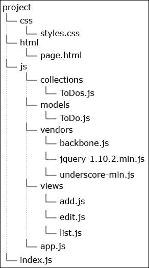

# 第五章：使用 Backbone.js 创建待办事项应用程序

在前面的章节中，我们学习了如何使用 Socket.IO 创建实时聊天。我们使用 AngularJS 制作了一个博客应用程序，并使用 Express 创建了一个简单的网站。本章专门介绍另一个流行的框架——Backbone.js。Backbone.js 是最早获得广泛认可的 JavaScript 框架之一。它有处理数据的模型、控制逻辑和用户界面的视图，以及处理浏览器地址变化的自带路由器。该框架与 jQuery 非常兼容，这使得它对几乎每一位 JavaScript 开发者都具有吸引力。在本章中，我们将构建一个简单的应用程序来存储短任务。最后，我们将能够创建、编辑、删除任务，并将它们标记为完成。

在本章中，我们将涵盖以下主题：

+   Backbone.js 的基础知识

+   编写管理待办事项列表的 Node.js 代码

+   使用 Backbone.js 编写前端代码

# 探索 Backbone.js 框架

在开始示例应用程序之前，我们应该检查框架的主要功能。有时候，了解底层发生了什么是有好处的。所以，让我们深入探讨。

## 识别框架依赖项

我们现在使用的绝大多数软件都是建立在其他库或工具之上的。通常，它们被称为**依赖项**。Backbone.js 只有一个硬依赖项——那就是 Underscore.js，这是一个充满实用函数的库。例如，有 `forEach`、`map` 或 `union` 等数组函数。我们可以扩展一个对象并检索其键或值。所有这些都是在某些时候需要的功能，但它们在内置的 JavaScript 对象中缺失。因此，我们应该在我们的页面上包含这个库。否则，Backbone.js 将会因为缺少功能而抛出错误。

Backbone.js 与 jQuery 非常兼容。它会检查库是否可用，并立即开始使用它。这是一个很好的合作，因为我们可以用各种 jQuery 方法加快我们的工作速度。它不是必须的依赖项，框架在没有它的情况下仍然可以工作，但它简化了 DOM 操作。

## 扩展功能

框架有几个独立的组件，我们将使用它们。所以，我们的想法是创建新的类，这些类继承基本实现的功能。这些组件有 `extend` 方法，它接受一个对象——我们的自定义逻辑。最后，我们的属性将覆盖原始代码。以下是我们将创建的新视图类：

```js
var ListView = Backbone.View.extend({
  render: function() {
    // ...
  }
});
var list = new ListView();
```

没有强制性的模块。我们的应用程序没有严格定义的中心入口点。一切都在我们的掌控之中，这是好事。所有部分都如此解耦，这使得 Backbone.js 很容易使用。

## 理解 Backbone.js 作为事件驱动框架

通过事件驱动，我们指的是应用程序流程由事件决定，也就是说，框架中的每个类/对象都会派发消息，通知其他组件关于某些动作。换句话说，我们创建的每个对象都可以接受监听器并触发事件。这使得我们的应用程序非常灵活和易于沟通。这种方法鼓励模块化编程，并真正有助于构建坚实的架构。`Backbone.Events`模块是一个提供这种功能的模块。以下示例代码解释了如何扩展`Backbone.Events`模块：

```js
var object = {};
_.extend(object, Backbone.Events);
object.on("event", function(msg) {
  console.log(msg);
});
object.trigger("event", "an event");
```

Underscore.js 的`extend`方法将传递的对象合并成一个。在我们的情况下，我们将生成一个实现了观察者模式的对象。这导致我们得出结论，Backbone.js 产生的每个视图、模型或集合都具有`on`和`trigger`方法。

## 使用模型

模型是每个 Backbone.js 项目的核心部分。它的主要功能是保存我们的数据。模型保存、验证并同步数据与服务器。与此相关，模型可以通知外部世界模块内部发生的事件。以下示例代码解释了如何扩展`Backbone.Model`模块：

```js
var User = Backbone.Model.extend({
  defaults: {
    name: '',
    password: '',
    isAdmin: false
  }
});
var user = new User({
  name: 'John',
  password: '1234'
});
console.log(user.get('name'));
```

模型中的信息被保存在哈希表中。这里有属性和值。我们拥有`set`和`get`方法来访问数据。一旦有东西被改变，模型就会触发一个事件。你可能想知道为什么我们需要将数据封装成一个类。一开始，`Backbone.Model`看起来像是一个不必要的抽象。然而，很快你就会意识到这个概念真的很强大。首先，我们可以将尽可能多的视图附加到同一个模型上，这里的附加意味着监听一个`change`事件。我们可以更新模型并改变用户界面。第二件事是，我们可以将模型连接到服务器端 API，并通过 Ajax 请求立即同步信息。我们将在后面的示例应用程序中这样做。

## 使用集合

非常常见的情况是我们需要将模型存储在数组中。集合就是为了这种情况而设计的。`Backbone.Collection`模块具有`add`、`remove`和`forEach`等方法，用于与存储的项目交互。它还可以从外部源获取多个模型，这就是它主要被用于的地方。当然，集合需要知道模型的数据类型。以下示例代码解释了如何扩展`Backbone.Collection`模块：

```js
var User = Backbone.Model.extend({
  defaults: {
    name: '',
    password: '',
    isAdmin: false
  }
});
var Accounts = Backbone.Collection.extend({
  model: User
});
var accounts = new Accounts();
accounts.add({name: 'John'});
accounts.add({name: 'Steve'});
accounts.add({name: 'David'});
accounts.forEach(function(model) {
  console.log(model.get('name'));
});
```

示例显示了相同的`User`模型类，但这个类被放置在一个集合中。我们可以轻松地添加新用户并检索他们的名字。类似于`Backbone.Model`模块，每个集合都可以通过 HTTP 请求与外部服务器同步我们的数据。

## 实现视图

Backbone.js 中的视图负责用户界面及其业务逻辑，即与通常的 **模型-视图-控制器**（**MVC**）模式相比，在这里，视图和控制器合并在一个地方。再次强调，我们必须扩展一个基类。有趣的是，一个 DOM 元素会自动为我们创建。我们可以控制其类型、类或 ID，并且它始终存在。这非常方便，因为我们可以在幕后动态构建我们的界面，并且只需将其添加到页面一次，从而避免浏览器多次重排和重绘。这可以提高我们应用程序的性能。

Backbone.js 视图存在一种流行的错误实现。我自己在理解了如何正确工作之前犯了很多错误。想法是将视图的 `render` 方法绑定到模型的变化上。通过这样做，界面将自动更新。保持类短小也很重要。有时，我们可能会得到一个非常长的视图，它控制了我们页面的大部分内容。一种良好的实践是将部分划分为更小的块。这只是为了维护和测试而变得更容易。以下示例代码解释了我们可以如何扩展 `Backbone.View` 模块：

```js
var LabelView = Backbone.View.extend({
  tagName: 'span'
});
var label = new LabelView();
console.log(label.el);
```

`tagName` 属性决定了生成的 DOM 元素的类型。只操作创建的元素是一种良好的实践。将其附加到另一个视图或 DOM 树中的某个位置并不是一个好主意。这应该在类外部完成。在需要附加事件监听器，例如 `click` 时，有一些棘手的部分我们必须注意。然而，框架为这种情况提供了解决方案。我们将在本章后面看到它。

## 使用路由器

到目前为止，我们学习了关于模型、集合和视图的内容。还有另一件广泛使用的事情，尤其是在我们需要构建像我们这样的单页应用程序时——那就是路由器。这是一个将函数映射到特定 URL 的模块。它支持新的历史 API，因此它可以处理像 `/page/action/32` 这样的地址。HTML5 历史 API 是一种通过脚本操作浏览器历史的标准化的方式。如果浏览器不支持此 API，则它将使用良好的旧片段版本，即 `#page/action/32`。

以下示例代码解释了我们可以如何扩展 `Backbone.Router` 模块：

```js
var Workspace = Backbone.Router.extend({
  routes: {
    "help":                 "help",
    "search/:query":        "search",
    "search/:query/p:page": "search"
  },
  help: function() {
    // ...
  },
  search: function(query, page) {
    // ...
  }
});
```

我们只需要定义我们的路由，模块就会负责其余部分。记住，我们可能使用动态 URL，即包含动态部分的 URL，就像前面代码中的 `search` 路由一样。

路由器本身与另一个名为 `Backbone.history` 的模块协作。这是一个监听浏览器触发的 `hashchange` 事件或 `pushState` 事件的类。因此，一旦初始化了路由，我们应该运行 `Backbone.history.start()` 来触发匹配的路由处理程序。我们将在编写应用程序的客户端部分时看到这一点。

## 与后端通信

正如我们提到的，Backbone.js 提供了与服务器端数据的自动同步。当然，这需要我们这边的一些努力，而且这些努力更像是我们需要在应用程序的后端部分完成的事情。客户端 JavaScript 会发送 **CRUD**（**创建**、**读取**、**更新**和**删除**）HTTP 请求，服务器将处理它们。每个模型和集合都应该设置一个 `url` 属性（或方法），我们将信息发送到这个地址。只有一个 URL，所以不同的操作使用不同的请求方法——`GET`、`POST`、`PUT` 和 `DELETE`。在我们的例子中，关键的时刻是将 Backbone.js 的对象连接到 Node.js 服务器。一旦完成这个步骤，我们就能直接从浏览器中轻松地管理待办事项列表。

# 编写应用程序的后端

后端是 Node.js 部分，它将负责数据传输并提供必要的 HTML、CSS 和 JavaScript 功能。为了在每一章中学习新知识，我们将使用不同的方法来完成常见任务。当然，有些事情我们每次都需要做，例如，运行监听特定端口的服务器。JavaScript 是一种非常有趣的语言，在大多数情况下，我们可以用完全不同的方式解决相同的问题。在前面的章节中，我们使用了 Express 向用户发送资源。此外，还有一些例子，我们直接通过文件系统 API 读取文件来完成这项工作。然而，这次，我们将结合两种方法的思想，也就是说，我们将使用的代码将从硬盘读取资源，我们将处理动态路径。

## 运行 Node.js 服务器

我们将在一个空目录中启动项目。一开始，我们需要一个空的 `index.js` 文件，它将托管 Node.js 服务器。让我们在 `index.js` 文件中放入以下内容：

```js
var http = require('http'),
  fs = require('fs'),
  files = {},
  debug = true,
  port = 3000;
var respond = function(file, res) {
  var contentType;
  switch(file.ext) {
    case "css": contentType = "text/css"; break;
    case "html": contentType = "text/html"; break;
    case "js": contentType = "application/javascript"; break;
    case "ico": contentType = "image/ico"; break;
    default: contentType = "text/plain";
  }
  res.writeHead(200, {'Content-Type': contentType});
  res.end(file.content);
}
var serveAssets = function(req, res) {
  var file = req.url === '/' ? 'html/page.html' : req.url;
  if(!files[file] || debug) {
    try {
      files[file] = {
        content: fs.readFileSync(__dirname + "/" + file),
        ext: file.split(".").pop().toLowerCase()
      }
    } catch(err) {
      res.writeHead(404, {'Content-Type': 'plain/text'});
      res.end('Missing resource: ' + file);
      return;
    }
  }
  respond(files[file], res);
}
var app = http.createServer(function (req, res) {
  serveAssets(req, res);
}).listen(port, '127.0.0.1');
console.log("Listening on 127.0.0.1:" + port);
```

脚本从定义一些全局变量开始。使用 `http` 模块运行 Node.js 服务器，使用 `fs` 访问文件。`files` 对象充当已请求文件的缓存。从硬盘读取文件可能是一个非常昂贵的操作，所以真的没有必要在每次请求中都这样做。尽可能缓存内容是一个好的实践。当我们在开发应用程序时，`debug` 变量设置为 `true`。这实际上关闭了我们的缓存机制，因为否则，每次我们更改一些 HTML、CSS 或 JavaScript 文件时，都需要重新启动服务器。有一个简短的 `respond` 方法，它接受以下格式的对象：

```js
{
  content: '...',
  ext: '...'
}
```

`content` 属性是实际文件的文件内容，而 `ext` 属性表示文件的扩展名。同样的方法也需要 `response` 对象，以便它能向浏览器发送信息。根据文件的类型，我们设置适当的 `Content-Type` 头部。这很重要，因为我们如果跳过这一步，浏览器可能无法正确处理资源。接下来，`serveAssets` 方法获取当前请求的路径，并尝试从系统中读取实际文件。它还会检查文件是否不在缓存中，或者我们是否处于调试模式。如果文件缺失，它将向浏览器发送 404 错误页面。最后几行代码简单地运行服务器，并将 `request` 和 `response` 对象传递给 `serveAssets`。有了这段代码，我们就能通过匹配实际目录路径的 URL 请求文件。

## 管理待办列表

我们已经设置了服务器，现在我们可以继续编写业务逻辑，即管理待办列表的任务的逻辑。让我们在文件顶部定义以下两个新变量：

```js
var todos = [],
  ids = 0;
```

`todos` 数组将保存我们的任务。每个任务都将是一个简单的 JavaScript 对象，如下面的代码所示：

```js
{
  id: <number>,
  text: <string>,
  done: <true | false>
}
```

每次我们需要添加一个新的待办活动时，我们将增加 `ids` 变量。因此，数组中的每个对象都将附加一个唯一的 ID。当然，通常我们不会依赖单个数字来识别不同的任务，但 `ids` 变量将适用于我们的小型实验。以下是将新元素添加到 `todos` 数组的函数：

```js
var addToDo = function(data) {
  data.id = ++ids;
  todos.push(data);
  return data;
}
```

我们应该有另外两个方法用于删除和编辑待办列表。它们如下所示：

```js
var deleteToDo = function(id) {
  var arr = [];
  for(var i=0; i<todos.length; i++) {
    if(todos[i].id !== parseInt(id)) {
      arr.push(todos[i]);
    }
  }
  todos = arr;
  return id;
}
var editToDo = function(id, data) {
  for(var i=0; i<todos.length; i++) {
    if(todos[i].id === parseInt(id)) {
      todos[i].text = data.text;
      todos[i].done = data.done;
      return todos[i];
    }
  }
}
```

`deleteToDo` 函数遍历元素，跳过与传递的 ID 匹配的元素。`editToDo` 函数几乎相同，只是它更新存储对象的属性。

我们有管理数据的方法；现在，我们必须编写使用它们的部分。一般来说，我们的服务器有两个角色。第一个是向浏览器提供常规的 HTML、CSS 和 JavaScript 功能。另一个是作为 REST 服务，即接受 CRUD 类型的请求并对其做出响应。Backbone.js 将发送 JSON 对象，并期望以相同的格式接收资源。因此，我们有 `respond` 函数，以下代码定义了 `respondJSON` 函数，该函数将数据发送到浏览器：

```js
var respondJSON = function(json, res) {
  res.writeHead(200, {'Content-Type': 'application/json'});
  res.end(JSON.stringify(json));
}
```

我们服务器的入口点是 `http.createServer` 方法的处理器。这就是我们需要划分应用程序流程的地方，如下面的代码所示：

```js
var app = http.createServer(function (req, res) {
  if(req.url.indexOf('/api') === 0) {
    serveToDos(req, res);
  } else {
    serveAssets(req, res);
  }
}).listen(port, '127.0.0.1');
```

我们将检查当前 URL 是否以 `/api` 开头。如果不是，那么我们提供资源。否则，请求被视为 CRUD 操作，如下面的代码所示：

```js
var serveToDos = function(req, res) {
  if(req.url.indexOf('/api/all') === 0) {
    respondJSON(todos, res);
  } else if(req.url.indexOf('/api/todo') === 0) {
    if(req.method == 'POST') {
      processPOSTRequest(req, function(data) {
        respondJSON(addToDo(data), res);
      });
    } else if(req.method == 'DELETE') {
      deleteToDo(req.url.split("/").pop());
      respondJSON(todos, res);
    } else if(req.method == 'PUT') {
      processPOSTRequest(req, function(data) {
        respondJSON(editToDo(req.url.split("/").pop(), data), res);
      });
    }
  } else {
    respondJSON({error: 'Missing method'}, res);
  }
}
```

有两个路径控制着一切。`/api/all`路径响应包含所有可用待办事项列表的 JSON 代码。下一个`/api/todo`路径负责创建、编辑和删除任务。实际使用的地址是`http://localhost:3000/api/todo/4`，其中末尾的数字是`todos`数组中元素的 ID。这就是为什么我们需要`req.url.split("/").pop()`，它从 URL 中提取数字。还有一个额外的函数叫做`processPOSTRequest`。它是一个辅助函数，用于获取通过`POST`或`PUT`方法发送的数据。在 Express 中，相同的功能由`bodyParser`中间件提供。`processPOSTRequest`函数的代码如下：

```js
var processPOSTRequest = function(req, callback) {
  var body = '';
  req.on('data', function (data) {
    body += data;
  });
  req.on('end', function () {
    callback(JSON.parse(body));
  });
}
```

最后，也许填充`todos`数组一些任务是个好主意。添加以下方法只是为了在我们构建前端时有一些内容可以显示：

```js
addToDo({text: "Learn JavaScript", done: false});
addToDo({text: "Learn Node.js", done: false});
addToDo({text: "Learn BackboneJS", done: false});
```

# 编写前端

在本节中，我们将开发客户端逻辑——将在用户的浏览器中运行的代码。这包括由 Node.js 部分提供的待办事项列表的列出和管理。

## 查看应用程序的基础

在我们开始编码之前，让我们看一下文件结构。以下图显示了我们的项目应该如何看起来：



`index.js`文件包含我们已编写的 Node.js 代码。`.css`和`.html`目录包含页面的样式和 HTML 标记。在`.js`文件夹中，我们将放置 Backbone.js 的集合、模型和视图。此外，还有框架的依赖项和主应用程序的`app.js`文件。让我们从`page.html`文件开始：

```js
<!doctype html>
<html>
  <head>
     <link rel="stylesheet" type="text/css" href="css/styles.css">
  </head>
  <body>

    <div id="menu">           
      <a href="#new">Add new ToDo</a>
      <a href="#">Show all ToDos</a>
    </div>
    <div id="content"></div>

    <script src="img/jquery-1.10.2.min.js"></script>
    <script src="img/underscore-min.js"></script>
    <script src="img/backbone.js"></script>
    <script src="img/app.js"></script>
    <script src="img/ToDo.js"></script>
    <script src="img/ToDos.js"></script>
    <script src="img/list.js"></script>
    <script src="img/add.js"></script>
    <script src="img/edit.js"></script>
    <script>
      window.onload = app.init;
    </script>
    </body>
</html>
```

样式被添加到页面的`head`标签中。脚本被放置在末尾，就在关闭`body`标签之前。我们这样做是因为 JavaScript 文件通常会阻止页面的渲染。将它们添加到页面顶部意味着浏览器将无法获取必要的样式和 HTML 标记，并且不会向用户显示任何内容。

我们有一个带有两个按钮的菜单。第一个按钮将显示一个表单，用户可以在其中添加新的待办事项列表。第二个按钮显示主页，即包含所有任务的列表。内容`div`元素将是承载容器，我们将在这里渲染 Backbone.js 的视图。应用程序的引导过程是在`app`对象的`init`方法中完成的，如下所示：

```js
var app = (function() {
  var init = function() { }
  return {
    models: {},
    collections: {},
    views: {},
    init: init
  }
})();
```

我们将使用**Revealing Module**模式。`app`对象拥有其自己的私有作用域。它的公共 API 包括模型、集合和视图的命名空间。最后是`init`方法。使用命名空间是一个好的实践。它们封装了我们的应用程序并防止了冲突。

我们首先想做的事情是显示当前可用的任务。让我们提前写一些东西。很明显，我们将把用户界面放在内容`div`元素中。所以，缓存对该元素的引用是一个好主意，因为我们将会多次使用它。我们可以定义一个变量并将 jQuery 对象分配给它，如下所示：

```js
var content;
var init = function() {
  content = $("#content");
}
```

接下来，我们需要一个视图类来列出数据。然而，视图本身不应该向后端发送请求。这是模型的工作——`/js/models/ToDo.js`；其代码如下：

```js
app.models.ToDo = Backbone.Model.extend({
  defaults: {
    text: '',
    done: false
  },
  url: function() {
      return '/api/todo/' + this.get("id");
  }
});
```

我们正在使用在`/js/app.js`中创建的命名空间。Backbone.js 提供了`defaults`属性，我们可以用它来定义初始值。在这里，`url`方法非常重要。没有它，框架无法向服务器发送请求。后端管理待办事项的逻辑需要一个 ID。这就是为什么我们需要动态构建 URL 的原因。

当然，我们可能会有很多任务，所以我们需要一个`/js/collections/ToDos.js`集合，其代码如下：

```js
app.collections.ToDos = Backbone.Collection.extend({
  model: app.models.ToDo,
  url: '/api/all'
});
```

我们直接将 URL 设置为字符串。集合也应该知道其中存储了什么类型的模型，我们传递了模型的类。记住，我们实际上在这里扩展了类。在下面的代码中，我们将创建集合类的实例并调用`fetch`方法，该方法从 Node.js 部分获取存储的待办事项列表：

```js
var content,
   todos;
var init = function() {
    content = $("#content");
    todos = new app.collections.ToDos();
    todos.fetch({ success: function() {

  }});
}
```

没有数据，我们的应用程序就没有用。我们将使用`success`回调，并在信息到达后渲染列表视图。

在我们继续`/js/views/list.js`文件的代码之前，我们将澄清关于 Backbone.js 视图的一些事情。我们在本章开头提到，有一个 DOM 元素是自动为我们创建的。它作为视图的`.el`属性可用。我们将可能执行一些常见任务。第一个任务是绑定 DOM 事件到视图类内部的函数。这可以通过将值应用到`events`属性来实现，如下面的代码所示：

```js
events: {
  'click #delete': 'deleteToDo',
  'click #edit': 'editToDo',
  'click #change-status': 'changeStatus'
}
```

我们从事件的类型开始，然后是一个元素选择器。值是视图的一个函数。这种事件处理技术的一个大优点是，处理程序中的`this`关键字指向正确的位置，即视图。我们可能需要调用`delegateEvents`来重新分配监听器。当我们更新视图的 DOM 元素的 HTML 代码时，这很有必要。

关于 Backbone.js 视图的另一个有趣之处是 `render` 方法。我们通常在那里更新 `.el` 对象的内容。我们可以使用任何我们喜欢的代码，但避免放置 HTML 标签是良好的实践。这是大多数开发者使用模板引擎的地方。在我们的例子中，我们将使用 Underscore.js 模板。它接受一个字符串和一个包含数据的对象。由于我们不想在视图中放置 HTML 字符串，我们将它添加到 `page.html` 文件中。标记将被放置在脚本标签内，这样就不会弄乱其余的有效 HTML 代码。好消息是，我们仍然可以通过简单地查询标签来获取它。例如，以下是在 `/js/views/list.js` 中使用的模板：

```js
<script type="text/template" id="tpl-list-item">
  <li data-index="<%= index %>" class="<%= done %>">
    <span><%= index+1 %>. <%= text %></span>
    <a href="#edit/<%= index %>" id="edit">edit</a>
    <a href="javascript:void(0);" id="change-status"><%= statusLabel %></a>
     <a href="javascript:void(0);" id="delete">delete</a>
  </li>
</script>
```

有数据占位符用于项目的索引、文本和状态。我们将在渲染过程中用实际值替换它们。

## 列出待办活动

让我们继续列表视图的代码。以下是将显示当前添加的待办活动的代码：

```js
app.views.list = Backbone.View.extend({
  events: {
    'click #delete': 'deleteToDo',
    'click #change-status': 'changeStatus'
  },
  getIndex: function(e) {
    return parseInt(e.target.parentNode.getAttribute("data-index"));
  },
  deleteToDo: function(e) {
    this.model.at(this.getIndex(e)).destroy();
    this.render();
  },
  changeStatus: function(e) {
    var self = this;
    var model = this.model.at(this.getIndex(e));
    model.save({ done: !model.get("done") }, {
      wait: true,
      success: function() {
        self.render()
      }
    });
  },
  render: function() {
    var html = '<ul class="list">', 
    self = this;
    this.model.each(function(todo, index) {
    var template = _.template($("#tpl-list-item").html());
    html += template({ 
      text: todo.get("text"),
        index: index,
        done: todo.get("done") ? "done" : "not-done",
        statusLabel: todo.get("done") ? "mark as not done" : "mark as done"
      });
    });
    html += '</ul>';
    this.$el.html(html);
    this.delegateEvents();
    return this;
  }
});
```

我们在正确的命名空间中定义了视图类。我们将传递待办活动的集合作为模型，因此 `this.model` 语句将使我们能够访问所有任务。在 `render` 方法中，我们遍历每个模型并构建一个无序列表，该列表位于末尾并附加到 DOM 元素上。我们使用 `$el` 而不是 `el`，因为我们的项目包含了 jQuery，Backbone.js 会自动开始与它一起工作。请注意，我们根据任务的状态发送不同的 `done` 和 `statusLabel` 值。如果我们检查前面的模板，我们会看到 `done` 实际上是一个 CSS 类。应用不同的类将允许我们区分列表中的项目。我们不应该忘记在最后运行 `delegateEvents` 方法。我们正在更新 `$el` 的子元素，因此每个附加的事件监听器都会被移除。

在课程开始时，我们定义了两个事件。第一个事件是从系统中删除一个待办活动。Backbone.js 有一个用于此类情况的 destroy 方法。然而，为了到达集合中的确切模型，我们需要它的索引（ID）。如果我们检查 HTML 模板，我们会看到每个 `li` 标签都有一个 `data-index` 属性，它包含我们需要的确切内容。这就是 `getIndex` 辅助函数的作用——它获取该属性的值。同样，`changeStatus` 更新待办列表的 `done` 字段。每次修改后，我们都调用 `render` 方法。这对用户来说非常重要，因为他们必须看到变化已经完成。

现在，让我们稍微修改一下 `app.js` 文件并渲染视图，如下面的代码所示：

```js
var content,
  todos;
var showList = function() {
  content.empty().append(list.render().$el);
}
var init = function() {
  content = $("#content");
  todos = new app.collections.ToDos();
  list = new app.views.list({model: todos});
  todos.fetch({ success: function() {
    showList();
  }});
}
```

有一个新方法 `showList`，它触发视图的渲染并将它的 DOM 元素附加到内容 `div` 元素上。现在，如果我们通过在控制台中键入 `node ./index.js` 来运行应用程序，我们将看到我们添加的三个待办活动在屏幕上显示。

## 添加、删除和编辑待办事项列表

下一个逻辑步骤是开发添加、编辑和删除任务的代码。因此，我们需要两个新的页面，额外的逻辑来显示两个新的视图，以及几行用于删除任务的代码。我们还需要一个处理新内容的路由器。为了简化过程，让我们直接看看最终的 `/js/app.js` 文件看起来是什么样子：

```js
var app = (function() {
  var todos, content, list, add, edit, router;
  var showList = function() {
    content.empty().append(list.render().$el);
  }
  var showNewToDoForm = function() {
    content.empty().append(add.$el);
    add.delegateEvents();
  }
  var showEditToDoForm = function(data) {
    content.empty().append(edit.render(data).$el);
  }
  var home = function() {
    router.navigate("", {trigger: true});
  }
  var RouterClass = Backbone.Router.extend({
    routes: {
      "new": "newToDo",
      "edit/:index": "editToDo",
      "": "list"
    },
    list: showList,
    newToDo: showNewToDoForm,
    editToDo: function(index) {
      showEditToDoForm({ index: index });
    }
  });
  var init = function() {
    todos = new app.collections.ToDos();
    list = new app.views.list({model: todos});
    edit = (new app.views.edit({model: todos}));
    add = (new app.views.add({model: todos})).render();
    content = $("#content");
    todos.fetch({ success: function() {
      router = new RouterClass();
      Backbone.history.start();
    }});
    add.on("saved", home);
    edit.on("edited", home);
  }
  return {
    models: {},
    collections: {},
    views: {},
    init: init
  }
})();
```

我们在顶部添加了一些新的变量。`add` 和 `edit` 变量代表了两个新的视图。有两个新的函数会改变内容 `div` 元素。请注意，我们并没有调用 `add` 视图的 `render` 方法。这是因为其中没有动态内容，也就是说没有必要重复渲染它。它只是一个提交数据的表单。`showEditToDoForm` 函数几乎与 `showList` 函数相同，只是我们期望一个额外的参数——`data`。这应该是一个格式为 `{index: <number>}` 的对象。一旦我们有了待办事项列表的索引，我们就可以轻松地获取其字段。我们需要这些字段，因为我们必须填写用于编辑的表单。

接下来，`home` 方法简单地使用路由器的 `navigate` 方法，并将用户返回到 `list` 视图。脚本中的下一件事是路由器的定义。描述的路径调用我们刚刚经过的函数。这是 URL 地址到 JavaScript 函数的映射。

在 `init` 方法中有很多新的内容，让我们仔细看看。两个新的视图，`add` 和 `edit`，被初始化了，并且它们再次接受集合的待办活动。我们还将开始监听两个事件。当添加新的待办活动时，视图会触发 `saved` 事件，当一些任务被更新时，会触发 `edited` 事件。

添加新任务的视图如下：

```js
app.views.add = Backbone.View.extend({
  events: {
    "click button": "save"
  },
  save: function() {
    var textarea = this.$el.find("textarea");
    var value = textarea.val();
    if(value != "") {
      var self = this;
      this.model.create({ text: value }, { 
        wait: true,
        success: function() {
          textarea.val("");
          self.trigger("saved");
        }
      });
    } else {
      alert("Please, type something.");
    }
  },
  render: function() {
    var template = _.template($("#tpl-todo").html());
    this.$el.html(template());
    this.delegateEvents();
     return this;
  }
});
```

有用户输入的验证。如果在 `textarea` 元素中输入了文本，我们调用集合的 `create` 方法初始化一个新的模型。它还会向服务器发送一个 `POST` 请求。一旦操作完成，我们清空文本框并触发 `saved` 事件，以便 `/js/app.js` 中的代码可以将用户转发到主页。添加和编辑视图需要单独的模板。以下是该模板的代码：

```js
<script type="text/template" id="tpl-todo">
  <div class="form">
    <textarea></textarea>
     <button>save</button>
  </div>
</script>
```

`/js/views/edit.js` 文件中的代码几乎相同，如下所示：

```js
app.views.edit = Backbone.View.extend({
  events: {
    'click button': 'save'
  },
  save: function() {
    var textarea = this.$el.find('textarea');
    var value = textarea.val();
    if(value != '') {
      var self = this;
      this.selectedModel.save({text: value}, {
      wait: true,
      success: function() {
        self.trigger('edited');
      }
    });
    } else {
      alert('Please, type something.');
    }
  },
  render: function(data) {
    this.selectedModel = this.model.at(data.index);
    var template = _.template($('#tpl-todo').html());
    this.$el.html(template());
    this.$el.find('textarea').val(this.selectedModel.get('text'));
    this.delegateEvents();
    return this;
  }
});
```

不同之处在于它在 `textarea` 元素中放入一个值，并调用已编辑模型的 `save` 方法，而不是整个集合的 `create` 函数。

# 摘要

在本章中，我们学习了如何使用 Backbone.js。我们使用模型、集合、路由器和几个视图来实现一个简单的待办事项应用。幸运的是，由于框架的事件驱动特性，我们将所有内容绑定在一起。Node.js 在这个小型项目中扮演了一个有趣且重要的角色。它处理来自客户端 JavaScript 的请求，并充当 REST 服务。

下一章将专门介绍命令行编程。我们将学习如何从命令行使用 Node.js，并开发一个脚本，用于将我们的照片上传到 Flickr。
