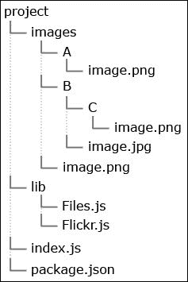
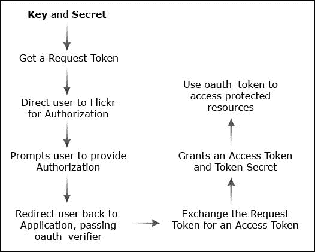
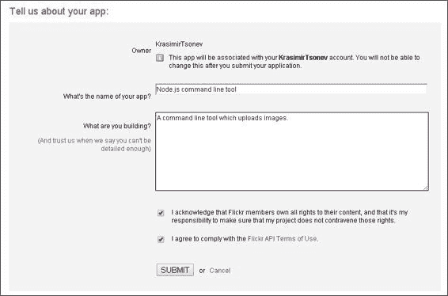
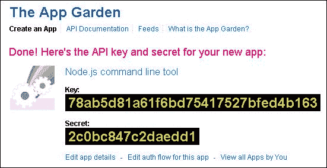
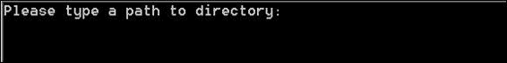
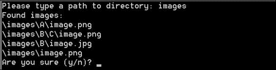
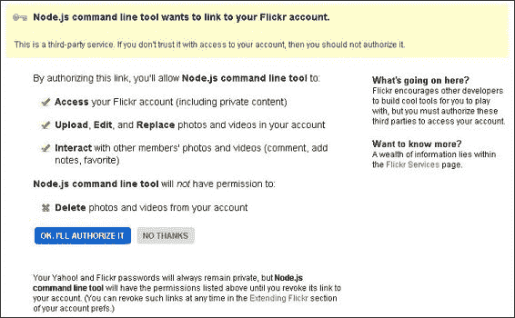
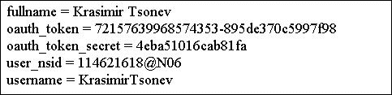
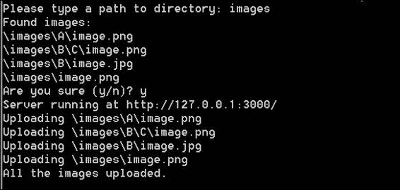

# 第六章：将 Node.js 用作命令行工具

在前面的章节中，我们学习了如何使用 Node.js 与客户端框架一起使用，例如 AngularJS 和 Backbone.js。每次，我们都从命令行运行后端。Node.js 不仅适合于 Web 应用程序，也适合于开发命令行工具。对文件系统的访问、各种内置模块以及庞大的社区使 Node.js 成为这类程序的有吸引力的环境。

在本章中，我们将详细介绍开发用于在 **Flickr** 上上传图片的命令行工具的过程。到本章结束时，我们将创建一个程序，该程序可以在特定目录中查找图片并将它们上传到互联网门户。

# 探索所需的模块

我们将使用几个模块来简化我们的工作，具体如下：

+   `fs`: 这为我们提供了对文件系统的访问，并且是 Node.js 模块的一个内置特性。

+   `optimist`: 这是一个模块，用于解析传递给我们的 Node.js 脚本的参数。

+   `readline`: 这允许按行读取流（例如 `process.stdin`）。我们将在应用程序运行时使用它来获取用户输入。该模块默认添加到 Node.js 中。

+   `glob`: 这个模块读取一个目录，并返回所有匹配预定义特定模式的现有文件。

+   `open`: 在某个时候，我们需要在用户的默认浏览器中打开一个页面。Node.js 在不同的操作系统上运行，这些操作系统有不同的命令来打开默认浏览器。此模块通过提供一个 API 来帮助我们。

+   `flapi`: 这是用于与 Flickr 服务通信的 Flickr API 包装器。

根据前面的列表，我们可以编写并使用以下 `package`.`json` 文件：

```js
{
  "name": "FlickrUploader",
  "description": "Command line tool",
  "version": "0.0.1",
  "dependencies": {
    "flapi": "*",
    "open": "*",
    "optimist": "*",
    "glob": "*"
  },
  "main": "index.js",
  "bin": {
    "flickruploader": "./index.js"
  }
}
```

我们脚本的入口点是 `index.js` 文件。因此，我们将它设置为 `main` 属性的值。还有一个我们尚未使用的特性——`bin` 属性。这是二进制脚本名称和 Node.js 脚本路径的键/值映射。换句话说，当我们的模块在 Node.js 包管理器的注册中发布并随后安装时，我们的控制台将自动拥有 `flickruploader` 命令。在安装过程中，`npm` 命令检查我们是否向 `bin` 属性传递了某些内容。如果是，那么它将创建我们脚本的 `symlink`。在 `index.js` 文件的顶部添加 `#!/usr/bin/env node` 也是非常重要的。这样系统就会知道脚本应该用 Node.js 处理。最后，如果我们输入命令并按 *Enter* 键，我们的脚本就会运行。

# 规划应用程序

我们可以将命令行工具分为两部分：第一部分读取一个目录并返回其中的所有文件，第二部分将图片发送到 Flickr。将这两个功能形成不同的模块是个好主意。以下图表显示了我们的项目将如何呈现：



`images` 目录将被用作测试文件夹，也就是说，我们的脚本将在该目录中执行其任务。当然，如果我们想的话，可以有一个其他的。之前提到的两个模块保存在 `lib` 目录中。因此，我们首先需要获取文件 (`Files.js`)，然后将其 (`Flickr.js`) 上传到门户。这两个操作是异步的，所以这两个模块都应该接受 **回调函数**。以下为 `index.js` 文件的内容：

```js
var flickr = require('./lib/Flickr');
var files = require('./lib/Files');
var flickrOptions = {};

files(function(images) {
  flickr(flickrOptions, images, function() {
    console.log("All the images uploaded.");
    process.exit(1);
  })
});
```

`Files` 模块将检查指定的文件夹，并扫描其中的子文件夹和图片。所有图片文件都将作为传递的回调函数的参数返回。这些图片将被发送到 `Flickr` 模块。除了文件外，我们还将传递一些访问 Flickr 服务的必要设置。最终，一旦一切顺利，我们将调用 `process.exit(1)` 来终止程序并将用户返回到终端。

# 从文件夹中获取图片

`Files.js` 文件以所需模块的定义开始：

```js
var fs = require('fs');
var argv = require('optimist').argv;
var readline = require('readline');
var glob = require('glob');
```

紧接着，我们需要定义两个变量。`currentDirectory` 变量存储当前工作目录的路径，而 `rl` 是 `readline` 模块的一个实例。

```js
var currentDirectory = process.cwd() + '/';
var rl = readline.createInterface({
  input: process.stdin,
  output: process.stdout
});
```

`createInterface` 函数接受一个对象。两个必需的字段是 `input` 和 `output`。`input` 字段将指向传入的可读流，而 `output` 指向可写流。在我们的例子中，用户将直接在终端/控制台中输入数据，因此我们将传递 `process.stdin`。

在本章的开头，我们提到了 `optimist` 模块。我们将使用它从命令行获取参数。在我们的例子中，这将是我们用于解析的目录。总是提供一种替代方法来应用设置是很好的，也就是说，除了询问用户外，还应接受命令行参数。每个 Node.js 脚本都有一个全局对象 `process`，它有一个 `argv` 属性。这个属性是从终端传递的参数的数组。`optimist` 模块简化了解析并提供了一个有效的 API 来访问这些参数。

让我们在 `rl` 变量的定义之后立即添加以下代码：

```js
module.exports = function(callback) {
  if(argv.s) {
    readDirectory(currentDirectory + argv.s, callback);
  } else {
    getPath(function(path) {
      readDirectory(path, callback);
    });
  }
};
```

```js
argv.s will be equal to images. So, we should check whether such a parameter is passed, and if yes, we continue with searching the image files. If not, ask the user via the readline module, the getPath function, as in the following code:
```

```js
var getPath = function(callback) {
  rl.question('Please type a path to directory: ', function(answer) {
    callback(currentDirectory + answer);
  });
}
```

询问方法的回调返回用户输入的文本。我们只需将其传递给 `readDirectory` 函数，如下所示：

```js
var readDirectory = function(path, callback) {
  if(fs.existsSync(path)) {
    glob(path + "/**/*.+(jpg|jpeg|gif|png)", function(err, files){
      if(err) {
          throw new Error('Can\'t read the directory.');
      }
      console.log("Found images:");
      files.forEach(function(file) {
        console.log(file.replace(/\//g, '\\').replace(process.cwd(), ''));
      });
      rl.question('Are you sure (y/n)? ', function(answer) {
        if(answer == 'y') {
          callback(files);
        }
        rl.close();
      });
    });    
  } else {
    getPath(function(path) {
      readDirectory(path, callback);
      });
  }
}
```

当然，我们应该检查路径是否有效。为此，我们将使用 `fs.existsSync` 方法。如果目录存在，我们将获取符合以下模式的文件：

```js
/**/*.+(jpg|jpeg|gif|png)
```

这意味着解析目录及其所有子目录，并搜索以 `jpg`、`jpeg`、`gif` 或 `png` 结尾的文件。在这种情况下，`glob` 模块非常有帮助。

在将文件发送回 `index.js` 之前，我们需要显示它们并请求用户确认。这同样是通过在开头包含的 `readline` 模块完成的。使用 `rl.close()` 方法是很重要的。此方法释放了对输入和输出流的控制。

# 授权 Flickr 协议

我们将使用`flapi`模块与 Flickr 进行通信。它提供了访问 API 方法的功能。大多数大型公司都会实施一定程度的授权。换句话说，我们不能只是发出请求并上传/检索数据。我们需要在请求中签名访问令牌或在过程中提供凭证。Flickr 使用**OAuth**（1.0 规范），这是一种此类操作的行业标准。OAuth 是一个开放标准，用于授权，并定义了客户端访问服务器资源的方法。让我们查看以下图表，看看 Flickr 的 OAuth 机制是如何工作的：



几乎整个流程都被`flapi`模块封装。我们应该记住的是，我们需要一个**密钥**和**密钥**来检索访问令牌。相同的令牌将在上传图片时使用。

## 获取应用程序的密钥和密钥

要创建我们自己的应用程序的*密钥*和*密钥*，我们首先必须拥有一个有效的 Flickr 账户。接下来，登录并导航到[`www.flickr.com/services/apps/create/apply/`](http://www.flickr.com/services/apps/create/apply/)。在此页面上，点击**申请非商业密钥**，这是蓝色的按钮。


我们正在构建一个非商业应用程序；然而，如果您计划将密钥用于商业目的，请选择右侧的第二个选项。之后，您将看到一个带有少量字段的表单。填写它们并点击以下截图所示的**提交**按钮：



将显示的下一屏包含我们的**密钥**和**密钥**。它应该看起来像以下截图：



## 向 Flickr.js 模块写入

一旦我们获取了**密钥**和**密钥**值，我们就可以继续并开始编写我们的`lib/Flickr.js`模块。以下是该文件的初始代码：

```js
var open = require('open');
var http = require('http');
var url = require('url');
var Flapi = require('flapi');

var flapiClient;
var filesToOpen;
var done;
var options;

module.exports = function(opts, files, callback) {
  options = opts;
  filesToOpen = files;
  done = callback;
  createFlapiClient();
}
```

所需的依赖项位于上一段代码的开头。我们提到了`open`模块；在这里，`http`用于运行 Node.js HTTP 服务器，而`url`用于解析传入请求的参数。该模块导出一个接受三个参数的函数。第一个参数包含 Flickr 的 API 设置，如**密钥**和**密钥**。第二个参数是需要上传的文件数组。最后，我们接受一个`callback`函数，该函数将在上传完成后被调用。我们将所有内容保存在几个全局变量中，并调用`createFlapiClient`，这将初始化`flapi`对象。在我们看到`createFlapiClient`中确切发生的事情之前，让我们编辑`index.js`并传递所需选项，如下所示：

```js
var flickr = require('./lib/Flickr');
var files = require('./lib/Files');
var flickrOptions = {
  oauth_consumer_key: "ebce9c7a68eb009f8db5bcc41d139320",
  oauth_consumer_secret: "a9277a76c947c0b3",
    // oauth_token: '',
    // oauth_token_secret: '',
  perms: 'write'
};
```

我们将`flickrOptions`留空，但现在是我们填充它的时候了。将**密钥**设置为`oauth_consumer_key`的值，将**密钥**设置为`oauth_consumer_secret`的值。默认情况下，令牌`oauth_token`和`oauth_token_secret`被注释掉，但一旦我们执行初始授权，我们将设置它们的值。最后，还有一个权限属性，应该设置为`write`，因为我们将会上传照片。

当在`Flickr.js`中配置了正确的选项时，我们可以创建我们的`flapi`客户端并开始查询 Flickr 的服务器，如下面的代码所示：

```js
var createFlapiClient = function(){
  flapiClient = new Flapi(options);
  if(!options.oauth_token) {
    flapiClient.authApp('http://127.0.0.1:3000', function(oauthResults){
      runServer(function() {
        open(flapiClient.getUserAuthURL());
      })
    });
  } else {
      uploadPhotos();
  }
};
```

我们传递设置，目前是`oauth_consumer_key`、`oauth_consumer_secret`和`perms`。请注意，`oauth_token`是`undefined`，我们需要授权我们的应用程序。这发生在浏览器中。Flickr 定义的机制要求打开一个特定的 URL 并传递一个回调地址，用户在获得权限后将被重定向到该地址。我们正在开发一个命令行工具，所以我们实际上无法提供该地址，因为我们的脚本在终端中。因此，我们运行自己的 HTTP 服务器，该服务器将接受来自 Flickr 的请求。当然，这个服务器将只在我们机器上和脚本执行期间可用。但那应该足够了，因为我们只需要在第一次运行时使用它。如果一切顺利，我们将获得`oauth_token`和`oauth_token_secret`值，如下面的代码所示。我们将它们设置在`flickrOptions`中，并且下次不会运行 HTTP 服务器。当服务器启动时，我们在用户的默认浏览器中打开一个新页面，传递由`flapiClient.getUserAuthURL`返回的正确 URL。

`runServer`函数背后的代码如下：

```js
var runServer = function(callback) {
    http.createServer(function (req, res) {
    res.writeHead(200, {'Content-Type': 'text/html'});
    var urlParts = url.parse(req.url, true);
    var query = urlParts.query;
    if(query.oauth_token) {
    flapiClient.getUserAccessToken(query.oauth_verifier, function(result) {
        options.oauth_token = result.oauth_token;
        options.oauth_token_secret = result.oauth_token_secret;
        var message = '';
        for(var prop in result) {
          message += prop + ' = ' + result[prop] + '<br />';
        }
        res.end(message);
        uploadPhotos();
      });
    } else {
      res.end('Missing oauth_token parameter.');
    }
  }).listen(3000, '127.0.0.1');
  console.log('Server running at http://127.0.0.1:3000/');
  callback();
}
```

服务器监听在端口 3000 上，并且只有一个处理器。我们正在等待的请求包含*GET*参数`oauth_verifier`。我们将通过使用`url`模块及其`parse`方法来获取它。同样重要的是，我们需要将`true`作为第二个参数发送，以便 Node.js 解析请求的查询字符串。通过将`oauth_verifier`传递给客户端的`getUserAccessToken`方法`flapi`，我们将获取所需的令牌和密钥。在最后，会调用一个名为`uploadPhotos`的函数，但现在我们将保持其主体为空。这将在本章的下一部分中填充。

## 运行我们的应用程序工具

现在，让我们运行我们的工具。在您的终端中输入`node ./index.js`，您将看到以下截图所示的内容：



我们测试的目录是`images`，所以我们输入这个字符串并点击*Enter*。`Files.js`中的代码将扫描目录中的图片，并要求我们确认，如下面的截图所示：



输入**y**并按*Enter*键。将显示一条消息，表明服务器正在运行，并且在我们的默认浏览器中打开一个新页面。它将要求我们授予应用程序执行几个操作的权限，如下面的截图所示：



点击带有文本**OK, I'LL AUTHORIZE IT**的蓝色按钮。此时有两个动作正在进行。浏览器发送一个带有`oauth_verifier`参数的请求到我们的 Node.js 服务器。我们使用该值，将其传递给`getUserAccessToken`方法，并获取所需的`oauth_token`和`oauth_token_secret`值。同时，浏览器收到响应，我们看到如下类似的截图：



我们将从第二行和第三行获取信息，并将其放入在`index.js`文件中初始化的`flickrOptions`对象中。通过这样做，我们将避免下次使用 Node.js 服务器执行的步骤。脚本将能够直接上传照片，而无需请求令牌和密钥。

# 上传图片

我们将要编写的最后一个函数是`Flickr.js`模块的`uploadPhotos`方法。它将使用全局`filesToOpen`数组，逐个上传文件。由于操作是异步的，我们将持续执行该函数，直到数组为空。我们可以看到如下代码：

```js
var uploadPhotos = function() {
  if(filesToOpen.length === 0) {
    done();
  } else {
    var file = filesToOpen.shift();
    console.log("Uploading " + file.replace(/\//g, '\\').replace(process.cwd(), ''));
    flapiClient.api({
      method: 'upload',
      params:  { photo : file },
      accessToken : { 
        oauth_token: options.oauth_token,
        oauth_token_secret: options.oauth_token_secret
      },
      next: function(data){
          uploadPhotos();
      }
  });
  }
}
```

`done`回调将应用程序流程返回到`index.js`，在那里脚本终止。整个过程的结果将如下截图所示：



# 摘要

在本章中，我们学习了如何将 Node.js 用作命令行工具。我们成功从终端获取了参数，搜索目录中的图片文件，并将它们上传到 Flickr。大多数原始操作，如文件系统访问或 Flickr OAuth 实现，都委托给了不同的模块，我们将它们作为依赖项添加到项目中。每天都有越来越多的工具出现，使 Node.js 成为一个吸引人的开发环境，不仅适用于基于 Web 的应用程序，也适用于命令行脚本。

在下一章中，我们将学习如何将 Node.js 和 Ember.js 一起使用。我们将获取 Twitter 社交动态并将其显示在浏览器上。
