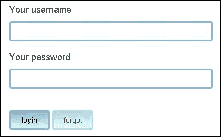
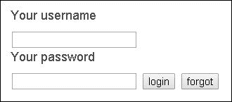

# 第十章：编写灵活和模块化的 CSS

在上一章中，我们学习了在 Node.js 下最流行的测试工具。我们看到了编写测试的重要性，并了解了 TDD 和 BDD。本章将介绍**CSS**（**层叠样式表**）和预处理器的作用。网络建立在三种语言的基础之上——HTML、CSS 和 JavaScript。作为现代技术的一部分，Node.js 提供了非常有帮助的工具来编写 CSS；在本章中，我们将探讨这些工具以及它们如何改进我们的样式表。本章将涵盖以下主题：

+   编写模块化 CSS 的流行技术

+   Less 预处理器

+   Stylus 预处理器

+   Sass 预处理器

+   AbsurdJS 预处理器

# 编写模块化 CSS

在过去的几年里，CSS（层叠样式表）发生了很大的变化。开发者曾经使用 CSS2 作为声明性语言来装饰页面。今天的 CSS3 给我们带来了更多的能力。如今，CSS 被广泛用于在页面上实现设计理念，动画化元素，甚至应用逻辑，如隐藏和显示内容块。大量的 CSS 代码需要更好的架构、文件结构和合适的 CSS 选择器。让我们探索一些可能有助于此的概念。

## BEM（块、元素、修饰符）

BEM（[`bem.info/method/definitions`](http://bem.info/method/definitions)）是由 Yandex 在 2007 年引入的一种命名约定。它成为了一种流行的前端应用开发概念。实际上，它不仅适用于 CSS，也适用于任何其他语言，因为它只有很少的规则却能很好地工作。

假设我们有以下 HTML 标记：

```js
<header class="site-header">
    <div class="logo"></div>
    <div class="navigation"></div>
</header>
```

我们可以立即想到的即时 CSS 如下：

```js
.site-header { ... }
.logo { ... }
.navigation { ... }
```

然而，这可能不会真正奏效，因为我们可能在页面的侧边栏中还有另一个标志。当然，我们可以使用后代选择器，如`.site-header { ... }`和`.logo { ... }`，但这些选择器带来了新的问题。将选择器连接成树状结构并不是一个好的实践，因为我们不能从中提取一部分并用于其他地方。BEM 通过定义我们可以遵循的规则来解决此问题。在 BEM 的上下文中，一个块是一个独立的实体。它可以是一个简单的块，也可以是一个复合块（包含其他块）。在先前的例子中，`<header>`标签先于 CSS 块。元素放置在块内，并且它们是上下文相关的，也就是说，只有当它们放置在所属的块内时才有意义。块中的`.logo`和`.navigation`选择器是元素。还有一种类型的选择器称为**修饰符**。为了更好地理解它们，我们将使用一个例子。假设圣诞节即将到来，我们需要制作一个假日版本的标志。同时，我们需要保留旧样式，因为几个月后我们需要将其恢复到之前的版本。这就是修饰符的作用。我们将它们应用于已存在的元素，以设置新的外观或样式。对于按钮也是如此，它有正常、按下或禁用状态。为了区分不同类型的选择器，BEM 引入了以下语法：

```js
.site-header { ... } /* block */
.site-header__logo { ... } /* element */
.site-header__logo--xmas { ... } /* modifier */
.site-header__navigation { ... } /* element */
```

元素名称添加双下划线，修饰符添加双破折号。

## 使用面向对象的 CSS 方法

**面向对象的 CSS**（**OOCSS**）([`github.com/stubbornella/oocss/wiki`](https://github.com/stubbornella/oocss/wiki))是另一个有助于我们编写更好 CSS 的概念。它最初由 Nicole Sullivan 提出，并定义了以下两个原则。

### 分离结构和皮肤

考虑以下 CSS：

```js
.header {
    background: #BADA55;
    color: #000;
    width: 960px;
    margin: 0 auto;
}
.footer {
    background: #BADA55;
    text-align: center;
    color: #000;
    padding-top: 20px;
}
```

有一些样式描述了元素的视觉和皮肤外观。重复是将其提取到单独定义中的良好理由。继续前面的代码如下：

```js
.colors-skin {
    background: #BADA55;
    color: #000;
}
.header {
    width: 960px;
    margin: 0 auto;
}
.footer {
    text-align: center;
    padding-top: 20px;
}
```

很好，我们可以使用相同的`.colors-skin`类应用于其他元素，甚至更好的是，我们只需在该特定类中稍作修改，就可以更改整个页面的主题。

### 分离容器和内容

想法是每个元素都应该有它的样式应用于它所处的任何上下文中。以下代码作为例子：

```js
.header .login-form {
  margin-top: 20px;
  background: #FF0033;
}
```

在某个时候，我们可能需要在网站的页脚中放置相同的表单。我们应用的`20px`值和`#FF0033`颜色将会丢失，因为表单不再位于页眉中。因此，避免这样的选择器将帮助我们防止此类情况发生。当然，我们不可能对每个元素都遵循这个原则，但总体来说，这是一个非常好的实践。

## CSS 的可伸缩和模块化架构

乔纳森·斯努克介绍了一种名为**可伸缩和模块化 CSS 架构**（**SMACSS**）的另一种有趣的方法([`smacss.com/`](http://smacss.com/))。他的想法是将应用程序的样式分类到不同的类别中，如下所示：

+   **基本选择器**：如用于清除浮动或基本字体大小等的基本选择器

+   **布局**：定义页面网格的 CSS 样式

+   **模块**：这些类似于 BEM 块，即形成有意义块的一组元素

+   **状态**：定义元素状态的 CSS 样式，例如，按下、展开、可见、隐藏等

+   **主题**：主题规则类似于状态规则，它们描述了模块或布局可能的外观

以这种方式构建样式表很好地组织了选择器。我们可以为不同类别创建不同的目录或文件，最终我们将拥有一切都设置得当。

## 原子设计

原子设计([`bradfrostweb.com/blog/post/atomic-web-design`](http://bradfrostweb.com/blog/post/atomic-web-design))，由布拉德·弗罗斯特提出的一个概念，是一种简单但非常强大的方法。我们知道物质的基本单位是原子。将这个概念应用到 CSS 中，我们可以将原子定义为简单的 HTML 标签：

```js
<label>Search the site</label>
```

原子包含一些基本样式，如颜色、字体大小或行高。稍后，我们可以将原子组合成分子。以下示例显示了如何将`form`标签由几个原子组成：

```js
<form>
    <label>Search the site</label>
    <input type="text" placeholder="enter keyword" />
    <input type="submit" value="search" />
</form>
```

正确地样式化和组合小块块带来了灵活性。如果我们遵循这个概念，我们可以反复使用相同的原子，或者将任何分子放在不同的上下文中。布拉德·弗罗斯特并没有止步于此。他继续说，分子可以合并成生物体，生物体可以合并成模板。例如，登录表单和主菜单分子定义了一个生物体头部。

本节中提到的所有概念并不适合每个项目。然而，它们都有一些有价值的东西可以应用。我们应尽量避免严格遵循它们，而是获取最适合我们当前应用的规则。

# 探索 CSS 预处理器

**预处理器**是接受代码并编译的工具。在我们的环境中，这些工具输出 CSS。使用预处理器有几个显著的优点。

+   **连接**：将所有内容写入一个单独的`.css`文件不再是可行的选择。我们都需要逻辑地分割我们的样式，这通常是通过创建多个不同的文件来实现的。CSS 有一个从另一个文件导入文件的机制——`@import`指令。然而，使用它，我们迫使浏览器向服务器创建另一个 HTTP 请求，这可能会降低我们应用程序的性能。CSS 预处理器通常通过替换`@import`的功能并简单地连接所有使用的文件来只输出一个文件。

+   **扩展（Extending**）：我们不喜欢反复写同样的事情，而在纯 CSS 编码中，这种情况经常发生。好消息是预处理器提供了一个解决这个问题的功能。它被称为混入。我们可以将其视为一个执行并应用其中定义的所有样式的函数。我们将在本章后面看到它在实际中的应用。

+   **配置（Configuration**）：通常，我们需要在 CSS 文件中重复颜色、宽度和字体大小。通过使用 CSS 预处理器，我们可以将这些值放入变量中，并在一个地方定义它们。切换到新的颜色方案或字体排印可以非常快地完成。

在大多数预处理器中使用的语法与正常 CSS 类似。这使得开发者可以几乎立即开始使用它们。让我们来看看可用的 CSS 预处理器。

## 使用 Less

Less 是一个基于 Node.js 的 CSS 预处理器。它作为 Node.js 模块分发，可以使用以下命令行安装：

```js
npm install -g less

```

安装成功后，我们应该能够在终端中调用`lessc`命令。在某个地方创建一个新的`styles.less`文件，并将以下代码放入其中：

```js
body {
  width: 100%;
  height: 100%;
}
```

如果我们运行`lessc ./styles.less`，我们将看到作为结果的相同 CSS。Less 采取的方法是使用与正常 CSS 中使用的语法相近的语法。因此，在实践中，几乎所有的现有 CSS 代码都可以由 Less 编译，这非常方便，因为我们可以在不做任何准备的情况下开始使用它。

### 定义变量

Less 中的变量定义方式与我们编写 CSS 属性的方式相同。我们只需在属性名前加上`@`符号，如下面的代码片段所示：

```js
@textColor: #990;
body {
  width: 100%;
  height: 100%;
  color: @textColor;
}
```

### 使用混入

**混入（Mixins**）在我们想要将特定样式从一个地方转移到另一个地方，甚至多个地方时非常有用。比如说，如果我们有一些需要为页面上的不同元素设置的固定边框，我们就会使用以下代码片段：

```js
.my-border() {
  border-top: solid 1px #000;
  border-left: dotted 1px #999;
}
.login-box {
  .my-border();
}
.sidebar {
  .my-border();
}
```

我们可以省略`.my-border`的括号，但这样结果文件中将会出现相同的类。现在的代码编译如下：

```js
.login-box {
  border-top: solid 1px #000;
  border-left: dotted 1px #999;
}
.sidebar {
  border-top: solid 1px #000;
  border-left: dotted 1px #999;
}
```

混入可以接受参数，这使得它们成为 Less 中最重要的功能之一。

```js
.my-border(@size: 2px) {
  border-top: solid @size #000;
  border-left: dotted @size #999;
}
.login-box {
  .my-border(4px);
}
.sidebar {
  .my-border();
}
```

在示例中，边框的大小作为参数传递。它还有一个默认值，为两像素。编译后的结果如下：

```js
.login-box {
  border-top: solid 4px #000000;
  border-left: dotted 4px #999999;
}
.sidebar {
  border-top: solid 2px #000000;
  border-left: dotted 2px #999999;
}
```

### 将样式结构化为嵌套定义

当我们使用后代选择器时，经常会遇到一个非常长的样式定义。这很烦人，因为我们必须输入更多，而且难以阅读。CSS 预处理器通过允许我们编写嵌套样式来解决此问题。以下代码显示了如何嵌套选择器：

```js
.content {
  margin-top: 10px;
  p {
    font-size: 24px;
    line-height: 30px;
    a {
      text-decoration: none;
    }
    small {
      color: #999;
      font-size: 20px;
    }
  }
}
.footer {
  p {
    font-size: 20px;
  }
}
```

这要容易理解得多，也更容易遵循。我们也不必担心冲突。例如，`.content` 元素中的段落将具有 24 像素的字体大小，并且不会与页脚的样式混合。这是因为最后，我们正确地生成了选择器：

```js
.content {
  margin-top: 10px;
}
.content p {
  font-size: 24px;
  line-height: 30px;
}
.content p a {
  text-decoration: none;
}
.content p small {
  color: #999;
  font-size: 20px;
}
.footer p {
  font-size: 20px;
}
```

Less 有十几个其他功能，如数学计算、函数定义、条件混入，甚至循环。我们可以就这个主题写一本全新的书。所有功能的完整列表可以在 [`lesscss.org/`](http://lesscss.org/) 上看到，这是 Less 的官方网站，包含其文档。

## 使用 Sass

另有一个流行的 CSS 预处理器叫做 **Sass**。实际上它不是基于 Node.js，而是基于 Ruby。因此，我们首先需要安装 Ruby。你还可以在官方下载页面找到有关如何安装 Ruby 的详细信息：[`www.ruby-lang.org/en/downloads`](https://www.ruby-lang.org/en/downloads)。一旦我们正确地设置了它，我们需要运行以下命令来获取 Sass：

```js
gem install sass

```

执行后，我们将安装一个命令行工具，即 `sass`，我们可以用它来运行 `.sass` 或 `.scss` 文件。`.sass` 文件中使用的语法看起来与 Stylus 中使用的语法相似（我们将在 *使用 Stylus* 部分学习这一点），而 `.scss` 文件中使用的语法与 Less 变体相似。起初，Less 和 Sass 看起来非常相似。Sass 在变量前使用 `$` 符号，而 Less 使用 `@` 符号。Sass 具有与 Less 相同的功能——条件语句、嵌套、混入、扩展。以下是一个简短的示例代码：

```js
$brandColor: #993f99;

@mixin paragraph-border($size, $side: '-top') {
  @if $size > 2px {
    border#{$side}: dotted $size #999;
  } @else {
    border#{$side}: solid $size #999;
  }
}

body {
  font-size: 20px;
  p {
    color: $brandColor;
    @include paragraph-border(3px, '-left')
  }
}
```

上述代码生成以下 CSS 代码：

```js
body {
  font-size: 20px;
}
body p {
  color: #993f99;
  border-top: dotted 3px #999;
}
```

有两个关键字：`@mixin` 和 `@include`。第一个定义混入，第二个在混入使用时是必需的。

## 使用 Stylus

**Stylus** 是另一个流行的 CSS 预处理器，由 Node.js 编写。与 Less 类似，Stylus 也接受常规 CSS 语法。然而，它引入了另一种编写方式——没有花括号、冒号和分号。以下是一个简短的示例代码：

```js
body {
  font: 12px Helvetica, Arial, sans-serif;
}
a.button {
  -webkit-border-radius: 5px;
  -moz-border-radius: 5px;
  border-radius: 5px;
}
```

在 Stylus 中，生成的 CSS 代码可能看起来像以下代码片段：

```js
body
  font 12px Helvetica, Arial, sans-serif

a.button
  -webkit-border-radius 5px
  -moz-border-radius 5px
  border-radius 5px
```

该语言使用缩进来识别定义。Stylus 作为 Node.js 模块分发，可以使用 `npm install -g stylus` 命令行安装。一旦过程完成，我们可以使用以下命令进行编译：

```js
stylus ./styles.styl

```

这是命令行，其中 `styles.styl` 包含必要的 CSS。结果，我们将在同一目录下得到 `styles.css` 文件。

Stylus 比 Less 稍微复杂一些。它仍然支持相同的功能，但具有更多的逻辑运算符。让我们看看一个演示其大多数功能的示例：

```js
brandColor = #FF993D
borderSettings = { size: 3px, side: '-top' }

paragraph-border(size, side = '')
  if size > 2px
    border{side}: dotted size #999
  else
    border{side}: solid size #999

body
  font-size: 20px
  p
    color: brandColor
    paragraph-border(borderSettings.size, borderSettings.side)
```

第一行定义了一个名为 `brandColor` 的变量。稍后，这个变量被用来设置段落的颜色。Stylus 支持将哈希对象作为变量的值。这真的很不错，因为我们可以定义一组选项。在前面的例子中，`borderSettings` 包含段落边框的大小和位置。`paragraph-border` 混入接受两个参数。第二个参数不是必需的，有一个默认值。有一个 `if`-`else` 语句定义了应用的边框类型。类似于 Less，我们有嵌套选择器的能力。段落的样式嵌套在 `body` 选择器内部。编译后，生成的 CSS 如下所示：

```js
body {
  font-size: 20px;
}
body p {
  color: #ff993d;
  border-top: dotted 3px #999;
}
```

## 使用 AbsurdJS

**AbsurdJS** 是 Node.js 中可用的另一个 CSS 预处理器，它采取了略微不同的方向。它不是发明新的语法，而是使用已经存在的语言——JavaScript。因此，变量、混入或逻辑运算符等特性自然出现，无需任何额外努力。

与其他预处理器类似，AbsurdJS 通过 Node.js 的包管理器分发。以下命令行将库安装到您的机器上：

```js
npm install -g absurd

```

CSS 样式写在 `.js` 文件中。实际上，该库接受 `.css`、`.json` 和 `.yaml` 文件，并成功处理它们，但在这本书中，我们将坚持使用 JavaScript 格式，因为它是最有趣的。每个传递给 AbsurdJS 的文件都以以下代码开始：

```js
module.exports = function(api) {
  // ...
}
```

导出的函数接受模块的 API。所有操作都通过 API 对象进行。因为一切都在 JavaScript 中，CSS 样式以 JSON 格式表示。以下是一个示例代码：

```js
module.exports = function(api) {
  api.add({
    body: {
      fontSize: '20px',
      margin: '0 12px'
    }
  })
}
```

代码被编译成以下 CSS：

```js
body {
  font-size: 20px;
  margin: 0 12px;
}
```

AbsurdJS 可以作为一个命令行工具使用。要处理包含前面代码片段的 `styles.js` 文件，我们应该执行以下代码：

```js
absurd -s ./styles.js -o ./styles.css

```

`-s` 标志来自源代码，`-o` 来自输出。该模块既可以用在代码中，也可以将 AbsurdJS 集成到每个 Node.js 应用程序中。我们只需在我们的 `package.json` 文件中添加库，并按以下代码所示引入它：

```js
var absurd = require('absurd')();
absurd.add({
  body: {
    fontSize: '20px',
    marginTop: '10px'
  }
}).compile(function(err, css) {
  // ...
});
```

实际上，对于 Less 预处理器，同样适用。它也可以在 Node.js 脚本中使用。

在讨论 Sass 和 Stylus 时，我们使用了一个例子：几行代码为页面的 `paragraph` 标签添加边框。以下代码阐述了如何使用 AbsurdJS 实现这一点：

```js
module.exports = function(api) {
  var brandColor = '#993f99';
  var paragraphBorder = function(size, side) {
    var side = side ? side : '-top';
    var result = {};
    result['border' + side] = (size > 2 ? 'dotted ' : 'solid ') + size + 'px #999';
    return result;
  }
  api.add({
    body: {
      fontSize: '20px',
      p: [
        { color: brandColor },
        paragraphBorder(3, '-left')
      ]
    }
  });
}
```

这一切都是关于构建 JavaScript 对象并将它们传递给 `add` 方法。仍然有嵌套、定义变量和使用混入（`paragraphBorder`）。

# 设计简单的登录表单样式

我们现在将编写一个简单登录表单的 CSS 样式。HTML 标记非常简单。它有两个标签、两个输入字段和两个按钮，如下代码所示：

```js
<form method="post" id="login">
    <label>Your username</label>
    <input type="text" name="u" />
    <label>Your password</label>
    <input type="password" name="p" />
    <input type="submit" value="login" />
    <input type="button" value="forgot" />
</form>
```

我们最终想要达到的结果如下截图所示：



作为预处理器，我们将使用 AbsurdJS 并以 JavaScript 格式编写我们的样式。让我们创建一个空的 `style.js` 文件并输入以下代码：

```js
module.exports = function(api) {
  var textColor = '#9E9E9E';
  var textColorLight = api.lighten('#9E9E9E', 50);
  var textColorDark = api.darken('#9E9E9E', 50);
  var brandColor = '#8DB7CD';
  var brandColorLight = api.lighten('#8DB7CD', 50);
  var brandColorDark = api.darken('#8DB7CD', 30);
  var warning = '#F00';
}
```

我们定义了页面的设置。在我们的例子中，它们只是颜色，但可以是任何其他东西，例如字体大小、边距或行间距。`api.lighten` 和 `api.darken` 函数用于生成颜色的变体。它们通过使它们变亮或变暗来改变传递的值，具体取决于百分比。

我们已经设置了配置，我们可以继续以下基本 CSS：

```js
api.add({
  body: {
    width: '100%', height: '100%',
    margin: 0, padding: 0,
    color: textColor,
    fontFamily: 'Arial'
  }
});
```

这些样式应用于我们页面上的 `body` 标签。如果我们现在打开页面，我们将看到以下结果：


这是因为我们还没有处理表单。让我们继续并使用以下代码定义其基本规则：

```js
api.add({
  body: {
    width: '100%', height: '100%',
    margin: 0, padding: 0,
    color: textColor,
    fontFamily: 'Arial',
    '#login': [
      { 
        width: '400px', 
        margin: '0 auto',
        padding: '30px 0 0 30px',
        label: { 
          display: 'block',
          margin: '0 0 10px 0',
          color: textColorDark
        }
      }
    ]
  }
});
```

`#login` 选择器匹配表单。我们将它定位在页面中间，并设置顶部和底部的填充。我们还使 `label` 标签成为一个块元素。现在示例看起来好多了，如下面的截图所示：



如果我们检查从其开始的 HTML 标记，我们会看到其余的元素都是 `input` 标签，即两个字段和两个按钮。让我们创建一个函数（混合），用于生成这些元素的 CSS：

```js
var input = function(selector, addons) {
  var result = {};
  result[selector] = {
    '-wm-border-radius': '4px',
    '-wm-box-sizing': 'border-box',
    marginBottom: '20px',
    border: 'solid 3px ' + brandColor,
    width: '100%',
    padding: '8px',
    '&:focus': {
      outline: 0,
      background: textColorLight
    }
  }
  if(addons) {
    for(var prop in addons) {
      result[selector][prop] = addons[prop];
    }
  }
  return result;
}
```

`input` 方法接受一个选择器和对象。因为我们将使用该函数来样式字段和按钮，我们需要一个机制来添加自定义规则。如果定义了 `addons` 对象，它将包含需要设置的额外样式。有两个属性可能看起来很奇怪：`-wm-border-radius` 和 `-wm-box-sizing`。在开始时，`-wm-` 属性将浏览器前缀添加到 CSS 的末尾。例如，`-wm-box-sizing: border-box` 产生以下输出：

```js
box-sizing: border-box;
-webkit-box-sizing: border-box;
-moz-box-sizing: border-box;
```

`&:focus` 属性也是一个特殊属性。井号代表编写样式的选择器。在函数的末尾，我们添加了自定义 CSS。现在，让我们看看用例：

```js
'#login': [
  { 
    width: '400px', 
    margin: '0 auto',
    padding: '30px 0 0 30px',
    label: { 
      display: 'block',
      margin: '0 0 10px 0',
      color: textColorDark
    }
  },
  input('input[type="text"]'),
  input('input[type="password"]', {
    marginBottom: '40px'
  }),
  input('input[type="submit"]', {
    gradient: brandColorLight + '/' + brandColor,
    width: '80px'
  }),
  input('input[type="button"]', {
    gradient: brandColorLight + '/' + brandColor,
    width: '80px',
    transparent: 0.6,
    '&:hover': {
      transparent: 1
    }
  })
]
```

对于输入字段，我们仅使用选择器调用输入方法。然而，对于按钮，我们需要更多的样式，并且它们作为 JavaScript 对象传递。AbsurdJS 内置了混合，允许我们生成跨浏览器的 CSS，例如 `gradient` 和 `transparent` 属性。执行 `gradient` 属性的结果如下：

```js
/* gradient: brandColorLight + '/' + brandColor  */
background: -webkit-linear-gradient(0deg, #d4ffff 0%, #8DB7CD 100%);
background: -moz-linear-gradient(0deg, #d4ffff 0%, #8DB7CD 100%);
background: -ms-linear-gradient(0deg, #d4ffff 0%, #8DB7CD 100%);
background: -o-linear-gradient(0deg, #d4ffff 0%, #8DB7CD 100%);
background: linear-gradient(0deg, #d4ffff 0%, #8DB7CD 100%);
-ms-filter: progid:DXImageTransform.Microsoft.gradient(startColorstr='#FF8DB7CD',endColorstr='#FFD4FFFF',GradientType=0);

```

此外，执行 `transparent` 属性的结果如下：

```js
/* transparent: 0.6  */
filter: alpha(opacity=60);
-ms-filter: progid:DXImageTransform.Microsoft.Alpha(Opacity=60);
opacity: 0.6;
-moz-opacity: 0.6;
-khtml-opacity: 0.6;

```

使用混合比我们自己编写所有这些内容要容易得多。一旦我们添加了 `input` 调用，我们就完成了。AbsurdJS 产生了期望的结果。

# 摘要

CSS 是并且将始终是网络的重要组成部分。使其简单、结构良好且具有灵活的标记，有助于构建良好的架构。在本章中，我们学习了编写模块化 CSS 的最流行概念。同时，我们还探讨了 CSS 预处理领域的最新趋势、可用工具及其特性。

Node.js 运行速度快，经常被用作 REST API。在下一章中，我们将看到如何编写 REST API 以及这一方向的最佳实践。
