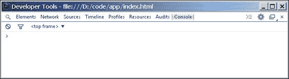
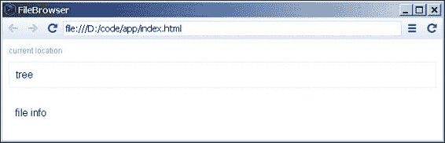
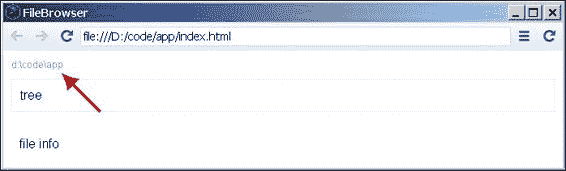
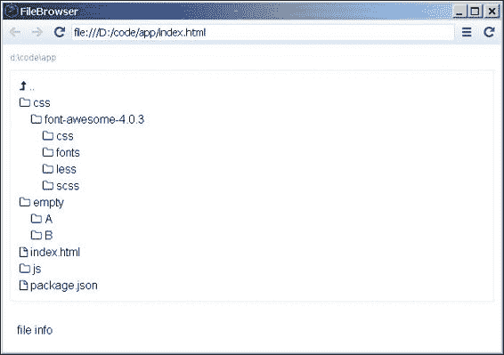
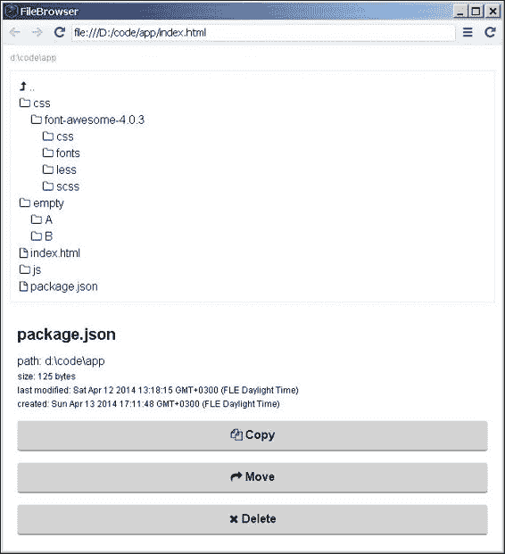
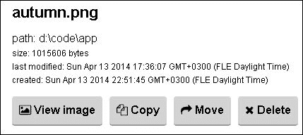
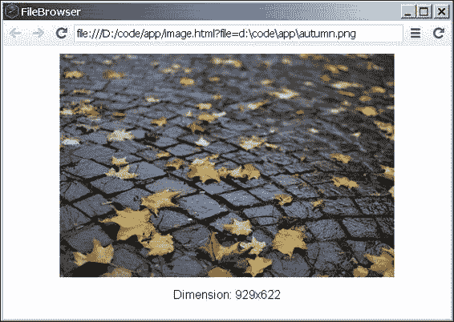
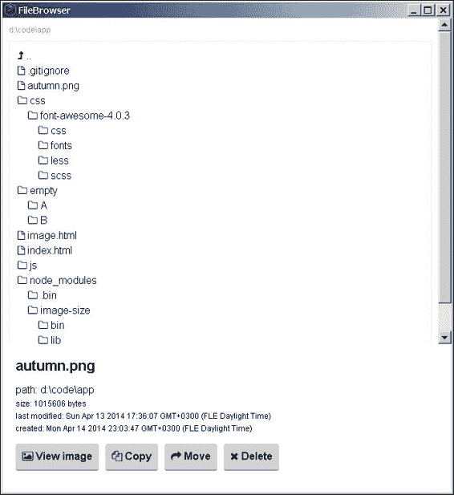

# 第十二章. 使用 Node.js 开发桌面应用程序

在上一章中，我们实现了一个 REST API 并构建了一个处理各种请求的服务器。本书的大部分章节都介绍了网络技术，这些技术是在浏览器中通过 HTTP 协议工作的应用程序。有趣的是，Node.js 可以用来生成桌面程序，我们不需要学习新的语言或使用新的工具。我们可以继续使用 HTML、CSS 和 JavaScript。这是一个很大的好处，因为这些技术易于学习和开发。Node.js 也非常快：当我们处理大量编写的模块时，我们可以节省很多时间，因为我们不需要处理琐碎的问题。在本章中，我们将编写一个文件浏览器。我们的应用程序将执行以下操作：

+   以桌面程序运行

+   从我们的硬盘读取文件并在屏幕上显示它们

+   显示图片

# 使用 node-webkit

有几种工具可用于编写桌面应用程序。我们将使用 node-webkit（[`github.com/rogerwang/node-webkit`](https://github.com/rogerwang/node-webkit)）。它是一个基于 Chromium 和 Node.js 的应用程序运行时。它作为二进制程序分发，我们运行它来查看代码的结果。它适用于所有主要的操作系统——Linux、Windows 和 Mac。因此，在开发过程中，我们将使用`nw`可执行文件，这与使用`node`可执行文件运行 Node.js 脚本相同。`nw`文件可以从 GitHub 上该工具的官方仓库下载。

每个用 node-webkit 编写的桌面应用程序至少必须包含两个文件：`package.json`和主 HTML 文件。类似于我们迄今为止编写的模块，`package.json`文件包含我们应用程序的配置。以下是一个简单的示例：

```js
{
  "name": "nw-demo",
  "main": "index.html"
}
```

为`main`属性设置一个值是很重要的。它应该指向文件浏览器的主 HTML 文件。路径相对于`package.json`文件的位置。`index.html`的内容可能如下所示：

```js
<!DOCTYPE html>
<html>
  <head>
    <title>Hello World!</title>
  </head>
  <body>
    <h1>Hello World!</h1>
    We are using node.js <script>document.write(process.version)</script>.
  </body>
</html>
```

这只是一个普通的 HTML 页面，除了放置在`script`标签之间的代码。`document.write`方法在所有现代浏览器中都是可用的。然而，`process`是 Node.js 的全局对象。这个例子很简单，但我们能看出 node-webkit 的力量。在实践中，我们可以将客户端 JavaScript 与服务器端 JavaScript 混合，后者在我们的机器环境中运行。我们可以在 Node.js 环境中编码，同时仍然可以访问页面的 DOM。 

运行应用有以下两种方式：

+   我们可以导航到包含文件的目录并运行`nw ./`

+   我们可以将这两个文件压缩成`myapp.zip`，例如，将存档重命名为`myapp.nw`，然后运行`nw myapp.nw`

一旦我们完成编程，我们可以将其与 node-webkit 可执行文件一起打包。对于最终用户来说，这意味着不需要安装额外的软件或单独下载 node-webkit。这使得分发变得更容易。有一些规则我们作为开发者应该遵循，例如，在 Windows 操作系统下发送少量的 `.dll` 文件（和许可文件）。然而，了解我们可以打包项目并在其他机器上运行它而不安装依赖项是很好的。

完成此操作的步骤取决于操作系统，并在官方文档中定义良好（[`github.com/rogerwang/node-webkit`](https://github.com/rogerwang/node-webkit)）。如前所述，node-webkit 基于 Chromium。通常，当我们编写客户端 JavaScript 或 CSS 时，我们会遇到很多问题，因为浏览器之间存在差异。然而，在这里我们只有一个浏览器，不需要考虑复杂的解决方案。我们只需编写在 Webkit 下运行的代码即可。我们还可以使用与 Google Chrome 中几乎相同的开发者工具面板。启动我们的应用程序后，我们将看到以下窗口——即由 node-webkit 生成的窗口：


在右上角有一个小按钮，它为我们提供了访问 **元素**、**网络**、**源代码**、**时间轴**、**配置文件**、**资源**、**审核** 和 **控制台** 面板的权限。当我们点击该按钮时，我们会看到一个类似于以下截图的窗口：



拥有相同的工具简化了调试和测试过程。正如我们在本章开头所指出的，我们不必学习新的语言或使用不同的技术。我们可以坚持使用常见的 HTML、CSS 和 JavaScript。

# 编写应用程序的基础

在开始实际实现我们的文件浏览器之前，我们必须准备 HTML 布局、JavaScript 部分的基座和 `package.json` 文件。

## 编写 package.json 文件

`package.json` 文件应放置在项目的根目录下。它是一个包含类似以下代码内容的文件：

```js
{
  "name": "FileBrowser",
  "main": "index.html",
  "window": {
    "toolbar": true,
    "width": 1024,
    "height": 800
  }
}
```

我们已经讨论了 `name` 和 `main` 属性。`window` 对象是针对桌面环境的特定设置；它告诉 node-webkit 主应用程序窗口应该如何显示。在前面代码中，我们只设置了三个属性。`width` 和 `height` 属性定义了窗口大小，`toolbar` 隐藏或显示最上面的面板，使我们的程序看起来像浏览器。通常我们不需要它，在开发周期结束时，我们将 `toolbar` 设置为 `false`。还有一些其他选项我们可以应用，例如 `title` 或 `icon`。我们甚至可以隐藏关闭、最大化、最小化按钮。

## 准备 HTML 布局

我们开始准备布局的 HTML 代码如下：

```js
<!DOCTYPE html>
<html lang="en">
    <head>
        <meta charset="utf-8">
        <title>FileBrowser</title>
        <link rel="stylesheet" href="css/styles.css">
        <link rel="stylesheet" href="css/font-awesome-4.0.3/css/font-awesome.min.css">
        <script src="img/scripts.js"></script>
    </head>
    <body>
      <section class="tree-area">
        <div class="current-location"></div>
        <div class="tree"></div>
      </section>
        <section class="file-info"></section>
    </body>
</html>
```

有两个 CSS 文件。第一个是`styles.css`，它包含为我们的应用程序编写的样式，第二个使用来自`font-awesome`的酷字体图标，这些图标由字体表示而不是图像。这个资源的确切内容不包括在本章中，但你可以从本书提供的附加材料中找到。

此外，一个`scripts.js`文件将托管文件浏览器的 JavaScript 逻辑。

应用程序有两个部分：

+   **树**：这是我们展示当前目录的名称及其内容（文件和文件夹）的地方

+   **文件信息**：如果选中了一个文件，这个区域将显示一些其特征和复制、移动和删除的按钮

如果我们使用前面的代码运行 node-webkit，结果将如下所示：



## 设计 JavaScript 基础

让我们打开`scripts.js`文件，看看如何构建 JavaScript 代码。在文件的开头，我们定义了所需的 Node.js 模块和一个全局变量`root`：

```js
var fs = require('fs');
var path = require('path');
var root = path.normalize(process.cwd());
```

我们使用`fs`模块进行所有文件系统相关的操作。`path`模块包含用于处理文件路径的实用方法。例如，操作系统之间有一些差异，例如，在 Windows 中，路径使用反斜杠编写，而在 Linux 中，它使用正斜杠。`path.normalize`方法通过根据操作系统纠正字符串到正确的格式来处理这个问题。

我们将要读取的第一个文件夹是应用程序启动的目录。因此，我们使用`process.cwd()`来获取当前工作目录。

在全局范围内工作不是一个好的做法，因此我们将创建一个名为`Tree`的 JavaScript 类，如下所示：

```js
var Tree = function() {

  var api = {},
      el,
      currentLocationArea,
      treeArea,
      fileArea

  api.cwd = root;
  api.csf = null;

  api.init = function(selector) {
    el = document.querySelector(selector);
    currentLocationArea = el.querySelector('.current-location');
    treeArea = el.querySelector('.tree');
    fileArea = document.querySelector('.file-info');
    return api;
  }

  return api;
}
```

前面代码中的定义使用了揭示模块模式，这是一个很好的模式来封装 JavaScript 逻辑。`api`对象是类的公共接口，并在最后返回。变量`el`、`currentLocationArea`、`treeArea`和`fileArea`是私有变量，代表页面上的 DOM 元素。它们在`init`方法中初始化。缓存对 DOM 的查询是一个好的做法。通过将元素的引用存储在局部变量中，我们避免了额外的`querySelector`调用。

有两个公共属性：`cwd`（当前工作目录）和`csf`（当前选中文件）。我们使它们成为公共的，因为我们可能需要在模块外部使用它们。一开始，没有选中的文件，`csf`的值是`null`。

与在浏览器中的开发类似，我们需要一个入口点。我们的代码在 Chromium 中运行，所以使用`window.onload`看起来是一个不错的选择。我们将把初始化代码放在`onload`处理程序中，如下所示：

```js
var FileBrowser;
window.onload = function() {
  FileBrowser = Tree().init('.tree-area');
}
```

我们只需创建我们类的一个实例并调用`init`方法。我们传递了`.tree-area`参数，这是`<section>`标签的选择器，它将显示文件。

# 显示和使用工作目录

在本节中，我们将介绍我们的文件浏览器的核心功能。最后，我们的应用程序将读取当前工作目录。它将显示其内容，用户可以在显示的文件夹之间进行导航。

## 显示当前工作目录

我们将 `api.cwd` 的值放入具有 `currentLocation` 类的 div 中。它由 `currentLocationArea` 私有变量表示。我们只需要一个函数来设置元素的 `innerHTML` 属性：

```js
var updateCurrentLocation = function() {
  currentLocationArea.innerHTML = api.cwd;
}
```

这可能是我们类中最简单的函数。我们将每次更改目录时都调用它，这可能会很频繁。将此调用委托给另一个方法是个好主意。除了更新当前位置区域外，我们还将刷新文件区域。因此，编写一个 `render` 函数是有意义的。目前，该方法仅调用 `updateCurrentLocation`，但我们将稍后添加更多函数：

```js
var render = function() {
  updateCurrentLocation();
}
api.init = function(selector) {
  ...
  render();
  return api;
}
```

当然，我们应该在 `init` 方法中调用这个 `render` 函数，这将给我们以下结果：



注意，现在我们的文件浏览器显示了进程开始处的目录。

## 显示文件和文件夹

在本章的这一部分，我们将创建一个函数，用于显示当前工作目录内放置的所有文件和文件夹。这听起来可能是一个很棒的功能，但它也伴随着它自己的问题。主要问题是如果我们进入文件系统的根目录，我们不得不在屏幕上显示大量项目。因此，我们不会构建一个巨大的树，而会在第三层嵌套处停止。让我们添加两个新的私有变量：

```js
var html = '';
var maxLevels = 3;
```

`html` 变量将保持我们应用于 `treeArea` 元素的 `innerHTML` 属性的字符串。

我们的浏览器将以不同的方式处理文件和目录。如果用户选择一个文件，那么应该显示有关该文件的信息，例如文件创建时间、大小等。此外，我们的程序将提供一些按钮用于操作，如复制、移动或删除文件。如果点击了一个文件夹，那么 `api.cwd` 变量应该改变，并且应该触发 `render` 方法。视觉表示也应该不同。以下函数将向树中添加一个新项目：

```js
var addItem = function(itemPath, fullPath, isFile, indent) {
  itemPath = path.normalize(itemPath).replace(root, '');
  var calculateIndent = function() {
    var tab = '&nbsp;&nbsp;&nbsp;&nbsp;', str = '';
    for(var i=0; i<indent; i++) {
      str += tab;
    }
    return str;
  }
  if(isFile) {
    html += '<a href="#" class="file" data-path="' + fullPath + '">';
    html += calculateIndent(indent) + '<i class="fa fa-file-o"></i> ' + itemPath + '</a>';
  } else {
    html += '<a href="#" class="dir" data-path="' + fullPath + '">';
    html += calculateIndent(indent) + '<i class="fa fa-folder-o"></i> ' + itemPath + '</a>';
  }
}
```

`itemPath` 参数仅包含文件或目录的名称，而 `fullPath` 显示项目的绝对路径。根据 `isFile` 参数，将正确选择附加链接的图标。需要最新的 `indent` 参数来定义树的视觉外观。如果没有这个参数，所有链接都将从窗口的左侧开始。请注意，我们在 `data-path` 属性中添加了文件或文件夹的完整路径。我们这样做是因为稍后任何链接都可以点击，我们需要知道选择了什么。

现在，我们需要一个函数，该函数使用`addItem`函数，它接受一个路径并遍历所有文件和子目录。我们还需要某种递归调用方法，以便我们可以生成一个树。正如我们可以在以下代码中看到的那样，有一个检查，如果我们在读取目录，并且如果是的话，再次执行`walk`函数：

```js
var walk = function(dir, level, done) {
  if(level === maxLevels) {
    done(); 
    return;
  }
    fs.readdir(dir, function(err, list) {
      if (err) return done(err);
      var i = 0;
      (function next() {
          var file = list[i++];
          if(!file) return done();
        var filePath = dir + '/' + file;
        fs.stat(filePath, function(err, stat) {
            if (stat && stat.isDirectory()) {
              addItem(file, filePath, false, level);
                walk(filePath, level + 1, function() {                      
                  next();
                });
            } else {
              if(level === 0) {
                  addItem(file, filePath, true, level);
                }
                next();
            }
        });
      })();
    });
};
```

由于`walk`函数将被反复调用，我们需要检查它是否达到了最大嵌套级别（在我们的情况下设置为`3`）；这就是前几行的作用。紧接着，调用`fs.readdir`函数。这是一个异步的 Node.js 原生函数，它返回传递的目录中的内容。在接收数据的闭包中，我们将遍历每个结果并检查项目是文件还是文件夹。如果是文件夹，则再次调用`walk`函数。请注意，我们传递了级别，并且每次调用都会增加。

最后，我们只需运行`walk`方法，并用初始值填充`html`变量，就像以下代码中所做的那样：

```js
var updateFiles = function() {
  html = '<a href="#" class="dir" data-path="' + path.normalize(api.cwd + '/../') + '"><i class="fa fa-level-up"></i> ..</a>';
  walk(api.cwd, 0, function() {
    treeArea.innerHTML = html;
  });
}
```

在文件树的顶部，我们添加了一个指向父目录的链接。这就是用户如何在文件系统中向上移动的方式。

更新的渲染方法如下：

```js
var render = function() {
  updateCurrentLocation();
  updateFiles();
}
```

如我们所见，`updateFiles`方法被调用得相当频繁。这有点昂贵，因为它运行了`walk`函数。这也是限制文件夹嵌套的原因之一。如果我们现在启动应用程序，我们应该在屏幕顶部看到当前目录，并在`treeArea`元素中看到其内容。以下截图显示了屏幕上的样子：



## 更改当前目录

我们的文件浏览器成功显示了位于我们硬盘上的文件。接下来，我们想要做的是从一个文件夹跳转到另一个文件夹。因为我们精心设计了我们的类，所以实现这个功能很容易。以下两个步骤将更改目录：

+   更新`api.cwd`变量

+   调用`render`方法

这两个动作应该在用户点击树中的某些项目时执行。非常流行的方法是在每个链接上附加一个`click`处理程序并监听用户交互。然而，这将导致一些问题。每次树更新时，我们必须重新分配监听器；这是因为监听器附加到的元素已经被替换并且不再在 DOM 中。一个更好的方法是在`treeArea`元素上仅添加一个处理程序。当其子元素产生`click`事件时，默认情况下，它会在 DOM 中向上冒泡。此外，因为我们没有捕获它，所以它达到了`treeArea`元素的处理器。所以以下`setEvents`函数监听在`treeArea`对象中触发的点击事件：

```js
var setEvents = function() {
  treeArea.addEventListener('click', function(e) {
    e.preventDefault();
    if(e.target.nodeName !== 'A' && e.target.nodeName !== 'I') return;
    var link = e.target.nodeName === 'A' ? e.target : e.target.parentNode;
    var itemPath = path.normalize(link.getAttribute('data-path'));
    var isFile = link.getAttribute('class') === 'file';
    if(isFile) {
      updateFileArea(itemPath);  
    } else {
      api.cwd = itemPath;
      render();
    }
  });
}
```

需要调用`e.preventDefault`是因为我们不希望执行默认的链接行为。所有`<a>`标签的`href`属性被设置为`#`。通常情况下，这将使页面滚动到顶部。然而，我们不想这样，所以我们调用`e.preventDefault`。接下来的检查确保`click`事件来自正确的元素。这实际上非常重要，因为用户可能会点击一些其他元素，而这些元素仍然是`treeArea`的子元素。我们期望获取到`<a>`或`<i>`（链接内的图标）标签。文件或文件夹的路径来自`data-path`属性。为了确定当前选中的项是否是文件，我们检查其`class`属性的值。另一方面，如果用户点击文件夹，我们简单地触发`render`方法；否则，调用一个新的函数`updateFileArea`。

我们刚才讨论的函数（`setEvents`）只被触发一次，而进行这一操作的正确位置是`init`方法：

```js
api.init = function(selector) {
  ...
  setEvents();
  return api;
}
```

## 复制、移动和删除文件

我们实现了文件夹切换，接下来要做的就是文件处理。我们已经提到了调用`updateFileArea`函数。它应该接受文件路径。以下代码是该函数的主体：

```js
var updateFileArea = function(itemPath) {
  var html = '';
  api.csf = itemPath;
  if(itemPath) {
    fs.stat(itemPath, function(err, stat) {
      html += '<h3>' + path.basename(itemPath) + '</h3>';
      html += '<p>path: ' + path.dirname(itemPath) + '</p>';
      html += '<p class="small">size: ' + stat.size + ' bytes</p>';
      html += '<p class="small">last modified: ' + stat.mtime + '</p>';
      html += '<p class="small">created: ' + stat.ctime + '</p>';
      html += '<a href="javascript:FileBrowser.copy()"><i class="fa fa-copy"></i> Copy</a>';
      html += '<a href="javascript:FileBrowser.move()"><i class="fa fa-share"></i> Move</a>';
      html += '<a href="javascript:FileBrowser.del()"><i class="fa fa-times"></i> Delete</a>';
      fileArea.innerHTML = html;  
    });  
  } else {
    fileArea.innerHTML = '';
  }
}
```

该方法的功能是将`fileArea`元素填充与文件相关的信息。当用户点击文件夹时，我们将使用相同的函数清除`fileArea`元素。因此，如果`updateFileArea`函数没有传递任何参数，信息块将变为空。文件大小、创建和修改时间可以通过原生的 Node.js 函数`fs.stat`获取。在文件特性的下方，我们放置了三个按钮。每个按钮都会调用全局`FileBrowser`对象的方法，该对象是我们`Tree`类的一个实例。请注意，我们没有传递文件的路径。`copy`、`move`和`del`函数将从我们之前填充的`api.csf`变量中获取这些信息。以下方法将用于将文件从一个地方复制到另一个地方：

```js
api.copy = function() {
  if(!api.csf) return;
    getFolder(function(dir) {
      var file = path.basename(api.csf);
      fs.createReadStream(api.csf).pipe(fs.createWriteStream(dir + '/' + file));
      api.csf = null;
      updateFileArea();
      alert('File: ' + file + ' copied.');
    });
}
```

因此，我们知道我们想要复制、移动或删除的文件及其绝对路径，它存储在`api.csf`中。为了复制和移动，我们需要一个目标路径。用户应该能够从硬盘上选择一个目录，因为这个过程发生在两个位置，所以将这个过程封装在一个函数中——`getFolder`——是个好主意。一旦这个方法返回目标路径，我们只需将内容作为流获取并保存到另一个地方。以下是`getFolder`辅助函数的主体：

```js
var getFolder = function(callback) {
   var event = new MouseEvent('click', {
      'view': window,
      'bubbles': true,
       'cancelable': true
   });
    var input = document.createElement('INPUT');
    input.setAttribute('type', 'file');
    input.setAttribute('webkitdirectory', 'webkitdirectory');
    input.addEventListener('change', function (e) {
      callback(this.value);
  });
    input.dispatchEvent(event);
}
```

通常，没有用户交互，无法打开选择目录的对话框。然而，在 node-webkit 中这是可能的。正如前述代码所示，我们创建一个新的`MouseEvent`事件和一个新的`<input>`元素来分发此事件。关键因素是`webkitdirectory`属性，这是 node-webkit 特有的，它将元素从文件选择器转换为文件夹选择器。`getFolder`函数接受一个`callback`函数，当用户选择目录时，该函数会被调用。

删除文件的函数看起来像以下代码片段：

```js
api.del = function() {
  if(!api.csf) return;
  fs.unlink(api.csf, function() {
      alert('File: ' + path.basename(api.csf) + ' deleted.');
      render();
       api.csf = null;
    });
}
```

删除文件的函数几乎相同，只是它使用`fs.unlink`从操作系统中删除文件。最后，移动文件的方法结合了`copy`和`del`函数。

```js
api.move = function() {
  if(!api.csf) return;
    getFolder(function(dir) {
      var file = path.basename(api.csf);
      fs.createReadStream(api.csf).pipe(fs.createWriteStream(dir + '/' + file));
      fs.unlink(api.csf, function() {
          alert('File: ' + file + ' moved.');
          render();
          api.csf = null;
      });
    });
}
```

我们需要复制文件，然后从原始位置删除它。有了这个最后的补充，我们的文件浏览器就完成了。以下截图显示了选择文件时的外观：



# 扩展应用程序

我们文件浏览器的样子看起来不错。我们可以看到机器上的文件夹和文件，并且可以复制、移动或删除它们。此外，我们只使用了 HTML、CSS 和 JavaScript 就完成了所有这些。让我们继续并添加一个新功能。我们编写的应用程序由 Chromium 运行。换句话说，我们的 HTML 和 CSS 由浏览器渲染，因此我们可以在其中轻松显示图像。在接下来的几页中，我们将创建一个程序图片查看器。

## 调整 updateFileArea 函数

首先要做的是确定当前选定的文件是否为图像。我们将显示 JPEG 和 PNG 文件，因此我们应该检查文件是否匹配这些扩展名之一。在将标记填充到`html`变量之前，我们将提取文件的扩展名，如下面的代码所示：

```js
var updateFileArea = function(itemPath) {
  var html = '';
  api.csf = itemPath;
  if(itemPath) {
    fs.stat(itemPath, function(err, stat) {
      var ext = path.extname(itemPath).toLowerCase();
      var isImage = ext === '.jpg' || ext === '.jpeg' || ext === '.png';
      html += '<h3>' + path.basename(itemPath) + '</h3>';
      html += '<p>path: ' + path.dirname(itemPath) + '</p>';
      html += '<p class="small">size: ' + stat.size + ' bytes</p>';
      html += '<p class="small">last modified: ' + stat.mtime + '</p>';
      html += '<p class="small">created: ' + stat.ctime + '</p>';
      if(isImage) {
        html += '<a href="javascript:FileBrowser.viewImage()"><i class="fa fa-picture-o"></i> View image</a>';  
      }
      html += '<a href="javascript:FileBrowser.copy()"><i class="fa fa-copy"></i> Copy</a>';
      html += '<a href="javascript:FileBrowser.move()"><i class="fa fa-share"></i> Move</a>';
      html += '<a href="javascript:FileBrowser.del()"><i class="fa fa-times"></i> Delete</a>';
      fileArea.innerHTML = html;  
    });  
  } else {
    fileArea.innerHTML = '';
  }
}
```

函数的下一个补充是一个仅在选中图片时显示的按钮。到目前为止（当我们有四个按钮时），对布局做一些更改以使所有按钮都在一行中是很好的。到目前为止，链接是`block`元素，将它们改为`inline-block`解决了问题。以下截图显示了结果：



## 为选定的图像加载新页面

与其他三个链接类似，新的链接调用全局`FileBrowser`对象的函数——`FileBrowser.viewImage`：

```js
api.viewImage = function() {
  window.open('image.html?file=' + api.csf, '_blank', 'width=600,height=400');
}
```

最好在新窗口中打开图像。为此，请使用`window.open`方法。此方法在所有浏览器中均可用。它只需在新创建的弹出窗口中加载特定的文件/URL。如前述代码所示，将要显示的页面存储在名为`image.html`的文件中。同时，图片的路径作为`GET`参数发送，我们稍后会读取它。以下是在新文件中的代码：

```js
<!DOCTYPE html>
<html lang="en">
    <head>
        <meta charset="utf-8">
        <title>FileBrowser</title>
        <link rel="stylesheet" href="css/styles.css">
        <script src="img/imageviewer.js"></script>
    </head>
    <body>
      <div class="image-viewer">
            
            <div class="dimension"></div>
        </div>
    </body>
</html>
```

页面上只有两样东西。一个空的 `` 标签和一个空的 `<div>` 标签，后者将显示图片的尺寸。我们应该指出，这个新页面与 `index.html` 文件和 `Tree` 类无关，这是我们迄今为止使用的。这是一个完全新的部分，由另一个 JavaScript 文件——`imageviewer.js` 控制。

## 显示图像及其尺寸

我们必须解决两个困难。它们如下：

+   图片的路径是通过页面的 URL 发送的，因此我们应该从那里获取它。

+   图片的尺寸可以从客户端 JavaScript 中读取，但前提是图片已完全加载。因此，我们将使用 Node.js。

`imageviewer.js` 文件将包含一个类似于 `scripts.js` 文件的类。

```js
var sizeOf = require('image-size'),
    fs = require('fs'),
    path = require('path');

var ImageViewer = function() {
  var api = {};
   // ...
  return api;
}

var Viewer;
window.onload = function() {
  Viewer = ImageViewer();
}
```

在文件开头，我们定义了将要使用的 Node.js 模块，`fs` 和 `path`，这些模块在本章中已讨论。然而，`image-size` 是一个新模块。它接受一个图像路径并返回其宽度和高度。它不是一个原生 Node.js 模块，因此我们必须将其包含在我们的 `package.json` 文件中。

```js
{
  "name": "FileBrowser",
  "main": "index.html",
  "window": {
    "toolbar": true,
    "width": 690,
    "height": 900
  },
  "dependencies": {
    "image-size": "0.2.3"
  }
}
```

node-webkit 应用程序运行时使用相同的依赖格式，我们必须调用 `npm install` 来在本地 `node_modules` 目录中安装模块。同时，请记住，应用程序的最终打包应该包括 `node_modules` 文件夹。一旦一切准备就绪，我们就可以展示选定的图片。这可以通过以下代码实现：

```js
var filePath = decodeURI(location.search.split('file=')[1]);
if(fs.existsSync(path.normalize(filePath))) {
  var img = document.querySelector('.image-viewer img');
  img.setAttribute('src', 'file://' + filePath);
  var dimensions = sizeOf(filePath);
  document.querySelector('.dimension').innerHTML = 'Dimension: ' + dimensions.width + 'x' + dimensions.height;
}
```

`location.search` 函数返回页面的当前 URL。我们知道只有一个名为 `file` 的参数，因此我们可以分割字符串并仅使用数组的第二个元素，即我们感兴趣的参数。我们必须使用 `decodeURI`，因为路径是 URL 编码的，我们可能会收到错误值。例如，间隔通常被替换为 `%20`。

我们检查文件是否实际存在并确定其尺寸。其余部分涉及显示图片并在 `` 标签下方显示大小作为文本。以下截图显示了窗口可能的外观：



## 移除工具栏

我们要做的最后一件事是隐藏 node-webkit 工具栏。用户不应该能够看到当前打开的文件。我们可以通过使用以下代码更改 `package.json` 文件来实现：

```js
{
  "name": "FileBrowser",
  "main": "index.html",
  "window": {
    "toolbar": false,
    "width": 690,
    "height": 900
  },
  "dependencies": {
    "image-size": "0.2.3"
  }
}
```

将 `toolbar` 属性设置为 `false` 改变了我们的应用程序，现在它看起来更像是一个桌面程序，如下面的截图所示：



# 摘要

在本书的最后一章，你学习了如何使用 Node.js 构建桌面文件浏览器。最有趣的地方在于，我们只使用了 HTML、CSS 和 JavaScript。这是因为，大多数情况下，Node.js 都用于后端开发。我们探索了这个神奇技术所能提供的可能性领域。它既可以作为命令行工具，也可以作为任务运行器，甚至是桌面应用程序的包装器。庞大的开源社区和精心制作的包管理器使得 Node.js 成为全球开发者强大的工具。
